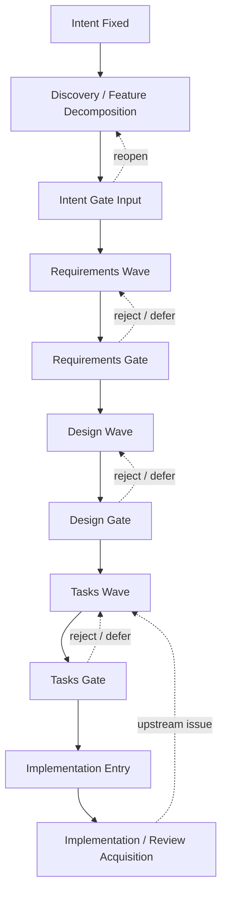

# iot-arduino workflow path

_作成: 2026-05-12_  
_status: initialized path trace v0.1_  
_purpose: `iot-arduino` retry の workflow path を事後可視化できる形で残す_

---

## 1. Workflow Path Diagram

## 2. Current Status

| field | value |
|---|---|
| current_phase | `case decision fixed / closed` |
| current_gate | `completed` |
| status | `snapshot-based supporting case fixed` |
| reopen_state | `requirements reopen closed` |
| blocker | `none` |

## 3. Gate Trace

| seq | timestamp | actor | spec phase | event | status | spec.json state | note |
|---|---|---|---|---|---|---|---|
| 1 | `2026-05-12` | `Human` | `intent` | `resume` | `completed` | `intent-fixed` | `/Users/Daily/Development/DR-IoT/intent.md` と `/Users/Daily/Development/DR-IoT/仕様.md` を source input として提示 |
| 2 | `2026-05-12` | `Codex` | `intent` | `reopen` | `completed` | `intent-fixed` | repo 内の downstream scaffold をゼロクリアし、再試行の開始点を `intent fixed` に戻した |
| 3 | `2026-05-12` | `Codex` | `intent` | `review completed` | `completed` | `intent-fixed` | intent と仕様を読み、active feature set, dependency order, open question を初回 gate input として整理した |
| 4 | `2026-05-12` | `Codex` | `intent` | `gate request` | `pending` | `intent-fixed` | requirements wave に入る前に active feature set の human decision を要請 |
| 5 | `2026-05-12` | `Human` | `intent` | `gate approved` | `completed` | `intent-fixed` | active feature set と dependency order を承認し、requirements wave への進行を許可 |
| 6 | `2026-05-12` | `Codex` | `requirements` | `draft start` | `completed` | `intent-fixed` | 6 feature の horizontal requirements wave を開始 |
| 7 | `2026-05-12` | `Codex` | `requirements` | `draft completed` | `completed` | `requirements-generated` | active feature 6 本の requirements draft と feature spec.json を作成 |
| 8 | `2026-05-12` | `Codex` | `requirements` | `local review start` | `completed` | `requirements-generated` | per-feature requirements local review を開始 |
| 9 | `2026-05-12` | `Codex` | `requirements` | `local review completed` | `completed` | `requirements-generated` | 6 feature の local review を完了し、persistence / telemetry / stop contract の曖昧さを修正 |
| 10 | `2026-05-12` | `Codex` | `requirements` | `review start` | `completed` | `requirements-generated` | active feature 6 本の requirements review wave を開始 |
| 11 | `2026-05-12` | `Codex` | `requirements` | `review completed` | `completed` | `requirements-generated` | telemetry ownership と persistence commit owner の wave-level ambiguity を修正 |
| 12 | `2026-05-12` | `Codex` | `requirements` | `alignment start` | `completed` | `requirements-generated` | requirements alignment gate を開始 |
| 13 | `2026-05-12` | `Codex` | `requirements` | `alignment completed` | `completed` | `requirements-generated` | owner boundary と handoff input を横断確認し requirements gate package を固定 |
| 14 | `2026-05-12` | `Codex` | `requirements` | `summary completed` | `completed` | `requirements-generated` | requirements evidence summary を作成 |
| 15 | `2026-05-12` | `Codex` | `requirements` | `gate request` | `pending` | `requirements-generated` | human requirements gate の decision を要請 |
| 16 | `2026-05-12` | `Human` | `requirements` | `gate deferred` | `deferred` | `requirements-generated` | 最初の 6 feature split 提案は実質 reject とされ、requirements 段として細かすぎるため loop 外と loop 内の 2 分割へ戻す修正議論が始まった |
| 17 | `2026-05-12` | `Codex` | `requirements` | `reopen` | `completed` | `requirements-generated` | active feature set を `loop-outside-control` と `watering-loop` の 2 本へ再構成するため requirements phase を reopen |
| 18 | `2026-05-12` | `Codex` | `requirements` | `draft completed` | `completed` | `requirements-generated` | 2 feature 版の requirements draft と feature spec.json を作成し、旧 6 feature draft を active set から外した |
| 19 | `2026-05-12` | `Codex` | `requirements` | `local review completed` | `completed` | `requirements-generated` | loop 外 policy、restart 境界、timeout outcome の local review を完了した |
| 20 | `2026-05-12` | `Codex` | `requirements` | `review completed` | `completed` | `requirements-generated` | wave-level で loop entry / loop outcome handoff を再確認し、2 feature split の requirements wave を閉じた |
| 21 | `2026-05-12` | `Codex` | `requirements` | `alignment completed` | `completed` | `requirements-generated` | loop 外制御と loop 内実行の owner boundary を固定した |
| 22 | `2026-05-12` | `Codex` | `requirements` | `summary completed` | `completed` | `requirements-generated` | 2 feature 版の requirements evidence summary を更新した |
| 23 | `2026-05-12` | `Codex` | `requirements` | `gate request` | `pending` | `requirements-generated` | recomposed requirements gate package で human decision を再要請 |
| 24 | `2026-05-12` | `Human` | `requirements` | `gate approved` | `completed` | `requirements-approved` | `loop-outside-control` と `watering-loop` の 2 feature split と current policy を承認した |
| 25 | `2026-05-12` | `Codex` | `design` | `draft start` | `completed` | `requirements-approved` | active feature 2 本の design wave を開始 |
| 26 | `2026-05-12` | `Codex` | `design` | `draft completed` | `completed` | `design-generated` | `loop-outside-control` と `watering-loop` の design draft と feature spec state を作成 |
| 27 | `2026-05-12` | `Codex` | `design` | `local review start` | `completed` | `design-generated` | per-feature design local review を開始 |
| 28 | `2026-05-12` | `Codex` | `design` | `local review completed` | `completed` | `design-generated` | cycle result、warning payload、loop input/output、relay-off confirmation を具体化した |
| 29 | `2026-05-12` | `Codex` | `design` | `review start` | `completed` | `design-generated` | active feature 2 本の design review wave を開始 |
| 30 | `2026-05-12` | `Codex` | `design` | `review completed` | `completed` | `design-generated` | handoff chain と thin entrypoint rule を design wording に反映した |
| 31 | `2026-05-12` | `Codex` | `design` | `alignment start` | `completed` | `design-generated` | design alignment gate を開始 |
| 32 | `2026-05-12` | `Codex` | `design` | `alignment completed` | `completed` | `design-generated` | owner boundary、dependency direction、tasks-level open point を固定した |
| 33 | `2026-05-12` | `Codex` | `design` | `summary completed` | `completed` | `design-generated` | design evidence summary を作成した |
| 34 | `2026-05-12` | `Codex` | `design` | `gate request` | `pending` | `design-generated` | human design gate の decision を要請 |
| 35 | `2026-05-12` | `Human` | `design` | `gate approved` | `completed` | `design-approved` | 2 feature split、handoff chain、thin entrypoint、file placement を承認した |
| 36 | `2026-05-12` | `Codex` | `tasks` | `draft start` | `completed` | `design-approved` | active feature 2 本の tasks wave を開始 |
| 37 | `2026-05-12` | `Codex` | `tasks` | `draft completed` | `completed` | `tasks-generated` | `loop-outside-control` と `watering-loop` の tasks draft と feature spec state を作成 |
| 38 | `2026-05-12` | `Codex` | `tasks` | `local review start` | `completed` | `tasks-generated` | per-feature tasks local review を開始 |
| 39 | `2026-05-12` | `Codex` | `tasks` | `local review completed` | `completed` | `tasks-generated` | controller integration blocker、post-run ordering、relay-off confirmation、pulse counter sequencing を具体化した |
| 40 | `2026-05-12` | `Codex` | `tasks` | `review start` | `completed` | `tasks-generated` | active feature 2 本の tasks review wave を開始 |
| 41 | `2026-05-12` | `Codex` | `tasks` | `review completed` | `completed` | `tasks-generated` | controller smoke dependency と top-level file owner timing を tasks-level reading で明示した |
| 42 | `2026-05-12` | `Codex` | `tasks` | `alignment start` | `completed` | `tasks-generated` | tasks alignment gate を開始 |
| 43 | `2026-05-12` | `Codex` | `tasks` | `alignment completed` | `completed` | `tasks-generated` | implementation order、shared file owner、test sequencing を固定した |
| 44 | `2026-05-12` | `Codex` | `tasks` | `summary completed` | `completed` | `tasks-generated` | tasks evidence summary を作成した |
| 45 | `2026-05-12` | `Codex` | `tasks` | `gate request` | `pending` | `tasks-generated` | human tasks gate の decision を要請 |
| 46 | `2026-05-12` | `Human` | `tasks` | `gate approved` | `completed` | `tasks-approved` | implementation order、shared owner、test sequencing、task 粒度を承認した |
| 47 | `2026-05-12` | `Codex` | `review acquisition` | `draft start` | `completed` | `tasks-approved` | `/Users/Daily/Development/DR-IoT/src` に implementation source tree を起こし、first snapshot boundary 固定を開始した |
| 48 | `2026-05-12` | `Codex` | `review acquisition` | `draft completed` | `completed` | `tasks-approved` | review acquisition preparation memo、implementation snapshot ref、review acquisition gate summary を作成し `ready_for_implementation = true`, `ready_for_review_acquisition = true` に更新した |
| 49 | `2026-05-12` | `Codex` | `review acquisition` | `gate request` | `pending` | `tasks-approved` | human review acquisition gate の decision を要請 |
| 50 | `2026-05-12` | `Human` | `review acquisition` | `gate approved` | `completed` | `tasks-approved` | current snapshot boundary を review acquisition の first cut として承認した |
| 51 | `2026-05-12` | `Codex` | `review acquisition` | `acquisition completed` | `completed` | `tasks-approved` | `F3-iot-arduino` batch を実行し、`single / dual / dual+judgment` の 3 treatment を取得した |
| 52 | `2026-05-12` | `Codex` | `review acquisition` | `summary completed` | `completed` | `tasks-approved` | review acquisition summary と `comparison_summary.json` を current state に接続した |
| 53 | `2026-05-12` | `Codex` | `paper evidence` | `summary completed` | `completed` | `tasks-approved` | `C-4 iot-arduino` evidence bundle を作成し、case manifest と core case note に接続した |
| 54 | `2026-05-12` | `Codex` | `implementation refinement` | `review memo completed` | `completed` | `tasks-approved` | canonical dual+judgment run の finding を implementation review note に固定した |
| 55 | `2026-05-12` | `Codex` | `implementation refinement` | `planning completed` | `completed` | `tasks-approved` | downstream rework log と refinement plan を作成し、second snapshot entry 条件を固定した |
| 56 | `2026-05-12` | `Codex` | `implementation refinement` | `code refinement completed` | `completed` | `tasks-approved` | `restart boundary / relay fail-safe / telemetry warning` の implementation-local seam を second snapshot に反映した |
| 57 | `2026-05-12` | `Codex` | `review acquisition` | `second snapshot fixed` | `completed` | `tasks-approved` | second snapshot note と r2 case manifest / batch runner を追加した |
| 58 | `2026-05-12` | `Codex` | `review acquisition` | `second acquisition completed` | `completed` | `tasks-approved` | `F3-iot-arduino-r2` batch を実行し、refined snapshot の `single / dual / dual+judgment` を取得した |
| 59 | `2026-05-12` | `Codex` | `implementation refinement` | `comparison summary completed` | `completed` | `tasks-approved` | implementation evidence summary と r2 implementation review note / rework log を更新し、counts unchanged を固定した |
| 60 | `2026-05-12` | `Codex` | `case closure` | `decision completed` | `completed` | `tasks-approved` | `iot-arduino` を snapshot-based supporting case として閉じる判断を文書化した |

## 4. Next Step

1. current boundary での `iot-arduino` acquisition は closed とみなす
2. hardware-ready 実装へ進む場合は、新しい implementation boundary として別 cycle を切る
3. paper では supporting case としてのみ使う
