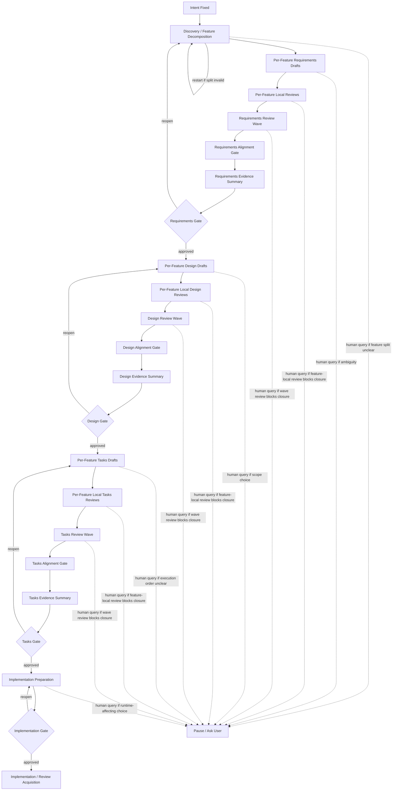

# heat3d workflow path

_作成: 2026-05-11_  
_status: initialized path trace v0.1_  
_purpose: `heat3d` gate-only trial の workflow path を事後可視化できる形で残す_

---

## 1. Workflow Path Diagram

この図は restart 後の `heat3d` multi-feature scenario を表す。

## 2. Current Status

| field | value |
|---|---|
| current_phase | `post-report comparison planning` |
| current_gate | `completed` |
| status | `remaining track first batch completed` |
| reopen_state | `requirements reopen closed` |
| blocker | `none` |

## 3. Gate Trace

| seq | timestamp | actor | spec phase | event | status | spec.json state | note |
|---|---|---|---|---|---|---|---|
| 1 | `2026-05-11` | `Codex` | `intent` | fixed input confirmed | `completed` | `intent-fixed` | `intent.md` と canonical source を heat3d trial input に固定 |
| 2 | `2026-05-11` | `Codex` | `requirements` | `draft start` | `completed` | `intent-fixed` | canonical source と intent を再読して requirements 起草を開始 |
| 3 | `2026-05-11` | `Codex` | `requirements` | `draft completed` | `completed` | `requirements-generated` | `requirements.md` 初稿を作成し `spec.json` を更新 |
| 4 | `2026-05-11` | `Codex` | `requirements` | `gate request` | `pending` | `requirements-generated` | requirements gate の human decision を要請 |
| 5 | `2026-05-11` | `Codex` | `requirements` | `pause query` | `pending` | `requirements-generated` | cc-sdd 上の feature decomposition が不足している可能性があり停止 |
| 6 | `2026-05-11` | `Human` | `requirements` | `resume` | `completed` | `requirements-generated` | feature decomposition に戻す方針を選択 |
| 7 | `2026-05-11` | `Codex` | `requirements` | `draft start` | `completed` | `requirements-generated` | discovery artifact として `brief.md` / `research.md` の起草を開始 |
| 8 | `2026-05-11` | `Human` | `intent` | `reopen` | `completed` | `intent-fixed` | 最初からの restart を指示、旧 requirements draft を無効化 |
| 9 | `2026-05-11` | `Codex` | `intent` | `resume` | `completed` | `intent-fixed` | discovery checkpoint から再開 |
| 10 | `2026-05-11` | `Codex` | `intent` | `draft completed` | `completed` | `intent-fixed` | active feature spec (`heat3d-foundation`, `heat3d-linear-solver`, `heat3d-case-model`, `heat3d-main`) を起票 |
| 11 | `2026-05-11` | `Codex` | `requirements` | `draft start` | `completed` | `intent-fixed` | `heat3d-foundation` requirements draft を開始 |
| 12 | `2026-05-11` | `Codex` | `requirements` | `draft completed` | `completed` | `requirements-generated` | `heat3d-foundation/requirements.md` を作成し spec.json を更新 |
| 13 | `2026-05-11` | `Codex` | `requirements` | `reopen` | `completed` | `requirements-generated` | `phase-field` 側の multi-feature lesson に照らすと、1 feature だけで gate へ進む手順は不適切と判明 |
| 14 | `2026-05-11` | `Codex` | `requirements` | `resume` | `completed` | `requirements-generated` | current step を `foundation local review -> remaining feature drafts -> local reviews -> requirements review wave` に修正 |
| 15 | `2026-05-11` | `Codex` | `requirements` | `local review start` | `completed` | `requirements-generated` | `heat3d-foundation` requirements local review を開始 |
| 16 | `2026-05-11` | `Codex` | `requirements` | `local review completed` | `completed` | `requirements-generated` | `heat3d-foundation` で `ΔZ`, `z_range`, `resin fill` の曖昧性を修正し local review を閉じた |
| 17 | `2026-05-11` | `Codex` | `requirements` | `draft start` | `completed` | `intent-fixed` | `heat3d-linear-solver` requirements draft を開始 |
| 18 | `2026-05-11` | `Codex` | `requirements` | `draft completed` | `completed` | `requirements-generated` | `heat3d-linear-solver/requirements.md` を作成し spec.json を更新 |
| 19 | `2026-05-11` | `Codex` | `requirements` | `local review start` | `completed` | `requirements-generated` | `heat3d-linear-solver` requirements local review を開始 |
| 20 | `2026-05-11` | `Codex` | `requirements` | `local review completed` | `completed` | `requirements-generated` | `heat3d-linear-solver` local review を finding なしで完了 |
| 21 | `2026-05-11` | `Codex` | `requirements` | `draft start` | `completed` | `intent-fixed` | `heat3d-case-model` requirements draft を開始 |
| 22 | `2026-05-11` | `Codex` | `requirements` | `draft completed` | `completed` | `requirements-generated` | `heat3d-case-model/requirements.md` を作成し spec.json を更新 |
| 23 | `2026-05-11` | `Codex` | `requirements` | `local review start` | `completed` | `requirements-generated` | `heat3d-case-model` requirements local review を開始 |
| 24 | `2026-05-11` | `Codex` | `requirements` | `local review completed` | `completed` | `requirements-generated` | `heat3d-case-model` local review を finding なしで完了 |
| 25 | `2026-05-11` | `Codex` | `requirements` | `draft start` | `completed` | `intent-fixed` | `heat3d-main` requirements draft を開始 |
| 26 | `2026-05-11` | `Codex` | `requirements` | `draft completed` | `completed` | `requirements-generated` | `heat3d-main/requirements.md` を作成し spec.json を更新 |
| 27 | `2026-05-11` | `Codex` | `requirements` | `local review start` | `completed` | `requirements-generated` | `heat3d-main` requirements local review を開始 |
| 28 | `2026-05-11` | `Codex` | `requirements` | `local review completed` | `completed` | `requirements-generated` | `heat3d-main` local review を finding なしで完了し、requirements review wave 待ちに移行 |
| 29 | `2026-05-11` | `Codex` | `requirements` | `review start` | `completed` | `requirements-generated` | active feature 4 本の horizontal requirements review wave を開始 |
| 30 | `2026-05-11` | `Codex` | `requirements` | `review completed` | `completed` | `requirements-generated` | solver entry contract と canonical config ownership に関する 2 finding を修正して wave を完了 |
| 31 | `2026-05-11` | `Codex` | `requirements` | `alignment start` | `completed` | `requirements-generated` | requirements alignment gate を開始 |
| 32 | `2026-05-11` | `Codex` | `requirements` | `alignment completed` | `completed` | `requirements-generated` | owner boundary と handoff input の整合を確認し requirements gate 入力を固定 |
| 33 | `2026-05-11` | `Codex` | `requirements` | `summary completed` | `completed` | `requirements-generated` | requirements gate package 用の evidence summary を作成 |
| 34 | `2026-05-11` | `Codex` | `requirements` | `gate request` | `pending` | `requirements-generated` | human requirements gate の decision を要請 |
| 35 | `2026-05-11` | `Human` | `requirements` | `gate deferred` | `deferred` | `requirements-generated` | requirements 文書が平易でなく、意味を取りにくいという指摘が入った |
| 36 | `2026-05-11` | `Codex` | `requirements` | `reopen` | `completed` | `requirements-generated` | readability 問題を blocking issue として requirements phase を reopen |
| 37 | `2026-05-11` | `Codex` | `requirements` | `review completed` | `completed` | `requirements-generated` | feature 4 本の requirements を平易な日本語へ書き直し readability recheck を完了 |
| 38 | `2026-05-11` | `Codex` | `requirements` | `alignment start` | `completed` | `requirements-generated` | wording rewrite 後の requirements alignment recheck を開始 |
| 39 | `2026-05-11` | `Codex` | `requirements` | `alignment completed` | `completed` | `requirements-generated` | readability rewrite 後も owner boundary と handoff input に変化がないことを確認 |
| 40 | `2026-05-11` | `Codex` | `requirements` | `summary completed` | `completed` | `requirements-generated` | requirements evidence summary を recheck 結果込みで更新 |
| 41 | `2026-05-11` | `Codex` | `requirements` | `gate request` | `pending` | `requirements-generated` | readability recheck 後の human requirements gate decision を再要請 |
| 42 | `2026-05-11` | `Human` | `requirements` | `gate approved` | `completed` | `requirements-approved` | readable gate package を確認し requirements gate を承認 |
| 43 | `2026-05-11` | `Codex` | `design` | `draft start` | `completed` | `requirements-approved` | active feature 4 本の per-feature design draft を dependency order で開始 |
| 44 | `2026-05-11` | `Codex` | `design` | `draft completed` | `completed` | `design-generated` | `heat3d-foundation`, `heat3d-linear-solver`, `heat3d-case-model`, `heat3d-main` の `design.md` 初稿を作成し spec.json を更新 |
| 45 | `2026-05-11` | `Codex` | `design` | `local review start` | `completed` | `design-generated` | active feature 4 本の per-feature local design review を dependency order で開始 |
| 46 | `2026-05-11` | `Codex` | `design` | `local review completed` | `completed` | `design-generated` | result ownership, runtime field ownership, runtime mask initialization を修正し local design review を完了 |
| 47 | `2026-05-11` | `Codex` | `design` | `review start` | `completed` | `design-generated` | active feature 4 本の horizontal design review wave を開始 |
| 48 | `2026-05-11` | `Codex` | `design` | `review completed` | `completed` | `design-generated` | boundary payload contract, top-level return contract, workspace struct definitionに関する 3 finding を修正して wave を完了 |
| 49 | `2026-05-11` | `Codex` | `design` | `alignment start` | `completed` | `design-generated` | design alignment gate を開始 |
| 50 | `2026-05-11` | `Codex` | `design` | `alignment completed` | `completed` | `design-generated` | owner boundary と handoff object shape の整合を確認し design gate 入力を固定 |
| 51 | `2026-05-11` | `Codex` | `design` | `summary completed` | `completed` | `design-generated` | design gate package 用の evidence summary を作成 |
| 52 | `2026-05-11` | `Codex` | `design` | `gate request` | `pending` | `design-generated` | human design gate の decision を要請 |
| 53 | `2026-05-11` | `Human` | `design` | `gate approved` | `completed` | `design-approved` | design gate package を確認し design gate を承認 |
| 54 | `2026-05-11` | `Codex` | `tasks` | `draft start` | `completed` | `design-approved` | active feature 4 本の per-feature tasks draft を dependency order で開始 |
| 55 | `2026-05-11` | `Codex` | `tasks` | `draft completed` | `completed` | `tasks-generated` | `heat3d-foundation`, `heat3d-linear-solver`, `heat3d-case-model`, `heat3d-main` の `tasks.md` 初稿を作成し spec.json を更新 |
| 56 | `2026-05-11` | `Codex` | `tasks` | `local review start` | `completed` | `tasks-generated` | active feature 4 本の per-feature local tasks review を dependency order で開始 |
| 57 | `2026-05-11` | `Codex` | `tasks` | `local review completed` | `completed` | `tasks-generated` | root file owner, foundation dependency, FieldBuffers allocator, end-to-end blocker を修正して local tasks review を完了 |
| 58 | `2026-05-11` | `Codex` | `tasks` | `review start` | `completed` | `tasks-generated` | active feature 4 本の horizontal tasks review wave を開始 |
| 59 | `2026-05-11` | `Codex` | `tasks` | `review completed` | `completed` | `tasks-generated` | solver workspace lifecycle と FieldBuffers unpack rule に関する 2 finding を修正して wave を完了 |
| 60 | `2026-05-11` | `Codex` | `tasks` | `alignment start` | `completed` | `tasks-generated` | tasks alignment gate を開始 |
| 61 | `2026-05-11` | `Codex` | `tasks` | `alignment completed` | `completed` | `tasks-generated` | implementation order, shared artifact owner, test sequencing の整合を確認 |
| 62 | `2026-05-11` | `Codex` | `tasks` | `summary completed` | `completed` | `tasks-generated` | tasks gate package 用の evidence summary を作成 |
| 63 | `2026-05-11` | `Codex` | `tasks` | `gate request` | `pending` | `tasks-generated` | human tasks gate の decision を要請 |
| 64 | `2026-05-11` | `Human` | `tasks` | `gate approved` | `completed` | `tasks-approved` | tasks gate package を確認し tasks gate を承認 |
| 65 | `2026-05-11` | `Codex` | `review acquisition` | `draft start` | `completed` | `tasks-approved` | review acquisition preparation と review boundary の固定を開始 |
| 66 | `2026-05-11` | `Codex` | `review acquisition` | `draft completed` | `completed` | `tasks-approved` | review acquisition preparation memo と review acquisition gate summary を作成し `ready_for_review_acquisition = true` に更新 |
| 67 | `2026-05-11` | `Codex` | `review acquisition` | `gate request` | `pending` | `tasks-approved` | human review acquisition gate の decision を要請 |
| 68 | `2026-05-11` | `Human` | `review acquisition` | `gate approved` | `completed` | `tasks-approved` | review acquisition gate package を確認し review acquisition gate を承認 |
| 69 | `2026-05-11` | `Codex` | `review acquisition` | `acquisition start` | `completed` | `tasks-approved` | gate-approved upstream bundle に runner/manifest を載せ替え、review acquisition batch を開始 |
| 70 | `2026-05-11` | `Codex` | `review acquisition` | `acquisition completed` | `completed` | `tasks-approved` | `single / dual / dual+judgment` を再取得し、comparison summary を更新 |
| 71 | `2026-05-11` | `Codex` | `review acquisition` | `summary completed` | `completed` | `tasks-approved` | `phase-field` baseline と `heat3d` rerun の比較 note を作成 |
| 72 | `2026-05-11` | `Codex` | `review acquisition` | `summary completed` | `completed` | `tasks-approved` | `C-3 heat3d` evidence bundle を作成 |
| 73 | `2026-05-11` | `Codex` | `implementation` | `draft start` | `completed` | `implementation-completed` | `/Users/Daily/Development/DR-heat3d` で actual coding を開始 |
| 74 | `2026-05-11` | `Codex` | `implementation` | `review completed` | `completed` | `implementation-completed` | implementation local blocking issue 3 件を coding layer 内で解消 |
| 75 | `2026-05-11` | `Codex` | `implementation` | `alignment completed` | `completed` | `implementation-completed` | upstream requirements/design/tasks への reopen が不要であることを確認 |
| 76 | `2026-05-11` | `Codex` | `implementation` | `summary completed` | `completed` | `implementation-completed` | implementation evidence summary と execution note を追加 |
| 77 | `2026-05-11` | `Codex` | `case fixation` | `summary completed` | `completed` | `implementation-completed` | `heat3d` を fixed core case / preserved v3 evaluation case とする判断を文書化 |
| 78 | `2026-05-11` | `Codex` | `report drafting` | `summary completed` | `completed` | `implementation-completed` | main paper 用の `heat3d` observation note を追加 |
| 79 | `2026-05-11` | `Codex` | `report drafting` | `summary completed` | `completed` | `implementation-completed` | preliminary report と paper plan に `heat3d` observation を統合し、next step を claim section drafting に更新 |
| 80 | `2026-05-11` | `Codex` | `claim section drafting` | `summary completed` | `completed` | `implementation-completed` | `core-case-heat3d` と `heat3d-c3-evidence-bundle` に `Claim 2 / 3 / 4` 向けの supporting text を追加 |
| 81 | `2026-05-11` | `Codex` | `claim section drafting` | `summary completed` | `completed` | `implementation-completed` | `phase-field` と `heat3d` を並べた `Claim 2 / 3 / 4` 用の cross-case synthesis note を追加 |
| 82 | `2026-05-11` | `Codex` | `claim text finalization` | `summary completed` | `completed` | `implementation-completed` | `dual-reviewer-spec-driven-paper-plan.md` の `Claim 2 / 3 / 4` に cross-case paragraph candidate を追加 |
| 83 | `2026-05-11` | `Codex` | `claim text finalization` | `summary completed` | `completed` | `implementation-completed` | `dual-reviewer-spec-driven-preliminary-report.md` の `Claim 2 / 3 / 4` を cross-case prose に更新 |
| 84 | `2026-05-11` | `Codex` | `claim text finalization` | `summary completed` | `completed` | `implementation-completed` | `13.4` を main evidence の admission gate にしない判断を固定し、validation boundary 関連文書を更新 |
| 85 | `2026-05-11` | `Codex` | `claim text finalization` | `summary completed` | `completed` | `implementation-completed` | preliminary report を claim prose の canonical source、paper plan を planning source とする役割分担を固定 |
| 86 | `2026-05-11` | `Codex` | `claim text finalization` | `summary completed` | `completed` | `implementation-completed` | `Intent / Spec / Implementation` を 1 本の story に圧縮した cross-track narrative note を追加 |
| 87 | `2026-05-11` | `Codex` | `claim text finalization` | `summary completed` | `completed` | `implementation-completed` | preliminary report の Main Evaluation Tracks に cross-track continuity paragraph を追加 |
| 88 | `2026-05-11` | `Codex` | `claim text finalization` | `summary completed` | `completed` | `implementation-completed` | preliminary report の Executive Summary に cross-track story と `heat3d` bridge-case reading を追加 |
| 89 | `2026-05-11` | `Codex` | `claim text finalization` | `summary completed` | `completed` | `implementation-completed` | preliminary report の Threats to Validity に `heat3d` interpretation boundary を追加 |
| 90 | `2026-05-11` | `Codex` | `claim text finalization` | `summary completed` | `completed` | `implementation-completed` | `Intent / Spec` の未取得分を 3-track story の narrative gap として定義する bridge note を追加 |
| 91 | `2026-05-11` | `Codex` | `claim text finalization` | `summary completed` | `completed` | `implementation-completed` | `Intent Track / Spec Track / first-run` 計画文書に narrative role を反映し、残り acquisition を実行準備へ戻した |
| 92 | `2026-05-11` | `Codex` | `claim text finalization` | `summary completed` | `completed` | `implementation-completed` | `Intent Track / Spec Track` の concrete execution prep と stop point を 1 枚に固定 |
| 93 | `2026-05-11` | `Codex` | `remaining track acquisition` | `summary completed` | `completed` | `implementation-completed` | exact input ref, `tasks` entry scope, fresh batch placement を execution prep 上で固定した |
| 94 | `2026-05-11` | `Codex` | `remaining track acquisition` | `acquisition completed` | `completed` | `implementation-completed` | `F1-intent-dual-reviewer-rebuild-narrative` と `F1-spec-phase-field-reverse-spec-narrative` の fresh first batch を実行した |
| 95 | `2026-05-11` | `Codex` | `remaining track acquisition` | `summary completed` | `completed` | `implementation-completed` | `remaining-track-first-batch-acquisition-summary.md` を作成し、old pilot と fresh batch の provenance を分離した |
| 96 | `2026-05-11` | `Codex` | `remaining track acquisition integration` | `summary completed` | `completed` | `implementation-completed` | preliminary report, bridge note, cross-track narrative note を fresh batch 取得済み前提に更新した |
| 97 | `2026-05-11` | `Codex` | `claim prose synchronization` | `summary completed` | `completed` | `implementation-completed` | paper plan, case manifest, claim synthesis note を fresh batch 取得済み前提に同期した |
| 98 | `2026-05-11` | `Codex` | `claim prose synchronization` | `summary completed` | `completed` | `implementation-completed` | `first-batch level` 限定と `v3` delegation の caveat placement を report / note 間で同期した |
| 99 | `2026-05-11` | `Codex` | `report editorial consolidation` | `summary completed` | `completed` | `implementation-completed` | preliminary report の古い TODO を整理し、plan / synthesis / observation note の editorial redundancy を圧縮した |

## 4. Update Rule

次のたびにこの文書を更新する。

1. phase draft を開始したとき
2. gate を human approval 待ちにしたとき
3. gate が approve / reject / defer されたとき
4. reopen が発生したとき
5. 人間問い合わせで停止したとき

append rule:

- 既存行を上書きせず、event を追記する
- `spec.json` の現在値と矛盾する event を先に書かない
- timestamp は absolute date を使う
- 未来の event を placeholder 行として先書きしない

event taxonomy:

- `draft start`
- `draft completed`
- `local review start`
- `local review completed`
- `review start`
- `review completed`
- `alignment start`
- `alignment completed`
- `summary completed`
- `gate request`
- `gate approved`
- `gate rejected`
- `gate deferred`
- `acquisition start`
- `acquisition completed`
- `reopen`
- `pause query`
- `resume`

next row template:

| seq | timestamp | actor | spec phase | event | status | spec.json state | note |
|---|---|---|---|---|---|---|---|
| `<next>` | `YYYY-MM-DD` | `Codex or Human` | `<phase>` | `<event taxonomy value>` | `pending|completed|reopened|deferred` | `<current spec.json phase>` | `<short operational note>` |

## 5. Pause / Reopen Log

| timestamp | spec phase | event | reason | action needed |
|---|---|---|---|---|
| `2026-05-11` | `requirements` | `pause query` | `main / case model / visualization / linear solver` などへの feature 分解を先に行うべき可能性がある | `single-feature のまま進めるか、kiro-discovery 相当の feature decomposition に戻すかを人間が決定` |
| `2026-05-11` | `requirements` | `resume` | `user が feature decomposition へ戻す方針を選択` | `discovery artifact を作成し、feature set と dependency order を固定する` |
| `2026-05-11` | `intent` | `reopen` | `最初からやり直し、discovery checkpoint が実際に発火するかを確認する必要がある` | `spec state を intent-fixed 相当に戻し、fresh requirements wave の前提を再構成する` |
| `2026-05-11` | `requirements` | `reopen` | `review wave を飛ばして gate request を出したため workflow 逸脱` | `review-before-gate rule を明文化し、gate request を取り消して requirements local review と requirements wave に戻す` |
| `2026-05-11` | `intent` | `resume` | `restart 後の discovery checkpoint で active feature spec を起票` | `heat3d-foundation requirements wave へ進める入口が整った` |
| `2026-05-11` | `requirements` | `reopen` | `phase-field` 由来の multi-feature lesson を current sequence に十分写せておらず、foundation 単独 review を phase-level review と誤認しかけた` | `per-feature local review を揃えた後に requirements review wave と alignment gate を行う sequence に戻す` |
