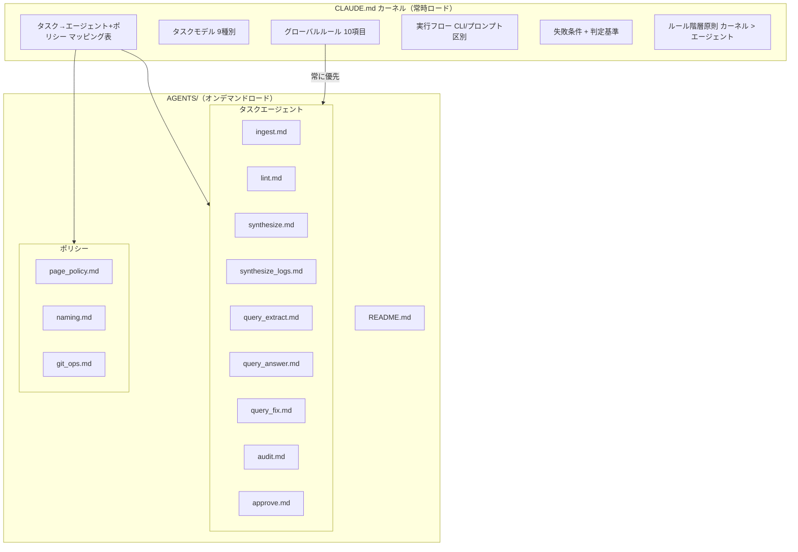
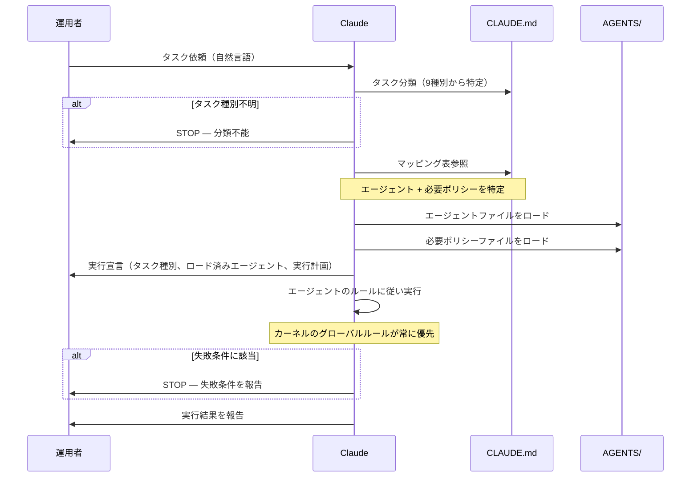
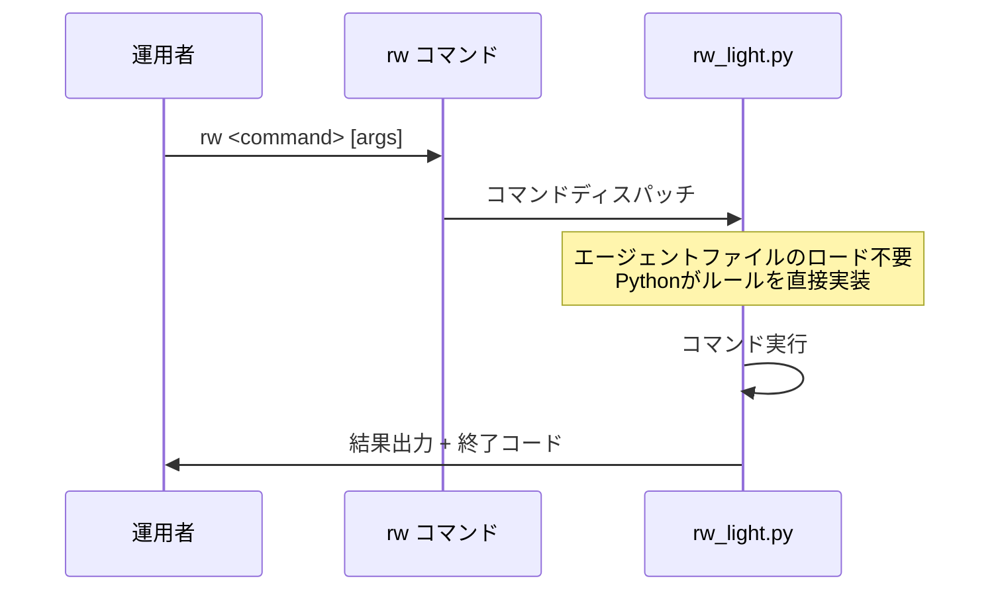

# Design Document: agents-system

## Overview

**Purpose**: CLAUDE.mdカーネルの肥大化を防ぎつつ、Claudeがタスク実行時に適切なルールをオンデマンドで読み込めるAGENTS/サブプロンプト体系を構築する。仕様案の9タスク種別に対応する9エージェントファイル、3ポリシーファイル、およびカーネル更新を `templates/` に配置する。

**Users**: Rwiki運用者がClaude CLIを通じてWiki運用タスクを実行する際、タスク種別に応じたエージェントが自動的に特定され、必要なルールのみがロードされる。

**Impact**: `templates/CLAUDE.md` にエージェントロード手順とマッピング表を追記し、`templates/AGENTS/` に13ファイル（9エージェント + 3ポリシー + README）を新設する。

### Goals
- 9タスク種別に対応するエージェントファイルを `templates/AGENTS/` に正式配置
- 3ポリシーファイル（page_policy, naming, git_ops）を独立ファイルとして配置
- CLAUDE.mdカーネルに実行フロー・マッピング表・ルール階層を追記
- エージェント追加手順を文書化し、将来の拡張に対応
- docs/user-guide.md 初版を作成

### Non-Goals
- CLIコマンドの実装変更（cli-query、cli-auditスペック）
- テスト体系の構築（test-suiteスペック）
- Obsidian Vault設定
- docs/ 素案の削除（歴史的参考として残す）

## Boundary Commitments

### This Spec Owns

**開発リポジトリ成果物**（Rwiki-dev に配置）:
- `templates/AGENTS/` 配下の全13ファイル（9エージェント + 3ポリシー + README.md）
- `templates/CLAUDE.md` のエージェント関連セクション更新
- `docs/user-guide.md` 初版
- `CHANGELOG.md` のagents-systemエントリ

### Out of Boundary
- `scripts/rw_light.py` の変更（CLI実装はスコープ外）
- テスト
- `templates/CLAUDE.md` のグローバルルールセクション（保全対象。変更ではなく保護）
- docs/ 配下の素案ファイル（参照するが変更・削除しない）

### Allowed Dependencies
- `docs/` 配下の素案ファイル（エージェントファイルのソースとして参照）
- `docs/Rwiki仕様案.md`（整合性確認の参照先）
- `templates/CLAUDE.md`（更新対象）
- project-foundation の `rw init`（templates/AGENTS/ をVaultにコピーする機能）

### Revalidation Triggers
- タスク種別の追加・変更（全エージェントファイルのマッピング表に影響）
- CLAUDE.mdカーネルのグローバルルール変更（エージェントファイルとの整合性に影響）
- cli-audit / cli-query の実装時（エージェント定義との整合性確認が必要）

## Architecture

### Existing Architecture Analysis

templates/CLAUDE.md の現行構造:

| セクション | 行数 | 内容 |
|-----------|------|------|
| Core Principles | L1-75 | レイヤー分離、知識フロー、6グローバルルール |
| Task Model | L77-118 | 9タスク種別、選択ルール、曖昧性ルール |
| Agent Loading Rule | L120-127 | ロード原則（概要のみ） |
| Task → AGENTS Mapping | L130-140 | 1:1マッピング表 |
| Execution Model | L144-173 | 実行宣言、マルチステップルール |
| Audit Rule | L176-183 | 監査の読み取り専用原則 |
| Failure Conditions | L186-197 | 7つの停止条件 |
| Final Principle | L200-207 | 設計原則 |

### Architecture Pattern

二層プロンプトアーキテクチャ:



### Technology Stack

| Layer | Choice | Role in Feature | Notes |
|-------|--------|-----------------|-------|
| プロンプト基盤 | Markdown | エージェント・ポリシー定義 | 外部ツール不使用 |
| カーネル | templates/CLAUDE.md | グローバルルール・マッピング | 既存ファイルを更新 |
| デプロイ | rw init (copytree) | Vault へのAGENTS/配置 | project-foundation 実装済み |
| ドキュメント | Markdown | README.md, user-guide.md | 標準的なドキュメント形式 |

## File Structure Plan

### Directory Structure
```
templates/
├── CLAUDE.md                    # Modified: 実行フロー・マッピング表・階層原則を追記
└── AGENTS/
    ├── README.md                # New: エージェント体系概要・追加手順
    ├── ingest.md                # New: ingestエージェント
    ├── lint.md                  # New: lintエージェント
    ├── synthesize.md            # New: synthesizeエージェント
    ├── synthesize_logs.md       # New: synthesize_logsエージェント
    ├── query_extract.md          # New: query_extractエージェント
    ├── query_answer.md          # New: query_answerエージェント
    ├── query_fix.md             # New: query_fixエージェント
    ├── audit.md                 # New: auditエージェント
    ├── approve.md               # New: approveエージェント
    ├── page_policy.md           # New: ページ種別ポリシー
    ├── naming.md                # New: 命名規則ポリシー
    └── git_ops.md               # New: Git操作ポリシー
docs/
└── user-guide.md                # New: 運用ガイド初版
CHANGELOG.md                     # Modified: agents-systemエントリ追記
```

### Modified Files
- `templates/CLAUDE.md` — Agent Loading Rule セクション拡充、マッピング表更新、実行フロー追記、ルール階層原則追記
- `CHANGELOG.md` — agents-system 成果物の記録追加

### New Files
- `templates/AGENTS/*.md` — 9エージェント + 3ポリシー + README.md（計13ファイル）
- `docs/user-guide.md` — 運用サイクル、CLIリファレンス、プロンプト実行手順

## System Flows

### プロンプトレベル実行フロー



### CLI実行フロー



## Requirements Traceability

| Requirement | Summary | Components | Flows |
|-------------|---------|------------|-------|
| 1.1 | 9エージェントファイル配置 | templates/AGENTS/ 9ファイル | — |
| 1.2 | 素案ベース・整合性確保 | 全エージェントファイル | — |
| 1.3 | 他エージェント非依存 | エージェントファイル共通構造 | — |
| 1.4 | 拡張可能な構造 | README.md 追加手順セクション、CLAUDE.md 拡張ルール | — |
| 1.5 | 命名方針確定 | README.md マッピング説明 | — |
| 1.6 | audit 4ティア | audit.md | — |
| 2.1 | 共通構造8要素 | エージェントファイルテンプレート | — |
| 2.2 | レイヤー境界制約 | 各エージェントファイルの入出力定義 | — |
| 2.3 | 出力形式・コミットルール | 各エージェントファイル | — |
| 2.4 | 失敗条件 | 各エージェントファイル | — |
| 2.5 | 肥大化時の分割 | 300行閾値ガイドライン | — |
| 3.1 | ロードルール | CLAUDE.md Agent Loading Rule | プロンプト実行フロー |
| 3.2 | マッピング表 | CLAUDE.md Task→AGENTS Mapping | プロンプト実行フロー |
| 3.3 | タスクルール委譲 | CLAUDE.md + AGENTS/ 分離 | — |
| 3.4 | 既存ルール保全 | CLAUDE.md グローバルルール10項目 | — |
| 3.5 | 実行順序指示 | CLAUDE.md Execution Flow | プロンプト実行フロー |
| 3.6 | CLI/プロンプト区別 | CLAUDE.md Execution Mode | 両フロー |
| 3.7 | ロード具体手順 | CLAUDE.md Agent Loading Procedure | プロンプト実行フロー |
| 3.8 | 失敗条件判定基準 | CLAUDE.md Failure Conditions | — |
| 3.9 | 拡張ルール | CLAUDE.md Extension Guide | — |
| 3.10 | ルール階層原則 | CLAUDE.md Rule Hierarchy | — |
| 4.1 | 3ポリシー配置 | AGENTS/page_policy.md, naming.md, git_ops.md | — |
| 4.2 | 素案ベース | 各ポリシーファイル | — |
| 4.3 | 参照可能な形式 | AGENTS/ 独立ファイル + マッピング表 | — |
| 4.4 | カーネル統合時の網羅 | N/A（独立ファイル方式を採用） | — |
| 4.5 | タスク×ポリシーマッピング | CLAUDE.md マッピング表（ポリシー列）| — |
| 4.6 | 埋め込み時の整合性 | N/A（独立ファイル方式を採用） | — |
| 5.1 | README概要 | AGENTS/README.md | — |
| 5.2 | ファイル一覧 | AGENTS/README.md | — |
| 5.3 | ポリシー位置づけ | AGENTS/README.md | — |
| 5.4 | 追加手順 | AGENTS/README.md | — |
| 6.1 | 運用サイクル | docs/user-guide.md | — |
| 6.2 | CLIリファレンス | docs/user-guide.md | CLI実行フロー |
| 6.3 | プロンプト実行方法 | docs/user-guide.md | プロンプト実行フロー |
| 6.4 | Vault更新手順 | docs/user-guide.md | — |
| 7.1 | CHANGELOG追記 | CHANGELOG.md | — |

## Components and Interfaces

| Component | Layer | Intent | Req Coverage | Key Dependencies |
|-----------|-------|--------|--------------|------------------|
| 9タスクエージェントファイル | AGENTS/ | 各タスク種別の実行ルール・制約を定義 | 1.1-1.6 | docs/ 素案, エージェントファイルテンプレート |
| エージェントファイルテンプレート | Template | 9エージェントの共通構造を定義 | 2.1-2.5 | docs/ 素案 |
| CLAUDE.md カーネル更新 | Kernel | 実行フロー・マッピング・階層原則を追記 | 3.1-3.10 | 既存CLAUDE.md |
| ポリシーファイル | Policy | タスク横断的なルールを独立管理 | 4.1-4.6 | docs/ 素案 |
| AGENTS/README.md | Document | エージェント体系の概要・追加手順 | 5.1-5.4 | 全AGENTS/ファイル |
| docs/user-guide.md | Document | 運用ガイド初版 | 6.1-6.4 | CLAUDE.md, AGENTS/, rw_light.py |
| CHANGELOG.md | Document | 変更履歴追記 | 7.1 | — |

### エージェントファイルテンプレート

各エージェントファイルは以下の共通構造に従う:

```markdown
# {タスク名}

## Purpose
{タスクの目的を1-2文で記述}

## Execution Mode
{CLI / Prompt-level / Hybrid}

## Prerequisites
{実行前に完了しているべき先行タスクやコミット状態}

## Input
- **読み取り元**: {レイヤー/ディレクトリ}
- **読み取り許可**: {許可されるレイヤー一覧}
- **読み取り禁止**: {禁止されるレイヤー（該当する場合）}

## Output
- **書き込み先**: {レイヤー/ディレクトリ}
- **書き込み許可**: {許可されるレイヤー一覧}
- **書き込み禁止**: {禁止されるレイヤー一覧}
- **出力形式**: {ファイル形式、frontmatter要件等}
- **コミットルール**: {コミット分離規則（該当する場合）}

## Processing Rules
{タスク固有の処理ルール。以下のガイドラインに従って記述する:
- ステップ式プロセスがある場合（例: query の5ステップ）は番号付きリストで記述し、各ステップにサブセクション（### Step N: ...）を設ける
- ルール一覧形式の場合（例: lint の検証項目）は箇条書きで記述する
- 両方を含む場合はルール一覧を先に、ステップ式プロセスを後に配置する}

## Prohibited Actions
{禁止事項の一覧}

## Failure Conditions
{処理を中断すべき状況の一覧}
```

### CLAUDE.md カーネル更新

以下のセクションを追記・更新する:

#### Task → AGENTS Mapping（更新）

現行のマッピング表を拡張し、必要ポリシーと実行モードを追加:

```markdown
# Task → AGENTS Mapping

| タスク種別 | エージェント | ポリシー | 実行モード |
|-----------|------------|---------|-----------|
| ingest | AGENTS/ingest.md | AGENTS/git_ops.md | CLI |
| lint | AGENTS/lint.md | AGENTS/naming.md | CLI |
| synthesize | AGENTS/synthesize.md | AGENTS/page_policy.md, AGENTS/naming.md | Prompt |
| synthesize_logs | AGENTS/synthesize_logs.md | AGENTS/naming.md | CLI (Hybrid) |
| approve | AGENTS/approve.md | AGENTS/git_ops.md, AGENTS/page_policy.md | CLI |
| query_answer | AGENTS/query_answer.md | AGENTS/page_policy.md | Prompt |
| query_extract | AGENTS/query_extract.md | AGENTS/naming.md, AGENTS/page_policy.md | Prompt |
| query_fix | AGENTS/query_fix.md | AGENTS/naming.md | Prompt |
| audit | AGENTS/audit.md | AGENTS/page_policy.md, AGENTS/naming.md, AGENTS/git_ops.md | Prompt |
```

#### Execution Flow（新規）

```markdown
# Execution Flow

## Prompt-Level Execution（プロンプトレベル実行）

1. **タスク分類**: ユーザの依頼を9タスク種別のいずれかに分類する
2. **エージェント特定**: マッピング表から対応するエージェントと必要ポリシーを特定する
3. **エージェントロード**: 特定されたエージェントファイルとポリシーファイルを読み込む
4. **実行宣言**: タスク種別、ロード済みエージェント、実行計画を宣言する（省略不可。宣言なしの実行は禁止）
5. **実行**: エージェントのルールに従いタスクを実行する

## Agent Lifecycle（エージェントライフサイクル）

エージェントのロードはタスク単位でスコープされる。
セッション中に複数タスクを実行する場合、新しいタスクの開始時にマッピング表から改めてエージェントを特定し直し、必要なファイルをロードすること。
前のタスクでロードしたエージェントのルールを後続タスクに暗黙的に適用してはならない。

## CLI Execution（CLI実行）

CLI実行時（rw <command>）は、コマンド自体が実行宣言として機能する。
エージェントファイルのロードは不要（Pythonが直接ルールを実装）。

## Rule Hierarchy（ルール階層原則）

カーネル（CLAUDE.md）のグローバルルールは、エージェントファイルの指示に常に優先する。
エージェントファイルの記述がカーネルのグローバルルールと矛盾する場合、カーネルのルールに従うこと。
```

#### Agent Loading Procedure（新規）

```markdown
# Agent Loading Procedure

プロンプトレベル実行時のロード手順:

1. マッピング表で指定されたエージェントファイル（AGENTS/xxx.md）を Read ツールで読み込む
2. マッピング表のポリシー列に記載されたポリシーファイルを Read ツールで読み込む
3. ロードしたファイルの内容に従い、実行宣言を行う

ファイルが存在しない場合は STOP し、運用者に報告する。
```

#### Failure Conditions 判定基準（更新）

```markdown
「required AGENTS are not identified」の判定基準:
- マッピング表にタスク種別が存在しない場合
- マッピング表で指定されたファイルがVault内に存在しない場合
- タスク種別の分類自体ができない場合（曖昧性ルール発動）
```

#### Extension Guide（新規）

```markdown
# Agent Extension Guide

新しいエージェントを追加する手順:
1. AGENTS/ にエージェントファイルテンプレートに従ったMarkdownファイルを作成
2. CLAUDE.md のマッピング表に新タスク種別→エージェント+ポリシーの行を追加
3. AGENTS/README.md のファイル一覧と役割説明を更新
4. CLAUDE.md の Task Types リストに新タスク種別を追加
```

### ポリシーファイル構造

ポリシーファイルはエージェントテンプレートとは異なり、簡潔なルール定義形式:

```markdown
# {ポリシー名}

## Purpose
{ポリシーの目的}

## Rules
{ルールの一覧}
```

### タスク×ポリシー依存マトリクス

| タスク | page_policy | naming | git_ops |
|--------|:-----------:|:------:|:-------:|
| ingest | | | ✓ |
| lint | | ✓ | |
| synthesize | ✓ | ✓ | |
| synthesize_logs | | ✓ | |
| query_extract | ✓ | ✓ | |
| query_answer | ✓ | | |
| query_fix | | ✓ | |
| audit | ✓ | ✓ | ✓ |
| approve | ✓ | | ✓ |

### AGENTS/README.md 構造

```markdown
# AGENTS/ — Rwiki エージェント体系

## 概要
{カーネルとの関係、ロードルール}

## タスクエージェント
| ファイル | タスク種別 | 実行モード | 説明 |
|---------|-----------|-----------|------|
{9エージェントの一覧}

## ポリシーファイル
| ファイル | 説明 |
|---------|------|
{3ポリシーの一覧}

## タスク×ポリシー依存マトリクス
{上記マトリクスの転記}

## 新しいエージェントの追加手順
1. エージェントファイルテンプレートに従い AGENTS/ にファイルを作成
2. templates/CLAUDE.md のマッピング表に行を追加
3. 本 README.md のファイル一覧を更新
4. CLAUDE.md の Task Types リストに新タスク種別を追加
```

### docs/user-guide.md 構造

```markdown
# Rwiki ユーザーガイド

## 運用サイクル概要
lint → ingest → synthesize → approve → audit

## CLIコマンドリファレンス
{init, ingest, lint, lint query, synthesize-logs, approve}

## プロンプトレベル実行
{synthesize, query_answer, query_extract, query_fix, audit}
{Claude CLIでのAGENTSロード手順}

## 既存Vaultの更新
{rw init の re-init によるAGENTS/再配置}
```

## Implementation Notes

- エージェントファイルの精査時、docs/ の素案を共通テンプレートに合わせて再構成する。内容の追加・削除は仕様案との整合性確認観点（レイヤー境界、タスク分類、禁止パターン）に基づいて判断する
- 最終版のエージェントファイルが300行を超えた場合、メインファイル（ルール・制約）+ サブファイル（プロセス・手順詳細）に分割する。サブファイルは `AGENTS/{task}_process.md` の命名規則とする
- CLAUDE.md の更新では、既存セクションの構造を維持し、グローバルルール10項目（Core Principles 6項目 + Execution Model 4項目）は一切変更しない。新セクション・更新セクションの挿入位置は以下の通り:
  - Agent Loading Rule（L120-127）: 既存セクションを拡充（ロード手順を追記）
  - Task → AGENTS Mapping（L130-140）: 既存テーブルをポリシー列・実行モード列付きのテーブルに置換
  - Execution Flow（新規）: Execution Model（L144-173）の直後に挿入。Agent Lifecycle およびルール階層原則（Rule Hierarchy）を含む
  - Agent Loading Procedure（新規）: Agent Loading Rule セクション内に追記
  - Failure Conditions 判定基準（更新）: 既存 Failure Conditions（L186-197）に判定基準を追記
  - Extension Guide（新規）: Failure Conditions の直後、Final Principle の直前に挿入
- ファイル名はタスク種別名と1:1対応とする。query_extract は `query_extract.md`、approve は `approve.md` に改名（docs/ 素案はそれぞれ `query.md`、`approve_synthesis.md`）。docs/ 素案は参照元であり成果物ではないため、素案との命名不一致は許容する
- ポリシーファイルは docs/ の素案をほぼそのまま使用可能（page_policy: 30行、naming: 47行、git_ops: 65行）。共通テンプレートのフォーマットに軽微な調整のみ必要
- docs/ 素案に含まれるエージェント間の参照（例: query_answer.md の「query.md にエスカレーション」）は、ファイル名での直接参照ではなくタスク種別名での言及に変換する（例: 「query_extract タスクにエスカレーション」）。これによりファイルの独立性（Req 1.3）を維持しつつ、運用者への情報を保持する。なお、素案のファイル名 `query.md` は正式版では `query_extract.md` に改名されている
- カーネルに残すべきグローバルルールの判断基準: (1) 2つ以上のタスク種別に共通して適用される、かつ (2) 違反するとシステムの整合性（レイヤー分離、知識フロー、承認プロセス）が損なわれるルール。この基準に該当しないタスク固有のルールはAGENTS/に委譲する
- サブファイル分割時の参照メカニズム: メインファイルの Processing Rules セクション冒頭に「詳細プロセスは `AGENTS/{task}_process.md` を参照」と記載する。マッピング表にはメインファイルのみを記載し、サブファイルはメインファイル経由で間接参照する。Claude はメインファイルロード後、参照指示に従いサブファイルも Read ツールで追加ロードする
- CLAUDE.md 更新時の既存コンテンツ保存原則: 更新対象セクション（Agent Loading Rule, Task → AGENTS Mapping, Failure Conditions）の既存テキストはすべて保持し、新コンテンツを追記または拡張する。既存テキストの削除・書き換えは行わない（マッピング表のフォーマット変更を除く）
- query_extract（query_extract.md）の出力契約は cli-query スペックの前提条件となる。docs/query.md に定義された出力構造（`review/query/<query_id>/` ディレクトリ内に query.md, answer.md, evidence.md, metadata.json の4ファイル）を精査時に保持すること。この契約はエージェントファイルの Output セクションに明記する
- 権威ソースの定義: CLAUDE.md のマッピング表・Extension Guide が権威ソース。AGENTS/README.md の一覧・マトリクス・追加手順は利便性のための派生コピーとする。エージェント追加・変更時は CLAUDE.md を先に更新し、README.md を同期更新する。この同期義務を README.md 冒頭に注記する
- CLI実装との初期整合性: CLI モードのエージェント（ingest, lint, synthesize_logs, approve）は、対応する rw_light.py の cmd_* 関数の実装ルールとエージェントファイルのルールを照合し、初期整合性を確保すること。具体的には: (a) 入出力パスが CLI 定数と一致するか、(b) 検証条件・閾値が同一か、(c) コミットメッセージ形式が git_ops.md と一致するか、(d) エラー処理・終了条件が矛盾しないか。特に synthesize_logs は CLI のハードコードプロンプト（rw_light.py L435-468）と docs/synthesize_logs.md 素案の両方を参照し、ルールの統合を行う
- approve.md の承認メタデータ契約: CLI の approved_candidate_files()（rw_light.py L583-597）が検証する4フィールド（`status: approved`、`reviewed_by` 非空、`approved` が有効 ISO 日付、`promoted != true`）はエージェントファイルの Output セクションに必須フィールドとして明記すること。この契約は approve CLI コマンドが正しく動作するための前提条件である

## Testing Strategy

本スペックの成果物はMarkdownファイルのため、テストは内容検証が中心:

| 検証項目 | 対象 | 方法 | Req |
|---------|------|------|-----|
| 9エージェントファイル存在 | templates/AGENTS/ | ファイル存在確認 | 1.1 |
| 共通テンプレート8セクション | 全エージェントファイル | セクション見出し検証 | 2.1 |
| レイヤー境界の仕様案整合 | 全エージェントファイル | 入出力セクションと仕様案の知識フロー照合 | 1.2, 2.2 |
| 禁止パターン非違反 | 全エージェントファイル | Processing Rules にマルチステップルール違反がないか確認（例: ingest→wiki直接移動の指示がないか） | 1.2 |
| エージェント間の直接参照なし | 全エージェントファイル | grep で他エージェントファイル名（例: `query_extract.md`、`ingest.md`）への直接参照がないことを確認 | 1.3 |
| audit 4ティア | audit.md | Micro/Structural/Semantic/Strategic の記載確認 | 1.6 |
| マッピング表完全性 | CLAUDE.md | 9タスク全行の存在確認 | 3.2 |
| グローバルルール保全 | CLAUDE.md | 更新前後のdiff でCore Principles/Execution Model未変更確認 | 3.4 |
| カーネルにタスク固有ルール非残留 | CLAUDE.md | 更新後のカーネルにtask-specificな処理手順（ingestの移動手順、lintの検証項目詳細等）が含まれていないことを確認 | 3.3 |
| 実行フローセクション | CLAUDE.md | Prompt/CLI/Lifecycle/Hierarchy の4セクション存在確認 | 3.5-3.7, 3.10 |
| 失敗条件判定基準 | CLAUDE.md | 「required AGENTS are not identified」の3つの判定基準が記載されていることを確認 | 3.8 |
| 拡張ルール | CLAUDE.md | Extension Guide セクションが存在し4ステップの追加手順を含むことを確認 | 3.9 |
| ポリシーファイル存在 | templates/AGENTS/ | 3ファイル存在確認 | 4.1 |
| README.md 4セクション | AGENTS/README.md | 概要・一覧・ポリシー位置づけ・追加手順 の確認 | 5.1-5.4 |
| user-guide.md 4セクション | docs/user-guide.md | 運用サイクル・CLI・プロンプト・Vault更新 の確認 | 6.1-6.4 |
| CHANGELOG エントリ | CHANGELOG.md | agents-system セクション存在確認 | 7.1 |
