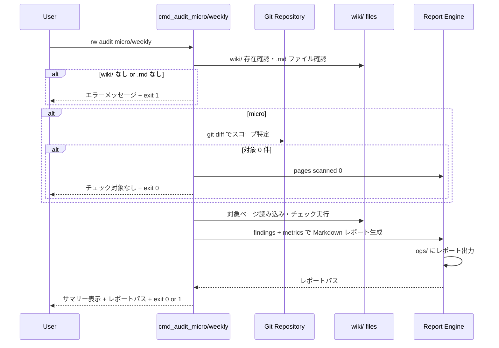
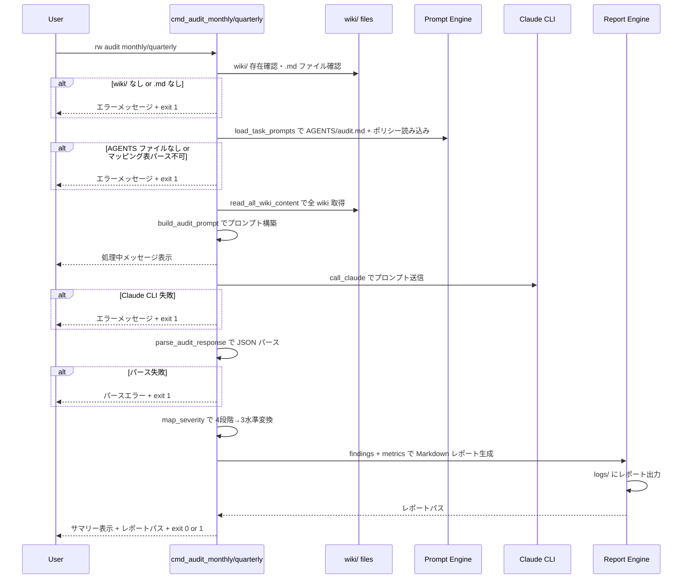

# Design Document: cli-audit

## Overview

**Purpose**: wiki の整合性・構造・完全性を4段階の監査サイクルで検証する CLI サブコマンド群を提供する。micro/weekly は Python 静的チェック、monthly/quarterly は Claude CLI を呼び出す LLM 支援監査である。

**Users**: Rwiki 運用者が定期的な品質監査ワークフローで使用する。

**Impact**: 既存の `rw_light.py` に `audit` コマンドを追加し、`templates/CLAUDE.md` の Execution Mode を Prompt → CLI (Hybrid) に更新する。

### Goals
- 4段階の監査サブコマンド（micro / weekly / monthly / quarterly）を実装する
- 既存 Prompt Engine を monthly/quarterly で再利用し、AGENTS/audit.md をプロンプトの正規ソースとする
- プロジェクト標準の3水準 severity（ERROR / WARN / INFO）と統一された終了コードを適用する
- すべての audit は読み取り専用であり、wiki/ / raw/ / review/ への書き込みを行わない

### Non-Goals
- 監査結果に基づく自動修正（読み取り専用の原則）
- `[CONFLICT]` / `[TENSION]` / `[AMBIGUOUS]` タグの wiki ページへの書き込み
- AGENTS/audit.md のルール定義・処理内容の変更（agents-system スペック管轄）
- テストの実装（test-suite スペック管轄）
- logs/ 内の古いレポートのローテーション・自動削除

## Boundary Commitments

### This Spec Owns
- `rw audit micro` / `rw audit weekly` / `rw audit monthly` / `rw audit quarterly` の4サブコマンド実装
- 静的チェックエンジン（リンク検証、frontmatter 検証、構造検証）
- LLM 監査のプロンプト構築・呼び出し・レスポンスパース
- `logs/` への Markdown レポート出力と標準出力サマリー
- severity マッピング（AGENTS/audit.md 4段階 → CLI 3水準）
- 終了コード制御（exit 0: PASS / exit 1: FAIL）
- ドキュメント更新（user-guide.md、CHANGELOG.md）
- Execution Mode 更新（CLAUDE.md、AGENTS/audit.md、AGENTS/README.md）

### Out of Boundary
- AGENTS/audit.md のルール定義内容の変更（agents-system スペック管轄）
- wiki/ / raw/ / review/ への書き込み（読み取り専用の原則）
- テスト実装（test-suite スペック管轄）
- logs/ のローテーション・自動削除
- call_claude() のタイムアウト問題の抜本的解決（本スペックでは audit 固有のタイムアウト設定のみ）

### Allowed Dependencies
- `scripts/rw_light.py` 内の既存ユーティリティ: `parse_frontmatter()`, `has_frontmatter()`, `list_md_files()`, `read_text()`, `relpath()`, `_strip_code_block()`
- **`ensure_dirs()` は audit では使用しない**。同関数は `WIKI_SYNTH`（wiki/synthesis/）や `SYNTH_CANDIDATES`（review/synthesis_candidates/）も作成するため、Req 6.1（wiki/ 書き込み禁止）・Req 6.3（review/ 書き込み禁止）に違反する。logs/ の作成は `write_text()` がファイル書き出し時に親ディレクトリを自動作成する既存動作で充足する（Req 7.4）
- 既存 Prompt Engine: `parse_agent_mapping()`, `load_task_prompts()`, `call_claude()`
- 既存 Git ユーティリティ: `git_status()`, `warn_if_dirty_paths()`, subprocess による git コマンド実行
- グローバル定数: `ROOT`, `WIKI`, `INDEX_MD`（Vault ルート直下 `index.md`）, `CHANGE_LOG_MD`（Vault ルート直下 `log.md`）, `LOGDIR`
- `ROOT/AGENTS/audit.md` — プロンプトの正規ソース（読み取りのみ）。開発リポジトリでは `templates/AGENTS/audit.md` がマスター、デプロイ先 Vault では `rw init` により `ROOT/AGENTS/` にコピーされる。`load_task_prompts()` は `ROOT/AGENTS/audit.md` を参照する
- `ROOT/CLAUDE.md` — マッピング表（読み取りのみ）。開発リポジトリでは `templates/CLAUDE.md` がマスター、デプロイ先 Vault では `ROOT/CLAUDE.md` として配置される。Execution Mode 更新は `templates/CLAUDE.md`（マスター）に対して行う
- Python 標準ライブラリのみ（外部依存なし）

**注意**: `read_wiki_content()` は audit では使用しない。同関数は >20 ファイルで index.md のみを返すため、全ページの内容が必要な audit には不適合。代わりに `read_all_wiki_content()` を新設する（Components セクション参照）。

### Revalidation Triggers
- AGENTS/audit.md のティア定義・チェック項目の変更
- CLAUDE.md マッピング表の構造変更
- Prompt Engine（parse_agent_mapping / load_task_prompts / call_claude）のインターフェース変更
- severity 体系の変更（ERROR / WARN / INFO の定義変更）
- wiki/ のディレクトリ構造・frontmatter スキーマの大幅変更

## Architecture

### Existing Architecture Analysis

既存の rw_light.py は以下のパターンで構成されている:

- **コマンドディスパッチ**: `main()` が `sys.argv[1]` でトップレベルコマンドを分岐。サブコマンドは `sys.argv[2]` で分岐（query パターン）
- **ハンドラ関数**: 各コマンドは `cmd_<command>()` 関数として実装。int（exit code）を返却
- **Prompt Engine**: `parse_agent_mapping()` → `load_task_prompts()` → `call_claude()` の3段階パイプライン
- **レポート出力**: `logs/` に JSON / Markdown で出力。標準出力にサマリー表示

audit はこのパターンに完全に従い、新規アーキテクチャパターンを導入しない。

### Architecture Pattern & Boundary Map

```mermaid
graph TB
    subgraph CLI
        Main[main argv dispatch]
        CmdAudit[cmd_audit dispatcher]
        Micro[cmd_audit_micro]
        Weekly[cmd_audit_weekly]
        Monthly[cmd_audit_monthly]
        Quarterly[cmd_audit_quarterly]
        RunLLM[_run_llm_audit]
    end

    subgraph DataLoading
        LoadPages[load_wiki_pages]
        ReadAll[read_all_wiki_content]
        ValidateDir[validate_wiki_dir]
        GitChanges[get_recent_wiki_changes]
        GitList[_git_list_files]
    end

    subgraph StaticCheckEngine
        RunMicro[run_micro_checks]
        RunWeekly[run_weekly_checks]
        CheckLinks[check_broken_links]
        CheckIndex[check_index_registration]
        CheckFM[check_frontmatter]
        CheckOrphan[check_orphan_pages]
        CheckBidir[check_bidirectional_links]
        CheckNaming[check_naming_convention]
        CheckSource[check_source_field]
        CheckSections[check_required_sections]
    end

    subgraph LLMAuditEngine
        PromptEngine[Prompt Engine reuse]
        BuildPrompt[build_audit_prompt]
        ParseResponse[parse_audit_response]
        SeverityMap[map_severity]
    end

    subgraph ReportEngine
        GenReport[generate_audit_report]
        Summary[print_audit_summary]
    end

    subgraph External
        AGENTS[AGENTS audit.md]
        CLAUDE[CLAUDE.md mapping]
        WikiFiles[wiki/ files]
        IndexMD[ROOT/index.md]
        LogMD[ROOT/log.md]
        GitRepo[Git repository]
        ClaudeCLI[Claude CLI]
    end

    Main --> CmdAudit
    CmdAudit --> Micro
    CmdAudit --> Weekly
    CmdAudit --> Monthly
    CmdAudit --> Quarterly
    Monthly --> RunLLM
    Quarterly --> RunLLM

    Micro --> ValidateDir
    Micro --> GitChanges
    Micro --> LoadPages
    Micro --> RunMicro
    Micro --> GenReport

    Weekly --> ValidateDir
    Weekly --> LoadPages
    Weekly --> RunMicro
    Weekly --> RunWeekly
    Weekly --> GenReport

    RunLLM --> ValidateDir
    RunLLM --> ReadAll
    RunLLM --> BuildPrompt
    RunLLM --> ParseResponse
    RunLLM --> SeverityMap
    RunLLM --> GenReport

    GitChanges --> GitList
    GitList --> GitRepo

    RunMicro --> CheckLinks
    RunMicro --> CheckIndex
    RunMicro --> CheckFM
    RunWeekly --> CheckOrphan
    RunWeekly --> CheckBidir
    RunWeekly --> CheckNaming
    RunWeekly --> CheckSource
    RunWeekly --> CheckSections

    LoadPages --> WikiFiles
    ReadAll --> WikiFiles
    ReadAll --> IndexMD
    ReadAll --> LogMD
    CheckIndex --> IndexMD

    BuildPrompt --> PromptEngine
    PromptEngine --> AGENTS
    PromptEngine --> CLAUDE
    PromptEngine --> ClaudeCLI

    GenReport --> Summary
```



**Architecture Integration**:
- **Selected pattern**: 既存モノリシック CLI パターンの拡張
- **Domain boundaries**: 静的チェックエンジン / LLM 監査エンジン / レポートエンジンの3層
- **Existing patterns preserved**: コマンドディスパッチ、Prompt Engine、レポート出力
- **New components rationale**: 静的チェック関数群（micro/weekly 固有の検証ロジック）、severity マッピング（AGENTS 4段階 → CLI 3水準）、レポート生成（Markdown 形式）
- **Steering compliance**: ゼロ依存、モノリシック CLI、読み取り専用の原則

### Technology Stack

| Layer | Choice / Version | Role in Feature | Notes |
|-------|------------------|-----------------|-------|
| CLI | Python 3.10+ argparse | コマンドディスパッチ・引数解析 | 既存パターン踏襲 |
| Static Checks | Python 標準ライブラリ (re, pathlib, subprocess) | micro/weekly の検証ロジック | 外部依存なし |
| LLM Integration | Claude CLI (subprocess) | monthly/quarterly のプロンプト実行 | 既存 Prompt Engine 再利用 |
| Data Format | Markdown + JSON | レポート出力・レスポンスパース | audit レポートは Markdown |

## File Structure Plan

### Modified Files
- `scripts/rw_light.py` — audit サブコマンド群、静的チェック関数、LLM 監査関数、レポート生成関数、`read_all_wiki_content()` を追加。`call_claude()` に timeout パラメータを追加。`TimeoutExpired` を `RuntimeError` に変換するハンドリングを追加。`print_usage()` に `rw audit` を追加。`main()` に audit コマンドのディスパッチを追加
- `templates/CLAUDE.md` — マッピング表の既存 `audit` 行の Execution Mode を「CLI (Hybrid)」に更新（タスク名は `audit` のまま維持。monthly/quarterly の差異は `build_audit_prompt()` 内のティア指示で制御する）
- `templates/AGENTS/audit.md` — Execution Mode セクションを CLI (Hybrid) に更新
- `templates/AGENTS/README.md` — エージェント一覧テーブルの audit 行を「CLI (Hybrid)」に更新
- `docs/user-guide.md` — audit コマンドのリファレンスセクションを追加
- `CHANGELOG.md` — `[Unreleased]` セクションに cli-audit の変更内容を追記

### New Files
- なし（すべて既存ファイルへの追加・変更）

### Output Files（実行時生成）
- `logs/audit-micro-<YYYYMMDD-HHMMSS>.md` — micro 監査レポート
- `logs/audit-weekly-<YYYYMMDD-HHMMSS>.md` — weekly 監査レポート
- `logs/audit-monthly-<YYYYMMDD-HHMMSS>.md` — monthly 監査レポート
- `logs/audit-quarterly-<YYYYMMDD-HHMMSS>.md` — quarterly 監査レポート
- `logs/audit-monthly-<YYYYMMDD-HHMMSS>-raw.txt` — monthly Claude 生レスポンス（デバッグ用）
- `logs/audit-quarterly-<YYYYMMDD-HHMMSS>-raw.txt` — quarterly Claude 生レスポンス（デバッグ用）

## System Flows

### micro/weekly フロー（静的チェック）



### monthly/quarterly フロー（LLM 支援監査）



## Requirements Traceability

| Requirement | Summary | Components | Interfaces | Flows |
|-------------|---------|------------|------------|-------|
| 1.1 | micro 静的チェック実行 | check_broken_links, check_index_registration, check_frontmatter | cmd_audit_micro() | micro/weekly フロー |
| 1.2 | micro スコープ限定 | get_recent_wiki_changes() | git diff | micro/weekly フロー |
| 1.3 | micro サマリー表示 | print_audit_summary() | — | micro/weekly フロー |
| 1.4 | micro レポート出力 | generate_audit_report() | — | micro/weekly フロー |
| 1.5 | micro exit 0（ERROR なし） | cmd_audit_micro() | — | — |
| 1.6 | micro exit 1（ERROR あり） | cmd_audit_micro() | — | — |
| 1.7 | micro 対象 0 件 | cmd_audit_micro() | — | micro/weekly フロー |
| 1.8 | micro Claude 不使用 | cmd_audit_micro() | — | — |
| 2.1 | weekly 構造チェック | check_orphan_pages, check_bidirectional_links, check_naming_convention, check_source_field, check_required_sections | cmd_audit_weekly() | micro/weekly フロー |
| 2.2 | weekly は micro のスーパーセット | cmd_audit_weekly() → run_micro_checks() | — | — |
| 2.3 | weekly サマリー+レポート | print_audit_summary(), generate_audit_report() | — | micro/weekly フロー |
| 2.4 | weekly exit 0 | cmd_audit_weekly() | — | — |
| 2.5 | weekly exit 1 | cmd_audit_weekly() | — | — |
| 2.6 | weekly Claude 不使用 | cmd_audit_weekly() | — | — |
| 3.1 | monthly Claude 呼び出し | build_audit_prompt(), call_claude() | Prompt Engine | monthly/quarterly フロー |
| 3.2 | monthly Tier 2 指示 | build_audit_prompt() | — | — |
| 3.3 | monthly マーカー併記 | parse_audit_response(), generate_audit_report() | — | monthly/quarterly フロー |
| 3.4 | monthly サマリー+レポート | print_audit_summary(), generate_audit_report() | — | monthly/quarterly フロー |
| 3.5 | monthly wiki 書き込みなし | — (読み取り専用の原則) | — | — |
| 3.6 | monthly exit 0 | cmd_audit_monthly() | — | — |
| 3.7 | monthly exit 1 | cmd_audit_monthly() | — | — |
| 3.8 | monthly AGENTS 使用 | load_task_prompts() | Prompt Engine | — |
| 4.1 | quarterly Claude 呼び出し | build_audit_prompt(), call_claude() | Prompt Engine | monthly/quarterly フロー |
| 4.2 | quarterly Tier 3 指示 | build_audit_prompt() | — | — |
| 4.3 | quarterly サマリー+レポート | print_audit_summary(), generate_audit_report() | — | monthly/quarterly フロー |
| 4.4 | quarterly exit 0 | cmd_audit_quarterly() | — | — |
| 4.5 | quarterly exit 1 | cmd_audit_quarterly() | — | — |
| 4.6 | quarterly AGENTS 使用 | load_task_prompts() | Prompt Engine | — |
| 5.1 | レポートファイル命名 | generate_audit_report() | — | — |
| 5.2 | レポートセクション | generate_audit_report() | — | — |
| 5.3 | severity 3水準 + マッピング | map_severity(), 静的チェック各関数 | — | — |
| 5.4 | Metrics セクション | generate_audit_report() | — | — |
| 5.5 | usage 表示 | cmd_audit() dispatcher | — | — |
| 5.6 | 出力先 logs/ 限定 | generate_audit_report() | — | — |
| 5.7 | レポートパス表示 | cmd_audit_micro/weekly/monthly/quarterly() | — | — |
| 6.1-6.4 | 読み取り専用保証 | 全 cmd_audit_* 関数 | — | — |
| 7.1 | wiki/ 不在エラー | validate_wiki_dir() | — | 両フロー |
| 7.2 | Claude CLI 失敗 | cmd_audit_monthly/quarterly() | — | monthly/quarterly フロー |
| 7.3 | レスポンス不正フォーマット | parse_audit_response() | — | monthly/quarterly フロー |
| 7.4 | logs/ 自動作成 | generate_audit_report() 内で write_text() が自動作成 | — | — |
| 7.5 | AGENTS ファイル不在 | cmd_audit_monthly/quarterly() | Prompt Engine | monthly/quarterly フロー |
| 7.6 | dirty working tree 警告 | validate_wiki_dir() | — | 両フロー |
| 7.7 | index.md 不在時スキップ | check_index_registration() | — | — |
| 7.8 | 個別ファイル読み込み不能 | 静的チェック各関数 | — | — |
| 8.1-8.2 | ドキュメント更新 | — (ファイル直接編集) | — | — |
| 9.1-9.3 | Execution Mode 更新 | — (ファイル直接編集) | — | — |
| 10.1 | AGENTS 正規ソース | load_task_prompts() | Prompt Engine | — |
| 10.2 | ルール更新の自動反映 | load_task_prompts()（実行時読み込み） | — | — |

## Components and Interfaces

| Component | Domain/Layer | Intent | Req Coverage | Key Dependencies | Contracts |
|-----------|------------|--------|--------------|------------------|-----------|
| cmd_audit | CLI Dispatch | audit サブコマンドのディスパッチ | 5.5 | main() (P0) | — |
| cmd_audit_micro | CLI Handler | micro 監査の実行と結果判定 | 1.1-1.8 | StaticCheckEngine (P0), ReportEngine (P0), Git (P1) | Service |
| cmd_audit_weekly | CLI Handler | weekly 監査の実行と結果判定 | 2.1-2.6 | StaticCheckEngine (P0), ReportEngine (P0) | Service |
| cmd_audit_monthly | CLI Handler | monthly 監査（_run_llm_audit に委譲） | 3.1-3.8 | _run_llm_audit (P0) | — |
| cmd_audit_quarterly | CLI Handler | quarterly 監査（_run_llm_audit に委譲） | 4.1-4.6 | _run_llm_audit (P0) | — |
| _run_llm_audit | LLM Orchestration | monthly/quarterly 共通 LLM 監査フロー | 3.1-3.8, 4.1-4.6 | LLMAuditEngine (P0), ReportEngine (P0), validate_wiki_dir (P0) | Service |
| load_wiki_pages | Data Loading | wiki ページの読み込みと WikiPage 構造化 | 1.1, 2.1, 7.8 | wiki/ files (P0), parse_frontmatter() (P0) | Service |
| read_all_wiki_content | Data Loading | wiki 全ページの結合テキスト取得（audit 専用） | 3.1, 4.1 | wiki/ files (P0), list_md_files() (P0) | Service |
| StaticCheckEngine | Check Logic | 静的チェック関数群 | 1.1, 2.1, 2.2 | load_wiki_pages (P0) | Service |
| LLMAuditEngine | LLM Integration | プロンプト構築・呼び出し・パース | 3.1-3.3, 4.1-4.2, 10.1-10.2 | Prompt Engine (P0), Claude CLI (P0), read_all_wiki_content (P0) | Service |
| ReportEngine | Output | レポート生成・サマリー表示 | 5.1-5.4, 5.6-5.7 | logs/ (P0) | Service |
| get_recent_wiki_changes | Data Loading | micro 用の変更ファイル特定 | 1.2 | _git_list_files (P0), Git (P1) | Service |
| validate_wiki_dir | Validation | wiki/ の事前検証 | 7.1, 7.6 | wiki/ (P0), Git (P1) | — |

### CLI Dispatch

#### cmd_audit

| Field | Detail |
|-------|--------|
| Intent | audit サブコマンドのルーティングと usage 表示 |
| Requirements | 5.5 |

**Responsibilities & Constraints**
- `args[0]` でサブコマンド（micro / weekly / monthly / quarterly）を分岐
- サブコマンドなしの場合は audit 専用 usage を表示して exit 1（既存 query パターンに統一）
- 不明なサブコマンドの場合はエラーメッセージ + usage を表示して exit 1

**main() での呼び出し**: 既存の query は main() 内でインライン分岐するが、audit は `cmd_audit()` ディスパッチ関数に委譲する（コードの見通し改善）。

```python
# main() に追加:
if cmd == "audit":
    sys.exit(cmd_audit(sys.argv[2:]))
```

##### Service Interface
```python
def cmd_audit(args: list[str]) -> int:
    """audit サブコマンドのディスパッチ。

    Args:
        args: sys.argv[2:] 以降の引数リスト
    Returns:
        終了コード（0: PASS, 1: FAIL）
    """
```

### CLI Handlers

#### cmd_audit_micro

| Field | Detail |
|-------|--------|
| Intent | 最近更新されたページに対する静的チェックを実行 |
| Requirements | 1.1, 1.2, 1.3, 1.4, 1.5, 1.6, 1.7, 1.8 |

**Responsibilities & Constraints**
- `validate_wiki_dir()` で事前検証
- `get_recent_wiki_changes()` で対象ページを特定（git diff ベース）
- 対象 0 件の場合は「チェック対象なし」表示 + pages scanned: 0 のレポート + exit 0
- `run_micro_checks()` で静的チェック実行
- `generate_audit_report()` でレポート出力
- `print_audit_summary()` でサマリー表示
- Claude CLI を呼び出さない

**Dependencies**
- Inbound: cmd_audit — ディスパッチ (P0)
- Outbound: StaticCheckEngine — チェック実行 (P0)
- Outbound: ReportEngine — レポート生成 (P0)
- External: Git — スコープ特定 (P1)

##### Service Interface
```python
def cmd_audit_micro() -> int:
    """micro 監査を実行する。グローバル定数 ROOT, WIKI, INDEX_MD を使用。

    Returns:
        終了コード（0: ERROR なし, 1: ERROR あり）
    """
```

#### cmd_audit_weekly

| Field | Detail |
|-------|--------|
| Intent | 全ページに対する構造チェック（micro のスーパーセット）を実行 |
| Requirements | 2.1, 2.2, 2.3, 2.4, 2.5, 2.6 |

**Responsibilities & Constraints**
- `validate_wiki_dir()` で事前検証
- 全 wiki ページを対象とする（micro のスコープ制限なし）
- `run_micro_checks()` で micro チェック項目を全ページに実行
- `run_weekly_checks()` で weekly 固有チェック項目を実行
- 結果を統合して `generate_audit_report()` + `print_audit_summary()`
- Claude CLI を呼び出さない

##### Service Interface
```python
def cmd_audit_weekly() -> int:
    """weekly 監査を実行する。グローバル定数 ROOT, WIKI, INDEX_MD を使用。

    Returns:
        終了コード（0: ERROR なし, 1: ERROR あり）
    """
```

#### cmd_audit_monthly / cmd_audit_quarterly

| Field | Detail |
|-------|--------|
| Intent | Claude CLI を呼び出して意味的/戦略的監査を実行 |
| Requirements | 3.1-3.8 (monthly), 4.1-4.6 (quarterly) |

monthly と quarterly は `tier` 引数のみが異なり、処理フローが同一のため、共通関数 `_run_llm_audit()` に委譲する。

**Responsibilities & Constraints**（`_run_llm_audit` が担う）:
- `validate_wiki_dir()` で事前検証
- 処理中メッセージを表示
- `load_task_prompts("audit")` で AGENTS/audit.md + ポリシーを読み込み（マッピング表の単一 `audit` エントリを共用）
- `build_audit_prompt()` でティア固有の指示を付加してプロンプト構築
- `call_claude()` で Claude CLI 呼び出し（デフォルト timeout=300、`--timeout` オプションでオーバーライド可能）
- `parse_audit_response()` で JSON レスポンスをパース（ティア別スキーマ）
- `map_severity()` で 4段階 → 3水準に変換
- `generate_audit_report()` + `print_audit_summary()`
- wiki/ への書き込みを行わない

**内部エラーハンドリング**（既存 `cmd_query_extract` パターンに準拠）:

各ステップの例外を内部で捕捉し `[ERROR]` メッセージ付きで return 1 する。main() の安全網（`[FAIL]`）に頼らない。

```python
# 1. 事前検証
if not validate_wiki_dir():
    return 1

# 2. CLAUDE.md / AGENTS/ 明示チェック（Req 7.5 — 具体的エラーメッセージ提供）
if not os.path.exists(os.path.join(ROOT, "CLAUDE.md")):
    print(f"[ERROR] CLAUDE.md が見つかりません: {os.path.join(ROOT, 'CLAUDE.md')}")
    return 1
if not os.path.isdir(os.path.join(ROOT, "AGENTS")):
    print(f"[ERROR] AGENTS/ ディレクトリが見つかりません: {os.path.join(ROOT, 'AGENTS')}")
    return 1

# 3. Prompt Engine（ValueError, FileNotFoundError をキャッチ）
try:
    task_prompts = load_task_prompts("audit")
except (ValueError, FileNotFoundError) as e:
    print(f"[ERROR] load_task_prompts 失敗: {e}")
    return 1

# 4. wiki コンテンツ取得（FileNotFoundError, ValueError をキャッチ）
try:
    wiki_content = read_all_wiki_content()
except (FileNotFoundError, ValueError) as e:
    print(f"[ERROR] wiki コンテンツ読み込み失敗: {e}")
    return 1

# 5. Claude 呼び出し（RuntimeError をキャッチ — タイムアウト含む）
print(f"[INFO] audit {tier} を実行中...")
try:
    response = call_claude(prompt, timeout=timeout_value)
except RuntimeError as e:
    print(f"[ERROR] Claude 呼び出し失敗: {e}")
    return 1

# 5.5. Claude 生レスポンスを保存（デバッグ・再現性のため）
raw_path = os.path.join(LOGDIR, f"audit-{tier}-{timestamp}-raw.txt")
write_text(raw_path, response)

# 6. レスポンスパース（ValueError をキャッチ）
try:
    data = parse_audit_response(response)
except ValueError as e:
    print(f"[ERROR] レスポンスパース失敗: {e}")
    print(f"[INFO] Claude の生レスポンスは {raw_path} に保存されています")
    return 1
```

##### Service Interface
```python
def _run_llm_audit(tier: str, args: list[str]) -> int:
    """monthly/quarterly 共通の LLM 監査フローを実行する。
    グローバル定数 ROOT, WIKI, INDEX_MD を使用。

    Args:
        tier: "monthly" | "quarterly"
        args: オプション引数。`--timeout <秒>` でタイムアウトをオーバーライド（デフォルト 300）
    Returns:
        終了コード（0: ERROR なし, 1: ERROR あり）
    """

def cmd_audit_monthly(args: list[str]) -> int:
    """monthly 監査を実行する。_run_llm_audit("monthly", args) に委譲。"""
    return _run_llm_audit("monthly", args)

def cmd_audit_quarterly(args: list[str]) -> int:
    """quarterly 監査を実行する。_run_llm_audit("quarterly", args) に委譲。"""
    return _run_llm_audit("quarterly", args)
```

### Static Check Engine

#### ページ識別とリンク解決の規約

**`all_pages_set: set[str]` の定義**: wiki/ 内の全 .md ファイルについて、**wiki/ からの相対パス**（例: `"concepts/my-page.md"`, `"methods/sindy.md"`）の集合。`list_md_files(WIKI)` が返すフルパスから `relpath()` で ROOT 相対に変換し、さらに `wiki/` プレフィックスを除去して構築する。

**リンク解決ルール**: `[[link-name]]` から対象ファイルを特定する手順:
1. `link-name` に `.md` 拡張子がなければ付加 → `link-name.md`
2. `all_pages_set` 内でファイル名部分が一致するエントリを検索（サブディレクトリをまたいで検索）
3. 一致が1件 → 解決成功。0件 → broken link。2件以上 → 最初の一致を採用（曖昧性は WARNING として報告しない。wiki の命名規則上、同名ファイルは存在しないため）

**`index_links: set[str]` の定義**: ROOT/index.md の本文から `[[link]]` regex で抽出したページ名の集合。`all_pages_set` と同じリンク解決ルールで正規化する。

**micro での `all_pages_set` 構築**: micro は `load_wiki_pages()` で変更ファイルのみ読み込むが、`all_pages_set` は全ページのファイル名リストから構築する必要がある（リンク先の存在確認のため）。`list_md_files(WIKI)` でファイルパスのみを取得し（内容は読まない）、set を構築する。

#### check 関数群

各チェック関数は統一されたインターフェースを持つ。

##### Service Interface
```python
# Finding は既存パターン（dict ベースの lint results）に合わせて NamedTuple で定義する。
# 既存コードは dataclasses を import していないため、NamedTuple を使用する。
from typing import NamedTuple

class Finding(NamedTuple):
    """監査で検出された個別の問題。"""
    severity: str        # "ERROR" | "WARN" | "INFO"
    category: str        # チェックカテゴリ（例: "broken_link", "orphan_page"）
    page: str            # 対象ページパス（wiki/ からの相対パス）
    message: str         # 問題の説明
    sub_severity: str    # monthly/quarterly の元の優先度（"CRITICAL" | "HIGH" | ""）
    marker: str          # monthly のマーカー（"CONFLICT" | "TENSION" | "AMBIGUOUS" | ""）

def check_broken_links(pages: list[WikiPage], all_pages_set: set[str]) -> list[Finding]:
    """wiki 内 [[link]] の参照先ページ不在を検出する。Severity: ERROR

    pages 内の各ページの links を all_pages_set と照合する。
    リンク解決は上記「リンク解決ルール」に従う。"""

def check_index_registration(pages: list[WikiPage], index_content: str | None) -> list[Finding]:
    """Vault ルート直下の index.md（グローバル定数 INDEX_MD）に未登録のページを検出する。
    index.md 不在時はチェックをスキップし WARNING を Finding として返す（Req 7.7）。

    注意: wiki/ のサブディレクトリ内に index.md が存在する場合があるが、
    本チェックは ROOT/index.md のみを対象とする。サブディレクトリの index.md は
    通常の wiki ページとして扱う。

    AGENTS/audit.md Tier 1 は「陳腐化エントリ」（index.md に記載されているが
    wiki/ に存在しないページ）の検出も定義しているが、要件 1.1 / 2.1 は
    「index.md への未登録ページ」（ページ → index 方向）のみをスコープとする。
    逆方向の陳腐化エントリ検出は技術的に容易（index_links - all_pages_set の差集合）
    だが、要件に含まれないため本スペックでは対象外とする。Severity: WARN"""

def check_frontmatter(pages: list[WikiPage]) -> list[Finding]:
    """frontmatter の構造的問題を検出する。

    検出対象（parse_frontmatter() の制約を考慮）:
    1. `---` ブロックが存在するが中身が完全に空 → ERROR
    2. `---` ブロック内に `:` を含まない行が存在する（不正な記述） → ERROR
    3. `---` の開始はあるが閉じがない（parse_frontmatter() が {} を返す異常パターン） → ERROR
    4. title フィールドの欠落 → WARN

    項目 1-3 は Req 1.1「YAML パースエラー（パース不能な YAML）」に該当し ERROR。
    項目 4 は AGENTS/audit.md Tier 0 の定義（title欠落・フィールド異常）に基づくが、
    Req 1.1 の「パースエラー」の範囲を超えるため WARN とする。

    注意: 既存の parse_frontmatter() は不正行を黙ってスキップするため、
    本関数は parse_frontmatter() に依存せず、raw_text を直接検査して
    項目 1-3 の構造的問題を検出する。parse_frontmatter() の結果は
    項目 4（title 欠落チェック）にのみ使用する。

    frontmatter 自体が存在しないケース（has_frontmatter() が False）:
    項目 1-3 の構造検査はスキップし、項目 4 の title 欠落チェックのみ適用する（WARN）。
    「frontmatter がない」はパースエラーではなく「データ欠落」であり、Req 1.1 の
    「パース不能な YAML」には該当しないため ERROR としない。

    AGENTS/audit.md Tier 1 は tags・updated フィールドの欠落も定義しているが、
    要件 2.1 はこれを weekly 固有チェック項目として明示的に列挙していないため、
    本スペックではスコープ外とする。将来の拡張候補として research.md に記録済み。
    """

def check_orphan_pages(pages: list[WikiPage], all_pages_set: set[str], index_links: set[str]) -> list[Finding]:
    """孤立ページ（他ページからリンクされていない。index.md リンクは除外）を検出する。

    判定: pages 内の全ページから被リンク集合を構築し、
    どのページの links にも含まれず、かつ index_links にも含まれないページを孤立と判定。

    除外: ROOT/index.md と ROOT/log.md は wiki/ 外にあるため load_wiki_pages() の結果に
    含まれず、除外処理は不要。wiki/ 内のサブディレクトリに index.md が存在する場合に備え、
    ファイル名が "index.md" のページは孤立チェックから除外する
    （index ページは構造上、他ページからリンクされることを期待しないため）。Severity: WARN"""

def check_bidirectional_links(pages: list[WikiPage], all_pages_set: set[str]) -> tuple[list[Finding], dict[str, int]]:
    """双方向リンクの欠落を検出する。Severity: WARN

    定義: ページ A が [[B]] でリンクしているとき、ページ B にも [[A]] へのリンクが
    存在するかを検査する。全リンクペアに対してチェックし、片方向のみのペアを報告する。

    注意: index.md → 各ページ のリンクは性質上片方向であるため、
    index.md からのリンクは双方向チェックの対象外とする。

    Returns:
        (findings, stats) のタプル。
        findings: 片方向リンクペアの Finding リスト
        stats: {"total_pairs": int, "bidirectional_pairs": int}
          — bidirectional_compliance の算出に使用:
            compliance = bidirectional_pairs / total_pairs（total_pairs > 0 のとき）
          — この stats は run_weekly_checks() がメトリクス dict に変換する"""

def check_naming_convention(pages: list[WikiPage]) -> list[Finding]:
    """命名規則違反（小文字・ハイフン区切り・ASCII のみ）を検出する。Severity: WARN

    検査対象はファイル名（WikiPage.filename）のみ。サブディレクトリ名は対象外。
    regex: ^[a-z0-9]+(-[a-z0-9]+)*\\.md$ にマッチしないファイルを違反として報告。
    index.md, log.md などの特殊ファイルもこの regex にマッチするため除外不要。"""

def check_source_field(pages: list[WikiPage]) -> list[Finding]:
    """source: フィールドの空・欠落を検出する。Severity: INFO

    注意: AGENTS/audit.md Tier 1 は「sources: フィールドの存在しない raw ファイルへの参照」も
    定義しているが、要件 2.1 は「source: フィールドの空・欠落」のみをスコープとする。
    raw ファイル参照先の存在確認は本スペックの対象外（AGENTS 定義との差異を認識した上で、
    要件に従う）。"""

def check_required_sections(pages: list[WikiPage], page_policy: dict | None) -> list[Finding]:
    """page_policy.md の必須セクション定義に基づく欠落を検出する。Severity: INFO

    注意: 現行の page_policy.md にはページ種別の説明（concepts = "何であるか/なぜ重要か" 等）
    のみで、具体的な必須セクション名の定義がない。要件 2.1 は「page_policy.md に
    ページ種別ごとの必須セクション定義が存在する場合は」と条件付きのため、
    page_policy に具体的なセクション名定義がない場合は Finding を返さない（no-op）。
    将来 page_policy.md にセクション定義が追加された場合に自動的に有効化される。"""
```

#### WikiPage データ構造

```python
class WikiPage(NamedTuple):
    """wiki ページの読み込み済みデータ。"""
    path: str               # wiki/ からの相対パス（例: "concepts/my-page.md"）
    filename: str           # ファイル名（例: "my-page.md"）
    raw_text: str           # 読み込んだ生テキスト（frontmatter 検査用）
    frontmatter: dict       # parse_frontmatter() でパース済み frontmatter
    body: str               # parse_frontmatter() が返す本文
    links: list[str]        # body から [[link]] regex で抽出したページ名リスト（frontmatter 内は対象外）
    read_error: str         # 読み込みエラーがあった場合のメッセージ（正常時は ""）
```

**WikiPage の生成**: `load_wiki_pages()` 関数が wiki/ 内の .md ファイルを `read_text()` で読み込み、WikiPage リストを返す。読み込み時に `(OSError, UnicodeDecodeError)` が発生したファイルは `read_error` にエラーメッセージを設定し、`frontmatter={}`, `body=""`, `links=[]`, `raw_text=""` とする。`OSError` はパーミッションエラー・ファイル消失等、`UnicodeDecodeError` は非 UTF-8 ファイルを捕捉する。これらの例外は `load_wiki_pages()` 内で捕捉し、main() の安全網に到達させない（Req 7.8: スキップして続行）。

**実装制約**: check 関数は WikiPage のフィールド（frontmatter, links 等）を変更してはならない。WikiPage は NamedTuple だがフィールドの dict/list は mutable であるため、意図しない変更に注意する。

**`[[link]]` の抽出パターン**: regex `\[\[([^\]|]+)(?:\|[^\]]+)?\]\]` を `body` に対してのみ適用する（frontmatter 内の `[[]]` は対象外）。
- `[[page-name]]` → `"page-name"` を抽出
- `[[page-name|表示テキスト]]` → `"page-name"` を抽出（`|` 以降は表示用エイリアスとして無視）
- 抽出したページ名に `.md` 拡張子がない場合は `.md` を付加して `all_pages_set` と照合

```python
def load_wiki_pages(wiki_dir: str, target_files: list[str] | None = None) -> list[WikiPage]:
    """wiki/ 内の .md ファイルを読み込んで WikiPage リストを返す。

    Args:
        wiki_dir: wiki ディレクトリパス（グローバル定数 WIKI）
        target_files: 指定時はそのファイルのみ読み込む（micro 用）。
                      None の場合は全 .md ファイルを読み込む（weekly 用）。
    Returns:
        WikiPage のリスト。読み込みエラーのファイルも read_error 付きで含む。
    """
```

#### run_micro_checks / run_weekly_checks

```python
def run_micro_checks(pages: list[WikiPage], all_pages_set: set[str], index_content: str | None) -> list[Finding]:
    """micro チェック項目（broken_links, index_registration, frontmatter）を実行する。
    read_error が設定された WikiPage は ERROR Finding として記録し、
    個別チェックからは除外する。"""

def run_weekly_checks(pages: list[WikiPage], all_pages_set: set[str], index_content: str | None, index_links: set[str], page_policy: dict | None) -> list[Finding]:
    """weekly 固有チェック項目（orphan, bidirectional, naming, source, required_sections）を実行する。"""
```

#### get_recent_wiki_changes

```python
def _git_list_files(args: list[str]) -> list[str]:
    """git コマンドを実行しファイルリストを返す。失敗時は空リスト。

    テスト時にモンキーパッチ可能な薄いラッパー。
    get_recent_wiki_changes() が内部で使用する。
    call_claude() とは独立してモック可能にするために分離。

    Args:
        args: git サブコマンドと引数のリスト（例: ["diff", "--name-only", "--", "wiki/"]）
    Returns:
        コマンド出力を改行で分割したファイルパスリスト。空行は除外。
    """

def get_recent_wiki_changes() -> list[str]:
    """git diff で最近更新された wiki ページのファイルパスリストを返す。
    グローバル定数 WIKI を使用。内部で _git_list_files() を呼び出す。

    検出方法:
    1. 未コミット変更: _git_list_files(["diff", "--name-only", "--", "wiki/"])
       + _git_list_files(["ls-files", "--others", "--", "wiki/"])
    2. 直近コミットの変更: _git_list_files(["diff", "--name-only", "HEAD~1..HEAD", "--", "wiki/"])
       - HEAD~1 が存在しない場合（初回コミット）: _git_list_files(["diff", "--name-only", "--diff-filter=A", "HEAD", "--", "wiki/"])
         で HEAD の全追加ファイルを対象とする（初回コミット直後でも変更を検出可能にする）
    3. 1 と 2 の和集合から重複を除去
    4. 削除されたファイルを除外（os.path.isfile() で存在確認）
    5. .md ファイルのみにフィルタリング

    Returns:
        wiki/ 配下の .md ファイルパスリスト。
        git リポジトリでない場合は空リストを返す。
    """
```

### LLM Audit Engine

#### read_all_wiki_content

```python
def read_all_wiki_content() -> str:
    """wiki/ 内の全 .md ファイル + ROOT/index.md + ROOT/log.md を結合して返す。
    グローバル定数 WIKI, INDEX_MD, CHANGE_LOG_MD を使用。

    既存の read_wiki_content() は >20 ファイルで index.md のみを返すため、
    全ページの内容が必要な audit には使用できない。本関数は
    ファイル数に関わらず全ページを結合して返す。

    AGENTS/audit.md の Input 定義（「wiki/ 配下の全ファイル + index.md・log.md を含む」）に
    準拠し、ROOT 直下の index.md と log.md も結合対象に含める。これにより Claude は
    index.md の構造整合性やページ登録状況も分析可能になる。

    各ファイルは `<!-- file: wiki/page-name.md -->` ヘッダー付きで結合する
    （既存 read_wiki_content() の小規模 wiki 時と同一フォーマット）。
    ROOT 直下のファイルは `<!-- file: index.md -->`, `<!-- file: log.md -->` として結合する。

    ページ数が大規模 wiki 閾値（150ページ）を超える場合は、
    処理前に標準出力に警告メッセージを表示する（トークン制限に近づく可能性）。
    ただし処理は続行する（中断しない）。

    index.md / log.md が存在しない場合はスキップする（wiki/ は必須だが、
    index.md / log.md の不在はエラーとしない）。

    将来的にバッチ分割戦略が必要になった場合は、本関数の拡張で対応する。

    Raises:
        FileNotFoundError: wiki/ が存在しない場合
        ValueError: wiki/ に .md ファイルが存在しない場合
    """
```

#### build_audit_prompt

```python
def build_audit_prompt(tier: str, task_prompts: str, wiki_content: str) -> str:
    """audit 用プロンプトを構築する。

    Args:
        tier: "monthly" | "quarterly"
        task_prompts: load_task_prompts("audit") で読み込んだプロンプト文字列
        wiki_content: read_all_wiki_content() で取得した wiki 全文
    Returns:
        Claude CLI に渡すプロンプト文字列

    プロンプト構成（既存 build_query_prompt() パターンに準拠）:
    1. タスクプロンプト（AGENTS/audit.md + ポリシー）
    2. ティア指示 + フォーマットオーバーライド + Execution Declaration 抑制
    3. wiki コンテンツ（ユーザー提供データ）
    4. 出力形式指示（具体的 JSON サンプル付き）— **必ず最後に配置**

    --- ティア指示テンプレート（monthly 例）---

    ```
    ## 実行指示

    以下の4ティアのうち、Tier 2: Semantic Audit のみを実行してください。
    Tier 0 (Micro-check), Tier 1 (Structural Audit), Tier 3 (Strategic Audit) の
    チェック項目は実行しないでください。Tier 0/1 の構造チェックは CLI が Python で
    実行済みであり、重複を避ける必要があります。

    注意: AGENTS/audit.md の「出力フォーマット」セクションに定義された Markdown 形式は
    対話型プロンプト実行用のフォーマットです。CLI モードでは末尾の「出力形式」セクションの
    JSON スキーマに従って出力してください。Markdown 形式では出力しないでください。

    実行宣言は不要です。JSON のみを出力してください。
    ```

    quarterly の場合は "Tier 3: Strategic Audit" に置換し、
    除外ティアを "Tier 0, Tier 1, Tier 2" に変更する。

    --- 出力形式指示テンプレート（既存 build_query_prompt() パターン踏襲）---

    ```
    ## 出力形式

    以下の JSON スキーマに従って、監査結果を JSON 形式で出力してください。
    コードブロック（```json ... ```）で囲まずに、JSONのみを出力してください。
    ```

    セキュリティ考慮（プロンプトインジェクション軽減）:
    - 出力形式指示をプロンプトの **末尾** に配置する（既存 build_query_prompt() と同一）。
      Claude は最後の指示を優先するため、wiki コンテンツ内の偽指示の影響を軽減する
    - wiki コンテンツは `<!-- file: ... -->` ヘッダーで区切られたデータセクションとして
      明示的にマークする（タスクプロンプトとの境界を明確化）
    - 完全な防御は不可能だが、parse_audit_response() のスキーマ検証と組み合わせて
      不正な出力の影響を最小化する
    """
```

#### Claude JSON レスポンススキーマ

monthly と quarterly で共通のベース構造を持ちつつ、ティア固有のフィールドを定義する。
以下は build_audit_prompt() が Claude に渡す **具体的な JSON サンプル**（`json.dumps()` で生成してプロンプトに埋め込む）。

**monthly（Tier 2: Semantic Audit）用サンプル**:
```json
{
  "findings": [
    {
      "severity": "HIGH",
      "category": "contradicting_definition",
      "page": "concepts/my-concept.md",
      "message": "page-a.md と page-b.md で定義が矛盾している",
      "marker": "CONFLICT",
      "recommendation": "定義を統一するか、条件分岐を明記する"
    },
    {
      "severity": "MEDIUM",
      "category": "ambiguous_definition",
      "page": "entities/some-tool.md",
      "message": "機能の説明が不十分で解釈が分かれる",
      "marker": "AMBIGUOUS",
      "recommendation": "具体的な使用例を追記する"
    }
  ],
  "metrics": {
    "pages_scanned": 42,
    "total_findings": 2,
    "conflict_count": 1,
    "tension_count": 0,
    "ambiguous_count": 1
  },
  "recommended_actions": [
    "concepts/my-concept.md の定義を確認する",
    "entities/some-tool.md に使用例を追記する"
  ]
}
```

フィールド仕様:
- `severity`: CRITICAL / HIGH / MEDIUM / LOW のいずれか（必須）
- `category`: 問題カテゴリの識別子（必須）
- `page`: 対象ページの wiki/ からの相対パス（必須）
- `message`: 問題の説明（必須）
- `marker`: CONFLICT / TENSION / AMBIGUOUS のいずれか。該当しない場合は null（monthly 固有）
- `recommendation`: 推奨アクション（必須）

**quarterly（Tier 3: Strategic Audit）用サンプル**:
```json
{
  "findings": [
    {
      "severity": "MEDIUM",
      "category": "isolated_cluster",
      "page": null,
      "message": "methods/ 配下のページがconcepts/ とほぼクロスリンクされていない",
      "recommendation": "methods の各ページに関連 concept へのリンクを追加する"
    },
    {
      "severity": "LOW",
      "category": "coverage_gap",
      "page": null,
      "message": "concepts に対して synthesis ページが不足している（synthesis/ 全体のカバレッジ不足）",
      "recommendation": "synthesis 候補を review に追加する"
    }
  ],
  "metrics": {
    "pages_scanned": 42,
    "total_findings": 2
  },
  "recommended_actions": [
    "methods と concepts のクロスリンクを強化する",
    "synthesis ページの充実を検討する"
  ]
}
```

フィールド仕様:
- `page`: 対象ページの wiki/ からの相対パス。グラフ全体やカテゴリに関する問題は null（必須、nullable）
- `marker` フィールドは quarterly では不要（含まれていても無視）
- quarterly の `severity` は戦略的提案のため MEDIUM / LOW が主だが、CRITICAL / HIGH も許容

**追加メトリクスの扱い**:
Claude が AGENTS/audit.md で定義されている追加メトリクス（Connectivity: 平均内部リンク数・クロスリンク数、Reliability: source 保有率、Growth: 新規/更新比率・raw without wiki・synthesis 蓄積率）を metrics オブジェクトに含めた場合、CLI はそのままレポートの Metrics セクションに転記する。CLI 側でフィルタリングしない。Growth カテゴリは特に quarterly で有用だが、Claude が返すかは任意。

#### parse_audit_response / map_severity

```python
def parse_audit_response(response: str) -> dict:
    """Claude CLI のレスポンスから JSON をパースし、スキーマ検証を行う。

    既存の _strip_code_block() ヘルパーでコードブロックを除去してから
    json.loads() でパース。既存の parse_extract_response() / parse_fix_response() と
    同一パターン・同一例外型を使用する。

    スキーマ検証（プロンプトインジェクション・モデル幻覚への防御）:
    1. トップレベル必須キー: "findings"（list）, "metrics"（dict）, "recommended_actions"（list）
    2. 各 finding の必須キー: "severity"（str）, "page"（str or None）, "message"（str）
    3. severity の値が CRITICAL / HIGH / MEDIUM / LOW のいずれかであること
    4. finding.message に改行が含まれる場合は空白に置換する
       （レポートの Markdown 構造へのコンテンツインジェクション防止）
    5. finding.marker / finding.page が JSON null の場合は空文字列 "" に変換する
       （Finding NamedTuple は str 型のため None を使用しない）

    検証失敗時: severity が不正値の場合は当該 finding をスキップし WARNING を
    標準出力に表示する（全体をエラー終了せず、有効な findings のみ処理する）。
    トップレベルキー欠落・型不一致の場合は ValueError を raise。

    パース失敗時は ValueError を raise（既存の parse_*_response() と統一。
    main() の例外ハンドラで [FAIL] として表示される）。
    """

def map_severity(claude_severity: str) -> tuple[str, str]:
    """AGENTS/audit.md の4段階 severity を CLI 3水準にマッピングする。

    Returns:
        (cli_severity, sub_severity) — sub_severity は空文字列で「なし」を表現
        例: ("ERROR", "CRITICAL"), ("ERROR", "HIGH"), ("WARN", ""), ("INFO", "")
    """
```

### Report Engine

#### generate_audit_report

```python
def generate_audit_report(
    tier: str,
    findings: list[Finding],
    metrics: dict,
    recommended_actions: list[str] | None = None,
    timestamp: str | None = None,
) -> str:
    """Markdown 形式の監査レポートを生成して logs/ に出力する。
    グローバル定数 LOGDIR を使用。既存の `write_text()` でファイルを書き出す。
    `write_text()` は親ディレクトリ（logs/）を自動作成するため、
    明示的な `os.makedirs()` は不要（Req 7.4 は write_text() の既存動作で充足）。
    ensure_dirs() は wiki/ / review/ も作成するため使用しない。

    Args:
        tier: "micro" | "weekly" | "monthly" | "quarterly"
        findings: 検出された問題のリスト
        metrics: ティア固有のメトリクス
        recommended_actions: 推奨アクション（monthly/quarterly は Claude が返す。
                             micro/weekly は findings から自動生成）
        timestamp: ファイル名とレポートヘッダーに使用するタイムスタンプ文字列
                   （YYYYMMDD-HHMMSS 形式）。None の場合は datetime.now() から生成する。
                   テスト時に固定値を注入することで決定的に検証可能にする
    Returns:
        生成されたレポートファイルのパス文字列

    レポート構成（Req 5.2）:
    - Summary: severity 別問題数の集計
    - Findings: severity 付き問題一覧
      - micro/weekly: "Structural Findings"
      - monthly: "Semantic Findings"
      - quarterly: "Strategic Findings"
    - Metrics: ティア固有メトリクス
    - Recommended Actions: 推奨アクション
    """
```

#### レポートの Findings フォーマット

micro/weekly レポート例:
```markdown
## Findings

### Structural Findings

- [ERROR] concepts/broken-link.md: [[nonexistent-page]] のリンク先が存在しない
- [WARN] methods/orphan-page.md: 他のページからリンクされていない
- [WARN] methods/sindy.md: title フィールドが欠落
- [INFO] entities/some-tool.md: source フィールドが空
```

monthly レポート例:
```markdown
## Findings

### Semantic Findings

- [ERROR:CRITICAL] concepts/page-a.md: page-b.md と定義が矛盾している [CONFLICT]
- [ERROR:HIGH] projects/proj-x.md: status フィールドと Current Status セクションが不一致
- [WARN] entities/person-y.md: 所属の記述が methods/method-z.md と異なる [TENSION]
```

- `[ERROR]`: micro/weekly の静的チェック由来（サブラベルなし）
- `[ERROR:CRITICAL]` / `[ERROR:HIGH]`: monthly/quarterly の Claude 由来（元の優先度を保持）
- `[CONFLICT]` / `[TENSION]` / `[AMBIGUOUS]`: monthly のマーカー（行末に併記）

#### print_audit_summary

```python
def print_audit_summary(tier: str, findings: list[Finding], report_path: str) -> None:
    """標準出力に監査サマリーを表示する。

    表示内容:
    - ティア名
    - severity 別問題数（ERROR: N, WARN: N, INFO: N）
    - 結果ステータス（PASS / FAIL）
    - レポートファイルパス

    表示言語: 既存の lint/query パターンに準拠し、タグ・ステータスは英語、
    メッセージ本文は日本語とする。レポート内のセクション見出し（Structural Findings 等）は
    AGENTS/audit.md の出力フォーマット定義に合わせて英語とする。

    出力例:
    ```
    [INFO] audit micro を実行中...
    [ERROR] concepts/my-page.md: [[nonexistent]] のリンク先が存在しない
    [WARN] methods/sindy.md: index.md に未登録
    [WARN] methods/sindy.md: title フィールドが欠落
    [INFO] entities/some-tool.md: source フィールドが空
    ---
    audit micro: ERROR 1, WARN 2, INFO 1 — FAIL
    レポート: logs/audit-micro-20260418-153000.md
    ```

    - 個別 Finding は `[{severity}] {page}: {message}` 形式。
      page が空文字列の場合（quarterly の graph-level finding）はページ部分を省略し
      `[{severity}] {message}` と表示する
    - サマリー行は `audit {tier}: ERROR N, WARN N, INFO N — PASS/FAIL` 形式
    - レポートパスは最終行に表示（Req 5.7）
    """
```

#### Metrics セクションのティア別必須メトリクス

| メトリクス | micro | weekly | monthly | quarterly |
|-----------|-------|--------|---------|-----------|
| pages_scanned | 必須 | 必須 | 必須 | 必須 |
| broken_links | 必須 | 必須 | — | — |
| index_missing | 必須 | 必須 | — | — |
| frontmatter_errors | 必須 | 必須 | — | — |
| orphan_pages | — | 必須 | — | — |
| bidirectional_compliance | — | 必須 | — | — |
| source_coverage | — | 必須 | — | — |
| naming_violations | — | 必須 | — | — |
| conflict_count | — | — | 必須 | — |
| tension_count | — | — | 必須 | — |
| ambiguous_count | — | — | 必須 | — |
| total_findings | 必須 | 必須 | 必須 | 必須 |

monthly / quarterly のメトリクスの扱い:
- 上記テーブルの「必須」メトリクスは CLI が JSON レスポンスから必ず抽出してレポートに記載する。JSON に含まれない場合は `N/A` と表記する
- AGENTS/audit.md で定義されている追加メトリクス（Connectivity: 平均内部リンク数・クロスリンク数、Reliability: source保有率、Growth: 新規/更新比率等）は、Claude が返した場合にそのままレポートの Metrics セクションに転記する。CLI 側でフィルタリングしない
- micro/weekly のメトリクスは Python コードが直接算出する

### Validation

#### validate_wiki_dir

```python
def validate_wiki_dir() -> bool:
    """wiki/ ディレクトリの事前検証を行う。グローバル定数 WIKI を使用。

    検証項目:
    - wiki/ ディレクトリの存在（Req 7.1）— 不在時はエラーメッセージ表示
    - wiki/ 内の .md ファイルの存在（Req 7.1）— 不在時はエラーメッセージ表示
    - Git working tree の dirty チェック（Req 7.6）— dirty 時は警告表示（既存 warn_if_dirty_paths() を使用）

    Returns:
        True: 検証パス（続行可能）, False: 検証失敗（呼び出し元が exit 1）
    """
```

### CLAUDE.md マッピング表の更新

CLAUDE.md のマッピング表の既存 `audit` エントリの Execution Mode のみを更新する:

| Task | Agent | Policy | Execution Mode |
|------|-------|--------|----------------|
| audit | AGENTS/audit.md | AGENTS/page_policy.md, AGENTS/naming.md, AGENTS/git_ops.md | CLI (Hybrid) |

monthly と quarterly は同じ Agent + Policy を使用するため、タスク名を分割しない。ティアの差異は `build_audit_prompt()` 内の指示文で制御する。`load_task_prompts("audit")` の単一呼び出しで AGENTS/audit.md + 3つのポリシーファイルを結合取得する。

### call_claude() のタイムアウト拡張

```python
def call_claude(prompt: str, timeout: int | None = None) -> str:
    """Claude CLI を呼び出す。

    Args:
        prompt: Claude に送信するプロンプト
        timeout: タイムアウト秒数。None の場合はタイムアウトなし（既存動作と同一）
    Returns:
        Claude の応答文字列
    Raises:
        RuntimeError: Claude CLI が非ゼロ終了、またはタイムアウト
    """
```

既存の call_claude() にオプショナルな `timeout` パラメータを追加する。デフォルト `None` により既存の cli-query 呼び出しの動作は変わらない。audit ハンドラは `call_claude(prompt, timeout=300)` で呼び出す。

`subprocess.TimeoutExpired` は call_claude() 内で捕捉し、`RuntimeError("Claude CLI がタイムアウトしました ({timeout}秒)")` に変換する。これにより既存の `main()` 例外ハンドラ（`RuntimeError` を `[FAIL]` として表示 + exit 1）で適切に処理される。

## Error Handling

### Error Strategy

| エラー種別 | 対応 | Exit Code | Req |
|-----------|------|-----------|-----|
| wiki/ 不在 or .md なし | エラーメッセージ表示 | 1 | 7.1 |
| Claude CLI 失敗 | エラーメッセージ表示 | 1 | 7.2 |
| Claude CLI タイムアウト | call_claude() 内で TimeoutExpired → RuntimeError に変換 | 1 | 7.2 |
| レスポンス不正フォーマット | パースエラー表示 | 1 | 7.3 |
| logs/ 不在 | write_text() が親ディレクトリを自動作成（ensure_dirs() は使用しない） | — | 7.4 |
| AGENTS ファイル不在 | エラーメッセージ表示 | 1 | 7.5 |
| dirty working tree | 警告メッセージ表示 | 0（続行） | 7.6 |
| index.md 不在 | チェックスキップ + WARNING | 0（続行） | 7.7 |
| 個別ファイル読み込み不能 | ERROR 報告 + スキップ + 残り続行 | — | 7.8 |

エラーメッセージのフォーマットは既存の lint/query パターンに準拠する。

## Testing Strategy

> テスト実装は test-suite スペック管轄。ここでは設計レベルのテスト方針のみ記載する。

### Unit Tests
- `check_broken_links()`: 正常リンク・壊れたリンク・自己参照の検出
- `check_frontmatter()`: 正常 frontmatter・パースエラーの検出
- `check_naming_convention()`: 有効/無効な命名パターンの判定
- `map_severity()`: 4段階→3水準マッピングの全パターン
- `parse_audit_response()`: 正常 JSON・不正フォーマット・空応答のパース

### Integration Tests
- `cmd_audit_micro()`: 実際の wiki ディレクトリでの E2E 実行、レポート生成確認
- `cmd_audit_weekly()`: micro チェック項目の包含確認、全ページスコープ
- `cmd_audit_monthly()`: Prompt Engine 経由の Claude 呼び出し（モック）、レスポンスパース→レポート
- 終了コード確認: ERROR あり→1、ERROR なし→0
- レポート出力: ファイル名形式、セクション構成、logs/ 限定

### E2E Tests
- 全4ティアの正常実行パス
- エラーケース: wiki/ 不在、AGENTS ファイル不在、Claude CLI 失敗
- 読み取り専用保証: wiki/ / raw/ / review/ の変更がないことの確認
