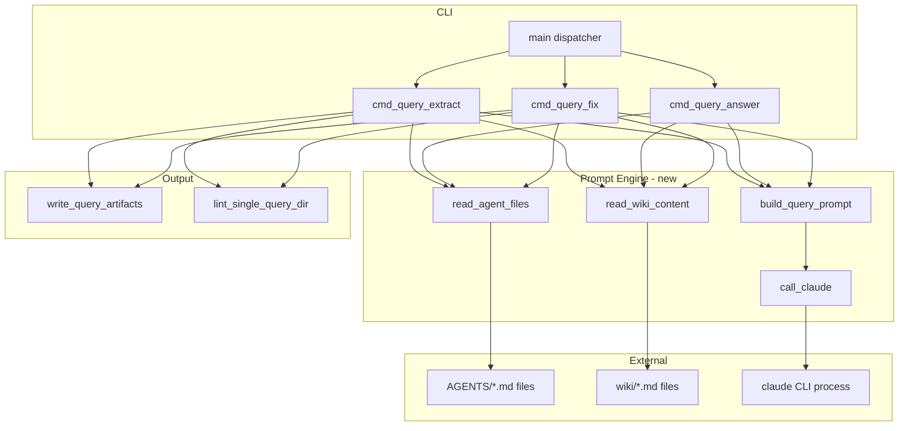
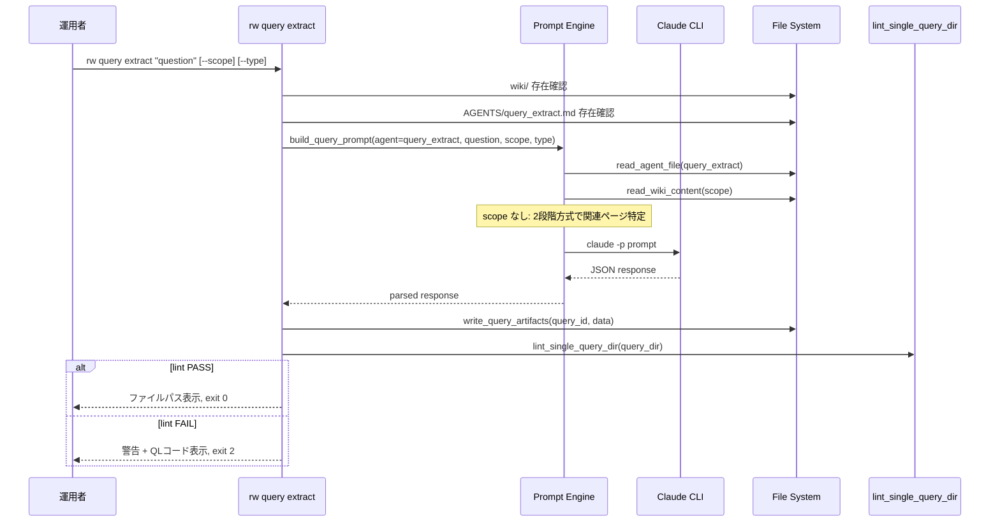
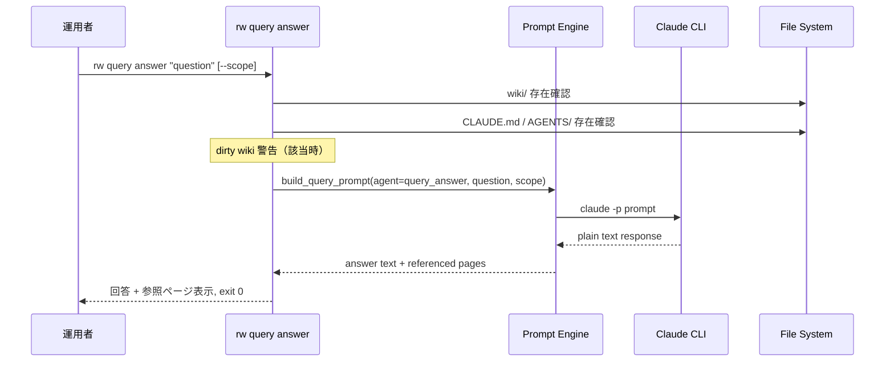
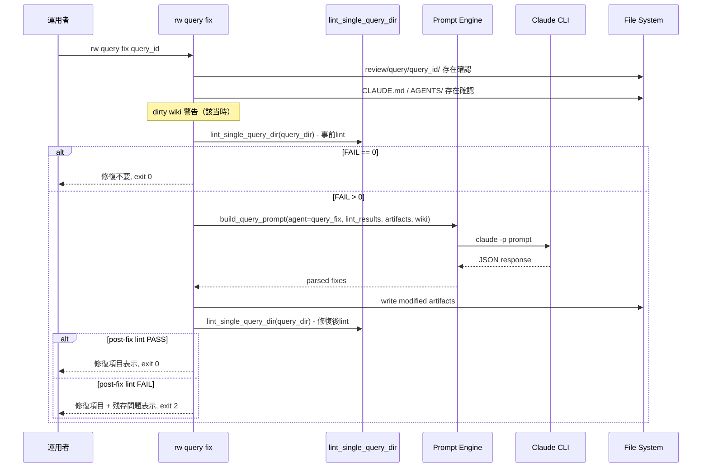

# Design Document: cli-query

## Overview

**Purpose**: `rw query` サブコマンド群（extract / answer / fix）を `scripts/rw_light.py` に追加し、wiki知識に対する構造化抽出・直接回答・lint修復のCLIインターフェースを提供する。

**Users**: Rwiki運用者が、CLIからwiki知識に対するクエリ操作を実行する。

**Impact**: 既存の `rw_light.py` にコマンドディスパッチャの拡張と新規関数群を追加する。AGENTS/ファイルをプロンプトの正規ソースとして動的に読み込む新しいパターンを導入する。

### Goals
- wiki知識からの構造化アーティファクト抽出（extract）
- wiki知識に基づく ephemeral な直接回答（answer）
- lint結果に基づくアーティファクト修復（fix）
- AGENTS/ファイルとCLIプロンプトの一元管理（ハードコード排除）

### Non-Goals
- query結果のwikiへの昇格（approve拡張として別途）
- AGENTS/ファイルのルール定義変更（agents-system管轄）
- テスト（test-suite管轄）
- クエリUI

## Boundary Commitments

### This Spec Owns
- `rw query extract / answer / fix` の3サブコマンドの実装
- AGENTS/ファイルを読み込んでプロンプトを構築する一元管理パターン（`read_agent_file()`, `build_query_prompt()`）
- extract が生成する4ファイルの書き出しロジック
- query_id の生成ロジック
- 自動lint検証の呼び出しと終了コード決定
- `templates/CLAUDE.md`・`AGENTS/*.md`・`AGENTS/README.md` の Execution Mode 更新
- `docs/user-guide.md`・`CHANGELOG.md` の追記

### Out of Boundary
- AGENTS/ファイルのルール定義・処理内容の変更
- `rw lint query` のバリデーションロジック変更
- `rw approve` の拡張（query結果の昇格）
- 既存の `call_claude_for_log_synthesis()` の改修（synthesize-logs のハードコード解消は別スコープ）

### Allowed Dependencies
- `scripts/rw_light.py` の既存ユーティリティ（`read_text`, `write_text`, `slugify`, `build_frontmatter`, `warn_if_dirty_paths`, `list_md_files`, `today`）
- `lint_single_query_dir()` 関数（自動lint検証に使用）
- `QUERY_REVIEW`, `WIKI`, `ROOT` 等の既存パス定数
- `templates/AGENTS/query_extract.md`, `query_answer.md`, `query_fix.md` — プロンプトソース
- `claude` CLI — 外部プロセスとして呼び出し

### Revalidation Triggers
- AGENTS/query_*.md のセクション構造変更（プロンプト埋め込み方式に影響）
- lint query の QL コード追加・変更（fix の修復対象に影響）
- Claude CLI の `-p` フラグの動作変更
- `rw_light.py` のユーティリティ関数シグネチャ変更

## Architecture

### Existing Architecture Analysis

既存の `rw_light.py` は単一ファイルのCLIで以下のパターンを持つ:
- モジュール先頭のパス定数群（`ROOT`, `RAW`, `REVIEW`, `WIKI` 等）
- `read_text()` / `write_text()` / `slugify()` / `build_frontmatter()` 等のユーティリティ関数
- コマンドごとの `cmd_<name>() -> int` 関数（終了コードを返す）
- `main()` での `sys.argv` ベースのディスパッチャ

cli-query はこのパターンを踏襲し、新規関数を同一ファイルに追加する。

### Architecture Pattern & Boundary Map



**Architecture Integration**:
- Selected pattern: 既存の単一ファイルCLIパターンに Prompt Engine レイヤーを追加
- Existing patterns preserved: `cmd_<name>() -> int` パターン、ユーティリティ関数群
- New components rationale: Prompt Engine は Req 9（一元管理）を実現するために必要。AGENTS/ファイル読み込み→プロンプト構築→Claude CLI呼び出しを分離
- Dependency direction: CLI Commands → Prompt Engine → External（単方向）

### Technology Stack

| Layer | Choice / Version | Role in Feature | Notes |
|-------|------------------|-----------------|-------|
| CLI | Python 3.10+ | コマンド実装 | 既存の `rw_light.py` に追加 |
| External Process | `claude` CLI | LLM回答生成 | `subprocess.run` で呼び出し |
| Data | Markdown + JSON files | 入出力 | 既存のファイル操作ユーティリティ使用 |

## File Structure Plan

### Modified Files

```
scripts/
└── rw_light.py    # 既存ファイルに以下を追加:
                   # - Prompt Engine 関数群（read_agent_file, read_wiki_content, build_query_prompt, call_claude）
                   # - cmd_query_extract(), cmd_query_answer(), cmd_query_fix()
                   # - generate_query_id()
                   # - write_query_artifacts()
                   # - parse_extract_response(), parse_fix_response()
                   # - main() ディスパッチャに query サブコマンド追加
```

```
templates/
├── CLAUDE.md              # マッピング表の Execution Mode 更新（query 3行）
└── AGENTS/
    ├── query_extract.md   # Execution Mode セクション更新
    ├── query_answer.md    # Execution Mode セクション更新
    ├── query_fix.md       # Execution Mode セクション更新
    └── README.md          # エージェント一覧テーブル更新
```

```
docs/
└── user-guide.md          # query コマンドリファレンス追記
```

```
CHANGELOG.md               # [Unreleased] に cli-query エントリ追記
```

## System Flows

### query extract フロー



### query answer フロー



### query fix フロー



## Requirements Traceability

| Requirement | Summary | Components | Flows |
|-------------|---------|------------|-------|
| 1.1-1.2 | extract 4ファイル生成・成功終了 | cmd_query_extract, write_query_artifacts | extract フロー |
| 1.3-1.5 | --scope, --type オプション | build_query_prompt | extract フロー |
| 1.6-1.7 | query_id 生成・重複チェック | generate_query_id | extract フロー |
| 1.8 | [INFERENCE] マーカー | build_query_prompt（AGENTS/ファイルに定義済み） | — |
| 1.9 | usage 表示 | main() ディスパッチャ | — |
| 2.1-2.3 | answer stdout 表示・ファイル非生成 | cmd_query_answer | answer フロー |
| 2.4 | answer --scope | build_query_prompt | answer フロー |
| 2.5-2.6 | wiki不十分時・終了コード | cmd_query_answer | answer フロー |
| 3.1-3.4 | fix lint基盤修復・最小編集 | cmd_query_fix, build_query_prompt | fix フロー |
| 3.5-3.6 | fix wiki参照・evidence非創作 | build_query_prompt（AGENTS/query_fix.mdに定義） | fix フロー |
| 3.7-3.9 | fix 修復不要・部分修復・自動lint再検証 | cmd_query_fix, lint_single_query_dir | fix フロー |
| 4.1-4.4 | 4ファイル必須フィールド | write_query_artifacts | — |
| 4.5, 4.7 | 自動lint検証・FAIL時非ゼロ終了 | cmd_query_extract（lint呼び出し） | extract フロー |
| 4.6 | query_id 形式・naming.md準拠 | generate_query_id, slugify | — |
| 5.1-5.4 | 知識フロー遵守 | 全コマンド（出力先・ソース制約） | — |
| 5.5 | dirty wiki 警告 | cmd_query_extract, cmd_query_answer | — |
| 5.6 | 自動コミットなし | 全コマンド（コミット呼び出しなし） | — |
| 6.1-6.5 | エラー処理 | 全コマンド | 各フロー |
| 7.1-7.2 | ドキュメント更新 | docs/user-guide.md, CHANGELOG.md | — |
| 8.1-8.3 | 実行モード更新 | templates/CLAUDE.md, AGENTS/*.md, README.md | — |
| 9.1-9.2 | プロンプト一元管理 | read_agent_file, build_query_prompt | — |

## Components and Interfaces

| Component | Layer | Intent | Req Coverage | Key Dependencies | Contracts |
|-----------|-------|--------|--------------|------------------|-----------|
| Prompt Engine | Core | CLAUDE.mdマッピングパース→エージェント+ポリシー読み込み→プロンプト構築→Claude呼び出し | 9.1, 9.2 | CLAUDE.md (P0), AGENTS/ files (P0), claude CLI (P0) | Service |
| cmd_query_extract | CLI | extract サブコマンド | 1.1-1.8, 4.1-4.7, 5.1-5.6 | Prompt Engine (P0), lint (P0) | — |
| cmd_query_answer | CLI | answer サブコマンド | 2.1-2.6, 5.2-5.5 | Prompt Engine (P0) | — |
| cmd_query_fix | CLI | fix サブコマンド | 3.1-3.9, 5.1-5.2, 5.5-5.6 | Prompt Engine (P0), lint (P0) | — |
| write_query_artifacts | Output | 4ファイル書き出し | 4.1-4.4 | write_text, build_frontmatter (P0) | — |
| generate_query_id | Utility | query_id 生成 | 4.6 | slugify, today (P0) | — |

### Prompt Engine

| Field | Detail |
|-------|--------|
| Intent | CLAUDE.md マッピング表を正規ソースとしてエージェント+ポリシーを特定・読み込み、プロンプトを構築し、Claude CLIを呼び出す |
| Requirements | 9.1, 9.2 |

**Responsibilities & Constraints**
- CLAUDE.md のマッピング表を実行時にパースし、タスクに必要なエージェント+ポリシーを特定する
- 特定されたファイルをランタイムで読み込み、プロンプトに丸ごと埋め込む
- Pythonコード内にプロンプトルールおよびマッピング情報をハードコードしない
- CLAUDE.md・AGENTS/ファイルが更新されると次回実行で自動的に反映される

**Dependencies**
- Inbound: cmd_query_extract / answer / fix — プロンプト構築を依頼 (P0)
- External: CLAUDE.md — マッピング表の正規ソース (P0)
- External: AGENTS/*.md files — プロンプトソース（エージェント+ポリシー） (P0)
- External: `claude` CLI — LLM実行 (P0)
- External: wiki/*.md files — 知識ソース (P0)

**Contracts**: Service [x]

##### Service Interface

```python
def parse_agent_mapping(claude_md_path: str) -> dict[str, dict[str, Any]]:
    """CLAUDE.md のマッピング表をパースし、タスク→エージェント+ポリシーの辞書を返す。

    パース手順:
    1. CLAUDE.md を read_text() で読み込む
    2. ヘッダー列名（Task, Agent, Policy, Execution Mode）でテーブル位置と列順を特定
    3. 各データ行を解析し、Policy 列はカンマ区切りでリスト化

    バリデーション:
    - 必須列（Task, Agent, Policy）が存在すること
    - 各行のAgent パスが空でないこと

    Returns:
        {"query_extract": {"agent": "AGENTS/query_extract.md",
                           "policies": ["AGENTS/naming.md", "AGENTS/page_policy.md"],
                           "mode": "Prompt"}, ...}

    Raises:
        ValueError: マッピング表が見つからない、必須列が欠落、またはパース不能な場合
    """

def load_task_prompts(task_name: str) -> str:
    """タスクに必要なエージェント+ポリシーを CLAUDE.md マッピングに基づいて読み込み、結合して返す。

    手順:
    1. parse_agent_mapping() でマッピングを取得
    2. task_name に対応するエージェントファイルを読み込む
    3. 対応するポリシーを全て読み込む
    4. エージェント + ポリシーを結合して返す

    ファイル存在検証:
    - エージェントファイルが存在しない場合は FileNotFoundError
    - ポリシーが存在しない場合も FileNotFoundError

    Raises:
        ValueError: task_name がマッピング表に存在しない場合
        FileNotFoundError: エージェントまたはポリシーが存在しない場合
    """

def read_wiki_content(scope: str | None) -> str:
    """wiki/ のコンテンツを収集して返す。

    Args:
        scope: 指定時はそのページのみ読み込む。None時は全ファイル読み込み（小規模wiki）
               または cmd_* が2段階方式でオーケストレーションする。

    Raises:
        FileNotFoundError: wiki/ が存在しない場合
        ValueError: wiki/ に .md ファイルが存在しない場合
    """

def build_query_prompt(
    task_prompts: str,
    question: str,
    wiki_content: str,
    *,
    query_type: str | None = None,
    lint_results: dict[str, Any] | None = None,
    existing_artifacts: dict[str, str] | None = None,
) -> str:
    """エージェント+ポリシーの内容とコンテキストからプロンプトを構築する。

    Args:
        task_prompts: load_task_prompts() の結果（エージェント+ポリシーの結合テキスト）

    プロンプト構造:
    1. エージェント+ポリシーの内容（ルール定義）
    2. wikiコンテンツ（知識ソース）
    3. 質問文またはタスク指示
    4. 出力形式指定（extract/fix: JSON, answer: plaintext）
    """

def call_claude(prompt: str) -> str:
    """Claude CLI を呼び出してレスポンスを返す。

    Raises:
        RuntimeError: Claude CLI がエラーを返した場合
    """
```

**パーサー脆弱性の3層緩和策**
1. **ランタイム検証**: `parse_agent_mapping()` が必須列の存在・各行のフィールド妥当性・パス先ファイルの実在を検証。不正な場合は `ValueError` / `FileNotFoundError` で即座に停止
2. **テスト**: 現在の CLAUDE.md に対してパーサーが正しく動作することを検証するテストを実装
3. **Revalidation Triggers**: CLAUDE.md マッピング表の形式変更時にパーサーの確認を促す（既に記載済み）

**Implementation Notes**
- `build_query_prompt()` は出力形式指定でサブコマンドの違いを吸収する（task_prompts はエージェント+ポリシーの結合テキスト）
- extract: JSON出力を指示（4ファイル内容を含む構造化レスポンス）
- answer: プレーンテキスト出力を指示（参照ページリストを末尾に含める）
- fix: JSON出力を指示（修正後ファイル内容 + 修正項目リスト）
- 2段階方式（scope なし時）: `cmd_*` がオーケストレーションする。1回目で `call_claude()` に index.md + 質問文を渡して関連ページを特定、2回目で `read_wiki_content()` に特定されたページパスを渡してコンテンツを収集し、本プロンプトを構築する。`read_wiki_content()` 自体は Claude CLI を呼ばない（純粋なファイル読み込み）

### cmd_query_extract

| Field | Detail |
|-------|--------|
| Intent | wiki知識から構造化アーティファクトを抽出して review/query/ に配置する |
| Requirements | 1.1-1.8, 4.1-4.7, 5.1-5.6, 6.1-6.2, 6.4-6.5 |

**フロー**:
1. 引数パース（question, --scope, --type）
2. 前提条件チェック（wiki/ 存在、AGENTS/ 存在、dirty 警告）
3. `generate_query_id(question)` で query_id 生成、重複チェック
4. `build_query_prompt(agent_name="query_extract", ...)` でプロンプト構築
5. `call_claude(prompt)` → JSON レスポンス
6. `parse_extract_response(response)` → 4ファイルデータ
7. `write_query_artifacts(query_id, data)` → ファイル書き出し
8. `lint_single_query_dir(query_dir)` → 自動lint検証
9. lint結果に基づく終了コード（0: PASS, 2: FAIL）

### cmd_query_answer

| Field | Detail |
|-------|--------|
| Intent | wiki知識に基づく ephemeral な直接回答を stdout に表示する |
| Requirements | 2.1-2.6, 5.2-5.5, 6.1, 6.4-6.5 |

**フロー**:
1. 引数パース（question, --scope）
2. 前提条件チェック（wiki/ 存在、AGENTS/ 存在、dirty 警告）
3. `build_query_prompt(agent_name="query_answer", ...)` でプロンプト構築
4. `call_claude(prompt)` → プレーンテキストレスポンス
5. 回答と参照ページを stdout に表示
6. 終了コード 0

### cmd_query_fix

| Field | Detail |
|-------|--------|
| Intent | lint結果に基づいてクエリアーティファクトを修復する |
| Requirements | 3.1-3.9, 5.1-5.2, 5.5-5.6, 6.1-6.3, 6.5 |

**フロー**:
1. 引数パース（query_id）
2. 前提条件チェック（query_id ディレクトリ存在、AGENTS/ 存在）
3. `lint_single_query_dir(query_dir)` → 事前lint
4. FAIL == 0 → 「修復不要」exit 0
5. `build_query_prompt(agent_name="query_fix", lint_results=..., existing_artifacts=..., wiki_content=...)` でプロンプト構築
6. `call_claude(prompt)` → JSON レスポンス
7. `parse_fix_response(response)` → 修正データ
8. 修正ファイル書き出し（変更が必要なファイルのみ）
9. `lint_single_query_dir(query_dir)` → 修復後lint再検証
10. lint結果に基づく終了コード（0: PASS, 2: FAIL残存）

### write_query_artifacts

| Field | Detail |
|-------|--------|
| Intent | 4ファイル（question.md, answer.md, evidence.md, metadata.json）を書き出す |
| Requirements | 4.1-4.4 |

```python
def write_query_artifacts(
    query_id: str,
    data: dict[str, Any],
) -> list[str]:
    """review/query/<query_id>/ に4ファイルを書き出す。

    CLI が generate_query_id() で生成した query_id を正とする。
    Claude CLI レスポンス内の query_id は無視し、CLI 生成の query_id で
    metadata.json の query_id フィールドおよびディレクトリ名を上書きする。

    Returns:
        生成したファイルパスのリスト
    """
```

### generate_query_id

| Field | Detail |
|-------|--------|
| Intent | 質問文から YYYYMMDD-<slug> 形式の query_id を生成する |
| Requirements | 4.6 |

```python
def generate_query_id(question: str) -> str:
    """YYYYMMDD-<slugify(question)> 形式の query_id を生成する。
    
    slugify は既存関数を使用（ASCII, lowercase, hyphen, max 80 chars）。
    """
    return f"{today().replace('-', '')}-{slugify(question)}"
```

## Data Models

### question.md 出力フォーマット

lint query が `query:`, `query_type:`, `scope:` をキーバリュー形式（正規表現 `^key\s*:\s*value$`）でパースする。YAML frontmatter または本文中のキーバリューペアのいずれでもよい。本設計ではキーバリュー形式を採用する:

```markdown
query: <質問文>
query_type: <fact|structure|comparison|why|hypothesis>
scope: <参照スコープ>
date: <YYYY-MM-DD>
```

### Claude CLI extract レスポンス JSON スキーマ

```json
{
  "query": {
    "text": "質問文",
    "query_type": "fact|structure|comparison|why|hypothesis",
    "scope": "参照スコープ",
    "date": "YYYY-MM-DD"
  },
  "answer": {
    "content": "構造化された回答（Markdown）"
  },
  "evidence": {
    "blocks": [
      {
        "source": "wiki/concepts/example.md",
        "excerpt": "抜粋テキスト"
      }
    ]
  },
  "metadata": {
    "query_id": "20260417-example-slug",
    "query_type": "fact",
    "scope": "wiki/concepts/",
    "sources": ["wiki/concepts/example.md"],
    "created_at": "2026-04-17T12:00:00+09:00"
  },
  "referenced_pages": ["wiki/concepts/example.md"]
}
```

### Claude CLI fix レスポンス JSON スキーマ

```json
{
  "fixes": [
    {
      "file": "answer.md",
      "ql_code": "QL006",
      "action": "content expanded"
    }
  ],
  "files": {
    "question.md": "修正後の内容（変更がある場合のみ）",
    "answer.md": "修正後の内容",
    "evidence.md": null,
    "metadata.json": null
  },
  "skipped": [
    {
      "ql_code": "QL001",
      "reason": "ファイル欠落は Claude CLI で修復不可"
    }
  ]
}
```

## Error Handling

### Error Strategy

全コマンドで共通のエラー処理パターン:
1. 前提条件チェック（ファイル存在、ディレクトリ存在）→ 即座にエラーメッセージ + exit 1
2. Claude CLI 呼び出し → RuntimeError キャッチ → エラーメッセージ + exit 1
3. レスポンスパース → ValueError/json.JSONDecodeError キャッチ → パースエラー + exit 1（部分書き込みなし）
4. 自動lint検証 → FAIL 時は exit 2（ファイルは保持）

### Error Categories and Responses

| エラー種別 | 検出タイミング | 終了コード | 対応 |
|-----------|-------------|-----------|------|
| wiki/ 不在・空 | 前提条件チェック | 1 | 6.4 |
| AGENTS/ 不在 | 前提条件チェック | 1 | 6.5 |
| query_id 重複 | query_id 生成後 | 1 | 1.7 |
| query_id ディレクトリ不在（fix） | 前提条件チェック | 1 | 6.3 |
| Claude CLI 失敗 | call_claude() | 1 | 6.1 |
| レスポンスパースエラー | parse_*_response() | 1 | 6.2 |
| 自動lint FAIL（extract） | lint検証 | 2 | 4.7 |
| 修復後lint FAIL（fix） | 修復後lint再検証 | 2 | 3.8+3.9 |

## Testing Strategy

### Unit Tests
- `generate_query_id()`: 日付プレフィックス・スラッグ生成・80文字上限・非ASCII処理（4.6）
- `read_agent_file()`: 正常読み込み・ファイル不在時のエラー（9.1, 6.5）
- `parse_extract_response()`: 正常JSON・不正JSON・必須フィールド欠落（6.2, 4.1-4.4）
- `parse_fix_response()`: 正常JSON・修復項目パース・スキップ項目パース（3.2, 3.8）
- `write_query_artifacts()`: 4ファイル書き出し・ディレクトリ作成（4.1-4.4）

### Integration Tests
- extract E2E: question → Claude CLI mock → 4ファイル生成 → lint 通過（1.1, 1.2, 4.5）
- answer E2E: question → Claude CLI mock → stdout 表示・ファイル非生成（2.1, 2.3）
- fix E2E: lint FAIL のアーティファクト → Claude CLI mock → 修復 → lint再検証（3.1, 3.9）
- エラーハンドリング: Claude CLI 失敗時の部分ファイル非生成確認（6.2）
- dirty wiki 警告: wiki/ に未コミット変更がある状態での警告表示確認（5.5）

### E2E Tests
- extract → lint → fix ワークフロー: 生成→lint FAIL→修復→lint PASS の完全フロー
- AGENTS/ファイル更新反映: AGENTS/ファイル変更後に extract を実行し、変更が反映されることを確認（9.2）
- --scope オプション: 特定ページのみをソースとした extract/answer の実行（1.3, 2.4）

## Implementation Notes

- `rw_light.py` 内の関数追加位置: 既存の `cmd_approve()` の後、`cmd_lint_query()` の前に query 関連関数をまとめて配置する
- 既存の `call_claude_for_log_synthesis()` は変更しない（Out of Boundary）。新規の `call_claude()` は汎用版として設計し、将来的に synthesize-logs の改修時にも利用可能にする
- 2段階方式の wiki コンテンツ特定（scope なし時）: 1回目の Claude CLI 呼び出しで関連ページのパスリストを JSON で返させ、2回目でそれらのページ内容を含めた本プロンプトを構築する。小規模wiki（ファイル数 ≤ 20）の場合はこの手順をスキップし、全ファイルを含める
- query answer の参照ページ表示（2.2）: Claude CLI のレスポンスに参照ページリストを含めるよう指示する。プレーンテキスト末尾に `---\nReferenced: page1.md, page2.md` 形式で出力
- 終了コード 2（lint FAIL）は既存の `cmd_lint_query()` の体系と一致させる
