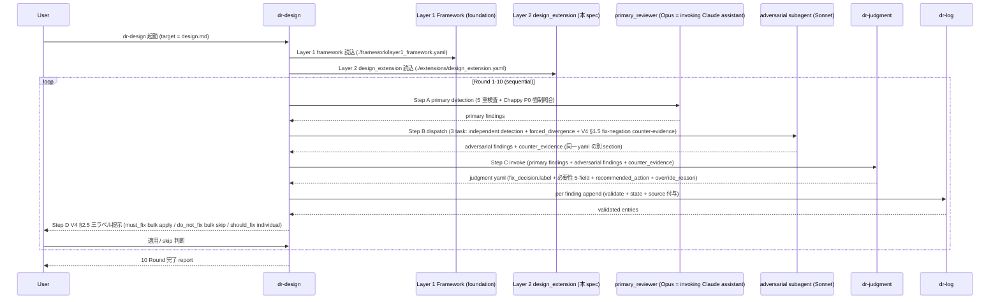
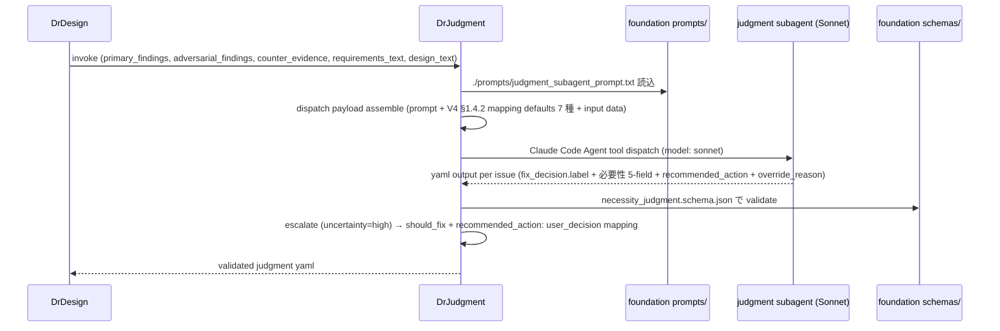
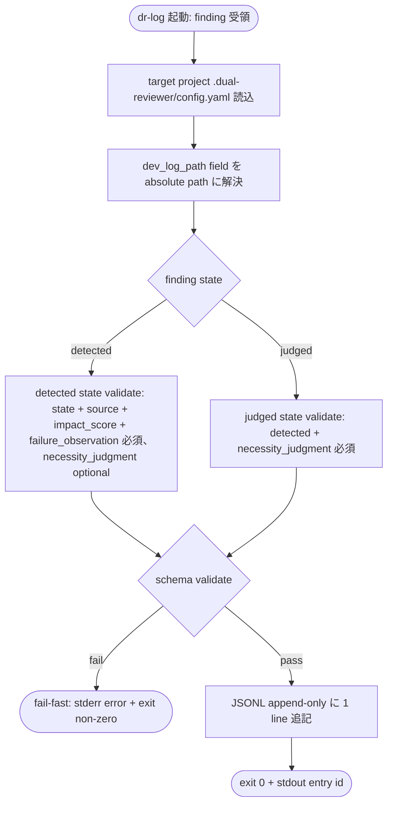

# Design Document

## Overview

`dual-reviewer-design-review` は dual-reviewer の **主 review 機能** を提供する設計である。本設計の成果物は (a) 3 skills (`dr-design` / `dr-log` / `dr-judgment`) + (b) Layer 2 design extension yaml + (c) forced_divergence prompt template (本 spec design phase で文言確定、英語固定) を `scripts/dual_reviewer_prototype/` (= foundation install location と同 directory) 配下に追加配置する。

**Purpose**: foundation Layer 1 framework + 共通 schema + portable artifact を import し、design phase の 10 ラウンド review を 3 subagent 構成 (primary Opus + adversarial Sonnet + judgment Sonnet、V4 §1.2 option C) で orchestrate する skill 実装 + Layer 2 extension を提供する。本 spec 完成で `dual-reviewer-dogfeeding` spec が Spec 6 design phase に dual-reviewer prototype を適用 + 3 系統対照実験を実行可能となる。

**Users**: (a) dogfeeding 適用者 (`dual-reviewer-dogfeeding` spec author / 実装者) / (b) design phase review を実行する spec author / (c) Layer 3 project 固有 patterns / terminology を attach する maintainer.

**Impact**: `scripts/dual_reviewer_prototype/` directory に Layer 2 + 3 skills + forced_divergence prompt を追加 (foundation 配下に並走配置)。foundation 自身 + 既存 Rwiki spec (Spec 0-7) には影響しない。

### Goals

- 3 skills (`dr-design` / `dr-log` / `dr-judgment`) を Claude Code skill format (SKILL.md + Python helper script) で実装、kiro-* skill + foundation `dr-init` と統一パターン
- Layer 2 design extension を `extensions/design_extension.yaml` として foundation Layer 1 attach contract に従い配置
- forced_divergence prompt template を `prompts/forced_divergence_prompt.txt` (英語固定 3 段落、本 spec design phase で文言確定) に配置
- foundation 提供の全 artifact を relative path (`./patterns/` / `./prompts/` / `./schemas/` / `./framework/`) で動的読込 (hardcode 禁止)
- 3 系統対照実験 (single + dual + dual+judgment) で同一 dr-log skill が動作する schema variant 対応 (state field + source field 切替)
- Phase A scope (3 役 subagent / 単純逐次 / B-1.0 minimum / sample 1 round 通過レベル) を厳守

### Non-Goals

- foundation 本体 (`dual-reviewer-foundation` spec の責務) — Layer 1 framework + 共通 schema + seed/fatal patterns yaml + V4 §5.2 prompt + dr-init skill
- Spec 6 への dogfeeding 実適用 + 3 系統対照実験 (`dual-reviewer-dogfeeding` spec の責務) — 本 spec は sample 1 round 通過レベルの動作確認のみ
- tasks / requirements / implementation phase の review extension (B-1.x で別 spec)
- cycle automation skills (`dr-extract` / `dr-update`、B-1.2)
- multi-vendor support (Claude vs GPT vs Gemini、B-2)
- hypothesis generator role 3 体構成 (Chappy 保留 1、B-2 以降)
- B-1.x 拡張 schema (`decision_path` / `skipped_alternatives` / `bias_signal`)
- 並列処理本格実装 + 整合性 Round 6 task (B-1.x 以降)
- Phase B 独立 fork (npm package 化 / GitHub repo 公開 / collective learning network)
- 全 10 ラウンド完走 + 対照実験 (本 spec scope 外)

## Boundary Commitments

### This Spec Owns

- `dr-design` skill (10 ラウンド orchestration + Layer 2 design extension import + Step A/B/C/D 構造 V4 §1.2 option C 整合 + adversarial subagent dispatch + dr-judgment skill invoke + dr-log skill invoke + Chappy P0 全機能 invocation + V4 §1 機能 5 件 invocation + Step 1a/1b/1b-v 5 重検査 + escalate 必須条件 5 種)
- `dr-log` skill (JSONL append-only 構造化記録 + foundation 共通 schema 2 軸並列 validate + 3 系統対応 = `detected` state / `judged` state 区別 + source field 切替 + adversarial_counter_evidence field 付与)
- `dr-judgment` skill (V4 §5.2 prompt template 内蔵 + judgment subagent dispatch + 必要性 5-field 評価 + 5 条件判定ルール + semi-mechanical mapping default 7 種 + 3 ラベル分類 + recommended_action + override_reason + escalate → should_fix + user_decision mapping)
- Layer 2 design extension (`extensions/design_extension.yaml`、10 ラウンド観点 + Phase 1 escalate 3 メタパターン + design phase 固有 bias 抑制 quota + escalate 必須条件 5 種 + Chappy P0 invocation reference + V4 §1 features invocation reference)
- forced_divergence prompt template (`prompts/forced_divergence_prompt.txt`、英語固定 3 段落、本 spec design phase で文言確定)
- Foundation Integration 規約 (3 skills が foundation 提供 artifact を relative path 規約 + override 階層 + hardcode 禁止 で動的読込)
- Phase A Scope Constraints (3 役 subagent / 単純逐次運用 / B-1.0 minimum schema / sample 1 round 通過レベル / Phase B fork out of scope)

### Out of Boundary

- foundation 自体 (`dual-reviewer-foundation` spec) — Layer 1 framework + 共通 schema + seed/fatal patterns yaml + V4 §5.2 prompt template + dr-init skill
- dogfeeding 適用 (`dual-reviewer-dogfeeding` spec) — Spec 6 への実適用 + 3 系統対照実験 (single + dual + dual+judgment) + 比較 metric 抽出 + 論文 figure 用データ生成 + Phase B fork go/hold 判断
- tasks / requirements / implementation phase の review extension (B-1.x で別 spec)
- cycle automation skills (`dr-extract` / `dr-update`、B-1.2 release lifecycle)
- multi-vendor support (B-2 release lifecycle)
- hypothesis generator role 3 体構成 (Chappy 保留 1、B-2 以降)
- B-1.x 拡張 schema (`decision_path` / `skipped_alternatives` / `bias_signal`、自由記述 + 内省、A-2 後半 〜 Phase 3 で実装)
- 並列処理本格実装 + 整合性 Round 6 task (B-1.x 以降)
- Phase B 独立 fork (npm package 化 / GitHub repo 公開 / collective learning network)
- 全 10 ラウンド完走 + 対照実験 (`dual-reviewer-dogfeeding` spec 責務)
- pattern data 自体の更新 (foundation `./patterns/seed_patterns.yaml` の version 増分等は foundation 責務、本 spec は読込のみ)
- foundation install location 変更 (foundation Boundary Context 整合)
- pattern matching logic を fatal_patterns.yaml の data 内容に追加すること (本 spec は data 提供 spec ではない、foundation 責務)

### Allowed Dependencies

- **Upstream**: `dual-reviewer-foundation` (Layer 1 framework + 共通 JSON schema 2 軸並列 + `seed_patterns.yaml` 23 件 + `fatal_patterns.yaml` 8 種固定 + V4 §5.2 judgment subagent prompt template + JSON Schema files + foundation Boundary Context 整合の install location 規約)
- **言語 / Runtime**:
  - Python 3.10+ (3 skills の helper script、foundation 整合)
  - yaml 1.2 parser (Python `yaml` library、Layer 2 extension yaml + foundation seed/fatal/config 読込)
  - Python `jsonschema` library (foundation 共通 schema 2 軸並列 validate、Draft 2020-12 サポート)
- **Claude Code 機能**:
  - skill invocation system (SKILL.md format) — 3 skills の起動基盤 (foundation `dr-init` 整合)
  - Agent tool — adversarial subagent dispatch (Sonnet) + judgment subagent dispatch (Sonnet)、`subagent_type: general-purpose` + `model: sonnet`
- **既存 Rwiki repo 構造**:
  - `scripts/dual_reviewer_prototype/` (foundation install location、本 spec も同 directory に追加配置)
- **方針 / Reference (改変禁止 SSoT)**:
  - foundation/design.md v1.1 (foundation install location + relative path 規約 + override 階層 + attach contract 3 要素 + placeholder_resolution rule)
  - `.kiro/methodology/v4-validation/v4-protocol.md` v0.3 final
  - foundation Req 1 AC5 + AC6 + AC9 (attach contract 3 要素 + override 階層)
  - foundation Req 3 (共通 schema 2 軸並列 + state field 切替 + B-1.0 minimum required)
  - foundation Req 6 (V4 §5.2 prompt template byte-level 整合)

### Revalidation Triggers

以下の変更は `dual-reviewer-dogfeeding` spec に対する revalidation を要求する:

- 3 skill (`dr-design` / `dr-log` / `dr-judgment`) の skill invocation 規約変更 → dogfeeding skill 起動 logic に影響
- Layer 2 design extension yaml の 10 ラウンド観点 / Phase 1 patterns / quota structure 変更 → dogfeeding spec の review 観点 mapping 影響
- forced_divergence prompt template 文言変更 → dogfeeding 3 系統対照実験の adversarial 動作整合に影響
- adversarial subagent dispatch の prompt 構造変更 (3 task = independent detection + forced_divergence + V4 §1.5 fix-negation の役割分離変更) → dogfeeding ablation framing 影響
- judgment subagent dispatch payload 構造変更 → dogfeeding metric 抽出 logic に影響
- dr-log JSONL schema (state field / source field / adversarial_counter_evidence field) の variant 規約変更 → dogfeeding 3 系統 log 比較に影響
- 3 skill が読込む foundation install location relative path 規約変更 → dogfeeding skill 起動時 path resolution 失敗
- **dogfeeding spec から要請される追加要件 (本 spec v1.2 で対応予定、cross-spec review C1 fix)**: (a) dr-design `--treatment` flag 対応 (single / dual / dual+judgment 3 系統で Step B/C/D 切替動作 + user 提示 skip/実行 切替) / (b) dr-log `timestamp_start` / `timestamp_end` JSONL append 時必須付与 / (c) dr-log Service Interface に `--design-md-commit-hash` payload 受領追加 — dogfeeding/design.md Decision 6 整合、本 spec design approve 後 implementation phase 直前で v1.2 改修

## Architecture

### Architecture Pattern & Boundary Map

本 spec は **Skill + Configuration Hybrid** pattern を採用する:

- **Skill 部分**: 3 active skills (`dr-design` orchestrator + `dr-log` helper + `dr-judgment` subordinate)、Claude Code skill invocation 経由起動
- **Configuration 部分**: Layer 2 design extension yaml (`extensions/design_extension.yaml`) + forced_divergence prompt text (`prompts/forced_divergence_prompt.txt`)

```mermaid
graph TB
    subgraph foundation_install_location[scripts/dual_reviewer_prototype - foundation + design-review 共有]
        L1[framework/layer1_framework.yaml<br/>Layer 1 Framework Definition]
        Schemas[schemas/<br/>5 JSON Schema files]
        SeedFatal[patterns/<br/>seed_patterns.yaml + fatal_patterns.yaml]
        JudgmentPrompt[prompts/judgment_subagent_prompt.txt<br/>V4 5.2]
        DrInit[skills/dr-init/<br/>SKILL.md + bootstrap.py]
        L2Ext[extensions/design_extension.yaml<br/>Layer 2 design extension]
        ForcedPrompt[prompts/forced_divergence_prompt.txt<br/>本 spec で確定]
        DrDesign[skills/dr-design/<br/>SKILL.md + orchestrator.py]
        DrLog[skills/dr-log/<br/>SKILL.md + log_writer.py]
        DrJudgment[skills/dr-judgment/<br/>SKILL.md + judgment_dispatcher.py]
    end

    subgraph target_project[Target Project - dr-init bootstrap 後]
        Config[.dual-reviewer/config.yaml<br/>5 field]
        DevLog[.dual-reviewer/dev_log.jsonl]
    end

    subgraph subagents[Claude Code Agent Tool 経由 dispatch]
        AdversarialAgent[adversarial subagent<br/>Sonnet]
        JudgmentAgent[judgment subagent<br/>Sonnet]
    end

    DrDesign -->|invoke| DrJudgment
    DrDesign -->|invoke| DrLog
    DrDesign -->|dispatch| AdversarialAgent
    DrJudgment -->|dispatch| JudgmentAgent
    DrJudgment -.->|read| JudgmentPrompt
    DrDesign -.->|read| ForcedPrompt
    DrDesign -.->|read| L2Ext
    DrDesign -.->|attach| L1
    DrLog -.->|validate via| Schemas
    DrLog -.->|append| DevLog
    DrLog -.->|read path| Config
    DrDesign -.->|read patterns| SeedFatal
```



**Architecture Integration**:

- 採用 pattern = Skill + Configuration Hybrid (Claude assistant が SKILL.md instructions を読込 + Python helper script で IO 処理)
- Domain 境界 = (1) dr-design (orchestration) / (2) dr-log (JSONL + schema validate) / (3) dr-judgment (subagent dispatch + 必要性評価) / (4) Layer 2 design extension (yaml configuration) / (5) forced_divergence prompt (text data)
- 既存 patterns 保持 = foundation `dr-init` skill format (SKILL.md + Python script) を踏襲
- 新規 component 根拠 = (a) review pipeline orchestration が必要 / (b) JSONL 構造化記録が研究 metric 用途 / (c) judgment 評価 + 修正必要性判定が V4 §1.2 option C 必須 / (d) Layer 2 extension が phase 固有 quota provide / (e) forced_divergence prompt が結論成立性試行用
- Steering compliance = `.kiro/steering/tech.md` Severity 4 水準 + Python 3.10+ + 2 スペースインデント + Test-Driven Development 整合
- Dependency direction = Layer 1 (foundation) → Layer 2 (本 spec extension) → Layer 3 (project 固有、target project)、override 階層は Layer 3 > Layer 2 > Layer 1 単方向

### Technology Stack

| Layer | Choice / Version | Role in Feature | Notes |
|-------|------------------|-----------------|-------|
| Skill Format | Claude Code SKILL.md | 3 skills の Claude assistant 起動基盤 | foundation `dr-init` + kiro-* skill 統一パターン |
| Helper Script | Python 3.10+ | yaml read / JSON Schema validate / JSONL append / prompt template load | foundation Python 整合 |
| YAML Parser | Python `yaml` library (1.2 サポート) | Layer 2 extension yaml + foundation config / patterns / framework yaml 読込 | 標準 PyYAML 相当 |
| JSON Schema Validator | Python `jsonschema` library (Draft 2020-12 サポート) | foundation 共通 schema 2 軸並列 validate | finding state variant + `$ref` + `allOf` + `if/then` 複合条件サポート (foundation A5 fix で確認) |
| Subagent Dispatch | Claude Code Agent tool | adversarial + judgment subagent dispatch | `subagent_type: general-purpose` + `model: sonnet` |
| Skill Invocation | Claude Code skill invocation system | dr-design → dr-judgment + dr-design → dr-log の subordinate skill invoke | Claude assistant が SKILL.md instruction に従い invoke |
| Configuration | yaml 1.2 (Layer 2 extension) + plain text (forced_divergence prompt) | static configuration data | Layer 2 = `extensions/design_extension.yaml` / forced_divergence = `prompts/forced_divergence_prompt.txt` |

## File Structure Plan

### Directory Structure

```
scripts/dual_reviewer_prototype/  # foundation install location (本 spec も同 directory に追加配置)
├── (foundation 配下、本 spec scope 外、参照のみ)
│   ├── README.md
│   ├── framework/layer1_framework.yaml
│   ├── schemas/{review_case, finding, impact_score, failure_observation, necessity_judgment}.schema.json
│   ├── patterns/{seed_patterns, fatal_patterns}.yaml
│   ├── prompts/judgment_subagent_prompt.txt
│   ├── config/config.yaml.template
│   ├── terminology/terminology.yaml.template
│   └── skills/dr-init/{SKILL.md, bootstrap.py}
├── extensions/                                # Req 4 + 5: Layer 2 design extension 配置
│   └── design_extension.yaml                  # Req 4: 10 ラウンド + Phase 1 patterns + bias 抑制 quota + escalate 必須 5 + Chappy P0 invocation + V4 §1 features invocation
├── prompts/                                   # foundation prompts/ と同 dir 共有
│   └── forced_divergence_prompt.txt           # Req 6: 英語固定 3 段落、本 spec design phase で文言確定
└── skills/                                    # foundation skills/ と同 dir 共有
    ├── dr-design/                             # Req 1: 10 ラウンド orchestration + Step A/B/C/D + Chappy P0 + V4 §1
    │   ├── SKILL.md                           # skill definition + 起動引数 + orchestration instructions
    │   └── orchestrator.py                    # helper: yaml read / Layer 2 extension load / 5 重検査 補助 logic
    ├── dr-log/                                # Req 2: JSONL append + schema validate + 3 系統対応
    │   ├── SKILL.md                           # skill definition + 起動引数 + log writing instructions
    │   └── log_writer.py                      # helper: JSONL append / JSON Schema validate / state + source field 切替
    └── dr-judgment/                           # Req 3: V4 §5.2 prompt + judgment subagent dispatch + 5-field 評価 + 3 ラベル分類
        ├── SKILL.md                           # skill definition + dispatch instructions
        └── judgment_dispatcher.py             # helper: prompt load / payload assembly / yaml output validate / escalate mapping
```

### Modified Files

- `.kiro/specs/dual-reviewer-design-review/spec.json` — design phase 完了時に `phase: design-generated` + `approvals.design.generated: true` に更新 (Step 6 で実施)

## System Flows

### Flow 1: 10 Round Review Orchestration (dr-design entry)



**Key Decisions**:
- Round 1-10 は単純 sequential (並列 + 整合性 Round 6 task は B-1.x scope)
- primary detection は invoking Claude assistant (= Opus、私) が直接実行 (subagent dispatch 不要)
- adversarial + judgment は Sonnet subagent dispatch (Claude Code Agent tool)
- dr-judgment は subordinate skill (dr-design からの skill invocation)
- dr-log は per finding helper (dr-design からの skill invocation、JSONL append-only)
- V4 §2.5 user 判断は user oversight 原則整合 (自動 apply / skip 禁止)

### Flow 2: dr-judgment Skill (Step C 実行)



**Key Decisions**:
- V4 §5.2 prompt template は foundation portable artifact から動的読込 (hardcode 禁止、Req 3 AC1)
- judgment subagent dispatch = Claude Code Agent tool (subagent_type: general-purpose、model: sonnet via config.yaml `judgment_model`)
- escalate (uncertainty=high) は foundation `fix_decision.label` 3 値 enum 整合のため `should_fix` + `recommended_action: user_decision` mapping (Req 3 AC5)
- 出力 yaml validate は foundation `necessity_judgment.schema.json` を使用

### Flow 3: dr-log Skill (Per Finding 記録)



**Key Decisions**:
- config.yaml の `dev_log_path` 動的読込 (hardcode 禁止、Req 2 AC4)
- finding state は caller (dr-design) が明示指定 (auto detection せず、Req 2 AC7 整合 = 3 系統対応)
- schema validate fail-fast は foundation Req 3 AC8 整合 (consumer skill が schema 違反時 fail-fast 可能)
- adversarial_counter_evidence field は dual / dual+judgment 系統で finding ごとに必須記録 (single 系統では省略可、Req 2 AC7 + dogfeeding Req 3 AC8 整合)

## Requirements Traceability

| Requirement | Summary | Components | Interfaces / Files | Flows |
|-------------|---------|------------|--------------------|-------|
| 1.1 | Layer 1 + Layer 2 import + Round 1-10 sequential + Step A/B/C/D V4 §1.2 option C | dr-design Skill | `skills/dr-design/{SKILL.md, orchestrator.py}` + `extensions/design_extension.yaml` | Flow 1 |
| 1.2 | Step A primary 5 重検査 (foundation seed_patterns + Layer 3 extracted_patterns 照合) | dr-design Skill | `skills/dr-design/SKILL.md` (instructions) | Flow 1 |
| 1.3 | Step B adversarial dispatch (independent + forced_divergence + V4 §1.5 fix-negation) | dr-design Skill + forced_divergence prompt | `skills/dr-design/SKILL.md` + `prompts/forced_divergence_prompt.txt` | Flow 1 |
| 1.4 | Step C dr-judgment skill invoke + yaml 受領 | dr-design Skill | `skills/dr-design/SKILL.md` (skill invocation instructions) | Flow 1, Flow 2 |
| 1.5 | Step D integration + V4 §2.5 三ラベル提示 (bulk apply / bulk skip / individual review)、自動 apply / skip 禁止 | dr-design Skill | `skills/dr-design/SKILL.md` (user oversight 原則) | Flow 1 |
| 1.6 | bias 抑制 quota event-triggered + Phase 1 escalate 3 メタパターン照合 | dr-design Skill + Layer 2 design extension | `skills/dr-design/SKILL.md` + `extensions/design_extension.yaml` | Flow 1 |
| 1.7 | Chappy P0 全機能 invocation (provide vs execute 役割分離) | dr-design Skill | `skills/dr-design/SKILL.md` (Layer 1 facility invoke) | Flow 1 |
| 1.8 | escalate 必須条件 5 種 適用 (Step 1b-v + Step 1c) | dr-design Skill + dr-judgment Skill | `skills/dr-design/SKILL.md` + `skills/dr-judgment/SKILL.md` | Flow 1, Flow 2 |
| 1.9 | Round 1-10 単純 sequential 運用 (並列 / 整合性 Round 6 task scope 外) | dr-design Skill | `skills/dr-design/SKILL.md` | Flow 1 |
| 2.1 | finding 生成時 schema validate fail-fast | dr-log Skill | `skills/dr-log/log_writer.py` | Flow 3 |
| 2.2 | foundation `./schemas/` から JSON Schema 動的読込 (hardcode 禁止) | dr-log Skill | `skills/dr-log/log_writer.py` | Flow 3 |
| 2.3 | finding state 別 field 切替 (detected = optional necessity / judged = required necessity) | dr-log Skill | `skills/dr-log/log_writer.py` | Flow 3 |
| 2.4 | JSONL append-only + dev_log_path 動的読込 (hardcode 禁止) | dr-log Skill | `skills/dr-log/log_writer.py` | Flow 3 |
| 2.5 | 失敗構造観測軸 LLM 自己ラベリング prompt 組込 | dr-log Skill (skill prompt) | `skills/dr-log/SKILL.md` | Flow 3 |
| 2.6 | schema validate 失敗時 error report (finding ID + 違反 field + 期待 enum + 実際の値) | dr-log Skill | `skills/dr-log/log_writer.py` | Flow 3 |
| 2.7 | 3 系統対応 (single = detected + primary_self_estimate / dual = detected + primary_self_estimate / dual+judgment = judged + judgment_subagent) + adversarial_counter_evidence field | dr-log Skill | `skills/dr-log/log_writer.py` | Flow 3 |
| 3.1 | foundation `./prompts/judgment_subagent_prompt.txt` 動的読込 + dispatch payload 組込 | dr-judgment Skill | `skills/dr-judgment/judgment_dispatcher.py` | Flow 2 |
| 3.2 | dispatch payload 構造 (primary findings + adversarial findings + counter_evidence + requirements + design + semi-mechanical mapping defaults 7 種)、adversarial 1 dispatch で 2 役割 別 section 出力 | dr-judgment Skill | `skills/dr-judgment/judgment_dispatcher.py` | Flow 2 |
| 3.3 | judgment_reviewer subagent dispatch (Claude Code Agent tool、model = config.yaml judgment_model) | dr-judgment Skill | `skills/dr-judgment/SKILL.md` | Flow 2 |
| 3.4 | 出力 yaml validate (V4 §1.6 = fix_decision.label + 必要性 5-field + recommended_action + override_reason) | dr-judgment Skill | `skills/dr-judgment/judgment_dispatcher.py` | Flow 2 |
| 3.5 | 5 条件判定ルール 順次評価 + escalate (uncertainty=high) → should_fix + recommended_action: user_decision mapping (`fix_decision.label` 3 値 enum 整合) | dr-judgment Skill | `skills/dr-judgment/judgment_dispatcher.py` | Flow 2 |
| 3.6 | semi-mechanical mapping default 7 種 prompt 内保持 + override 時 `override_reason` 必須記録 | dr-judgment Skill | `skills/dr-judgment/judgment_dispatcher.py` (prompt 内 mapping rule) | Flow 2 |
| 3.7 | 修正否定試行 prompt (V4 §5.2 既存組込) 維持 + Step B forced_divergence と役割分離 | dr-judgment Skill | `skills/dr-judgment/SKILL.md` (V4 §5.2 prompt 経由) | Flow 2 |
| 3.8 | 出力 yaml を dr-design に返却 (skill stdout default) + dr-log JSONL 構造化記録に直接参照可能 | dr-judgment Skill | `skills/dr-judgment/judgment_dispatcher.py` (stdout 経由 default) | Flow 2 |
| 4.1 | foundation Req 1 AC5 attach contract 3 要素準拠 | Layer 2 design extension | `extensions/design_extension.yaml` | — |
| 4.2 | 10 ラウンド観点固定 (Round 1-10、memory `feedback_design_review.md` 中庸統合版整合) + foundation seed_patterns との関連付け | Layer 2 design extension | `extensions/design_extension.yaml` (`rounds` section) | — |
| 4.3 | Phase 1 escalate 3 メタパターン (規範範囲先取り / 構造的不均一 / 文書 vs 実装不整合) | Layer 2 design extension | `extensions/design_extension.yaml` (`phase1_metapatterns` section) | — |
| 4.4 | design phase 固有 bias 抑制 quota (formal challenge / 検出漏れ / Phase 1 同型探索 / 厳しく検証 5 種) Layer 1 base に追加 + Chappy P0 quota provide vs execute 役割分離 | Layer 2 design extension | `extensions/design_extension.yaml` (`bias_suppression_quota_design_specific` section) | — |
| 4.5 | escalate 必須条件 5 種 (Step 1b-v + Step 1c 両方) | Layer 2 design extension | `extensions/design_extension.yaml` (`escalate_required_conditions` section) | — |
| 4.6 | Layer 1 framework definition file 改変なし (additional layer として attach) | Layer 2 design extension | `extensions/design_extension.yaml` (foundation framework は read-only 参照) | — |
| 4.7 | override 階層整合 (Layer 3 > Layer 2 > Layer 1) | Layer 2 design extension | `extensions/design_extension.yaml` (Layer 3 override 受入容認) | — |
| 5.1 | 3 skills が `./patterns/` + `./prompts/` + `./schemas/` で foundation artifact locate (canonical `./` prefix) | All 3 skills | `skills/{dr-design, dr-log, dr-judgment}/*.py` (relative path resolution) | — |
| 5.2 | foundation install location concrete absolute path 確定 (本 spec design phase) | Foundation Integration | 本 spec design phase で `scripts/dual_reviewer_prototype/` 確定 (foundation 設計決定 5 + 1 整合) | — |
| 5.3 | dr-design が seed_patterns.yaml の version 起動時読込 (hardcode 禁止) | dr-design Skill | `skills/dr-design/orchestrator.py` | — |
| 5.4 | dr-design が fatal_patterns.yaml 8 種 enum 動的読込 (hardcode 禁止) | dr-design Skill | `skills/dr-design/orchestrator.py` | — |
| 5.5 | dr-judgment が V4 §5.2 prompt template 動的読込 (hardcode 禁止) | dr-judgment Skill | `skills/dr-judgment/judgment_dispatcher.py` | Flow 2 |
| 5.6 | dr-log が JSON Schema files 動的読込 (hardcode 禁止) | dr-log Skill | `skills/dr-log/log_writer.py` | Flow 3 |
| 5.7 | foundation `terminology.yaml` placeholder + Layer 3 attach (override 階層 = Layer 3 > Layer 2) | All 3 skills | `skills/{dr-design, dr-log, dr-judgment}/SKILL.md` (Layer 3 terminology attach 整合) | — |
| 6.1 | 本 spec design phase で文言確定 (foundation Req 7 AC4 委任) | forced_divergence Prompt Template | `prompts/forced_divergence_prompt.txt` | — |
| 6.2 | 英語固定 (single canonical form) | forced_divergence Prompt Template | `prompts/forced_divergence_prompt.txt` | — |
| 6.3 | 素案 base + 精緻化 (brief.md §Approach 1 文 + 役割分離明示) | forced_divergence Prompt Template | `prompts/forced_divergence_prompt.txt` (本 design phase で確定文言) | — |
| 6.4 | adversarial_reviewer subagent prompt 末尾追加 + V4 §1.5 fix-negation prompt の配置先確定 (本 spec design phase で inline embed 確定) | dr-design Skill + forced_divergence Prompt Template | `skills/dr-design/SKILL.md` (adversarial dispatch payload 内 inline embed) + `prompts/forced_divergence_prompt.txt` | Flow 1 |
| 6.5 | judgment 用 fix-negation prompt と異なる役割明示 (結論成立性試行) | forced_divergence Prompt Template | `prompts/forced_divergence_prompt.txt` (役割分離明示 段落) | — |
| 6.6 | foundation install location とは独立した本 spec install location 直下に配置 (= `prompts/forced_divergence_prompt.txt`) | forced_divergence Prompt Template | `prompts/forced_divergence_prompt.txt` (foundation prompts/ と同 dir 共有) | — |
| 7.1 | subagent 構成 3 役限定 (Claude family rotation / multi-vendor / hypothesis generator out of scope) | All 3 skills | `skills/{dr-design, dr-log, dr-judgment}/SKILL.md` (3 役 only) | — |
| 7.2 | Round 1-10 単純 sequential 運用 (並列 / fall back / 派生再実行 out of scope) | dr-design Skill | `skills/dr-design/SKILL.md` (sequential 構造) | Flow 1 |
| 7.3 | B-1.0 minimum schema 必須付与 (失敗構造観測軸 3 要素 + 修正必要性判定軸)、B-1.x 拡張 schema scope 外 | dr-log Skill | `skills/dr-log/log_writer.py` (B-1.0 schema only) | — |
| 7.4 | sample 1 round 通過 pass criteria (Step A/B/C/D 完了 + JSONL 1 entry validate + V4 §2.5 三ラベル提示 yaml stdout) | All 3 skills (動作確認終端条件) | `skills/{dr-design, dr-log, dr-judgment}/*` (sample 1 round 動作テスト) | Flow 1, Flow 2, Flow 3 |
| 7.5 | Phase A scope = Rwiki repo 内 prototype (Phase B fork out of scope、prototype 配置 = `scripts/dual_reviewer_prototype/`) | All artifacts | `scripts/dual_reviewer_prototype/` 配下 | — |

## Components and Interfaces

### Domain: Foundation Install Location (`scripts/dual_reviewer_prototype/`、共有)

| Component | Domain/Layer | Intent | Req Coverage | Key Dependencies (P0/P1) | Contracts |
|-----------|--------------|--------|--------------|--------------------------|-----------|
| dr-design Skill | Skill (Layer 2 orchestrator) | 10 ラウンド orchestration + Step A/B/C/D + Chappy P0 + V4 §1 機能 + escalate 5 + bias quota | 1.1, 1.2, 1.3, 1.4, 1.5, 1.6, 1.7, 1.8, 1.9, 5.1, 5.3, 5.4, 5.7, 6.4, 7.1, 7.2, 7.4, 7.5 | foundation Layer 1 + Layer 2 extension + Claude Code Agent/Skill tools (P0) | Service (skill) |
| dr-log Skill | Skill (helper) | JSONL append-only + 共通 schema 2 軸並列 validate + 3 系統対応 | 2.1, 2.2, 2.3, 2.4, 2.5, 2.6, 2.7, 5.1, 5.6, 5.7, 7.1, 7.3, 7.4, 7.5 | foundation schemas/ (P0) + target project config.yaml (P0) | Service (skill) + State (JSONL append) |
| dr-judgment Skill | Skill (subordinate) | V4 §5.2 prompt template + judgment subagent dispatch + 必要性 5-field 評価 + 5 条件判定 + 3 ラベル分類 + escalate mapping | 1.4, 1.8, 3.1, 3.2, 3.3, 3.4, 3.5, 3.6, 3.7, 3.8, 5.1, 5.5, 5.7, 7.1, 7.4, 7.5 | foundation prompts/ (P0) + foundation schemas/ (P0) + Claude Code Agent tool (P0) | Service (skill) |
| Layer 2 design extension | Configuration | 10 ラウンド観点 + Phase 1 patterns + design phase quota + escalate 必須 5 + Chappy P0 invocation reference + V4 §1 features invocation reference | 4.1, 4.2, 4.3, 4.4, 4.5, 4.6, 4.7 | foundation Layer 1 framework (P0) + foundation seed_patterns (P0) | State (yaml configuration) |
| forced_divergence Prompt Template | Static Data | 結論成立性試行 prompt (英語固定 3 段落、本 spec design phase 文言確定、adversarial subagent prompt 末尾追加) | 6.1, 6.2, 6.3, 6.4, 6.5, 6.6 | text format (P0) | State (prompt text) |

### dr-design Skill

| Field | Detail |
|-------|--------|
| Intent | 10 ラウンド review orchestration、Layer 2 design extension import、3 subagent 構成 V4 §1.2 option C 整合 |
| Requirements | 1.1, 1.2, 1.3, 1.4, 1.5, 1.6, 1.7, 1.8, 1.9, 5.1, 5.3, 5.4, 5.7, 6.4, 7.1, 7.2, 7.4, 7.5 |

**Responsibilities & Constraints**

- Round 1-10 を sequential 実行、各 Round で Step A → B → C → D を順次実施 (Req 1.1 + 1.9 + 7.2)
- Step A (primary detection): invoking Claude assistant (= primary_reviewer = Opus、`config.yaml` `primary_model`) が直接実行、Step 1a (軽微) + Step 1b (構造的 5 重検査) + Step 1b-v (自動深掘り 5 観点 + 5 切り口 negative 視点) (Req 1.2)
- Step B (adversarial review): adversarial subagent (Sonnet、`config.yaml` `adversarial_model`) を Claude Code Agent tool で dispatch、3 task = independent Step 1b detection + forced_divergence prompt (本 spec `prompts/forced_divergence_prompt.txt`) + V4 §1.5 fix-negation counter-evidence prompt (英語固定 3 行、adversarial subagent dispatch payload に inline embed、Req 6.4 整合) (Req 1.3)
- Step C (judgment): dr-judgment skill を Claude Code skill invocation で起動、payload (primary findings + adversarial findings + counter_evidence + requirements + design) を渡す (Req 1.4)
- Step D (integration): primary + adversarial + judgment yaml を merge、V4 §2.5 三ラベル提示 (must_fix bulk apply / do_not_fix bulk skip / should_fix individual review) を user 提示用に構造化、**自動 apply / skip 禁止** (user 判断必須、Req 1.5)
- Layer 1 framework (foundation `./framework/layer1_framework.yaml`) + Layer 2 design extension (本 spec `./extensions/design_extension.yaml`) を起動時に動的読込 (Req 1.1 + 5.1)
- bias 抑制 quota (formal challenge / 検出漏れ / Phase 1 同型探索 / 厳しく検証 5 種) を全ラウンドで event-triggered 発動 + Phase 1 escalate 3 メタパターン照合 (Req 1.6)
- Chappy P0 全機能 (foundation `./patterns/fatal_patterns.yaml` 8 種強制照合 + `impact_score` 3 軸付与 + forced_divergence prompt) を全ラウンドで実行、provide vs execute 役割分離 (foundation = data + facility expose、本 skill = invoke + matching logic execute、Req 1.7)
- escalate 必須条件 5 種 (内部矛盾 / 実装不可能性 / 責務境界 / 規範範囲 / 複数選択肢 trade-off) を Step 1b-v 自動深掘り + Step 1c judgment 両方で適用 (Req 1.8)
- foundation `seed_patterns.yaml` の version 起動時読込 (hardcode 禁止、Req 5.3)
- foundation `fatal_patterns.yaml` 8 種 enum 動的読込 (hardcode 禁止、Req 5.4)
- **Round 起動時、target design.md の git commit hash を取得 (例: `git rev-parse HEAD -- <design.md path>`) し、dr-log invocation payload の `design_md_commit_hash` field に付与** (A2 fix、reproducibility 用、dogfeeding spec Req 3.7 整合)
- **adversarial subagent 出力 yaml 受領後、Step D integration 直前で `counter_evidence` section を `issue_id` 単位 decompose し、各 finding object の `adversarial_counter_evidence` field に付与** (A6 fix、dual / dual+judgment 系統、single 系統では省略、Req 2 AC7 + Req 3 AC2 整合)

**Dependencies**

- Inbound: dual-reviewer 利用者 (P0、design phase review 起動)、dogfeeding spec (P1、Spec 6 適用 entry point として invoke)
- Outbound: foundation Layer 1 framework + Layer 2 design extension (P0、import) / adversarial subagent (P0、Claude Code Agent tool dispatch) / dr-judgment skill (P0、skill invocation) / dr-log skill (P0、skill invocation per finding) / foundation seed_patterns / fatal_patterns yaml (P0、動的読込)
- External: Python 3.10+ + yaml parser + Claude Code Agent tool API + Claude Code skill invocation system (P0)

**Contracts**: Service [✓]

##### Service Interface (skill 起動規約)

```python
# orchestrator.py の helper signature (TypeScript 風で表現、実装は Python)
interface DrDesignService {
  invoke(target_design_md_path: AbsolutePath, dual_reviewer_root: AbsolutePath, config_yaml_path: AbsolutePath): Result<RoundReports[], ErrorEnvelope>
}

type RoundReports = {
  round_index: int  # 1-10
  primary_findings: Finding[]
  adversarial_findings: Finding[]
  adversarial_counter_evidence: CounterEvidence[]
  judgment_yaml: JudgmentEntry[]
  user_decisions: { applied: Finding[], skipped: Finding[] }
}
```

- **Preconditions**: target design.md が existing file、dual_reviewer_root = foundation install location 配下に Layer 1 + Layer 2 extension + 全 portable artifact 揃い、target project に dr-init bootstrap 済 `.dual-reviewer/config.yaml` 存在
- **Postconditions**: Round 1-10 完了、全 finding が dr-log JSONL に記録、user に V4 §2.5 三ラベル提示 + apply / skip 判断完了
- **Invariants**: Round 1-10 sequential 順守 / user 判断なしで apply / skip 自動実行禁止 / Layer 1 framework 不変 / hardcode 禁止 (foundation artifact 動的読込)

**Implementation Notes**

- Integration: SKILL.md instructions を Claude assistant が読込 + orchestrator.py が yaml read / framework + extension load helpers を提供 / Claude assistant が adversarial subagent dispatch + dr-judgment / dr-log skill invocation を実行
- Validation: Round entry / exit でログ整合 (foundation schema validate via dr-log)、Step C judgment yaml の foundation `necessity_judgment.schema.json` validate
- Risks: Round 内 Step 失敗時の中断 + recovery semantics は Phase A scope 簡易 (即 abort + stderr report)、本格的 fault tolerance は B-1.x (Run-Log-Analyze-Update cycle automation で対応) / adversarial subagent / judgment subagent dispatch 失敗 (timeout / API rate limit) は Phase A 単純 retry なし、user 手動再実行で対応

### dr-log Skill

| Field | Detail |
|-------|--------|
| Intent | finding ごとに JSONL append-only 構造化記録 + 共通 schema 2 軸並列 validate + 3 系統対応 |
| Requirements | 2.1, 2.2, 2.3, 2.4, 2.5, 2.6, 2.7, 5.1, 5.6, 5.7, 7.1, 7.3, 7.4, 7.5 |

**Responsibilities & Constraints**

- finding 受領時に foundation `./schemas/` から JSON Schema files を Python `jsonschema` library で動的読込 + validate (hardcode 禁止、Req 2.1 + 2.2 + 5.6)
- finding state に応じた validate (Req 2.3):
  - `state: detected`: `impact_score` 3 軸 + `failure_observation` 3 要素 必須付与、`necessity_judgment` optional
  - `state: judged`: 上記 + `necessity_judgment` (V4 §1.3 5-field + fix_decision.label + recommended_action + override_reason) 必須付与
- target project `.dual-reviewer/config.yaml` の `dev_log_path` field を起動時動的読込、JSONL append-only に 1 review_case = 1 line 追記 (hardcode 禁止、Req 2.4)
- LLM 自己ラベリング prompt (`miss_type` / `difference_type` / `trigger_state`) を skill prompt template に組込み、各 finding 生成時に primary 自己ラベリング (`miss_type` / `trigger_state`) + adversarial 自己ラベリング (`difference_type`) を必須付与 (Req 2.5)
- schema validate 失敗時 fail-fast: stderr に finding ID + 違反 field + 期待 enum 値 + 実際の値 を enumeration、non-zero exit (Req 2.6)
- 3 系統対応 (Req 2.7):
  - **single 系統**: state = `detected`、`source: primary_self_estimate` 付与、`adversarial_counter_evidence` field 省略
  - **dual 系統**: state = `detected`、`source: primary_self_estimate` 付与 (judgment subagent 未起動)、`adversarial_counter_evidence` field 必須記録
  - **dual+judgment 系統**: state = `judged`、`source: judgment_subagent` 付与、`adversarial_counter_evidence` field 必須記録
- B-1.0 minimum schema (失敗構造観測軸 3 要素 + 修正必要性判定軸 V4 §1.3) のみ必須付与、B-1.x 拡張 schema (`decision_path` / `skipped_alternatives` / `bias_signal`) は scope 外 (Req 7.3)

**Dependencies**

- Inbound: dr-design skill (P0、per finding 起動)
- Outbound: foundation `./schemas/` JSON Schema files (P0、動的読込) / target project `.dual-reviewer/config.yaml` (P0、`dev_log_path` 読込) / target project `.dual-reviewer/dev_log.jsonl` (P0、append target)
- External: Python 3.10+ + yaml parser + Python `jsonschema` library (P0)

**Contracts**: Service [✓] / State [✓]

##### Service Interface (CLI 起動規約)

**A1 fix — Session Lifecycle Mechanism**: dr-log は per-finding invoke を default mode として保持しつつ、内部で同一 `session_id` の finding を accumulate して Round 終端 (= dr-design からの explicit `flush(session_id)` invoke) で 1 line = 1 review_case object を JSONL append する **session-scoped accumulator** mechanism を提供する。これにより per-finding invoke (Service Interface) と per-review_case 1 line 記録 (Req 2 AC4) の粒度不整合を解消する。具体 mechanism:

- `dr-log open(session_id, treatment, round_index, design_md_commit_hash, ...)`: review session 開始、in-memory state 初期化
- `dr-log append(session_id, finding)`: per finding を in-memory accumulator に追加、schema validate fail-fast (即時)
- `dr-log flush(session_id)`: in-memory state を 1 review_case object に組立、JSONL append-only に 1 line として書出、accumulator 削除

```python
interface DrLogService {
  open(session_id: string, treatment: Literal["single", "dual", "dual+judgment"], round_index: int, design_md_commit_hash: string, target_spec_id: string, config_yaml_path: AbsolutePath): Result<SessionHandle, ErrorEnvelope>
  append(session_id: string, finding: FindingObject): Result<EntryId, ErrorEnvelope>
  flush(session_id: string): Result<JsonlLineId, ErrorEnvelope>
}

type FindingObject = {
  issue_id: string
  source: "primary" | "adversarial"
  finding_text: string
  severity: "CRITICAL" | "ERROR" | "WARN" | "INFO"
  state: "detected" | "judged"
  impact_score: ImpactScore
  failure_observation: FailureObservation
  necessity_judgment?: NecessityJudgment  # judged state required
  adversarial_counter_evidence?: string  # dual / dual+judgment 系統 required
}

type ErrorEnvelope = {
  exit_code: int  # 1 = schema validate fail / 2 = config read fail / 3 = JSONL write fail
  stderr_message: string  # finding ID + 違反 field + 期待値 + 実値
}
```

- **Preconditions**: foundation `./schemas/` が locate 可能、target project `.dual-reviewer/config.yaml` 存在 (dr-init bootstrap 済)
- **Postconditions**: finding が JSONL append、entry id 返却 (success) / schema validate fail-fast (failure)
- **Invariants**: append-only / hardcode 禁止 / 1 line = 1 review_case object (合算禁止)

**Implementation Notes**

- Integration: SKILL.md instructions = "Claude assistant が finding を構造化、log_writer.py に渡す"。log_writer.py が actual JSONL write + JSON Schema validate を実行
- Validation: foundation `finding.schema.json` の `allOf` + `if/then` + `$ref` 複合条件 (foundation A5 fix で確認済) を Python `jsonschema` で正しく validate
- Risks: concurrent write race condition は Phase A scope 単純 fopen append (Python `with open(..., "a")` の OS-level file lock 依存)、本格的 lock mechanism は B-1.x

### dr-judgment Skill

| Field | Detail |
|-------|--------|
| Intent | V4 §5.2 prompt template 内蔵 + judgment subagent dispatch + 必要性 5-field 評価 + 5 条件判定 + 3 ラベル分類 + escalate mapping |
| Requirements | 1.4, 1.8, 3.1, 3.2, 3.3, 3.4, 3.5, 3.6, 3.7, 3.8, 5.1, 5.5, 5.7, 7.1, 7.4, 7.5 |

**Responsibilities & Constraints**

- foundation `./prompts/judgment_subagent_prompt.txt` (V4 §5.2 prompt template) を起動時動的読込 (hardcode 禁止、Req 3.1 + 5.5)
- dispatch payload 構造 (Req 3.2):
  - `primary_findings`: dr-design から渡される primary 検出全 issue list
  - `adversarial_findings`: adversarial subagent 検出全 issue list
  - `adversarial_counter_evidence`: adversarial subagent の V4 §1.5 fix-negation counter-evidence (同一 yaml 出力の **別 section** = adversarial 1 dispatch で 2 役割分離 output)
  - `requirements_text`: 当該 spec の requirements.md 全文 (AC 文言紐付け検証用)
  - `design_text`: design phase の場合のみ design.md 全文
  - `semi_mechanical_mapping_defaults`: foundation V4 §1.4.2 7 種 mapping rule (prompt 内 inline embed)
- judgment_reviewer subagent (Sonnet、`config.yaml` `judgment_model`) を Claude Code Agent tool で dispatch (`subagent_type: general-purpose` + `model: sonnet`、Req 3.3)
- 出力 yaml validate (foundation `./schemas/necessity_judgment.schema.json` で V4 §1.6 yaml format 整合性確認、Req 3.4)
- 5 条件判定ルール 順次評価 (V4 §1.4.1 = critical impact / requirement_link+ignored_impact / scope_expansion / fix_cost vs ignored_impact / uncertainty) を judgment subagent prompt 内で明示 (Req 3.5)
- escalate (V4 §1.4.1 の uncertainty=high 等の trigger) → `should_fix` + `recommended_action: user_decision` mapping で JSONL 記録、foundation `fix_decision.label` 3 値 enum 整合維持 (Req 3.5)
- semi-mechanical mapping default 7 種 (V4 §1.4.2) を judgment subagent prompt 内に保持、subagent override 時 `override_reason` field 必須記録 (Req 3.6)
- 修正否定試行 prompt (V4 §5.2 内既存組込、judgment 用、修正 proposal 必要性否定) を judgment subagent prompt 必要性評価 step に保持、Step B forced_divergence (= 結論成立性試行、本 spec `prompts/forced_divergence_prompt.txt`、adversarial 担当) と役割分離 (判定 5-C 整合、Req 3.7)
- 出力 yaml を dr-design に返却: skill stdout に yaml block 書出 + dr-design が呼び出し context で stdout 直接読取 (default mechanism、Req 3.8)、代替 (一時ファイル path 引数) も許容
- 返却 yaml は dr-log JSONL 構造化記録 (修正必要性判定軸、`judged` state finding) として dr-design 経由で dr-log skill に渡される

**Dependencies**

- Inbound: dr-design skill (P0、Step C invoke)
- Outbound: foundation `./prompts/judgment_subagent_prompt.txt` (P0、動的読込) / foundation `./schemas/necessity_judgment.schema.json` (P0、output validate) / Claude Code Agent tool (P0、judgment subagent dispatch)
- External: Python 3.10+ + Claude Code Agent tool API (P0)

**Contracts**: Service [✓]

##### Service Interface

```python
interface DrJudgmentService {
  invoke(payload: DispatchPayload, dual_reviewer_root: AbsolutePath, config_yaml_path: AbsolutePath): Result<JudgmentEntry[], ErrorEnvelope>
}

type DispatchPayload = {
  primary_findings: Finding[]
  adversarial_findings: Finding[]
  adversarial_counter_evidence: CounterEvidence[]
  requirements_text: string
  design_text?: string  # design phase only
}

type JudgmentEntry = {
  issue_id: string
  fix_decision: { label: "must_fix" | "should_fix" | "do_not_fix" }
  necessity: NecessityFiveField
  recommended_action: "fix_now" | "leave_as_is" | "user_decision"
  override_reason?: string
}
```

- **Preconditions**: foundation prompts/ + schemas/ locate 可能、Claude Code Agent tool 利用可能、`config.yaml` `judgment_model` 設定済
- **Postconditions**: judgment yaml 全 issue 分返却、foundation schema validate pass、escalate (uncertainty=high) は should_fix + user_decision mapping 済
- **Invariants**: 修正否定試行 prompt は judgment subagent 内、forced_divergence prompt は adversarial 内 = 役割分離維持 / hardcode 禁止 / 出力 yaml は V4 §1.6 format 厳守

**Note (P4 fix)**: `JudgmentEntry.issue_id` field は payload 内 primary findings + adversarial findings の `issue_id` と 1:1 matching する。dr-design Step D integration で id-based merge を実施 (issue_id key で primary detection / adversarial detection / judgment 結果を join)。primary が detect した issue は primary issue_id を継承、adversarial が独立 detect した issue は adversarial 側で生成された issue_id を継承し、両 source の id 衝突は dr-design が namespace prefix (例: `P-<n>` / `A-<n>`) で disambiguate する。

**Implementation Notes**

- Integration: SKILL.md instructions = "Claude assistant が prompt 動的読込 + payload 構築 + judgment subagent dispatch + yaml validate を実行"。judgment_dispatcher.py が prompt load + payload assemble + yaml output validate helpers を提供
- Validation: subagent 出力 yaml の foundation `necessity_judgment.schema.json` validate (Python `jsonschema`)、validate fail = fail-fast (caller dr-design に error 返却)
- Risks: judgment subagent dispatch 失敗 (Claude Code API timeout / quota) は Phase A 単純 abort、本格 retry / fallback は B-1.x / V4 §5.2 prompt が v4-protocol.md §5.2 と drift した場合は dr-judgment 動作不安定、foundation Req 6 AC8 sync mechanism (header 3 行 manual sync) 整合確認必須

### Layer 2 Design Extension

| Field | Detail |
|-------|--------|
| Intent | foundation Layer 1 framework に design phase 固有規範を attach、10 ラウンド + Phase 1 patterns + bias quota + escalate 必須 5 を Layer 1 base に追加 |
| Requirements | 4.1, 4.2, 4.3, 4.4, 4.5, 4.6, 4.7 |

**Responsibilities & Constraints**

- foundation Req 1 AC5 attach contract 3 要素 (entry_point_location + identifier + 失敗 signal) 準拠、本 spec entry_point = `extensions/design_extension.yaml`、identifier = `design_extension`、失敗 signal = stderr + non_zero_exit (Req 4.1)
- 10 ラウンド観点 (Round 1-10、memory `feedback_design_review.md` 中庸統合版整合) を `rounds` section で定義、各 Round に foundation `seed_patterns.yaml` 23 件 entry の関連付けを記述 (具体 mapping 含む、Req 4.2)
- Phase 1 escalate 3 メタパターン (規範範囲先取り / 構造的不均一 / 文書 vs 実装不整合) を `phase1_metapatterns` section で定義、Step 1b 5 重検査の `ii. Phase 1 パターンマッチング` で必ず照合される指示 (Req 4.3)
- design phase 固有 bias 抑制 quota (formal challenge / 検出漏れ / Phase 1 同型探索 / 厳しく検証 5 種) を `bias_suppression_quota_design_specific` section で Layer 1 base に追加、Chappy P0 quota は foundation Req 1 AC7 が data + facility expose、本 spec が design phase 実行時 invoke (provide vs execute 役割分離、foundation Req 5 AC5 整合、Req 4.4)
- escalate 必須条件 5 種 (memory `feedback_review_step_redesign.md` 整合 = 内部矛盾 / 実装不可能性 / 責務境界 / 規範範囲 / 複数選択肢 trade-off) を `escalate_required_conditions` section で定義、Step 1b-v 自動深掘り + Step 1c judgment 両方適用 (Req 4.5)
- foundation Layer 1 framework definition file (`framework/layer1_framework.yaml`) を改変せず additional layer として attach (Layer 1 framework は不変、本 spec のみ新規追加、Req 4.6)
- Layer 3 (project 固有 patterns / terminology / dev-log) と共存時、foundation Req 1 AC9 override 階層 (Layer 3 > Layer 2 > Layer 1) に従い Layer 3 entry が Layer 2 entry を override 可能な状態維持 (Req 4.7)

**Dependencies**

- Inbound: dr-design skill (P0、orchestrator.py が起動時動的読込)
- Outbound: foundation Layer 1 framework (P0、attach contract 経由 attach) / foundation seed_patterns.yaml (P0、Round-pattern mapping reference)
- External: yaml 1.2 parser (P0)

**Contracts**: State [✓]

##### State Definition

`extensions/design_extension.yaml` は以下 top-level section を含む:

```yaml
version: "1.0"
metadata:
  name: dual-reviewer-design-review Layer 2 Design Extension
  description: design phase 固有規範 (10 ラウンド + Phase 1 patterns + bias quota + escalate 必須 5)
  layer1_dependency: "1.0"  # foundation Layer 1 framework version
  attach_identifier: design_extension  # foundation attach contract identifier (Req 4.1)

rounds:                                    # Req 4.2: 10 ラウンド観点 (Round 1-10、中庸統合版整合)
  - round_index: 1
    name: 規範範囲確認
    description: spec scope vs design 範囲の整合性、規範範囲先取り検出
    related_seed_patterns: [<seed_patterns.yaml の primary_group / secondary_group references>]
  - round_index: 2
    name: 一貫性
    related_seed_patterns: [...]
  - round_index: 3
    name: 実装可能性 + アルゴリズム + 性能 統合
    related_seed_patterns: [...]
  - round_index: 4
    name: 責務境界
    related_seed_patterns: [...]
  - round_index: 5
    name: 失敗モード + 観測 統合
    related_seed_patterns: [...]
  - round_index: 6
    name: concurrency / timing
    related_seed_patterns: [...]
  - round_index: 7
    name: security
    related_seed_patterns: [...]
  - round_index: 8
    name: cross-spec 整合
    related_seed_patterns: [...]
  - round_index: 9
    name: test 戦略
    related_seed_patterns: [...]
  - round_index: 10
    name: 運用
    related_seed_patterns: [...]
  # 具体 seed_patterns mapping は本 spec implementation phase で確定 (foundation seed_patterns.yaml 実体化と同 timing)

phase1_metapatterns:                        # Req 4.3
  - name: 規範範囲先取り
    description: 仕様範囲を超えた過剰実装提案
  - name: 構造的不均一
    description: 同一性質要素の処理が spec 内で不均一 (例: 一部 AC のみ厳格、他 AC は曖昧)
  - name: 文書 vs 実装不整合
    description: design.md / requirements.md の文言 vs 実装意図の乖離

bias_suppression_quota_design_specific:    # Req 4.4: Layer 1 base に追加
  - formal_challenge          # primary 提案を意図的に異論呈
  - detection_miss            # 検出漏れ防止 quota
  - phase1_isomorphism_search # Phase 1 同型探索 (3 メタパターンとの照合)
  - rigorous_verification_5   # 厳しく検証 5 種 (a 規範範囲先取り / b 構造的不均一 / c 文書 vs 実装不整合 / d 規範前提曖昧化 / e 単純誤記 grep、memory `feedback_review_step_redesign.md` 整合)
  # Chappy P0 quota は foundation Layer 1 が expose、本 layer は invocation 指示のみ (provide vs execute 役割分離)

escalate_required_conditions:               # Req 4.5: Step 1b-v + Step 1c 両方適用
  - internal_contradiction    # 内部矛盾
  - implementation_impossibility  # 実装不可能性
  - responsibility_boundary   # 責務境界
  - normative_scope          # 規範範囲
  - multiple_options_tradeoff # 複数選択肢 trade-off

chappy_p0_invocation:                      # Req 1.7 + 4.4 (provide vs execute 役割分離 = invocation reference のみ)
  # Note (A5 fix): Layer 2 yaml 内の relative path は foundation install location (= scripts/dual_reviewer_prototype/) 基点で記述し、3 skills の `./` prefix 規約 (Req 5.1) と統一する。yaml file location 基点 (`../`) ではなく install root 基点 (`./`) で実装側が解決すること。
  fatal_patterns_match:
    data_source: "./patterns/fatal_patterns.yaml"  # foundation 提供 (install root 基点)
    matching_logic: "本 layer 内 dr-design skill が全 finding を fatal_patterns 8 種 enum に対し全件照合"
  impact_score:
    schema: "./schemas/impact_score.schema.json"  # foundation 提供 (install root 基点)
    assignment_logic: "全 finding に primary が 3 軸 (severity / fix_cost / downstream_effect) 付与"
  forced_divergence_prompt:
    location: "./prompts/forced_divergence_prompt.txt"  # 本 spec で配置 (install root 基点)
    placement: "adversarial subagent dispatch payload 末尾追加"

v4_features_invocation:                    # Req 1.8 + 4.4
  judgment_subagent_dispatch:
    skill: "../skills/dr-judgment"
    invoke_step: step_c
  necessity_5_fields_evaluation:
    schema: "../schemas/necessity_judgment.schema.json"  # foundation 提供
    evaluator: dr-judgment skill
  five_condition_rule:
    rules: [critical_impact_to_must_fix, requirement_link_yes_high_impact_to_must_fix, scope_expansion_yes_not_critical_to_do_not_fix_or_escalate, fix_cost_greater_than_impact_to_do_not_fix_lean, uncertainty_high_to_escalate]
    evaluator: dr-judgment skill (V4 §5.2 prompt 内適用)
  three_label_classification:
    labels: [must_fix, should_fix, do_not_fix]
    output_writer: dr-judgment skill
  fix_negation_prompt_role_separation:
    fix_negation_assigned_to: judgment_reviewer  # V4 §5.2 既存組込
    forced_divergence_assigned_to: adversarial_reviewer  # 本 spec prompts/forced_divergence_prompt.txt
    note: "両者は intent 異なる (修正必要性否定 vs 結論成立性試行)、判定 5-C 整合"

layer3_attach_acceptance:                  # Req 4.7: Layer 3 override 受入容認
  override_hierarchy: layer_3_over_layer_2  # foundation Req 1 AC9 整合 (Layer 3 > Layer 2 > Layer 1)
```

**Implementation Notes**

- Integration: dr-design orchestrator.py が起動時 yaml read で本 file を load、各 section を Step A/B/C/D 実行内で referencing
- Validation: yaml schema validate は本 spec scope 外 (consumer dr-design 側で section presence 確認)
- Risks: foundation `seed_patterns.yaml` の Round-pattern mapping は本 spec implementation phase で具体化、design phase では構造のみ確定 (foundation 同様 placeholder strategy)

### forced_divergence Prompt Template

| Field | Detail |
|-------|--------|
| Intent | adversarial subagent prompt 末尾追加用、結論成立性試行 (暗黙前提を別前提に置換した場合の結論成立性試行) prompt template |
| Requirements | 6.1, 6.2, 6.3, 6.4, 6.5, 6.6 |

**Responsibilities & Constraints**

- 本 spec design phase で文言確定 (foundation Req 7 AC4 で defer された責務、Req 6.1)
- 英語固定 (single canonical form、subagent 安定性 + multi-language 移行性、Req 6.2)
- brief.md §Approach 素案 base + 役割分離明示 3 段落構成 (Req 6.3)
- adversarial subagent prompt 末尾追加形式で `dr-design` skill から Step B dispatch 時に渡され、adversarial 独立 detection + V4 §1.5 fix-negation prompt と並列に実行 (Req 6.4)
- V4 §1.5 fix-negation prompt の配置先 = adversarial subagent dispatch payload 内 inline embed (Req 6.4 で本 spec design phase 確定)
- primary 提案 fix の必要性否定 (V4 §1.5 fix-negation、judgment 用) と異なる役割を担う (= 結論成立性試行、暗黙前提別前提置換時の結論成立性試行) を prompt 文中で明示 (Req 6.5)
- 本 spec の install location 直下 `prompts/forced_divergence_prompt.txt` 配置 (foundation prompts/ と同 dir 共有、foundation install location とは独立した本 spec install location 整合、Req 6.6)

**Dependencies**

- Inbound: dr-design skill (P0、adversarial subagent dispatch payload 末尾組込)
- Outbound: なし (text format)
- External: text format (P0)

**Contracts**: State [✓]

##### Final Prompt Text (本 design phase 確定)

```
After your independent detection, perform a separate "forced divergence" challenge:

Identify one tacit premise of the primary reviewer's reasoning. Replace it with a plausible alternative premise. Evaluate whether the same conclusion still holds under the alternative premise.

This forced-divergence task tests whether the primary's conclusions are robust to changes in implicit assumptions. It is distinct from the fix-negation task assigned to the judgment subagent (which negates the necessity of fix proposals): forced divergence questions the validity of the conclusion itself, not the necessity of the proposed fix.
```

3 段落構成:
1. **Instruction**: independent detection の後に separate forced divergence challenge を実施する明示
2. **Method**: 暗黙前提 identify + alternative premise replace + 結論成立性試行
3. **Role separation**: judgment 担当の fix-negation との区別明示 (Req 6.5)

**Implementation Notes**

- Integration: dr-design skill SKILL.md instructions に "adversarial subagent dispatch 時、payload 末尾に本 prompt text を append + V4 §1.5 fix-negation 3 行を inline embed" 明記
- Validation: prompt text の hash 比較等は Phase A scope 外 (本 spec single canonical form、改変は本 spec design 改訂と同期)
- Risks: prompt 文言が adversarial subagent の独立 detection を阻害する可能性 (instruction conflict) は実 dispatch で検証必要、本 spec sample 1 round 通過 test で確認

### Foundation Integration

| Field | Detail |
|-------|--------|
| Intent | 3 skills + Layer 2 が foundation 提供 全 artifact を relative path 規約 + override 階層 + hardcode 禁止 で動的読込する規約集 |
| Requirements | 5.1, 5.2, 5.3, 5.4, 5.5, 5.6, 5.7 |

**Responsibilities & Constraints**

- 3 skills (`dr-design` + `dr-log` + `dr-judgment`) が foundation install location からの相対 path で foundation artifact を locate (canonical `./` prefix 整合、Req 5.1):
  - `./patterns/seed_patterns.yaml` (foundation Req 4.6)
  - `./patterns/fatal_patterns.yaml` (foundation Req 5.4)
  - `./prompts/judgment_subagent_prompt.txt` (foundation Req 6.1, 6.9)
  - `./schemas/{review_case, finding, impact_score, failure_observation, necessity_judgment}.schema.json` (foundation Req 3.10)
  - `./framework/layer1_framework.yaml` (Layer 1 attach contract 経由)
- foundation install location concrete absolute path 確定 = `scripts/dual_reviewer_prototype/` (foundation 設計決定 5 + 本 spec 整合、Req 5.2)
- dr-design が seed_patterns.yaml の `version` field を起動時動的読込、内部 quota / pattern matching に反映 (foundation Req 4.5 整合 = silent edit 検出は foundation 責務、Req 5.3)
- dr-design が fatal_patterns.yaml の 8 種 enum を yaml file から動的読込 (foundation Req 5.3 で content 固定保証されるため minor revision で破綻しない前提だが yaml read 自体は必須、hardcode 禁止、Req 5.4)
- dr-judgment が V4 §5.2 prompt template を `prompts/judgment_subagent_prompt.txt` から動的読込 (foundation Req 6.1, 6.9 整合、hardcode 禁止、Req 5.5)
- dr-log が JSON Schema files を `schemas/` directory 直下から動的読込、validate に使用 (foundation Req 3.10 整合、hardcode 禁止、Req 5.6)
- foundation `terminology.yaml` placeholder (foundation Req 7.5 整合) = Layer 3 project 固有 terminology entries を foundation Layer 1 contract (foundation Req 1 AC6) に従い attach、override 階層 (Layer 3 > Layer 2 > Layer 1) で Layer 3 entry が本 Layer 2 design extension の terminology を override 可能 (Req 5.7)

**Implementation Notes**

- Integration: 3 skill helper script (orchestrator.py / log_writer.py / judgment_dispatcher.py) が path resolution helper を共有 (例: `resolve_foundation_path(base_root, relative)` utility)
- Validation: foundation install location = `scripts/dual_reviewer_prototype/` 絶対 path として skill invocation 時引数で渡される、または環境変数 `DUAL_REVIEWER_ROOT` で resolve
- Risks: foundation install location 変更時 (Phase B 移行) は本 spec の path resolution logic 全て要更新 (foundation Boundary Context Revalidation Triggers 整合)

### Phase A Scope Constraints

| Field | Detail |
|-------|--------|
| Intent | 3 skills + Layer 2 が Phase A scope (3 役 subagent / 単純逐次 / B-1.0 minimum / sample 1 round) を AC レベル constraint として遵守する規約集 |
| Requirements | 7.1, 7.2, 7.3, 7.4, 7.5 |

**Responsibilities & Constraints**

- subagent 構成 = 3 役限定 (`primary_reviewer` + `adversarial_reviewer` + `judgment_reviewer`、V4 §1.2 option C 整合)、Claude family rotation (B-1.1 opt-in) / multi-vendor support (B-2) / hypothesis generator role 3 体構成 (B-2、Chappy 保留 1) は本 spec scope 外、foundation `config.yaml` 4 field (= 3 model + lang) 整合 (Req 7.1)
- Round 1-10 = 単純 sequential 運用 (並列処理本格実装 + 整合性 Round 6 task は B-1.x 以降)、並列実行 / fall back trigger 5 条件 / 派生 Round 再実行は本 spec scope 外 (Req 7.2)
- B-1.0 minimum schema (失敗構造観測軸 3 要素 + 修正必要性判定軸 V4 §1.3 整合) のみ必須付与、B-1.x 拡張 schema (`decision_path` / `skipped_alternatives` / `bias_signal`) は本 spec 対象外 (Req 7.3)
- 動作確認終端条件 = sample 1 round 通過 (Round 1 のみ Spec 6 design に適用、Step A → B → C → D 全完了 + dr-log JSONL 1 entry 以上 schema validate 成功 + dr-design Step 2 user 提示用 V4 §2.5 三ラベル提示 yaml stdout 出力 の 3 条件全達成、Req 7.4)
- 全 10 ラウンド完走 + 3 系統対照実験 (single + dual + dual+judgment) は `dual-reviewer-dogfeeding` spec 責務、本 spec scope 外 (Req 7.4)
- Phase A scope = Rwiki repo 内 prototype 段階、本 spec の成果物は `scripts/dual_reviewer_prototype/` 配下のみ対象、Phase B 独立 fork (npm package 化 / GitHub repo 公開 / collective learning network) は本 spec scope 外 (Req 7.5)

**Implementation Notes**

- Integration: 3 skill SKILL.md instructions の冒頭で本 constraints を明記、scope creep 抑制
- Validation: B-1.x feature flag / config field を本 spec で実装しないこと (foundation `config.yaml` 5 field のみ整合 = primary_model + adversarial_model + judgment_model + lang + dev_log_path)
- Risks: A-2 dogfeeding (`dual-reviewer-dogfeeding` spec) で sample 1 round 通過 test failure 時、本 spec への design fix 必要 (revalidation trigger)

## Data Models

本 spec は foundation 共通 schema 2 軸並列 (failure_observation + necessity_judgment) を **import + validate に使用** するのみ、新規 schema 定義は行わない (Req 5.6 + 5.1)。foundation schema definition は foundation/design.md Data Models 章を SSoT として参照。

### Domain Model: Layer 2 Design Extension yaml (本 spec 固有 data model)

Layer 2 design extension yaml は本 spec で新規定義、yaml structure は Layer 2 Design Extension component の State Definition で確定 (`rounds` / `phase1_metapatterns` / `bias_suppression_quota_design_specific` / `escalate_required_conditions` / `chappy_p0_invocation` / `v4_features_invocation` / `layer3_attach_acceptance` の 7 section)。

### Domain Model: forced_divergence Prompt Template (本 spec 固有 static data)

英語固定 3 段落 plain text、forced_divergence Prompt Template component の Final Prompt Text で確定。

### Consumer の dr-log JSONL log structure

dr-log skill が JSONL append-only に記録する 1 line = 1 review_case object 構造:

```json
{
  "session_id": "<unique session id>",
  "phase": "design",
  "target_spec_id": "<target spec identifier>",
  "timestamp_start": "<ISO8601>",
  "timestamp_end": "<ISO8601>",
  "trigger_state": {
    "negative_check": "applied|skipped",
    "escalate_check": "applied|skipped",
    "alternative_considered": "applied|skipped"
  },
  "treatment": "single|dual|dual+judgment",
  "round_index": 1,
  "design_md_commit_hash": "<git commit hash for reproducibility>",
  "findings": [
    {
      "issue_id": "<unique id>",
      "source": "primary|adversarial",
      "finding_text": "<description>",
      "severity": "CRITICAL|ERROR|WARN|INFO",
      "state": "detected|judged",
      "impact_score": { "severity": "...", "fix_cost": "...", "downstream_effect": "..." },
      "failure_observation": { "miss_type": "...", "difference_type": "...", "trigger_state": {...} },
      "necessity_judgment": { "source": "primary_self_estimate|judgment_subagent", ... },
      "adversarial_counter_evidence": "<dual / dual+judgment 系統で必須、single 系統で省略>"
    }
  ]
}
```

**Notes**:
- `treatment` field = dogfeeding spec Req 3.6 で必須付与 = 系統識別 (本 spec design phase で foundation schema 拡張なし、consumer 拡張 mechanism 経由 = foundation Req 3.6 整合)
- `round_index` + `design_md_commit_hash` = dogfeeding spec Req 3.7 で必須付与 = reproducibility 用
- `adversarial_counter_evidence` = dogfeeding spec Req 3.8 で必須付与 = 3 系統間で counter-evidence 有無区別

## Error Handling

### Error Strategy

3 skill の主要 error category と response.

**A4 fix — exit_code 体系の 2 層解釈整合性**: dr-log skill の non-zero exit (1-3、`schema validate fail` / `config read fail` / `JSONL write fail`) は dr-log 内部から見た **fail-fast** (Req 2 AC1 整合) であり、呼び出し側 dr-design から見ると **subordinate skill 失敗** の signal となる。dr-design 側では dr-log 失敗を Round 全体中断 trigger とせず、当該 finding を skip + warning として扱う運用 (= dr-design exit 4 = warning, not abort) を default とする。これにより 1 finding の log 失敗が Round 全体を破壊する状況を回避し、dr-log 内部 fail-fast (個別 finding の data integrity 保護) と Round-level resilience (10 ラウンド完走可能性) を両立する。本判断は Phase A scope の単純運用前提 (Req 7.2) であり、本格的 fault tolerance + retry semantics は B-1.x 以降の cycle automation で再検討する。


#### dr-design Skill Errors

| Error Category | Trigger | Response | Exit Code |
|----------------|---------|----------|-----------|
| Layer 1/2 read fail | foundation framework または extensions/ yaml 読込失敗 | stderr error report、abort | 1 |
| adversarial subagent dispatch fail | Claude Code Agent tool API timeout / quota / model unavailable | stderr error + Round 中断、user 手動再実行 | 2 |
| dr-judgment invoke fail | skill invocation system error | stderr error + Round 中断 | 3 |
| dr-log invoke fail | finding logging error | stderr error + finding skip + warning | 4 (warning, not abort) |

#### dr-log Skill Errors

| Error Category | Trigger | Response | Exit Code |
|----------------|---------|----------|-----------|
| Schema read fail | foundation schemas/ 読込失敗 | fail-fast, stderr error | 1 |
| Schema validate fail | finding が schema 違反 | fail-fast, stderr に finding ID + 違反 field + 期待 enum + 実値 enumerate | 1 |
| Config read fail | target project .dual-reviewer/config.yaml 読込失敗 | fail-fast, stderr error | 2 |
| JSONL write fail | dev_log_path への append failure (permission / disk full) | fail-fast, stderr error | 3 |

#### dr-judgment Skill Errors

| Error Category | Trigger | Response | Exit Code |
|----------------|---------|----------|-----------|
| Prompt read fail | foundation prompts/judgment_subagent_prompt.txt 読込失敗 | fail-fast, stderr error | 1 |
| judgment subagent dispatch fail | Claude Code Agent tool API error | fail-fast, stderr error, dr-design に error 返却 | 2 |
| Output yaml validate fail | judgment subagent 出力が necessity_judgment.schema.json 違反 | fail-fast, stderr error, retry なし (Phase A scope 単純) | 3 |

### Monitoring

dr-log JSONL 蓄積 (`.dual-reviewer/dev_log.jsonl`) が研究 metric base、`dual-reviewer-dogfeeding` spec の比較 metric 抽出 + figure 用データ生成 input として使用。本 spec scope では monitoring infrastructure 追加せず。

## Testing Strategy

### Unit Tests

各 skill helper script の単独動作確認:

1. **dr-design orchestrator.py: Layer 1/2 yaml load + Round 1-10 sequential 制御フロー** — foundation Layer 1 framework + Layer 2 extension yaml を mock load + Round 1-10 が指定順に呼ばれることを確認 (Req 1.1, 1.9)
2. **dr-design orchestrator.py: 5 重検査 logic** — Step 1b が 5 layer (二重逆算 / Phase 1 patterns / dev-log patterns / 自己診断 / 内部論理整合) を全 traverse することを確認 (Req 1.2)
3. **dr-log log_writer.py: JSONL append-only** — clean dev_log.jsonl に 1 finding append → 1 line 追記 + entry id 返却確認 (Req 2.4)
4. **dr-log log_writer.py: state field variant validate** — `state: detected` finding で necessity_judgment 省略 → validate pass、`state: judged` finding で necessity_judgment 省略 → validate fail (foundation A5 fix で確認済 schema 動作整合、Req 2.3 + 2.7)
5. **dr-log log_writer.py: 3 系統対応** — single/dual/dual+judgment 系統 input で source field + adversarial_counter_evidence field の正しい付与確認 (Req 2.7)
6. **dr-judgment judgment_dispatcher.py: prompt load + payload assemble** — foundation prompts/judgment_subagent_prompt.txt 動的読込 + dispatch payload 構造確認 (primary findings + adversarial findings + counter_evidence + requirements + design + mapping defaults 7 種)、prompt の hardcode なし確認 (Req 3.1, 3.2)
7. **dr-judgment judgment_dispatcher.py: escalate mapping** — uncertainty=high finding で should_fix + recommended_action: user_decision に mapping されることを確認 (Req 3.5)
8. **dr-judgment judgment_dispatcher.py: output yaml validate** — V4 §1.6 yaml format (fix_decision.label + 必要性 5-field + recommended_action + override_reason) の foundation necessity_judgment.schema.json validate pass / fail 確認 (Req 3.4)

### Integration Tests

cross-skill + foundation との integration 確認:

1. **dr-design → adversarial subagent dispatch → dr-judgment invocation → dr-log per finding flow** — 1 finding のみで Step A/B/C/D 全 flow を mock subagent + mock skill で実行、Round 1 の最後に finding が JSONL に append + judgment yaml が dr-design に返却されること確認 (Req 1.4, 3.8, 2.4)
2. **foundation install location relative path resolution** — 3 skill helper script が `./patterns/` + `./prompts/` + `./schemas/` + `./framework/` + `./extensions/design_extension.yaml` を全 locate 可能、hardcode なし確認 (Req 5.1, 5.3, 5.4, 5.5, 5.6)
3. **forced_divergence prompt + V4 §1.5 fix-negation prompt の adversarial dispatch payload 内 inline embed** — adversarial subagent dispatch 時に prompt 末尾に forced_divergence (3 段落) + V4 §1.5 fix-negation (3 行) が inline embed されることを確認 (Req 6.4)
4. **dr-judgment 修正否定試行 prompt vs Step B forced_divergence の役割分離** — judgment subagent prompt が修正否定試行 (修正 proposal 必要性否定) を実行、adversarial subagent prompt が forced_divergence (結論成立性試行) を実行、両者 prompt content 別物確認 (Req 3.7, 6.5)
5. **3 系統対応 (single/dual/dual+judgment) で同一 dr-log skill 動作** — 系統別 finding (state + source 異なる) を順次 dr-log に投入、JSONL の各 entry が treatment field + correct state + correct source で記録されること確認 (Req 2.7)

### E2E Tests (sample 1 round 通過 = 動作確認終端条件、Req 7.4)

`dual-reviewer-foundation` spec の dr-init で bootstrap 後、本 spec 3 skills + Layer 2 extension + foundation 全 artifact を使用して **Spec 6 design.md の Round 1 のみ** に dr-design 起動 (sample 1 round)、以下 3 条件全達成で pass criteria 満たす:

- (a) Round 1 を Step A → B → C → D 全完了 (Req 7.4 (a))
- (b) dr-log JSONL に最低 1 entry を foundation 提供 schema (失敗構造観測軸 + 修正必要性判定軸) で validate 成功で記録 (Req 7.4 (b))
- (c) dr-design Step 2 user 提示用 V4 §2.5 三ラベル提示 yaml (must_fix / should_fix / do_not_fix の分類済み出力) を stdout 出力 (Req 7.4 (c))

**注**: 全 10 ラウンド完走 + 3 系統対照実験 (single + dual + dual+judgment) は `dual-reviewer-dogfeeding` spec 責務、本 spec scope 外。

### Performance / Load (本 spec scope 外)

V4 protocol 比較 metric (採択率 / 過剰修正比率 / wall-clock / disagreement 数) は dogfeeding spec で extraction、本 spec は performance target なし。3 subagent 構成 wall-clock は req phase で V3 baseline 420.7s 比 70% (~294s) 確認済 (req phase comparison-report 整合)、design phase wall-clock は dogfeeding 適用時に re-measurement。

## 設計決定事項 (ADR 代替、memory `feedback_design_decisions_record.md` 整合)

### Decision 1: design-review install root = foundation install location 同 directory (`scripts/dual_reviewer_prototype/`)

- **Context**: foundation install location 確定 (foundation 設計決定 5 + 1 = `scripts/dual_reviewer_prototype/`)、design-review の Layer 2 + 3 skills + forced_divergence prompt の install root を同 directory に追加配置するか、別 directory にするか
- **Alternatives**:
  1. foundation install location 同 directory に追加配置 (`scripts/dual_reviewer_prototype/extensions/` + `prompts/` + `skills/`)
  2. 別 directory (`scripts/dual_reviewer_prototype_design_review/`) に分離配置
- **Selected**: Alternative 1 (同 directory)
- **Rationale**: A-1 = design + impl 一体解釈整合 / consumer relative path 規約 (`./patterns/` / `./prompts/` 等) が同 directory 前提 / Phase B 移行時の package 切り出し容易性 (foundation + design-review 統合 prototype として 1 directory 切り出し)
- **Trade-offs**: foundation と design-review の artifact が directory 内 mix する semantic 弱化 (mitigations: skills/dr-init は foundation 配下、skills/{dr-design, dr-log, dr-judgment} は design-review 配下と spec 単位で分離 mark)
- **Follow-up**: implementation phase で directory 内の spec 単位 ownership を README 等で明示 (foundation `README.md` に "skills/dr-init = foundation、skills/{dr-design, dr-log, dr-judgment} = design-review" 注記)

### Decision 2: forced_divergence prompt 文言確定 (3 段落構成、英語固定)

- **Context**: foundation Req 7 AC4 で defer された forced_divergence prompt 最終文言確定、本 spec design phase 責務 (Req 6.1 + 6.3)
- **Alternatives**:
  1. brief.md §Approach 素案 1 文のみ
  2. 1 文 + role separation 追記 2 段落構成
  3. 1 文 + method 詳細 + role separation 3 段落構成
- **Selected**: Alternative 3 (3 段落構成)
- **Rationale**: subagent 安定性のため明示的 instruction が必要 / Step B forced_divergence (結論成立性試行) と Step C fix-negation (修正必要性否定) の役割分離を prompt 内で明示することで判定 5-C 整合保証 (Req 6.5)
- **Trade-offs**: prompt 長文化 (subagent token cost 微増)、明示性 trade で許容
- **Follow-up**: sample 1 round 通過 test で adversarial subagent の独立 detection を阻害しないか確認、impl phase で必要なら微調整

### Decision 3: V4 §1.5 fix-negation prompt 配置 = adversarial dispatch payload inline embed

- **Context**: foundation Req 1 AC3 + 本 spec Req 6.4 = V4 §1.5 fix-negation prompt (英語固定 3 行) を adversarial subagent dispatch 時 inline embed するか、別 txt として `prompts/` 配下に配置するかが本 spec design phase 確定責務
- **Alternatives**:
  1. adversarial subagent dispatch payload に inline embed (Python string literal で hardcode、ただし foundation portable artifact ではないため hardcode 例外)
  2. 別 txt file (`prompts/v4_fix_negation_prompt.txt`) として配置 + dr-design が動的読込
- **Selected**: Alternative 1 (inline embed)
- **Rationale**: V4 §1.5 prompt は 3 行のみ + V4 protocol 内固定 = portable artifact として独立 file 化のメリット小 / V4 §5.2 prompt と同様に v4-protocol.md SSoT 整合 sync 必須は dr-design SKILL.md 内 prompt に対して同 sync header 規約適用可能 / hardcode 禁止規律 (Req 5.1, 5.3, 5.4, 5.5, 5.6) は foundation portable artifact (= `./patterns/`, `./prompts/`, `./schemas/`, `./framework/`) のみ対象、本 spec 内の internal prompt は対象外
- **Trade-offs**: V4 §1.5 prompt の v4-protocol.md sync 漏れリスク (mitigations: dr-design SKILL.md に v4-protocol.md §1.5 sync header 3 行を foundation 設計決定 3 と同様規約で配置)
- **Follow-up**: implementation phase で SKILL.md 内 V4 §1.5 prompt embed + sync header 配置確認

### Decision 4: dr-design / dr-log / dr-judgment skill format = Claude Code SKILL.md + Python helper script

- **Context**: foundation `dr-init` skill の format (SKILL.md + Python script) を踏襲するか、Claude Code skill のみ (SKILL.md only) か
- **Alternatives**:
  1. SKILL.md + Python helper script (foundation `dr-init` 整合、IO heavy 処理 = JSONL append + JSON Schema validate + yaml load を Python で)
  2. SKILL.md only (Claude assistant が SKILL.md instructions に従い全処理、Python script なし)
- **Selected**: Alternative 1 (SKILL.md + Python helper)
- **Rationale**: dr-log は JSONL append + JSON Schema validate が必要 (Python `jsonschema` library 利用) / dr-design + dr-judgment も yaml read / payload assemble / output validate が helper script 化で test 可能性向上 / kiro-* skill (kiro-spec-design 等) は SKILL.md only だが、kiro-* skill は Claude assistant に instructions を渡すのみで IO 処理を伴わない、本 spec の 3 skill は IO heavy
- **Trade-offs**: skill の hybrid (SKILL.md + Python) は kiro-* skill と異なる形式、ただし foundation `dr-init` で同 pattern 採用済
- **Follow-up**: implementation phase で SKILL.md / helper script の責務境界を明示 (SKILL.md = Claude assistant への指示、helper script = IO + validation の Python)

### Decision 5: dr-judgment 出力の dr-design 受領 mechanism = stdout default

- **Context**: Req 3.8 = "judgment subagent 出力 yaml を dr-design skill (Step D integration) に返却" の具体 mechanism = stdout default + 一時ファイル代替の 2 択明示
- **Alternatives**:
  1. skill stdout に yaml block 書出 + dr-design が呼び出し context で stdout 直接読取 (default)
  2. 一時 file path を引数で渡す方式
- **Selected**: Alternative 1 (stdout default)
- **Rationale**: kiro-* skill + foundation dr-init 整合 (skill stdout で結果 return) / 一時 file 管理 cost なし / yaml block は構造化 output として stdout で問題なし
- **Trade-offs**: 大量 finding (例: 100+ issues) で stdout buffer 圧迫リスク (Phase A scope sample 1 round では問題なし、本格運用 dogfeeding spec で再評価必要) / 代替 (一時 file path) も Req 3.8 で容認
- **Follow-up**: dogfeeding spec で 30 review session × 多 finding 場合の stdout buffer test、必要なら一時 file path 切替

## Change Log

- **v1.0** (2026-05-01 12th セッション、本 file 初版): 3 skills (`dr-design` / `dr-log` / `dr-judgment`) + Layer 2 design extension + forced_divergence prompt template (3 段落構成、英語固定) + Foundation Integration + Phase A scope constraints の design 確定、5 設計決定記録 (install root 共有 / forced_divergence 文言 / V4 §1.5 inline embed / skill format / stdout default)
- **v1.1** (2026-05-01 12th セッション、V4 protocol Step 1a/1b/1b-v/1c/2/3 review gate 完走後): V4 review 17 件 (P1-P10 primary + A1-A7 adversarial) 検出、judgment subagent 必要性評価で 4 must_fix + 3 should_fix 判定、user 判断 = A3 false positive skip + 残 6 件 apply (B 採択)。
  - **A5 apply**: Layer 2 design extension State Definition の `chappy_p0_invocation` section の 3 path を `../` → `./` 統一 + 注記追加 (Req 5.1 canonical `./` prefix 整合、yaml file location 基点ではなく install root 基点)
  - **A2 apply**: dr-design Responsibilities に「Round 起動時 target design.md の git commit hash 取得 + dr-log payload `design_md_commit_hash` field 付与」追記 (reproducibility、dogfeeding spec Req 3.7 整合)
  - **A6 apply**: dr-design Responsibilities Step D 直前に「adversarial 出力 yaml の counter_evidence section を issue_id 単位 decompose し、各 finding object の adversarial_counter_evidence field に付与」追記
  - **P4 apply**: dr-judgment Service Interface 後に Note 追加「JudgmentEntry.issue_id は primary / adversarial findings と 1:1 matching、dr-design Step D で id-based merge、id 衝突は namespace prefix (P-<n> / A-<n>) で disambiguate」
  - **A1 apply**: dr-log Service Interface に session lifecycle mechanism 追加 (open/append/flush) — per-finding invoke + session-scoped accumulator + Round 終端 1 line flush で per-finding invoke と per-review_case 1 line 記録の粒度不整合解消
  - **A4 apply**: Error Handling 章前に exit_code 体系の 2 層解釈整合性注記追加 (dr-log 内部 fail-fast vs dr-design Round-level warning の役割分離明示)
  - **A3 skip (false positive)**: judgment subagent が must_fix 判定したが、primary 再検討で false positive と判断 — Req 2 AC5 文言「3 string enum field」は object 内 3 string field 解釈で foundation `failure_observation.schema.json` の `trigger_state` definition (`type: object` + 3 properties as `type: string` + `enum: [applied, skipped]`) と整合、design.md Data Model 描写も整合
  - V4 metric: 採択率 23.5% (4/17、foundation 0% から大幅改善、H3 ≥ 50% 未達) / 過剰修正比率 58.8% (10/17、foundation 81.25% から改善、H1 ≤ 20% 未達) / should_fix 17.6% / judgment override 8 件 / primary↔judgment disagreement 7 件 / adversarial↔judgment agreement 高 (must_fix 4 件全 adversarial ERROR と一致) / subagent wall-clock ~255s (adversarial 125s + judgment 130s)
  - do_not_fix 10 件 (P1-P3, P5-P10, A7) bulk skip + A3 false positive skip = 11 件 skip
- **v1.2-prep** (2026-05-01 12th セッション、cross-spec review C1 fix): dogfeeding spec design phase 完走後の cross-spec review で発見された implication C1 を Revalidation Triggers section に反映 = dogfeeding spec から要請される追加要件 3 件 (dr-design `--treatment` flag 対応 / dr-log timestamp 必須付与 / dr-log commit_hash payload 受領) を v1.2 改修対象として明示。本 spec v1.2 改修自体は本 spec design approve 後の implementation phase 直前 cycle で実施 (本 spec design は v1.1 stable 維持、v1.2-prep は Revalidation Triggers section への追記のみ)
