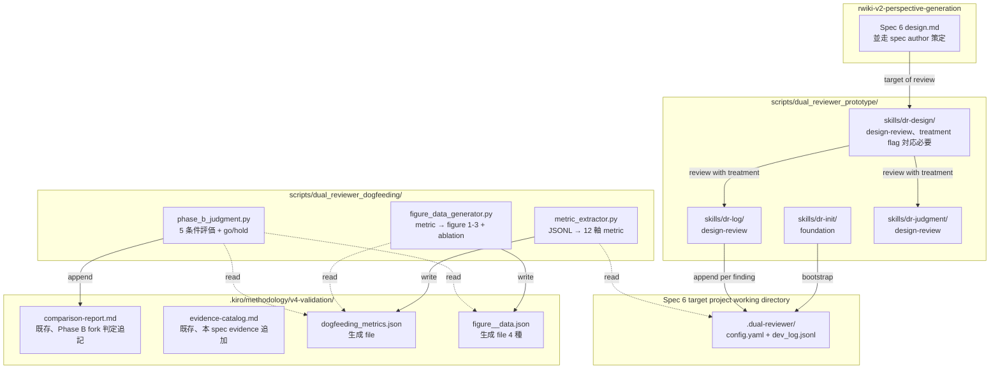
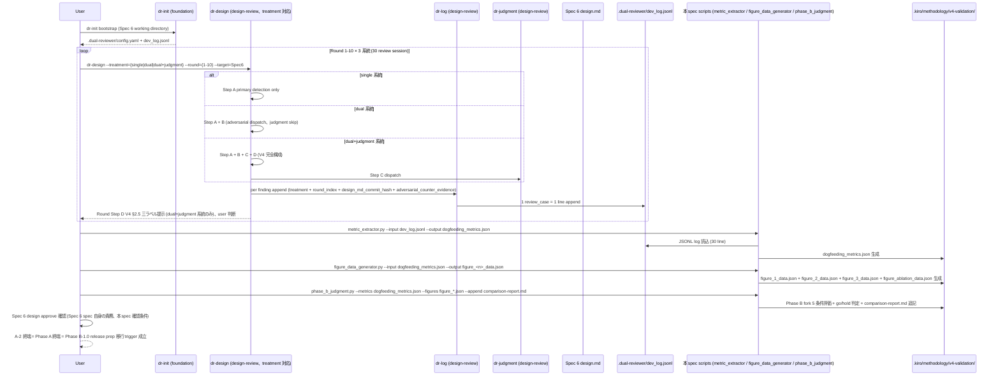
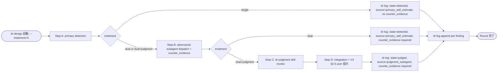
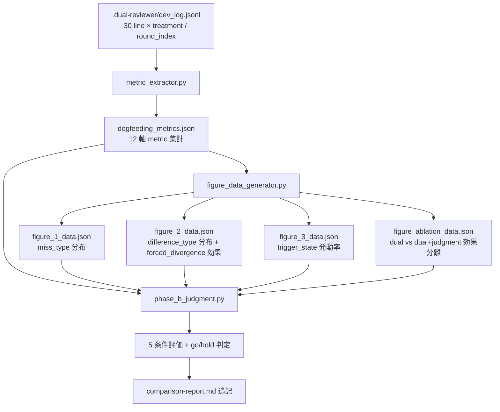

# Design Document

## Overview

`dual-reviewer-dogfeeding` は dual-reviewer prototype の **適用 + 対照実験 + Phase B fork 判断** を提供する設計である。本設計の成果物は (a) Dogfeeding Session Protocol (操作手順) + (b) dr-design Treatment Flag Contract (design-review revalidation trigger) + (c) Metric Extractor (Python script) + (d) Figure Data Generator (Python script) + (e) Phase B Fork Judgment (Python script) + (f) A-2 Termination Tracker (操作手順) を `scripts/dual_reviewer_dogfeeding/` (新規 directory、prototype 本体と分離) + `.kiro/methodology/v4-validation/` (既存、metric / figure data file 生成 + comparison-report 追記) に配置する。

**Purpose**: Spec 6 (`rwiki-v2-perspective-generation`) design phase に dual-reviewer prototype (foundation + design-review の 4 skills) を適用、全 Round (1-10) × 3 系統対照実験 (single + dual + dual+judgment、cost 3 倍、判定 7-C) = 30 review session を完走、JSONL log 蓄積 + 比較 metric 抽出 + 論文 figure 1-3 + ablation evidence 用データ生成 + Phase B fork go/hold 判断 + Spec 6 design approve 同時終端 (= Phase A 終端 = Phase B-1.0 release prep 移行 trigger 成立)。

**Users**: (a) dual-reviewer maintainer (Phase A 終端時の Phase B fork go/hold 判断者) / (b) 論文 8 月ドラフト提出を見据える maintainer (figure 1-3 + ablation evidence 生成者) / (c) Spec 6 spec author (本 spec と並走、Spec 6 design 内容自体策定責務).

**Impact**: `scripts/dual_reviewer_dogfeeding/` directory 新規追加 + `.kiro/methodology/v4-validation/` 配下の既存 file (`comparison-report.md` / `evidence-catalog.md` / `data-acquisition-plan.md`) 拡張 + 新規 metric / figure data file 生成。Spec 6 (`rwiki-v2-perspective-generation`) は design phase 進行で本 spec と並走、本 spec は Spec 6 design content 策定に介入しない (責務境界整合)。foundation + design-review skill には treatment flag 対応の追加要件あり (= design-review revalidation trigger、本 spec design phase で contract 確定)。

### Goals

- Spec 6 design phase に dual-reviewer prototype 4 skills (`dr-init` + `dr-design` + `dr-log` + `dr-judgment`) を適用、3 系統対照実験 30 review session 完走
- 比較 metric 抽出 (Req 4 全 7 AC) + 論文 figure 1-3 + ablation evidence 用データ生成 (Req 5 全 6 AC)
- Phase B fork 5 条件評価 + go/hold 判定 + comparison-report.md 追記 (Req 6 全 5 AC)
- Spec 6 design approve 同時終端 = Phase A 終端 = Phase B-1.0 release prep 移行 trigger 成立 (Req 7)
- 8 月 timeline 厳守 (failure 基準 Req 2.6 b 整合)、cost 3 倍許容 (判定 7-C、Req 2.6 a)
- consumer-only 性質厳守 = 新規 skill / framework / schema 実装一切なし (Req 1.5)

### Non-Goals

- dual-reviewer prototype 本体実装 (`dual-reviewer-foundation` / `dual-reviewer-design-review` 責務)
- Spec 6 design 内容自体の策定 (`rwiki-v2-perspective-generation` spec 責務、本 spec と並走)
- 論文ドラフト執筆 (Phase 3 = 7-8月別 effort、本 spec は figure data 取得のみ)
- case study 記述 (figure 4-5 qualitative narrative、Phase 3 論文ドラフト責務)
- B-1.x 拡張 schema (`decision_path` / `skipped_alternatives` / `bias_signal`、自由記述 + 内省) の取得
- multi-vendor 対照実験 (Claude vs GPT vs Gemini、B-2 以降)
- Phase B-1.0 release prep 自体 (固有名詞除去 / npm package 化 / GitHub repo 公開検討、本 spec 完了後の作業)
- Claude family rotation (B-1.1 opt-in)
- hypothesis generator role 3 体構成 (B-2 以降)
- 並列処理本格実装 + 整合性 Round 6 task (B-1.x 以降)

## Boundary Commitments

### This Spec Owns

- **Dogfeeding Session Protocol**: Spec 6 design phase に prototype 適用する操作手順 (起動順序 + 系統切替 + Round 進行 + JSONL log 確認 + metric 抽出 + figure data 生成 + Phase B fork 判定の sequence)
- **dr-design Treatment Flag Contract**: dr-design skill 起動時に渡す `treatment` flag (`single | dual | dual+judgment`) の規約定義 (= design-review revalidation trigger、本 spec が consumer-driven contract を確定)
- **Metric Extractor (`metric_extractor.py`)**: JSONL log (= dr-log の 30 line 蓄積) を input に Req 4 全 7 AC 整合の比較 metric (12 軸) を抽出、`dogfeeding_metrics.json` を生成
- **Figure Data Generator (`figure_data_generator.py`)**: 比較 metric を input に figure 1-3 + ablation 用 data file (`figure_<n>_data.json`) を生成
- **Phase B Fork Judgment (`phase_b_judgment.py`)**: 比較 metric + figure data を input に Req 6 5 条件評価 + go/hold 判定 + comparison-report.md 追記 logic
- **A-2 Termination Tracker**: Spec 6 design approve 確認 + Phase A 終端記録 (操作手順、design.md 内記述)
- **Consumer 拡張 field 仕様**: `treatment` / `round_index` / `design_md_commit_hash` / `adversarial_counter_evidence` を `review_case` または `finding` object に付与する consumer 拡張 mechanism (foundation Req 3.6 整合、本 spec が contract 確定)

### Out of Boundary

- dual-reviewer prototype 本体実装 (`dual-reviewer-foundation` / `dual-reviewer-design-review` の責務)
- Spec 6 (`rwiki-v2-perspective-generation`) design 内容自体の策定 (Spec 6 spec 責務、本 spec と並走)
- foundation 共通 schema の改変 (foundation 責務、本 spec は consumer 拡張 mechanism のみ使用)
- design-review 3 skills (`dr-design` / `dr-log` / `dr-judgment`) の skill 実装変更 (design-review 責務、ただし treatment flag 対応は本 spec design phase で要請する revalidation trigger)
- 論文ドラフト執筆 (Phase 3、別 effort)
- case study 記述 (figure 4-5 qualitative narrative、Phase 3 論文ドラフト)
- B-1.x 拡張 schema 取得
- multi-vendor 対照実験 (B-2 以降)
- Phase B-1.0 release prep 自体
- Claude family rotation (B-1.1 opt-in)
- hypothesis generator role 3 体構成 (B-2 以降)
- 並列処理本格実装 + 整合性 Round 6 task
- Spec 6 spec の approve 強制 (本 spec は Spec 6 design approve を確認条件として扱う、approve 強制は Spec 6 spec 責務、Req 7.3 整合)

### Allowed Dependencies

- **Upstream**:
  - `dual-reviewer-foundation` (`dr-init` skill + Layer 1 framework + 共通 schema 2 軸並列 + seed/fatal patterns yaml + V4 §5.2 prompt template + JSON Schema files、foundation 提供 artifact)
  - `dual-reviewer-design-review` (`dr-design` / `dr-log` / `dr-judgment` skills + Layer 2 design extension + forced_divergence prompt template、ただし dr-design に treatment flag 対応の追加要件 = revalidation trigger)
  - `rwiki-v2-perspective-generation` (Spec 6、本 spec と並走、dogfeeding 適用対象、本 spec は Spec 6 design 内容に介入せず)
- **言語 / Runtime**:
  - Python 3.10+ (Metric Extractor + Figure Data Generator + Phase B Fork Judgment、foundation + design-review 整合)
  - Python `json` library (JSONL log 読込)
  - Python `jsonschema` library (foundation schema validate、必要に応じて metric extraction 前段)
- **既存 Rwiki repo 構造**:
  - `scripts/dual_reviewer_dogfeeding/` (本 spec 新規 directory)
  - `.kiro/methodology/v4-validation/` (既存 directory、metric / figure data file 生成 + comparison-report 追記)
- **方針 / Reference (改変禁止 SSoT)**:
  - foundation/design.md v1.1 (foundation install location + relative path 規約 + override 階層 + 共通 schema 2 軸並列)
  - design-review/design.md v1.1 (3 skills + Layer 2 design extension + forced_divergence prompt + Foundation Integration)
  - `.kiro/methodology/v4-validation/v4-protocol.md` v0.3 final
  - `.kiro/methodology/v4-validation/comparison-report.md` v0.1 (req phase V4 redo broad evidence + design phase evidence 追記場、Phase B fork 判定記録対象)
  - `.kiro/methodology/v4-validation/evidence-catalog.md` v0.3 (V3 baseline + V4 evidence 累計、本 spec が evidence 追加)
  - V4 protocol §4.4 ablation framing (3 系統対照実験の framing)
  - 判定 7-C (cost 3 倍許容、論文 8 月 timeline 厳守)

### Revalidation Triggers

以下の変更は upstream / downstream spec に対する revalidation を要求する:

- **dr-design treatment flag contract 変更** → `dual-reviewer-design-review` の dr-design skill 改修必要 (本 spec design phase で確定する追加要件、design-review に対する revalidation trigger)
- 3 系統定義 (single / dual / dual+judgment) の step 構成変更 → design-review skill orchestration logic + dr-log treatment field 整合に影響
- consumer 拡張 field 仕様 (`treatment` / `round_index` / `design_md_commit_hash` / `adversarial_counter_evidence`) の structure 変更 → dr-log JSONL output structure に影響、foundation Req 3.6 consumer 拡張 mechanism 整合性確認必要
- 比較 metric 抽出 12 軸の追加 / 削除 → figure data generator + Phase B fork judgment logic に影響、論文 figure 1-3 の数値定義に影響
- figure data file structure 変更 → 論文 8 月ドラフト用 input format 変更
- Phase B fork 5 条件 (Req 6.1) または閾値 (致命級 ≥ 2 件 / disagreement ≥ 3 件 等) 変更 → comparison-report.md の go/hold 判定 logic に影響
- 8 月 timeline failure 基準 (Req 2.6 b) 変更 → A-2 終端判定基準に影響

## Architecture

### Architecture Pattern & Boundary Map

本 spec は **Operational Protocol + Research Script Hybrid** pattern を採用する:

- **Operational Protocol 部分**: Dogfeeding Session Protocol + A-2 Termination Tracker (操作手順 = design.md 内記述、user 主導 manual flow、自動化対象外)
- **Research Script 部分**: Metric Extractor + Figure Data Generator + Phase B Fork Judgment (Python script、JSONL log 入力 → 比較 metric / figure data / Phase B fork 判定 出力)
- **Contract 部分**: dr-design Treatment Flag Contract + Consumer 拡張 field 仕様 (本 spec が design-review に対する追加要件 + foundation consumer 拡張 mechanism 使用 contract を確定)



**Architecture Integration**:

- 採用 pattern = Operational Protocol + Research Script Hybrid (operational = 操作手順、research = Python script、SKILL.md format 不要 = 一回限り session、自動化対象外)
- Domain 境界 = (1) Dogfeeding Session Protocol / (2) Treatment Flag Contract / (3) Metric Extraction / (4) Figure Data Generation / (5) Phase B Fork Judgment / (6) A-2 Termination Tracker
- 既存 patterns 保持 = foundation + design-review skill format (SKILL.md + Python helper) は本 spec scope 外、本 spec は research artifact (Python script) のみ
- 新規 component 根拠 = (a) 操作手順は SKILL.md 化不要 (一回限り session) / (b) metric extraction は Python script で機械処理 / (c) figure data generation は数値データ artifact / (d) Phase B fork judgment は judgment record + comparison-report 追記 logic
- Steering compliance = `.kiro/steering/tech.md` Severity 4 水準 + Python 3.10+ + 2 スペースインデント + Test-Driven Development 整合 (**A5 fix**: TDD 順序 = test first → 失敗確認 → 実装 → 通過まで反復、3 Python script (`metric_extractor.py` / `figure_data_generator.py` / `phase_b_judgment.py`) 開発時 tasks.md で TDD 順序を task 単位で反映する責務、`tests/` 配下 unit tests 先行作成 + 実装で通過確認)
- Dependency direction = foundation (Layer 1 + dr-init) → design-review (Layer 2 + 3 skills) → 本 spec (consumer 適用 + 研究 artifact)

### Technology Stack

| Layer | Choice / Version | Role in Feature | Notes |
|-------|------------------|-----------------|-------|
| Operational Protocol | Markdown documentation | Dogfeeding Session Protocol + A-2 Termination Tracker (操作手順) | design.md 内記述、user 主導 manual flow |
| Research Script | Python 3.10+ | Metric Extractor + Figure Data Generator + Phase B Fork Judgment | foundation + design-review Python 整合 |
| JSONL Reader | Python `json` library | dr-log 出力 JSONL log 読込 | 標準 library |
| Schema Validator (optional) | Python `jsonschema` library | metric extraction 前段の log validate | foundation 提供 schema を再利用 (hardcode 禁止規律整合) |
| Output Format | JSON (metric + figure data) + Markdown (comparison-report 追記) | 機械可読 (json) + 人間可読 (md) の両形式 | Req 4.6 + 5.6 + 6.4 整合 |
| Existing Methodology Files | `.kiro/methodology/v4-validation/` | comparison-report.md + evidence-catalog.md + data-acquisition-plan.md | 既存 file 拡張 (Phase B fork 判定 + 本 spec evidence 追記) |

## File Structure Plan

### Directory Structure

```
scripts/dual_reviewer_dogfeeding/                  # 本 spec 新規 directory (prototype 本体と分離)
├── README.md                                       # 本 spec scope + 操作 entry point + 3 script 連携手順
├── metric_extractor.py                             # Req 4: JSONL log → 12 軸 metric 抽出 → dogfeeding_metrics.json 生成
├── figure_data_generator.py                        # Req 5: dogfeeding_metrics.json → figure 1-3 + ablation data 生成
├── phase_b_judgment.py                             # Req 6: dogfeeding_metrics.json + figure data → 5 条件評価 + go/hold 判定 → comparison-report.md 追記
└── tests/                                          # script unit tests
    ├── test_metric_extractor.py
    ├── test_figure_data_generator.py
    └── test_phase_b_judgment.py

.kiro/methodology/v4-validation/                   # 既存 directory (本 spec 拡張)
├── comparison-report.md                            # 既存、本 spec が Phase B fork 判定追記 (Req 6.4)
├── evidence-catalog.md                             # 既存、本 spec evidence (30 review session log + metrics + figure data) 追記
├── data-acquisition-plan.md                        # 既存、本 spec が checkbox 更新 (Phase 2 達成項目)
├── v4-protocol.md                                  # 既存、改変禁止 SSoT
├── v3-baseline-summary.md                          # 既存、改変禁止 SSoT
├── dogfeeding_metrics.json                         # 本 spec 生成 file (metric_extractor.py 出力、Req 4.6)
├── figure_1_data.json                              # 本 spec 生成 file (miss_type 分布、Req 5.1)
├── figure_2_data.json                              # 本 spec 生成 file (difference_type 分布 + forced_divergence 効果、Req 5.2)
├── figure_3_data.json                              # 本 spec 生成 file (trigger_state 発動率、Req 5.3)
└── figure_ablation_data.json                       # 本 spec 生成 file (dual vs dual+judgment 効果分離、Req 5.4)

scripts/dual_reviewer_prototype/                   # foundation + design-review 配下、本 spec scope 外
├── (skills/dr-design/SKILL.md に treatment flag 対応の追加要件、design-review revalidation trigger)
└── (本 spec が import + invoke する prototype 本体、変更なし)

(target project working directory、dogfeeding 適用先)
└── .dual-reviewer/                                  # dr-init bootstrap 済 (foundation 責務)
    ├── config.yaml
    └── dev_log.jsonl                               # dr-log append-only、本 spec が input source として参照 (30 line × 系統 + Round 識別)
```

### Modified Files

- `.kiro/specs/dual-reviewer-dogfeeding/spec.json` — design phase 完了時に `phase: design-generated` + `approvals.design.generated: true` に更新 (Step 6 で実施)
- `.kiro/methodology/v4-validation/comparison-report.md` — 本 spec の Phase B fork 判定 + 5 条件評価結果 + V4 仮説検証併記を追記 (Req 6.4、本 spec 完了 timing)
- `.kiro/methodology/v4-validation/evidence-catalog.md` — 本 spec evidence (30 review session JSONL log + metrics.json + figure data 4 種) を §4.2 に追記
- `.kiro/methodology/v4-validation/data-acquisition-plan.md` — Phase 2 (6-7 月、A-2 期間) 達成項目 (figure 1-3 + ablation evidence) checkbox 更新
- `.kiro/specs/dual-reviewer-design-review/design.md` — dr-design skill に treatment flag 対応追加 (本 spec design phase で確定する revalidation trigger、design-review v1.2 として後続更新、本 spec design phase 完了時の implication 通知)

## System Flows

### Flow 1: Dogfeeding Session 全体フロー (Operational Protocol)



**Key Decisions**:
- 30 review session = user 主導 manual flow (一回限り session、自動化対象外)
- 系統切替 = `--treatment` flag で dr-design 起動時指定 (design-review revalidation trigger、本 spec contract)
- dr-design は系統に応じて Step B/C を conditionally invoke (= treatment="single" → Step A only、treatment="dual" → A+B、treatment="dual+judgment" → A+B+C+D)
- Round 終了後の V4 §2.5 user 判断は dual+judgment 系統のみ実施 (single/dual は primary 自己 estimate のため judgment label 確定なし)
- 30 review session 完走後に Python script を順次実行 (extractor → generator → judgment)、user 主導
- Spec 6 design approve は Spec 6 spec の責務、本 spec は確認条件として待つ (Req 7.3)

### Flow 2: 3 系統 Step 構成切替詳細



**Key Decisions** (Req 2.1 + Req 3.4 整合):
- `treatment="single"`: Step A only、dr-log で `state=detected` + `source=primary_self_estimate` + `adversarial_counter_evidence` 省略
- `treatment="dual"`: Step A + B、dr-log で `state=detected` + `source=primary_self_estimate` + `adversarial_counter_evidence` 必須
- `treatment="dual+judgment"`: Step A + B + C + D、dr-log で `state=judged` + `source=judgment_subagent` + `adversarial_counter_evidence` 必須

### Flow 3: Metric Extraction → Figure Generation → Phase B Fork Judgment Pipeline



**Key Decisions**:
- 3 script は sequential 実行 (extractor → generator → judgment)、各 script は前段 output を input として依存
- 各 script は idempotent (同 input で同 output、再実行可能)
- comparison-report.md 追記は append-only (既存 §11 変更履歴後に新 § を追加)、destructive 改変なし

## Requirements Traceability

| Requirement | Summary | Components | Interfaces / Files | Flows |
|-------------|---------|------------|--------------------|-------|
| 1.1 | target spec = Spec 6 固定 | Dogfeeding Session Protocol | design.md (操作手順) | Flow 1 |
| 1.2 | dr-init bootstrap (Spec 6 working directory) | Dogfeeding Session Protocol + foundation dr-init invoke | design.md (操作手順) + foundation `dr-init` | Flow 1 |
| 1.3 | Round 1-10 を design-review Req 4.2 10 観点で実行 | Dogfeeding Session Protocol | design.md (操作手順) + design-review `design_extension.yaml` | Flow 1 |
| 1.4 | dr-design = Round orchestration entry point、Step A/B/C/D V4 §1.2 option C 整合 | Dogfeeding Session Protocol + dr-design Treatment Flag Contract | design.md (操作手順) + design-review `dr-design` skill | Flow 1, Flow 2 |
| 1.5 | 4 skills + foundation 提供 artifact のみ使用、新規 skill / framework 一切なし | Consumer-only constraint | design.md (操作手順) | — |
| 1.6 | foundation install location 相対 path + hardcode 禁止 | Consumer-only constraint | design.md (操作手順) + design-review/foundation 提供 規約 | — |
| 2.1 | 3 系統 (single = Step A only / dual = A+B / dual+judgment = A+B+C+D) | dr-design Treatment Flag Contract | design.md treatment flag 規約 | Flow 1, Flow 2 |
| 2.2 | 同一 design.md content を input に 3 系統で 3 回独立実行 (= 30 review session、Round 1-10 × 3 系統) | Dogfeeding Session Protocol | design.md (操作手順) | Flow 1 |
| 2.3 | 修正必要性判定軸 = dual+judgment 系統のみ judgment subagent 確定値、single/dual 系統は primary 自己 estimate (state=detected, source=primary_self_estimate) | dr-design Treatment Flag Contract + dr-log treatment 整合 | design.md treatment 規約 + design-review dr-log 整合 | Flow 2 |
| 2.4 | 失敗構造観測軸 = 3 系統すべてで自己ラベリング付与 | dr-log invocation per treatment | design.md (操作手順) + design-review dr-log 整合 | Flow 2 |
| 2.5 | dual+judgment 系統で escalate (uncertainty=high) → should_fix + recommended_action: user_decision mapping | design-review dr-judgment + dr-log 整合 | design-review/design.md 既存仕様参照 | — |
| 2.6 | (a) 判定 7-C cost 3 倍許容 / (b) 8 月 timeline failure 基準明示 | Dogfeeding Session Protocol | design.md (操作手順 + 8 月 timeline 監視 logic) + comparison-report 整合 | — |
| 2.7 | 3 系統対照実験 = ablation framing (V4 §4.4 整合)、pure independent 比較は scope 外 | Dogfeeding Session Protocol + Phase B Fork Judgment | design.md (ablation framing 明記) | — |
| 3.1 | dr-log で finding を JSONL 構造化記録 | design-review dr-log invoke | design-review/design.md 既存仕様参照 | Flow 1 |
| 3.2 | foundation 共通 schema 2 軸並列 validate、fail-fast | design-review dr-log invoke | design-review/design.md 既存仕様参照 | Flow 1 |
| 3.3 | JSONL 1 line = 1 review_case = 1 系統 × 1 Round = 30 line 蓄積 | design-review dr-log invoke + Dogfeeding Session Protocol | design-review/design.md 既存仕様参照 + design.md (30 line 監視) | Flow 1 |
| 3.4 | finding state field を 3 系統に応じて固定 (single/dual = detected, dual+judgment = judged) + source field 切替 | dr-design Treatment Flag Contract + dr-log treatment 整合 | design.md treatment 規約 + design-review dr-log 既存仕様 | Flow 2 |
| 3.5 | JSONL append target = config.yaml `dev_log_path` 動的読取 (hardcode 禁止) | design-review dr-log 既存規約 | design-review/design.md 既存仕様参照 | — |
| 3.6 | 系統識別 field (`treatment`) を全 review_case object に必須付与 | Consumer 拡張 field 仕様 | design.md treatment 規約 + design-review dr-log 整合 | Flow 1 |
| 3.7 | Round 識別 field (`round_index`) + Spec 6 design.md commit hash field を必須付与、commit hash 変動の caveat 報告 | Consumer 拡張 field 仕様 | design.md round_index + design_md_commit_hash 規約 + design-review dr-log 整合 | Flow 1 |
| 3.8 | dual / dual+judgment 系統で adversarial_counter_evidence field 必須記録、single 系統で省略可 | Consumer 拡張 field 仕様 + dr-design Treatment Flag Contract | design.md treatment 規約 + design-review dr-log 整合 | Flow 2 |
| 4.1 | base metric (検出件数 / 3 ラベル件数+比率 / 採択率 / 過剰修正比率) を 3 系統各々算出 | Metric Extractor | `metric_extractor.py` (logic) | Flow 3 |
| 4.2 | adversarial 修正否定 disagreement 数 (dual / dual+judgment 系統) | Metric Extractor | `metric_extractor.py` (logic) | Flow 3 |
| 4.3 | judgment subagent disagreement 数 + override 件数 + 理由分析 (dual+judgment 系統のみ) | Metric Extractor | `metric_extractor.py` (logic) | Flow 3 |
| 4.4 | wall-clock 時間 (3 系統各々) + cost 倍率 (V3 baseline 比 + V4 完全構成 比) | Metric Extractor | `metric_extractor.py` (logic) | Flow 3 |
| 4.5 | Phase 1 同型 hit rate (3 メタパターン照合 hit 件数、3 系統各々) | Metric Extractor | `metric_extractor.py` (logic) | Flow 3 |
| 4.6 | metric 集計 file 機械可読 format (json) で生成、配置 path = `.kiro/methodology/v4-validation/dogfeeding_metrics.json` | Metric Extractor | `dogfeeding_metrics.json` 生成 | Flow 3 |
| 4.7 | fatal_patterns 8 種強制照合 hit 件数 (3 系統各々) | Metric Extractor | `metric_extractor.py` (logic) | Flow 3 |
| 5.1 | figure 1 data = miss_type 6 enum 分布 (3 系統比較) | Figure Data Generator | `figure_1_data.json` 生成 | Flow 3 |
| 5.2 | figure 2 data = difference_type 6 enum 分布 + forced_divergence 効果 (adversarial_trigger 件数 dual/dual+judgment vs single)、design-review design approve 後 sequencing 制約 | Figure Data Generator | `figure_2_data.json` 生成 + design-review design approve 確認 logic | Flow 3 |
| 5.3 | figure 3 data = trigger_state 3 string enum 発動率 (applied vs skipped)、Phase 1 同型 hit rate 対応 | Figure Data Generator | `figure_3_data.json` 生成 | Flow 3 |
| 5.4 | figure ablation data = dual vs dual+judgment で過剰修正比率削減効果 + 採択率増加効果 + judgment subagent override + 必要性判定 quality (override_reason 内容分析) | Figure Data Generator | `figure_ablation_data.json` 生成 | Flow 3 |
| 5.5 | figure 4-5 (case study qualitative) = scope 外 | Figure Data Generator scope 外 | — (本 spec で生成しない) | — |
| 5.6 | figure data file 機械可読 format (json) で生成、配置 path 規約 = `.kiro/methodology/v4-validation/figure_<n>_data.json` (Req 4.6 同 format) | Figure Data Generator | `figure_<1, 2, 3, ablation>_data.json` 生成 | Flow 3 |
| 6.1 | 5 条件 (a 致命級発見 ≥ 2 件 / b disagreement ≥ 3 件 / c bias 共有反証 evidence / d impact_score 分布 / e 過剰修正比率改善) を順次評価 | Phase B Fork Judgment | `phase_b_judgment.py` (logic) | Flow 3 |
| 6.2 | 5 条件全達成 → go / いずれか未達 → hold | Phase B Fork Judgment | `phase_b_judgment.py` (logic) | Flow 3 |
| 6.3 | V4 protocol H1+H3+H4 仮説検証併記 | Phase B Fork Judgment | `phase_b_judgment.py` (logic) + comparison-report.md 追記 | Flow 3 |
| 6.4 | 判定結果を comparison-report.md に追記、go 判定時 = Phase B-1.0 release prep 移行手順併記、hold 判定時 = V4 protocol 改訂候補 + 追加 dogfeeding 範囲記述 (実施は本 spec scope 外) | Phase B Fork Judgment | `phase_b_judgment.py` (logic) + comparison-report.md 追記 | Flow 3 |
| 6.5 | 判定根拠 = client-verifiable evidence (第三者再算出可能)、subjective 判断のみ禁止 | Phase B Fork Judgment | `phase_b_judgment.py` (logic、JSONL + metric + figure data 参照記述) | Flow 3 |
| 7.1 | Spec 6 design 内容自体策定は Spec 6 spec 責務、本 spec は dual-reviewer 適用 + metric 取得のみ | A-2 Termination Tracker | design.md (責務境界明記) | — |
| 7.2 | 完了状態必要条件 = Req 1-6 全項目達成 (a-f 6 項目) | A-2 Termination Tracker | design.md (操作手順 = チェックリスト) | — |
| 7.3 | Spec 6 design approve = 本 spec 完了の確認条件 (本 spec が approve 強制せず Spec 6 spec 側完了確認) | A-2 Termination Tracker | design.md (確認 logic 記述) | Flow 1 |
| 7.4 | A-2 終端 = 即 Phase B-1.0 release prep 移行 trigger | A-2 Termination Tracker | design.md (記述) | — |
| 7.5 | B-1.x 拡張 schema scope 外 | Consumer-only constraint | design.md (Out of Boundary 明記) | — |
| 7.6 | multi-vendor 対照実験 scope 外 | Consumer-only constraint | design.md (Out of Boundary 明記) | — |
| 7.7 | 論文ドラフト執筆 + case study 記述 scope 外 (figure 1-3 + ablation evidence 取得のみ) | Consumer-only constraint | design.md (Out of Boundary 明記) | — |

## Components and Interfaces

**C2 fix — Foundation Install Location Resolve Mechanism (3 Python script 共通)**:

3 Python script (`metric_extractor.py` / `figure_data_generator.py` / `phase_b_judgment.py`) が foundation 共通 schema validate (optional) を行う場合、foundation install location を以下のいずれかで resolve する:

- CLI flag: `--dual-reviewer-root <foundation install location absolute path>` (= `scripts/dual_reviewer_prototype/`)
- 環境変数: `DUAL_REVIEWER_ROOT=<absolute path>`

resolve 規約は design-review Foundation Integration component (foundation install location 引数渡し / 環境変数 resolve) と統一。dogfeeding scripts が foundation schema validate を skip する場合 (= dr-log skill 内で既に validate 済 JSONL を trust 入力として扱う) は本 mechanism 不要。implementation phase で具体採用 (CLI flag default / 環境変数 fallback) を確定。

### Domain: Operational Protocol + Research Scripts

| Component | Domain/Layer | Intent | Req Coverage | Key Dependencies (P0/P1) | Contracts |
|-----------|--------------|--------|--------------|--------------------------|-----------|
| Dogfeeding Session Protocol | Protocol | Spec 6 design phase に prototype 適用する操作手順 + 30 review session 進行 + Spec 6 design approve 確認 | 1.1, 1.2, 1.3, 2.2, 2.6, 2.7, 3.3, 7.1, 7.2, 7.3, 7.4 | foundation `dr-init` + design-review `dr-design` (P0) + Spec 6 spec (P1、並走) | State (操作手順) |
| dr-design Treatment Flag Contract | Contract | dr-design 起動時 `--treatment` flag 規約 (single / dual / dual+judgment)、design-review revalidation trigger | 1.4, 2.1, 2.3, 2.4, 3.4, 3.6, 3.8 | design-review `dr-design` skill (P0、本 spec contract で revalidation 要請) | Service (CLI flag contract) |
| Consumer 拡張 field 仕様 | Contract | `treatment` / `round_index` / `design_md_commit_hash` / `adversarial_counter_evidence` 4 field を JSONL log に必須付与する consumer 拡張 mechanism (foundation Req 3.6 整合) | 3.6, 3.7, 3.8 | foundation finding/review_case schema (P0、consumer 拡張 mechanism 経由) + design-review `dr-log` (P0) | State (schema 拡張) |
| Metric Extractor (`metric_extractor.py`) | Research Script | JSONL log → 12 軸 metric 抽出 → `dogfeeding_metrics.json` 生成 | 4.1, 4.2, 4.3, 4.4, 4.5, 4.6, 4.7 | Python 3.10+ + json/jsonschema (P0) + `.dual-reviewer/dev_log.jsonl` 30 line (P0) | Service (CLI) + State (json output) |
| Figure Data Generator (`figure_data_generator.py`) | Research Script | metric → figure 1-3 + ablation data 生成 (4 file) | 5.1, 5.2, 5.3, 5.4, 5.6 | `dogfeeding_metrics.json` (P0) + design-review design approve 状態 (P0、Req 5.2 sequencing) | Service (CLI) + State (json output × 4) |
| Phase B Fork Judgment (`phase_b_judgment.py`) | Research Script | 5 条件評価 + go/hold 判定 + comparison-report.md 追記 | 6.1, 6.2, 6.3, 6.4, 6.5 | `dogfeeding_metrics.json` + figure data 4 file (P0) + comparison-report.md (P0、append target) | Service (CLI) + State (markdown append) |
| A-2 Termination Tracker | Protocol | Spec 6 design approve 確認 + Phase A 終端記録 (操作手順) | 7.1, 7.2, 7.3, 7.4 | Spec 6 spec.json `approvals.design.approved` (P1、確認 only) | State (操作手順) |

詳細 block は new-boundary-introducing components のみ記述する (Metric Extractor + Figure Data Generator + Phase B Fork Judgment + dr-design Treatment Flag Contract + Consumer 拡張 field 仕様)。Operational Protocol は summary 行 + design.md 内の操作手順記述で扱う。

### dr-design Treatment Flag Contract

| Field | Detail |
|-------|--------|
| Intent | dr-design skill 起動時の `--treatment` flag 規約定義、design-review revalidation trigger |
| Requirements | 1.4, 2.1, 2.3, 2.4, 3.4, 3.6, 3.8 |

**Responsibilities & Constraints**

- dr-design skill は `--treatment` flag を CLI 引数または skill invocation parameter で受け取る:
  - `--treatment=single`: Step A primary detection only、Step B (adversarial dispatch) + Step C (dr-judgment invoke) + Step D (V4 §2.5 提示) を skip
  - `--treatment=dual`: Step A + Step B、Step C + Step D の judgment 関連処理を skip (Step D 内の merge は primary + adversarial で実施、user 提示は primary 自己 estimate based)
  - `--treatment=dual+judgment`: Step A + Step B + Step C + Step D の V4 完全構成 (V4 §1.2 option C)
- `--treatment` flag は dr-log skill 起動時にも propagate (`treatment` field として finding に付与、Req 3.6 整合)
- treatment flag 未指定時の default = `dual+judgment` (V4 完全構成、design-review skill の original 仕様整合)
- treatment flag 不正値 (single/dual/dual+judgment 以外) → fail-fast、stderr error
- treatment 切替で adversarial_counter_evidence field の必須/省略 を切替 (Req 3.8 整合):
  - single: 省略
  - dual: 必須記録 (adversarial subagent 出力 yaml の counter_evidence section から decompose、design-review A6 fix 整合)
  - dual+judgment: 必須記録 + judgment subagent input
- treatment 切替で finding state field を切替 (Req 3.4 整合):
  - single: state = `detected`、source = `primary_self_estimate`
  - dual: state = `detected`、source = `primary_self_estimate`
  - dual+judgment: state = `judged`、source = `judgment_subagent`

**P1 + A1 fix — Treatment 切替 動作詳細 (Step A/B/C/D 別)**:

| treatment | Step A primary | Step B adversarial | Step C dr-judgment | Step D integration | user 提示 (V4 §2.5) |
|-----------|----------------|--------------------|--------------------|--------------------|--------------------|
| single | 実行 | skip | skip | skip (primary 検出のみ JSONL 記録) | **省略** (research baseline、user 判断 cost なし) |
| dual | 実行 | 実行 (independent + forced_divergence + V4 §1.5 fix-negation) | skip | merge のみ (primary + adversarial 統合、JSONL 記録) | **省略** (research baseline、wall-clock 公平 measurement) |
| dual+judgment | 実行 | 実行 | 実行 (V4 §5.2 prompt + judgment subagent dispatch) | merge + V4 §2.5 三ラベル提示 | **実行** (must_fix bulk apply / do_not_fix bulk skip / should_fix individual review、user 判断必須) |

これにより:
- single + dual 系統は user 判断 cost なし = wall-clock metric (Req 4.4) で V4 完全構成 (dual+judgment) との比較公平性確保
- ablation framing (V4 §4.4 整合) = 「Step 1c なし baseline (single + dual) vs Step 1c あり treatment (dual+judgment)」を user 判断 cost 含む / 含まずで分離
- design-review revalidation (v1.2) で dr-design skill が treatment flag に応じて Step B/C/D の skip 動作 + user 提示の skip / 実行 を実装する追加要件 (本 spec 設計決定 3 整合)

**Dependencies**

- Inbound: Dogfeeding Session Protocol (P0、各 Round × treatment で dr-design invoke 時)
- Outbound: design-review `dr-design` skill (P0、本 spec contract で treatment flag 対応 implementation 要請 = revalidation trigger)、design-review `dr-log` skill (P0、treatment field 受領)
- External: design-review/design.md v1.1 (本 spec design phase で v1.2 への revalidation 要請)

**Contracts**: Service [✓] / State [✓]

##### Service Interface (CLI flag contract)

```python
# dr-design skill CLI 引数 (本 spec が design-review に要請する追加 contract)
interface DrDesignWithTreatment {
  invoke(
    target_design_md_path: AbsolutePath,
    treatment: Literal["single", "dual", "dual+judgment"] = "dual+judgment",
    round_index: int = 1,
    design_md_commit_hash: string,
    dual_reviewer_root: AbsolutePath,
    config_yaml_path: AbsolutePath
  ): Result<RoundReports, ErrorEnvelope>
}
```

- **Preconditions**: design-review skill が treatment flag 対応 implementation 完了済 (revalidation 通過後)、target Spec 6 design.md existing
- **Postconditions**:
  - single: Round 完了、JSONL に `treatment=single` + `state=detected` + `source=primary_self_estimate` + `adversarial_counter_evidence` 省略 で記録
  - dual: 同 `treatment=dual` + `adversarial_counter_evidence` 必須記録
  - dual+judgment: 同 `treatment=dual+judgment` + `state=judged` + `source=judgment_subagent` + `adversarial_counter_evidence` 必須記録 + V4 §2.5 三ラベル提示
- **Invariants**: treatment 切替で behavior 切替が AC レベル明示、treatment field 全 finding に必須付与

**Implementation Notes**

- Integration: design-review/design.md v1.2 への revalidation で treatment flag 対応 + 関連 Service Interface 改修 (本 spec design phase 完了時に implication 通知)
- Validation: treatment flag 整合性 = single 系統で adversarial dispatch しない / dual 系統で judgment dispatch しない 動作確認
- Risks: design-review revalidation の cycle (本 spec design approve → design-review revalidation → design-review re-approve → 本 spec dependency 整合) は implementation phase 直前 timing で実施、本 spec design phase は contract 確定までで完了

### Consumer 拡張 field 仕様

| Field | Detail |
|-------|--------|
| Intent | 4 field (`treatment` / `round_index` / `design_md_commit_hash` / `adversarial_counter_evidence`) を foundation finding/review_case schema の consumer 拡張 mechanism (foundation Req 3.6) で付与する規約 |
| Requirements | 3.6, 3.7, 3.8 |

**Responsibilities & Constraints**

- foundation Req 3.6 = "consumer spec が独自に追加 field を `review_case` または `finding` object に付与する場合 schema 拡張として許容" 整合
- 本 spec が要求する 4 field:
  - `review_case.treatment` (Req 3.6): `single | dual | dual+judgment` の 3 値 enum、全 review_case object 必須付与
  - `review_case.round_index` (Req 3.7): integer 1-10、全 review_case object 必須付与
  - `review_case.design_md_commit_hash` (Req 3.7): string (git SHA-1 ハッシュ)、全 review_case object 必須付与、commit hash 変動の caveat は metric extraction 時 (Req 4) に検出 + comparison-report 併記
  - `finding.adversarial_counter_evidence` (Req 3.8): string (adversarial の修正否定 counter-evidence 記述)、dual / dual+judgment 系統で必須記録、single 系統で省略可
- foundation schema 改変なし (consumer 拡張 mechanism 経由 = JSON Schema `additionalProperties: true` default 整合、foundation Req 3.6 整合)
- design-review/dr-log skill が consumer 拡張 field を JSONL append 時に付与 (= dr-log v1.1 の per-finding append + Round-end flush で 4 field 全件 append)
- 4 field の schema 定義 + validate 責務は本 spec 側 (foundation はこれら field を normative basis として規定しない、Req 3.6 整合)

**P2 fix — design_md_commit_hash 取得 + 付与方式**: `design_md_commit_hash` は **Operational Protocol (user 主導 manual flow) 内で user が各 Round 開始時に手動取得し、dr-design invoke 時に payload (`--design-md-commit-hash` flag) で渡す** (= caller responsibility、Decision 3 dr-design Treatment Flag Contract integration)。dr-log skill は dr-design からの per-finding append 時に payload から受領 + JSONL append。dr-log skill 自身が git 操作で commit hash を取得する責務は持たない (= Operational Protocol が責務、design-review revalidation 不要、本 spec scope 内で完結)。

**A3 fix — timestamp field の dr-log 必須記録保証**: `timestamp_start` / `timestamp_end` は foundation `review_case.schema.json` の既存 field (foundation/design.md Data Models 章 Logical Data Model 参照)。dr-log skill は JSONL append 時にこれら field を必須付与する責務を持つ (foundation `review_case.schema.json` の `required` array に含まれる前提)。本 spec は consumer として timestamp field の存在に依存し、`metric_extractor.py` が `timestamp_end - timestamp_start` を wall-clock 計算 source として使用する (Req 4.4 整合)。design-review revalidation 通知 (Decision 6 = design-review/dr-log skill が timestamp 必須付与を AC レベル明示するための design-review v1.2 改修要請) を本 spec design phase 完了時に implication として送出する。

**P10 fix — Round 開始時 commit hash 固定推奨手順 (Operational Protocol)**: Operational Protocol 内に以下の Round 開始手順を追記 (Req 2.2 ablation 公平性保証 + Req 3.7 commit hash 必須付与整合):

1. 各 Round (1-10) 開始時、user は Spec 6 spec working directory で `git rev-parse HEAD -- .kiro/specs/rwiki-v2-perspective-generation/design.md` を実行、HEAD commit hash 取得
2. 同一 Round 内の 3 系統 (single + dual + dual+judgment) 全て、上記 commit hash を `--design-md-commit-hash` payload で dr-design invoke (Round 開始時 1 回取得 + 3 系統 invoke で同一 hash 使用 = 系統間 ablation 公平性確保)
3. Round 完了後、次 Round 開始時に再度 `git rev-parse HEAD` 取得 (Round 間で hash 変動可能、metric_extractor.py で variance 検出 + comparison-report 併記、Req 3.7 + 4 整合)
4. 30 review session 中の hash 変動 caveat = metric_extractor.py が `commit_hash_variance` field に記録 + phase_b_judgment.py が comparison-report 追記時に併記

**Dependencies**

- Inbound: Dogfeeding Session Protocol (P0、4 field の caller 起動)
- Outbound: design-review `dr-log` skill (P0、4 field 付与 implementation)、foundation finding/review_case schema (P0、consumer 拡張 mechanism 使用、改変なし)
- External: foundation/design.md Req 3.6 consumer 拡張 mechanism

**Contracts**: State [✓]

##### State Definition

```json
// 本 spec 拡張後の review_case JSONL 1 line structure (foundation 既存 field + 本 spec 追加 4 field)
{
  // foundation review_case fields (既存)
  "session_id": "<unique>",
  "phase": "design",
  "target_spec_id": "rwiki-v2-perspective-generation",
  "timestamp_start": "<ISO8601>",
  "timestamp_end": "<ISO8601>",
  "trigger_state": { ... },

  // 本 spec 拡張 fields (Req 3.6 + 3.7、consumer 拡張 mechanism 経由)
  "treatment": "single | dual | dual+judgment",
  "round_index": 1,
  "design_md_commit_hash": "<git SHA-1>",

  // foundation finding fields + 本 spec 拡張
  "findings": [
    {
      // foundation finding fields (既存)
      "issue_id": "<unique>",
      "source": "primary | adversarial",
      "finding_text": "...",
      "severity": "...",
      "state": "detected | judged",
      "impact_score": { ... },
      "failure_observation": { ... },
      "necessity_judgment": { ... },

      // 本 spec 拡張 field (Req 3.8、consumer 拡張 mechanism 経由)
      "adversarial_counter_evidence": "<dual / dual+judgment 系統で必須、single 系統で省略可>"
    }
  ]
}
```

**Implementation Notes**

- Integration: design-review/dr-log v1.2 (revalidation 後) が 4 field 付与 + JSONL append 整合性確認
- Validation: foundation `additionalProperties: true` default で schema validate pass + 本 spec 側 schema 拡張 (= 必要に応じて schema/dogfeeding_extension.json を本 spec 配下に追加するかは implementation phase 判断、本 spec design phase では schema definition は foundation で十分)
- Risks: dogfeeding 拡張 field の foundation schema との衝突 = consumer 拡張 mechanism 整合性確認、衝突時は foundation Req 3.6 違反として foundation revalidation 必要

### Metric Extractor (`metric_extractor.py`)

| Field | Detail |
|-------|--------|
| Intent | JSONL log (30 line × treatment / round_index) を input に Req 4 全 7 AC 整合の比較 metric 12 軸を抽出、`dogfeeding_metrics.json` 生成 |
| Requirements | 4.1, 4.2, 4.3, 4.4, 4.5, 4.6, 4.7 |

**Responsibilities & Constraints**

- 入力: `.dual-reviewer/dev_log.jsonl` (30 line、treatment / round_index field で 3 系統 × 10 Round 識別)
- 出力: `.kiro/methodology/v4-validation/dogfeeding_metrics.json`
- 抽出 metric 12 軸 (Req 4.1-4.7 全件 + V4 protocol §4.1 整合):
  - 検出件数 (3 系統各々)
  - must_fix 件数 + 比率 (3 系統各々、single/dual = primary 自己 estimate base、dual+judgment = judgment subagent 確定値 base)
  - should_fix 件数 + 比率 (同)
  - do_not_fix 件数 + 比率 (同)
  - 採択率 (= must_fix 比率、Req 4.1)
  - 過剰修正比率 (= do_not_fix 比率、Req 4.1)
  - adversarial 修正否定 disagreement 数 (dual / dual+judgment 系統、primary 提案 vs adversarial counter_evidence の不一致件数、Req 4.2)
  - judgment subagent disagreement 数 (dual+judgment 系統のみ、primary 提案 vs judgment 判定の不一致件数、Req 4.3)
  - judgment override 件数 + 理由分析 (dual+judgment 系統のみ、override_reason 内容分類、Req 4.3)
  - wall-clock 時間 + cost 倍率 (3 系統各々、V3 baseline 420.7s 比 + V4 完全構成 dual+judgment 比、Req 4.4)
  - Phase 1 同型 hit rate (3 メタパターン照合 hit 件数、3 系統各々、Req 4.5)
  - fatal_patterns 8 種強制照合 hit 件数 (3 系統各々、Req 4.7)
- commit hash 変動 caveat 検出 (Req 3.7) = 30 review session で `design_md_commit_hash` 値が複数あれば warn として metric 内に記録、comparison-report 併記用 input
- output json schema (機械可読 format、Req 4.6):
  ```json
  {
    "version": "1.0",
    "session_count": 30,
    "treatments": ["single", "dual", "dual+judgment"],
    "rounds": [1, 2, ..., 10],
    "commit_hash_variance": { "values": [...], "warning": "<commit hash drift caveat>" },
    "metrics": {
      "single": { "detection_count": ..., "must_fix_count": ..., "must_fix_ratio": ..., ... },
      "dual": { ... },
      "dual+judgment": { ... }
    }
  }
  ```

**Dependencies**

- Inbound: user (CLI 起動)
- Outbound: `.dual-reviewer/dev_log.jsonl` (P0、input)、`.kiro/methodology/v4-validation/dogfeeding_metrics.json` (P0、output)
- External: Python 3.10+ + json + (optional) jsonschema (foundation 共通 schema validate)

**Contracts**: Service [✓] / State [✓]

##### Service Interface (CLI)

```python
interface MetricExtractorService {
  invoke(input_jsonl: AbsolutePath, output_json: AbsolutePath): Result<MetricsObject, ErrorEnvelope>
}

# CLI 例:
# python metric_extractor.py --input /path/to/.dual-reviewer/dev_log.jsonl --output /path/to/.kiro/methodology/v4-validation/dogfeeding_metrics.json
```

**Implementation Notes**

- Integration: standalone script、user 主導起動、idempotent (同 input で同 output)
- Validation: input JSONL の treatment / round_index field 整合性チェック (3 系統 × 10 Round = 30 line、欠損 / 重複検出)
- Risks: JSONL log の partial corruption = fail-fast (json parse error で即 abort、stderr error)、user 手動再実行で対応

### Figure Data Generator (`figure_data_generator.py`)

| Field | Detail |
|-------|--------|
| Intent | metric → figure 1-3 + ablation data 4 file 生成 (Req 5.1-5.4 整合) |
| Requirements | 5.1, 5.2, 5.3, 5.4, 5.6 |

**Responsibilities & Constraints**

- 入力: `dogfeeding_metrics.json` + design-review spec.json `approvals.design.approved` 状態 (Req 5.2 sequencing 制約用)
- 出力: 4 file (`figure_1_data.json` + `figure_2_data.json` + `figure_3_data.json` + `figure_ablation_data.json`)、配置 path = `.kiro/methodology/v4-validation/`
- figure 1 data (Req 5.1): `miss_type` 6 enum 分布 (件数 + 比率) を 3 系統各々で算出
- figure 2 data (Req 5.2):
  - `difference_type` 6 enum 分布 (件数 + 比率) を 3 系統各々
  - forced_divergence 効果 = `difference_type = adversarial_trigger` の発動件数 + 比率 (dual / dual+judgment 系統)、dual vs single で adversarial 効果分離
  - **sequencing 制約**: design-review design approve 後 (forced_divergence prompt template 文言確定 = design-review Req 6.1 達成後) のみ実施、design-review design approve 前の dogfeeding 適用は scope 外
- figure 3 data (Req 5.3): `trigger_state` 3 string enum (`negative_check` / `escalate_check` / `alternative_considered`) の発動率 (`applied` 比率 vs `skipped` 比率) を 3 系統各々、Phase 1 同型 hit rate (metric 内) との対応関係算出
- figure ablation data (Req 5.4、V4 §4.4 整合 = step 1c なし baseline vs step 1c あり treatment):
  - dual 系統 vs dual+judgment 系統で過剰修正比率削減効果 + 採択率増加効果
  - judgment subagent override 件数 + 必要性判定 quality (override_reason 内容分析)
  - judgment subagent 効果分離 evidence
- figure 4-5 (case study qualitative) は scope 外 (Req 5.5)
- output format = json (Req 5.6、Req 4.6 同 format)
- design-review design approve 状態 check (Req 5.2 sequencing): `dual-reviewer-design-review/spec.json` の `approvals.design.approved` を read、false なら figure 2 generation skip + warning report

**Dependencies**

- Inbound: user (CLI 起動)、Metric Extractor (前段)
- Outbound: `dogfeeding_metrics.json` (P0、input)、`figure_<n>_data.json` × 4 (P0、output)、`dual-reviewer-design-review/spec.json` (P1、Req 5.2 sequencing check)
- External: Python 3.10+ + json

**Contracts**: Service [✓] / State [✓]

##### Service Interface (CLI)

```python
interface FigureDataGeneratorService {
  invoke(metrics_json: AbsolutePath, output_dir: AbsolutePath, design_review_spec_json: AbsolutePath): Result<List[AbsolutePath], ErrorEnvelope>
}

# CLI 例:
# python figure_data_generator.py --metrics /path/to/dogfeeding_metrics.json --output-dir /path/to/.kiro/methodology/v4-validation/ --design-review-spec /path/to/dual-reviewer-design-review/spec.json
```

**Implementation Notes**

- Integration: standalone script、Metric Extractor 後段、user 主導起動、idempotent
- Validation: figure 2 generation で design-review approve 状態 check、未 approve 時 figure 2 skip + warning report
- Risks: figure data の数値整合性 (例: figure 1 件数 sum = metric 検出件数) は implementation phase で test、design phase での具体 logic は metric_extractor.py + figure_data_generator.py 実装時に確定

### Phase B Fork Judgment (`phase_b_judgment.py`)

| Field | Detail |
|-------|--------|
| Intent | 5 条件評価 + go/hold 判定 + V4 仮説検証併記 + comparison-report.md 追記 (Req 6.1-6.5 整合) |
| Requirements | 6.1, 6.2, 6.3, 6.4, 6.5 |

**Responsibilities & Constraints**

- 入力: `dogfeeding_metrics.json` + figure data 4 file + comparison-report.md (既存、append target)
- 出力: comparison-report.md に新 § (Phase B fork 判定) を append (destructive 改変なし、既存 §11 変更履歴後に新 §12 として追加)
- 5 条件評価 (Req 6.1):
  - (a) 致命級発見 ≥ 2 件 (Spec 3 dogfeeding 1 件 [外部固定累積値] + 本 spec Spec 6 dogfeeding ≥ 1 件)
  - (b) disagreement ≥ 3 件 (Spec 3 = 2 件 + Spec 6 で 1 件以上、forced_divergence disagreement + judgment subagent disagreement 含む)
  - (c) bias 共有反証 evidence 確実 (subagent 独立発見再現、primary 見落としを adversarial 独立検出 ≥ 1 件)
  - (d) impact_score 分布 minor のみではない (severity enum で CRITICAL / ERROR が含まれる finding ≥ 1 件)
  - (e) 過剰修正比率改善 (dual+judgment 系統 vs dual 系統で do_not_fix 比率減 + must_fix 比率増、V4 H1+H3 仮説整合)
- go/hold 判定 (Req 6.2): 5 条件全達成 → go、いずれか未達 → hold
- V4 仮説検証併記 (Req 6.3): H1 (過剰修正 ≤ 20%) + H3 (採択率 ≥ 50%) + H4 (wall-clock + 50% 以内) の達成度を補助材料として併記
- comparison-report 追記 (Req 6.4):
  - go 判定時: Phase B-1.0 release prep 移行手順併記 (固有名詞除去 / npm package 化 / GitHub repo 公開検討、本 spec scope 外として記述)
  - hold 判定時: V4 protocol 改訂候補 + 追加 dogfeeding 範囲記述 (実施は本 spec scope 外、別 spec 責務として明示)
- client-verifiable evidence (Req 6.5): 判定根拠を JSONL log + metric + figure data への参照として記述、第三者再算出可能、subjective 判断のみ禁止

**A2 fix — Condition (c) 機械評価 logic 明示**:

condition (c) 「bias 共有反証 evidence 確実 = subagent 独立発見が再現される」の機械評価 logic を以下で確定 (Req 6.5 client-verifiable evidence 整合):

- input: JSONL log 全 30 review_case object
- 評価 algorithm:
  1. 全 review_case を iterate
  2. 各 review_case 内の `findings` array で `source: adversarial` の finding を抽出
  3. 同 review_case 内の primary findings (= `source: primary` の finding) の `issue_id` array と照合
  4. adversarial finding の `issue_id` が primary findings の `issue_id` array に存在しない場合 = "primary が見落とした issue を adversarial が独立検出" 1 件 count up
  5. count ≥ 1 で condition (c) 達成
- output: condition (c) bool + 該当 finding list (issue_id + treatment + round_index、第三者検証用 evidence reference)

これにより subjective 判断を排除、phase_b_judgment.py が機械的に condition (c) を評価可能。adversarial-only finding (= primary 見落とし + adversarial 独立検出) の件数で bias 共有反証 evidence 確実性を定量化。

**Dependencies**

- Inbound: user (CLI 起動)、Metric Extractor + Figure Data Generator (前段)
- Outbound: `dogfeeding_metrics.json` + `figure_<n>_data.json` × 4 (P0、input)、`comparison-report.md` (P0、append target)
- External: Python 3.10+ + json (data read) + 標準 file IO (markdown append)

**Contracts**: Service [✓] / State [✓]

##### Service Interface (CLI)

```python
interface PhaseBJudgmentService {
  invoke(metrics_json: AbsolutePath, figure_dir: AbsolutePath, comparison_report_md: AbsolutePath): Result<JudgmentRecord, ErrorEnvelope>
}

type JudgmentRecord = {
  conditions: { a: bool, b: bool, c: bool, d: bool, e: bool }
  decision: "go" | "hold"
  v4_hypotheses: { h1_achieved: bool, h3_achieved: bool, h4_achieved: bool }
  evidence_references: string[]
  appended_section: string
}

# CLI 例:
# python phase_b_judgment.py --metrics /path/to/dogfeeding_metrics.json --figure-dir /path/to/.kiro/methodology/v4-validation/ --report /path/to/comparison-report.md
```

**Implementation Notes**

- Integration: standalone script、Metric Extractor + Figure Data Generator 後段、user 主導起動、idempotent (= 既に append 済の場合は重複 append 検出 + skip)
- Validation: 5 条件評価 logic + V4 仮説 thresholds (H1 ≤ 20% / H3 ≥ 50% / H4 + 50% 以内) を constants として明記
- Risks: comparison-report.md 既存 content への影響 = append-only、既存 § 改変なし、idempotent re-run で重複 append しない設計 (= section ID で既存 check)

**P5 fix — comparison-report append section ID 規約 + idempotent logic**:

- section ID = `phase-b-fork-judgment-v1` (本 spec scope 内 single instance、固定値)
- append section format:
  ```markdown
  ## §12 Phase B Fork Judgment

  <!-- section-id: phase-b-fork-judgment-v1 -->

  - 5 条件評価結果 (a/b/c/d/e)
  - go/hold 判定
  - V4 仮説検証併記 (H1/H3/H4)
  - evidence references
  ```
- idempotent re-run logic:
  1. comparison-report.md を read
  2. `<!-- section-id: phase-b-fork-judgment-v1 -->` 既存検出
  3. 既存あり → append skip + warning ("already appended、skip"、exit 0) + judgment record stdout 出力
  4. 既存なし → 新規 § append (destructive 改変なし、既存 §1-11 + §11 変更履歴後に挿入)

## Data Models

本 spec は新規 schema 定義を行わず、foundation 共通 schema 2 軸並列 + 本 spec consumer 拡張 4 field (`treatment` / `round_index` / `design_md_commit_hash` / `adversarial_counter_evidence`) を使用する。詳細 = foundation/design.md Data Models 章 + 本 design Components Consumer 拡張 field 仕様。

### Output Data Files

#### dogfeeding_metrics.json

`metric_extractor.py` 出力。Req 4 全 12 軸 metric。schema は Components Metric Extractor State Definition 参照。

#### figure_<n>_data.json (4 file)

`figure_data_generator.py` 出力。Req 5 4 figure。

**P4 fix — figure data file minimum structure 規約**:

```json
{
  "version": "1.0",
  "figure_id": "1 | 2 | 3 | ablation",
  "generated_at": "<ISO8601 timestamp>",
  "metric_source": "dogfeeding_metrics.json",
  "data": {
    "single": { /* figure_id 別 metric data per treatment */ },
    "dual": { /* same */ },
    "dual+judgment": { /* same、figure ablation の場合は dual と dual+judgment のみ */ }
  },
  "metadata": {
    "session_count": 30,
    "round_count": 10,
    "treatment_count": 3,
    "commit_hash_variance_warning": "<optional caveat、本 metric source の commit_hash_variance field と整合>"
  }
}
```

各 figure (1 / 2 / 3 / ablation) の `data` per treatment 内構造は figure 性質依存 (figure 1 = miss_type 6 enum 件数 + 比率、figure 2 = difference_type 6 enum + adversarial_trigger 件数、figure 3 = trigger_state 3 enum applied/skipped 比率、figure ablation = dual vs dual+judgment 比較 metric)、具体 key 定義は implementation phase で確定 (本 design では minimum structure = `version` + `figure_id` + `generated_at` + `metric_source` + `data` + `metadata` の 6 top-level field 規約を確定、Req 5.6 整合)。

#### comparison-report.md (既存、append target)

`phase_b_judgment.py` が新 § (Phase B fork 判定) を append。既存 §1-11 改変なし。

## Error Handling

### Error Strategy

各 Python script の主要 error category と response:

#### Metric Extractor Errors

| Error Category | Trigger | Response | Exit Code |
|----------------|---------|----------|-----------|
| JSONL read fail | input JSONL file 読込失敗 | stderr error、abort | 1 |
| JSON parse fail | JSONL line parse 失敗 (corruption) | stderr line number + error、abort | 2 |
| Schema validate fail (optional) | finding が foundation schema 違反 | stderr finding ID + 違反 field、abort | 3 |
| Output write fail | dogfeeding_metrics.json write 失敗 | stderr error、abort | 4 |

#### Figure Data Generator Errors

| Error Category | Trigger | Response | Exit Code |
|----------------|---------|----------|-----------|
| Metrics read fail | dogfeeding_metrics.json 読込失敗 | stderr error、abort | 1 |
| Sequencing violation | design-review approve 未完で figure 2 生成試行 | warning report (figure 2 skip)、他 figure は生成継続 | 0 (warning, not abort) |
| Output write fail | figure data file write 失敗 | stderr error、abort | 2 |

#### Phase B Fork Judgment Errors

| Error Category | Trigger | Response | Exit Code |
|----------------|---------|----------|-----------|
| Metrics or figure data read fail | input file 読込失敗 | stderr error、abort | 1 |
| Comparison report append fail | comparison-report.md write 失敗 | stderr error、abort | 2 |
| Idempotent re-run detected | 既に Phase B fork 判定 § が存在 | warning + skip append、judgment record stdout 出力 | 0 (warning) |

### Monitoring

`.kiro/methodology/v4-validation/` 配下の生成 file (dogfeeding_metrics.json + figure_<n>_data.json) と comparison-report.md 追記内容が research metric 保存場、論文 8 月ドラフト用 input。本 spec scope では runtime monitoring infrastructure 追加せず。

## Testing Strategy

### Unit Tests

各 Python script の単独動作確認:

1. **metric_extractor.py: 30 line JSONL → 12 軸 metric 抽出** — mock JSONL (3 treatment × 10 Round = 30 line) で全 metric 算出、各 metric 値が期待値整合確認 (Req 4.1-4.7)
2. **metric_extractor.py: commit hash 変動検出** — mock JSONL で複数 commit hash 含む input → warning 記録確認 (Req 3.7)
3. **figure_data_generator.py: figure 1 (miss_type 分布)** — mock metrics input で miss_type 6 enum 分布算出、3 系統比較値整合確認 (Req 5.1)
4. **figure_data_generator.py: figure 2 sequencing 制約** — design-review approve 未完 mock で figure 2 skip + warning 確認 (Req 5.2)
5. **figure_data_generator.py: figure 3 (trigger_state 発動率)** — mock metrics input で applied/skipped 比率算出確認 (Req 5.3)
6. **figure_data_generator.py: figure ablation (judgment 効果分離)** — mock metrics で dual vs dual+judgment 比較値算出確認 (Req 5.4)
7. **phase_b_judgment.py: 5 条件評価**: 全達成 → go / 1 件未達 → hold mock で判定結果確認 (Req 6.1-6.2)
8. **phase_b_judgment.py: V4 仮説検証併記** — mock で H1/H3/H4 達成度算出 + comparison-report append 内容確認 (Req 6.3-6.4)
9. **phase_b_judgment.py: idempotent re-run** — 既に § 存在の comparison-report mock で skip + warning 確認

### Integration Tests

cross-script + dogfeeding session integration 確認:

1. **3 script sequential 実行 (metric_extractor → figure_data_generator → phase_b_judgment)** — clean test JSONL (sample 30 line) を入力、3 script 順次実行で全 file 生成 + comparison-report append 完了確認
2. **dr-design treatment flag → dr-log JSONL 整合** — design-review treatment 対応 implementation 後、3 系統で dr-design 起動 → JSONL に treatment field + state + source field 整合確認 (本 spec design phase では mock test、design-review revalidation 後の本 implementation で再実施)
3. **Consumer 拡張 4 field 整合性** — dogfeeding session JSONL の 4 field (`treatment` / `round_index` / `design_md_commit_hash` / `adversarial_counter_evidence`) が全 30 line で必須付与 + 適切値確認 (Req 3.6-3.8)
4. **figure 2 sequencing (design-review design approve 後)** — design-review approve commit 後の dogfeeding 適用で figure 2 生成 OK 確認 (Req 5.2)

### E2E Tests (Spec 6 dogfeeding 完走 = A-2 終端 = Phase A 終端、Req 7 全 AC)

実 Spec 6 design.md (Spec 6 spec 並走で完成) に対する dogfeeding 適用 = 30 review session 完走 + 3 script 実行 + comparison-report 追記 + Spec 6 design approve 確認 = A-2 完了:

- (a) Round 1-10 × 3 系統 = 30 review session 完走 (Req 7.2 a)
- (b) JSONL 30 line 蓄積 + foundation schema validate 通過 (Req 7.2 c)
- (c) 比較 metric 抽出完了 (= dogfeeding_metrics.json 生成、Req 7.2 d)
- (d) figure 1-3 + ablation data 生成完了 (4 file、Req 7.2 e)
- (e) Phase B fork go/hold 判定記録完了 (= comparison-report 新 § append、Req 7.2 f)
- (f) Spec 6 design approve 成立 (= Spec 6 spec.json `approvals.design.approved: true`、Req 7.3 確認条件)

### Performance / Load (本 spec scope 外)

3 script は 30 line JSONL 処理 = 軽量 (実行時間 < 数秒想定)、performance target 設定なし。実際の wall-clock cost (cost 3 倍) は dogfeeding session の dr-design 起動時間 (foundation comparison-report req phase ~294s 比較) で metric_extractor が抽出。

## 設計決定事項 (ADR 代替、memory `feedback_design_decisions_record.md` 整合)

### Decision 1: dogfeeding scripts location = `scripts/dual_reviewer_dogfeeding/` (X1 採用)

- **Context**: 本 spec の Python script 3 個 (`metric_extractor.py` / `figure_data_generator.py` / `phase_b_judgment.py`) の配置 location 確定 (本 spec design phase 責務、Req 4.6 + 5.6 path 規約確定)
- **Alternatives**:
  1. `scripts/dual_reviewer_dogfeeding/` (prototype 本体と分離、研究 artifact 独立 dir)
  2. `.kiro/methodology/v4-validation/scripts/` (methodology directory 内集約)
- **Selected**: Alternative 1 (X1)
- **Rationale**: scripts/ 配下が code 慣例 (Rwiki v1-archive/scripts/ 平行) + 命名統一 (`scripts/dual_reviewer_*/`) で foundation + design-review との並列性 path で明示 + Phase B 移行時 dogfeeding 研究 artifact = Rwiki repo 残置、prototype 切り出しと独立
- **Trade-offs**: methodology evidence と script の単一 namespace 集約 sacrifice (script vs json data 別 location)、ただし import path 規約整合 + Rwiki 既存規約 (scripts/ = code) 重視
- **Follow-up**: implementation phase で directory 生成 + tests/ 配下 unit tests + README.md (script 連携手順)

### Decision 2: dogfeeding は Operational Protocol + Research Script Hybrid (SKILL.md 形式不要)

- **Context**: dogfeeding が consumer-only spec、SKILL.md 形式 (foundation `dr-init` / design-review 3 skills 整合) で実装するか、操作手順書 + Python script の Hybrid とするか
- **Alternatives**:
  1. Operational Protocol (操作手順書、design.md 内記述) + Research Script (Python) Hybrid
  2. SKILL.md format (foundation / design-review 整合)、3 script を SKILL.md + Python helper として実装
- **Selected**: Alternative 1 (Hybrid)
- **Rationale**: dogfeeding session = 一回限り (A-2 完走で本 spec scope 終了)、自動化対象外 / SKILL.md は repeated invocation 想定 = 本 spec の研究 session 性質と不整合 / 操作手順書 = user 主導 manual flow、design.md 内記述で十分
- **Trade-offs**: SKILL.md による Claude assistant 起動 UX 失われる (代替 = README.md + design.md 操作手順書で user 手動実行)、ただし本 spec が一回限り session のため許容
- **Follow-up**: implementation phase で README.md (3 script 連携手順 + dogfeeding session 全体フロー) を `scripts/dual_reviewer_dogfeeding/README.md` に配置

### Decision 3: dr-design Treatment Flag Contract = design-review revalidation trigger (consumer-driven contract)

- **Context**: 3 系統対照実験 (single / dual / dual+judgment) で dr-design skill が treatment に応じて Step B/C を conditionally invoke する必要、design-review/design.md v1.1 では treatment flag 対応未明示
- **Alternatives**:
  1. dr-design に `--treatment` flag 追加 = design-review revalidation trigger (本 spec が consumer-driven contract で要請)
  2. dogfeeding 内で wrapper orchestrator を実装 = dr-design を直接 invoke せず、wrapper が treatment 切替 logic を持ち partial step invoke
  3. dr-design は always V4 完全構成 = treatment="single" / "dual" 系統では adversarial / judgment 出力を post-hoc で破棄 (cost 3 倍維持、ablation framing 不正確)
- **Selected**: Alternative 1 (treatment flag = design-review revalidation trigger)
- **Rationale**: clean responsibility separation (design-review skill が treatment 対応、本 spec dogfeeding は invoke のみ) / wrapper duplicate (Alternative 2) は dr-design 機能の partial 重複でメンテ性低下 / Alternative 3 は cost 3 倍維持で ablation 不公平 (single 系統で adversarial dispatch コストが含まれる)
- **Trade-offs**: design-review revalidation trigger = design-review/design.md v1.2 への改修必要、本 spec design approve 後に design-review revalidation cycle 発生 / cycle 自体は本 spec scope 外 (本 spec design phase で contract 確定までで完了)
- **Follow-up**: 本 spec design approve 完了時に design-review に implication 通知 (revalidation 要請、design-review/design.md v1.2 で treatment flag 対応 implementation)

### Decision 4: comparison-report.md = append-only extension (destructive 改変なし)

- **Context**: Phase B fork 判定結果を comparison-report.md に記録 (Req 6.4)、既存 §1-11 (req phase V4 redo broad evidence) との関係
- **Alternatives**:
  1. append-only (新 §12 を末尾追加、既存 §1-11 改変なし)
  2. 全面書換 (req phase + design phase + dogfeeding evidence を統合した v0.2 で再構成)
  3. 別 file 作成 (`phase_b_fork_judgment.md` 等独立 file)
- **Selected**: Alternative 1 (append-only)
- **Rationale**: comparison-report.md = research evidence の累積 file、append-only で history 保持 / 既存 §1-11 (10th セッション末確定 evidence) は revisit 時の baseline、改変は revisionism リスク / 別 file (Alternative 3) は集約性低下 (Phase B 判定 evidence と V4 evidence が乖離)
- **Trade-offs**: comparison-report.md 1 file の長文化 (将来 v0.3, v0.4 で必要なら refactor)、ただし本 spec scope = Phase A 終端 + Phase B-1.0 移行 trigger まで、本 spec 完了で append 確定
- **Follow-up**: implementation phase で append section template 確定 (= section ID + 5 条件評価 + go/hold + V4 仮説検証 + evidence references の固定 format)

### Decision 5: 8 月 timeline failure 基準 (Req 2.6 b) = "8 月末日 figure 1-3 + ablation evidence 完了" を timeline 未達基準に明確化

- **Context**: Req 2.6 (b) で 8 月 timeline failure 基準を明示、本 design phase で具体 logic 確定 (Phase B fork hold 判定の補助根拠)
- **Alternatives**:
  1. "8 月末日 figure 1-3 + ablation evidence 完了" (Req 5.1-5.4 達成) を timeline 未達基準に確定
  2. "8 月末日 Spec 6 design approve 完了" (Req 7.3 達成) を基準に確定
  3. 両者 AND 条件 (figure data 完了 AND Spec 6 approve 完了)
- **Selected**: Alternative 1 (figure data 完了基準)
- **Rationale**: 論文 8 月ドラフト提出 = figure 1-3 + ablation evidence input が必須 (Phase 3 論文ドラフト責務 = 別 effort、本 spec は data 提供のみ) / Spec 6 design approve は Spec 6 spec 責務 = 本 spec が強制せず確認条件 (Req 7.3) / Alternative 3 は Spec 6 spec の進捗が本 spec timeline に強結合 = 責務境界違反
- **Trade-offs**: Spec 6 design approve 遅延でも本 spec timeline は figure data 完了で 1 部分達成可、Phase B fork hold 判定時の追加 dogfeeding 範囲記述に Spec 6 進捗 caveat 併記
- **Follow-up**: phase_b_judgment.py 内で 8 月末日 timeline check + figure data 完了状態確認 logic 実装、未達時 hold 判定の補助根拠として comparison-report に明記

### Decision 7: A-1 phase 解釈の dogfeeding 適用 (cross-spec review C3 fix)

- **Context**: foundation 設計決定 5 = "A-1 phase = design + implementation phase 一体" の dogfeeding 適用範囲確定 (cross-spec review C3 で発見、本 spec design / research に未明示)
- **解釈**:
  - foundation Decision 5 (A-1 = design+impl 一体) は dogfeeding にも適用
  - 本 spec implementation phase = **Python script 実装 (= A-1 期間内、Spec 6 適用前段、`scripts/dual_reviewer_dogfeeding/` 配下 3 script + tests + README.md 物理生成)**
  - **A-2 = Spec 6 適用 (Python script 実行 + 30 review session 完走 + comparison-report 追記)** の 2 segment 分担
- **Rationale**: A-1 期間内の dogfeeding implementation = Python script 実装 (= A-2 着手前 prerequisite)、A-2 期間 = Spec 6 dogfeeding 実適用 + metric 抽出 + figure data 生成 + Phase B fork 判定
- **Trade-offs**: A-1 期間内 dogfeeding implementation の dependency = foundation + design-review implementation 完了後 (= 4 skill 物理 file 生成 + sample 1 round 通過 test)
- **Follow-up**: TODO_NEXT_SESSION.md で A-1 期間内 dogfeeding implementation segment + A-2 Spec 6 適用 segment の dependency + timing 明示

### Decision 6: design-review revalidation triggers 集約 (本 spec design phase で確定する追加要件 通知)

- **Context**: 本 spec design phase で確定した contract 群が design-review/design.md v1.1 に対する追加要件 (revalidation trigger) として集約される
- **Triggers (本 spec design approve 完了時に design-review に implication 通知)**:
  1. dr-design に `--treatment` flag 対応 (Decision 3 + P1 fix の Step A/B/C/D 切替動作 + user 提示 skip/実行 切替を含む)
  2. dr-log skill が `timestamp_start` / `timestamp_end` を JSONL append 時に必須付与 (A3 fix、foundation review_case schema 整合)
  3. dr-log skill の Service Interface に `--design-md-commit-hash` payload 受領を追加 (P2 fix、caller responsibility 整合)
- **対応 timing**: design-review/design.md v1.2 への revalidation cycle = 本 spec design approve 後、design-review re-approve、本 spec implementation phase 直前
- **Rationale**: consumer-driven contract (本 spec dogfeeding が design-review に要請) の clean responsibility separation
- **Trade-offs**: design-review revalidation cycle 発生、ただし本 spec design phase は contract 確定までで完了 (本 spec scope 内責務)
- **Follow-up**: 本 spec design approve commit message + research.md References に design-review revalidation trigger 集約 + design-review/design.md v1.2 改修 implication 通知

## Change Log

- **v1.0** (2026-05-01 12th セッション、本 file 初版): consumer-only spec の design 確定、Operational Protocol + Research Script Hybrid 採用、5 設計決定 (X1 採用 / Hybrid pattern / treatment flag = design-review revalidation trigger / comparison-report append-only / 8 月 timeline failure 基準 = figure data 完了)、dr-design Treatment Flag Contract + Consumer 拡張 field 仕様 + 3 Python script (metric_extractor + figure_data_generator + phase_b_judgment) の design 確定
- **v1.1** (2026-05-01 12th セッション、V4 protocol Step 1a/1b/1b-v/1c/2/3 review gate 完走後): V4 review 15 件 (P1-P10 primary + A1-A5 adversarial) 検出、judgment subagent 必要性評価で 3 must_fix + 6 should_fix 判定、user 全 apply 判断 (A 採択) で 9 件 apply + 6 件 (P3, P6, P7, P8, P9, A4) bulk skip。
  - **P1 + A1 apply**: dr-design Treatment Flag Contract に Step A/B/C/D 別 動作詳細 table 追加 (single = 全 skip after A、dual = A+B + Step D merge only + user 提示省略、dual+judgment = V4 完全 + user 提示)、wall-clock 公平 measurement + ablation framing 整合
  - **A2 apply**: phase_b_judgment.py condition (c) 機械評価 logic 明示 (JSONL `source: adversarial` finding で primary 未検出 issue_id ≥ 1 件)
  - **P2 apply**: design_md_commit_hash = Operational Protocol 内 user 取得 + dr-design payload 渡し、dr-log は受領のみ
  - **P4 apply**: figure data file minimum structure 6 top-level field (version + figure_id + generated_at + metric_source + data + metadata) 規約
  - **P5 apply**: section ID = `phase-b-fork-judgment-v1` 固定 + idempotent re-run logic (HTML comment 形式 section-id check)
  - **P10 apply**: Round 開始時 commit hash 固定推奨手順 4 step 追記 (Operational Protocol 内、ablation 公平性保証)
  - **A3 apply**: timestamp field の dr-log 必須付与責務を design-review revalidation で要請、本 spec metric_extractor が wall-clock 算出 source として使用
  - **A5 apply**: Architecture Integration の TDD 順序明示 (test first → fail → impl)、3 script 開発で tasks.md 反映
  - **Decision 6 追加**: design-review revalidation triggers 3 件集約 (treatment flag / timestamp 必須付与 / commit_hash payload 受領)、本 spec design approve 完了時 implication 通知
  - V4 metric: 採択率 20.0% (3/15) / 過剰修正比率 40.0% (6/15) / should_fix 40.0% (6/15) / judgment override 3 件 / primary↔judgment disagreement 4 件 / adversarial↔judgment agreement 高 (must_fix 3 件全 adversarial 検出と整合) / subagent wall-clock ~244s (adversarial 122s + judgment 122s)
  - **3 spec 累計改善**: 過剰修正比率 81.25% (foundation) → 58.8% (design-review) → 40.0% (dogfeeding) で連続改善、V4 protocol 構造的有効性再確認
- **v1.2** (2026-05-01 12th セッション、cross-spec review C2+C3 fix 適用後): 3 spec 累計 cross-spec review (foundation v1.1 + design-review v1.1 + dogfeeding v1.1) を実施、A 群 6 件確認済整合 + B 群 11 件既存対応済 + 不整合 0 件、新規 implication 3 件 (C1 / C2 / C3) を user 全 apply 判断で処理。
  - **C2 apply**: 3 Python script 共通の Foundation Install Location Resolve Mechanism 注記追加 (`--dual-reviewer-root` flag or `DUAL_REVIEWER_ROOT` 環境変数、design-review Foundation Integration 整合)
  - **C3 apply**: Decision 7 追加 (A-1 phase 解釈の dogfeeding 適用 = Python script 実装 (A-1 内) + Spec 6 適用 (A-2) の 2 segment 分担、foundation Decision 5 整合)
  - **C1 apply (design-review/design.md v1.2-prep)**: design-review/design.md Revalidation Triggers section に dogfeeding 要請の追加要件 3 件 (treatment flag / timestamp / commit_hash) 反映 (本 spec design phase からの implication 通知整合、Decision 6 整合)
