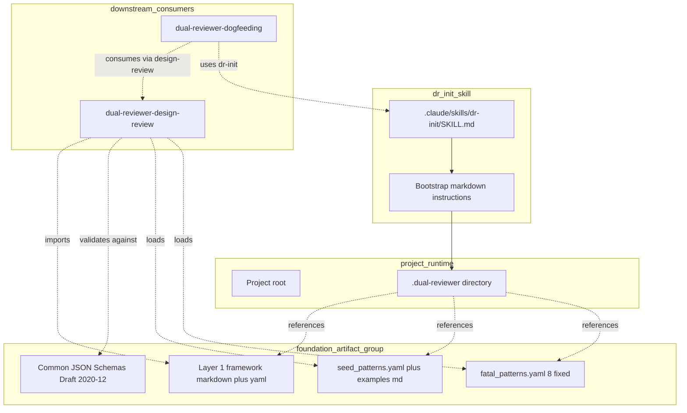
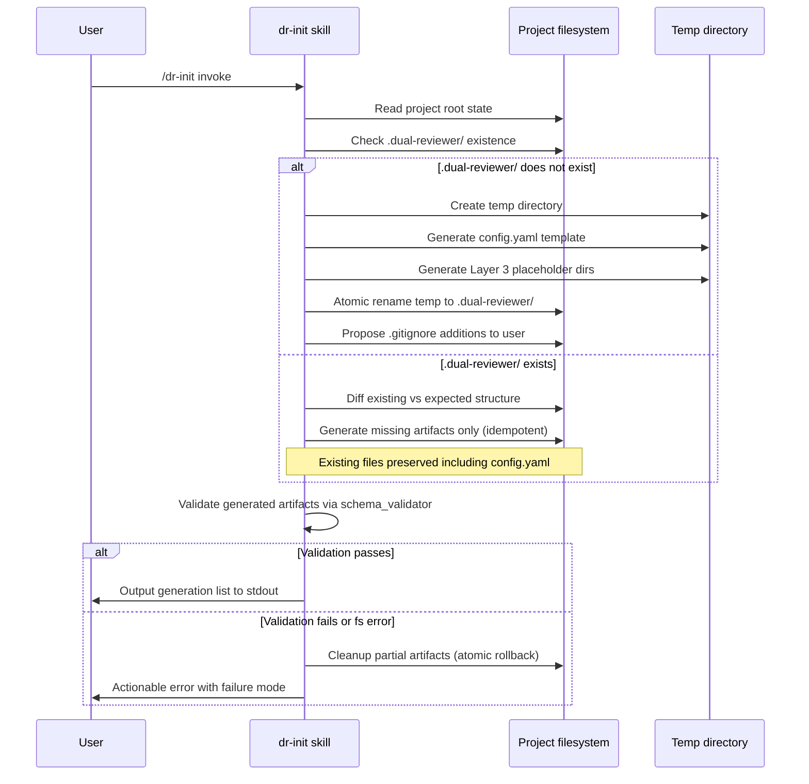
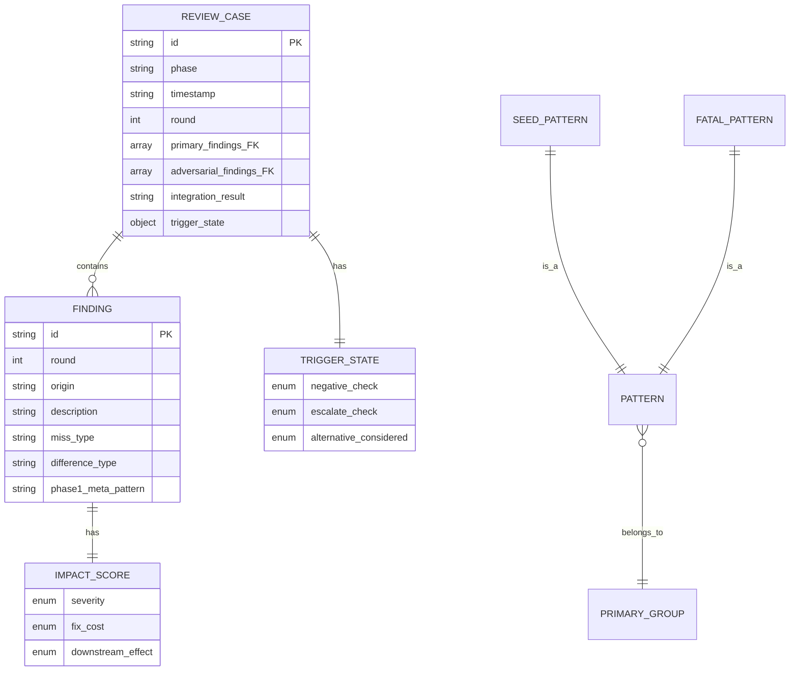

# Design Document — dual-reviewer-foundation

> 出典 / 上位文書: `.kiro/drafts/dual-reviewer-draft.md` v0.3 §2.1 / §2.6 / §2.7 / §2.9 / §2.10.3 / §3 / §4
>
> 参照 memory: `~/.claude/projects/-Users-Daily-Development-Rwiki-dev/memory/feedback_design_review_v3_generalization_design.md` §1-14、`feedback_v3_adoption_lessons_phase_a.md` (教訓 1-4)、`feedback_review_judgment_patterns.md` (23 retrofit pattern source)
>
> defer list: `.kiro/specs/dual-reviewer-design-phase-defer-list.md` F-1〜F-10 を本 design で全件解決

## Overview

**Purpose**: 本 spec は dual-reviewer (LLM 設計レビュー方法論 v3 一般化 package) の Layer 1 基盤を Phase A scope (Rwiki repo 内 prototype 段階) で稼働可能な状態にする。phase 横断 framework + project bootstrap (`dr-init` skill) + 共通 JSON schema + 初期 seed (23 事例 retrofit + 致命級 8 種固定) を artifact として整備し、依存 spec (`dual-reviewer-design-review` / `dual-reviewer-dogfeeding`) が機能可能になる contract を確立する。

**Users**: dual-reviewer prototype 開発者 (`dr-design` / `dr-log` 実装者) と downstream spec の design / tasks / implementation を担う開発者。foundation artifact を loadable / 参照可能な状態で利用する。

**Impact**: Rwiki repo 内に dual-reviewer prototype 用の独立 artifact 群を新規追加する。既存 Rwiki spec (Spec 0-7) には影響を与えない (機能的独立)。Phase B 独立 fork 時に本 artifact 群が package release 母体となる (固有名詞除去 + npm package 化は Phase B-1.0 release prep 責務、本 spec 範囲外)。

### Goals

- Layer 1 framework 骨組み (Step A/B/C 構造 + bias 抑制 quota + pattern schema 中程度 granularity 二層) を yaml + markdown hybrid form で portable に提供
- `dr-init` skill (Claude Code skill 形式) で project bootstrap を idempotent + atomic に実行
- 共通 JSON Schema (Draft 2020-12) で review_case / finding / impact_score 3 軸 / B-1.0 拡張 schema 4 要素 (`miss_type` / `difference_type` / `trigger_state` / `phase1_meta_pattern`) を validator で検証可能な形式で定義
- 23 事例 retrofit を `seed_patterns.yaml` + 人間可読 example markdown として同梱 (Rwiki 固有名詞付き、generalization は B-1.0 release prep 責務)
- 致命級 8 種を `fatal_patterns.yaml` として固定 immutable 配備
- 全 artifact を stable file path から downstream spec が import / load 可能にする encapsulation 確立

### Non-Goals

- `dr-design` / `dr-log` skill 実装 (`dual-reviewer-design-review` 担当)
- Layer 2 phase extension (design extension は `dual-reviewer-design-review`、tasks / requirements / implementation extension は B-1.x)
- Spec 6 dogfeeding 適用 + 対照実験 (`dual-reviewer-dogfeeding` 担当)
- cycle automation (Run-Log-Analyze-Update) — `dr-extract` / `dr-update` は B-1.2
- forced divergence prompt template (本 spec は概念参照のみ、文言生成は Layer 2 design extension 責務)
- `impact_score` 生成・記録 logic (本 spec は schema 定義のみ、生成 logic は `dr-log` 責務)
- 並列処理 + 整合性 Round 6 task 本格実装 (B-1.x 以降)
- multi-vendor / multi-subagent / hypothesis generator role 3 体構成 (B-2 以降)
- B-1.x 拡張 schema 実装 (`decision_path` / `skipped_alternatives` / `bias_signal`)
- generalization (固有名詞除去) / npm package 化 (Phase B-1.0 release prep)
- `--integrate-cc-sdd` flag 本格実装 (B-1.3 担当、本 spec では `dr-init` skill placeholder のみ)
- defer 集約 process の skill 化 (`dr-defer-collect`、B-1.x 担当、教訓 4 由来)

## Boundary Commitments

### This Spec Owns

- **Layer 1 framework artifact** (`scripts/dual_reviewer_prototype/framework/` 配下、Step A/B/C 構造定義 markdown + bias 抑制 quota yaml + pattern schema 中程度 granularity 二層 yaml + 介入 framework 規定)
- **`dr-init` skill** (`.claude/skills/dr-init/SKILL.md` + supporting markdown instructions、project bootstrap の責任主体)
- **共通 JSON Schema artifact 群** (`scripts/dual_reviewer_prototype/schemas/*.json`、review_case / finding / impact_score / B-1.0 拡張 schema 4 要素の Draft 2020-12 定義)
- **`seed_patterns.yaml`** (23 事例 retrofit、Rwiki 固有名詞付き、`origin: rwiki-v2-dev-log`)
- **`seed_patterns_examples.md`** (人間可読、各 pattern の具体例)
- **`fatal_patterns.yaml`** (致命級 8 種固定 immutable)
- **Downstream 提供 contract** (上記 artifact の stable file path + loader API + actionable error message 規定)

### Out of Boundary

- `dr-design` / `dr-log` skill の internal logic + Layer 2 design extension の Step A/B/C / quota 拡張 (`dual-reviewer-design-review` 責務)
- Spec 6 design への適用 + 対照実験 + Phase B fork 判断 (`dual-reviewer-dogfeeding` 責務)
- 教訓 1 (3 段階 review pattern) の Layer 2 design extension 組込 (`dual-reviewer-design-review` 責務)
- 教訓 2 (Step 1b 5 重検査) の design extension AC 化 (`dual-reviewer-design-review` 責務)
- 教訓 3 (cross-spec contract 検証) の design extension 新 AC 化 (`dual-reviewer-design-review` 責務)
- 教訓 4 (defer 集約 process) の skill 化 = B-1.x で `dr-defer-collect` skill (本 spec の `dr-init` には組込まず)
- forced divergence prompt の文言生成 logic (`dual-reviewer-design-review` 内 adversarial subagent prompt 責務)
- escalate 必須条件 5 種の発動 logic (`dual-reviewer-design-review` Layer 2 quota 責務、本 spec の Layer 1 では「concept として参照」のみ)
- B-1.x 以降の skill 群 (`dr-tasks` / `dr-requirements` / `dr-impl` / `dr-extract` / `dr-validate` / `dr-update` / `dr-translate`)
- generalization (固有名詞除去) + npm package 化 (Phase B-1.0 release prep)
- `config.yaml` schema 非互換改版 (upgrade scenario) — Phase A scope = single version、本 spec では skip

### Allowed Dependencies

- **Python 3.10+** (Rwiki tech.md 整合、loader / schema validator 実装言語)
- **`jsonschema` Python lib** (Draft 2020-12 validator、build-vs-adopt = adopt)
- **`pyyaml` Python lib** (yaml load、build-vs-adopt = adopt)
- **Claude Code Agent tool** (`dr-init` skill が `.claude/skills/dr-init/SKILL.md` 形式で Bash / Read / Write / Glob を allowed-tools として宣言、既存 `.claude/skills/kiro-*/SKILL.md` 形式に整合)
- **memory `feedback_review_judgment_patterns.md`** (23 事例 retrofit 元データの正本、build time に参照、runtime 依存なし)
- **`.kiro/drafts/dual-reviewer-draft.md` v0.3** (上位文書、change tracking 参照点、runtime 依存なし)

### Revalidation Triggers

以下のいずれかが発生した場合、依存 spec (`dual-reviewer-design-review` / `dual-reviewer-dogfeeding`) は contract 再検証が必要:

- 共通 JSON Schema の field shape 変更 (削除 / rename / type 変更)、特に `phase1_meta_pattern` enum 値の追加・削除 (`dual-reviewer-dogfeeding` Req 4 AC 3 連鎖)
- `severity` 4 値 enum (CRITICAL / ERROR / WARN / INFO) の変更 (Rwiki steering tech.md `severity` 体系連鎖)
- `seed_patterns.yaml` schema の primary_group / secondary_groups 構造変更 (downstream pattern matching logic 連鎖)
- `fatal_patterns.yaml` の 8 種 list 変更 (Phase A 期間中 immutable、変更は B-2 以降)
- artifact stable file path 変更 (downstream import path 全件破壊)
- `dr-init` skill argument / output 仕様変更 (downstream 起動方式連鎖)
- Layer 1 framework の Step A/B/C 構造変更 + bias 抑制 quota 採用方針変更 (Layer 2 design extension の継承点連鎖)
- 教訓 1-4 を foundation 内に組込判断する場合 (現状は全件 Out of Boundary、判断変更時は本 spec の boundary 再定義必要)

## Architecture

### Existing Architecture Analysis

dual-reviewer は Rwiki と機能的に独立した方法論 package であり、既存 Rwiki spec (Spec 0-7) のいずれにも import / dependency を持たない。Phase A 期間中は Rwiki repo 内 prototype 配置 (`scripts/dual_reviewer_prototype/` を採用) するが、cross-spec dependency は導入しない。Rwiki tech.md の Python 環境 (3.10+ / TDD / 2 スペースインデント) と severity 4 値体系 (CRITICAL / ERROR / WARN / INFO) を継承する。

### Architecture Pattern & Boundary Map



**Architecture Integration**:
- **Selected pattern**: Layered artifact provider — foundation は consumable artifact 群を独占的に owns し、downstream spec は stable file path 経由で load する。executable logic は最小化 (`dr-init` skill のみ)、残りは declarative artifact (yaml / json / markdown) で portable に保つ
- **Domain boundaries**: Layer 1 framework (phase 横断 portable) / Schema (data contract) / Seed (knowledge content) / Skill (bootstrap entry) を artifact 種別で分離。各 artifact は単一責任、downstream は declarative load のみ
- **Dependency direction**: `dr-init` skill → bootstrap logic → file system (project `.dual-reviewer/` 生成)。downstream spec → foundation artifact (read-only)。逆方向 dependency なし
- **Steering compliance**: Rwiki tech.md の Python 3.10+ / TDD / severity 4 値 / subprocess timeout 必須 (本 spec では fs 操作タイムアウト) / 2 スペースインデント を継承

### Technology Stack

| Layer | Choice / Version | Role in Feature | Notes |
|-------|------------------|-----------------|-------|
| Skill runtime | Claude Code Agent tool | `dr-init` skill 起動 + Bash / Read / Write / Glob 実行 | `.claude/skills/dr-init/SKILL.md` 形式、既存 `kiro-*` skill 整合 |
| Language (loader / validator) | Python 3.10+ | schema validator + yaml/json loader 実装、unit test | Rwiki tech.md 整合、`scripts/dual_reviewer_prototype/` 配下 |
| Schema definition | JSON Schema Draft 2020-12 | review_case / finding / impact_score / 拡張 4 要素の検証 | F-7 確定 = latest stable + jsonschema Python lib full support |
| Schema validator | `jsonschema` Python lib | downstream JSONL 検証 (本 spec は library 提供のみ、検証 logic は `dr-log` 責務) | adopt 判断 (`research.md` 参照) |
| Yaml load | `pyyaml` Python lib | `seed_patterns.yaml` / `fatal_patterns.yaml` / `config.yaml` load | adopt 判断 |
| Test | pytest | TDD で先行 test、続いて実装 | Rwiki tech.md 整合、2 スペースインデント |
| File system | atomic temp + rename | `dr-init` の partial 生成防止 | F-5 確定方針 (atomic 操作) |

> rationale 詳細 (jsonschema vs alternatives 等) は `research.md` 参照。本 spec は build-vs-adopt 判断結果のみ design.md に記録。

## File Structure Plan

### Directory Structure

```
scripts/dual_reviewer_prototype/             # Phase A prototype 配置 root
├── framework/                                # Layer 1 framework artifact 群
│   ├── step_abc.md                          # Step A/B/C 構造定義 (markdown)
│   ├── quotas.yaml                          # bias 抑制 quota 5 種定義 (yaml)
│   ├── pattern_schema.yaml                  # primary_group + secondary_groups schema (yaml)
│   ├── intervention_framework.md            # 介入 framework 規定 (event-triggered, post-run measurement only)
│   └── extension_points.md                  # Layer 2 phase extension hook 仕様
├── schemas/                                  # 共通 JSON Schema artifact 群 (Draft 2020-12)
│   ├── review_case.schema.json              # review_case object schema
│   ├── finding.schema.json                  # finding object schema
│   ├── impact_score.schema.json             # impact_score 3 軸 schema
│   └── extension_fields.schema.json         # B-1.0 拡張 schema 4 要素 (miss_type / difference_type / trigger_state / phase1_meta_pattern)
├── data/                                     # immutable seed artifact 群
│   ├── seed_patterns.yaml                   # 23 事例 retrofit (Rwiki 固有名詞付き)
│   ├── seed_patterns_examples.md            # 人間可読 example
│   └── fatal_patterns.yaml                  # 致命級 8 種固定 immutable
├── loader/                                   # Python loader / validator 実装
│   ├── __init__.py                          # explicit export (encapsulation 確立、F-9)
│   ├── _internal.py                         # private 実装 ( _ prefix で internal 表現、F-9)
│   ├── schema_validator.py                  # jsonschema wrapper、malformed 検出 (F-10)
│   └── pattern_loader.py                    # seed/fatal patterns yaml load
└── tests/                                    # TDD 先行 test
    ├── test_schema_validity.py              # schema 自体が Draft 2020-12 valid か
    ├── test_pattern_loader.py               # seed/fatal yaml load + schema 準拠
    ├── test_encapsulation.py                # internal symbol 不可視性確認 (F-9)
    └── test_dr_init_dry_run.py              # dr-init skill bootstrap 結果検証

.claude/skills/dr-init/                       # Claude Code skill (Req 6 AC 5 固定)
└── SKILL.md                                  # frontmatter + bootstrap instructions
```

### Modified Files

- `.gitignore` (project root) — `dr-init` skill が起動時に project `.gitignore` に Layer 3 placeholder の追記提案を行い、user 承認経由で適用 (F-3 確定)。本 spec の foundation 自体は modify しないが、`dr-init` 実行時 side-effect として更新される

> 各 file は単一責任を持つ。`framework/` 配下は portable artifact (markdown/yaml)、`schemas/` 配下は machine-validatable JSON Schema、`data/` 配下は immutable seed、`loader/` 配下は Python implementation、`tests/` 配下は TDD test。`dr-init` skill は markdown instructions のみで実装 (executable は Bash/Read/Write/Glob 経由)。
>
> generation phase (Phase A 内 A-1) で全 file を新規生成する。既存 file の modify は `.gitignore` のみ。

## System Flows

### dr-init skill bootstrap sequence



**Key flow decisions**:
- **Atomic 操作**: temp directory + rename を default (F-5)。SIGINT / SIGTERM は signal handler で temp cleanup 後 actionable error
- **Idempotent**: `.dual-reviewer/` 既存時は不足分のみ生成、既存 file は上書き禁止 (Req 2 AC 4)
- **Failure modes** (F-5 確定列挙):
  - (a) 親ディレクトリ書込権限不足 (Permission denied)
  - (b) disk full (ENOSPC)
  - (c) 不正パス (path traversal 試行 / project root 外 path 指定)
  - (d) 同名 directory 既存で `--force` フラグなし
  - (e) symlink 干渉 (`.dual-reviewer/` が既存 symlink の場合)
- **Schema validation**: `dr-init` 完了直前に同梱 artifact (`seed_patterns.yaml` / `fatal_patterns.yaml` / 共通 JSON schema) の syntax check + schema validation を実行、失敗時に「artifact `<file>` が malformed: `<理由>`」の actionable error 出力 (F-10)

## Requirements Traceability

| Requirement | Summary | Components | Interfaces | Flows |
|-------------|---------|------------|------------|-------|
| 1.1 | Step A/B/C 構造 portable form | Layer 1 framework | `framework/step_abc.md` | — |
| 1.2 | bias 抑制 quota event-triggered | Layer 1 framework | `framework/quotas.yaml` + `framework/intervention_framework.md` | — |
| 1.3 | pattern schema primary + secondary 二層 | Layer 1 framework | `framework/pattern_schema.yaml` | — |
| 1.4 | Layer 2 extension point 提供 | Layer 1 framework | `framework/extension_points.md` | — |
| 1.5 | phase 別 review logic 含めない (boundary) | Layer 1 framework (Out of Boundary) | — | — |
| 2.1 | `.dual-reviewer/` 生成 | dr-init skill | SKILL.md instructions | dr-init bootstrap sequence |
| 2.2 | `config.yaml` 雛形生成 | dr-init skill | SKILL.md + config 雛形 template | dr-init bootstrap sequence |
| 2.3 | Layer 3 placeholder dirs 生成 | dr-init skill | SKILL.md + Layer 3 list | dr-init bootstrap sequence |
| 2.4 | idempotent 保持 (上書き禁止) | dr-init skill | SKILL.md branching logic | dr-init bootstrap sequence |
| 2.5 | 生成内容の stdout 記録 | dr-init skill | SKILL.md output spec | dr-init bootstrap sequence |
| 2.6 | fs error 時 actionable + atomic | dr-init skill | SKILL.md error handling + temp + rename | dr-init bootstrap sequence |
| 3.1 | review_case object schema | Common JSON Schema | `schemas/review_case.schema.json` | — |
| 3.2 | finding object schema | Common JSON Schema | `schemas/finding.schema.json` | — |
| 3.3 | impact_score 3 軸 object | Common JSON Schema | `schemas/impact_score.schema.json` | — |
| 3.4 | severity 4 値 enum | Common JSON Schema | `schemas/impact_score.schema.json` 内 severity sub-schema | — |
| 3.5 | fix_cost / downstream_effect 有限 enum | Common JSON Schema | `schemas/impact_score.schema.json` 内 sub-schema | — |
| 3.6 | miss_type 6 値 enum | Common JSON Schema | `schemas/extension_fields.schema.json` | — |
| 3.7 | difference_type 6 値 enum optional | Common JSON Schema | `schemas/extension_fields.schema.json` | — |
| 3.8 | trigger_state 3 軸 object | Common JSON Schema | `schemas/extension_fields.schema.json` | — |
| 3.9 | JSON Schema Draft 2020-12 | Common JSON Schema | 全 schema file の `$schema` field | — |
| 3.10 | phase1_meta_pattern 3 値 enum + null | Common JSON Schema | `schemas/extension_fields.schema.json` | — |
| 4.1 | 23 事例 retrofit | seed_patterns.yaml | `data/seed_patterns.yaml` | — |
| 4.2 | `origin: rwiki-v2-dev-log` 付与 | seed_patterns.yaml | `data/seed_patterns.yaml` field | — |
| 4.3 | 固有名詞保持 | seed_patterns.yaml | `data/seed_patterns.yaml` content | — |
| 4.4 | pattern schema 準拠 + domain tag なし | seed_patterns.yaml | `data/seed_patterns.yaml` ↔ `framework/pattern_schema.yaml` 整合 | — |
| 4.5 | examples markdown 同梱 | seed_patterns_examples | `data/seed_patterns_examples.md` | — |
| 4.6 | stable path から load | seed_patterns + loader | `loader/pattern_loader.py` API | — |
| 5.1 | 致命級 8 種正確に | fatal_patterns.yaml | `data/fatal_patterns.yaml` | — |
| 5.2 | name / description / detection_hints structured | fatal_patterns.yaml | `data/fatal_patterns.yaml` schema | — |
| 5.3 | 強制照合可能形式 | fatal_patterns.yaml | yaml 形式 + loader API | — |
| 5.4 | domain 横断記述 | fatal_patterns.yaml | content review | — |
| 5.5 | stable path から load | fatal_patterns + loader | `loader/pattern_loader.py` API | — |
| 5.6 | Phase A 期間中 immutable | fatal_patterns.yaml | content + change policy | — |
| 6.1 | Layer 1 framework stable import path | Downstream contract | `scripts/dual_reviewer_prototype/framework/` | — |
| 6.2 | JSON schema stable file path | Downstream contract | `scripts/dual_reviewer_prototype/schemas/*.json` | — |
| 6.3 | seed_patterns + examples stable paths | Downstream contract | `scripts/dual_reviewer_prototype/data/seed_patterns*` | — |
| 6.4 | fatal_patterns stable file path | Downstream contract | `scripts/dual_reviewer_prototype/data/fatal_patterns.yaml` | — |
| 6.5 | dr-init skill `.claude/skills/dr-init/SKILL.md` 形式 | dr-init skill | `.claude/skills/dr-init/SKILL.md` | — |
| 6.6 | encapsulation (loadable artifact のみ公開) | loader | `loader/__init__.py` explicit export + `_internal.py` private | — |
| 6.7 | artifact load 失敗時 actionable error | loader + dr-init | `schema_validator.py` + dr-init bootstrap | dr-init bootstrap sequence (validation 失敗 branch) |

## Components and Interfaces

| Component | Domain/Layer | Intent | Req Coverage | Key Dependencies (P0/P1) | Contracts |
|-----------|--------------|--------|--------------|--------------------------|-----------|
| Layer 1 Framework | foundation/framework | phase 横断 portable framework artifact | 1.1, 1.2, 1.3, 1.4, 1.5, 6.1 | yaml + markdown (P0) | Artifact (file-based) |
| dr-init Skill | foundation/skill | project bootstrap entry | 2.1, 2.2, 2.3, 2.4, 2.5, 2.6, 6.5 | Claude Code Agent tool (P0), Loader (P1) | Service (skill invocation) |
| Common JSON Schema | foundation/schema | data contract for review_case / finding / impact_score / 拡張 4 要素 | 3.1, 3.2, 3.3, 3.4, 3.5, 3.6, 3.7, 3.8, 3.9, 3.10, 6.2 | JSON Schema Draft 2020-12 (P0) | Schema (file-based) |
| seed_patterns artifact | foundation/data | 23 retrofit pattern initial seed | 4.1, 4.2, 4.3, 4.4, 4.5, 4.6, 6.3 | pattern_schema.yaml (P0) | Artifact (file-based) |
| fatal_patterns artifact | foundation/data | 致命級 8 種 immutable seed | 5.1, 5.2, 5.3, 5.4, 5.5, 5.6, 6.4 | pattern schema constraints (P1) | Artifact (file-based) |
| Loader (Python) | foundation/loader | yaml / json load + schema validation + encapsulation | 6.6, 6.7, 4.6, 5.5 | jsonschema (P0), pyyaml (P0) | Service interface (Python API) |

### Foundation / Framework

#### Layer 1 Framework

| Field | Detail |
|-------|--------|
| Intent | phase 横断 portable framework artifact 群を yaml + markdown hybrid で提供 |
| Requirements | 1.1, 1.2, 1.3, 1.4, 1.5, 6.1 |

**Responsibilities & Constraints**:
- Step A/B/C 構造 (primary detection → adversarial review → integration) を `step_abc.md` で markdown 記述、phase 横断で再利用可能 (F-1 確定 = yaml + markdown hybrid)
- bias 抑制 quota 5 種 (formal challenge / 検出漏れ / Phase 1 同型探索 / `fatal_patterns.yaml` 強制照合 / forced divergence concept reference) を `quotas.yaml` で event-triggered 介入として定義、Tier 比率は post-run measurement only と規定 (Req 1.2)
- pattern schema (中程度 granularity + primary_group + secondary_groups 二層) を `pattern_schema.yaml` で定義、primary_group = 8 群 (A 内部矛盾 / B 実装不可能性 / C 責務境界 / D 規範範囲 / E failure / F concurrency / G 整合性 SSoT / H 選択肢)、secondary_groups = 各群 2-3 種 (合計 23 種、F-2 確定、`feedback_review_judgment_patterns.md` 構造逆算)
- Layer 2 phase extension hook + quota 追加点を `extension_points.md` で markdown 記述 (Req 1.4)
- phase 別 review logic は含めない = Layer 2 extension 責務、本 framework は概念参照のみ (Req 1.5、Out of Boundary 整合)

**Dependencies**:
- Inbound: dr-init skill — bootstrap 時に framework artifact を `.dual-reviewer/` に reference (P1)
- Outbound: なし (declarative artifact、runtime dependency なし)
- External: yaml syntax + markdown syntax (P0)

**Contracts**: Service [ ] / API [ ] / Event [ ] / Batch [ ] / State [ ] / **Artifact (file-based)** [✓]

##### Artifact Layout

```
framework/
├── step_abc.md              # Step A 主検出 / Step B adversarial レビュー / Step C 統合 の 3 段階 markdown
├── quotas.yaml              # bias 抑制 quota 5 種 (event-triggered 介入)
├── pattern_schema.yaml      # primary_group 8 群 + secondary_groups 各 2-3 種 (中程度 granularity)
├── intervention_framework.md # event-triggered 介入規定 + post-run measurement only 方針
└── extension_points.md      # Layer 2 phase 別 hook + quota 追加点規定
```

**`quotas.yaml` 構造例** (Layer 1 quota 5 種):

```yaml
version: 1
description: Layer 1 bias-suppression quotas event-triggered intervention only
quotas:
  - name: formal_challenge
    trigger: each round end
    description: Formal challenge against primary findings
  - name: detection_omission
    trigger: round end after primary detection
    description: Detection omission check via secondary review
  - name: phase1_isomorphism
    trigger: each round
    description: Phase 1 isomorphism search across 3 meta-patterns
  - name: fatal_patterns_match
    trigger: each round end
    description: Forced match against fatal_patterns yaml 8 fixed
  - name: forced_divergence_concept
    trigger: layer-2 design extension only
    description: Concept reference only Layer 2 generates the prompt template
post_run_measurement:
  enabled: true
  pre_run_target_setting: false  # Goodhart law avoidance
```

**`pattern_schema.yaml` 構造例** (中程度 granularity 二層):

```yaml
version: 1
granularity: medium
primary_groups:
  - id: A
    name: internal_contradiction
    secondary:
      - same_spec_prohibit_vs_allow
      - schema_vs_behavior_drift
      - design_decision_conflict
  - id: B
    name: implementation_infeasibility
    secondary:
      - reverse_inference_infeasibility
      - downstream_implementability
      - algorithm_mismatch
  # ... C through H, total 8 primary groups, 23 secondary patterns total
domain_tag: false  # 8 メタ群 + 中程度 granularity で domain 横断
```

**Implementation Notes**:
- Integration: dr-init skill が `.dual-reviewer/framework/` reference を `config.yaml` に書込
- Validation: `tests/test_pattern_loader.py` で primary_group = 8 / secondary 合計 = 23 を assert
- Risks: framework artifact の改版時に Layer 2 design extension の継承点が破壊される可能性 → Revalidation Triggers に明記

#### dr-init Skill

| Field | Detail |
|-------|--------|
| Intent | project bootstrap (`.dual-reviewer/` 構造 + config 雛形 + Layer 3 placeholder + .gitignore 提案) を idempotent + atomic に実行 |
| Requirements | 2.1, 2.2, 2.3, 2.4, 2.5, 2.6, 6.5 |

**Responsibilities & Constraints**:
- `.claude/skills/dr-init/SKILL.md` 形式で Claude Code skill として配置 (Req 6.5、既存 `.claude/skills/kiro-*/SKILL.md` と同形式)
- 起動時に `.dual-reviewer/` ディレクトリ + `config.yaml` 雛形 + Layer 3 placeholder dirs を atomic 生成 (Req 2.1, 2.2, 2.3)
- 既存 `.dual-reviewer/` がある場合は不足分のみ生成 (idempotent、Req 2.4)、`config.yaml` も既存なら保持
- 生成した全ファイル + ディレクトリを stdout に list 出力 (Req 2.5)
- fs error 時に actionable error + partial 生成物を残さない (atomic 操作 = temp dir + rename、F-5 確定方針、Req 2.6)
- SIGINT / SIGTERM 中断 signal は signal handler で temp cleanup 後 actionable error
- failure modes 5 種 (F-5 確定 = 権限不足 / disk full / 不正 path / 同名 directory + `--force` なし / symlink 干渉)
- `.gitignore` 更新は dr-init が user に提案 → user 承認経由で適用 (F-3 確定)、Layer 3 placeholder 配下 (`extracted_patterns/` / `dev_log/` / `tier_measurements/`) を git 管理外推奨

**Dependencies**:
- Inbound: User (slash command `/dr-init` 経由) (P0)
- Outbound: Loader (schema validation 経由 = artifact malformed 検出に Loader API を使う) (P1)
- External: Claude Code Agent tool (Bash / Read / Write / Glob) (P0)

**Contracts**: **Service** [✓] / API [ ] / Event [ ] / Batch [ ] / State [ ] / Artifact [ ]

##### Skill Interface

skill 起動仕様 (`.claude/skills/dr-init/SKILL.md` frontmatter):

```yaml
---
name: dr-init
description: Initialize dual-reviewer project bootstrap creates .dual-reviewer directory structure and config yaml template
allowed-tools: Bash, Read, Write, Glob
argument-hint: [--force] [--dry-run]
---
```

skill instructions (markdown body):
- **Step 1**: project root 確認 (working directory が git root or project marker file 含む directory) — 不正な場合 `path_error` で actionable error
- **Step 2**: `.dual-reviewer/` 既存検出 → branching (新規生成 or idempotent 不足分生成)
- **Step 3**: temp directory 作成 + 全 artifact 雛形生成 → atomic rename
- **Step 4**: 生成 artifact の syntax + schema validation (Loader 呼出、F-10) → 失敗時 atomic rollback
- **Step 5**: `.gitignore` 追記提案 (Layer 3 placeholder dirs) → user 承認 → 追記
- **Step 6**: 生成 list を stdout 出力 (Req 2.5)

##### Generated Layout

```
<project_root>/
├── .dual-reviewer/
│   ├── config.yaml              # primary_model / adversarial_model / language placeholder
│   ├── extracted_patterns/      # Layer 3 placeholder (gitignore 推奨)
│   ├── terminology/             # Layer 3 placeholder (git 管理可)
│   ├── dev_log/                 # Layer 3 placeholder (gitignore 推奨)
│   └── tier_measurements/       # Layer 3 placeholder (gitignore 推奨)
└── .gitignore                    # 追記候補 (user 承認経由)
```

`config.yaml` 雛形例:

```yaml
version: 1  # F-4 確定 = Phase A scope は single version upgrade 機構は B-1.x 以降
primary_model: opus       # placeholder default
adversarial_model: sonnet  # placeholder default
language: ja              # default Phase A language seed
layer3_paths:
  extracted_patterns: .dual-reviewer/extracted_patterns/
  terminology: .dual-reviewer/terminology/
  dev_log: .dual-reviewer/dev_log/
  tier_measurements: .dual-reviewer/tier_measurements/
foundation_artifact_root: scripts/dual_reviewer_prototype/  # Phase A 配置
```

**Implementation Notes**:
- Integration: Bash経由で mkdir / touch / cp 実行、Write tool で yaml 生成
- Validation: `tests/test_dr_init_dry_run.py` で `--dry-run` 時の生成物 list を assert + 既存 path 保持を assert
- Risks: SIGINT timing で signal handler が atomic rename 直前に発火する race window → cleanup 順序を「temp dir 作成 → 全 file 生成 → rename」の順守で window 最小化、それでも race の場合は temp dir cleanup 補償

### Foundation / Schema

#### Common JSON Schema

| Field | Detail |
|-------|--------|
| Intent | review_case / finding / impact_score / B-1.0 拡張 schema 4 要素を Draft 2020-12 で validator 検証可能形式に定義 |
| Requirements | 3.1, 3.2, 3.3, 3.4, 3.5, 3.6, 3.7, 3.8, 3.9, 3.10, 6.2 |

**Responsibilities & Constraints**:
- 全 schema は `$schema: https://json-schema.org/draft/2020-12/schema` を declare (Req 3.9、F-7 確定 = Draft 2020-12)
- review_case object: id / phase / timestamp / round / primary_findings (= finding.id 配列) / adversarial_findings (= finding.id 配列) / integration_result / trigger_state field (Req 3.1)、JSONL フラット構造 (1 review_case = 1 line + 1 finding = 1 line で外部キー紐付け)
- finding object: id / round / origin (= primary | adversarial 2 値 enum) / description / impact_score (3 軸 object) / miss_type / difference_type (optional) / phase1_meta_pattern (optional) field (Req 3.2)、severity は impact_score 内に統合 (個別 severity field は持たない、Chappy P0 整合)
- impact_score 3 軸 object: severity / fix_cost / downstream_effect (Req 3.3)
  - severity: 4 値 enum (CRITICAL / ERROR / WARN / INFO) Rwiki tech.md severity 体系整合 (Req 3.4)
  - fix_cost / downstream_effect: 各 LOW / MEDIUM / HIGH の 3 値 enum (F-6 確定、Req 3.5)
- miss_type: 6 値 enum (`implicit_assumption` / `boundary_leakage` / `spec_implementation_gap` / `failure_mode_missing` / `security_oversight` / `consistency_overconfidence`) (Req 3.6)
- difference_type: 6 値 enum (`assumption_shift` / `perspective_divergence` / `constraint_activation` / `scope_expansion` / `adversarial_trigger` / `reasoning_depth`) optional field (Req 3.7、single mode 実行時 absent 許容)
- trigger_state: 3 軸 object (negative_check / escalate_check / alternative_considered)、各 applied | skipped 2 値 enum (Req 3.8)
- phase1_meta_pattern: 3 値 enum + null optional field (`norm_range_preemption` / `doc_impl_inconsistency` / `norm_premise_ambiguity` / null)、escalate 検出 finding にのみ付与、その他は absent (key なし) または null (key あり値 null) どちらも validator 受容 (Req 3.10、F-8 確定 = `type: ["string", "null"]` union 表現を default、`not required` も併用受容)
- escalate 検出 finding の operational 定義は Layer 2 design extension 責務 (Out of Boundary)、本 spec は field 型のみ規定

**Dependencies**:
- Inbound: dr-log skill (`dual-reviewer-design-review` 担当、本 spec の schema を validator に渡す) (P0)
- Outbound: なし (declarative schema)
- External: JSON Schema Draft 2020-12 spec (P0)

**Contracts**: Service [ ] / API [ ] / Event [ ] / Batch [ ] / State [ ] / **Schema (file-based)** [✓]

##### Schema File Layout

```
schemas/
├── review_case.schema.json
├── finding.schema.json
├── impact_score.schema.json
└── extension_fields.schema.json
```

##### `impact_score.schema.json` (要約抜粋)

```json
{
  "$schema": "https://json-schema.org/draft/2020-12/schema",
  "$id": "https://dual-reviewer/schemas/impact_score.json",
  "type": "object",
  "required": ["severity", "fix_cost", "downstream_effect"],
  "properties": {
    "severity": {
      "type": "string",
      "enum": ["CRITICAL", "ERROR", "WARN", "INFO"]
    },
    "fix_cost": {
      "type": "string",
      "enum": ["LOW", "MEDIUM", "HIGH"]
    },
    "downstream_effect": {
      "type": "string",
      "enum": ["LOW", "MEDIUM", "HIGH"]
    }
  },
  "additionalProperties": false
}
```

##### `extension_fields.schema.json` (要約抜粋、phase1_meta_pattern part)

```json
{
  "phase1_meta_pattern": {
    "type": ["string", "null"],
    "enum": [
      "norm_range_preemption",
      "doc_impl_inconsistency",
      "norm_premise_ambiguity",
      null
    ],
    "description": "escalate detected finding only present absent key or null both accepted"
  }
}
```

> 完全 schema は `scripts/dual_reviewer_prototype/schemas/*.json` 実装時に生成。本 design では shape のみ規定。詳細 schema text の inline 表記は冗長なので Supporting References / `research.md` に格納候補。

**Implementation Notes**:
- Integration: `dr-log` skill (downstream) が JSONL 出力時に schema validation 実行
- Validation: `tests/test_schema_validity.py` で 各 schema 自体が Draft 2020-12 metaschema valid か確認 + sample data で `valid` / `invalid` cases を assert
- Risks: enum 値追加時 (例: phase1_meta_pattern に 4 番目追加) は downstream 全件再 validate → Revalidation Triggers 該当

### Foundation / Data

#### seed_patterns artifact

| Field | Detail |
|-------|--------|
| Intent | 23 事例 retrofit pattern を yaml + 人間可読 example markdown で提供 |
| Requirements | 4.1, 4.2, 4.3, 4.4, 4.5, 4.6, 6.3 |

**Responsibilities & Constraints**:
- 23 件の retrofit pattern を `data/seed_patterns.yaml` に記載 (Req 4.1、entry 数 23 は build time に `feedback_review_judgment_patterns.md` 実 count を assert)
- 全 entry に `origin: rwiki-v2-dev-log` 付与 (Req 4.2)
- Rwiki 固有名詞保持 (Phase A scope = generalization 不要、B-1.0 release prep 責務、Req 4.3)
- `framework/pattern_schema.yaml` の primary_group / secondary_groups 構造に準拠、domain tag は付与しない (Req 4.4)
- `data/seed_patterns_examples.md` に各 pattern の人間可読具体例を記述 (Req 4.5)
- Loader API 経由で stable path から load 可能 (Req 4.6、Req 6.3)

**Dependencies**:
- Inbound: dr-design skill (`dual-reviewer-design-review` 担当) — pattern matching 実行時に load (P0)
- Outbound: pattern_schema.yaml (準拠先、P0)
- External: yaml syntax (P0)

**Contracts**: Service [ ] / API [ ] / Event [ ] / Batch [ ] / State [ ] / **Artifact (file-based)** [✓]

##### `seed_patterns.yaml` 構造例

```yaml
version: 1
patterns:
  - id: A1
    origin: rwiki-v2-dev-log
    primary_group: A
    secondary: same_spec_prohibit_vs_allow
    name: 同一 spec 内の禁止 vs 許可矛盾
    description: R.X が A を禁止 R.Y が A を許可 両方記述されている場合
    rwiki_example: Spec 1 R1.2 vs R7.1 enforcement required
    detection_hint: grep contradicting clauses within same spec
  - id: A2
    origin: rwiki-v2-dev-log
    primary_group: A
    secondary: schema_vs_behavior_drift
    # ... 23 entries total each entry carries origin: rwiki-v2-dev-log per Req 4.2
```

**Implementation Notes**:
- Integration: pattern_loader.py が yaml load → pattern_schema 準拠 validation → list[Pattern] 返却
- Validation: `tests/test_pattern_loader.py` で 23 entry 数 + 全 entry が pattern_schema 準拠 + `origin = rwiki-v2-dev-log` 付与を assert
- Risks: Rwiki 固有名詞含むので公開時は B-1.0 release prep で除去必須 → revalidation triggers 該当

#### fatal_patterns artifact

| Field | Detail |
|-------|--------|
| Intent | 致命級 8 種固定 immutable seed |
| Requirements | 5.1, 5.2, 5.3, 5.4, 5.5, 5.6, 6.4 |

**Responsibilities & Constraints**:
- 正確に 8 件の致命級 pattern を含む (Req 5.1): sandbox escape / data loss / privilege escalation / infinite retry / deadlock / path traversal / secret leakage / destructive migration
- 各 pattern は name / description / detection_hints structured field を含む (Req 5.2)
- Layer 2 design extension の強制照合 quota で参照可能形式 (Req 5.3)
- Rwiki 固有事例 reference は OK だが、pattern 名 + detection_hints は domain 横断記述 (Req 5.4)
- Loader API 経由で stable path から load 可能 (Req 5.5、Req 6.4)
- Phase A 期間中 immutable (8 種固定、Req 5.6、変更は Phase B-2 以降の検討事項)

**Dependencies**:
- Inbound: dr-design skill (Layer 2 design extension の強制照合 quota で load) (P0)
- Outbound: なし (immutable artifact)
- External: yaml syntax (P0)

**Contracts**: Service [ ] / API [ ] / Event [ ] / Batch [ ] / State [ ] / **Artifact (file-based)** [✓]

##### `fatal_patterns.yaml` 構造例

```yaml
version: 1
immutable: true  # Phase A immutable (Req 5.6)
patterns:
  - name: sandbox_escape
    description: Process escapes intended sandbox boundary executes outside permitted scope
    detection_hints:
      - subprocess invocation without confined working directory
      - shell expansion of user-supplied path
  - name: data_loss
    description: Operation destroys or overwrites user data without recoverable backup
    detection_hints:
      - rm rf without confirmation gate
      - file rename without checking destination existence
  # ... 6 more entries total 8 fixed
```

**Implementation Notes**:
- Integration: pattern_loader.py が yaml load → 8 entry assert → list[FatalPattern] 返却
- Validation: `tests/test_pattern_loader.py` で entry 数 8 + 8 種 name match + structured field 完備を assert
- Risks: Phase A 期間中の immutable 制約違反検出 = build time check で entry 数 ≠ 8 で fail

### Foundation / Loader

#### Python Loader

| Field | Detail |
|-------|--------|
| Intent | yaml / JSON Schema を load + validate + encapsulation を確立する Python implementation |
| Requirements | 4.6, 5.5, 6.6, 6.7 |

**Responsibilities & Constraints**:
- `loader/__init__.py` で explicit export (`load_seed_patterns` / `load_fatal_patterns` / `validate_review_case` / `validate_finding` 等の public API のみ列挙)
- `loader/_internal.py` は private 実装 (`_` prefix で internal 表現、F-9 確定 = Python convention + documentation で表明)
- `loader/schema_validator.py` は jsonschema lib wrapper、artifact malformed 検出 (F-10 確定 = schema validation 粒度 + dr-init skill が responsibility 主体)
- `loader/pattern_loader.py` は seed_patterns.yaml + fatal_patterns.yaml load + schema 準拠 validation
- artifact load 失敗時に actionable error message を投げる (Req 6.7、「artifact `<file>` が malformed: `<reason>`」)
- internal symbol の不可視性は test で検証 (`tests/test_encapsulation.py` で `_internal` への直接 import が test pass 時に発生しないことを assert)

**Dependencies**:
- Inbound: dr-init skill (validation で呼出)、downstream `dr-log` skill (将来) (P0)
- Outbound: jsonschema lib (P0)、pyyaml lib (P0)
- External: Python 3.10+ (P0)

**Contracts**: **Service** [✓] / API [ ] / Event [ ] / Batch [ ] / State [ ] / Artifact [ ]

##### Service Interface (Python)

```python
# loader/__init__.py public API
from typing import TypedDict, Literal

class ImpactScore(TypedDict):
    severity: Literal["CRITICAL", "ERROR", "WARN", "INFO"]
    fix_cost: Literal["LOW", "MEDIUM", "HIGH"]
    downstream_effect: Literal["LOW", "MEDIUM", "HIGH"]

class SeedPattern(TypedDict):
    """23 retrofit pattern entry seed_patterns yaml domain crossing concept reference."""
    id: str
    origin: Literal["rwiki-v2-dev-log"]  # Req 4.2 each entry carries origin
    primary_group: str  # one of 8 meta groups A through H
    secondary: str       # one of 2-3 secondary patterns within primary group
    name: str
    description: str
    rwiki_example: str   # Rwiki specific noun example Req 4.3 generalization is Phase B-1.0 release prep
    detection_hint: str  # singular concept-level hint

class FatalPattern(TypedDict):
    """8 fixed fatal pattern entry fatal_patterns yaml operational level multiple hints."""
    name: str
    description: str
    detection_hints: list[str]  # plural Req 5.2 multiple operational hints per pattern

def load_seed_patterns(path: str) -> list[SeedPattern]:
    """Load seed_patterns yaml validate against pattern_schema yaml return list of seed patterns.

    Raises ArtifactLoadError if path missing yaml malformed or schema violation.
    Verifies each entry carries origin equal rwiki-v2-dev-log per Req 4.2.
    Verifies entry count equal 23 per Req 4.1.
    """

def load_fatal_patterns(path: str) -> list[FatalPattern]:
    """Load fatal_patterns yaml ensure exactly 8 entries per Req 5.1.

    Raises ArtifactLoadError if entry count not 8 or structured field name description detection_hints missing.
    """

def validate_review_case(data: dict, schema_dir: str) -> None:
    """Validate review_case object against review_case schema raise on violation."""

def validate_finding(data: dict, schema_dir: str) -> None:
    """Validate finding object against finding schema raise on violation."""

class ArtifactLoadError(Exception):
    """Actionable error includes file path failure mode and reason."""
```

- Preconditions: path は absolute or project root relative、artifact file 存在
- Postconditions: 成功時 typed list / None 返却、失敗時 ArtifactLoadError raise (Req 6.7)
- Invariants: internal symbol (`_` prefix) は public API 経由で reach できない (Req 6.6 encapsulation)

**Implementation Notes**:
- Integration: dr-init skill が Loader API を呼出して artifact malformed 検出 (F-10)
- Validation: TDD で先行 test → 実装 (Rwiki tech.md TDD 整合)
- Risks: jsonschema lib の Draft 2020-12 サポート完全性検証は `tests/test_schema_validity.py` で実施

## Data Models

### Domain Model

dual-reviewer-foundation のデータ世界は以下の domain entity を持つ:

- **Pattern**: review pattern の単位 (primary_group + secondary + name + description + detection_hint)。23 retrofit + 8 fatal の 2 種類。primary_group / secondary は pattern_schema.yaml で enum 定義
- **ReviewCase**: 1 review session 内の 1 ラウンド単位の実行 record。primary_findings / adversarial_findings は finding ID への外部キー
- **Finding**: review session で発見された個別所見 record。impact_score 3 軸 + 拡張 4 要素 (`miss_type` / `difference_type` / `phase1_meta_pattern` / `origin`) を持つ
- **ImpactScore**: severity / fix_cost / downstream_effect 3 軸 enum object
- **TriggerState**: review_case ごとの quota 発動状態 (negative_check / escalate_check / alternative_considered) 3 軸 enum object

各 entity は immutable record (JSONL に append-only で記録、本 spec は schema 定義のみ、生成 logic は `dr-log` 責務)。

### Logical Data Model



**Consistency & Integrity**:
- review_case ↔ finding は JSONL flat 構造 + 外部キー紐付け (1 line = 1 record)、transactional boundary は 1 review session
- 全 enum 値は schema validator (`schemas/extension_fields.schema.json`) で機械検証
- review_case の trigger_state と finding の miss_type / difference_type は粒度が異なる (case = run level / finding = finding level)、混同回避は schema 表現で明示

### Data Contracts & Integration

**JSONL output**:
- 形式: 1 review_case = 1 line / 1 finding = 1 line、UTF-8、`\n` 改行
- schema 検証: `schemas/review_case.schema.json` + `schemas/finding.schema.json` を Draft 2020-12 validator で順次 validate (本 spec は schema 提供のみ、validation 実行は `dr-log` 責務)
- versioning: schema version は `$id` URI + `$schema` で識別、Phase A scope は v1 single (F-4)、版数管理 placeholder のみ Req 6.2

詳細な field 定義 + sample data は `research.md` に格納候補。

## Error Handling

### Error Strategy

- **Fail Fast**: artifact malformed / schema violation は dr-init skill 実行直後に検出 + actionable error 出力 (Req 2.6, 6.7)
- **Atomic Rollback**: 部分生成物を残さない (temp dir + rename、SIGINT/SIGTERM 時も signal handler で cleanup、F-5)
- **Actionable Messages**: error message は (a) 影響 file path + (b) failure mode 名 + (c) recovery hint を含む

### Error Categories and Responses

- **User Errors** (4xx相当):
  - `path_error` (project root 不正 / 不正 path) → "Specify valid project root with git or project marker file" hint
  - `existing_dir_no_force` (`.dual-reviewer/` 既存で `--force` なし) → "Use idempotent mode default or pass --force to overwrite" hint
- **System Errors** (5xx相当):
  - `permission_denied` (親ディレクトリ書込権限不足) → "Check permissions of project root" hint
  - `disk_full` (ENOSPC) → "Free disk space and retry" hint
  - `symlink_interference` (`.dual-reviewer/` が既存 symlink) → "Resolve symlink manually before retry" hint
  - `signal_interrupt` (SIGINT/SIGTERM) → cleanup 後 "Interrupted partial state cleaned" message
- **Artifact Errors**:
  - `yaml_malformed` (yaml syntax error) → "Fix yaml syntax in `<file>` line `<n>`" hint
  - `schema_violation` (jsonschema validator fail) → "Field `<path>` violates schema: `<reason>`" hint
  - `entry_count_mismatch` (fatal_patterns 8 件以外) → "fatal_patterns.yaml must contain exactly 8 entries currently `<n>`" hint

### Monitoring

Phase A prototype scope では monitoring infrastructure は導入せず、stdout + actionable error message のみ。dev_log JSONL への記録は `dr-log` 責務 (Out of Boundary)。

## Testing Strategy

### Unit Tests

- `tests/test_schema_validity.py`: 全 4 schema (`review_case` / `finding` / `impact_score` / `extension_fields`) が JSON Schema Draft 2020-12 metaschema valid (3.9)、sample data で valid / invalid cases 各 3 例以上 (3.1, 3.2, 3.3, 3.6, 3.7, 3.8, 3.10)
- `tests/test_pattern_loader.py`: `seed_patterns.yaml` 23 entry 数 + 全 entry が pattern_schema 準拠 + `origin: rwiki-v2-dev-log` 付与 (4.1, 4.2, 4.4)、`fatal_patterns.yaml` 8 entry 固定 + 8 種 name match + structured field 完備 (5.1, 5.2)
- `tests/test_encapsulation.py`: Loader public API のみ `__init__.py` 経由で import 可能、`_internal` は public API 経由で reach できない (6.6)
- `tests/test_dr_init_dry_run.py`: `--dry-run` モードで `.dual-reviewer/` 生成内容 list が期待値と一致 (2.1, 2.2, 2.3, 2.5)、既存 path 保持 (2.4)、actionable error case 5 種 (F-5 列挙) (2.6)

### Integration Tests

- `tests/integration/test_dr_init_lifecycle.py`: `dr-init` 起動 → atomic 生成 → schema validation → stdout 出力の end-to-end (2.1〜2.6, 6.5)
- `tests/integration/test_loader_artifact_paths.py`: stable file path から `seed_patterns.yaml` / `fatal_patterns.yaml` / 各 schema を Loader 経由で load 成功 (4.6, 5.5, 6.1〜6.4)
- `tests/integration/test_artifact_malformed.py`: 意図的に malformed yaml + schema violation を仕込み、Loader が `ArtifactLoadError` を raise + actionable message 出力 (6.7)

### E2E Tests

- 本 spec は CLI / UI を持たないため伝統的 E2E は不要。Integration test で sufficient

### Performance / Load

- foundation artifact は静的 read-only、performance target は不要 (B-1.x cycle automation 時に再検討)

## Design Decisions (defer 10 件 resolution)

| # | Req AC | defer 内容 | 確定方針 |
|---|--------|-----------|---------|
| F-1 | 1.1 | Step A/B/C 構造の具体提供 form | yaml + markdown hybrid (workflow = `framework/step_abc.md` markdown / quotas = `framework/quotas.yaml` yaml) |
| F-2 | 1.3 | pattern schema primary_group の数 / secondary_groups の種類数 | primary_group = 8 群 (A-H、内部矛盾 / 実装不可能性 / 責務境界 / 規範範囲 / failure / concurrency / 整合性 SSoT / 選択肢)、secondary_groups = 各群 2-3 種 (合計 23 種、`feedback_review_judgment_patterns.md` 構造逆算) |
| F-3 | 2.3 | Layer 3 placeholder の `.gitignore` 更新方針 | project `.gitignore` に追記 (`dr-init` skill が user に提案 → 承認経由で適用)、`extracted_patterns/` / `dev_log/` / `tier_measurements/` を git 管理外推奨、`terminology/` のみ git 管理可 |
| F-4 | 2.4 | `config.yaml` schema 非互換改版の挙動 | Phase A scope = single version、本 spec では skip (upgrade 機構は B-1.x 以降の検討) |
| F-5 | 2.6 | fs error の具体 failure mode + atomic 操作 vs cleanup 選択 + signal 取扱 | atomic = temp dir + rename 方式 / failure mode 5 種列挙 (権限不足 / disk full / 不正 path / 同名 directory + `--force` なし / symlink 干渉) / SIGINT-SIGTERM = signal handler で temp cleanup 後 actionable error |
| F-6 | 3.5 | `impact_score.fix_cost` / `downstream_effect` 有限値 enum | LOW / MEDIUM / HIGH の 3 値 enum (post-run measurement 整合) |
| F-7 | 3.9 | JSON Schema Draft 版 | Draft 2020-12 (latest stable + jsonschema Python lib full support) |
| F-8 | 3.10 | `phase1_meta_pattern` JSON Schema 実装方式 | `type: ["string", "null"]` union 表現 default、key absent も validator 受容 (`not required` も両方受容) |
| F-9 | 6.6 | encapsulation 検証基準 | Python `_` prefix private + `__init__.py` explicit export + `tests/test_encapsulation.py` で internal symbol 不可視性確認 |
| F-10 | 6.7 | malformed 検出粒度 + error 提供 agent | schema validation 粒度 + `dr-init` skill が責任主体 (起動時に同梱 artifact validate、失敗時 actionable error) |

教訓 1-4 (memory `feedback_v3_adoption_lessons_phase_a.md`) はすべて Out of Boundary:
- 教訓 1 (3 段階 review pattern Layer 2 組込) → `dual-reviewer-design-review` 責務
- 教訓 2 (Step 1b 5 重検査) → `dual-reviewer-design-review` 責務
- 教訓 3 (cross-spec contract 検証 AC 化) → `dual-reviewer-design-review` 責務
- 教訓 4 (defer 集約 process) → B-1.x で `dr-defer-collect` skill 化、本 spec の `dr-init` には組込まず

判断変更 (例: 教訓 4 を foundation `dr-init` に組込) は Revalidation Triggers に該当、本 spec boundary 再定義必要。

## Optional Sections

### Security Considerations

- `dr-init` skill は project root 内のみ書込 (path traversal 防止、F-5 failure mode (c) 整合)
- 同梱 artifact (`seed_patterns.yaml` / `fatal_patterns.yaml`) は immutable read-only artifact、user 入力を含まないため injection vector なし
- `config.yaml` 既存値は上書き禁止 (Req 2.4 idempotent)、user 機密情報を保護
- Layer 3 placeholder の `dev_log/` は user の review session log を含むため `.gitignore` 推奨 (F-3)

### Performance & Scalability

Phase A prototype scope では性能目標なし (artifact は静的、`dr-init` 起動は 1 回のみ)。B-1.x cycle automation 時に再検討。

## Supporting References

- 詳細 schema text + sample JSONL data: `research.md` 内 Discovery Findings に格納
- 23 retrofit pattern の primary_group → secondary 構造逆算過程: `research.md` 内 pattern schema reverse-engineering 節
- jsonschema vs alternatives 比較: `research.md` 内 build-vs-adopt evaluation
