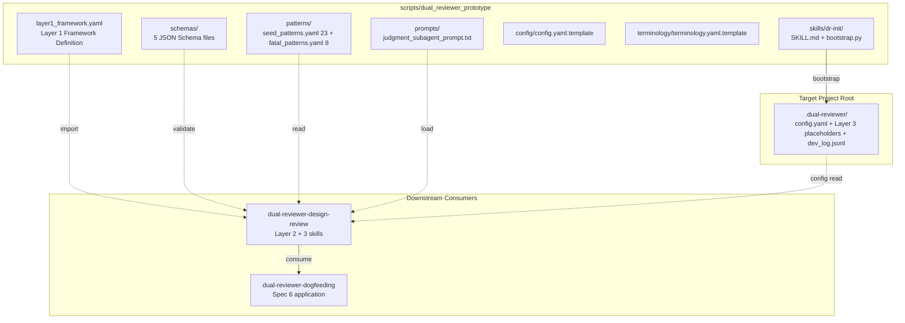
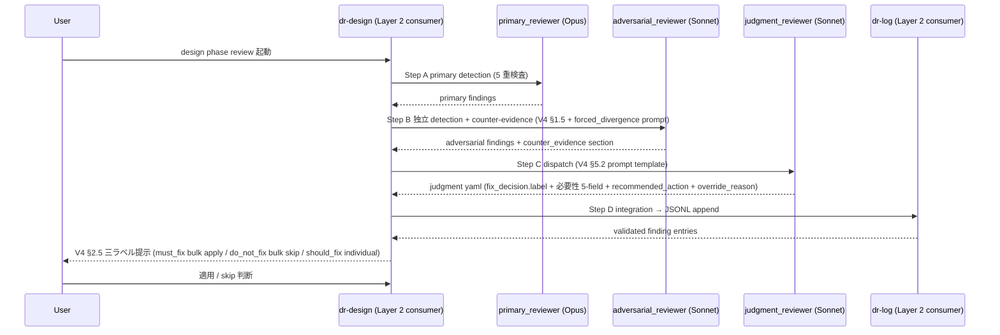
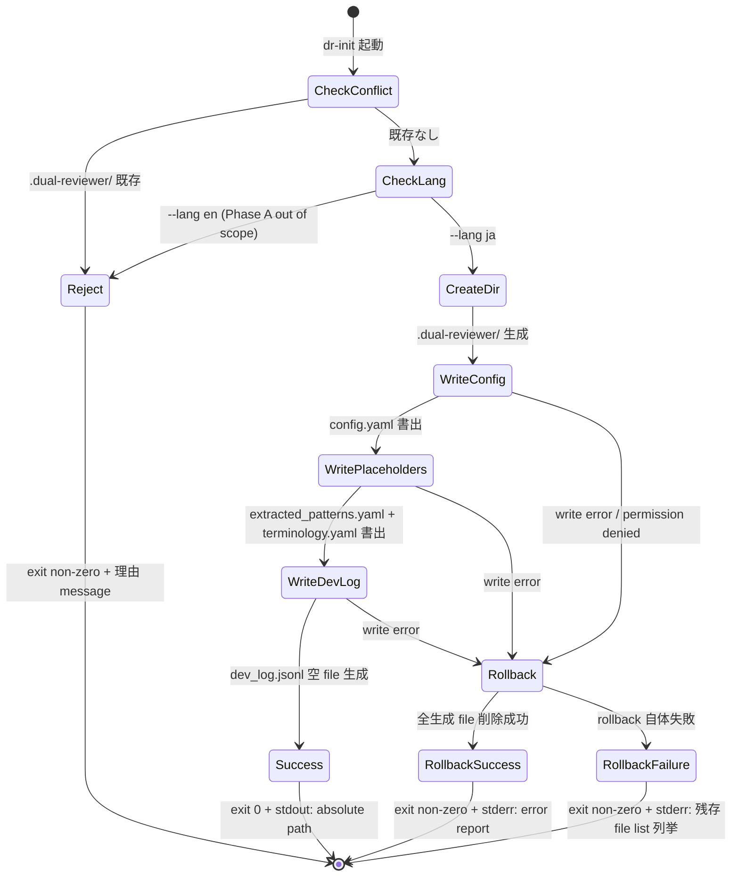
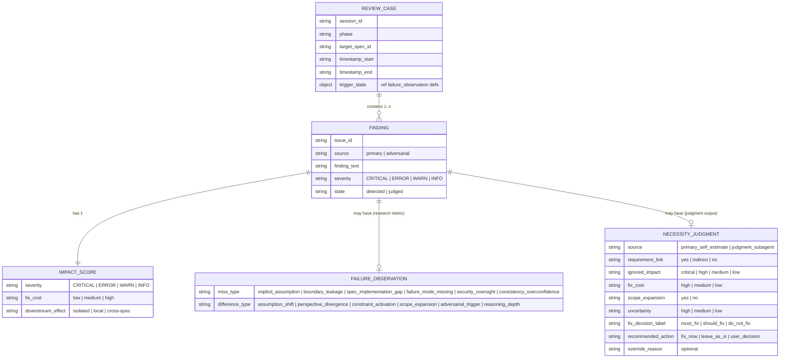
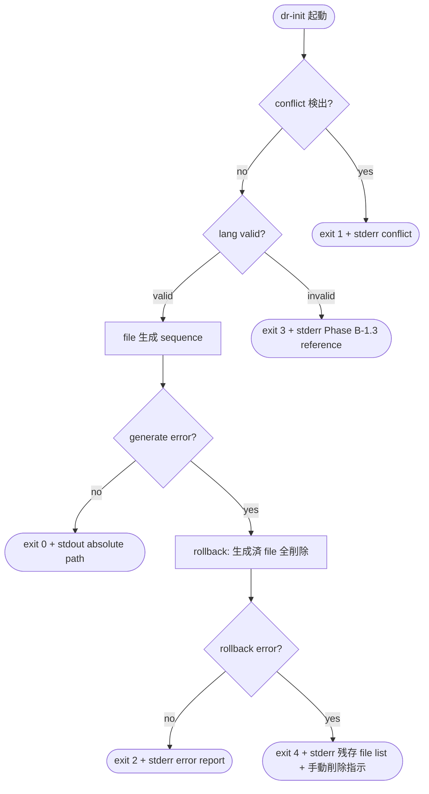

# Design Document

## Overview

`dual-reviewer-foundation` は dual-reviewer (LLM 設計レビュー方法論 v3 一般化 package) の **core 基盤 layer** を提供する設計である。本設計の成果物は (a) Layer 1 framework 定義 + (b) `dr-init` skill (project bootstrap) + (c) 共通 JSON schema 2 軸並列 + (d) `seed_patterns.yaml` (23 事例 retrofit) + (e) `fatal_patterns.yaml` (致命級 8 種固定) + (f) V4 §5.2 judgment subagent prompt template + (g) 用語抽象化 + 多言語 policy の 7 portable artifact を `scripts/dual_reviewer_prototype/` 配下に配置する。

**Purpose**: 後続 spec (`dual-reviewer-design-review` / `dual-reviewer-dogfeeding`) が単独で機能するための portable 基盤を提供する。本 spec 成果物が揃って初めて Layer 2 design extension + 3 review skill (`dr-design` / `dr-log` / `dr-judgment`) + Spec 6 dogfeeding 適用が実行可能になる。

**Users**: (a) Layer 2 extension 実装者 (`dual-reviewer-design-review` spec author / 実装者) / (b) dogfeeding 適用者 (`dual-reviewer-dogfeeding` spec author / 実装者) / (c) dual-reviewer 新規利用者 (`dr-init` で project bootstrap する者).

**Impact**: Rwiki-dev リポジトリに `scripts/dual_reviewer_prototype/` directory を新規追加。既存 Rwiki spec (Spec 0-7) の AC + 既存 v1-archive/scripts/ には影響しない (機能的独立).

### Goals

- Layer 1 framework + dr-init skill + 共通 schema 2 軸並列 + 同梱 data (seed/fatal patterns) + V4 §5.2 prompt template + 多言語 policy を **単一 install location** (`scripts/dual_reviewer_prototype/`) に集約配置
- consumer 2 spec が foundation を「path 規約 + override 階層」のみに依存する形で import 可能とする
- V4 protocol v0.3 final と整合する 3 subagent 構成 (primary + adversarial + judgment) を Layer 1 framework definition に内蔵
- Phase A scope (Rwiki repo 内 prototype 段階) を厳守、Phase B 独立 fork (npm package 化) は本 spec scope 外

### Non-Goals

- review 実行 logic (Layer 2 design extension + `dr-design` / `dr-log` / `dr-judgment` skill) の実装 — `dual-reviewer-design-review` spec の責務
- Spec 6 への dogfeeding 適用 + 3 系統対照実験 — `dual-reviewer-dogfeeding` spec の責務
- B-1.x 拡張 schema (`decision_path` / `skipped_alternatives` / `bias_signal`) の追加
- multi-vendor / Claude family rotation / hypothesis generator role 3 体構成
- npm package 化 / GitHub repo 公開 / collective learning network
- forced_divergence prompt template の最終文言確定 (`dual-reviewer-design-review` spec design phase 責務、本 spec は V4 §5.2 prompt template の portable artifact 配置のみ責務)
- `seed_patterns.yaml` の固有名詞除去 / generalization (Phase B-1.0 release prep)
- `--lang en` 対応 (Phase B-1.3)

## Boundary Commitments

### This Spec Owns

- Layer 1 framework definition (Step A/B/C/D + bias 抑制 quota fundamental events + pattern schema + 介入 framework + V4 §1 機能 5 件 + Chappy P0 機能 3 件 + Layer 2/3 attach contract 3 要素 + override 階層 Layer 3 > Layer 2 > Layer 1)
- `dr-init` skill (Claude Code skill format、`.dual-reviewer/` directory bootstrap、`config.yaml` 生成、Layer 3 placeholder 配置、all-or-nothing rollback)
- 共通 JSON Schema 5 file (`review_case` + `finding` + `impact_score` + `failure_observation` + `necessity_judgment`、JSON Schema Draft 2020-12 標準準拠、2 軸並列 namespace)
- `seed_patterns.yaml` (23 事例 retrofit、Rwiki dev-log 由来、`origin: rwiki-v2-dev-log`、固有名詞付きで OK)
- `fatal_patterns.yaml` (致命級 8 種固定 = sandbox_escape / data_loss / privilege_escalation / infinite_retry / deadlock / path_traversal / secret_leakage / destructive_migration、content immutable)
- V4 §5.2 judgment subagent prompt template (canonical 英語 prompt 全文、`prompts/judgment_subagent_prompt.txt` 配置)
- `config.yaml` template + `terminology.yaml` placeholder template (dr-init が copy する雛形)
- 用語抽象化 + 多言語 policy (role 用語 = `primary_reviewer` / `adversarial_reviewer` / `judgment_reviewer` 抽象名 / section 見出し bilingual / schema field 英語固定 / prompt 言語英語固定)

### Out of Boundary

- Layer 2 design extension (`dual-reviewer-design-review` spec)
- `dr-design` / `dr-log` / `dr-judgment` skill 実装 (`dual-reviewer-design-review` spec、本 spec は V4 §5.2 prompt template の data 提供のみ)
- judgment subagent dispatch logic (`dual-reviewer-design-review` spec)
- B-1.x skills (`dr-tasks` / `dr-requirements` / `dr-impl` / `dr-extract` / `dr-validate` / `dr-update` / `dr-translate`)
- Run-Log-Analyze-Update cycle automation
- 並列処理 + 整合性 Round 6 task
- multi-vendor / multi-subagent / hypothesis generator (Phase B-2 以降)
- B-1.x 拡張 schema (`decision_path` / `skipped_alternatives` / `bias_signal`)
- Phase B 独立 fork (Rwiki repo 内 prototype 段階のみ)
- forced_divergence prompt template の最終文言確定 (`dual-reviewer-design-review` spec design phase)
- pattern matching 実行 logic (Layer 2 design extension 責務、本 spec は data 提供のみ)
- `seed_patterns.yaml` 固有名詞除去 (Phase B-1.0 release prep)
- npm package 化 (Phase B-1.0)

### Allowed Dependencies

- **Upstream**: なし (foundation = base layer、依存なし)
- **言語 / Runtime**:
  - Python 3.10+ (dr-init bootstrap script)
  - yaml 1.2 (config / patterns / terminology / framework definition)
  - JSON Schema Draft 2020-12 (schemas)
- **Claude Code 機能**:
  - skill invocation system (SKILL.md format) — `dr-init` skill 実装基盤
  - Agent tool — Layer 2 spec が judgment subagent dispatch に使用 (本 spec はその prompt template の data 提供のみ)
- **既存 Rwiki repo 構造**:
  - `scripts/` directory (foundation install location 配置先、v1-archive/scripts/ と平行)
- **方針 / Reference (改変禁止 SSoT)**:
  - `.kiro/methodology/v4-validation/v4-protocol.md` §5.2 (judgment subagent prompt canonical SSoT、本 spec の Req 6 portable artifact は v4-protocol.md §5.2 と byte-level 整合)
  - V4 protocol v0.3 final (3 subagent 構成 / 必要性 5-field / 5 条件判定 / 3 ラベル分類 / semi-mechanical mapping default 7 種)
  - Chappy P0 採用 3 件 (fatal_patterns / impact_score 3 軸 / forced_divergence prompt)
  - Severity 4 水準 (CRITICAL / ERROR / WARN / INFO、`.kiro/steering/tech.md` 整合)

### Revalidation Triggers

以下の変更は `dual-reviewer-design-review` / `dual-reviewer-dogfeeding` spec に対する revalidation を要求する:

- foundation install location (`scripts/dual_reviewer_prototype/`) の path 変更 → 全 consumer skill の relative path locate 規約に影響
- 共通 JSON schema 2 軸並列 の field / enum 値変更 → consumer skill の schema validate logic に影響
- `fatal_patterns.yaml` 8 種 enum 識別子変更 (Req 5 AC3 で禁止しているが、Phase A 内の design 改訂 timing で発生した場合は revalidation trigger)
- V4 §5.2 prompt template content 変更 (V4 protocol §5.2 改訂と同期する形でのみ許容、Req 6 AC8) → consumer `dr-judgment` skill の prompt 動作確認再要求
- Layer 1 framework definition の Step A/B/C/D 構造変更 → consumer の Step 体系に影響
- override 階層 (Layer 3 > Layer 2 > Layer 1) の semantics 変更 → consumer の attach 動作に影響
- `dr-init` skill の `config.yaml` 5 field 構造変更 → consumer skill の config 読込 logic に影響
- attach contract 3 要素 (location 規約 + identifier 形式 + 失敗 signal) の変更 → Layer 2/3 extension の attach 動作に影響

## Architecture

### Architecture Pattern & Boundary Map

本 spec は **Library + Data + Skill** の Hybrid pattern を採用する:

- **Library 部分**: Layer 1 framework definition (yaml definition、consumer が import) + 共通 JSON schema 5 file (consumer が validate に使用)
- **Data 部分**: `seed_patterns.yaml` 23 件 + `fatal_patterns.yaml` 8 種 + V4 §5.2 prompt template (静的 data、consumer が読込)
- **Skill 部分**: `dr-init` skill (project bootstrap、Claude Code skill 経由起動)



**Architecture Integration**:

- 採用 pattern = Library + Data + Skill Hybrid (single install location 配置で consumer が relative path で locate)
- Domain 境界 = (1) Layer 1 framework definition / (2) JSON Schema definitions / (3) static data (patterns + prompt) / (4) bootstrap skill / (5) terminology + 多言語 policy
- 既存 patterns 保持 = `scripts/` 配下に v1-archive/scripts/ と平行配置 (Rwiki 既存規約整合)
- 新規 component 根拠 = (a) Layer 1 framework は phase 横断 portable framework のため definition file が必要 / (b) JSON Schema は consumer の機械検証用 / (c) static data は initial knowledge transfer 用 / (d) dr-init は project bootstrap UX 提供
- Steering compliance = `.kiro/steering/tech.md` Severity 4 水準 + Python 3.10+ + 2 スペースインデント + Test-Driven Development 整合

### Technology Stack

| Layer | Choice / Version | Role in Feature | Notes |
|-------|------------------|-----------------|-------|
| Framework Definition | yaml 1.2 | Layer 1 framework portable definition | consumer が yaml parse で読込 |
| Schema Validation | JSON Schema Draft 2020-12 | 共通 schema 機械検証 | consumer skill の `dr-log` で fail-fast validate に使用 |
| Static Data | yaml 1.2 | seed_patterns / fatal_patterns / config / terminology template | yaml parse で読込 |
| Prompt Template | plain text (英語固定) | V4 §5.2 judgment subagent prompt | byte-level に v4-protocol.md §5.2 と整合 |
| Bootstrap Script | Python 3.10+ | dr-init 実装、all-or-nothing rollback | 標準 ライブラリ (yaml + pathlib) のみ |
| Skill Format | Claude Code SKILL.md | Claude Code skill invocation 経由起動 | kiro-* skill と同方式 |
| Runtime Prerequisite | Python 3.10+ + yaml 1.2 parser | dr-init bootstrap 実行時 | target project が Python 環境を持つこと |

## File Structure Plan

### Directory Structure

```
scripts/dual_reviewer_prototype/             # foundation install location (= Req 各 AC の relative root)
├── README.md                                 # package overview + foundation 利用ガイド
├── framework/
│   └── layer1_framework.yaml                 # Req 1: Layer 1 framework definition (Step A/B/C/D + quota + pattern schema + V4 機能 + Chappy P0 + attach contract + override 階層)
├── schemas/                                  # Req 3 AC10: portable JSON Schema files
│   ├── review_case.schema.json               # Req 3 AC1: review_case schema
│   ├── finding.schema.json                   # Req 3 AC2: finding schema (source enum: primary | adversarial)
│   ├── impact_score.schema.json              # Req 3 AC3: 3 軸 (severity 4 値 / fix_cost 3 値 / downstream_effect 3 値)
│   ├── failure_observation.schema.json       # Req 3 AC4: 失敗構造観測軸 3 要素 (miss_type / difference_type / trigger_state)
│   └── necessity_judgment.schema.json        # Req 3 AC5: 修正必要性判定軸 (必要性 5-field + fix_decision + recommended_action + override_reason、source: primary_self_estimate | judgment_subagent)
├── patterns/                                 # Req 4 AC6 + Req 5 AC4: portable yaml data
│   ├── seed_patterns.yaml                    # Req 4: 23 件 retrofit (origin: rwiki-v2-dev-log)
│   └── fatal_patterns.yaml                   # Req 5: 致命級 8 種固定 enum (snake_case key + description)
├── prompts/                                  # Req 6 AC1: portable prompt template
│   └── judgment_subagent_prompt.txt          # Req 6: V4 §5.2 prompt 全文 (英語固定、v4-protocol.md §5.2 と byte-level 整合)
├── config/
│   └── config.yaml.template                  # Req 2 AC2: dr-init が copy する config 雛形 (5 field placeholder)
├── terminology/
│   └── terminology.yaml.template             # Req 7 AC5: dr-init が copy する terminology 雛形 (version + 空 entries)
└── skills/
    └── dr-init/                              # Req 2: Claude Code skill format
        ├── SKILL.md                          # skill definition + 起動引数 + behavior 規約
        └── bootstrap.py                      # Python 実装、all-or-nothing rollback
```

### Modified Files

- `.kiro/specs/dual-reviewer-foundation/spec.json` — design phase 完了時に `phase: design-generated` + `approvals.design.generated: true` に更新 (Step 6 で実施)

(本 spec implementation phase で `scripts/dual_reviewer_prototype/` を新規生成、Modified Files は spec.json のみ)

## System Flows

### Flow 1: Step A/B/C/D Pipeline (Layer 1 Framework が定義する core review pipeline)

Layer 1 framework が定義する pipeline 構造を consumer (Layer 2 design extension) が orchestrate する想定:



**Key Decisions** (本 spec 範囲):
- Step A/B/C/D の structure 定義は Layer 1 framework の責務 (本 spec)
- Step 実行 logic + subagent dispatch は consumer (`dual-reviewer-design-review` spec) の責務
- Step C で使用する V4 §5.2 prompt template は本 spec が portable artifact として配置

### Flow 2: dr-init Bootstrap (all-or-nothing rollback)



**Key Decisions** (Req 2):
- conflict 検出時は partial write を一切発生させない (Req 2 AC3)
- rollback failure 時 stderr に残存 file list を enumerate (Req 2 AC6 silent fail 禁止)
- success 時 stdout に絶対 path 1 行報告 (Req 2 AC1)

## Requirements Traceability

| Requirement | Summary | Components | Interfaces / Files | Flows |
|-------------|---------|------------|--------------------|-------|
| 1.1 | Step A/B/C/D 常時 expose、V4 §1.2 option C 整合 | Layer 1 Framework Definition | `framework/layer1_framework.yaml` | Flow 1 |
| 1.2 | bias 抑制 quota 3 fundamental events | Layer 1 Framework Definition | `framework/layer1_framework.yaml` | — |
| 1.3 | pattern schema (primary_group + secondary_groups + 中程度 granularity) | Layer 1 Framework Definition | `framework/layer1_framework.yaml` | — |
| 1.4 | Tier post-run measurement only (Goodhart 回避) | Layer 1 Framework Definition | `framework/layer1_framework.yaml` | — |
| 1.5 | Layer 2 attach contract 3 要素 (location 規約 + identifier 形式 + 失敗 signal) | Layer 1 Framework Definition | `framework/layer1_framework.yaml` (`attach_contract` section) | — |
| 1.6 | Layer 3 attach contract (AC 5 同形 interface) | Layer 1 Framework Definition | `framework/layer1_framework.yaml` (`attach_contract` section、Layer 2/3 共通) | — |
| 1.7 | Chappy P0 3 件 first-class facility expose | Layer 1 Framework Definition | `framework/layer1_framework.yaml` (`chappy_p0` section) | — |
| 1.8 | V4 §1 機能 5 件 first-class facility + Step B/C 役割分離明示 | Layer 1 Framework Definition | `framework/layer1_framework.yaml` (`v4_features` section) | Flow 1 |
| 1.9 | override 階層 Layer 3 > Layer 2 > Layer 1 単方向順位 | Layer 1 Framework Definition | `framework/layer1_framework.yaml` (`override_hierarchy` section) | — |
| 2.1 | dr-init 起動 → `.dual-reviewer/` 生成 + absolute path stdout | dr-init Skill | `skills/dr-init/{SKILL.md, bootstrap.py}` | Flow 2 |
| 2.2 | config.yaml 5 field (primary_model / adversarial_model / judgment_model / lang / dev_log_path) | dr-init Skill + config.yaml.template | `config/config.yaml.template` + `skills/dr-init/bootstrap.py` | Flow 2 |
| 2.3 | conflict 時 partial write 禁止 | dr-init Skill | `skills/dr-init/bootstrap.py` | Flow 2 |
| 2.4 | --lang ja default | dr-init Skill | `skills/dr-init/bootstrap.py` | Flow 2 |
| 2.5 | --lang en (or ja 以外) reject + Phase B-1.3 reference | dr-init Skill | `skills/dr-init/bootstrap.py` | Flow 2 |
| 2.6 | all-or-nothing rollback + rollback failure 時 残存 list enumerate | dr-init Skill | `skills/dr-init/bootstrap.py` | Flow 2 |
| 2.7 | `.dual-reviewer/` 配下以外を改変しない | dr-init Skill | `skills/dr-init/bootstrap.py` | Flow 2 |
| 3.1 | review_case schema (session id / phase / target spec id / timestamps) | review_case Schema | `schemas/review_case.schema.json` | — |
| 3.2 | finding schema (issue id / source = primary \| adversarial / finding text / severity) | finding Schema | `schemas/finding.schema.json` | — |
| 3.3 | impact_score 3 軸 (severity 4 値 / fix_cost 3 値 / downstream_effect 3 値) | impact_score Schema | `schemas/impact_score.schema.json` | — |
| 3.4 | 失敗構造観測軸 3 要素 (miss_type 6 / difference_type 6 / trigger_state 3 string enum) | failure_observation Schema | `schemas/failure_observation.schema.json` | — |
| 3.5 | 修正必要性判定軸 (必要性 5-field + fix_decision.label + recommended_action + override_reason) | necessity_judgment Schema | `schemas/necessity_judgment.schema.json` | — |
| 3.6 | 2 軸 namespace 並列 + 片軸のみ存在 finding も validate 可能 | All schemas (composition rule) | `schemas/{review_case, finding}.schema.json` | — |
| 3.7 | fix_decision.label = judged state required、detected state optional | finding Schema (state field + variant) | `schemas/finding.schema.json` | — |
| 3.8 | JSON Schema Draft 2020-12 標準準拠 + fail-fast validate 可能 | All schemas | `schemas/*.json` | — |
| 3.9 | B-1.0 minimum required mark + B-1.x optional 区別 | All schemas | `schemas/*.json` | — |
| 3.10 | schemas/ 相対 directory 配置 | All schemas | `schemas/` directory | — |
| 4.1 | 23 件 retrofit (memory feedback_review_judgment_patterns.md 由来) | seed_patterns Data | `patterns/seed_patterns.yaml` | — |
| 4.2 | 各 entry に origin: rwiki-v2-dev-log | seed_patterns Data | `patterns/seed_patterns.yaml` | — |
| 4.3 | pattern schema 準拠 (primary_group + secondary_groups) | seed_patterns Data | `patterns/seed_patterns.yaml` | — |
| 4.4 | 固有名詞保持 (Phase A scope) | seed_patterns Data | `patterns/seed_patterns.yaml` | — |
| 4.5 | top-level version field + 更新時 increment 必須 | seed_patterns Data | `patterns/seed_patterns.yaml` | — |
| 4.6 | patterns/seed_patterns.yaml 相対 path co-distribute | seed_patterns Data | `patterns/seed_patterns.yaml` | — |
| 5.1 | 8 種固定 enum (snake_case key) | fatal_patterns Data | `patterns/fatal_patterns.yaml` | — |
| 5.2 | description 含む (project 言語、reviewer 認識粒度) | fatal_patterns Data | `patterns/fatal_patterns.yaml` | — |
| 5.3 | content 全 immutable (key + description 改変禁止)、多言語追加は別 yaml | fatal_patterns Data | `patterns/fatal_patterns.yaml` | — |
| 5.4 | patterns/fatal_patterns.yaml 相対 path co-distribute | fatal_patterns Data | `patterns/fatal_patterns.yaml` | — |
| 5.5 | data 提供のみ責務、matching logic は Layer 2 spec | fatal_patterns Data | `patterns/fatal_patterns.yaml` | — |
| 6.1 | prompts/judgment_subagent_prompt.txt 配置 | V4 §5.2 Prompt Template | `prompts/judgment_subagent_prompt.txt` | — |
| 6.2 | v4-protocol.md §5.2 と byte-level 整合 (1-hop sync 限定) | V4 §5.2 Prompt Template | `prompts/judgment_subagent_prompt.txt` | — |
| 6.3 | 必要性 5-field 評価指示含む | V4 §5.2 Prompt Template | `prompts/judgment_subagent_prompt.txt` | — |
| 6.4 | semi-mechanical mapping default 7 種埋込 | V4 §5.2 Prompt Template | `prompts/judgment_subagent_prompt.txt` | — |
| 6.5 | 5 条件判定ルール 順次評価指示 | V4 §5.2 Prompt Template | `prompts/judgment_subagent_prompt.txt` | — |
| 6.6 | 出力 yaml format 規約含む | V4 §5.2 Prompt Template | `prompts/judgment_subagent_prompt.txt` | — |
| 6.7 | 英語固定 prompt | V4 §5.2 Prompt Template | `prompts/judgment_subagent_prompt.txt` | — |
| 6.8 | V4 protocol 改訂と sync、本 spec 単独改変禁止 | V4 §5.2 Prompt Template (sync mechanism) | `prompts/judgment_subagent_prompt.txt` (header に version 参照) | — |
| 6.9 | 単一 relative path 規約 (`./prompts/judgment_subagent_prompt.txt`) | V4 §5.2 Prompt Template | `prompts/judgment_subagent_prompt.txt` | — |
| 6.10 | sync mechanism 確定 (本 design phase) | V4 §5.2 Prompt Template (sync mechanism) | `prompts/judgment_subagent_prompt.txt` (header に v4-protocol.md §5.2 version 参照) | — |
| 7.1 | role 抽象名 3 種 (primary_reviewer / adversarial_reviewer / judgment_reviewer)、具体 model 名は config defer | Layer 1 Framework + config.yaml | `framework/layer1_framework.yaml` + `config/config.yaml.template` | — |
| 7.2 | section 見出し bilingual (project 言語 + 英語ラベル) | All artifacts (heading rule) | 全 generated artifact | — |
| 7.3 | schema field 英語固定、自由記述 content は project 言語 | All schemas | `schemas/*.json` | — |
| 7.4 | prompt 言語英語固定 (V4 §5.2 範囲、forced_divergence は design-review spec) | V4 §5.2 Prompt Template | `prompts/judgment_subagent_prompt.txt` | — |
| 7.5 | terminology.yaml placeholder (version + 空 entries) | terminology.yaml.template | `terminology/terminology.yaml.template` | — |

## Components and Interfaces

### Domain: Foundation Install Location (`scripts/dual_reviewer_prototype/`)

| Component | Domain/Layer | Intent | Req Coverage | Key Dependencies (P0/P1) | Contracts |
|-----------|--------------|--------|--------------|--------------------------|-----------|
| Layer 1 Framework Definition | Framework | Layer 1 review framework (Step A/B/C/D + quota + pattern schema + V4/Chappy 機能 + attach contract + override 階層) を yaml definition で provide | 1.1, 1.2, 1.3, 1.4, 1.5, 1.6, 1.7, 1.8, 1.9, 7.1 | yaml 1.2 (P0) | State (definition file) |
| dr-init Skill | Bootstrap | target project bootstrap、`.dual-reviewer/` 生成 + config.yaml + Layer 3 placeholder + dev_log.jsonl + all-or-nothing rollback | 2.1, 2.2, 2.3, 2.4, 2.5, 2.6, 2.7 | Python 3.10+ (P0) / Claude Code skill (P0) | Service (CLI) |
| review_case Schema | Schema | review session 境界 (session id / phase / target spec id / timestamps) | 3.1, 3.6, 3.8, 3.10 | JSON Schema Draft 2020-12 (P0) | State (schema definition) |
| finding Schema | Schema | 1 検出 (issue id / source / finding text / severity / state field for variant) | 3.2, 3.6, 3.7, 3.8, 3.9, 3.10 | JSON Schema Draft 2020-12 (P0) | State (schema definition) |
| impact_score Schema | Schema | 3 軸 (severity 4 値 / fix_cost 3 値 / downstream_effect 3 値) | 3.3, 3.8, 3.10 | JSON Schema Draft 2020-12 (P0) | State (schema definition) |
| failure_observation Schema | Schema | 失敗構造観測軸 3 要素 (miss_type 6 / difference_type 6 / trigger_state 3 string enum) | 3.4, 3.6, 3.8, 3.9, 3.10 | JSON Schema Draft 2020-12 (P0) | State (schema definition) |
| necessity_judgment Schema | Schema | 修正必要性判定軸 (必要性 5-field + fix_decision.label + recommended_action + override_reason) | 3.5, 3.6, 3.7, 3.8, 3.9, 3.10 | JSON Schema Draft 2020-12 (P0) | State (schema definition) |
| seed_patterns Data | Static Data | 23 件 retrofit (Rwiki dev-log 由来 immutable initial knowledge) | 4.1, 4.2, 4.3, 4.4, 4.5, 4.6 | yaml 1.2 (P0) | State (yaml data) |
| fatal_patterns Data | Static Data | 致命級 8 種固定 enum + description (content immutable) | 5.1, 5.2, 5.3, 5.4, 5.5 | yaml 1.2 (P0) | State (yaml data) |
| V4 §5.2 Prompt Template | Static Data | judgment subagent dispatch prompt (canonical 英語、v4-protocol.md §5.2 と sync) | 6.1, 6.2, 6.3, 6.4, 6.5, 6.6, 6.7, 6.8, 6.9, 6.10 | v4-protocol.md §5.2 (P0、SSoT) | State (prompt text) |
| config.yaml.template | Template | dr-init が copy する config 雛形 (5 field placeholder) | 2.2 | yaml 1.2 (P0) | State (template file) |
| terminology.yaml.template | Template | dr-init が copy する terminology 雛形 (version + 空 entries) | 7.5 | yaml 1.2 (P0) | State (template file) |

詳細 block は new-boundary-introducing components のみ記述する。Static data / template は summary 行 + Implementation Note で扱い (data definitions は Data Models 章で詳細化).

### Layer 1 Framework Definition

| Field | Detail |
|-------|--------|
| Intent | Phase 横断 review framework を yaml portable definition で expose、consumer (Layer 2) が attach contract 経由で extension |
| Requirements | 1.1, 1.2, 1.3, 1.4, 1.5, 1.6, 1.7, 1.8, 1.9, 7.1 |

**Responsibilities & Constraints**

- Step A/B/C/D 構造を core review pipeline として常時 expose (Req 1.1)
- 3 fundamental events (`formal_challenge` / `detection_miss` / `phase1_pattern_match`) を bias 抑制 quota mechanism として provide (Req 1.2)
- pattern schema = `primary_group` + `secondary_groups` 二層 grouping + 中程度 granularity (Req 1.3)
- Tier 比率 = pre-run target 一切設定せず post-run measurement only (Goodhart's Law 回避、Req 1.4)
- Layer 2 attach contract 3 要素 = (a) attach 対象 entry-point file location 規約 / (b) entry-point identifier 形式 / (c) attach 失敗時 signal 規定 (Req 1.5)
- Layer 3 attach contract = AC 5 と同一 interface 形式 (Req 1.6)
- override 階層 = Layer 3 > Layer 2 > Layer 1 固定単方向順位 (Req 1.9)
- Chappy P0 機能 3 件を first-class facility expose (`fatal_patterns.yaml` 強制照合 / `forced_divergence` prompt 1 行 / `impact_score` 3 軸、Req 1.7)
- V4 §1 機能 5 件を first-class facility expose (judgment subagent dispatch + 必要性 5-field + 5 条件判定 + 3 ラベル分類 + 修正否定試行 prompt の役割分離、Req 1.8)
- Step B (`forced_divergence` = `adversarial_reviewer` 担当、結論成立性試行) と Step C (修正否定試行 = `judgment_reviewer` prompt 末尾組込、修正 proposal 必要性否定) の **役割分離を framework definition で明示** (Req 1.8)
- role 抽象名 3 種のみ参照、具体 model 名は使用禁止 (Req 7.1)
- 自身は immutable framework definition、Layer 2/3 attach は base file を改変せず行われる

**Dependencies**

- Inbound: `dual-reviewer-design-review` Layer 2 design extension (P0、attach contract 経由) / `dual-reviewer-dogfeeding` (P1、Layer 1 framework 認知のみ、attach は design-review 経由)
- Outbound: なし (foundation = base layer)
- External: yaml 1.2 parser (consumer 側、本 spec は yaml file 提供のみ、P0)

**Contracts**: State [✓]

##### State Definition

`framework/layer1_framework.yaml` は以下 top-level section を含む:

```yaml
version: "1.0"  # framework version (initial commit 1.0)
metadata:
  name: dual-reviewer-foundation Layer 1 Framework
  description: Phase 横断 review framework, V4 protocol v0.3 final 整合
  v4_protocol_version: "0.3"  # 参照点 (sync 識別用)

step_pipeline:                   # Req 1.1
  step_a:
    name: primary_detection
    role: primary_reviewer
    sub_steps: [step_1a, step_1b, step_1b_v]
  step_b:
    name: adversarial_review
    role: adversarial_reviewer
    sub_steps: [independent_detection, forced_divergence, fix_negation_counter_evidence]
  step_c:
    name: judgment
    role: judgment_reviewer
    sub_steps: [necessity_evaluation, semi_mechanical_mapping, five_condition_rule, label_decision]
  step_d:
    name: integration
    role: primary_reviewer  # primary が Step D を主導
    sub_steps: [merge, three_label_presentation, user_oversight]

bias_suppression_quota:          # Req 1.2
  fundamental_events:
    - formal_challenge
    - detection_miss
    - phase1_pattern_match
  measurement_policy: post_run_only  # Req 1.4: Tier pre-run target 禁止

pattern_schema:                  # Req 1.3
  structure: two_layer_grouping
  layers:
    primary_group: required      # 第 1 階層 (粗 group、5-10 種程度)
    secondary_groups: required   # 第 2 階層 (中程度 granularity)

attach_contract:                 # Req 1.5 + 1.6 + 1.9 (Layer 2/3 共通)
  placeholder_resolution: "Layer 2 / Layer 3 consumer が yaml file generation 時または runtime injection で {layer2_install_root} / {target_project_root} を自身の install root absolute path に文字列置換する (Python str.format / shell envsubst / yaml anchor のいずれかで実装、consumer 側選択)"
  layer_2:
    entry_point_location: "{layer2_install_root}/extensions/<phase>_extension.yaml"
    identifier_format: "<phase>_extension"  # 例: design_extension
    failure_signal: stderr + non_zero_exit
  layer_3:
    entry_point_location: "{target_project_root}/.dual-reviewer/extracted_patterns.yaml"
    identifier_format: "<project_specific_id>"
    failure_signal: stderr + non_zero_exit
  override_hierarchy:
    order: [layer_3, layer_2, layer_1]  # Req 1.9: Layer 3 が最強、Layer 1 default
    semantics: "single_direction_unidirectional"

chappy_p0:                       # Req 1.7
  fatal_patterns_match:
    data_source: ./patterns/fatal_patterns.yaml
    matching_responsibility: layer_2  # data 提供 vs execute 役割分離
  impact_score:
    schema: ./schemas/impact_score.schema.json
    axes: [severity, fix_cost, downstream_effect]
  forced_divergence_prompt:
    canonical_form: english
    placement: adversarial_subagent_prompt_tail
    final_text_definition_responsibility: dual-reviewer-design-review  # Req 7.4 整合

v4_features:                     # Req 1.8
  judgment_subagent_dispatch:
    role: judgment_reviewer
    prompt_source: ./prompts/judgment_subagent_prompt.txt
  necessity_5_fields:
    schema: ./schemas/necessity_judgment.schema.json
    fields: [requirement_link, ignored_impact, fix_cost, scope_expansion, uncertainty]
  five_condition_rule:
    rules:
      - critical_impact_to_must_fix
      - requirement_link_yes_high_impact_to_must_fix
      - scope_expansion_yes_not_critical_to_do_not_fix_or_escalate
      - fix_cost_greater_than_impact_to_do_not_fix_lean
      - uncertainty_high_to_escalate
    evaluation_order: sequential_strongest_wins
  three_label_classification:
    labels: [must_fix, should_fix, do_not_fix]
  role_separation:
    step_b_forced_divergence:
      assigned_to: adversarial_reviewer
      intent: conclusion_validity_test
      description: "暗黙前提を別前提に置換した場合に同じ結論が成立するか試行"
    step_c_fix_negation:
      assigned_to: judgment_reviewer
      intent: fix_proposal_necessity_negation
      description: "primary 提案 fix の必要性を否定する counter-evidence で必要性 5-field 評価"

terminology:                     # Req 7.1
  role_abstractions:
    - primary_reviewer
    - adversarial_reviewer
    - judgment_reviewer
  concrete_model_resolution: config_yaml_field  # config.yaml の 3 model field で resolve
```

**Implementation Notes**

- Integration: yaml file は consumer (Layer 2 design extension) が yaml 1.2 parser で読込、各 section を attach contract 経由で extension
- Validation: yaml schema validate は本 spec scope 外 (consumer 側で必要に応じて実施)
- Risks: yaml file の内容変更が consumer の Step pipeline 動作に直接影響するため、Revalidation Triggers 章記載の通り変更時は consumer revalidation を要求

### dr-init Skill

| Field | Detail |
|-------|--------|
| Intent | target project root に `.dual-reviewer/` directory を bootstrap、Layer 3 artifact placeholder + config + dev_log JSONL を all-or-nothing 配置 |
| Requirements | 2.1, 2.2, 2.3, 2.4, 2.5, 2.6, 2.7 |

**Responsibilities & Constraints**

- target project root で起動、`.dual-reviewer/` directory + 内部 file 群を生成 (Req 2.1)
- 生成 file = config.yaml + extracted_patterns.yaml (Layer 3 placeholder) + terminology.yaml (Layer 3 placeholder) + dev_log.jsonl (空 file、append target)
- config.yaml には 5 field を populate: `primary_model` / `adversarial_model` / `judgment_model` / `lang` / `dev_log_path` (Req 2.2)
- 3 model field の default 値 = placeholder 文字列 (`<primary-model>` / `<adversarial-model>` / `<judgment-model>`)、concrete model identifier は本 spec design phase 後の使用者手動設定で確定
- `lang` default = `ja` (Req 2.4)
- `dev_log_path` default = `.dual-reviewer/dev_log.jsonl` (= AC1 で配置される Layer 3 placeholder と整合、Req 2.2)
- `--lang en` (or ja 以外) は Phase A scope 外として reject、Phase B-1.3 reference message を user に提示 (Req 2.5)
- conflict (existing `.dual-reviewer/`) 時は一切上書きせず、partial write 発生させない (Req 2.3)
- bootstrap 失敗時 (filesystem error / permission denied / partial write 検出) は all-or-nothing rollback (生成済 file を全削除して pre-bootstrap state 復元、Req 2.6)
- rollback 自体が失敗した場合 (rollback 中の permission denied 等) は non-zero exit + stderr に削除失敗 file list を enumeration、user に手動削除指示 (Req 2.6 silent fail 禁止)
- target project の `.dual-reviewer/` 配下以外の任意 file (`CLAUDE.md` / `.kiro/` / source code 等) を改変しない (Req 2.7)
- success 時 stdout に生成された `.dual-reviewer/` directory の absolute path を 1 行で報告 + exit 0 (Req 2.1)

**Dependencies**

- Inbound: dual-reviewer 新規利用者 (P0、CLI 起動)
- Outbound: target project filesystem (`.dual-reviewer/` 配下のみ、P0)
- External: Python 3.10+ runtime (P0、bootstrap.py 実行) / yaml 1.2 parser (Python `yaml` ライブラリ、P0、config 書出時に使用) / Claude Code skill invocation system (P0、SKILL.md 経由 invoke)

**Contracts**: Service [✓] / State [✓]

##### Service Interface (CLI 起動規約)

```python
# bootstrap.py の signature (TypeScript 風で表現するが実装は Python)
interface DrInitService {
  invoke(target_project_root: Path, lang: Literal["ja"] = "ja"): Result<AbsolutePath, ErrorEnvelope>
}

# Result 型
type Result<T, E> = Success<T> | Failure<E>
type AbsolutePath = string  # ".dual-reviewer/" の絶対 path
type ErrorEnvelope = {
  exit_code: int  # non-zero (1 for conflict / 2 for filesystem error / 3 for unsupported lang / 4 for rollback failure)
  stderr_message: string  # human-readable error
  residual_files: string[]  # rollback failure 時のみ非空 (削除失敗 file の絶対 path list)
}
```

- **Preconditions**: target project root が existing directory、Python 3.10+ runtime 利用可能、target に書込権限あり
- **Postconditions**:
  - success: `.dual-reviewer/` directory + 内部 4 file (config.yaml + extracted_patterns.yaml + terminology.yaml + dev_log.jsonl) 生成、stdout に absolute path 1 行
  - conflict: 一切 file 生成なし、stderr に conflict message
  - filesystem failure: 生成途中の partial state なし (all-or-nothing rollback 完了)、stderr に error report
  - rollback failure: non-zero exit + stderr に残存 file list + 手動削除指示
- **Invariants**: target project の `.dual-reviewer/` 配下以外を一切改変しない / config.yaml の 5 field は必ず populate される / lang default は必ず `ja`

##### State Management

- **State model**: target project filesystem state (`.dual-reviewer/` directory 配下の file 群)
- **Persistence**: yaml + jsonl file として disk 永続化
- **Concurrency strategy**: dr-init 起動は single-process / single-invocation 想定 (concurrent invocation の lock は本 spec scope 外、Phase B でのみ検討)

**Implementation Notes**

- Integration: Claude Code skill invocation 経由起動、target project root = current working directory (PWD) を default に取得、`--lang` option で言語指定
- Validation: bootstrap 実行前 = (a) target が directory か / (b) `.dual-reviewer/` 既存か / (c) `--lang` 値が `ja` か / (d) target に書込権限があるか の 4 chec を mechanical 実施、いずれか fail で early exit
- Risks: rollback 中の partial state (= rollback も partial 失敗) は OS 限界 (例: filesystem 不安定) で発生し得、Req 2.6 silent fail 禁止規律で残存 list 報告 + user 手動削除指示で対応 / Phase A scope では single-invocation 前提、concurrent invocation race は B-1.0 release prep で再検討

## Data Models

### Domain Model: 共通 JSON Schema 2 軸並列

本 spec は **失敗構造観測軸** と **修正必要性判定軸** を 2 軸並列で定義し、同一 finding に並列付与可能とする (Req 3.6)。両軸は intent 直交:

- 失敗構造観測軸 = 「primary が何を見落としたかの研究 metric」(Req 3.4)
- 修正必要性判定軸 = 「judgment subagent の決定根拠 (V4 §1.3 整合)」(Req 3.5)



**ER 図注記** (A1 解消): `REVIEW_CASE.trigger_state` は `failure_observation.schema.json` の `$defs/trigger_state` を `$ref` で参照する nested object であり、JSON Schema 上 review_case 内に flat field として展開されない (review_case schema definition 参照)。

#### Source Field Disambiguation (audit gap G1 解決)

本 design は `source` field の 2 階層 disambiguate を以下で確定:

- **`finding.source`**: 検出 source (= 誰が検出したか)、enum = `primary` | `adversarial`
- **`necessity_judgment.source`**: 判定 source (= 誰が修正必要性を判定したか)、enum = `primary_self_estimate` | `judgment_subagent`

両 field は別 schema (finding vs necessity_judgment) の nested location にあり、混在しない。consumer spec は適切な階層の source field を参照する。

### Logical Data Model

#### review_case Schema (Req 3.1)

```json
{
  "$schema": "https://json-schema.org/draft/2020-12/schema",
  "$id": "review_case.schema.json",
  "type": "object",
  "required": ["session_id", "phase", "target_spec_id", "timestamp_start", "findings"],
  "properties": {
    "session_id": {"type": "string", "description": "review session 一意識別子"},
    "phase": {"type": "string", "enum": ["requirements", "design", "tasks", "implementation"]},
    "target_spec_id": {"type": "string", "description": "review 対象 spec の identifier"},
    "timestamp_start": {"type": "string", "format": "date-time"},
    "timestamp_end": {"type": "string", "format": "date-time"},
    "trigger_state": {"$ref": "failure_observation.schema.json#/$defs/trigger_state"},
    "findings": {
      "type": "array",
      "items": {"$ref": "finding.schema.json"}
    }
  }
}
```

#### finding Schema (Req 3.2 + 3.7)

```json
{
  "$schema": "https://json-schema.org/draft/2020-12/schema",
  "$id": "finding.schema.json",
  "type": "object",
  "required": ["issue_id", "source", "finding_text", "severity", "state", "impact_score"],
  "properties": {
    "issue_id": {"type": "string"},
    "source": {"type": "string", "enum": ["primary", "adversarial"]},
    "finding_text": {"type": "string"},
    "severity": {"type": "string", "enum": ["CRITICAL", "ERROR", "WARN", "INFO"]},
    "state": {"type": "string", "enum": ["detected", "judged"]},
    "impact_score": {"$ref": "impact_score.schema.json"},
    "failure_observation": {"$ref": "failure_observation.schema.json"},
    "necessity_judgment": {"$ref": "necessity_judgment.schema.json"}
  },
  "allOf": [
    {
      "if": {"properties": {"state": {"const": "judged"}}},
      "then": {"required": ["necessity_judgment"]}
    }
  ]
}
```

`state = judged` 時は `necessity_judgment` 必須、`state = detected` 時は optional (Req 3.7)。

#### impact_score Schema (Req 3.3)

```json
{
  "$schema": "https://json-schema.org/draft/2020-12/schema",
  "$id": "impact_score.schema.json",
  "type": "object",
  "required": ["severity", "fix_cost", "downstream_effect"],
  "properties": {
    "severity": {"type": "string", "enum": ["CRITICAL", "ERROR", "WARN", "INFO"]},
    "fix_cost": {"type": "string", "enum": ["low", "medium", "high"]},
    "downstream_effect": {"type": "string", "enum": ["isolated", "local", "cross-spec"]}
  }
}
```

#### failure_observation Schema (Req 3.4)

```json
{
  "$schema": "https://json-schema.org/draft/2020-12/schema",
  "$id": "failure_observation.schema.json",
  "type": "object",
  "required": ["miss_type", "difference_type", "trigger_state"],
  "properties": {
    "miss_type": {"type": "string", "enum": ["implicit_assumption", "boundary_leakage", "spec_implementation_gap", "failure_mode_missing", "security_oversight", "consistency_overconfidence"]},
    "difference_type": {"type": "string", "enum": ["assumption_shift", "perspective_divergence", "constraint_activation", "scope_expansion", "adversarial_trigger", "reasoning_depth"]},
    "trigger_state": {"$ref": "#/$defs/trigger_state"}
  },
  "$defs": {
    "trigger_state": {
      "type": "object",
      "required": ["negative_check", "escalate_check", "alternative_considered"],
      "properties": {
        "negative_check": {"type": "string", "enum": ["applied", "skipped"]},
        "escalate_check": {"type": "string", "enum": ["applied", "skipped"]},
        "alternative_considered": {"type": "string", "enum": ["applied", "skipped"]}
      }
    }
  }
}
```

#### necessity_judgment Schema (Req 3.5)

```json
{
  "$schema": "https://json-schema.org/draft/2020-12/schema",
  "$id": "necessity_judgment.schema.json",
  "type": "object",
  "required": ["source", "requirement_link", "ignored_impact", "fix_cost", "scope_expansion", "uncertainty", "fix_decision", "recommended_action"],
  "properties": {
    "source": {"type": "string", "enum": ["primary_self_estimate", "judgment_subagent"]},
    "requirement_link": {"type": "string", "enum": ["yes", "indirect", "no"]},
    "ignored_impact": {"type": "string", "enum": ["critical", "high", "medium", "low"]},
    "fix_cost": {"type": "string", "enum": ["high", "medium", "low"]},
    "scope_expansion": {"type": "string", "enum": ["yes", "no"]},
    "uncertainty": {"type": "string", "enum": ["high", "medium", "low"]},
    "fix_decision": {
      "type": "object",
      "required": ["label"],
      "properties": {
        "label": {"type": "string", "enum": ["must_fix", "should_fix", "do_not_fix"]}
      }
    },
    "recommended_action": {"type": "string", "enum": ["fix_now", "leave_as_is", "user_decision"]},
    "override_reason": {"type": "string", "description": "semi-mechanical mapping default override 時の理由 (optional)"}
  }
}
```

#### B-1.0 Required Mark vs B-1.x Optional 区別 (Req 3.9)

各 schema の `required` array で B-1.0 minimum field を定義。B-1.x 拡張 field (`decision_path` / `skipped_alternatives` / `bias_signal`) は本 spec scope 外のため schema に含めない (将来 B-1.x で別 spec が schema 拡張する想定、Req 3.6 consumer 拡張 mechanism 範囲内)。

#### Consumer 拡張 mechanism (Req 3.6)

consumer spec (例: `dual-reviewer-dogfeeding`) が独自 field (例: 系統識別 `treatment` / `adversarial_counter_evidence`) を `review_case` または `finding` object に付与する場合、JSON Schema の `additionalProperties: true` (default) で許容。追加 field の schema 定義 + validate 責務は consumer spec 側、foundation schema は core 2 軸 + AC1-AC5 既定 field のみを normative basis として規定する (Req 3.6 整合)。

### Domain Model: seed_patterns.yaml (Req 4)

```yaml
version: "1.0.0"  # Req 4.5: top-level version field、更新時 increment 必須
patterns:
  - id: "rwiki-2026-01-001"  # 23 件 retrofit (memory feedback_review_judgment_patterns.md 由来)
    primary_group: <第 1 階層 group 名>  # Req 4.3: pattern schema 準拠
    secondary_groups: [<第 2 階層 group 1>, <第 2 階層 group 2>]
    description: "<Rwiki 固有名詞付き description、Req 4.4 準拠>"
    origin: "rwiki-v2-dev-log"  # Req 4.2: 全 entry 必須付与
    detected_in: "<dev-log session reference>"
  # ... 22 件続く (合計 23 件、Req 4.1)
```

23 件の primary_group / secondary_groups / description は memory `feedback_review_judgment_patterns.md` の検証済 23 patterns から retrofit (本 spec implementation phase で具体化、design phase では構造のみ確定)。

### Domain Model: fatal_patterns.yaml (Req 5)

```yaml
version: "1.0"
patterns:
  - key: sandbox_escape  # Req 5.1: 8 種固定 enum (snake_case)
    description: "サンドボックス内のプロセスが許可された境界を超えてホスト/外部資源にアクセスする"
  - key: data_loss
    description: "永続化されたユーザーデータが意図せず削除/上書き/破壊される"
  - key: privilege_escalation
    description: "通常権限のコードが権限境界を超えて高権限を取得する"
  - key: infinite_retry
    description: "失敗した操作が指数バックオフ/上限なしで再試行され続ける"
  - key: deadlock
    description: "複数 lock の循環待ちでシステムが進行不能になる"
  - key: path_traversal
    description: "外部入力に基づく path 解決で意図された directory 境界を超える"
  - key: secret_leakage
    description: "認証情報/API key/個人情報が log/error message/外部送信に含まれる"
  - key: destructive_migration
    description: "schema/data migration が rollback 不可能な形で既存データを破壊する"
```

content (key + description) は initial commit 後 immutable (Req 5.3)。多言語対応 (description 英語追加等) は Phase B-1.3 で別 yaml file (`fatal_patterns.en.yaml`) で対応、本 yaml に影響しない。

### Domain Model: V4 §5.2 Prompt Template (Req 6)

`prompts/judgment_subagent_prompt.txt` には V4 protocol §5.2 で確定した judgment subagent dispatch prompt 全文を配置 (英語固定、Req 6.7)。`v4-protocol.md` §5.2 と byte-level 整合 (Req 6.2、SSoT sync 1-hop 限定)。

#### Sync Mechanism (Req 6.10 確定)

本 design phase で sync mechanism を以下に確定:

```
# v4-protocol.md §5.2 sync header (judgment_subagent_prompt.txt 先頭 3 行)
# canonical-source: .kiro/methodology/v4-validation/v4-protocol.md §5.2
# v4-protocol-version: 0.3
# sync-policy: byte-level integrity, manual sync at v4-protocol revision

You are a judgment-only subagent for V4 review protocol.
... (本文、v4-protocol.md §5.2 と byte-level 整合)
```

- **sync mechanism**: header 3 行で v4-protocol.md §5.2 の version 参照を明示。本 spec implementation phase で `judgment_subagent_prompt.txt` を生成する際、本文部分を v4-protocol.md §5.2 から copy + header 追加。
- **drift detection**: V4 protocol 改訂時 (`v4-protocol-version` 値変更) に手動で `judgment_subagent_prompt.txt` 本文 sync を実施。automated build script 化は B-1.0 release prep で検討 (Phase A scope 外)。
- **改変禁止 enforcement**: 本 spec 単独の prompt 内容変更は禁止 (Req 6.8)、V4 protocol 改訂と必ず同期。違反検出は code review レベル (mechanical drift detection は Phase B 検討)。

### Domain Model: config.yaml.template (Req 2.2)

```yaml
# dr-init が生成する .dual-reviewer/config.yaml の雛形
# project bootstrap 後、user が <...> placeholder を具体 model identifier に置換する
primary_model: <primary-model>           # Req 2.2: placeholder 文字列
adversarial_model: <adversarial-model>   # Req 2.2: placeholder 文字列
judgment_model: <judgment-model>         # Req 2.2: placeholder 文字列
lang: ja                                 # Req 2.4: default ja
dev_log_path: .dual-reviewer/dev_log.jsonl  # Req 2.2: AC1 placeholder と整合
```

### Domain Model: terminology.yaml.template (Req 7.5)

```yaml
version: "1.0"  # Req 7.5: version field
entries: []     # Req 7.5: 空 entries list (Phase A-2 dogfeeding 以降に蓄積)
```

## Error Handling

### Error Strategy

本 spec の主要 error handling 対象は **dr-init skill** (Req 2)。他 component (yaml / JSON Schema / prompt template) は static data のため runtime error は生じない (consumer 側 yaml parse / JSON Schema validate error は consumer 責務)。

### Error Categories and Responses

#### dr-init Skill Errors (Req 2.3 + 2.5 + 2.6)

| Error Category | Trigger | Response | Exit Code |
|----------------|---------|----------|-----------|
| Conflict | `.dual-reviewer/` 既存 | partial write 一切禁止、stderr に conflict message + 既存 path 表示 | 1 |
| Unsupported Lang | `--lang` ≠ `ja` | reject、stderr に Phase B-1.3 reference message | 3 |
| Filesystem Error | write error / permission denied / partial write 検出 | all-or-nothing rollback (生成済 file 全削除)、stderr に error report | 2 |
| Rollback Failure | rollback 中の write error | non-zero exit + stderr に **残存 file list enumeration** + 手動削除指示 (silent fail 禁止) | 4 |

**Process Flow Visualization** (rollback semantics):



### Monitoring

本 spec scope では monitoring infrastructure は導入しない (single-invocation skill のため). consumer spec (`dual-reviewer-design-review` の `dr-log`) が JSONL log 蓄積 + `dual-reviewer-dogfeeding` が metric extraction を担当。

## Testing Strategy

### Unit Tests

各 component の単独動作確認:

1. **dr-init skill bootstrap (Req 2.1)**: clean target project root で起動 → `.dual-reviewer/` directory 生成 + 4 file (config.yaml + extracted_patterns.yaml + terminology.yaml + dev_log.jsonl) 配置 + stdout に absolute path 1 行確認
2. **dr-init conflict 検出 (Req 2.3)**: 既存 `.dual-reviewer/` を持つ project root で起動 → 一切上書きせず exit 1 + stderr message 確認
3. **dr-init rollback semantics (Req 2.6)**: filesystem error injection (test mock で permission denied) → 生成済 file 全削除 + exit 2 + stderr error report 確認、rollback failure injection → exit 4 + stderr 残存 file list 確認
4. **JSON Schema validation (Req 3.8)**: 各 schema (review_case / finding / impact_score / failure_observation / necessity_judgment) で valid sample + invalid sample (各 enum 値 / 必須 field 欠落 / 型違反) を JSON Schema validator で validate、期待通り pass / fail 確認
5. **finding state variant (Req 3.7)**: `state: detected` finding で `necessity_judgment` 省略 → validate pass、`state: judged` finding で `necessity_judgment` 省略 → validate fail 確認

### Integration Tests

3 spec 間の cross-spec 整合性確認:

1. **dr-init bootstrap → consumer config 読込**: dr-init 生成の `.dual-reviewer/config.yaml` を consumer 側 (本 spec scope では mock consumer) で yaml parse → 5 field 全 populate 確認
2. **schemas/ relative path locate**: foundation install location (`scripts/dual_reviewer_prototype/`) からの相対 path で 5 schema file を全 locate 可能、JSON Schema parser で全 file 読込成功確認
3. **patterns/ + prompts/ relative path locate**: 同 location で `seed_patterns.yaml` (23 件) + `fatal_patterns.yaml` (8 種) + `judgment_subagent_prompt.txt` を全 locate 可能、yaml + text parse 成功確認
4. **V4 §5.2 prompt sync (Req 6.2)**: `prompts/judgment_subagent_prompt.txt` 本文部分を `.kiro/methodology/v4-validation/v4-protocol.md` §5.2 と byte-level diff → header 3 行を除き整合確認 (空白 / 改行差異除外)
5. **layer1_framework.yaml schema 整合**: yaml 1.2 parse 成功 + 全 top-level section (`step_pipeline` / `bias_suppression_quota` / `pattern_schema` / `attach_contract` / `chappy_p0` / `v4_features` / `terminology`) presence 確認
6. **JSON Schema 複合条件 validation 確認**: Draft 2020-12 の `$ref` + `allOf` + `if/then` 混在条件 (finding schema の `state=judged` 時 `necessity_judgment` 必須) を Python `jsonschema` ライブラリで実装 + valid sample (state=detected without necessity_judgment / state=judged with necessity_judgment) + invalid sample (state=judged without necessity_judgment) で意図通り pass / fail 確認。design phase で 1 sample に対する手動確認、本格的 exhaustive validation (validator 実装間差異) は implementation phase で実施。

### E2E Tests (sample 1 round 通過レベル、`dual-reviewer-design-review` spec の動作確認終端条件)

本 spec 単独では E2E test は範囲外 (review pipeline 実行は consumer `dr-design` skill 責務). consumer 側 (`dual-reviewer-design-review` spec Req 7 AC4) の sample 1 round 通過 test に foundation artifact が input として使用される.

### Performance / Load (本 spec scope 外)

dr-init は single-invocation 想定、performance target なし. JSON Schema validate 性能は consumer 側 (`dr-log` skill) の実行時 metric として B-1.0 release prep で検討.

## 設計決定事項 (ADR 代替、memory `feedback_design_decisions_record.md` 整合)

本 design phase で確定した主要設計決定:

### 決定 1: foundation install location = `scripts/dual_reviewer_prototype/`

- **Context**: audit gap G3 解決 = foundation install location concrete absolute path 確定 (foundation Boundary Context defer + design-review Req 5 AC2 = "本 spec design phase で確定" 委任)
- **Alternatives**:
  1. `scripts/dual_reviewer_prototype/` (Phase A 内 prototype として scripts/ 配下、v1-archive/scripts/ と平行)
  2. `.kiro/specs/dual-reviewer/prototype/` (新規 dir 作成、3 spec 横断 prototype)
- **Selected**: `scripts/dual_reviewer_prototype/`
- **Rationale**: (a) Phase B 移行時に丸ごと独立 repo 切り出し可 / (b) Rwiki 既存規約 (v1-archive/scripts/) と整合 / (c) `.kiro/specs/` 慣例 (= spec artifact のみ) を維持 / (d) draft v0.3 §3.1 A-1 で先頭列挙の候補
- **Trade-offs**: scripts/ pollution リスク (Rwiki CLI 実装と混在) は許容 (dual-reviewer 専用 namespace `dual_reviewer_prototype/` で隔離)
- **Follow-up**: implementation phase で directory 生成 + .gitignore 検討 (cache file 等あれば)

### 決定 2: source field 2 階層 disambiguate (audit gap G1 解決)

- **Context**: foundation Req 3 AC2 `finding.source` (= primary | adversarial、検出 source) と design-review Req 2 AC7 / dogfeeding Req 3 AC4 `source: primary_self_estimate | judgment_subagent` (修正必要性判定軸 context) の同名 field 重複懸念
- **Alternatives**:
  1. `finding.source` と `necessity_judgment.source` の **nested field 分離** (本 spec で確定)
  2. `finding.source` を `finding.detection_source` に rename (foundation Req 3 AC2 文言改訂必要 = req phase 戻り)
- **Selected**: nested field 分離 (Alternative 1)
- **Rationale**: (a) foundation Req 3 AC6 consumer 拡張 mechanism 範囲内 / (b) req phase 改訂不要 = design phase 完結 / (c) 別 schema (finding vs necessity_judgment) の nested location で混在しない
- **Trade-offs**: `source` field 名が 2 階層に存在する semantic overlap 残るが、別 namespace + 別 enum 値で disambiguate
- **Follow-up**: consumer spec の skill 実装時に schema 階層を明示参照 (`finding.source` vs `finding.necessity_judgment.source`)

### 決定 3: V4 §5.2 prompt sync mechanism = header 3 行 manual sync

- **Context**: Req 6.10 で sync mechanism 確定責務、本 spec implementation phase で `judgment_subagent_prompt.txt` 生成時に必要
- **Alternatives**:
  1. file header 3 行 manual sync (canonical-source path + version + sync-policy 明示)
  2. automated build script (sync 自動実行) — Phase B-1.0 release prep
  3. hash 比較による drift detection — Phase B-1.0 release prep
- **Selected**: file header 3 行 manual sync (Alternative 1)
- **Rationale**: (a) Phase A scope = prototype 段階で automated mechanism は overengineering / (b) header 3 行で SSoT 関係を明示 = code review レベル enforcement / (c) V4 protocol 改訂 frequency が低 = manual sync 負荷小
- **Trade-offs**: drift detection 自動化なし = 改訂時に manual sync 漏れリスクあり (review レベルで補完)
- **Follow-up**: B-1.0 release prep で automated build script 検討

### 決定 4: dr-init skill format = Claude Code SKILL.md + Python bootstrap.py

- **Context**: Req 2 が dr-init skill を実装責務、Phase A scope は Rwiki repo 内 prototype 段階 = npm package 化 scope 外
- **Alternatives**:
  1. Claude Code skill format (SKILL.md + Python script) = kiro-* skill と同方式
  2. shell script のみ (POSIX shell)
  3. npm package + node CLI (Phase B-1.0 範囲)
- **Selected**: Claude Code skill format (Alternative 1)
- **Rationale**: (a) kiro-* skill (kiro-spec-init / kiro-spec-design 等) との実装パターン統一 / (b) Python 3.10+ runtime は Rwiki 既存依存 (`.kiro/steering/tech.md` 整合) / (c) SKILL.md format による Claude Code 内起動が可能
- **Trade-offs**: Phase B 移行時に Claude Code 依存解除 + npm package 化必要 (B-1.0 release prep で対応想定)
- **Follow-up**: implementation phase で `skills/dr-init/SKILL.md` + `bootstrap.py` を実装、B-1.0 で node CLI 化検討

### 決定 5: A-1 = design phase + implementation phase 一体 (audit gap G3 補足)

- **Context**: foundation Boundary Context = "A-1 prototype 実装時に確定" / design-review Req 5 AC2 = "本 spec design phase で確定" — 両者の整合性
- **Alternatives**:
  1. A-1 = design phase + implementation phase 一体 (本 design phase で install location 確定 = foundation Boundary Context の "実装時" を design phase 含む phase A-1 全体と解釈)
  2. A-1 = implementation phase のみ (design phase で確定する解釈は不整合、req phase に戻る)
- **Selected**: Alternative 1 (A-1 = design+impl 一体)
- **Rationale**: (a) draft v0.3 §3.1 A-1 = "prototype 実装" が design phase 含意 (req phase 完了 → A-1 prototype 着手 = design + impl 一体 phase) / (b) design-review Req 5 AC2 = "本 spec design phase で確定" との整合 / (c) install location 確定は req phase ではなく design phase の責務範囲
- **Trade-offs**: なし (両解釈が一貫する解釈確定)
- **Follow-up**: TODO_NEXT_SESSION.md で「A-1 phase = design+impl 一体」を明示記録 (本 design phase 完了時)

## Change Log

- **v1.0** (2026-04-30 12th セッション、本 file 初版): A-0 → A-1 phase transition design、foundation install location = `scripts/dual_reviewer_prototype/` 確定、source field disambiguate、V4 §5.2 prompt sync mechanism = header 3 行 manual sync 確定、A-1 = design+impl 一体解釈確定、5 設計決定記録
- **v1.1** (2026-05-01 12th セッション、V4 protocol Step 1a/1b/1b-v/1c/2/3 review gate 完走後): V4 review 16 件 (P1-P10 primary + A1-A6 adversarial) 検出、judgment subagent 必要性評価で 3 件 should_fix apply (V4 §2.5 user 全 apply 判断)。
  - **P4 apply**: `attach_contract` section に `placeholder_resolution` 1 行追記 (Layer 2/3 consumer の `{...}` placeholder 文字列置換 mechanism 明示)
  - **A1 apply**: ER 図 REVIEW_CASE entity の `trigger_state_*` flat 3 field を 1 個の nested `trigger_state` object に統合 + `$ref` 参照注記追加
  - **A5 apply**: Testing Strategy Integration Tests に項目 6 追加 (JSON Schema Draft 2020-12 `$ref` + `allOf` + `if/then` 複合条件 validation 確認手順)
  - V4 metric: 採択率 0% / 過剰修正比率 81.25% / should_fix 比率 18.75% / judgment override 8 件 / primary↔judgment disagreement 1 件 (P3) / adversarial↔judgment agreement 5+ 件
  - do_not_fix 13 件 bulk skip (V4 §2.5 規範通り)
