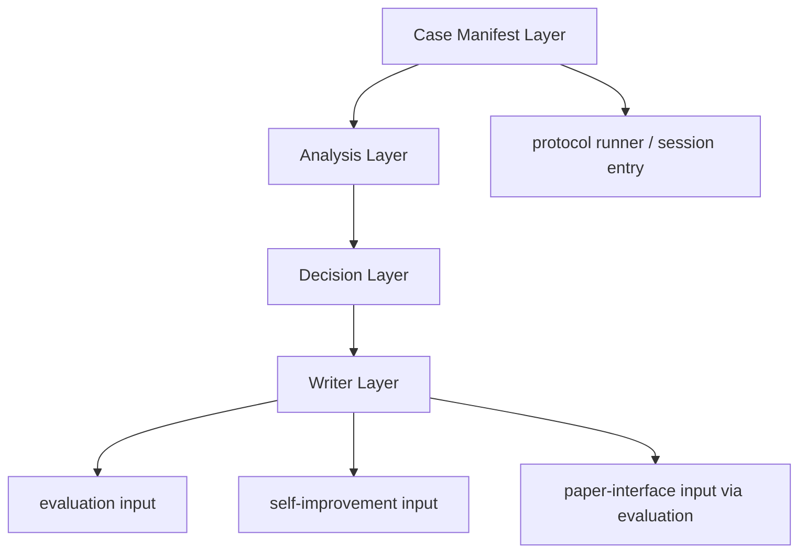

# Design Document

## Overview

`dual-reviewer-generic-execution-layer-v2` の目的は、
pilot 実装に残っている case-specific hardcode を除去し、
`Intent / Spec / Implementation` の 3 track を
同じ execution shape で扱える generic execution layer に置き換えることである。

この design では、requirements で決めた方針を
実際の構造として次の 4 層に分けて定義する。

- `Case Manifest Layer`
- `Analysis Layer`
- `Decision Layer`
- `Writer Layer`

平たく言うと、

- 何を入力にするか
- そこから何を読み取るか
- どう判定するか
- どう記録として書き出すか

を 1 か所に混ぜず、別の責務として切り分ける設計である。

## Goals

- case 名や path 文字列で動作が分岐する構造をやめる
- 3 track を共通 execution contract に載せる
- finding を case 名ではなく taxonomy ベースで扱えるようにする
- `evaluation`, `self-improvement`, `paper-interface` へ渡す境界を明確にする
- `foundation` を変える必要がある場合の条件を明確にする

## Non-Goals

- v2 実装の完了
- pilot rerun
- main evidence 昇格判断
- downstream feature の詳細 design をこの文書だけで確定すること

## Design Drivers

- case 固有性は input と evidence と最終文面にだけ残し、core rule には埋め込まない
- track 差分は case branch ではなく input contract の違いとして扱う
- raw な観察結果、判定、最終出力を別 artifact として扱う
- paper convenience が runtime rule を逆流的に変えない
- shared metadata / shared schema / shared vocabulary の変更は foundation owner を通す

## Architecture

generic execution layer v2 は、`manifest -> analysis -> decision -> writer` の 4 段で構成する。



### Layer 1: Case Manifest Layer

役割:

- case identity を持つ
- source refs を束ねる
- batch grouping と run labeling を持つ
- track ごとの最小入力を揃える

持ってよいもの:

- `case_id`
- `target_id`
- `source_refs`
- `intent_ref` / `reviewed_phase_ref` / `implementation_snapshot_ref`
- pilot scope metadata

持ってはいけないもの:

- case ごとの review rule
- hardcoded finding summary
- reopen / signal / handback の判定ロジック

設計上の意味:

今まで batch script に散っていた case 固有 binding を、
runtime rule から追い出してここへ寄せる。

### Layer 2: Analysis Layer

役割:

- input artifact を読む
- evidence を抽出する
- extracted evidence を taxonomy candidate に変換する

入力:

- common execution contract
- track-specific specialized inputs
- case manifest references

出力:

- `evidence_observation`
- `review_issue_candidate`
- `caveat_candidate`
- `reopen_candidate`
- `signal_candidate`

制約:

- track-aware ではよい
- case-aware ではいけない
- `case_id` や特定 path で analyzer を切り替えない

設計上の意味:

今まで writer 内に埋まっていた
「既知 case の expected finding 生成」を廃止し、
入力を読んで候補を出す役だけにする。

### Layer 3: Decision Layer

役割:

- candidate を判定済み object に変換する
- severity や necessity を決める
- reopen depth や handback class を決める

入力:

- analysis layer の candidate 群
- treatment / review_mode / governance refs

出力:

- accepted / rejected / deferred issue decisions
- caveat decisions
- reopen decisions
- signal linkage decisions

制約:

- 判定は taxonomy と evidence に基づく
- case 名そのものでは決めない
- shared invalidation policy を独自に上書きしない

### Layer 4: Writer Layer

役割:

- すでに決まった結果を artifact に書き出す
- protocol runner / evaluation / downstream consumer が読める形に整える

出力候補:

- `review_artifact`
- `metric_snapshot`
- `trace_note`
- `signal_linkage_note`
- `run_manifest`

制約:

- writer 自身が case-specific finding を作らない
- writer 自身が analyzer の代わりをしない
- shared schema owner にはならない

### Validation and Invalidation Flow

validator と invalidation の扱いは、layer 外の曖昧事項にしない。

役割分担:

- `Analysis Layer`
  - validator 結果そのものは作らない
  - 必要なら validation-relevant observation を補助情報として持てる
- `Decision Layer`
  - invalidation policy を決め直さない
  - ただし invalidation-relevant な note を downstream に渡すための判定済み note を作れる
- `Writer Layer`
  - validator 結果、invalidation marker、caveat note、comparison-ineligible note を artifact に書き出す

この設計のルール:

- `valid / invalid / comparison-ineligible` の policy owner は引き続き downstream 側にある
- v2 は policy を変更せず、downstream が判定に必要な情報を失わない形で保存する
- runtime convenience のために invalidation semantics を上書きしない

## Common Execution Contract

v2 は 3 track で共通の run contract を使う。

### Common Inputs

- `track`
- `target_id`
- `target_artifact_hash`
- `source_repository_id`
- `source_revision`
- `phase_profile`
- `treatment`
- `review_mode`
- `source_refs`
- `governance_refs`
- `case_manifest_ref`

### Common Intermediate Objects

- `evidence_observation`
- `review_issue_candidate`
- `caveat_candidate`
- `reopen_candidate`
- `signal_candidate`

### Common Outputs

- `review_artifact`
- `metric_snapshot`
- `trace_note`
- `signal_linkage_note`
- `run_manifest`

### Contract Rule

- `target_id` は traceability 用に保持する
- ただし `target_id` を分岐条件に使わない
- `treatment` と `review_mode` は downstream 比較のため保持する
- provenance fields は foundation handback なしに落とさない

## Track Specialization

### Intent Track

最小追加入力:

- `intent_ref`
- `supporting_refs`
- `traceability_refs`

主な観察対象:

- phase contract gap
- scope drift risk
- human gate ambiguity

### Spec Track

最小追加入力:

- `reviewed_phase`
- `reviewed_phase_ref`
- `adjacent_phase_refs`
- `alignment_refs`

主な観察対象:

- requirement / design / task の抜け
- phase 間不整合
- ordering / handoff risk

### Implementation Track

最小追加入力:

- `implementation_snapshot_ref`
- `upstream_spec_refs`
- `governance_refs`
- `target_artifact_hash`

主な観察対象:

- upstream spec mismatch
- unsafe implementation caveat
- missing validation / test evidence

## Taxonomy Model

finding は case 名先行ではなく taxonomy 先行で持つ。

### Core Families

- `gap_type`
- `inconsistency_type`
- `caveat_type`
- `propagation_type`

### Initial v2 Taxonomy Set

- `phase_contract_gap`
- `cross_phase_inconsistency`
- `scope_boundary_caveat`
- `parameter_interpretation_drift`
- `ordered_state_transition_risk`
- `input_to_implementation_mapping_ambiguity`
- `handback_required`
- `reopen_required`

設計上のルール:

- taxonomy object は structured field で持つ
- case 固有の説明は evidence excerpt と final rendered text に残す
- summary text だけで downstream が意味を読む構造にしない

### Taxonomy Ownership Rule

初版 design では、taxonomy object はまずこの feature 内の execution object として扱う。

ただし次の場合は foundation handback を起こす。

- taxonomy field を shared schema の required field にする場合
- evaluation / self-improvement / paper-interface が canonical shared vocabulary として前提にする場合
- runtime 以外の feature が同一 object shape を foundation-owned contract として import する必要がある場合

平たく言うと、

- まずは v2 内部の構造として始める
- 共通仕様に昇格させる必要が出たら foundation に戻す

という方針を採る。

## File and Component Plan

この段階では exact class 名までは固定しないが、
file / directory placement は次を design 正本とする。

```text
dual-reviewer-rebuild/
├── runtime/
│   └── execution_v2/
│       ├── manifests/
│       ├── analyzers/
│       ├── decisions/
│       ├── writers/
│       └── contracts/
└── scripts/
    ├── protocol_runners/
    └── track_runs/
```

配置ルール:

- `runtime/execution_v2/manifests/`
  - case manifest 読込
  - track specialization 解決
  - pilot case binding の registry
- `runtime/execution_v2/analyzers/`
  - intent/spec/implementation の track-aware analyzer
  - evidence extraction
  - taxonomy candidate 生成
- `runtime/execution_v2/decisions/`
  - severity / necessity / reopen / handback / signal linkage の判定
- `runtime/execution_v2/writers/`
  - protocol artifact
  - downstream handoff artifact
  - validation / invalidation note の write
- `runtime/execution_v2/contracts/`
  - v2 internal contract
  - manifest/analyzer/decision/writer 間の object shape
- `scripts/protocol_runners/`
  - v2 contract を受けて run を開始する entrypoint
- `scripts/track_runs/`
  - protocol runner が書き出した結果を既存 run directory や comparison input へ橋渡しする adapter

この placement の意図:

- core runtime logic は `runtime/execution_v2/` に集める
- script 側には orchestration と adapter だけを残す
- batch wiring と analyzer / writer logic を混ぜない

具体配置で最低限守ること:

- manifest logic を writer に入れない
- analyzer logic を batch script に入れない
- downstream 変換 logic を runtime core に入れない

### Validation Artifact Placement

v2 writer が書き出す最小 artifact 群は次とする。

```text
<run-root>/
├── run_manifest.yaml
├── review_case.json
├── decisions/
│   └── decision_units.json
├── v2/
│   ├── review_artifact.json
│   ├── metric_snapshot.json
│   ├── trace_note.json
│   └── signal_linkage_note.json
└── validation/
    ├── validator_result.json
    ├── invalidation_markers.json
└── derived/
    └── comparison_eligibility_note.json
```

ここでの役割:

- `run_manifest.yaml`
  - run identity と provenance の正本
- `review_case.json`
  - evaluation 互換の machine-readable review record
- `decisions/decision_units.json`
  - accepted / rejected / deferred の decision 単位記録
- `v2/review_artifact.json`
  - v2 内部で使う taxonomy-first review result の正本
- `v2/metric_snapshot.json`
  - evaluation が再計算前の quick intake に使える最小 metric
- `v2/trace_note.json`
  - reopened source refs や handback refs を追跡する note
- `v2/signal_linkage_note.json`
  - self-improvement に渡す signal linkage 情報
- `validation/validator_result.json`
  - validator pass/fail の保存先
- `validation/invalidation_markers.json`
  - invalidation 事実の保存先
- `derived/comparison_eligibility_note.json`
  - standard comparison に直接入れるかどうかを downstream が判断するための補助 note

この artifact 群は foundation の shared contract を置き換えず、
v2 execution layer の write target を具体化するための配置である。

互換ルール:

- `evaluation` の primary intake は既存 design に合わせて `review_case.json` と `decisions/decision_units.json` を維持する
- `v2/review_artifact.json` は v2 内部の canonical object であり、downstream 互換 artifact を生成する元データとして使う
- したがって v2 は、新しい内部構造を持ちつつ、既存 downstream が読む入口は急に変えない

## Downstream Handoff

### Evaluation

v2 から evaluation へ渡すべきもの:

- provenance を含む run manifest
- evaluation 互換の review record
- decision unit record
- metric snapshot
- caveat と invalidation に関わる note

evaluation handoff shape:

- primary intake
  - `run_manifest.yaml`
  - `review_case.json`
  - `decisions/decision_units.json`
  - `validation/validator_result.json`
  - `validation/invalidation_markers.json`
  - `derived/comparison_eligibility_note.json`
- optional convenience intake
  - `v2/review_artifact.json`
  - `v2/metric_snapshot.json`
  - `v2/trace_note.json`

この設計で決めること:

- evaluation が `review_case.json` / `decision_units.json` から taxonomy-first comparison へどう移行するか
- comparison に使う最小 field set

### Self-Improvement

v2 から self-improvement へ渡すべきもの:

- runtime 側の signal linkage 補助情報
- motivating evidence へ遡れる trace
- provenance and admission-relevant context

self-improvement handoff shape:

- primary path
  - evaluation-derived analysis artifact
  - self-improvement 側で生成する `findings/recurring_failure_signals.json`
- supporting path
  - `v2/signal_linkage_note.json`
  - `v2/trace_note.json`
  - `run_manifest.yaml`
  - `derived/comparison_eligibility_note.json`

この設計で決めること:

- self-improvement の primary signal owner は引き続き self-improvement / evaluation 側に置く
- v2 は proposal-ready signal inventory を直接正本化せず、signal extraction に必要な supporting artifact を渡す
- accepted / rejected / deferred decision のどこまでを supporting evidence として露出するか

### Paper-Interface

paper-interface は runtime raw output の primary consumer にはしない。

ルール:

- paper-facing input は evaluation 経由を標準とする
- runtime から paper へ直接 formatting convenience を入れない

paper-interface handoff shape:

- direct runtime handoff は標準経路にしない
- standard input は evaluation-derived artifact とする
- 例外的に runtime artifact を参照する場合も、claim-supporting source としてではなく traceability 補助に限る

この設計で決めること:

- evaluation output から必要な field をどう切り出すか
- caveat と provenance をどう残すか

## Foundation Handback Rule

次の場合は、この feature 単独で吸収せず foundation handback が必要である。

- new shared metadata field が必要
- new shared schema object が必要
- shared taxonomy vocabulary を foundation owner に昇格させる必要がある
- evaluation / self-improvement / paper-interface が共通に読む canonical contract を変える必要がある

次の場合は runtime-centered v2 feature 内で吸収してよい。

- internal layer separation
- manifest migration
- analyzer / decision / writer の責務分割
- case-specific branch の除去

## Replacement Plan

実装への落とし込み順は次とする。

1. manifest migration points を確定する
2. generic analyzer interfaces を定義する
3. decision object と writer output shape を定義する
4. protocol runner を v2 contract に合わせて差し替える
5. `phase-field` pilot を rerun する

## Open Design Points

この design 初版の時点で、次は詳細化が必要である。

- taxonomy object を foundation shared contract に上げるかどうか
- evaluation intake の canonical artifact をどれにするか
- self-improvement signal object の最小 shape
- protocol runner と manifest registry の具体配置
- legacy pilot artifact との互換範囲
