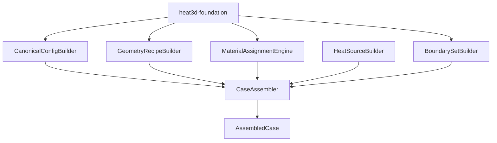
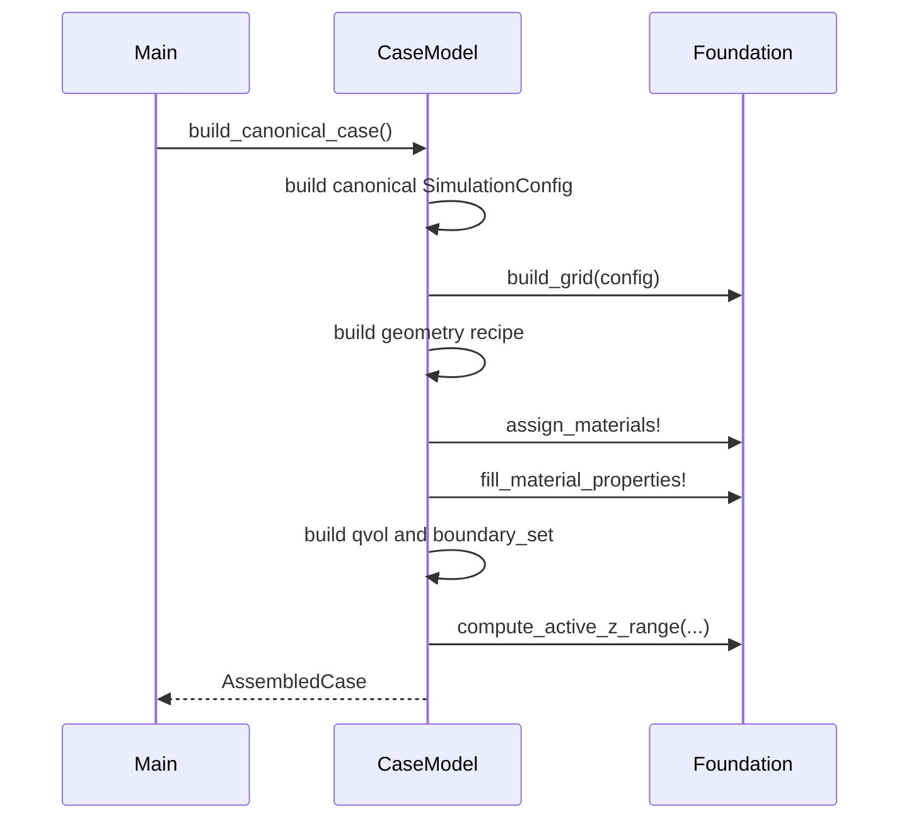

# Design Document

## Overview

`heat3d-case-model` は canonical MVP case を組み立てる feature である。ここでは、config、geometry 配置、material assignment、heat source、boundary set、active `z_range` を束ねて、`main` がそのまま solver を呼べる assembled case bundle を返す。

この設計で requirements phase の open point だった `SimulationConfig` と assembled case bundle の具体型を確定する。`SimulationConfig` の型定義は `foundation` に置き、instance の canonical 値構築と `AssembledCase` の ownership は `case-model` に置く。

### Goals

- canonical MVP の numeric defaults を 1 か所で管理する
- geometry recipe と material assignment order を deterministic に組み立てる
- `main` が再解釈なしで solver を呼べる `AssembledCase` を返す
- boundary set から active `z_range` を導く

### Non-Goals

- primitive 判定アルゴリズムそのもの
- iterative solver implementation
- top-level log formatting

## Boundary Commitments

### This Spec Owns

- canonical `SimulationConfig` instance construction
- `AssembledCase` concrete struct
- plate layers / power grid / TSV / solder bump の placement recipe
- material assignment orchestration
- `qvol` construction
- boundary set construction and active `z_range` derivation

### Out of Boundary

- shared type definitions
- primitive internals
- solver coefficients
- output rendering

### Allowed Dependencies

- `heat3d-foundation`
- Julia Base

### Revalidation Triggers

- canonical MVP dimensions or constants change
- geometry placement recipe changes
- material assignment order changes
- `AssembledCase` fields change

## Architecture

### Architecture Pattern & Boundary Map



**Architecture Integration**

- Selected pattern: recipe + assembler
- Owner rule: `case-model` is the only feature allowed to instantiate canonical MVP constants
- Open-point resolution: `AssembledCase` is owned here; `main` consumes it read-only

## File Structure Plan

### Directory Structure

```text
src/
└── case_model/
    ├── types.jl
    ├── canonical_config.jl
    ├── geometry_recipe.jl
    ├── material_assignment.jl
    ├── heat_source.jl
    ├── boundary_sets.jl
    └── assemble_case.jl
```

### Modified Files

- `src/case_model/types.jl` - `AssembledCase` definition
- `src/case_model/canonical_config.jl` - canonical `SimulationConfig`
- `src/case_model/geometry_recipe.jl` - primitive list generation
- `src/case_model/material_assignment.jl` - `id`, `alpha`, `rho`, `cp` build
- `src/case_model/heat_source.jl` - `qvol` fill
- `src/case_model/boundary_sets.jl` - canonical boundary set
- `src/case_model/assemble_case.jl` - final bundle assembly

## System Flow



## Requirements Traceability

| Requirement | Summary | Components | Contracts |
|-------------|---------|------------|-----------|
| 1 | canonical MVP config | CanonicalConfigBuilder | `SimulationConfig` |
| 2 | geometry and material assignment | GeometryRecipeBuilder, MaterialAssignmentEngine | `PrimitiveSpec`, `AssembledCase` |
| 3 | heat source and boundary set | HeatSourceBuilder, BoundarySetBuilder | `BoundaryConditionSet`, `qvol` |
| 4 | assembled case bundle | CaseAssembler | `AssembledCase` |

## Components and Interfaces

### CaseModel Types

```julia
struct AssembledCase
    config::SimulationConfig
    grid::GridData
    id::Array{Int32,3}
    alpha::Array{Float64,3}
    rho::Array{Float64,3}
    cp::Array{Float64,3}
    qvol::Array{Float64,3}
    boundary_set::BoundaryConditionSet
    z_range::UnitRange{Int}
end
```

`theta` と `mask` は `AssembledCase` に含めない。これらは run-time field であり、`heat3d-main` が `config.initial_temperature` と `boundary_set` から初期化する。

### CanonicalConfigBuilder

| Field | Detail |
|-------|--------|
| Intent | single source of canonical numeric defaults |
| Requirements | 1 |

##### Service Interface
```julia
function build_canonical_config()::SimulationConfig
end
```

**Design Decisions**

- `NX = 240`, `NY = 240`, `NZ = 31`, `dt = 1000.0`, `step_count = 1`
- `tolerance = 1.0e-4`, `max_iterations = 8000`, `initial_temperature = 300.0`
- solver name is `:pbicgstab`

### GeometryRecipeBuilder

| Field | Detail |
|-------|--------|
| Intent | canonical primitive placement generator |
| Requirements | 2 |

##### Service Interface
```julia
function build_geometry_recipe()::Vector{PrimitiveSpec}
end
```

**Responsibilities & Constraints**

- emits ordered primitive groups matching `power grid -> TSV -> plate layers -> solder bumps`
- does not touch arrays directly

### MaterialAssignmentEngine

| Field | Detail |
|-------|--------|
| Intent | convert recipe into `id`, `alpha`, `rho`, `cp` arrays |
| Requirements | 2 |

##### Service Interface
```julia
function build_material_fields(
    grid::GridData,
    recipe::Vector{PrimitiveSpec},
)::NamedTuple
end
```

**Design Decisions**

- `id` array is built first
- `resin` fill is applied exactly once after ordered recipe application
- property arrays are derived from `id` through foundation material table

### HeatSourceBuilder

| Field | Detail |
|-------|--------|
| Intent | `qvol` owner |
| Requirements | 3 |

##### Service Interface
```julia
function build_heat_source!(
    qvol::Array{Float64,3},
    id::Array{Int32,3},
)::Nothing
end
```

### BoundarySetBuilder

| Field | Detail |
|-------|--------|
| Intent | canonical boundary set owner |
| Requirements | 3 |

##### Service Interface
```julia
function build_canonical_boundary_set()::BoundaryConditionSet
end
```

### CaseAssembler

| Field | Detail |
|-------|--------|
| Intent | final immutable bundle constructor |
| Requirements | 4 |

##### Service Interface
```julia
function build_canonical_case()::AssembledCase
end
```

**Responsibilities & Constraints**

- constructs config first, then grid, then fields, then boundary set, then `z_range`
- returns a ready-to-solve bundle
- does not allocate `theta`; initial temperature field is `main` responsibility

## Data Models

### Ownership Resolution

- type definition of `SimulationConfig` belongs to `foundation`
- canonical instance of `SimulationConfig` belongs to `case-model`
- concrete `AssembledCase` belongs to `case-model`
- `main` treats `AssembledCase` as read-only input

## Risks and Mitigations

- Risk: canonical constants leak into `main`
  - Mitigation: only `build_canonical_config()` may instantiate defaults
- Risk: material assignment order drifts
  - Mitigation: recipe is generated as one ordered vector
- Risk: `AssembledCase` becomes a generic dump bag
  - Mitigation: field list is restricted to direct solver inputs only
