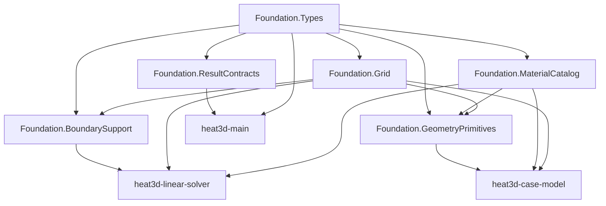

# Design Document

## Overview

`heat3d-foundation` は `heat3d` 全体の shared contract owner である。ここでは、下流 feature が同じ格子解釈、同じ配列形、同じ材料表、同じ境界条件データ形を使えるように、共通データモデルと helper 境界を固定する。

この feature は `foundation / linear-solver / case-model / main` のうち最上流に置く。`foundation` をさらに `grid / materials / geometry / boundary` へ独立 feature 分割する案は design open point として検討したが、current MVP では feature split は増やさず、内部 submodule 分割で責務を見える化する方針を採る。

### Goals

- shared type と配列 contract の authoritative source を 1 か所に固定する
- X/Y/Z 格子、`ΔZ`、active `z_range` の決定規則を下流から切り離す
- 材料表、primitive 判定、境界条件 helper を共通 API として定義する
- 将来 `grid / materials / geometry / boundary` を再分割する場合の seam を残す

### Non-Goals

- 線形 solver のアルゴリズム定義
- canonical MVP の geometry 配置
- top-level run orchestration
- 可視化、CSV、複数ケース実行、GPU

## Boundary Commitments

### This Spec Owns

- `Material`, `BoundaryCondition`, `BoundaryConditionSet`, `BoundaryContributions`, `SimulationConfig`, `SimulationResult`, `ResidualHistory`, `GridShape`, `GridData`, `FieldBuffers` の型定義
- `NX / NY / NZ / MX / MY / MZ` と guard cell contract
- X/Y 格子と固定 Z 格子、`ΔZ`、active `z_range` の生成 helper
- canonical material table (`id = 1..7`)
- box / cylinder / sphere primitive 判定 API
- material assignment order helper
- boundary-condition shape と boundary application helper interface

### Out of Boundary

- RHS の構築や `A*x`
- GS / PBiCGSTAB 実装
- canonical geometry placement
- solver 実行ループと baseline 出力

### Allowed Dependencies

- Julia Base
- `LinearAlgebra` for norms and scalar helpers only
- pure `Array{Float64,3}` / `Array{Int32,3}` based storage

### Revalidation Triggers

- 配列 shape や guard cell 規約の変更
- Z 格子や active `z_range` 規約の変更
- material id table の変更
- boundary-condition field shape の変更
- `SimulationConfig` / `SimulationResult` field の追加削除

## Architecture

### Architecture Pattern & Boundary Map



**Architecture Integration**

- Selected pattern: single feature with internal submodules
- Split rationale: feature は 1 本に保ちつつ、future split seam を code-level module boundary として先に表現する
- Owner rule: `foundation` で定義した type / helper 名を下流が再定義してはならない
- Open-point resolution: `foundation` は current design では再分割しない

### Technology Stack

| Layer | Choice | Role | Notes |
|-------|--------|------|-------|
| Language | Julia | canonical implementation language | clean-room で新規構成 |
| Arrays | `Array{Float64,3}`, `Array{Int32,3}` | field storage | guard cell 含む |
| Modules | Julia submodules | internal seams | future split に備える |

## File Structure Plan

### Directory Structure

```text
src/
├── Heat3D.jl
└── foundation/
    ├── types.jl
    ├── grid.jl
    ├── materials.jl
    ├── geometry_primitives.jl
    ├── boundary_support.jl
    └── result_contracts.jl
```

### Modified Files

- `src/foundation/types.jl` - shared type definitions
- `src/foundation/grid.jl` - X/Y/Z grid and `ΔZ`, active `z_range`
- `src/foundation/materials.jl` - canonical material table and property lookup
- `src/foundation/geometry_primitives.jl` - inclusion tests and ordered assignment helper
- `src/foundation/boundary_support.jl` - boundary metadata and helper contracts
- `src/foundation/result_contracts.jl` - result and residual history shapes

## Requirements Traceability

| Requirement | Summary | Components | Key Contracts |
|-------------|---------|------------|---------------|
| 1 | shared types | Types, ResultContracts | `SimulationConfig`, `SimulationResult` |
| 2 | array shape and indexing | Types, Grid | `GridShape`, `FieldBuffers` |
| 3 | X/Y/Z grid | Grid | `GridData`, `compute_active_z_range` |
| 4 | material table | MaterialCatalog | `Material`, `material_table()` |
| 5 | primitive checks and ordered assignment | GeometryPrimitives | `BoxSpec`, `CylinderSpec`, `SphereSpec` |
| 6 | boundary data | BoundarySupport | `BoundaryConditionSet`, `BoundaryContributions`, helper APIs |
| 7 | shared result/log items | ResultContracts | `ResidualHistory`, `SimulationResult` |

## Components and Interfaces

### Component Summary

| Component | Intent | Dependencies | Exposes |
|-----------|--------|--------------|---------|
| Types | base structs and aliases | none | shared structs |
| Grid | X/Y/Z and `ΔZ` contract | Types | `build_grid`, `compute_active_z_range` |
| MaterialCatalog | material id to properties | Types | `material_table`, `fill_material_properties!` |
| GeometryPrimitives | inclusion checks and ordered fill | Types, Grid, MaterialCatalog | `contains_*`, `assign_materials!` |
| BoundarySupport | boundary metadata and helper interfaces | Types, Grid | `apply_isothermal!`, `boundary_flux_term` |
| ResultContracts | solver/main shared output | Types | `ResidualHistory`, `SimulationResult` |

### Types

| Field | Detail |
|-------|--------|
| Intent | shared struct namespace |
| Requirements | 1, 2, 7 |

**Responsibilities & Constraints**

- scalar field arrays are always allocated in guard-cell shape `[MX, MY, MZ]`
- `SimulationConfig` owns canonical run parameters but not geometry placement
- `FieldBuffers` is a container of preallocated arrays, not a run result

##### Service Interface
```julia
struct Material
    id::Int32
    name::Symbol
    alpha::Float64
    rho::Float64
    cp::Float64
end

@enum BoundaryKind ISOTHERMAL HEAT_FLUX CONVECTION

struct BoundaryCondition
    kind::BoundaryKind
    temperature::Float64
    heat_flux::Float64
    heat_transfer_coefficient::Float64
    ambient_temperature::Float64
end

struct BoundaryConditionSet
    x_minus::BoundaryCondition
    x_plus::BoundaryCondition
    y_minus::BoundaryCondition
    y_plus::BoundaryCondition
    z_minus::BoundaryCondition
    z_plus::BoundaryCondition
end

struct BoundaryContributions
    rhs_term::Array{Float64,3}
    diagonal_term::Array{Float64,3}
end

struct SimulationConfig
    nx::Int
    ny::Int
    nz::Int
    dt::Float64
    step_count::Int
    tolerance::Float64
    max_iterations::Int
    initial_temperature::Float64
    solver_name::Symbol
end

struct GridShape
    nx::Int
    ny::Int
    nz::Int
    mx::Int
    my::Int
    mz::Int
end

struct GridData
    shape::GridShape
    lx::Float64
    ly::Float64
    dx::Float64
    dy::Float64
    z::Vector{Float64}
    delta_z::Vector{Float64}
end

struct FieldBuffers
    theta::Array{Float64,3}
    rhs::Array{Float64,3}
    mask::Array{Float64,3}
    alpha::Array{Float64,3}
    rho::Array{Float64,3}
    cp::Array{Float64,3}
    id::Array{Int32,3}
    qvol::Array{Float64,3}
end
```

### Grid

| Field | Detail |
|-------|--------|
| Intent | authoritative grid and active-range builder |
| Requirements | 2, 3 |

**Design Decisions**

- fixed MVP Z grid is stored as a literal vector in `grid.jl`
- `delta_z[k]` is materialized once and reused downstream
- active `z_range` is computed only from `BoundaryConditionSet`; solver and case-model both consume the same result

##### Service Interface
```julia
function build_grid(config::SimulationConfig)::GridData
end

function compute_active_z_range(
    config::SimulationConfig,
    boundary_set::BoundaryConditionSet,
)::UnitRange{Int}
end
```

### MaterialCatalog

| Field | Detail |
|-------|--------|
| Intent | canonical material property source |
| Requirements | 4 |

##### Service Interface
```julia
function material_table()::Dict{Int32,Material}
end

function fill_material_properties!(
    alpha::Array{Float64,3},
    rho::Array{Float64,3},
    cp::Array{Float64,3},
    id::Array{Int32,3},
    table::Dict{Int32,Material},
)::Nothing
end
```

### GeometryPrimitives

| Field | Detail |
|-------|--------|
| Intent | primitive predicates and ordered assignment helper |
| Requirements | 5 |

**Design Decisions**

- primitive specs are plain structs
- cylinder and sphere use fixed `50 x 50 x 50` sampling in MVP
- ordered assignment is explicit and append-only: later fill may overwrite only by the predefined order, then `resin` fills remaining zero cells

##### Service Interface
```julia
abstract type PrimitiveSpec end

struct BoxSpec <: PrimitiveSpec
    x0::Float64; y0::Float64; z0::Float64
    lx::Float64; ly::Float64; lz::Float64
    material_id::Int32
end

function assign_materials!(
    id::Array{Int32,3},
    grid::GridData,
    ordered_primitives::Vector{PrimitiveSpec},
    default_material_id::Int32,
)::Nothing
end
```

### BoundarySupport

| Field | Detail |
|-------|--------|
| Intent | boundary data shape and helper contract owner |
| Requirements | 6 |

**Design Decisions**

- helper API is split into isothermal mask update and flux/convection coefficient extraction
- sign convention is encoded in side-specific helper dispatch, not left to callers

##### Service Interface
```julia
function apply_isothermal!(
    theta::Array{Float64,3},
    mask::Array{Float64,3},
    boundary_set::BoundaryConditionSet,
    grid::GridData,
)::Nothing
end

function boundary_rhs_and_diagonal_terms(
    boundary_set::BoundaryConditionSet,
    grid::GridData,
    alpha::Array{Float64,3},
    rho::Array{Float64,3},
    cp::Array{Float64,3},
)::BoundaryContributions
end
```

### ResultContracts

| Field | Detail |
|-------|--------|
| Intent | solver and main shared diagnostics shape |
| Requirements | 1, 7 |

**Open-point resolution**

- residual history payload ownership is `heat3d-linear-solver`
- final `SimulationResult` assembly ownership is `heat3d-main`
- `main` receives `ResidualHistory` as immutable diagnostics and only renders/logs it

##### Service Interface
```julia
struct ResidualHistory
    values::Vector{Float64}
end

struct SimulationResult
    theta::Array{Float64,3}
    iterations::Int
    final_residual::Float64
    converged::Bool
    elapsed_seconds::Float64
    residual_history::ResidualHistory
end
```

## Data Models

### Ownership Model

- `SimulationConfig`: canonical run parameters, owned by `case-model`
- `GridData`: geometric discretization contract, owned by `foundation`
- `id`, `alpha`, `rho`, `cp`, `qvol`: assembled field ownership belongs to `case-model`
- `theta` and `rhs`: runtime state ownership belongs to `main` / `linear-solver`
- `SimulationResult`: final run report ownership belongs to `main`, residual history payload originates in `linear-solver`

## Risks and Mitigations

- Risk: `foundation` remains too broad
  - Mitigation: submodule seams align with future split axes
- Risk: boundary sign convention drifts into callers
  - Mitigation: side-specific helper API centralizes sign handling
- Risk: `SimulationConfig` grows into case-model and main duplicate ownership
  - Mitigation: type definition stays here, instance construction stays in `case-model`
