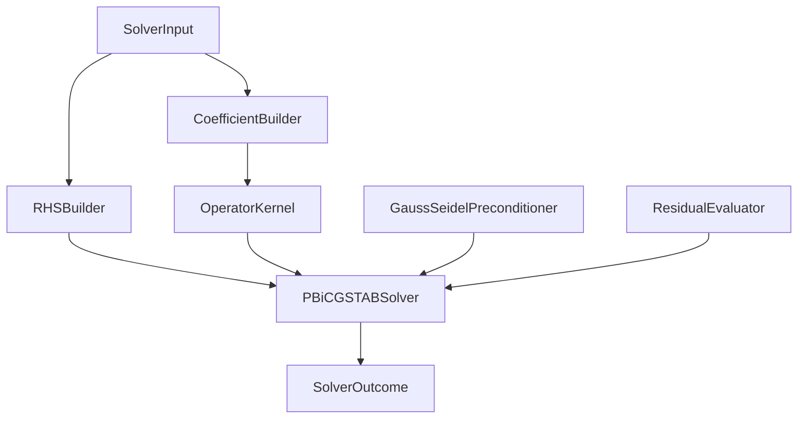
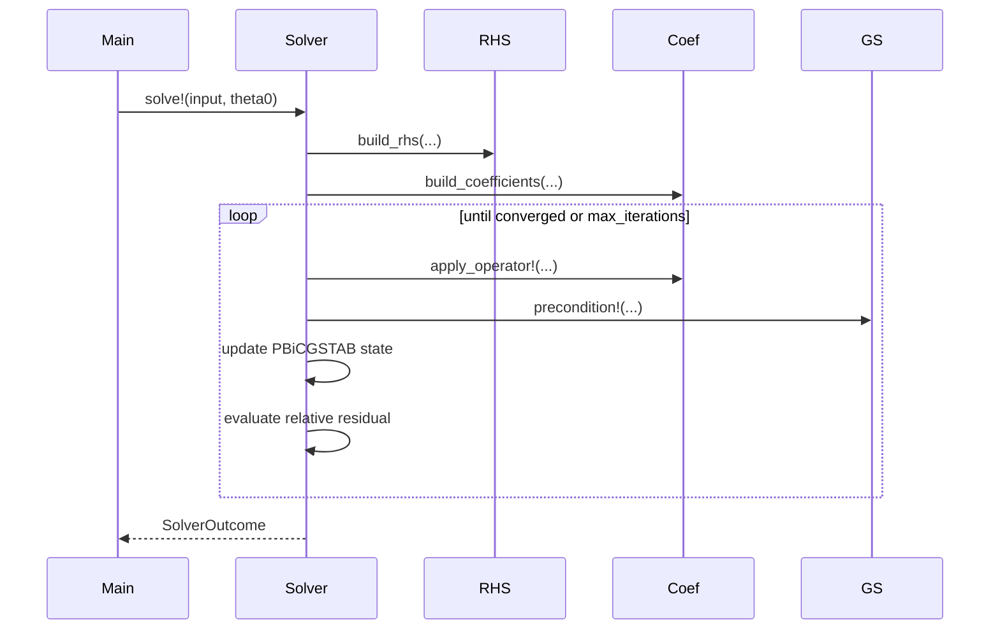

# Design Document

## Overview

`heat3d-linear-solver` は backward Euler 1 step の疎線形系を解く numerical kernel を定める。geometry 配置や最上位 orchestration には関与せず、`foundation` と `case-model` が渡す field contract を入力に取り、更新後温度場と収束診断を返す。

この設計では、RHS 構築、係数評価、`A*x`、GS 前処理、PBiCGSTAB、残差評価を独立 component として切る。これにより、後で solver を差し替える場合も `SolverInput` / `SolverOutcome` 契約を維持できる。

### Goals

- backward Euler 1 step の algebraic contract を固定する
- `mask` と active `z_range` に従う未知数集合を一意にする
- GS preconditioned PBiCGSTAB の loop 責務を main から切り離す
- residual history を diagnostics として返す

### Non-Goals

- canonical geometry 構築
- material table や格子生成
- top-level logging format の決定
- multi-step time marching beyond MVP 1 step

## Boundary Commitments

### This Spec Owns

- `SolverInput`, `CoefficientWorkspace`, `SolverState`, `SolverOutcome` の設計
- RHS and diagonal/off-diagonal coefficient generation
- `apply_operator!`
- GS preconditioner
- PBiCGSTAB iteration control
- convergence and residual history generation

### Out of Boundary

- `SimulationConfig` instance construction
- canonical case assembly
- representative probe extraction and baseline persistence

### Allowed Dependencies

- `heat3d-foundation`
- Julia `LinearAlgebra`
- pure array loops without sparse-matrix package

### Revalidation Triggers

- array shape or active `z_range` contract changes
- boundary helper return shape changes
- convergence definition changes
- solver default values move out of `case-model`

## Architecture

### Architecture Pattern & Boundary Map



**Architecture Integration**

- Selected pattern: kernel pipeline around a solver facade
- Data flow: assembled case -> solver input -> coefficient workspaces -> iterative solve -> diagnostics
- Owner rule: coefficient interpretation is centralized in this feature; callers pass data, not formulas

### Technology Stack

| Layer | Choice | Role | Notes |
|-------|--------|------|-------|
| Language | Julia | implementation | explicit loops |
| Math | `LinearAlgebra` | norms, dot products | no sparse matrix library |
| Storage | dense 3D arrays + work vectors | MVP simplicity | respects clean-room design |

## File Structure Plan

### Directory Structure

```text
src/
└── linear_solver/
    ├── types.jl
    ├── rhs_builder.jl
    ├── coefficient_builder.jl
    ├── operator_kernel.jl
    ├── gs_preconditioner.jl
    ├── pbicgstab.jl
    └── residuals.jl
```

### Modified Files

- `src/linear_solver/types.jl` - solver-local data carriers
- `src/linear_solver/rhs_builder.jl` - `rhs = -(T_old / dt + (qvol + q_boundary)/(rho*cp))`
- `src/linear_solver/coefficient_builder.jl` - x/y/z and boundary-derived coefficients
- `src/linear_solver/operator_kernel.jl` - `A*x`
- `src/linear_solver/gs_preconditioner.jl` - GS sweep
- `src/linear_solver/pbicgstab.jl` - solver loop and diagnostics
- `src/linear_solver/residuals.jl` - RMS and relative residual evaluation

## System Flow



## Requirements Traceability

| Requirement | Summary | Components | Contracts |
|-------------|---------|------------|-----------|
| 1 | one-step algebraic system | RHSBuilder, CoefficientBuilder | `SolverInput`, `BoundaryContributions` |
| 2 | `A*x` and unknown set | OperatorKernel | `apply_operator!` |
| 3 | GS preconditioner | GaussSeidelPreconditioner | `gs_sweep!` |
| 4 | PBiCGSTAB and convergence | PBiCGSTABSolver, ResidualEvaluator | `solve!`, `ResidualHistory` |
| 5 | standalone checks | PBiCGSTABSolver | deterministic smoke tests |

## Components and Interfaces

### SolverLocal Types

```julia
struct SolverInput
    theta::Array{Float64,3}
    qvol::Array{Float64,3}
    alpha::Array{Float64,3}
    rho::Array{Float64,3}
    cp::Array{Float64,3}
    mask::Array{Float64,3}
    grid::GridData
    boundary_set::BoundaryConditionSet
    z_range::UnitRange{Int}
    dt::Float64
    tolerance::Float64
    max_iterations::Int
end

mutable struct CoefficientWorkspace
    axm::Array{Float64,3}
    axp::Array{Float64,3}
    aym::Array{Float64,3}
    ayp::Array{Float64,3}
    azm::Array{Float64,3}
    azp::Array{Float64,3}
    adiag::Array{Float64,3}
end

mutable struct SolverState
    r::Array{Float64,3}
    r_hat::Array{Float64,3}
    p::Array{Float64,3}
    v::Array{Float64,3}
    s::Array{Float64,3}
    t::Array{Float64,3}
    phat::Array{Float64,3}
    shat::Array{Float64,3}
end

struct SolverOutcome
    theta::Array{Float64,3}
    iterations::Int
    final_residual::Float64
    converged::Bool
    residual_history::ResidualHistory
end
```

### RHSBuilder

| Field | Detail |
|-------|--------|
| Intent | RHS contract owner |
| Requirements | 1 |

##### Service Interface
```julia
function build_rhs!(
    rhs::Array{Float64,3},
    input::SolverInput,
    boundary_terms::BoundaryContributions,
)::Nothing
end
```

**Responsibilities & Constraints**

- uses only `theta`, `qvol`, shared boundary RHS term, `rho`, `cp`, `dt`
- never mutates `input.theta`
- respects `mask` and active `z_range`

### CoefficientBuilder

| Field | Detail |
|-------|--------|
| Intent | face coefficients and diagonal owner |
| Requirements | 1, 2 |

##### Service Interface
```julia
function build_coefficients!(
    coef::CoefficientWorkspace,
    input::SolverInput,
    boundary_terms::BoundaryContributions,
)::Nothing
end
```

**Design Decisions**

- x/y use harmonic-mean face diffusivity divided by `dx^2` / `dy^2`
- z uses `alpha_face / (delta_z[k] * neighbor_distance)`
- convection diagonal contribution is accumulated only here
- boundary-derived payload shape is consumed from `foundation.BoundaryContributions`; this feature does not redefine that contract

### OperatorKernel

| Field | Detail |
|-------|--------|
| Intent | authoritative `A*x` evaluator |
| Requirements | 2 |

##### Service Interface
```julia
function apply_operator!(
    out::Array{Float64,3},
    x::Array{Float64,3},
    coef::CoefficientWorkspace,
    input::SolverInput,
)::Nothing
end
```

### GaussSeidelPreconditioner

| Field | Detail |
|-------|--------|
| Intent | GS smoother for preconditioning |
| Requirements | 3 |

##### Service Interface
```julia
function gs_sweep!(
    z::Array{Float64,3},
    r::Array{Float64,3},
    coef::CoefficientWorkspace,
    input::SolverInput,
)::Nothing
end
```

### PBiCGSTABSolver

| Field | Detail |
|-------|--------|
| Intent | iterative solver facade |
| Requirements | 4, 5 |

##### Service Interface
```julia
function solve_heat_step(input::SolverInput)::SolverOutcome
end
```

**Design Decisions**

- solver allocates residual history internally and returns it via `SolverOutcome`
- solver owns convergence decision; `main` only consumes boolean and history
- relative residual is `residual_rms / initial_residual_rms`

### ResidualEvaluator

| Field | Detail |
|-------|--------|
| Intent | RMS and convergence helper |
| Requirements | 4 |

##### Service Interface
```julia
function rms_over_active_cells(
    x::Array{Float64,3},
    mask::Array{Float64,3},
    z_range::UnitRange{Int},
)::Float64
end
```

## Data Models

### Ownership Model

- `SolverInput` is immutable input assembled by `main`
- `CoefficientWorkspace` is internal mutable workspace
- `ResidualHistory` and `SolverOutcome` are produced here and treated as immutable downstream
- final `SimulationResult` is assembled in `main` by adding elapsed-time information

## Risks and Mitigations

- Risk: coefficient formulas leak into callers
  - Mitigation: all coefficient construction is internal to this feature
- Risk: residual history shape drifts
  - Mitigation: diagnostics contract is returned as `SolverOutcome`
- Risk: guard-cell and active-range handling diverges across builder and operator
  - Mitigation: all kernels consume the same `SolverInput`
