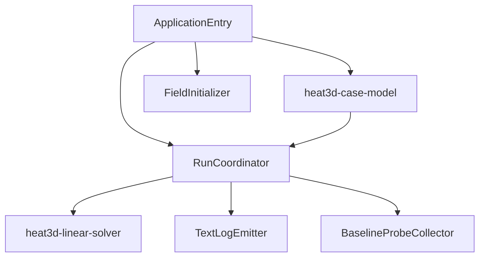
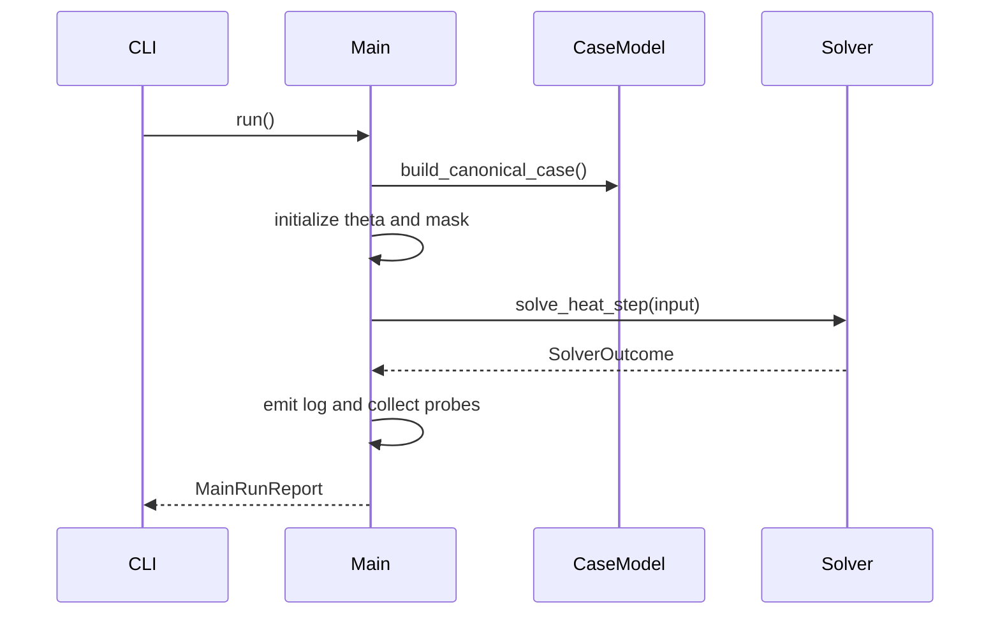

# Design Document

## Overview

`heat3d-main` は canonical MVP の top-level orchestrator である。`case-model` が返す assembled case と `linear-solver` をつなぎ、1 step 実行、text log 出力、baseline probe 抽出、final `MainRunReport` の返却を担う。

この設計では、最上位の責務を `ApplicationEntry / FieldInitializer / RunCoordinator / TextLogEmitter / BaselineProbeCollector` に分ける。solver の内部アルゴリズムや geometry 再構成はここに入れず、呼び出し順と reporting に責務を絞る。

### Goals

- CLI 引数なしで canonical MVP を 1 回起動できるようにする
- assembled case を再構成せず solver へ渡す
- human-readable な text log を出す
- regression baseline 用代表値を抽出する

### Non-Goals

- geometry or material assignment logic
- solver loop internals
- visualization or CSV export
- batch execution

## Boundary Commitments

### This Spec Owns

- entrypoint function and call sequence
- initial `theta` allocation and initialization
- solver invocation and elapsed-time measurement
- residual history rendering
- baseline probe coordinate resolution and collection

### Out of Boundary

- canonical config constants
- `qvol`, material arrays, boundary-set construction
- convergence algorithm itself

### Allowed Dependencies

- `heat3d-case-model`
- `heat3d-linear-solver`
- `heat3d-foundation`
- Julia `Printf` and `Dates`/`time` measurement utilities

### Revalidation Triggers

- `AssembledCase` field changes
- `SimulationResult` / `MainRunReport` shape changes
- representative probe definition changes
- log contract changes

## Architecture

### Architecture Pattern & Boundary Map



**Architecture Integration**

- Selected pattern: thin application orchestration
- Owner rule: `main` may allocate runtime fields and logs, but may not invent new physics parameters
- Open-point resolution: residual history payload is consumed from `SolverOutcome` and carried into final `SimulationResult`; `main` does not compute it independently

## File Structure Plan

### Directory Structure

```text
src/
├── main/
│   ├── entrypoint.jl
│   ├── field_initializer.jl
│   ├── run_coordinator.jl
│   ├── text_log_emitter.jl
│   └── baseline_probes.jl
└── bin/
    └── heat3d_main.jl
```

### Modified Files

- `src/main/entrypoint.jl` - canonical run entry
- `src/main/field_initializer.jl` - initialize `theta` from config
- `src/main/run_coordinator.jl` - glue `AssembledCase` to solver
- `src/main/text_log_emitter.jl` - log contract implementation
- `src/main/baseline_probes.jl` - representative-point extraction
- `src/bin/heat3d_main.jl` - executable wrapper

## System Flow



## Requirements Traceability

| Requirement | Summary | Components | Contracts |
|-------------|---------|------------|-----------|
| 1 | top-level execution entry | ApplicationEntry, RunCoordinator | `run_canonical_mvp()`, `MainRunReport` |
| 2 | initialization and solver call | FieldInitializer, RunCoordinator | `SolverInput`, `AssembledCase` |
| 3 | logs and return value | TextLogEmitter | `SimulationResult` |
| 4 | baseline representative values | BaselineProbeCollector | `BaselineReport` |
| 5 | MVP pass/fail | RunCoordinator, TextLogEmitter | threshold checks |

## Components and Interfaces

### ApplicationEntry

| Field | Detail |
|-------|--------|
| Intent | canonical no-arg entry |
| Requirements | 1 |

##### Service Interface
```julia
struct MainRunReport
    result::SimulationResult
    baseline::BaselineReport
end

function run_canonical_mvp()::MainRunReport
end
```

### FieldInitializer

| Field | Detail |
|-------|--------|
| Intent | build initial temperature field |
| Requirements | 2 |

##### Service Interface
```julia
function initialize_runtime_fields(
    case::AssembledCase,
)::NamedTuple
end
```

**Responsibilities & Constraints**

- allocates `theta` with `case.config.initial_temperature`
- allocates `mask` in guard-cell shape
- invokes `foundation.apply_isothermal!` to reflect fixed-temperature boundary cells into `theta` and `mask`
- does not modify `case.qvol` or material property arrays

### RunCoordinator

| Field | Detail |
|-------|--------|
| Intent | case-to-solver glue |
| Requirements | 1, 2, 5 |

##### Service Interface
```julia
function run_single_step(case::AssembledCase)::SimulationResult
end
```

**Responsibilities & Constraints**

- converts `AssembledCase` + initialized `theta` and `mask` into `SolverInput`
- measures elapsed seconds around solver invocation
- wraps `SolverOutcome` into final `SimulationResult`
- performs MVP pass/fail checks after solver returns
- does not rewrite `case.config`

### TextLogEmitter

| Field | Detail |
|-------|--------|
| Intent | canonical human-readable log writer |
| Requirements | 3, 5 |

##### Service Interface
```julia
function emit_run_log(
    io::IO,
    case::AssembledCase,
    result::SimulationResult,
)::Nothing
end
```

**Design Decisions**

- log sink is `stdout` by default, optional file sink allowed
- residual history is emitted as `<iteration> <residual_in_scientific_notation>`
- `theta min/max`, final residual, iteration count, elapsed time are always printed

### BaselineProbeCollector

| Field | Detail |
|-------|--------|
| Intent | representative point extraction |
| Requirements | 4 |

##### Service Interface
```julia
struct BaselineReport
    theta_min::Float64
    theta_max::Float64
    final_residual::Float64
    iterations::Int
    center_temperature::Float64
    tsv_near_temperature::Float64
    top_center_temperature::Float64
end

function collect_baseline_report(
    case::AssembledCase,
    theta::Array{Float64,3},
    result::SimulationResult,
)::BaselineReport
end
```

**Design Decisions**

- representative physical points are converted to nearest physical-cell indices once in this component
- baseline report is computed after solver returns; no mid-iteration sampling

## Data Models

### Ownership Model

- `AssembledCase` is input-only and originates from `case-model`
- `theta` and `mask` runtime fields are initialized and owned by `main` before solve
- final `SimulationResult` is assembled and owned by `main`
- final `MainRunReport` is assembled and owned by `main`
- `BaselineReport` is owned by `main` because it is reporting-specific, not solver-specific

## Risks and Mitigations

- Risk: `main` starts owning physics defaults
  - Mitigation: all defaults come from `AssembledCase.config`
- Risk: baseline probes drift from canonical point definitions
  - Mitigation: probe coordinates are centralized in one collector
- Risk: log formatting diverges from requirements
  - Mitigation: one emitter owns all human-readable output
