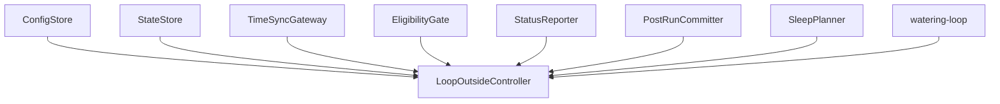

# Design Document

## Overview

`iot-arduino-loop-outside-control` は、灌水 loop の外側にある policy と orchestration の owner である。ここでは、設定読込、状態復元、WiFi / NTP、eligibility 判定、telemetry / display policy、post-run persistence commit、sleep planning を 1 本の制御サイクルとしてまとめる。

この設計では feature をこれ以上分割しない。代わりに feature の内部を `ConfigStore / StateStore / TimeSyncGateway / EligibilityGate / StatusReporter / PostRunCommitter / SleepPlanner / LoopOutsideController` に分け、tasks phase でそのまま実装順へ落とせる seam を作る。

### Goals

- `loop entry` までの判断を 1 つの controller path に固定する
- deep sleep restart と full power loss restart の扱いを同じ state boundary で表現する
- telemetry failure を non-blocking warning として扱う flow を設計上固定する
- `watering-loop` から受け取る outcome を post-run persistence と sleep planning に確実につなぐ

### Non-Goals

- relay / ISR / pulse counting の実装
- loop 内の瞬時流量、積算水量、stop 判定
- persisted setting editor
- remote configuration

## Boundary Commitments

### This Spec Owns

- `ControllerConfig`, `PersistentState`, `TimeContext`, `LoopEntryDecision`, `TelemetryWarning`, `FinalStatus`, `SleepPlan` の型
- configuration 読込と validation の entrypoint
- EEPROM / RTC memory の read/write boundary
- WiFi connect と NTP sync の wrapper boundary
- eligibility decision pipeline
- post-run persistence commit policy
- final display / telemetry / sleep planning call order

### Out of Boundary

- pulse interrupt handler
- flow formula and accumulation formula execution
- relay pin toggling
- loop-internal timeout measurement details

### Allowed Dependencies

- Arduino / ESP32 runtime
- `WiFi`
- time sync utility
- EEPROM access utility
- OLED display library
- Blynk client library
- `iot-arduino-watering-loop` public contract

### Revalidation Triggers

- persistent field set changes
- `LoopEntryDecision` field changes
- `LoopOutcome` field changes
- telemetry policy changes
- sleep planning rule changes

## Architecture

### Architecture Pattern & Boundary Map



**Architecture Integration**

- Selected pattern: single controller feature with internal services
- Owner rule: loop 外の policy は `loop-outside-control` に集約し、`watering-loop` はその policy を再解釈しない
- Open-point resolution: `network / eligibility / observability` を feature に分け直さず、内部 service seam として保つ

### Technology Stack

| Layer | Choice | Role | Notes |
|-------|--------|------|-------|
| Language | Arduino C++ | implementation language | ESP32 target |
| Persistence | EEPROM + RTC memory | restart boundary | byte layout は tasks phase |
| Connectivity | WiFi + NTP utility | current time validity | stale time を許さない |
| Reporting | OLED + Blynk | observability | telemetry failure is warning-only |

## File Structure Plan

### Directory Structure

```text
src/
├── irrigation_controller.ino
├── loop_outside_control/
│   ├── controller_config.h
│   ├── controller_config.cpp
│   ├── state_store.h
│   ├── state_store.cpp
│   ├── time_sync_gateway.h
│   ├── time_sync_gateway.cpp
│   ├── eligibility_gate.h
│   ├── eligibility_gate.cpp
│   ├── status_reporter.h
│   ├── status_reporter.cpp
│   ├── post_run_committer.h
│   ├── post_run_committer.cpp
│   ├── sleep_planner.h
│   ├── sleep_planner.cpp
│   ├── loop_outside_controller.h
│   └── loop_outside_controller.cpp
└── watering_loop/
    ├── watering_loop.h
    └── watering_loop.cpp
```

### Modified Files

- `src/irrigation_controller.ino` - thin top-level `setup` / `loop` entry
- `src/loop_outside_control/controller_config.*` - compile-time config contract
- `src/loop_outside_control/state_store.*` - EEPROM / RTC memory boundary
- `src/loop_outside_control/time_sync_gateway.*` - WiFi / NTP wrapper
- `src/loop_outside_control/eligibility_gate.*` - loop entry decision
- `src/loop_outside_control/status_reporter.*` - OLED / Blynk policy
- `src/loop_outside_control/post_run_committer.*` - post-run persistence write
- `src/loop_outside_control/sleep_planner.*` - next sleep calculation
- `src/loop_outside_control/loop_outside_controller.*` - controller pipeline

## System Flow

```mermaid
sequenceDiagram
    participant Entry as irrigation_controller.ino
    participant Outside as LoopOutsideController
    participant Loop as watering-loop
    Entry->>Outside: runCycle()
    Outside->>Outside: load config and state
    Outside->>Outside: connect WiFi and sync time
    Outside->>Outside: decide should_water
    alt should_water
        Outside->>Loop: runLoop(loopInput)
        Loop-->>Outside: loopOutcome
        Outside->>Outside: commit post-run state
    else no-run
        Outside->>Outside: build skip status
    end
    Outside->>Outside: render status, publish telemetry if possible
    Outside->>Outside: plan next sleep
    Outside-->>Entry: finalStatus + sleepPlan
```

## Requirements Traceability

| Requirement | Summary | Components | Contracts |
|-------------|---------|------------|-----------|
| 1 | compile-time config boundary | ConfigStore | `ControllerConfig` |
| 2 | restart and persistence boundary | StateStore | `PersistentState` |
| 3 | loop entry decision | TimeSyncGateway, EligibilityGate, LoopOutsideController | `TimeContext`, `LoopEntryDecision` |
| 4 | non-blocking telemetry policy | StatusReporter | `TelemetryWarning`, `FinalStatus` |
| 5 | post-run commit and sleep plan | PostRunCommitter, SleepPlanner, LoopOutsideController | `SleepPlan`, `FinalStatus` |

## Components and Interfaces

### Component Summary

| Component | Intent | Dependencies | Exposes |
|-----------|--------|--------------|---------|
| ConfigStore | configuration source | none | `loadControllerConfig()` |
| StateStore | EEPROM / RTC memory read-write | EEPROM / RTC | `loadPersistentState()`, `savePostRunState()` |
| TimeSyncGateway | WiFi and time validity | WiFi, NTP | `resolveTimeContext()` |
| EligibilityGate | run / no-run decision | Config, State, TimeContext | `decideLoopEntry()` |
| StatusReporter | OLED / Blynk policy | Display, Blynk | `renderPreRunStatus()`, `renderFinalStatus()`, `publishTelemetry()` |
| PostRunCommitter | persistence owner | StateStore | `commitAfterLoop()` |
| SleepPlanner | next wake plan | Config, TimeContext | `buildSleepPlan()` |
| LoopOutsideController | top-level orchestration | all above + `watering-loop` | `runCycle()` |

### Data Contracts

```cpp
struct ControllerConfig {
  int targetHour;
  int targetMinute;
  int targetSecond;
  int wateringIntervalDays;
  float targetIrrigationLiters;
  int wateringTimeoutMinutes;
  int targetTimeToleranceMinutes;
  uint32_t maxSleepSeconds;
  uint32_t periodMs;
  float flowCoefficientCf;
  const char* wifiSsid;
  const char* wifiPassword;
  const char* ntpServer;
  const char* cloudToken;
};

struct PersistentState {
  uint32_t lastWateringUnixTime;
  bool alreadyWateredToday;
  int wateredDayOfYear;
  uint8_t networkRetryCount;
};

struct TimeContext {
  bool networkAvailable;
  bool timeAvailable;
  uint32_t currentUnixTime;
  int currentDayOfYear;
};

struct LoopEntryDecision {
  bool shouldWater;
  const char* decisionReason;
};

struct TelemetryWarning {
  bool telemetryFailed;
  const char* warningReason;
};

struct FinalStatus {
  const char* primaryReason;
  TelemetryWarning telemetryWarning;
  float finalFlowLpm;
  float finalIrrigationLiters;
};

struct SleepPlan {
  uint32_t sleepSeconds;
};
```

### LoopOutsideController

| Field | Detail |
|-------|--------|
| Intent | loop 外 policy pipeline |
| Requirements | 2, 3, 4, 5 |

##### Service Interface
```cpp
struct CycleResult {
  FinalStatus finalStatus;
  SleepPlan sleepPlan;
};

CycleResult runCycle();
```

**Responsibilities & Constraints**

- `irrigation_controller.ino` は `runCycle()` 呼び出しと deep sleep entry だけを担い、policy logic を持ち込まない
- current time が無い場合は `no-run` を返し、`watering-loop` を呼ばない
- `LoopEntryDecision` と config 値から `LoopInput` を組み立てて `watering-loop` へ渡す
- `watering-loop` が `wateringCompleted = true` を返したら timeout でも post-run commit を行う
- `LoopOutcome` を `FinalStatus` と `SleepPlan` に束ねて top-level entry へ返す
- telemetry failure は `TelemetryWarning` に変換し、cycle を fail にしない
- final relay-off check は `watering-loop` outcome と adapter state で確認する

### StatusReporter

| Field | Detail |
|-------|--------|
| Intent | user-facing and cloud-facing status policy |
| Requirements | 4 |

##### Service Interface
```cpp
void renderPreRunStatus(const TimeContext& timeContext, const LoopEntryDecision& decision);
void renderFinalStatus(const FinalStatus& finalStatus, const SleepPlan& sleepPlan);
TelemetryWarning publishTelemetry(
  float currentFlowLpm,
  float currentIrrigationLiters,
  bool wateringActive
);
```

**Design Decisions**

- telemetry send failure is converted to `TelemetryWarning`
- OLED rendering and Blynk publishing are coordinated here, but neither decides watering eligibility
- skip path and loop-complete path both use `FinalStatus`

## Risks and Mitigations

- Risk: loop 外 feature が太りすぎる
  - Mitigation: internal service seam を design で先に固定する
- Risk: state boundary と eligibility helper が tasks で混ざる
  - Mitigation: `PersistentState`, `TimeContext`, `LoopEntryDecision` を contract として先に固定する
- Risk: telemetry failure が実装時に blocker として扱われる
  - Mitigation: `TelemetryWarning` を explicit contract にする
