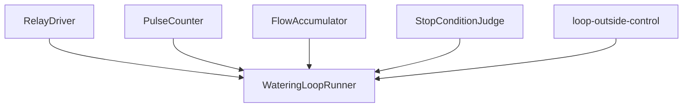
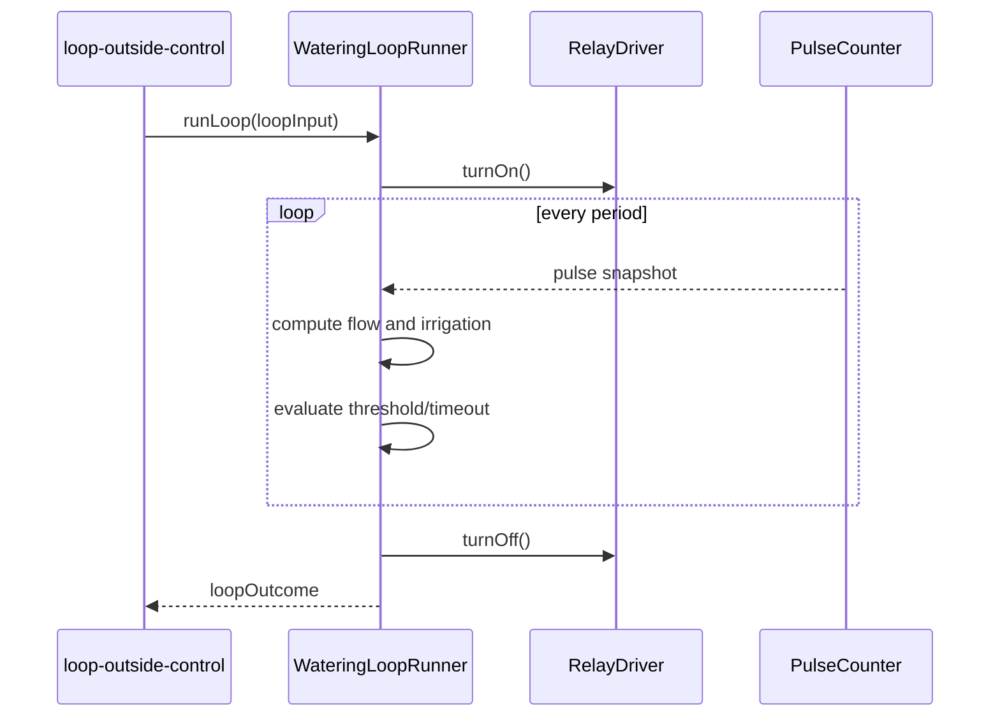

# Design Document

## Overview

`iot-arduino-watering-loop` は、灌水 loop の内側にある execution owner である。ここでは、relay を開く、pulse を数える、流量と積算水量を更新する、threshold / timeout で止める、という一連の loop を concrete contract として固定する。

この設計では feature をさらに割らず、内部を `RelayDriver / PulseCounter / FlowAccumulator / StopConditionJudge / WateringLoopRunner` に分ける。loop 外の policy はここへ持ち込まず、`LoopInput` を受け取って `LoopOutcome` を返すことに集中する。

### Goals

- ISR を含む pulse counting と main loop 計算を同じ feature 内で閉じる
- threshold stop と timeout stop の両方を 1 つの runner に統合する
- timeout 停止でも post-run commit できる outcome contract を返す
- relay fail-safe を tasks phase で実装可能な形へ落とす

### Non-Goals

- WiFi / NTP / eligibility decision
- EEPROM / RTC memory 更新
- OLED / Blynk policy
- deep sleep planning

## Boundary Commitments

### This Spec Owns

- `LoopInput`, `LoopSample`, `LoopOutcome`, `StopConditionState` の型
- relay adapter boundary
- pulse ISR counter and snapshot boundary
- flow and irrigation accumulation step
- threshold / timeout stop evaluation
- loop runner and fail-safe stop path

### Out of Boundary

- current time validity
- duplicate prevention
- post-run persistence commit
- telemetry warning policy

### Allowed Dependencies

- Arduino / ESP32 runtime
- interrupt API
- GPIO digital write/read
- monotonic millisecond clock
- `loop-outside-control` public contracts

### Revalidation Triggers

- `LoopInput` field changes
- `LoopOutcome` field changes
- period or timeout measurement rule changes
- relay fail-safe rule changes

## Architecture

### Architecture Pattern & Boundary Map



**Architecture Integration**

- Selected pattern: single runner with internal adapters
- Owner rule: `watering-loop` is the only owner of relay on/off sequencing and pulse-derived calculation
- Open-point resolution: display / telemetry callbacks are not pulled into the loop; only values needed by loop outside control are returned

### Technology Stack

| Layer | Choice | Role | Notes |
|-------|--------|------|-------|
| Language | Arduino C++ | implementation language | ESP32 target |
| Timing | `millis()` style monotonic time | timeout and period | wraparound-safe arithmetic required |
| Interrupts | GPIO interrupt API | pulse counting | atomic snapshot in tasks |
| GPIO | relay pin control | actuator output | fail-safe off path |

## File Structure Plan

### Directory Structure

```text
src/
├── watering_loop/
│   ├── watering_loop.h
│   ├── watering_loop.cpp
│   ├── relay_driver.h
│   ├── relay_driver.cpp
│   ├── pulse_counter.h
│   ├── pulse_counter.cpp
│   ├── flow_accumulator.h
│   ├── flow_accumulator.cpp
│   ├── stop_condition_judge.h
│   └── stop_condition_judge.cpp
└── loop_outside_control/
    ├── loop_outside_controller.h
    └── loop_outside_controller.cpp
```

### Modified Files

- `src/watering_loop/watering_loop.*` - loop runner and public contract
- `src/watering_loop/relay_driver.*` - relay adapter
- `src/watering_loop/pulse_counter.*` - ISR-safe pulse count snapshot
- `src/watering_loop/flow_accumulator.*` - instantaneous flow and cumulative irrigation calculation
- `src/watering_loop/stop_condition_judge.*` - threshold / timeout stop evaluation

## System Flow



## Requirements Traceability

| Requirement | Summary | Components | Contracts |
|-------------|---------|------------|-----------|
| 1 | fail-safe relay handling | RelayDriver, WateringLoopRunner | `LoopOutcome`, relay adapter |
| 2 | pulse count and flow formula | PulseCounter, FlowAccumulator | `LoopSample` |
| 3 | cumulative irrigation and stop conditions | FlowAccumulator, StopConditionJudge | `StopConditionState`, `LoopOutcome` |
| 4 | loop outcome contract | WateringLoopRunner | `LoopOutcome` |

## Components and Interfaces

### Component Summary

| Component | Intent | Dependencies | Exposes |
|-----------|--------|--------------|---------|
| RelayDriver | actuator pin adapter | GPIO | `turnOn()`, `turnOff()` |
| PulseCounter | interrupt count owner | interrupt API | `reset()`, `snapshot()` |
| FlowAccumulator | formula execution | PulseCounter snapshot | `computeSample()` |
| StopConditionJudge | stop decision | elapsed time, irrigation total | `evaluateStop()` |
| WateringLoopRunner | orchestrates loop | all above | `runLoop()` |

### Data Contracts

```cpp
struct LoopInput {
  float targetIrrigationLiters;
  uint32_t wateringTimeoutMs;
  uint32_t periodMs;
  float flowCoefficientCf;
};

struct LoopSample {
  uint32_t elapsedMs;
  uint32_t pulseCount;
  float flowLpm;
  float cumulativeIrrigationLiters;
};

struct StopConditionState {
  bool thresholdReached;
  bool timeoutReached;
};

struct LoopOutcome {
  const char* stopReason;
  uint32_t elapsedSeconds;
  float finalFlowLpm;
  float finalIrrigationLiters;
  bool wateringCompleted;
  bool relayOffConfirmed;
};
```

### WateringLoopRunner

| Field | Detail |
|-------|--------|
| Intent | loop execution owner |
| Requirements | 1, 2, 3, 4 |

##### Service Interface
```cpp
LoopOutcome runLoop(const LoopInput& input);
```

**Responsibilities & Constraints**

- `should_water = true` の場合にだけ runner が呼ばれる前提を受ける
- caller は `LoopEntryDecision` を `LoopInput` へ変換して渡し、本 feature は loop 外 policy を再判断しない
- runner 開始時に pulse counter を reset する
- period ごとに pulse snapshot を読み、flow / irrigation を更新する
- threshold か timeout のどちらかを満たしたら loop を抜ける
- exit path では必ず relay を OFF にし、`relayOffConfirmed` を outcome に入れる
- `LoopOutcome` は caller が `FinalStatus` と post-run commit に変換できる粒度で返す

### PulseCounter

| Field | Detail |
|-------|--------|
| Intent | ISR-owned pulse count |
| Requirements | 2 |

##### Service Interface
```cpp
void onPulseFallingEdge();
void resetPulseCounter();
uint32_t snapshotPulseCount();
```

**Design Decisions**

- ISR increments a volatile counter only
- `snapshotPulseCount()` is the only read path visible to runner
- wraparound-safe elapsed time calculation is left to runner, not ISR

## Risks and Mitigations

- Risk: ISR and runner share mutable state unsafely
  - Mitigation: snapshot boundary を `PulseCounter` に閉じる
- Risk: timeout stop and threshold stop diverge in implementation
  - Mitigation: `StopConditionJudge` を 1 か所に固定する
- Risk: relay off path is skipped on exceptional exit
  - Mitigation: `LoopOutcome` に `relayOffConfirmed` を含め、tasks で必須テスト対象にする
