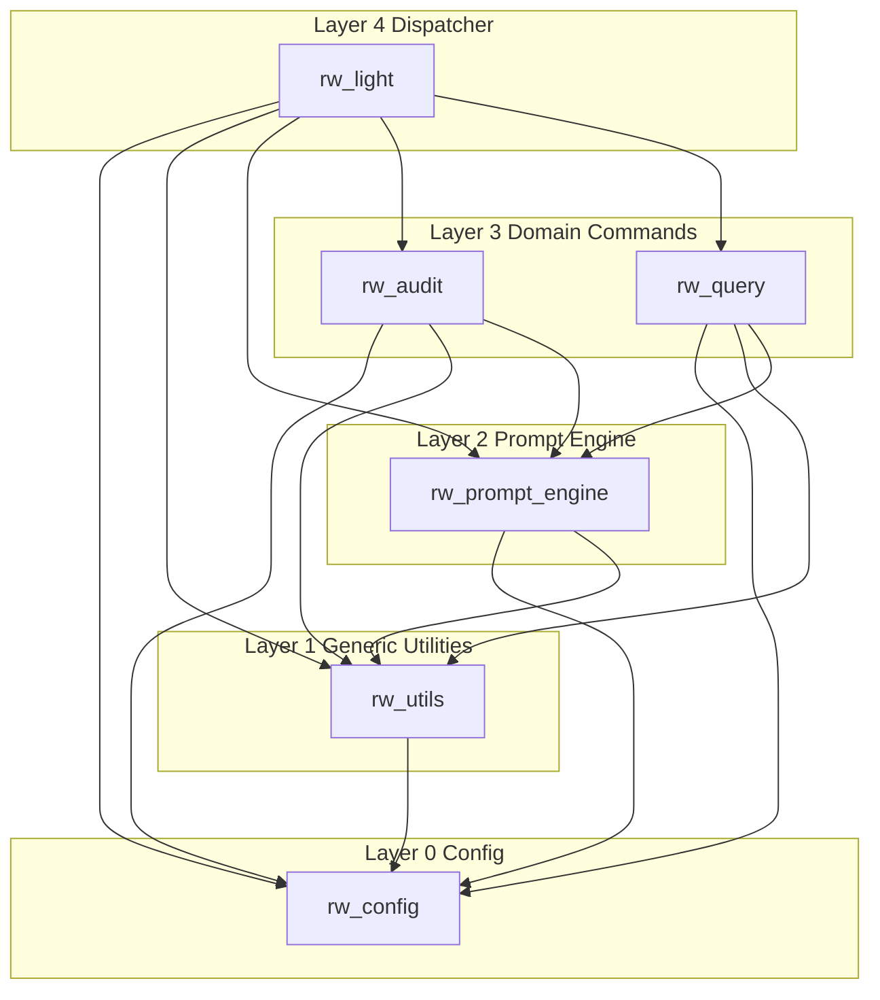
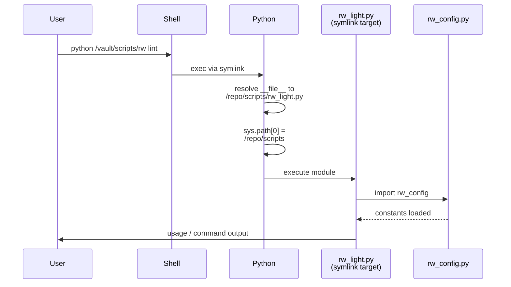
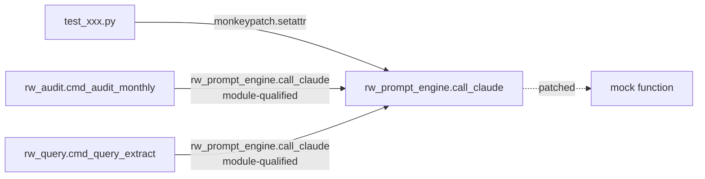
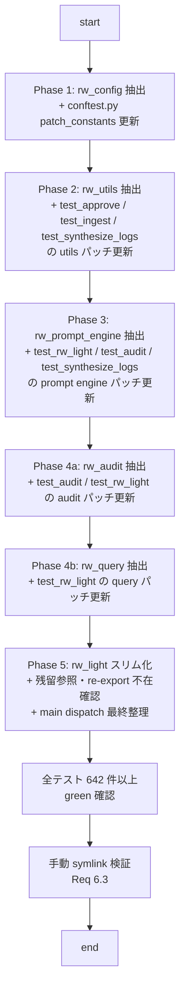

# Design Document — module-split

## Overview

**Purpose**: `scripts/rw_light.py`（現 3,827 行）を 6 つの責務単位モジュールに分割し、長期保守性を向上させる。CLI の外部動作・テスト結果・公開 API は分割前と完全一致を維持する。

**Users**: Rwiki プロジェクトの開発者・メンテナー。エンドユーザー（Vault オペレーター）から見た挙動は不変。

**Impact**: `scripts/` 配下のコード構造が単一ファイルから 6 ファイル構成に変わる。テスト側の `monkeypatch` 参照先が各サブモジュールに置換される。外部ユーザーの実行コマンド・出力・exit code は一切変化しない。

### Goals

- `rw_light.py` を 6 モジュールに分割し、各モジュール 1,500 行以内に収める（Req 1.2）。
- モジュール間依存を DAG に保つ（Req 2.1）。
- テストの `monkeypatch` パッチ先を各定義モジュールに正しく配置し、パッチが実装呼び出し経路に作用することを保証（Req 3.2, Req 4.1–4.6）。
- 全 642 件以上のテストがグリーンを維持（Req 5.1）。
- `scripts/rw_light.py` の CLI 起動パス・symlink 経由起動を保持（Req 6.1–6.3）。

### Non-Goals

- コマンドの動作変更・新機能追加・テストロジックの変更（パッチ対象の機械的更新のみ許可）。
- `rw_light` の外部 API シグネチャ変更。
- `scripts/` のパッケージ化（`__init__.py` 追加、namespace パッケージ化等）。
- `rw` シンボリックリンクの配置ロジック変更、`DEV_ROOT` 解決方式の変更。
- ドメインロジック（audit チェック・query lint 等）の実装内容への変更。
- 移動したシンボルへの `rw_light.<symbol>` 形式の後方互換 re-export（Req 1.3 で禁止明示。全テスト・全ドキュメント・全外部コードは `rw_<module>.<symbol>` 形式で参照する）。

> **Re-export 戦略の確定（review-driven update, AC 1.3 再評価後）**: 初稿では `call_claude` のみ re-export（当時の AC 1.3 基準）とし、レビューで判明した約 299 件のテスト直接アクセス（test_rw_light.py 208, test_utils.py 28, test_audit.py 23, test_lint_query.py 22, test_git_ops.py 7, conftest.py 5, test_init.py 2, test_lint.py 2, test_conftest_fixtures.py 2）に対しては、一時、網羅 re-export 案（Option A）が検討された。しかし fundamental review で以下が指摘された:
> - 網羅 re-export は `rw_light.py` を Facade + Proxy 化させ、テストから見ると分割効果がゼロになる
> - patch 先（`rw_audit.X`）と access 先（`rw_light.X`）の非対称ルールは認知負荷を生む
> - 新規シンボル追加時の re-export 漏れインシデントが永続化する
>
> その後 AC 1.3 自体の再評価が行われ、**repo 内に `rw_light.call_claude` を import して使用する外部運用スクリプトが一切存在しないことが grep で確認された**（使用箇所はテスト 10 件 + docs/developer-guide.md 2 件 + spec ドキュメントのみ、Vault デプロイは CLI 起動のため無関係）。よって AC 1.3 を廃止し、最終方針を **Option B 純粋版 = re-export ゼロ + テスト本体のコード行 `rw_light.<symbol>` 直接アクセス全書き換え（docstring / コメント内言及は対象外）**に確定する。rw_light.py に `from rw_prompt_engine import call_claude` 行は**一切追加しない**。テスト側 `call_claude` 直接アクセスの書き換え対象は tests/test_rw_light.py L280/297/314/336/2582/2598/2615/2633/2648/2662 の 10 件 + tests/test_conftest_fixtures.py L107/L119 の 2 件 = **計 12 件**（すべてコード行）。tests/conftest.py L231 の `rw_light.call_claude` は **docstring 内例示のため書き換え対象外**（pytest 動作に影響せず、docs 同期タスクで別途更新）。詳細は「Components and Interfaces > rw_light」および Migration Strategy の各 Phase X.2 タスク参照。

> **Follow-up Obligation（実装完了後）**: `docs/developer-guide.md` L188-190 の呼び出し経路表を更新（`rw_light.call_claude` → `rw_prompt_engine.call_claude`、`rw_light.call_claude_for_log_synthesis` → `rw_prompt_engine.call_claude_for_log_synthesis`）。加えて `tests/conftest.py` L231 docstring 内の `rw_light.call_claude` 例示も同時に更新する（本スペック Phase 5 完了後の docs 同期作業として扱う — 既存の「`/kiro-steering` で structure.md 更新」と同時実施）。
- 既存関数シグネチャの命名変更（`_git_list_files`, `_compute_run_status` 等のアンダースコア接頭辞は `rw_utils` 移動後に「モジュール内 private」慣習と矛盾するが、Non-Goal「外部 API シグネチャ変更禁止」を優先し維持する）。

## Boundary Commitments

### This Spec Owns

- `scripts/rw_light.py` 単一ファイルを 6 モジュール（`rw_config.py`, `rw_utils.py`, `rw_prompt_engine.py`, `rw_audit.py`, `rw_query.py`, `rw_light.py`）に分割する作業。
- 各モジュールへの関数・定数・コマンドハンドラの物理配置決定。
- モジュール間 import 文の追加・調整（`<module>.<symbol>` 修飾参照の採用）。
- テストコード（`tests/conftest.py`, `tests/test_*.py`）の `monkeypatch` パッチ先を各サブモジュールに更新する作業。
- `rw_light.py` 内に移動済みシンボルの再 import / re-export を一切追加しない設計（Req 1.3）。

### Out of Boundary

- コマンド動作・CLI 引数・出力フォーマット・exit code の変更。
- テストアサーション・テストロジック・fixture 内容の変更（patch 先の文字列更新のみ許可）。
- 新規機能追加・既存バグ修正・性能改善。
- `tests/conftest.py` の `patch_constants` フィクスチャの構造変更（参照先のみ更新）。
- `docs/` 配下のユーザー向けドキュメントの更新（内部構造の変更はユーザーには見えない）。
- `pyproject.toml` / `pytest.ini` / `requirements.txt` への変更。
- `rw` symlink のデプロイロジック（`cmd_init`）の変更。

### Allowed Dependencies

- Python 3.10+ 標準ライブラリのみ（外部依存を追加しない — steering の Key Decision 準拠）。
- 既存の `claude` CLI（`subprocess.run`）の呼び出し方式は不変。
- 既存の `AGENTS/` プロンプトテンプレート・`templates/` を読み取る挙動は不変。

### Revalidation Triggers

以下の変更が発生した場合、このスペックの再検証が必要：

- 新規 CLI コマンドが追加される場合 → 本設計のディスパッチ層（`rw_light.main()`）と帰属モジュール判断基準を更新。
- モジュール間の依存方向に変更が生じる場合（例: `rw_query` が `rw_audit` を参照するような機能追加）→ Req 2 の DAG 制約を再評価。
- `monkeypatch` 以外の patch 方式（`mocker.patch`, `unittest.mock.patch` 等）が導入される場合 → Req 4 の「パッチ先正確性」適用範囲を再評価。
- `scripts/` のパッケージ化（`__init__.py` 追加）が検討される場合 → Req 6 AC3 の symlink 解決ロジックを再確認。

### Follow-up Obligations

本スペック実装完了後、以下の作業が必要（スペック本体の Boundary 外だが、プロジェクト全体の整合性維持のため）：

- **Steering sync**: `.kiro/steering/structure.md` の「モノリシック CLI」「単一ファイル集約」記述が古くなる。実装完了後に `/kiro-steering` 実行で「6 モジュール構成」に更新する。本スペックのタスクには含めず、実装完了後の別作業として扱う。

## Architecture

### Existing Architecture Analysis

現行 `rw_light.py` は以下の構造を持つモノリス:

- L1–83: import 文 + 全グローバル定数（パス・ドメイン）
- L89–315: ユーティリティ関数（ファイル I/O, git, frontmatter, 日付）
- L317–760: `cmd_lint`, `cmd_ingest`, `cmd_synthesize_logs`, `cmd_approve` の実装
- L753–1180: プロンプトエンジン（`call_claude`, `load_task_prompts`, `read_wiki_content`, `read_all_wiki_content`, `_git_list_files`）
- L1181–2708: audit 系関数（`check_*`, `run_*_checks`, `build_audit_prompt`, `parse_audit_response`, `_run_llm_audit`, `cmd_audit_*`）
- L2715–3540: query 系関数（`cmd_query_extract/answer/fix`, `cmd_lint_query`, `lint_single_query_dir`, query 検査関数群）
- L3542–3826: `cmd_init` + `print_usage` + `main` + `if __name__ == "__main__"`

この構造を保ちつつ、物理ファイル境界を機能単位に切り直す。既存のコード順序・ロジック・制御フローは変更せず、切り出し先に機械的に移動する。

### Architecture Pattern & Boundary Map

**選択パターン**: 責務別レイヤ分割（フラットモジュール構成）



**Key Decisions**:

- **Selected pattern**: 5 層のフラットモジュール構成（階層は論理的、物理的にはすべて `scripts/` 直下）。パッケージ化しないことで symlink デプロイの import 解決を標準動作に委ねる。
- **Domain boundaries**: Layer 0（定数）→ Layer 1（汎用 util）→ Layer 2（LLM 関連）→ Layer 3（コマンド実装）→ Layer 4（ディスパッチ）。各層は自分より下位の層のみを import する。
- **Existing patterns preserved**: 「単一ファイル集約」から「ファイル分割」へ切り替わるが、関数の実装内容・命名規約・snake_case・型ヒント等の慣習は保持（steering `structure.md` 準拠）。
- **New components rationale**: 新規モジュールはすべて「現行 `rw_light.py` の論理区画を物理ファイルに切り出したもの」。追加機能はない。
- **Steering compliance**: 外部依存なし、Python 標準ライブラリのみ、2 スペースインデント、型ヒント完全対応を維持。

### Technology Stack

| Layer | Choice / Version | Role in Feature | Notes |
|-------|------------------|-----------------|-------|
| Runtime | Python 3.10+ | 分割後の全モジュールの実行環境 | 変更なし |
| CLI | argparse（標準ライブラリ） | `rw_light.main()` のディスパッチ | 変更なし |
| Test | pytest + monkeypatch | パッチ先を各サブモジュールに更新 | 既存 fixture 利用 |
| External | Claude CLI（`subprocess`） | `rw_prompt_engine.call_claude` 内で呼び出し | 変更なし |

## File Structure Plan

### Directory Structure

```
scripts/
├── rw_config.py          # 全グローバル定数（パス + ドメイン）
├── rw_utils.py           # 汎用ユーティリティ（I/O, git, frontmatter, 日付, status/exit計算）
├── rw_prompt_engine.py   # Claude 呼び出し + プロンプト構築 + Wiki 読み込み
├── rw_audit.py           # audit コマンド + チェック関数群
├── rw_query.py           # query コマンド + query lint 関数群
└── rw_light.py           # 残存コマンド + main() + ディスパッチ（re-export なし）
```

> `scripts/__init__.py` は作成しない。Python の symlink 解決機構が `sys.path[0]` に `scripts/` を自動で入れるため、サブモジュールは追加設定なしで発見される（研究ログ参照）。

### New Files

- **`scripts/rw_config.py`** (~100 行): 全グローバル定数を集約。他のどのサブモジュールも import しない（DAG 最下層）。
  - パス定数: `ROOT`, `RAW`, `INCOMING`, `LLM_LOGS`, `REVIEW`, `SYNTH_CANDIDATES`, `QUERY_REVIEW`, `WIKI`, `WIKI_SYNTH`, `LOGDIR`, `LINT_LOG`, `QUERY_LINT_LOG`, `INDEX_MD`, `CHANGE_LOG_MD`, `CLAUDE_MD`, `AGENTS_DIR`, `DEV_ROOT`
  - ドメイン定数: `ALLOWED_QUERY_TYPES`, `INFERENCE_PATTERNS`, `EVIDENCE_SOURCE_PATTERNS`, `VAULT_DIRS`, `LARGE_WIKI_THRESHOLD`, `_VALID_SEVERITIES`, `_FAIL_SEVERITIES`

- **`scripts/rw_utils.py`** (~400 行): ドメイン非依存の汎用ユーティリティ。`rw_config` のみ import。
  - 日付: `today`, `is_valid_iso_date`
  - パス: `relpath`, `ensure_dirs`, `is_existing_vault`
  - ファイル I/O: `read_text`, `write_text`, `append_text`, `read_json`, `safe_read_json`
  - frontmatter: `has_frontmatter`, `parse_frontmatter`, `build_frontmatter`, `ensure_basic_frontmatter`, `first_h1`, `infer_source_from_path`, `slugify`
  - ディレクトリスキャン: `list_md_files`, `list_query_dirs`
  - git: `git_status_porcelain`, `git_path_is_dirty`, `warn_if_dirty_paths`, `git_commit`, `_git_list_files`
  - severity/status: `_compute_run_status`, `_compute_exit_code`（全コマンド共有ヘルパ）

- **`scripts/rw_prompt_engine.py`** (~600 行、実測ベース): Claude 呼び出しとプロンプト/入力データ構築。`rw_config`, `rw_utils` を import。`_validate_agents_severity_vocabulary`（120 行）が最大関数。
  - Claude 呼び出し: `call_claude`, `call_claude_for_log_synthesis`
  - エージェントマッピング: `parse_agent_mapping`, `load_task_prompts`
  - AGENTS severity 用語検証: `_validate_agents_severity_vocabulary`（`load_task_prompts` 内部で audit タスク時に呼ばれるため密結合）
  - プロンプト構築: `build_query_prompt`
  - Wiki コンテンツリーダ: `read_wiki_content`, `read_all_wiki_content`

- **`scripts/rw_audit.py`** (~1,470 行、実測ベース — ⚠️ 1,500 行制限への余裕が **~30 行**): audit コマンドとチェック関数群。`rw_config`, `rw_utils`, `rw_prompt_engine` を import。`parse_audit_response`（158 行）, `build_audit_prompt`（129 行）, `_run_llm_audit`（125 行）, `generate_audit_report`（118 行）など大型関数が集中。実装時に import 文・blank 行・エラーハンドリングで 1,500 行を超過する可能性あり（Req 1.2 違反リスク）。超過時は rw_audit をさらに分割するフォローアップスペックを起票（例: check 関数群を `rw_audit_checks.py` へ分離し rw_audit は LLM audit + コマンド層に限定）。本スペック範囲内での追加分割は Out of Boundary。
  - 型定義（NamedTuple）: `class Finding`, `class WikiPage`（audit 内部の型、他モジュールからは参照しない）
  - チェック関数: `check_broken_links`, `check_index_registration`, `check_frontmatter`, `check_orphan_pages`, `check_bidirectional_links`, `check_naming_convention`, `check_source_field`, `check_required_sections`
  - チェック支援: `_resolve_link`（`check_broken_links` 内部ヘルパ）
  - データ準備: `validate_wiki_dir`, `load_wiki_pages`, `get_recent_wiki_changes`
  - severity 正規化: `_normalize_severity_token`, `_record_drift`（audit 内部でのみ使用）
  - チェック実行: `run_micro_checks`, `run_weekly_checks`
  - LLM audit: `build_audit_prompt`, `parse_audit_response`, `generate_audit_report`, `print_audit_summary`, `_run_llm_audit`
  - ディスパッチ: `cmd_audit`（tier 引数で micro/weekly/monthly/quarterly に分岐する統括関数）
  - コマンド: `cmd_audit_micro`, `cmd_audit_weekly`, `cmd_audit_monthly`, `cmd_audit_quarterly`

- **`scripts/rw_query.py`** (~820 行、実測ベース): query 系コマンドと query lint。`rw_config`, `rw_utils`, `rw_prompt_engine` を import。`cmd_query_extract`（167 行）, `cmd_query_fix`（121 行）, `cmd_query_answer`（99 行）が大型。1,500 行制限に 680 行の余裕あり。
  - ヘルパ: `generate_query_id`, `write_query_artifacts`, `parse_extract_response`, `parse_fix_response`, `_strip_code_block`（query レスポンスパース内部ヘルパ）
  - query lint 検査: `count_evidence_blocks`, `contains_markdown_structure`, `has_query_text`, `extract_query_type`, `extract_scope`, `has_evidence_source`, `contains_inference_language`
  - lint 実行: `lint_single_query_dir`, `print_query_lint_text`
  - コマンド: `cmd_query_extract`, `cmd_query_answer`, `cmd_query_fix`, `cmd_lint_query`

### Modified Files

- **`scripts/rw_light.py`** — 大幅縮小（~3,827 行 → ~700 行見積）。
  - 保持: `cmd_lint`（~70 行）, `cmd_ingest` + `plan_ingest_moves` + `execute_ingest_moves` + `load_lint_summary`（~100 行）, `cmd_synthesize_logs` + `parse_topics` + `render_candidate_note` + `candidate_note_path`（~100 行）, `cmd_approve` + `candidate_files` + `approved_candidate_files` + `synthesis_target_path` + `merge_synthesis` + `promote_candidate` + `mark_candidate_promoted` + `update_index_synthesis` + `append_approval_log`（~150 行）, `cmd_init` + `_backup_timestamp`（~200 行）, `print_usage` + `main` + `if __name__ == "__main__"` ブロック（~100 行）
  - 追加: サブモジュール import（`import rw_config`, `import rw_utils`, `import rw_prompt_engine`, `import rw_audit`, `import rw_query`）
  - 追加: なし（Req 1.3 により re-export 禁止。`from rw_<module> import ...` 形式の文を `rw_light.py` に追加してはならない）
  - 既存の `import shutil`（`execute_ingest_moves` が使用）は保持。よって `test_ingest.py` の `monkeypatch.setattr(rw_light.shutil, "move", ...)` は分割後もそのまま有効で更新不要。

- **`tests/conftest.py`** — `patch_constants` fixture 内の `setattr(rw_light, "ROOT", ...)` 等 17 箇所を `setattr(rw_config, "ROOT", ...)` 等に置換。
- **`tests/test_rw_light.py`** — 6,827 行。`monkeypatch.setattr(rw_light, X, ...)` の X を各新モジュール参照に機械置換。最多の更新対象。severity 関連関数 `_validate_agents_severity_vocabulary`（→ `rw_prompt_engine`）, `_normalize_severity_token`（→ `rw_audit`）, `_record_drift`（→ `rw_audit`）の直接参照 7 件も対象。
- **`tests/test_audit.py`** — パス定数パッチを `rw_config` に更新。`read_all_wiki_content` / `read_wiki_content` / `load_task_prompts` パッチを `rw_prompt_engine` に更新。severity 関連関数 `_normalize_severity_token` / `_record_drift` / `_validate_agents_severity_vocabulary` の直接参照 17 件を該当モジュール（rw_audit / rw_prompt_engine）に更新。
- **`tests/test_approve.py`** — `git_path_is_dirty`, `warn_if_dirty_paths` パッチを `rw_utils` に更新。
- **`tests/test_synthesize_logs.py`** — `call_claude_for_log_synthesis` パッチを `rw_prompt_engine` に、`git_path_is_dirty` パッチを `rw_utils` に更新。
- **`tests/test_ingest.py`** — `git_commit` パッチ（15 箇所）を `rw_utils` に更新。`rw_light.shutil.move` パッチは `cmd_ingest` が rw_light 残留のため**更新不要**。

**test_lint.py, test_git_ops.py, test_utils.py, test_init.py, test_lint_query.py, test_agents_vocabulary.py, test_source_vocabulary.py, test_conftest_fixtures.py** については `monkeypatch.setattr(rw_light, ...)` の直接参照が無い／あるいは `conftest.py` のフィクスチャ経由でのみ関与するため、**patch 先更新の必要は軽微**（`conftest.py` 更新で自動追随）。**ただし Option B 採用により `rw_light.<symbol>` 形式の直接アクセス書き換えは別途必要**: test_utils.py 28 件、test_lint_query.py 22 件、test_git_ops.py 7 件、test_init.py 2 件、test_lint.py 2 件、test_conftest_fixtures.py 2 件は当該 Phase X.2 で機械置換対象（前述「直接アクセス書き換え」セクション参照）。

## System Flows

### Import 解決フロー（Vault Symlink 経由）



**Key Decisions**:
- `sys.path[0]` は実ターゲットの親ディレクトリ（= `scripts/`）に設定されるため、兄弟モジュールは `import <name>` で発見される。
- `rw_light.py` 側で `sys.path` 操作を行う必要はない（Req 6.3）。

### monkeypatch の実装呼び出し経路への作用



**Key Decisions**:
- サブモジュール内では必ず `rw_prompt_engine.call_claude(...)` のようにモジュール修飾で呼び出す。`from rw_prompt_engine import call_claude` を禁止。
- これにより `monkeypatch.setattr(rw_prompt_engine, "call_claude", mock)` が全呼び出し元に即時作用する（Req 4.1）。
- 同じルールを constants にも適用（`rw_config.ROOT` アクセス、`from rw_config import ROOT` 禁止）。Req 3.2 を保証。

### main() ディスパッチの書き換え例

既存 `main()` 内の `sys.exit(cmd_XXX(...))` 呼び出しは、関数の帰属モジュールに合わせて修飾参照に書き換える。以下が Phase 4a/4b/5 での変更例:

```python
# 変更前（すべて rw_light 内関数呼び出し）
if cmd == "lint":
    if len(sys.argv) >= 3 and sys.argv[2] == "query":
        sys.exit(cmd_lint_query(sys.argv[3:]))    # → rw_query.cmd_lint_query
    sys.exit(cmd_lint())                          # rw_light 残留、そのまま
if cmd == "ingest":
    sys.exit(cmd_ingest())                        # rw_light 残留、そのまま
if cmd == "query":
    if subcmd == "extract":
        sys.exit(cmd_query_extract(sys.argv[3:]))  # → rw_query.cmd_query_extract
    elif subcmd == "answer":
        sys.exit(cmd_query_answer(sys.argv[3:]))   # → rw_query.cmd_query_answer
    elif subcmd == "fix":
        sys.exit(cmd_query_fix(sys.argv[3:]))      # → rw_query.cmd_query_fix
if cmd == "audit":
    sys.exit(cmd_audit(sys.argv[2:]))              # → rw_audit.cmd_audit

# 変更後（修飾参照）
if cmd == "lint":
    if len(sys.argv) >= 3 and sys.argv[2] == "query":
        sys.exit(rw_query.cmd_lint_query(sys.argv[3:]))
    sys.exit(cmd_lint())  # rw_light 自身の関数はそのまま
if cmd == "audit":
    sys.exit(rw_audit.cmd_audit(sys.argv[2:]))
# ... 以下同様
```

**Key Decisions**:
- 自モジュールに残る関数（`cmd_lint`, `cmd_ingest`, `cmd_synthesize_logs`, `cmd_approve`, `cmd_init`）は修飾なしでそのまま呼び出し可。
- 移動した関数は必ず `rw_audit.XXX` / `rw_query.XXX` 形式で呼び出す。

## Requirements Traceability

| Requirement | Summary | Components | Interfaces | Flows |
|-------------|---------|------------|------------|-------|
| 1.1 | 6 モジュール責務分割 | `rw_config`, `rw_utils`, `rw_prompt_engine`, `rw_audit`, `rw_query`, `rw_light` | File Structure Plan の関数リスト | — |
| 1.2 | 各モジュール 1,500 行以内 | `rw_audit`（限界近い ~1,470 行）を中心に全モジュール | File Structure Plan の行数見積 + Rollback Triggers 行数超過条件 | — |
| 1.3 | 移動済みシンボルの re-export 禁止 | `rw_light.py` | re-export ブロックなし、import 文のみ | — |
| 2.1 | 依存グラフ DAG | 全モジュール | Architecture 図 | — |
| 2.2 | サブモジュールが `rw_light` を import しない | `rw_config`, `rw_utils`, `rw_prompt_engine`, `rw_audit`, `rw_query` | Architecture 図 | — |
| 3.1 | `rw_config` に全グローバル定数集約 | `rw_config` | File Structure Plan の定数リスト | — |
| 3.2 | `rw_config` パッチが全サブモジュールに反映 | 全モジュール | モジュール修飾参照規約 | monkeypatch 作用フロー |
| 4.1 | `call_claude` パッチ先 = `rw_prompt_engine` | `rw_prompt_engine`, `rw_audit`, `rw_query` | モジュール修飾参照規約 | monkeypatch 作用フロー |
| 4.2 | `load_task_prompts` パッチ先 = `rw_prompt_engine` | `rw_prompt_engine` | モジュール修飾参照規約 | — |
| 4.3 | `lint_single_query_dir` パッチ先 = `rw_query` | `rw_query` | モジュール修飾参照規約 | — |
| 4.4 | `today` パッチ先 = `rw_utils` | `rw_utils` | モジュール修飾参照規約 | — |
| 4.5 | `read_all_wiki_content` パッチ先 = `rw_prompt_engine` | `rw_prompt_engine` | research.md の Decision | — |
| 4.6 | `git_path_is_dirty`, `_git_list_files` パッチ先 = `rw_utils` | `rw_utils` | モジュール修飾参照規約 | — |
| 5.1 | 全テストグリーン（642 件以上） | 全テストファイル | pytest 実行 | — |
| 5.2 | サブモジュール import に `PYTHONPATH` 追加設定不要 | `tests/conftest.py` の既存 sys.path 操作 | Python 標準 import 解決 | Import 解決フロー |
| 6.1 | `scripts/rw_light.py` 実行可能性 | `rw_light.py` | `if __name__ == "__main__"` ブロック保持 | — |
| 6.2 | 引数なし実行時の usage 表示 | `rw_light.print_usage`, `main` | 既存ロジック保持 | — |
| 6.3 | symlink 経由実行時のサブモジュール発見 | Python 標準 `sys.path` 解決 | 追加設定なし | Import 解決フロー |

## Components and Interfaces

### Module Summary

| Component | Layer | Intent | Req Coverage | Key Dependencies (P0/P1) | Contracts |
|-----------|-------|--------|--------------|--------------------------|-----------|
| rw_config | 0 (Config) | 全グローバル定数の単一ソース | 1.1, 3.1, 3.2 | なし (P0) | State |
| rw_utils | 1 (Generic) | ドメイン非依存のユーティリティ | 1.1, 4.4, 4.6 | rw_config (P0) | Service |
| rw_prompt_engine | 2 (LLM) | Claude 呼び出しとプロンプト構築 | 1.1, 4.1, 4.2, 4.5 | rw_config (P0), rw_utils (P0) | Service |
| rw_audit | 3 (Domain) | audit コマンドとチェック関数群 | 1.1, 1.2 | rw_config, rw_utils, rw_prompt_engine (すべて P0) | Service |
| rw_query | 3 (Domain) | query コマンドと query lint | 1.1, 4.3 | rw_config, rw_utils, rw_prompt_engine (すべて P0) | Service |
| rw_light | 4 (Dispatch) | ディスパッチャ + 残存コマンドのみ（re-export なし、Req 1.3） | 1.1, 1.3, 6.1, 6.2, 6.3 | 上記 5 モジュール (すべて P0) | Service |

### Layer 0 — Configuration

#### rw_config

| Field | Detail |
|-------|--------|
| Intent | 全グローバル定数（パス・ドメイン）の単一ソース。テストからパッチする単一エンドポイント。 |
| Requirements | 1.1, 3.1, 3.2 |

**Responsibilities & Constraints**
- 全 `UPPER_CASE` 定数をこのモジュールに集約する。他のサブモジュールは constant を独自に定義しない。
- 関数を含まない（pure data モジュール）。
- 他のどのサブモジュールも import しない（DAG 最下層）。

**Dependencies**
- Inbound: `rw_utils`, `rw_prompt_engine`, `rw_audit`, `rw_query`, `rw_light` — 定数参照 (P0)
- Outbound: なし
- External: Python 標準 `pathlib.Path`, `re` のみ

**Contracts**: State

##### State Management
- 状態モデル: モジュールレベルの immutable 定数。ランタイムでは不変。
- 永続化・整合性: なし（定数のみ）。
- 並行性戦略: Python の GIL 下で定数読み込みは自動的にスレッドセーフ。

**Implementation Notes**
- Integration: 他のモジュールは `import rw_config` + `rw_config.ROOT` 形式で参照する。`from rw_config import ROOT` は禁止（Req 3.2 保証）。
- Validation: 分割後、ファイルの冒頭で定数ブロックが完結し、他のコードが続かないこと。
- Risks: `DEV_ROOT` は `__file__` 依存で動的計算される。`rw_config.py` の物理位置が `scripts/` 直下であれば `Path(__file__).resolve().parent.parent` で既存と同じ値が得られる。

### Layer 1 — Generic Utilities

#### rw_utils

| Field | Detail |
|-------|--------|
| Intent | ドメイン非依存のファイル I/O・git・frontmatter・日付・severity 判定等のユーティリティ集約。 |
| Requirements | 1.1, 4.4, 4.6 |

**Responsibilities & Constraints**
- ファイル I/O・git 操作・frontmatter 解析・日付取得・slug 化等の汎用処理。
- LLM・audit・query の固有ロジックを含まない。
- `rw_config` 以外のサブモジュールを import しない。

**Dependencies**
- Inbound: `rw_prompt_engine`, `rw_audit`, `rw_query`, `rw_light` — ユーティリティ呼び出し (P0)
- Outbound: `rw_config` — パス定数参照 (P0)
- External: 標準ライブラリ（`os`, `subprocess`, `json`, `re`, `pathlib`, `datetime`, `shutil`）

**Contracts**: Service

##### Service Interface（主要関数のみ、シグネチャは既存維持）
```python
# rw_utils.py（シグネチャは rw_light.py から不変）
def today() -> str: ...
def git_path_is_dirty(path: str) -> bool: ...
def _git_list_files(paths: list[str]) -> list[str]: ...
def read_text(path: str) -> str: ...
def write_text(path: str, content: str) -> None: ...
def parse_frontmatter(content: str) -> tuple[dict, str]: ...
def _compute_run_status(findings: list) -> str: ...
def _compute_exit_code(status: str | None, had_runtime_error: bool) -> int: ...
# その他 rw_light から移動する全関数（File Structure Plan の rw_utils セクション参照）
```
- Preconditions: 既存関数と同じ（呼び出し規約不変）
- Postconditions: 既存関数と同じ
- Invariants: 関数は副作用最小。I/O は引数で受け取ったパスに対してのみ行う。

**Implementation Notes**
- Integration: 各サブモジュールは `import rw_utils` + `rw_utils.today()` 形式で呼び出す。
- Default 引数 binding の注意: 関数シグネチャで `def f(root=rw_config.WIKI)` のような default を使うと import 時に値が固定化され、`monkeypatch.setattr(rw_config, "WIKI", ...)` が効かない。現行 `list_md_files(root_dir: str)` / `list_query_dirs(root_dir: str)` / `read_json(path: str)` は引数必須で問題なし（検証済み）。移動後も既存シグネチャを厳守する。新規 default 引数を追加する場合は `def f(root=None): root = root or rw_config.WIKI` パターンを用いる。
- Validation: `tests/test_utils.py`, `tests/test_git_ops.py` が既存ロジックをカバー。
- Risks: `git_commit` は `subprocess` を呼ぶため、テスト側で monkeypatch 要。Req 4.6 で `git_path_is_dirty` / `_git_list_files` のパッチ先指定あり。

### Layer 2 — Prompt Engine

#### rw_prompt_engine

| Field | Detail |
|-------|--------|
| Intent | Claude CLI 呼び出しとプロンプト/入力データ構築を一元化。LLM 関連の全ロジック集約。 |
| Requirements | 1.1, 4.1, 4.2, 4.5 |

**Responsibilities & Constraints**
- `claude` CLI を `subprocess.run` で呼ぶ唯一のレイヤ（`call_claude`, `call_claude_for_log_synthesis`）。
- `AGENTS/` からプロンプトテンプレートをロード（`load_task_prompts`, `parse_agent_mapping`）。
- Wiki コンテンツを LLM 入力用に整形（`read_wiki_content`, `read_all_wiki_content`, `build_query_prompt`）。
- タイムアウト値は呼び出し側コマンドで指定（audit=300s, query=120s — memory の `project_call_claude_timeout` 参照）。
- `rw_audit` / `rw_query` を import しない（DAG 維持）。

**Dependencies**
- Inbound: `rw_audit`, `rw_query`, `rw_light` — Claude 呼び出し・プロンプト構築 (P0)
- Outbound: `rw_config` — `AGENTS_DIR`, `CLAUDE_MD`, `WIKI`, `INDEX_MD` 参照 (P0) / `rw_utils` — `read_text`, `list_md_files` 等 (P0)
- External: `subprocess`（Claude CLI）, Python 標準ライブラリ

**Contracts**: Service

##### Service Interface
```python
def call_claude(prompt: str, timeout: int | None = None) -> str: ...
def call_claude_for_log_synthesis(log_path: str) -> str: ...
def load_task_prompts(task: str) -> dict: ...
def parse_agent_mapping(claude_md_content: str) -> dict: ...
def build_query_prompt(task: str, query_dir: str, wiki_content: str | None = None) -> str: ...
def read_wiki_content(scope: str | None) -> str: ...
def read_all_wiki_content() -> str: ...
def _validate_agents_severity_vocabulary(agents_file: Path) -> None: ...  # load_task_prompts 内部で audit タスク時に呼ばれる
```
- Preconditions: 既存と同一。
- Postconditions: 既存と同一。
- Invariants: Claude CLI 呼び出し以外の副作用なし。

**Implementation Notes**
- Integration: `rw_audit.cmd_audit_monthly` 等は `rw_prompt_engine.call_claude(...)` / `rw_prompt_engine.load_task_prompts(...)` / `rw_prompt_engine.read_all_wiki_content()` と修飾参照で呼び出す。これにより Req 4.1, 4.2, 4.5 の monkeypatch が確実に作用する。
- Validation: `tests/test_rw_light.py` の関連テスト群（`TestQueryCallClaudeTimeout`, audit 系 mock 等）がカバー。
- Risks: `read_all_wiki_content` は Wiki 全文を読むため、大規模 Vault では実行時間・メモリ消費が増える。本スペックでは挙動不変を保証するのみで最適化はしない。

### Layer 3 — Domain Commands

#### rw_audit

| Field | Detail |
|-------|--------|
| Intent | audit ファミリのコマンド（micro/weekly/monthly/quarterly）とその支援関数。 |
| Requirements | 1.1 |

**Responsibilities & Constraints**
- `cmd_audit_micro`, `cmd_audit_weekly`, `cmd_audit_monthly`, `cmd_audit_quarterly` の実装。
- 構造チェック関数（`check_*`）と LLM audit フロー（`build_audit_prompt`, `parse_audit_response`, `_run_llm_audit`）。
- `rw_query` / `rw_light` を import しない（DAG 維持）。

**Dependencies**
- Inbound: `rw_light.main()` — ディスパッチ (P0)
- Outbound: `rw_config`, `rw_utils`, `rw_prompt_engine` — すべて (P0)
- External: なし追加

**Contracts**: Service

##### Service Interface（既存コードのシグネチャを厳守）
```python
# 型定義（NamedTuple、rw_audit 内部型）
class Finding(NamedTuple): ...
class WikiPage(NamedTuple): ...

# コマンド（args 有無が既存コードで混在。Non-Goal「シグネチャ変更禁止」に従い現状維持）
def cmd_audit(args: list[str]) -> int: ...           # 統括ディスパッチ（tier 分岐）
def cmd_audit_micro() -> int: ...                    # args なし（既存）
def cmd_audit_weekly() -> int: ...                   # args なし（既存）
def cmd_audit_monthly(args: list[str]) -> int: ...   # args あり（既存）
def cmd_audit_quarterly(args: list[str]) -> int: ...  # args あり（既存）

# 主要内部関数
def check_broken_links(pages: list["WikiPage"], all_pages_set: set[str]) -> list["Finding"]: ...
def _resolve_link(link_name: str, all_pages_set: set[str]) -> bool: ...
def _normalize_severity_token(...) -> str: ...
def _record_drift(...) -> None: ...
def _run_llm_audit(tier: str, args: list[str]) -> int: ...
```
- Preconditions / Postconditions / Invariants: 既存と同一。
- exit code 契約: steering `tech.md` の Severity/Status/Exit Code 統一契約に準拠（0=PASS / 1=runtime error / 2=FAIL 検出）。

**Implementation Notes**
- Integration: `rw_light.main()` から argparse dispatch で呼び出される（`cmd_audit` 経由で tier 分岐）。
- Validation: `tests/test_audit.py` が既存ロジックをカバー。severity 関連 17 件のパッチ先更新（`_normalize_severity_token` / `_record_drift` → `rw_audit`、`_validate_agents_severity_vocabulary` → `rw_prompt_engine`）を含む。
- Risks: **ファイルサイズが実測 ~1,470 行と 1,500 行制限への余裕が約 30 行しかない（Req 1.2 違反リスク）**。実装時に常時行数をモニタリングし、1,500 行を超過した場合は本スペック内で吸収せず、フォローアップスペックで `rw_audit_checks.py`（check 関数群 + Finding/WikiPage 型）を分離する。超過判明時点でタスクを一時中断し、要件／設計の再評価を行う。

#### rw_query

| Field | Detail |
|-------|--------|
| Intent | query ファミリ（extract/answer/fix/lint-query）とクエリ lint 関数群。 |
| Requirements | 1.1, 4.3 |

**Responsibilities & Constraints**
- `cmd_query_extract`, `cmd_query_answer`, `cmd_query_fix`, `cmd_lint_query` の実装。
- query lint 検査関数（`count_evidence_blocks`, `has_evidence_source` 等）と `lint_single_query_dir`。
- `rw_audit` / `rw_light` を import しない（DAG 維持）。

**Dependencies**
- Inbound: `rw_light.main()` — ディスパッチ (P0)
- Outbound: `rw_config`, `rw_utils`, `rw_prompt_engine` — すべて (P0)
- External: なし追加

**Contracts**: Service

##### Service Interface（既存コードのシグネチャを厳守）
```python
# コマンド（既存はすべて args: list[str] を取る）
def cmd_query_extract(args: list[str]) -> int: ...
def cmd_query_answer(args: list[str]) -> int: ...
def cmd_query_fix(args: list[str]) -> int: ...
def cmd_lint_query(args: list[str]) -> int: ...

# 主要内部関数
def lint_single_query_dir(query_dir: str, strict: bool = False) -> dict[str, Any]: ...
def _strip_code_block(response: str) -> str: ...
def parse_extract_response(response: str) -> dict[str, Any]: ...
def parse_fix_response(response: str) -> dict[str, Any]: ...
# 検査関数群（count_evidence_blocks, has_query_text, extract_query_type 等）
```
- Preconditions / Postconditions / Invariants: 既存と同一。
- exit code 契約: 同上（steering 準拠）。

**Implementation Notes**
- Integration: `rw_light.main()` から呼び出される。`cmd_query_fix` 内では `rw_query.lint_single_query_dir(...)` と自モジュール内でも修飾参照し、Req 4.3 の monkeypatch を有効化する。
- Patch 対象シンボル: `lint_single_query_dir`（Req 4.3）、加えて `cmd_query_extract`（2 箇所）、`cmd_query_answer`（1 箇所）、`cmd_query_fix`（1 箇所）がテストで直接 patch される。すべて `rw_query` 参照に更新する。
- Validation: `tests/test_rw_light.py` の query 関連テスト、`tests/test_lint_query.py` がカバー。
- Risks: `cmd_query_answer` は stage1/stage2 の 2 段階 Claude 呼び出しを行う。各段階で `rw_prompt_engine.call_claude` を独立に呼ぶため、テストの monkeypatch は `timeout=None` を受ける互換シグネチャが必須（既に対応済み — memory 参照）。

### Layer 4 — Dispatcher

#### rw_light

| Field | Detail |
|-------|--------|
| Intent | エントリポイント。残存コマンド実装とサブモジュールへのディスパッチ。re-export は一切提供しない（Req 1.3）。 |
| Requirements | 1.3, 6.1, 6.2, 6.3 |

**Responsibilities & Constraints**
- `cmd_lint`, `cmd_ingest`, `cmd_synthesize_logs`, `cmd_approve`, `cmd_init` の実装を保持（Req 1.1 指定）。
- `main()`, `print_usage()`, `if __name__ == "__main__"` ブロックを保持。
- `argparse` dispatch で各サブモジュールのコマンドを呼び出す。
- 後方互換 re-export は一切提供しない（Req 1.3）。移動済みシンボル（`call_claude` 含む）へのアクセスは必ず `rw_<module>.<symbol>` 形式で行う。

**Dependencies**
- Inbound: CLI 実行（`python scripts/rw_light.py`, symlink 経由）
- Outbound: `rw_config`, `rw_utils`, `rw_prompt_engine`, `rw_audit`, `rw_query` — すべて (P0)
- External: Python 標準ライブラリのみ

**Contracts**: Service

##### Service Interface（既存コードのシグネチャを厳守）
```python
# コマンド（既存の args 有無を維持）
def cmd_lint() -> int: ...                           # args なし
def cmd_ingest() -> int: ...                         # args なし
def cmd_synthesize_logs() -> int: ...                # args なし
def cmd_approve() -> int: ...                        # args なし
def cmd_init(args: list[str]) -> int: ...            # args あり
def _backup_timestamp() -> str: ...                  # cmd_init 用内部ヘルパ

def print_usage() -> None: ...
def main() -> None: ...                              # 既存は None 返却

# 後方互換 re-export: なし（Req 1.3 により全面禁止）
# rw_light.py は自モジュール内で定義する関数（cmd_lint 等の残留コマンド）のみを公開する。
# 移動済みシンボル（call_claude, today, parse_frontmatter, VAULT_DIRS, build_audit_prompt 等）への
# アクセスは必ず rw_<module>.<symbol> 形式で行うこと。rw_light からの import 経路は提供しない。
```
- Preconditions / Postconditions: 既存 CLI 契約と完全同一。
- Invariants: `if __name__ == "__main__": main()` の構造を保持（既存は `main()` が exit code を返さず、各 `cmd_*` 内で `sys.exit(code)` を呼ぶパターン。分割後もこのフロー制御を維持）。
- Re-export ゼロ方針: Req 1.3 により移動済みシンボルの re-export を全面禁止。テスト本体は各 Phase X.2 で `rw_light.<symbol>` 直接アクセス**のコード行**を `rw_<module>.<symbol>` 形式に機械置換し、patch 先と access 先を完全に対称化する（モジュール境界の完全可視化）。docstring / コメント内の言及は pytest 動作に影響しないため書き換え対象外（Follow-up 作業で docs 同期時に一括更新）。`rw_light.call_claude` への直接アクセスは AC 1.3 再評価で使用実体なしが確認されたため、コード行 12 件（test_rw_light.py 10, test_conftest_fixtures.py 2）も `rw_prompt_engine.call_claude` へ書き換え対象（conftest.py L231 の docstring 例示 1 件は Follow-up にて処理）。

**Implementation Notes**
- Integration: `main()` 内で argparse dispatch するサブコマンドテーブルを更新し、`rw_audit.cmd_audit_micro` / `rw_query.cmd_query_extract` 等を呼び出す。
- Validation: `tests/test_init.py`, `tests/test_rw_light.py` の CLI 統合テストがカバー。手動検証として `python scripts/rw_light.py` 引数なしで usage が表示されること、`rw init` + symlink 配置で `python rw help` が起動することを確認（Req 6.3）。
- Risks: 移行後に外部運用スクリプトが `rw_light.<symbol>` 形式でアクセスしていた場合 `AttributeError` で必発する。repo 内 grep で確認できた使用箇所はすべてテスト / docs / spec のみであり外部スクリプトの存在は現在認知されていないが、将来的に発覚した場合はそのスクリプト側を `rw_<module>.<symbol>` 形式に書き換える（re-export の復活は行わない — fundamental review と AC 1.3 再評価で構造的負債と判定済み）。テスト書き換えは sed/正規表現で機械化可能だが、`rw_light.X` (no parens) や `from rw_light import X` 形式の検出漏れを防ぐため、Phase X.2 では複数パターンで grep verify する。

## Error Handling

### Error Strategy

本スペックは純粋なリファクタリングであり、**新しいエラー経路を追加しない**。既存のエラーハンドリング（argparse エラー、subprocess タイムアウト、ファイル不在等）はすべて元のロジックのまま各モジュールに移動する。

### Error Categories and Responses

| Category | Current Behavior | Post-Split Behavior |
|----------|------------------|---------------------|
| ImportError (サブモジュール不在) | N/A（単一ファイル） | `rw_light.py` 起動時に即座に失敗。開発環境では CI で検出、Vault では `rw init` 再実行で修復。 |
| AttributeError (patched symbol not found) | N/A | テスト実行時に即座に失敗。コードレビュー時の lint（`from rw_X import` 禁止）で予防。 |
| 既存のランタイムエラー（FileNotFoundError 等） | 変化なし | 変化なし |

### Monitoring

- 既存のロガー・JSON ログ出力は全モジュールで保持。
- 新規のログ・メトリクスは追加しない。

## Testing Strategy

### Unit / Module Tests

- **`rw_config` 定数参照テスト**: 既存テストで各定数値を検証済み。patch 先を `rw_config` に変更するのみ。特にパス定数は `tests/conftest.py` の `patch_constants` fixture で一括更新。
- **`rw_utils` ユーティリティテスト**: `tests/test_utils.py`, `tests/test_git_ops.py` が既存カバー。パッチ先を `rw_utils` に変更。
- **`rw_prompt_engine` Claude 呼び出しテスト**: `tests/test_rw_light.py` の `TestQueryCallClaudeTimeout` クラスほか。パッチ先を `rw_prompt_engine` に変更。`call_claude` モックのシグネチャは `(p, timeout=None)` 互換を維持。
- **`rw_query` lint ロジックテスト**: `tests/test_lint_query.py`, `tests/test_rw_light.py` の query 関連。パッチ先を `rw_query` に変更。

### Integration Tests

- **`rw_light.main()` dispatch**: `tests/test_rw_light.py` が各 `cmd_*` を引数付きで呼び出すテストをカバー。分割後もそのまま動作することを検証。
- **monkeypatch 作用経路**: 監査／クエリ系の代表的な Claude モックテストを 1 件以上選び、分割前後でアサーションが変わらないことを検証。`monkeypatch.setattr(rw_prompt_engine, "call_claude", mock)` 等のパッチが、各サブモジュールを跨いだ呼び出し経路（例: `rw_audit.cmd_audit_monthly` → `rw_prompt_engine.call_claude`）で実際に作用することを確認。これが Req 4 の実装作用証明。
- **全テスト 642 件以上グリーン**: `pytest tests/` で全件 pass を最終確認（Req 5.1）。

### CLI Smoke / Manual

- **引数なし実行**: `python scripts/rw_light.py` で分割前と同一の usage テキスト（Req 6.2）。自動テストで検証可能。
- **Vault symlink 経由（手動検証、Req 6.3）**: `rw init` で Vault に symlink を配置 → `python rw lint` 等が `PYTHONPATH` 未設定で起動すること。CI の自動化対象外。実装完了後に一度実施し結果を記録。

### Test File Update Plan

件数の見方を 2 軸で整理する（同じ対象を異なる粒度で数えているため矛盾ではない）:

- **シンボル × 使用回数ベース（~461 件）**: subagent 報告。`rw_light.ROOT`（46 件）や `rw_light.call_claude`（54 件）といった「シンボルごとの出現回数」を合算した値。patch 先を機械置換する際の grep ヒット数の参考値。
- **テストファイル × patch 箇所ベース（~520 件）**: 下表。1 ファイル内での `monkeypatch.setattr(rw_light, ...)` 呼び出し数の合算。重複シンボル（同テスト内で同じ定数を複数箇所 patch する等）を含む。

| Test File | 主な更新 | 推定 patch 箇所 |
|-----------|----------|-----------------|
| `tests/conftest.py` | `patch_constants` fixture 内の `rw_light` → `rw_config` | 17 |
| `tests/test_rw_light.py` | 全パッチ参照を新モジュールに置換（最多更新対象、全 4 モジュールを跨ぐ）。severity 関連 7 件も含む | ~425 |
| `tests/test_audit.py` | パス定数 → `rw_config`、`read_all_wiki_content`/`read_wiki_content`/`load_task_prompts` → `rw_prompt_engine`、`warn_if_dirty_paths` → `rw_utils`、severity 関連 17 件（`_normalize_severity_token`/`_record_drift` → `rw_audit`、`_validate_agents_severity_vocabulary` → `rw_prompt_engine`） | ~57 |
| `tests/test_approve.py` | `git_path_is_dirty`, `warn_if_dirty_paths` → `rw_utils` | ~15 |
| `tests/test_synthesize_logs.py` | `call_claude_for_log_synthesis` → `rw_prompt_engine`, `git_path_is_dirty` → `rw_utils` | ~20 |
| `tests/test_ingest.py` | `git_commit` 15 箇所 → `rw_utils`（`rw_light.shutil.move` は更新不要） | 15 |

合計 ~549 件（severity 関連 24 件を追加した更新後の値）。文字列ベースの機械置換（sed / 正規表現）で大半を自動化可能。残りは手動確認。

#### 直接アクセス書き換え（`rw_light.<symbol>` 形式の attribute access）

レビューで判明した通り、テストスイート内には上記 patch 件数に加えて約 299 件の **直接アクセス**（`rw_light.parse_frontmatter(...)` / `rw_light.VAULT_DIRS` / `rw_light.build_audit_prompt(...)` 等）が存在する。内訳:

| Test File | 直接アクセス件数 | 主な対象モジュール |
|-----------|------------------|--------------------|
| `tests/test_rw_light.py` | 208 | 全モジュール跨ぎ（rw_config / rw_utils / rw_prompt_engine / rw_audit / rw_query） |
| `tests/test_utils.py` | 28 | rw_utils |
| `tests/test_audit.py` | 23 | rw_audit / rw_prompt_engine（severity 関連含む） |
| `tests/test_lint_query.py` | 22 | rw_query |
| `tests/test_git_ops.py` | 7 | rw_utils |
| `tests/conftest.py` (fixture body 内) | 2 (実コード) + 3 (docstring 言及、書き換え対象外) | rw_config / rw_utils |
| `tests/test_init.py` | 2 | rw_config |
| `tests/test_lint.py` | 2 | rw_utils |
| `tests/test_conftest_fixtures.py` | 2 | rw_prompt_engine (L107/L119 の `call_claude` 2 件) |

**更新方針**: 各 Phase X.2 でその Phase が移動するシンボルへの直接アクセスを `rw_light.<symbol>` → `rw_<module>.<symbol>` 形式に機械置換する。各テストファイルには必要なサブモジュール `import` 文（`import rw_audit`, `import rw_query` 等）を追加する。これにより patch 先と access 先が対称化され、モジュール境界がテストコードからも可視となる。テストロジック・アサーション内容は不変、参照経路のみ更新。

**機械置換の安全装置**:
- sed/正規表現で `rw_light\.<symbol>` パターンを `rw_<module>.<symbol>` に置換後、`grep -nE "rw_light\.<symbol>(\(|\b)" tests/` で残存ヒット 0 件を確認
- `rw_light.X` (no parens) 形式（`assert callable(...)`, `is rw_light.SomeClass` 等の introspection）も grep 対象に含める
- `from rw_light import X` 形式の既存 import がある場合は手動で `from rw_<module> import X` に修正
- 各 Phase X.2 完了後の `pytest tests/ --collect-only` で import エラーを早期検出

## Migration Strategy

### Phase 設計原則

各 Phase は **「コード抽出 + 対応テストパッチ更新 + pytest green」を 1 単位**として実施する。コード抽出のみの Phase は許容しない（抽出直後に `monkeypatch.setattr(rw_light, X, ...)` が AttributeError で FAIL するため）。



### Phase 詳細

| Phase | コード変更 | テスト変更 | 完了条件 |
|-------|------------|------------|----------|
| 1 | `rw_config.py` 作成、全定数移動、`rw_light.py` を `import rw_config` + `rw_config.X` 参照に書き換え | `tests/conftest.py` の `patch_constants` fixture を `rw_config` 参照に更新 + `test_rw_light.py` / `test_audit.py` 内の `monkeypatch.setattr(rw_light, "<UPPER>", ...)` 直接定数パッチを `rw_config` 参照に一括置換。**加えて `rw_light.<UPPER_CASE>` 形式の直接アクセス（test_init.py 2, test_conftest_fixtures.py 2, conftest.py fixture body 内 2, test_rw_light.py 該当分）を `rw_config.<UPPER_CASE>` に書き換え、必要なテストファイルに `import rw_config` を追加** | `pytest tests/` green |
| 2 | `rw_utils.py` 作成、ユーティリティ関数群を移動、`rw_light.py` を `rw_utils.X` 修飾参照に書き換え | `test_approve.py` の `git_path_is_dirty` / `warn_if_dirty_paths`、`test_ingest.py` の `git_commit`、`test_synthesize_logs.py` の `git_path_is_dirty`、`test_rw_light.py` の `today` / `_git_list_files` 等の **monkeypatch 先**を `rw_utils` 参照に更新。**加えて `rw_light.<utility_func>` 形式の直接アクセス（test_utils.py 28, test_git_ops.py 7, test_lint.py 2, test_rw_light.py 該当分, conftest.py fixture body 内）を `rw_utils.<func>` に書き換え、必要なテストファイルに `import rw_utils` を追加** | `pytest tests/` green |
| 3 | `rw_prompt_engine.py` 作成、`call_claude` / `load_task_prompts` / `read_wiki_content` / `read_all_wiki_content` / `parse_agent_mapping` / `build_query_prompt` / `call_claude_for_log_synthesis` / `_validate_agents_severity_vocabulary` を移動。**`rw_light.py` への re-export は一切追加しない**（Req 1.3） | `test_rw_light.py` / `test_audit.py` / `test_synthesize_logs.py` の該当 **monkeypatch 先**を `rw_prompt_engine` 参照に更新。**加えて `rw_light.<prompt_engine_func>` 形式のコード行直接アクセス（`call_claude` 含む全 8 シンボル: test_audit.py の severity 関連 + load_task_prompts / read_wiki_content / read_all_wiki_content / call_claude 等、test_rw_light.py 該当分、test_conftest_fixtures.py L107/L119 の call_claude 2 件）を `rw_prompt_engine.<func>` に書き換え、必要なテストファイルに `import rw_prompt_engine` を追加**（conftest.py L231 docstring 例示は書き換え対象外 — Follow-up で処理） | `pytest tests/` green |
| 4a | `rw_audit.py` 作成、audit コマンドとチェック関数群（`Finding` / `WikiPage` NamedTuple + `_normalize_severity_token` / `_record_drift` / `_resolve_link` 含む）を移動、`rw_light.main()` ディスパッチを `rw_audit.cmd_audit` 呼び出しに切り替え | `test_audit.py` / `test_rw_light.py` の audit 系関数 **monkeypatch 先**（`_normalize_severity_token` / `_record_drift` 含む）を `rw_audit` 参照に更新。**加えて `rw_light.<audit_symbol>` 形式の直接アクセス（test_audit.py の audit 関数 + severity 関連 17 件、test_rw_light.py 該当 ~50-100 件）を `rw_audit.<symbol>` に書き換え、必要なテストファイルに `import rw_audit` を追加** | `pytest tests/` green + **`wc -l scripts/rw_audit.py` で 1,500 行以内を確認** |
| 4b | `rw_query.py` 作成、query コマンドと query lint 関数群（`_strip_code_block` 含む）を移動、`rw_light.main()` ディスパッチを `rw_query.cmd_query_*` / `rw_query.cmd_lint_query` 呼び出しに切り替え | `test_rw_light.py` の `lint_single_query_dir` および `cmd_query_extract/answer/fix` の **monkeypatch 先**を `rw_query` 参照に更新。**加えて `rw_light.<query_symbol>` 形式の直接アクセス（test_lint_query.py 22 件、test_rw_light.py 該当分）を `rw_query.<symbol>` に書き換え、必要なテストファイルに `import rw_query` を追加** | `pytest tests/` green |
| 5 | `rw_light.py` 最終スリム化（残存コマンドのみに）、`main()` + `print_usage()` 最終化。**re-export 文が一切存在しないことを grep で最終確認**（Req 1.3） | 残存するテスト参照の最終確認・整合性チェック + `rw_light.<移動済み>` 直接アクセスが tests 全体で 0 件（コード行基準）であることの最終検証 | `pytest tests/` で 642 件以上 green、`python scripts/rw_light.py` で usage 表示、`grep -nE "^from rw_(config\|utils\|prompt_engine\|audit\|query) import" scripts/rw_light.py` ヒット 0 件 |

### Rollback Triggers

- **いずれの Phase 終了時に `pytest tests/` が FAIL** → 該当 Phase の変更（コード + テスト両方）を revert。
- **Phase 4a 終了時に `rw_audit.py` が 1,500 行を超過** → Req 1.2 違反。実装を中断し要件／設計の再評価を行う（フォローアップスペックで `rw_audit_checks.py` 分離を検討、本スペック内では吸収しない）。これはテストで検出されないため、`wc -l scripts/rw_audit.py` を Phase 4a Completion 条件として必須化。
- **Phase 5 後に circular import が発生** → Phase 5 を revert し依存方向を再検討（原則として `rw_light` → 下位モジュールの一方向のみ許可）。
- **手動 symlink smoke で `import rw_config` が失敗** → Python の `sys.path` 自動解決が想定通りか環境要因（Python バージョン、alias 等）を調査。コード変更ではなく環境診断で対処。

### Validation Checkpoints

- 各 Phase 完了時に `pytest tests/` を実行し、**green（全件 pass、失敗 0）** であることを確認。部分的 skip / xfail は許容しない。
- Phase 5 完了後に `pytest tests/ -v | tail -5` で 642 件以上の pass を確認（Req 5.1）。
- 最終ステップで `rw init` を新規 Vault ディレクトリに対して実行 → 配置された symlink から `python rw help` を起動し、usage が表示されることを手動確認（Req 6.3）。

### Commit 単位の推奨

Phase ごとに 1 commit を基本とする。ただし Phase 2〜4b はコード変更・テスト変更・import 文変更の規模が大きいため、以下のような 2 commit 分割も許容:
- commit N-1: コード抽出 + 新モジュール作成（この時点では tests FAIL 可、個別 local branch 上）
- commit N: テストパッチ更新（green 復帰）

※ merge または push 時点では必ず green を保つ（中間 FAIL 状態を main に merge しない）。

## Supporting References

- `research.md` — 詳細な調査ログ、設計判断の根拠、リスクと緩和策
- `.kiro/steering/tech.md` — 外部依存なし・2 スペースインデント・型ヒント必須等の制約
- `.kiro/steering/structure.md` — CLI ツールの責務分離パターン
- `/Users/keno/.claude/projects/-Users-Daily-Development-Rwiki-dev/memory/project_call_claude_timeout.md` — `call_claude` タイムアウト解消履歴（分割後も timeout 値は呼び出し側で指定する既存パターンを維持）
