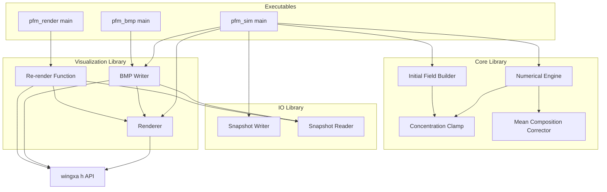
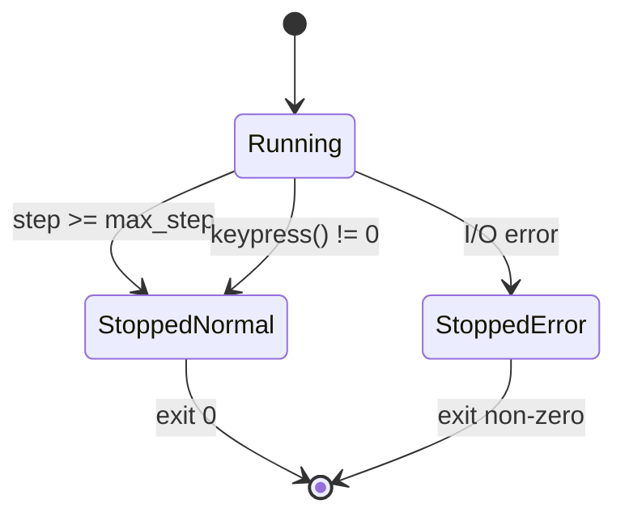

# Design Document

## Overview

本設計は `requirements.md` の 6 requirements (= シミュレーション実行 / 数値モデル / 濃度制約 invariant / 入出力 / 可視化 / エラー処理) を実現する三相分解フェーズフィールドコード C++ clean-room 実装の構造を定める。

**Purpose**: 3 成分濃度場 `c1, c2, c3` (= `c1 = 1 - c2 - c3` 従属) の連成 Cahn-Hilliard 型 PDE を `§7` 既定 grid count `ND = 100` の 2D 周期境界格子上で時間発展させ、SSoT `DEVELOPMENT_SPEC.md` と等価なシミュレーション結果を生成する。

**Users**: 材料物性研究者 (= シミュレーション実行 / 結果観察 / 後続解析) + 運用者 (= バッチ実行 / CI / 異常終了検出)。

**Impact**: new feature (= clean-room 再実装)。既存システムへの改変なし。論文 Claim D primary evidence 取得用 sample として独立動作する。

### Goals

- SSoT `DEVELOPMENT_SPEC.md` `§1`-`§22` を完全踏襲した C++17 実装
- 3 機能 (= simulation / re-render / BMP from saved data) を独立 executable として提供
- 静的配列確保 (= compile-time fixed sizes) で memory 動的確保 risk を排除 (Req 2 AC 9)
- `§22` 受け入れ基準を全項目満たす
- V4 review Round 1-5 適用に耐える明確な component boundary (= 単一責務 / 依存方向単一化)

### Non-Goals

- Multi-threading / GPU 並列化 (= `§21` 実装裁量範囲、本 spec で scope 外)
- 動的 grid resize (= `ND` 変更時は再 compile 前提)
- `ND` の runtime parameter 化 (= compile-time constant 固定、Req 2 AC 9)
- forward 系統 (= 既存 C++) との binary-level / floating-point bit-exact 等価性 (= 数値結果の科学的等価性のみ要求)

## Boundary Commitments

### This Spec Owns

- 全 component 実装 = Numerical Engine / Initial Field Builder / Concentration Clamp / Mean Composition Corrector / Snapshot Writer / Snapshot Reader / Renderer / BMP Writer / Re-render Function / Simulation Module
- 3 executables = `pfm_sim` / `pfm_render` / `pfm_bmp`
- Field データ構造 = `ND x ND` の `double` 静的 2D 配列 (`§7`, Req 2 AC 9)
- 入出力ファイル形式 = テキスト形式濃度データ (`§16`) + BMP (`§19` 17 step 群)
- Build system = GNU Make (Makefile 1 本)

### Out of Boundary

- 描画 API ヘッダ `wingxa.h` 宣言関数の実体実装 (= 外部 link 前提、本 spec は interface 契約のみ参照)
- BMP encoder 内部詳細 (= `wingxa.h::save_screen()` に委譲)
- `ND` 変更による re-build 自動化 (= 手動 re-compile 前提)
- 並列化 / GPU offload / SIMD 最適化

### Allowed Dependencies

- C++17 standard library (= `<array>`, `<cstdio>`, `<cmath>`, `<random>`, `<string>`, `<filesystem>`, `<fstream>`)
- 描画 API ヘッダ `wingxa.h` (= 9 関数 prototype のみ参照、実体は外部提供)
- GNU Make (= build orchestration)

### Revalidation Triggers

- `wingxa.h` の関数 signature 変更 → Renderer / BMP Writer / Re-render Function の interface 再 review
- `DEVELOPMENT_SPEC.md` `§5`-`§12` 数値 scheme 変更 → Numerical Engine / Concentration Clamp / Mean Composition Corrector 再 review
- `§13` 入力 parameter 追加・削除 → Simulation Module の CLI parser 再 review
- `§16` 濃度データ形式変更 → Snapshot Writer / Snapshot Reader 双方再 review
- `ND` 既定値変更 → 全 component re-compile + 計算結果の reference 比較再実施

## Architecture

### Architecture Pattern & Boundary Map



**Architecture Integration**:

- Selected pattern: **Layered + Library-based CLI** (= 共通 core / I/O / visualization library + 3 executable consumers)
- Domain boundaries: 数値計算 (Core) / I/O / Visualization の 3 layer 分離
- Dependency direction: **Application → Visualization → wingxa.h** 単一方向 (= Req 1 AC9 / Req 5 AC6 と整合、Application Layer = Executable main + Simulation Module は wingxa.h 直接依存禁止、Visualization Layer = Renderer / BMP Writer / Re-render Function のみが wingxa.h 9 関数を呼出、Renderer は keypress wrapper を上位 component に provide)。Application は I/O Layer (Snapshot Writer) を直接呼出可能だが、Snapshot Reader は Visualization 層 (BMP Writer / Re-render Function) が orchestrate する 2 段委譲 (= Req 4 AC5 / AC6)。Core Layer (Numerical Engine / Initial Field Builder / Concentration Clamp / Mean Composition Corrector) は I/O / Visualization に依存しない (= 数値計算純粋層)
- New components rationale: 各 component は requirements.md の単一責務に対応、merge conflict / 並列実装の余地を確保
- Steering compliance: 本 spec は Rwiki v2 product と独立、独自 boundary を定義

### Technology Stack

| Layer | Choice / Version | Role | Notes |
|-------|------------------|------|-------|
| 言語 | C++17 | 全 component | 静的配列 + `constexpr` ND |
| RNG | `std::mt19937` (`<random>`) | Initial Field Builder | deterministic seed 既定 (再現性) |
| File I/O | `<cstdio>` (`FILE*`) | Snapshot Writer / Reader | `§16` テキスト形式、空白区切り |
| Math | `<cmath>` | Numerical Engine | `log` 関数他 |
| Filesystem | `<filesystem>` | Simulation Module | 出力 dir 確認 / 作成 (`§14`) |
| Build | GNU Make | 全 module | Makefile 1 本、3 executable target |
| 描画 API | `wingxa.h` (外部 link) | Renderer / BMP Writer / Re-render | 9 関数のみ依存 (`§18`) |

## File Structure Plan

### Directory Structure

```
DR-pfm/
├── Makefile                       # 全 build target、3 executable + lib object
├── include/
│   ├── field_types.h              # ND constexpr、Field 型 alias
│   ├── numerical_engine.h         # μ / lap / time step interface
│   ├── initial_field.h            # 初期化 + ランダムゆらぎ + clamp interface
│   ├── concentration_clamp.h      # clamp interface (Req 3.4-3.8)
│   ├── mean_correction.h          # 平均組成保存補正 interface (Req 3.9)
│   ├── snapshot_io.h              # snapshot read/write interface
│   ├── renderer.h                 # color mapping + grid 描画 interface
│   ├── bmp_writer.h               # snapshot → BMP interface
│   ├── re_render.h                # snapshot → live display interface
│   └── wingxa.h                   # 描画 API ヘッダ (= spec_seed 由来、touch 禁止)
├── src/
│   ├── numerical_engine.cpp       # μ / lap / time step impl
│   ├── initial_field.cpp          # rand fluct + 初期 clamp impl
│   ├── concentration_clamp.cpp    # 4 invariant 補正 impl
│   ├── mean_correction.cpp        # 平均組成保存補正 impl
│   ├── snapshot_io.cpp            # text format I/O impl
│   ├── renderer.cpp               # color compute + grect draw impl
│   ├── bmp_writer.cpp             # save_screen() 経由 BMP 出力
│   ├── re_render.cpp              # snapshot 再描画
│   ├── pfm_sim_main.cpp           # 機能 1 entry: simulation execution
│   ├── pfm_render_main.cpp        # 機能 2 entry: re-render
│   └── pfm_bmp_main.cpp           # 機能 3 entry: BMP from saved data
├── spec_seed/                     # 既存 SSoT (= touch 禁止)
│   ├── DEVELOPMENT_SPEC.md
│   └── wingxa.h
├── tests/                         # unit + integration test
│   ├── test_concentration_clamp.cpp
│   ├── test_mean_correction.cpp
│   ├── test_numerical_engine.cpp
│   ├── test_snapshot_io.cpp
│   └── test_initial_field.cpp
└── output/                        # default output dir (= §13 既定)
```

### Modified Files

- なし (= 全新規実装、既存 file 改変なし)

### Static Allocation Strategy

`include/field_types.h`:

```cpp
namespace pfm {

inline constexpr int ND = 100;            // §7 既定 grid count
using Field = double[ND][ND];             // raw 2D static array

}  // namespace pfm
```

各 library 関数は `const Field&` (input) / `Field&` (output) で受け渡し。`Field` の値コピー禁止 (= 関数 signature レベルで防御)。

> Req 2 AC 9 = 「`ND` 用い静的に確保、runtime 動的再確保なし」を本 strategy で satisfy。

## Components and Interfaces

### Component Summary

| Component | Layer | Intent | Req Coverage | Key Dependencies (P0) | Contracts |
|-----------|-------|--------|--------------|----------------------|-----------|
| Numerical Engine | Core | 化学ポテンシャル + lap + 時間発展 7 step | 2.1, 2.2, 2.3, 2.4, 2.5, 2.6, 2.7, 2.8 | Concentration Clamp (P0), Mean Composition Corrector (P0) | Service |
| Initial Field Builder | Core | ランダムゆらぎ + 初期 clamp | 3.1, 3.2 | Concentration Clamp (P0), `std::mt19937` (P0) | Service |
| Concentration Clamp | Core | 4 invariant 補正 | 3.3, 3.4, 3.5, 3.6, 3.7, 3.8 | (none) | Service |
| Mean Composition Corrector | Core | 平均組成保存補正 | 3.9 | Concentration Clamp (P0) | Service |
| Snapshot Writer | I/O | テキスト形式書き出し | 4.1, 4.2, 4.3, 4.4 | (none) | Service |
| Snapshot Reader | I/O | テキスト形式読み込み | 4.7, 4.8, 6.4, 6.5 | (none) | Service |
| Renderer | Visualization | 色変換 + 矩形描画 | 5.1, 5.2, 5.3, 5.4, 5.5, 5.6 | wingxa.h `gcolor`/`grect`/`gsetorg` (P0) | Service |
| BMP Writer | Visualization | snapshot → BMP | 4.5, 4.9, 6.6 | wingxa.h `save_screen` (P0), Renderer (P0) | Service |
| Re-render Function | Visualization | snapshot → live display | 4.6 | Renderer (P0、`keypress` wrapper 経由), wingxa.h `gwinsize`/`ginit`/`swapbuffers` (P0) | Service |
| Simulation Module | Application | CLI parser + main loop + 終了処理 | 1.1-1.10, 6.1-6.6 | All Core / I/O / Visualization (P0) | Service |

### Core Layer

#### Numerical Engine

| Field | Detail |
|-------|--------|
| Intent | μ2 / μ3 計算、5 点差分 lap、時間発展 `§11` 7 step + entry 直後の step (0) clamp invoke (`§5`-`§11`、step (0) は `§10` 4 timing invariant の 1 つ) |
| Requirements | 2.1, 2.2, 2.3, 2.4, 2.5, 2.6, 2.7, 2.8, 2.9 |

**Responsibilities & Constraints**

- 単一責務: time_step entry 直後に step (0) Concentration Clamp invoke (= `§10` 4 timing の 1 つ「ポテンシャル計算前」、Req 2 AC8 step (0))、続いて `§11` 7 step (= step (1)-(7)) を fixed sequence で実行 (= step (1) μ 計算 / step (2) lap(μ) / step (3) dc/dt / step (4) temp 配列更新 / step (5) Concentration Clamp invoke / step (6) Mean Composition Corrector invoke / step (7) Concentration Clamp invoke)
- Domain boundary: 数値計算純粋層、I/O / 描画には依存しない
- Invariants: Field sizes (= `ND x ND`) 不変、5 点差分 lap は周期境界 (= `i±1`, `j±1` を `(i ± 1 + ND) % ND`) で適用

**Dependencies**

- Outbound: Concentration Clamp (P0、step (0) / step (5) / step (7) で invoke = 1 time step に 3 回、Req 2 AC8 と整合)
- Outbound: Mean Composition Corrector (P0、step (6) で invoke、内部で再度 Concentration Clamp invoke)

**Contracts**: Service [✓] / API [ ] / Event [ ] / Batch [ ] / State [ ]

##### Service Interface

```cpp
namespace pfm {

// μ2, μ3 計算 (§6, Req 2.2)
void compute_potentials(
    const Field& c2, const Field& c3,
    Field& mu2, Field& mu3
);

// 5-point Laplacian (§7, Req 2.5) — internal helper、period BC
double laplacian(const Field& a, int i, int j);

// 1 time step = step (0) entry-clamp + §11 7 step 順実行 (Req 2.7-2.8)
void time_step(
    Field& c2, Field& c3,
    double c2a, double c3a,
    double delt
);

}  // namespace pfm
```

- Preconditions: 入力 `c2, c3` の濃度制約状態は不問 (= step (0) entry-clamp で `§10` 4 制約満足を保証)
- Postconditions: `c2, c3` が `§10` 4 濃度制約を満たし、平均組成 `(c2a, c3a)` が clamp epsilon の bounded 範囲で保存されている
- Invariants: 計算順序は entry 直後 step (0) clamp + `§11` 7 step (= step (1)-(7)) 固定 (= primary AC 2.8)

**Implementation Notes**

- Integration: `pfm_sim_main` の time loop から各 step 呼出
- Validation: unit test で 1 step 結果が手計算と一致 (= 4 grid 単純例で reference value 比較)
- Risks: 浮動小数点誤差累積 (= explicit Euler、`delt` 過大で発散) → `delt` 既定値は `§13` 由来 user input、user 責任

#### Initial Field Builder

| Field | Detail |
|-------|--------|
| Intent | 平均組成 + ランダムゆらぎで初期 Field 構築、初期 clamp は Concentration Clamp service へ委譲 (= Req 3 AC2 階層委譲: Initial Field Builder → Concentration Clamp) |
| Requirements | 3.1, 3.2 |

**Responsibilities & Constraints**

- 単一責務: `§9` ランダムゆらぎ生成 (= 平均 `c2a, c3a` + uniform `[-fluct_amp, +fluct_amp]`) + 終端で Concentration Clamp service を invoke して `§10` 4 濃度制約適用。本 builder 終端 clamp は `§10` 4 timing の「初期化時」に該当 (= `§11` step 番号体系外、Req 2 AC8 step (0)/(5)/(7) は Numerical Engine 内 invoke のみ、Req 3 AC9 は Mean Composition Corrector 内部 invoke、本 invoke 記法は全 invoke point で「`clamp_concentrations(c2, c3)` 関数呼出」と統一)
- Invariants: 終了時 Field は `§10` 4 濃度制約を満たす
- Note: `c2a` または `c3a` が境界近傍 (= 例 `c2a < 0.01` or `c2a + c3a > 0.99`) で initial clamping が field を変更する場合、initial field の実際平均が `c2a, c3a` から bounded deviation で乖離する可能性あり (= Req 3 AC2 Note と整合、Mean Composition Corrector が time step 1 で補正)

**Dependencies**

- Outbound: Concentration Clamp (P0、初期化終端で invoke)
- External: `std::mt19937` (P0、deterministic RNG)

**Contracts**: Service [✓]

##### Service Interface

```cpp
namespace pfm {

// 初期 Field 構築 (§9, Req 3.1-3.2)
// SSoT 一本化 (= 本 design 内 fluct_amp 取扱):
// (1) builder 自身は default 値を固定しない (= Req 3 AC1 が「§9 既定値、本 spec で明示固定値
//     として要求するわけではない」と裁量を残している)
// (2) caller = Simulation Module が §9 既定値 0.01 を本関数に渡す (= L688 Implementation
//     Notes と整合、CLI option 化は本 spec scope 外)
// → 「builder 側固定なし + caller 側 §9 既定値 0.01 渡し」が本 design の SSoT 規約
void build_initial_field(
    Field& c2, Field& c3,
    double c2a, double c3a,
    double fluct_amp,
    uint32_t seed
);

}  // namespace pfm
```

- Preconditions: `0 < c2a < 1`, `0 < c3a < 1`, `c2a + c3a < 1` (= user 入力責任)
- Postconditions: 全 grid 点で `§10` 4 制約満たす
- Invariants: 同 seed で同結果 (= deterministic RNG)

**Implementation Notes**

- Integration: `pfm_sim_main` 起動時に 1 度呼出
- Validation: unit test で seed 固定時の出力 reproducibility + 平均組成が `c2a ± fluct_amp` 範囲内
- Risks: `fluct_amp` 過大で初期 clamp 多発 → 既定 `0.01` を維持 (= `§9`)

#### Concentration Clamp

| Field | Detail |
|-------|--------|
| Intent | 4 濃度制約 invariant 補正 (`§10`) |
| Requirements | 3.3, 3.4, 3.5, 3.6, 3.7, 3.8 |

**Responsibilities & Constraints**

- 単一責務: 全 grid 点に対して `§10` 補正規則を統合適用 (= AC4-AC8 を全条件満足まで loop 適用、Req 3 AC8 と整合: 比例縮小 (AC8) 後に AC4-7 個別下限が再違反した場合は AC4-7 を再適用)
- Invariants: 適用後、全 grid 点で `0 < c2 < 1`, `0 < c3 < 1`, `c2 + c3 < 1`, `c1 > 0`

**Contracts**: Service [✓]

##### Service Interface

```cpp
namespace pfm {

inline constexpr double CLAMP_EPS = 1.0e-6;   // §10 既定

// 全 grid clamp (§10, Req 3.3-3.8、AC8 統合適用 = AC4-7 + AC8 loop)
void clamp_concentrations(Field& c2, Field& c3);

}  // namespace pfm
```

- Preconditions: なし (= 任意 Field 状態を入力可能)
- Postconditions: 全 grid 点で 4 濃度制約 (AC4-AC8) 全て満たす
- Invariants: 適用後の Field が `§10` 4 濃度制約 post-condition を満たす (= AC4-AC8 規範)

**Implementation Notes**

- Integration: `§10` 4 timing への対応 = (1) Initial Field Builder 終端 = `§10` timing「初期化時」 / (2) Numerical Engine step (0) = `§10` timing「ポテンシャル計算前」 (`§11` 番号体系内) / (3) Numerical Engine step (5) = `§10` timing「時間更新後」 / (4) Numerical Engine step (7) = `§10` timing「平均組成補正後」、Mean Composition Corrector 内部 clamp は (4) と階層的同 timing (= `§12` 補正手順内の post-correction clamp、Req 3 AC9 階層委譲)
- 実装属性 (= req 規範ではない): idempotent (= 2 回連続呼出で同結果)、統合適用 loop は経験的に 1-2 iteration 内で収束 (= 比例縮小 + 個別下限再適用、`CLAMP_EPS = 1e-6` 既定下で観測される性質、unit test で boundary case 網羅して保証)
- Validation: unit test で境界 case (= `c2 = 0`, `c2 = 1`, `c2 + c3 = 1`) を網羅、idempotency 検証 + AC8 後 AC4-7 再違反 case (= 比例縮小で `c2 + c3 = 1 - 2 * eps` strict 下回り) 確認

#### Mean Composition Corrector

| Field | Detail |
|-------|--------|
| Intent | 平均組成保存補正 (`§12`) |
| Requirements | 3.9 |

**Responsibilities & Constraints**

- 単一責務: `§12` 補正手順 (= 平均計算 → delta 算出 → 一様減算 → 再 clamp)
- Invariants: 適用後、Field 平均が `(c2a, c3a)` と一致 (= clamp の影響で完全一致しない可能性あり、許容)

**Dependencies**

- Outbound: Concentration Clamp (P0、補正後の再 clamp で呼出)

**Contracts**: Service [✓]

##### Service Interface

```cpp
namespace pfm {

void correct_mean_composition(
    Field& c2, Field& c3,
    double c2a, double c3a
);

}  // namespace pfm
```

- Preconditions: なし
- Postconditions: Field `c2`, `c3` の平均 ≈ `c2a`, `c3a` (clamp 由来 residual error 許容、`§12` と整合)、4 濃度制約満たす
- Invariants: 適用後 Field 平均が clamp epsilon の bounded 範囲で `(c2a, c3a)` 保存 (= req 3 AC9 規範、`§10` 濃度制約 invariant 優先)

**Implementation Notes**

- Integration: Numerical Engine step 6
- 実装属性 (= req 規範ではない): 平均値変化は単調収束 (= 同一 input に対し idempotent ではないが convergent、`§12` 補正手順の monotonic 性質に依存)
- Validation: unit test で初期偏差 `0.01` 与え correct 後 `< CLAMP_EPS * ND * ND` 程度
- Risks: clamp 連続適用で平均が drift (= 経験則、`§12` 既存仕様で許容)

### I/O Layer

#### Snapshot Writer

| Field | Detail |
|-------|--------|
| Intent | 濃度 snapshot をテキスト形式で書き出し (`§16`) |
| Requirements | 4.1, 4.2, 4.3, 4.4 |

**Responsibilities & Constraints**

- 単一責務: `§16` 形式 (= `time1` + `ND*ND` 個の `(c2, c3)` ペア、空白 / 改行区切り)
- Invariants: 同一 `time1, c2, c3` 入力に対し決定論的 byte 出力

**Contracts**: Service [✓]

##### Service Interface

```cpp
namespace pfm {

enum class WriteMode {
    OverwriteOrCreate,  // §16 初期 snapshot
    Append,             // §16 後続 snapshot
};

// 0 on success, non-zero on I/O error (Req 6 AC4 = file open / write 失敗時 non-zero exit)
// time1 = 物理時刻 = 累積 step 数 × delt (初期 snapshot は time1 = 0.0、Req 4 AC1)
int write_snapshot(
    const std::string& path,
    double time1,
    const Field& c2, const Field& c3,
    WriteMode mode
);

}  // namespace pfm
```

**Implementation Notes**

- Integration: `pfm_sim_main` から保存間隔ごとに呼出
- Validation: unit test で round-trip 整合 (= write → read で同一値復元)
- Risks: テキスト精度損失 (= `printf("%.15g")` 等で double full precision 確保)

#### Snapshot Reader

| Field | Detail |
|-------|--------|
| Intent | テキスト形式 snapshot 読み込み + step 別 seek |
| Requirements | 4.7, 4.8, 6.4, 6.5 |

**Responsibilities & Constraints**

- 単一責務: 単一ファイル内の N 個 snapshot を順次 / step 指定で読込
- Invariants: 不正形式入力で non-zero exit code (Req 6.5)

**Contracts**: Service [✓]

##### Service Interface

```cpp
namespace pfm {

// 1 snapshot 読込 (file pointer 進行)
// returns 0 on success, non-zero on parse / I/O error
int read_snapshot(
    FILE* fp,
    double& time1,
    Field& c2, Field& c3
);

// step 番号 (0-indexed snapshot 順) で seek
// returns 0 on success, non-zero on EOF / parse error
int seek_snapshot(
    FILE* fp,
    int snapshot_index,
    double& time1,
    Field& c2, Field& c3
);

}  // namespace pfm
```

**Implementation Notes**

- Integration: `pfm_render_main` / `pfm_bmp_main` から呼出
- Validation: unit test で 3-snapshot file の各 index 取得 + 不正形式 (= 値欠損 / 非数値) で exit code non-zero
- Risks: `§16` の「数値間は空白または改行で区切られていればよい」緩い仕様 → `fscanf("%lf", ...)` で吸収

### Visualization Layer

#### Renderer

| Field | Detail |
|-------|--------|
| Intent | grid 1 点の色変換 + 矩形描画 (`§17`) |
| Requirements | 5.1, 5.2, 5.3, 5.4, 5.5, 5.6 |

**Responsibilities & Constraints**

- 単一責務: 色変換 (`R = 1 - c2 - c3`, `G = c2`, `B = c3`、`[0,1]` clamp + `0..255` 整数化) + `grect` 矩形描画
- Invariants: `wingxa.h` 9 関数以外には依存しない (Req 5.6)

**Dependencies**

- External: `wingxa.h::gcolor` (P0), `wingxa.h::grect` (P0), `wingxa.h::gsetorg` (P0)

**Contracts**: Service [✓]

##### Service Interface

```cpp
namespace pfm {

inline constexpr int DRAW_W = 400;          // §17 既定値、規範は Req 5 AC4 (= default 400 x 400 pixels per §17)
inline constexpr int DRAW_H = 400;          // §17 既定値、規範は Req 5 AC4

// 全 grid 描画 (= 1 frame) (§17, Req 5.1-5.5)
void render_field(
    const Field& c2, const Field& c3
);

// keypress wrapper (= Req 5 AC6、上位 component が wingxa.h::keypress を直接呼出禁止、本 wrapper 経由)
// 戻り値: 0 = キー非押下、非 0 = キー押下 (= §15 停止 trigger)
// stdin 非対話モードでの block 回避は本 wrapper 内で吸収 (= 即 0 return、req 1 AC9 停止条件と整合)
int poll_keypress();

}  // namespace pfm
```

- Preconditions: `wingxa.h::ginit` 既起動 (= caller 責任)、描画 buffer 有効
- Postconditions: 描画 buffer に 1 frame 描画完了 (= caller が `swapbuffers` / `save_screen` を呼ぶ)
- Invariants: `c2 + c3 > 1` の grid 点でも色は `[0,1]` clamp で安全

**Implementation Notes**

- Integration: BMP Writer / Re-render Function / Simulation Module 全てから呼出
- Validation: unit test で boundary case (= `c2 = c3 = 0` → `R=255,G=0,B=0`) 等の色値検証
- Risks: 周期境界連続性 (Req 5 AC5 operational 判定基準 = 全格子点 (`0 ≤ i, j ≤ ND - 1`) 描画 + 隣接格子間に visible gap なし、wraparound 列 `i = ND` 相当の追加描画は実装裁量) = 描画域 400x400 / `ND = 100` で 1 grid = 4x4 ピクセル → 描画 loop は `i = 0..ND-1` の一巡で全 100 × 100 grid を描画、各 grid を 4 × 4 ピクセル (= 計 400 × 400 ピクセル、ピッタリ収まる) で隣接配置することで visible gap なしを担保。wraparound 列 (`i = ND` 相当の追加描画) は実装裁量範囲内、本 design では採用しない (= AC5 pass 条件は loop 一巡で満たす)

#### BMP Writer

| Field | Detail |
|-------|--------|
| Intent | 保存 snapshot file から指定 step 群の BMP を生成 (`§19`)。step selection + file naming + orchestration が自身の責務、色変換 / 矩形描画は Renderer 委譲、BMP 出力は `wingxa.h::save_screen` 委譲 |
| Requirements | 4.5, 4.9, 6.6 |

**Responsibilities & Constraints**

- 単一責務: step selection (= `§19` 既定 17 step or BMP 保存間隔から動的生成) + file naming + Snapshot Reader 呼出 + Renderer 呼出 + `save_screen` 呼出の orchestration (= Req 4 AC5 と整合、色変換 / 矩形描画は Renderer 責務に委譲)
- Invariants: 既定 param (= `§13` BMP 保存間隔 `2000` + 最大ステップ数 `100000`) で `§19` 17 step (= `0, 2000, ..., 80000`) を全て生成、param 変更時は `{0, K, 2K, ...} ∩ {≤ max-step}` を生成

**Dependencies**

- Outbound: Snapshot Reader (P0、自身の orchestration の一部として直接呼出 = Application Layer は Snapshot Reader 直接依存しない)
- Outbound: Renderer (P0、色変換 + 矩形描画委譲)
- External: `wingxa.h::save_screen` (P0、Visualization Layer 内なので直接依存可)

**Contracts**: Service [✓]

##### Service Interface

```cpp
namespace pfm {

// 単一 snapshot から BMP 1 枚出力
// returns 0 on success, non-zero on I/O / save error (Req 6.6)
int write_bmp_for_snapshot(
    const std::string& snapshot_path,
    int snapshot_index,
    const std::string& bmp_path
);

// §19 既定 17 step を batch 出力 (snapshot file の各 snapshot index 0,1,2,...)
// 既定 param (= §13 BMP 保存間隔 2000 + 最大ステップ数 100000) 前提
int write_bmp_default_steps(
    const std::string& snapshot_path,
    const std::string& bmp_dir
);

// 動的 step 群 batch 出力 (= Req 4 AC5 param 変更時規則、step 群 = {0, K, 2K, ...} ∩ {≤ max_step})
// bmp_interval = K (= §13 BMP 保存間隔)、max_step = §13 最大ステップ数
int write_bmp_steps(
    const std::string& snapshot_path,
    const std::string& bmp_dir,
    int bmp_interval,
    int max_step
);

}  // namespace pfm
```

**Implementation Notes**

- Integration: `pfm_bmp_main` の entry point
- Validation: unit test で `snapshot_index` 不正 (= EOF 超過) で non-zero
- Risks: `wingxa.h::save_screen` が screen を読み出す前提 → off-screen 描画 buffer のみ運用 (= `§21` 実装裁量範囲内)

#### Re-render Function

| Field | Detail |
|-------|--------|
| Intent | snapshot file の連続再描画 (`§3` 機能 2)。全 snapshot 順次再描画 + keypress 監視 orchestration が自身の責務、snapshot 解析は Snapshot Reader 委譲、色変換 / 矩形描画は Renderer 委譲 (= Req 4 AC6 2 段委譲: Re-render Function → Snapshot Reader → Renderer) |
| Requirements | 4.6 |

**Responsibilities & Constraints**

- 単一責務: snapshot file 全 snapshot 順次再描画 + keypress 監視 orchestration (= Req 4 AC6 と整合)。snapshot 解析は Snapshot Reader 委譲、色変換 / 矩形描画は Renderer 委譲、画面更新は `swapbuffers` 呼出
- Invariants: Renderer wrapper 経由の `keypress` 戻り値非 0 で停止可能 (= `§15` + Req 5 AC6 と整合、上位 component は wingxa.h 直接 keypress 呼出を行わず Renderer wrapper 経由で取得)

**Dependencies**

- Outbound: Snapshot Reader (P0、自身の orchestration として直接呼出 = Application Layer は Snapshot Reader 直接依存しない)
- Outbound: Renderer (P0、色変換 + 矩形描画 + keypress wrapper 委譲)
- External: `wingxa.h::gwinsize` / `ginit` / `swapbuffers` (P0、Visualization Layer 内なので直接依存可、`keypress` は Renderer wrapper 経由)

**Contracts**: Service [✓]

##### Service Interface

```cpp
namespace pfm {

// snapshot file 全 snapshot を順次再描画
// returns 0 on success, non-zero on I/O / parse error
int re_render_all(
    const std::string& snapshot_path
);

}  // namespace pfm
```

- Preconditions: `wingxa.h::ginit` 既起動 (= caller 責任)、描画 buffer 有効
- Postconditions: snapshot file 末尾まで順次描画完了、または Renderer wrapper 経由 keypress 戻り値非 0 検出時に「現 snapshot 描画 + swapbuffers 完了後」のタイミングで停止 (= `§15` 停止 semantics と整合、即時停止 / 次 snapshot 前停止ではなく、現 snapshot の描画完了後停止)
- Invariants: snapshot 描画は時系列順 (= snapshot file 内の格納順、Snapshot Reader が seek で順次返却)

**Implementation Notes**

- Integration: `pfm_render_main` の entry point
- Validation: 手動目視確認 + 不正形式 file で non-zero return

### Application Layer

#### Simulation Module

| Field | Detail |
|-------|--------|
| Intent | CLI parse + 起動 (`§14`) + main loop (`§11`) + 停止 (`§15`) + 異常終了 (`§20`) |
| Requirements | 1.1-1.10, 6.1-6.6 |

**Responsibilities & Constraints**

- 単一責務: 上記全 layer の orchestration、CLI 引数 parse、`§14` 起動順実行、time loop、`§15` 停止判定、`§20` 異常終了
- Invariants: 異常系で必ず non-zero exit code

**Dependencies**

- Outbound: Numerical Engine (P0)
- Outbound: Initial Field Builder (P0)
- Outbound: Snapshot Writer (P0)
- Outbound: Renderer (P0)
- Outbound: BMP Writer (P0)
- External: `<filesystem>` (P0、出力 dir 確認)

**Contracts**: Service [✓]

##### CLI Interface

```
pfm_sim --c2a <c2a> --c3a <c3a> --delt <dt>
        [--max-step <N=100000>]
        [--data-interval <N=2000>]
        [--bmp-interval <N=2000>]
        [--output-dir <path="output">]
        [--seed <uint32_t>]
```

- Required / value types / ranges: requirements.md Req 1 AC1 / Req 6 AC1 を SSoT として参照 (= 必須引数 + 値域 + 数値変換失敗時の non-zero exit 規範は req 側で確定済、design は HOW = 変換方式 + 例外 catch + 値域 check の実装方針のみ規定)
- Defaults (= `§13` 既定値 reference、req 1 AC2-5):
  - `--max-step`: default `100000`
  - `--data-interval`: default `2000`
  - `--bmp-interval`: default `2000`
  - `--output-dir`: default `"output"`
  - `--seed`: default `0`
- Parse rules: 各引数を `std::stod` / `std::stoi` 系で変換、`std::invalid_argument` / `std::out_of_range` 例外 catch で Req 6 AC2 (= 数値変換失敗 → non-zero exit)。値域 check (= Req 1 AC1 規範) は parse 後に手書き、違反時 Req 6 AC1 (= 不正引数 → non-zero exit)
- Preconditions: argv 配列が上記 required + value 形式を満たす (= caller / shell 責任)
- Postconditions: 正常終了で exit code 0、異常で Req 6 AC1-6 に従う non-zero exit code
- Invariants: 起動順 = `§14` (a)-(f) を厳守 (= Req 1 AC6 と整合)

**Implementation Notes**

- Integration: 唯一の binary entry point for 機能 1
- Validation: integration test で 100 step run + snapshot round-trip
- 実装定数: `build_initial_field` 呼出時の `fluct_amp` には `§9` 既定値 `0.01` を渡す (= Req 3 AC1 reference、CLI option 化は本 spec scope 外、実装裁量)、`seed` は `--seed` CLI 引数値 (= 既定 `0`) を渡す
- Risks: `wingxa.h::keypress` が stdin 非対話モードで block する可能性 → block 回避は Renderer wrapper (= `poll_keypress`) 内で stdin 非対話判定 + non-blocking 実装 (= 即 0 return) で吸収 (= Req 1 AC9 停止条件は維持、Application Layer は wingxa.h 直接依存禁止と整合、`§21` 実装裁量範囲)

## System Flows

### Simulation Time Loop (`§11` 7 step + step (0) entry-clamp)

> Note: 本 sequence diagram の関数名は service interface section の正式関数名 (= `clamp_concentrations`, `correct_mean_composition`, `write_bmp_for_snapshot` 等) と統一。引数も signature と一致 (= 一部省略時は `(...)` で省略明示)。

```mermaid
sequenceDiagram
    participant Main as pfm_sim main
    participant Renderer as Renderer
    participant Init as Initial Field Builder
    participant Engine as Numerical Engine
    participant Clamp as Concentration Clamp
    participant Mean as Mean Composition Corrector
    participant Writer as Snapshot Writer
    participant BMP as BMP Writer

    Main->>Renderer: gwinsize / ginit / gsetorg [§14 (d)(e)(f) Renderer 初期化委譲、Application は wingxa.h 直接呼出禁止]
    Main->>Init: build_initial_field(c2, c3, c2a, c3a, fluct_amp, seed)
    Init->>Clamp: clamp_concentrations(c2, c3)
    Init-->>Main: void return
    Main->>Writer: write_snapshot(path, t=0, c2, c3, OverwriteOrCreate)
    Main->>BMP: write_bmp_for_snapshot(snapshot_path, 0, bmp_path)
    BMP->>Renderer: render_field(c2, c3)

    loop time step
        Main->>Engine: time_step(c2, c3, c2a, c3a, delt)
        Engine->>Clamp: step (0) clamp_concentrations(c2, c3) [pre-potential]
        Note over Engine: step (1): compute mu2, mu3
        Note over Engine: step (2): compute lap(mu2), lap(mu3)
        Note over Engine: step (3): compute dc2_dt, dc3_dt
        Note over Engine: step (4): write to temp arrays
        Engine->>Clamp: step (5) clamp_concentrations(temp_c2, temp_c3)
        Engine->>Mean: step (6) correct_mean_composition(temp_c2, temp_c3, c2a, c3a)
        Mean->>Clamp: clamp_concentrations(temp_c2, temp_c3) [internal to step (6)]
        Engine->>Clamp: step (7) clamp_concentrations(temp_c2, temp_c3) [post-correction]
        Note over Engine: post step (7): 参照引数 c2, c3 経由で main 配列に in-place 反映 (= time_step は void return、temp 配列を main 配列に commit して終了)
        Engine-->>Main: void return
        Main->>Main: step++ ; check stop
        opt step % data_interval == 0
            Main->>Writer: write_snapshot(path, t, c2, c3, Append)
        end
        opt step % bmp_interval == 0
            Main->>BMP: write_bmp_for_snapshot(snapshot_path, snapshot_index, bmp_path)
            BMP->>Renderer: render_field(c2, c3)
        end
    end

    Main-->>Main: exit 0
```

### Stop Condition Branching (`§15`)



## Requirements Traceability

> Note: 「Build System (Makefile)」は build artifact (= component ではなく Component Summary table 参照外)。下表 Components 欄に登場する場合は build artifact reference として読む。

| Requirement | Summary | Components | Interfaces | Flows |
|-------------|---------|------------|------------|-------|
| 1.1-1.5 | CLI 入力 + 既定値 | Simulation Module | `pfm_sim` CLI | - |
| 1.6 | `§14` 起動順 | Simulation Module | main entry | Time Loop (init phase) |
| 1.7-1.9 | 停止条件 | Simulation Module | main loop | Stop Condition Branching |
| 1.10 | I/O 異常時 non-zero | Simulation Module | error path | Stop Condition Branching |
| 2.1-2.8 | 数値モデル | Numerical Engine | `time_step()` | Time Loop (per step) |
| 2.9 | 静的配列 | (全 Core / I/O / Viz component) | `Field` 型 alias | - |
| 3.1-3.2 | 初期化 | Initial Field Builder | `build_initial_field()` | Time Loop (init phase) |
| 3.3-3.8 | 4 濃度制約 invariant | Concentration Clamp | `clamp_concentrations()` | Time Loop (step 0, 5, 6 内, 7) |
| 3.9 | 平均組成保存 | Mean Composition Corrector | `correct_mean_composition()` | Time Loop (step 6) |
| 4.1-4.4 | snapshot 書出 | Snapshot Writer | `write_snapshot()` | Time Loop (save) |
| 4.5 | BMP 17 step 群 | BMP Writer | `write_bmp_default_steps()` | - |
| 4.6 | 再描画 | Re-render Function | `re_render_all()` | - |
| 4.7-4.9 | I/O 異常時 non-zero | Snapshot Reader / BMP Writer | error path | - |
| 5.1-5.5 | 色変換 + 矩形描画 | Renderer | `render_field()` | - |
| 5.6 | wingxa.h 9 関数のみ | Renderer / BMP Writer / Re-render Function | (依存制約) | Architecture Boundary Map |
| 6.1-6.6 | 異常終了 non-zero | Simulation Module / 全 I/O 関数 | error path | Stop Condition Branching |
| 7.1 | ビルド成功 (= `§22` 受け入れ基準 1) | Build System (Makefile) | `make` target | - |
| 7.2 | 初期 snapshot + 初期 BMP 出力 (= `§22` 受け入れ基準 2) | Simulation Module / Snapshot Writer / BMP Writer | `pfm_sim` startup sequence | Time Loop (init phase) |
| 7.3 | 再描画 file load (= `§22` 受け入れ基準 3) | Re-render Function / Snapshot Reader | `re_render_all()` | - |
| 7.4 | BMP 17 step 群出力 (= `§22` 受け入れ基準 4) | BMP Writer | `write_bmp_default_steps()` | - |
| 7.5 | `log` 定義域逸脱なし (= `§22` 受け入れ基準 5) | Numerical Engine / Concentration Clamp | `time_step()` step (0)/(5)/(7) clamp | Time Loop (per step) |
| 7.6 | 平均組成補正後 4 制約満足 (= `§22` 受け入れ基準 6) | Numerical Engine / Mean Composition Corrector / Concentration Clamp | `correct_mean_composition()` + step (7) re-clamp | Time Loop (step (6)/(7)) |

## Error Handling

### Error Strategy

C-style `int` return code (= 0 success, non-zero error) を全 I/O / 描画 / parse 関数で採用。Application Layer (= Simulation Module / pfm_render main / pfm_bmp main) は各呼出の return code を check し、非 0 で main から `return non_zero_code` で exit。

### Error Categories and Responses

> **Note (= 規範範囲明示)**: 以下の exit code 具体値 (= `return 2 / 3 / 4 / 5`) は Req 6 AC1-6 が規範化する「non-zero exit code」を満たすための実装提案であり、req-level の契約ではない (= req は 0 以外の exit code のみ規範化、code 値による error category 区別は本設計の実装一貫性のための割当)。CI / バッチ運用者が code 値で error category を区別する要件が将来必要になった場合は req 改訂で昇格 (= Req 6 に code 値追加) を要する。

- **Invalid CLI input** (Req 6.1, 6.2): Affected = Simulation Module。`argv` parse 段階で usage 表示 + `return 2`
- **Filesystem error** (Req 6.3): Affected = Simulation Module。`<filesystem>` exception を catch、stderr に message 出力 + `return 3`
- **Snapshot file open error** (Req 6.4): Affected = Snapshot Writer / Snapshot Reader / BMP Writer / Re-render Function (= 直接呼出元、Application Layer = Simulation Module には main 経由で伝播)。`fopen` 失敗で `return 3`、上位 main で同 code 伝播
- **Snapshot parse error** (Req 6.5): Affected = Snapshot Reader (= 直接呼出元 BMP Writer / Re-render Function 経由で main 伝播)。`fscanf` の戻り値 check + `return 4`
- **BMP save error** (Req 6.6): Affected = BMP Writer (= 直接呼出元 pfm_bmp main / pfm_sim main 経由で伝播)。`wingxa.h::save_screen` の戻り値 check + `return 5`

### Monitoring

- stderr に diagnostic message 出力 (= バッチ実行時 log redirect 前提)
- exit code は POSIX 慣習 (= 0 success / 1-127 error category)
- session ごとの実行 log は本 spec 範囲外 (= caller 責任)

## Testing Strategy

### Unit Tests (3-5 items)

- **`test_concentration_clamp.cpp`**: 境界 case (= `c2 = 0`, `c2 = 1`, `c2 + c3 = 1`, `c2 + c3 > 1`) の補正後値を期待値と比較、idempotency 検証
- **`test_mean_correction.cpp`**: 平均偏差 `0.01` 与え補正後の平均が `c2a, c3a` の clamp epsilon bounded 範囲内 (= Req 3 AC9 規範、Implementation 目安は `± 2 * CLAMP_EPS * ND * ND` 程度、本数式は req 契約ではなく実装目安)
- **`test_numerical_engine.cpp`**: 4 grid 単純例で `compute_potentials` / `laplacian` / 1 step `time_step` の手計算 reference 一致
- **`test_initial_field.cpp`**: 同 seed 同結果 (= deterministic)、平均値が `c2a, c3a` ± `fluct_amp` 範囲
- **`test_snapshot_io.cpp`**: write → read round-trip で `time1, c2, c3` 完全一致、不正形式 input で non-zero return

### Integration Tests (3-5 items)

- **`pfm_sim` 100 step run**: `c2a = 0.3, c3a = 0.3, delt = 0.005` で 100 step 走行、終了 exit 0、output dir に snapshot file + BMP 生成
- **Snapshot round-trip via files**: `pfm_sim` 出力 snapshot を `pfm_render` で再描画 (= 描画 buffer 内容比較は手動目視で OK、return code 0 を assert)
- **BMP write 17 step 群**: 100000 step run 後、`pfm_bmp` で `§19` 17 step 全 BMP 生成、各ファイル存在 assert
- **Error path**: 不正 CLI 引数で `pfm_sim` non-zero exit、不正 snapshot file で `pfm_render` / `pfm_bmp` non-zero exit

### Acceptance Tests (`§22`、Req 7.1-7.6 mapping)

- **Req 7.1 ビルド成功**: `make` exit 0
- **Req 7.2 シミュレーション実行 + 初期 snapshot + 初期 BMP 出力**: 上記 100 step run で確認
- **Req 7.3 再描画 file load**: snapshot round-trip で確認
- **Req 7.4 BMP 17 step 群出力**: BMP write integration test で確認
- **Req 7.5 `log` 定義域逸脱なし**: 100000 step run 中の crash / NaN なし、4 濃度制約 monitoring (= debug build で assertion)
- **Req 7.6 平均組成補正後 4 制約満足**: `pfm_sim` 後の snapshot ファイルから平均算出、入力との差が clamp epsilon の bounded 範囲内 (= Req 3 AC9 規範、Implementation 目安は `< CLAMP_EPS * ND * ND` 程度)、かつ全 grid で `§10` 4 制約満足

### Performance Tests (Optional)

- **100000 step wall-clock**: 1 process で `< 5 min` (= reference 目安、forward 系統との粗い比較に使用)
- 詳細性能評価は本 spec scope 外、別 task として §3.7.6 batch で扱う

## Performance & Scalability

- 参考値 (= reference, 規範ではない): 100000 step 実行を single-thread で `< 5 min` 程度 (= forward 系統の経験則、req に性能 AC は含まれない、`ND = 100` の standard 規模での expected order)
- スケーリング: 本 spec scope 外 (= multi-thread / GPU は `§21` 実装裁量範囲)
- メモリ: `Field = double[100][100]` = 80 KB / Field、c2 / c3 / mu2 / mu3 / temp 5 個 = 400 KB 程度、L1/L2 cache fit

## Migration Strategy

new feature であり migration なし。既存 `phasefield/pfm1/` (= forward 系統) への影響なし。

## Supporting References

なし (= self-contained、外部研究なし)。`research.md` は discovery 過程記録 (Simple Addition 判定 + 主要決定事項 summary) のみ。
