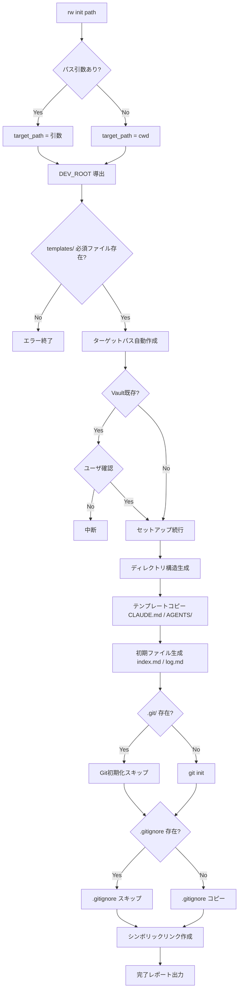
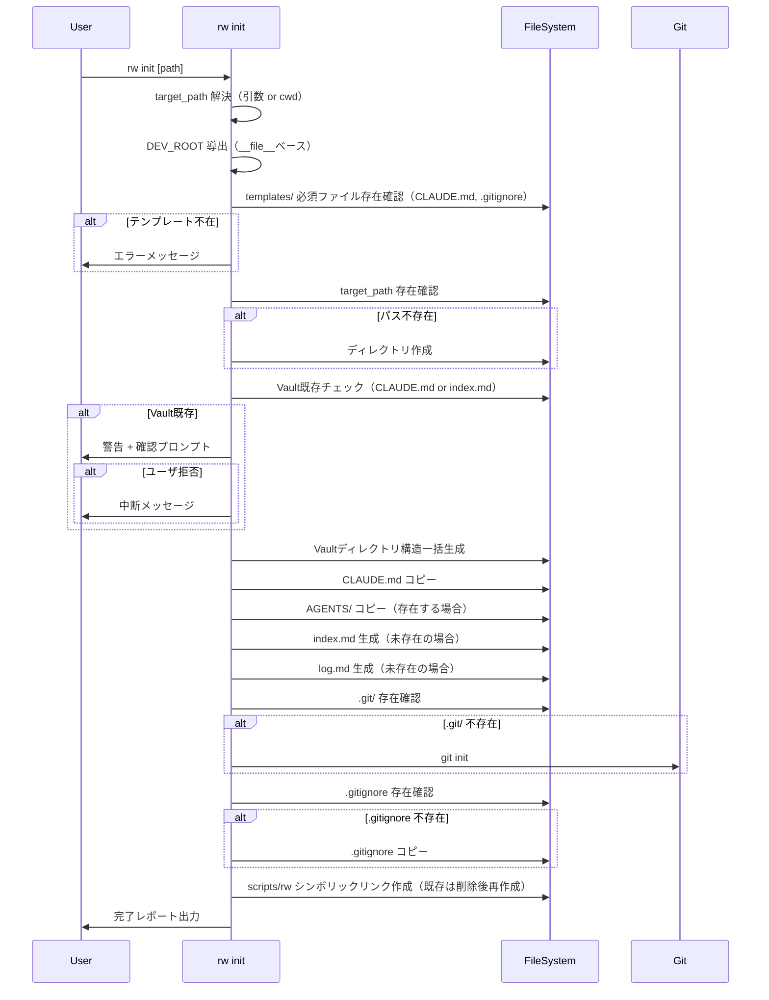

# Design Document: project-foundation

## Overview

**Purpose**: `rw init` コマンドにより任意のディレクトリにRwiki Vault（運用環境）を一括セットアップできるようにする。テンプレート（CLAUDE.mdカーネル）は開発リポジトリの `templates/` で一元管理し、デプロイ時にVaultへコピーする。

**Users**: Rwiki運用者が `rw init <path>` で新しいVaultを作成し、即座にWiki運用を開始できる。

**Impact**: 既存の `scripts/rw_light.py` に `init` サブコマンドを追加し、`templates/` ディレクトリを新設する。

### Goals
- `rw init [path]` で Vault ディレクトリ構造・テンプレート配置・Git初期化・初期ファイル生成・シンボリックリンク作成を一括実行
- `templates/CLAUDE.md` に Wiki 運用カーネルを一元管理
- セットアップ完了レポートで結果を可視化
- プロジェクト README.md と CHANGELOG.md の初版を作成

### Non-Goals
- AGENTS/ サブプロンプトの中身（agents-system スペック）
- query / audit コマンドの実装（cli-query / cli-audit スペック）
- テスト体系の構築（test-suite スペック）
- Obsidian Vault 設定（.obsidian/）
- 開発用 CLAUDE.md の変更

## Boundary Commitments

### This Spec Owns

**開発リポジトリ成果物**（Rwiki-dev に配置）:
- `cmd_init()` 関数の実装（rw_light.py 内）
- `templates/CLAUDE.md` の作成と管理
- `templates/.gitignore` の作成
- プロジェクト `README.md` の作成
- `CHANGELOG.md` 初版の作成

**Vault成果物**（`rw init` 実行時に生成）:
- Vault ディレクトリ構造の生成
- Vault 用 `CLAUDE.md`, `.gitignore` のコピー
- `index.md`, `log.md` 初期ファイル生成
- `scripts/rw` シンボリックリンク作成
- セットアップ完了レポートの出力

### Out of Boundary
- `templates/AGENTS/` の中身（agents-system スペックが後続で配置）
- CLI コマンドの新規追加（query, audit）
- テスト
- docs/ 配下の素案プロンプト
- 既存コマンド（lint, ingest, synthesize-logs, approve）の変更

### Allowed Dependencies
- Python 標準ライブラリのみ（os, shutil, subprocess, sys, pathlib）
- 既存の rw_light.py ユーティリティ関数（`write_text()`, `read_text()`）
- `git` コマンド（subprocess経由）
- `docs/CLAUDE.md`（templates/CLAUDE.md のソースとして参照）

### Revalidation Triggers
- Vault ディレクトリ構造の変更（下流の全スペックに影響）
- `templates/CLAUDE.md` のスキーマ変更（agents-system に影響）
- `cmd_init()` のインターフェース変更（test-suite に影響）

## Architecture

### Existing Architecture Analysis

rw_light.py の既存パターン:

| パターン | 詳細 |
|---------|------|
| コマンド関数 | `cmd_<name>() -> int`（終了コード返却） |
| メイン分岐 | `main()` で `sys.argv[1]` を分岐 |
| パス定数 | モジュールレベルで `ROOT`, `RAW`, `INCOMING` 等を定義 |
| ディレクトリ確保 | `ensure_dirs()` で必要ディレクトリを作成 |
| ファイルI/O | `read_text()`, `write_text()` ユーティリティ |
| Git操作 | `git_commit()` で subprocess 経由 |
| エラーハンドリング | `main()` で FileNotFoundError, RuntimeError をキャッチ |

### Architecture Pattern

`cmd_init()` は既存パターンを踏襲し、以下のステップを順次実行する:



### Technology Stack

| Layer | Choice / Version | Role in Feature | Notes |
|-------|------------------|-----------------|-------|
| CLI | Python 3.10+ (stdlib) | コマンド実装 | 外部ライブラリ不使用 |
| ファイル操作 | os, shutil, pathlib | ディレクトリ・ファイル生成、テンプレートコピー | 既存パターン踏襲 |
| Git | subprocess → git CLI | Vault Git初期化 | 既存 `git_commit()` と同様 |
| シンボリックリンク | os.symlink | CLIエントリポイント | macOS/Linux前提 |

## File Structure Plan

### Directory Structure
```
Rwiki-dev/
├── scripts/
│   └── rw_light.py          # Modified: cmd_init() 追加、main() 更新
├── templates/                # New: テンプレートディレクトリ
│   ├── CLAUDE.md             # New: Wiki運用カーネル（docs/CLAUDE.mdベース）
│   └── .gitignore            # New: Vault用.gitignoreテンプレート
├── README.md                 # Modified: プロジェクト説明に書き換え
└── CHANGELOG.md              # New: Keep a Changelog形式の初版
```

### Modified Files
- `scripts/rw_light.py` — `cmd_init()` 関数追加、`main()` に init 分岐追加、`print_usage()` 更新、開発リポパス導出定数追加

### New Files
- `templates/CLAUDE.md` — `docs/CLAUDE.md` をベースとしたWiki運用カーネル正式版
- `templates/.gitignore` — Vault用.gitignoreテンプレート（raw/incoming/、.obsidian/workspace*、.DS_Store を除外）
- `CHANGELOG.md` — Keep a Changelog形式の初版（project-foundation成果物記録）
- `README.md` — 既存ファイルを書き換え（プロジェクト概要・セットアップ手順・運用サイクル・ディレクトリ構成）

## System Flows

### `rw init` 実行フロー



## Requirements Traceability

| Requirement | Summary | Components | Flows |
|-------------|---------|------------|-------|
| 1.1 | Vaultディレクトリ構造生成 | `cmd_init()` → `VAULT_DIRS` 定数 | init フロー: ディレクトリ生成ステップ |
| 1.2 | パス引数なしでcwd使用 | `cmd_init()` 引数解析 | init フロー: target_path 解決 |
| 1.3 | 不存在パスの自動作成 | `cmd_init()` | init フロー: パス不存在分岐 |
| 1.4 | 既存Vault検出と確認 | `is_existing_vault()` | init フロー: Vault既存チェック |
| 2.1 | templates/CLAUDE.md → Vault CLAUDE.md コピー | `cmd_init()` テンプレートコピー | init フロー: CLAUDE.mdコピー |
| 2.2 | CLAUDE.md にグローバルルール含む | `templates/CLAUDE.md` | — |
| 2.3 | タスク分類・AGENTSマッピング含む | `templates/CLAUDE.md` | — |
| 2.4 | 実行モデル・失敗条件含む | `templates/CLAUDE.md` | — |
| 2.5 | templates/AGENTS/ コピー | `cmd_init()` AGENTS コピー | init フロー: AGENTS/ コピー |
| 2.6 | テンプレート不在時エラー（CLAUDE.md, .gitignore） | `cmd_init()` テンプレート検証 | init フロー: テンプレート不在分岐 |
| 3.1 | Vault で git init 実行 | `cmd_init()` Git初期化 | init フロー: git init |
| 3.2 | .gitignore に raw/incoming/ 含む | `templates/.gitignore` | — |
| 3.3 | .gitignore に .obsidian/ workspace 含む | `templates/.gitignore` | — |
| 3.4 | 既存 .git/ でスキップ | `cmd_init()` .git/ 検出 | init フロー: .git/ 不存在分岐 |
| 4.1 | index.md 生成 | `cmd_init()` 初期ファイル生成 | init フロー: index.md 生成 |
| 4.2 | log.md 生成 | `cmd_init()` 初期ファイル生成 | init フロー: log.md 生成 |
| 4.3 | 既存 index.md 保護 | `cmd_init()` 存在チェック | — |
| 4.4 | 既存 log.md 保護 | `cmd_init()` 存在チェック | — |
| 5.1 | scripts/rw シンボリックリンク作成 | `cmd_init()` symlink ロジック | init フロー: シンボリックリンク |
| 5.2 | シンボリックリンクの実行権限 | `os.chmod()` 適用 | — |
| 5.3 | シンボリックリンク失敗時の案内 | `cmd_init()` エラーハンドリング | — |
| 6.1 | 完了レポート出力 | `cmd_init()` レポート生成 | init フロー: 完了レポート |
| 6.2 | スキップ・警告の報告 | `cmd_init()` レポート生成 | — |
| 7.1 | README: 目的と概要 | `README.md` 概要セクション | — |
| 7.2 | README: セットアップ手順 | `README.md` セットアップセクション | — |
| 7.3 | README: 運用サイクル概要 | `README.md` 運用サイクルセクション | — |
| 7.4 | README: ディレクトリ構成 | `README.md` ディレクトリ構成セクション | — |
| 8.1 | CHANGELOG: Keep a Changelog形式 | `CHANGELOG.md` | — |
| 8.2 | CHANGELOG: 初版記録 | `CHANGELOG.md` | — |

## Components and Interfaces

| Component | Layer | Intent | Req Coverage | Key Dependencies |
|-----------|-------|--------|--------------|------------------|
| `cmd_init()` | CLI | Vaultセットアップの全ステップを統括 | 1-6 | templates/, git CLI |
| `is_existing_vault()` | Utility | Vault既存検出 | 1.4 | なし |
| `VAULT_DIRS` | Constant | Vaultディレクトリ構造の定義 | 1.1 | なし |
| `DEV_ROOT` | Constant | 開発リポジトリルートパス | 2.1, 2.5, 2.6, 5.1 | `__file__` |
| `templates/CLAUDE.md` | Template | Wiki運用カーネル | 2.2-2.4 | docs/CLAUDE.md |
| `templates/.gitignore` | Template | Vault用.gitignore | 3.2, 3.3 | なし |
| `README.md` | Document | プロジェクト説明 | 7.1-7.4 | なし |
| `CHANGELOG.md` | Document | 変更履歴 | 8.1-8.2 | なし |

### CLI Layer

#### `cmd_init()`

| Field | Detail |
|-------|--------|
| Intent | Vaultセットアップの全ステップを統括実行し、結果レポートを出力する |
| Requirements | 1.1-1.4, 2.1, 2.5-2.6, 3.1-3.4, 4.1-4.4, 5.1-5.3, 6.1-6.2 |

**Responsibilities & Constraints**
- `sys.argv` から対象パスを取得（省略時はcwd）
- 各ステップを順次実行し、結果を `report` dictに蓄積
- 各ステップの成功/スキップ/失敗を記録

**Contracts**: Service [x]

##### Service Interface
```python
def cmd_init(args: list[str]) -> int:
    """
    Vaultセットアップを実行する。

    args: コマンドライン引数（target_path を含む場合あり）
    returns: 終了コード（0: 成功, 1: エラー）
    """
    ...
```

**Re-init（既存Vault上書き確認後）時の各アセットポリシー**

| アセット | ポリシー | 動作 |
|---------|---------|------|
| ディレクトリ構造 | 安全再作成 | `os.makedirs(exist_ok=True)` — 既存ファイルに影響なし |
| CLAUDE.md | バックアップ後上書き | 既存を `CLAUDE.md.bak` にリネームしてからコピー |
| AGENTS/ | バックアップ後上書き | 既存を `AGENTS.bak/` にリネームしてからコピー |
| .gitignore | 既存保護 | 既存ファイルがあればスキップ（ユーザ追記を保護） |
| index.md | 既存保護 | 要件4.3 — 既存ファイルがあればスキップ |
| log.md | 既存保護 | 要件4.4 — 既存ファイルがあればスキップ |
| scripts/rw | 削除して再作成 | 既存リンクを `os.remove()` してから `os.symlink()` |

**Implementation Notes**
- `args` パターンは `cmd_lint_query(args)` と同様に `sys.argv[2:]` を受け取る
- 対話的確認（Vault既存時）は `input()` を使用
- 各ステップをtry-exceptで個別にエラー処理し、途中で致命的エラー以外は続行
- バックアップ先に既に `.bak` が存在する場合は上書きする（前回のバックアップを保持し続ける意味がないため）。ファイル（CLAUDE.md.bak）は `os.rename()` で上書き可能。ディレクトリ（AGENTS.bak/）は `shutil.rmtree()` で削除後にリネームする
- シンボリックリンクのパス式: `os.symlink(DEV_ROOT/scripts/rw_light.py, target_path/scripts/rw)` — 絶対パス使用
- `shutil.copytree()` で AGENTS/ をコピーする際は `dirs_exist_ok=True` を指定する（VAULT_DIRS の makedirs で AGENTS/ が既に作成済みのため）

#### `is_existing_vault()`

```python
def is_existing_vault(path: str) -> bool:
    """CLAUDE.md または index.md の存在でVaultを検出する"""
    return os.path.exists(os.path.join(path, "CLAUDE.md")) or \
           os.path.exists(os.path.join(path, "index.md"))
```

### Constants

```python
# 開発リポジトリルート（__file__ ベースで導出）
DEV_ROOT = str(Path(__file__).resolve().parent.parent)

# Vaultディレクトリ構造
VAULT_DIRS = [
    "raw/incoming/articles",
    "raw/incoming/papers/zotero",
    "raw/incoming/papers/local",
    "raw/incoming/meeting-notes",
    "raw/incoming/code-snippets",
    "raw/articles",
    "raw/papers/zotero",
    "raw/papers/local",
    "raw/meeting-notes",
    "raw/code-snippets",
    "raw/llm_logs",
    "review/synthesis_candidates",
    "review/query",
    "wiki/concepts",
    "wiki/methods",
    "wiki/projects",
    "wiki/entities/people",
    "wiki/entities/tools",
    "wiki/synthesis",
    "logs",
    "scripts",
    "AGENTS",
]
```

### Template

#### `templates/CLAUDE.md`

| Field | Detail |
|-------|--------|
| Intent | Wiki運用用のグローバルルールを定義するカーネルファイル |
| Requirements | 2.2, 2.3, 2.4 |

**Content Requirements（docs/CLAUDE.md に既に含まれる内容）**:
- レイヤー分離ルール（raw/review/wiki）
- 知識フロー（raw → review → wiki）
- raw 完全性（LLM書き込み禁止）
- 承認ルール（人間承認必須）
- Wiki整合性（index.md/log.md）
- コミット分離（raw/review/wiki別）
- タスク分類（9種）
- Task → AGENTS マッピング
- 実行モデル（実行宣言・マルチステップルール）
- 監査ルール
- 失敗条件

**Implementation Notes**
- `docs/CLAUDE.md` を `templates/CLAUDE.md` にコピーして作成
- agents-system スペックで AGENTS 参照パスの微調整が入る可能性あり

#### `templates/.gitignore`

| Field | Detail |
|-------|--------|
| Intent | Vault用.gitignoreのテンプレート。init時にVaultへコピーされる |
| Requirements | 3.2, 3.3 |

**Content**:
```
# Rwiki Vault .gitignore
raw/incoming/
.obsidian/workspace.json
.obsidian/workspace-mobile.json
.DS_Store
```

**Implementation Notes**
- `cmd_init()` が `shutil.copy2()` でVaultへコピーする（CLAUDE.mdと同じパターン）

## Error Handling

### Error Strategy

| エラー種別 | 対応 | 終了コード |
|-----------|------|-----------|
| `templates/CLAUDE.md` 不在 | エラーメッセージ表示、即座に中断 | 1 |
| `templates/.gitignore` 不在 | エラーメッセージ表示、即座に中断 | 1 |
| 対象パスの作成失敗（権限不足） | OSError キャッチ、メッセージ表示 | 1 |
| Vault既存でユーザが拒否 | 中断メッセージ、正常終了 | 0 |
| シンボリックリンク作成失敗 | 警告表示 + 手動リンク手順の案内、処理続行 | 0（警告付き） |
| 既存シンボリックリンク | `os.remove()` で削除後に再作成。削除失敗時は警告 + 手動手順案内 | 0（警告付き） |
| git init 失敗 | 警告表示、処理続行 | 0（警告付き） |

**Design Principle**: テンプレート不在は致命的エラー（Vaultの正当性を保証できない）。それ以外のステップ（Git, symlink）は失敗しても他のステップに影響しないため、警告付きで続行する。

## Testing Strategy

> テスト実装は test-suite スペックで行う。ここでは設計上のテスト項目を定義する。

### Unit Tests
- `is_existing_vault()`: 各種条件での検出/非検出
- `VAULT_DIRS` の完全性: 要件定義の全ディレクトリが含まれることの検証
- 引数解析: path 指定あり/なしの分岐

### Integration Tests（tmp_path 使用）
- `cmd_init()` 新規Vault作成: 全ディレクトリ・ファイル・Git・symlinkの生成確認
- `cmd_init()` 既存Vault検出: CLAUDE.md/index.md が存在する場合の挙動
- `cmd_init()` 既存ファイル保護: index.md/log.md が上書きされないことの確認
- `cmd_init()` 既存.git/ スキップ: Git初期化が二重実行されないことの確認
- `cmd_init()` テンプレート不在エラー: templates/CLAUDE.md 不在時の終了コード確認
- `cmd_init()` シンボリックリンク: 作成されたリンクが正しいターゲットを指すことの確認
- `cmd_init()` re-init バックアップ: CLAUDE.md.bak と AGENTS.bak/ が作成されることの確認
- `cmd_init()` re-init .gitignore保護: 既存.gitignore が上書きされないことの確認
- `cmd_init()` re-init symlink再作成: 既存シンボリックリンクが新しいリンクに置換されることの確認

### E2E Tests
- `rw init /tmp/test-vault` の実行と、生成されたVault構造の検証
- `rw init`（パスなし）のcwd動作確認
