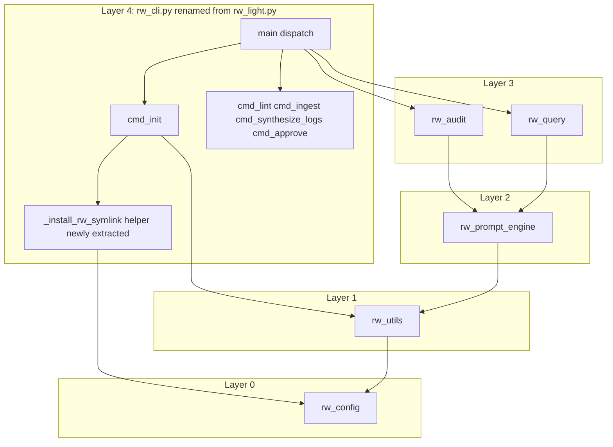
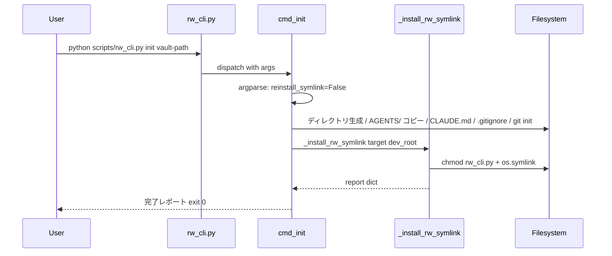
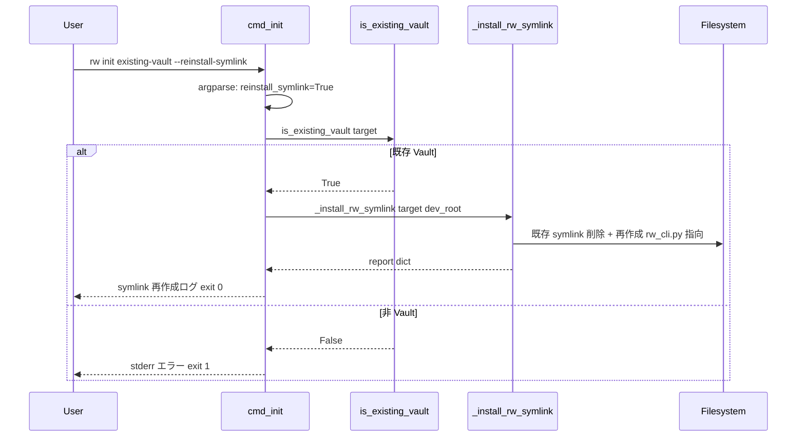

# Design Document: rw-light-rename

## Overview

本設計は、module-split 完了後に責務と名前が乖離した `scripts/rw_light.py` を `scripts/rw_cli.py` へ rename し、他 5 モジュール (`rw_config` / `rw_utils` / `rw_prompt_engine` / `rw_audit` / `rw_query`) と命名一貫性を確立する命名整合リファクタリングを定義する。CLI 外部動作・公開 API・テスト結果は現状不変。

**Purpose**: 開発者・メンテナーの認知負荷低減（6 モジュール全てが `rw_<責務>.py` パターンで一貫）。
**Users**: 開発者・コントリビュータ・module-split 以降の新規参加者。
**Impact**: ファイル名変更に伴うテスト・ドキュメント・steering の参照を全面更新。既存 Vault 向けマイグレーションヘルパ `rw init --reinstall-symlink` を追加。

### Goals

- `scripts/rw_light.py` → `scripts/rw_cli.py` への責務整合リネーム（`git mv` で履歴連続性保持）
- CLI の外部動作契約（usage / サブコマンド / exit code / `main()` エクスポート）を不変維持
- テスト 642 collected（641 passed + 1 skipped）を同件数で維持
- 既存 Vault 向け `rw init --reinstall-symlink` マイグレーションヘルパを `cmd_init` に追加
- `scripts/` 内 docstring と現役ドキュメント群（docs / README / templates / steering）を新ファイル名で一貫化

### Non-Goals

- コマンド動作変更・新機能追加（リネームに起因しないロジック改変は行わない）
- 他 5 モジュール (`rw_config` / `rw_utils` / `rw_prompt_engine` / `rw_audit` / `rw_query`) の内容変更
- `rw_light.py` を bridge / proxy / shim として残す案（Req 1.3 により不採用）
- `.kiro/steering/roadmap.md` の更新（別 spec で一括見直し予定、R3 判断）
- historical ドキュメント（過去 spec 本文 / `CHANGELOG.md` / git commit メッセージ）の変更
- argparse `add_help=False` の変更（既存 `print_usage` カスタム挙動保全、R7 判断）

## Boundary Commitments

### This Spec Owns

- `scripts/rw_light.py` ファイルの物理的 rename（`git mv` による履歴連続性保持）
- `scripts/rw_light.py` 内自己言及 3 箇所（L580 symlink source path、L583 コメント、L589 warn メッセージ）の更新
- `scripts/` 内の他モジュール（`rw_config` / `rw_utils` / `rw_prompt_engine` / `rw_audit` / `rw_query`）の module docstring 内 `rw_light` 言及 8 箇所の更新
- `_install_rw_symlink(target_path, dev_root) -> dict` helper の新規抽出と `cmd_init` の再編成
- `cmd_init` の argparse に `--reinstall-symlink` フラグ追加、非 Vault 検出 validation、早期 return 分岐
- `print_usage` の `rw init` 記載行に `--reinstall-symlink` 追記
- `tests/` 配下全テストファイルの `rw_light` 参照一括置換、`tests/test_rw_light.py` → `tests/test_rw_cli.py` rename
- `tests/conftest.py::mock_templates` fixture のダミーファイル名更新
- `docs/user-guide.md` / `docs/developer-guide.md` / `docs/CLAUDE.md` / ルート `CLAUDE.md` / `templates/CLAUDE.md` / `README.md` の現役ドキュメント参照更新
- `.kiro/steering/structure.md` / `tech.md` の CLI 関連記述同期

### Out of Boundary

- 他 5 モジュールの内容変更（docstring 以外）
- 他 5 モジュール間の DAG 構造（Layer 0–4）変更
- `.kiro/steering/roadmap.md` の更新（別 spec で対処、R3 判断）
- `CHANGELOG.md` / 過去 spec 本文 (`.kiro/specs/**/requirements.md`, `design.md`, `tasks.md`, `research.md`, `brief.md`) の historical 参照
- module-split `requirements.md` Req 6.1 の `rw_light.py` 言及原文への編集（R9 判断、Req 6.3 継承）
- `TODO_NEXT_SESSION.md` / git commit メッセージ等の session 生成物
- CLI サブコマンドの挙動変更（lint / ingest / synthesize-logs / approve / init / query / audit）
- argparse `add_help=False` の変更（R7 判断）

### Allowed Dependencies

- **Upstream (既存)**: `rw_config`, `rw_utils`（`is_existing_vault`）, `rw_prompt_engine`, `rw_audit`, `rw_query` — これらは rw_cli から import のみ。本スペックは これらの import パスを変更しない
- **Standard library**: `argparse`, `os`, `shutil`, `subprocess`, `sys` 等の標準ライブラリ使用パターンは既存踏襲
- **Git**: `git mv` による rename と履歴連続性保持（Req 1.2）
- **Constraint**: 既存 DAG（Layer 0–4）を維持、module-split Req 1.3 の re-export ゼロ方針を継承

### Revalidation Triggers

本スペック完了後、以下の変更が発生した場合は関連 spec / consumer が再検証を要する:

- **Contract**: `scripts/rw_cli.py` のファイル名・`main()` シンボル・CLI usage / サブコマンド構造のいずれかが変更された場合
- **Data Ownership**: `cmd_init` の report dict 出力形式が変更された場合
- **Dependency Direction**: `rw_cli` が他モジュールを新たに import する / 逆方向の import が発生した場合
- **Runtime Prerequisite**: 既存 Vault 再構成手順 (`rw init --reinstall-symlink`) のインタフェースや挙動が変更された場合

## Architecture

### Existing Architecture Analysis

module-split 完了時点で CLI ツールは以下の DAG 構造を持つ（`.kiro/steering/structure.md` より）:

- Layer 0: `rw_config.py` — 全グローバル定数
- Layer 1: `rw_utils.py` — 汎用ユーティリティ
- Layer 2: `rw_prompt_engine.py` — Claude CLI 呼び出し + プロンプト構築
- Layer 3: `rw_audit.py` / `rw_query.py` — audit / query コマンド
- Layer 4: `rw_light.py` — エントリポイント + argparse dispatcher + 残留コマンド (`cmd_lint` / `cmd_ingest` / `cmd_synthesize_logs` / `cmd_approve` / `cmd_init`)

本スペックは Layer 4 のファイル名のみを `rw_light.py` → `rw_cli.py` に rename。DAG 構造・import 方向・モジュール境界は一切変更しない。

### Architecture Pattern & Boundary Map



**Architecture Integration**:
- Selected pattern: **責務別モジュール分割 CLI（Layered DAG）** — module-split で確立済みのパターンを踏襲
- 新規 boundary: `_install_rw_symlink` helper は `cmd_init` 内部の private helper として新規導入。Layer 4 内完結のため DAG 影響なし
- 既存パターン継承: モジュール修飾参照規約 (`rw_<module>.<symbol>`)、re-export 排除、`sys.path[0]` 自動解決
- Steering 準拠: `structure.md` / `tech.md` の CLI 構成記述を rw_cli 参照に同期

### Technology Stack

| Layer | Choice / Version | Role in Feature | Notes |
|-------|------------------|-----------------|-------|
| CLI | Python 3.10+ / `argparse`（標準） | `--reinstall-symlink` フラグ追加 | 既存 `cmd_init` argparse に `add_argument` で追加、`add_help=False` 維持 |
| Runtime | `os.symlink` / `os.chmod` / `os.path.islink` / `os.remove`（標準） | symlink 作成・再作成 | 既存 `cmd_init` L579-604 ロジックを helper に抽出 |
| Version Control | `git mv` | ファイル rename + 履歴連続性保持 | Req 1.2 を自動満たす |
| Testing | `pytest` 既存設定 | 642 collected を厳密に維持 | 論理変更なし、文字列置換主体 |

外部依存の追加なし（`product.md` の Zero-dependency 原則準拠）。

## File Structure Plan

### Directory Structure

本スペックの変更は **ファイル rename + 既存ファイル内改変** のみ。新規ディレクトリ作成なし。

```
scripts/
├── rw_cli.py                 # ← rw_light.py を git mv（履歴連続性保持）
│   ├── cmd_lint(), cmd_ingest(), cmd_synthesize_logs(),
│   │   cmd_approve()         # 既存、本スペックで未変更
│   ├── cmd_init()            # 改変: --reinstall-symlink 分岐 + helper 呼び出し
│   ├── _install_rw_symlink() # 新規: L579-604 から抽出
│   ├── print_usage()         # 改変: rw init 行に --reinstall-symlink 追記
│   └── main()                # 既存、本スペックで未変更
├── rw_config.py              # docstring 内 rw_light 言及 1 箇所更新
├── rw_utils.py               # docstring 内 rw_light 言及 1 箇所更新
├── rw_prompt_engine.py       # docstring 内 rw_light 言及 2 箇所更新
├── rw_audit.py               # docstring 内 rw_light 言及 2 箇所更新
└── rw_query.py               # docstring 内 rw_light 言及 2 箇所更新
                              #   うち historical 1 箇所は補注追記

tests/
├── test_rw_cli.py            # ← test_rw_light.py を git mv + 内部 rw_light 参照 24 箇所更新
├── conftest.py               # rw_light 参照 3 箇所更新 + mock_templates ダミーファイル名更新
├── test_init.py              # rw_light 参照 37 箇所更新
├── test_lint.py              # rw_light 参照 24 箇所更新
├── test_ingest.py            # rw_light 参照 18 箇所更新（shutil.move 参照含む）
├── test_approve.py           # rw_light 参照 13 箇所更新
├── test_synthesize_logs.py   # rw_light 参照 11 箇所更新
├── test_source_vocabulary.py # rw_light 参照 4 箇所更新
├── test_conftest_fixtures.py # rw_light 参照 2 箇所更新
├── test_git_ops.py           # rw_light 参照 2 箇所更新
├── test_utils.py             # rw_light 参照 1 箇所更新
├── test_audit.py             # rw_light 参照 1 箇所更新
└── test_lint_query.py        # rw_light 参照 1 箇所更新

docs/
├── CLAUDE.md                 # rw_light 参照 1 箇所更新（L131 symlink 説明）
└── developer-guide.md        # rw_light 参照 20 箇所更新（現役ドキュメント全体）

templates/
└── CLAUDE.md                 # rw_light 参照 1 箇所更新（L109）

.kiro/steering/
├── structure.md              # rw_light 参照 5 箇所更新
└── tech.md                   # rw_light 参照 5 箇所更新

CLAUDE.md                     # ルート、rw_light 参照があれば更新（実装時 grep 確認）
README.md                     # rw_light 参照 6 箇所更新（L33/L37/L50/L95/L102/L127）
```

### Modified Files

| Path | Change Summary |
|------|----------------|
| `scripts/rw_light.py` → `scripts/rw_cli.py` | `git mv` で rename、内部自己言及 3 箇所更新、`cmd_init` 拡張、`_install_rw_symlink` helper 抽出、`print_usage` 更新 |
| `scripts/{rw_config,rw_utils,rw_prompt_engine,rw_audit,rw_query}.py` | docstring 内 `rw_light` 言及 8 箇所を `rw_cli` に更新（historical 補注含む） |
| `tests/test_rw_light.py` → `tests/test_rw_cli.py` | `git mv` で rename、内部 `rw_light` 参照 24 箇所更新 |
| `tests/{conftest,test_init,test_lint,test_ingest,test_approve,test_synthesize_logs,test_source_vocabulary,test_conftest_fixtures,test_git_ops,test_utils,test_audit,test_lint_query}.py` | `rw_light` 参照を `rw_cli` に一括置換（import / monkeypatch object + 文字列 / 直接アクセス / shutil.move / mock_templates ダミー） |
| `docs/CLAUDE.md`, `docs/developer-guide.md` | 現役ドキュメント参照を `rw_cli` に更新 |
| `templates/CLAUDE.md` | Vault 向けテンプレート参照更新 |
| `.kiro/steering/structure.md`, `.kiro/steering/tech.md` | CLI 構成記述を `rw_cli` に同期 |
| `CLAUDE.md` (root), `README.md` | 現役ドキュメント参照を `rw_cli` に更新 |

### Out of Scope Files (historical preservation)

- `.kiro/steering/roadmap.md`（R3 判断、別 spec で対処）
- `CHANGELOG.md`（R4 判断、変更履歴エントリ）
- `.kiro/specs/**/*.md`（過去 spec 本文、Req 6.3 継承）
- `TODO_NEXT_SESSION.md`（session 生成物）

### Implementation-time Grep Required

- `.claude/settings.local.json` 内 6 箇所（R8 判断、permission 文字列内なら機械置換、それ以外は個別判断）
- ルート `CLAUDE.md` 内の `rw_light` 参照（実装時 grep で確定）

## System Flows

### Flow 1: 新規 Vault 初期化（Req 4）



### Flow 2: 既存 Vault マイグレーション（Req 5）



**Key Decisions**:
- 通常初期化処理（ディレクトリ生成・テンプレートコピー・git init 等）は `--reinstall-symlink` 指定時に skip され、symlink 張り替えのみ実行（Req 5.2）
- `--reinstall-symlink` + `--force` 併用時は警告出力のうえ `--reinstall-symlink` を優先（R6 判断）
- 非 Vault 判定は `rw_utils.is_existing_vault()` を再利用（`CLAUDE.md` または `index.md` 存在で判定）、exit 1 は severity-unification 契約の runtime error カテゴリ（Req 5.3）

## Requirements Traceability

| Req | Summary | Components | Interfaces / Contracts | Flows |
|-----|---------|------------|------------------------|-------|
| 1.1 | `rw_cli.py` 単一エントリ、`rw_light.py` 不在 | File rename | `git mv` | — |
| 1.2 | git 履歴連続性 | `git mv` 実行 | `git log --follow scripts/rw_cli.py` | — |
| 1.3 | bridge/proxy 不在 | File Structure Plan の Out of Scope | — | — |
| 2.1 | usage 不変 | `print_usage` | 既存 usage 出力 + `--reinstall-symlink` 追記のみ | — |
| 2.2 | サブコマンド挙動不変 | `main()` dispatcher | 既存挙動継承 | — |
| 2.3 | `main()` top-level 位置 | `scripts/rw_cli.py:main()` | 既存 L642 位置維持 | — |
| 3.1 | 642 collected 同件数 | — | pytest tests/ | — |
| 3.2 | import 参照 0 | tests/ 全ファイル | `import rw_cli` 形態統一 | — |
| 3.3 | monkeypatch 参照 0 | tests/ 全ファイル | object 形 + 文字列形両方置換 | — |
| 3.4 | 直接アクセス 0 | tests/ 全ファイル | `rw_cli.<sym>` 形態統一 | — |
| 3.5 | `shutil.move` 参照置換 | conftest.py, test_ingest.py | `rw_cli.shutil.move` | — |
| 3.6 | mock_templates ダミー更新 | conftest.py | `<tmp>/scripts/rw_cli.py` 生成 | Flow 1 / 2 の cmd_init chmod 対象整合 |
| 4.1 | symlink ターゲット更新 | `_install_rw_symlink` | `rw_src = scripts/rw_cli.py` | Flow 1 |
| 4.2 | symlink 起動 usage 表示 | 既存 `sys.path[0]` 自動解決 | — | — |
| 5.1 | `--reinstall-symlink` で symlink 再作成 | `cmd_init` + `_install_rw_symlink` | argparse フラグ + early return | Flow 2 |
| 5.2 | 通常初期化 skip | `cmd_init` 早期 return | — | Flow 2 |
| 5.3 | 非 Vault 時 exit 1 | `cmd_init` validation | `is_existing_vault()` 使用 | Flow 2 |
| 5.4 | `--help` に記載 | `add_argument(help=...)` + `print_usage` 1 行追加 | | — |
| 6.1 | docs / templates / README 更新 | File Structure Plan の Modified Files | — | — |
| 6.2 | steering 更新 | structure.md / tech.md | — | — |
| 6.3 | historical 保持 | Boundary Commitments の Out of Boundary | — | — |

## Components and Interfaces

| Component | Domain/Layer | Intent | Req Coverage | Key Dependencies | Contracts |
|-----------|--------------|--------|--------------|------------------|-----------|
| `scripts/rw_cli.py` | Layer 4 CLI | rename 後のエントリポイント（旧 rw_light.py） | 1.1, 1.3, 2.1, 2.2, 2.3 | rw_config/utils/prompt_engine/audit/query (P0) | Service |
| `_install_rw_symlink` | Layer 4 private helper | symlink 作成 + chmod + 既存削除を単一関数化 | 4.1, 5.1 | rw_config (P0) | Service |
| `cmd_init` (modified) | Layer 4 subcommand | 通常 init + `--reinstall-symlink` 分岐 | 4.1, 5.1, 5.2, 5.3, 5.4 | rw_utils.is_existing_vault (P0), _install_rw_symlink (P0) | Service |
| `print_usage` (modified) | Layer 4 helper | usage 出力に `--reinstall-symlink` 追加 | 2.1, 5.4 | — | Service |

### Layer 4 / CLI

#### `_install_rw_symlink` (new private helper)

| Field | Detail |
|-------|--------|
| Intent | `cmd_init` 内インライン symlink 作成ロジックを抽出し、通常 init と `--reinstall-symlink` の両パスから再利用可能な単一関数とする |
| Requirements | 4.1, 5.1 |

**Responsibilities & Constraints**
- `dev_root/scripts/rw_cli.py` に実行権限付与（`os.chmod` with 既存 mode \| 0o755）
- `target_path/scripts/rw` が既存 symlink なら削除、新規 `os.symlink` で `rw_cli.py` を指向するリンクを作成
- 例外発生時はそのまま上位に伝播させる（呼び出し側 `cmd_init` で既存 try/except と同じ形で捕捉）
- 戻り値は report dict に merge 可能な形式

**Dependencies**
- Inbound: `cmd_init` — 通常 init パス + `--reinstall-symlink` パスの 2 箇所から呼び出し (P0)
- Outbound: `rw_config.DEV_ROOT`（引数で注入） (P0)
- External: `os.chmod`, `os.symlink`, `os.path.islink`, `os.remove`（標準） (P0)

**Contracts**: Service [x]

##### Service Interface
```python
def _install_rw_symlink(target_path: str, dev_root: str) -> dict[str, str]:
    """rw symlink を作成（または張り替え）する。

    target_path/scripts/rw が既存 symlink の場合は削除して再作成する。
    rw_cli.py に実行権限を付与する（既に実行可能なら skip）。

    Returns:
        dict with "symlink" key containing result message
        ("created: <link> -> <src>" or "failed: <error>")

    Raises:
        None — chmod 失敗はログ出力のみ、symlink 作成失敗は report 経由で報告
        （既存 cmd_init L584-604 の挙動を保全）
    """
```

- Preconditions: `target_path/scripts/` ディレクトリが存在すること（通常 init パスでは `cmd_init` が既に生成済み、`--reinstall-symlink` パスでは `is_existing_vault()` 後続の check で保証）
- Postconditions: `target_path/scripts/rw` が `dev_root/scripts/rw_cli.py` を指す symlink として存在（既存 symlink あれば上書き）
- Invariants: `_install_rw_symlink` は純粋な helper で report dict のみ返却、sys.exit しない

**Implementation Notes**
- Integration: 既存 `cmd_init` L579-604 から **挙動等価で** 抽出。chmod タイミング・エラーハンドリング・report 形式を保全
- Validation: 単体テストで通常 init と再作成両パス + chmod 失敗時の挙動を検証
- Risks: 抽出時に既存 report dict との形式不整合 → 抽出前後で同一テストが通ることを確認

#### `cmd_init` (modified)

| Field | Detail |
|-------|--------|
| Intent | 通常 Vault 初期化 + `--reinstall-symlink` による symlink-only 張り替え分岐 |
| Requirements | 4.1, 5.1, 5.2, 5.3, 5.4 |

**Responsibilities & Constraints**
- argparse で `--reinstall-symlink` を受理（既存 `--force` / `target` と併存）
- `--reinstall-symlink=True` の場合: `is_existing_vault()` で Vault 判定 → 非 Vault なら stderr エラー + return 1、Vault なら `_install_rw_symlink` 呼び出しのみ実行して return 0
- `--reinstall-symlink=True` + `--force=True` 併用時: stderr 警告出力のうえ `--reinstall-symlink` を優先（R6 判断）
- `--reinstall-symlink=False` の場合: 既存通常初期化処理（ディレクトリ生成・テンプレートコピー・git init・.gitignore・`_install_rw_symlink`）を全て実行
- `add_help=False` 維持、カスタム `print_usage` に `--reinstall-symlink` 行を追加

**Dependencies**
- Inbound: `main()` dispatcher — `cmd == "init"` で呼び出し (P0)
- Outbound: `rw_utils.is_existing_vault()` — Vault 判定 (P0)、`_install_rw_symlink()` — symlink 処理 (P0)
- External: `argparse.ArgumentParser` (P0)

**Contracts**: Service [x]

##### Service Interface
```python
def cmd_init(args: list[str]) -> int:
    """
    Vaultセットアップまたは symlink 張り替えを実行する。

    args: コマンドライン引数
      --force : 既存 AGENTS/ を .backup/ に退避して上書き
      --reinstall-symlink : 既存 Vault の rw symlink のみ張り替え（他処理 skip）
      target : 対象ディレクトリ（省略時は cwd）

    returns: 終了コード
      0 : 成功
      1 : エラー（非 Vault + --reinstall-symlink、テンプレート不在 等）
    """
```

- Preconditions: `args` は `sys.argv[2:]` から渡される（`main()` dispatcher 経由）
- Postconditions:
  - 通常パス: Vault 完全初期化、`scripts/rw → scripts/rw_cli.py` symlink 作成
  - `--reinstall-symlink` パス: 既存 Vault の `scripts/rw` symlink のみ `rw_cli.py` 指向に張り替え、他ディレクトリ・ファイルは不変
- Invariants: `--reinstall-symlink` パスでは `report` dict 形式は既存通常パスと異なる（symlink キーのみ）、ただしコンソール出力の基本形式（完了レポート）は共通

**Implementation Notes**
- Integration: argparse 追加は既存 `parser.add_argument` パターン踏襲。早期 return 分岐は argparse 直後に挿入
- Validation: Req 3.1 緩和（現行件数以上）により、Req 5 `--reinstall-symlink` 専用の **自動テストを本スペック内で追加**。`test_init.py` に以下の新規テストを加える:
  1. `test_cmd_init_reinstall_symlink_on_existing_vault`: 既存 Vault に対して `--reinstall-symlink` を実行 → symlink のみ張り替え、通常初期化処理が skip されることを確認（Req 5.1, 5.2）
  2. `test_cmd_init_reinstall_symlink_rejects_non_vault`: 非 Vault ディレクトリに対して `--reinstall-symlink` を実行 → stderr エラー + exit 1 を確認（Req 5.3）
  3. `test_cmd_init_reinstall_symlink_with_force_warns`: `--reinstall-symlink` + `--force` 併用 → 警告出力 + `--reinstall-symlink` 優先挙動を確認（R6 判断）
- 既存 `cmd_init` テスト (test_init.py 37 箇所) は参照書き換えのみで挙動不変
- Risks: テスト追加による collect 件数増加は Req 3.1 緩和で許容、既存 `test_init.py` の fixture（mock_templates 等）を再利用して追加テストは monkeypatch パターンを統一

#### `print_usage` (modified)

| Field | Detail |
|-------|--------|
| Intent | usage 出力に `--reinstall-symlink` フラグを記載（Req 5.4） |
| Requirements | 2.1, 5.4 |

**Responsibilities & Constraints**
- 既存 L630 `rw init [<path>]` 行を `rw init [<path>] [--force] [--reinstall-symlink]` に拡張、またはサブ行として `--reinstall-symlink` 説明を追加
- `rw` プレフィックス、既存サブコマンド記述順序を保全（Req 2.1 usage 不変制約）
- argparse `add_help=False` 維持のため、argparse 自動 `--help` は発行されず、`print_usage` が唯一の usage ソース

**Implementation Notes**
- 既存テスト `test_rw_light.py` → `test_rw_cli.py` 内の usage テストが存在する可能性 → 実装時に既存アサーション文字列を新 usage 文字列に合わせて同時更新
- Risk: usage 文字列を一語でも変えると 既存 assert が失敗 → rename 済みテストで 1 度回して赤検出 → usage 更新 → green が自然なサイクル

## Data Models

### Domain Model

本スペックは **新規データモデル導入なし**。以下の既存モデルのみを touch:

- **`cmd_init` report dict** (`dict[str, Any]`): 既存形式を保全。`--reinstall-symlink` パスでは以下の dict を使用（通常パスと同一キー集合を保持、値は reinstall 時の実情に合わせる）:
  ```python
  report = {
    "target": target_path,
    "dirs_created": 0,
    "templates_copied": [],
    "skipped": [],
    "git_init": "skipped (--reinstall-symlink)",
    "gitignore": "skipped (--reinstall-symlink)",
    "symlink": <_install_rw_symlink の結果文字列>,
  }
  ```
  これにより完了レポート出力 (`=== rw init 完了レポート ===`) の表示ロジックが通常パスと共通化され、`skipped (--reinstall-symlink)` を見れば reinstall パスであることを識別できる
- **`_install_rw_symlink` 戻り値**: `{"symlink": str}` 形式、`cmd_init` の `report["symlink"]` に直接 merge 可能

### Data Contracts

- symlink path contract: `target_path/scripts/rw` → `dev_root/scripts/rw_cli.py`（絶対パス、既存 `os.path.join` ベースの解決方式継承）
- 既存 `os.chmod` mode 設定: `current_mode | 0o755`（既存踏襲）

## Error Handling

### Error Strategy

- **User Error (Req 5.3)**: `--reinstall-symlink` が非 Vault に対して指定された場合 → stderr に明示メッセージ + return 1
  - メッセージ例: `[ERROR] '<target>' は既存の Vault ではありません（CLAUDE.md または index.md が不在）。--reinstall-symlink は既存 Vault にのみ適用可能です。`
- **User Warning (R6)**: `--reinstall-symlink` + `--force` 併用 → stderr 警告 + `--reinstall-symlink` 優先で処理続行
  - メッセージ例: `[WARN] --reinstall-symlink と --force が併用されました。--reinstall-symlink を優先します。`
- **System Error (既存)**: テンプレートファイル不在・ディレクトリ作成失敗等の既存エラーハンドリングは不変
- **Symlink 作成失敗**: 既存挙動保全（`[WARN] シンボリックリンク作成失敗` + 手動作成手順表示 + return 0）

### Monitoring

- Vault 再構成の print 出力は既存完了レポート形式（`=== rw init 完了レポート ===` ブロック）を踏襲
- `--reinstall-symlink` パスでは `dirs_created`, `templates_copied` は 0 / 空で出力される（通常パスと区別可能）

## Testing Strategy

### 制約と原則

Req 3.1 により **現行件数以上（642 collected = 641 passed + 1 skipped 以上）を維持**。既存テストの論理変更（monkeypatch パターン変更・アサーション論理変更等）は Out of scope。許可される変更は以下:
- 既存テストの参照書き換え（`rw_light` → `rw_cli` の文字列置換）
- Req 5 の `--reinstall-symlink` 機能カバレッジ確保のための新規テスト追加（限定的）

### `--reinstall-symlink` カバレッジ戦略

design review Issue 1 を受けて Req 3.1 を緩和、本スペック内で **3 件の自動テストを新規追加**（詳細は `cmd_init` Implementation Notes 参照）:
1. `test_cmd_init_reinstall_symlink_on_existing_vault` (Req 5.1, 5.2)
2. `test_cmd_init_reinstall_symlink_rejects_non_vault` (Req 5.3)
3. `test_cmd_init_reinstall_symlink_with_force_warns` (R6 判断)

追加後の期待件数: **645 collected = 644 passed + 1 skipped**（642 + 3）。

理由:
- 新機能の CI 保護を確保、手動検証依拠のリスクを排除
- 既存テストの論理変更は引き続き禁止（Req 3.1 緩和は追加のみ許容）
- 3 件は `--reinstall-symlink` パスの主要分岐を網羅する最小十分セット

### Unit Tests

**既存テストの参照書き換え（論理変更なし）**:
- `test_init.py` (37 箇所): `cmd_init` と `_install_rw_symlink` の既存テストカバレッジを `rw_cli` 参照で維持
- `test_rw_cli.py` (旧 `test_rw_light.py`, 24 箇所): query/audit/Prompt Engine テスト、`import rw_cli` + `monkeypatch.setattr(rw_cli, ...)` 等に置換
- `test_lint.py` / `test_ingest.py` / `test_approve.py` / `test_synthesize_logs.py`: 各コマンドテストで `rw_cli.<cmd_*>` 参照に置換
- `conftest.py`: `mock_templates` fixture の `scripts/rw_light.py` ダミーファイルを `scripts/rw_cli.py` に変更（Req 3.6）、`rw_cli.shutil.move` 参照に置換（Req 3.5）
- `test_ingest.py`: `rw_cli.shutil.move` 参照更新（Req 3.5）

**新規追加テスト（Req 5 カバレッジ確保）**:
- `test_init.py::test_cmd_init_reinstall_symlink_on_existing_vault`: mock_templates fixture を流用して既存 Vault を用意、`cmd_init(["<target>", "--reinstall-symlink"])` 実行、report の `dirs_created=0` / `templates_copied=[]` / `symlink: created` + 実ファイル system 上の symlink が `rw_cli.py` を指すことを確認
- `test_init.py::test_cmd_init_reinstall_symlink_rejects_non_vault`: `CLAUDE.md` も `index.md` も存在しないディレクトリで `cmd_init(["<target>", "--reinstall-symlink"])` 実行、capsys で stderr 内容確認、戻り値 1 を確認
- `test_init.py::test_cmd_init_reinstall_symlink_with_force_warns`: `cmd_init(["<target>", "--reinstall-symlink", "--force"])` 実行、capsys で `[WARN] --reinstall-symlink と --force が併用されました` メッセージ出力を確認、`--reinstall-symlink` 挙動（通常初期化 skip）で進行することを確認

### Integration Tests

- 既存 Vault 初期化 E2E 系テストが `rw_light.py` ファイル名に依存している場合、`rw_cli.py` へ更新（文字列置換主体）
- symlink 経由起動の既存テストがあれば `rw_cli.py` ターゲットに更新

### Manual Verification

本スペック完了時に以下を手動で検証（CI では補足しきれない範囲）:
1. `git log --follow scripts/rw_cli.py` で rename 前のコミット履歴が辿れる（Req 1.2）
2. `python scripts/rw_cli.py` が既存 usage テキストを表示（`--reinstall-symlink` 追記のみの差分）（Req 2.1, 5.4）
3. 新規ディレクトリで `python scripts/rw_cli.py init ./tmp-vault` が symlink 作成（Req 4.1, 4.2）
4. 上記 Vault で `python scripts/rw_cli.py init ./tmp-vault --reinstall-symlink` が symlink のみ再作成（Req 5.1, 5.2）
5. 非 Vault ディレクトリで `--reinstall-symlink` 指定時に exit 1（Req 5.3）

### Test Count Constraint

pytest 実行コマンド: `pytest tests/ -q` → **`644 passed, 1 skipped` 以上** が出力されることを確認（既存 641 passed + 新規 3 passed + 1 skipped）。642 未満の場合はリグレッションとして扱う。

## Migration Strategy

### Phase breakdown

本スペックは単一 phase で完結（module-split の多段 phase と異なり、変更規模が小さいため）。ただし中間状態で pytest が機能しない「バッチ一体 step」が存在するため、実装順序は以下の 5 step に整理する:

1. **【バッチ A: rename + コード同期更新】**（原子的実施、同一コミット推奨）
   - `git mv scripts/rw_light.py scripts/rw_cli.py`
   - `git mv tests/test_rw_light.py tests/test_rw_cli.py`
   - `rw_cli.py` 内部自己言及 3 箇所（L580 symlink src path / L583 コメント / L589 warn メッセージ）を `rw_cli.py` に更新
   - `_install_rw_symlink` helper 抽出、`cmd_init` 早期 return 分岐追加、`print_usage` 更新
   - **`test_init.py` に `--reinstall-symlink` 新規テスト 3 件を追加**（Req 5 カバレッジ）
   - `tests/` 配下の `rw_light` 参照を `rw_cli` に一括置換（141 箇所、`rg -l rw_light tests/ | xargs sed -i ''` 等）
   - `conftest.py::mock_templates` fixture のダミーファイル名を `scripts/rw_cli.py` に更新
   - **この step は原子的に実施すること**: step 分割すると中間コミットで `cmd_init` の `os.stat(rw_src)` が FileNotFoundError、既存テストが赤になる
   - step 完了時の期待値: `pytest tests/ -q` → 644 passed + 1 skipped

2. **`scripts/` 他モジュール docstring 更新**: 8 箇所（`rw_config.py`, `rw_utils.py`, `rw_prompt_engine.py`, `rw_audit.py`, `rw_query.py`）。historical 記述 1 箇所（`rw_query.py:4`）は「rw_light.py (現 rw_cli.py) から物理移動」形で補注追加
   - step 完了後 pytest green 維持（docstring 変更のため影響なし想定）

3. **ドキュメント更新**: `docs/user-guide.md`, `docs/developer-guide.md`, `docs/CLAUDE.md`, ルート `CLAUDE.md`, `templates/CLAUDE.md`, `README.md` の `rw_light` 参照を `rw_cli` に更新

4. **steering 更新**: `.kiro/steering/structure.md`, `.kiro/steering/tech.md` の CLI 構成記述を `rw_cli.py` に同期

5. **最終検証**:
   - `pytest tests/ -q` で 644 passed + 1 skipped 以上を確認（Req 3.1）
   - `rg -l rw_light` で Out of Boundary 対象（roadmap.md, CHANGELOG.md, 過去 spec 本文, TODO_NEXT_SESSION.md）以外に残存参照がないことを確認
   - 手動検証 1-5 を実施（Testing Strategy / Manual Verification 参照）

### Rollback triggers

- pytest 件数差分検出（644 未満）: `git reset` で rename 取消 → 原因調査
- CLI 外部動作差分検出: Req 2.1/2.2 違反 → 原因調査（rename 以外の副作用混入の可能性）

### Validation checkpoints

- **step 1 完了後**: `pytest tests/ -q` で 644 passed + 1 skipped を確認（バッチ一体 step の green 検証）
- **step 2/3/4 完了後**: 各 step 完了後に pytest green を維持（docstring/docs/steering 変更のため論理影響なし想定）
- **step 5**: 残存参照 grep 検証 + 手動検証を実施

### Why step 1 is a batch

以下の依存関係により、step 1 の内部要素は **原子的に実施しなければ中間状態で pytest が赤になる**:
- `rw_cli.py` 内 L580 `rw_src = "scripts/rw_cli.py"` と `conftest.py::mock_templates` の dummy ファイル名は同期して変わる必要あり
- `tests/` 内の `import rw_light` / `monkeypatch.setattr(rw_light, ...)` は `rw_cli` が存在する状態で一斉に書き換える必要あり
- `git mv` で tests/test_rw_light.py を rename すると古い import が残った状態でテスト collect エラー

実装者は step 1 を 1 コミットで完結させるか、もしくはバッチ内の個別変更を複数コミットに分けてもプッシュ前に squash するなど、**公開される履歴上は原子的** になるように実施する。

## Security Considerations

本スペックは **新規認可・認証・外部通信を導入しない**。既存 `product.md` の Safety Guardrails（LLM は raw/wiki 層を直接変更できない）・Traceability（Git 追跡）は一切変更されない。

唯一の注意点:
- `_install_rw_symlink` は既存の symlink 作成ロジックをそのまま保全するため、既存の `chmod 0o755` 付与挙動に変更なし
- `--reinstall-symlink` の非 Vault 判定は `rw_utils.is_existing_vault()` を使うため、誤って任意ディレクトリに symlink を作成する脆弱性は導入されない

## Supporting References

- `research.md` — gap analysis（646 参照の分布）、R1-R10 判断根拠、synthesis outcomes
- `requirements.md` — 6 要件 / 21 AC の原文
- `.kiro/steering/structure.md` — module-split 完了後の責務別 6 モジュール構成
- `.kiro/steering/tech.md` — severity/exit code 契約（Req 5.3 で参照）
- module-split spec — `rw_light.py` を Layer 4 として確定した前提スペック（Req 6.3 継承元）
