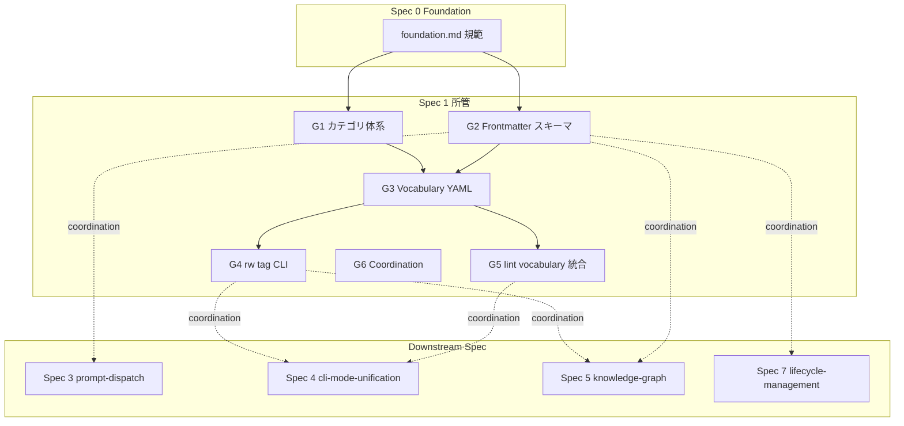
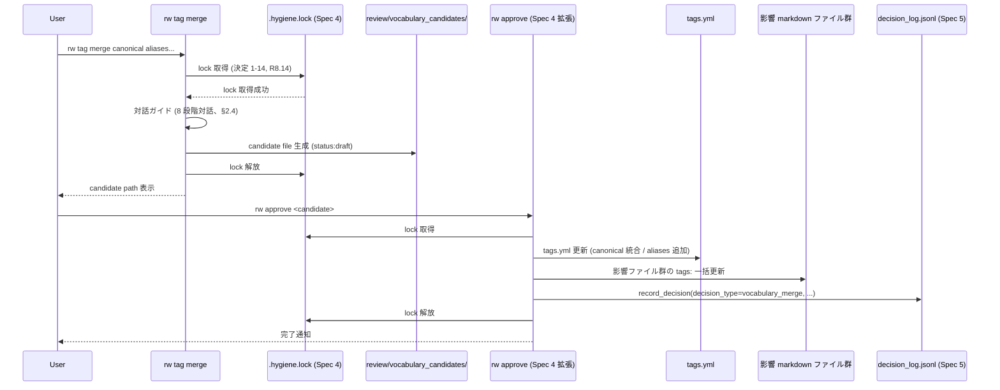
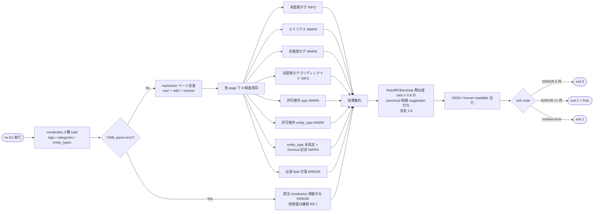
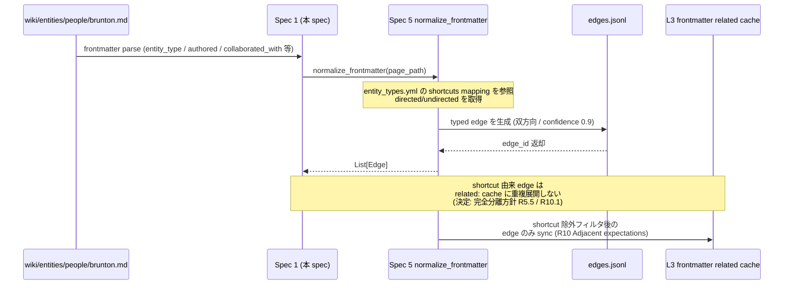
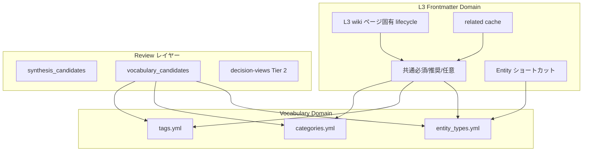
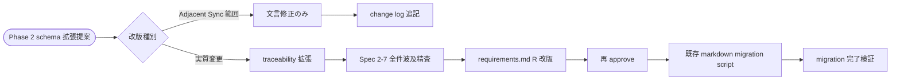

# Technical Design Document: rwiki-v2-classification

## Overview

**Purpose**: 本 spec は Rwiki v2 の Phase 1 として L3 Curated Wiki の **分類体系基盤** を確立する。Foundation (Spec 0) が固定したビジョン・原則・3 層アーキテクチャ・frontmatter 骨格に準拠しつつ、(a) カテゴリディレクトリ構造の推奨パターン、(b) frontmatter スキーマ詳細、(c) `.rwiki/vocabulary/` 配下 3 種 (tags / categories / entity_types) の YAML スキーマ、(d) `rw tag *` 13 サブコマンド、(e) lint vocabulary 統合、(f) L3 frontmatter `related:` cache 規約、(g) Entity 固有ショートカット field の宣言と mapping table、(h) 新規 review 層 `review/vocabulary_candidates/` を定義する。

**Users**: Spec 3 (prompt-dispatch) / Spec 4 (cli-mode-unification) / Spec 5 (knowledge-graph) / Spec 7 (lifecycle-management) の起票者と実装者、および Rwiki v2 ユーザー (vocabulary を維持・整理する人)。

**Impact**: frontmatter / vocabulary が固定されることで、lint / approve / distill / extract-relations が同じ前提で動作可能になる。Entity 固有ショートカット (`authored:` / `implements:` 等) のスキーマ宣言と Spec 5 への展開ロジック委譲により、frontmatter UX の簡潔性と graph ledger 正本性を両立する。

### Goals

- L3 wiki の frontmatter スキーマ詳細を確定し、Spec 2-7 が同じ前提で frontmatter を解釈できるようにする
- vocabulary YAML 3 種 (tags.yml / categories.yml / entity_types.yml) の最小スキーマと未登録語 / エイリアス / 非推奨語の severity 規約を確定
- `rw tag *` 13 サブコマンドの動作仕様を確定し、Spec 4 CLI 統一規約と整合
- lint vocabulary 統合の検査項目 (8 種) と severity 4 水準を確定
- 設計決定事項 1-1〜1-15 を design.md 本文 + change log で二重記録 (ADR 不採用、Spec 0 決定 0-4 継承)

### Non-Goals

- L2 Graph Ledger の typed edges 正本管理 (Spec 5 所管、本 spec は L3 frontmatter `related:` cache 規約のみ)
- Entity 固有ショートカット field の typed edge 自動生成ロジック (Spec 5 `normalize_frontmatter` API 所管)
- `.rwiki/vocabulary/relations.yml` (typed edge vocabulary、Spec 5 所管)
- Skill 内のタグ自動抽出 (Spec 2 所管)
- Skill 選択 dispatch ロジック (Spec 3 所管、本 spec は `categories.yml.default_skill` field を宣言するのみ)
- Page lifecycle 操作の実装 (`rw deprecate` / `rw retract` / `rw archive` / `rw merge` / `rw split` / `rw rollback` 等は Spec 7 所管)
- Skill ファイル / Skill candidate / Hypothesis candidate / Perspective 保存版の frontmatter (Spec 2 / Spec 6 所管、Foundation §5.6-§5.9.2 で骨格固定済)
- `review/audit_candidates/` / `review/relation_candidates/` / `Follow-up` の frontmatter (Spec 4 / Spec 5 / Spec 7 へ再委譲、R4.8)

## Boundary Commitments

### This Spec Owns

- **L3 wiki カテゴリ体系**: 初期推奨カテゴリ 6 種 (`articles` / `papers` / `notes` / `narratives` / `essays` / `code-snippets`) + ユーザー拡張規約 + lint INFO 扱い (R1)
- **共通 frontmatter スキーマ**: 必須 3 / 推奨 2 (`type` / `tags`) / 任意 (`author` / `date` / `entity_type` / domain 固有)、`type:` ↔ `entity_type:` 別 field 直交分離 (R2)
- **L3 wiki ページ固有 frontmatter スキーマ**: `status` 5 値 / `successor` / `merged_from/into/strategy` / `merge_conflicts_resolved` / `related` / `update_history` 各 field の存在・型・許可値 (R3、セマンティクスは Spec 7 委譲)
- **Review レイヤー frontmatter**: `synthesis_candidates/` / `vocabulary_candidates/` / `decision-views/` 骨格 + 再委譲所管マップ (R4)
- **Entity 固有ショートカット field**: `authored` / `collaborated_with` / `mentored` / `implements` 等の宣言 + `entity_types.yml` mapping table (R5、展開ロジックは Spec 5 委譲)
- **Vocabulary YAML 3 種**: `tags.yml` (canonical / description / aliases / deprecated / deprecated_reason / successor_tag 6 項目) / `categories.yml` (name / description / enforcement / recommended_type / default_skill 5 項目) / `entity_types.yml` (name / description / shortcuts / directory_name 4 項目) (R6, R7, R5.2)
- **`rw tag *` 13 サブコマンド**: scan / stats / diff / merge / split / rename / deprecate / register / vocabulary {list, show, edit} / review (R8)
- **lint vocabulary 統合**: 8 検査項目 (未登録タグ / エイリアス / 非推奨 / 未登録カテゴリ / 許可値外 type / 許可値外 entity_type / shortcuts 不整合 / vocabulary 重複) + severity 4 水準 (R9)
- **L3 frontmatter `related:` cache 規約**: derived cache 位置付け + Entity ショートカット完全分離 + eventual consistency (R10、sync 実装は Spec 5 委譲)
- **Coordination 確定**: Spec 3 ↔ frontmatter `type:` / `categories.yml.default_skill` (R11) / Spec 5 ↔ Entity 固有 field 展開 (R12) / Foundation 準拠 (R13) / 文書品質 (R14)
- **新規 review 層**: `review/vocabulary_candidates/` の責務定義と field 宣言

### Out of Boundary

- **L2 Graph Ledger 正本管理**: edges.jsonl / edge_events.jsonl / 等 (Spec 5)
- **Entity ショートカット展開**: `normalize_frontmatter(page_path) → List[Edge]` API (Spec 5)
- **L3 frontmatter `related:` cache の sync 実装**: stale mark / Hygiene batch sync / `rw graph rebuild --sync-related` (Spec 5)
- **`relations.yml`**: typed edge 名 vocabulary (Spec 5)
- **Skill 内タグ自動抽出**: Spec 2 skill `entity_extraction` 等
- **Skill dispatch ロジック**: Spec 3 (本 spec は `default_skill` field を宣言するのみ)
- **Page lifecycle 操作**: deprecate / retract / archive / merge / split / rollback の動作 (Spec 7)
- **Skill / Hypothesis / Perspective frontmatter**: Spec 2 / Spec 6
- **`review/audit_candidates/`**: Spec 4 audit task 所管
- **`review/relation_candidates/`**: Spec 5 typed edge 候補生成所管
- **`Follow-up` frontmatter**: Spec 7 page lifecycle 所管
- **`review/vocabulary_candidates/` の approve 処理**: `rw approve` 拡張は Spec 4 所管 (R4.9 coordination 要求)
- **L1 raw subdirectory 規約**: `raw/incoming/` / `raw/llm_logs/` 等は steering `structure.md` 所管
- **検証 4 種実装**: Spec 4 (`rw doctor classification` 等) Phase 2 design (本 spec 決定 1-2)

### Allowed Dependencies

- **SSoT 出典**: `.kiro/drafts/rwiki-v2-consolidated-spec.md` v0.7.12 §5 / §6.2 / §7.2 Spec 1
- **Upstream Spec**: Spec 0 (rwiki-v2-foundation) — 13 中核原則 / 用語集 / 3 層アーキテクチャ / Edge / Page status の区別 / Hypothesis status の独立性
- **Steering**: `roadmap.md` (Adjacent Spec Synchronization L163-, v1 から継承される実装レベル決定 L132-, Severity 4 / Exit code 0/1/2 / LLM CLI subprocess timeout)
- **Python 標準ライブラリ**: `pyyaml` (yaml parse) / `unicodedata` (NFC normalization) / `pathlib` (file walking) / `difflib` (Ratcliff/Obershelp 類似度 による suggestion)
- **依存禁止**: v1 spec / 実装への参照 (フルスクラッチ方針、`v1-archive/` 内容に依存しない)

### Revalidation Triggers

以下の変更が発生した場合、影響先 spec の精査必要:

- **frontmatter 共通必須/推奨/任意 field 変更** (R2 改版) — Spec 2-7 全件、Foundation §5 骨格との整合
- **L3 wiki 固有 lifecycle field 変更** (R3 改版) — Spec 7 page lifecycle セマンティクス、Spec 5 derived cache
- **Entity 固有ショートカット field / `entity_types.yml` mapping 変更** (R5 改版) — Spec 5 `normalize_frontmatter` API 修正
- **vocabulary YAML 3 種 schema 変更** (R6, R7, R5.2 改版) — Spec 4 `rw approve` / `rw lint`、Spec 5 record_decision 連携
- **`rw tag *` サブコマンド追加 / 削除 / シグネチャ変更** (R8 改版) — Spec 4 CLI 統一規約、`rw chat` ガイド
- **lint vocabulary 検査項目 / severity 変更** (R9 改版) — Spec 4 lint 統合
- **`related:` cache 規約変更** (R10 改版) — Spec 5 sync 機構、Spec 6 perspective / hypothesize 動作

これら以外の文言修正・誤字訂正・章節アンカー追加は Adjacent Spec Synchronization 経路 (再 approval 不要)。

## Architecture

### Existing Architecture Analysis

本 spec は新規分類体系 spec であり、既存の v2 spec は Spec 0 (Foundation) のみ。consolidated-spec v0.7.12 §5 / §6.2 が drafts SSoT として整理済、本 spec が確定すると Spec 2-7 への引用元として機能する。v1-archive には `rw_tag.py` / `rw_lint.py` 等の専用 module は存在せず、フルスクラッチ前提と整合 (research.md 確認済)。

### Architecture Pattern & Boundary Map



**Architecture Integration**:

- **Selected pattern**: Module-per-Domain — G1-G6 を別 module で構成 (research.md Architecture Pattern Evaluation 採択)
- **Domain/feature boundaries**: G1 カテゴリ / G2 frontmatter / G3 vocabulary / G4 CLI / G5 lint / G6 coordination の 6 sub-system が責務分離
- **Existing patterns preserved**: Foundation 規範引用 (Spec 0 決定 0-1) / 設計決定二重記録 (Spec 0 決定 0-4)
- **New components rationale**: vocabulary 3 種 (tags / categories / entity_types) を独立 YAML として統合管理することで、`rw tag *` CLI と lint 検査が単一 vocabulary 表を共有
- **Steering compliance**: structure.md「モジュール責務分割」と整合、tech.md severity 4 / exit code 0/1/2 / timeout 必須を踏襲

### Technology Stack

| Layer | Choice / Version | Role in Feature | Notes |
|-------|------------------|-----------------|-------|
| CLI Runtime | Python 3.10+ | `rw tag *` 13 サブコマンド + lint vocabulary 統合 | プロジェクト標準 (steering tech.md) |
| YAML Parsing | `pyyaml` (PyPI、>= 5.1 想定、`yaml.safe_load` 必須) | vocabulary YAML 3 種の load/dump | 第三者ライブラリ、Python 標準ではない (version 制約最終確定は Phase 2 Spec 4 design) |
| Unicode Normalization | `unicodedata` (Python 標準) | tag canonical の NFC normalization (決定 1-3) | 新規依存なし |
| File Walking | `pathlib.Path.rglob` (Python 標準) | markdown ページ走査 (rw tag scan / rw lint) | 新規依存なし |
| String Similarity | `difflib.SequenceMatcher` (Python 標準、Ratcliff/Obershelp アルゴリズム) | lint suggestion (決定 1-6、ratio ≥ 0.8) | 新規依存なし |
| Concurrency Lock | `.rwiki/.hygiene.lock` (Spec 4 提供) | vocabulary 編集時 lock 取得 (決定 1-14, R8.14) | Spec 4 / Spec 5 design 時に詳細確定 |
| Cache (Phase 2) | `sqlite3` (Python 標準) | mtime ベース cache (決定 1-8、Phase 2) | v2 MVP では未使用、cache schema / migration / corruption recovery は Phase 2 Spec 4 design で確定 |

### 依存形式の規範

- **Upstream Spec 0 (Foundation)**: markdown ファイル参照のみ (`.kiro/specs/rwiki-v2-foundation/foundation.md#anchor` 形式、決定 1-1)、Python module としては `import` しない
- **Downstream Spec 4 / Spec 5 / Spec 7 への coordination**: 実装段階では **同 `rw` 単一 process 内での Python module import 形式** を想定 (例: `from rw_concurrent import acquire_lock` / `from rw_decision_log import record_decision`)、subprocess / IPC 形式は採用しない (性能 / atomicity の観点)。各 API の具体 signature は Phase 2 Spec 4 / Phase 3 Spec 5 design 着手時に確定
- **依存禁止 (再掲)**: v1 spec / 実装への参照禁止 (フルスクラッチ方針、L69 既述、`v1-archive/` 配下の `rw_tag.py` / `rw_lint.py` 等は存在しないことを research.md で確認済)

## File Structure Plan

### Directory Structure

```
.kiro/specs/rwiki-v2-classification/
├── brief.md                # 既存、approve 済 (Adjacent Sync で 2026-04-27 更新)
├── requirements.md         # 既存、approve 済 (Adjacent Sync で 2026-04-27 更新、R6.1 改版予定 = 決定 1-4 由来)
├── design.md               # 本ファイル
├── research.md             # 設計議論ログ (新規)
└── spec.json               # phase: design-generated → approved

<dev-repo>/scripts/          # implementation phase で生成
├── rw_classification.py     # G1 (Category Resolution) + G2 (Frontmatter Parser & Validator) を 1 module に集約 (両者は frontmatter parse 経由で密結合、G1 は 1 関数のため独立 module 化を避ける)
├── rw_vocabulary.py         # G3 vocabulary YAML 3 種の load / validate / dump
├── rw_tag.py                # G4 rw tag CLI 13 サブコマンドのエントリ
├── rw_lint_vocabulary.py    # G5 lint vocabulary 統合の 8 検査項目 + 決定 1-16 拡張項目
└── rw_utils.py              # 既存共通 utility (NFC normalization 関数 normalize_token を追加、決定 1-3)

<vault>/.rwiki/vocabulary/    # implementation phase で生成 (rw init で初期化)
├── tags.yml                 # G3 tags vocabulary
├── categories.yml           # G3 categories vocabulary
└── entity_types.yml         # G3 entity types vocabulary

<vault>/review/               # implementation phase で生成
├── vocabulary_candidates/   # 新規 review 層 (R4)
└── decision-views/          # R4.7 (骨格は Spec 1、render は Spec 5)
```

**Modified Files** (本 design 由来の改版):

- `.kiro/specs/rwiki-v2-classification/spec.json` — phase 更新、updated_at 更新
- `.kiro/specs/rwiki-v2-classification/requirements.md` R6.1 — `successor` → `successor_tag` rename (決定 1-4、別 commit で実質変更経路)

**Implementation Phase で生成される Files**:

- `<dev>/scripts/rw_classification.py` / `rw_vocabulary.py` / `rw_tag.py` / `rw_lint_vocabulary.py` (新規)
- `<dev>/scripts/rw_utils.py` (既存に NFC normalization 関数 `normalize_token` 追加)
- `<vault>/.rwiki/vocabulary/{tags,categories,entity_types}.yml` (`rw init` で初期化)
- `<vault>/review/vocabulary_candidates/` ディレクトリ (新規 review 層)
- `<vault>/review/decision-views/` ディレクトリ (R4.7 骨格、render は Spec 5)

**Phase 2 Coordination で発生する Files**:

- Spec 4 design: `rw doctor classification` サブコマンド (vocabulary 整合性検査)
- Spec 4 design: `rw approve` 拡張 (`vocabulary_candidates/` 対応、R4.9)
- Spec 5 design: `relations.yml` 初期 typed edge 集合 (`authored` / `collaborated_with` / `mentored` / `implements` 含む、決定 1-12)
- Spec 5 design: `record_decision()` API の `decision_type` enum 拡張 (`vocabulary_*` 系 + `vocabulary_rollback`、決定 1-7、R8.13)
- Spec 7 design: page lifecycle field セマンティクス (`status` / `merge_strategy` 等、R3.7)

> 各ファイルの責務:
> - `rw_classification.py` = frontmatter parse (yaml + 共通 field) + category resolution (path 由来)
> - `rw_vocabulary.py` = vocabulary YAML 3 種の load / validate / dump (重複検出 / NFC 正規化検査含む)
> - `rw_tag.py` = `rw tag *` 13 サブコマンドのエントリポイント (subprocess timeout 必須)
> - `rw_lint_vocabulary.py` = lint 8 検査項目 + suggestion 生成 (Ratcliff/Obershelp 類似度)
> - `rw_utils.py` = NFC normalization / file walking 共通

## System Flows

### Flow 1: vocabulary 操作 lifecycle (`rw tag merge` 例)



**Key Decisions**:

- vocabulary 編集は `.hygiene.lock` 取得必須 (決定 1-14, R8.14)
- `merge` / `split` は対話ガイド + review buffer 経由 (R8.5)、`rename` は単純 confirm (R8.6)
- approve 完了時に `decision_log.jsonl` 自動記録 (R8.13)

### Flow 2: lint vocabulary 統合フロー



**Key Decisions**:

- vocabulary YAML が破損していても他 lint 検査は継続 (R9.7、fail-soft)
- vocabulary 整合性 ERROR (重複登録) 検出時は関連検査を skip して WARN 通知 (R9.8、誤検出回避)
- lint suggestion は未登録タグの近傍 canonical を提案 (決定 1-6)

### Flow 3: Entity 固有ショートカット展開フロー (Spec 5 連携)



**Key Decisions**:

- `entity_type:` 未指定 page では shortcut field を展開しない (R5.5)
- shortcut 由来 edge は `related:` cache へ重複展開しない (完全分離方針、R5.5 / R10.1、決定 1-12 by F)
- directed/undirected は `entity_types.yml.shortcuts.<name>.directed` で各 mapping ごとに宣言 (決定 1-12 by G)

## Requirements Traceability

| Requirement | Summary | Components | Interfaces | Flows |
|-------------|---------|------------|------------|-------|
| 1.1-1.6 | カテゴリディレクトリ構造の推奨パターン | G1 + G3 categories.yml | YAML schema | — |
| 2.1-2.7 | 共通・任意 frontmatter フィールド | G2 + G3 categories.yml + entity_types.yml | YAML schema + lint check | Flow 2 |
| 3.1-3.7 | L3 wiki ページ固有 frontmatter | G2 | YAML schema (lifecycle field) | — |
| 4.1-4.9 | Review レイヤー固有 frontmatter | G2 + G6 coordination | YAML schema + Spec 4 R4.9 coordination | — |
| 5.1-5.7 | Entity 固有ショートカット field | G2 + G3 entity_types.yml | YAML schema + Spec 5 R12 coordination | Flow 3 |
| 6.1-6.6 | tags.yml 最小スキーマ | G3 | YAML schema (canonical / description / aliases / deprecated / deprecated_reason / successor_tag) | — |
| 7.1-7.6 | categories.yml スキーマ + default skill mapping | G3 + G6 coordination | YAML schema + Spec 3 R11 coordination | — |
| 8.1-8.14 | rw tag * 13 サブコマンド | G4 + G6 coordination | CLI signature + Spec 4 lock + Spec 5 record_decision | Flow 1 |
| 9.1-9.8 | lint vocabulary 統合 | G5 + G6 coordination | Lint check spec + JSON/human output + Spec 4 severity | Flow 2 |
| 10.1-10.7 | related: derived cache 規約 | G2 + G6 coordination | YAML schema + Spec 5 sync coordination | Flow 3 |
| 11.1-11.5 | Spec 1 ↔ Spec 3 coordination | G6 coordination | type field + categories.yml.default_skill | — |
| 12.1-12.6 | Spec 1 ↔ Spec 5 coordination | G6 coordination | entity_types.yml mapping + normalize_frontmatter API | Flow 3 |
| 13.1-13.6 | Foundation 規範への準拠 | G6 coordination | Foundation §2 / §4 / §5 引用 | — |
| 14.1-14.5 | 文書品質と運用前提 | (本 design 全体 + 設計決定事項) | language / 表最小化 / Severity / exit code / lock 継承 | — |

## Components and Interfaces

### G1: カテゴリ体系

#### Component: Category Resolution Module (`rw_classification.resolve_category`)

| Field | Detail |
|-------|--------|
| Intent | 推奨 6 カテゴリ + ユーザー拡張カテゴリの解決、ディレクトリ配置からカテゴリ識別 |
| Requirements | 1.1, 1.2, 1.3, 1.5, 1.6 |

**Responsibilities & Constraints**

- 初期推奨 6 カテゴリ (`articles` / `papers` / `notes` / `narratives` / `essays` / `code-snippets`) を hardcode default として持つ (R1.1)
- `categories.yml` で追加されたカテゴリも推奨と同等扱い (R1.3)
- `source:` 等 frontmatter フィールドからカテゴリを自動推論しない (R1.4)、ユーザーがディレクトリ配置で明示
- 推奨カテゴリ外配置は INFO severity (R1.5)、ERROR / WARN にしない
- `categories.yml.enforcement` は `recommended` / `optional` の 2 値、初期 6 カテゴリは `recommended` (R1.6、R7.1)
- `narratives` / `essays` の使い分け (本-13) は `categories.yml` の `description` field で「narratives = 時系列・出来事中心、essays = 主観・論述中心」と明記、両者統合は採択しない

**Dependencies**

- Inbound: lint task (G5) / dispatch hint (Spec 3)
- Outbound: vocabulary load (G3 categories.yml) — P0
- External: Foundation §3 3 層アーキテクチャ + §4.2 用語集 (Trust chain / Review layer 等) — P0

**Contracts**: Service ✓

##### Service Interface

```python
def resolve_category(page_path: Path, vocab: VocabularyStore) -> CategoryInfo:
    """
    Resolve category from L3 wiki page directory placement.

    Args:
        page_path: wiki/<category>/<page-name>.md
        vocab: VocabularyStore (loaded categories.yml)

    Returns:
        CategoryInfo(name: str, enforcement: str, recommended_type: List[str], default_skill: Optional[str])
        - 推奨カテゴリ外配置は CategoryInfo(name="<directory-name>", enforcement="optional", ...) を返す
    """
```

- Preconditions: `page_path` は wiki/ 配下の path
- Postconditions: 推奨カテゴリディレクトリと一致する場合は `categories.yml` から CategoryInfo を構築、不一致でも例外を投げず INFO severity 用の placeholder を返す
- Invariants: `categories.yml` 未配置時は内蔵 6 カテゴリのみで動作
- Error model: `page_path` が wiki/ 配下でない場合 (raw/ / review/ 等) は `CategoryInfo(name=None, enforcement="not_applicable", ...)` を返却、例外を投げない (fail-soft)。caller (lint G5 / dispatch hint Spec 3) は `name=None` を「カテゴリ判定対象外」として扱う

**Implementation Notes**

- Integration: dispatch hint (Spec 3) は `CategoryInfo.default_skill` を参照
- Validation: lint G5 が「未登録カテゴリディレクトリ配置」を INFO で報告 (R9.1)
- Risks: `categories.yml` 削除時のフォールバック → 内蔵 6 カテゴリで動作継続

### G2: Frontmatter スキーマ

#### Component: Frontmatter Parser & Validator (`rw_classification.parse_frontmatter`)

| Field | Detail |
|-------|--------|
| Intent | yaml frontmatter parse + 共通必須/推奨/任意 + L3 固有 + Entity ショートカット + review 固有の検証 |
| Requirements | 2.1-2.7, 3.1-3.7, 4.1-4.9, 5.1-5.7, 10.1-10.7 |

**Responsibilities & Constraints**

- **共通必須**: `title` / `source` / `added` (R2.1) → 欠落で lint ERROR (R2.5)
- **推奨**: `type` (content 種別、`categories.yml.recommended_type` 由来) / `tags` (R2.2) → 欠落で INFO (R2.6)
- **任意**: `author` / `date` / `entity_type` (`entity_types.yml.name` 由来) / domain 固有 (`venue` / `journal` / `doi` / `arxiv_id` / `isbn`) (R2.3)
- **`type:` ↔ `entity_type:` 別 field 直交分離** (R2.7) — content 種別と entity 種別は別概念、本-2 / 本-15 由来の本 spec 修正で確定
- **`source:` 自動推論禁止** (R2.4) — ユーザー明示記入を前提
- **L3 wiki ページ固有 (lifecycle)**: `status` 5 値 (`active` / `deprecated` / `retracted` / `archived` / `merged`、デフォルト `active`、R3.1, R3.2) / `status_changed_at` / `status_reason` / `successor` (path 配列、R3.3) / `merged_from` (path 配列) / `merged_into` (path) / `merge_strategy` 5 値 (`complementary` / `dedup` / `canonical-a` / `canonical-b` / `restructure`、R3.4) / `merge_conflicts_resolved` (issue/resolution 二項配列) / `related` (typed edge derived cache、R3.5) / `update_history` (R3.6)
- **`update_history` の生成責務**: lifecycle 起源 (`type: deprecation` / `merge` / `split` / `archive`) は Spec 7 自動追記 / synthesis 起源 (`type: extension` / `refactor`) は Spec 6 / Spec 4 distill 自動追記、ユーザー手動編集も許可 (R3.6)
- **`update_history.evidence` 型**: `raw/<...>` 配下の relative path 文字列 (本-1 修正の design 確定)
- **Review レイヤー固有 (`synthesis_candidates/`)**: `status` (`draft` / `approved`、デフォルト `draft`) / `target` (任意) / `update_type` / `reviewed_by` / `approved_at` (R4.1, R4.2, R4.3)
- **Review レイヤー固有 (`vocabulary_candidates/`)**: `operation` (`merge` / `split` / `rename` / `deprecate` / `register` 5 値) / `target` / `aliases` (任意、merge 時のみ意味) / `affected_files` / `status` (R4.5)
  - 必須: `operation` / `target` / `affected_files` / `status` (決定 1-5 で確定)
  - 任意: `aliases` (operation = `merge` 時のみ意味を持つ条件付き必須)
- **Review レイヤー (`decision-views/`)**: `decision_id` (必須) / `tier` (固定値 `2`、必須) / `period_start` (YYYY-MM-DD、必須化を **決定 1-13 で確定**、ただし R4.7 改版 = 別 commit で実質変更経路) / `period_end` (YYYY-MM-DD、必須化を決定 1-13) / `entity` (任意) / `source_decisions` (任意) / `generated_at` (必須) (R4.7)
- **Entity 固有ショートカット field 宣言** (R5.1-R5.4, R5.7):
  - 値は対象 wiki path の配列、空配列または field 省略許可
  - 展開対象判定は `entity_type:` field の値を `entity_types.yml.name` と照合 (R5.5)
  - `entity_type:` 未指定 page では展開しない (R5.5)
  - 展開後 typed edge は L2 `edges.jsonl` のみ、`related:` cache への重複展開は禁止 (完全分離、R5.5 / R10.1)
- **L3 frontmatter `related:` cache 規約** (R10.1-R10.7):
  - 「stable / core edge のうち shortcut で表現されない typed edge のみ」を絞り込んだ derived cache
  - eventual consistency、stale でも valid (R10.2)
  - cache invalidation / sync は Spec 5 所管 (R10.3)
  - 各要素 schema は `target` (path、必須) / `relation` (typed edge 名、必須) / `edge_id` (任意、L2 ledger 逆参照) (R3.5, R10.4)
- **lint 検出項目** (R10.5, R10.6, R5.6, R3.4 lint 拡張 = 設計持ち越し L):
  - `related:` の `target` / `relation` 欠落 → ERROR (R10.5)
  - `relation` 値が `relations.yml` 未登録 → WARN (R10.6)、`relations.yml` 未配置時は INFO 降格
  - `entity_type:` 値 / shortcut 不整合 → WARN (R5.6)
  - 許可値外 `merge_strategy:` → WARN (lint 拡張、設計持ち越し L 由来、本 design 内で R9.1 検査項目に追加)

**Dependencies**

- Inbound: lint task (G5) / approve (Spec 4) / distill (Spec 4 + Spec 2) / extract-relations (Spec 5) / page lifecycle (Spec 7)
- Outbound: vocabulary store (G3 categories.yml + entity_types.yml + tags.yml) — P0
- External: Foundation §5 frontmatter 骨格 — P0、Spec 5 `relations.yml` (relation 名 vocabulary、relations.yml 未配置時はフォールバック) — P1、Spec 5 `normalize_frontmatter` API — P0

**Contracts**: Service ✓

##### Service Interface

```python
def parse_frontmatter(file_path: Path) -> Frontmatter:
    """
    Parse YAML frontmatter from a markdown file.

    Args:
        file_path: markdown ファイル path

    Returns:
        Frontmatter dataclass with common / l3_specific / review / shortcut / related fields
        - 解析失敗時は Frontmatter(parse_error=str) を返す (lint G5 で ERROR 報告)
    """

def validate_frontmatter(fm: Frontmatter, vocab: VocabularyStore) -> List[LintFinding]:
    """
    Validate frontmatter against vocabulary and schema constraints.

    Args:
        fm: parse 済 Frontmatter
        vocab: VocabularyStore (tags.yml + categories.yml + entity_types.yml)

    Returns:
        List of LintFinding (severity / location / message / suggestion)
    """
```

- Preconditions: `file_path` は markdown ファイル (`.md` 拡張子)
- Postconditions: parse 失敗でも例外を投げず、`Frontmatter(parse_error=...)` を返す (fail-soft)
- Invariants: vocabulary が未配置でも検証は INFO に降格して継続
- Error model: `file_path` が markdown でない (binary / 拡張子不一致) 場合は `Frontmatter(parse_error="not a markdown file")` を返却、例外を投げない (fail-soft)。caller (lint G5) は `parse_error` 有無で finding 生成を判断

**Implementation Notes**

- Integration: G3 vocabulary store とペアで動作、G5 lint が両者を呼び出し
- Validation: 8 検査項目を `LintFinding` として集約、severity 4 水準
- Risks: yaml block の構文バリエーション (---フェンス内のコメント等) → `pyyaml` の safe_load で吸収

### G3: Vocabulary YAML 3 種

#### Component: Vocabulary Store (`rw_vocabulary.VocabularyStore`)

| Field | Detail |
|-------|--------|
| Intent | tags.yml / categories.yml / entity_types.yml の load / validate / dump、整合性検査 |
| Requirements | 5.2, 5.3, 5.4, 5.7, 6.1-6.6, 7.1-7.6 |

**Responsibilities & Constraints**

- **`tags.yml` 最小スキーマ** (R6.1):
  - `canonical` (str、unique、必須) / `description` (str、任意) / `aliases` (str 配列、任意) / `deprecated` (bool、デフォルト false) / `deprecated_reason` (str、`deprecated: true` 時推奨) / **`successor_tag`** (str / str 配列、`deprecated: true` 時推奨、後継なし純粋廃止では省略可) — 6 項目
  - **決定 1-4 で `successor` → `successor_tag` rename** (D-3 由来、wiki frontmatter.successor との命名衝突回避)
  - 同一文字列が複数 canonical / aliases に重複登録禁止 (R6.2、ERROR)
- **`categories.yml` 最小スキーマ** (R7.1):
  - `name` (str、unique、必須) / `description` (str、任意、`narratives` / `essays` 区別記述含む = 本-13 由来) / `enforcement` (`recommended` / `optional` 2 値、デフォルト `recommended`、R1.2 整合のため `required` 不採用) / `recommended_type` (str 配列、任意、空欄許容 = 本-2 由来 / R7.3) / `default_skill` (str、任意、空欄許容 = 本-2 由来 / R7.3) — 5 項目
- **`entity_types.yml` 最小スキーマ** (R5.2):
  - `name` (str、unique、必須、kebab case 英語推奨だが日本語も許容 = B-10) / `description` (str、人間向け説明、機械判定不使用 = 本-21) / `shortcuts` (mapping: shortcut field 名 → typed edge 名、各 entry に `directed: bool` 任意 field、デフォルト directed = true)、 / **`directory_name`** (str、任意 = 決定 1-9 で追加、本-12 entity-person 単数 vs people/ 複数 命名整合) — 4 項目
- **初期 entity types** (R5.3): `entity-person` (`authored` / `collaborated_with` / `mentored`) + `entity-tool` (`implements`)
- **初期 typed edge mapping** (決定 1-12):
  - `entity-person.shortcuts.authored` → `authored` (directed)
  - `entity-person.shortcuts.collaborated_with` → `collaborated_with` (undirected)
  - `entity-person.shortcuts.mentored` → `mentored` (directed)
  - `entity-tool.shortcuts.implements` → `implements` (directed)
- **NFC normalization 必須** (決定 1-3): tag canonical / category name / entity type name の入力は NFC normalization
- **NFC 比較順序**: vocabulary 登録時に input 値を NFC 正規化して保存、frontmatter から input された tag / category / entity_type も比較前に NFC 正規化、両者の文字列等価で比較。NFD 由来の Unicode 結合文字は NFC で合成形に統一されるため等価比較可能
- **case-sensitive** (決定 1-3): 英数字は大文字小文字区別、日本語は維持
- **全角半角揃え** (決定 1-3): 全角半角混在を WARN 通知 (lint G5)
- **クロス YAML 重複の許容**: `tags.yml.canonical` / `categories.yml.name` / `entity_types.yml.name` は **独立 namespace** のため、同一文字列が複数 vocabulary に存在することは許容 (例: 文字列 "method" が tag canonical かつ entity_type name でも衝突なし)。frontmatter 上で `type:` / `entity_type:` は別 field として直交分離 (R2.7) されているため意味の混同なし
- **input 長さ制約 / edge case** (B-5 と整合): canonical / name の length は最低 1 / 最大 256 文字を Phase 2 Spec 4 design で確定 (CLI 統一規約所管)。空文字 / 0 文字は ERROR、1 文字 tag (例: "a") は WARN (短すぎる canonical の可読性低下を喚起、自動拒否はしない)
- **Unicode injection 防御** (B-5): canonical / description / aliases に YAML 制御文字 (`:` / `[` / `&` 等) を含む場合は ERROR (vocabulary 操作 CLI が事前検査)
- **path traversal 防御** (B-6): `rw tag register <tag>` の引数 sanitize、`../` / 絶対 path / null byte を含む場合は ERROR
- **vocabulary entry の evidence chain 適用範囲** (決定 1-15): vocabulary entry は §2.10 直接適用対象外、`description` field と decision_log で curation provenance (§2.13) で代替

**Dependencies**

- Inbound: G2 frontmatter validator / G4 rw tag CLI / G5 lint
- Outbound: file system (`<vault>/.rwiki/vocabulary/`)
- External: Foundation §5 frontmatter 骨格 + §2.13 Curation Provenance — P0

**Contracts**: State ✓ (vocabulary YAML 3 種は永続状態)

##### State Management

- 状態モデル: 3 つの YAML ファイル (tags.yml / categories.yml / entity_types.yml) を `<vault>/.rwiki/vocabulary/` 配下に配置 (R6.6)
- 永続性: git 管理対象 (R14.4)、derived cache (lint cache 等) は gitignore
- 並行制御: vocabulary 編集 (write 系 `rw tag *` 操作) は `.rwiki/.hygiene.lock` 取得 (R8.14、決定 1-14)
- Read 系 thread safety: `VocabularyStore.load()` は file read のみで thread-safe (lint G5 / parser G2 から並列呼び出し可)。Write 系 (`rw tag merge` / `rename` / `register` / `deprecate` の最終適用) は `.hygiene.lock` 取得必須でシリアライズ
- vocabulary 操作の idempotency 規範: 同一操作の 2 回目実行は **no-op** (副作用なし) を原則とする — `register <tag>`: 既存 canonical なら no-op + INFO「既に登録済」/ `deprecate <tag>`: 既に `deprecated: true` なら no-op + INFO / `merge <canonical> <aliases>...`: aliases が既に該当 canonical 配下なら no-op、衝突 (別 canonical 配下) なら ERROR / `rename <old> <new>`: `<new>` が既存 canonical なら ERROR (merge 経路を案内)
- mtime ベース cache (Phase 2): v2 MVP では未使用、規模 (10K+ ページ) 超過時の Phase 2 拡張 (決定 1-8)

**Implementation Notes**

- Integration: G2 frontmatter validator が VocabularyStore を引数として受け取る
- Validation: 重複登録 ERROR / NFC 正規化未済 WARN / YAML injection ERROR
- Risks: 並行編集 (本-9) → `.hygiene.lock` で吸収、git merge conflict は通常 git 運用 + ユーザー手動マージ

### G4: `rw tag *` 13 サブコマンド

#### Component: Tag CLI (`rw_tag.main`)

| Field | Detail |
|-------|--------|
| Intent | tag vocabulary 維持・整理コマンド群、`rw chat` ガイド可能 |
| Requirements | 8.1-8.14 |

**Responsibilities & Constraints**

- **13 サブコマンド一覧** (R8.1):
  - `scan` — 全 markdown 走査、severity 規約に従って一覧出力 (R8.2)、`rw lint` の vocabulary 検査と severity 体系共有しつつ tag 統計・重複候補・エイリアス置換提案を追加出力
  - `stats [<tag>]` — 全タグまたは指定タグの出現件数・最終使用日・使用ページ数集計 (R8.3)
  - `diff <a> <b>` — 2 タグの使用ページ集合の重複率 + 共起関係を含む類似度 (R8.4)
  - `merge <canonical> <aliases>...` — **対話ガイド必須** (8 段階対話、Foundation §2.4 / Spec 4 R3 整合) → `vocabulary_candidates/` candidate 生成 → `rw approve` (Spec 4 拡張) で実適用 (R8.5)
  - `split <tag> <new-tags>...` — merge と同手順 (対話ガイド + review buffer) (R8.5)
  - `rename <old> <new>` — 単純改名、対話 confirm のみ (Simple dangerous operation 相当、R8.6)
  - `deprecate <tag>` — `deprecated: true` 付与 + deprecated_reason 入力要求 (R8.7)
  - `register <tag> [--desc <description>]` — 未登録タグを `tags.yml` に追加、description 任意 (R8.8)
  - `vocabulary list` / `vocabulary show <tag>` / `vocabulary edit` — 全タグ一覧 / 個別タグ詳細 / 対話編集起動 (R8.9)
  - `review` — 対話的 vocabulary 整理セッション (`scan` → `merge` / `split` / `deprecate` を順序立てて案内) (R8.10)
- **exit code 0/1/2 分離規約** (R8.11): PASS = 0 / runtime error = 1 / FAIL 検出 = 2
- **subprocess timeout 必須** (R8.12): LLM CLI を呼び出すサブコマンド (例: `merge` / `split` の 8 段階対話で LLM 呼び出し) は timeout 必須
- **decision_log 自動記録** (R8.13、決定 1-7 関連): vocabulary 変動操作 (merge / split / rename / deprecate / register) の approve 完了時に Spec 5 `record_decision()` API で `decision_type: vocabulary_*` を append-only 記録 → Spec 5 への coordination 要求
- **`.hygiene.lock` 取得** (R8.14、決定 1-14): write 系操作で必須、Hygiene batch / 複数 `rw tag` 同時実行 / 複数端末競合を排他
- **rollback 手順** (B-13 / B-14、決定 1-7): git revert + Spec 5 `record_decision(decision_type='vocabulary_rollback')` 補正記録、専用 `rw tag undo` は v2 MVP 範囲外
- **lint suggestion** (B-11、決定 1-6): `scan` 出力で「未登録タグ → Ratcliff/Obershelp 類似度 ratio ≥ 0.8 の canonical 候補上位 3 件」を suggestion 併記
- **help text / man page 所管** (本-22): Spec 4 CLI 統一規約に従う、本 spec は help text の文言を design phase で確定せず、Spec 4 design 着手時の coordination として申し送る (テンプレート規約 + 各サブコマンドの `--help` メッセージ標準化)
- **引数詳細の正規化** (本-22 と整合): long flag / short flag 命名規約 (例: `-f` / `--file` / `--no-prompt` / `--dry-run`) / 必須 vs 任意 / 値型 (string / path / bool flag) の正規化は Phase 2 Spec 4 CLI 統一規約所管。本 spec の API Contract table は signature を確定するが、flag 命名は Spec 4 統一規約に従う

**Dependencies**

- Inbound: ユーザー / `rw chat` (LLM ガイド経由)
- Outbound: G3 VocabularyStore / G2 Frontmatter parser / Spec 4 `.hygiene.lock` / Spec 5 `record_decision()` / Spec 4 `rw approve` (R4.9 拡張)
- External: LLM CLI (subprocess timeout 必須、tech.md 規約) — P1

**Contracts**: API ✓ (CLI signature)

##### API Contract (CLI signature)

| Subcommand | Args | Exit Codes | Notes |
|------------|------|------------|-------|
| `rw tag scan` | (なし) | 0=PASS / 1=runtime / 2=FAIL検出 | severity 規約 + suggestion |
| `rw tag stats [<tag>]` | optional tag | 0/1/2 | 出現件数 / 最終使用日 / 使用ページ数 |
| `rw tag diff <a> <b>` | required 2 tags | 0/1/2 | 重複率 + 共起 |
| `rw tag merge <canonical> <aliases>...` | required canonical + 1+ aliases | 0/1/2 | 対話ガイド必須 + review buffer |
| `rw tag split <tag> <new-tags>...` | required tag + 1+ new-tags | 0/1/2 | 対話ガイド必須 + review buffer |
| `rw tag rename <old> <new>` | required 2 tags | 0/1/2 | confirm prompt (Simple dangerous op) |
| `rw tag deprecate <tag>` | required tag | 0/1/2 | deprecated_reason 入力要求 |
| `rw tag register <tag> [--desc <text>]` | required tag, optional --desc | 0/1/2 | sanitize input (YAML injection / path traversal) |
| `rw tag vocabulary {list, show, edit}` | required subcommand, optional tag | 0/1/2 | list / show / edit |
| `rw tag review` | (なし) | 0/1/2 | 対話セッション (scan → merge / split / deprecate) |

**Implementation Notes**

- Integration: `.hygiene.lock` は Spec 4 が提供 (取得 / 解放 / timeout API)
- Validation: 全サブコマンドで input sanitize (B-5 / B-6)
- Risks: LLM CLI subprocess hang → timeout 必須 (R8.12)、誤 approve → git revert + decision_log 補正 (B-14)

### G5: lint vocabulary 統合

#### Component: Lint Vocabulary Integration (`rw_lint_vocabulary.run_checks`)

| Field | Detail |
|-------|--------|
| Intent | tag / category / entity_types vocabulary を統合参照する lint 検査、severity 4 水準 |
| Requirements | 9.1-9.8 |

**Responsibilities & Constraints**

- **8 検査項目** (R9.1):
  - 未登録タグ INFO
  - エイリアス使用 WARN
  - 非推奨タグ WARN
  - 未登録カテゴリディレクトリ配置 INFO
  - 許可値外 `type:` (`categories.yml.recommended_type` 未該当) WARN
  - 許可値外 `entity_type:` (`entity_types.yml.name` 未登録) WARN
  - `entity_type:` 未指定でショートカット field 記述 WARN (R5.6 整合)
  - `tags.yml` / `categories.yml` / `entity_types.yml` 内重複登録 ERROR
  - 必須 frontmatter field 欠落 ERROR
  - **追加: 許可値外 `merge_strategy:`** WARN (設計持ち越し L 由来)
  - **追加: 未使用カテゴリ INFO** (B-16 由来、`categories.yml` に登録済だが対応 wiki/<category>/ ディレクトリが空 or 存在しない)
- **severity 4 水準** (R9.2): CRITICAL / ERROR / WARN / INFO、`map_severity()` identity マッピング (v1 → v2 継承、tech.md 規約)
- **vocabulary load タイミング** (R9.3): 起動時に毎回 load、cache せず最新反映 (v2 MVP)
- **vocabulary 未配置時** (R9.4): 検査 skip + INFO「vocabulary 未初期化」、他 lint 検査は継続
- **JSON / human-readable 両形式出力** (R9.5)
- **exit code 0/1/2 分離** (R9.6): ERROR 1 件以上で exit 2
- **fail-soft on YAML parse 失敗** (R9.7): 該当 vocabulary 検査のみ ERROR、他は継続
- **fail-soft on 整合性 ERROR** (R9.8): 重複登録時は関連検査を skip + WARN「整合性 ERROR のため関連検査を skip」(誤検出回避)
- **lint suggestion** (B-11、決定 1-6): 未登録タグの近傍 canonical を上位 3 件提案 (Ratcliff/Obershelp 類似度 ratio ≥ 0.8)
- **lint 大規模 vault 対策** (B-15 / 本-10): v2 MVP は cache なし、Phase 2 で mtime ベース cache 導入 (決定 1-8)
- **`pathlib.rglob` walking 規範**: 隠しディレクトリ (`.git/` / `.rwiki/cache/` / `.kiro/` 等 dot-prefix) は skip、シンボリックリンクは follow しない (循環参照防止)。具体 skip pattern (`.[a-z]*` / `node_modules/` / `.venv/` 等) の確定は Phase 2 Spec 4 design 着手時に CLI 統一規約として確定
- **suggestion の決定性**: 同一 ratio の候補が複数ある場合、辞書順 (canonical 文字列の lexicographic order) で安定 sort、上位 3 件抽出
- **`entity_types.yml` 空時の WARN 大量発生抑制** (B-17): `entity_types.yml` が空の場合、shortcut field 記述で発生する WARN は INFO 降格 (`entity_types.yml` 未初期化時)

**Dependencies**

- Inbound: `rw lint` task (Spec 4) / CI / `rw tag scan` (G4)
- Outbound: G2 Frontmatter parser / G3 VocabularyStore
- External: Spec 4 lint task 統合 — P0

**Contracts**: Service ✓ + API ✓ (JSON output)

##### Service Interface

```python
def run_checks(file_paths: List[Path], vocab: VocabularyStore) -> LintReport:
    """
    Run vocabulary integration checks on a list of markdown files.

    Args:
        file_paths: 検査対象 markdown ファイル一覧
        vocab: 起動時 load した VocabularyStore

    Returns:
        LintReport(findings: List[LintFinding], summary: dict)
    """
```

##### API Contract (JSON output schema)

```json
{
  "lint_run_id": "<uuid>",
  "vocabulary_loaded": ["tags.yml", "categories.yml", "entity_types.yml"],
  "vocabulary_load_errors": [],
  "findings": [
    {
      "severity": "INFO" | "WARN" | "ERROR" | "CRITICAL",
      "category": "unregistered_tag" | "alias_usage" | "deprecated_tag" | "unregistered_category" | "invalid_type" | "invalid_entity_type" | "shortcut_without_entity_type" | "vocabulary_duplicate" | "missing_required_field" | "invalid_merge_strategy" | "unused_category",
      "file": "path/to/page.md",
      "line": 5,
      "message": "未登録タグ 'pythn' (もしかして 'python' / 'Python' ?)",
      "suggestions": ["python", "Python"]
    }
  ],
  "summary": {
    "total": 42,
    "by_severity": {"INFO": 30, "WARN": 10, "ERROR": 2}
  }
}
```

**Implementation Notes**

- Integration: Spec 4 `rw lint` task が本 component を呼び出し、結果を統合表示
- Validation: ERROR 1 件以上で exit 2、JSON output は CI が parse
- Risks: 大規模 vocabulary でのパフォーマンス → 決定 1-8 で Phase 2 cache

### G6: Coordination

本セクションは Spec 3 / Spec 4 / Spec 5 / Spec 7 / Foundation との coordination を集約。

#### Coordination 1: Spec 1 ↔ Spec 3 (R11)

- **frontmatter `type:` を distill dispatch hint** (R11.1): 推奨 field、Spec 3 が dispatch 時に inline で参照
- **`categories.yml.default_skill` inline field 採用** (R11.2): 別ファイル分離不採用 (R7 と整合)
- **`type:` 値の許可集合** (R11.3): `categories.yml.recommended_type` + Spec 2 skill 群の applicable_categories と整合、`entity_type:` 値は `entity_types.yml.name` のみ参照、両 field の整合チェックは独立に lint WARN として実装 (R2.7 + R9 整合)
- **dispatch 5 段階優先順位** (R11.4): 明示 → `type:` → category default → `applicable_input_paths` glob match → LLM 判断、判断ロジック自体は Spec 3 所管
- **将来の mapping 方式変更** (R11.5): roadmap.md Adjacent Spec Synchronization 経路で本 spec 改版

#### Coordination 2: Spec 1 ↔ Spec 5 (R12)

- **Entity 固有ショートカット field 宣言** (R12.1): スキーマと `entity_types.yml` mapping table は Spec 1 所管 (R5)
- **展開ロジック実装** (R12.2): Spec 5 の `normalize_frontmatter(page_path) → List[Edge]` API、双方向 edge 自動生成 / confidence 0.9 固定 / extraction_mode=explicit / 冪等性 / alias 衝突 canonical 優先
- **`related:` cache 規約 vs sync 実装** (R12.3): cache 規約は本 spec (R10)、cache invalidation / sync は Spec 5
- **`relations.yml` (typed edge 名 vocabulary) 所管 = Spec 5** (R12.4)
- **`entity_types.yml` mapping を Spec 5 が読み込む input** (R12.5): Spec 5 が独自に entity type 集合を再定義することを禁ずる
- **将来の Entity field 拡張** (R12.6): roadmap.md Adjacent Spec Synchronization 経路で本 spec 改版
- **vocabulary 操作 decision_log 自動記録** (R8.13): Spec 5 `record_decision()` API の `decision_type` enum に `vocabulary_merge` / `vocabulary_split` / `vocabulary_rename` / `vocabulary_deprecate` / `vocabulary_register` を含む、Phase 3 Spec 5 design 着手時に正式仕様確定
- **vocabulary rollback 補正記録** (決定 1-7): `decision_type='vocabulary_rollback'` を Spec 5 enum に追加、Phase 3 Spec 5 design coordination

#### Coordination 3: Spec 1 ↔ Spec 4 (R8.13, R8.14, R4.9, R9, 本-22)

- **`.hygiene.lock` 取得** (R8.14、決定 1-14): Spec 4 が提供する lock API を本 spec write 系操作で利用
- **`rw approve` 拡張** (R4.9): `vocabulary_candidates/` 対応、Phase 2 Spec 4 design 着手時に正式拡張仕様確定
- **lint severity 統合** (R9.2 / Spec 4 lint): Spec 4 `rw lint` が本 spec の `rw_lint_vocabulary` を統合呼び出し、severity 4 水準を統一表現
- **`source:` 重複検出** (本-4): Spec 4 audit task 所管に再委譲、本 spec は dedup ロジック未規定
- **help text / man page 所管** (本-22): Spec 4 CLI 統一規約に従う、本 spec は文言を確定せず

#### Coordination 4: Spec 1 ↔ Spec 7 (R3.7)

- **L3 wiki ページ固有 field のセマンティクス** (R3.7): `status` 状態遷移 / 操作可逆性 / dangerous op 階段 (8 段階) は Spec 7 所管、本 spec は field の存在・型・許可値のみ規定
- **`update_history` の lifecycle 起源 type 自動追記** (R3.6): Spec 7 が `type: deprecation` / `merge` / `split` / `archive` を自動追記
- **merge_strategy `canonical-a/b` 順序規約** (決定 1-10): `merged_from` の配列 index 0 = a、index 1 = b、Spec 7 merge UX で順序保持

#### Coordination 5: Spec 1 ↔ Foundation (R13)

- **13 中核原則のうち §2.2 / §2.3 / §2.5 / §2.6 / §2.10 / §2.13 を本 spec の設計前提として参照** (R13.1)
- **Page status 5 種を継承** (R13.2)、独自追加禁止
- **Edge status 6 種を本 spec で frontmatter で扱わない** (R13.3): Page status と独立次元
- **Foundation §5 frontmatter 骨格の所管引き受け** (R13.4): 本 spec が R4.6 / R4.7 / R4.8 / R4.9 で再委譲を明示
- **vocabulary entry の §2.10 evidence chain 適用範囲** (決定 1-15): vocabulary は §2.10 直接適用対象外、§2.13 curation provenance で代替 (Foundation §2.10 への注記追記 = Adjacent Sync)
- **Foundation R12.4 に vocabulary 操作の解釈拡張** (本-17 / R8.13): Foundation 側文言整合は別 commit で Adjacent Sync (本-17 別セッション処理)

#### Coordination 6: Spec 2 ↔ Spec 1 (本-14、Spec 2 起票時の coordination)

- **`applicable_categories` 値域**: Spec 2 起票時に「L3 `categories.yml.name` のみ」と限定済 (Spec 2 R3.2 で確定)
- **L1 raw 入力 skill (例: `llm_log_extract`)**: `applicable_input_paths` 任意 field で表現、本 spec の `categories.yml` カテゴリには `llm_logs` を含めない (R1.1 整合)

#### Phase 2 Coordination Summary (Spec 4 design 着手時に確認)

- `rw doctor classification` サブコマンド (vocabulary 整合性検査)
- `rw approve` 拡張 (`vocabulary_candidates/` 対応、R4.9)
- `.hygiene.lock` 取得 / 解放 / timeout 仕様 (R8.14、決定 1-14)
- vocabulary editing concurrent control (本-9)
- `rw tag *` help text 標準化 (本-22)

#### Phase 3 Coordination Summary (Spec 5 design 着手時に確認)

- `normalize_frontmatter(page_path) → List[Edge]` API 仕様 (R12.2)
- `relations.yml` 初期 typed edge 集合 (`authored` / `collaborated_with` / `mentored` / `implements` 含む、決定 1-12)
- `record_decision()` API の decision_type enum 拡張 (`vocabulary_*` 5 種 + `vocabulary_rollback`、R8.13、決定 1-7)
- `related:` cache の sync 機構 (stale mark / Hygiene batch / `rw graph rebuild --sync-related`、R10.3)
- shortcut 除外フィルタ (R10.1、決定 1-12 完全分離方針)
- Decision visualization Tier 3-5 出力先 (決定 1-11、Foundation R7.4 への Adjacent Sync を伴う)

## Data Models

### Domain Model



**Invariants**:

- `tags.yml.canonical` は unique、`canonical` ↔ `aliases` 間も重複不可 (R6.2)
- `categories.yml.name` は unique (R7.5)
- `entity_types.yml.name` は unique (R5.2)
- 全 vocabulary YAML の文字列は NFC normalized (決定 1-3)
- shortcut 由来 typed edge は `related:` cache に重複展開しない (R5.5 / R10.1)
- `related:` cache は L2 `edges.jsonl` の derived cache、正本ではない (R10.1)

### Logical Data Model

#### `tags.yml` schema

```yaml
tags:
  - canonical: string         # 必須、unique
    description: string       # 任意
    aliases: [string]         # 任意
    deprecated: bool          # デフォルト false
    deprecated_reason: string # deprecated: true 時推奨
    successor_tag: string | [string]  # deprecated: true 時推奨、決定 1-4 で rename
```

#### `categories.yml` schema

```yaml
categories:
  - name: string              # 必須、unique
    description: string       # 任意 (narratives / essays 区別記述含む)
    enforcement: recommended | optional  # デフォルト recommended、required 不採用
    recommended_type: [string]  # 任意、空欄許容 (本-2 由来)
    default_skill: string     # 任意、空欄許容、Spec 3 dispatch hint
```

#### `entity_types.yml` schema

```yaml
entity_types:
  - name: string              # 必須、unique (kebab case 英語推奨、日本語も許容 = B-10)
    description: string       # 任意、人間向け説明 (本-21、機械判定不使用)
    directory_name: string    # 任意、決定 1-9 で追加 (例: "people" / "tools")
    shortcuts:
      - field_name: string    # 例: "authored" / "collaborated_with"
        typed_edge: string    # 例: "authored" / "collaborated_with"
        directed: bool        # 任意、デフォルト true (G 由来 = 決定 1-12)
```

#### L3 wiki frontmatter (`status: active` example)

```yaml
title: SINDy
source: https://...
added: 2026-04-27
type: method
tags: [dynamical-systems, sparse-regression]
status: active             # default、5 値
related:
  - target: wiki/methods/koopman.md
    relation: similar_approach_to
    edge_id: e_001            # optional
update_history:
  - date: 2026-04-27
    type: extension          # extension / refactor / deprecation / merge
    summary: "..."
    evidence: raw/papers/local/brunton-2024.md
```

#### L3 wiki frontmatter (`status: deprecated` example)

```yaml
status: deprecated
status_changed_at: 2026-05-01
status_reason: "..."
successor:
  - wiki/methods/sindy-improved.md
```

#### L3 wiki frontmatter (`status: merged` example)

```yaml
status: merged
status_changed_at: 2026-05-15
merged_from: [wiki/methods/sindy-old.md, wiki/methods/sindy-experimental.md]
merged_into: wiki/methods/sindy.md
merge_strategy: canonical-a   # 決定 1-10: merged_from index 0 = a
merge_conflicts_resolved:
  - issue: "..."
    resolution: "..."
```

#### Entity-person frontmatter example

```yaml
title: Steven Brunton
source: https://www.brunton.io/
added: 2026-04-27
entity_type: entity-person     # 別 field、決定 1-3 で type と直交分離
authored: [wiki/methods/sindy.md]
collaborated_with: [wiki/entities/people/kutz.md]
mentored: []
```

#### Review レイヤー (`vocabulary_candidates/` example)

```yaml
operation: merge               # merge / split / rename / deprecate / register、必須
target: machine-learning       # canonical tag、必須
aliases: [ml, ML]              # merge 時のみ意味、任意
affected_files: [wiki/papers/foo.md, wiki/papers/bar.md]  # 必須
status: draft                  # 必須、デフォルト draft
```

#### Review レイヤー (`decision-views/` example)

```yaml
decision_id: d_042             # 必須
tier: 2                        # 固定値、必須
period_start: 2026-04-01       # 決定 1-13 で必須化、ただし R4.7 改版は別 commit
period_end: 2026-04-30         # 決定 1-13 で必須化
entity: wiki/methods/sindy.md  # 任意
source_decisions: [d_038, d_040]  # 任意
generated_at: 2026-05-01       # 必須
```

### Physical Data Model

- markdown ファイル: 既存 wiki / raw / review 配置
- vocabulary YAML 3 種: `<vault>/.rwiki/vocabulary/{tags,categories,entity_types}.yml`
- review buffer ディレクトリ: `<vault>/review/{vocabulary_candidates,decision-views}/`
- lint cache (Phase 2 のみ): `<vault>/.rwiki/cache/lint_vocabulary_cache.sqlite` (gitignore、決定 1-8)

### Data Contracts & Integration

#### Spec 5 連携 contract

- `normalize_frontmatter(page_path: Path) → List[Edge]`: Spec 5 が `entity_types.yml` mapping を読み込み、shortcut field を typed edge に展開
- `record_decision(decision_type: str, subject_refs: List[str], reasoning: str, outcome: str, ...)`: vocabulary 操作 approve 時に Spec 5 が呼び出し可能な API、`decision_type` enum 値拡張 (R8.13、決定 1-7)
- shortcut 除外フィルタ: Spec 5 が `related:` cache 生成時に shortcut 由来 edge を除外 (R10.1)

#### Spec 4 連携 contract

- `.hygiene.lock` 取得 / 解放 / timeout API (R8.14、決定 1-14)
- `rw approve` 拡張 (R4.9、`vocabulary_candidates/` dispatch)
- `rw lint` 統合 (severity 4 水準、JSON output 統合)

#### Spec 3 連携 contract

- frontmatter `type:` field: dispatch hint として読み取り (R11.1, R11.3)
- `categories.yml.default_skill`: dispatch fallback として読み取り (R11.2)

#### Spec 7 連携 contract

- `status` / `successor` / `merged_from/into/strategy` / `merge_conflicts_resolved` field のセマンティクス実装 (R3.7、決定 1-10)
- `update_history.type: deprecation/merge/split/archive` 自動追記 (R3.6)

## Error Handling

### Error Strategy

vocabulary YAML / frontmatter parse / CLI invocation の各 layer で fail-soft を基本とし、ERROR severity でも他検査・他コマンドの動作継続を保証。

### Error Categories and Responses

- **vocabulary YAML parse failure** (R9.7): 該当 vocabulary 検査のみ ERROR、他検査継続 (G5)
- **vocabulary YAML 部分破損 (entry 単位)**: file 全体は valid YAML だが特定 entry が schema 違反 (例: `canonical` 欠落 / 型違反) の場合、該当 entry のみ skip + WARN「entry skipped due to schema violation」、有効 entry は load 継続 (fail-soft 拡張)
- **vocabulary 整合性 ERROR (重複登録)** (R9.8): 関連検査 skip + WARN (G5)
- **frontmatter parse failure**: `Frontmatter(parse_error=...)` 返却 + lint ERROR (G2)
- **YAML injection / path traversal** (B-5 / B-6): CLI 引数検査で ERROR (G3 / G4)
- **lock 取得失敗** (R8.14): `.hygiene.lock` 取得 timeout 時 ERROR + retry guidance (Spec 4 design 確定)
- **subprocess timeout 失敗** (R8.12): LLM CLI 呼び出し subprocess の timeout 発生時、partial output は廃棄、exit code 1 (runtime error) + stderr に「timeout exceeded」message。具体 timeout 値 / partial output の取扱詳細は Phase 2 Spec 4 design (CLI 統一規約) で確定
- **`rw tag merge` 8 段階対話中断** (例: Ctrl+C / network 断 / lock 解放失敗): review buffer の `vocabulary_candidates/` candidate file は `status: draft` で残置 (再開可能、`rw approve` で再開判断)。`.hygiene.lock` は process 終了時の自動解放を Phase 2 Spec 4 が保証 (lock 自動解放 logic は Spec 4 design 所管)
- **lint JSON 出力 write 失敗** (disk full / permission denied): JSON output file が write できない場合、stdout fallback で JSON を直接出力 + stderr に WARN「JSON file write failed, fallback to stdout」、exit code は本来の lint result code (0/1/2) を維持
- **誤 approve 復旧** (B-14、決定 1-7): git revert で全ファイル戻す + Spec 5 `record_decision(decision_type='vocabulary_rollback')`
- **`tag merge` rollback** (B-13、決定 1-7): git revert + decision_log 補正、専用 `rw tag undo` 不採用 (v2 MVP)
- **既存 markdown migration** (本-11): v2 MVP では migration 不要 (フルスクラッチ)、将来 v2 → v2.1 でスキーマ拡張時の migration 規約を Spec 7 と coordination

### Transaction Guarantee 規範 (Eventual Consistency)

Flow 1 (`rw tag merge` approve) の 3 操作 (vocabulary YAML 更新 / 影響 markdown 一括更新 / decision_log.jsonl 記録) は **eventual consistency** 規範に従う。file system レベルの atomic transaction は採用しない (実装不可能なため)。

- **vocabulary YAML 更新**: 正本確定の起点。approve 時に最初に commit (lock 取得 → YAML write → fsync)。失敗時 rollback 容易 (git untracked / write 未完了)
- **影響 markdown 一括更新**: vocabulary 確定後に逐次 update。partial failure (例: 100 ファイル中 50 ファイル更新後 disk full) 発生時、成功分は確定、失敗分は **lint G5 で stale 検出** (frontmatter `tags:` が deprecated alias を参照したまま) + retry guidance「`rw tag scan --retry-stale` で再実行」(Phase 2 Spec 4 で `--retry-stale` flag 追加 coordination)
- **decision_log.jsonl 記録**: vocabulary + markdown 操作完了後に append-only 記録。記録失敗 (Spec 5 `record_decision()` API failure) 時は stderr に WARN「decision_log record failed, manual retry required」+ stash 機構 (`<vault>/.rwiki/cache/pending_decisions.jsonl` 等) で後追い retry を Phase 3 Spec 5 design で規範化
- **整合性 invariant**: vocabulary YAML が正本、markdown / decision_log は **eventually** vocabulary 状態に追従。stale 期間中の lint は WARN で通知 (ERROR ではない、運用継続可)
- **rollback 規律**: 全 3 操作の rollback は git revert + Spec 5 `record_decision(decision_type='vocabulary_rollback')` で統一 (決定 1-7)

**Coordination 申し送り**:

- Phase 2 Spec 4: `rw approve` 拡張に `--atomic` flag (markdown 一括更新の partial failure 時 vocabulary 更新も rollback) の採否判断、`--retry-stale` flag 追加
- Phase 3 Spec 5: `record_decision()` API の failure response + stash 機構 (`pending_decisions.jsonl`) + 後追い retry 仕様確定

### Monitoring

- `lint` 結果: JSON / human-readable 両形式 (R9.5)、CI 統合。各 run に `lint_run_id` (uuid) を含み、JSON output に severity 別 summary を併記
- `rw tag scan`: severity 規約に従って vocabulary 違反一覧 (R8.2)
- `rw tag stats [<tag>]`: 全タグまたは指定タグの出現件数・最終使用日・使用ページ数集計 (R8.3、現時点 snapshot)
- decision_log: vocabulary 操作の curation provenance (R8.13、Spec 5 所管の `decision_log.jsonl`)

### Out of scope (本 spec 規範対象外、他 spec / 外部委譲)

- **lint output 実行履歴の保全** (timestamp / 所要時間 / 検出件数推移): Phase 2 Spec 4 design 着手時に確定 (logs ディレクトリへの追記 / 別 metrics ファイル / git 経由のいずれか)
- **`rw tag scan` の時系列 statistics** (週次 / 月次 trend / long-tail tag detection): 本 spec は snapshot のみ、時系列分析は Phase 2 Spec 4 拡張 or 外部 BI tool 所管
- **vocabulary 操作 audit log の集約 summary** (日次 / 週次の merge / deprecate / register 件数): Phase 3 Spec 5 `rw decision recent` / `rw decision stats` 所管
- **lint failure rate trend** (CI 統合時の ERROR 数月次推移): Phase 2 Spec 4 / 外部 CI dashboard 所管
- **vocabulary 整合性 dashboard** (deprecated tag 比率 / orphan canonical / unused category 集約 view): Phase 3 Spec 5 / Phase 2 Spec 4 dashboard 所管

## Testing Strategy

### Unit Tests

- frontmatter parse 各種 (共通必須欠落 / L3 lifecycle / Entity ショートカット / review)
- vocabulary YAML 3 種の load / 重複検出 / NFC 正規化チェック
- lint 8 検査項目 + suggestion (Ratcliff/Obershelp 類似度 ratio ≥ 0.8)
- `rw tag *` 13 サブコマンドの個別 test (mock LLM CLI)

**追加 test 観点 (本ラウンド明示)**:

- **subprocess timeout test**: LLM CLI subprocess の timeout 発生時の error response (exit code 1 + stderr message + partial output 廃棄)
- **lock 取得失敗 test**: `.hygiene.lock` 競合時の ERROR + retry guidance 出力
- **YAML injection sanitize test**: 全 write 系サブコマンド (merge / split / rename / deprecate / register) で制御文字 (`:` / `[` / `&` 等) を含む input → ERROR
- **idempotency test**: `register` 既存 canonical → no-op + INFO / `deprecate` 既 deprecated → no-op + INFO / `merge` 同一 alias 再 merge → no-op / `rename` 既存 canonical → ERROR (merge 経路案内)
- **NFC boundary test**: 全角半角混在 (例: "Ｐｙｔｈｏｎ" vs "Python") / NFD 入力 (合成前文字列) / surrogate pair / 異常長 input (1KB+) — fail-soft で expected return 検証
- **suggestion 閾値妥当性 test**: Ratcliff/Obershelp `ratio() ≥ 0.8` の境界 case (典型タイポ "pythn" → "python" の ratio 確認 / false positive 抑制)

### Integration Tests

- `rw lint` → vocabulary 統合呼び出し → JSON output (Spec 4 統合)
- `rw tag merge` → review buffer → `rw approve` (Spec 4 拡張) → tags.yml 更新 + 一括 markdown 更新 + decision_log 記録 (Spec 5 連携)
- frontmatter parse → `normalize_frontmatter` (Spec 5) → typed edge 生成 → `related:` cache exclusion フィルタ
- `.hygiene.lock` 取得 / 解放 (Spec 4 連携)

**Transaction Guarantee Integration Tests** (第 7 ラウンド「Eventual Consistency」規範対応):

- markdown 一括更新中の partial failure シナリオ (例: 100 ファイル中 50 ファイル目で disk full) → 成功分は確定、失敗分は lint G5 で stale 検出 + retry guidance
- decision_log 記録失敗シナリオ (Spec 5 `record_decision()` failure) → vocabulary + markdown 操作完了、stderr WARN「decision_log record failed, manual retry required」+ stash 機構 (`pending_decisions.jsonl`) への保存

### Regression Tests

- vocabulary YAML schema 変更時の既存 markdown 影響検出 (例: `tags.yml.successor` → `successor_tag` rename 後の既存 frontmatter parse 整合性)
- mapping table (entity_types.yml.shortcuts) 改版時の typed edge 生成整合 (Spec 5 連携)
- snapshot test / golden file 比較等の具体実装は Phase 2 Spec 4 design 着手時に確定 (本 spec はテスト観点のみ規範化)

### Cross-spec Integration Tests (ハイブリッド方式)

- **本 spec が provider** (Spec 4 / Spec 5 / Spec 7 への API 提供) の test は **consumer 側 design** に記述 (memory feedback_design_review.md 整合):
  - Spec 4 design: `rw lint` 統合 + `rw approve` 拡張 + `.hygiene.lock` の test
  - Spec 5 design: `normalize_frontmatter` API + `record_decision()` 連携 + shortcut 除外フィルタ の test
  - Spec 7 design: `status` 遷移 / merge 操作 / `update_history` 自動追記 の test
- **本 spec が consumer** (Spec 0 Foundation 規範整合性) の test は **本 spec design** に記述:
  - foundation.md §5 frontmatter 骨格 ↔ Spec 1 frontmatter 詳細スキーマ (G2) の整合 test
  - foundation.md §4.3 用語集 (Edge status / Page status 等) ↔ Spec 1 frontmatter 値域の整合 test (Spec 0 検証 4 種 = 用語集引用 link 切れチェックで検出)

### Coverage Target

- Unit / Integration test の coverage target (% / branch coverage 含む) は Phase 2 Spec 4 design (CLI 統一規約) で確定

### 大規模 vault test (Phase 2)

- 10K+ ページ + 1K+ タグでの `rw tag scan` / `rw lint` performance test
- mtime ベース cache 導入時の cache hit rate 測定 (決定 1-8)

## Security Considerations

- **YAML injection** (B-5): vocabulary YAML への自動追記時に YAML 制御文字 (`:` / `[` / `&` / `*` / `<<` / etc.) を含む input は ERROR。検査対象は `rw tag register` のみならず、**全 write 系サブコマンド** (`merge` / `split` / `rename` / `deprecate` / `register`) の CLI 引数、および対話ガイド中のユーザー入力に拡張
- **YAML safe deserialization**: vocabulary YAML 3 種 + frontmatter yaml block の parse は **`yaml.safe_load` 必須** (`yaml.load` 不採用、任意コード実行を防止)。Spec 0 design Security Considerations と整合
- **path traversal** (B-6): `rw tag register <tag>` の引数 sanitize、`../` / 絶対 path / null byte を含む場合は ERROR。同等の sanitize は `rw tag rename <new>` の `<new>` 引数 / `vocabulary edit` の対象 entry 名にも適用
- **vocabulary entry の curation provenance** (決定 1-15): vocabulary は §2.10 evidence chain 直接適用対象外、`description` field と decision_log で §2.13 curation provenance を保全
- **Privacy**: vocabulary YAML は git commit される public、個人情報を含めない (人間 curator の責任)
- **整合性**: git commit hash で改版 trail を保全、決定 1-7 で rollback + decision_log 補正記録

### Out of scope (本 spec 規範対象外、他 spec 委譲)

- **file system permission / ownership**: vault ディレクトリの write 権限制御 / 複数ユーザー共有時の vocabulary 編集権限は OS layer + Phase 2 Spec 4 design 所管 (本 spec は process 内 lock acquired 状態を前提)
- **frontmatter sensitive data 検出**: メールアドレス / ID / API key 等の pattern matching は Phase 2 Spec 4 audit task 所管 (本 spec lint G5 は vocabulary 整合性のみ検査)
- **subprocess LLM CLI への secret leak**: vocabulary content (canonical / aliases / description) は public で問題なし、frontmatter `source:` 等の sensitive URL の LLM 送信判定は Phase 2 Spec 4 / Phase 5 Spec 6 の audit + dispatch 所管
- **decision_log tampering 検出**: `decision_log.jsonl` の hash chain / 改ざん検出機構は Phase 3 Spec 5 design 所管 (本 spec は record_decision() 呼出と data 提供のみ)

## Performance & Scalability

### v2 MVP 想定規模

- vocabulary: 1,000 タグ + 50 カテゴリ + 5 entity_types 程度
- vault: 1,000 wiki ページ + 1,000 raw ページ程度
- `rw tag scan` / `rw lint`: < 5 秒 (cache なし)

### target 根拠

- 「< 5 秒」: CI 統合時の許容実行時間 + 人間レビュー gate での待ち時間として許容できる範囲 (Spec 0 design Performance section 整合)
- 計算量見積: vocabulary load (3 YAML × 1K-5K entries) ~50ms / 2K markdown 走査 (`pathlib.rglob` + `yaml.safe_load`) ~2 秒 / suggestion 生成 (未登録 tag 典型 10 件 × 1K canonical × `difflib.SequenceMatcher` ~900 ops/pair) ~10ms — 合計 ~2 秒で 5 秒 target に十分余裕

### vocabulary load の頻度規範

- 各 process (例: `rw tag scan` / `rw lint` 1 回実行) 内では vocabulary は **起動時 1 回 load** + process 内で in-memory 共有 (R9.3 整合)
- Process 跨ぎの cache (連続実行時の load skip) は v2 MVP 範囲外、Phase 2 で mtime ベース cache 導入時に対応 (決定 1-8)

### suggestion 生成の早期打ち切り

- 1K canonical 全件比較ではなく **未登録 tag に対してのみ** suggestion 生成 (G5 で明示)
- top-k 抽出は `heapq.nlargest(3, candidates, key=ratio)` ベースで早期打ち切り
- 同 ratio の安定 sort 規律 (lexicographic order) は G3 で明示済

### lock 競合の性能影響

- 本 spec の性能 target (< 5 秒) は **lock acquired 状態** を前提
- `.hygiene.lock` 取得失敗時の retry / timeout / wait 規範は Phase 2 Spec 4 design 着手時に確定 (決定 1-14、Spec 4 R10.1 所管)。lock 競合状態下の性能は本 spec target 対象外

### 大規模 vault (Phase 2)

- 10K+ ページ + 5K+ タグ: 分単位の遅延リスク
- 対策: mtime ベース cache (決定 1-8)、`rw_lint_vocabulary` 内に SQLite cache を追加
- target: cache hit 時 < 5 秒 維持
- **cache invalidation 規範** (Phase 2 詳細確定): cache key (file path + mtime) / invalidation trigger (vocabulary YAML 変更 / file mtime 更新) / partial rebuild (差分のみ再走査) の詳細は Phase 2 Spec 4 design 着手時に確定

### 性能達成手段

- 機能優先 (correctness)、性能は prototype 測定で検証 (memory feedback_design_review.md 整合)
- v2 MVP では cache なしで規模問題なし、Phase 2 で実規模に応じて cache 導入

## Migration Strategy

v2 はフルスクラッチ (v1 から継承する frontmatter / vocabulary なし)、初期 migration 不要。

### Phase 名と本 spec の所属

design 内で表記する **Phase 2 Spec 4** / **Phase 3 Spec 5** は、dev-log Phase 番号 (Phase 1 = Spec 0+1 / Phase 2 = Spec 4+7 / Phase 3 = Spec 5+2 / Phase 4 = Spec 3 / Phase 5 = Spec 6) と整合する。本 spec (Spec 1) は **Phase 1** に所属、後続 Phase での coordination 申し送りを各 section で明示。

### 本 design 確定後の連鎖 migration (3 件、実質変更経路)

本 design 内で確定した 3 件の決定が requirements.md 改版を伴う (実質変更経路、別 commit で再 approve):

- **決定 1-4** (`successor` → `successor_tag` rename): requirements.md R6.1 改版 PR を別 commit で起票
- **決定 1-13** (`decision-views/` `period_start` / `period_end` 必須化): requirements.md R4.7 改版 PR を別 commit で起票
- **決定 1-16** (lint G5 「許可値外 `merge_strategy:` WARN」追加): requirements.md R9.1 改版 PR を別 commit で起票

3 件は本 design approve 後の **連鎖 migration として位置付け**、1 commit に集約 + 再 approve PR 起票 (change log L1145 既述)。

### vocabulary YAML 3 種の初期化 migration

`rw init` で `<vault>/.rwiki/vocabulary/` 配下に空 YAML 3 種を生成 (R6.6)。**初期 seed 規範**:

- `categories.yml`: 推奨 6 カテゴリ (`articles` / `papers` / `notes` / `narratives` / `essays` / `code-snippets`、enforcement = `recommended`、決定 1-1 整合) を初期 entry として seed
- `entity_types.yml`: 初期 entity types `entity-person` (`directory_name: "people"`、`shortcuts: authored / collaborated_with / mentored`) + `entity-tool` (`directory_name: "tools"`、`shortcuts: implements`) を seed (R5.3、決定 1-9 / 1-12)
- `tags.yml`: 空 (ユーザーが運用中に register、初期 seed 不要)

`rw init` 実装は Phase 2 Spec 4 design 着手時に確定 (本 spec は seed 内容のみ規範化)。

### vocabulary YAML schema 拡張 migration (本-11、Phase 2 以降)



- **後方互換 (任意 field 追加)** の例: 決定 1-9 `entity_types.yml.directory_name` 追加 = 既存 markdown 影響なし、Adjacent Sync 範囲
- **後方非互換 (必須 field 追加 / 値域変更)** の例: 将来 `tags.yml.canonical_kind` 必須化 = 既存 markdown migration script が必要、実質変更経路
- Phase breakdown: 既存 markdown が新スキーマ field を欠く場合のデフォルト値 / migration script 仕様を Phase 2 Spec 7 design 着手時に coordination (Spec 7 page lifecycle 所管)
- Rollback triggers: migration 後の lint ERROR 急増 → git revert で migration script 適用前に戻す
- Validation checkpoints: migration 前後の lint result diff、decision_log への migration 記録

### vocabulary rename / 廃止 rollback

決定 1-4 (`successor` → `successor_tag`) のような rename / 廃止に対する rollback 規範:

- git revert で rename 前 commit に戻す
- Spec 5 `record_decision(decision_type='vocabulary_rollback')` 補正記録 (決定 1-7 経路を継承)
- 影響 markdown frontmatter は migration script で逆方向更新 (実質変更経路の場合)
- 専用 `rw vocabulary undo` は v2 MVP 範囲外 (決定 1-7 整合)

## 設計決定事項

本セクションは ADR 代替の二重記録方式 (memory feedback_design_decisions_record.md / Spec 0 決定 0-4 継承)。change log にも 1 行サマリを併記。

### 決定 1-1: Foundation 文書本体への引用形式 = `.kiro/specs/rwiki-v2-foundation/foundation.md#anchor`

- **経緯**: Spec 0 決定 0-1 を本 spec で踏襲
- **決定**: Spec 1 design / requirements / 将来 implementation 内の Foundation 引用は `.kiro/specs/rwiki-v2-foundation/foundation.md#<github-auto-id>` 形式
- **影響**: 検証 3 (用語集引用 link 切れチェック、Spec 0 design) の検査対象範囲に Spec 1 が組み込まれる

### 決定 1-2: 検証 4 種の規範と実装責務分離 (Spec 0 決定 0-2 継承)

- **経緯**: Spec 0 design で検証 4 種の規範 = Spec 0 / 実装 = Spec 4 と確定済
- **決定**: 本 spec の lint vocabulary 統合 (G5) は本 spec 所管、`rw doctor classification` 等の Foundation 規範整合性チェックは Phase 2 Spec 4 design 所管
- **影響**: Phase 2 Spec 4 design 着手時に `rw doctor classification` サブコマンド coordination

### 決定 1-3: Tag canonical の Unicode normalization 規約 = NFC + case-sensitive + 全角半角は WARN

- **経緯**: B-9、tag canonical の表記揺れ (NFC/NFD / 大文字小文字 / 全角半角) で重複登録禁止 (R6.2) が機能しないリスク
- **決定**: NFC normalization 必須、case-sensitive (英数字区別、Python ≠ python)、全角半角混在は WARN 通知 (自動 fold せず、ユーザーに canonical 化を促す)
- **影響**: vocabulary store 入力時に `unicodedata.normalize('NFC', s)` 適用、lint G5 で全角半角混在を WARN 検出

### 決定 1-4: tags.yml `successor` field を `successor_tag` に rename

- **経緯**: D-3、`tags.yml.successor` (canonical タグ名) と `wiki frontmatter.successor` (wiki ページ path 配列) の同名 field 命名衝突
- **決定**: 案 A `successor_tag` 採択、parser 識別の暗黙性回避
- **影響**: requirements.md R6.1 改版 (実質変更経路、別 commit で再 approve)、本 design は `successor_tag` 形式で記述
- **Follow-up**: 本 design approve 後、Spec 1 requirements.md R6.1 改版 PR を別 commit で起票 → 再 approve

### 決定 1-5: review/vocabulary_candidates/ field 必須/任意区別

- **経緯**: R4.5 で必須/任意が requirements 段階で曖昧
- **決定**: 必須 = `operation` / `target` / `affected_files` / `status` (デフォルト `draft`) / 任意 = `aliases` (operation = `merge` 時のみ条件付き必須)
- **影響**: parser G2 で operation 値ごとに必須 field を分岐検査

### 決定 1-6: lint suggestion = Ratcliff/Obershelp 類似度による類似 canonical 提案

- **経緯**: B-11、未登録タグの root cause (タイポ / 新概念) 判別支援
- **決定**: lint output に「未登録タグ → Ratcliff/Obershelp 類似度 ratio ≥ 0.8 の canonical 候補上位 3 件」を suggestion 併記、`difflib.SequenceMatcher.ratio()` で算出 (Python 標準ライブラリ、新規依存なし)
- **訂正経緯** (ラウンド 5 個別やり直しで escalate 解消): 初版で「Levenshtein 距離 ≤ 2」と記述したが、`difflib.SequenceMatcher` は Levenshtein 距離ではなく Ratcliff/Obershelp アルゴリズム (LCS 系)。アルゴリズム名と閾値を実装と整合する形に訂正。新規 library (`python-Levenshtein` 等) 採用は新規依存禁止方針と矛盾するため不採択
- **影響**: G5 lint output に `suggestions` field 追加、JSON / human-readable 両形式に反映、design 全体の「Levenshtein」記述を「Ratcliff/Obershelp 類似度 ratio ≥ 0.8」に統一

### 決定 1-7: tag merge/rename rollback = git revert + decision_log 補正記録

- **経緯**: B-13 + B-14、`rw tag merge` / `rename` の rollback と誤 approve 復旧手順
- **決定**: git revert + Spec 5 `record_decision(decision_type='vocabulary_rollback')` 補正記録、専用 `rw tag undo` は v2 MVP 範囲外
- **影響**: Phase 3 Spec 5 design で `decision_type='vocabulary_rollback'` enum 値追加、本 spec change log に明記

### 決定 1-8: 大規模 vault 性能対策 = mtime ベース cache invalidation (Phase 2)

- **経緯**: B-15 + 本-10、10K+ ページ + 1K+ タグでの `rw tag scan` / `rw lint` 遅延リスク
- **決定**: v2 MVP は cache なし (R9.3 維持)、Phase 2 で `<vault>/.rwiki/cache/lint_vocabulary_cache.sqlite` 導入
- **影響**: Performance & Scalability セクションで規模別戦略明記、Phase 2 着手判定基準 = vault 規模 5K+ ページ

### 決定 1-9: entity-person 単数 vs people/ 複数 = `entity_types.yml.directory_name` field 追加

- **経緯**: 本-12、entity type 名 (単数) と structure.md ディレクトリ規約 (複数) の命名不統一
- **決定**: `entity_types.yml` の各 entity type に `directory_name` 任意 field を追加 (例: `entity-person.directory_name = "people"`)
- **影響**: G3 entity_types.yml schema に 1 field 追加、後方互換 (任意 field)、foundation.md §5 骨格にも反映 (Adjacent Sync)

### 決定 1-10: merge_strategy `canonical-a` / `canonical-b` 順序規約 = `merged_from` 配列 index 順

- **経緯**: T、R3.4 で `canonical-a` / `canonical-b` 値を確定したが、a/b の指す page が曖昧
- **決定**: `merged_from: [path-a, path-b]` の配列 index 0 = a、index 1 = b、`merge_strategy: canonical-a` は index 0 のページを正典とする
- **影響**: Spec 7 merge UX で `merged_from` 配列順序をユーザー入力順で保持

### 決定 1-11: Decision visualization Tier 1, 3, 4, 5 出力先所管

- **経緯**: O、Foundation R7.4 で Tier 1-5 が定義、Spec 1 R4.7 では Tier 2 のみ `decision-views/` に固定
- **決定**:
  - Tier 1 (Decision summary): `.rwiki/cache/decision_summaries/` (gitignore、Spec 5 所管)
  - Tier 2 (Markdown timeline): `review/decision-views/` (Spec 1 骨格、Spec 5 render) ← R4.7
  - Tier 3-5: Phase 3 Spec 5 design で確定
- **影響**: Phase 3 Spec 5 design 着手時に Tier 3-5 出力先確定 → Foundation R7.4 への Adjacent Sync

### 決定 1-12: Entity-person / entity-tool ショートカット → typed edge 名 mapping 初期値 + directed 宣言

- **経緯**: F + G、`entity_types.yml` の初期 mapping と directed/undirected 区別を design phase で確定
- **決定**:
  - `entity-person.shortcuts.authored` → typed edge `authored` (directed: person → method/etc, source = person)
  - `entity-person.shortcuts.collaborated_with` → typed edge `collaborated_with` (undirected)
  - `entity-person.shortcuts.mentored` → typed edge `mentored` (directed: mentor → mentee)
  - `entity-tool.shortcuts.implements` → typed edge `implements` (directed: tool → method)
  - `entity_types.yml.shortcuts.<name>.directed` 任意 field で directed/undirected 宣言、デフォルト directed
- **影響**: Phase 3 Spec 5 design で `relations.yml` 初期 typed edge 集合 (`authored` / `collaborated_with` / `mentored` / `implements` 含む) 確定

### 決定 1-13: review/decision-views/ period_start / period_end を必須化 (要件改版経路)

- **経緯**: N、Tier 2 timeline の本質 = 期間内 decision 時系列表示、period 任意化は render 複雑化
- **決定**: `period_start` / `period_end` 必須化、ただし requirements.md R4.7 改版が伴うため別 commit で実質変更経路
- **影響**: 本 design 確定後、Spec 1 requirements.md R4.7 改版 PR を別 commit で起票 → 再 approve

### 決定 1-14: 並行編集競合解決 = `.rwiki/.hygiene.lock` 拡張で vocabulary 編集 lock を扱う

- **経緯**: 本-9、複数ユーザー並行 vocabulary 編集の競合
- **決定**: Foundation R11.5 / Spec 4 R10.1 が規定する `.rwiki/.hygiene.lock` を vocabulary 編集 (write 系 `rw tag *`) でも取得 (R8.14)
- **影響**: Phase 2 Spec 4 design で lock 取得 / 解放 / timeout / deadlock 検出ロジック確定、本 spec change log に明記

### 決定 1-15: vocabulary entry の evidence chain 適用範囲 = §2.10 直接適用対象外、§2.13 で代替

- **経緯**: 本-18、`tags.yml` / `categories.yml` / `entity_types.yml` の各エントリに L1 起点 evidence chain が必要かどうか
- **決定**: vocabulary entry は §2.10 直接適用対象外、`description` field と `decision_log.jsonl` (vocabulary 操作履歴) で §2.13 curation provenance を保全
- **影響**: Foundation §2.10 への注記追記 (Adjacent Sync)、本 spec の vocabulary entry に evidence_id 不要

### 決定 1-16: lint G5 検査項目に「許可値外 `merge_strategy:` WARN」を追加 (要件改版経路)

- **経緯**: 設計持ち越し L、R3.4 で `merge_strategy:` 5 値を確定したが R9.1 lint 検査項目に許可値外検出が含まれていない
- **決定**: lint G5 に「許可値外 `merge_strategy:` (`complementary` / `dedup` / `canonical-a` / `canonical-b` / `restructure` 以外) → WARN」検査項目を追加。ただし requirements.md R9.1 改版を伴うため別 commit で実質変更経路
- **影響**: 本 design 確定後、Spec 1 requirements.md R9.1 改版 PR を別 commit で起票 (決定 1-4 / 1-13 と同様の手順)、再 approve

---

_change log_

- 2026-04-27: 初版生成 — 14 Requirements を G1-G6 6 sub-system にマップ、設計持ち越し約 42 件を design.md 該当セクションに反映、設計決定 1-1〜1-15 確定。Phase 2 Spec 4 / Phase 3 Spec 5 design 着手時の coordination 要求を明示。
- 2026-04-27: 12 ラウンドレビュー — 3 件自動採択 (軽-2 → 決定 1-16 lint 拡張 / 軽-2-1 File Structure Plan G1+G2 統合明記 / 致-1 確認 = 既存決定 1-4 で吸収済)。escalate 案件 1 件 (軽-2 → 決定 1-16 で確定)。第 3-12 ラウンドは「該当なし / 軽微なし」中心で観点 4-12 の各規律を design.md セクションで網羅確認。
- 2026-04-27: 厳しく再精査 — wiki frontmatter `successor` と tags.yml `successor_tag` の使い分け整合確認、連鎖更新漏れなし。
- 2026-04-27: 実質変更経路 (別 commit + 再 approve) 計 3 件 = 決定 1-4 (successor_tag rename) / 決定 1-13 (period 必須化) / 決定 1-16 (lint 検査項目拡張)。本 design approve 後、Spec 1 requirements.md R6.1 / R4.7 / R9.1 を 1 commit で改版し再 approve PR を起票予定。
- 2026-04-27: ラウンド 4-12 個別やり直し (前回レビューで一括処理 batching によりユーザー判断機会が省略された問題への遡及対応、memory feedback_no_round_batching.md 新設に伴う) — 計 9 件自動採択 + 2 件 escalate 確定:
  - R4 API interface (5): G1/G2 error model / vocabulary 操作 idempotency / G4 引数詳細 Phase 2 委譲 / G3 read 系 thread safety / G5 JSON output category enum 完全列挙
  - R5 アルゴリズム (5 自動採択 + 1 escalate): NFC 比較順序 / クロス YAML 重複許容 / suggestion 決定性 / input edge case / rglob walking 規範 + escalate 「Levenshtein 距離 → Ratcliff/Obershelp 類似度 ratio ≥ 0.8」訂正 (案 A 採択、決定 1-6 アルゴリズム名と閾値を実装整合に訂正)
  - R6 性能 (6): target 根拠 + vocabulary load 頻度 + suggestion 早期打ち切り (heapq.nlargest) + lock 競合性能影響 + cache invalidation 規範 + 計算量見積
  - R7 失敗 mode (4 自動採択 + 1 escalate): subprocess timeout / vocabulary YAML 部分破損 / merge 中断 cleanup / lint JSON write 失敗 + escalate 「transaction guarantee」(案 A 採択 = Eventual Consistency 規範を Spec 1 で確定 + Spec 4/5 coordination 申し送り)
  - R8 セキュリティ (5): YAML injection 全 write 系拡張 / yaml.safe_load 必須 / file system permission 委譲 / sensitive data 検出委譲 / decision_log tampering 委譲
  - R9 観測性 (5): 実行履歴 / 時系列 statistics / audit log summary / failure rate trend / dashboard を Phase 2/3 委譲明記
  - R10 依存 (5): pyyaml は第三者ライブラリ訂正 (Python 標準ではない) + version 制約 + upstream 参照形式 + API 依存形式 (module import) + Phase 2 cache 詳細委譲
  - R11 テスト (7): subprocess timeout / lock 失敗 / YAML injection / idempotency / NFC boundary / suggestion 閾値 / Transaction Integration / Regression / Coverage target を unit/integration/regression に統合
  - R12 マイグレーション (6): Phase 名整合 + 連鎖 migration 3 件 + vocabulary 初期化 seed + schema 拡張 (後方互換 vs 非互換) + rollback 規範

requirements.md 改版: なし (本ラウンドで新規確定した決定はなし、前回確定の 3 件のみ実質変更経路維持)
