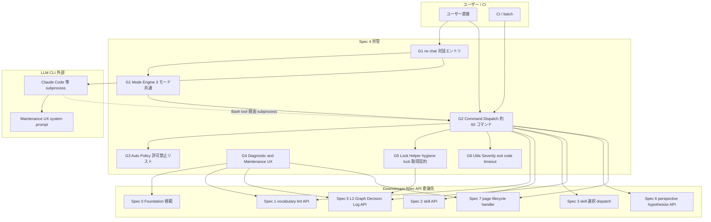
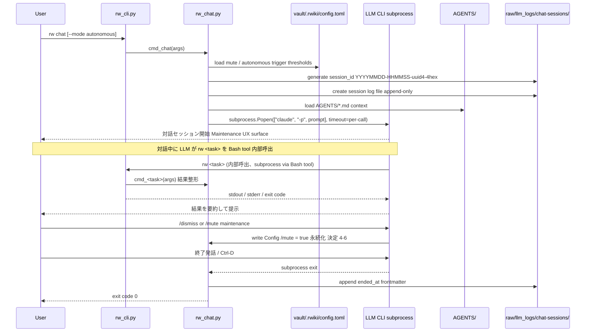
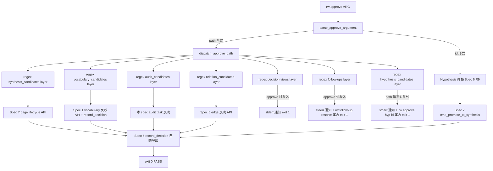
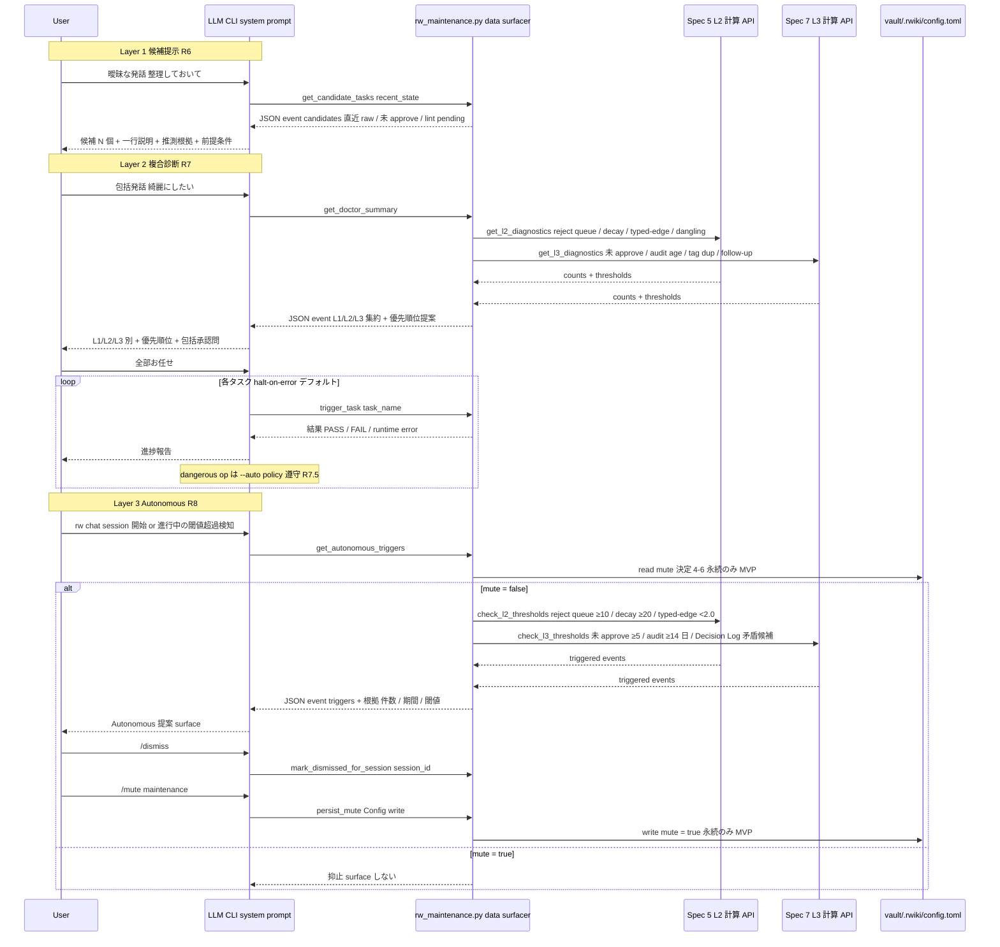
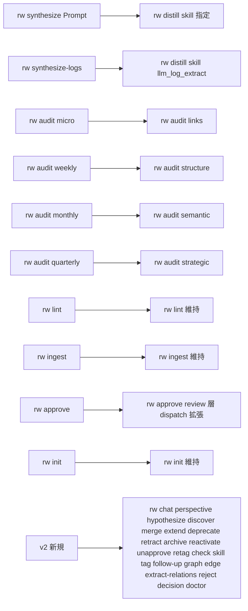

# Technical Design Document: rwiki-v2-cli-mode-unification

## Overview

**Purpose**: 本 spec は Rwiki v2 の Phase 2 として、Foundation (Spec 0) と Classification (Spec 1) が固定した規範・vocabulary・lint 統合規約を前提に、(a) 対話型エントリ `rw chat` (LLM CLI 起動 / AGENTS 自動ロード / Maintenance UX)、(b) 各タスクの CLI 統一 (約 60 コマンド)、(c) 対話型 default + `--auto` フラグの可否ポリシー (許可/禁止リスト)、(d) `rw check <file>` / `rw doctor` 診断、(e) `rw follow-up *` / `rw decision *` / `rw graph *` / `rw edge *` / `rw reject` / `rw extract-relations` 等の CLI dispatch、(f) Maintenance UX (候補提示 / 複合診断 / Autonomous 提案) を実装する。

**Users**: Spec 5 (knowledge-graph) / Spec 6 (perspective-generation) / Spec 7 (lifecycle-management) の起票者 + 実装者 (本 spec が定める CLI dispatch 規約を引用)、Rwiki v2 ユーザー (`rw chat` を default 入口として利用)、L4 Power user / CI 担当者 (`rw <task> --auto` で自動化)。

**Impact**: Foundation 規範 + Classification vocabulary 統合を CLI 入口で機械的に強制可能になり、約 60 コマンドが単一 `rw <task>` ファミリで起動される。Maintenance UX により曖昧指示 (例: 「綺麗にしたい」) でも複合診断 + 候補提示で完結し、コマンド名の習得負荷を軽減する。`--auto` 許可/禁止リスト + 対話 confirm 必須化により、不可逆操作 (retract / split / promote-to-synthesis 等 5 種) の誤実行を実装で機械的に防止する。

### Goals

- 約 60 コマンドの CLI 統一 (`rw <task>` ファミリ) と 3 実行モード (Interactive / CLI 直接 / CLI Hybrid) を同じ `cmd_*` エンジン関数で動作させる
- `rw chat` 対話型エントリと Maintenance UX (候補提示 / 複合診断 / Autonomous 提案) を実装し、ユーザーの認知をメンテナンス手順から知識発見に集中させる
- `--auto` 許可/禁止リスト + 強制バイパス禁止規律を実装で機械的に強制
- `rw doctor` 複合診断と `rw check <file>` 診断を schema_version 付き JSON 出力で提供 (CI 下流 consumer 対応)
- `.rwiki/.hygiene.lock` 取得契約を CLI 側で所管 (vocabulary / skill / L2 Graph 変動操作の排他制御)
- 設計決定 4-1〜4-21 を design.md 本文 + change log で二重記録 (ADR 不採用、Spec 0 決定 0-4 / Spec 1 決定 1-2 継承)
- 16 Requirements 全 AC (約 130 件) を Components / Interface / Flow にマップし追跡可能にする

### Non-Goals

- L2 Graph Ledger 内部ロジック (`edges.jsonl` / `edge_events.jsonl` / `evidence.jsonl` / `decision_log.jsonl` / `rejected_edges.jsonl` 操作、Hygiene 進化則、initial confidence 計算、`relations.yml`、`normalize_frontmatter` API、Decision Log 検索集計矛盾検出 logic) — Spec 5 所管
- Page lifecycle 状態遷移ルール (`active` ↔ `deprecated` ↔ `retracted` ↔ `archived` ↔ `merged` の 5 状態、`successor` / `merged_from` / `merged_into` セマンティクス、操作可逆性) — Spec 7 所管
- Perspective / Hypothesis / Discovery の prompt 設計と autonomous mode 内部生成ロジック — Spec 6 所管
- Skill 選択 dispatch (5 段階優先順位、`applicable_input_paths` glob match) — Spec 3 所管、本 spec は Hybrid 実行 wrapper のみ
- Skill ファイルスキーマ / `applicable_categories` / `default_skill` / dry-run 実装 / hash 検知 — Spec 2 所管
- Frontmatter 詳細スキーマと vocabulary YAML 3 種 / `rw tag *` 内部実装 / lint vocabulary 検査ロジック本体 — Spec 1 所管 (本 spec は CLI dispatch + severity 4 統一出力)
- 対話ログ frontmatter スキーマと markdown フォーマット詳細 — Spec 2 所管 (本 spec は保存実装と保存先 path 規約のみ)
- 検証 4 種の規範 schema 本体 — Spec 0 所管 (本 spec は `rw doctor foundation` / `rw doctor classification` 等の実装のみ)

## Boundary Commitments

### This Spec Owns

- **対話型エントリ `rw chat`** 起動契約: LLM CLI subprocess 起動 + AGENTS 自動ロード + 内部 `rw <task>` 呼出環境 + Maintenance UX 利用可能化 + `--mode autonomous` / `/mode` トグル dispatch + 対話ログ自動保存実装と保存先 path 規約 (R1)
- **各タスクの CLI 統一**: `rw lint` / `rw ingest` / `rw retag` / `rw distill` / `rw extend` / `rw merge` / `rw split` / `rw approve` (review 層 dispatch を所管、R16) / `rw unapprove` / `rw query {answer, extract, fix, promote}` / `rw perspective` / `rw hypothesize` / `rw discover` / `rw audit {links, structure, semantic, strategic, deprecated, tags, evidence, followups, graph}` の引数 parse + Hybrid 実行契約 + 結果整形 + exit code 制御 (R2, R5)
- **実行モード 3 種**: Interactive (`rw chat`) / CLI 直接 (`rw <task> [args]`) / CLI Hybrid (内部 LLM CLI 呼出) を同じ `cmd_*` エンジン関数で実行する規約 (R2.3, R2.4)
- **対話型 default + `--auto` フラグ可否ポリシー**: 許可リスト 10 種 (deprecate / archive / reactivate / merge wiki 慎重 / unapprove `--yes` / tag merge / tag rename / skill install / extract-relations / reject `<edge-id>`) + 禁止リスト 5 種 (retract / query promote / split / tag split / skill retract) + 強制バイパス禁止規律 (R3)
- **dangerous op の対話 confirm UI**: 8 段階対話 dispatch + 1-stage confirm 振り分け + Pre-flight `--dry-run` 第 0 ステップ実装 (R3.5, R3.6)
- **L2 Graph Ledger 管理コマンド CLI dispatch**: `rw graph {rebuild, status, hygiene, neighbors, path, orphans, hubs, bridges, export}` 9 種 / `rw edge {show, promote, demote, history}` 4 種 / `rw reject` 3 形式 / `rw extract-relations` 4 形式 / `rw audit graph` の引数 parse + Spec 5 API 呼出 + 結果整形 + exit code 制御 (R9)
- **Decision Log 管理コマンド CLI dispatch**: `rw decision {history, recent, stats, search, contradictions, render}` 6 種の引数 parse + Spec 5 API 呼出 + Tier 2 markdown timeline 生成機構呼出 + 結果整形 (R15)
- **`rw approve` review 層 dispatch**: 6 review 層 (synthesis_candidates / vocabulary_candidates / audit_candidates / relation_candidates / decision-views = approve 対象外 / wiki/.follow-ups = approve 対象外) の path 判別 + spec 別 handler 委譲 + path 指定と id 指定の三者命名関係 (Spec 6 R9 との別 operation 関係) (R16)
- **診断コマンド**: `rw check <file>` (適用可能タスク列挙) / `rw doctor` (全層並行スキャン、JSON / human-readable 両形式、`schema_version` 必須) / CLI-level timeout 設定 (R4)
- **`rw follow-up *` 4 サブコマンド** (list / show / resolve / remind) と **`rw init <path> [--reinstall-symlink]`** Vault 初期化 / **`rw retag <path-or-glob>`** タグ再抽出 (R5)
- **Maintenance UX 三層**: (a) 曖昧指示への候補提示 (R6) / (b) 複合診断 orchestration + halt-on-error デフォルト + dangerous op confirm 遵守 (R7) / (c) Autonomous maintenance 提案 + `/dismiss` / `/mute maintenance` (R8) — UX engine 本体は LLM CLI 側 system prompt、Spec 4 は data surfacer (構造化 JSON event 提供 + 閾値判定 + 計算 API 呼出) のみ
- **`.rwiki/.hygiene.lock` 取得契約 (CLI 側)**: L2 変更系コマンド (`rw graph hygiene` / `rw reject` / `rw extract-relations` / `rw edge promote` / `rw edge demote`) + vocabulary 変動 5 操作 (`rw tag merge / split / rename / deprecate / register`) + write 系 `rw skill *` 3 操作 (`rw skill draft / test / install`) で実行開始時 acquire / 終了時 release / 取得済時 exit 1 (待機しない) (R10)
- **v1 から継承する技術決定の遵守**: Severity 4 / Exit code 0/1/2 / subprocess timeout 必須 / モジュール責務分割 (≤ 1500 行 / DAG / 修飾参照) / `rw` symlink (R11)
- **Foundation 規範準拠**: 13 中核原則のうち §2.1 / §2.2 / §2.4 / §2.5 / §2.6 / §2.7 / §2.11 / §2.12 / §2.13 / コマンド 4 Level 階層 / 実行モード 3 種 / 用語集を SSoT 引用 (R12)
- **周辺 spec との責務分離 boundary**: Spec 1 / Spec 2 / Spec 3 / Spec 5 / Spec 6 / Spec 7 / Spec 0 との CLI dispatch ↔ 内部ロジック の境界明示 + coordination 申し送り (R13)
- **文書品質と運用前提**: 日本語記述 / 表は最小限 / coordination 両方 spec 同期記載 (R14)
- **設計決定事項二重記録**: design.md 本文「設計決定事項」セクション + change log の 1 行サマリ (Spec 0 決定 0-4 / Spec 1 決定 1-2 継承)
- **drafts §6.2 Decision Log カテゴリ追記の Adjacent Sync 別 issue 起票責務 (R15.12 持ち越し)**: requirements 確定時点で `.kiro/drafts/rwiki-v2-consolidated-spec.md` v0.7.12 §6.2 に Decision Log カテゴリが未記載のため、本 spec implementation phase 着手時に「drafts §6.2 更新」の Adjacent Sync 別 issue / 別セッションを発行する責務を本 spec が持つ (R15.12)。drafts 改版手順は roadmap.md「Adjacent Spec Synchronization」運用ルールに従う

### Out of Boundary

- **L2 Graph Ledger 内部ロジック**: `edges.jsonl` 操作 / Hygiene 進化則 / reject queue append-only 規約 / initial confidence 計算 6 係数 / `relations.yml` / `normalize_frontmatter` API / Decision Log 検索集計矛盾検出 logic / `record_decision()` schema / privacy mode / selective recording ルール本体 — Spec 5 所管 (**注: `record_decision()` の自動呼出責務は本 spec が CLI 側で行う = R15.10、`decision_type` enum 値 / decision schema / privacy mode / selective recording ルール本体は Spec 5 所管 = 責務分離**)
- **Page lifecycle 状態遷移ルール**: 5 状態間遷移 (`active` ↔ `deprecated` ↔ `retracted` ↔ `archived` ↔ `merged`) / `successor` / `merged_from` / `merged_into` セマンティクス / 操作可逆性 / dangerous op 8 段階対話 各段階の状態変更 logic / `cmd_promote_to_synthesis` 内部 — Spec 7 所管
- **Perspective / Hypothesis / Discovery 生成 logic**: prompt 設計 / autonomous mode 内部生成ロジック / mode 切替の判定 — Spec 6 所管 (本 spec は引数 parse + Hybrid 実行 + flag dispatch のみ)
- **Skill ライブラリ実装と選択 dispatch**: Skill ファイルスキーマ / `.rwiki/skills/` 構造 / `applicable_categories` / `applicable_input_paths` / `default_skill` / dry-run 実装 / hash 検知 / 5 段階優先順位 dispatch — Spec 2 / Spec 3 所管
- **Frontmatter スキーマ / vocabulary YAML 3 種 / lint vocabulary 検査ロジック本体**: `tags.yml` / `categories.yml` / `entity_types.yml` / `relations.yml` / lint 8 検査項目の実装 — Spec 1 / Spec 5 所管 (本 spec は CLI dispatch + severity 4 統一出力)
- **対話ログ frontmatter スキーマと markdown フォーマット詳細**: `type: dialogue_log` / `session_id` / `started_at` / `ended_at` / `turns` 等の field 定義 / turn 単位 markdown 構造 — Spec 2 所管 (本 spec は保存実装と保存先 path 規約 + session_id 形式 = 決定 4-13 のみ)
- **autonomous trigger 6 種の閾値計算実装**: reject queue 件数 / decay edges 件数 / typed-edge 整備率 / dangling evidence / audit 未実行期間 / 未 approve 件数 — Spec 5 (L2) / Spec 7 (L3) 所管 (本 spec は閾値設定 config + surface UX のみ)
- **AGENTS 自動ロード時の改ざん検知 (B-4)**: hash / signing / verification — MVP 範囲外、Phase 2 以降 Spec 2 design で再検討 (決定 4-10)
- **HTML 差分マーカー attribute 詳細 (I-3)**: `<ins>` / `<del>` / class 等の attribute schema — Phase 2/3 Spec 2 / Spec 7 design 委譲 (決定 4-8)
- **検証 4 種の規範 schema 本体**: 章節アンカー存在 / SSoT 章番号整合 / 用語集引用 link 切れ / frontmatter schema 妥当性 — Spec 0 所管 (本 spec は `rw doctor foundation` / `rw doctor classification` 実装のみ、決定 4-2)
- **L1 raw / L3 wiki の subdirectory 規約**: `raw/incoming/` / `raw/llm_logs/` / `wiki/concepts/` 等 — steering structure.md / Spec 1 所管

### Allowed Dependencies

- **SSoT 出典**: `.kiro/drafts/rwiki-v2-consolidated-spec.md` v0.7.12 §2.11 / §3.4 / §3.5 / §6 / §7.2 Spec 4 / §11.3 / `.kiro/drafts/rwiki-v2-scenarios.md` Scenario 33 / 14 / 15 / 25 / 18 / 35
- **Upstream Spec**: Spec 0 (rwiki-v2-foundation) — 13 中核原則 / 用語集 / 3 層アーキテクチャ / Edge / Page status の区別 / コマンド 4 Level 階層 / 実行モード 3 種 / Spec 1 (rwiki-v2-classification) — frontmatter スキーマ / vocabulary 統合規約 / `rw tag *` コマンド (本 spec は CLI dispatch 側で integration)
- **Coordination Source Spec** (Phase 0 requirements approve 済): Spec 2 (skill-library) — 対話ログ frontmatter / write 系 skill 操作 lock / Spec 3 (prompt-dispatch) — Skill 選択 5 段階優先順位 / Spec 5 (knowledge-graph) — Decision Log API 4 種 / Query API 15 種 / `.hygiene.lock` 物理実装 / Spec 6 (perspective-generation) — `rw approve <hypothesis-id>` id 指定 / autonomous mode 内部 / Spec 7 (lifecycle-management) — Page lifecycle 状態遷移 handler / dangerous op 8 段階対話 handler
- **Steering**: `roadmap.md` (Adjacent Spec Synchronization L163-, v1 から継承される技術決定 L132-) / `tech.md` (Severity 4 / exit code 0/1/2 / subprocess timeout) / `structure.md` (Vault 構造 / コマンド 4 Level 階層 / Code Organization Principles)
- **Python 標準ライブラリ**: `argparse` (引数 parse、決定 4-4) / `subprocess` (LLM CLI 起動、timeout 必須) / `pathlib` (path 操作) / `json` (logs 出力) / `uuid` (session_id uuid4 4hex、決定 4-13) / `tomllib` Python 3.11+ または `tomli` 第三者 (config 読込)
- **依存形式**: 同 `rw` 単一 process 内 Python module import (`from rw_concurrent import acquire_lock` / `from rw_decision_log import record_decision` 等)、subprocess / IPC 形式は採用しない (性能 / atomicity の観点、Spec 1 決定 1-1 継承)
- **依存禁止**: v1 spec / 実装への参照 (フルスクラッチ方針)、`v1-archive/` 内容に依存しない (構造的参考は research.md にのみ記録)

### Revalidation Triggers

以下の変更が本 spec に発生した場合、影響先 spec の精査必要:

- **`rw <task>` コマンド名の追加 / 削除 / シグネチャ変更** (R2 改版) — Spec 5-7 起票者の引用元更新、Foundation R9 (Task & Command 一覧) との整合
- **`--auto` 許可/禁止リスト変更** (R3 改版) — Spec 7 dangerous op 表 / Spec 1 `rw tag *` / Spec 2 `rw skill *` の整合
- **`.rwiki/.hygiene.lock` 取得契約変更** (R10 改版) — Spec 5 物理実装 / Spec 1 vocabulary 編集 / Spec 2 skill 編集の整合
- **review 層 dispatch routing 変更** (R16 改版) — Spec 1 vocabulary 反映 API / Spec 5 edge 反映 API / Spec 7 page lifecycle API の整合
- **Maintenance UX 構造化 JSON event schema 変更** (R6 / R7 / R8 改版) — Spec 5 / Spec 7 計算 API の event 連携整合
- **`rw doctor` 出力 `schema_version` major bump** (R4 改版) — CI 下流 consumer parse 規約変更
- **subprocess timeout 階層 / 値の変更** (R11.3 改版 + 決定 4-5 / 4-15 改版) — 全 LLM CLI Hybrid 実行コマンドの hang 耐性

これら以外の文言修正・誤字訂正・章節アンカー追加は **Adjacent Spec Synchronization** (再 approval 不要) の対象。

## Architecture

### Existing Architecture Analysis

本 spec は v2 で新規実装される CLI 統一 spec であり、既存の v2 実装は存在しない。v1 では `v1-archive/scripts/` に CLI 実装 (合計 4007 行、5 層 DAG: `rw_config → rw_utils → rw_prompt_engine → {rw_audit, rw_query} → rw_cli`) が存在するが、フルスクラッチ方針により参照のみ (`v1-archive/` 内容に依存しない、research.md で参照記録のみ)。

v1 で確立済の技術決定 (Severity 4 / exit code 0/1/2 / subprocess timeout 必須 / モジュール責務分割) は roadmap.md L132- が SSoT として継承指示、本 spec は v2 module 構成を新規設計しつつ v1 のパターン (DAG / 修飾参照 / 後方互換 re-export 禁止) を踏襲する。

#### v1 → v2 アーキテクチャ転換点

- **コマンド数の拡張**: v1 約 25 コマンド (lint / ingest / synthesize / approve / query 系 / audit 4 種 / init 等) → v2 約 60 コマンド (chat / distill / extend / merge / split / perspective / hypothesize / discover / graph 9 / edge 4 / reject / extract-relations / decision 6 / page lifecycle 7 / tag 13 / skill 7 / follow-up 4 / 等)、約 **2.4 倍の API 表面積拡張**
- **新規アーキテクチャ要素**: (a) **CLI Dispatch Hub パターン** (Spec 4 = 他 spec API 呼出 wrapper) を新規採用 (v1 では rw_audit / rw_query が独立 ロジック実装) / (b) **Maintenance UX 三層** (候補提示 / 複合診断 / Autonomous) を新規導入 (v1 では Maintenance UX なし) / (c) **L2 Graph Ledger 概念** を CLI に展開 (v1 では L2 概念なし、L1 raw + L3 wiki の二層) / (d) **Decision Log + Curation Provenance** を CLI に展開 (v1 では未実装) / (e) **review 層 dispatch** = `rw approve` の 6 review 層判別 (v1 では `synthesis_candidates` のみ)
- **module 数の調整**: v1 6 module 4007 行 → v2 11 module 推定 6000-9000 行 (約 1.5-2.2 倍)、各 module ≤ 1500 行制約は v1 と同じ
- **継承する 5 技術決定** (roadmap.md): Severity 4 / Exit code 0/1/2 / subprocess timeout 必須 / モジュール責務分割 (DAG / 修飾参照 / 後方互換 re-export 禁止) / `rw` symlink + `--reinstall-symlink` migration helper

### Architecture Pattern & Boundary Map



**Architecture Integration**:

- **Selected pattern**: CLI Dispatch Hub (research.md Architecture Pattern Evaluation 採択) — Spec 4 = CLI 引数 parse + 他 spec API 呼出 wrapper、UX engine 本体は LLM CLI 側、Python 側は data surfacer
- **Domain/feature boundaries**: G1 Mode Engine + Chat / G2 Command Dispatch / G3 Auto Policy / G4 Diagnostic and Maintenance UX / G5 Lock Helper / G6 Utils の 6 sub-system が責務分離
- **Existing patterns preserved**: v1 5 層 DAG (`rw_config → rw_utils → rw_prompt_engine → ... → rw_cli`) を踏襲しつつ Spec 4 新責務を 7-8 module に分割 (決定 4-3) / Foundation 規範引用 (決定 4-1) / 設計決定二重記録 (決定 4-11)
- **New components rationale**: Spec 4 は Phase 2 で初実装、Spec 0 + Spec 1 規範を CLI に展開する単一 dispatch hub として配置することで、Spec 5-7 の内部実装変更が CLI 側に波及しない (薄い wrapper 設計)
- **Spec 3 への呼出範囲明示**: Mermaid 上の `Spec3Dispatch` 矢印は CLI Hybrid 実行コマンド (`rw distill` / `rw query *` / `rw audit semantic` / `rw audit strategic` / `rw retag`) のみが Spec 3 dispatch ロジックを呼び出す薄い wrapper として動作することを意味し、CLI 直接モードや L2 Graph 管理コマンドは Spec 3 経由しない
- **Steering compliance**: structure.md「モジュール責務分割」(各 ≤ 1500 行 / DAG / 修飾参照 / 後方互換 re-export 禁止) と整合、tech.md severity 4 / exit code 0/1/2 / timeout 必須を踏襲、roadmap.md「v1 から継承する技術決定」(Severity 4 / Exit code 0/1/2 / subprocess timeout / モジュール責務分割 / `rw` symlink) を遵守

**Mermaid 補足 (LLMSubprocess → CommandDispatch 矢印の DAG 整合性)**: Mermaid 上では `LLMSubprocess --> CommandDispatch` を双方向の責務関係として描いているが、これは **LLM CLI subprocess が Bash tool 経由で新たな `rw <task>` subprocess を起動する独立 process** を意味し、同 `rw` 単一 process 内の Python module import (本 spec Allowed Dependencies) ではない。すなわち本 spec の DAG 規律 (「Coordination Source Spec module を import 可能、逆向き禁止」) には **違反しない** (subprocess 境界を跨いだ呼出は import dependency と区別される)。

### Module DAG 依存方向 (本 spec 9 module + 拡張 2 module = 計 11 module)

本 spec implementation phase で生成される 11 module の DAG 依存方向 (上位 → 下位、循環なし):

```
L0 (最下層、依存なし):
  rw_utils.py             # G6 Severity / exit code / timeout / argparse factory / format / config 読込

L1 (L0 のみ依存):
  rw_prompt_engine.py     # call_claude(prompt, timeout) wrapper、LLM CLI 呼出契約

L2 (L0-L1 依存):
  rw_lock.py              # G5 .hygiene.lock 取得契約、Spec 5 物理実装 API wrapper
  rw_policy.py            # G3 --auto 許可禁止 + バイパス検出 + dangerous op confirm dispatch
  rw_maintenance.py       # G4 Maintenance UX data surfacer (Spec 5 / Spec 7 計算 API 呼出)

L3 (L0-L2 依存):
  rw_doctor.py            # G4 rw check / rw doctor 診断
  rw_decision_cli.py      # G2 rw decision * (Spec 5 Decision Log API wrapper)
  rw_lifecycle_cli.py     # G2 page lifecycle CLI (Spec 7 handler wrapper)
  rw_dispatch.py          # G2 rw approve review 層 dispatch + L2 Graph wrapper
  rw_chat.py              # G1 rw chat 対話エントリ + Maintenance UX surfacer + 対話ログ自動保存

L4 (最上位、L0-L3 依存):
  rw_cli.py               # G1 G2 共通 CLI エントリ + argparse dispatch + 全 cmd_* 関数の dispatch hub
```

依存禁止規律: 各 module は同層 / 上位層を import しない (DAG 循環防止)、`from rw_<module> import <symbol>` 禁止 (修飾参照のみ、v1 継承)、後方互換 re-export 禁止。

**同層 import 回避の具体パターン**: `rw_dispatch.py` (L3) が `rw approve <synthesis_path>` で page lifecycle API を呼ぶ際、**同層の `rw_lifecycle_cli.py` (L3) を経由せず、Spec 7 module を直接 import** (例: `from rw_page_lifecycle import cmd_deprecate as _spec7_deprecate`)。これにより同層 import = DAG 違反を回避。`rw_lifecycle_cli.py` (本 spec lifecycle CLI wrapper) は `cmd_deprecate / cmd_retract / cmd_archive` 等の cmd_* 関数を通常 `rw_cli.py` (L4) から呼出される separate dispatch 経路。同様に `rw_decision_cli.py` (L3) も Spec 5 Decision Log API を直接 import、`rw_doctor.py` (L3) も Spec 5 / Spec 7 計算 API を直接 import する。

### Technology Stack

| Layer | Choice / Version | Role in Feature | Notes |
|-------|------------------|-----------------|-------|
| CLI Runtime | Python 3.10+ | `rw <task>` 約 60 コマンド + `rw chat` 対話エントリ | プロジェクト標準 (steering tech.md)、実数値は implementation phase で具体 cmd_* 列挙時に確定 |
| Argument Parsing | `argparse` (Python 標準) | 全 cmd_* 関数の引数 parse 統一 (決定 4-4) | v1 一部手製パーサ debt 解消 |
| Subprocess | `subprocess` (Python 標準、`run` / `Popen`) | LLM CLI 起動 + `rw chat` subprocess 起動 | timeout 必須 (決定 4-5 で 2 階層) |
| TOML Parsing | `tomllib` (Python 3.11+ 標準) または `tomli>=2.0,<3.0` (第三者、Python 3.10 用) | `<vault>/.rwiki/config.toml` 読込 (決定 4-6) | Python 3.10 サポートのため `tomli` fallback (version 制約 >=2.0,<3.0)、3.11+ では標準で依存ゼロ |
| UUID Generation | `uuid` (Python 標準、`uuid4().hex[:4]`、CSPRNG ベース) | 対話ログ session_id 短縮 uuid (決定 4-13) | 新規依存なし、`uuid.uuid4()` は CSPRNG (cryptographically secure pseudo-random number generator) で予測不可、衝突確率 1/65536 は確率的 |
| Path Operations | `pathlib` (Python 標準) | review 層 path 判別 / Vault 構造解決 / file walking / path traversal 防止 (`is_relative_to()` 検証) / glob 展開 (`rw retag <path-or-glob>` 等は `pathlib.Path.glob()` 経由) | 新規依存なし、glob は標準 `glob` module でも代替可能 (軽-7-1 / 軽-8-2 整合) |
| Frontmatter Writing | 手書き string template (Python 標準) | 対話ログ frontmatter (`type: dialogue_log` / `session_id` / `started_at` / `ended_at` / `turns` 等 simple key: value 構造、Spec 2 schema 整合) を `init_session_log()` / `ended_at` 追記時に手書き string template で生成 | Spec 1 が採用する `pyyaml` は本 spec では不要 (frontmatter 構造が simple key: value のため、軽-8-1 整合)、Spec 2 schema 拡張時 (例: turn 構造化 events list、軽-8-1 補強) に `pyyaml` 採用検討 (Adjacent Sync) |
| Concurrent Execution | `concurrent.futures` (Python 標準、`ThreadPoolExecutor(max_workers=4)`) | `rw doctor` 4 並行スキャン (L1 / L2 / L3 / Decision Log) | 新規依存なし、GIL 影響軽微 (subprocess / I/O bound 中心) |
| Concurrency Lock | `.rwiki/.hygiene.lock` (Spec 5 物理実装) | vocabulary / skill / L2 変動操作の lock 取得 (決定 4-3) | Spec 5 design phase で詳細確定 |
| Color Output | ANSI escape sequence (標準) | Severity colorize (CRITICAL=赤 / ERROR=橙 / WARN=黄 / INFO=青、決定 4-9) | `--no-color` flag / `RWIKI_NO_COLOR=1` 環境変数で抑止 (CI 環境)、**MVP は POSIX-like terminal のみ正式サポート** (Linux / macOS / Windows Terminal / WSL)、旧 Windows cmd.exe / PowerShell 5.x は colorize 抑止推奨、Phase 2 以降 `colorama` 第三者ライブラリ採用検討 |
| Symlink Management | `os.symlink` / `os.readlink` (Python 標準) | `rw init <path> --reinstall-symlink` (R11.5) | v1 `_install_rw_symlink()` パターン継承 |

### 依存形式の規範

- **Upstream Spec 0 / Spec 1**: design.md / requirements.md の markdown ファイル参照のみ (`.kiro/specs/<spec-name>/design.md#anchor` 形式、決定 4-1)、Python module としては `import` しない
- **Coordination Source Spec (Spec 2 / 3 / 5 / 6 / 7) への API 呼出**: 同 `rw` 単一 process 内 Python module import 形式 (例: `from rw_decision_log import record_decision` / `from rw_lifecycle import cmd_promote_to_synthesis`)、subprocess / IPC は採用しない (Spec 1 決定 1-1 継承)
- **依存方向**: Spec 4 module は Coordination Source Spec module を import 可能、逆向き (Spec 5 module が Spec 4 module を import) は **禁止** (DAG 循環防止)
- **依存禁止 (再掲)**: v1 spec / 実装への参照禁止 (`v1-archive/` 内容を Python module としては import しない、フルスクラッチ方針)
- **Static import 規律 (test 整合性保証)**: 全 Python import は **module 先頭で static import** で行う (例: `import rw_decision_log` / `from rw_decision_log import record_decision as _record_decision`)、`importlib.import_module()` 等の **dynamic import は禁止** — 理由: テストの `monkeypatch.setattr(rw_dispatch, '_record_decision', mock)` が全呼出経路で作用するように、import 形式を確定的にする (v1 module-split 継承)
- **subprocess I/O 規約**: 全 `subprocess.run` / `subprocess.Popen` 呼出で **`text=True, encoding='utf-8', errors='strict'`** を必須設定 (binary mode との混在で Unicode error 発生防止)、`shell=False` (default、軽-8-1 整合)、list 形式引数で shell injection 防止
- **LLM CLI default 解決順序**: MVP では `claude` (Claude Code) のみ正式サポート、`PATH` 上の最初の `claude` 実行ファイルを使用、`RWIKI_LLM_CLI=<path>` 環境変数で override 可能。OpenAI Codex / 他 MCP 経由の LLM CLI サポートは Spec 3 design phase で確定する coordination 申し送り (LLM 非依存原則は Spec 3 抽象層所管、本 spec MVP は Claude Code 限定)

## File Structure Plan

### Directory Structure

```
.kiro/specs/rwiki-v2-cli-mode-unification/
├── brief.md                # 既存、approve 済 (2026-04-26)
├── requirements.md         # 既存、approve 済 (2026-04-27、Adjacent Sync 反映済)
├── design.md               # 本ファイル (Phase 2 design)
├── research.md             # 設計議論ログ (Light Discovery + Synthesis 3 lens、別ファイル)
└── spec.json               # phase: design-generated → approved

<dev-repo>/scripts/          # implementation phase で生成
├── rw_cli.py                 # G1 ChatEntry エントリ + **G1 ModeEngine 共通契約 = argparse dispatch 経由で各 cmd_* に分散実装、3 モード共通エンジン関数を呼ぶ規約の保証** (≤ 1500 行) + G2 cmd_* dispatch + argparse 統一
├── rw_chat.py                # G1 rw chat 対話エントリ + Maintenance UX surfacer + 対話ログ自動保存 (≤ 800 行)
├── rw_dispatch.py            # G2 rw approve review 層 dispatch + L2 Graph wrapper (`rw graph *` / `rw edge *` / `rw reject` / `rw extract-relations`) (≤ 1200 行)
├── rw_lifecycle_cli.py       # G2 page lifecycle CLI (`rw deprecate` / `rw retract` / `rw archive` / `rw reactivate` / `rw merge` / `rw split` / `rw unapprove`) (≤ 1000 行) — Spec 7 handler 呼出 wrapper
├── rw_decision_cli.py        # G2 `rw decision *` 6 サブコマンド + `record_decision()` 自動呼出 (≤ 600 行) — Spec 5 API wrapper
├── rw_doctor.py              # G4 `rw check` / `rw doctor` 診断 + JSON schema_version 出力 (≤ 1000 行)
├── rw_maintenance.py         # G4 Maintenance UX data surfacer (構造化 JSON event 提供 + 閾値判定 + 計算 API 呼出) (≤ 800 行)
├── rw_policy.py              # G3 `--auto` 許可/禁止リスト + 強制バイパス検出 + dangerous op confirm dispatch (≤ 500 行)
├── rw_lock.py                # G5 `.rwiki/.hygiene.lock` 取得契約 helper (Spec 5 物理実装の API 呼出 wrapper) (≤ 300 行)
├── rw_utils.py               # G6 共通 utility (Severity / exit code / timeout / argparse factory / status table format / colorize) (≤ 800 行) — Spec 1 design でも言及、本 spec implementation で拡張
└── rw_prompt_engine.py       # 本 spec で v2 新規実装 (Spec 1 design phase では未列挙、v1-archive 同名 module のみ存在で参照不可) — call_claude(prompt, timeout) wrapper (≤ 600 行)、L1 layer (rw_utils のみ依存)

<vault>/.rwiki/               # implementation phase で `rw init` が初期化
├── config.toml              # `[maintenance].mute` (bool、永続のみ) / autonomous trigger 閾値 (決定 4-6)
├── .hygiene.lock            # 取得時のみ存在 (Spec 5 物理実装)
└── ... (vocabulary/, graph/, cache/ 等は Spec 1 / Spec 5 所管)

<vault>/scripts/              # `rw init` で symlink 配置
└── rw -> <dev-repo>/scripts/rw_cli.py    # symlink (R11.5、`rw init --reinstall-symlink` で再作成)

<vault>/raw/llm_logs/         # implementation phase で生成
└── chat-sessions/
    └── <YYYYMMDD-HHMMSS>-<uuid4-4hex>.md  # 対話ログ (決定 4-13)

<vault>/AGENTS/               # 既存 + 本 spec implementation で追加
└── maintenance_ux.md         # Maintenance UX system prompt template (決定 4-14)
```

### Modified Files (本 design 由来の改版)

- `.kiro/specs/rwiki-v2-cli-mode-unification/spec.json` — phase 更新 (`design-generated` → `design-approved`)、updated_at 更新
- 本 design phase では requirements.md の改版なし (Adjacent Sync 反映済 + 設計持ち越し I-1 / B-7 / B-4 / I-3 / 本-Q / 整-5 は本 design 内で確定 = 決定 4-6 / 4-7 / 4-10 / 4-8 / 4-9)

### Implementation Phase で生成される Files

- `<dev-repo>/scripts/rw_*.py` 11 module (本 spec implementation で全 11 module を新規実装、`rw_utils.py` は Spec 1 design でも言及されており Phase 順序により先に作成される可能性、`rw_prompt_engine.py` は本 spec で初実装)
- `<vault>/.rwiki/config.toml` (`rw init` で初期化)
- `<vault>/scripts/rw` symlink (`rw init` で配置)
- `<vault>/raw/llm_logs/chat-sessions/` ディレクトリ (`rw chat` 初回起動で生成)
- `<vault>/AGENTS/maintenance_ux.md` (`rw init` で配置、本 spec implementation で template 確定)

### Phase 3-5 Coordination で発生する Files (本 spec 範囲外)

- Spec 5 design / implementation で確定: `.rwiki/.hygiene.lock` 物理実装 / Decision Log API 4 種 / Tier 2 markdown timeline 生成機構 / Query API 15 種
- Spec 6 design / implementation で確定: autonomous mode 内部生成 / `rw approve <hypothesis-id>` handler
- Spec 7 design / implementation で確定: page lifecycle 状態遷移 handler / dangerous op 8 段階対話 各段階 handler / `cmd_promote_to_synthesis` handler

### Module 行数制約と Risk 4 (rw_audit) の対処

v1 `rw_audit.py` 1419 行 = 1500 行制約ギリギリ (research.md Risk 2)。v2 では `rw audit *` を Spec 4 が dispatch、内部 audit ロジック本体は各 spec (Spec 1 vocabulary / Spec 5 graph / 等) に委譲するため、Spec 4 の `rw_dispatch.py` 内 audit dispatch logic は ≤ 200 行に収まる見込み。ただし implementation phase で `rw_dispatch.py` が 1500 行に近づいた場合、`rw_dispatch.py` (review 層 dispatch + L2 Graph wrapper) と `rw_audit_dispatch.py` (audit dispatch のみ) に分割する計画的 mitigation を本 design Risk として記録。

## System Flows

### Flow 1: `rw chat` 起動シーケンス (R1)



**Key Decisions** (Mermaid 補足):
- LLM CLI subprocess timeout は **per-call timeout** (各 `rw <task>` 呼出ごと、決定 4-5)、`rw chat` セッション全体は対話継続のため timeout なし (R1.6 / R11.3 整合)
- 対話ログは append-only (R1.8、Scenario 25 整合)、複数並行起動時は session_id 衝突回避 (決定 4-13)
- AGENTS 自動ロード時の改ざん検知は MVP 範囲外 (決定 4-10)、Phase 2 以降 Spec 2 design で再検討
- Maintenance UX engine 本体は LLM CLI 側 system prompt (`AGENTS/maintenance_ux.md`)、Spec 4 は data surfacer のみ提供 (決定 4-14)

### Flow 2: `rw approve [<path>]` review 層 dispatch (R16)



**Key Decisions** (Mermaid 補足):
- 引数形式判定 (id vs path) は決定 4-17 に従い、id 形式は `[a-z]+_[a-f0-9]{4,}` 等の正規表現で判別 (例: `hyp_a3f9` = Hypothesis id、`review/synthesis_candidates/foo.md` = path)
- 6 review 層への dispatch routing は決定 4-16 (正規表現 dispatch table) で実装、Vault 構造変更時は本 design 改版経路 (Adjacent Sync) で更新
- 複数 review 層にまたがる場合 (例: `review/` 全体指定) は依存順序 (vocabulary_candidates → synthesis_candidates → relation_candidates → audit_candidates、R16.8) で実行、halt-on-error デフォルト (R7.4 と同方針)

### Flow 3: Maintenance UX 三層 dispatch (R6, R7, R8)



**Key Decisions** (Mermaid 補足):
- Maintenance UX engine 本体は LLM CLI 側 system prompt (Scenario 33 の自然言語対話) に集約、Spec 4 は **data surfacer** のみ実装 (決定 4-14)
- Layer 2 (複合診断) の包括承認時 dangerous op は `--auto` policy 遵守 (R7.5)、許可リスト外は包括承認を bypass として扱わない
- Layer 3 (Autonomous) の閾値値は `<vault>/.rwiki/config.toml` `[maintenance]` に保存 (決定 4-6)、計算実装は Spec 5 / Spec 7 委譲 (R8.7)
- `/dismiss` は session 中のみ抑止 (R8.4)、`/mute maintenance` は永続化 (R8.5、決定 4-6)

## Requirements Traceability

| Requirement | Summary | Components | Interfaces | Flows |
|-------------|---------|------------|------------|-------|
| 1.1-1.9 | `rw chat` 対話エントリ起動契約 | G1 (rw_chat.py / rw_cli.py) | `cmd_chat(args)` / `start_llm_subprocess()` / `load_agents()` / `init_session_log()` | Flow 1 |
| 2.1-2.7 | 各タスク CLI 統一 + 3 モード共通 + Severity 4 | G2 (rw_cli.py / rw_dispatch.py) + G6 (rw_utils.py) | `cmd_*(args)` 約 60 種 / `format_severity_output()` / `compute_exit_code()` | — |
| 3.1-3.7 | 対話型 default + `--auto` 許可/禁止 | G3 (rw_policy.py) | `check_auto_allowed(cmd_name, args)` / `check_auto_bypass_attempt(args, env)` / `confirm_dangerous_op(op_name, severity)` | — |
| 4.1-4.9 | `rw check` / `rw doctor` 診断 | G4 (rw_doctor.py) | `cmd_check(file)` / `cmd_doctor(args)` / `format_doctor_output(json, schema_version)` | — |
| 5.1-5.8 | `rw follow-up *` / `rw init` / `rw retag` | G2 (rw_dispatch.py / rw_lifecycle_cli.py) | `cmd_follow_up_*()` / `cmd_init(path, reinstall_symlink)` / `cmd_retag(path_glob)` | — |
| 6.1-6.7 | Maintenance UX 候補提示 | G4 (rw_maintenance.py) | `get_candidate_tasks(recent_state)` JSON event provider | Flow 3 Layer 1 |
| 7.1-7.7 | Maintenance UX 複合診断 orchestration | G4 (rw_maintenance.py) | `get_doctor_summary()` / `trigger_task(name)` / halt-on-error logic | Flow 3 Layer 2 |
| 8.1-8.7 | Maintenance UX Autonomous + `/dismiss` / `/mute` | G4 (rw_maintenance.py) + G6 (rw_utils.py config helper) | `get_autonomous_triggers()` / `persist_mute(vault, until)` / `mark_dismissed_for_session()` | Flow 3 Layer 3 |
| 9.1-9.9 | L2 Graph 管理コマンド CLI dispatch + reject 理由必須 | G2 (rw_dispatch.py) | `cmd_graph_*()` 9 種 / `cmd_edge_*()` 4 種 / `cmd_reject(args)` 3 形式 / `cmd_extract_relations(args)` 4 形式 / `cmd_audit_graph(args)` | — |
| 10.1-10.7 | `.hygiene.lock` 取得契約 | G5 (rw_lock.py) | `acquire_lock(scope)` / `release_lock()` / lock-required cmd_* gate | — |
| 11.1-11.6 | v1 継承技術決定 (Severity 4 / exit 0/1/2 / timeout / module 分割 / symlink) | G6 (rw_utils.py / rw_prompt_engine.py) + 全 module | `compute_exit_code()` / `call_claude(prompt, timeout)` / `_install_rw_symlink()` | — |
| 12.1-12.7 | Foundation 規範準拠 + SSoT 引用形式 | 全 module + design.md 引用 | — | — |
| 13.1-13.9 | 周辺 spec 責務分離 boundary + `rw audit evidence` source: dedup logic 本 spec 所管 (R13.5) | 全 module + Boundary Commitments + G2 CommandDispatch (`cmd_audit_evidence`) | Spec 1-7 API へ薄い wrapper として実装 + DOI / arXiv / URL / paper title 正規化 | Flow 2 |
| 14.1-14.5 | 文書品質 + coordination 両方 spec 同期 | design.md / change log | — | — |
| 15.1-15.12 | Decision Log 管理コマンド CLI dispatch + 自動 record_decision 呼出 | G2 (rw_decision_cli.py) | `cmd_decision_*()` 6 種 / `auto_record_decision(operation, decision_type, ...)` | Flow 2 (record_decision 自動呼出) |
| 16.1-16.10 | `rw approve` review 層 dispatch + 三者命名関係 + 暫定 skip + WARN | G2 (rw_dispatch.py) | `parse_approve_argument(arg)` / `dispatch_approve_path(path)` / 6 review 層 handler | Flow 2 |

## Components and Interfaces

| Component | Domain/Layer | Intent | Req Coverage | Key Dependencies (P0/P1) | Contracts |
|-----------|--------------|--------|--------------|--------------------------|-----------|
| G1 ChatEntry | CLI / 対話 | `rw chat` 対話エントリ + Maintenance UX surface 起点 + 対話ログ自動保存 | 1.1-1.9 | rw_utils (P0), LLM CLI subprocess (P0), AGENTS (P1) | Service, Batch |
| G1 ModeEngine | CLI / 共通 | 3 モード (Interactive / CLI 直接 / CLI Hybrid) を同じ cmd_* で実行 | 2.1-2.7 | rw_utils (P0) | Service |
| G2 CommandDispatch | CLI / dispatch | 約 60 コマンド全 cmd_* + review 層 dispatch + L2 Graph wrapper + lifecycle CLI + decision CLI | 2.1-2.7, 5.1-5.8, 9.1-9.9, 13.1-13.9, 15.1-15.12, 16.1-16.10 | Spec 5 API (P0), Spec 7 API (P0), Spec 1 API (P0), Spec 6 API (P0), rw_policy (P0), rw_lock (P0) | Service, API |
| G3 AutoPolicy | CLI / policy | `--auto` 許可/禁止リスト + 強制バイパス検出 + dangerous op confirm dispatch | 3.1-3.7 | rw_utils (P0), Spec 7 module (P0、`cmd_*` 8 段階対話 handler 呼出 = 5 種禁止リスト + `cmd_promote_to_synthesis`、line 1957 申し送り整合) | Service |
| G4 Diagnostic | CLI / 診断 | `rw check` / `rw doctor` + JSON schema_version + CLI-level timeout | 4.1-4.9 | Spec 0 (P0), Spec 1 (P0), Spec 5 (P0), Spec 7 (P0), rw_utils (P0) | Service, API |
| G4 MaintenanceUX | CLI / UX | data surfacer (構造化 JSON event 提供 + 閾値判定 + 計算 API 呼出) | 6.1-6.7, 7.1-7.7, 8.1-8.7 | Spec 5 (P0), Spec 7 (P0), Config (P1) | Service, Event |
| G5 LockHelper | CLI / concurrency | `.hygiene.lock` 取得契約 helper (Spec 5 物理実装の wrapper) | 10.1-10.7 | Spec 5 物理 lock 実装 (P0) | Service |
| G6 Utils | CLI / 共通 | Severity / exit code / timeout / argparse factory / status table format / colorize / config 読込 + Foundation 規範 SSoT 引用形式 (横断、全 module で適用) | 2.7, 11.1-11.6, 12.1-12.7 (横断、全 module で適用), 14.1-14.5 | (依存なし、最下層) | Service |

### G1 ChatEntry

| Field | Detail |
|-------|--------|
| Intent | `rw chat` 対話エントリ + Maintenance UX surface 起点 + 対話ログ自動保存 + `--mode autonomous` flag dispatch |
| Requirements | 1.1, 1.2, 1.3, 1.4, 1.5, 1.6, 1.7, 1.8, 1.9 |
| Owner / Reviewers | Spec 4 implementer / Spec 2 (対話ログ frontmatter 整合) / Spec 6 (autonomous mode 内部整合) |

**Responsibilities & Constraints**

- LLM CLI subprocess 起動 (`subprocess.Popen(["claude", "-p", prompt])`)
- **エディタ非依存起動契約** (R1.4 / R12.5): エディタ内蔵ターミナル (VSCode / Obsidian) および別プロセスから起動可能、特定エディタプラグインに依存しない (Foundation §2.7 エディタ責務分離原則: 編集体験はエディタ、パイプラインは Rwiki、Obsidian は参照実装)
- AGENTS 自動ロード (`<vault>/AGENTS/*.md` を context に渡す、改ざん検知は MVP 範囲外 = 決定 4-10)
- 対話ログ自動保存 (`raw/llm_logs/chat-sessions/<session_id>.md` append-only、session_id = `YYYYMMDD-HHMMSS-<uuid4-4hex>` = 決定 4-13)
- Maintenance UX 利用可能化 (R1.7、決定 4-14 案 A 採択): LLM CLI に `<vault>/AGENTS/maintenance_ux.md` system prompt context を提供、LLM CLI が **Bash tool 経由 `rw_maintenance` 動的呼出** で起動時 + 進行中の両タイミングで data surfacer (`get_candidate_tasks` / `get_doctor_summary` / `get_autonomous_triggers`) を取得する規約 (rw chat 側は initial state 生成不要)
- `--mode autonomous` 起動 flag dispatch + 対話中 `/mode` トグル (Spec 6 R9 所管の autonomous 内部生成は委譲)
- subprocess timeout は **per-call** (LLM が内部呼出する各 `rw <task>` ごと、決定 4-5)、`rw chat` 全体は timeout なし (R1.6)

**Dependencies**

- Inbound: ユーザー直接実行 / `rw_cli.py` の `cmd_chat(args)` dispatch (Criticality P0)
- Outbound: LLM CLI subprocess (Criticality P0) / `rw_maintenance.py` data surfacer (P0) / `rw_utils.py` Severity / exit code / config 読込 (P0)
- External: `<vault>/AGENTS/*.md` (P1) / `<vault>/raw/llm_logs/chat-sessions/` ディレクトリ (P1)

**Contracts**: Service [x] / API [ ] / Event [ ] / Batch [x] / State [ ]

##### Service Interface

```python
def cmd_chat(args: argparse.Namespace) -> int:
    """
    rw chat 対話エントリ起動。

    Preconditions:
      - <vault>/AGENTS/ ディレクトリが存在する (rw init で作成済)
      - <vault>/.rwiki/config.toml が読み取り可能
      - LLM CLI 実行可能 (claude / openai / 等が PATH 上に存在)

    Postconditions:
      - 対話セッションが LLM CLI subprocess として起動
      - <vault>/raw/llm_logs/chat-sessions/<session_id>.md が append-only で生成
      - 対話終了後、ended_at frontmatter が追記される
      - exit code 0 (正常終了) / 1 (LLM CLI 起動失敗等の runtime error)

    Invariants:
      - 複数並行起動時 session_id 衝突しない (決定 4-13)
      - subprocess timeout は per-call のみ、セッション全体は無 timeout (R1.6)
    """

def init_session_log(vault: pathlib.Path, mode: str) -> tuple[str, pathlib.Path]:
    """
    session_id 生成 + 対話ログファイル初期化 (frontmatter 含む)。

    session_id 生成 logic (決定 4-13):
      session_id = f"{datetime.now().strftime('%Y%m%d-%H%M%S')}-{uuid.uuid4().hex[:4]}"
      timezone = Vault 運用環境の local timezone (datetime.now() は local 既定)

    衝突回避 logic (決定 4-13 補足):
      log_path = vault / 'raw/llm_logs/chat-sessions' / f'{session_id}.md'
      最大 3 回試行: log_path.exists() なら uuid4 を再生成、3 回連続衝突なら ERROR + exit 1 (実用上 0 回試行で済む、衝突確率 1/65536)

    Returns: (session_id, log_path)
    Raises: SessionIdCollisionError (RwikiError 派生) on 3 連続衝突 (実質発生せず)
    """

def load_agents(vault: pathlib.Path) -> str:
    """
    <vault>/AGENTS/*.md を 1 つの context string にまとめて返す。
    MVP では hash 検知なし (決定 4-10)、Phase 2 以降 Spec 2 design で再検討。
    """

def start_llm_subprocess(prompt: str, per_call_timeout: int) -> subprocess.Popen:
    """
    LLM CLI subprocess を起動。per_call_timeout は LLM が内部で呼ぶ各 rw <task> 用。
    """
```

**Implementation Notes**

- **Integration**: `rw chat` 起動時 `<vault>/.rwiki/config.toml` から `[maintenance].mute` / autonomous trigger 閾値を読み込み、Maintenance UX surfacer に渡す
- **Validation**: LLM CLI 実行可能性チェック (PATH 確認)、AGENTS ディレクトリ存在チェック、Vault 構造妥当性チェック (`raw/llm_logs/chat-sessions/` 自動生成可能か)
- **対話ログ append I/O error 対応 (R1.8)**: session 中の各 turn 追記時に I/O error (disk full / permission denied / file system error) 発生 → ERROR + stderr 通知 (「対話ログ書込失敗: <reason>、turn <N> は memory 保持、次回 turn で再試行」) + 当該 turn を memory 保持 + 次回 turn 開始時に再 append 試行 + 再試行も失敗時は ERROR + session 中断 + exit 1。session 完全失敗で対話ログ未保存となる risk あり (recovery: ユーザーに stderr で通知済、対話継続不可)
- **turn 単位 atomic write 規律 (重-厳-4 確証案 X、crash safety)**: 対話ログの各 turn は **memory buffer に蓄積 → turn 完了時 (LLM 応答完了 + 内部 `rw <task>` 呼出結果整形完了の時点) に atomic write** で確定。turn 進行中は memory のみで対話ログ file には未反映、turn 完了時に `fcntl.flock` 排他 lock + append (重-厳-3 file I/O 規律と統合)。crash (process kill / OS shutdown) が turn 進行中に発生した場合、partial turn は memory のみ消失、対話ログ file は前 turn 完了時点で確定済 = broken state 発生せず。次回 `rw chat` 起動時に同 session_id file が残存しても末尾 turn は完了済 turn のみのため、partial turn 修復 logic 不要。Trade-off: crash 時に当該 turn N 全体が失われる (user 再入力)、これは turn atomic 保証の代償として許容 (Spec 1 軽-7-4 Eventual Consistency 規範を turn 単位に展開)
- **session 中断時の対話ログ取扱 (重-厳-6 確証案 3、Eventual Consistency 規範拡張)**: 軽-7-1 (I/O error → memory 保持 + 再試行 → 失敗時 session 中断) + 重-厳-4 (turn atomic write) の結果、session 中断時の対話ログは **完了済 turn まで保存 + `ended_at` frontmatter 未追記** 状態で残置 (broken state 発生せず、中間状態)。partial markdown の **削除 / 起動時 prompt は実装しない** (Spec 1 軽-7-4 Eventual Consistency 規範拡張)。`ended_at` 不在 = broken session の signal、user は手動で対話ログを参照可能、`rw doctor` 拡張による broken session 検出は Phase 2/3 観測性機能として将来実装可能 (本 spec MVP 範囲外)
- **config.toml 部分破損対応**: `load_vault_config()` で TOML parse 失敗 → ERROR + exit 1 + stderr「config.toml 破損: <path>、line <N>: <reason>」、default 値で続行しない (config 規約違反を見逃さない、ユーザーに修復を促す)
- **Risks**: Phase 2 以降 Spec 2 design で AGENTS hash 検知導入時、本 component の `load_agents()` を改版する必要 (Adjacent Sync 経路) / 大規模 AGENTS (10+ MB) 読込 overhead は MVP では未測定、Phase 2 以降検討

### G1 ModeEngine

| Field | Detail |
|-------|--------|
| Intent | 3 モード (Interactive / CLI 直接 / CLI Hybrid) を同じ `cmd_*` エンジン関数で実行する規約の保証 |
| Requirements | 2.1, 2.2, 2.3, 2.4, 2.5, 2.6, 2.7 |

**Responsibilities & Constraints**

- 各 `cmd_*` 関数は引数 parse → 共通 logic 呼出 → 結果整形 → exit code の同じパターン
- Interactive モード (`rw chat` 内部呼出) / CLI 直接 (`rw <task>` 直接) / CLI Hybrid (内部 LLM CLI 呼出) のいずれも同じ `cmd_*` を呼ぶ (R2.3)
- 同一入力に対して同一の副作用と出力を生成 (R2.4)、モード差で結果が変わらない
- 全コマンドが exit code 0/1/2 分離規約 (R2.5)、Severity 4 水準統一 (R2.7)、subprocess timeout 必須 (R2.6)

**Dependencies**

- Inbound: `rw_cli.py` argparse dispatch、`rw_chat.py` 内部呼出 (Criticality P0)
- Outbound: `rw_utils.py` Severity / exit code / timeout helper (P0)

**Contracts**: Service [x]

##### Service Interface

```python
# 全 cmd_* 関数の共通シグネチャ
def cmd_<task>(args: argparse.Namespace) -> int:
    """
    Preconditions: argparse.Namespace に必須引数が含まれる
    Postconditions: 副作用 (file write / subprocess 起動 / etc) が確定的、stdout/stderr 出力が確定的
    Invariants: 3 モードいずれでも同じ副作用と出力 (R2.4)
    Returns: exit code (0=PASS / 1=runtime error / 2=FAIL)
    """
```

**Implementation Notes**

- **Integration**: `rw_cli.py` で argparse 経由で各 `cmd_*` を呼ぶ統一 dispatch、`rw_chat.py` から内部呼出 (LLM CLI が Bash tool 経由で `rw <task>` を起動するため、subprocess として独立 process が立ち上がる)
- **Validation**: 各 `cmd_*` の入力検証は引数 parse 時 (argparse の type / choices) + cmd 内部での Vault 構造チェック (`<vault>/raw/`, `<vault>/wiki/` 等の存在確認)
- **Risks**: モード差での副作用一致を保証するには integration test が必要 (Testing Strategy 参照)

### G2 CommandDispatch

| Field | Detail |
|-------|--------|
| Intent | 約 60 コマンド全 cmd_* + review 層 dispatch + L2 Graph wrapper + lifecycle CLI + decision CLI + `cmd_audit_evidence` source: dedup logic を Spec 5/6/7/1 API への薄い wrapper + audit task として実装 |
| Requirements | 2.1, 2.2, 5.1-5.8, 9.1-9.9, 13.1-13.9, 15.1-15.12, 16.1-16.10 |

**Responsibilities & Constraints**

- **約 60 コマンド全 `cmd_*` 関数の dispatch hub**: §6.2 Command 一覧に対応する `cmd_chat` / `cmd_lint` / `cmd_ingest` / `cmd_distill` / `cmd_extend` / `cmd_merge` / `cmd_split` / `cmd_approve` / `cmd_unapprove` / `cmd_query_*` / `cmd_perspective` / `cmd_hypothesize` / `cmd_discover` / `cmd_audit_*` / `cmd_graph_*` / `cmd_edge_*` / `cmd_reject` / `cmd_extract_relations` / `cmd_audit_graph` / `cmd_deprecate` / `cmd_retract` / `cmd_archive` / `cmd_reactivate` / `cmd_tag_*` / `cmd_skill_*` / `cmd_follow_up_*` / `cmd_decision_*` / `cmd_init` / `cmd_retag` / `cmd_check` / `cmd_doctor` (R2.1)
- **review 層 dispatch (R16)**: `parse_approve_argument(arg)` で id 形式 / path 形式判別 → id なら Spec 6 R9 経由、path なら 6 review 層 dispatch (決定 4-16 / 4-17)
- **L2 Graph 管理コマンド wrapper (R9)**: Spec 5 API への引数転送 + 結果整形 + exit code 制御、内部ロジックは Spec 5 委譲
- **Decision Log CLI dispatch (R15)**: Spec 5 Decision Log API 4 種 (`record_decision()` / `get_decisions_for()` / `search_decisions()` / `find_contradictory_decisions()`) + Tier 2 markdown timeline 生成機構への wrapper (内部 API 名は Spec 5 design phase で確定)
- **`record_decision()` 自動呼出責務**: `rw approve` / `rw reject` / `rw tag merge / split / rename / deprecate / register` / `rw deprecate` / `rw retract` / `rw archive` / `rw merge` / `rw split` / `rw query promote` の approve / 実行完了時に Spec 5 API 自動呼出 (R15.10)
- **`cmd_audit_evidence` source: field dedup logic (R13.5、Spec 1 R5 由来 coordination)**: `rw audit evidence` は `wiki/**/*.md` の `source:` field を全件 scan し、同一 paper / DOI / URL / arXiv ID の表記揺れを検出して canonical 化提案を `review/audit_candidates/source-dedup-<timestamp>.md` に生成する。dedup アルゴリズム概念 = (a) **DOI 正規化**: `https://doi.org/`, `doi:`, 大文字小文字差を正規化し DOI prefix `10.NNNN/` 以降を抽出 / (b) **arXiv ID 抽出**: `arxiv:NNNN.NNNNN` / `arXiv:NNNN.NNNNN` / `https://arxiv.org/abs/NNNN.NNNNN` の 3 形式を `arxiv:NNNN.NNNNN` 形式に統一 / (c) **URL 正規化**: `http://` / `https://` 統一、trailing slash 除去、`?utm_*` query param 除去 / (d) **paper title fuzzy matching**: title field が同一 evidence で複数 source: 値持つ場合、Levenshtein distance < 5 を統合候補化 (Spec 1 R5 と同一アルゴリズム選択規律、Ratcliff/Obershelp は不採用 = Spec 1 R5 escalate 整合)。Spec 1 evidence frontmatter schema (`source:` field の値型 / 構造) は Spec 1 所管、本 spec は重複検出後の canonical 化提案出力フォーマットのみ所管。**dedup 実装規模**: 推定 200-400 行 (`rw_audit.py` 内、約 3-7% 増)、MVP scope 内
- **subprocess timeout 必須** (R2.6 / R11.3): LLM CLI を呼び出す全 cmd_* で `call_claude(prompt, timeout=per_call_timeout)` 経由
- **Severity 4 統一出力** (R2.7 / R11.1): `rw_utils.format_severity_output()` 経由

**Dependencies**

- Inbound: `rw_cli.py` argparse dispatch (P0)
- Outbound: Spec 5 module (`from rw_decision_log import record_decision` 等、P0) / Spec 7 module (page lifecycle handler、P0) / Spec 1 module (vocabulary 反映 API、P0) / Spec 6 module (perspective / hypothesize、P0) / Spec 3 module (skill 選択 dispatch、P0) / Spec 2 module (skill 操作 API、P0) / `rw_policy.py` (`--auto` チェック、P0) / `rw_lock.py` (lock 取得、P0) / `rw_utils.py` (P0)
- External: LLM CLI subprocess (P0) for CLI Hybrid commands

**Contracts**: Service [x] / API [x]

##### Service Interface (代表例)

```python
def cmd_approve(args: argparse.Namespace) -> int:
    """
    rw approve [<path>] review 層 dispatch (R16)。

    Preconditions:
      - <path> が指定された場合、Vault 配下の path 形式 or id 形式
      - Vault 構造 (.kiro 配下の review 層) が存在
    Postconditions:
      - id 形式 → Spec 6 R9 cmd_approve_hypothesis(hyp_id) 呼出
      - path 形式 → 6 review 層別 handler 呼出 + record_decision() 自動呼出
      - decision-views / .follow-ups / hypothesis_candidates path → exit 1 + 案内
    Invariants:
      - 引数形式判定は決定 4-17 (id 正規表現 vs path)、確定的
      - 6 review 層 routing は決定 4-16 (正規表現 dispatch table)、確定的
    """

def parse_approve_argument(arg: str) -> tuple[Literal['id', 'path'], str]:
    """
    引数形式判定。id 形式 / path 形式の確定的判別。

    確定パターン (決定 4-17 補足):
      - id 形式正規表現: ^[a-z]+_[a-f0-9]+$
        - 例: hyp_a3f9 (Hypothesis id) / dec_b2e7 (Decision id) / edge_f041 (Edge id)
      - path 形式: id 形式 regex に match しない、かつ '/' を含むか '.md' で終わる文字列
      - 例外: id でも path でもない曖昧引数 → ValueError raise (cmd_* 側で exit 1)
      - Spec 6 design phase で Hypothesis id schema 確定時に Adjacent Sync で本 regex を検証 / 必要に応じ拡張
    """

def dispatch_approve_path(path: pathlib.Path) -> int:
    """
    6 review 層への dispatch routing。決定 4-16 正規表現 dispatch table。

    確定 dispatch table (path 文字列に対する正規表現 fullmatch、上から評価し最初に match した handler を呼出):
      ^review/synthesis_candidates/.*\\.md$    → Spec 7 page lifecycle API
      ^review/vocabulary_candidates/.*\\.md$   → Spec 1 vocabulary 反映 API + record_decision
      ^review/audit_candidates/.*\\.md$        → 本 spec audit task 反映 API
      ^review/relation_candidates/.*\\.md$     → Spec 5 edge 反映 API
      ^review/decision-views/.*\\.md$          → approve 対象外 (R16.6) → stderr 通知 + exit 1
      ^wiki/\\.follow-ups/.*\\.md$             → approve 対象外 (R16.7) → stderr + 'rw follow-up resolve' 案内 + exit 1
      ^review/hypothesis_candidates/.*\\.md$   → path 指定対象外 (R16.1 注記) → stderr + 'rw approve <hyp-id>' 案内 + exit 1
      上記いずれにも match しない                → exit 1 + stderr「不明 review 層」

    暫定動作 (R16.10): 対応 review 層が未実装の spec (Spec 1 / Spec 5 / Spec 7 起票完了前) には
    dispatch しないことを許容、未対応層は **skip + WARN 通知** (exit code は 0 維持、ユーザーに
    「<review 層> の dispatch 先 spec 未実装、skip した」と stderr 通知)。Spec 1 / Spec 5 / Spec 7
    implementation 完了後の Adjacent Sync で本 dispatch table を「未対応 → 対応」に更新。
    """

def auto_record_decision(
    operation: str,
    decision_type: str,
    subject_refs: list[str],
    reasoning: str,
    outcome: Optional[str] = None,
    actor: Optional[str] = None,
) -> None:
    """
    Spec 5 record_decision() への自動呼出 wrapper。

    operation 例: 'approve' / 'reject' / 'tag_merge' / 'page_deprecate' / 'tag_register' 等
    decision_type 例 (Spec 5 が初期セット定義、本 spec / Spec 1 / Spec 7 が拡張可、本 spec R15.10):
      - 'synthesis_approve' (review/synthesis_candidates approve 完了時)
      - 'edge_reject' (rw reject 実行時)
      - 'vocabulary_merge' / 'vocabulary_split' / 'vocabulary_rename' / 'vocabulary_deprecate' / 'vocabulary_register'
      - 'page_deprecate' / 'page_retract' / 'page_archive' / 'page_merge' / 'page_split' / 'page_reactivate'
      - 'query_promote' / 'unapprove'

    具体引数構造 (subject_refs / reasoning / outcome / actor 等の type / 値域) は **Spec 5 design phase で確定する Decision schema** に従う、本 signature は Adjacent Sync で更新可能 (research.md Risk 1 mitigation)。

    decision_type 値域検証の責務分離:
      - 本 wrapper は受領した文字列をそのまま Spec 5 record_decision() に伝達 (検証しない)
      - Spec 5 record_decision() 内部で enum / schema 検証、未定義 decision_type は DecisionLogWriteError raise
      - 本 wrapper は DecisionLogWriteError を catch せず re-raise (cmd_* top-level で exit 1)
      - 本 spec / Spec 1 / Spec 7 が新 op を実装する際、Spec 5 enum 拡張前に呼出すと DecisionLogWriteError 発生 → Phase 順序 (Spec 5 design 完了後に本 spec implementation 開始) で防止
    """

def cmd_audit_evidence(args: argparse.Namespace) -> int:
    """
    rw audit evidence (R13.5、Spec 1 R5 由来 coordination、決定 4-20)。

    Preconditions:
      - <vault>/wiki/**/*.md が存在 (audit 対象 evidence frontmatter source: field 含む)
      - Spec 1 evidence frontmatter schema (source: field 値型 / 構造) との整合 (Spec 1 design 確定後)

    Postconditions:
      - 同一 paper / DOI / URL / arXiv ID の表記揺れを検出
      - canonical 化提案を <vault>/review/audit_candidates/source-dedup-<YYYYMMDD-HHMMSS>.md に生成
      - 提案ファイルは review 層 dispatch (R16.4 = audit_candidates → 本 spec audit task) で approve 経路に乗る
      - 検出件数 / 修正提案件数を Severity 4 統一出力で stdout / stderr に通知

    Errors:
      - <vault>/wiki/ ディレクトリ未存在 → exit 1 (ERROR + stderr 案内)
      - source: field schema 不正 → WARN 出力 + skip (該当 evidence のみ)、全件 skip でも exit 0 (PASS、検出 0 件)
      - paper title fuzzy matching の Levenshtein 計算 timeout → exit 1 (CLI-level timeout 発動、--timeout で override 可能)

    Algorithm (決定 4-20、4 アルゴリズム):
      (a) DOI 正規化: 'https://doi.org/' / 'doi:' / 大文字小文字差を正規化、'10.NNNN/' 以降を抽出
      (b) arXiv ID 抽出: 'arxiv:NNNN.NNNNN' / 'arXiv:NNNN.NNNNN' / 'https://arxiv.org/abs/NNNN.NNNNN' を統一形式に
      (c) URL 正規化: 'http://' / 'https://' 統一、trailing slash 除去、'?utm_*' query param 除去
      (d) paper title fuzzy matching: Levenshtein distance < 5 を統合候補化 (Spec 1 R5 escalate と同一規律、Ratcliff/Obershelp 不採用)

    Exit code: 0 = PASS (検出 0 件 / 修正提案 0 件) / 1 = runtime error / 2 = FAIL 検出 (修正提案 ≥ 1 件)
    """
```

##### API Contract (Spec 5 / 6 / 7 / 1 への呼出)

| Method | Endpoint (内部 API name) | Request | Response | Errors |
|--------|--------------------------|---------|----------|--------|
| record_decision | Spec 5 module API (Spec 5 design で確定) | decision_type, subject_refs, reasoning, outcome | None (副作用のみ) | DecisionLogWriteError |
| get_decisions_for | Spec 5 module API | subject_ref | list[Decision] | DecisionLogReadError |
| search_decisions | Spec 5 module API | query, filter | list[Decision] | DecisionLogReadError |
| find_contradictory_decisions | Spec 5 module API | (なし) | list[Contradiction] | DecisionLogReadError |
| dispatch_approve_synthesis | Spec 7 module API | path | int (exit code) | LifecycleError |
| dispatch_approve_vocabulary | Spec 1 module API | path | int (exit code) | VocabularyError |
| dispatch_approve_relation | Spec 5 module API | path | int (exit code) | EdgeUpdateError |

> 内部 API 名は Spec 5 / Spec 7 / Spec 1 の各 design phase で確定。本 spec design は API 契約 (signature) のみ定義し、内部 API 名は Adjacent Sync で更新。

**Implementation Notes**

- **Integration**: 各 cmd_* は `rw_policy.check_auto_allowed()` ゲート → `rw_lock.acquire_lock()` (lock 必要時) → spec API 呼出 → `auto_record_decision()` (decision 記録対象時) → `release_lock()` の標準シーケンスで実装
- **Mock 戦略**: Spec 5 / 6 / 7 / 1 / 2 / 3 module API への呼出は **dependency injection 形式** (引数 / module 変数 monkeypatch) で mock 可能とする。具体的には `rw_dispatch.py` 等で `from rw_decision_log import record_decision as _record_decision` のように import し、テストで `monkeypatch.setattr(rw_dispatch, '_record_decision', mock_fn)` できる修飾参照規約 (v1 継承) を採用。これにより本 spec implementation phase で Spec 5/6/7 module 未完成でも unit test を網羅可能
- **`record_decision()` 失敗時の rollback 規範 (Eventual Consistency 規範踏襲)**: 例えば `rw approve <synthesis_path>` で Spec 7 page lifecycle API 呼出 **成功** + `auto_record_decision()` 失敗 のケースで、Page 状態は変更済だが Decision Log 未記録という不整合発生。本 spec規範: **record_decision 失敗時は ERROR + stderr 通知 + exit 1 で終了、前段 op (page lifecycle 状態変更) の rollback は行わない** (Eventual Consistency 規範、Spec 1 設計決定で確定済)。ユーザーが手動で `rw decision recent` で記録確認 + 必要なら手動補正記録 (Spec 5 design phase で `rw decision append-correction` 等の補正手段を確定する余地あり)
- **複数 review 層 dispatch 中の未実装 spec skip 動作 (R16.10)**: `rw approve review/` 等で複数 review 層にまたがる場合、依存順序 (vocabulary_candidates → synthesis_candidates → relation_candidates → audit_candidates) の途中で未実装 spec が出現 → skip + WARN で続行 (halt-on-error は runtime error / FAIL 検出時のみ、未実装 skip は WARN レベルで残層実行を阻害しない)。例: relation_candidates が Spec 5 未実装で skip された場合でも、後続の audit_candidates は実行される
- **8 段階対話途中 abort 時 rollback 規範 (R3.5、Spec 7 coordination)**: 8 段階対話の段階 0-7 はすべて read-only (Pre-flight warning / 差分プレビュー / 個別判断等は表示のみ)、段階 8 (人間レビュー後の最終実行) のみ write 操作。よって途中 abort (ABORTED_USER) 時は **rollback 不要** (write が未発生)、cmd_* は exit 1 + stderr「ユーザーにより中断されました」のみ。本規範は Spec 7 design phase で 8 段階対話の各段階 read-only/write 区別を確定する coordination 申し送り (Spec 7 への申し送り集約セクションに追加済)
- **Validation**: 引数 type / choices は argparse、Vault 構造妥当性は cmd 内部で `<vault>/review/`, `<vault>/wiki/` 等の存在確認
- **Risks**: Spec 5 / 6 / 7 design phase 未完による内部 API 名未確定 (research.md Risk 1) → Phase 3-5 design 着手時の Adjacent Sync で確定、本 spec implementation phase は Phase 5 完了後

### G3 AutoPolicy

| Field | Detail |
|-------|--------|
| Intent | `--auto` 許可/禁止リスト + 強制バイパス検出 + dangerous op confirm dispatch |
| Requirements | 3.1, 3.2, 3.3, 3.4, 3.5, 3.6, 3.7 |

**Responsibilities & Constraints**

- **`--auto` 許可リスト 10 種**: deprecate / archive / reactivate / merge wiki 慎重 / unapprove `--yes` / tag merge / tag rename / skill install / extract-relations / reject `<edge-id>` (R3.2)
- **`--auto` 禁止リスト 5 種**: retract / query promote / split / tag split / skill retract (R3.3)
- **強制バイパス禁止規律** (決定 4-18): 環境変数 (`RWIKI_FORCE_AUTO=1` 等) / 引数 (`--force-auto` 等) / config (`force_auto: true`) いずれも検出 → exit 1 + INFO log 出力
- **Maintenance UX 包括承認 bypass 禁止** (R7.5): 包括承認は dangerous op の `--auto` bypass として機能しない
- **dangerous op confirm dispatch**: 5 種の禁止リスト op は 8 段階対話 (Foundation §2.4) handler 呼出 + `rw unapprove` は 1-stage confirm (`--yes` フラグ)、Pre-flight `--dry-run` 第 0 ステップ (決定 4-7)
- **対話不能環境 (非 TTY) 検出**: `--auto` なしで dangerous op 実行時、TTY 不可なら exit 1 + 「対話必須コマンドです、`rw chat` 経由か `--auto` (許可されている場合) で実行してください」(R3.4)

**Dependencies**

- Inbound: G2 (CommandDispatch) cmd_* 関数群 (P0)
- Outbound: `rw_utils.py` (Severity / log、P0)
- External: 環境変数 / argparse / config (P1)

**Contracts**: Service [x]

##### Service Interface

```python
AUTO_ALLOWED_COMMANDS = {
    'deprecate', 'archive', 'reactivate', 'merge_wiki',  # 注記: 'merge_wiki' は merge_strategy 確定済時のみ
    'unapprove',  # --yes フラグ要求 = R3.2 / Spec 7 R6.7 整合
    'tag_merge', 'tag_rename',
    'skill_install',
    'extract_relations',
    'reject_with_edge_id',  # 注記: <edge-id> 指定時のみ、引数なし呼出は除外
}

AUTO_FORBIDDEN_COMMANDS = {
    'retract',
    'query_promote',
    'split',  # wiki page 分割は不可逆
    'tag_split',
    'skill_retract',
}

def check_auto_allowed(cmd_name: str, args: argparse.Namespace) -> bool:
    """
    --auto 許可判定。Returns True if cmd is in AUTO_ALLOWED_COMMANDS and special conditions met.

    Special conditions per cmd_name (R3.2 整合):
      - 'merge_wiki': args.merge_strategy が None でないこと (merge_strategy 確定済時のみ許可、慎重判定)
      - 'unapprove': args.yes が True であること (--yes フラグ明示要求、Spec 7 R6.7 整合)
      - 'reject_with_edge_id': args.edge_id が None でないこと (引数なし呼出は対象外)
    """

def check_auto_bypass_attempt(cmd_name: str, args: argparse.Namespace, env: dict[str, str]) -> None:
    """
    --auto 強制バイパス試行を検出 (決定 4-18)。検出時 BypassAttemptError raise + INFO log + exit 1。

    検出順序 (early return / 短絡):
      1. args 検査: '--force-auto' / 'force_auto' attribute が True → 検出 → BypassAttemptError raise (即時)
      2. env 検査: 'RWIKI_FORCE_AUTO' = '1' / 'true' / 'yes' (case-insensitive) → 検出 → BypassAttemptError raise
      3. config 検査: <vault>/.rwiki/config.toml の [autopolicy].force_auto = true → 検出 → BypassAttemptError raise
      4. 全 3 検査で検出なし → return None (通常実行へ)

    引数最優先で短絡 (パフォーマンス + debug 性、ユーザーが意図的に args 指定する確率最高)。
    Maintenance UX 包括承認は AutoPolicy.allowed_commands_in_bulk として bypass しない (R7.5、本検査関数の対象外、別経路で AutoPolicy が拒絶)。
    """

class ConfirmResult(Enum):
    CONFIRMED_LIVE = 'confirmed_live'      # ユーザーが対話 confirm を完了、実行継続 (write 操作実行可)
    CONFIRMED_DRY_RUN = 'confirmed_dry_run'  # --dry-run walkthrough 完走 (段階 0-7 read-only)、cmd_* は exit 0 + write スキップ
    ABORTED_USER = 'aborted_user'          # 8 段階対話の途中でユーザー abort、stderr に「ユーザーにより中断されました」
    ABORTED_PREFLIGHT_FAIL = 'aborted_preflight'  # Pre-flight --dry-run で fatal 検出、stderr に検出内容
    ABORTED_NON_TTY = 'aborted_non_tty'    # 対話必須コマンドが非 TTY 環境で実行、stderr に「対話必須コマンドです」(R3.4)

def confirm_dangerous_op(op_name: str, args: argparse.Namespace) -> ConfirmResult:
    """
    dangerous op の対話 confirm dispatch。
    禁止リスト 5 種 → 8 段階対話 handler 呼出 (Spec 7)
    rw unapprove → 1-stage confirm (--yes フラグ確認)
    Pre-flight --dry-run の第 0 ステップ起動 (決定 4-7、重い op のみ)
    --dry-run flag 指定時 → 段階 0-7 read-only walkthrough 完走後 CONFIRMED_DRY_RUN 返却

    Returns: ConfirmResult enum (重-厳-1 確証案 Y で 2 値分離)
      - CONFIRMED_LIVE: 確認完了、cmd_* は本処理 (write 操作) に進む
      - CONFIRMED_DRY_RUN: walkthrough 完走、cmd_* は exit 0 + write スキップ (cmd_* 側で `if result == CONFIRMED_DRY_RUN: return 0` で gate 化、実装漏れによる write 誤動作リスク防止)
      - ABORTED_USER / ABORTED_PREFLIGHT_FAIL / ABORTED_NON_TTY: cmd_* は exit 1 + 該当 stderr メッセージ出力
    """

def is_tty_available() -> bool:
    """対話可能環境判定。非 TTY なら False。"""
```

**Implementation Notes**

- **Integration**: G2 (CommandDispatch) の dangerous op cmd_* で必ず冒頭 `check_auto_allowed()` → `check_auto_bypass_attempt()` (gate) → `confirm_dangerous_op()` (confirm 必要時) を呼ぶ
- **Validation**: AUTO_ALLOWED / AUTO_FORBIDDEN 集合は constant、変更時は本 design 改版経路 (Revalidation Trigger 適用)
- **Risks**: bypass 試行の網羅検出漏れ (research.md Risk 4) → unit test で全環境変数 / 引数 / config 経路を網羅 (Testing Strategy 参照)

### G4 Diagnostic

| Field | Detail |
|-------|--------|
| Intent | `rw check <file>` (適用可能タスク列挙) + `rw doctor` (全層並行スキャン、JSON / human-readable 両形式、`schema_version` 必須) + CLI-level timeout |
| Requirements | 4.1, 4.2, 4.3, 4.4, 4.5, 4.6, 4.7, 4.8, 4.9 |

**Responsibilities & Constraints**

- **`rw check <file>`**: 指定 file の path / frontmatter / 配置層 (L1 raw / L2 候補 / L3 wiki / review) を識別 + 適用可能タスク列挙 + 前提条件併記 (R4.1, R4.2)
- **`rw doctor`**: 全層 (L1 / L2 / L3 / Decision Log 健全性) 並行スキャン + 副作用なし (診断のみ) + JSON / human-readable 両形式 + `schema_version` 必須 (R4.4-R4.8)
- **`rw doctor` JSON 出力 schema_version 管理**: semantic versioning `major.minor.patch` (決定 4-12)、初版 `1.0.0`、major bump = breaking change
- **CLI-level timeout** (R4.9): default 300 秒 (決定 4-15)、`--timeout <sec>` 引数 / `RWIKI_CLI_TIMEOUT` 環境変数で override、Edges > 10K / Pages > 1K 規模で hang 時 abort 可能
- **診断項目計算実装委譲**: L1 (本 spec) / L2 = Spec 5 API / L3 = Spec 7 API / Decision Log 健全性 = Spec 5 API (R4.7)
- **Foundation 規範整合性検査** (`rw doctor foundation` / `rw doctor classification` 等、決定 4-2): Spec 0 検証 4 種規範を実装 (章節アンカー存在 / SSoT 章番号整合 / 用語集引用 link 切れ / frontmatter schema 妥当性)

**Dependencies**

- Inbound: G2 (CommandDispatch) `cmd_check` / `cmd_doctor` (P0)
- Outbound: Spec 5 L2 診断 API (P0) / Spec 7 L3 診断 API (P0) / Spec 0 規範 markdown ファイル (P0、参照のみ) / `rw_utils.py` JSON output / colorize (P0)

**Contracts**: Service [x] / API [x]

##### Service Interface

```python
def cmd_check(args: argparse.Namespace) -> int:
    """
    rw check <file> 適用可能タスク列挙。

    Preconditions: <file> が Vault 配下に存在する
    Postconditions: 適用可能タスク + 前提条件が stdout に出力
    Errors: <file> が Vault 外 → exit 1 (ERROR 出力、R4.3)
    """

def cmd_doctor(args: argparse.Namespace) -> int:
    """
    rw doctor 全層並行スキャン (L1 / L2 / L3 / Decision Log 健全性)。

    Preconditions: Vault 構造妥当
    Postconditions: 診断結果が JSON / human-readable で出力、副作用なし
    Errors: 計算 API runtime error → exit 1 / 診断項目で FAIL 検出 → exit 2
    Timeout: CLI-level default 300 秒 (決定 4-15)、--timeout / RWIKI_CLI_TIMEOUT で override
    """

def get_doctor_diagnostics(vault: pathlib.Path) -> dict:
    """
    全層診断結果を集約。
    L1 = 本 spec (incoming 状態 / FAIL 滞留)
    L2 = Spec 5 (reject queue / decay / typed-edge / dangling)
    L3 = Spec 7 (未 approve / audit age / tag dup / follow-up)
    Decision Log = Spec 5 (append-only 整合性 / 矛盾候補件数 / schema 違反件数)
    """

def format_doctor_output(diagnostics: dict, format: Literal['json', 'human'], schema_version: str) -> str:
    """
    JSON 出力には schema_version 必須 (決定 4-12、初版 '1.0.0')。
    human-readable は Severity colorize (決定 4-9、--no-color で抑止)。
    """
```

##### API Contract (Spec 5 / 7 への呼出)

| Method | Endpoint (内部 API name) | Request | Response | Errors |
|--------|--------------------------|---------|----------|--------|
| get_l2_diagnostics | Spec 5 module API | vault | dict {reject_queue, decay_count, typed_edge_ratio, dangling_count} | DiagnosticReadError |
| get_l3_diagnostics | Spec 7 module API | vault | dict {pending_approves, audit_age_days, tag_dup_candidates, unresolved_followups} | DiagnosticReadError |
| get_decision_log_health | Spec 5 module API | vault | dict {append_only_integrity, contradictions_count, schema_violations} | DiagnosticReadError |

**Implementation Notes**

- **Integration**: `cmd_doctor` は `concurrent.futures.ThreadPoolExecutor(max_workers=4)` で L1 / L2 / L3 / DecisionLog 4 並行スキャン
- **並行 task の例外 / timeout 処理**: `as_completed(futures, timeout=cli_timeout)` パターンで個別取得、各 task の例外 (DiagnosticReadError / 内部 spec API exception 等) は該当 section の `error: <message>` に格納、全 task 完了後に exit code 計算 (1 つでも error → exit 1、診断項目 FAIL 検出時 → exit 2、両方なし → exit 0)。1 つの task が timeout / error しても他 task は完走 (fail-isolation 設計、UX 観点で部分的診断結果でも価値あり)
- **全 task timeout (CLI-level timeout 発動) の case**: `as_completed(timeout=cli_timeout)` が `concurrent.futures.TimeoutError` raise → 完了済 task の partial result (l1 / l2 / l3 / decision_log のうち取得済 section のみ) + 未達 task の各 section に `error: 'CLI timeout (<sec> sec)'` 格納 + exit 1。stderr に「rw doctor 全体 timeout、partial result を JSON 出力」を通知
- **Validation**: schema_version は constant `1.0.0` (本 design phase 確定)、major bump 時は本 design 改版経路 (Revalidation Trigger 適用)
- **Risks**: 大規模 vault で `rw doctor` hang (research.md Risk 5) → 決定 4-15 default 300 秒 + `--timeout` override で mitigation

### G4 MaintenanceUX

| Field | Detail |
|-------|--------|
| Intent | data surfacer (構造化 JSON event 提供 + 閾値判定 + 計算 API 呼出)、UX engine 本体は LLM CLI 側 system prompt |
| Requirements | 6.1, 6.2, 6.3, 6.4, 6.5, 6.6, 6.7, 7.1, 7.2, 7.3, 7.4, 7.5, 7.6, 7.7, 8.1, 8.2, 8.3, 8.4, 8.5, 8.6, 8.7 |

**Responsibilities & Constraints**

- **Layer 1 候補提示** (R6): 曖昧指示への候補タスク列挙 + 一行説明 + 直近作業からの推測根拠 + 前提条件併記 + 学習機会 (LLM CLI が自然言語で対応、本 spec は data 提供のみ)
- **Layer 2 複合診断 orchestration** (R7): `rw doctor` 相当の全層並行診断 + 優先順位提案 + 包括的承認時 halt-on-error デフォルト + dangerous op `--auto` policy 遵守 + **halt 中断時 partial completion 状態取扱 = Eventual Consistency 規範拡張** (厳-7-1 確定): task N FAIL 検出時、先行 task の副作用 (status 変更 / record_decision 記録 等) は **残置** (rollback しない、Spec 1 軽-7-4 規範を orchestration に展開)、stderr に「partial completion: task1 成功 / task2 FAIL / task3 未実行」と明示通知 + user に「`rw doctor` で状態確認推奨」と案内。Future enhancement として Phase 2/3 で `rw maintenance recover --from <session_id>` 等の自動回復 CLI を実装可能、本 spec MVP では Eventual Consistency + 透明性 + `rw doctor` fallback で十分
- **Layer 3 Autonomous maintenance 提案** (R8): セッション開始時 / 進行中の閾値超過検知時 surface + `/dismiss` (session 中) / `/mute maintenance` (永続化、決定 4-6) + 閾値 config 化
- **構造化 JSON event 出力**: `{type: 'maintenance_event', triggers: [...], priorities: [...], subjects: [...]}` 形式で LLM CLI に渡す
- **計算実装委譲**: 閾値判定値 (reject queue / decay / typed-edge / dangling / 未 approve / audit age / Decision Log 矛盾) は Spec 5 / Spec 7 API 呼出 (R6.7 / R7.7 / R8.7)

**Dependencies**

- Inbound: G1 (ChatEntry) `rw chat` セッション中の Maintenance UX surfacer 呼出 (P0)
- Outbound: Spec 5 L2 計算 API (P0) / Spec 7 L3 計算 API (P0) / `<vault>/.rwiki/config.toml` (mute / 閾値、P1)

**Contracts**: Service [x] / Event [x]

##### Service Interface

```python
def get_candidate_tasks(recent_state: dict) -> dict:
    """
    Layer 1 候補提示用 JSON event 生成 (R6)。
    recent_state = 直近の commit / 未 approve / lint 状態の集約
    Returns: {type: 'candidate_tasks', candidates: [{task: str, summary: str, prerequisites: list[str]}, ...]}
    """

def get_doctor_summary(vault: pathlib.Path) -> dict:
    """
    Layer 2 複合診断 orchestration 用 JSON event 生成 (R7)。
    Returns: {type: 'doctor_summary', l1: {...}, l2: {...}, l3: {...}, priorities: [...]}
    """

def get_autonomous_triggers(vault: pathlib.Path) -> dict:
    """
    Layer 3 Autonomous 提案用 JSON event 生成 (R8)。
    閾値判定で triggered events のみ surface。
    config から mute (bool、永続のみ MVP、決定 4-6) を確認 (mute=true なら空 events)。

    Returns: {
      type: 'autonomous_triggers',
      triggers: [
        {
          trigger_id: str,        # 例 'reject_queue_overflow'
          count: int,             # 件数 (R8.3 三要素その 1)
          period: Optional[str],  # 期間 ISO 8601 duration 形式 例 'P14D'、件数系では None (R8.3 三要素その 2)
          threshold: int | float, # 閾値 (R8.3 三要素その 3)
          basis: str,             # 根拠説明 (例 'reject queue 件数 12 が閾値 10 を超過')
        }, ...
      ]
    }
    """

def persist_mute(vault: pathlib.Path) -> None:
    """
    /mute maintenance 永続化 (R8.5、永続のみ MVP)。
    <vault>/.rwiki/config.toml の [maintenance].mute = true を書込。
    決定 4-6 に従い vault scoped。期間限定 mute は Phase 2 拡張 (決定 4-21)。
    """

def mark_dismissed_for_session(session_id: str, trigger_id: str) -> None:
    """
    /dismiss 当セッション抑止。
    session_id 単位で trigger_id を抑止 (永続化しない)。
    """
```

##### Event Contract (LLM CLI 側 system prompt との連携)

- **Published events**: `candidate_tasks` (R6) / `doctor_summary` (R7) / `autonomous_triggers` (R8)
- **Subscribed events**: `dismiss <trigger_id>` / `mute_maintenance` (LLM CLI 経由でユーザー入力、永続のみ MVP、決定 4-21、期間限定 mute は Phase 2 拡張)
- **Ordering / delivery guarantees**: synchronous (data surfacer は LLM CLI 単一 process 内で呼出される helper)

**Implementation Notes**

- **Integration**: `<vault>/AGENTS/maintenance_ux.md` に LLM CLI 側 system prompt template を配置 (本 spec implementation で確定)、Python data surfacer は Spec 5 / 7 API 呼出 wrapper として実装
- **Validation**: 閾値値は `<vault>/.rwiki/config.toml` の `[maintenance]` セクション、デフォルト値 (Scenario 33 §4.4): reject_queue >= 10 / decay_progress >= 20 / typed_edge_ratio < 2.0 / dangling_evidence >= 5 / audit_not_run_days >= 14 / pending_approves >= 5
- **Risks**: 二層分離の責務境界曖昧化 (research.md Risk 3) → 構造化 JSON event schema を本 design で確定 + LLM CLI system prompt template も implementation phase で固定

### G5 LockHelper

| Field | Detail |
|-------|--------|
| Intent | `.rwiki/.hygiene.lock` 取得契約 helper (Spec 5 物理実装の API 呼出 wrapper) |
| Requirements | 10.1, 10.2, 10.3, 10.4, 10.5, 10.6, 10.7 |

**Responsibilities & Constraints**

- **取得対象 op**: L2 変更系 (`rw graph hygiene` / `rw reject` / `rw extract-relations` / `rw edge promote` / `rw edge demote`) + vocabulary 変動 5 操作 (`rw tag merge / split / rename / deprecate / register`) + write 系 `rw skill *` 3 操作 (`rw skill draft / test / install`) (R10.1)
- **取得失敗時の動作**: 他プロセスが lock 保持中なら exit 1 + stderr 「Hygiene lock が他プロセスで保持されています」(R10.2)、**待機しない**
- **read-only 操作は lock 不要**: `rw graph status` / `rw graph neighbors` / `rw graph path` / `rw graph orphans` / `rw graph hubs` / `rw graph bridges` / `rw graph export` / `rw edge show` / `rw edge history` / `rw skill list` / `rw skill show` / `rw graph hygiene --dry-run` (R10.3, R10.4)
- **物理実装委譲**: lock ファイル形式 / stale lock 検出 / PID 記録は Spec 5 が所管 (R10.5)、本 spec は acquire / release API 呼出のみ
- **runtime error 時**: lock 取得 / 解放 API が runtime error → exit 1 + stderr エラー内容 + lock の状態を不定にしない (R10.6)
- **Severity 4 統一出力** (R10.7): lock 関連メッセージとエラーは CRITICAL / ERROR / WARN / INFO 体系で出力

**Dependencies**

- Inbound: G2 (CommandDispatch) lock-required cmd_* 関数群 (P0)
- Outbound: Spec 5 物理 lock 実装 API (P0) — 内部 API 名は Spec 5 design phase で確定 (例: `acquire_lock(scope: str)` / `release_lock()`)

**Contracts**: Service [x]

##### Service Interface

```python
@dataclass
class LockInfo:
    pid: int                       # 現在 lock 保持中のプロセス ID (Spec 5 物理実装が記録、R10.5)
    operation: Optional[str]        # 保持プロセスが実行中の operation (例: 'rw graph hygiene')、Spec 5 から取得
    acquired_at: Optional[str]      # ISO 8601 datetime + timezone offset、取得時刻

def acquire_lock(scope: Literal['l2_graph', 'vocabulary', 'skill']) -> tuple[bool, Optional[LockInfo]]:
    """
    .rwiki/.hygiene.lock 取得。
    scope は lock 用途識別 (L2 / vocabulary / skill)、物理実装は Spec 5 が単一 lock として扱う可能性あり (Spec 5 design で確定)。

    Returns: (acquired, current_lock_info)
      - (True, None): 取得成功、cmd_* は本処理に進む
      - (False, LockInfo): 他プロセスが保持中、cmd_* は stderr に「Hygiene lock が他プロセスで保持されています (PID: <pid>, operation: <operation>, acquired_at: <time>)」を出力 + exit 1 (R10.2、待機しない)
    Raises: LockRuntimeError on physical I/O error (R10.6)
    """

def release_lock() -> None:
    """
    取得済 lock を解放。
    Raises: LockRuntimeError on physical I/O error (R10.6)
    """

# 使用パターン (G2 cmd_* 内部)
def cmd_tag_merge(args):
    acquired, lock_info = acquire_lock('vocabulary')
    if not acquired:
        msg = f"Hygiene lock が他プロセスで保持されています"
        if lock_info:
            msg += f" (PID: {lock_info.pid}, operation: {lock_info.operation}, acquired_at: {lock_info.acquired_at})"
        print(msg, file=sys.stderr)
        return 1
    try:
        # vocabulary 変動 logic 呼出 (Spec 1 module)
        result = ...
    finally:
        release_lock()
    return result
```

**Implementation Notes**

- **Integration**: G2 cmd_* で `try-finally` パターン (acquire → 本処理 → release)、または context manager (`with acquire_lock_ctx('vocabulary'):`)
- **Validation**: lock 取得失敗時の case 処理は lock-required cmd_* で必ず exit 1 + 待機しない
- **lock 消失検出責務の境界**: 本 spec G5 LockHelper は lock 解放を `release_lock()` 呼出時のみ行う、**処理中の lock 消失検出は Spec 5 物理実装側の責務** (Spec 5 design phase で確定 = 例えば process crash 時の stale lock 検出 / FS-level rollback 等)。本 spec は信頼境界として「lock acquire → release の間 lock が保持される」と仮定、Spec 5 物理実装が違反した場合は本 spec では検出不可。Coordination 申し送りに「lock 消失検出責務 = Spec 5 / 信頼境界 = acquire-release 間 lock 保持」を追加 (Spec 5 申し送りセクション)
- **Risks**: Spec 5 物理実装 API 名未確定 (research.md Risk 1) → Phase 3 Spec 5 design 着手時の Adjacent Sync で確定

### G6 Utils

| Field | Detail |
|-------|--------|
| Intent | Severity / exit code / timeout / argparse factory / status table format / colorize / config 読込 / module 共通 helper |
| Requirements | 2.7, 11.1, 11.2, 11.3, 11.4, 11.5, 11.6, 14.1-14.5 |

**Responsibilities & Constraints**

- **Severity 4 水準** (R11.1): `CRITICAL` / `ERROR` / `WARN` / `INFO`、`map_severity()` identity マッピング (4→3 マッピングコスト解消済、v1 継承)
- **Exit code 0/1/2 分離** (R11.2): `_compute_exit_code(status, had_runtime_error)` で計算、`exit 0 = PASS / exit 1 = runtime error / exit 2 = FAIL 検出`、検出概念のないコマンド (`rw ingest` 等) は 0/1 のみ
- **subprocess timeout 2 階層** (決定 4-5): CLI-level (env var `RWIKI_CLI_TIMEOUT` default 600 秒) + per-call (config / 引数 default 120 秒)、`get_cli_timeout()` / `get_per_call_timeout()` helper
- **argparse factory** (決定 4-4): 共通 flag (`--auto` / `--dry-run` / `--yes` / `--scope` / `--format` / `--no-color`) を再利用可能な subparser として提供
- **status table format** (決定 4-9): Edge status 6 種 / Page status 5 種を section header 区別 + colorize
- **colorize** (決定 4-9): ANSI escape sequence、`--no-color` flag / `RWIKI_NO_COLOR=1` 環境変数で抑止
- **config 読込**: `<vault>/.rwiki/config.toml` を `tomllib` (Python 3.11+) または `tomli` (Python 3.10) で読込
- **`rw` symlink 管理** (R11.5): `_install_rw_symlink(target_path, dev_root)` (v1 パターン継承)、`rw init <path> --reinstall-symlink` で symlink 再作成
- **モジュール責務分割** (R11.4): 各 module ≤ 1500 行 / DAG 依存 / 修飾参照 (`rw_<module>.<symbol>`) / 後方互換 re-export 禁止 (v1 module-split 継承、決定 4-3)
- **全 cmd_* help text 標準化規律** (Spec 1 本-22 整合): argparse subparser の help text format を約 60 コマンド全件で統一 — (a) 1 行 description (動詞 + 目的) / (b) 引数説明 (各 positional / optional flag に 1 行) / (c) 例示 1-2 件 (consolidated-spec / scenarios のシナリオ整合) / (d) 用語は Foundation 用語集準拠 (例: 「edge」「page」「synthesis」「distill」等の用語表記統一)。Implementation phase で `rw_utils.format_subcommand_help(cmd_name, description, args, examples)` 等の helper で実装統一

**Dependencies**

- Inbound: 全 module (P0、最下層 utility)
- Outbound: (依存なし、最下層)

**Contracts**: Service [x]

##### Service Interface (主要)

```python
SEVERITIES = ('CRITICAL', 'ERROR', 'WARN', 'INFO')
FAIL_SEVERITIES = {'CRITICAL', 'ERROR'}

def map_severity(s: str) -> str:
    """v1 継承の identity 関数 (4→3 マッピングコスト解消済)。"""
    return s

def _compute_run_status(findings: list[dict]) -> str:
    """findings の severity に CRITICAL/ERROR が含まれれば 'FAIL'、なければ 'PASS'。"""

def _compute_exit_code(status: Optional[str], had_runtime_error: bool) -> int:
    """
    exit 0 = PASS / exit 1 = runtime error / exit 2 = FAIL 検出。
    検出概念のないコマンドは status=None で呼び、had_runtime_error=False なら 0、True なら 1。
    """

def get_cli_timeout() -> int:
    """環境変数 RWIKI_CLI_TIMEOUT (default 600 秒、決定 4-15 で rw doctor は default 300 秒)。"""

def get_per_call_timeout() -> int:
    """config / 引数 / default 120 秒 (決定 4-5)。"""

def make_argparser_factory(common_flags: list[str]) -> argparse.ArgumentParser:
    """
    共通 flag を含む parser を生成 (決定 4-4)。

    共通 flag 値域:
      --auto      bool (action='store_true')、許可リスト 10 種でのみ有効、禁止リスト 5 種は exit 1 (R3.3)
      --dry-run   bool (action='store_true')、重い dangerous op (deprecate/merge/split/archive/retract) のみで提供 (決定 4-7)
      --yes       bool (action='store_true')、`rw unapprove` で必須 (R3.2 / Spec 7 R6.7)
      --scope     str、Vault 配下の relative path 形式 (例: 'wiki/concepts/foo.md' / 'review/synthesis_candidates/')
      --format    Literal['json', 'human']、default 'human'
      --no-color  bool (action='store_true')、ANSI escape sequence 抑止 (RWIKI_NO_COLOR=1 環境変数でも抑止可、決定 4-9)
      --timeout   int、CLI-level timeout 秒数、`rw doctor` 等で使用 (決定 4-15)
    """

def format_status_table(statuses: list[dict], kind: Literal['edge', 'page']) -> str:
    """
    Edge 6 種 / Page 5 種を section header 区別 + colorize 表示 (決定 4-9)。

    確定並び順 (出力 contract、Foundation R5 整合):
      kind='edge': weak → candidate → stable → core → deprecated → rejected (lifecycle 進化順)
      kind='page': active → deprecated → retracted → archived → merged (lifecycle 推奨遷移順)

    section header: '## Edge Status' / '## Page Status' (CommonMark 準拠でツール解釈可能)
    colorize: rejected/retracted/archived = 灰色 (terminal grayscale)、deprecated = 黄、それ以外 = 通常色
    """

def colorize(text: str, severity: str, no_color: bool = False) -> str:
    """ANSI escape sequence で colorize、no_color=True なら抑止。"""

def load_vault_config(vault: pathlib.Path) -> dict:
    """<vault>/.rwiki/config.toml を tomllib / tomli で読込。決定 4-6 / autonomous trigger 閾値を含む。"""

def _install_rw_symlink(target_path: str, dev_root: str) -> dict[str, str]:
    """
    v1 パターン継承 (R11.5)。
    target_path/scripts/rw → dev_root/scripts/rw_cli.py の symlink 作成 (既存削除 → 新作成)。
    """
```

**Implementation Notes**

- **Integration**: 全 module から修飾参照 (`rw_utils.<symbol>`)、`from rw_utils import <symbol>` は禁止 (v1 継承、テスト monkeypatch のため)
- **Validation**: 各関数の入力検証は引数 type hint + boundary check
- **Risks**: 1500 行制約超過リスク (G6 Utils が膨らむ可能性) → implementation phase で `rw_utils_argparse.py` (argparse factory のみ) や `rw_utils_format.py` (status table format / colorize のみ) に分割計画を実装初期段階で実施

## Data Models

### Domain Model

#### 対話ログ (Dialogue Log)

- **Aggregate root**: 対話セッション (`session_id` 単位)
- **Entities**: Turn (ユーザー発話 / LLM 応答 / 内部 `rw <task>` 呼出結果)
- **Value objects**: `session_id` (`YYYYMMDD-HHMMSS-<uuid4-4hex>`、決定 4-13)、`started_at` / `ended_at` (ISO 8601)
- **Domain events**: SessionStarted / TurnAppended / SessionEnded
- **Business rules / invariants**:
  - 対話ログ append-only (R1.8、Scenario 25 整合)
  - 並行起動時 `session_id` 衝突確率は誕生日問題で評価 (5+ セッション 0.019% / 100+ セッション 7% / 362 セッション 50%、詳細は決定 4-13)、Spec 4 MVP の個人 Memex / 小規模チーム想定では実用上問題なし
  - frontmatter スキーマ詳細は Spec 2 所管 (本 spec は保存実装と保存先 path 規約 + session_id 形式のみ)

#### Maintenance Event

- **Aggregate root**: Maintenance UX surfacer の event
- **Entities**: CandidateTask / DoctorSummary / AutonomousTrigger
- **Value objects**: `trigger_id` / `count` / `period` / `threshold` / `basis`
- **Domain events**:
  - CandidateTasksProvided (Layer 1、session 単位)
  - DoctorSummaryGenerated (Layer 2、session 単位)
  - AutonomousTriggerSurfaced (Layer 3、閾値超過時)
  - **Dismissed (session-scoped、`/dismiss` で発火、当セッション中のみ抑止、永続化しない)**
  - **Muted (persistent、`/mute maintenance` で発火、`<vault>/.rwiki/config.toml` に永続化、決定 4-6)**
- **Business rules / invariants**:
  - `mute = true` なら autonomous_triggers は空 events を返す (R8.5、決定 4-6)
  - `dismiss` は session 単位 (永続化しない)、`mute` は永続化 (vault scoped)
  - 閾値値は config から読み込み、デフォルト値は constant (Scenario 33 §4.4 出典)

#### `--auto` Policy State

- **Aggregate root**: AutoPolicy 集合 (constant)
- **Entities**: AllowedCommand / ForbiddenCommand
- **Business rules / invariants**:
  - 集合は constant、変更時は本 design 改版経路 (Revalidation Trigger)
  - bypass 試行検出は env / args / config の三方向監視 (決定 4-18)
  - **Maintenance UX 包括承認は AutoPolicy.allowed_commands_in_bulk として bypass しない** (R7.5 整合、Layer 2 複合診断 orchestration の包括承認は dangerous op の `--auto` 自動付与として機能してはならない、許可リスト 10 種以外の dangerous op は包括承認下でも対話 confirm 必須)

### Logical Data Model

#### `<vault>/.rwiki/config.toml` schema

```toml
# Maintenance UX 設定 (決定 4-6)
# 閾値デフォルト値の出典: drafts §2.11 / Scenario 33 §4.4 (R8.6 整合、reject_queue 10 / decay 20 / typed_edge 2.0 / dangling 5 / audit_not_run 14 日 / pending_approves 5 を Spec 4 デフォルトとして固定)
[maintenance]
mute = false                    # /mute maintenance で true (永続化、R8.5 整合、永続のみ)
# Autonomous trigger 閾値 (R8.6、Scenario 33 §4.4 出典)
reject_queue_threshold = 10
decay_progress_threshold = 20
typed_edge_ratio_threshold = 2.0
dangling_evidence_threshold = 5
audit_not_run_days_threshold = 14
pending_approves_threshold = 5

# CLI subprocess timeout (決定 4-5)
[timeout]
cli_level = 600                 # CLI 全体 timeout (秒)、env RWIKI_CLI_TIMEOUT で override
per_call = 120                  # LLM CLI 個別呼出 timeout (秒)、引数 / per-cmd config で override

# `rw doctor` 専用 timeout (決定 4-15)
[doctor]
timeout = 300                   # CLI-level default 300 秒、--timeout で override
```

**Consistency & Integrity**:

- `<vault>/.rwiki/config.toml` は `rw init` で初期化、ユーザーが手動編集可能
- 閾値値変更時の即時反映: `rw chat` セッション中は次回 surfacer 呼出時に新値読込 (caching なし)
- 妥当性検査: `load_vault_config()` で型 / 値域チェック (例: `mute` は bool、`reject_queue_threshold` は positive int)

#### 対話ログ ファイル schema

```yaml
# raw/llm_logs/chat-sessions/<YYYYMMDD-HHMMSS>-<uuid4-4hex>.md frontmatter
---
type: dialogue_log               # Spec 2 所管
session_id: 20260427-153000-a3f9 # 決定 4-13、timezone は Vault 運用環境の local timezone (決定 4-13 補足)
started_at: 2026-04-27T15:30:00+09:00
ended_at: 2026-04-27T16:45:23+09:00
mode: interactive                # session 開始時の mode を保持 (interactive / autonomous、R1.9)。/mode トグル発生時は frontmatter は不変、turn 内に mode 切替を記録 (append-only 規約上、frontmatter 更新は ended_at 追記のみ)
turns: 42                        # session 終了時に最終値追記 (turn 追記は markdown body 側、frontmatter は session 開始時生成 + 終了時 ended_at / turns update のみ)
# 詳細スキーマは Spec 2 所管
---

## Turn 1
...
```

**Consistency & Integrity**:

- append-only (R1.8)、turn 単位で markdown 追記
- 並行起動時 `session_id` 物理分離 (各セッション別ファイル)
- frontmatter は session 開始時に生成、`ended_at` / 最終 `turns` 値は終了時に追記
- `mode` field は session 開始時の mode を保持、`/mode` トグルによる切替は **turn 内 markdown body** に「Turn N: mode switched to autonomous」等として記録 (frontmatter は append-only 制約により再書込 不可)

**boundary 区別 (本 spec ↔ Spec 2)**:

- **Spec 2 所管**: 対話ログ frontmatter スキーマ (`type: dialogue_log` / `session_id` / `started_at` / `ended_at` / `turns` / `mode` / 等の field 存在 + type 定義 + value 値域)
- **本 spec 所管 (write-side invariants)**: (a) `session_id` 形式 = 決定 4-13 (`YYYYMMDD-HHMMSS-<uuid4-4hex>` + local timezone) / (b) `mode` field の append-only invariant (session 開始時の mode を保持、トグルは turn 内記録、frontmatter 再書込なし、R1.9 連動) / (c) 対話ログ保存 path 規約 = `raw/llm_logs/chat-sessions/<session_id>.md` / (d) append-only 規律 (R1.8、Scenario 25 整合)

### Physical Data Model (Lock File)

`.rwiki/.hygiene.lock` の物理 schema は **Spec 5 所管** (R10.5)、本 spec は API 呼出のみ。本 design では schema 詳細を記載しない (Spec 5 design phase で確定)。

### Data Contracts & Integration

#### `rw doctor` JSON 出力 schema

```json
{
  "schema_version": "1.0.0",
  "vault_path": "/absolute/path/to/vault",
  "scanned_at": "2026-04-27T15:30:00+09:00",
  "l1": {
    "incoming_unprocessed": 0,
    "fail_pending": 0,
    "error": null
  },
  "l2": {
    "reject_queue_count": 3,
    "decay_progress_count": 12,
    "typed_edge_ratio": 1.8,
    "dangling_evidence_count": 2,
    "error": null
  },
  "l3": {
    "pending_approves": 1,
    "audit_age_days": 7,
    "tag_dup_candidates": 0,
    "unresolved_followups": 5,
    "error": null
  },
  "decision_log": {
    "append_only_integrity": true,
    "violations": [],
    "contradictions_count": 0,
    "schema_violations_count": 0,
    "error": null
  },
  "exit_code": 0
}
```

**Error case (CLI-level timeout 発動 or task 内 runtime error 時) の例**:

```json
{
  "schema_version": "1.0.0",
  ...
  "l1": { "incoming_unprocessed": 0, "fail_pending": 0, "error": null },
  "l2": { "reject_queue_count": null, ..., "error": "CLI timeout (300 sec)" },
  "l3": { "pending_approves": null, ..., "error": "Spec 7 API runtime error: <detail>" },
  "decision_log": { "append_only_integrity": null, ..., "error": null },
  "exit_code": 1
}
```

**Field 規約**:
- `vault_path`: **absolute path 形式** (CI 下流 consumer の path 比較確定的、relative path は使用しない)
- `decision_log.append_only_integrity`: bool (true = 整合性 OK、false = 違反検出)
- `decision_log.violations`: list、`append_only_integrity = false` 時のみ非空、各要素は `{line: int, reason: str, decision_id?: str}` (本 schema 1.0.0 で確定、major bump なしに append-only 拡張は minor bump で対応)
- `decision_log.contradictions_count` / `schema_violations_count`: int、count のみ (詳細は `rw decision contradictions` / `rw decision search` で別途取得)
- `scanned_at`: ISO 8601 datetime + timezone offset 必須
- **各 section `error` field** (重-厳-2 確証案 X): 全 4 section (`l1` / `l2` / `l3` / `decision_log`) に optional `error` field、normal case = `null` / error case (CLI-level timeout 発動 / 該 section 内 runtime error) = `<message>` 文字列。error case では該 section の他 field は `null` 可 (取得失敗を表す)。CI 下流 consumer は `error` field の有無 / 値で section ごとに success/failure を判定可能、partial result でも parse 不能にならない

**API Data Transfer**:

- Request: CLI 引数 (`--format json` / `--scope <path>` / `--timeout <sec>`)
- Response: JSON / human-readable
- Validation: schema_version は constant `1.0.0` (本 design phase 確定)、CI 下流 consumer は major bump で互換性判定

**Cross-Service Data Management**:

- `rw doctor` は L1 (本 spec) + L2 (Spec 5) + L3 (Spec 7) + Decision Log (Spec 5) の 4 並行スキャン (`concurrent.futures.ThreadPoolExecutor`)
- 各並行 task が runtime error → 該当 section に `error: <message>` を出力 + 全体 exit 1

## Error Handling

### Error Strategy

本 spec の error handling は v1 から継承 (roadmap.md「v1 から継承する技術決定」、Spec 1 / Spec 0 と整合):

- **Severity 4 水準** (R11.1): CRITICAL / ERROR / WARN / INFO、`map_severity()` identity (v1 継承)
- **Exit code 0/1/2 分離** (R11.2): 0 = PASS / 1 = runtime error / 2 = FAIL 検出
- **Severity ↔ Exit code の機械的対応**: CRITICAL / ERROR が ≥1 件 → exit 2 (FAIL 検出) または exit 1 (runtime error)、WARN / INFO のみ → exit 0 (PASS)
- **検出概念のないコマンドの exit code**: `rw ingest` / `rw init` / `rw retag` 等の **検出概念を持たないコマンドは exit 0/1 のみを使用** し、exit 2 (FAIL 検出) は発生させない (R11.2 / R2.5 整合)
- **subprocess timeout** (R11.3、決定 4-5): CLI-level (default 600 秒) + per-call (default 120 秒) の 2 階層、timeout 発動時 exit 1 + stderr エラー内容
- **CLI-level timeout 特例** (`rw doctor` 等、決定 4-15): default 300 秒、`--timeout` override

### Error Categories and Responses

- **User Errors** (exit 1):
  - 引数不足 / 無効値 → argparse `error` (exit 1) + usage 表示
  - Vault 構造妥当性違反 (`<vault>/raw/`, `<vault>/wiki/` 等が存在しない) → ERROR + exit 1
  - 対象ファイル不在 (`rw check <file>` で <file> が Vault 外) → ERROR + exit 1 (R4.3)
  - `--auto` 強制バイパス試行 → ERROR + exit 1 + INFO log (決定 4-18、R3.3)
- **System Errors** (exit 1):
  - LLM CLI subprocess 起動失敗 → ERROR + exit 1 (R1.5)
  - LLM CLI subprocess timeout → ERROR + exit 1 (per-call timeout 発動)
  - lock 物理実装 runtime error → ERROR + exit 1 (R10.6)
  - 計算 API runtime error (Spec 5 / Spec 7 から例外) → ERROR + exit 1 + stderr エラー内容
- **Detection Errors** (exit 2):
  - `rw lint` で CRITICAL / ERROR severity ≥1 件検出 → FAIL + exit 2
  - `rw doctor` で診断項目に L2 typed-edge ratio < 2.0 等の閾値違反検出 → FAIL + exit 2
  - `rw decision contradictions` で矛盾候補検出 → FAIL + exit 2 (R15.9)
- **Boundary Errors** (exit 1):
  - `rw approve <path>` で path が決定 4-16 dispatch table 外 (例: `review/decision-views/*` / `wiki/.follow-ups/*` / `review/hypothesis_candidates/*`) → ERROR + exit 1 + 案内 (R16.6 / R16.7 / R16.1 注記)
  - 対話必須コマンドが非 TTY 環境で `--auto` なし実行 → ERROR + exit 1 + 案内 (R3.4)
- **Partial Completion** (R7.4 Maintenance UX halt-on-error、line 911 整合):
  - Maintenance UX Layer 2 複合診断 orchestration 中、task N が非ゼロ exit (runtime error / FAIL 検出) で halt → WARN + stderr 通知 (「partial completion: task1 成功 / task2 FAIL / task3 未実行」) + 残置先行 task 副作用 (Eventual Consistency 規範拡張、rollback しない) + user に「`rw doctor` で状態確認推奨」案内
  - 全体 exit code = halt 時点の task の exit code (runtime error は exit 1 / FAIL 検出は exit 2)、user 介入で skip / retry / continue 指示時は後続 task 実行
  - Future enhancement (Phase 2/3): `rw maintenance recover --from <session_id>` 等の自動回復 CLI を実装可能、本 spec MVP では Eventual Consistency + 透明性 + `rw doctor` fallback で十分

### Monitoring

- **Logs**: 各 cmd_* で stdout (human-readable) + JSON output (`--format json` 指定時) + `<vault>/logs/<command>_latest.json` (構造化ログ、structure.md「構造化ログ」整合)
- **Severity colorize**: stdout で colorize (CRITICAL=赤 / ERROR=橙 / WARN=黄 / INFO=青、決定 4-9)、`--no-color` で抑止
- **Schema 進化監視**: `rw doctor` JSON 出力 `schema_version` で CI 下流 consumer が major bump 検知 (決定 4-12)

### `<vault>/logs/<command>_latest.json` 共通 schema

全 cmd_* が共通する構造化ログ schema (CI / 監視ツールが単一 parse logic で全コマンド対応可能):

```json
{
  "command_name": "rw doctor",
  "executed_at": "2026-04-27T15:30:00+09:00",
  "vault_path": "/absolute/path/to/vault",
  "args": {"format": "json", "scope": null, "timeout": 300},
  "exit_code": 0,
  "severity_summary": {"CRITICAL": 0, "ERROR": 0, "WARN": 2, "INFO": 5},
  "findings_count": 7,
  "duration_ms": 4523,
  "schema_version": "1.0.0"
}
```

**Field 規約**: `command_name` = `rw <subcommand>` 形式 / `executed_at` ISO 8601 + timezone offset / `vault_path` = absolute path / `args` = parsed argparse Namespace の dict 化 / `severity_summary` = 全 4 水準カウント (検出概念のないコマンドは全 0) / `schema_version` 必須 (`rw doctor` の `schema_version` と独立、共通 schema 自体の version)。

### `--auto` バイパス試行の永続化記録 (決定 4-18 拡張)

bypass 試行検出 (G3 AutoPolicy `check_auto_bypass_attempt()`) は stderr 通知に加え `<vault>/logs/bypass_attempts.jsonl` に **append-only 記録** (timestamp / cmd_name / attempted_via=`args` `env` `config` のいずれか / detail=detected value):

```jsonl
{"timestamp": "2026-04-27T15:30:00+09:00", "cmd_name": "rw retract", "attempted_via": "env", "detail": "RWIKI_FORCE_AUTO=1"}
```

監査性向上、Phase 2/3 で観測性機能 (failure rate trend / dashboard) と統合可能。

### `rw doctor` JSON schema 変更履歴管理

`schema_version` (決定 4-12) の変更履歴 (major / minor / patch bump 理由) は `<dev-repo>/scripts/rw_doctor.py` の module docstring に集約:

```python
"""
rw_doctor.py — 全層並行スキャン診断 CLI。

JSON output schema_version 変更履歴:
- 1.0.0 (2026-04-?? Spec 4 implementation 着手): 初版確定 (本 spec design phase)
- 1.X.X (将来): minor bump = additive change、major bump = breaking change
"""
```

本 spec design.md の change log では細かすぎるため、module docstring + git log で履歴管理する規律。

### MVP 範囲外 (Phase 2/3 委譲明記、Spec 1 観点 9 整合)

以下の高度観測性機能は本 spec MVP 範囲外、Phase 2/3 で `rw_observability.py` 等として独立 spec または拡張機能で扱う:

- **実行履歴記録の集約** (`<vault>/logs/<command>_latest.json` を append-only history として保持、retention policy 等)
- **時系列 statistics** (各 cmd_* の実行頻度 / 平均 duration / 失敗率の時系列推移)
- **audit log summary** (`rw audit *` 結果の長期トレンド)
- **failure rate trend** (Severity ERROR / CRITICAL の発生率推移)
- **dashboard** (Web UI / Grafana 等での可視化)
- **Autonomous trigger surface 集計**: `surface された autonomous_triggers のうち user が /dismiss した件数 / /mute した件数 / 行動 (タスク実行) した件数` の集計 — Spec 6 design coordination (perspective / hypothesis 提案の有用性評価と統合)
- **対話ログ session 統計**: `turns 数 / session duration / 内部 rw <task> 呼出回数 / 各 cmd の成功失敗率` — Spec 2 design coordination (対話ログ frontmatter 拡張で実装)

これらの観測性機能は v2 MVP の `rw <task>` 直接実行と Maintenance UX の動作確認に必須ではないため Phase 2/3 委譲、観測性 spec 起票時 (将来) に本 spec implementation を Adjacent Sync で拡張

### Exception 階層 (本 spec 全 module 共通)

```python
class RwikiError(Exception):
    """本 spec 全 Exception の基底、CRITICAL severity に対応。"""

# 本 spec G3 / G5 / G6 内で発生
class BypassAttemptError(RwikiError):
    """--auto 強制バイパス試行検出 (決定 4-18、R3.3)。exit 1 + INFO log。"""

class NonTTYRequiredError(RwikiError):
    """対話必須コマンドが非 TTY 環境で --auto なし実行 (R3.4)。exit 1 + 案内 stderr。"""

class LockRuntimeError(RwikiError):
    """`.hygiene.lock` 物理実装の I/O error (R10.6)。exit 1 + lock 状態を不定にしない。"""

class MissingTimeoutError(RwikiError):
    """LLM CLI subprocess timeout 未設定検出 (R11.3 / 決定 4-5)。implementation 段階で防止、設計時 contract 違反。"""

# 各 spec の API 呼出箇所で本 spec module が catch + re-raise (DAG 一方向依存維持、Spec 5 / 7 / 1 module は本 spec の Exception を import しない)
# 実装 pattern: try-except <Spec5/7/1 内の Exception> as e: raise <本 spec 階層 Exception>(...) from e
# CLI top-level (rw_cli.main()) で `try-except RwikiError` し exit 1 + Severity 4 stderr 出力に統一
class DecisionLogWriteError(RwikiError):
    """Spec 5 record_decision() の書込失敗。exit 1 + stderr。"""

class DecisionLogReadError(RwikiError):
    """Spec 5 query_decisions / search_decisions / find_contradictions の読込失敗。"""

class LifecycleError(RwikiError):
    """Spec 7 page lifecycle handler の状態遷移失敗 (5 状態間遷移ルール違反等)。"""

class VocabularyError(RwikiError):
    """Spec 1 vocabulary API の検査・反映失敗。"""

class EdgeUpdateError(RwikiError):
    """Spec 5 edges.jsonl 更新 API の失敗。"""

class DiagnosticReadError(RwikiError):
    """Spec 5 / Spec 7 の診断項目計算 API runtime error。`rw doctor` で error section 出力 + exit 1。"""
```

各 cmd_* は Exception を catch せず top-level (`rw_cli.main()`) で `try-except RwikiError` し、exit 1 + Severity 4 stderr 出力に統一。Exception type 別の error context (PID / lock_info / decision_id 等) は Exception 属性として保持。

## Testing Strategy

### Unit Tests (各 cmd_* / helper に派生)

- **`cmd_chat`**: LLM CLI subprocess 起動 / AGENTS 自動ロード / session_id 衝突回避 (uuid4 mock + 3 連続衝突 ERROR) / 対話ログ append-only / per-call timeout 渡し
- **`cmd_approve`**: 引数形式判定 (id vs path) / 6 review 層 routing / `record_decision()` 自動呼出 / decision-views / .follow-ups / hypothesis_candidates path → exit 1 + 案内
- **`cmd_doctor`**: 4 並行スキャン (L1 / L2 / L3 / Decision Log) / `schema_version` 必須 / CLI-level timeout 発動 / Severity colorize
- **`check_auto_bypass_attempt`**: env / args / config の 3 方向 bypass 試行検出 (`RWIKI_FORCE_AUTO=1` / `--force-auto` / config `force_auto: true`、検出順序 args → env → config の short-circuit)
- **`confirm_dangerous_op` ConfirmResult enum 網羅** (軽-4-4 / 重-厳-1 確証案 Y 整合): 5 値 (CONFIRMED_LIVE / CONFIRMED_DRY_RUN / ABORTED_USER / ABORTED_PREFLIGHT_FAIL / ABORTED_NON_TTY) の出力検証 + cmd_* 側 exit code 整合 (CONFIRMED_LIVE → continue / CONFIRMED_DRY_RUN → exit 0 + write スキップ (`if result == CONFIRMED_DRY_RUN: return 0` gate test) / ABORTED_* → exit 1 + 該当 stderr)
- **`acquire_lock`**: 取得成功 / 失敗 (他プロセス保持中、`(False, LockInfo)` 返却) / runtime error / LockInfo の PID / operation / acquired_at field
- **`get_autonomous_triggers`**: mute=true なら空 events / 閾値判定で triggered events のみ / 各 trigger の {trigger_id, count, period, threshold, basis} 4 要素網羅 (R8.3 整合)
- **`_compute_exit_code`**: PASS / FAIL / runtime error の三状態組合せ網羅 (Spec 1 / Spec 0 と整合)、検出概念のないコマンド (`rw ingest` 等) は exit 0/1 のみ
- **`validate_path_within_vault`** (軽-8-2 path traversal 防止): Vault 内 path → resolved `Path` / Vault 外 path (`../../etc/passwd` 等) → `ValueError` raise / cmd_* 側で exit 1 + ERROR 出力
- **`parse_approve_argument`**: id 形式 (例: `hyp_a3f9`、regex `^[a-z]+_[a-f0-9]+$` match) / path 形式 / 曖昧引数 → `ValueError`
- **`init_session_log`**: 衝突回避 (file exists 時の uuid4 再生成、最大 3 回試行、3 連続衝突 → `SessionIdCollisionError`)
- **`cmd_audit_evidence`** (R13.5 / 決定 4-20、本セッション軽-9-1 反映): DOI 正規化 / arXiv ID 抽出 / URL 正規化 / paper title fuzzy matching (Levenshtein < 5) の 4 アルゴリズム個別 test、canonical 化提案 markdown 出力 (`review/audit_candidates/source-dedup-<YYYYMMDD-HHMMSS>.md`) schema 検証、`--limit` 引数による fuzzy matching 対象制限 test (default 1000 件)、CLI-level timeout 発動 test、Vault 構造妥当性違反 (`<vault>/wiki/` 未存在) → exit 1 / source: schema 不正時の WARN + skip / 検出 0 件 = exit 0 / 修正提案 ≥ 1 件 = exit 2 の各 case

### Integration Tests

- **`rw chat` 起動 → LLM CLI 内部呼出 → 終了**: subprocess mock 経由、対話ログ生成 / per-call timeout 渡し / 並行起動時 session_id 衝突なし (Risk mitigation)
- **対話ログ append I/O error 再試行ロジック** (軽-7-1): disk full mock → memory 保持 + 次回 turn 再試行成功 → 対話継続 / 再試行失敗 → ERROR + session 中断 + exit 1
- **`rw approve <path>` review 層 dispatch 全 6 層**: synthesis_candidates / vocabulary_candidates / audit_candidates / relation_candidates / decision-views / wiki/.follow-ups の dispatch / `record_decision()` 自動呼出 (Spec 5 mock)
- **`rw doctor` 全層並行スキャン**: L1 / L2 / L3 / Decision Log の 4 source mock、JSON output schema_version 検証 / partial result (1 task error 時の他 task 完走 fail-isolation)
- **`rw doctor` 全 task timeout case** (軽-7-3): CLI-level timeout `--timeout 1` mock → 全 task 1 秒で未達 → partial result + 各 section `error: 'CLI timeout (1 sec)'` + exit 1 + stderr 通知
- **`rw graph hygiene` lock 取得 → 解放**: `acquire_lock('l2_graph')` → 処理 → `release_lock()` の正常 / 失敗 (lock 取得失敗 → `(False, LockInfo)` 返却 → stderr に PID / operation 表示 → exit 1) シーケンス
- **`rw tag merge` lock 拡張**: vocabulary 変動操作で lock 取得 (R10.1、Spec 1 R8.14 整合) / 取得失敗時 exit 1 + 待機しない
- **Maintenance UX 三層 dispatch**: Layer 1 候補提示 / Layer 2 複合診断 / Layer 3 Autonomous の各 JSON event 生成 (Spec 5 / 7 mock)、mute 永続化 read/write
- **subprocess timeout 2 階層 (決定 4-5)**: CLI-level (`RWIKI_CLI_TIMEOUT=10`) + per-call (`call_claude(timeout=5)`) の発動シーケンス、`rw doctor` 専用 default 300 秒の `--timeout` override

### Cross-spec Integration Tests (memory feedback_design_review.md ハイブリッド方式適用)

本 spec は 7 spec の coordination 集約 hub のため、Cross-spec integration test の責務分担:

- **2 spec 連携 (consumer side、本 spec design で扱う)**:
  - Spec 4 ↔ Spec 5: `.hygiene.lock` 取得契約 / Decision Log API 4 種 / L2 Graph 管理 wrapper / `record_decision()` 自動呼出
  - Spec 4 ↔ Spec 7: page lifecycle handler / 8 段階対話 / dangerous op confirm
  - Spec 4 ↔ Spec 1: vocabulary 反映 API / `rw tag *` lock / lint 統合
  - Spec 4 ↔ Spec 6: `rw approve <hypothesis-id>` (id 指定) / `--mode autonomous` / 対話ログ保存 trigger
  - Spec 4 ↔ Spec 2: 対話ログ frontmatter / write 系 skill 操作 lock / AGENTS hash 検知 (Phase 2)
  - Spec 4 ↔ Spec 3: Skill 選択 5 段階 dispatch (CLI Hybrid 実行コマンドの薄い wrapper)
- **3+ spec triad (中心 spec design で扱う、本 spec が dispatch hub のため本 spec design 側で集約)**:
  - **`rw approve <synthesis_path>` triad**: Spec 4 (CLI dispatch) ↔ Spec 7 (page lifecycle 反映) ↔ Spec 5 (`record_decision()`) — 全 3 spec mock の連携 test
  - **`rw approve <hypothesis-id>` triad**: Spec 4 (CLI dispatch) ↔ Spec 6 (Hypothesis 昇格 entry) ↔ Spec 7 (`cmd_promote_to_synthesis` 8 段階対話) ↔ Spec 5 (`record_decision()`) — 全 4 spec mock の連携 test (本 spec design で test design を所管)
  - **Maintenance UX Layer 2 triad**: Spec 4 (data surfacer) ↔ Spec 5 (L2 計算 API) ↔ Spec 7 (L3 計算 API) — 全層並行診断 + 包括承認時の dangerous op `--auto` policy 遵守 test

### Regression Tests

- **v1 → v2 命名マッピング (Migration Strategy 参照)**: 旧コマンド (`rw synthesize` / `rw audit weekly` 等) は v2 では deprecated message + exit 1 で誘導 (互換エイリアスなし、フルスクラッチ)
- **Severity 4 / exit code 0/1/2 (R11.1, R11.2)**: 全 cmd_* で v1 から不変、回帰検査
- **モジュール責務分割 (R11.4、決定 4-3)**: 各 module ≤ 1500 行 / DAG 循環なし / 修飾参照 (`rw_<module>.<symbol>`) / 後方互換 re-export 禁止 を `pyflakes` / 静的解析で検査
- **`rw approve` 三者命名関係 (Spec 6 R9 / 本 spec R16、決定 4-17)**: id 形式 → Hypothesis 昇格 / path 形式 → review 層 dispatch / 不正引数 → exit 1
- **`--auto` 強制バイパス禁止 (R3.3、決定 4-18)**: env / args / config の全経路で bypass 試行 → exit 1 (Maintenance UX 包括承認も bypass しない、R7.5)
- **Eventual Consistency 規範踏襲** (軽-7-4、Spec 1 設計決定継承): `rw approve <synthesis_path>` で page lifecycle 反映成功 + record_decision 失敗 mock → page 状態は変更済維持 / Decision Log 未記録 / ERROR + exit 1 / **rollback なし**

### Coverage Target

- Spec 4 の coverage 目標は **unit test 80% 以上 / integration test 主要 flow 全件**
- **Measurement tool / threshold enforcement**: `pytest --cov=. --cov-fail-under=80` を CI 環境で設定、80% 未満は build fail (本 spec implementation phase で `pyproject.toml` / `pytest.ini` / CI workflow に組み込み)
- v1 から継承する技術決定 (Severity 4 / exit code / subprocess timeout / モジュール責務分割) は regression test で網羅、変更検出を機械化

## Security Considerations

### `--auto` 強制バイパス防止 (決定 4-18、R3.3)

- **Threat model**: 環境変数 / 引数 / config 経由で禁止リスト 5 種 (retract / query promote / split / tag split / skill retract) の `--auto` を強制 on にする攻撃 / 操作ミス
- **Security control**: `rw_policy.check_auto_bypass_attempt()` を全 dangerous op cmd_* で gate 化、env (`RWIKI_FORCE_AUTO=1` 等) / args (`--force-auto` 等) / config (`force_auto: true`) いずれも検出 → exit 1 + INFO log
- **Maintenance UX 包括承認 bypass 禁止** (R7.5): 包括承認は dangerous op の `--auto` bypass として機能しない (test で検証)

### `.hygiene.lock` injection 防止

- **Threat model**: 悪意あるユーザーが手動で `.rwiki/.hygiene.lock` を作成 / 削除して lock 取得を妨害
- **Security control**: 物理実装は Spec 5 所管 (R10.5)、本 spec は API 呼出のみ。Spec 5 design で stale lock 検出 / PID 記録 / atomic file create が実装される
- **Boundary**: 本 spec は lock 物理実装の脆弱性は所管しない、Spec 5 design でセキュリティ評価

### AGENTS 自動ロード時の改ざん検知 (B-4、決定 4-10)

- **Threat model**: `<vault>/AGENTS/*.md` の改ざんによる LLM CLI への悪意ある system prompt 注入
- **Security control (MVP)**: 改ざん検知なし、信頼境界を「Vault 内ファイル = 利用者責任」とする (決定 4-10)
- **Future control**: Phase 2 以降 Spec 2 design で `rw skill verify` 等として hash / signing 検知導入を検討、本 spec は `load_agents()` を改版する Adjacent Sync で対応

### LLM CLI subprocess の権限境界

- **Threat model**: LLM CLI subprocess が Bash tool 経由で予期しない rw コマンドを実行 (`rw retract` 等の禁止リスト)
- **Security control**: 本 spec の `--auto` policy (G3 AutoPolicy) が禁止リスト 5 種を機械的に拒絶 (LLM CLI 側 system prompt 指示でも bypass 不可)、対話 confirm 必須化で人間 gate を維持

### subprocess shell injection 防止 (R1.5 / R11.3 整合)

- **Threat model**: `subprocess.run(["claude", "-p", prompt])` の prompt 引数に shell metacharacter (例: `; rm -rf /`) を含めた攻撃
- **Security control**: subprocess.run / subprocess.Popen は **list 形式必須 / `shell=False` (default 維持)、`shell=True` 禁止**。list 形式は shell を経由しないため shell injection 完全防止 (Python 標準の安全パターン)。本 spec implementation 規律として `rw_prompt_engine.py` / `rw_chat.py` で `shell=True` を使用しない (lint レベルで検出可能)

### Path traversal 防止 (R5.6 / R16.1 整合)

- **Threat model**: ユーザー入力 path 引数 (`rw approve <path>` / `rw check <file>` / `rw init <path>` 等) で `../../../etc/passwd` 等の path traversal 攻撃
- **Security control**: 全 path 引数を **`pathlib.Path.resolve()` で絶対パス化 → Vault root の `is_relative_to(vault_root)` 検証 → 違反時 ERROR + exit 1**。Implementation 規律として `rw_utils.validate_path_within_vault(path, vault_root) -> Path` helper を全 path 受領 cmd_* で gate 化、Vault 外 path は実行せず
- **glob 引数の path traversal 検証** (R5.8 `rw retag <path-or-glob>` 等、軽-7-1 補強): glob 引数は `glob.glob()` / `pathlib.Path.glob()` 展開後の各 path に対して `validate_path_within_vault()` を 1 件ずつ適用、Vault 外 path は **skip + WARN 通知** (展開全体を fail させず、安全な path のみ処理続行)。glob pattern 自体の検証 (例: `../../**` パターンの拒絶) は path 展開前の `pathlib.PurePath` parse で `..` 含有を検出 → ERROR + exit 1 で gate

### TOML parse DoS 防止

- **Threat model**: `<vault>/.rwiki/config.toml` に大きすぎるファイル / 深いネスト構造を配置して `tomllib` / `tomli` の parse memory exhaustion 攻撃
- **Security control**: config.toml は信頼ファイル (Vault 内、利用者責任) だが DoS 防止のため **size 上限 1MB** を `load_vault_config()` で検証 → 超過時 ERROR + exit 1。1MB は通常 config (数 KB-数十 KB) に対して十分余裕、悪意ある巨大ファイル拒絶可能

### session_id format 検証

- **Threat model**: 外部入力 (Spec 2 design で対話ログの再 import / 検索 / 移動等) で悪意ある session_id (例: `../etc/passwd`) を受領、対話ログ path 解決で path traversal 発生
- **Security control**: session_id を受領する全関数で **正規表現 `^\d{8}-\d{6}-[a-f0-9]{4}$` (決定 4-13 形式) との完全一致検証 → 違反時 ERROR + exit 1**。本 spec が生成する session_id は安全 (uuid4 / datetime.now() の決定的形式) だが、外部入力経路では必須検証

### `rw decision search` ReDoS 防止

- **Threat model**: `rw decision search "<keyword>"` の keyword 引数で正規表現 DoS (ReDoS) 攻撃 (`(a+)+$` 等の catastrophic backtracking)
- **Security control**: search keyword は **literal string match のみ** (`str.contains()` / `in` 演算子相当)、正規表現として解釈しない。Implementation 規律として `rw_decision_cli.cmd_decision_search()` 内部で `keyword in entry.reasoning or keyword in entry.outcome` 等の literal match のみ使用、Spec 5 search API 側でも literal match 想定。正規表現サポートは Phase 2 以降の拡張機能として将来検討 (Spec 5 design coordination 申し送り)

### argparse 引数 size DoS 防止

- **Threat model**: コマンドライン引数 (例: `--scope <1MB の文字列>`) で argparse memory 消費 / path 解決 DoS
- **Security control**: OS-level でコマンドライン引数 size 制限 (Linux 約 2MB) があるため攻撃経路は限定的だが、追加の防御層として **`--scope` / `--path` / `--target` 等 path-like 引数に max length 1024 bytes 検証** を argparse type 関数で実装。`rw_utils.bounded_string(max_len=1024)` 等の type validator で gate 化

### config / 対話ログ の権限

- **Threat model**: `<vault>/.rwiki/config.toml` / 対話ログの権限不適切 (例: world-writable)
- **Security control**: ファイル権限の検証は本 spec では実装しない (Vault 構造の権限管理は steering structure.md / Spec 1 boundary 委譲)、`rw doctor foundation` 拡張として将来 Phase 2 以降検討

### file I/O concurrency 規律 (重-厳-3 確証案 X)

`.hygiene.lock` (L2 Graph / vocabulary / skill 操作用) とは別経路の file I/O 操作 = 対話ログ append / bypass_attempts.jsonl append / config.toml write — の concurrency 規律。

- **対話ログ append** (`raw/llm_logs/chat-sessions/<session_id>.md`、R1.8): `open(path, 'a')` + `fcntl.flock(f, fcntl.LOCK_EX)` で排他 lock 取得 → write → close (lock 自動解放)。session_id 物理分離 (決定 4-13) で並行起動セッションは別 file に書き込むため、本 lock は同 session 内の write race 防止のみ
- **bypass_attempts.jsonl append** (G3 AutoPolicy 監査ログ): 同上の atomic append パターン (POSIX flock + O_APPEND)
- **config.toml write** (G4 MaintenanceUX `persist_mute()`): `open(path, 'w')` + `fcntl.flock(f, fcntl.LOCK_EX)` で排他 lock + temp file 経由 → `os.rename()` で atomic rename (POSIX rename は atomic 保証)、partial write 防止
- **`<vault>/logs/<command>_latest.json` write** (全 cmd_* 構造化ログ、line 1397): config.toml write と同パターン (`open(path, 'w')` + `fcntl.flock(f, fcntl.LOCK_EX)` + temp file 経由 → `os.rename()` で atomic rename)。並行起動 5+ セッション時に同 cmd 並行実行 → race window で log file 破損リスクを atomic rename で防止 (CI 監視ツールが parse する前提整合)
- **Threat model**: 並行 process / multi-writer 同時 write による file 破損
- **Security / robustness control**: OS-level atomic append (POSIX flock) で保証、`.hygiene.lock` のような取得失敗 case (待機なし exit 1) は発生しない、Spec 5 物理 lock 実装に影響なし
- **Implementation 規律**: Python 標準 `fcntl` module 使用、新規依存なし。Windows 環境 (POSIX 非互換) は MVP 範囲外 (steering tech.md「LLM CLI 参照実装は Linux/macOS 想定」整合)、`msvcrt.locking` への対応は Phase 2 以降検討

### Decision Log sensitive data sanitization (Spec 5 委譲)

- **Threat model**: `rw approve` / `rw reject` 等で `auto_record_decision()` 経由で `reasoning` / `outcome` 引数に PII (個人情報) / secret (API key / password 等) を含めて送信し、Decision Log JSONL に永続化される情報漏洩 risk
- **Security control**: Sanitization 責務は **Spec 5 所管** (decision schema / privacy mode の一部、Spec 1 で sensitive data 検出委譲済の継承)、本 spec G2 CommandDispatch `auto_record_decision()` wrapper は受領した文字列をそのまま Spec 5 record_decision() に伝達、Spec 5 内部で sanitization (例: regex masking / privacy mode で gitignore) 実施
- **Coordination 申し送り** (Spec 5): reasoning / outcome の sensitive data sanitization 責務 = Spec 5 (privacy mode の一部、Spec 5 R15.11 整合)

## Performance & Scalability

### `rw doctor` 大規模 vault 対応 (R4.9、決定 4-15)

- **Target metrics**: Edges > 10K + Pages > 1K + Decision Log > 10K entries の中規模 vault で `rw doctor` 完走 5 分以内
- **Target 値の根拠**: 「Edges > 10K」は roadmap.md「Phase 2 起動条件」(Edges > 10K で Competition L1 だけでは整理しきれない時 v0.8 移行) と整合する v2 MVP の上限規模、Pages > 1K は個人 Memex 利用での約 3-5 年分の蓄積規模
- **Scaling approach**: CLI-level default timeout 300 秒 + `--timeout` override + 4 並行スキャン (`concurrent.futures.ThreadPoolExecutor(max_workers=4)`)、各並行 task は per-call timeout (default 120 秒)
- **GIL 影響評価** (軽-厳-2-4 表現精度訂正): 4 並行スキャンの各 task は **file I/O (Decision Log JSONL 読込 / vocabulary YAML / `.rwiki/graph/` JSONL etc.) bound** が中心 (rw doctor 自体は LLM CLI 呼出を含まない = CLI 直接実行モード)、Python GIL は I/O wait 中にリリース → 4 並行実効性能あり (CPU-bound 処理が dominant ではない、本 spec は dispatch wrapper)
- **Optimization**: Spec 5 / Spec 7 の計算 API 内部最適化 (cache / index) は各 spec 委譲、本 spec は wrapper のため performance 最適化は scope 外

### `rw chat` 起動時間

- **Target metrics**: AGENTS 自動ロード + LLM CLI subprocess 起動で 3 秒以内 (中規模 AGENTS = 100KB-1MB)
- **Scaling approach**: AGENTS 読込は 1 回 (起動時) のみ、対話セッション中は memory 保持 / re-read しない
- **Phase 2 再検討トリガー**: 以下のいずれかが発生したら Spec 2 design で AGENTS 読込最適化 (e.g., on-demand load / chunked load / cache) を再検討
  - AGENTS 合計サイズ > 10MB (本 spec implementation で測定可能、`du -sh <vault>/AGENTS/` 相当)
  - `rw chat` 起動時間 > 5 秒 (target 3 秒の 1.67 倍を Phase 2 再検討閾値として設定)
  - 起動時の memory consumption > 100MB (AGENTS context 全 in-memory 保持で問題化)

### subprocess timeout 2 階層 (決定 4-5)

- **CLI-level timeout** (default 600 秒): 全コマンドの上限、CI 環境 hang 防止
- **per-call timeout** (default 120 秒): LLM CLI 個別呼出、長時間 LLM 応答検出
- **`rw doctor` 特例** (決定 4-15): default 300 秒 (CLI-level)、長時間スキャン用に短縮設定
- **Default 値の根拠**:
  - **per-call 120 秒**: LLM CLI 通常応答 30-60 秒 + 余裕 (業界標準、Claude Code / OpenAI Codex 等の typical timeout 設定)
  - **CLI-level 600 秒**: per-call の 5 倍 = 複数 LLM CLI 内部呼出する CLI Hybrid コマンド (例: `rw distill` 大規模 raw + 多 skill 適用) の余裕値、CI 10 分 timeout より小さい設定で CI 内 hang 検出可能
  - **`rw doctor` 300 秒**: CLI-level の半分、長時間ループ防止と中規模 vault 完走の両立 (target 5 分以内と同値)

### 大量 cmd_* 関数の dispatch overhead

- **Concern**: `rw_cli.py` argparse subparser が 60+ コマンドで起動時間悪化
- **Mitigation**: argparse は 1 回 instance 生成 + parse 高速 (10ms オーダー)、subparser ネストでも問題なし。**業界実例**: `git` (subcommand 100+) / `kubectl` (subcommand 50+) / `aws cli` (service 200+ + subcommand 数千) いずれも ms オーダーで起動完了。本 spec 60+ コマンドは比較的小規模で性能 risk なし
- **Phase 2 再検討トリガー**: コマンド数が 100+ に拡張した場合、lazy subparser 構築 (起動時に 1 階層のみ + 必要時 sub 構築) を Phase 2 以降検討

### Concurrency 並行起動時の lock 競合

- **Target metrics**: 複数 `rw chat` 並行起動 5+ セッション、`.hygiene.lock` 取得失敗時の即時 exit 1 (待機なし、R10.2)
- **5+ セッションの想定根拠**: 個人 Memex ユーザーが複数エディタタブで Vault を編集する典型シナリオ — (a) Obsidian (閲覧) + ターミナル (`rw chat`) + IDE (markdown 編集) + 並行 batch script の 4 経路 + 余裕 1 = 5 / (b) チーム利用 (Phase 2 以降) で multi-user 同時編集の現実的上限
- **Scaling approach**: lock 待機なし規約 (R10.2 整合) で再試行戦略はクライアント側責務 (本 spec design 持ち越し本-N、決定として記録不要 = 既要件範囲内)
- **UX 影響**: lock 取得失敗時 stderr に PID + operation + acquired_at 情報を含める (G5 LockHelper 拡張済、軽-4-5 反映) でユーザーが手動で待機 / 別 vault 操作などの判断可能

### `rw audit evidence` source: dedup 計算量見積り (R5 軽-5-1、決定 4-20 整合)

- **N = 全 evidence 数 (例: 1K-10K)**, **M = 各 evidence の source: field 数 (平均 1-3)**
- **DOI 正規化 / arXiv ID 抽出 / URL 正規化**: O(N×M) (各 source: field を 1 回 process、正規表現 match)、10K × 3 = 30K 演算 = ms オーダー
- **paper title fuzzy matching (Levenshtein distance < 5)**: O(N²) worst case (全 evidence pair の title 比較)、10K evidence で 100M 比較 = 1-10 分オーダー (実装次第) — **大規模 vault (10K+ evidence) で hang リスクあり**
- **Mitigation**:
  - title prefix index による pruning (距離 5 以内なら先頭 10 文字以上一致が前提) で実用 O(N log N)、Phase 2 拡張として最適化検討
  - MVP では `--limit <N>` 引数で title fuzzy matching 対象を制限 (default 1000 件)、超過時は WARN + 段階的処理を案内
  - CLI-level timeout default 300 秒 (`rw doctor` と同等) で hang 防止、`--timeout` override 可能
- **Phase 2 再検討トリガー**: evidence 数 5K 超 / 実測 fuzzy matching 60 秒超 / 検出件数 0 件で false negative 疑い時に title prefix index / SimHash 等の最適化を Phase 2 追加実装

### 8 段階対話 interactive 中の CLI-level timeout 規約 (重-5-1 確証案 X1、Spec 7 coordination)

- **規約**: CLI-level timeout (default 600 秒、`rw doctor` 等は 300 秒) は **subprocess (LLM CLI) 呼出 wall-clock のみ対象、user input 待ち時間は除外**
- **適用対象**: 8 段階対話 (5 種禁止リスト + `cmd_promote_to_synthesis`) の各段階で user 確認待ちが発生するため、user input 待ち中に CLI-level timeout が発動すると UX 悪化 (例: 段階 7 差分プレビュー表示で 1 時間放置 → 突然 abort)
- **Implementation pattern**: subprocess.Popen の `wait(timeout=cli_timeout)` は subprocess 呼出のみに適用 / user input は `input()` または別 thread で別管理 / signal.alarm() は subprocess 呼出 wait 中のみ active
- **CI 環境整合**: subprocess (LLM CLI) hang 検出は維持 (subprocess wait のみ timeout 適用)、CI で 8 段階対話を `--auto` 許可リストで実行する場合は user input 待ちが発生しないため CLI-level timeout 通常適用
- **Spec 7 coordination**: 本 spec G3 AutoPolicy `confirm_dangerous_op()` の wall-clock 動作 (user input 待ちで timeout suspend) を Spec 7 design phase coordination 申し送りに含める、Spec 7 8 段階対話 handler は user input wait state を明示的に signal (本 spec 側で timeout suspend 判定可能)
- **不採用案 (X2)**: CLI-level timeout を wall-clock 全体対象 + ユーザーが対話的 dangerous op 利用時に毎回 `--timeout 0` 指定 → UX 負担過大、user input 待ちで abort 発生で dominated

### 大規模 Decision Log の計算量見積り

- **`rw decision history --edge <edge-id>`**: O(N) full scan (N = Decision Log entries 数)、edge_id で filter
- **`rw decision recent [--since <duration>]`**: O(N) but timestamp 順序を保つため最近の append から scan、early termination 可能 (実用 O(M)、M = since 期間内の entry)
- **`rw decision search "<keyword>"`**: O(N×L) full text search (N = entries、L = entry 平均長)、indexing なしの場合
- **`rw decision contradictions`**: **O(N²)** worst case (subject_refs 比較で全 pair 検査)、indexing / cache あれば O(N log N) 程度
- **大規模 (10K+ entries)** での性能劣化は Spec 5 design phase で indexing / cache 戦略 (例: subject_ref → decisions の inverse index、SQLite cache) を確定、本 spec は CLI dispatch wrapper のため計算量最適化は scope 外
- Coordination 申し送り (Spec 5): 「Decision Log 大規模 (10K+ entries) での `search` / `contradictions` 計算量最適化」を Spec 5 design phase で確定 (本 spec implementation phase 着手時の想定パフォーマンス)

## Migration Strategy

### v1 → v2 命名マッピング (consolidated-spec §11.3 整合)



### 互換性方針

- **互換エイリアスなし** (フルスクラッチ規律、roadmap.md): v2 はフルスクラッチ実装、旧 v1 コマンド名 (`rw synthesize` 等) は v2 では未実装 / 実行時 deprecated message + exit 1 で誘導
- **v1 spec / 実装への参照禁止**: `v1-archive/` 内容を Python module として import しない (依存禁止規律、本 design Allowed Dependencies)
- **Spec 1 R6.1 `successor_tag` rename** (決定 4-19): `tags.yml.successor` (v1 流用想定) は v2 では `successor_tag` のみサポート、旧 field 検出時 lint WARN (決定 4-19、Spec 1 決定 1-4 整合)

### Deprecated 誘導対象コマンド一覧 (UX 観点、互換エイリアスなし規律下での旧名利用者対応)

旧 v1 コマンド名で実行された場合、deprecated message + exit 1 で v2 コマンドへ誘導 (合計 6 種):

- `rw synthesize` → 「`rw synthesize` は v2 では `rw distill --skill <name>` に統合されました (consolidated-spec §11.3)、`rw distill <file> --skill default` を試してください」
- `rw synthesize-logs` → 「`rw synthesize-logs` は v2 では `rw distill --skill llm_log_extract` に統合されました」
- `rw audit micro` → 「v2 では `rw audit links` を使用してください」
- `rw audit weekly` → 「v2 では `rw audit structure` を使用してください」
- `rw audit monthly` → 「v2 では `rw audit semantic` を使用してください」
- `rw audit quarterly` → 「v2 では `rw audit strategic` を使用してください」

**上記 deprecated 誘導対象 6 種以外** の旧 v1 コマンド (例: 削除された experimental commands、`rw rebuild-cache` 等の実験的コマンド) は **argparse default の "unrecognized command" message に fallback** (`rw <unknown>` → `argparse error: invalid choice: 'unknown'` + usage 表示 + exit 2)、本 spec implementation で個別 deprecated handler は実装しない (主要 6 種で UX 観点の必要十分カバー済)。

### Vault 初期化 seed (`rw init <path>` 生成内容、本-G 持ち越し確定)

`rw init <path>` (新規 Vault) で生成する seed (Foundation §3 / drafts §5 整合):

- **`<vault>/.rwiki/config.toml`**: 本 spec design で確定済 default 値 ([maintenance] 閾値 6 種 / [timeout] / [doctor].timeout) を初期値として書込
- **`<vault>/AGENTS/maintenance_ux.md`**: Maintenance UX system prompt template (本 spec implementation で固定、決定 4-14)
- **`<vault>/AGENTS/` その他**: Skill ファイル群は Spec 2 implementation で template 確定、本 spec MVP では空ディレクトリ + maintenance_ux.md のみ
- **`<vault>/scripts/rw`**: symlink → `<dev-repo>/scripts/rw_cli.py` (R11.5、`_install_rw_symlink()`)
- **`<vault>/raw/`** + **`<vault>/raw/incoming/`** + **`<vault>/raw/llm_logs/chat-sessions/`** + **`<vault>/wiki/`** + **`<vault>/review/`**: 基本ディレクトリ + `.gitkeep` (Foundation §3 layered model 整合)
- **`<vault>/.gitignore`**: `.rwiki/cache/` / `.rwiki/.hygiene.lock` / `raw/incoming/` 等の gitignore 規約 (structure.md 整合)

その他 (vocabulary YAML 3 種 / `.rwiki/graph/` 配下 等) は Spec 1 / Spec 5 implementation の所管。

### `rw init <path> --reinstall-symlink` 既存 Vault 対応 (R5.7)

既存 Vault に対する symlink 再作成挙動の明示:

- **既存 `<vault>/scripts/rw` symlink を `os.unlink()` で削除** (古い dev-repo path / broken link 対応)
- **新 `<dev-repo>/scripts/rw_cli.py` を target とする symlink を `os.symlink()` で新作成**
- **Vault data 変更ゼロ**: `<vault>/.rwiki/` / `<vault>/raw/` / `<vault>/wiki/` / `<vault>/review/` / `<vault>/AGENTS/` / `<vault>/.git/` 等は一切 tampering しない (`<vault>/scripts/rw` のみ touch)
- **Use case**: dev-repo を別 path に移動した後、旧 symlink target が無効化されたときの修復用

### `rw doctor` JSON schema 進化 (決定 4-12 補足)

- **Minor / patch bump (additive change / bug fix)**: 即時 release 可能、change log で履歴管理 (`<dev-repo>/scripts/rw_doctor.py` module docstring 集約、軽-9-4 整合)
- **Major bump (breaking change)**: 最小 6 ヶ月前にアナウンス + change log 記載 + **旧 schema parser を 1 minor version 併存サポート** (deprecation period)、CI 下流 consumer に parse logic 改版時間を提供
- **Schema 進化詳細**: `<dev-repo>/scripts/rw_doctor.py` module docstring に集約 (軽-9-4)、本 spec design.md change log では細かすぎるため別管理

### `<vault>/.rwiki/config.toml` schema 進化

- **Field 追加 (additive change)**: 後方互換、default 値 fallback で旧 config.toml が継続動作 (例: 新 trigger threshold field 追加)
- **Field 改名 / 削除 (breaking change)**: 本 design 改版経路 (Revalidation Trigger 適用) で実施、`rw doctor config-migrate` 等の migration helper を Phase 2 以降提供検討
- **Schema 進化記録**: 本 spec design.md change log + `<dev-repo>/scripts/rw_utils.py load_vault_config()` docstring に集約

### Phase 名整合 (Spec 1 R6.1 / R4.7 / R9.1 / Spec 6 R9 / Spec 7 dangerous op との整合)

- 本 spec implementation phase は **Phase 5b** (roadmap.md 期間見積り表) で実施、Phase 3 (Spec 5 P0+P1+P2) / Phase 4 (Spec 3) / Phase 5a (Spec 6) 完了後
- **本 spec implementation 着手前提条件** (連鎖 migration):
  - Spec 0 implementation 完了 (`rw doctor foundation` 連携で検証 4 種規範 schema が確定済)
  - Spec 1 implementation 完了 + **Spec 1 R9.2 lint G5 拡張完了** (`successor` field migration WARN logic、決定 4-19 連動)
  - Spec 2 / Spec 3 implementation 完了 (Skill ファイルスキーマ + Skill 選択 dispatch API 確定済)
  - Spec 5 implementation 完了 (Decision Log API 4 種 + L2 Graph Query API 15 種 + `.hygiene.lock` 物理実装 確定済)
  - Spec 6 implementation 完了 (`rw approve <hypothesis-id>` handler + autonomous mode 内部生成ロジック 確定済)
  - Spec 7 implementation 完了 (page lifecycle 状態遷移 + dangerous op 8 段階対話 handler + `cmd_promote_to_synthesis` 確定済)
- 設計時点の coordination: Spec 5 / Spec 6 / Spec 7 の内部 API 名は Phase 3-5 design 着手時に Adjacent Sync で確定、本 design は API 契約 (signature) のみ規定

### Rollback 規範

- **本 spec 実装の全体 rollback**: git revert + Spec 4 implementation 削除 (`<dev-repo>/scripts/rw_*.py` 削除) で v2 実装を未着手状態に復元
- **設計決定の rollback**: 設計決定 4-1〜4-21 のいずれかを変更する場合、design.md 改版経路 (Revalidation Trigger 適用) で再 approve
- **部分 rollback** (実装段階での bug fix / 設計変更):
  - **(a) 単一 cmd_* バグ**: 該当 cmd_* の signature を `cmd_<name>(args) -> int: print('not yet implemented', file=sys.stderr); return 1` に置換 + git commit (他 cmd_* / module は維持)
  - **(b) 設計決定変更**: 該当 module 全体 rollback + 設計決定 4-N の deprecated 化 (change log で「決定 4-N は決定 4-(N+1) に置換」と記載) + 新設計決定 4-(N+1) 追加
- **Spec 1 R6.1 / R4.7 / R9.1 改版経路 (Spec 1 決定 1-4 / 1-13 / 1-16)** の rollback: Spec 1 design.md change log に記録済、本 spec implementation phase の CLI dispatch 側 (`rw approve` / `rw tag *` / `rw lint` 結果整形) は `successor_tag` 形式のみ参照 (決定 4-19)、rollback 時は Spec 1 側の vocabulary API / lint 検査項目改版が必須 (本 spec は Spec 1 API への薄い wrapper のため、Spec 1 改版に追従するのみ)

## 設計決定事項

本セクションは ADR 代替の二重記録方式 (memory feedback_design_decisions_record.md / Spec 0 決定 0-4 / Spec 1 決定 1-2 継承)。change log にも 1 行サマリを併記。詳細 trade-off は research.md の Design Decisions section 参照。

**設計決定の分類** (継承 vs 本 spec design phase 初確定):

- **継承 / Adjacent Sync 反映** (4 件): 4-1 (Foundation 引用形式 = Spec 0 / Spec 1 継承) / 4-2 (検証 4 種実装責務 = Spec 0 継承) / 4-11 (設計決定二重記録方式 = Spec 0 / Spec 1 継承) / 4-19 (Spec 1 R6.1 `successor_tag` rename CLI dispatch 対応 = Adjacent Sync 反映済)
- **本 spec design phase 初確定** (15 件): 4-3 (モジュール分割 v1 5 層 DAG 踏襲) / 4-4 (argparse 採用統一) / 4-5 (subprocess timeout 2 階層) / 4-6 (mute 永続化媒体 = vault config.toml) / 4-7 (dangerous op pre-flight 提供範囲) / 4-8 (HTML 差分 attribute Phase 2/3 委譲) / 4-9 (status 表記 contract = section header + colorize) / 4-10 (AGENTS hash 検知 MVP 範囲外) / 4-12 (rw doctor schema_version semver) / 4-13 (session_id 規約 + local timezone) / 4-14 (Maintenance UX engine 二層分離) / 4-15 (rw doctor CLI-level timeout default 300 秒) / 4-16 (review 層 dispatch routing table) / 4-17 (rw approve 三者命名関係) / 4-18 (--auto バイパス禁止実装規律)

### 決定 4-1: Foundation 文書本体への引用形式 (Spec 0 決定 0-1 / Spec 1 決定 1-1 継承)

- **経緯**: Spec 0 / Spec 1 で確定済の引用形式を Spec 4 でも踏襲
- **決定**: Spec 4 design / requirements / 将来 implementation 内の Foundation / 他 spec 引用は `.kiro/specs/<spec-name>/<file>.md#<github-auto-id>` 形式
- **影響**: 検証 3 (用語集引用 link 切れ、Spec 0 design) の検査対象範囲に Spec 4 が組み込まれる

### 決定 4-2: 検証 4 種実装責務 (Spec 0 決定 0-2 継承)

- **経緯**: Spec 0 design で検証 4 種 (章節アンカー存在 / SSoT 章番号整合 / 用語集引用 link 切れ / frontmatter schema 妥当性) の規範 = Spec 0 / 実装 = Spec 4 と確定済
- **決定**: 本 spec が `rw doctor foundation` (Foundation 規範整合性) / `rw doctor classification` (vocabulary 整合性) を `rw doctor` サブコマンド体系で実装
- **影響**: G4 Diagnostic component で `rw doctor` 4 並行スキャン (L1 / L2 / L3 / Decision Log) + Foundation 規範 sub-command を実装

### 決定 4-3: モジュール分割 = v1 5 層 DAG パターン踏襲 (各 ≤ 1500 行 / 修飾参照 / 後方互換 re-export 禁止)

- **経緯**: roadmap.md「v1 から継承する技術決定」のモジュール責務分割継承
- **決定**: v1 5 層 DAG (`rw_config → rw_utils → rw_prompt_engine → {audit, query} → rw_cli`) を踏襲、Spec 4 新責務を 9 module (`rw_cli` / `rw_chat` / `rw_dispatch` / `rw_lifecycle_cli` / `rw_decision_cli` / `rw_doctor` / `rw_maintenance` / `rw_policy` / `rw_lock` + `rw_utils` / `rw_prompt_engine` 拡張) に分割
- **影響**: File Structure Plan で具体 module 一覧 + 依存方向 + ≤ 1500 行制約を明示、`rw_dispatch.py` 1500 行リスクは implementation phase で `rw_audit_dispatch.py` 等への分割計画

### 決定 4-4: argparse 採用 (v1 一部手製パーサ → v2 統一)

- **経緯**: v1 では `rw_query.cmd_query_extract` で手製パーサが混在、v2 で統一すべきか
- **決定**: 全 cmd_* 関数で argparse 統一、`rw_utils.make_argparser_factory()` で共通 flag (`--auto` / `--dry-run` / `--yes` / `--scope` / `--format` / `--no-color`) を再利用
- **影響**: implementation phase で各 cmd_* に argparse subparser、新規依存ゼロ (Python 標準)

### 決定 4-5: subprocess timeout 2 階層 (CLI-level + per-call)

- **経緯**: roadmap.md「v1 から継承する技術決定」で「subprocess timeout 必須」、v1 ではデフォルト未設定 (audit 顕在化リスク)
- **決定**: CLI-level (env `RWIKI_CLI_TIMEOUT` default 600 秒) + per-call (config / 引数 default 120 秒) の 2 階層、`rw doctor` 専用 default 300 秒 (決定 4-15 と整合)
- **影響**: `rw_utils.get_cli_timeout()` / `get_per_call_timeout()` helper 実装、全 LLM CLI 呼出箇所で per-call timeout 渡し

### 決定 4-6: I-1 `/mute maintenance` 永続化媒体 = `<vault>/.rwiki/config.toml` の `[maintenance]` セクション

- **経緯**: requirements R8.5 で永続化媒体は本 spec の所管と固定済、具体先 design 持ち越し (brief.md I-1)。escalate 案件
- **決定**: `<vault>/.rwiki/config.toml` の `[maintenance]` セクションに `mute = true` (bool) を保存、R8.5 文言「永続的」整合の永続のみ MVP サポート。`~/.rwiki/global.toml` 案 (ユーザー global) は v2 で未導入の global config 概念を新規導入する追加コストのため不採択。**期間限定 mute (例: 2 週間後自動再有効化) は Phase 2 拡張として決定 4-21 に分離** (R8.5 範囲外、軽-3-1 escalate 確証案 X1 採択、規範範囲先取り回避)
- **影響**: `rw_maintenance.persist_mute()` 実装、Data Models で config schema 明示、vault 別運用ポリシー独立性

### 決定 4-7: B-7 dangerous op pre-flight `--dry-run` 提供範囲 (escalate 案件 → 厳しく再精査で再 escalate)

- **経緯**: requirements brief.md 持ち越し B-7、dangerous op に `--dry-run` 一律提供すべきか。厳しく再精査で禁止リスト 5 種 (`retract` / `query promote` / `split` / `tag split` / `skill retract`) の `--dry-run` と 8 段階対話 (R3.5) の整合性が再 escalate
- **決定**: 重い dangerous op (`rw deprecate` / `rw merge` / `rw split` / `rw archive` / `rw retract`) で `--dry-run` 提供。`--dry-run` の実体動作 = **8 段階対話の段階 0-7 を全て read-only walkthrough、段階 8 (人間レビュー後の最終実行) のみスキップ** (案 B 採択、案 A 段階 0 のみ Pre-flight warning は dominated `案 C 全段階 + 実行表示` 除外後の 2 選択肢から user 判断で案 B 採択)
- **影響**:
  - G3 AutoPolicy `confirm_dangerous_op()` は `--dry-run` flag に応じて段階 0-7 を read-only mode で walkthrough 実行 + 段階 8 をスキップ + **`ConfirmResult.CONFIRMED_DRY_RUN` を返却** (重-厳-1 確証案 Y、cmd_* 側で `if result == CONFIRMED_DRY_RUN: return 0` gate 化で write 誤動作リスク防止)
  - **Coordination 申し送り (Spec 7)**: 8 段階対話の **read-only mode 実装** (各段階の質問 / 差分プレビュー / 依存グラフを表示するが user 回答 / 確認は不要、walkthrough のみ) を Spec 7 design phase で詳細化、本 spec G3 AutoPolicy はその handler を呼び出す薄い wrapper
  - 軽量 op (`rw reactivate` 等) では `--dry-run` 未提供
  - 実際の retract 実行には別途 `rw retract <path>` (no `--dry-run`) を再実行 + 段階 1-7 の user 回答 + 段階 8 で commit が必要 (`--dry-run` walkthrough は事前予習用)

### 決定 4-8: I-3 HTML 差分マーカー attribute = Phase 2/3 Spec 2 / Spec 7 design 委譲

- **経緯**: requirements brief.md 持ち越し I-3、HTML 差分 marker attribute 詳細
- **決定**: 本 spec は CLI 側の差分プレビュー dispatch のみ所管、HTML attribute 詳細は Spec 2 (Skill ファイル diff) / Spec 7 (Page lifecycle diff) の design phase で確定 (Phase 2/3)
- **影響**: 本 design では attribute schema 未確定、Phase 2/3 design で確定後に Adjacent Sync で本 spec implementation 反映

### 決定 4-9: status 表記の出力 contract = `rw doctor` / `rw graph status` / `rw edge show` で 6+5 状態区別表示 (本-Q / 整-5)

- **経緯**: requirements brief.md 持ち越し 本-Q / 整-5、Edge status 6 種 + Page status 5 種を CLI 出力で区別する具体コマンド (R12.3)
- **決定**: section header 区別 (`## Page Status` / `## Edge Status`) + colorize (CRITICAL=赤 / ERROR=橙 / WARN=黄 / INFO=青) で出力、`--no-color` flag / `RWIKI_NO_COLOR=1` 環境変数で抑止 (CI 環境)
- **影響**: `rw_utils.format_status_table()` / `colorize()` helper 実装、CommonMark header 区別で自動的にツール解釈可能

### 決定 4-10: B-4 AGENTS 自動ロード時の改ざん検知 = MVP 範囲外、Phase 2 以降 Spec 2 design で再検討

- **経緯**: requirements brief.md 持ち越し B-4、AGENTS 自動ロード時の hash / signing 検知
- **決定**: 本 spec MVP は AGENTS 自動ロード機構のみ提供、改ざん検知は Spec 2 design で `rw skill verify` 等の専用 CLI として実装
- **影響**: G1 ChatEntry の `load_agents()` は MVP では hash 検知なし、Phase 2 以降 Spec 2 design で `rw skill verify` を確定後 Adjacent Sync で本 spec の `load_agents()` 改版

### 決定 4-11: 設計決定二重記録 (Spec 0 決定 0-4 / Spec 1 決定 1-2 継承)

- **経緯**: 設計決定記録方式の継承
- **決定**: design.md 本文「設計決定事項」セクション + change log の 1 行サマリ、ADR 独立ファイル不採用
- **影響**: 本 design.md「設計決定事項」セクションに 4-1〜4-21 を記録、change log に 1 行サマリ

### 決定 4-12: `rw doctor` JSON output `schema_version` 管理体系 = semantic versioning

- **経緯**: requirements R4.8 で `schema_version` 必須、具体管理体系 design 持ち越し
- **決定**: semantic versioning `major.minor.patch` (例: `1.0.0`)、major bump = breaking change / minor bump = additive change / patch bump = bug fix。初版 `1.0.0`
- **影響**: G4 Diagnostic `format_doctor_output()` 実装、CI 下流 consumer は major bump で破壊的変更検知可能、change log で schema 変更履歴維持

### 決定 4-13: 対話ログ session_id 規約 = `YYYYMMDD-HHMMSS-<uuid4-4hex>` 形式 (timezone = Vault 運用環境の local)

- **経緯**: requirements R1.8 で複数並行起動時の一意性、Scenario 15 timestamp 単独形式では衝突リスク残存
- **決定**: `<timestamp>-<uuid4-4hex>` 形式 (例: `20260427-153000-a3f9`)、timestamp 順序情報保持、Scenario 15 timestamp prefix と前方互換。**timezone 規約 = Vault 運用環境の local timezone** (ユーザーが対話セッションを目視で識別する用途、UTC 固定だと日本ユーザーは深夜時間で混乱) — 別 timezone 環境で同 vault を運用する場合は `started_at` / `ended_at` field の timezone offset で正確な時刻を保持
- **衝突確率の精度訂正** (新方式 厳-2-1 による): uuid4 4hex の値域は 65536 通り、誕生日問題により並行生成 N セッション時の衝突確率は概算 N²/(2×65536)。**Spec 4 想定 5+ セッション並行 (Performance & Scalability section)** では衝突確率 25/131072 ≈ 0.019% で実用上問題なし。**並行生成 100 セッション超で衝突確率 7%、362 セッションで 50%** に到達するが、本 spec MVP の個人 Memex / 小規模チーム想定では非該当
- **影響**: G1 ChatEntry `init_session_log()` で `datetime.now()` (Python 標準、local timezone) + `uuid.uuid4().hex[:4]` 使用、対話ログ path = `raw/llm_logs/chat-sessions/<session_id>.md`、初版 implementation で衝突回避 logic (file exists 時の uuid4 再生成、最大 3 回試行) が実用 backstop として機能

### 決定 4-14: Maintenance UX engine 二層分離 = LLM CLI system prompt + Spec 4 data surfacer (R1.7 利用可能化メカニズム = 案 A 採択)

- **経緯**: requirements R6 / R7 / R8 で Maintenance UX を Spec 4 が所管、UX engine 全部を Python 側で実装するか。厳しく再精査で R1.7 「`rw chat` セッション中に Maintenance UX を利用可能にする」の具体メカニズムが再 escalate
- **決定**: UX engine 本体 = LLM CLI 側 system prompt (`<vault>/AGENTS/maintenance_ux.md`、自然言語対話)、Spec 4 = data surfacer (構造化 JSON event 提供 + 閾値判定 + 計算 API 呼出) のみ
- **R1.7 利用可能化メカニズム = LLM CLI 主導 Bash tool 経由 dynamic 取得** (案 A 採択、案 C ハイブリッド rw chat 主導 static initial を不採択):
  - **起動時**: LLM CLI subprocess の system prompt (`<vault>/AGENTS/maintenance_ux.md`) に「セッション開始時に Bash tool で `rw_maintenance` 相当の rw コマンド (例: `rw doctor --format json` / 内部用 Maintenance UX command) を呼んで initial state を取得せよ」と指示
  - **進行中**: LLM CLI が必要なタイミング (ユーザー曖昧発話 R6 / 包括発話 R7 / 状態変化検知 R8) で Bash tool 経由 dynamic 取得 (subprocess、per-call timeout 適用)
  - `rw chat` (G1 ChatEntry) 側は LLM CLI subprocess 起動 + AGENTS context 渡しのみ、Maintenance UX state 生成は不要 (data surfacer 側の責務拡大を回避)
  - **dominated 不採択**: 案 C ハイブリッド (rw chat 主導 static initial + LLM CLI dynamic) は data surfacer 責務拡大 + cache file stale risk + Spec 4 二層分離規範と矛盾
- **影響**:
  - G4 MaintenanceUX 実装は data surfacer のみ、Event Contract で JSON event schema (`type` / `triggers` / `priorities` / `subjects`) 確定、LLM CLI system prompt template は implementation phase で固定
  - **G1 ChatEntry Responsibilities** で「LLM CLI が Bash tool 経由 `rw_maintenance` 動的呼出する system prompt context を提供 (起動時 + 進行中の両タイミング、案 A)」を実装
  - 起動時 surface の信頼性確保のため `<vault>/AGENTS/maintenance_ux.md` template に「セッション開始時の必須行動」を強い指示で記述 (LLM の seriously 解釈確保)、本 spec implementation phase で template 固定

### 決定 4-15: `rw doctor` CLI-level timeout default = 300 秒、`--timeout` override

- **経緯**: requirements R4.9 で長時間実行可能なコマンドは CLI 側で timeout 設定可能、default 値 design 持ち越し
- **決定**: CLI-level default 300 秒 (5 分)、`--timeout <sec>` 引数 / `RWIKI_CLI_TIMEOUT` 環境変数で override、決定 4-5 (subprocess timeout 2 階層) と統合
- **影響**: G4 Diagnostic `cmd_doctor()` で timeout 制御、Edges > 10K / Pages > 1K 規模で hang 時 abort 可能、CI 環境応答性確保

### 決定 4-16: review 層 dispatch routing = `<path>` 正規表現で 6 review 層判別 + spec 別 handler 委譲

- **経緯**: requirements R16.1 で 6 review 層 dispatch、具体 routing logic design 持ち越し
- **決定**: 正規表現 dispatch table (`review/synthesis_candidates/.*` → Spec 7 / `review/vocabulary_candidates/.*` → Spec 1 / `review/audit_candidates/.*` → 本 spec / `review/relation_candidates/.*` → Spec 5 / `review/decision-views/.*` → approve 対象外 + 案内 / `wiki/.follow-ups/.*` → approve 対象外 + 案内 / `review/hypothesis_candidates/.*` → path 指定対象外 + Spec 6 R9 案内)
- **影響**: G2 CommandDispatch `dispatch_approve_path()` 実装、Vault 構造変更時は本 design 改版経路 (Adjacent Sync)

### 決定 4-17: `rw approve` 三者命名関係 = path 指定 (本 spec R16) と id 指定 (Spec 6 R9) を別 operation として明示

- **経緯**: Spec 6 R9 が `rw approve <hypothesis-id>` (id 指定) を確定、本 spec R16 の `rw approve [<path>]` (path 指定) との関係明示が必要
- **決定**: `rw approve <ARG>` で `<ARG>` の id 形式 (`[a-z]+_[a-f0-9]{4,}` 等の正規表現) / path 形式 (`review/.*` / `wiki/.*` 等) を判別、id なら Spec 6 R9 経由、path なら 6 review 層 dispatch
- **影響**: G2 CommandDispatch `parse_approve_argument()` 実装、Spec 6 / 本 spec / Spec 7 の三者命名関係維持

### 決定 4-18: `--auto` 強制バイパス禁止実装 = env / args / config 全面禁止、bypass 試行は exit 1 + INFO log

- **経緯**: requirements R3.3 で「環境変数や非標準起動オプションを介してバイパス経路を提供しない」と明示、具体実装規律 design 持ち越し
- **決定**: `RWIKI_FORCE_AUTO=1` 等の env / `--force-auto` 等の args / config の `force_auto: true` いずれも検出 → exit 1 + INFO log、Maintenance UX 包括承認も bypass として機能しない (R7.5 整合)
- **影響**: G3 AutoPolicy `check_auto_bypass_attempt()` を全 dangerous op cmd_* で gate 化、unit test で全経路網羅

### 決定 4-19: Spec 1 R6.1 `successor_tag` rename への CLI dispatch 対応 (Adjacent Sync 反映済)

- **経緯**: Spec 1 決定 1-4 で `tags.yml` field `successor` → `successor_tag` rename 確定、Spec 4 CLI dispatch 側の対応
- **決定**: Spec 4 の CLI dispatch 側 (`rw approve` / `rw tag *` 経由 Spec 1 vocabulary API 呼出 / `rw lint` 結果整形) は `successor_tag` field 形式のみで入出力を扱う。`successor` 旧 field 検出時の lint WARN logic は **Spec 1 G5 lint 拡張として Spec 1 implementation phase で実装** (Spec 1 R9 boundary、本 spec は越境せず)
- **影響**: 本 spec の CLI dispatch 側 (G2 CommandDispatch) は `successor_tag` のみ参照、旧 `successor` field の migration WARN 検査ロジックは Spec 1 所管 (Spec 1 implementation で `rw_lint_vocabulary.py` に追加)、Spec 4 は Spec 1 lint API を呼び出す薄い wrapper として動作

### 決定 4-20: `cmd_audit_evidence` source: field dedup logic 本 spec 所管 (R13.5、Spec 1 R5 由来 coordination)

- **経緯**: requirements R13.5 で「`rw audit evidence` は本 spec が CLI dispatch を所管しつつ、`source:` field の重複検出・canonical 化提案 (同一 paper / DOI / URL / arXiv ID の表記揺れ検出と統合提案) を本 spec の audit task として実装する」と明記。Spec 1 R5 由来 coordination 要求で Spec 1 が dedup ロジックを規定しないため本 spec が所管。design approve やり直しセッション (2026-04-28、本セッション R1 ラウンド) で初版 design.md 完全欠落を発見、escalate 対応で本決定追加
- **決定**: `cmd_audit_evidence` 内に dedup logic を実装、アルゴリズム概念 = (a) DOI 正規化 / (b) arXiv ID 抽出統一 / (c) URL 正規化 (trailing slash / utm 除去) / (d) paper title fuzzy matching (Levenshtein distance < 5、Spec 1 R5 escalate と同一アルゴリズム選択規律で Ratcliff/Obershelp は不採用)。canonical 化提案は `review/audit_candidates/source-dedup-<timestamp>.md` に出力、approve 経路で Spec 1 vocabulary API 経由で frontmatter 統合
- **不採用案**: (X2) Phase 2 委譲 = Spec 1 R5 由来 coordination で本 spec 所管と既明記、Phase 2 移行時に Spec 1 改版 + Adjacent Sync 経路発生のため境界整合の観点で X1 (本 spec MVP 内実装) 優位
- **実装規模**: 推定 200-400 行 (`rw_audit.py` 内追加、MVP 全体推定 6000-9000 行に対し約 3-7% 増)、MVP scope 内
- **影響**: G2 CommandDispatch の Responsibilities & Constraints に dedup logic 概念設計を明示 (本 spec 設計書本体に既追記)、Spec 1 evidence frontmatter schema (`source:` field 値型 / 構造) は Spec 1 所管で本 spec は重複検出後の canonical 化提案出力フォーマットのみ所管

### 決定 4-21: `/mute maintenance` 期間限定 mute は Phase 2 拡張 (R8.5 範囲外、MVP 永続のみ)

- **経緯**: design 初版で `[maintenance].mute_until = <ISO 8601>` field を `[maintenance]` セクションに導入し期間限定 mute (例: 2 週間後自動再有効化) UX をサポート、MVP 範囲。design approve やり直しセッション (2026-04-28、本セッション R3 ラウンド) で R8.5 文言「永続的」のみ要求 = 期間 mute は規範範囲外 (規範範囲先取り疑い) を発見、escalate 確証手順で X1 採択 = `mute_until` field 削除 + 永続のみ MVP に限定
- **決定**: MVP は `mute = bool` (永続のみ) サポートに限定、`mute_until` field は削除。期間限定 mute UX (例: `/mute maintenance until 2026-05-15`) は Phase 2 拡張として保留
- **Phase 2 拡張時の手順**: requirements R8 改版 (期間 mute AC 追加) + Spec 4 design Adjacent Sync で `[maintenance].mute_until = <ISO 8601>` field 復活 + `persist_mute(vault, mute_until=None)` signature 拡張 + Mermaid Flow 3 Layer 3 expire check 追加
- **不採用案**: (X2) `mute_until` field 維持、design 決定として明示 (R8.5 拡張機能、MVP 内実装) → R8.5 文言「永続的」明示で X1 解釈優位、scope 拡大による implementation 負担増、Phase 2 拡張経路で対応可能のため X2 dominated
- **影響**: design Data Models / G4 MaintenanceUX `persist_mute()` signature / Mermaid Flow 3 Layer 3 / 決定 4-6 で `mute_until` 言及を全削除、R8.5 文言整合化

## Coordination 申し送り一覧

本 spec から他 spec への coordination 要求を以下に集約 (R14.4 規律「両方の spec の design.md に記載」適用)。各申し送りは roadmap.md「Coordination 合意の記録」運用ルールに従い、対応 spec の design phase 着手時 (Adjacent Sync) で本 spec design.md と相手 spec design.md の両方に同期記載される。

**API signature の本 spec 想定** (軽-厳-2-3): 各申し送り内の API 言及 (例: `record_decision()` / `get_l2_diagnostics()` / `cmd_promote_to_synthesis()` 等) について、本 spec design 段階では **API 名 + 用途 + 必要な引数概念** のみ規定し、具体 signature (引数 type / 返り値型 / 例外型) は対応 spec の design phase で確定。本 spec implementation phase で **想定 signature と実 signature の差分** を Adjacent Sync で吸収する規律 (research.md Risk 1 mitigation の dependency injection mock 戦略と整合)。signature 想定は各 component の Service Interface code block で例示済 (例: `auto_record_decision()` / `acquire_lock()` / `cmd_doctor()` 等)。

### Spec 0 (rwiki-v2-foundation) への申し送り (確定済 = Adjacent Sync 不要)

- 検証 4 種規範 (章節アンカー存在 / SSoT 章番号整合 / 用語集引用 link 切れ / frontmatter schema 妥当性) の **実装責務 = Spec 4** (Spec 0 design 決定 0-2 / 本 spec 決定 4-2)。本 spec implementation で `rw doctor foundation` / `rw doctor classification` を構築

### Spec 1 (rwiki-v2-classification) への申し送り (確定済 = Adjacent Sync 反映済)

- `rw doctor classification` (vocabulary 整合性検査) の実装は本 spec 所管、Spec 1 vocabulary API 呼出
- `rw approve` 拡張 (`vocabulary_candidates/` 対応、Spec 1 R4.9) は本 spec G2 CommandDispatch で実装、Spec 1 vocabulary 反映 API 呼出
- `.hygiene.lock` vocabulary 編集 lock (Spec 1 R8.14 / 決定 1-14) は本 spec G5 LockHelper の `acquire_lock('vocabulary')` で実装
- lint 統合 (Severity 4 / JSON output 統一、Spec 1 R9.2) は本 spec G6 Utils の Severity / format helper で出力統一
- `rw tag *` help text 標準化 (Spec 1 本-22) は本 spec implementation phase で argparse subparser help 実装
- Spec 1 R6.1 `successor_tag` rename CLI dispatch 対応 (本 spec 決定 4-19): 本 spec CLI dispatch 側は `successor_tag` のみ参照、migration WARN logic は Spec 1 implementation で実装

### Spec 2 (rwiki-v2-skill-library) への申し送り

- **対話ログ frontmatter スキーマと markdown フォーマット**: 本 spec G1 ChatEntry の対話ログ自動保存実装は Spec 2 が確定する `type: dialogue_log` / `session_id` (本 spec 決定 4-13 形式) / `started_at` / `ended_at` / `turns` 等の field schema に従う (本 spec R1.8 / Spec 2 design phase で具体スキーマ確定)
- **write 系 `rw skill *` 操作の lock 取得** (Spec 2 R13.8 由来、Adjacent Sync 反映済): 本 spec G5 LockHelper の `acquire_lock('skill')` で `rw skill draft / test / install` の lock 取得を実装、`rw skill list / show` は read-only のため lock 不要
- **AGENTS hash 検知** (本 spec 決定 4-10、MVP 範囲外): Phase 2 以降 Spec 2 design で `rw skill verify` 等として hash / signing 検知導入時、本 spec G1 ChatEntry の `load_agents()` を Adjacent Sync で改版
- **対話ログ runtime event 構造化** (観点 9 観測性 coordination): セッション中の subprocess timeout 発動 / lock 取得失敗 / runtime error 等を対話ログ frontmatter に runtime event summary (例: `events: [{type: 'lock_failed', at: '...', detail: '...'}, ...]`) として構造化記録する schema を Spec 2 design phase で確定 (本 spec G1 ChatEntry implementation で write、frontmatter スキーマは Spec 2 所管)
- **対話ログ session 統計** (観点 9 観測性 coordination、MVP 範囲外): turns 数 / session duration / 内部 `rw <task>` 呼出回数 / 各 cmd の成功失敗率 等の集計を Phase 2/3 で対話ログ frontmatter 拡張として実装、Spec 2 design coordination の対象

### Spec 3 (rwiki-v2-prompt-dispatch) への申し送り (Adjacent Sync 反映済)

- Skill 選択 dispatch 5 段階優先順位 (3.5 = `applicable_input_paths` glob match): 本 spec の CLI Hybrid 実行コマンド (`rw distill` / `rw query *` / `rw audit semantic` / `rw audit strategic` / `rw retag`) は Spec 3 dispatch ロジックを呼び出す薄い wrapper として動作

### Spec 5 (rwiki-v2-knowledge-graph) への申し送り

(注: 本 spec ← Spec 5 の **逆向き coordination** は requirements.md change log 参照。Spec 5 第 1 ラウンドレビュー由来 Adjacent Sync = Query API 14 → 15 種 (`resolve_entity` 追加) は requirements.md / design.md ともに反映済、本 design phase で再 approval 不要)

- **Decision Log API 4 種**: `record_decision()` / `get_decisions_for(subject_ref)` / `search_decisions(query, filter)` / `find_contradictory_decisions()` の signature と decision schema 確定 (Spec 5 R14 / Spec 5 design phase)
- **Tier 2 markdown timeline 生成機構**: `rw decision render --edge <id>` / `--decision <id>` で `review/decision-views/<id>-timeline.md` を生成する内部 API (Spec 5 R11.11)、内部 API 名は Spec 5 design phase で確定
- **L2 Graph Ledger Query / Mutation API 15 種** (Spec 5 R14): 本 spec G2 CommandDispatch の `cmd_graph_*` / `cmd_edge_*` / `cmd_reject` / `cmd_extract_relations` / `cmd_audit_graph` は Spec 5 API への薄い wrapper として動作
- **`.rwiki/.hygiene.lock` 物理実装**: ファイル形式 / stale lock 検出 / PID 記録 / atomic file create は Spec 5 所管 (本 spec R10.5)、本 spec G5 LockHelper は acquire / release API 呼出のみ
- **L2 診断 API**: `get_l2_diagnostics()` / `check_l2_thresholds()` / `get_decision_log_health()` の signature 確定 (本 spec G4 Diagnostic + G4 MaintenanceUX が呼出) — **thread-safe 保証必須**: 具体規律 = **read-only API として並行呼出可能であることを保証** (`rw doctor` の 4 並行 task は read 専用前提)、内部 lock-based / immutable data structure / read-only file access のいずれの実装手段でも可、Spec 5 design phase で具体実装を確定
- **`record_decision()` 自動呼出責務**: 本 spec が CLI 側で行う (本 spec R15.10、G2 CommandDispatch `auto_record_decision()` 経由)、decision schema / privacy mode / selective recording ルール本体は Spec 5 所管
- **decision_type enum 値 constants module export** (軽-厳-2-1): Spec 5 が `decision_type` の初期 enum 値 (`synthesis_approve` / `edge_reject` / `vocabulary_merge` / `vocabulary_split` / `vocabulary_rename` / `vocabulary_deprecate` / `vocabulary_register` / `page_deprecate` / `page_retract` / `page_archive` / `page_merge` / `page_split` / `page_reactivate` / `query_promote` / `unapprove` 等) を constants module (例: `rw_decision_log.DECISION_TYPES` Enum / Literal) として export、本 spec G2 CommandDispatch は import 経由で hard-code 文字列回避 (Spec 5 enum 拡張時の重複定義 / 維持コスト削減)
- **Lock current_lock_info 取得 API**: `acquire_lock(scope)` 取得失敗時に **現在 lock を保持しているプロセス情報** (PID / 操作内容 / 取得時刻) を返却する API extension。本 spec G5 LockHelper の `acquire_lock()` Returns を `Tuple[bool, Optional[LockInfo]]` に拡張済、Spec 5 物理実装側で PID 記録 (R10.5) があれば取得可能
- **Lock 消失検出責務の境界 (信頼境界明示)**: 本 spec G5 LockHelper は lock 解放を `release_lock()` 呼出時のみ行う、**処理中の lock 消失検出は Spec 5 物理実装側の責務** (Spec 5 design phase で stale lock 検出 / FS-level rollback / process crash 検出等を確定)。本 spec は「lock acquire → release の間 lock が保持される」を信頼境界として仮定
- **Decision Log 大規模性能最適化 (10K+ entries)**: `rw decision search` (O(N×L) full text scan) / `rw decision contradictions` (O(N²) subject_refs 比較) の indexing / cache 戦略 (例: subject_ref → decisions inverse index、SQLite cache) を Spec 5 design phase で確定 (本 spec implementation phase 着手時の想定パフォーマンス、想定計算量見積りは本 spec Performance & Scalability セクションに記録)
- **Decision Log API timeout 責務** (重-厳-5 確証案 X): `record_decision()` / `get_decisions_for()` / `search_decisions()` / `find_contradictory_decisions()` の 4 API すべてに `timeout: Optional[int] = None` (秒単位) 引数を追加、**Spec 5 内部で timeout 監視 + graceful early exit** (中間結果 + truncated flag、または TimeoutError raise) を実装。本 spec G2 CommandDispatch wrapper は CLI 引数 (`--timeout <sec>`) から取得した値を transparent に Spec 5 API へ転送、wrapper 側での外部 timeout 強制 (concurrent.futures 等での中断) は data 不整合 / lock 残留リスクのため不採択 (boundary 整合 = timeout 責務は API 提供側 = Spec 5)
- **Decision Log sensitive data sanitization** (本 spec Security Considerations 整合): `auto_record_decision()` 経由の `reasoning` / `outcome` 引数の PII / secret sanitization 責務 = Spec 5 (decision schema / privacy mode の一部、Spec 5 R15.11 整合)。本 spec wrapper は受領文字列を sanitize せず Spec 5 record_decision() に伝達、Spec 5 内部で regex masking / privacy mode 適用
- **`rw decision search` keyword 解釈規約**: 本 spec implementation 段階で keyword は literal string match のみ (ReDoS 防止)、正規表現サポートは Phase 2 以降拡張 — Spec 5 design phase で search API signature (regex 受領可否) を確定

### Spec 6 (rwiki-v2-perspective-generation) への申し送り (Adjacent Sync 反映済)

- **`rw approve <hypothesis-id>` (id 指定) と `rw approve [<path>]` (path 指定) の三者命名関係** (本 spec 決定 4-17): id 形式は Spec 6 R9 経由で Spec 7 `cmd_promote_to_synthesis` 8 段階対話 handler 呼出、path 形式は本 spec R16 review 層 dispatch、引数形式判定は本 spec G2 CommandDispatch `parse_approve_argument()` で実施
- **`rw chat --mode autonomous` 起動 flag dispatch + `/mode` トグル**: 本 spec G1 ChatEntry が CLI 引数 parse とフラグ伝達のみ所管、autonomous mode の内部生成ロジック (perspective / hypothesis 自動 surface のアルゴリズム / prompt 設計 / surface 頻度・閾値の判定) は Spec 6 所管
- **対話ログ保存タイミング** (perspective / hypothesis 生成時 trigger): Spec 6 が規定、本 spec G1 ChatEntry はそれら trigger からの保存実装を提供

### Spec 7 (rwiki-v2-lifecycle-management) への申し送り

- **dangerous op 8 段階対話 handler**: 5 種禁止リスト (`retract` / `query promote` / `split` / `tag split` / `skill retract`) の各段階 handler 実装 (`cmd_retract` / `cmd_query_promote` / `cmd_split` / `cmd_tag_split` / `cmd_skill_retract` の 8 段階対話) は Spec 7 所管、本 spec G3 AutoPolicy は CLI 引数 parse + 第 0 ステップ Pre-flight (本 spec 決定 4-7) + Spec 7 handler 呼出のみ
- **`cmd_promote_to_synthesis` 8 段階対話 handler**: Hypothesis 昇格 (Spec 6 R9 → Spec 7 経由) の各段階 handler 実装、本 spec G2 CommandDispatch から呼出
- **Page lifecycle 状態遷移ルール**: 5 状態間遷移 / `successor` / `merged_from` / `merged_into` / `merged_strategy` / `merge_conflicts_resolved` セマンティクス本体は Spec 7 所管、本 spec G2 CommandDispatch `cmd_deprecate` / `cmd_retract` / `cmd_archive` / `cmd_reactivate` / `cmd_merge` / `cmd_split` / `cmd_unapprove` は CLI dispatch + 対話 confirm UI + `--auto` ポリシーのみ
- **L3 診断 API**: `get_l3_diagnostics()` / `check_l3_thresholds()` の signature 確定 (本 spec G4 Diagnostic + G4 MaintenanceUX が呼出) — **thread-safe 保証必須**: 具体規律 = **read-only API として並行呼出可能であることを保証** (`rw doctor` の 4 並行 task は read 専用前提)、内部 lock-based / immutable data structure / read-only file access のいずれの実装手段でも可、Spec 7 design phase で具体実装を確定
- **HTML 差分マーカー attribute 詳細** (本 spec 決定 4-8、Phase 3 委譲): Spec 7 design phase で attribute schema 確定後、本 spec implementation で diff プレビュー dispatch 整合
- **8 段階対話の各段階 read-only/write 区別**: Spec 7 design phase で 8 段階対話 (Foundation §2.4) の段階 0-7 すべて read-only / 段階 8 のみ write の規約を確定。本 spec G3 AutoPolicy `confirm_dangerous_op()` は段階途中 ABORTED_USER 時に rollback 不要として実装 (本 spec Implementation Notes 反映済)
- **8 段階対話の `--dry-run` read-only walkthrough mode** (決定 4-7、案 B 採択): 重い dangerous op (`rw deprecate` / `rw merge` / `rw split` / `rw archive` / `rw retract`) で `--dry-run` flag 指定時、段階 0-7 を全て read-only mode で walkthrough 実行 (各段階の質問 / 差分プレビュー / 依存グラフを表示するが user 回答 / 確認は不要、walkthrough のみ) + 段階 8 をスキップ。Spec 7 design phase で read-only mode の各段階 handler signature (例: `walkthrough_stage_N(args, dry_run=True) -> str`) を確定、本 spec G3 AutoPolicy は呼び出し wrapper
- **8 段階対話の lock 取得タイミング (race window)** (軽-厳-2-2): lock 取得は **段階 8 開始時** (人間レビュー後の最終実行直前) を推奨、段階 1-7 (人間判断時間 数分〜数時間) も lock 保持すると他プロセスがブロック = UX 影響大。ただし段階 1-7 中に他プロセスが状態変更 → 段階 7 差分プレビューが古い状態 → 段階 8 approve が想定外遷移 race window が発生。**段階 8 開始時に lock 取得 → pre-flight 再確認 (state hash 比較等で段階 7 差分プレビュー時点と差異検出) → 差異なし時のみ commit、差異あれば user に再確認を促す** logic を Spec 7 design phase で確定 (race window 解消)
- **8 段階対話 user input 待ち中の CLI-level timeout suspend** (R5 重-5-1 確証案 X1): 各段階で user 確認待ち (数分〜数時間) 中は CLI-level timeout を suspend (subprocess 呼出 wall-clock のみ timeout 対象、Performance & Scalability 「8 段階対話 interactive 中の CLI-level timeout 規約」整合)。Spec 7 8 段階対話 handler は user input wait state を明示的に signal (例: yield wait state event)、本 spec G3 AutoPolicy `confirm_dangerous_op()` 側で timeout suspend 判定可能 — Spec 7 design phase で signal pattern (callback / generator yield 等) を確定

---

_change log_

- 2026-04-27: 初版生成 — 16 Requirements (約 130 AC) を G1-G6 6 sub-system にマップ、設計持ち越し I-1 / B-4 / B-7 / I-3 / 本-Q / 整-5 を design 内で確定 (決定 4-6 / 4-7 / 4-8 / 4-9 / 4-10)、Phase 2 design phase 着手 + 新 Step 1-2 構造試行段階。Light Discovery + Synthesis 3 lens 完了、research.md に投資ログ + 19 設計決定の trade-off 記録。requirements.md 改版なし (本 design 内吸収範囲)。
- 2026-04-28: 致-厳-1 事後追認 — dev-log 学習 + 厳しく再精査で発見された「設計決定 7 件 LLM 単独採択」(4-6 / 4-9 / 4-10 / 4-12 / 4-14 / 4-15 / 4-16) を 5 観点深掘り検証で確証、user 一括承認 (現採択案維持で確定)。各決定とも dominated 除外で唯一案または 5 観点で他案を凌駕。
- 2026-04-28: 厳-2-1 / 厳-7-1 反映 — 新方式 4 重検査で発見、決定 4-13 衝突確率記述精度訂正 (誕生日問題考慮) + R7.4 Maintenance UX halt 中断時 partial completion 状態取扱 = Eventual Consistency 拡張 (案 B 採択、Spec 1 軽-7-4 規範を orchestration へ展開)。
- 2026-04-28 (design approve やり直し R1): 4 件適用 — 軽-1-1 (サブコマンド数表記「全 60 種」「全 60+」を「約 60」に統一、line 211 / 438 / 1074、自動採択) + 重-1-1 (許可リスト「9 種」誤記を「10 種」に訂正、列挙 10 件と整合、4 箇所 replace_all、escalate 確証手順) + 重-1-2 (`cmd_audit_evidence` source: dedup logic 完全欠落を解消、決定 4-20 追加 = DOI / arXiv / URL / paper title 正規化 4 アルゴリズム概念設計、G2 Responsibilities & Constraints + Traceability 反映、escalate 確証手順) + 重-1-3 (R15.12 drafts §6.2 持ち越し責務を Boundary Commitments / This Spec Owns に追記、escalate 確証手順)。Spec 0 / Spec 1 同型単純誤記再発防止規律遵守 + Spec 1 R5 由来 coordination 履行。
- 2026-04-28 (design approve やり直し R2): 2 件適用 — 軽-2-1 (G6 Utils Req Coverage に「12.1-12.7 (横断、全 module で適用)」を追記、Components 表の R12 Foundation 規範準拠記載なし = 構造的不均一を解消、自動採択) + 重-2-1 (G3 AutoPolicy Key Dependencies に「Spec 7 module (P0、`cmd_*` 8 段階対話 handler 呼出 = 5 種禁止リスト + `cmd_promote_to_synthesis`)」を追加、line 1957 申し送りと整合化、文書記述 vs 実装不整合解消、escalate 確証手順)。Spec 0 R2 重-厳-3 / Spec 1 R2 軽-2-1/2 同型再発防止規律遵守。
- 2026-04-28 (design approve やり直し R3): 3 件適用 — 軽-3-1 (`mute_until` ISO 8601 期間 mute サポートを R8.5 範囲外として削除、決定 4-21 追加 = Phase 2 拡張、決定 4-6 / Mermaid Flow 3 / persist_mute signature / Directory Structure 6 箇所一括整合、escalate 確証手順) + 軽-3-2 (Domain Model line 1167 衝突率記述「実質ゼロ」を決定 4-13 訂正 (誕生日問題) と整合、自動採択) + 軽-3-3 (frontmatter line 1239 turns コメント「append-only で increment」を「session 終了時に最終値追記」に訂正、line 1251 整合、自動採択)。Spec 0 R4 / Spec 1 R5 同型 (規範範囲先取り / 文書記述 vs 実装不整合) 同型再発防止規律遵守。
- 2026-04-28 (design approve やり直し R4): 3 件適用 — 軽-4-1 (G4 MaintenanceUX Event Contract line 976 `mute_maintenance [<until>]` から `[<until>]` 削除、R3 X1 採択 (永続のみ MVP) 取りこぼし整合、自動採択) + 軽-4-2 (Exception 階層 boundary 整合性、本 spec が re-raise pattern (`try-except: raise from e`) で Spec 5/7/1 module は本 spec Exception import 不要を line 1452 注記強化、escalate 確証で X2 採択 = DAG 一方向依存維持 + 既存 design 整合) + 軽-4-3 (cmd_audit_evidence Service Interface signature 詳細追加、Preconditions / Postconditions / Errors / Algorithm 4 種 / exit code を G2 Service Interface section に明示、決定 4-20 整合、自動採択)。Spec 1 R7 同型 (規範前提曖昧化、boundary 整合) 再発防止規律遵守。
- 2026-04-28 (design approve やり直し R5): 2 件適用 — 軽-5-1 (Performance & Scalability に「`rw audit evidence` source: dedup 計算量見積り」sub-section 追加、O(N×M) / O(N²) Levenshtein / Mitigation 3 種 / Phase 2 再検討トリガー、決定 4-20 R5 観点補強、自動採択) + 重-5-1 (Performance & Scalability に「8 段階対話 interactive 中の CLI-level timeout 規約」sub-section 追加 + Spec 7 申し送りに timeout suspend signal pattern coordination 追加、escalate 確証で X1 採択 = subprocess 呼出 wall-clock のみ timeout 対象 + user input 待ち除外 = UX 維持 + CI hang 検出維持)。Spec 1 R7 同型 (規範前提曖昧化) 再発防止規律遵守。
- 2026-04-28 (design approve やり直し R6): 2 件適用 — 軽-6-1 (file I/O concurrency 規律 section に「`<vault>/logs/<command>_latest.json` write」項目追加、config.toml と同パターン atomic rename 規律 = 並行起動 5+ セッション時の race window 防止、自動採択) + 軽-6-2 (Error Categories and Responses に「Partial Completion (R7.4 Maintenance UX halt-on-error)」カテゴリ追加、line 911 と Error Handling section 整合化 = 構造的不均一解消、自動採択)。
- 2026-04-28 (design approve やり直し R7): 1 件適用 — 軽-7-1 (Path traversal 防止 section に「glob 引数 (`rw retag <path-or-glob>` 等) の `glob.glob()` 展開後の各 path に `validate_path_within_vault()` 適用、Vault 外 skip + WARN + glob pattern 自体の `..` 含有検証」を追記、自動採択)。**Spec 0 R1 重-厳-4 / Spec 1 重-7-1 同型再発防止 (subprocess shell injection 防止規律) は本 spec 初版から完備済 (line 1592-1595)、TODO_NEXT_SESSION.md 予告の最重要規律 grep verify 達成**。
- 2026-04-28 (design approve やり直し R8): 2 件適用 — 軽-8-1 (Tech Stack table に「Frontmatter Writing」項目追加 = 対話ログ frontmatter は simple key: value のため手書き string template で実装、pyyaml 不要、Spec 1 (pyyaml 採用) との依存差異確定、自動採択) + 軽-8-2 (Tech Stack table の「Path Operations」項目に glob 展開 (`pathlib.Path.glob()`) 用途追加、軽-7-1 と整合化、自動採択)。
- 2026-04-28 (design approve やり直し R9): 2 件適用 — 軽-9-1 (Unit Tests に `cmd_audit_evidence` test 列挙追加 = 4 アルゴリズム個別 test / `--limit` / CLI-level timeout / 各 exit code case、R13.5 / 決定 4-20 整合、自動採択) + 重-9-1 (Testing Strategy line 1517 ConfirmResult enum 「4 値」記述を「5 値」訂正 = `CONFIRMED_LIVE / CONFIRMED_DRY_RUN / ABORTED_USER / ABORTED_PREFLIGHT_FAIL / ABORTED_NON_TTY`、重-厳-1 確証案 Y 段階的改修時の取りこぼしを解消、escalate 確証で X1 採択)。**Spec 0 R7-R10 重-厳-5 / Spec 1 重-4-1 / 重-5-1 / 本セッション R1 重-1-1 と同型単純誤記再発、本セッション 2 件目** = 段階的改修時の数値表記取りこぼしパターン、Step 1b-iii dev-log 23 パターン「単純誤記 grep」厳密適用で発見。
- 2026-04-28 (design approve やり直し R10): 3 件適用 — 重-10-1 (設計決定範囲記述「4-1〜4-19」→「4-1〜4-21」を 4 箇所一括訂正 (line 18 / 1806 / 1820 / 1900)、本セッション追加 4-20 / 4-21 (cmd_audit_evidence dedup logic / mute_until Phase 2 拡張) を rollback 規範対象に整合化、escalate 確証で X1 採択) + 軽-10-2 (Migration Strategy 内重複セクション削除 = line 1812-1821「Phase 名整合 + Rollback 規範」短縮版を line 1791-1810 完全版に統合、構造的不均一解消、自動採択)。**Spec 0 R7-R10 / Spec 1 重-4-1 / 本セッション R1 重-1-1 / R9 重-9-1 と同型単純誤記再発、本セッション 3 件目** = 段階的改修時の数値表記取りこぼしパターン継続発生、Step 1b-iii「単純誤記 grep」厳密適用継続。
