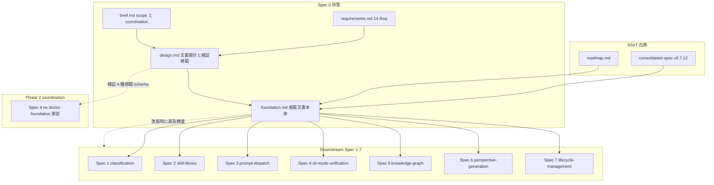
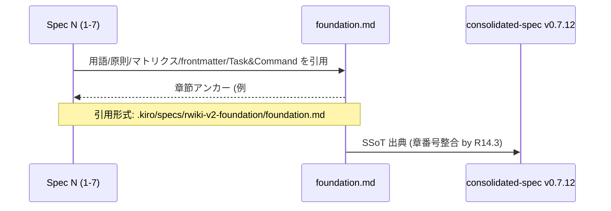
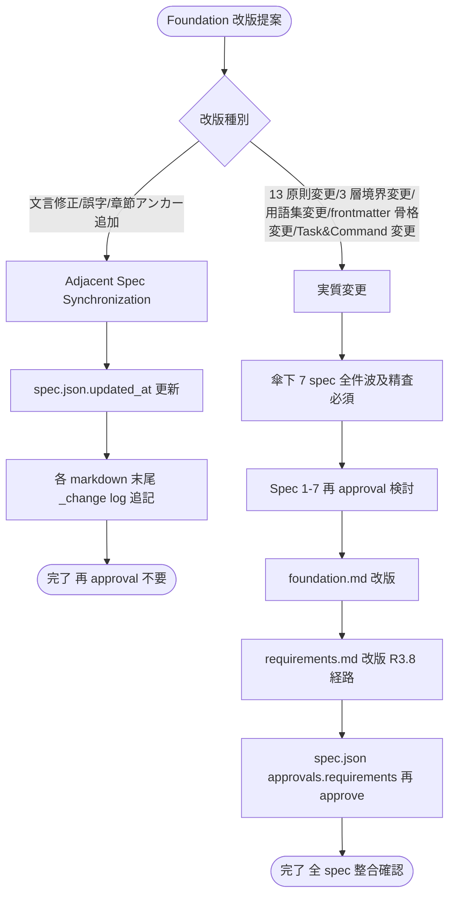
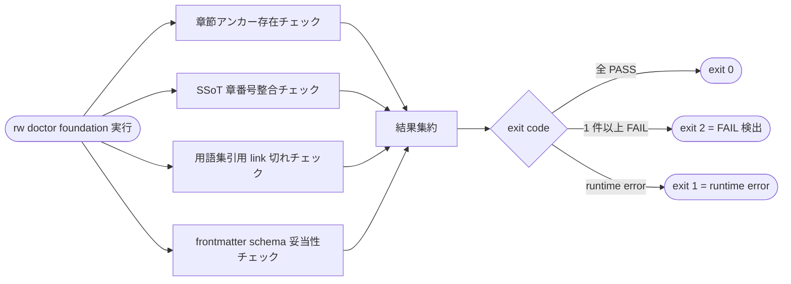
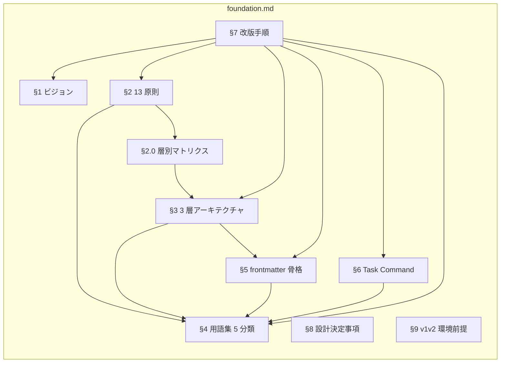
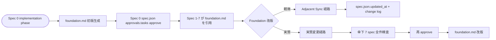

# Technical Design Document: rwiki-v2-foundation

## Overview

**Purpose**: 本 spec は Rwiki v2 の傘 spec として、Spec 1-7 が共通参照する上位規範 (ビジョン / 13 中核原則 / 3 層アーキテクチャ / 用語集 / frontmatter スキーマ骨格 / Task & Command モデル) を 1 つの SSoT 文書 `foundation.md` として確立する。本 design.md は、その規範文書 `foundation.md` の **構造設計 + 改版運用 + 検証 4 種の規範 + Spec 1-7 引用 interface** を定義する。

**Users**: Spec 1-7 起票者 / 実装者 / 将来の v2 保守者が、用語不統一・原則の層適用ミス・edge と page 状態の混同を回避する目的で `foundation.md` を引用する。

**Impact**: 個別 spec の独自解釈による不整合を未然に防ぎ、Foundation 改版時は Adjacent Spec Synchronization 運用 + 傘下 7 spec 全件波及精査の二重 gate により、規範ドリフトを機械的に検出可能にする。

### Goals

- Spec 1-7 の SSoT 引用元として `foundation.md` を `.kiro/specs/rwiki-v2-foundation/foundation.md` に確立する
- 14 Requirements 全 AC が `foundation.md` 内のセクション + 改版手順 + 検証 4 種規範にマップされ、追跡可能になる
- 検証 4 種 (章節アンカー存在 / SSoT 章番号整合 / 用語集引用 link 切れ / frontmatter schema 妥当性) を schema レベルで規範化し、実装は Phase 2 Spec 4 design に委譲する
- 設計決定事項を design.md 本文 + change log の二重記録方式で恒久保全する (ADR 不採用)

### Non-Goals

- CLI コマンドや実行時挙動の新規実装 (本 spec は規範文書 spec、CLI は Spec 4 / Spec 7 が所管)
- 検証 4 種の Python スクリプト実装 (Phase 2 Spec 4 design で `rw doctor foundation` として実装)
- frontmatter フィールドの詳細スキーマと vocabulary 実装 (Spec 1 所管)
- L2 Graph Ledger の data model と API 実装 (Spec 5 所管)
- 規範文書の **内容妥当性** の機械検証 (人間レビュー gate に委譲、4 種以外の verifier は構築しない、brief.md 設計上限)
- v1 → v2 移行用スクリプト (フルスクラッチ方針、移行不要)

## Boundary Commitments

### This Spec Owns

- **`foundation.md` 規範文書本体**: ビジョン / 13 中核原則 + 層別適用マトリクス / 3 層アーキテクチャ / 用語集 5 分類 / frontmatter 骨格 / Task & Command 一覧 / 改版手順 / 設計決定事項 / 環境前提
- **規範文書の章立て構造**: §1-9 の章節定義と SSoT 出典 (consolidated-spec v0.7.12 §1-6) との章番号整合
- **検証 4 種の規範 schema**: 章節アンカー存在 / SSoT 章番号整合 / 用語集引用 link 切れ / frontmatter schema 妥当性 — 各々の検査対象 / 入出力 / severity 規定
- **Foundation 改版手順の規範**: Adjacent Spec Synchronization 運用ルールの参照点 + 13 原則改廃時の傘下 7 spec 全件精査の規律
- **Foundation 自身の curation provenance 構造**: 規範 spec の curation は `decision_log.jsonl` 対象外、`docs/Rwiki-V2-dev-log*.md` + spec.json + change log で代替する非対称構造の宣言

### Out of Boundary

- **CLI 実装**: `rw doctor foundation` の Python script 実装 (Spec 4 design Phase 2 で確定)
- **frontmatter 詳細スキーマと vocabulary**: 各 field の値域 / validation rule / vocabulary 拡張規約 (Spec 1 所管)
- **L2 Graph Ledger 詳細**: edges.jsonl / edge_events.jsonl / decision_log.jsonl の field 仕様と API (Spec 5 所管)
- **個別 CLI コマンド**: `rw chat` / `rw perspective` / `rw approve` 等の引数 / 出力形式 / exit code (Spec 4 / Spec 6 / Spec 7 所管)
- **Skill 設計と dispatch**: AGENTS/skills/ 配下のスキーマと選択 logic (Spec 2 / Spec 3 所管)
- **Page lifecycle 操作**: deprecate / retract / archive / merge / split / rollback (Spec 7 所管)
- **Perspective / Hypothesis 生成**: 生成 logic / scoring / 半自動 verify (Spec 6 所管)
- **L1 raw / L3 wiki の subdirectory 規約**: `raw/incoming/` / `raw/llm_logs/` / `wiki/concepts/` 等の内部構造 (Spec 1 + steering structure.md 所管、本 spec は層モデルの対称性のみ規定)
- **実装レベル技術決定**: Severity 4 水準 / Exit code 0/1/2 / LLM CLI subprocess timeout / モジュール責務分割 / CLI 命名統一 (roadmap.md L132- が SSoT、本 spec は規範対象外)
- **規範文書の内容妥当性機械検証**: 4 種以外の verifier (例: 13 原則表記揺れ検査 / 用語集整合検査の content-level 自動化) は構築しない (brief.md 設計上限)

### Allowed Dependencies

- **SSoT 出典**: `.kiro/drafts/rwiki-v2-consolidated-spec.md` v0.7.12 §1-6 / §7.2 Spec 0 / §11.2-§11.3
- **Steering**: `roadmap.md` (Adjacent Spec Synchronization L163-, v1 から継承される実装レベル決定 L132-)
- **Adjacent Sync 運用**: `roadmap.md` の Adjacent Spec Synchronization 運用ルールに従う (`spec.json.updated_at` + 各 markdown 末尾 `_change log` への 1 行追記)
- **依存方向**: 本 spec は **他の v2 spec を upstream として持たない** (v2 の傘 spec、Spec 1-7 はいずれも本 spec を引用元として参照する片方向)、downstream は Spec 1-7 全件
- **SSoT 出典 / steering**: drafts (consolidated-spec) と steering (roadmap.md / structure.md / tech.md / product.md) は spec 依存とは別カテゴリの参照元、design 内では「依存」ではなく「出典 / 規範参照」として扱う
- **依存禁止**: v1 spec / 実装への参照 (`v1-archive/` 内容に依存しない、フルスクラッチ方針)

### Revalidation Triggers

以下の変更が Foundation に発生した場合、傘下 7 spec (Spec 1-7) **全件** に対する波及精査が必須となる (memory feedback_review_rounds.md 第 5 ラウンド規律):

- **13 中核原則の追加・削除・改名・層別適用度の変更** (R3.8) — Spec 1-7 全件再 approval 検討対象
- **3 層アーキテクチャの境界変更** (R2.1-R2.6) — L2 ledger 構成ファイルの追加削除を含む
- **用語集 5 分類への用語追加・削除・改名・alias 変更** (R7) — Spec 1-7 引用切れ検査対象
- **frontmatter 骨格の必須/推奨/任意 field 変更** (R8) — Spec 1 詳細スキーマへの波及
- **Task & Command 一覧の追加・削除** (R9) — Spec 4 / Spec 6 / Spec 7 への波及
- **検証 4 種の規範 schema 変更 (core schema)** — envelope structure (`{check, status, details}`) / check field 値 (`anchor_existence` / `ssot_alignment` / `citation_link_integrity` / `frontmatter_schema` の 4 種) / details 内 array 名 (`failures` / `drift_items` / `broken_links` / `parse_errors` / `missing_fields`) の追加・改名・削除は実質変更経路、Phase 2 Spec 4 design `rw doctor foundation` 実装への波及。details 内 array element の field 構造の追加・改名・削除 (例: `failures[].source_content` field の追加 / `broken_links[].context` field の追加等) は **Adjacent Sync 経路** (Phase 2 Spec 4 design で柔軟調整可、傘下 7 spec 波及精査不要)

これら以外の文言修正・誤字訂正・章節アンカー追加 (機械的補完) は **Adjacent Spec Synchronization** (再 approval 不要) の対象。

## Architecture

### Existing Architecture Analysis

本 spec は新規規範文書 spec であり、既存の v2 規範 spec は存在しない。consolidated-spec v0.7.12 は drafts 段階の議論ログで、本 spec が確定すると `foundation.md` が Spec 1-7 引用の SSoT として置き換わる (drafts 内容との二重管理は consolidated-spec 側を「議論ログ参照」として位置付けることで吸収する)。

### Architecture Pattern & Boundary Map



**Architecture Integration**:

- **Selected pattern**: Document-as-Spec (規範文書本体を spec ディレクトリ内に独立配置、design.md は文書構造 + 検証規範のみ所管)
- **Domain/feature boundaries**: design.md = 文書設計 / `foundation.md` = 規範本体 / Spec 1-7 = 規範 consumer / Spec 4 (Phase 2) = 検証 implementation
- **Existing patterns preserved**: Adjacent Spec Synchronization 運用 (roadmap.md L163-) を Foundation 改版にも適用
- **New components rationale**: `foundation.md` 独立ファイル = 規範 consumer (Spec 1-7) からの引用安定性の確保
- **Steering compliance**: roadmap.md / structure.md の依存方向 (Spec 0 → 1 → {4,7} → 5 → 2 → 3 → 6) と整合

### Technology Stack

本 spec は規範文書 spec であり、新規 runtime 依存を持たない。検証 4 種は Phase 2 Spec 4 design で実装。

| Layer | Choice / Version | Role in Feature | Notes |
|-------|------------------|-----------------|-------|
| Document Format | Markdown (CommonMark + YAML frontmatter、GitHub Flavored Markdown 仕様準拠) | `foundation.md` 規範文書のフォーマット | プロジェクト標準。ID 生成 logic の準拠先 (cmark-gfm / Linguist 等) は Phase 2 Spec 4 design で確定 |
| Schema Definition | YAML (frontmatter 骨格) / 構造化 list | 規範 schema の表現 | Spec 1 で詳細化 |
| Validation Reference | (Phase 2 Spec 4 で確定) | 検証 4 種の実装 | 本 spec は schema 規範のみ所管 |
| Runtime / Infrastructure | (該当なし) | — | 規範文書 spec のため |

**Phase 2 Spec 4 引き継ぎ依存事項** (Spec 4 design 着手時に最終確定):

- Python 標準ライブラリ想定: `pathlib` (path 操作) / `re` (正規表現 link 抽出) / `json` (logs 出力) / `subprocess` (grep 実行)、追加なし
- 第三者ライブラリ想定: `pyyaml` (yaml block parse、`yaml.safe_load` 必須、version 制約は Spec 4 で確定)
- 依存禁止: 検証 4 種実装は Spec 1-7 design.md / requirements.md を **markdown ファイルとして読み込むのみ**、Spec 5/6/7 等 downstream spec を Python module として `import` しない (一方向参照規律)
- v1-archive/ への依存禁止規律 (フルスクラッチ方針) は Phase 2 でも継続

## File Structure Plan

### Directory Structure

```
.kiro/specs/rwiki-v2-foundation/
├── brief.md                  # spec 起票時の scope と coordination (既存、approve 済)
├── requirements.md           # 14 Requirements (既存、approve 済)
├── design.md                 # 本ファイル — 文書設計 + 検証 4 種規範 + 設計決定事項
├── research.md               # 設計議論ログと決定根拠 (新規生成済)
├── foundation.md             # ★ 規範文書本体 (本 design 確定後の implementation phase で生成)
└── spec.json                 # spec 状態 (本 design 完了で phase = design-generated)
```

**Modified Files**:

- `.kiro/specs/rwiki-v2-foundation/spec.json` — `phase` を `requirements-approved` → `design-generated` に更新、`approvals.design.generated = true`、`updated_at` 更新

**Implementation Phase で生成される Files**:

- `.kiro/specs/rwiki-v2-foundation/foundation.md` — 規範文書本体 (本 design §「Components and Interfaces」で構造を確定、tasks phase で生成タスクを発行)

**Phase 2 Coordination で発生する Files (Spec 4 design 所管)**:

- `<dev>/scripts/rw_doctor.py` 内 `check_foundation()` 関数 (本 design で schema 規範のみ確定、実装は Spec 4 design 着手時)

> 各ファイルの責務:
> - `brief.md` = 起票時 scope の凍結
> - `requirements.md` = 14 Req 凍結 (approve 済)
> - `design.md` = 規範文書の構造設計 + 検証規範 + 設計決定 (本ファイル)
> - `research.md` = 議論ログと決定根拠 (本 design への入力)
> - `foundation.md` = 規範本体 (Spec 1-7 引用先、implementation phase 生成)

## System Flows

### Flow 1: Spec 1-7 が `foundation.md` を引用するパターン



**Key Decisions**:

- 引用 path は repo-root 起点の絶対 path (`.kiro/specs/rwiki-v2-foundation/foundation.md`) で固定 — Spec 1-7 から見た path 安定性を保つ
- 章節アンカーは markdown 標準の自動生成 ID (例: `## §2.12 Evidence-backed Candidate Graph` → `#212-evidence-backed-candidate-graph`) を採用 — 検証 4 種の 1 つ「章節アンカー存在チェック」が機械検出可能

### Flow 2: Foundation 改版時の二重 gate (Adjacent Sync vs 実質変更)



**Key Decisions**:

- **Adjacent Sync (左経路)**: 文言修正レベルの軽微変更、再 approval 不要、`spec.json.updated_at` + change log のみ
- **実質変更 (右経路)**: 13 原則 / 3 層境界 / 用語集 / frontmatter / Task&Command の構造変更、傘下 7 spec 全件波及精査必須、Foundation requirements.md 改版経由で再 approve
- **判定責務**: 改版提案者 (LLM/人間) が初回判定、レビュー gate でユーザー検証

### Flow 3: 検証 4 種実行フロー (Phase 2 Spec 4 design で実装される interface)



**Key Decisions**:

- 4 種は並列独立に実行可能、結果は JSON 集約 (`logs/doctor_foundation_latest.json`)
- exit code は roadmap.md L132 (Severity 4 / Exit 0/1/2 分離) 規律に従う
- severity マッピング: 章節アンカー欠落 = ERROR, SSoT drift = WARN, 用語 link 切れ = WARN, frontmatter schema 違反 = ERROR

## Requirements Traceability

| Requirement | Summary | Components | Interfaces | Flows |
|-------------|---------|------------|------------|-------|
| 1.1-1.6 | ビジョンと中核価値の明文化 | foundation §1 | 規範文書セクション | — |
| 2.1-2.6 | 3 層アーキテクチャ定義 | foundation §3 | 規範文書セクション + L2 core schema 6 ファイル骨格 | — |
| 3.1-3.8 | 13 中核原則 + 層別適用マトリクス + 拡張手順 | foundation §2 + §2.0 マトリクス | 規範文書セクション + 改版 R3.8 手順 | Flow 2 |
| 4.1-4.6 | §2.12 Evidence-backed Candidate Graph 優先関係 | foundation §2.12 | 規範文書セクション | — |
| 5.1-5.6 | Edge status 6 種 / Page status 5 種区別 | foundation §3 + §4.3 用語集 | 規範文書セクション | — |
| 6.1-6.6 | コマンド 4 Level + エディタ責務分離 | foundation §6 | 規範文書セクション | — |
| 7.1-7.7 | 用語集 5 分類 | foundation §4 | 規範文書セクション + 用語集引用 anchor | Flow 1 |
| 8.1-8.7 | Frontmatter スキーマ骨格 | foundation §5 | 規範文書セクション + L2 core schema 骨格 | — |
| 9.1-9.5 | Task & Command モデル一覧 | foundation §6 | 規範文書セクション | — |
| 10.1-10.4, 10.6-10.8 | SSoT 性 + 改版手順 + 整合性検証手段の提示 | foundation §7 改版手順 + design §「検証手段の規範」 | 検証 4 種 schema | Flow 1 / Flow 2 / Flow 3 |
| 10.5 | v1 隔離 + フルスクラッチ宣言 | foundation §9 (§7 から forward link) | 規範文書セクション | — |
| 11.1-11.7 | 実装独立性と運用前提 | foundation §9 環境前提 (R11.7 reject 必須は §2.6 / §13 へ forward link) | 規範文書セクション | — |
| 12.1-12.6 | Curation Provenance §2.13 規範化 | foundation §2.13 + §4.3 用語集 | 規範文書セクション | — |
| 13.1-13.6 | §2.6 Git + 層別履歴媒体規範化 | foundation §2.6 + §4.3 用語集 | 規範文書セクション | — |
| 14.1-14.4 | 文書品質と SSoT 整合性 | design §「検証手段の規範」 + foundation 全章立て | 検証 4 種 schema (章節アンカー / SSoT 章番号整合) | Flow 3 |
| 14.5 | 14 Req 各々の Boundary Commitments 再確認 | design.md §「Boundary Commitments」 | (design 自身) | — |

> **R10 内部分断脚注**: R10.5 (v1 隔離 + フルスクラッチ宣言) は §9 で集約マップ、§7 改版手順では §9 への forward link のみ。R10.1-R10.4 / R10.6-R10.8 は §7 改版手順で集約され、R10.5 のみ §9 にマップされるため別行記述。

## Components and Interfaces

### 規範文書 (foundation.md) のセクション構造

| Component | Domain/Layer | Intent | Req Coverage | Key Dependencies (P0/P1) | Contracts |
|-----------|--------------|--------|--------------|--------------------------|-----------|
| §1 ビジョン | 規範本文 | Curated GraphRAG ポジショニング + 6 信念 | 1.1-1.6 | consolidated-spec §1 (P0) | Document |
| §2 13 中核原則 + §2.0 マトリクス | 規範本文 | 13 原則と層別適用、優先関係 | 3.1-3.8, 4.1-4.6, 12.1-12.6, 13.1-13.6 | consolidated-spec §2 (P0) | Document |
| §3 3 層アーキテクチャ | 規範本文 | L1/L2/L3 + L2 core schema 6 ファイル | 2.1-2.6, 5.1-5.6 | consolidated-spec §3 (P0) | Document |
| §4 用語集 5 分類 | 規範本文 | 基本/アーキ/Graph Ledger/Perspective-Hypothesis/Operations | 7.1-7.7, 5.1-5.6, 12.1-12.6, 13.1-13.6 | consolidated-spec §4 (P0) | Document |
| §5 Frontmatter スキーマ骨格 | 規範本文 | 必須/推奨/任意 + 7 種 wiki/review/skill/vocabulary/follow-up/hypothesis/perspective 骨格 | 8.1-8.7 | consolidated-spec §5 (P0), Spec 1 (P1 詳細委譲先) | Document |
| §6 Task & Command モデル | 規範本文 | Task 一覧 + Command カテゴリ別整理 + 4 Level | 6.1-6.6, 9.1-9.5 | consolidated-spec §6 (P0), Spec 4 (P1 詳細委譲先) | Document |
| §7 改版手順と SSoT 検証 | 規範本文 | Adjacent Sync vs 実質変更の二重 gate + 検証 4 種参照点 | 10.1, 10.2, 10.3, 10.4, 10.6, 10.7, 10.8, 3.8 | roadmap.md L163 (P0) | Document |
| §8 設計決定事項 | 規範本文 | 規範レベル決定の恒久記録 (drafts §11.2 形式) | (本 design 決定 0-1〜0-5 の foundation 反映分) | drafts §11.2 (P1) | Document |
| §9 v1→v2 対応 + 環境前提 | 規範本文 | フルスクラッチ宣言 + Python 3.10+ + Git + LLM CLI + Concurrency lock | 10.5, 11.1-11.7 | roadmap.md L132 (P0) | Document |

**R14.5 マッピング**: 14 Req 各々の Boundary Commitments 再確認は本 design.md §「Boundary Commitments」セクションが満たす (foundation 章立てに対応するセクションは存在しない、design 自身の責務)。R14.1-R14.4 は foundation 全章立て + design 検証手段の規範で覆う。

#### Component: §1 ビジョン

| Field | Detail |
|-------|--------|
| Intent | Curated GraphRAG ポジショニング + Trust/Graph/Perspective/Hypothesis 四位一体 + 6 信念 |
| Requirements | 1.1, 1.2, 1.3, 1.4, 1.5, 1.6 |

**Responsibilities & Constraints**

- §1.1 一行定義 (Karpathy LLM Wiki + Vannevar Bush Memex 起源、R1.1)
- §1.2 中核価値 4 軸 (Trust = 人間承認 + evidence chain / Graph = typed edges / Perspective = LLM graph traverse 再解釈 / Hypothesis = LLM 新命題生成)、R1.2
- §1.3 Perspective vs Hypothesis 区別 (再解釈 vs 新命題 / Trust chain 維持 vs `[INFERENCE]` マーカー / 再利用 vs 検証ワークフロー)、R1.3
- §1.4 Curated GraphRAG 宣言 + 通常 GraphRAG 対比軸 5 種 (起点 / 主体 / 品質 / 用途 / 時間変化)、R1.4
- §1.5 GraphRAG 採用 4 技法 (Community detection / Global query / Missing bridge detection / Hierarchical summary on-demand) + 事前構築しない原則、R1.5
- §1.6 設計信念 6 種 (Graph evolving / Evidence first-class / 人間は戦略 + reject / 知識正誤の時間関数 / LLM 実務 + 人間方向性 / 使われる知識残す)、R1.6

**Dependencies**

- Inbound: §7 改版手順 (改版経路の参照点)
- Outbound: §2 13 中核原則 (信念 6 種が §2 各原則に展開)、§4 用語集 (Curated GraphRAG / Trust chain / Perspective / Hypothesis 等) との forward link
- External: consolidated-spec §1 — P0

**Contracts**: Document ✓

##### Document Contract (ビジョンと中核価値)

- **章立て**: §1.1-§1.6 で 6 sub-section 構造、consolidated-spec §1 と整合 (R14.3)
- **対比軸表**: §1.4 で通常 GraphRAG vs Curated GraphRAG の 5 軸対比を表形式で明示 (R14.2 表は最小限、本対比は不可避)

**Implementation Notes**

- Integration: §2 13 中核原則 / §3 3 層アーキテクチャ (Trust = L1 起点) / §4 用語集 (Curated GraphRAG / Trust chain / etc.) との forward link
- Validation: 検証 4 種の「章節アンカー存在」が §1.1-§1.6 全アンカーを検査
- Risks: ビジョン文言と consolidated-spec §1 の drift → 検証 2「SSoT 章番号整合チェック」で検出

#### Component: §2 13 中核原則 + §2.0 層別適用マトリクス

| Field | Detail |
|-------|--------|
| Intent | 13 原則 (§2.1-§2.13) + L1/L2/L3 適用度マトリクス + 不変項目 + 改廃手順 |
| Requirements | 3.1, 3.2, 3.3, 3.4, 3.5, 3.6, 3.7, 3.8, 4.1, 4.2, 4.3, 4.4, 4.5, 4.6, 12.1, 12.2, 12.3, 12.4, 12.5, 12.6, 13.1, 13.2, 13.3, 13.4, 13.5, 13.6 |

**Responsibilities & Constraints**

- 13 原則の各々を §2.1-§2.13 として独立サブセクション化
- §2.0 で層別適用マトリクス (4 区分: 完全適用 / 限定適用 / 適用外 / 該当しない) を 1 表で集約
- 不変項目 4 種を固定 (R3.7): (1) §2.10 Evidence chain 全層貫通 / (2) §2.12 Candidate Graph L2 専用 / (3) §2.2 Review layer first および §2.4 Dangerous ops 8 段階対話は L3 限定 / (4) §2.13 Curation Provenance は L2/L3 + L1 lint pass。これら 4 種は再解釈・緩和不可
- 13 原則の追加・削除・改名・層別適用度変更は本 spec 改版経路 (R3.8)、Adjacent Sync では扱わない
- §2.6 (Git + 層別履歴媒体) は edge_events.jsonl event type 8 種を列挙 (R13.3)、ただし event type 8 種は Spec 5 で「初期セット 11 種 + 拡張可規約」に拡張済 → foundation §2.6 / §3 では「8 種 + 拡張可規約」と明記して整合

**Dependencies**

- Inbound: (なし、本 spec が起点)
- Outbound: §3 3 層アーキテクチャ (層モデルとして連携) — P0 / §4 用語集 (Edge status / Page status / 用語) — P0
- External: consolidated-spec §2 — P0

**Contracts**: Document ✓

##### Document Contract (規範文書セクション)

- **章立て番号**: §2.0-§2.13 (consolidated-spec §2.0-§2.13 と整合、R14.3)
- **マトリクス形式**: 表 (13 原則 × 3 層、凡例 ✓ / △ / ❌ / —)
- **不変項目宣言**: §2.0 マトリクス末尾に「不変項目 4 種」セクションを置き、§2.10 / §2.12 / §2.2 §2.4 の L3 限定 / §2.13 の二重保全を列挙

**Implementation Notes**

- Integration: §3 3 層アーキテクチャから §2.0 マトリクスへの forward link、§4 用語集から §2 各原則への back link
- Validation: 検証 4 種の「章節アンカー存在」が §2.0-§2.13 全アンカーを検査、「用語集引用 link 切れ」が §2 → §4 link を検査
- Risks: 13 原則改廃時の傘下 7 spec 波及精査の省略リスク → §7 改版手順で必須プロセス化

#### Component: §3 3 層アーキテクチャ + L2 core schema 6 ファイル骨格

| Field | Detail |
|-------|--------|
| Intent | L1 Raw / L2 Graph Ledger / L3 Curated Wiki の役割・物理位置・更新頻度・人間関与モデル + L2 core schema |
| Requirements | 2.1, 2.2, 2.3, 2.4, 2.5, 2.6, 5.1, 5.2, 5.3, 5.4, 5.5, 5.6 |

**Responsibilities & Constraints**

- 3 層を §3.1-§3.5 として階層的定義
- L2 core schema 6 ファイル (`entities.yaml` / `edges.jsonl` / `edge_events.jsonl` / `evidence.jsonl` / `rejected_edges.jsonl` / `decision_log.jsonl`) を §3 + §5 で骨格として明示、詳細 field は Spec 5 委譲
- L2 構成要素として `reject_queue/` ディレクトリ (低 confidence 候補の確認待ち行列、R2.3 列挙対象) を 6 core schema ファイルと並列に §3 で明示。`reject_queue/` は queue ディレクトリで「ledger 本体」とは別カテゴリ
- Edge status 6 種 (`weak/candidate/stable/core/deprecated/rejected`) と Page status 5 種 (`active/deprecated/retracted/archived/merged`) を独立次元として §3 + §4 で対比、Hypothesis status 7 種を第 3 軸として明示 (R5.4)
- 横断要素 (`review/*_candidates/` / `AGENTS/` / `.rwiki/vocabulary/` / `logs/`) を 3 層と独立として位置付け (R2.4)
- L1 raw / L3 wiki の subdirectory 規約は本 spec 規範対象外 (Spec 1 + steering structure.md 所管)、層モデルとしての対称性のみ規定 (brief.md Coordination 「3 層対称性の意図的限定」)

**Dependencies**

- Inbound: §2 13 原則 (§2.6 / §2.9 / §2.10 / §2.12 / §2.13 から層別適用)
- Outbound: §4 用語集 (Edge status / Page status / Entity / Edge / Evidence ledger 等) — P0
- External: consolidated-spec §3 — P0, Spec 1 (frontmatter / category vocabulary 詳細委譲先) — P1, Spec 5 (L2 ledger 詳細委譲先) — P1

**Contracts**: Document ✓

##### Document Contract (L2 core schema 骨格)

- **6 ファイル一覧**: 各々の役割を一文で説明 + 詳細 field は Spec 5 所管と明示
- **derived cache 区別**: `.rwiki/cache/graph.sqlite` / `networkx.pkl` は gitignore、正本ではないことを §3 + §5 で明示

**Implementation Notes**

- Integration: §2.10 / §2.12 / §2.13 の層別適用マトリクスとの forward link
- Validation: 検証 4 種の「frontmatter schema 妥当性」が §5 骨格と Spec 1 詳細スキーマの整合を検査
- Risks: L2 ledger 詳細が Spec 5 で改版された際の波及反映漏れ → §7 改版手順で「ledger 構造変更時の Foundation Adjacent Sync」を明記

#### Component: §4 用語集 5 分類

| Field | Detail |
|-------|--------|
| Intent | 5 分類で約 50 用語を体系化、spec 横断の用語不統一を防ぐ |
| Requirements | 7.1, 7.2, 7.3, 7.4, 7.5, 7.6, 7.7 |

**Responsibilities & Constraints**

- 5 分類: §4.1 基本 / §4.2 アーキテクチャ / §4.3 Graph Ledger / §4.4 Perspective-Hypothesis / §4.5 Operations
- 各用語に正規名 + 必要に応じた alias を併記 (R7.7)、spec 間で同義語が独立に増殖しないよう anchor 化
- §4.3 Graph Ledger 用語 (Entity / Edge / Edge status / Page status / Confidence / Evidence ledger / Edge event / Dangling edge / Extraction mode / Graph Hygiene 5 種 / Usage signal / Reject queue / Curation provenance / Decision log / Decision type / Selective recording / Decision visualization Tier 1-5 / Context ref) を最厚密度 (Spec 5 主要参照先)

**Dependencies**

- Inbound: §2 / §3 / §5 / §6 (各用語の forward link 元)
- Outbound: (なし)
- External: consolidated-spec §4 — P0

**Contracts**: Document ✓

##### Document Contract (用語アンカー)

- **アンカー形式**: 各用語をサブヘッダー (`#### Edge status`) として配置、GitHub 自動生成 ID `#edge-status` をそのまま anchor として使用
- **alias 形式**: 「Edge status (alias: edge_status, edge ライフサイクル状態)」のような括弧付き記述
- **同名ヘッダー衝突回避**: `Edge status` (用語集 §4.3) と `Edge status` (§3 アーキテクチャ説明) のように同名ヘッダーが複数出現すると GitHub は `-1` 接尾を付与する。foundation 生成時は §4.3 を「正規 anchor 名 (suffix なし)」として優先配置し、§3 など他章では `### Edge status (詳細は [§4.3 用語集](#edge-status) 参照)` 形式で参照に統一して衝突回避

**Implementation Notes**

- Integration: Spec 1-7 の design.md / requirements.md からの引用は `foundation.md#edge-status` 形式 (GitHub 自動生成 ID)
- Validation: 検証 4 種の「用語集引用 link 切れチェック」が Spec 1-7 全件を grep し、`foundation.md#anchor` 形式の link 先 anchor が §4 内に存在することを検査
- Risks: alias 追加時の Spec 1-7 引用 drift → §7 改版手順で「用語追加・改名・alias 変更時の Adjacent Sync」を明記

#### Component: §5 Frontmatter スキーマ骨格

| Field | Detail |
|-------|--------|
| Intent | 全 markdown 共通必須/推奨/任意 + 7 種固有スキーマ骨格、詳細は Spec 1 委譲 |
| Requirements | 8.1, 8.2, 8.3, 8.4, 8.5, 8.6, 8.7 |

**Responsibilities & Constraints**

- 共通必須: `title` / `source` / `added` (R8.1)
- 推奨: `type` (content type 単一値) / `tags` (多次元) (R8.2)
- 7 種固有スキーマ骨格 (R8.4): Wiki ページ / Review レイヤー / Skill / Skill candidate / Vocabulary candidate / Follow-up / Hypothesis candidate / Perspective 保存版
- L2 Graph Ledger 6 ファイル骨格 (R8.5): `entities.yaml` / `edges.jsonl` / `edge_events.jsonl` / `evidence.jsonl` / `rejected_edges.jsonl` / `decision_log.jsonl`
- L3 frontmatter `related:` は L2 stable/core edges からの derived cache、正本は `edges.jsonl` (R8.6)
- 詳細フィールド型 / vocabulary / validation rule は Spec 1 所管 (R8.7)

**Dependencies**

- Inbound: §2 / §3 / §4 (frontmatter field と用語の forward link 元)
- Outbound: (なし)
- External: consolidated-spec §5 — P0, Spec 1 (詳細委譲先) — P1

**Contracts**: Document ✓

##### Document Contract (frontmatter 骨格)

- **共通必須/推奨/任意**: YAML 構造化 list で記述
- **7 種固有骨格**: 各々のセクション (`### §5.4 Wiki ページ固有` 等) で骨格スキーマを yaml block 例示
- **詳細委譲明示**: 各セクション末尾に「詳細フィールド仕様 / vocabulary / validation rule は Spec 1 所管」を明記

**Implementation Notes**

- Integration: §3 3 層アーキテクチャ → §5 (`related:` derived cache 等) への forward link
- Validation: 検証 4 種の「frontmatter schema 妥当性」が §5 骨格 yaml の構文妥当性を検査
- Risks: Spec 1 で詳細スキーマ確定後、骨格との不整合発生リスク → §7 改版手順で「Spec 1 frontmatter 拡張時の Foundation Adjacent Sync」を明記

#### Component: §6 Task & Command モデル

| Field | Detail |
|-------|--------|
| Intent | Task 一覧 + Command カテゴリ別整理 + コマンド 4 Level + エディタ責務分離 + 実行モード 3 種 |
| Requirements | 6.1, 6.2, 6.3, 6.4, 6.5, 6.6, 9.1, 9.2, 9.3, 9.4, 9.5 |

**Responsibilities & Constraints**

- §6.1 コマンド 4 Level 階層 (L1 発見 / L2 判断 / L3 メンテ LLM ガイド / L4 Power user / CI)、R6.1
- §6.2 L1 発見コマンド (`rw chat` / `rw perspective` / `rw hypothesize` / `rw discover`) を例示、`rw discover` は R9.1 discover task 対応の L1 発見コマンド (R6.2)
- §6.3 L3 メンテナンスコマンドが原則として全て `rw chat` 内で LLM ガイド可能 (§2.11 設計指針)、R6.3
- §6.4 エディタ責務分離 (編集体験 = エディタ、パイプライン = Rwiki、Obsidian 参照実装、Rwiki 自体はエディタ非依存)、R6.4
- §6.5 L2 JSONL 直接編集禁止 (Rwiki 管理領域)、R6.5
- §6.6 自然言語 maintenance autonomous trigger 例示 (reject queue 蓄積警告 / 未 approve 候補警告 / edge decay 警告等)、R6.6
- §6.7 Task 一覧 (lint / ingest / distill / approve / query (answer/extract/fix) / audit (links/structure/semantic/strategic/deprecated/tags/evidence/followups) / perspective / hypothesize / discover) + 実行モード (CLI / CLI Hybrid) + 対話ガイド有無、R9.1
- §6.8 Command 一覧 (16 カテゴリ別整理: コア / Input Pipeline / Knowledge Generation / Approval / Query / Audit / L2 Graph Ledger 管理 / Edge 個別操作 / Entity-Relation 抽出 / Reject workflow / Page Lifecycle / Tag Vocabulary / Skill Library / Follow-up / Vault 管理 / Decision Log)、各コマンド一行説明、引数フラグ詳細は Spec 4-7 委譲、R9.2 + R9.3
- §6.9 実行モード 3 種 (Interactive `rw chat` 推奨 / CLI 直接 自動化・熟練 / CLI Hybrid 内部 LLM CLI 呼出)、いずれも同じ `cmd_*` エンジン関数呼出、R9.4
- §6.10 個別コマンドのフラグ・出力形式・exit code 仕様は Spec 4 以降の所管、R6.5 + R9.5

**Dependencies**

- Inbound: §2 13 中核原則 (§2.1 Paradigm C / §2.5 Simple dangerous ops / §2.7 エディタ責務分離 / §2.11 Discovery primary / §2.4 Dangerous ops 8 段階対話 等)、§3 3 層アーキテクチャ (各 Command の対象層)
- Outbound: §4 用語集 (4 Level / 実行モード / Maintenance autonomous trigger / Dangerous operation / 8 段階対話ガイド) との forward link
- External: consolidated-spec §6 — P0、Spec 4 (CLI 詳細委譲先) — P1、Spec 6 (rw discover / rw perspective / rw hypothesize 詳細) — P1、Spec 7 (Page lifecycle コマンド詳細) — P1

**Contracts**: Document ✓

##### Document Contract (Task & Command)

- **Task 一覧形式**: 表 (Task 名 × 実行モード × 対話ガイド有無)、各行 1 Task (R14.2 表は最小限、本一覧は不可避)
- **Command 一覧形式**: カテゴリ階層 (16 大カテゴリ → コマンド) 箇条書き、各コマンドに一行説明
- **詳細委譲明示**: 各 Task / Command の引数フラグ仕様 / 出力形式 / exit code は Spec 4-7 所管と明記

**Implementation Notes**

- Integration: §2 各原則 (Paradigm C / Discovery primary / エディタ責務分離 等) との forward link、§4 用語集 (4 Level / 実行モード) との link、§9 v1→v2 + 環境前提 (LLM CLI subprocess timeout 等の実装レベル決定は roadmap.md L132- SSoT) との link
- Validation: 検証 4 種の「用語集引用 link 切れ」が Spec 4-7 design からの `foundation.md#<command-anchor>` 引用整合を検査
- Risks: Spec 4-7 で新規コマンド追加時の foundation §6 反映漏れ → §7 改版手順で「Task & Command 一覧追加・削除時の Adjacent Sync」を明記 (Revalidation Triggers 5)

#### Component: §7 改版手順と SSoT 検証

| Field | Detail |
|-------|--------|
| Intent | Foundation 改版時の二重 gate (Adjacent Sync / 実質変更) + 検証 4 種規範への参照点 |
| Requirements | 10.1, 10.2, 10.3, 10.4, 10.6, 10.7, 10.8, 3.8 (R10.5 v1 隔離は §9 で集約、§7 では forward link のみ) |

**Responsibilities & Constraints**

- §7.1 SSoT 引用元宣言: consolidated-spec v0.7.12 §1-6 / §7.2 Spec 0 / §11.2-§11.3 (R10.1)
- §7.2 Spec 1-7 への上位規範性宣言 (R10.2)
- §7.3 改版二重 gate (Adjacent Sync vs 実質変更) — 詳細フローは design Flow 2 参照 (R10.3, R10.4, R10.8, R3.8)
- §7.4 Spec 1-7 依存順 (Spec 0 → 1 → {4, 7} → 5 → 2 → 3 → 6) を roadmap.md 参照 (R10.6)
- §7.5 整合性検証手段 = 4 種 schema を design.md §「検証手段の規範」へ forward link (R10.7)
- v1 隔離宣言 (`v1-archive/` 参照、フルスクラッチ、R10.5) は §9 で集約記述、§7 では §9 への forward link のみ

**Dependencies**

- Inbound: §1-§6 全章 (改版経路の参照点)
- Outbound: design.md §「検証手段の規範」(検証 schema 詳細) — P0
- External: roadmap.md L163 (Adjacent Sync 運用) — P0

**Contracts**: Document ✓

##### Document Contract (改版手順)

- **二重 gate 判定**: Flow 2 で機械化、改版提案時に左右どちらの経路かを明示
- **傘下 7 spec 波及精査**: 実質変更経路で「Spec 1-7 全件波及精査必須」を §7.3 で明文化、memory feedback_review_rounds.md 第 5 ラウンド規律と整合

**Implementation Notes**

- Integration: design.md §「検証手段の規範」(検証 4 種 schema 詳細) との bi-directional link
- Validation: 検証 4 種の「SSoT 章番号整合」が consolidated-spec §1-6 と foundation §1-6 の章番号 drift を検査
- Risks: 実質変更を Adjacent Sync で誤処理するリスク → Flow 2 の判定基準を §7.3 で明文化、改版提案者の責務として宣言

#### Component: §8 設計決定事項 (foundation 規範レベル決定の恒久記録)

| Field | Detail |
|-------|--------|
| Intent | foundation 規範レベルの設計決定 (改版手順運用ルール / 検証 4 種実装委譲先 / 章立て構造起源 / R10.7 整合性検証手段判断 等) を drafts §11.2 形式で恒久記録、ADR 代替 |
| Requirements | (本 design 決定 0-1〜0-6 の foundation 反映分) |

**Responsibilities & Constraints**

- drafts §11.2 形式 (タイトル / 経緯 / 決定 / 影響 4 項目) で記述
- foundation §8 に記録される決定の対象 = foundation 文書本体の規範レベル決定 (path / 章立て構造 / 検証 4 種実装委譲先 / change log 二重記録方式 / curation provenance 構造的非対称性 / R10.7 整合性検証手段判断)
- design.md §「設計決定事項」(本 design 決定 0-1〜0-6) との対応関係 = foundation §8 が公開規範文書、design §「設計決定事項」が実装過程の経緯記録 (二重記録方式)
- decision_log.jsonl への記録は不要 (決定 0-5 と整合、Foundation 自身の curation 構造的非対称性)

**Dependencies**

- Inbound: §7 改版手順 (改版時に決定追加経路)、design.md §「設計決定事項」(本 design 決定 0-1〜0-6) との対応
- Outbound: なし
- External: drafts §11.2 v0.7.10-v0.7.12 (記述形式の参照例) — P1

**Contracts**: Document ✓

##### Document Contract (設計決定事項)

- **記述形式**: drafts §11.2 形式 (`### 決定 N-M: タイトル` + 「経緯」「決定」「影響」3 項目)
- **change log との二重記録**: foundation §8 に詳細、foundation 末尾 `_change log` に「YYYY-MM-DD 決定 N-M 確定 (タイトル)」1 行サマリ

**Implementation Notes**

- Integration: §7 改版手順から §8 への forward link (決定追加経路として)、design.md §「設計決定事項」(本 design 決定 0-1〜0-6) との対応明示
- Validation: 検証 4 種の「章節アンカー存在」が §8 内 sub-anchor 全件を検査
- Risks: 決定追加時の change log 1 行サマリ漏れ → §7 改版手順で「決定追加時の二重記録規律」を明記

#### Component: §9 v1→v2 対応 + 環境前提

| Field | Detail |
|-------|--------|
| Intent | フルスクラッチ宣言 (v1 隔離) + Python 3.10+ + Git + LLM CLI + Concurrency lock 等の運用前提、実装レベル技術決定は roadmap.md L132- SSoT 参照 |
| Requirements | 10.5, 11.1, 11.2, 11.3, 11.4, 11.5, 11.6, 11.7 |

**Responsibilities & Constraints**

- §9.1 フルスクラッチ宣言 (v1 spec / 実装は v1-archive/ に隔離、本 Foundation は v1 を知らない前提で自己完結、R10.5)
- §9.2 LLM 実装独立性 (特定 LLM 非依存、Claude Code は参照実装、抽象層は Spec 3 が提供、R11.1)
- §9.3 エディタ実装独立性 (Obsidian 推奨だが必須でない、生成 markdown は任意エディタで編集可、R11.2)
- §9.4 必須環境 (Git / Python 3.10+ / LLM CLI インターフェイス / Markdown エディタ、R11.3)
- §9.5 Python 依存 (sqlite3 標準 + networkx >= 3.0 Spec 5 で追加に限定、R11.4)
- §9.6 Concurrency lock (`.rwiki/.hygiene.lock` で Hygiene バッチと CLI 操作の排他、Spec 4 と Spec 5 の境界で整合、R11.5)
- §9.7 L2 ledger 方針 (append-only JSONL の理由 = git diff 親和 / 人間可読 / Graph DB 正本化却下 / rebuild 可能性、§2.6 引用、R11.6)
- §9.8 Reject 理由記述義務 (`rejected_edges.jsonl.reject_reason_text` 空文字禁止、`reject_learner` skill 学習素材として必須、R11.7)
- 実装レベル技術決定 (Severity 4 水準 / Exit code 0/1/2 分離 / LLM CLI subprocess timeout 必須 / モジュール責務分割 / CLI 命名統一) は roadmap.md L132- が SSoT、本 spec は規範対象外 (brief.md Coordination)、§9 では参照点として残す

**Dependencies**

- Inbound: §7 改版手順 (改版経路の参照点)、§2.6 Git + 層別履歴媒体 (L2 ledger append-only JSONL の根拠)
- Outbound: §3 3 層アーキテクチャ (各層の物理位置) / §4 用語集 (Pre-flight check / Concurrency lock / Maintenance autonomous trigger 等) との forward link
- External: consolidated-spec §9 (フルスクラッチ方針) — P0、roadmap.md L22- (v2 全体 Constraints SSoT) — P0、roadmap.md L132- (実装レベル技術決定 SSoT) — P0

**Contracts**: Document ✓

##### Document Contract (v1→v2 + 環境前提)

- **フルスクラッチ宣言**: §9.1 で v1-archive/ への参照禁止規律明示
- **環境列挙**: §9.4 で必須環境を箇条書き
- **依存規律**: §9.5 で Python 標準 + 第三者 (networkx) を限定列挙
- **実装レベル決定の参照点**: §9 末尾で「Severity 4 / Exit 0/1/2 / subprocess timeout / モジュール責務 / CLI 命名」は roadmap.md L132- が SSoT と参照

**Implementation Notes**

- Integration: §2.6 Git + 層別履歴媒体 / §2.10 Evidence chain / §3 3 層アーキテクチャ (各層の物理位置) / §4 用語集 (Pre-flight check / Concurrency lock 等) との forward link
- Validation: 検証 4 種の「章節アンカー存在」が §9.1-§9.8 全アンカーを検査、roadmap.md 参照は外部 link なので検証範囲外
- Risks: roadmap.md 改版時の §9 反映漏れ → roadmap.md は v2 全体 Constraints SSoT、本 spec はその参照点として更新追従 (Adjacent Sync 経路)

### 検証手段の規範 (design.md 内、Phase 2 Spec 4 design 引き継ぎ仕様)

本セクションは Spec 0 design 内に確定する **検証 4 種の schema 規範** であり、実装は Phase 2 Spec 4 design `rw doctor foundation` サブコマンドが所管する。

#### Component: 検証 1 — 章節アンカー存在チェック

| Field | Detail |
|-------|--------|
| Intent | foundation.md 内の §1-§9 全章節アンカーが foundation.md 内 link target として実在することを検査 |
| Requirements | 10.7 |

**Schema 規範**

- **入力**: `foundation.md` ファイル path
- **検査内容**: foundation.md 内の `[...](#anchor)` 形式 link を抽出 → 各 anchor が foundation.md 内のヘッダー自動生成 ID と一致することを検査。正規化アルゴリズム (GitHub markdown 自動 ID 生成 logic 準拠、CJK 保持) と edge case (空ヘッダー / HTML タグ / コードブロック内 link / 同名衝突 `-1` 接尾) の取り扱いは Phase 2 Spec 4 design 着手時に確定
- **出力**: JSON `{check: "anchor_existence", status: "pass" | "fail", details: {failures: [{link_text: str, missing_anchor: str, line: int}]}}` (envelope 包含形式、Data Models §「Logical Data Model」envelope schema と整合)
- **severity**: アンカー欠落 1 件以上 = ERROR
- **exit code**: 全 PASS = 0 / 1 件以上 FAIL = 2

#### Component: 検証 2 — SSoT 章番号整合チェック

| Field | Detail |
|-------|--------|
| Intent | foundation.md §1-§6 の章番号と consolidated-spec v0.7.12 §1-6 の章番号 drift を検査 (R14.3) |
| Requirements | 14.3, 10.7 |

**Schema 規範**

- **入力**: `foundation.md` + `.kiro/drafts/rwiki-v2-consolidated-spec.md` ファイル path、想定 SSoT version 識別子 (例: v0.7.12)。version 識別子の **受け渡し方法** (CLI 引数 / consolidated-spec ヘッダ自動抽出 / hardcode) は Phase 2 Spec 4 design 着手時に確定 (本 spec では入力として受け取ることまでを規範化)
- **検査内容**: foundation.md §1-§6 の各章タイトル → consolidated-spec §1-6 の各章タイトルとの正規化マッチ (例: `## §2.12 Evidence-backed Candidate Graph` ↔ `### 2.12 Graph Ledger による Evidence-backed Candidate Graph`)。マッチ logic (章番号一致のみ / タイトル類似度 / 完全一致 + alias 表) の選択は Phase 2 Spec 4 design 着手時に確定
- **出力**: JSON `{check: "ssot_alignment", status: "pass" | "warn", details: {drift_items: [{foundation_section: str, consolidated_section: str | null, drift_type: "missing" | "title_mismatch" | "extra"}]}}` (envelope 包含形式)
- **severity**: drift 1 件以上 = WARN (consolidated-spec 改版時の差分検出を主用途とし、即 FAIL ではない)
- **exit code**: 全 PASS = 0 / WARN 検出 = 0 (WARN は exit 0 だが logs に記録)

#### Component: 検証 3 — 用語集引用 link 切れチェック

| Field | Detail |
|-------|--------|
| Intent | Spec 1-7 design.md / requirements.md からの `foundation.md#anchor` 引用が §4 用語集 anchor として実在することを検査 |
| Requirements | 10.7, 7.7 |

**Schema 規範**

- **入力**: Spec 1-7 design.md + requirements.md (合計 14 ファイル) + `foundation.md`
- **検査内容**: Spec 1-7 全 markdown を grep で `foundation.md#<anchor>` 形式 link 抽出 → 各 anchor が foundation.md §4 (用語集) または §1-§3 / §5-§9 (用語以外) の anchor として実在することを検査。anchor の文字集合 (ASCII + CJK + hyphen 等)、URL-decode 要否、正規表現の Unicode 対応は Phase 2 Spec 4 design 着手時に確定
- **出力**: JSON `{check: "citation_link_integrity", status: "pass" | "warn", details: {broken_links: [{source_file: str, line: int, target_anchor: str}]}}` (envelope 包含形式、`missing` field は冗長性除外 = broken_links 配列内に存在することが missing を意味する)
- **severity**: link 切れ 1 件以上 = WARN (改名 / 改版過渡期は WARN 扱い)。長期化判定 (改版日付閾値による ERROR 昇格 logic 等) は Phase 2 Spec 4 design 着手時に確定、Spec 0 では規範化しない
- **exit code**: 全 PASS = 0 / WARN = 0 (logs に記録)

#### Component: 検証 4 — frontmatter schema 妥当性チェック

| Field | Detail |
|-------|--------|
| Intent | foundation.md §5 内 yaml block 例示の構文妥当性 + 必須/推奨/任意 field の網羅性を検査 |
| Requirements | 14.2, 8.1, 8.2 |

**Schema 規範**

- **入力**: `foundation.md`
- **検査内容**:
  1. §5 内 yaml block (` ```yaml ... ``` ` 形式) を抽出 → `pyyaml` で parse 試行 → 構文エラー検出
  2. 共通必須 (`title` / `source` / `added`) が §5.1 yaml block に出現することを検査
  3. 推奨 (`type` / `tags`) が §5.2 yaml block に出現することを検査
- **出力**: JSON `{check: "frontmatter_schema", status: "pass" | "warn" | "fail", details: {parse_errors: [{section: str, line: int, error: str}], missing_fields: [{section: str, expected_field: str}]}}` (envelope 包含形式)
- **severity**: parse error = ERROR / 必須 field 欠落 = ERROR / 推奨欠落 = WARN
- **exit code**: ERROR = 2 / WARN のみ = 0

## Data Models

### Domain Model

本 spec は規範文書 spec のため、ドメインモデルは「規範文書のセクション構造 + 改版 lifecycle」に限定。



**Invariants**:

- §1-§9 の章番号は consolidated-spec §1-6 + 拡張 §7-§9 と整合 (R14.3)
- §2.0 マトリクスの不変項目 4 種 (§2.10 全層 / §2.12 L2 専用 / §2.2 §2.4 L3 限定 / §2.13 L2/L3 + L1 lint pass) は再解釈・緩和不可 (R3.7)

### Logical Data Model

本 spec の「データモデル」= 規範文書の章節構造 + 用語アンカー + frontmatter 骨格 yaml block + 検証 4 種 JSON 出力 schema。

**章節構造 (markdown)**:

- ヘッダー深さ: `#` (タイトル) / `##` (§N 章) / `###` (§N.M 節) / `####` (用語サブヘッダー)
- 自動生成 ID: GitHub markdown の自動 ID 生成 logic に準拠 — ASCII 文字は lowercase、空白は hyphen、`§` 等の punctuation は除去、CJK 文字 (日本語含む) は保持。例: `## §2.12 Evidence-backed Candidate Graph` → `#212-evidence-backed-candidate-graph` (ASCII のみ) / `#### 用語集 5 分類` → `#用語集-5-分類` (CJK 保持)。正規化アルゴリズムの厳密実装は Phase 2 Spec 4 design 着手時に確定 (本 spec では準拠先を規範化、edge case = 同名ヘッダー衝突 `-1` 接尾 / 空ヘッダー / HTML タグ内 / コードブロック内 link の取り扱いは Spec 4 で確定)

**用語アンカー (markdown)**:

- 形式: GitHub 自動生成 ID をそのまま使用 (例: `#### Edge status` → `#edge-status`)
- alias は本文内 `(alias: ...)` で記述、独立アンカー化しない
- 同名ヘッダー衝突時 GitHub は `-1` `-2` 接尾を付与するが、foundation 生成時は §4 用語集を正規 anchor として優先配置し、他章では参照リンク `[§4.3 用語](#edge-status)` 形式で衝突回避

**frontmatter 骨格 yaml block (§5)**:

- yaml block fence: ` ```yaml `
- 各 yaml block は valid yaml でなければならない (検証 4 で検査)

**検証 4 種 JSON 出力**:

- 共通 envelope schema: `{check: str, status: "pass" | "warn" | "fail", details: object}`
- envelope status と severity (Components §「検証手段の規範」各検証で規定) の対応マッピング: `ERROR` → `"fail"` / `WARN` → `"warn"` / `PASS` (検出なし) → `"pass"`。`CRITICAL` (roadmap.md L132 Severity 4 水準) は本 spec 想定外 (検証 4 種で発生しない、Phase 2 Spec 4 design 実装でも生成しない)、`INFO` は本 spec で扱わない (検証結果は PASS/WARN/ERROR の 3 段階)
- 各検証個別 schema は envelope の `details` オブジェクトに内包される対応関係 (Components §「検証手段の規範」の output 例も envelope 包含形式で表記、design 内表現統一):
  - 検証 1 (`anchor_existence`): `details = {failures: [{link_text, missing_anchor, line}]}`
  - 検証 2 (`ssot_alignment`): `details = {drift_items: [{foundation_section, consolidated_section, drift_type}]}`
  - 検証 3 (`citation_link_integrity`): `details = {broken_links: [{source_file, line, target_anchor}]}` (`missing` field は冗長性除外)
  - 検証 4 (`frontmatter_schema`): `details = {parse_errors: [...], missing_fields: [...]}`
- 集約結果: `logs/doctor_foundation_latest.json` (Phase 2 Spec 4 design で確定、複数 envelope を array で内包)

### Physical Data Model

本 spec は markdown ファイル + JSON 出力のみ、データベース / ストレージ設計は不要。

### Data Contracts & Integration

**Spec 1-7 引用 contract**:

- 引用 path: `.kiro/specs/rwiki-v2-foundation/foundation.md#anchor`
- anchor 安定性: 用語アンカー (§4) は alias 追加では変動しない、用語名改名は実質変更経路 (Adjacent Sync 不可、本 spec 改版経由)
- 引用検証: Phase 2 Spec 4 `rw doctor foundation --check citation_link_integrity` で機械検出

**Adjacent Sync contract**:

- 適用条件: 文言修正 / 誤字訂正 / 章節アンカー追加 / SSoT 出典 version 更新追従
- 操作: `spec.json.updated_at` 更新 + design.md / foundation.md 末尾 `_change log` 1 行追記
- 再 approval 不要、roadmap.md L163 規律準拠

**実質変更 contract**:

- 適用条件: 13 原則変更 / 3 層境界変更 / 用語集 5 分類変更 / frontmatter 骨格変更 / Task & Command 一覧変更 / 検証 4 種 schema 変更
- 操作: 傘下 7 spec 全件波及精査 → requirements.md 改版 → spec.json approvals.requirements 再 approve → foundation.md 改版
- memory feedback_review_rounds.md 第 5 ラウンド規律と整合

## Error Handling

### Error Strategy

本 spec は規範文書 spec のため、runtime error より **文書品質エラー** が中心。検証 4 種で機械検出可能なエラーは Phase 2 Spec 4 で `rw doctor foundation` 実装、それ以外は人間レビュー gate で吸収。

検証実行時の **runtime error** (foundation.md ファイル読込失敗 / consolidated-spec 不在 / yaml parse 中の OOM 等) の handling は Phase 2 Spec 4 design 着手時に確定。本 spec では exit code 規律 (runtime error = exit 1、FAIL 検出 = exit 2、PASS = exit 0、roadmap.md L132 準拠) のみ規範化。

検証 4 種の **集約 exit code logic** (例: 検証 1 ERROR + 検証 2 WARN + 検証 3 PASS の集約) の規範: いずれか 1 件でも ERROR があれば exit 2、全て PASS または WARN のみなら exit 0、runtime error 発生で exit 1。集約 logic の詳細実装は Phase 2 Spec 4 design 着手時に確定。

### Error Categories and Responses

- **章節アンカー欠落** (検証 1 ERROR): foundation.md 内 link target 不在 → ユーザーは欠落 anchor を補完するか、引用元 link 修正
- **SSoT 章番号 drift** (検証 2 WARN): consolidated-spec 改版で章タイトル変動 → Adjacent Sync 経路で foundation.md 同期
- **用語集引用 link 切れ** (検証 3 WARN): Spec 1-7 引用先 anchor が消滅 → foundation.md anchor 追加 or Spec 1-7 引用修正 (長期化判定による severity 昇格 logic は Phase 2 Spec 4 design 着手時に確定)
- **frontmatter schema 妥当性違反** (検証 4 ERROR): yaml block parse error or 必須 field 欠落 → foundation.md §5 を修正

### Rollback Procedures

- **Adjacent Sync 経路** での rollback: `spec.json.updated_at` + change log 追記の取り消しのみ (git revert)、波及なし
- **実質変更経路** での rollback: foundation.md 改版後に不整合検出時 → git revert で foundation.md + requirements.md + spec.json approvals.requirements を一括 rollback。波及済みの Spec 1-7 改版は roadmap.md Adjacent Sync 規律で再同期 (spec.json.updated_at + change log 追記)
- 検証 4 種は idempotent (副作用なし、副本 JSON 生成のみ)、retry 安全

### Monitoring

- `logs/doctor_foundation_latest.json` (Phase 2 Spec 4 で確定): 検証 4 種の最新結果 (複数 envelope を array で内包、共通 schema は Data Models 参照)
- **実行 trace の履歴保全**: 最新結果のみ logs に保持、履歴 (実行日時 / 所要時間 / 検出件数推移) の保全方法 (logs ディレクトリへの追記 / 別 metrics ファイル / git 経由のみ等) は Phase 2 Spec 4 design 着手時に確定
- **logs null 状態**: 検証 4 種が一度も実行されていない場合の `logs/doctor_foundation_latest.json` 不在は許容、初回実行時に Spec 4 が `logs/` ディレクトリを生成する規範は Phase 2 Spec 4 design で確定
- **対応推奨記述**: ERROR / WARN 検出時の対応手順 (例: 「foundation.md §X を修正」) を logs JSON に含めるかは Phase 2 Spec 4 design で best practice として規範化
- **改版種別整合性検査の追加可否**: 検証 5 種目として「改版種別 (Adjacent Sync vs 実質変更) と change log + spec.json.updated_at + requirements.md 改版有無の整合性」を機械検証する案は、現状 R10.7 決定 0-2 (link 切れ検出 (a) のみ採用、(b)(c) 不採用) と整合する形で **Spec 0 では検証 4 種維持**、Phase 2 Spec 4 design 着手時に追加可否を確定
- 人間レビュー gate: foundation.md 改版時の人間チェック (実質変更経路)、Spec 0 spec.json approvals.requirements 再 approve

## Testing Strategy

本 spec は規範文書 spec のため、伝統的 unit/integration test は限定的。代わりに「文書 lint + 人間レビュー gate」で検証する。

### Document Lint (検証 4 種、Phase 2 Spec 4 で実装)

検査対象は **全件検査** が原則 (sampling では coverage 不足)。Phase 2 Spec 4 design で実装規律として確定:

- **検証 1 章節アンカー存在**: foundation.md 内全 anchor link を検査 (foundation.md は §1-§9 で章節 anchor 数十個、§4 用語集で約 50 anchor)
- **検証 2 SSoT 章番号整合**: consolidated-spec ↔ foundation §1-§6 全章 alignment
- **検証 3 用語集引用 link 切れ**: Spec 1-7 全 design + requirements (合計 14 ファイル) 全件 grep → foundation.md anchor 全件照合
- **検証 4 frontmatter schema 妥当性**: §5 内全 yaml block parse + 必須/推奨 field 検査

**検証 4 種実装の unit test 戦略**: 検証 1-4 各々の logic に対する unit test (例: 検証 1 で同名衝突 anchor / 空ヘッダー / コードブロック内 link / CJK anchor の入力 → 期待 output) は Phase 2 Spec 4 design 着手時に確定 (本 spec は schema 規範のみ所管)

**regression test**: foundation.md 改版時に既存 anchor / 章番号が壊れていないかの regression test の必要性 + 実装方法 (snapshot test / golden file 比較等) は Phase 2 Spec 4 design 着手時に確定。Spec 0 では人間レビュー gate (実質変更経路) で代替

### Cross-spec Integration Test (中心 spec として end-to-end)

本 spec は規範 spec で他 spec の consumer ではなく provider のため、cross-spec test は **consumer 側 (Spec 1-7 design)** に記述する (memory feedback_design_review.md ハイブリッド方式)。

- 例: Spec 1 design 内で「Spec 1 frontmatter 詳細スキーマが foundation §5 骨格と整合する」test を記述
- 例: Spec 5 design 内で「Spec 5 L2 ledger schema が foundation §3 6 ファイル骨格と整合する」test を記述

**Test 形式**: markdown lint (検証 4 種に統合) / pytest unit test / 別途 spec 整合性検査 script のいずれにするかは Phase 2 Spec 4 design + 各 consumer spec design 着手時に確定 (Spec 0 では「consumer 側に記述する規律」のみ規範化)

### 人間レビュー Gate

- foundation.md 初版生成時: spec.json `approvals.tasks` (foundation.md 生成タスク完了時) 経由でユーザー approve (kiro spec workflow の 3-phase approval = Requirements → Design → Tasks の最終 gate、CLAUDE.md と整合、implementation phase の独立 approve gate は存在しない)
- Foundation 実質変更時 (13 原則 / 3 層 / 用語集 / frontmatter / Task&Command / 検証 4 種 schema): 傘下 7 spec 全件波及精査 + 本 Foundation requirements.md 改版経由で `approvals.requirements` 再 approve + foundation.md 改版

## Security Considerations

本 spec は規範文書 spec のため、認証 / 認可 / sensitive data handling の独自セキュリティ要件はない。foundation.md は git commit される public 規範文書。

- **Privacy**: foundation.md 自体に個人情報・秘匿情報は含まない (規範のみ)
- **Integrity**: git の commit hash で改版 trail を保全、検証 4 種で機械的整合検出
- **YAML deserialization**: 検証 4 で foundation.md §5 内 yaml block を parse する際、Phase 2 Spec 4 design 実装では `yaml.safe_load` を必須とする (任意コード実行を防止)。Spec 0 では規範のみ宣言、実装は Spec 4 で確定
- **Path traversal**: 検証 1-4 の検査対象 path (foundation.md / consolidated-spec / Spec 1-7 14 ファイル) は本 spec では固定的に規範化。Phase 2 Spec 4 で CLI 引数 (`-f` / `--file` 等) によって外部から path が渡される場合の検証 (`Path.resolve()` + `vault_root` 配下チェック等) は Spec 4 design 着手時に規範化
- **Subprocess shell injection 防止**: 検証 3 (用語集引用 link 切れチェック) で grep を `subprocess` 経由で実行する際、Phase 2 Spec 4 design 実装では `shell=False` 必須、引数を args list 形式で渡し、foundation.md / consolidated-spec / Spec 1-7 path を直接 shell に渡さない。File rename 等で path に special characters が混入しても injection を防ぐ。Spec 0 では規範のみ宣言、実装は Spec 4 で確定

## Performance & Scalability

本 spec は規範文書 spec のため、runtime 性能要件は本 spec の規範対象外。検証 4 種 (Phase 2 Spec 4 実装) の実行時間は **Spec 4 design 着手時の参考のための示唆値** として以下を残す (本 spec では規範化しない、決定 0-2「規範 = Spec 0 / 実装 = Spec 4」と整合):

- **示唆値 target**: 検証 1-4 を foundation.md (~500-1000 行想定) + Spec 1-7 14 ファイル (design.md + requirements.md × 7 spec、~10,000 行合計) に対して **< 5 秒で完了** (Phase 2 Spec 4 design で正式 target を確定、Spec 0 では確定しない)
- **示唆値根拠**: CI 統合時の許容実行時間 + 人間レビュー gate での待ち時間として許容できる範囲。検証 1-4 はいずれも O(N) または O(N×M) で N, M は中規模 (anchor 数 ~100 / link 数 ~100 / yaml block 数 ~10)、5 秒は十分余裕のある閾値
- **想定規模の根拠**: 中規模 spec の実測 (~1000 行 design + ~200 行 requirements 規模、改版で行数変動するため近似値表現)、Spec 1-7 で design ~1000 行 + requirements ~200 行 × 7 = ~10K 行合計
- **性能達成手段の方向性**: 検証 1-4 は state を共有しない独立検査のため並列実行可能 (Flow 3 と整合)、Phase 2 Spec 4 design で並列化採否を確定
- **性能劣化シナリオ** (Phase 2 Spec 4 で対策検討): foundation.md anchor 数が 1000 個超 / Spec 1-7 link 数が 1000 個超になると検証 3 の O(L×H) が顕在化、cache 機構等の対策余地あり
- 機能優先 (correctness 優先)、性能は prototype 測定で検証 (memory feedback_design_review.md)。target 値の正式確定は Phase 2 Spec 4 design 所管、Spec 0 では示唆値のみ提供

## Migration Strategy

本 spec はフルスクラッチ (v1 spec / 実装からの継承なし、R10.5)、v1 → v2 の **移行は不要**。ただし以下の遷移と lifecycle が発生:

**v2 設計 draft 群との関係 (v1 spec ではなく v2 設計議論ログ)**:

- `docs/curatedRraphRAG-V2.md` / `docs/仕様V2に向けての議論.md` / `docs/dev-log-cc-sddv3.md` 等は v1 spec ではなく v2 設計 draft / 議論ログ。foundation.md 確定後も **参照ログとして残置** (移行対象外)、SSoT は foundation.md + consolidated-spec → foundation.md
- `.kiro/drafts/rwiki-v2-consolidated-spec.md` v0.7.12: foundation.md 確定の起点となる議論ログ。foundation.md 初版生成後は consolidated-spec を **議論ログ参照として残置** (二重管理を避けるため SSoT は foundation.md に一元化、L76 既述)

**Lifecycle (v1 → v2 移行ではなく v2 内部の遷移)**:



- **Phase breakdown**: Spec 0 implementation phase で foundation.md 初版生成 → Spec 1-7 引用整合確認 → **dev-log Phase 2 (Spec 4 + Spec 7 並列 design)** で Spec 4 design が `rw doctor foundation` を実装。本 design 内で「Phase 2 Spec 4 design」と表記する箇所はすべてこの dev-log Phase 2 の Spec 4 design 着手を指す
- **Spec 1-7 連鎖 migration**: Foundation 実質変更経路 (Flow 2) で foundation.md 改版時、傘下 Spec 1-7 全件波及精査 → 必要に応じて Spec N の requirements / design を追従改版する flow が migration の一部として位置付けられる (Flow 2 参照)
- **Rollback triggers**: foundation.md 初版で重大不整合発覚 → Spec 0 design 段階に戻る (本 design.md 改版経由)。foundation.md 改版後の rollback 手順は Error Handling §「Rollback Procedures」参照
- **Validation checkpoints**: 検証 4 種 + 人間レビュー gate

## 設計決定事項

本セクションは ADR 代替の二重記録方式 (memory feedback_design_decisions_record.md)、change log にも 1 行サマリを併記。

### 決定 0-1: Foundation 文書本体の物理 path = .kiro/specs/rwiki-v2-foundation/foundation.md

- **経緯**: Spec 1-7 から見た SSoT 引用先の安定性確保。3 案 (spec 内 / docs/ 独立 / design.md 埋込) を比較検討
- **決定**: 案 A (`.kiro/specs/rwiki-v2-foundation/foundation.md`) を採択。spec.json.updated_at と Adjacent Sync 運用が改版単位と一致、Spec 1-7 から見た path 安定性も保たれる
- **影響**: Spec 1-7 design 内の引用は `.kiro/specs/rwiki-v2-foundation/foundation.md#anchor` 形式で固定、Phase 2 Spec 4 design `rw doctor foundation` の検査対象 path も hardcode で確定

### 決定 0-2: 検証 4 種の規範 = Spec 0 / 実装 = Spec 4

- **経緯**: brief.md で 4 種検証を design phase 確定と規定、実装担当 spec を選択
- **決定**: 案 Y (規範 = Spec 0 / 実装 = Spec 4) を採択。Spec 4 は既に `rw doctor` 系の健全性診断 CLI を所管、Foundation 検証はこの interface に統合可能。Spec 0 の規範 spec 境界 (CLI 実装を持たない) を守る
- **影響**: Spec 0 design §「検証手段の規範」で 4 種 schema を確定、Phase 2 Spec 4 design 着手時に `rw doctor foundation` サブコマンドの正式仕様を確定 (coordination 必要)

### 決定 0-3: Foundation 章立て = consolidated-spec §1-6 直接対応 + §7-9 拡張

- **経緯**: R14.3 「章立て番号を SSoT と整合させる」の実装方法。2 案 (直接対応 / 独自番号体系) を比較
- **決定**: 案 P (consolidated-spec §1-6 を foundation §1-6 に直接対応 + §7-9 を本 spec 固有拡張) を採択。SSoT 章番号 drift を機械検出可能に
- **影響**: foundation §1 ビジョン / §2 13 原則 + §2.0 マトリクス / §3 3 層アーキテクチャ / §4 用語集 / §5 frontmatter 骨格 / §6 Task & Command / §7 改版手順 / §8 設計決定事項 / §9 v1→v2 + 環境前提、検証 4 種の検証 2 (SSoT 章番号整合) が drift を機械検出

### 決定 0-4: 設計決定事項の二重記録方式 (design.md 本文 + change log)

- **経緯**: ADR 独立ファイル方式は過去機能しなかった (memory feedback_design_decisions_record.md)、代替記録方式を確定
- **決定**: drafts §11.2 形式 (タイトル / 経緯 / 決定 / 影響 4 項目) で design.md 本文に詳細記録、change log に「YYYY-MM-DD 決定 N-M 確定 (タイトル)」1 行サマリ
- **影響**: design.md / foundation.md の change log に決定の存在を grep 可能、Phase 1-5 全 spec design で同形式踏襲

### 決定 0-5: 規範文書 spec の curation provenance 構造的非対称性を意識的に肯定

- **経緯**: §2.13 Curation Provenance は L2/L3 操作の curation を `decision_log.jsonl` で保全する規範だが、Foundation 自身の curation (13 原則の選択 / 用語集 5 分類の境界 / §2.13 後付けの判断) は decision_log の対象外
- **決定**: Foundation 自身の curation は `docs/Rwiki-V2-dev-log*.md` 議論ログ + spec.json + change log の 3 媒体で代替、構造的非対称性を肯定 (brief.md Coordination Section 2 と整合)
- **影響**: Foundation 改版時に decision_log.jsonl への記録は不要、ただし design.md change log + spec.json.updated_at で改版 trail は保全。「規範 spec の curation = meta レベル SDLC 決定 = Vault 内 L2/L3 操作とは異なる layer」を foundation §7 改版手順で明示

### 決定 0-6: R10.7 整合性検証手段 = (a) link 切れ検出のみ採用、(b)(c) 不採用

- **経緯**: R10.7 で「(a) 用語集語彙の引用 link 切れ検出 / (b) Foundation 改版時の影響範囲を `decision_log.jsonl` の `decision_type: "foundation_revision"` として §2.13 枠組みで記録 / (c) Adjacent Spec Synchronization 適用時の波及範囲機械生成」のいずれか以上を design phase で確定すべきと規定。3 案の採否選択
- **決定**: 案 A = (a) のみ採用、(b)(c) は不採用。(a) は検証 4 種の「検証 3 用語集引用 link 切れチェック」として design §「検証手段の規範」で schema 確定済 (Phase 2 Spec 4 design で実装)。(b) 不採用根拠 = 決定 0-5 と整合 (Foundation 自身の curation は `decision_log.jsonl` 対象外、`foundation_revision` decision_type 追加は §2.13 規範範囲外の拡張)。(c) 不採用根拠 = Adjacent Sync 波及範囲は本 design Revalidation Triggers 6 種 (13 原則 / 3 層境界 / 用語集 / frontmatter / Task&Command / 検証 4 種 schema) として既に明示済、機械生成は Spec 4 design で「波及範囲列挙コマンド」が必要となった時点で別途確定 (現状は YAGNI)
- **影響**: SSoT 整合性検証手段は (a) link 切れ検出に一元化。Phase 2 Spec 4 design 着手者は決定 0-6 を参照することで (b)(c) 不採用根拠を読み取れる。(b)(c) を将来追加する場合は本 design 改版経由 (実質変更経路、傘下 7 spec 波及精査必須)

---

_change log_

- 2026-04-27: 初版生成 — 14 Requirements を foundation §1-9 にマップ、検証 4 種規範 schema 確定 (Spec 4 実装委譲)、設計決定 0-1〜0-5 確定。Phase 2 Spec 4 design 着手時に `rw doctor foundation` coordination 必要
- 2026-04-27: 12 ラウンドレビュー — 6 件自動採択 (軽-1 R2.3 reject_queue/ 明示 / 軽-2 R3.7 不変項目 4 種表記統一 / 軽-3 R10.5 §7-§9 重複解消 / 軽-5 R14.5 §「Boundary Commitments」マッピング是正 / 軽-2-1 upstream 依存記述明確化 / 軽-3 用語アンカー GitHub 自動 ID 準拠 + 同名衝突回避規定追加)
- 2026-04-27: 厳しく再精査 — 連鎖更新漏れ 3 件是正 (致-1A §7 Requirements 列挙から R10.5 削除 / 致-1B 検証 1 Requirements から R14.5 削除 / mermaid Note 内 anchor 例示を GitHub 自動 ID 形式に更新)
- 2026-04-27: ラウンド 4-12 個別やり直し (前回レビューで一括処理 batching によりユーザー判断機会が省略された問題への遡及対応、memory feedback_no_round_batching.md 新設に伴う) — 計 9 件自動採択 + 1 件 escalate 確定:
  - R4 (軽-4-1 envelope ↔ 個別 schema 対応明示 / 軽-4-2 SSoT version 受け渡し方法 Phase 2 委譲明記)
  - R4 escalate (軽-4-3「3 ヶ月超で ERROR 昇格」削除、長期化判定 logic を Phase 2 Spec 4 design 委譲、案 A 採択)
  - R5 (軽-5-1 GitHub 自動 ID 正規化 logic 準拠 + CJK 保持規定追加 / 軽-5-2 検証 2 マッチ logic 委譲明記 / 軽-5-3 検証 3 日本語 anchor 対応委譲明記 / 軽-5-4 edge case 取扱委譲明記)
  - R6 (軽-6-1〜4 性能 target 根拠 + 想定規模実証 + 並列実行可能性 + 性能劣化シナリオを Performance section に統合)
  - R7 (軽-7-1〜2 / 7-4 runtime error handling + 集約 exit code logic + Rollback Procedures section 追加)
  - R8 (軽-8-1〜2 yaml safe_load 必須 + path traversal 検証規律を Security Considerations に追加)
  - R9 (軽-9-1〜4 実行 trace / null 状態 / 対応推奨記述 / 改版種別整合性検査の追加可否を Monitoring section に統合)
  - R10 (軽-10-1〜4 Phase 2 引き継ぎ依存事項 + 依存禁止規律 + GitHub markdown 仕様準拠を Technology Stack に追加)
  - R11 (軽-11-1〜4 「3-5 sample」誤記是正 → 全件検査 + unit test / regression test / Integration Test 形式委譲明記)
  - R12 (軽-12-1〜4 v2 設計 draft 残置 + drafts → foundation.md 遷移 + Spec 1-7 連鎖 migration + Phase 名整合)
- 2026-04-28: 新方式レビュー (4 重検査 + Step 1b-v 自動深掘り 5 切り口、Phase 1 design approve 取り消し後の遡り適用) ラウンド 1 (requirements 全 AC 網羅) — 3 件適用: 軽-1 (Traceability table R10 内部分断脚注追加、自動採択) / 重-厳-1 (R10.7 整合性検証手段 (a) のみ採用根拠を決定 0-6 として新規追加) / 重-厳-2 (Performance section の target を示唆値化、Phase 2 Spec 4 design 委譲明記)
- 2026-04-28: 決定 0-6 確定 (R10.7 整合性検証手段 = (a) link 切れ検出のみ採用、(b)(c) 不採用)
- 2026-04-28: 新方式レビュー (致命/重要なしで自動承認規律、user 指示) ラウンド 2-10 自動承認 — R2 (軽微 escalate 1: mermaid 図 ConsolidatedSpec → FoundationDoc label 追加、LLM 推奨 = 修正不要) / R3 (軽微 escalate 1: envelope status 値域 vs Components severity 対応マッピング、LLM 推奨 = Phase 2 Spec 4 design 委譲で整合、修正不要) / R4 (API interface 検出なし: 検証 4 種 schema + 引用 contract + Adjacent Sync + 実質変更 contract 網羅、idempotency 明示) / R5 (アルゴリズム+性能 検出なし: 示唆値化済 + Phase 2 Spec 4 design 委譲整合) / R6 (失敗+観測性 検出なし: Error Handling + 集約 exit code + Rollback Procedures + Monitoring 完備) / R7 (セキュリティ 検出なし: yaml.safe_load + path traversal 規律明示済) / R8 (依存選定 検出なし: pyyaml 第三者 + Python 標準 明示済) / R9 (テスト戦略 検出なし: Document Lint 全件 + cross-spec test consumer 側 + 人間レビュー gate 完備) / R10 (マイグレーション 検出なし: フルスクラッチ + v2 内部 lifecycle + Spec 1-7 連鎖 migration 規範) → Spec 0 全 10 ラウンド完了
- 2026-04-28: 本質的観点厳しく再レビュー (user 指示) — 3 件適用: 重-厳-3 (Components and Interfaces で §1 / §6 / §8 / §9 の独立 sub-section 欠落、§2-§5 / §7 と均一化のため 4 sub-section 追加) / 重-厳-4 (subprocess shell injection 防止規律を Security Considerations に追加、`shell=False` 必須 + args list 形式) / 重-厳-5 (Testing 人間レビュー Gate L690 + Migration Lifecycle L729 の "approvals.requirements" 誤記を "approvals.tasks (foundation.md 生成タスク完了時) または implementation 完了 review" に是正)
- 2026-04-28: 厳しく検証 default 化 + R4 やり直し (user 再指示で自動承認モード廃止、本質的観点 5 種強制発動) — 4 件適用: 重-4-1 (検証 4 種 output JSON field 構造変更経路の規範粒度を Revalidation Triggers で明示、core schema = 実質変更経路 / details element field = Adjacent Sync 経路) / 重-4-2 (Components 各 output 例を envelope 包含形式 `{check, status, details: {...}}` に書き換え、design 内表現統一) / 軽-4-2 (envelope status mapping を Data Models で明示、ERROR → "fail" / WARN → "warn" / PASS → "pass"、CRITICAL/INFO 扱い明示、前回 R3 軽微判定の見直し) / 軽-4-1 (検証 3 broken_links[].missing field 冗長性除外、自動採択)
- 2026-04-28: 厳しく検証 default 化 + R5 やり直し (アルゴリズム+性能) — 1 件適用: 軽-5-1 (Performance section の design 行数を近似値表現に修正、改版 rot 回避、自動採択)。軽-5-2 (検証 1/2/4 計算量明示) は LLM 推奨案 B (修正不要、Phase 2 Spec 4 design 委譲で整合) で採択
- 2026-04-28: 厳しく検証 default 化 + R6 やり直し (失敗モード+観測性、統合) — 適用件数 0。検出 2 件 (軽微のみ、致命/重要級なし): 軽-6-1 (Error Categories response 詳細度不均一、LLM 推奨 = 修正不要) / 軽-6-2 (Severity vs Category "ERROR" 用語曖昧、LLM 推奨 = 修正不要)、両件とも user 案 A 異論なしで LLM 推奨採択
- 2026-04-28: 厳しく検証 default 化 + R7 やり直し (セキュリティ/プライバシー) — 適用件数 0。検出 1 件 (軽微のみ、致命/重要級なし、前回 重-厳-4 subprocess 規律追加の効果): 軽-7-1 (foundation.md 生成プロセスのセキュリティ + 秘匿情報定義曖昧化、LLM 推奨 = 修正不要 = foundation.md は public 規範文書で sensitive data 混入リスク低)、user 案 A 異論なしで LLM 推奨採択
- 2026-04-28: 厳しく検証 default 化 + R8 やり直し (依存選定) — 適用件数 0。検出 1 件 (軽微のみ、致命/重要級なし): 軽-8-1 (依存方向 vs 検証目的 markdown 読込の区別の明示性曖昧、LLM 推奨 = 修正不要 = L56 SSoT 出典 / steering distinction の延長で解釈可能)、user 案 A 異論なしで LLM 推奨採択
- 2026-04-28: 厳しく検証 default 化 + R9 やり直し (テスト戦略) — 適用件数 0。検出 1 件 (軽微のみ、致命/重要級なし): 軽-9-1 (Cross-spec Integration Test 実行方法の明示性曖昧、LLM 推奨 = 修正不要 = test 形式と実行方法は表裏一体、Phase 2 + consumer spec で確定が妥当)、user 案 A 異論なしで LLM 推奨採択
- 2026-04-28: 厳しく検証 default 化 + R10 やり直し (マイグレーション戦略) — 適用件数 0。検出 1 件 (軽微のみ、致命/重要級なし): 軽-10-1 (「Spec 1-7 連鎖 migration」用語の誤用、LLM 推奨 = 修正不要 = context 上 implicit に Foundation 改版波及と理解可能)、user 案 A 異論なしで LLM 推奨採択
- 2026-04-28: Spec 0 全 10 ラウンド やり直し完了 — 合計適用件数 11 件 (R1: 3 件 [軽-1 / 重-厳-1 / 重-厳-2] / R2-R3: 軽微のみ 0 件 / 本質的観点厳しく再レビュー: 3 件 [重-厳-3/4/5] / R4 やり直し: 4 件 [重-4-1/4-2 + 軽-4-1/4-2] / R5 やり直し: 1 件 [軽-5-1] / R6-R10 やり直し: 軽微のみ 0 件)。design.md 編集箇所 約 18 箇所、トレースは research.md「ラウンド別自動採択 / escalate 採択トレース」section に集積
- 2026-04-28: 2 回目深掘り 5 切り口 negative 視点 skim 問題対応 (user 指摘、memory 規律強化) — 1 件適用: 追加-1 (重-厳-5 修正の「implementation 完了 review」削除、kiro spec workflow に明示 gate 不在のため誤導性除去、approvals.tasks のみに simplify、L690 Testing 人間レビュー Gate + L729 Migration Lifecycle の 2 箇所修正)。追加-2 (軽-4-2 CRITICAL 将来扱い明示) は LLM 推奨案 B (現状維持、重-4-1 細分化で implicit カバー) で採択。memory `feedback_review_step_redesign.md` Step 1b-v 5 切り口の 5 番目に「該当なし skim 禁止、強制発動義務化」追加。Spec 0 design approve commit 準備完了
