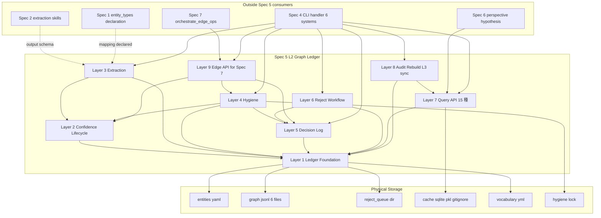
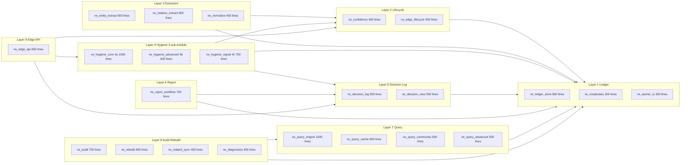
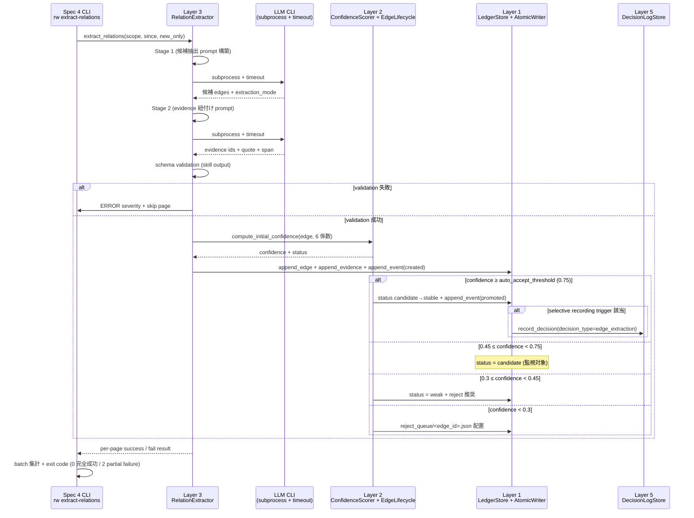
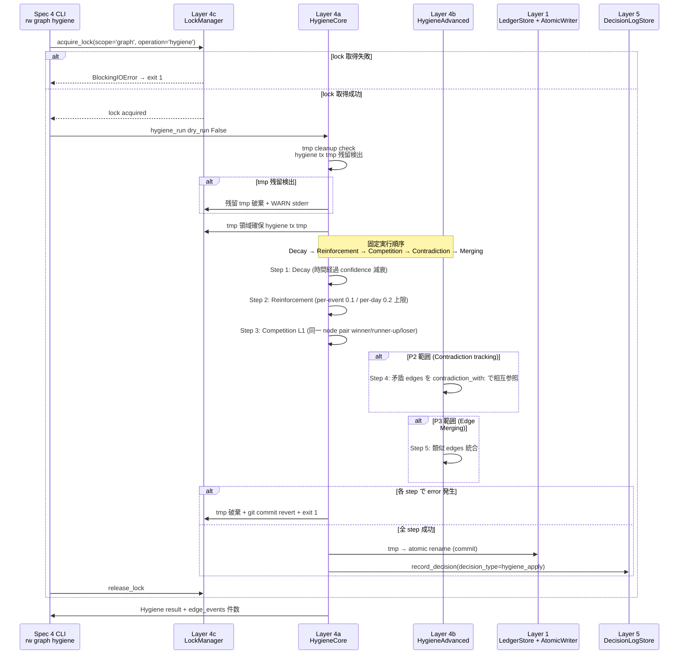
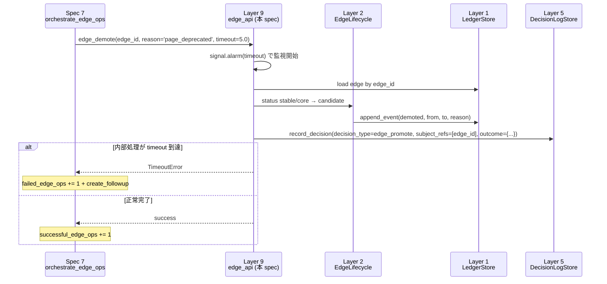
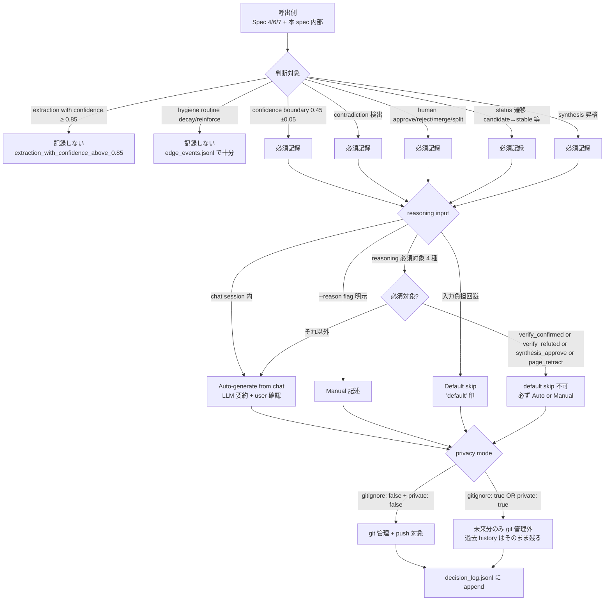
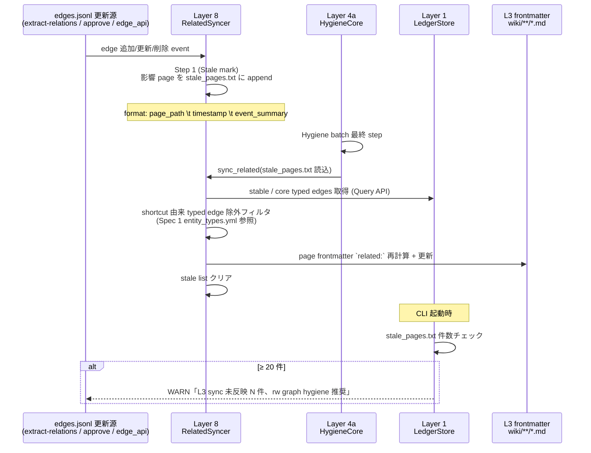
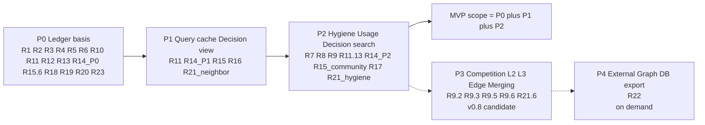

# Technical Design Document — rwiki-v2-knowledge-graph (Spec 5)

## Overview

**Purpose**: 本 spec は Rwiki v2 の中核価値である **Curated GraphRAG** を実体化する **L2 Graph Ledger** を実装する。Foundation (Spec 0) §2.6 / §2.9 / §2.10 / §2.12 / §2.13 の規範を **L2 専用** として運用しつつ、Append-only JSONL ledger 7 ファイル + derived sqlite cache 構成、6 係数加重 confidence scoring、6 status edge lifecycle、Hygiene 5 ルール固定実行順序、Decision log selective recording、Query API 15 種 を提供する。

**Users**: 本 spec の API consumer は (a) Spec 4 CLI dispatch (`rw graph *` / `rw edge *` / `rw reject` / `rw extract-relations` / `rw audit graph` / `rw decision *` の 6 系統 handler)、(b) Spec 6 perspective / hypothesis 生成 (Query API 15 種を contract 利用)、(c) Spec 7 Page lifecycle orchestration (edge API 3 種を timeout 必須で呼出)、(d) Spec 1 frontmatter normalize (`normalize_frontmatter` API 経由で Entity 固有 shortcut field を typed edge に展開)、(e) Spec 2 extraction skill (出力 schema を本 spec が validate して ledger に永続化)。

**Impact**: 本 spec が完成することで、Vault には L2 Graph Ledger という新しい層が成立する。Trust chain が evidence なしに途切れず、reject-only filter による入力コスト問題の解消、Hygiene による graph の自律進化、Curation Provenance による「なぜそう curate したか」の WHY 保全 が達成される。Spec 4-7 が本 spec の API contract に依存することで L2 Ledger の data model と Query API contract が複数 spec で分岐するリスクが消える。

### Goals

- **Append-only JSONL ledger 7 ファイル + derived sqlite cache** を SSoT として実装し、JSONL を正本として cache を rebuild 可能にする
- **6 係数加重 confidence scoring + evidence-less ceiling 0.3 強制** を §2.12 SSoT と一致する形で実装し、係数値を `.rwiki/config.yml` から注入する
- **Edge lifecycle 6 status の自動進化** を 3 段階閾値 (auto_accept 0.75 / candidate_weak 0.45 / reject_queue 0.3) で実装し、Foundation Requirement 5 と完全一致させる
- **Hygiene 5 ルール固定実行順序 + all-or-nothing transaction + crash-safe tmp recovery** を fcntl/flock 排他で実装する
- **Decision log selective recording trigger 5 条件 + reasoning hybrid input 3 方式 + selective privacy 2 方式** を implement する
- **Query API 15 種 + 共通フィルタ + 性能目標 (neighbor depth=2 ≤ 100ms)** を sqlite cache ベースで実装する
- **Spec 7 edge API 3 種 (`edge_demote` / `edge_reject` / `edge_reassign`) + timeout 必須 + partial failure 伝搬** を Spec 7 Decision 7-9 と coordination した値で実装する
- **MVP 範囲 = P0+P1+P2** で実装、P3 (Competition L2/L3 + Edge Merging) を v0.8 候補、P4 (外部 Graph DB export) を要件発生時のみ
- **持ち越し Adjacent Sync 残 1 項目** = `.hygiene.lock` 物理実装の thread-safety を MVP single-thread 前提で確定し、Spec 7 Phase 2 並列化拡張時の二重 lock 戦略を Migration Strategy で明示する

### Non-Goals

- **Perspective / Hypothesis 生成ロジック** = Spec 6 所管 (本 spec は Query API contract のみ提供)
- **Wiki page lifecycle 状態遷移** = Spec 7 所管 (本 spec は edge API 3 種を提供する側)
- **Skill 設計 (prompt 内容 / lifecycle)** = Spec 2 所管 (本 spec は出力 schema validation interface のみ固定)
- **Skill 選択 dispatch** = Spec 3 所管
- **Tag vocabulary / categories.yml / Entity 固有 shortcut field のスキーマ宣言** = Spec 1 所管
- **CLI dispatch / argparse / chat 統合フレーム / exit code 制御** = Spec 4 所管
- **`rw doctor` の診断項目本体ロジック** = Spec 4 集約 (本 spec は L2 診断 4 種 + Decision Log 健全性診断 4 種の計算 API 提供のみ)
- **Severity 4 水準 + exit code 0/1/2 分離 + LLM CLI subprocess timeout 必須の規約定義** = Foundation Requirement 11 / roadmap.md「v1 から継承する技術決定」が固定済 (本 spec は継承)
- **Multi-user / distributed lock** = MVP 範囲外 (Phase 2 以降検討)
- **Leiden community detection** = Phase 3 拡張 (`leidenalg` 別パッケージ追加が依存制約違反のため MVP は Louvain のみ)

## Boundary Commitments

### This Spec Owns

- **Ledger 物理ファイル構成**: `.rwiki/graph/` 配下 7 ファイル (`entities.yaml` / `edges.jsonl` / `edge_events.jsonl` / `evidence.jsonl` / `rejected_edges.jsonl` / `reject_queue/` / `decision_log.jsonl`) と derived `.rwiki/cache/graph.sqlite` / `networkx.pkl` (gitignore)
- **Vocabulary 値定義**: `.rwiki/vocabulary/relations.yml` (canonical 12 + 抽象 8 + Entity 固有 10+ セット、`inverse:` / `symmetric:` / `domain:` / `range:` 4 field) / `entity_types.yml` (Spec 1 が宣言したスキーマに沿った値配置)
- **Confidence scoring**: 6 係数加重式 (`evidence` 0.35 / `explicitness` 0.20 / `source_reliability` 0.15 / `graph_consistency` 0.15 / `recurrence` 0.10 / `human_feedback` 0.05) + evidence-less ceiling 0.3 強制クランプ + 係数値を `.rwiki/config.yml` から注入
- **Edge lifecycle**: 6 status (`weak` / `candidate` / `stable` / `core` / `deprecated` / `rejected`) の自動進化 + 3 段階閾値 + Dangling edge 4 段階 degrade
- **Graph Hygiene 5 ルール**: Decay → Reinforcement → Competition → Contradiction tracking → Edge Merging の固定実行順序 + all-or-nothing transaction (`.rwiki/.hygiene.tx.tmp/` 一時領域) + crash 後 tmp 残留 cleanup + per-event 0.1 / per-day 0.2 reinforcement 上限
- **Usage signal 4 種別**: Direct (1.0) / Support (0.6) / Retrieval (0.2) / Co-activation (0.1) と式 `base_score × contribution × sqrt(confidence) × independence × time_weight`
- **Competition 3 レベル**: L1 (MVP 必須、同一 node pair) / L2 (Phase 3、類似) / L3 (Phase 3、semantic tradeoff) の status transition (`winner→stable / runner-up→candidate / loser→weak / obsolete→deprecated`)
- **Event ledger**: `edge_events.jsonl` の初期セット 11 event type (基本 8 + 本 spec 追加 3 = `dangling_flagged` / `unreject` / `reassigned`) + 拡張可規約
- **Decision log**: `decision_log.jsonl` の append-only 記録 + 23 種 decision_type + selective recording trigger 5 条件 + reasoning hybrid input 3 方式 + selective privacy 2 方式 + Tier 1/2/3 visualization
- **Reject workflow**: `reject_queue/` への candidate 蓄積 + `rejected_edges.jsonl` への移動 + 8 field 必須記録 (`pre_reject_confidence` 含む) + reject_reason_category 6 種 + reject_reason_text 必須 + unreject 復元 5 step + status reset to `candidate`
- **Entity ショートカット展開**: `normalize_frontmatter(page_path) → List[Edge]` API + 双方向 edge 自動生成 + confidence 0.9 固定 + edge_id = source+type+target hash で冪等性
- **Query API 15 種**: P0 (5 API) / P1 (6 API) / P2 (4 API) + 共通フィルタ (`status_in` / `min_confidence` / `relation_types`) + sqlite cache ベース + 性能目標 (neighbor depth=2 で 100-500 edges を 100ms 以下)
- **Community detection**: networkx Louvain (MVP 採択) + community id を node 格納 + Leiden は Phase 3 拡張余地
- **Graph audit + Rebuild + L3 sync**: 6 検査項目 + 増分 / full rebuild + Hybrid stale-mark + Hygiene batch 5 step + shortcut 由来 typed edge 除外
- **External Graph DB export (P4 optional)**
- **Concurrency lock 物理実装**: `.rwiki/.hygiene.lock` の `fcntl.flock(LOCK_EX | LOCK_NB)` + fail-fast + PID 記録 (debug 用) + MVP single-thread 前提
- **Edge API 3 種** (Spec 7 連携): `edge_demote(edge_id, reason, timeout)` / `edge_reject(edge_id, reason_category, reason_text, timeout)` / `edge_reassign(edge_id, new_endpoint, timeout)` + timeout 必須 + partial failure 伝搬 + `decision_log.jsonl` 記録
- **Configuration 全項目所管**: `graph.*` (auto_accept_threshold / candidate_weak_boundary / reject_queue_threshold / evidence_required_ceiling / confidence_weights 6 / hygiene 各 / usage_signal 4 + time_decay_half_life_days / competition フラグ / community algorithm + resolution / similarity_threshold) + `decision_log.*` (gitignore + auto_record_triggers + reasoning_input)
- **L2 診断項目 4 種 + Decision Log 健全性診断項目 4 種**: 計算 API として `get_l2_diagnostics()` + `check_decision_log_integrity()` を Spec 4 `rw doctor` に提供

### Out of Boundary

- **CLI dispatch / argparse / 対話 confirm UI / `--auto` ポリシー / exit code 制御** = Spec 4 所管 (本 spec は同期 API を提供する側)
- **Wiki page lifecycle 状態遷移 (`active` / `deprecated` / `retracted` / `archived` / `merged` の orchestration)** = Spec 7 所管 (本 spec は呼び出される edge API 側)
- **Page→Edge orchestration の 8 段階対話 generator pattern** = Spec 7 所管 (本 spec は orchestrate_edge_ops から呼出される側)
- **Skill prompt 内容 (`AGENTS/skills/relation_extraction.md` / `entity_extraction.md` / `reject_learner.md`)** = Spec 2 所管 (本 spec は出力 schema validation のみ)
- **Skill 選択 dispatch (5 段階優先順位)** = Spec 3 所管
- **Tag vocabulary / categories.yml / Entity 固有 shortcut field の宣言**: Spec 1 所管 (本 spec は宣言を **読む側** で、`entity_types.yml` の値配置のみ所管)
- **L3 frontmatter `related:` field の cache 規約定義**: Spec 1 所管 (本 spec は **cache invalidation / sync 実装側**)
- **Perspective / Hypothesis 生成の prompt 設計 / autonomous モード / L2 traverse 戦略**: Spec 6 所管
- **Severity 4 水準と exit code 0/1/2 分離の規約定義**: Foundation Requirement 11 / roadmap.md「v1 から継承する技術決定」が固定済
- **`rw doctor` 自身の dispatch / threshold 制御**: Spec 4 所管 (本 spec は計算 API のみ提供)

### Allowed Dependencies

- **同 `rw` Python process 内 module import**:
  - 本 spec 内部 module DAG (Layer 1 → Layer 9 の依存方向、後述 Module DAG 参照)
  - Spec 1 の `entity_types.yml` mapping を読むための parser (実装は本 spec 所管、Spec 1 は宣言のみ)
- **steering 出典**:
  - `.kiro/steering/product.md` / `tech.md` / `structure.md` / `roadmap.md`
  - `.kiro/drafts/rwiki-v2-consolidated-spec.md` v0.7.12 §2.6 / §2.9 / §2.10 / §2.12 / §2.13 / §3.1-§3.3 / §4.3 / §5.10 / §7.2 Spec 5
  - `.kiro/drafts/rwiki-v2-scenarios.md` Scenario 13, 14, 34, 35, 36, 37, 38
- **upstream spec 依存** (markdown 規範参照):
  - Spec 0 (foundation): §2.12 / §2.13 / §2.6 / §2.10 / §2.9 規範、Page status 5 種 / Edge status 6 種、event type 8 種基本セット、Severity 4 水準 / exit code 0/1/2 分離
  - Spec 1 (classification): Entity 固有 shortcut field 宣言、`entity_types.yml` mapping 宣言、L3 `related:` cache 規約宣言
  - Spec 4 (cli-mode-unification): CLI handler 6 系統、`acquire_lock(scope='graph', operation, timeout)` 契約、`rw doctor` JSON schema_version 管理
  - Spec 7 (lifecycle-management): edge API 3 種 signature 期待、`EDGE_API_TIMEOUT_DEFAULTS` dict、`OrchestrationResult` dataclass、`record_decision_for_lifecycle()` 11 種 decision_type、`outcome` field partial failure 4 field
- **external dependency** (新規追加):
  - `networkx >= 3.0, < 3.5` (Python 3.10 互換維持、3.5+ は Python 3.11+ 強制のため)
- **Python 標準ライブラリ**: `sqlite3` / `fcntl` / `os` / `json` / `yaml (PyYAML)` / `pathlib` / `datetime` / `uuid` / `hashlib` / `threading` / `subprocess` / `signal` / `platform`
- **subprocess 経由依存**: LLM CLI (`claude` / その他、Spec 3 が抽象層を提供) を Entity 抽出 / Relation 抽出で呼出 (timeout 必須)
- **PyYAML**: vocabulary parser に既存依存を継承
- **OS サポート (規範前提)**: **macOS / Linux のみ** (POSIX、`fcntl.flock()` 利用)、Windows 非対応。Python `fcntl` module は POSIX のみで Windows では `import fcntl` が ImportError raise、本 spec MVP は POSIX 環境前提。Windows サポートは Phase 2/3 拡張余地として `portalocker` (cross-platform、ただし roadmap.md「Constraints: 追加依存は networkx ≥ 3.0 のみ」違反のため Foundation / roadmap.md 改版必要) または `msvcrt.locking()` (Windows 標準ライブラリ) 採用を別 spec で検討

### Revalidation Triggers

以下の変更は対象 spec に対して **再検証 (re-review)** を強制する。Adjacent Sync 経路で記録すること。

- **Edge API 3 種 signature 変更** (引数追加 / timeout default 値変更 / 戻り値構造変更) → Spec 7 design Round-N+1 review 必要
- **`record_decision()` API signature 変更 / decision_type 値追加** → Spec 4 R15 / Spec 6 / Spec 7 design Round-N+1 review 必要 (decision_type 23 種は Spec 1 / Spec 6 / Spec 7 / 本 spec が分担所管)
- **edges.jsonl / decision_log.jsonl の field 追加** → schema_version envelope を bump、forward-compatible なら旧 reader 対応不要だが Spec 4 `rw doctor` の schema 違反検出 (R11.15) を更新
- **`.hygiene.lock` scope 値追加** → Spec 4 R10 LockHelper の scope 列挙更新
- **6 係数 confidence_weights / 3 段階閾値 / Hygiene 進化則の数式変更** → Foundation §2.12 SSoT と本 spec design の同期更新 (本 spec が SSoT を逸脱しないこと)
- **vocabulary (relations.yml / entity_types.yml) の構造変更** (`inverse:` / `symmetric:` / `domain:` / `range:` 以外の field 追加) → Spec 1 R5 / R12 design 再検証
- **Query API 15 種 signature / 共通フィルタ変更 / 性能目標変更** → Spec 6 design re-review (本 spec API のみに依存している前提が崩れる)
- **Hygiene 並列化 / multi-thread 化** (Phase 2 以降想定) → 持ち越し Adjacent Sync 経路で本 spec の `HygieneLockManager` に `threading.Lock` 二重 lock を追加 + Spec 7 `orchestrate_edge_ops` 並列化呼出側に thread-safety 確認を反映
- **Python version pin 変更** (3.10 → 3.11+ 引き上げ) → 全 spec の steering / tech.md 同期更新 + networkx version pin (`<3.5` → `>=3.5` 緩和) 検討
- **decision_type / event type の 拡張可規約発動** → Spec 1 / Spec 6 / Spec 7 のいずれかが新値を宣言する場合、本 spec を Adjacent Sync で更新

## Architecture

### Existing Architecture Analysis

本 spec は v2 で **新規** 起こす L2 Graph Ledger 実装であり、v1 に対応概念がない (v1 には L2 ledger 相当の層が存在しない)。したがって既存実装からの抽出ではなく、Foundation 規範 (Spec 0) と SSoT drafts §7.2 Spec 5 から起こす。

ただし以下の **Foundation 由来の制約** を継承する:

- **3 層分離**: L1 (raw) / L2 (本 spec) / L3 (wiki) を import で混在させない (`from rw_<module> import` 禁止 + `import rw_<module>` のみ許可、`structure.md` Import Organization 準拠)
- **モジュール責務分割**: 各 module ≤ 1500 行、後方互換 re-export 禁止 (roadmap.md「v1 から継承する技術決定」)
- **JSONL append-only**: edges / events / evidence / rejected_edges / decision_log は全て JSONL、derived sqlite cache は gitignore
- **Severity 4 水準** (CRITICAL / ERROR / WARN / INFO) + **exit code 0/1/2 分離** (PASS / runtime error / FAIL 検出) + **LLM CLI subprocess timeout 必須** (Foundation Requirement 11、本 spec は継承し独自再定義しない)

### Architecture Pattern & Boundary Map



> Note: Mermaid label 内では design-principles.md の制約により `/` `()` `*` を避け、subgraph 構造のみで全 9 Layer + 5 consumer + 6 物理 storage を表現。各 layer の構成 module は Module DAG (次節) で詳説、各 layer の責務詳細は Components and Interfaces 各 component block で詳説。

**Architecture Integration**:

- **Selected pattern**: **Layered architecture (9 layer DAG)**。Spec 4 (CLI dispatch hub) と Spec 7 (Page lifecycle orchestration、6 module DAG) の同型 pattern を踏襲。各 layer は下位 layer のみに依存、上向き / 同層内 cyclic 依存禁止。Layer 1 が物理 storage に唯一接続し、Layer 2-9 は Layer 1 経由でのみ I/O する。
- **Layer 番号と依存方向の解釈** (規範明示): Layer 番号 (1-9) は **機能 grouping** (1 storage → 2 lifecycle → 3 extraction → 4 hygiene → 5 decision → 6 reject → 7 query → 8 audit → 9 edge api) を表し、依存方向の SSoT ではない。**「上向き禁止」規範は DAG-based** で適用され、依存方向は Architecture Pattern & Boundary Map / Module DAG mermaid を SSoT とする。具体的には Layer 5 (Decision Log) は Hygiene (L4) / Reject (L6) / Edge API (L9) から呼出される **共通基盤** として機能し、`L4 → L5` 依存 (number 上向き) も DAG-based 規範では合法。新 layer 追加時は number ではなく DAG 上の依存関係で「上向き禁止」を判定する。
- **Domain boundaries**: 各 layer は単一責務 (Single Responsibility) を持つ。Hygiene (L4) は **5 rules sub-module 分割** (Spec 7 Decision 7-21 同型問題回避、後述 Module DAG 参照)。
- **Existing patterns preserved**: structure.md Import Organization (`import rw_<module>` のみ、`from import` 禁止) / モジュール責務分割 (≤ 1500 行) / JSONL append-only / derived cache gitignore。
- **New components rationale**: L2 Graph Ledger 自体が v2 新規層であり、9 layer すべて新規実装。L4 Hygiene の sub-module 分割は handler 5 種 + UsageSignal + LockManager 集約が単一 module で 1500 行制約を超える ~2000 行 estimate のため、機能別分割が clean。
- **Steering compliance**: 中核原則 §2.12 (Evidence-backed Candidate Graph、L2 専用、§2.2 / §2.4 優先) / §2.6 (Git + 層別履歴媒体) / §2.10 (Evidence chain) / §2.13 (Curation Provenance) を Layer 1-5 で具体化。`structure.md` の 3 層分離 / モジュール責務分割を全 9 layer で遵守。

### Module DAG

Layer 4 Hygiene は handler 5 種 (Decay / Reinforcement / Competition / Contradiction / Merging) + UsageSignal + LockManager で集約すると ~2000 行 estimate (1500 行制約 ~33% 超過) のため、Spec 7 Decision 7-21 の同型問題を回避し、**機能別 sub-module 分割** (4a Decay/Reinforcement/Competition / 4b Contradiction/Merging / 4c UsageSignal + LockManager) を採用する。



> Note: 各 module 名末尾の "N lines" は 1500 行制約下の line budget (≤ N 行 estimate)。`≤` 記号は Mermaid label punctuation 制約のため省略。

**Module DAG 設計決定**:

- **Layer 4 (Hygiene) は機能別 3 sub-module 分割**: 4a (Hygiene 5 rules core = Decay/Reinforcement/Competition L1) / 4b (advanced = Contradiction/Merging、P2 含む) / 4c (UsageSignal + LockManager + tx tmp recovery)。Spec 7 Decision 7-21 同型問題 (handler 17 種 1 module 集約 → 1500 行制約 ~33% 超過) を回避。
- **Layer 7 (Query) は 4 sub-module 分割**: rw_query_engine (15 API dispatch) / rw_query_cache (sqlite WAL + index) / rw_query_community (Louvain + post-process check) / rw_query_advanced (P2 = global / hierarchical / find_contradictory_decisions)
- **Layer 8 (Audit) は 4 sub-module 分割**: rw_audit (6 検査) / rw_rebuild (増分 / full / stale) / rw_related_sync (Hybrid stale-mark + Hygiene batch + shortcut 除外) / rw_diagnostics (L2 4 種 + Decision Log 健全性 4 種)
- **下位 layer から上位 layer への呼び出し禁止**: Layer 1 は Layer 2-9 に依存しない、Layer 9 は Layer 1-7 に依存可能だが Layer 8 の audit / rebuild には依存しない (Edge API は Hygiene + Decision Log + Lifecycle のみで完結)
- **後方互換 re-export 禁止** (roadmap.md 継承): rw_ledger_store の symbol を rw_query_engine 経由で公開しない、必ず元 module 経由で参照
- **`from import` 禁止 + `import rw_<module>` のみ** (structure.md 継承): test の monkeypatch.setattr が全呼出経路で作用するように、モジュール修飾参照で統一

### Technology Stack

| Layer | Choice / Version | Role in Feature | Notes |
|-------|------------------|-----------------|-------|
| Frontend / CLI | (Spec 4 所管) | 本 spec は同期 API を提供 | exit code 0/1/2 分離 / JSON / human-readable |
| Backend / Services | Python 3.10+ | 全 module 実装 | networkx ≥ 3.0 制約のため `< 3.5` で pin (`>= 3.5` は Python 3.11+ 強制) |
| Data / Storage | YAML (PyYAML) + JSONL (json 標準) + sqlite3 (標準) | entities.yaml / *.jsonl 6 / graph.sqlite | sqlite WAL + connection-per-thread + drop+rebuild migration |
| Graph algorithm | networkx 3.0-3.4 | Louvain community detection / Adamic-Adar missing bridge / shortest path / orphans / hubs | Leiden は依存違反 (`leidenalg` 別パッケージ)、Phase 3 拡張余地 |
| Concurrency | fcntl.flock + os.replace | `.hygiene.lock` 物理実装 + atomic rename | MVP single-thread 前提、multi-thread 化時に threading.Lock 二重 lock (Migration Strategy) |
| External CLI | LLM CLI (Spec 3 抽象層、Claude Code 等) | Entity / Relation 抽出 (subprocess timeout 必須) | timeout default は config 経由 (Spec 5 R3.7 / R4.8) |

**Technology Decision の rationale** (詳細は `research.md` 参照):

- **networkx version pin `>= 3.0, < 3.5`**: Python 3.10 互換維持を最優先。3.5+ は `Requires-Python: !=3.14.1, >=3.11`、roadmap.md の Python 3.10+ 制約と衝突。3.4.2 が Python 3.10 互換最終版。Python 3.11+ 引き上げは Foundation / steering 改版が必要 (本 spec 単独で決定不可)
- **Louvain 採択 (Leiden は MVP 外)**: networkx 内蔵 `community.louvain.louvain_communities()` で追加依存ゼロ、roadmap.md「Constraints: 追加依存は networkx ≥ 3.0 のみ」と完全整合。Leiden は `leidenalg` + `python-igraph` の 2 依存追加が必要なため Phase 3 拡張余地。Louvain の disconnected community 問題は post-process check (`networkx.connected_components()` を community subgraph に適用) で緩和
- **sqlite WAL + connection-per-thread + drop+rebuild migration**: cache が gitignore な derived artifact なので schema migration 不要、`schema_version` table で version 検出 → drop + rebuild from JSONL ledger
- **fcntl.flock + fail-fast (LOCK_NB)**: single-user serialized 前提、blocking より fail-fast が UX 良。stale lock 検出は kernel 任せ (close(fd) または process exit で自動解放)、PID 記録は debug 用
- **Atomic rename 5 step**: `write to tmp → flush → fsync → os.replace → parent dir fsync`。macOS は `fcntl.fcntl(fd, F_FULLFSYNC)` を併用 (disk cache まで flush)

## File Structure Plan

### Directory Structure

```
scripts/
├── rw_ledger_store.py          # Layer 1: Ledger 7 ファイル CRUD (≤ 800 行)
├── rw_vocabulary.py            # Layer 1: relations.yml / entity_types.yml loader (≤ 300 行)
├── rw_atomic_io.py             # Layer 1: atomic write 5 step pattern + JSONL reader + sanitization helper 3 種 (≤ 350 行)
├── rw_confidence.py            # Layer 2: 6 係数 confidence scorer + ceiling (≤ 400 行)
├── rw_edge_lifecycle.py        # Layer 2: 6 status 自動進化 + Dangling 4 段階 degrade (≤ 500 行)
├── rw_entity_extract.py        # Layer 3: LLM Entity 抽出 + 正規化 (≤ 600 行)
├── rw_relation_extract.py      # Layer 3: LLM 2-stage relation 抽出 + 4 extraction_mode (≤ 800 行)
├── rw_normalize.py             # Layer 3: normalize_frontmatter API (≤ 400 行)
├── rw_hygiene_core.py          # Layer 4a: Decay / Reinforcement / Competition L1 + tx orchestrator (≤ 1000 行)
├── rw_hygiene_advanced.py      # Layer 4b: Contradiction tracking / Edge Merging (P2-P3) (≤ 600 行)
├── rw_hygiene_signal.py        # Layer 4c: UsageSignal + LockManager + tx tmp recovery (≤ 700 行)
├── rw_decision_log.py          # Layer 5: decision_log.jsonl + selective trigger + reasoning hybrid + privacy (≤ 900 行)
├── rw_decision_view.py         # Layer 5: Tier 2 markdown timeline + Tier 3 mermaid + integrity check (≤ 500 行)
├── rw_reject_workflow.py       # Layer 6: reject_queue → rejected_edges + unreject (≤ 700 行)
├── rw_query_engine.py          # Layer 7: 15 API dispatch + 共通 filter (≤ 1000 行)
├── rw_query_cache.py           # Layer 7: sqlite WAL + index + connection-per-thread (≤ 600 行)
├── rw_query_community.py       # Layer 7: Louvain + post-process check + Adamic-Adar (≤ 500 行)
├── rw_query_advanced.py        # Layer 7: global / hierarchical / find_contradictory (P2) (≤ 500 行)
├── rw_audit.py                 # Layer 8: 6 検査項目 (対称性 / 循環 / 孤立 / 参照整合 / 分布 / events 整合) (≤ 700 行)
├── rw_rebuild.py               # Layer 8: 増分 / full rebuild + stale detection (≤ 600 行)
├── rw_related_sync.py          # Layer 8: Hybrid stale-mark + Hygiene batch + shortcut 除外 (≤ 400 行)
├── rw_diagnostics.py           # Layer 8: L2 4 種 + Decision Log 健全性 4 種 (≤ 400 行)
└── rw_edge_api.py              # Layer 9: edge_demote / edge_reject / edge_reassign + timeout + partial failure (≤ 600 行)

tests/
├── test_rw_ledger_store.py
├── test_rw_vocabulary.py
├── test_rw_atomic_io.py
├── test_rw_confidence.py
├── test_rw_edge_lifecycle.py
├── test_rw_entity_extract.py
├── test_rw_relation_extract.py
├── test_rw_normalize.py
├── test_rw_hygiene_core.py
├── test_rw_hygiene_advanced.py
├── test_rw_hygiene_signal.py
├── test_rw_decision_log.py
├── test_rw_decision_view.py
├── test_rw_reject_workflow.py
├── test_rw_query_engine.py
├── test_rw_query_cache.py
├── test_rw_query_community.py
├── test_rw_query_advanced.py
├── test_rw_audit.py
├── test_rw_rebuild.py
├── test_rw_related_sync.py
├── test_rw_diagnostics.py
├── test_rw_edge_api.py
├── test_integration_hygiene_transaction.py     # 5 rules + transaction + crash recovery
├── test_integration_extract_batch.py            # extract-relations partial failure handling
├── test_integration_page_edge_orchestration.py  # Spec 7 連携 partial failure 伝搬
├── test_integration_l3_related_sync.py          # Hybrid stale-mark + Hygiene batch
├── test_e2e_p0_ledger.py                        # P0 シナリオ
├── test_e2e_p1_query.py                         # P1 シナリオ
├── test_e2e_p2_hygiene.py                       # P2 シナリオ
└── test_perf_query_neighbor.py                  # 100-500 / 10,000 edges 規模性能
```

### Modified Files

- **`.kiro/specs/rwiki-v2-knowledge-graph/spec.json`**: phase を `"requirements-approved"` → `"design-generated"` に更新、`approvals.design.generated: true` / `approved: false` / `updated_at` を本 design.md write 時刻に設定
- **`.kiro/specs/rwiki-v2-knowledge-graph/research.md`**: 本 design.md と同タイミングで write、Discovery findings + Synthesis 結果を永続化

新規 `.rwiki/graph/`, `.rwiki/cache/`, `.rwiki/vocabulary/` 配下のファイル群は実装フェーズで生成 (本 spec design では物理レイアウト規定のみ)。

## System Flows

### Flow 1: Relation 抽出 → Edge lifecycle (P0 主シナリオ)



**Flow 1 設計決定**:

- **per-page continue-on-error が default**: batch 処理中の個別 page 失敗 (LLM CLI timeout / schema validation 失敗 / I/O 障害) で残り page を継続 (Requirement 4.10)
- **partial failure 時 exit code 2**: roadmap.md「v1 から継承する技術決定」exit code 0/1/2 分離準拠 (PASS / runtime error / FAIL 検出)
- **JSON 出力 schema**: `{partial_failure: bool, successful_pages: int, failed_pages: List[{path, reason}], total_pages: int}`
- **handler 自身の例外** (lock 取得失敗 / config parse 失敗 等) は **exit code 1** で別管理
- **append-only ledger と整合する形で部分成功記録を保持**: 成功した page 分の edges は ledger に commit 済 (rollback しない)

### Flow 2: Hygiene 5 ルール固定実行順序 + Transaction



**Flow 2 設計決定**:

- **all-or-nothing transaction**: `.rwiki/.hygiene.tx.tmp/` 一時領域に書いて、全 step 成功時に atomic rename で commit。途中 crash 時は tmp 破棄で実行前状態に restore (Requirement 7.3 / 7.10)
- **crash 後 tmp 残留 cleanup**: 次回 Hygiene 起動時に残留 tmp 検出 → (a) 破棄 + (b) stale lock 検出 + (c) WARN stderr 通知 (Requirement 7.11)
- **`--dry-run` は lock 不要**: read-only として動作、`.hygiene.tx.tmp/` 配置せず stdout 出力のみ (Requirement 7.9)
- **Query API (read-only) は lock 不要**: Hygiene 実行中も append-only の事前状態を読む (Requirement 7.5 / 14.8)

### Flow 3: Page→Edge orchestration (Spec 7 連携 + partial failure 伝搬)



**Flow 3 設計決定** (Spec 7 連携):

- **timeout 必須パラメータ** (Requirement 18.7): edge_demote (5.0s default) / edge_reject (10.0s default) / edge_reassign (30.0s default)、Spec 7 `EDGE_API_TIMEOUT_DEFAULTS` dict と同期
- **timeout 到達時 partial failure として呼出側に伝搬** (Requirement 18.8): 内部状態を timeout 発生時点の整合状態に保つ (途中 commit を残さない、atomic rename 規約)
- **Spec 7 が `failed_edge_ops` に計上 + follow-up タスク化**: orchestration 全体は継続 (Spec 7 R3.4 / R3.7 / R12.8 と整合)
- **Edge API 内部状態遷移**: confidence 更新 + `edge_events.jsonl` append + `rejected_edges.jsonl` 移動 (reject 時) + `relations.yml` 参照 + `decision_log.jsonl` 記録 (Requirement 18.4)
- **同期 API**: Spec 7 が orchestration で逐次呼出可能 (Requirement 18.3、Phase 2 並列化拡張余地は Migration Strategy で別途明示)

### Flow 4: Decision log selective recording



**Flow 4 設計決定**:

- **Selective recording trigger 5 条件 + 記録しない 3 対象** (Requirement 11.3 / 11.4) を SSoT §2.13 と完全整合
- **reasoning hybrid input 3 方式** (Requirement 11.5): `auto_generate_from_chat` / `--reason` / default skip の 3 段階
- **reasoning 必須 (skip 不可) 対象 4 種** (Requirement 11.6): `hypothesis_verify_confirmed` / `hypothesis_verify_refuted` / `synthesis_approve` / `page_retract`
- **selective privacy 2 方式** (Requirement 11.7): config.yml の `decision_log.gitignore` (vault 全体) + per-decision `private: true` flag (個別 decision)
- **privacy mode 切替時の意味確定** (brief.md 第 4-A 持ち越し): `gitignore: true` 切替時、**未来分のみ git 管理外、過去 history はそのまま残る** (現実的運用、Decision 5-11 で確定)

### Flow 5: L3 `related:` cache sync (Hybrid stale-mark + Hygiene batch)



**Flow 5 設計決定**:

- **Hybrid stale-mark + Hygiene batch 5 step** (Requirement 16.6) を SSoT §7.2 Spec 5 と整合
- **shortcut 由来 typed edge 除外** (Requirement 16.6 Step 2): Spec 1 R5.5 / R10.1 完全分離方針、`entity_types.yml` で宣言された Entity 固有 shortcut field (`authored:` / `collaborated_with:` 等) で表現される typed edge は `related:` への重複展開を行わない
- **eventual consistency**: L3 `related:` は cache、正本は L2 ledger。query / perspective / hypothesis は L2 を直接読み、cache 遅延の影響を受けない
- **stale_pages.txt フォーマット**: `page_path \t timestamp \t event_summary` (タブ区切り、Requirement 16.7)
- **Manual sync**: `rw graph rebuild --sync-related` で即座実行可 (緊急時、Requirement 16.6 Step 4)

## Requirements Traceability

| Requirement | Summary | Components (module) | Interfaces | Flows |
|-------------|---------|---------------------|------------|-------|
| 1.1-1.8 | Ledger 7 ファイル + derived cache | rw_ledger_store / rw_atomic_io / rw_query_cache | LedgerStore CRUD + AtomicWriter 5 step | Flow 1 |
| 2.1-2.6 | Vocabulary (relations.yml + entity_types.yml) | rw_vocabulary | VocabularyLoader (cache せず毎回最新) | Flow 1 |
| 3.1-3.7 | Entity 抽出 + 正規化 | rw_entity_extract / rw_ledger_store | EntityExtractor + LLM CLI subprocess timeout | Flow 1 |
| 4.1-4.10 | Relation 抽出 (4 extraction_mode + evidence 必須 + partial failure) | rw_relation_extract / rw_confidence | RelationExtractor 2-stage + LLM timeout + per-page continue-on-error | Flow 1 |
| 5.1-5.6 | 6 係数 confidence scoring | rw_confidence | ConfidenceScorer (config 注入 + ceiling) | Flow 1 |
| 6.1-6.8 | Edge lifecycle 6 status 自動進化 + Dangling 4 段階 | rw_edge_lifecycle | EdgeLifecycle (3 段階閾値) + DanglingPolicy | Flow 1 |
| 7.1-7.11 | Hygiene 5 ルール固定実行順序 + Transaction + crash recovery | rw_hygiene_core / rw_hygiene_advanced / rw_hygiene_signal | HygieneOrchestrator + tx tmp + LockManager | Flow 2 |
| 8.1-8.7 | Usage signal 4 種別 + 暴走防止 | rw_hygiene_signal | UsageSignal (sqrt(confidence) + independence + time_weight) | Flow 2 |
| 9.1-9.6 | Competition 3 レベル | rw_hygiene_core (L1) / rw_hygiene_advanced (L2/L3) | CompetitionRule (L1 MVP) | Flow 2 |
| 10.1-10.7 | Event ledger 11 type + 拡張可規約 | rw_ledger_store | EventLogStore append-only | Flow 1, 2 |
| 11.1-11.16 | Decision log 23 type + selective + reasoning + privacy + integrity check | rw_decision_log / rw_decision_view / rw_diagnostics | DecisionLogStore + SelectivePolicy + ReasoningResolver + IntegrityChecker | Flow 4 |
| 12.1-12.8 | Reject workflow + 8 field + unreject 復元 | rw_reject_workflow | RejectWorkflow + pre_reject_confidence | Flow 1 |
| 13.1-13.6 | normalize_frontmatter API + 双方向 + 冪等性 | rw_normalize | EntityNormalizer (confidence 0.9 固定) | Flow 1 |
| 14.1-14.8 | Query API 15 種 + 共通 filter + 性能目標 | rw_query_engine / rw_query_cache / rw_query_community / rw_query_advanced | QueryEngine + CommonFilter + SqliteCache | (read-only) |
| 15.1-15.6 | Community detection (Louvain MVP) | rw_query_community | CommunityDetector (post-process check) | (read-only) |
| 16.1-16.8 | Audit 6 検査 + Rebuild + L3 sync + L2 診断 4 種 + Decision Log 健全性 4 種 | rw_audit / rw_rebuild / rw_related_sync / rw_diagnostics | GraphAuditor + Rebuilder + RelatedSyncer + DiagnosticsCalculator | Flow 5 |
| 17.1-17.7 | Concurrency lock + Single-user serialized | rw_hygiene_signal | LockManager (fcntl.flock + LOCK_NB + fail-fast) | Flow 2 |
| 18.1-18.8 | Edge API 3 種 + timeout + partial failure 伝搬 | rw_edge_api | edge_demote / edge_reject / edge_reassign | Flow 3 |
| 19.1-19.7 | Coordination の責務分離 (Spec 1/2/4/6/7) | (全 module + Boundary Commitments で明示) | (Boundary 文書化のみ) | (全 Flow) |
| 20.1-20.8 | Configuration 全項目所管 | rw_ledger_store (config loader) | config_load + default fallback | (全 Flow) |
| 21.1-21.7 | パフォーマンス目標 + Autonomous 発火 4 trigger | rw_query_cache (性能) / rw_diagnostics (autonomous trigger) | (Performance section 参照) | (全 Flow) |
| 22.1-22.4 | External Graph DB export (P4 optional) | (P4 で別 module 追加検討) | (Migration Strategy で先送り) | (P4) |
| 23.1-23.11 | Foundation 規範準拠 + 文書品質 + Phase 5 計画 | (本 design 全体 + Boundary Commitments + change log) | (文書化のみ) | (全 Flow) |

## Components and Interfaces

### Layer 1: Ledger Foundation

#### LedgerStore (`rw_ledger_store`)

| Field | Detail |
|-------|--------|
| Intent | `.rwiki/graph/` 配下 7 ファイルの CRUD + JSON envelope (schema_version + UUID + ISO timestamp) |
| Requirements | 1.1, 1.2, 1.3, 1.4, 1.5, 1.6, 1.7, 1.8, 10.1, 10.2, 10.3, 10.4, 10.5, 10.6, 10.7, 20.1, 20.7, 20.8 |

**Responsibilities & Constraints**:

- 7 ファイル (`entities.yaml` / `edges.jsonl` / `edge_events.jsonl` / `evidence.jsonl` / `rejected_edges.jsonl` / `reject_queue/{edge_id}.json` / `decision_log.jsonl`) の append-only CRUD を所管
- 物理削除を行わない (Requirement 1.7) — 補正は append-only event (`edge_events.jsonl`) で表現
- atomic 更新を `write-to-tmp → fsync → rename` シーケンスで実装 (Requirement 1.8、AtomicWriter 委譲)
- envelope schema として `schema_version: int` (整数、現在 1) + `event_id` or `decision_id: <uuid v4>` + `timestamp: <ISO 8601 UTC>` を全 record に必須 (event sourcing forward-compatible patterns 準拠)
- config loader を兼ね、`.rwiki/config.yml` の `graph.*` / `decision_log.*` / `hygiene.*` / `usage_signal.*` / `competition.*` / `community.*` セクションを起動時に読み込み、default fallback (Requirement 20.7 / 20.8)

**Dependencies**:

- Inbound: 全 Layer 2-9 module (本 spec 内) — Critical (P0)
- Outbound: rw_atomic_io (atomic write 5 step) — Critical (P0)
- Outbound: rw_vocabulary (relations.yml / entity_types.yml 値読込) — Critical (P0)
- External: PyYAML (entities.yaml / vocabulary parse) — Critical (P0)

**Contracts**: Service [✓] / API [ ] / Event [✓] / Batch [ ] / State [✓]

##### Service Interface

```python
# Ledger CRUD
def append_edge(edge: dict) -> str:
    """edges.jsonl に 1 record append、edge_id を返す。
    冪等性: edge_id = sha256(source + "|" + type + "|" + target)[:12] で決定。
    既存 edge と edge_id 一致時は upsert (evidence_ids merge + initial confidence 再計算)。
    Raises: SchemaValidationError (12 field 不足 / 型違反)。"""

def append_evidence(evidence: dict) -> str:
    """evidence.jsonl に 1 record append、evidence_id を返す。
    frontmatter 由来は file: 'frontmatter' で登録 (Requirement 1.5)。"""

def append_event(event: dict) -> None:
    """edge_events.jsonl に 1 record append (4 field 最低 + event 固有 field)。"""

def append_decision(decision: dict) -> str:
    """decision_log.jsonl に 1 record append、decision_id を返す。
    selective recording trigger と reasoning 必須対象は呼出側 (DecisionLogStore) で判定。"""

def load_edges(filter: Optional[dict] = None) -> list[dict]:
    """edges.jsonl から条件一致 edge を返す。reader は corrupt な末尾 1 行を tolerate。"""

def load_entities() -> dict[str, dict]:
    """entities.yaml をロード (cache せず毎回最新)。"""

def get_config(section: str, key: str, default: Any) -> Any:
    """.rwiki/config.yml から値を取得、未設定時 default 値で動作 + INFO 通知。"""
```

##### Event Contract

- Published events: `edges.jsonl` / `edge_events.jsonl` / `evidence.jsonl` / `rejected_edges.jsonl` / `decision_log.jsonl` への 1 行 append (各 envelope 共通)
- Subscribed events: なし (本 spec 内部から呼出されるのみ)
- Ordering / delivery guarantees: append-only + atomic rename (1 record level) + single-writer 前提 (`.hygiene.lock` 排他)

##### State Management

- State model: 7 ファイル + derived sqlite cache (gitignore)、JSONL が SSoT
- Persistence & consistency: append-only + atomic rename + crash 後 partial line tolerate (末尾 1 行 corrupt は warn + skip、それ以前は CRITICAL error)
- Concurrency strategy: `.rwiki/.hygiene.lock` 排他 (write 系)、Query API は lock 不要 (read-only)

**Implementation Notes**:

- Integration: Layer 2-9 全 module から呼出される central API、Layer 1 内では rw_atomic_io と rw_vocabulary に依存
- Validation: 12 field (edges) / 5 field (evidence) / 4 field (events) / 10 field (decision_log) / 8 field (rejected_edges) の schema check を append 時に実施
- Risks: schema 変更時は schema_version bump、forward-compatible なら旧 reader 対応不要だが Spec 4 `rw doctor` の schema 違反検出 (R11.15) を更新

#### VocabularyLoader (`rw_vocabulary`)

| Field | Detail |
|-------|--------|
| Intent | `.rwiki/vocabulary/relations.yml` / `entity_types.yml` を起動時 + 必要時に毎回最新を読み込む (Requirement 2.6) |
| Requirements | 2.1, 2.2, 2.3, 2.4, 2.5, 2.6 |

**Responsibilities & Constraints**:

- `relations.yml` の canonical 12 + 抽象 8 + Entity 固有 10+ セット + 4 field (`inverse:` / `symmetric:` / `domain:` / `range:`) を parse
- `entity_types.yml` の値定義を Spec 1 が宣言したスキーマに従って読み込む (Spec 1 Requirement 2.3 / 5 と整合、本 spec は **読む側**)
- vocabulary 拡張時 (relations.yml 編集) は cache せず毎回最新を反映 (Requirement 2.6)
- LLM 抽出で未登録 relation_type が出現した場合、rejected せず candidate として記録 + `rw audit graph --propose-relations` で人間レビュー候補 surface (Requirement 2.5)

##### Service Interface

```python
def load_relations() -> dict[str, RelationDef]:
    """relations.yml をロード、relation_name → RelationDef (inverse/symmetric/domain/range)。"""

def load_entity_types() -> dict[str, EntityTypeDef]:
    """entity_types.yml をロード、type_name → EntityTypeDef (shortcut field 一覧含む)。
    Spec 1 が宣言したスキーマに準拠。"""

def get_inverse_relation(relation_type: str) -> Optional[str]:
    """relation の inverse 名を返す (双方向 edge 自動生成用)。"""

def is_symmetric(relation_type: str) -> bool: ...
def get_domain(relation_type: str) -> Optional[str]: ...
def get_range(relation_type: str) -> Optional[str]: ...
```

#### AtomicWriter (`rw_atomic_io`)

| Field | Detail |
|-------|--------|
| Intent | `write-to-tmp → fsync → os.replace → parent dir fsync` の 5 step pattern + macOS F_FULLFSYNC + JSONL corrupt-tolerant reader + sanitization helper 3 種 (Layer 1 集約、全 Layer から下向き import で DAG 規律維持) |
| Requirements | 1.8, 7.4, Security (subprocess shell injection / path traversal) |

**Responsibilities & Constraints**:

- Atomic rename 5 step: `(1) write to tmp file (same directory)` → `(2) f.flush()` → `(3) os.fsync(f.fileno())` → `(4) os.replace(tmp, target)` → `(5) os.fsync(parent_dir_fd)`
- macOS 対応: `platform.system() == 'Darwin'` の場合 `fcntl.fcntl(fd, fcntl.F_FULLFSYNC)` を併用 (disk cache まで flush)
- tmp file は **必ず target と同一 directory** (cross-device rename は atomic 保証なし)
- JSONL append: `open(path, 'a')` + 1 line = 1 record + 末尾必ず `\n` + flush + fsync + flock 排他
- 1 record は可能な限り 4096 bytes 以下 (POSIX append atomic 境界、PIPE_BUF Linux: 4096 / macOS: 512)
- Reader: `read_jsonl(path)` で各行 `try: json.loads(line) except: log warn + skip` パターン (末尾 1 行 corrupt 許容、それ以前 corrupt は CRITICAL)
- **Sanitization helper 3 種 (Security Considerations 集約)**: `sanitize_subprocess_args()` / `sanitize_page_path()` / `sanitize_edge_id()` を本 module に集約配置、Layer 3 (Extraction) / Layer 9 (Edge API) / Layer 4 (Hygiene) すべてから下向き import (Spec 7 Round 7 重-7-1 sanitization helper 集約パターンと同形、Layer 構造別)

##### Service Interface

```python
def atomic_write_text(path: Path, content: str) -> None:
    """5 step pattern で text ファイルを atomic 更新。"""

def append_jsonl(path: Path, record: dict) -> None:
    """JSONL append-only with flush + fsync + flock 排他。"""

def read_jsonl(path: Path, tolerate_tail_corruption: bool = True) -> Iterator[dict]:
    """JSONL を逐次読込、末尾 1 行 corrupt は warn + skip。"""

# Sanitization helper (Layer 1 集約、全 Layer から下向き import)
def sanitize_subprocess_args(args: list[str]) -> list[str]:
    """LLM CLI subprocess 起動引数を sanitize (shell=False 前提、引数 list 形式)。
    Raises: ValueError (NULL 文字 / 制御文字 / 過剰長 detect 時)。"""

def sanitize_page_path(input_path: str, vault_root: Path) -> Path:
    """page_path を `vault_root` 配下に収まる正規化 Path として返す。
    Raises: PathTraversalError (vault_root 外側参照 / シンボリックリンク経由脱出 detect 時)。"""

def sanitize_edge_id(input_id: str) -> str:
    """edge_id を hex 12 文字 ([0-9a-f]{12}) regex で検証。
    Raises: PathTraversalError (regex 不整合時)。"""
```

### Layer 2: Confidence + Lifecycle

#### ConfidenceScorer (`rw_confidence`)

| Field | Detail |
|-------|--------|
| Intent | 6 係数加重式で initial confidence を計算 + evidence-less ceiling 0.3 強制 + Hygiene 進化則 |
| Requirements | 5.1, 5.2, 5.3, 5.4, 5.5, 5.6, 4.2, 4.7, 7.5 |

**Responsibilities & Constraints**:

- 6 係数加重式: `confidence_initial = 0.35 × evidence_score + 0.20 × explicitness_score + 0.15 × source_reliability + 0.15 × graph_consistency + 0.10 × recurrence_score + 0.05 × human_feedback` (§2.12 SSoT と完全一致、係数の合計は 1.0)
- 係数値を `.rwiki/config.yml` の `graph.confidence_weights` から注入 (ハードコード禁止、Requirement 5.3)
- evidence-less ceiling: `evidence_score == 0` の場合、最終 confidence を **0.3** でクランプ (Requirement 5.4)
- explicitness_score: `extraction_mode` から決定 (`explicit=1.0 / paraphrase=0.75 / inferred=0.5 / co_occurrence=0.25`、Requirement 4.3)
- Hygiene 進化則: `confidence_next = confidence_current + α × usage_signal + β × recurrence - γ × decay - δ × contradiction` (Requirement 5.6)
- 計算根拠を `edge_events.jsonl` に `created` / `reinforced` / `decayed` event として記録

##### Service Interface

```python
def compute_initial_confidence(
    evidence_count: int,
    extraction_mode: str,
    source_reliability: float,
    graph_consistency: float,
    recurrence_count: int,
    human_feedback_history: float,
) -> float:
    """6 係数加重式 + evidence-less ceiling 強制クランプ。
    Returns: float [0.0, 1.0]"""

def evolve_confidence(
    current: float,
    usage_signal: float,
    recurrence: float,
    decay: float,
    contradiction: float,
) -> float:
    """Hygiene 進化則による confidence 更新。"""
```

#### EdgeLifecycle (`rw_edge_lifecycle`)

| Field | Detail |
|-------|--------|
| Intent | 6 status の自動進化 + 3 段階閾値 + Dangling edge 4 段階 degrade |
| Requirements | 6.1, 6.2, 6.3, 6.4, 6.5, 6.6, 6.7, 6.8 |

**Responsibilities & Constraints**:

- 6 status (`weak` / `candidate` / `stable` / `core` / `deprecated` / `rejected`) を Foundation Requirement 5 / Spec 1 Requirement 13 と完全一致 (Requirement 6.1)
- 3 段階閾値 (`auto_accept_threshold` 0.75 / `candidate_weak_boundary` 0.45 / `reject_queue_threshold` 0.3 / `evidence_required_ceiling` 0.3) を `.rwiki/config.yml` から注入 (Requirement 6.3)
- 自動遷移: candidate → stable (auto-accept) / candidate → weak (degrade) / weak → reject_queue (Requirement 6.4-6.6)
- Dangling edge 4 段階 degrade (Requirement 6.7):
  1. 1 件でも有効 evidence が残る → dangling evidence_id を `evidence_ids` から除外、confidence 再計算
  2. 全 evidence_ids が dangling → `weak` 降格、confidence ≤ 0.3 クランプ、`dangling_flagged` event
  3. dangling 状態 30 日以上継続 → Hygiene が `deprecated` 自動遷移
  4. 人間明示 reject → 通常 reject workflow
- 物理削除しない: rejected も `rejected_edges.jsonl` に保持 + `rw edge unreject` で復元 (Requirement 6.8)

##### Service Interface

```python
def evaluate_status_transition(
    current_status: str,
    new_confidence: float,
    config_thresholds: dict,
) -> tuple[str, str]:
    """新 confidence から遷移後 status を判定。
    Returns: (new_status, transition_event_type) e.g. ('stable', 'promoted')"""

def check_dangling_evidence(edge: dict, evidence_store: dict) -> DanglingDegradeResult:
    """edge の evidence_ids が dangling か判定、4 段階のどれに該当するか返す。"""
```

### Layer 3: Extraction

#### EntityExtractor (`rw_entity_extract`)

| Field | Detail |
|-------|--------|
| Intent | LLM ベース entity 抽出 + alias 正規化 + entities.yaml upsert |
| Requirements | 3.1, 3.2, 3.3, 3.4, 3.5, 3.6, 3.7 |

**Responsibilities & Constraints**:

- L1 raw / L3 wiki の markdown ページから LLM ベースで entity 抽出 (Requirement 3.1)
- 既存 entity の `aliases` または `canonical` 一致 → 統合 (重複生成しない、Requirement 3.3)
- 類似だが完全一致しない場合 → `review/relation_candidates/` に候補提示 (Entity 候補も Relation 候補と統合 buffer、Requirement 3.4)
- skill 出力 schema validation: `name` / `canonical_path` / `entity_type` / `aliases` / `evidence_ids` (Requirement 3.5)
- schema validation 失敗時 → ERROR severity、entities.yaml に登録しない (Requirement 3.6)
- LLM CLI subprocess timeout 必須 (Requirement 3.7)

##### Service Interface

```python
def extract_entities(
    page_path: Path,
    skill_path: Path = Path("AGENTS/skills/entity_extraction.md"),
    timeout: float = 60.0,
) -> ExtractionResult:
    """LLM CLI subprocess を timeout 必須で呼出、entity 候補を返す。
    Raises: TimeoutError / SkillSchemaError"""
```

#### RelationExtractor (`rw_relation_extract`)

| Field | Detail |
|-------|--------|
| Intent | LLM 2-stage extraction + evidence 必須 + 4 extraction_mode + per-page partial failure handling |
| Requirements | 4.1, 4.2, 4.3, 4.4, 4.5, 4.6, 4.7, 4.8, 4.9, 4.10 |

**Responsibilities & Constraints**:

- LLM 2-stage extraction: Stage 1 (候補抽出) → Stage 2 (evidence 紐付け + extraction_mode 確定) (Requirement 4.1)
- 全 edge に evidence 必須、evidence なしは confidence ≤ 0.3 クランプ (Requirement 4.2)
- `extraction_mode` 4 値 (`explicit` / `paraphrase` / `inferred` / `co_occurrence`) を固定、explicitness_score にマッピング (Requirement 4.3)
- 重複 edge 生成しない (edge_id = source+type+target hash で冪等性、Requirement 4.4)
- skill 出力 schema validation: `source` / `type` / `target` / `extraction_mode` / `evidence` (Requirement 4.5)
- scope 指定: `--scope=recent|wiki|all|path:<path>` + `--since "<duration>"` + `--new-only` (Requirement 4.6)
- 抽出後初期 status `candidate`、initial confidence ≥ `auto_accept_threshold` で自動 stable 昇格 (Requirement 4.7)
- LLM CLI subprocess timeout 必須 (Requirement 4.8)
- `[[link]]` syntax を untyped edge として並存、後付け typing 可能 (relation_type は `untyped` または vocabulary 確定時 update、Requirement 4.9)
- **per-page continue-on-error が default** (Requirement 4.10): batch 処理中の個別 page 失敗で残り page を継続、partial failure 時 exit code 2、JSON 出力に `{partial_failure, successful_pages, failed_pages, total_pages}`、handler 自身の例外は exit 1

##### Service Interface

```python
def extract_relations(
    scope: str = 'recent',
    since: Optional[str] = None,
    new_only: bool = False,
    skill_path: Path = Path("AGENTS/skills/relation_extraction.md"),
    timeout: float = 120.0,
) -> BatchExtractionResult:
    """2-stage extraction を batch 実行、per-page continue-on-error。
    Returns: BatchExtractionResult(partial_failure, successful_pages, failed_pages, total_pages)"""

@dataclass
class BatchExtractionResult:
    partial_failure: bool
    successful_pages: int
    failed_pages: list[dict]   # [{path: str, reason: str}, ...]
    total_pages: int
```

#### EntityNormalizer (`rw_normalize`)

| Field | Detail |
|-------|--------|
| Intent | `normalize_frontmatter(page_path) → List[Edge]` API + 双方向 edge 自動生成 + 冪等性 |
| Requirements | 13.1, 13.2, 13.3, 13.4, 13.5, 13.6 |

**Responsibilities & Constraints**:

- API invoker = Spec 4 CLI の `rw ingest` / `rw approve` / `rw graph rebuild` (Requirement 13.2)
- 7 step 内部ロジック (Requirement 13.3):
  1. Entity 固有 field → `entity_types.yml` mapping table 参照 (Spec 1 宣言)
  2. source = 当該ページ、target = field 値 (`[[link]]` または entity id)
  3. `extraction_mode = 'explicit'` (frontmatter 明示のため最高 explicitness)
  4. `relations.yml` の `inverse:` / `symmetric:` に従って双方向 edge 自動生成
  5. `evidence_ids` 空 (frontmatter 自体が evidence、`evidence.jsonl` に `file: 'frontmatter'` で登録)
  6. confidence = **0.9 固定** (人間直接記述の root of trust)
  7. Entity alias 衝突時 → `relations.yml` の `canonical:` 値優先、曖昧時は警告出力 + skip
- 冪等性保証: 同一 page を複数回 normalize しても duplicate edge を作らない (edge_id = source+type+target hash で upsert、Requirement 13.4)
- 不明 entity type の field を skip + WARN (Requirement 13.5)
- 新規 entity type / shortcut field 追加時は即座に mapping 反映 (cache せず毎回最新、Requirement 13.6)

##### Service Interface

```python
def normalize_frontmatter(page_path: Path) -> list[dict]:
    """Entity 固有 shortcut field を typed edge に展開、List[Edge] を返す。
    Raises: PathTraversalError (page_path 外側参照)"""
```

### Layer 4: Hygiene (3 sub-module 分割)

#### HygieneOrchestrator (`rw_hygiene_core`)

| Field | Detail |
|-------|--------|
| Intent | 5 ルール固定実行順序 + all-or-nothing transaction + Decay/Reinforcement/Competition L1 実装 |
| Requirements | 7.1, 7.2, 7.3, 7.4, 7.6, 7.7, 7.9, 7.10, 9.1, 9.4 |

**Responsibilities & Constraints**:

- 5 ルール固定実行順序: **Decay → Reinforcement → Competition → Contradiction tracking → Edge Merging** (Requirement 7.2)
- MVP 必須: Decay + Reinforcement + Competition L1 (Requirement 7.1)
- all-or-nothing transaction: `.rwiki/.hygiene.tx.tmp/` 一時領域に書いて全 step 成功時に atomic rename で commit (Requirement 7.3)
- atomic rename (`write-to-tmp → fsync → rename`、Requirement 7.4)
- Decay: `decay_rate_per_day` (default 0.01) で時間経過減衰 (Requirement 7.6)
- Reinforcement: per-event 上限 0.1 / per-day 上限 0.2 / `independence_factor` 頭打ちの 3 制約 (Requirement 7.7)
- `--dry-run` は read-only、lock 取得不要 (Requirement 7.9)
- ランタイムエラー時 ledger restore + stderr + exit 1 (Requirement 7.10)
- Competition L1 (MVP): 同一 node pair の最高 confidence edge を winner、他を runner-up / loser として status 更新 (Requirement 9.1)
- 共通 status transition: `winner→stable / runner-up→candidate / loser→weak / obsolete→deprecated` (Requirement 9.4)

##### Service Interface

```python
def hygiene_run(
    dry_run: bool = False,
    scope: Optional[str] = None,  # P3 範囲: community 単位 / 直近 N 日
) -> HygieneResult:
    """5 ルール固定順序 + transaction で実行。dry_run=True は lock 不要。
    Raises: LockAcquisitionError / TransactionRollbackError"""

@dataclass
class HygieneResult:
    decay_applied: int
    reinforcement_applied: int
    competition_resolved: int
    contradiction_flagged: int    # P2
    merged_edges: int             # P3
    duration_sec: float
```

#### HygieneAdvanced (`rw_hygiene_advanced`)

| Field | Detail |
|-------|--------|
| Intent | Contradiction tracking (P2) + Edge Merging (P3) + Competition L2/L3 (P3) |
| Requirements | 7.8, 9.2, 9.3, 9.5, 9.6 |

**Responsibilities & Constraints**:

- Contradiction tracking (P2): 矛盾 edges を **削除せず** `contradiction_with:` で相互参照 (両立しない関係を知識として保持、Requirement 7.8)
- Edge Merging (P3): 類似・重複 edges を 1 つに統合 (L2 edge 単位、Page merged status とは別概念、Requirement 9.6)
- Competition L2 (P3): 類似 node pair (embedding 距離ベース)、`enable_level_2` フラグ (default false、Requirement 9.2)
- Competition L3 (P3): semantic tradeoff / contradiction、`enable_level_3` フラグ (default false)、両 edge 残し `contradiction_with:` 相互参照 (Requirement 9.3)
- L2 `similarity_threshold` (default 0.85、Requirement 9.5)

##### Service Interface

```python
def track_contradiction(edge_a_id: str, edge_b_id: str, reason: str) -> None:
    """矛盾検出 edges を contradiction_with: で相互参照、両 edge を保持 (P2)。
    `contradiction_flagged` event を edge_events.jsonl に追記。
    Raises: EdgeNotFoundError"""

def merge_similar_edges(edge_ids: list[str], merged_into_id: str) -> int:
    """類似・重複 edges を 1 つに統合 (P3、L2 edge 単位)。
    `merged` event を追記、merged_into 以外は status=deprecated に降格。
    Returns: 統合件数。"""

def detect_competition_l2(node_pairs: list[tuple[str, str]]) -> list[dict]:
    """embedding 距離ベースで類似 node pair の重複 edges を検出 (P3、enable_level_2=true 時のみ)。
    Returns: [{winner_edge_id, runner_up_edge_id, similarity}, ...]"""

def detect_competition_l3(edge_a_id: str, edge_b_id: str) -> Optional[dict]:
    """semantic tradeoff / contradiction を検出 (P3、enable_level_3=true 時のみ)。
    両 edge を残し contradiction_with: で相互参照する判定。
    Returns: {flagged: bool, reason: str} or None。"""
```

#### UsageSignal + LockManager (`rw_hygiene_signal`)

| Field | Detail |
|-------|--------|
| Intent | Usage signal 4 種別計算 + edge_events 記録 + `.hygiene.lock` 物理実装 + tmp 領域 crash recovery |
| Requirements | 8.1, 8.2, 8.3, 8.4, 8.5, 8.6, 8.7, 17.1, 17.2, 17.3, 17.4, 17.5, 17.6, 17.7, 7.5, 7.11 |

**Responsibilities & Constraints**:

**UsageSignal**:
- 4 種別 contribution_weight: Direct (1.0) / Support (0.6) / Retrieval (0.2) / Co-activation (0.1) (Requirement 8.1)
- 計算式: `usage_signal = base_score × contribution_weight × sqrt(confidence) × independence_factor × time_weight` (Requirement 8.2)
- `sqrt(confidence)`: 高 confidence edge の自己強化緩和 (フィードバックループ抑制、Requirement 8.3)
- `independence_factor`: 同一 session 内既強化済なら 0 に近づける (spam 防止、Requirement 8.4)
- `time_weight`: 古い event 減衰 (`time_decay_half_life_days` default 30 日、Requirement 8.5)
- `edge_events.jsonl` に `reinforced` event 記録、`signal` field に 4 種別記録 (Requirement 8.6)
- contribution_weight 4 種別を `.rwiki/config.yml` から注入 (Requirement 8.7)

**LockManager**:
- Concurrency モデル = **Single-user serialized execution** (MVP 前提、Phase 2 以降で multi-user 検討、Requirement 17.1)
- `.rwiki/.hygiene.lock` 物理実装 = `fcntl.flock(LOCK_EX | LOCK_NB)` + fail-fast (BlockingIOError 即 raise、Requirement 17.2)
- PID 記録 (debug 用): lock file に `os.getpid()` を JSON で書込
- stale lock 検出: kernel が close(fd) または process exit で自動解放するため、MVP では追加ロジック不要 (Requirement 17.3 を kernel 任せで満たす)
- Hygiene 実行中、ingest / reject / approve / extract-relations / `edge promote` / `edge demote` を lock 取得待ち or 明示エラー (Requirement 17.4)
- Query API (read-only) は lock 不要 (Requirement 7.5 / 17.5)
- Spec 4 CLI から `acquire_lock(scope='graph', operation, timeout)` 呼出可能な形で提供 (Requirement 17.6)
- lock 取得 / 解放のランタイムエラーは例外として上位伝搬 (Requirement 17.7)
- **持ち越し Adjacent Sync 残 1 項目** (Spec 7 design Round 5 軽-5-3 由来): MVP single-thread 前提で fcntl.flock 単独で thread-safety 確保。**Phase 2 multi-thread 化時は threading.Lock との二重 lock が必須** (process-level + thread-level)、Migration Strategy に明示 (Decision 5-20)

**tmp 領域 crash recovery** (Requirement 7.11):
- 次回 Hygiene 起動時に `.rwiki/.hygiene.tx.tmp/` 残留検出 → 3 step:
  1. 残留 tmp 破棄 (commit されていないため安全削除)
  2. stale lock 検出と併発処理 (PID 死亡プロセスを指す場合のみ lock 解放)
  3. WARN severity で「前回 Hygiene が異常終了、tmp 領域を破棄して再開」を stderr 通知

##### Service Interface

```python
# UsageSignal
def compute_usage_signal(
    contribution_type: str,    # 'Direct' | 'Support' | 'Retrieval' | 'Co-activation'
    edge_confidence: float,
    session_id: str,
    edge_last_used_at: datetime,
) -> float:
    """usage_signal 式で計算、independence_factor + time_weight 適用済値。"""

def record_usage(edge_id: str, signal: float, contribution_type: str, query_id: str) -> None:
    """edge_events.jsonl に reinforced event を記録。"""

# LockManager
def acquire_lock(
    scope: str = 'graph',
    operation: str = 'hygiene',
    timeout: float = 30.0,
) -> LockHandle:
    """fcntl.flock(LOCK_EX | LOCK_NB)、BlockingIOError 時は fail-fast。
    PID 記録 (debug 用)。
    Returns: LockHandle (context manager)。"""

def release_lock(handle: LockHandle) -> None: ...

def cleanup_residual_tmp() -> bool:
    """前回 crash で残留した .hygiene.tx.tmp/ を破棄、true なら cleanup 実施。"""
```

### Layer 5: Decision Log

#### DecisionLogStore (`rw_decision_log`)

| Field | Detail |
|-------|--------|
| Intent | decision_log.jsonl の append-only 記録 + 23 種 decision_type + selective recording trigger + reasoning hybrid input + selective privacy + outcome partial failure 4 field |
| Requirements | 11.1, 11.2, 11.3, 11.4, 11.5, 11.6, 11.7, 11.8, 11.9, 11.10, 11.13, 11.14, 11.16 |

**Responsibilities & Constraints**:

- 10 field 最低構成: `decision_id` / `ts` / `decision_type` / `actor` / `subject_refs[]` / `reasoning` / `alternatives_considered[]` / `outcome` / `context_ref` / `evidence_ids[]` (Requirement 11.1)
- 23 種 decision_type 初期セット (Requirement 11.2):
  - **Edge 起源 4 種** (本 spec 所管): `edge_extraction` / `edge_reject` / `edge_promote` / `edge_unreject`
  - **Hypothesis 起源 1 種** (Spec 6 所管): `hypothesis_verify`
  - **Synthesis 起源 1 種** (Spec 6 / Spec 7 所管): `synthesis_approve`
  - **Page lifecycle 起源 7 種** (Spec 7 所管、順序は Spec 7 R3.8 と整合): `page_deprecate` / `page_retract` / `page_archive` / `page_merge` / `page_split` / `page_reactivate` / `page_promote_to_synthesis`
  - **Skill 起源 4 種** (Spec 7 所管): `skill_install` / `skill_deprecate` / `skill_retract` / `skill_archive`
  - **Vocabulary 起源 5 種** (Spec 1 所管): `vocabulary_merge` / `vocabulary_split` / `vocabulary_rename` / `vocabulary_deprecate` / `vocabulary_register`
  - **Hygiene 起源 1 種** (本 spec 所管): `hygiene_apply`
- Selective recording trigger 5 条件 (Requirement 11.3):
  - confidence boundary (0.45 ±0.05、`auto_record_triggers.confidence_boundary_window`)
  - contradiction 検出 (必須記録)
  - human action (approve / reject / merge / split、必須記録)
  - status 遷移 (candidate → stable 等、必須記録)
  - synthesis promotion (`wiki/synthesis/` 昇格、必須記録)
- 記録しない 3 対象 (Requirement 11.4): `hygiene_routine_decay` / `hygiene_routine_reinforce` / `extraction_with_confidence_above_0.85`
- reasoning hybrid input 3 方式 (Requirement 11.5): auto-generate from chat / manual `--reason` / default skip ("default" 印)
- reasoning 必須 (skip 不可) 4 種 (Requirement 11.6): `hypothesis_verify_confirmed` / `hypothesis_verify_refuted` / `synthesis_approve` / `page_retract`
- selective privacy (Requirement 11.7): `decision_log.gitignore` (vault 全体) + per-decision `private:` flag
  - **privacy mode 切替時の意味確定** (brief.md 第 4-A 持ち越し): `gitignore: true` 切替時、**未来分のみ git 管理外、過去 history はそのまま残る** (Decision 5-11)
- API: `record_decision(decision) → decision_id` (Requirement 11.8) / `get_decisions_for(subject_ref)` (Requirement 11.9) / `search_decisions(query, filter)` (Requirement 11.10) / `find_contradictory_decisions()` (Requirement 11.13) / `context_ref` 運用 (Requirement 11.14、path 規約 Spec 4 R1.8 と整合: `raw/llm_logs/chat-sessions/<timestamp>-<session-id>.md#L42-67`)
- **outcome partial failure 4 field** (Requirement 11.16): Spec 7 R3.7 / R3.8 / R12.8 から渡される partial failure を `decision_type: page_*` で記録可能、`outcome.partial_failure: bool` / `outcome.successful_edge_ops: int` / `outcome.failed_edge_ops: int` / `outcome.followup_ids: List[str]`

##### Service Interface

```python
def record_decision(
    decision_type: str,
    actor: str,
    subject_refs: list[str],
    reasoning: Optional[str],
    alternatives_considered: Optional[list[str]] = None,
    outcome: Optional[dict] = None,
    context_ref: Optional[str] = None,
    evidence_ids: Optional[list[str]] = None,
    private: bool = False,
) -> str:
    """decision_log.jsonl に append、decision_id (uuid v4) を返す。
    Selective recording trigger を満たすかは呼出側で判定。
    reasoning 必須対象 4 種 + reasoning is None → RecordDecisionError raise."""

def get_decisions_for(subject_ref: str) -> list[dict]:
    """特定 edge / page / hypothesis に関連する decisions を時系列取得。"""

def search_decisions(query: str, filter: Optional[dict] = None) -> list[dict]:
    """reasoning text の keyword / type / actor / 期間で検索 (P1)。"""

def find_contradictory_decisions() -> list[tuple[dict, dict]]:
    """過去 decisions 間で矛盾する判断 (同一 subject に反対方向) を検出 (P2)。"""

def is_selective_trigger_match(decision: dict, config: dict) -> bool:
    """selective recording trigger 5 条件 のいずれかに該当するか判定。"""
```

#### DecisionViewRenderer + IntegrityChecker (`rw_decision_view`)

| Field | Detail |
|-------|--------|
| Intent | Tier 2 markdown timeline + Tier 3 mermaid diagrams + check_decision_log_integrity 4 診断項目 |
| Requirements | 11.11, 11.12, 11.15 |

**Responsibilities & Constraints**:

- Tier 2 markdown timeline: `rw decision render --edge <id>` 経由で `review/decision-views/<id>-timeline.md` 自動生成 (Requirement 11.11)
- Tier 3 mermaid diagrams: Tier 2 markdown に gantt / flowchart 埋込 (Obsidian / GitHub render 可、Requirement 11.12)
- `check_decision_log_integrity()` 4 診断項目 (Requirement 11.15):
  - **append-only 整合性**: timestamp 順序逆転 / record 削除 (compensating event 以外の物理削除) / `decision_id` 重複検出
  - **過去 decision 間の矛盾候補件数**: `find_contradictory_decisions()` の集計
  - **schema 違反件数**: 必須 10 field 欠落 / `decision_type` 23 種外の不正値 / `actor` / `subject_refs` 等の型違反
  - **`context_ref` dangling 件数**: `context_ref` field が指す path の対象ファイル消失 / line range 外参照 (Spec 4 R1.8 path 規約と整合)

##### Service Interface

```python
def render_decision_timeline(edge_id: str) -> Path:
    """Tier 2 markdown timeline を生成、出力 path を返す。"""

def check_decision_log_integrity() -> IntegrityReport:
    """4 診断項目を計算。"""

@dataclass
class IntegrityReport:
    append_only_violations: int
    contradictory_decisions: int
    schema_violations: int
    context_ref_dangling: int
```

### Layer 6: Reject Workflow

#### RejectWorkflow (`rw_reject_workflow`)

| Field | Detail |
|-------|--------|
| Intent | reject_queue → rejected_edges 移動 + 8 field 必須記録 + unreject 復元 5 step + pre_reject_confidence |
| Requirements | 12.1, 12.2, 12.3, 12.4, 12.5, 12.6, 12.7, 12.8 |

**Responsibilities & Constraints**:

- `reject_queue/` 配下に `<edge_id>.json` として reject 候補 (confidence < `reject_queue_threshold`) を蓄積 (Requirement 12.1)
- `rw reject` 引数なし → confidence 昇順で candidate edges 提示、4 選択肢 (`reject` / `keep` / `more-evidence-needed` / `skip`) 提供 (Requirement 12.2)
- `rw reject <edge-id>` → `rejected_edges.jsonl` 移動 + reject_reason 入力要求 (Simple dangerous op、1-stage confirm、Requirement 12.3)
- `rejected_edges.jsonl` 8 field 必須 (Requirement 12.4):
  - `edge_id` / `rejected_at` (ISO 8601)
  - `reject_reason_category` (6 種定型: `incorrect_relation` / `wrong_direction` / `low_evidence` / `context_mismatch` / `superseded` / `other`)
  - `reject_reason_text` (自由記述、1 行以上、**空文字禁止**)
  - `rejected_by` (`user` / `auto-batch`)
  - `pre_reject_status` (unreject 時復元用)
  - `pre_reject_evidence_ids` (unreject 時復元用)
  - `pre_reject_confidence` (float [0.0, 1.0]、unreject 復元クランプ計算に使用、Foundation R13.5 拡張済)
- 空文字 reject 拒否 → ERROR severity (Requirement 12.5)
- `--auto-batch`: confidence < threshold edges を一括 candidate 化のみ、実 reject は user 1 件ずつ確認 (Requirement 12.6)
- **unreject 復元 5 step** (Requirement 12.7):
  - **Status**: `pre_reject_status` 復帰、ただし `stable` / `core` からの reject は `candidate` リセット (時間経過再評価強制)
  - **Confidence**: `evidence_required_ceiling` (default 0.3) と `pre_reject_confidence` の **低い方にクランプ** (`pre_reject_evidence_ids` から再計算ではなく直接保存値参照で決定的復元保証)
  - **evidence_ids**: `pre_reject_evidence_ids` 復元、復元後 dangling チェック
  - **Event**: `unreject` event を `edge_events.jsonl` 追記 (`from: rejected`, `to: candidate`, `reason: <user_supplied>`、理由必須)
  - **rejected_edges.jsonl からの移動**: 物理削除ではなく `status: unrejected` マーク、履歴保全
- reject / unreject を `decision_log.jsonl` 記録 (`decision_type: edge_reject` / `edge_unreject`、Requirement 12.8)

##### Service Interface

```python
def reject_edge(
    edge_id: str,
    reason_category: str,
    reason_text: str,
    rejected_by: str = 'user',
) -> None:
    """reject_queue/<edge_id>.json から rejected_edges.jsonl へ移動。
    reason_text 空文字 → RejectReasonRequiredError raise。"""

def unreject_edge(edge_id: str, reason: str) -> None:
    """5 step 復元、reason 必須。"""

def auto_batch_to_queue() -> int:
    """confidence < reject_queue_threshold edges を reject_queue/ に一括追加 (実 reject は別途 user 確認)。"""
```

### Layer 7: Query API

#### QueryEngine (`rw_query_engine`)

| Field | Detail |
|-------|--------|
| Intent | 15 種 API dispatch + 共通フィルタ + 性能目標 |
| Requirements | 14.1, 14.2, 14.3, 14.4, 14.5, 14.6, 14.7, 14.8, 21.3, 21.4 |

**Responsibilities & Constraints**:

- 15 種 API (Phase マーカー付き):
  - **P0** (5): `get_edge_history` / `normalize_frontmatter` / `resolve_entity` / `record_decision` / `get_decisions_for`
  - **P1** (6): `get_neighbors` / `get_shortest_path` / `get_orphans` / `get_hubs` / `find_missing_bridges` / `search_decisions`
  - **P2** (4): `get_communities` / `get_global_summary` / `get_hierarchical_summary` / `find_contradictory_decisions`
- 共通フィルタ 3 種 (Requirement 14.2): `status_in: List[EdgeStatus]` (default `[stable, core]`) / `min_confidence: float` / `relation_types: List[str]`
- 返り値 schema = `.rwiki/graph/edges.jsonl` と同形 dict (Requirement 14.3)
- 性能目標: `get_neighbors(depth=2)` を 100-500 edges 規模で **100ms 以下** (Requirement 14.4 / 21.3) / 10,000 edges 規模で **300ms 以下** (Requirement 14.5 / 21.4)
- Community / global summary は cache 利用、cache 無効化は Hygiene batch タイミング (Requirement 14.6)
- sqlite cache (`.rwiki/cache/graph.sqlite`) ベースの高速 traverse (Requirement 14.7)
- Hygiene 実行中も lock 不要動作 (Requirement 14.8 / 7.5)

##### Service Interface

`CommonFilter` (R14.2) は **Edge / Node / Community / Summary を返す 8 API** (`get_neighbors` / `get_shortest_path` / `get_orphans` / `get_hubs` / `find_missing_bridges` / `get_communities` / `get_global_summary` / `get_hierarchical_summary`) で `filter: Optional[CommonFilter] = None` として共通提供 (None 時は default = `status_in=['stable','core']` / `min_confidence=0.0` / `relation_types=None`)。**decision-domain API** (`search_decisions` / `find_contradictory_decisions` / `record_decision` / `get_decisions_for`) は decision 固有軸 (`decision_type` / `actor` / 期間 / keyword 等) の filter を `filter: dict` または個別引数で受付け、`CommonFilter` (edge status / confidence / relation) は適用範囲外 = 2 軸 filter 分離。`get_edge_history(edge_id)` は単一 edge 履歴のため filter 不要、`normalize_frontmatter` / `resolve_entity` は変換 / 名前解決 API のため filter 不要。

```python
# P0
def get_edge_history(edge_id: str) -> list[dict]: ...
def normalize_frontmatter(page_path: Path) -> list[dict]: ...
def resolve_entity(name_or_alias: str) -> Optional[dict]:
    """entity 名 / alias から entities.yaml の正規化 entity を返す。"""
def record_decision(...) -> str: ...
def get_decisions_for(subject_ref: str) -> list[dict]: ...

# P1
def get_neighbors(node: str, depth: int, filter: Optional[CommonFilter] = None) -> list[dict]:
    """N-hop 近傍取得。depth=2 で 100-500 edges 規模 ≤ 100ms。"""
def get_shortest_path(from_node: str, to_node: str, filter: Optional[CommonFilter] = None) -> list[dict]: ...
def get_orphans(filter: Optional[CommonFilter] = None) -> list[dict]:
    """孤立 node (in_degree = out_degree = 0)。filter で edge status / confidence / relation_types で絞り込んだ後の孤立判定。"""
def get_hubs(top_n: int, filter: Optional[CommonFilter] = None) -> list[dict]:
    """中心性 top N (degree / pagerank、networkx 内蔵)。filter で対象 edges を限定して中心性計算。"""
def find_missing_bridges(cluster_a: list, cluster_b: list, top_n: int, filter: Optional[CommonFilter] = None) -> list[tuple]:
    """2 cluster 間候補 edge (Adamic-Adar、networkx nx.adamic_adar_index() 採用)。filter で計算対象 edges を限定。"""
def search_decisions(query: str, filter: dict) -> list[dict]: ...

# P2
def get_communities(algorithm: str = 'louvain', filter: Optional[CommonFilter] = None) -> list[dict]: ...
def get_global_summary(scope: str, method: str, filter: Optional[CommonFilter] = None) -> dict: ...
def get_hierarchical_summary(community_id: str, filter: Optional[CommonFilter] = None) -> dict: ...
def find_contradictory_decisions() -> list[tuple[dict, dict]]: ...

@dataclass
class CommonFilter:
    status_in: list[str] = field(default_factory=lambda: ['stable', 'core'])
    min_confidence: float = 0.0
    relation_types: Optional[list[str]] = None
```

#### SqliteCache (`rw_query_cache`)

| Field | Detail |
|-------|--------|
| Intent | sqlite WAL + index + connection-per-thread + drop+rebuild migration |
| Requirements | 14.7, 1.6 |

**Responsibilities & Constraints**:

- sqlite cache 起動時に `PRAGMA journal_mode=WAL; PRAGMA synchronous=NORMAL;` 発行 (multiple readers + single writer 許容、crash safe)
- connection-per-thread (`check_same_thread=True` default 維持)
- nodes table + edges table + community_memberships table + decisions table
- index 設計: `CREATE INDEX idx_edges_src ON edges(src_id); CREATE INDEX idx_edges_dst ON edges(dst_id);` (bidirectional traversal が両方とも O(log n))
- schema migration 実装しない: cache に `schema_version` table を持ち、起動時に期待 version 不一致なら **drop + rebuild from JSONL** (cache が gitignore な derived だから単純で安全)
- cache 自体は gitignore (Requirement 1.6)

##### Service Interface

```python
def init_cache(db_path: Path = Path('.rwiki/cache/graph.sqlite')) -> sqlite3.Connection:
    """sqlite cache を起動時初期化。WAL mode + synchronous=NORMAL を発行、schema_version 不一致時は drop+rebuild。
    Returns: connection (caller responsible for close、connection-per-thread)。"""

def rebuild_from_jsonl(db_path: Path, edges_path: Path, entities_path: Path) -> None:
    """JSONL ledger 全体から sqlite cache を再生成 (full rebuild、Requirement 16.4)。
    nodes / edges / community_memberships / decisions テーブルを drop + rebuild + index 再作成。"""

def incremental_update(db_path: Path, changed_edges: list[dict]) -> None:
    """変更分のみを sqlite cache に反映 (増分 rebuild、Requirement 16.3)。
    edge_id PRIMARY KEY で UPSERT、削除は status=rejected で論理削除。"""

def get_connection(db_path: Path) -> sqlite3.Connection:
    """connection-per-thread の connection を返す (check_same_thread=True 維持)。"""
```

#### CommunityDetector + MissingBridge (`rw_query_community`)

| Field | Detail |
|-------|--------|
| Intent | Louvain (MVP) + post-process disconnected component check + Adamic-Adar missing bridge |
| Requirements | 15.1, 15.2, 15.3, 15.4, 15.5, 15.6 |

**Responsibilities & Constraints**:

- networkx `community.louvain.louvain_communities(G, seed=...)` 採用 (MVP、追加依存ゼロ)
- Leiden は **Phase 3 拡張余地** (`leidenalg + python-igraph` 2 依存追加が必要、roadmap.md「Constraints: 追加依存は networkx ≥ 3.0 のみ」と矛盾するため MVP 不可、Decision 5-5)
- Louvain の disconnected community 問題 → post-process check (`networkx.connected_components()` を community subgraph に適用、再分割) で緩和
- **determinism**: `seed` を `.rwiki/config.yml` `graph.community.seed` (default 42) で固定、`get_communities(seed=...)` で override 可
- community id を node に付与、`.rwiki/cache/graph.sqlite` の nodes table に格納 (Requirement 15.2)
- `rw audit graph --communities` 経由で起動 (CLI dispatch は Spec 4、Requirement 15.3)
- `resolution` パラメータを config 注入 (default 1.0、Requirement 15.4)
- `get_communities(algorithm) → List[Community]` API 提供 (Requirement 15.5)
- networkx ≥ 3.0 新規追加依存 (Requirement 15.6)、ただし pin は `>= 3.0, < 3.5` (Python 3.10 互換維持、Decision 5-1)
- Missing bridge: networkx 内蔵 `nx.adamic_adar_index()` 採用 (依存ゼロで MVP 最適)

##### Service Interface

```python
def detect_communities(
    algorithm: str = 'louvain',
    resolution: float = 1.0,
    seed: int = 42,
) -> list[dict]:
    """networkx Louvain で community detection、disconnected community は post-process で再分割。
    Returns: [{community_id: int, members: list[str], size: int}, ...] (Requirement 15.5、Spec 6 / Spec 4 から呼出)。"""

def post_process_disconnected(communities: list[dict], graph: 'nx.Graph') -> list[dict]:
    """各 community の subgraph に networkx.connected_components() を適用、disconnected component を別 community として再分割。
    Louvain の disconnected community 問題への mitigation。"""

def find_missing_bridges(
    cluster_a: list[str],
    cluster_b: list[str],
    top_n: int = 10,
) -> list[tuple[str, str, float]]:
    """networkx nx.adamic_adar_index() で 2 cluster 間の候補 edge を score 上位 top_n 件返す。
    Returns: [(node_a, node_b, score), ...]"""
```

#### QueryAdvanced (`rw_query_advanced`)

| Field | Detail |
|-------|--------|
| Intent | global / hierarchical summary (P2 on-demand) + find_contradictory_decisions (P2) |
| Requirements | 14.1 (P2 部分), 11.13 |

**Responsibilities & Constraints**:

- global summary: 大局 scope の集約 (P2、cache 利用 + Hygiene batch 無効化)
- hierarchical summary: community 単位 on-demand 要約 (P2、cache 利用)
- find_contradictory_decisions: 過去 decisions 間の矛盾候補検出 (P2)

##### Service Interface

```python
def get_global_summary(scope: str = 'all', method: str = 'pagerank') -> dict:
    """大局 scope の集約 (top hubs + central communities + bridge candidates) を返す (P2、Requirement 14.1)。
    cache 利用、Hygiene batch のタイミングで無効化 (Requirement 14.6)。
    Returns: {top_hubs: list, central_communities: list, bridge_candidates: list, ...}"""

def get_hierarchical_summary(community_id: int) -> dict:
    """community 単位の on-demand 要約 (community 内 entity / 主要 edges / typed-edge 比率) を返す (P2、Requirement 14.1)。
    cache 利用 + on-demand 計算。
    Returns: {community_id: int, entity_count: int, top_edges: list, typed_ratio: float, ...}"""

def find_contradictory_decisions() -> list[tuple[dict, dict]]:
    """過去 decisions 間で同一 subject に対する反対方向の decision pair を検出 (P2、Requirement 11.13)。
    Returns: [(decision_a, decision_b), ...]"""
```

### Layer 8: Audit + Rebuild + L3 sync + Diagnostics

#### GraphAuditor (`rw_audit`)

| Field | Detail |
|-------|--------|
| Intent | 6 検査項目 (対称性 / 循環 / 孤立 / 参照整合性 / confidence 分布 / events 整合性) |
| Requirements | 16.1, 16.2 |

**Responsibilities & Constraints**:

- 検査項目 6 種 (Requirement 16.1):
  - **対称性**: `inverse:` / `symmetric:` 違反検出
  - **循環**: cycle detection (networkx `nx.simple_cycles()`)
  - **孤立**: 孤立 node (in_degree = out_degree = 0)
  - **参照整合性**: dangling evidence_ids / 消失 entity 参照
  - **confidence 分布**: histogram + outlier 検出
  - **events 整合性**: rejected 済 edge への reinforcement 等の異常検出
- 結果を JSON / human-readable 両形式出力 (CI から下流 consumer 可 parse、Requirement 16.2)

##### Service Interface

```python
def audit_graph(
    output_format: str = 'json',  # 'json' | 'human'
    include: Optional[list[str]] = None,  # None=全 6 検査、subset 指定可
) -> AuditReport:
    """6 検査項目を実行、結果を JSON / human-readable で出力 (Requirement 16.1, 16.2)。
    Raises: AuditExecutionError"""

@dataclass
class AuditReport:
    symmetry_violations: list[dict]       # inverse: / symmetric: 違反 edges
    cycles: list[list[str]]               # 検出された cycle の node 列
    orphan_nodes: list[str]               # 孤立 node (in=out=0)
    dangling_refs: dict                   # {dangling_evidence_ids: list, missing_entities: list}
    confidence_distribution: dict         # {histogram: list, outliers: list}
    events_inconsistencies: list[dict]    # rejected 済 edge への reinforcement 等
    summary: dict                         # CI 用集計
```

#### GraphRebuilder (`rw_rebuild`)

| Field | Detail |
|-------|--------|
| Intent | 増分 / full rebuild + stale detection |
| Requirements | 16.3, 16.4, 16.5 |

**Responsibilities & Constraints**:

- 増分 rebuild (ingest / approve 後): 変更分のみを `.rwiki/cache/graph.sqlite` 反映 (Requirement 16.3)
- full rebuild (`rw graph rebuild`): `edges.jsonl` 全体から sqlite 再生成 (Requirement 16.4)
- stale detection: CLI 起動時に `stale_pages.txt` ≥ 20 件で警告 (Requirement 16.5)
- schema 変更時は drop + rebuild from JSONL (Decision 5-2)

##### Service Interface

```python
def incremental_rebuild(changed_edges: list[dict]) -> int:
    """変更分のみを sqlite cache に反映 (ingest / approve 後、Requirement 16.3)。
    Returns: 反映 edge 件数。"""

def full_rebuild() -> int:
    """edges.jsonl 全体から sqlite cache を再生成 (Requirement 16.4、`rw graph rebuild` 経由)。
    drop + rebuild from JSONL pattern (Decision 5-2)。
    Returns: 再生成 edge 件数。"""

def detect_stale_pages(warn_threshold: int = 20) -> tuple[int, bool]:
    """CLI 起動時に stale_pages.txt の蓄積件数チェック (Requirement 16.5)。
    Returns: (件数, 警告必要 bool = 件数 >= warn_threshold)。"""
```

#### L3RelatedSyncer (`rw_related_sync`)

| Field | Detail |
|-------|--------|
| Intent | Hybrid stale-mark + Hygiene batch 5 step + shortcut 由来 typed edge 除外 |
| Requirements | 16.6, 16.7 |

**Responsibilities & Constraints**:

- 5 step (Requirement 16.6):
  1. **Stale mark**: edges.jsonl の追加 / 更新 / 削除イベント発生時、影響 L3 page path を `stale_pages.txt` に append-only 追加 (重複は後続解消)
  2. **Batch sync**: Hygiene batch 最終段階で `stale_pages.txt` 読込 → 該当 page の `related:` を L2 ledger から再計算 → frontmatter 更新 → stale list クリア。**stable / core typed edges のうち、source ページの frontmatter Entity-specific shortcuts (Spec 1 R5 で宣言) で表現される typed edges を除外** (Spec 1 R5.5 / R10.1 完全分離方針)
  3. **Stale detection**: CLI 起動時 `stale_pages.txt` ≥ 20 件で警告
  4. **Manual sync**: `rw graph rebuild --sync-related` で即座実行
  5. **整合性レベル**: L3 `related:` は eventual consistency、正本は L2 ledger
- フォーマット: `page_path \t timestamp \t event_summary` (タブ区切り、Requirement 16.7)

##### Service Interface

```python
def mark_stale(page_paths: list[str], event_summary: str) -> None:
    """影響 L3 page path を `.rwiki/cache/stale_pages.txt` に append-only 追加 (Step 1、Requirement 16.6)。
    フォーマット: `page_path \t timestamp \t event_summary` (Requirement 16.7)。"""

def batch_sync_related() -> SyncResult:
    """stale_pages.txt 読込 → 該当 page の `related:` を再計算 → frontmatter 更新 → stale list クリア (Step 2)。
    stable / core typed edges のうち shortcut 由来 typed edges を除外 (Spec 1 R5.5 / R10.1 完全分離方針)。
    Hygiene batch の最終 step として呼出される。"""

def manual_sync_related() -> SyncResult:
    """`rw graph rebuild --sync-related` 経由で即座実行 (Step 4、Requirement 16.6)。"""

@dataclass
class SyncResult:
    pages_synced: int
    edges_processed: int
    shortcut_edges_excluded: int
    duration_sec: float
```

#### DiagnosticsCalculator (`rw_diagnostics`)

| Field | Detail |
|-------|--------|
| Intent | L2 診断項目 4 種 + Decision Log 健全性診断項目 4 種 + Autonomous 発火 trigger 4 条件 |
| Requirements | 16.8, 21.7, 11.15 |

**Responsibilities & Constraints**:

- **L2 診断項目 4 種** (Requirement 16.8):
  - reject queue 件数
  - decay 進行中 edges 件数 (`days_since_last_usage > decay_warn_days`)
  - typed-edge 整備率 (wiki ページあたり平均 typed-edge 数)
  - dangling evidence 件数
- **Decision Log 健全性診断項目 4 種** (Requirement 11.15、`check_decision_log_integrity()` で IntegrityChecker から呼出):
  - append-only 整合性 / 過去 decision 矛盾候補件数 / schema 違反件数 / `context_ref` dangling 件数
- **Autonomous 発火 trigger 4 条件** (Requirement 21.7、Spec 4 / Spec 6 autonomous mode に surface):
  - reject queue 蓄積 ≥ 10 件
  - Decay 進行 edges ≥ 20 件 (`decay_warn_days` default 7)
  - typed-edge 整備率 < 2.0
  - Dangling edge ≥ 5 件

##### Service Interface

```python
def get_l2_diagnostics() -> dict:
    """Returns: {
        'reject_queue_len': int,
        'decay_progressing_edges': int,
        'typed_edges_ratio': float,
        'dangling_evidence': int,
    }"""

def check_autonomous_triggers() -> list[str]:
    """trigger 4 条件のうち発火対象を返す (Maintenance UX 用)。"""
```

### Layer 9: Edge API for Spec 7

#### EdgeApiOrchestrator (`rw_edge_api`)

| Field | Detail |
|-------|--------|
| Intent | edge_demote / edge_reject / edge_reassign + timeout 必須 + partial failure 伝搬 |
| Requirements | 18.1, 18.2, 18.3, 18.4, 18.5, 18.6, 18.7, 18.8 |

**Responsibilities & Constraints**:

- 3 API signature (Spec 7 R3 / R12 と coordination 確定):
  - `edge_demote(edge_id, reason, timeout)`: edge を `stable / core → candidate` 降格 + `demoted` event 追記
  - `edge_reject(edge_id, reason_category, reason_text, timeout)`: edge を `rejected_edges.jsonl` 移動 + reject_reason 必須記録
  - `edge_reassign(edge_id, new_endpoint, timeout)`: source / target 付け替え + `reassigned` または `merged` event 追記
- 必須パラメータ: `edge_id` / `reason_category` / `reason_text` / `actor` / `pre_status` / `timeout` (Requirement 18.2)
- 同期 API として提供、Spec 7 が orchestration で逐次呼出可能 (Requirement 18.3)
- 内部状態遷移: confidence 更新 / `edge_events.jsonl` append / `rejected_edges.jsonl` 移動 (reject 時) / `relations.yml` 参照 / `decision_log.jsonl` 記録 (Requirement 18.4)
- ランタイムエラー → 例外として呼出側 (Spec 7) 伝搬、Spec 7 が follow-up タスク事後判断 (Requirement 18.5)
- L2 edge 独自 lifecycle (Hygiene による decay / reinforcement / Competition / Contradiction) は Spec 7 から呼出されない (本 spec 内自律進化、Requirement 18.6)
- **timeout 必須パラメータ** (Requirement 18.7): default 値は Spec 7 `EDGE_API_TIMEOUT_DEFAULTS` と coordination
  - `edge_demote`: default 5.0 sec (軽量 demote)
  - `edge_reject`: default 10.0 sec (validity 再検証)
  - `edge_reassign`: default 30.0 sec (endpoint 付け替え)
  - timeout 値の確定は Spec 7 design phase で行い、本 spec は signature として timeout パラメータの受付規約のみ所管
  - `.rwiki/config.yml` `[edge]` section で上書き可能
- **timeout 到達時 partial failure 伝搬** (Requirement 18.8):
  - 当該 edge 操作を partial failure として呼出側 (Spec 7) に伝搬
  - 内部状態を timeout 発生時点の整合状態に保つ (途中 commit 残さない、`edges.jsonl` / `edge_events.jsonl` の atomic rename 規約)
  - Spec 7 は当該 edge 操作を `failed_edge_ops` 計上 + follow-up タスク化、orchestration 全体は継続

##### Service Interface

`EDGE_API_TIMEOUT_DEFAULTS` の dict key は **Spec 7 が呼出時に渡す page-action 名** (deprecate / retract / merge / reassign) で、本 spec の edge API 関数名 (`edge_demote` / `edge_reject` / `edge_reassign`) とは命名軸が異なる (page action ⇄ edge action mapping を表現)。Spec 7 側が page-action → edge\_\* 関数の mapping logic を実装し、本 spec は dict 規約のみを Spec 7 contracts と整合させる立場 (Spec 7 design L913-917 と同形式)。

```python
EDGE_API_TIMEOUT_DEFAULTS: dict[str, float] = {
    'deprecate': 5.0,   # edge_demote
    'retract':   10.0,  # edge_reject
    'merge':     30.0,  # edge_reassign
    'reassign':  30.0,  # edge_reassign (alias)
}

def edge_demote(
    edge_id: str,
    reason: str,                # 'page_deprecated' / 'page_retracted' / etc.
    timeout: float = 5.0,
    actor: str = 'spec7_orchestration',
) -> None:
    """edge を stable/core → candidate 降格、demoted event を追記。
    内部処理 timeout 到達時 TimeoutError を raise。
    Raises: TimeoutError / EdgeAPIError / EdgeNotFoundError"""

def edge_reject(
    edge_id: str,
    reason_category: str,       # 'incorrect_relation' / 'superseded' / etc. (6 種定型)
    reason_text: str,           # 空文字禁止
    timeout: float = 10.0,
    actor: str = 'spec7_orchestration',
) -> None:
    """edge を rejected_edges.jsonl に移動、reject_reason 必須記録。
    Raises: TimeoutError / EdgeAPIError / RejectReasonRequiredError"""

def edge_reassign(
    edge_id: str,
    new_endpoint: str,          # merged_into path
    timeout: float = 30.0,
    actor: str = 'spec7_orchestration',
) -> None:
    """edge の source または target を付け替え、reassigned/merged event を追記。
    Raises: TimeoutError / EdgeAPIError / EdgeNotFoundError"""
```

## Data Models

### Domain Model

3 層アーキテクチャの **L2 = Graph Ledger** を所管する。L1 raw / L3 wiki への直接書き込みは行わず、L2 ledger 7 ファイル + derived sqlite cache のみを所管する。

主要 entity:

- **Edge**: typed relation (source / type / target / confidence / status / evidence_ids / extraction_mode / created_at / updated_at / source_file / is_inverse + edge_id)
- **Evidence**: 根拠引用 (file / quote / span / added_at + evidence_id)
- **Entity**: 正規化エンティティ (canonical_path / entity_type / aliases)
- **Edge Event**: edge confidence / status 変遷の append-only event (edge_id / event / delta / timestamp + event 固有 field)
- **Rejected Edge**: reject 後保持 (edge_id + reject_reason + pre_reject_* + rejected_by + rejected_at)
- **Decision**: Curation Provenance (decision_id / ts / decision_type / actor / subject_refs / reasoning / alternatives_considered / outcome / context_ref / evidence_ids)

### Logical Data Model

**Aggregate roots**:

- **Edge** (edge_id 主キー、source/type/target が natural key、edge_id = sha256(source+"|"+type+"|"+target)[:12])
- **Entity** (canonical_path 主キー)
- **Decision** (decision_id 主キー、UUID v4)

**Referential integrity**:

- Edge.source / Edge.target → Entity.canonical_path (dangling check で参照整合性検証)
- Edge.evidence_ids → Evidence.evidence_id (dangling check で 4 段階 degrade)
- Edge.edge_id ↔ EdgeEvent.edge_id (events は edge 削除しても保持、append-only)
- Decision.subject_refs → 任意のエンティティ (edge_id / page_path / entity / vocabulary 等、context によって異なる)
- Decision.context_ref → 議論ログ path (`raw/llm_logs/chat-sessions/<timestamp>-<session-id>.md#L42-67`、Spec 4 R1.8 path 規約整合)

### Physical Data Model

#### Document Stores (JSONL / YAML)

##### `.rwiki/graph/entities.yaml` (Requirement 1.2)

```yaml
entities:
  sindy:
    canonical_path: wiki/methods/sindy.md
    entity_type: entity-tool             # Spec 1 R5.3 初期 entity_type、entity_types.yml.name 由来
    aliases: ["Sparse Identification of Nonlinear Dynamics", "SINDy"]
  brunton:
    canonical_path: wiki/entities/people/brunton.md
    entity_type: entity-person           # Spec 1 R5.3 初期 entity_type
    aliases: ["Steven Brunton", "S. Brunton"]
```

> Note: `entity_type:` 値は **`entity_types.yml.name` のみ参照** (Spec 1 R7.2)、`type:` (`categories.yml.recommended_type` 由来、例 `method` / `paper` 等) とは **直交分離** (Spec 1 R2.7)。本 spec は entity_types.yml の値配置を所管 (R2.3)、宣言は Spec 1 所管。

##### `.rwiki/graph/edges.jsonl` (Requirement 1.4)

12 field 必須、append-only JSONL、envelope に `schema_version: 1` (整数) を含む:

```json
{"schema_version":1,"edge_id":"e_a1b2c3d4e5f6","source":"wiki/methods/sindy.md","type":"similar_approach_to","target":"wiki/methods/koopman.md","confidence":0.82,"status":"stable","evidence_ids":["ev_001","ev_007"],"extraction_mode":"explicit","created_at":"2026-04-24T15:30:00+00:00","updated_at":"2026-04-28T10:00:00+00:00","source_file":"raw/papers/local/brunton-2024.md","is_inverse":false}
```

##### `.rwiki/graph/edge_events.jsonl` (Requirement 10.2)

4 field 最低 + event 固有 field、初期セット 11 type:

```json
{"schema_version":1,"event_id":"<uuid v4>","edge_id":"e_a1b2c3d4e5f6","event":"reinforced","signal":"Direct","delta":0.04,"query_id":"q_023","reason":"core_answer","timestamp":"2026-04-25T09:15:00+00:00"}
{"schema_version":1,"event_id":"<uuid v4>","edge_id":"e_a1b2c3d4e5f6","event":"promoted","from":"candidate","to":"stable","reason":"confidence_threshold","delta":0,"timestamp":"2026-04-25T11:00:00+00:00"}
{"schema_version":1,"event_id":"<uuid v4>","edge_id":"e_a1b2c3d4e5f6","event":"dangling_flagged","delta":-0.5,"reason":"all_evidence_dangling","timestamp":"2026-04-26T00:00:00+00:00"}
```

11 event type:
- 基本 8 種 (Foundation R12.3 整合): `created` / `reinforced(Direct|Support|Retrieval|Co-activation)` / `decayed` / `promoted` / `demoted` / `rejected` / `merged` / `contradiction_flagged`
- 本 spec 追加 3 種: `dangling_flagged` (R6.7) / `unreject` (R12.7) / `reassigned` (R18.1)

##### `.rwiki/graph/evidence.jsonl` (Requirement 1.5)

5 field、frontmatter 由来は `file: "frontmatter"`:

```json
{"schema_version":1,"evidence_id":"ev_001","file":"raw/papers/local/brunton-2024.md","quote":"SINDy and Koopman operator theory share the same sparse representation paradigm","span":"L234-L238","added_at":"2026-04-24T15:30:00+00:00"}
{"schema_version":1,"evidence_id":"ev_002","file":"frontmatter","quote":"author: brunton","span":"frontmatter","added_at":"2026-04-25T10:00:00+00:00"}
```

##### `.rwiki/graph/rejected_edges.jsonl` (Requirement 12.4)

8 field 必須、`pre_reject_confidence` 含む (Foundation R13.5 拡張済):

```json
{"schema_version":1,"edge_id":"e_099","rejected_at":"2026-04-28T11:00:00+00:00","reject_reason_category":"incorrect_relation","reject_reason_text":"SINDy と NeRF は alternative ではない (異なる問題領域)","rejected_by":"user","pre_reject_status":"candidate","pre_reject_evidence_ids":["ev_044"],"pre_reject_confidence":0.42}
```

##### `.rwiki/graph/reject_queue/<edge_id>.json` (Requirement 12.1)

candidate edge を `<edge_id>.json` として配置:

```json
{"schema_version":1,"edge_id":"e_099","queued_at":"2026-04-27T08:00:00+00:00","candidate_confidence":0.28,"reason":"below_reject_threshold"}
```

##### `.rwiki/graph/decision_log.jsonl` (Requirement 11.1, 11.16)

10 field 最低 + outcome partial failure nested 4 field:

```json
{"schema_version":1,"decision_id":"<uuid v4>","ts":"2026-04-28T11:00:00+00:00","decision_type":"edge_reject","actor":"user","subject_refs":["e_099"],"reasoning":"異なる問題領域、文脈不一致","alternatives_considered":["keep_as_weak","more_evidence_needed"],"outcome":{"action":"rejected","new_status":"rejected"},"context_ref":"raw/llm_logs/chat-sessions/2026-04-28T10-30Z-abc123.md#L42-67","evidence_ids":["ev_044"],"private":false}

{"schema_version":1,"decision_id":"<uuid v4>","ts":"2026-04-28T15:00:00+00:00","decision_type":"page_merge","actor":"user","subject_refs":["wiki/methods/sindy.md","wiki/methods/sindy-pi.md","wiki/methods/sindy.md"],"reasoning":"SINDy-PI は SINDy の拡張、別ページ不要","alternatives_considered":["keep_separate"],"outcome":{"action":"merged","partial_failure":true,"successful_edge_ops":12,"failed_edge_ops":2,"followup_ids":["fu_001","fu_002"]},"context_ref":"raw/llm_logs/chat-sessions/2026-04-28T14-30Z-def456.md#L120-180","evidence_ids":[],"private":false}
```

> Note: `private:` field は R11.7 由来の **任意 field** (default `false`)、上記 example では明示記載しているが実装上は無記載 = `false` として解釈。R11.1 の 10 field 必須に含まれず、selective privacy mode (`config.decision_log.gitignore: true` または per-decision `private: true`) でのみ意味を持つ。

#### Wide-Column Store (sqlite WAL)

##### `.rwiki/cache/graph.sqlite` (Requirement 14.7、gitignore)

Schema (起動時 PRAGMA journal_mode=WAL + synchronous=NORMAL):

```sql
CREATE TABLE schema_version (version INTEGER PRIMARY KEY);

CREATE TABLE nodes (
    canonical_path TEXT PRIMARY KEY,
    entity_type TEXT,
    community_id INTEGER,
    in_degree INTEGER,
    out_degree INTEGER,
    pagerank REAL
);

CREATE TABLE edges (
    edge_id TEXT PRIMARY KEY,
    src_id TEXT NOT NULL,
    dst_id TEXT NOT NULL,
    relation_type TEXT NOT NULL,
    confidence REAL NOT NULL,
    status TEXT NOT NULL,
    extraction_mode TEXT,
    is_inverse INTEGER DEFAULT 0,
    updated_at TEXT,
    FOREIGN KEY (src_id) REFERENCES nodes(canonical_path),
    FOREIGN KEY (dst_id) REFERENCES nodes(canonical_path)
);

CREATE INDEX idx_edges_src ON edges(src_id);
CREATE INDEX idx_edges_dst ON edges(dst_id);
CREATE INDEX idx_edges_status ON edges(status);
CREATE INDEX idx_edges_relation ON edges(relation_type);

CREATE TABLE community_memberships (
    canonical_path TEXT,
    community_id INTEGER,
    algorithm TEXT,
    detected_at TEXT,
    PRIMARY KEY (canonical_path, algorithm)
);

CREATE TABLE decisions (
    decision_id TEXT PRIMARY KEY,
    ts TEXT NOT NULL,
    decision_type TEXT NOT NULL,
    actor TEXT,
    subject_refs_json TEXT,
    reasoning TEXT,
    private INTEGER DEFAULT 0
);
CREATE INDEX idx_decisions_type ON decisions(decision_type);
CREATE INDEX idx_decisions_ts ON decisions(ts);
```

#### Vocabulary YAML

##### `.rwiki/vocabulary/relations.yml` (Requirement 2.1, 2.2)

```yaml
relations:
  similar_approach_to:
    inverse: similar_approach_to     # symmetric の場合 self
    symmetric: true
    domain: entity-tool              # entity_types.yml.name 由来 (Spec 1 R5.3)、`type:` 値ではない
    range: entity-tool
  authored:
    inverse: authored_by
    symmetric: false
    domain: entity-person
    range: ~                         # any
  authored_by:
    inverse: authored
    symmetric: false
    domain: ~
    range: entity-person
  # ... canonical 12 + 抽象 8 + Entity 固有 10+ セット
```

> Note: `domain:` / `range:` 値は **`entity_types.yml.name`** を参照 (Spec 1 R7.2 と整合)、`null` (`~`) は any。`method` / `paper` 等の **`type:` 値** (Spec 1 categories.yml.recommended_type 由来) は別 field 軸であり、`domain:` / `range:` への混在は禁止 (Spec 1 R2.7 直交分離)。

##### `.rwiki/vocabulary/entity_types.yml` (Requirement 2.3、Spec 1 が宣言したスキーマに沿った値配置)

```yaml
entity_types:
  entity-person:
    shortcut_fields:
      authored: authored
      collaborated_with: collaborated_with
      mentored: mentored
  entity-tool:
    shortcut_fields:
      implements: implements
      depends_on: depends_on
  # ... (Spec 1 が宣言)
```

### Data Contracts & Integration

**API Data Transfer**:

- 全 API 返り値は `edges.jsonl` と同形 dict (Requirement 14.3)、呼出元は JSONL 直接読まず API 経由
- decision_log.jsonl 返り値も同形 dict
- Validation: schema_version mismatch → 旧 reader 対応 (forward-compatible field 追加なら旧 reader は未知 field 無視)

**Event Schemas**:

- envelope 共通: `schema_version: 1` (整数) + `<id>: <uuid v4>` + `timestamp: <ISO 8601 UTC>`
- Schema versioning: 新 field は optional / nullable で追加 (forward-compatible、旧 reader は無視)、Breaking change 時のみ schema_version bump
- Compensating event での訂正: 物理削除しない、retraction 用 event を append (例: 誤った `reinforced` を打ち消す逆 delta event、Requirement 10.6)

**Cross-Service Data Management**:

- L3 frontmatter `related:` field との eventual consistency: Hybrid stale-mark + Hygiene batch (Flow 5)
- shortcut 由来 typed edge は `related:` への重複展開を行わない (完全分離方針、Spec 1 R5.5 / R10.1 整合)

## Error Handling

### Error Strategy

本 spec は append-only ledger + transaction-safe Hygiene + partial failure 伝搬 を前提とした 5 階層 exception 体系を持つ。

| 階層 | Exception 名 | trigger | 上位伝搬 / catch 規約 |
|------|--------------|---------|----------------------|
| L1 ledger 基盤 | `LedgerStoreError` | atomic write 失敗 / schema 違反 / file I/O 障害 | 全 layer から呼出側へ raise、CLI で exit 1 |
| L4 Hygiene transaction | `TransactionRollbackError` | 5 ルール途中 crash / tmp 領域問題 | hygiene_run() で catch + restore + exit 1 |
| L5 Decision Log | `RecordDecisionError` | reasoning 必須対象 4 種 (`hypothesis_verify_confirmed` / `hypothesis_verify_refuted` / `synthesis_approve` / `page_retract`) で `reasoning` が None / 空文字 (R11.6) | 呼出側に raise + ERROR severity + reasoning 入力要求、record_decision を invoke 不可 |
| L7 Query | `QuerySchemaError` | filter 引数違反 | 呼出側に raise、CLI で exit 1 |
| L9 Edge API | `EdgeAPIError` / `TimeoutError` | edge 操作失敗 / timeout 到達 | Spec 7 orchestrate_edge_ops に raise、partial failure 計上 |

### Error Categories and Responses

**User Errors (4xx)**:

- **Invalid input**: `RejectReasonRequiredError` (空文字 reject) → ERROR severity + reason 入力要求 / `PathTraversalError` (page_path 外側参照) → ERROR + skip
- **Schema violation**: `SkillSchemaError` (skill 出力 schema 不一致) → ERROR + entity / edge 登録しない
- **Vocabulary unknown**: 未登録 relation_type → reject せず candidate として記録 + `rw audit graph --propose-relations` で surface (Requirement 2.5)

**System Errors (5xx)**:

- **I/O 障害**: `LedgerStoreError` → exit 1
- **Lock 取得失敗**: `BlockingIOError` (fcntl.flock LOCK_NB) → fail-fast + 「another instance running」exit 1
- **LLM CLI subprocess timeout**: `TimeoutError` → ERROR severity + per-page continue-on-error / batch partial failure 計上

**Business Logic Errors (422)**:

- **State conflicts**: edge_id 重複 (hash 衝突、実用上稀) → ERROR で abort、衝突解決アルゴリズムは将来検討 (brief.md 第 4-B 持ち越し、Decision 5-10)
- **Reasoning required**: `RecordDecisionError` (R11.6 reasoning 必須対象 4 種 = `hypothesis_verify_confirmed` / `hypothesis_verify_refuted` / `synthesis_approve` / `page_retract` で `reasoning` が None / 空文字) → ERROR + reasoning 入力要求、record_decision を invoke 不可 (Layer 5 DecisionLogStore L1094 docstring 整合)
- **Configuration 未設定**: config 未配置 → INFO 通知 + default 値で動作 (Requirement 20.8)

### Rollback Strategy

**Hygiene transaction**:

- `.rwiki/.hygiene.tx.tmp/` 一時領域に書込
- 全 5 step 成功 → atomic rename で commit
- 途中 crash → tmp 破棄 + git commit revert (実行前状態 restore)
- 次回 Hygiene 起動時 → 残留 tmp 検出 + 破棄 + WARN stderr (Requirement 7.11)

**Edge API**:

- timeout 到達時 → 内部状態を timeout 発生時点の整合状態に保つ (途中 commit を残さない、`edges.jsonl` / `edge_events.jsonl` の atomic rename 規約に従う、Requirement 18.8)

**partial failure (Hygiene 以外)**:

- extract-relations batch: per-page continue-on-error が default、成功 page 分の edges は ledger に commit 済 (rollback しない、append-only 整合性保持)
- Edge API timeout: Spec 7 orchestration に伝搬、Spec 7 が `failed_edge_ops` 計上 + follow-up タスク化

### Monitoring

- 全 module で Severity 4 水準 (CRITICAL / ERROR / WARN / INFO) を継承 (Foundation R11)
- exit code 0/1/2 分離 (PASS / runtime error / FAIL 検出) を継承
- `decision_id` をトレース ID 兼用 (decision_log.jsonl で追跡)
- メトリクス収集 (Decay 進行 edges 数 / reject queue 件数 / dangling evidence 件数 等) は `rw doctor` 経由で `get_l2_diagnostics()` API で出力 (Requirement 16.8)

## Security Considerations

### subprocess shell injection 防止

- **LLM CLI invocation** (Layer 3 EntityExtractor / RelationExtractor): subprocess 起動時に `shell=False` 必須、引数を list 形式で渡す。LLM CLI path を `.rwiki/config.yml` から注入、user 入力を直接 shell に渡さない
- **Subprocess timeout 必須** (Foundation R11 継承): `timeout=` 引数を必ず渡す (default は config 経由)
- **Sanitization helper 集約位置 = Layer 1** (`rw_atomic_io` 拡張): `sanitize_subprocess_args()` / `sanitize_page_path()` / `sanitize_edge_id()` の 3 helper を Layer 1 に集約配置、Layer 3 (Extraction) / Layer 9 (Edge API) / Layer 4 (Hygiene) すべてから **下向き import** で DAG 規律維持。**Spec 7 Round 7 重-7-1 (sanitization helper 集約パターン) と同形** だが Layer 構造が異なるため集約位置が別 (Spec 7 = Layer 4a 内 handler + helper 共配置 = sibling import / 本 spec = Layer 1 集約 = 全 Layer 下向き import、いずれも handler 17 種 inconsistency 回避という本質を共有)

### Path traversal 防止

- **page_path / edge_id / new_endpoint 入力 sanitize** (Layer 9 edge_api / Layer 3 normalize、Layer 1 `rw_atomic_io` の sanitize helper 経由):
  - `sanitize_page_path(input, vault_root)`: `Path(vault_root) / Path(input).resolve()` で正規化、`vault_root` 配下に収まることを `relative_to()` で検証、違反時 `PathTraversalError` raise
  - `sanitize_edge_id(input)`: hex 12 文字 (`[0-9a-f]{12}`) regex 限定、違反時 `PathTraversalError` raise
  - すべて ERROR severity、Layer 1 集約で Layer 3 / Layer 9 から下向き import (DAG 規律維持)
- **`.rwiki/.hygiene.lock` 配置**: `.rwiki/` 配下固定、user 入力で path 変更不可

### decision_log selective privacy

- **gitignore mode** (`decision_log.gitignore: true`): `.gitignore` に追加されるが過去 git history はそのまま残る、未来分のみ git 管理外 (Decision 5-11)
- **per-decision `private:` flag**: individual decision を sanitize、git commit 時に `private: true` の reasoning を redact

### `.archived/` git 管理対象明示

- `.archived/` 配下 (Spec 7 所管 Page archive 先) は git 管理対象として継承、本 spec は edge reassign 時に `.archived/` 配下 path を新 endpoint として受け入れる

## Performance & Scalability

### Target Metrics

| 操作 | 規模 | 目標時間 | requirement |
|------|------|----------|-------------|
| `rw graph hygiene` | 1,000 edges | ≤ 30 秒 | 21.1 |
| `rw graph hygiene --dry-run` | 1,000 edges | ≤ 10 秒 | 21.1 |
| `rw graph hygiene` | 10,000 edges | ≤ 5 分 | 21.2 |
| `rw graph hygiene --dry-run` | 10,000 edges | ≤ 1 分 | 21.2 |
| `get_neighbors(depth=2)` | 100-500 edges | ≤ 100ms | 21.3 / 14.4 |
| `get_neighbors(depth=2)` | 10,000 edges | ≤ 300ms | 21.4 / 14.5 |
| MVP Vault 規模目安 | edges 500-5000 / entities 100-500 / evidences 1000-10000 | — | 21.5 |
| 100,000 edges 規模 (Phase 3 想定) | scope-restricted hygiene | community / 直近 N 日単位 | 21.6 |

### Algorithmic Complexity (Big O)

| アルゴリズム | 入力 | 計算量 | 備考 |
|--------------|------|--------|------|
| Initial confidence (6 係数加重和) | O(1) | 定数時間 | 係数固定 |
| Edge lifecycle status transition | O(1) | 閾値比較のみ | |
| Hygiene Decay | O(E) | 全 edge 走査 | E = edge 数 |
| Hygiene Reinforcement | O(events × log E) | event log + edge lookup | events = `edge_events.jsonl` 件数 |
| Competition L1 | O(E + V) | 同一 node pair group by | V = node 数 |
| `get_neighbors(depth=k)` | O(d^k) | sqlite cache + index | d = avg degree |
| `get_shortest_path` | O(V + E) | networkx `nx.shortest_path(G, source, target, weight=None)` = BFS (unweighted) | 意味論 = 最短ホップ数経路 (MVP)、Phase 2/3 拡張余地: weight=str で Dijkstra (`O((V+E) log V)`) で confidence 重み付き経路 |
| Community detection (Louvain) | O(E log V) | networkx 内蔵 | seed 固定 (default 42) |
| Adamic-Adar (missing bridge) | O(V × avg_degree²) | networkx `nx.adamic_adar_index()` | |
| L3 `related:` sync | O(stale_pages × edges_per_page) | batch process | |

### Reinforcement per-day cap 接触問題 (大規模 Vault)

**brief.md 第 4-E 持ち越し** (Decision 5-9 関連):

- Reinforcement per-event 0.1 / per-day 0.2 上限により、大規模 Vault (edges > 5,000) で一部 edge のみ強化、他は cap で skip される現象が発生する
- 対処戦略: **community 単位 / 直近 N 日更新分の部分 Hygiene** を `--scope` で推奨 (Requirement 21.6)
- Phase 3 で `rw graph hygiene --scope=community:<id>` / `--scope=since:7d` を追加実装

### Autonomous 発火 trigger 4 条件 (Requirement 21.7)

- reject queue 蓄積 ≥ 10 件
- Decay 進行 edges ≥ 20 件 (`days_since_last_usage > decay_warn_days` default 7)
- typed-edge 整備率 < 2.0 (wiki ページあたり平均)
- Dangling edge ≥ 5 件

`rw_diagnostics.check_autonomous_triggers()` で計算、Spec 4 / Spec 6 autonomous mode が surface。

## Testing Strategy

### Unit Tests (各 Layer 別、TDD で先に書く)

- **Layer 1**: `LedgerStore` の append-only / atomic rename / corruption-tolerant reader / config loader (`test_rw_ledger_store.py`) / `VocabularyLoader` の relations.yml + entity_types.yml load + cache せず毎回最新 + 4 field validation (`test_rw_vocabulary.py`) / `AtomicWriter` の 5 step pattern + macOS F_FULLFSYNC + sanitization helper 3 種 (sanitize_subprocess_args / sanitize_page_path / sanitize_edge_id、Round 7 由来) (`test_rw_atomic_io.py`)
- **Layer 2**: `ConfidenceScorer` の 6 係数加重和 + evidence-less ceiling 強制 / `EdgeLifecycle` の 3 段階閾値判定 + Dangling 4 段階 degrade (`test_rw_confidence.py` / `test_rw_edge_lifecycle.py`)
- **Layer 3**: `EntityExtractor` の skill schema validation / `RelationExtractor` の per-page continue-on-error / `EntityNormalizer` の冪等性 + 双方向 edge 自動生成 (`test_rw_entity_extract.py` / `test_rw_relation_extract.py` / `test_rw_normalize.py`)
- **Layer 4**: `HygieneCore` の 5 ルール固定実行順序 / `HygieneAdvanced` の Contradiction tracking / `UsageSignal` の 4 種別計算 / `LockManager` の fcntl.flock fail-fast (`test_rw_hygiene_*.py`)
- **Layer 5**: `DecisionLogStore` の 23 種 decision_type validation / selective recording trigger 5 条件 / reasoning 必須 4 種 enforcement / `IntegrityChecker` の 4 診断項目 (`test_rw_decision_log.py` / `test_rw_decision_view.py`)
- **Layer 6**: `RejectWorkflow` の 8 field 必須 / unreject 復元 5 step + `pre_reject_confidence` クランプ計算 (`test_rw_reject_workflow.py`)
- **Layer 7**: `QueryEngine` の 15 種 API + 共通 filter / `SqliteCache` の WAL + drop+rebuild migration / `CommunityDetector` の Louvain + post-process / `MissingBridge` の Adamic-Adar / `QueryAdvanced` の global summary + hierarchical summary + find_contradictory_decisions (P2 on-demand) (`test_rw_query_*.py` = test_rw_query_engine / test_rw_query_cache / test_rw_query_community / test_rw_query_advanced)
- **Layer 8**: `GraphAuditor` の 6 検査項目 / `Rebuilder` の stale detection / `RelatedSyncer` の shortcut 除外 / `DiagnosticsCalculator` の autonomous trigger 4 条件 (`test_rw_audit.py` / `test_rw_rebuild.py` / `test_rw_related_sync.py` / `test_rw_diagnostics.py`)
- **Layer 9**: `EdgeAPI` 3 種の timeout 必須 + partial failure 伝搬 + 内部状態 atomic rename (`test_rw_edge_api.py`)

### Integration Tests

- **Hygiene transaction + crash recovery**: 5 ルール途中 crash → tmp 残留 → 次回起動 cleanup + WARN stderr (`test_integration_hygiene_transaction.py`)
- **extract-relations batch partial failure**: per-page failure → exit code 2 + JSON `partial_failure: true` + successful_pages / failed_pages カウント (`test_integration_extract_batch.py`)
- **Page→Edge orchestration partial failure**: Spec 7 から `edge_demote(timeout=5.0)` 呼出 → timeout 到達 → TimeoutError raise → Spec 7 が `failed_edge_ops` 計上 + follow-up タスク (`test_integration_page_edge_orchestration.py`)
- **L3 related: cache sync**: Hygiene batch 経由で stale_pages.txt 読込 → frontmatter 更新 → shortcut 由来 typed edge 除外確認 (`test_integration_l3_related_sync.py`)

### E2E Tests

- **P0 シナリオ**: ledger 7 ファイル CRUD + Entity / Relation 抽出 + 6 status edge lifecycle + decision_log 基本 + reject workflow + normalize_frontmatter (`test_e2e_p0_ledger.py`)
- **P1 シナリオ**: sqlite cache rebuild + 15 種 Query API + L3 sync + Tier 2 markdown timeline + check_decision_log_integrity (`test_e2e_p1_query.py`)
- **P2 シナリオ**: Hygiene 5 ルール (Decay + Reinforcement + Competition L1) + Usage signal 4 種別 + Community detection (Louvain) + Concurrency lock + find_contradictory_decisions (`test_e2e_p2_hygiene.py`)

### Performance Tests

- **`get_neighbors(depth=2)`**: 100-500 edges 規模で ≤ 100ms / 10,000 edges 規模で ≤ 300ms (`test_perf_query_neighbor.py`)
- **`rw graph hygiene`**: 1,000 edges ≤ 30 秒 / 10,000 edges ≤ 5 分 (`test_perf_hygiene_batch.py`)

## Migration Strategy

### Phase 順序 (Internal P0-P4)



**Phase 別 requirement 担当 (詳細表現)**:

- **P0 (Ledger 基盤)**: R1, R2, R3, R4, R5, R6, R10, R11.1-R11.9 + R11.14 + R11.16, R12, R13, R14 (P0 = 5 API: get_edge_history / normalize_frontmatter / resolve_entity / record_decision / get_decisions_for), R15.6 (networkx 依存追加), R18, R19, R20, R23
- **P1 (Query cache + Decision view)**: R11.10-R11.12 + R11.15, R14 (P1 = 6 API: get_neighbors / get_shortest_path / get_orphans / get_hubs / find_missing_bridges / search_decisions), R15 (部分), R16, R21.3 (neighbor 性能)
- **P2 (Hygiene + Usage event + Decision search)**: R7 (R7.11 含む), R8, R9.1 + R9.4, R11.13, R14 (P2 = 4 API: get_communities / get_global_summary / get_hierarchical_summary / find_contradictory_decisions), R15 (community detection), R17, R21.1 + R21.2 (hygiene 性能)
- **P3 (v0.8 候補、MVP 外)**: R9.2 + R9.3 + R9.5 + R9.6, R21.6
- **P4 (optional、要件発生時のみ)**: R22

### Adjacent Sync 経路

- **upstream Foundation (Spec 0)**: 6 係数 confidence_weights 数値 / 3 段階閾値 / Hygiene 進化則 / Edge status 6 種 / event type 11 種 (基本 8 + 拡張 3) を本 spec が継承、Foundation §2.12 / §2.13 SSoT を逸脱しない。本 spec で逸脱が必要なら **先に Foundation を改版** (roadmap.md「Adjacent Spec Synchronization」)
- **upstream Spec 1 (classification)**: `entity_types.yml` mapping declaration + Entity 固有 shortcut field 一覧 + L3 `related:` cache 規約宣言を Spec 1 から **読む**。Spec 1 改版時は本 spec の `EntityNormalizer` / `L3RelatedSyncer` の挙動が連動更新
- **upstream Spec 4 (cli-mode-unification)**: CLI handler 6 系統 + `acquire_lock(scope='graph', operation, timeout)` 契約 + `rw doctor` JSON schema_version 管理。本 spec は内部 API を提供する側
- **upstream Spec 7 (lifecycle-management)**: edge API 3 種 signature + `EDGE_API_TIMEOUT_DEFAULTS` dict + `OrchestrationResult` dataclass + `record_decision_for_lifecycle()` 11 種 decision_type + `outcome` partial failure 4 field を本 spec が提供
- **downstream Spec 6 (perspective-generation)**: Query API 15 種 contract を Spec 6 が依存
- **downstream Spec 2 (skill-library)**: extraction skill 出力 schema を本 spec が validation interface として固定

### v1 から継承する技術決定

- Python 3.10+ — Foundation R11 / roadmap.md「v1 から継承する技術決定」経由 (R23.7 と整合)
- git 必須 — Foundation R11 / roadmap.md「v1 から継承する技術決定」経由 (R23.7 と整合)
- Severity 4 水準 (CRITICAL / ERROR / WARN / INFO) — Foundation R11 経由
- exit code 0/1/2 分離 (PASS / runtime error / FAIL 検出) — Foundation R11 経由
- LLM CLI subprocess timeout 必須 — Foundation R11 経由
- モジュール責務分割 (≤ 1500 行 / DAG 依存 / 後方互換 re-export 禁止) — `structure.md` 経由
- import 規律 (`import rw_<module>` のみ、`from import` 禁止) — `structure.md` 経由
- TDD (期待入出力先書き → 失敗確認 → コミット → 実装) — CLAUDE.md 継承
- 2 スペースインデント — CLAUDE.md 継承

### v2 新規依存

- `networkx >= 3.0, < 3.5` (Python 3.10 互換維持、3.5+ は Python 3.11+ 強制のため本 spec 単独で決定不可、Decision 5-1)

### Phase 2/3 拡張余地: get_shortest_path weighted variant

- **MVP (P0-P2) 採択**: BFS (unweighted、networkx `nx.shortest_path(G, source, target, weight=None)`)、意味論 = 最短ホップ数経路、Big O = O(V + E)
- **Phase 2/3 拡張余地**: Spec 6 perspective が "最高信頼度経路" (curation 信頼度の高い edges を辿る経路) を要求する場合、Dijkstra weighted variant (`weight='confidence'` で 1/confidence 距離) を追加実装。Big O = O((V + E) log V)、性能目標は prototype 計測後再検討
- **API 拡張時**: `get_shortest_path(from_node, to_node, filter, weight: Optional[str] = None)` で signature 拡張、weight=None で BFS / weight='confidence' で Dijkstra weighted。Adjacent Sync で Spec 6 contract 更新が必要

### Phase 2/3 拡張余地: Windows サポート (POSIX 限定からの拡張)

- **MVP (P0-P2) 動作モデル**: **macOS / Linux のみ** (POSIX、`fcntl.flock()` 利用)、Windows 非対応 = Python `fcntl` module は POSIX 限定 (`import fcntl` が Windows で ImportError raise)
- **Phase 2/3 拡張時の選択肢**:
  - **案 A (推奨)**: `portalocker` (cross-platform、PyPI 1k+ stars、POSIX `fcntl.flock` + Windows `msvcrt.locking()` を統一 API でラップ) 採用、ただし roadmap.md「Constraints: 追加依存は networkx ≥ 3.0 のみ」違反のため **Foundation / roadmap.md 改版必須**
  - **案 B**: 自前 OS 分岐実装 (`platform.system() == 'Windows'` で `msvcrt.locking()` / `os.open(O_EXCL)` 等)、追加依存ゼロだが race condition 設計が複雑
  - **案 C**: Windows サポートを Phase 4 以降に持ち越し (MVP / Phase 2/3 範囲外として明示)
- **判断軸**: Windows ユーザーからの requirement が顕在化した時点で別 spec として起票、Foundation / roadmap.md の OS サポート規範を先に確定 (本 spec 単独で決定不可)
- **本 spec の現規範前提**: POSIX 環境前提を Allowed Dependencies + Decision 5-3 で明示済、Windows ユーザーは別途 OS 切替が必要

### 持ち越し Adjacent Sync 残 1 項目: hygiene.lock thread-safety (Decision 5-20)

**Spec 7 design Round 5 軽-5-3 由来** (orchestrate_edge_ops 並列化 Phase 2 拡張余地):

- **MVP (P0-P2) 動作モデル**: Single-user serialized + single-thread。`fcntl.flock(LOCK_EX | LOCK_NB)` の process-level lock のみで thread-safety 確保 (同一 process 内に複数 thread が並行 edge API を呼出す前提なし)
- **Phase 2 (P3 以降または別 spec) 並列化想定**: Spec 7 `orchestrate_edge_ops` を `ThreadPoolExecutor(max_workers=4)` で並列化する場合、本 spec の **`HygieneLockManager` に `threading.Lock` 二重 lock を追加が必須**:
  - **Outer lock**: `threading.Lock` (process 内 thread 間排他)
  - **Inner lock**: `fcntl.flock(LOCK_EX | LOCK_NB)` (process 間排他)
  - 順序固定 (outer → inner)、逆順は cross-process deadlock 検知不能
- **理由**: `fcntl.flock()` は **process + file struct ベース、thread identity を見ない** ため、同一 process 内の複数 thread は flock を bypass する (全 thread が同じ FD を共有しているため、後発 thread の `LOCK_EX` 取得が即座に成功してしまう)
- **PID 記録 + stale lock 検出ロジックの race condition**: 「lock file 内 PID と現 process PID 比較」が複数 thread で並行実行時、false positive (stale と誤検出) または false negative (stale を見落とし) が発生する可能性。Phase 2 並列化時は同 process 内の複数 thread に対して PID 比較が無意味化、別途 thread id 記録が必要
- **Phase 2 移行時の implementation 手順**:
  1. `LockManager.acquire_lock()` に `threading.Lock` を内部追加
  2. lock file format に `thread_id` field 追加 (debug 用)
  3. test に concurrent thread test (4 並行 acquire/release) 追加
  4. Spec 7 design に「Spec 5 LockManager は Phase 2 から thread-safe」を反映 (Adjacent Sync)

## 設計決定事項

本 design phase で確定した設計判断 20 件を以下に記録する (ADR 代替、change log と二重記録)。

### Decision 5-1: networkx version pin `>= 3.0, < 3.5` (Python 3.10 互換維持)

- **Context**: networkx 3.5+ は `Requires-Python: >= 3.11`、Python 3.10 互換最終版は 3.4.2。roadmap.md の「Constraints: Python 3.10+」と衝突回避が必要
- **Alternatives**:
  1. `networkx >= 3.0, < 3.5` で pin (Python 3.10 維持)
  2. Python 3.11+ 引き上げ + `networkx >= 3.5` (Foundation / steering 改版必要)
  3. 厳密 pin (`networkx == 3.4.2`)
- **Selected**: 案 1
- **Rationale**: Foundation / steering 改版を引き起こさずに本 spec 単独で完結できる。Python 3.10 サポートは roadmap.md の現行制約
- **Trade-offs**: networkx 3.5 以降の改善 (Leiden 内蔵化等) を MVP では使えない、Phase 3 で Python 3.11+ 引き上げ検討
- **Follow-up**: Python 3.11+ 引き上げの判断は Phase 3 で別 spec として起票

### Decision 5-2: sqlite WAL + drop+rebuild migration (schema migration 不要)

- **Context**: cache が gitignore な derived artifact、JSONL が SSoT
- **Alternatives**:
  1. drop + rebuild from JSONL (schema_version table で version 検出)
  2. 増分 schema migration (alembic 等の migration tool 導入)
- **Selected**: 案 1
- **Rationale**: cache を destroy + rebuild で済む単純さ、追加依存なし、JSONL SSoT 原則と整合
- **Trade-offs**: schema 変更時に rebuild コスト発生 (10,000 edges で数秒程度、許容)
- **External 更新 (git pull) 後の cache invalidation 戦略**:
  - **schema_version 不一致時**: 即 drop + rebuild from JSONL (Decision 5-2 主戦略)
  - **schema 互換 + JSONL append-only 変更** (新規 edge 追加 / status 変更 / event 追加): file mtime 比較で変更検出 → **増分 update** (`incremental_update()` API、Layer 7 SqliteCache、edge_id PRIMARY KEY で UPSERT、削除は status=rejected で論理削除)
  - **検出方式**: CLI 起動時に `.rwiki/graph/edges.jsonl` の mtime と `.rwiki/cache/graph.sqlite` の `last_synced_mtime` 比較、不一致なら git log で変更 line range 特定 → 該当 edge_id のみ UPSERT
  - **fallback**: mtime 比較不能 / git log 解析失敗時は full rebuild (drop + rebuild from JSONL、安全な代替経路)
  - **Phase 3 拡張**: 100,000 edges 規模で full rebuild コストが秒級に達する場合 incremental rebuild を最適化 (例: edge_events.jsonl の最終 N 件のみ反映)
- **Follow-up**: 100,000 edges 規模で rebuild コストが問題化したら incremental rebuild を検討 (Phase 3)、git pull workflow 整備時に external 更新検出ロジックを `cache_invalidation_strategy()` として API 化

### Decision 5-3: fcntl.flock + fail-fast (LOCK_NB) + MVP single-thread 前提 + POSIX 限定

- **Context**: `.rwiki/.hygiene.lock` 物理実装、Single-user serialized 前提、**OS サポート = macOS / Linux のみ (POSIX)** = Python `fcntl` module は POSIX 限定 (Windows では ImportError raise) のため Windows 非対応を MVP 規範前提として確定
- **Alternatives**:
  1. `fcntl.flock(LOCK_EX | LOCK_NB)` + 即 fail (BlockingIOError raise) [POSIX 限定]
  2. `fcntl.flock(LOCK_EX)` + blocking [POSIX 限定]
  3. PID file + 自前 lock 機構 [cross-platform だが race condition 設計が複雑]
  4. `portalocker` (cross-platform 外部依存) で Windows サポート [roadmap.md「Constraints: 追加依存は networkx ≥ 3.0 のみ」違反 → Foundation / roadmap.md 改版必要]
- **Selected**: 案 1
- **Rationale**: single-user serialized 前提では blocking より fail-fast が UX 良 (「another instance running」即表示)、stale lock 検出は kernel 任せ、Windows サポートは MVP 範囲外として Phase 2/3 拡張余地に持ち越し
- **Trade-offs**: timeout-based wait 不可、複数 process 並行起動時に user 操作必要、**Windows ユーザー利用不可** (MVP 範囲外として明示)
- **Follow-up**: Phase 2 multi-thread 化時は threading.Lock 二重 lock 追加 (Decision 5-20)、Windows サポートは Foundation / roadmap.md 改版 + `portalocker` 追加依存承認後に別 spec で追加検討

### Decision 5-4: Atomic rename 5 step pattern + macOS F_FULLFSYNC

- **Context**: ledger ファイル更新の crash safety
- **Selected**: `(1) write to tmp file (same dir)` → `(2) f.flush()` → `(3) os.fsync(f.fileno())` → `(4) os.replace(tmp, target)` → `(5) os.fsync(parent_dir_fd)` + macOS は `fcntl.fcntl(fd, F_FULLFSYNC)` 併用
- **Rationale**: POSIX 標準 + macOS 特有問題 (fsync が disk cache まで flush しない) 対応
- **Trade-offs**: macOS で F_FULLFSYNC は遅い (数百 ms 級)、batch 処理時に累積コスト発生
- **Follow-up**: macOS 性能問題が顕在化したら F_FULLFSYNC を batch 末尾のみに集約検討

### Decision 5-5: Louvain 採択 (Leiden は Phase 3 拡張余地)

- **Context**: networkx ≥ 3.0 単一依存制約 (roadmap.md「Constraints」)
- **Alternatives**:
  1. networkx 内蔵 `louvain_communities()` (依存ゼロ)
  2. `leidenalg + python-igraph` 別パッケージ (依存違反)
  3. networkx 3.6 `leiden_communities` (CPU 実装なし、cugraph 必要)
- **Selected**: 案 1
- **Rationale**: 追加依存ゼロで MVP 制約完全整合、Louvain の disconnected community 問題は post-process check で緩和
- **Trade-offs**: GraphRAG (Microsoft) reference 実装 (Leiden 採用) と実装差異
- **Follow-up**: Phase 3 で `leidenalg` 依存追加を別 spec で再検討

### Decision 5-6: 6 係数 confidence + evidence-less ceiling 0.3 強制 + 係数値 config 注入

- **Context**: §2.12 SSoT との完全整合
- **Selected**: `0.35 × evidence + 0.20 × explicitness + 0.15 × source_reliability + 0.15 × graph_consistency + 0.10 × recurrence + 0.05 × human_feedback` + `evidence_score == 0` で confidence ≤ 0.3 強制クランプ + 係数値を `.rwiki/config.yml` から注入 (ハードコード禁止)
- **Rationale**: §2.12 「Evidence-backed」原則を数式レベルで担保、係数調整を config 編集のみで完結
- **係数値の根拠** (§2.12 SSoT 由来、Curated GraphRAG 設計理念整合):
  - **evidence 0.35 (最大)**: trust chain の根幹、§2.12 核心ルール 1「Evidence なし → confidence ≤ 0.3」と整合、最重視
  - **explicitness 0.20**: extraction_mode 4 値 (`explicit=1.0 / paraphrase=0.75 / inferred=0.5 / co_occurrence=0.25`) の確実性反映、抽出方法の信頼度を直接 confidence に乗せる
  - **source_reliability 0.15 / graph_consistency 0.15**: 信頼度ヒューリスティック (論文 vs 個人メモ / 既存 graph との矛盾度)、中程度の重み
  - **recurrence 0.10**: 複数 source での再出現頻度、補助的な信頼度補強
  - **human_feedback 0.05 (最小)**: MVP 段階で feedback ループ未確立 (decision_log 蓄積初期) のため低め、v0.8 以降の経験的見直しで増加余地あり
  - 合計 = 1.0 (正規化済)、運用調整は config 注入で完結
- **Follow-up**: 係数比率の経験的見直しは v0.8 以降 (decision_log 蓄積後の human_feedback 重み増加検討)

### Decision 5-7: Edge lifecycle 4 段階 dangling degrade (Requirement 6.7)

- **Context**: dangling evidence への安全降格
- **Selected**: 4 段階 = (1) 1 件でも有効 evidence あり → 除外 + 再計算 / (2) 全 dangling → weak + ≤ 0.3 + flag / (3) 30 日継続 → deprecated / (4) 人間 reject → 通常 workflow
- **Rationale**: 段階的 degrade で誤判定リスクを低減、人間判断機会を残す
- **Follow-up**: 30 日 threshold は config 化検討 (Phase 2)

### Decision 5-8: Hygiene 5 ルール固定実行順序 + all-or-nothing transaction + tmp crash recovery

- **Context**: ルール間の依存 (後段ルールが前段の結果に依存)
- **Selected**: Decay → Reinforcement → Competition → Contradiction tracking → Edge Merging 固定順序 + `.rwiki/.hygiene.tx.tmp/` 一時領域 + 全 step 成功で commit + crash 後 tmp 残留 cleanup + WARN stderr
- **Rationale**: ルール間依存崩壊防止 + 途中 crash 時の整合性保持
- **5 ルール順序の論理的根拠** (各 step が前段の結果を前提とする依存連鎖):
  1. **Decay first**: 時間経過分の confidence 減衰を確定 → 次段 Reinforcement で「現時点」の正しい confidence を起点に強化計算
  2. **Reinforcement**: usage signal 反映で confidence 強化 → 次段 Competition の confidence ranking が正確な「最新の relative ordering」を持つ
  3. **Competition L1**: 同一 node pair の重複 edges を winner/runner-up/loser に整理 → 次段 Contradiction が winner edges 同士の矛盾を検出可能 (loser まで含めると noise 増加)
  4. **Contradiction tracking** (P2): Competition 後の整理済 graph 上で矛盾検出 (両 edge を保持し `contradiction_with:` 相互参照、削除しない)
  5. **Edge Merging** (P3): Contradiction で flagged 後の類似 edges を統合 (L2 edge 単位)、Contradiction 検出済の edges は merge 対象外として保護
- **Follow-up**: Phase 3 で community 単位の partial Hygiene を `--scope` で導入 (Requirement 21.6)

### Decision 5-9: Reinforcement 暴走防止 3 制約 + Vault 規模拡大時の部分 Hygiene 推奨

- **Context**: brief.md 第 4-E 持ち越し (大規模 Vault per-day cap 接触問題)
- **Selected**: per-event 0.1 / per-day 0.2 / `independence_factor` 頭打ち の 3 制約 + Vault edges > 5,000 で `--scope=community:<id>` / `--scope=since:7d` 推奨 (Phase 3 実装)
- **Rationale**: cap 接触での skip は仕様通り、scope 制限で個別 edge 強化機会を確保
- **進化則の数値安定性** (`confidence_next = confidence_current + α × usage_signal + β × recurrence - γ × decay - δ × contradiction`、Requirement 5.6):
  - **bounded space**: confidence ∈ [0.0, 1.0] の有限区間で計算、上限 / 下限クランプで発散防止
  - **線形上限制約**: per-event 0.1 / per-day 0.2 で Reinforcement の急増を抑制 (1 event で 10% 超増加なし、1 日で 20% 超増加なし)
  - **sqrt(confidence) フィードバック緩和**: usage_signal 計算時に `sqrt(confidence)` 乗算で **高 confidence edge の自己強化抑制** (例: confidence=0.9 → 強化倍率 0.95、confidence=0.3 → 強化倍率 0.55、低 confidence edge 優先強化)、フィードバックループ抑制
  - **independence_factor**: 同一 session 内既強化済 edge は強化倍率 0 に近づける (spam 防止、session 単位の独立性確保)
  - **time_weight 半減期 30 日**: 古い event の影響減衰 (`time_decay_half_life_days` default 30)、長期的な過去依存を抑制
  - **収束性**: 上記 4 制約の組合せで confidence は **bounded oscillation** (短期的振動はあり得るが [0, 1] 区間内、運用上問題なし)、長期的には Hygiene 周期実行 + Decay で平均回帰、**fixed point の formal proof は本 spec 範囲外** (Phase 3 prototype 検証で経験的妥当性確認)
- **Follow-up**: Phase 3 で `--scope` 実装 (Requirement 21.6)、prototype で長期 oscillation / 収束 patterns を計測し係数調整余地を再検討

### Decision 5-10: edge_id = source+type+target hash で冪等性 + 衝突時 ERROR abort

- **Context**: brief.md 第 4-B 持ち越し (hash 衝突 handling)
- **Selected**: `edge_id = sha256(source + "|" + type + "|" + target)[:12]` + 衝突検出時 ERROR severity で abort (実用上稀)
- **Rationale**: 12 hex 文字で 16^12 ≈ 2.8 × 10^14 通り、Vault 規模 (edges 5,000-10,000) で衝突確率実質ゼロ
- **Birthday paradox numerical 規模感** (P ≈ N² / (2 × 2⁴⁸) ≈ N² / 5.6×10¹⁴):
  - **5,000 edges (MVP 想定)**: P ≈ 4.5×10⁻⁸ (= 4500 万分の 1)、安全
  - **100,000 edges (Phase 3 規模)**: P ≈ 1.8×10⁻⁵ (= 5.6 万分の 1)、低 risk
  - **1,000,000 edges (将来 Vault)**: P ≈ 1.8×10⁻³ (= 0.18%)、運用 risk 顕在化
  - **16,000,000 edges**: P ≈ 50% (Birthday paradox 分水嶺、実質運用不可)
- **Trade-offs**: 衝突解決アルゴリズム未実装、12 hex (48 bit) は MVP / Phase 3 範囲では充分だが 1M edges 超で運用 risk
- **Follow-up**: 
  - 衝突発生事例があれば再検討 (極稀のため将来対応)
  - **Phase 3 拡張閾値**: edges 数 ≥ 100,000 到達時または衝突 1 件以上検出時に **16 hex (64 bit、`[:16]`)** に拡張検討。16 hex = 2^64 ≈ 1.8×10¹⁹、1M edges で P ≈ 5.4×10⁻⁸、4 billion edges まで安全

### Decision 5-11: Decision log selective recording 5 trigger + reasoning hybrid 3 方式 + privacy 切替時の意味確定

- **Context**: brief.md 第 4-A 持ち越し (privacy mode 切替時の意味)
- **Selected**: 
  - Selective recording 5 trigger (confidence boundary / contradiction / human action / status 遷移 / synthesis promotion) + 記録しない 3 対象
  - Reasoning hybrid 3 方式 (auto-generate from chat / manual `--reason` / default skip "default" 印) + 必須 4 種 (`hypothesis_verify_confirmed/refuted` / `synthesis_approve` / `page_retract`)
  - Privacy 2 方式 (vault 全体 `gitignore` + per-decision `private:` flag)
  - **Privacy 切替時の意味**: `gitignore: true` 切替時は **未来分のみ git 管理外、過去 history はそのまま残る** (現実的運用)
- **Rationale**: §2.13 SSoT 完全整合 + 過去 history 保全による trust chain 維持
- **Follow-up**: 過去 decision の sanitize 必要時は別 task で `git filter-branch` 等を user 指示で実施

### Decision 5-12: Reject workflow 8 field + unreject 復元 5 step + pre_reject_confidence 直接保存

- **Context**: unreject 復元の決定的動作保証
- **Selected**: 8 field (Foundation R13.5 拡張済) + unreject 5 step (status reset to candidate / confidence ceiling クランプ / evidence_ids 復元 + dangling check / unreject event 追記 / `status: unrejected` マーク) + `pre_reject_confidence` 直接保存値参照 (再計算ではない)
- **Rationale**: 決定的復元保証 + decay 進行を一度リセットして Hygiene サイクル再評価
- **Follow-up**: なし

### Decision 5-13: Query API 15 種 + 共通 filter + sqlite cache + 性能目標

- **Context**: Spec 6 / Audit / CLI からの呼出 contract 固定
- **Selected**: 15 種 API (Phase マーカー P0:5 / P1:6 / P2:4) + 共通 filter 3 種 (`status_in` / `min_confidence` / `relation_types`) + sqlite cache (WAL + index 4 本) + 性能目標 (neighbor depth=2 を 100-500 edges で ≤ 100ms / 10,000 edges で ≤ 300ms)
- **Rationale**: contract 固定で Spec 6 が JSONL 直接読まずに済む + sqlite cache で性能担保
- **Follow-up**: P3 で 15 種以上の API 追加検討 (例: betweenness centrality)

### Decision 5-14: Hybrid stale-mark + Hygiene batch (L3 related: sync) + shortcut 除外

- **Context**: L3 frontmatter `related:` の eventual consistency
- **Selected**: 5 step (stale mark → batch sync → stale detection → manual sync → eventual consistency) + Hygiene batch 最終段階で sync + shortcut 由来 typed edge 除外 (Spec 1 R5.5 / R10.1 完全分離方針)
- **Rationale**: L2 SSoT を正本とした eventual consistency、shortcut 除外で重複展開防止
- **Follow-up**: なし

### Decision 5-15: Edge API 3 種 timeout + partial failure 伝搬 (Spec 7 coordination)

- **Context**: Spec 7 R12.8 由来 timeout 必須化
- **Selected**: edge_demote (default 5.0s) / edge_reject (default 10.0s) / edge_reassign (default 30.0s) + Spec 7 `EDGE_API_TIMEOUT_DEFAULTS` dict と同期 + timeout 到達時 partial failure 伝搬 (Spec 7 が `failed_edge_ops` 計上 + follow-up タスク化)
- **Rationale**: Spec 7 design Round 1 致-2 由来、orchestration 全体継続性 + partial failure 透明性
- **Follow-up**: timeout default 値の経験的調整は v0.8 以降

### Decision 5-16: schema_version envelope + UUID v4 + ISO 8601 timestamp (event sourcing forward-compatible)

- **Context**: ledger 7 ファイルの forward-compatible schema 進化
- **Selected**: 全 record envelope に `schema_version: 1` (整数) + `<id>: <uuid v4>` (decision_id / event_id 等) + `timestamp: <ISO 8601 UTC>` を必須 field として持つ + 新 field は optional / nullable で追加 (forward-compatible、旧 reader は無視) + Breaking change 時のみ schema_version bump
- **Rationale**: event sourcing 標準 pattern、UUID v4 で衝突確率実質ゼロ、UUID v7 は Python 3.14+ 標準のため将来移行検討
- **Follow-up**: Python 3.14+ 移行時に UUID v7 (timestamp prefix 付き sortable) 切替検討

### Decision 5-17: Layer 4 Hygiene を機能別 3 sub-module 分割 (Spec 7 Decision 7-21 同型問題回避)

- **Context**: handler 5 種 + UsageSignal + LockManager 集約で 1500 行制約超過 (~2000 行 estimate)
- **Selected**: 4a (Hygiene 5 rules core = Decay/Reinforcement/Competition L1) ≤ 1000 行 / 4b (advanced = Contradiction/Merging) ≤ 600 行 / 4c (UsageSignal + LockManager + tx tmp recovery) ≤ 700 行
- **Rationale**: Spec 7 Decision 7-21 同型問題、機能別分割が clean
- **Follow-up**: P3 (Competition L2/L3 + Edge Merging) 実装で 4b が 600 行に収まらない場合は再分割

### Decision 5-18: Module DAG 9 layer 化 (each ≤ 1500 行 + 後方互換 re-export 禁止)

- **Context**: モジュール責務分割継承 (roadmap.md「v1 から継承する技術決定」)
- **Selected**: 9 layer × 23 module + 各 module ≤ 1500 行 + DAG 依存 (上向き禁止) + 後方互換 re-export 禁止 + `import rw_<module>` のみ (`from import` 禁止)
- **Rationale**: v1 module-split 知見継承、test の monkeypatch.setattr が全呼出経路で作用
- **Follow-up**: なし

### Decision 5-19: Decision log integrity check 4 診断項目 (context_ref dangling 含む)

- **Context**: Spec 4 R4.5 由来 `rw doctor` 連携
- **Selected**: 4 診断項目 = (1) append-only 整合性 (timestamp 順序逆転 / 物理削除 / decision_id 重複) / (2) 過去 decision 矛盾候補件数 / (3) schema 違反件数 (10 field 欠落 / decision_type 23 種外 / 型違反) / (4) `context_ref` dangling 件数 (path 消失 / line range 外参照)
- **Rationale**: trust chain 保全 + Spec 4 R1.8 path 規約整合
- **Follow-up**: なし

### Decision 5-20: hygiene.lock thread-safety = MVP single-thread fcntl + Phase 2 multi-thread で threading.Lock 二重 lock

- **Context**: 持ち越し Adjacent Sync 残 1 項目 (Spec 7 design Round 5 軽-5-3 由来)
- **Selected**:
  - **MVP (P0-P2)**: `fcntl.flock(LOCK_EX | LOCK_NB)` の process-level lock のみで thread-safety 確保 (single-thread 前提)
  - **Phase 2 (P3 以降)**: `threading.Lock` (outer) + `fcntl.flock` (inner) の二重 lock 必須 (順序固定、process 内 thread 間排他 + process 間排他)
- **Rationale**: `fcntl.flock()` は thread identity を見ないため、同一 process 内複数 thread は flock を bypass する。Phase 2 並列化想定時は二重 lock が必須
- **Trade-offs**: MVP では fcntl.flock 単独、Phase 2 移行時に LockManager に threading.Lock 追加が必要
- **Follow-up** (Phase 2 移行時 implementation 手順):
  1. `LockManager.acquire_lock()` に `threading.Lock` を内部追加
  2. lock file format に `thread_id` field 追加 (debug 用)
  3. test に concurrent thread test (4 並行 acquire/release) 追加
  4. Spec 7 design に「Spec 5 LockManager は Phase 2 から thread-safe」を反映 (Adjacent Sync)

---

_change log_

- 2026-04-28: 初版生成 (Spec 5 design 全 9 layer + 23 module + 14 section + 設計決定 5-1 〜 5-20、Discovery + Synthesis 完了、外部技術 research 反映: networkx 3.0-3.4 pin / Louvain MVP / sqlite WAL + drop+rebuild / fcntl.flock fail-fast + 多重 lock Phase 2 / atomic rename 5 step + macOS F_FULLFSYNC / Adamic-Adar missing bridge / event sourcing forward-compatible envelope (schema_version + UUID v4 + ISO 8601))。持ち越し Adjacent Sync 残 1 項目 (hygiene.lock thread-safety) を Decision 5-20 + Migration Strategy で確定。MVP 範囲 P0+P1+P2、P3 (Competition L2/L3 + Edge Merging) v0.8 候補、P4 (External Graph DB export) 要件発生時のみ。requirements.md 全 23 Requirement 180 個の Acceptance Criteria 全件を Components and Interfaces 9 layer + Requirements Traceability table で網羅。
- 2026-04-28 (Round 1 レビュー反映): 重要級 2 件 + 軽微 1 件を Edit 適用。
  - **重-1-1 (構造的不均一)**: Service Interface section 7 module 欠落を修正、`rw_hygiene_advanced` / `rw_query_cache` / `rw_query_community` / `rw_query_advanced` / `rw_audit` / `rw_rebuild` / `rw_related_sync` に Service Interface (Python signature + docstring) を追加。Spec 0 R2 重-厳-3「Components sub-section 欠落」と同型問題を解消、Spec 7 design (主 reference) の慣行と整合。
  - **重-1-2 (文書記述 vs 実装不整合)**: `EDGE_API_TIMEOUT_DEFAULTS` dict に inline コメント annotation (`# edge_demote` / `# edge_reject` / `# edge_reassign` / `# edge_reassign (alias)`) を追加、Spec 7 design L913-917 と同形式。dict key (page-action 名) と本 spec の edge\_\* 関数名の対応を明示、page-action → edge\_\* mapping logic は Spec 7 側所管である旨を明示。Spec 1 R5 escalate (Levenshtein → Ratcliff/Obershelp、API name の文書 vs 実装乖離) と同型問題を解消。
  - **軽-1-5 (単純誤記)**: Migration Strategy「v1 から継承する技術決定」list に `Python 3.10+` / `git 必須` 2 項目を追加、R23.7 と整合。
- 2026-04-28 (Round 2 レビュー反映): 重要級 1 件を Edit 適用。
  - **重-2-1 (規範前提曖昧化)**: Architecture Integration の「上向き / 同層内 cyclic 依存禁止」規範に対する解釈軸 (Layer 番号順 vs DAG 順) が design 内で不明示だった問題を解消。Layer 番号 = 機能 grouping、依存方向 = DAG-based、Decision Log (L5) は共通基盤として上位 Layer (L4 Hygiene / L6 Reject / L9 Edge API) から呼出される旨を明示文として L194 付近に追加。Spec 1 R7 escalate (Eventual Consistency 規範化、規範前提曖昧化) と同型問題を解消。
  - **軽-2-2 取り下げ**: Architecture Pattern & Boundary Map mermaid に `L4Hygiene --> L5Decision` arrow が L177 に既存 (検出誤り)、修正不要。
- 2026-04-28 (Round 3 レビュー反映): 重要級 1 件 + 軽微 1 件を Edit 適用。
  - **重-3-1 (文書記述 vs 実装不整合)**: Data Models example の値命名違反を修正。entities.yaml example で `entity_type: method` → `entity_type: entity-tool`、relations.yml example で `domain: method` / `range: method` → `domain: entity-tool` / `range: entity-tool`。Spec 1 R2.7 (`type:` ⇄ `entity_type:` 直交分離) / R5.3 (初期 entity_type = entity-person / entity-tool) / R7.2 (`entity_type:` 値は entity_types.yml.name 由来) と整合させ、`method` / `paper` 等の `type:` 値 (categories.yml.recommended_type 由来) を `domain:` / `range:` に混在させない旨を Note 文として明示。Spec 1 R5 escalate (Levenshtein → Ratcliff/Obershelp、API name / 値命名の文書 vs 実装乖離) と同型問題を解消。
  - **軽-3-2 (規範前提曖昧化)**: decision_log.jsonl example の `private:` field の必須/任意 status を Note 文として明示 (R11.7 由来の任意 field、default `false`、R11.1 の 10 field 必須に含まれない、selective privacy mode でのみ意味を持つ)。
  - **軽-3-3 取り下げ**: sqlite と JSONL の役割分担明示は L1265-1266 + Decision 5-2 で既に必要十分、修正不要。
- 2026-04-28 (Round 4 レビュー反映): 重要級 1 件 + 軽微 1 件を Edit 適用。
  - **重-4-1 (文書記述 vs 実装不整合)**: R14.2「全 API 共通で提供」規定に対し、design L1242-1267 で 8 Edge-domain API (`get_orphans` / `get_hubs` / `find_missing_bridges` / `get_communities` / `get_global_summary` / `get_hierarchical_summary` + 既存 `get_neighbors` / `get_shortest_path`) に CommonFilter 引数が不整合だった問題を解消。全 8 Edge-domain API に `filter: Optional[CommonFilter] = None` を追加 (None 時は default = stable+core / min_confidence=0.0 / relation_types=None)。decision-domain API (`search_decisions` / `find_contradictory_decisions` / `record_decision` / `get_decisions_for`) は decision 固有軸の filter (decision_type / actor / 期間) を受付け、CommonFilter は適用範囲外 = 2 軸 filter 分離を Note 文として明示。Spec 1 R5 escalate (Levenshtein → Ratcliff/Obershelp、API signature の文書 vs 実装乖離) と同型問題を解消。
  - **軽-4-3 (例外列挙漏れ)**: Error Categories の "Business Logic Errors (422)" に `RecordDecisionError` (R11.6 reasoning 必須対象 4 種で空 reasoning → raise、Layer 5 DecisionLogStore L1094 docstring 整合) を追加。
- 2026-04-28 (Round 5 レビュー反映): 軽微 1 件 (escalate 寄せ判定) を Edit 適用。
  - **軽-5-1 (文書記述 vs 実装不整合 + 複数選択肢 trade-off)**: Big O 表で `get_shortest_path` を "Dijkstra unweighted" → "**BFS** (networkx `nx.shortest_path(G, source, target, weight=None)`)" に訂正、意味論 = 最短ホップ数経路 (MVP) を明示。Spec 1 R5 escalate (Levenshtein → Ratcliff/Obershelp、アルゴリズム名訂正) と同型問題を解消。Migration Strategy に Phase 2/3 拡張余地として Dijkstra weighted variant (`weight='confidence'` で 1/confidence 距離、最高信頼度経路) を新節として追加 (Spec 6 perspective が要求する場合 prototype 計測後に判断)。
- 2026-04-28 (Round 6 レビュー反映): 重要級 1 件を Edit 適用。
  - **重-6-1 (構造的不均一)**: Error Strategy「4 階層 exception 体系」表に Layer 5 (Decision Log) 行が欠落、`RecordDecisionError` (Round 4 で Business Logic Errors にのみ追加) が Layer 別表に未記載で構造的不均一だった問題を解消。表に L5 行 (RecordDecisionError / R11.6 reasoning 必須対象 4 種で空 reasoning → 呼出側に raise + ERROR + reasoning 入力要求) を追加し、本文の「**4 階層** exception 体系」を「**5 階層** exception 体系」に訂正 (実際の Layer 別 exception 階層 = L1, L4, L5, L7, L9 の 5 種)。Spec 0 R2 重-厳-3 (Components sub-section 欠落) と同型問題を解消。
- 2026-04-28 (Round 7 レビュー反映): 重要級 1 件を Edit 適用。
  - **重-7-1 (文書記述 vs 実装不整合 + DAG 違反)**: Security Considerations の sanitize_subprocess_args() 集約位置を Layer 4c (`rw_hygiene_signal`) → **Layer 1 (`rw_atomic_io` 拡張)** に変更、Layer 3 / Layer 9 / Layer 4 すべてから下向き import で DAG 規律維持 (Round 2 で確定した Layer 4 → Layer 5 例外 1 つに留め、規範弱体化を防止)。Spec 7 参照を「**Spec 7 Decision 7-19**」(= cyclic import 禁止 + 6 module DAG) → 「**Spec 7 Round 7 重-7-1** (sanitization helper 集約パターン、Layer 構造別: Spec 7 = Layer 4a 内 sibling 共配置 / 本 spec = Layer 1 集約)」に訂正。sanitize helper 3 種 (`sanitize_subprocess_args` / `sanitize_page_path` / `sanitize_edge_id`) を `rw_atomic_io` の Service Interface に追加、Module DAG / File Structure Plan で `rw_atomic_io` line budget を 250 → 350 行に拡張。Spec 1 R5 escalate (Levenshtein → Ratcliff/Obershelp、参照名訂正) と同型問題を解消。
- 2026-04-28 (Round 8 レビュー反映): 軽微 1 件 (自動採択) を Edit 適用。
  - **軽-8-1 (規範前提曖昧化)**: `fcntl` が POSIX 限定 (Python `fcntl` module は Windows で ImportError raise) であるにもかかわらず、design 内で OS サポート規範前提が明示されていなかった問題を解消。Allowed Dependencies に「OS サポート (規範前提) = macOS / Linux のみ (POSIX)、Windows 非対応」を追加、Decision 5-3 のタイトル + Context + Alternatives + Rationale + Trade-offs + Follow-up すべてに POSIX 限定 + Windows サポート Phase 2/3 拡張余地を明示、Migration Strategy に新節「Phase 2/3 拡張余地: Windows サポート」を追加 (案 A portalocker / 案 B 自前 OS 分岐 / 案 C Phase 4 持ち越し の 3 選択肢、Foundation / roadmap.md 改版前提)。Spec 1 R7 escalate (Eventual Consistency 規範化) と同型問題を解消。
- 2026-04-28 (Round 9 レビュー反映): 重要級 1 件を Edit 適用。
  - **重-9-1 (構造的不均一)**: Testing Strategy Unit Tests entry で 3 module test 言及が欠落していた問題を解消 (File Structure Plan には 23 test 1:1 列挙だが Testing Strategy entry は 20 module のみ言及)。Layer 1 entry に `rw_vocabulary` (cache せず毎回最新 + 4 field validation) + `rw_atomic_io` (atomic write 5 step + sanitization helper 3 種、Round 7 由来) を追加、Layer 7 entry に `rw_query_advanced` (global summary + hierarchical summary + find_contradictory_decisions、P2 on-demand) を追加。23 module ↔ 23 test 1:1 整合確保、TDD 規律 (期待入出力先書き) で全 module 検証可能。Spec 0 R2 重-厳-3 (Components sub-section 欠落) + Round 1 重-1-1 (Service Interface 欠落) と本質同形 = 構造的不均一の連鎖再発を防止。
- 2026-04-28 (本質的厳しいレビュー反映): user 指示「本質的に厳しくレビュー」に応じた追加検査で、本質的整合性 9 大観点 (Curated GraphRAG 3 軸 / §2.12 / §2.13 / L1↔L2↔L3 / Page lifecycle 7 種 ↔ edge action mapping / Spec 4/6/7 contracts / brief 持ち越し / Concurrency / Migration) すべて整合確認 + **軽微 5 件補強適用** (すべて自動採択、設計内吸収範囲、本質的設計変更なし)。
  - **軽-11-1 (Decision 5-10 補強)**: edge_id sha256 12 hex (48 bit) の Birthday paradox **numerical 規模感計算** を追加 (5,000 edges P≈10⁻⁸ / 100,000 edges P≈10⁻⁵ / 1M edges P≈10⁻³ / 16M edges P≈50%) + Phase 3 拡張閾値 (edges ≥ 100,000 到達時または衝突 1 件以上検出時に **16 hex (64 bit)** へ拡張、4B edges まで安全) を明示。
  - **軽-11-2 (Decision 5-6 補強)**: 6 係数加重式の **係数値根拠** (evidence 0.35 = 最重視 / explicitness 0.20 = 抽出方法確実性 / source + graph_consistency 0.15 = ヒューリスティック / recurrence 0.10 = 再出現補強 / human_feedback 0.05 = MVP 段階 feedback ループ未確立で低め、v0.8 以降増加余地) を明示、合計 1.0 正規化済を確認。
  - **軽-11-3 (Decision 5-8 補強)**: Hygiene 5 ルール固定実行順序の **論理的根拠** を 5 step 依存連鎖として明示 (Decay first 時間経過確定 → Reinforcement 強化 → Competition L1 整理 → Contradiction tracking 矛盾検出 → Edge Merging 統合)、各 step が前段結果を前提とする依存関係を明文化。
  - **軽-11-4 (Decision 5-9 補強)**: Hygiene 進化則の **数値安定性議論** を追加 (bounded space [0,1] / 線形上限制約 / sqrt(confidence) フィードバック緩和 / independence_factor / time_weight 半減期 30 日 の 5 制約による bounded oscillation 確保、長期的収束は Hygiene 周期実行 + Decay 平均回帰、formal proof は本 spec 範囲外 = Phase 3 prototype 検証)。
  - **軽-11-5 (Decision 5-2 補強)**: External 更新 (git pull) 後の **cache invalidation 戦略** を明示 (schema_version 不一致時 drop+rebuild / 互換 + JSONL append-only 変更時は file mtime 比較 + 増分 update / mtime 比較不能時は full rebuild fallback / Phase 3 拡張で incremental rebuild 最適化)。
- 2026-04-28 (**design approve 確定**): user 明示承認 (memory `feedback_approval_required.md` visible action 規律遵守) により Spec 5 (rwiki-v2-knowledge-graph) design phase を確定。`spec.json.approvals.design.approved` を `false → true` に変更、`phase` を `design-generated → design-approved` に変更。Round 1-10 (重要級 7 件 + 軽微 6 件) + 本質的厳しいレビュー (軽微 5 件補強) の累計 18 件 Edit を全件適用済、Decision 5-1 〜 5-20 + 14 セクション標準 + 9 Layer × 23 module DAG + Boundary 4 サブセクション + Migration P0-P4 + 持ち越し Adjacent Sync (hygiene.lock thread-safety、Decision 5-20) + Phase 2/3 拡張余地 2 件 (BFS weighted variant / Windows サポート) すべて確定。次タスク = Spec 2 design 生成 (Phase 3 後半) または Spec 5 tasks 生成 (`/kiro-spec-tasks rwiki-v2-knowledge-graph`)。
