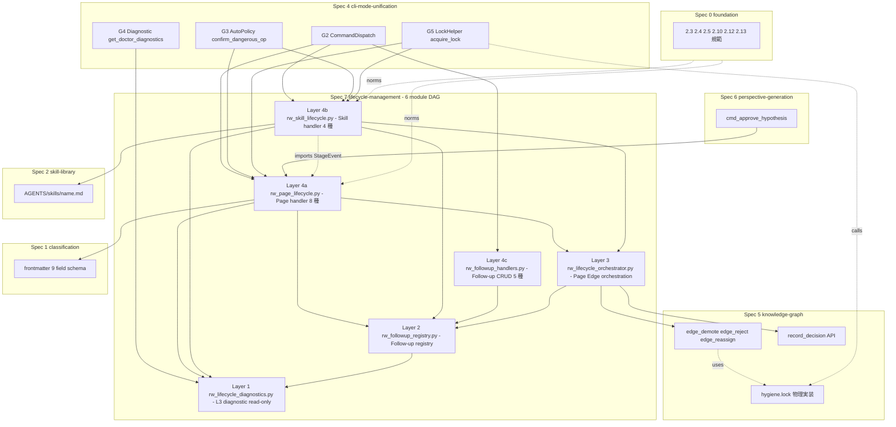
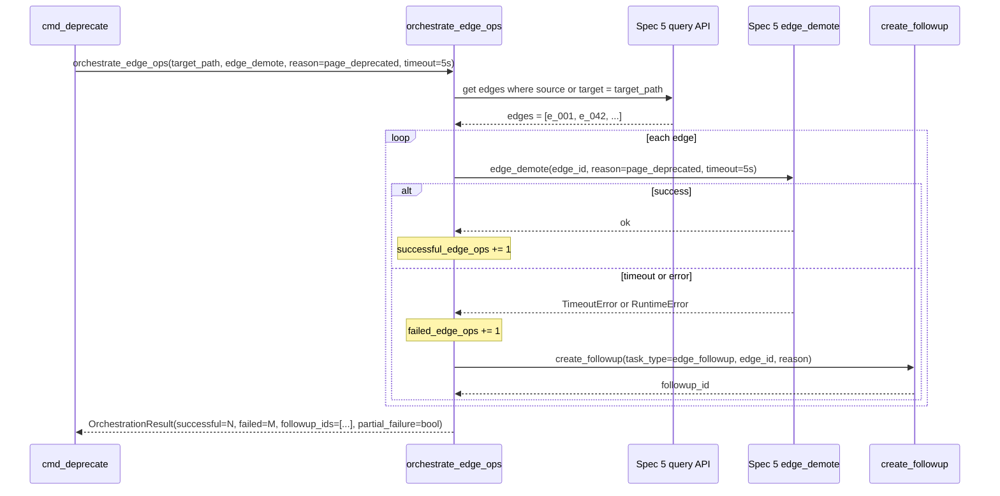
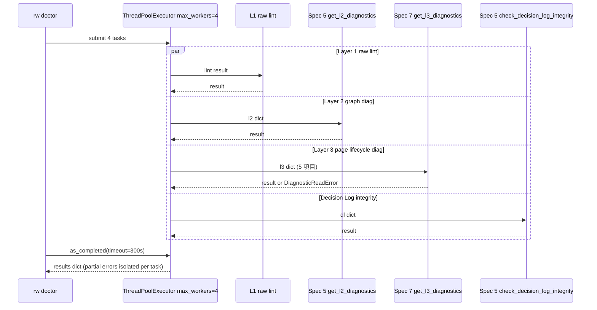
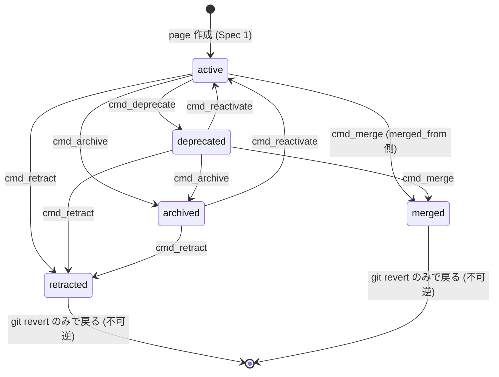

# Technical Design Document — rwiki-v2-lifecycle-management

## Overview

**Purpose**: 本 spec (Spec 7) は Rwiki v2 の L3 Curated Wiki ページと Skill ファイルの **lifecycle 操作セマンティクスと AGENTS/guides ドキュメント群** を提供する. Page status 5 種 (active / deprecated / retracted / archived / merged) の状態遷移ルール、Page lifecycle と L2 Edge lifecycle (Spec 5 所管) の相互作用 orchestration、dangerous op 13 種の handler ロジック、8 段階対話共通ガイドと操作固有ガイド、Follow-up タスク仕組み、警告 blockquote 自動挿入、Backlink 更新、Simple dangerous op (unapprove / reactivate)、Skill lifecycle (deprecate / retract / archive)、L3 診断 API を所管する.

**Users**: 本 spec の handler を呼び出す Spec 4 (cli-mode-unification、CLI dispatch) / Spec 5 (knowledge-graph、Page→Edge orchestration の edge API 提供) / Spec 6 (perspective-generation、Confirmed hypothesis の wiki 昇格) の起票者と実装者、および本 spec が確定する 11 種 AGENTS guide を `rw chat` 経由で参照する Rwiki v2 ユーザー (LLM ガイド利用者を含む).

**Impact**: Page status 遷移時の dangerous op (8 段階対話、警告 blockquote 自動挿入、backlink 更新、follow-up タスク化) を機械的に実装することで、誤操作で trust chain が壊れるリスクを排除する. L2 edge lifecycle との相互作用を本 spec が orchestrate することで、Page と Edge の状態が乖離する問題を解消する. v1 には deprecate / retract / archive / merge 系コマンドの実装は無く、本 spec の成果物は完全新規実装.

### Goals

- Page status 5 種の状態遷移ルールを transition map dict + helper で機械的に実装 (Decision 7-1).
- 8 段階対話 sequencer + read-only walkthrough + user input wait signal の 3 用途を Python generator yield pattern で統合 (Decision 7-5、Spec 4 申し送り 5/6/7 を 1 つの API パターンで吸収).
- Page→Edge 相互作用 orchestration (deprecate / retract / merge) を共通関数 `orchestrate_edge_ops()` で抽象化、partial failure 集計を 1 箇所に集約 (Decision 7-8).
- 11 種 AGENTS guide markdown (`dangerous-operations.md` 共通 + 10 種操作固有) を Document Contract として作成・維持.
- L3 診断 API (`get_l3_diagnostics()` / `check_l3_thresholds()`) を thread-safe な read-only API として提供、Spec 4 G4 Diagnostic から ThreadPoolExecutor 並行呼出可能 (Spec 4 申し送り 3).
- Skill lifecycle 4 handler (install / deprecate / retract / archive) を Page handler と別関数として実装、`update_history:` 適用差を分離 (Decision 7-16).

### Non-Goals

- Page status field 自体のスキーマ宣言 (Spec 1 R3 が field 名・型・許可値を所管).
- Edge status の定義・遷移ルール・進化則 (Spec 5 Graph Hygiene が所管).
- Edge 個別操作 API の実装 (`edge demote` / `edge reject` / `edge reassign` の内部ロジックは Spec 5、本 spec は呼出側).
- L2 ledger の data model (`edges.jsonl` / `edge_events.jsonl` / `evidence.jsonl` / `rejected_edges.jsonl`、Spec 5).
- L2 edge 操作の 1 段階確認動作 (`rw edge reject` / `rw edge unreject` / `rw edge promote` / `rw edge demote`、Spec 5).
- 個別 CLI コマンドの dispatch / argparse / chat 統合フレーム (Spec 4 が所管).
- Skill 内容 (Spec 2 が所管).
- Hypothesis 生成・verify ロジック (Spec 6 が所管、`hypothesis approve` の wiki 昇格段階のみ本 spec の dangerous op を経由).
- Severity 4 水準と exit code 0/1/2 分離の規約定義 (Foundation R11 / roadmap.md「v1 から継承する技術決定」が固定済).

## Boundary Commitments

### This Spec Owns

- **Page status 5 種の状態遷移ルール**: `active / deprecated / retracted / archived / merged` 間の許容遷移表 + active 復帰可能性 + 不可逆遷移 (retracted / merged) の規定 (R1).
- **各 status における参照元扱い・Query/Distill 対象範囲・Wiki 位置の動作仕様**: §7.2 Spec 7「Page 状態と挙動」表に準じる (R2).
- **Page→Edge 相互作用 orchestration**: Page deprecation → 関連 Edges demote / Page retracted → 関連 Edges reject / Page merged → Edges reassign の orchestration ロジック. Spec 5 edge API 3 種 (`edge_demote` / `edge_reject` / `edge_reassign`) の呼出側責務 (R3 / R12).
- **8 段階対話共通ガイド** (`AGENTS/guides/dangerous-operations.md`) と **操作固有ガイド 10 種** (`deprecate-guide.md` / `retract-guide.md` / `archive-guide.md` / `merge-guide.md` / `split-guide.md` / `tag-merge-guide.md` / `tag-split-guide.md` / `skill-install-guide.md` / `skill-retract-guide.md` / `hypothesis-approve-guide.md` 等) の作成と維持 (R4 / R5).
- **Dangerous op 13 種の分類** (危険度 / 対話ガイド要否 / `--auto` 可否) と handler の動作要件 (R6).
- **Follow-up タスク仕組み**: `wiki/.follow-ups/` 自動生成、frontmatter スキーマ、reactivate / 解消フロー、archive 機構 (R7).
- **警告 blockquote の自動挿入**: deprecate / retract / archive / merge / reactivate 時の本文先頭 callout 自動挿入 (R8).
- **Backlink 更新**: wiki merge / deprecate 時の被参照 markdown 走査 + 注記追記 (R9).
- **Simple dangerous op の 1 段階確認**: `rw unapprove` / `rw reactivate` の動作 (R10).
- **Skill lifecycle**: `cmd_skill_install` / `cmd_skill_deprecate` / `cmd_skill_retract` / `cmd_skill_archive` の handler ロジック (R11).
- **Skill ファイル frontmatter `status` field の編集権** (軽-2-2 解消、Spec 2 R3.5 と整合): Skill ファイル frontmatter の `status` / `status_changed_at` / `status_reason` / `successor` / `merged_from` / `merged_into` / `merge_strategy` field の編集は本 spec lifecycle 操作のみが行う. SKILL.md 本文 / `name` / `description` / `allowed-tools` 等の Skill 内容関連 field の編集は **Spec 2 の所管** で本 spec は触れない.
- **`update_history.type` lifecycle 起源 7 値の確定**: `deprecation` / `retract` / `archive` / `merge` / `split` / `reactivate` / `promote_to_synthesis` (R1.8、Decision 7-3).
- **decision_log の `decision_type` Page lifecycle 起源 6 種 + Skill 起源 4 種 = 10 種の規定**: `page_deprecate` / `page_retract` / `page_archive` / `page_merge` / `page_split` / `page_promote_to_synthesis` + `skill_install` / `skill_deprecate` / `skill_retract` / `skill_archive` (R12.7).
- **L3 診断 API**: `get_l3_diagnostics()` / `check_l3_thresholds()` の thread-safe 計算 API、5 診断項目 (R15).

### Out of Boundary

- **Page status field 自体のスキーマ宣言**: Spec 1 R3 (frontmatter `status:` field の存在・型・許可値).
- **Edge status の定義・遷移ルール・進化則**: Spec 5 Graph Hygiene (Edge status 6 種 = `weak / candidate / stable / core / deprecated / rejected`).
- **Edge 個別操作 API の実装**: Spec 5 (本 spec は API 契約の呼出側).
- **L2 ledger の data model**: Spec 5 (`edges.jsonl` / `edge_events.jsonl` / `evidence.jsonl` / `rejected_edges.jsonl`).
- **L2 edge 操作の 1 段階確認動作**: Spec 5 (`rw edge reject` / `rw edge unreject` / `rw edge promote` / `rw edge demote`).
- **個別 CLI コマンドの dispatch / argparse / chat 統合フレーム**: Spec 4 (本 spec は handler ロジックを `cmd_*(args: argparse.Namespace) -> int` signature で提供).
- **`rw doctor` の CLI dispatch / 出力整形 / exit code 制御 / 並列診断 orchestration**: Spec 4 G4 (本 spec は計算 API 本体のみ提供).
- **`record_decision()` API の実装**: Spec 5 R11.8 (本 spec は `decision_type` 値 10 種を所管確定 + 呼出側).
- **`.rwiki/.hygiene.lock` の物理実装**: Spec 5 R17 (fcntl/flock + PID 記録 + stale lock 検出). 本 spec handler 内で直接取得しない.
- **Skill 内容 (SKILL.md の本文 / metadata / allowed-tools)**: Spec 2 (本 spec は lifecycle 操作セマンティクスのみ).
- **Hypothesis 生成・verify ロジック**: Spec 6 (本 spec は `cmd_promote_to_synthesis` の wiki/synthesis/ 書込みまで).
- **Severity 4 水準と exit code 0/1/2 分離の規約定義**: Foundation R11 / roadmap.md「v1 から継承する技術決定」が固定済 (本 spec は継承).
- **L3 frontmatter `related:` の sync / cache invalidation 実装**: Spec 5 (本 spec は merge 時に Edge 付け替えを Spec 5 に依頼するのみ).

### Allowed Dependencies

- **Upstream specs**:
  - Spec 0 (rwiki-v2-foundation): §2.3 / §2.4 / §2.5 / §2.10 / §2.12 / §2.13 規範、Page status 5 種許可値 (R5)、Severity 4 + exit code 0/1/2 (R11)、`.rwiki/.hygiene.lock` 排他制御 (R11.5)、decision_log 規範 (R12).
  - Spec 1 (rwiki-v2-classification): L3 frontmatter 9 field schema (R3.1-R3.6) を入力スキーマとして参照.
- **Adjacent specs (parallel implementation 期間中の coordination)**:
  - Spec 4 (rwiki-v2-cli-mode-unification): handler を `cmd_*(args: argparse.Namespace) -> int` signature で提供、Spec 4 G2 CommandDispatch / G3 AutoPolicy / G4 Diagnostic から呼出.
  - Spec 5 (rwiki-v2-knowledge-graph): edge API 3 種 (`edge_demote` / `edge_reject` / `edge_reassign`) と `record_decision()` API を呼出側として利用.
- **Downstream specs**:
  - Spec 6 (rwiki-v2-perspective-generation): `cmd_promote_to_synthesis(hypothesis_id, target_path)` を呼出元として利用.
  - Spec 2 (rwiki-v2-skill-library): skill lifecycle 操作 (`rw skill deprecate` / `rw skill retract` / `rw skill archive`) を本 spec に委譲.
- **External libraries**:
  - Python 標準ライブラリ: `difflib` (HTML/text diff、Decision 7-10) / `hashlib` (state hash、Decision 7-7) / `pathlib` / `subprocess` (LLM CLI 呼出 timeout、Foundation R11 と整合) / `argparse` / `dataclasses` / `typing`.
  - 追加依存なし (`networkx ≥ 3.0` は Spec 5 のみ、本 spec は使用しない).
- **Forbidden dependencies**:
  - 本 spec は L1 (raw) または L2 (graph ledger) を直接読み書きしない. L2 への access は Spec 5 API 経由のみ.
  - 本 spec は Spec 6 / Spec 2 / Spec 4 を直接 import しない (依存方向逆転禁止).
  - 本 spec module 4 階層内で cyclic import 禁止 (Decision 7-19).

### Revalidation Triggers

- **Page status 5 種の追加/変更**: Foundation R5 / Spec 1 R3 経由で許可値が変わる場合、本 spec の transition map (Decision 7-1) と全 handler を再検証.
- **frontmatter schema (lifecycle 9 field) の追加/変更**: Spec 1 R3 経由で field が増減する場合、本 spec の `update_history.type` 値域 (Decision 7-3) と state hash 対象 (Decision 7-7) を再検証.
- **edge API 3 種の signature 変更**: Spec 5 R18.1 で signature が変わる場合、本 spec orchestrator (Decision 7-8) と timeout 値 (Decision 7-9) を再検証.
- **`record_decision()` API の signature 変更**: Spec 5 R11.8 で signature が変わる場合、本 spec の 10 種 decision_type 呼出を再検証.
- **`decision_log.jsonl` の `decision_type` 22 種の追加/変更**: Spec 5 R11.2 経由、本 spec の 10 種所管確定 (R12.7) を再検証.
- **dangerous op 13 種の分類変更**: §7.2 Spec 7 表が変わる場合、本 spec の handler 動作要件 (R6) を再検証.
- **`.rwiki/.hygiene.lock` scope 追加**: Spec 4 G5 LockHelper への `'page_lifecycle'` scope 追加 (Decision 7-6) を Adjacent Sync で反映.
- **8 段階対話 generator yield pattern の event 種類追加**: 本 spec が StageEvent dataclass を追加する場合、Spec 4 G3 wrapper の event handler を再検証.
- **`cmd_promote_to_synthesis` の判定アルゴリズム変更**: Decision 7-14 の 4 case 分岐が変わる場合、Spec 6 R9 / Spec 4 query promote の呼出側を再検証.

## Architecture

### Existing Architecture Analysis

- v1 (`v1-archive/scripts/`) には deprecate / retract / archive / merge 系コマンドの実装は **存在しない**. 本 spec の成果物は完全新規実装.
- `tVault/AGENTS/` には v1 由来の `approve.md` / `audit.md` / `lint.md` 等 13 種ガイドがあるが、`AGENTS/guides/` ディレクトリは未存在. 本 spec で 11 種ガイドを新規作成.
- v2 module DAG パターン (Spec 4 決定 4-3) を踏襲: 5 層 DAG / 各 ≤ 1500 行 / 修飾参照 (`from rw_module import symbol` 禁止) / 後方互換 re-export 禁止.
- Spec 4 の cmd_* 関数 signature 統一 (`cmd_*(args: argparse.Namespace) -> int`) を継承.
- Spec 1 の frontmatter parse / write helpers (PyYAML、Spec 1 design.md で確定) を継承利用.

### Architecture Pattern & Boundary Map



**Architecture Integration**:
- **Selected pattern**: 6 module DAG (上位層 → 下位層の 1 方向 import、Decision 7-19 + Decision 7-21). Spec 4 の 5 層 DAG パターンを踏襲、Layer 4 を機能別に 3 sub-module 化.
- **Domain/feature boundaries**: handler (Layer 4a Page / Layer 4b Skill / Layer 4c Follow-up) ↔ orchestration (Layer 3) ↔ follow-up registry (Layer 2) ↔ diagnostics (Layer 1) の 6 ドメイン分離. cyclic dependency 禁止. Layer 4b は Layer 4a の 8 段階対話 generator base + StageEvent dataclass を import (例外的 sibling import、Decision 7-21).
- **Existing patterns preserved**: cmd_* signature 統一 / 修飾参照 (詳細後述) / `update_history` 自動追記 / decision_log 記録 / `.hygiene.lock` 取得 (CLI 側).
- **修飾参照規律** (軽-8-2 解消、Spec 0 structure.md L184-189 / Spec 4 決定 4-3 継承): 全 module 間 import は `import rw_<module>` 形式のみ許可、`from rw_<module> import <symbol>` 禁止. 例: `import rw_lifecycle_orchestrator; rw_lifecycle_orchestrator.orchestrate_edge_ops(...)` (許可) vs `from rw_lifecycle_orchestrator import orchestrate_edge_ops` (禁止). 理由 = test の `monkeypatch.setattr` が全呼出経路で作用するように、modular 修飾参照で統一. Layer 4b → Layer 4a の StageEvent / generator base import (sibling import 例外) も同形式 (`import rw_page_lifecycle; rw_page_lifecycle.StageReadOnly`).
- **New components rationale**: 6 module 分割 (Layer 4 を 3 sub-module 化) は Spec 4 決定 4-3 の ≤ 1500 行制約遵守 + 機能別 boundary 明確化 (Page lifecycle / Skill lifecycle / Follow-up CRUD) を両立 (handler 17 種を 1 module に集約すると ~2000 行 estimate で制約 ~33% 超過).
- **Steering compliance**: Foundation §2.3 (status frontmatter over directory movement) / §2.4 (8 段階対話、L3 専用) / §2.5 (Simple dangerous op) / §2.12 (L2 専用優先関係) / §2.13 (Curation Provenance) を全て遵守.

### Technology Stack

| Layer | Choice / Version | Role in Feature | Notes |
|-------|------------------|-----------------|-------|
| CLI / Python | Python 3.10+ | handler 実装言語 | Foundation R11 継承 |
| Markdown parsing | PyYAML ≥ 6.0 (Spec 1 design.md で確定値、本 spec 継承) + 軽量 regex | frontmatter parse / 本文編集 | 重い MD parser 不要 (Decision 7-10). Spec 1 で version 改版時は本 spec も Adjacent Sync 経路で同期 |
| diff 表示 | `difflib.unified_diff` (terminal) + `difflib.HtmlDiff` (HTML) | 8 段階対話 step 7 差分プレビュー | 標準ライブラリ、外部依存ゼロ (Decision 7-10) |
| State hash | `hashlib.sha256` | race window 解消の state hash 計算 | 標準ライブラリ (Decision 7-7) |
| Concurrency | `concurrent.futures.ThreadPoolExecutor` (Spec 4 G4 が呼出) | L3 診断 API 並行呼出 | thread-safe 保証必須 (Spec 4 申し送り 3) |
| Lock | `fcntl/flock` (Spec 5 R17 が物理実装、Spec 4 G5 が CLI 取得) | 本 spec handler 内で直接取得しない | Decision 7-6 + R3.9 |
| Generator yield pattern | Python 標準 (PEP 342 + PEP 380) | 8 段階対話 + walkthrough + user input wait signal の 3 用途統合 | Decision 7-5 |

## File Structure Plan

### Directory Structure

```
scripts/                                              # Rwiki dev リポジトリの実装側
├── rw_page_lifecycle.py                             # Layer 4a: Page handler 8 種
│                                                     #   cmd_deprecate / cmd_retract / cmd_archive / cmd_reactivate
│                                                     #   cmd_merge / cmd_split / cmd_unapprove / cmd_promote_to_synthesis
│                                                     #   8 段階対話 generator base class + 8 種 StageEvent dataclass (共有)
│                                                     #   transition map dict + check_transition helper (Decision 7-1、共有)
│                                                     #   compute_state_hash helper (Decision 7-7、共有)
│                                                     #   ≤ 1000 行
├── rw_skill_lifecycle.py                            # Layer 4b: Skill handler 4 種
│                                                     #   cmd_skill_install / cmd_skill_deprecate / cmd_skill_retract / cmd_skill_archive
│                                                     #   Skill 専用 helper (BACKLINK_SCAN_PATHS['skill'] 適用 / update_history skip 分岐)
│                                                     #   8 段階対話 generator base class + StageEvent dataclass を Layer 4a から import
│                                                     #   ≤ 400 行
├── rw_followup_handlers.py                          # Layer 4c: Follow-up CRUD handler 5 種 (Layer 2 thin wrapper)
│                                                     #   cmd_followup_list / cmd_followup_show / cmd_followup_resolve
│                                                     #   cmd_followup_dismiss / cmd_followup_archive
│                                                     #   pagination + filter logic (R7.7)
│                                                     #   ≤ 200 行
├── rw_lifecycle_orchestrator.py                     # Layer 3: Page→Edge orchestration
│                                                     #   orchestrate_edge_ops 共通関数 (Decision 7-8)
│                                                     #   OrchestrationResult dataclass
│                                                     #   EDGE_API_TIMEOUT_DEFAULTS (Decision 7-9)
│                                                     #   Spec 5 edge API 3 種の呼出側 wrapper
│                                                     #   record_decision 呼出 helper (10 種 decision_type)
│                                                     #   ≤ 800 行
├── rw_followup_registry.py                          # Layer 2: Follow-up registry
│                                                     #   create_followup / list_followups / resolve_followup / dismiss_followup / archive_followup
│                                                     #   generate_followup_id helper (Decision 7-11)
│                                                     #   FollowupTask dataclass
│                                                     #   90 日 retention auto-archive logic (Decision 7-12)
│                                                     #   ≤ 600 行
└── rw_lifecycle_diagnostics.py                      # Layer 1: L3 診断 API (read-only、thread-safe)
                                                      #   get_l3_diagnostics(vault) -> dict
                                                      #   check_l3_thresholds(vault) -> list[dict]
                                                      #   5 診断項目: 未 approve / audit age / deprecated chain 循環 / tag 重複 / 未解決 follow-up
                                                      #   DiagnosticReadError exception
                                                      #   ≤ 500 行

tVault/AGENTS/guides/                                 # Vault 内 guide ファイル群 (本 spec 所管成果物)
├── dangerous-operations.md                          # 共通 8 段階チェックリスト (R4)
├── deprecate-guide.md                                # deprecate 操作固有差分 (R5.2)
├── retract-guide.md                                  # retract 操作固有差分
├── archive-guide.md                                  # archive 操作固有差分
├── merge-guide.md                                    # merge 操作固有差分 + merge_strategy 5 値別 (R5.3)
├── split-guide.md                                    # split 操作固有差分
├── tag-merge-guide.md                                # tag merge は Spec 1 委譲、guide のみ提供 (R5.4 / R5.5)
├── tag-split-guide.md                                # 同上
├── skill-install-guide.md                            # skill install 簡易対話 (Decision 7-15)
├── skill-retract-guide.md                            # skill retract 8 段階
└── hypothesis-approve-guide.md                       # promote-to-synthesis 8 段階

tVault/wiki/.follow-ups/                              # Follow-up タスク格納先
├── 2026-04-28-001.md                                 # frontmatter: id / created_at / origin_operation / origin_target / task_type / status / description / evidence
├── ...
└── .archived/<year>/                                 # 90 日 retention auto-archive (Decision 7-12)
    └── 2025/2025-12-31-042.md
```

### Modified Files

- `scripts/rw_dispatch.py` (Spec 4 G2 所管): handler 17 種を `from rw_page_lifecycle import cmd_* as _spec7_*` で import 追加 (Spec 4 G2 line 605-617 と整合).
- `scripts/rw_policy.py` (Spec 4 G3 所管): `confirm_dangerous_op()` の禁止リスト 5 種 dispatch + walkthrough mode generator handling 追加 (Spec 4 G3 line 829-841).
- `scripts/rw_lock.py` (Spec 4 G5 所管): `acquire_lock()` scope に `'page_lifecycle'` 追加 (Decision 7-6 / Spec 4 G5 line 1046).
- `scripts/rw_doctor.py` (Spec 4 G4 所管): L3 診断項目を `from rw_lifecycle_diagnostics import get_l3_diagnostics` で取得 (Spec 4 G4 line 919).
- `.kiro/specs/rwiki-v2-classification/design.md` (Adjacent Sync): `update_history.type` example コメント (line 893) に lifecycle 起源 7 値を追記 (Decision 7-3).
- `.kiro/drafts/rwiki-v2-consolidated-spec.md` (Adjacent Sync): §7.2 Spec 7 表に Skill lifecycle 拡張 2 種 (skill deprecate / skill archive) を追加 (Decision 7-15).

## System Flows

### Flow 1: 8 段階対話 generator yield pattern (Decision 7-5、Spec 4 申し送り 5/6/7 統合)

```mermaid
sequenceDiagram
    participant User
    participant CLI as Spec 4 G3 confirm_dangerous_op
    participant Handler as Spec 7 cmd_retract generator
    participant Lock as Spec 4 G5 acquire_lock
    participant Hash as compute_state_hash
    participant EdgeAPI as Spec 5 edge_reject
    participant DecLog as Spec 5 record_decision
    participant FU as Spec 7 create_followup

    User->>CLI: rw retract page.md
    CLI->>Handler: handler = cmd_retract(args); next(handler)
    Handler->>CLI: yield StageReadOnly(0, 意図確認)
    CLI->>User: stage 0 表示
    User->>CLI: response (続行)
    CLI->>Handler: .send(response)
    Note over Handler,CLI: stage 1-7 同パターン繰り返し
    Handler->>CLI: yield WaitForUserInput(stage 7 差分プレビュー確認)
    CLI->>CLI: timeout suspend (subprocess wall-clock 除外)
    User->>CLI: y or n
    CLI->>Handler: .send(y)
    Handler->>CLI: yield AcquireLock(scope=page_lifecycle)
    CLI->>Lock: acquire_lock(page_lifecycle)
    Lock-->>CLI: lock_acquired
    CLI->>Handler: .send(True)
    Handler->>Hash: compute_state_hash(page_path)
    Hash-->>Handler: hash_t8
    Handler->>CLI: yield PreFlightStateHash(hash_t7, hash_t8)
    alt hash_t7 == hash_t8
        CLI->>Handler: .send(True)
        Handler->>EdgeAPI: edge_reject(edge_id, reason, timeout=10s)
        EdgeAPI-->>Handler: ok or partial_failure
        opt partial_failure
            Handler->>FU: create_followup(task_type=edge_followup)
        end
        Handler->>Handler: write frontmatter (status=retracted) atomic
        Handler->>Handler: insert blockquote callout
        Handler->>Handler: append update_history entry
        Handler->>DecLog: record_decision(decision_type=page_retract, reasoning=必須)
        DecLog-->>Handler: decision_id
        Handler->>CLI: yield FinalResult(exit_code=0)
    else hash_t7 != hash_t8
        CLI->>Handler: .send(False)
        Handler->>CLI: yield FinalResult(exit_code=1, error=race_window_detected)
    end
    CLI->>Lock: release_lock
    CLI->>User: exit code + JSON 出力
```

### Flow 2: Page→Edge orchestration (Decision 7-8)



### Flow 3: L3 診断 API thread-safe 並行呼出 (Spec 4 申し送り 3)



## Requirements Traceability

| Requirement | Summary | Components | Interfaces | Flows |
|-------------|---------|------------|------------|-------|
| 1.1-1.8 | Page status 5 種の状態遷移ルール | Layer 4 handler 全種 | check_transition() / PAGE_TRANSITIONS dict | Flow 1 stage 0-1 |
| 2.1-2.7 | 各 status における参照元扱い・Query/Distill 対象 | Data Models > Page Status Behavior Matrix (本 spec が semantics 所管) | Spec 4/Spec 6 が status filter 実装 | — |
| 3.1-3.9 | Page→Edge 相互作用 orchestration | Layer 3 orchestrate_edge_ops | Spec 5 edge_demote / edge_reject / edge_reassign | Flow 2 |
| 4.1-4.7 | 8 段階共通チェックリストガイド | AGENTS/guides/dangerous-operations.md | Document Contract | — |
| 5.1-5.7 | 操作固有ガイド 10 種 | AGENTS/guides/<op>-guide.md | Document Contract | — |
| 6.1-6.9 | Dangerous op 13 種の分類と handler 動作要件 | Layer 4 handler 全種 + Spec 4 G3 dispatch | cmd_*(args) -> int + ConfirmResult enum | Flow 1 |
| 7.1-7.8 | Follow-up タスク仕組み | Layer 2 rw_followup_registry.py | create_followup / list / resolve / dismiss / archive | Flow 2 partial_failure |
| 8.1-8.7 | 警告 blockquote の自動挿入 | Layer 4 handler (deprecate/retract/archive/merge/reactivate) | insert_blockquote helper | Flow 1 stage 8 |
| 9.1-9.7 | Backlink 更新 | Layer 4 handler (deprecate/merge) | update_backlinks helper + BACKLINK_SCAN_PATHS | Flow 1 stage 8 |
| 10.1-10.6 | Simple dangerous op 1 段階確認 | Layer 4 cmd_unapprove / cmd_reactivate | 1-stage confirm pattern | — |
| 11.1-11.6 | Skill lifecycle | Layer 4 cmd_skill_* (4 種) | 別関数 (Decision 7-16) | Flow 1 (skill_install のみ簡易) |
| 12.1-12.8 | Spec 7 ↔ Spec 5 coordination 責務分離 | Layer 3 orchestrator | Spec 5 edge API + record_decision | Flow 2 |
| 13.1-13.7 | Spec 7 ↔ Spec 4 coordination 責務分離 | Layer 4 handler (cmd_* signature) | argparse.Namespace 統一 | — |
| 15.1-15.5 | L3 診断 API の提供 | Layer 1 rw_lifecycle_diagnostics.py | get_l3_diagnostics / check_l3_thresholds | Flow 3 |
| 16.1-16.9 | Foundation 規範への準拠と文書品質 | 全 Component | Document Contract (本文 spec) | — |

(注: requirements.md は R14 を欠番として R13 → R15 → R16 の構成. design.md でも同じ番号体系を踏襲.)

## Components and Interfaces

| Component | Domain/Layer | Intent | Req Coverage | Key Dependencies (P0/P1) | Contracts |
|-----------|--------------|--------|--------------|--------------------------|-----------|
| L4a-PageHandler | Layer 4a: Page handler 8 種 + 8 段階対話 generator base + StageEvent + transition map + state hash | Page lifecycle の handler ロジック実装 | 1, 6, 8, 9, 10, 13 | Layer 3 (P0) / Layer 2 (P0) / Layer 1 (P0) / Spec 1 frontmatter (P0) / Spec 4 G2/G3/G5 (P0 inbound) | Service / State |
| L4b-SkillHandler | Layer 4b: Skill handler 4 種 + Skill 専用 helper | Skill lifecycle の handler ロジック実装 | 11 | Layer 4a (P0、StageEvent + generator base import) / Layer 3 (P0) / Layer 2 (P0) / Spec 2 SkillFiles (P0) / Spec 4 G2/G3/G5 (P0 inbound) | Service / State |
| L4c-FollowupHandler | Layer 4c: Follow-up CRUD handler 5 種 (Layer 2 thin wrapper) | Follow-up CRUD コマンド handler | 7 | Layer 2 (P0) / Spec 4 G2 (P0 inbound) | Service |
| L3-Orchestrator | Layer 3: Page→Edge orchestration | edge API 呼出と partial failure 集計 | 3, 12 | Spec 5 edge API (P0) / Spec 5 record_decision (P0) / Layer 2 (P0) | Service |
| L2-Followup | Layer 2: Follow-up registry | wiki/.follow-ups/ 配下の task ファイル CRUD + auto-archive | 7 | Layer 1 (P0) / 標準ライブラリ pathlib | Service / State |
| L1-Diagnostics | Layer 1: L3 診断 API | thread-safe な read-only 診断計算 | 15 | 標準ライブラリ pathlib + Spec 4 G4 (P0 inbound) | Service |
| Doc-DangerousOps | Document Contract: AGENTS/guides/dangerous-operations.md | 8 段階共通チェックリスト | 4 | Foundation §2.4 (P0) | Document |
| Doc-OpGuides | Document Contract: AGENTS/guides/<op>-guide.md (10 種) | 操作固有ガイド | 5 | Doc-DangerousOps (P0) | Document |

### Layer 4: rw_page_lifecycle.py (handler 17 種 + 8 段階対話 generator base)

#### Component: cmd_deprecate (Reference Template for 8 段階対話 generator handlers)

本 Component は **8 段階対話 generator pattern handler の Reference Template** として完全 block で記述. 同パターン handler 7 種 (cmd_retract / cmd_archive / cmd_merge / cmd_split / cmd_promote_to_synthesis / cmd_skill_deprecate / cmd_skill_retract / cmd_skill_archive) は本 block を base reference とし、各 block では差分 (Pattern note) のみ明示する.

| Field | Detail |
|-------|--------|
| Intent | wiki page を `active → deprecated` に遷移、関連 edges を demote、警告 blockquote 挿入、Backlink 更新 |
| Requirements | 1.2, 3.1, 6.2, 6.3, 6.6, 8.1, 9.1, 12.7, 13.1 |

**Responsibilities & Constraints**
- Page status を `active → deprecated` に変更 (PAGE_TRANSITIONS dict で許容遷移検査).
- 8 段階対話 generator pattern で実装 (Decision 7-5).
- `--auto` 可 (R6.6).
- 関連 L2 edges を `edge_demote()` で demote (orchestrate_edge_ops 経由).
- 警告 blockquote `> [!WARNING] Deprecated\n> ...` を本文先頭に挿入 (R8.1).
- Backlink を `wiki/**/*.md` + `raw/**/*.md` 走査して注記追記 (R9.1).
- `update_history` に `{date, type=deprecation, summary, evidence?}` 自動追記.
- decision_log に `decision_type=page_deprecate` で記録.

**Dependencies**
- Inbound: Spec 4 G2 dispatch_approve_path / Spec 4 G3 confirm_dangerous_op (P0)
- Outbound: Layer 3 orchestrate_edge_ops (P0) / Layer 2 create_followup (P1) / Spec 1 frontmatter helpers (P0)
- External: difflib (P0、HTML diff for stage 7) / hashlib (P0、state hash) / PyYAML (P0、frontmatter)

**Contracts**: Service [✓] / API [ ] / Event [ ] / Batch [ ] / State [✓]

##### Service Interface
```python
def cmd_deprecate(args: argparse.Namespace) -> Generator[StageEvent, UserResponse, FinalResult]:
    """
    args: target (path), reason (str, 必須), successor (list[path], 任意), auto (bool), dry_run (bool)
    Generator yields:
      StageReadOnly(stage_id: int, content: str)            # stage 0-7 each
      WaitForUserInput(prompt: str)                          # user input 待ち時 (timeout suspend signal)
      AcquireLock(scope: Literal['page_lifecycle'])          # stage 8 開始時
      PreFlightStateHash(hash_t7: str, hash_t8: str)         # stage 8 開始直後
      DiffPreview(diff_text: str, diff_html: str)            # stage 7
      WriteCommit(success: bool, error: Optional[str])       # stage 8 atomic write 完了
      FollowupCreate(followup_ids: list[str])                # stage 8 partial failure 時
      DecisionRecord(decision_id: str)                       # stage 8 record_decision 完了
    Sends:
      UserResponse: y/n/details/abort/...
      bool: PreFlightStateHash 比較結果 (Spec 4 G3 が判定)
      lock_acquired: bool (Spec 4 G5 が結果)
    Returns:
      FinalResult(exit_code: int, output_json: dict)
    """
```
- **Preconditions**: target page が存在 + status が active or deprecated, lock 未取得.
- **Postconditions**: stage 8 成功時 = page status=deprecated + blockquote 挿入 + Backlink 更新 + update_history 追記 + decision_log 記録. 段階 0-7 abort 時 = 永続化なし (state 維持).
- **Invariants**: 段階 0-7 read-only / 段階 8 のみ write (Decision 7-5). race window 解消 = state hash pre-flight (Decision 7-6).

##### State Management
- State model: 4 段階 (read-only walkthrough → user confirm → lock acquired → committed). enum `HandlerState`.
- Persistence & consistency: stage 8 内 atomic write (frontmatter / blockquote / backlinks を同 commit に集約 = lock 範囲内 + git index staging で一貫性).
- Concurrency strategy: lock 取得は Spec 4 G5 経由 (本 component 内で直接取得しない). 段階 0-7 lock 不要 (read-only).

**Implementation Notes**
- **Integration**: Spec 5 edge_demote 失敗時は orchestrate_edge_ops が partial failure を集計、本 component の WriteCommit event 後に FollowupCreate event を発火. Spec 4 G3 が follow-up タスク件数を出力 JSON に含める (R7.5、brief 第 4-5 持ち越し対応).
- **Validation**: 引数 sanitization (path traversal 防止、glob 引数の絶対 path 拒否、brief 第 4-10 持ち越し対応). status_reason 空文字禁止 (R1.5).
- **Idempotency** (Reference Template として全 8 段階対話 generator handler に適用):
  - 警告 blockquote 自動挿入 (R8.7): 既に同種 blockquote が本文先頭に存在する場合、新規生成せず内容更新のみ. `update_history` に「blockquote updated」イベント追記. 検出は callout type (`[!WARNING]` / `[!CAUTION]` / `[!NOTE]`) で判定.
  - Backlink 更新 (R9.4): 同一ページに対する追記が既に存在する場合 (同種注記文字列 grep)、新規追記を skip. 重複追記防止.
  - 同一 dangerous op の冪等再実行: state hash pre-flight (Decision 7-6 / 7-7) で `hash_t7 == hash_t8` 検証、status 遷移済みなら check_transition で reject (CRITICAL severity).
- **Risks**: 大規模 vault で Backlink 走査 timeout 超過リスク (Risk 4) → Phase 2 incremental cache 検討.

#### Component: cmd_retract

| Field | Detail |
|-------|--------|
| Intent | wiki page を `active/deprecated → retracted` に遷移 (不可逆)、関連 edges を reject、強警告 blockquote 挿入 |
| Requirements | 1.2, 3.2, 6.2, 6.3, 6.4, 8.2, 12.7, 13.1 |

**Responsibilities & Constraints**
- `active → retracted` または `deprecated → retracted` 遷移 (`archived → retracted` も許容、R1.2).
- **`--auto` 不可** (R6.4)、`--auto` 渡された場合 WARN severity 出力後 8 段階対話強制 (Decision 7-20).
- 関連 L2 edges を `edge_reject(reason_category='superseded', reason_text=<status_reason>)` で reject.
- 強警告 blockquote `> [!CAUTION] Retracted\n> ...` を本文先頭に挿入 (R8.2).
- Backlink 更新 **行わない** (R9.7、retracted は完全除外で誘導不要).
- decision_log に `decision_type=page_retract` で記録、**reasoning 必須** (Spec 5 R11.6 が hypothesis_verify_refuted / synthesis_approve / retract で reasoning 必須).

**Dependencies**
- 同 cmd_deprecate

**Contracts**: Service [✓] / State [✓]

##### Service Interface
```python
def cmd_retract(args: argparse.Namespace) -> Generator[StageEvent, UserResponse, FinalResult]:
    """
    args: target (path), reason (str, 必須), auto (bool, 警告 WARN 出力後対話強制)
    Generator: cmd_deprecate と同 event 列、ただし reasoning 入力を WaitForUserInput で必須要求
    """
```
- **Preconditions**: target page status が active / deprecated / archived のいずれか.
- **Postconditions**: stage 8 成功時 = page status=retracted + 強警告 blockquote + edges rejected + decision_log (reasoning 必須).
- **Invariants**: 不可逆 (retracted → 任意 status は不可、git revert のみで戻る).
- **Pattern**: cmd_deprecate Reference Template と同 8 段階対話 generator pattern. 差分 = (a) `--auto` 不可で `--auto` 渡された場合 WARN 出力後 8 段階対話強制 (Decision 7-20)、(b) edge_demote ではなく `edge_reject(reason_category='superseded')` 呼出、(c) Backlink 更新を行わない (R9.7)、(d) decision_type=page_retract で reasoning 必須 (Spec 5 R11.6)、(e) 強警告 blockquote `[!CAUTION]` 使用 (R8.2).

#### Component: cmd_archive

| Field | Detail |
|-------|--------|
| Intent | wiki page を `active/deprecated → archived` に遷移、注記 blockquote 挿入 |
| Requirements | 1.2, 6.2, 6.3, 6.6, 8.3, 12.7, 13.1 |

**Responsibilities & Constraints**
- `active → archived` または `deprecated → archived` 遷移. `archived → reactivate` 経由で active に戻す 2 段階運用 (R1.2).
- 推奨対話 (R6.3、ただし対話ガイドは推奨レベルで `--auto` 可、R6.6).
- Page→Edge 相互作用は **行わない** (archived は履歴扱い、Query 履歴として検索可、R2.4).
- 注記 blockquote `> [!NOTE] Archived\n> ...` を本文先頭に挿入 (R8.3).
- Backlink 更新 **行わない** (R9.7).
- decision_log に `decision_type=page_archive` で記録.

**Contracts**: Service [✓] / State [✓]

##### Service Interface
```python
def cmd_archive(args: argparse.Namespace) -> Generator[StageEvent, UserResponse, FinalResult]:
    """
    args: target (path), reason (str, 必須), auto (bool)
    """
```
- **Pattern**: cmd_deprecate Reference Template と同 8 段階対話 generator pattern. 差分 = (a) Page→Edge orchestration を行わない (archived は履歴扱い、R2.4)、(b) Backlink 更新を行わない (R9.7)、(c) 注記 blockquote `[!NOTE]` 使用 (R8.3)、(d) decision_type=page_archive、(e) 推奨対話レベル (`--auto` 可、R6.6).

#### Component: cmd_reactivate

| Field | Detail |
|-------|--------|
| Intent | `deprecated/archived → active` に戻す Simple dangerous op (1 段階確認) |
| Requirements | 1.2, 7.6, 8.5, 10.2, 10.3, 10.5, 12.7 |

**Responsibilities & Constraints**
- Simple dangerous op (1 段階確認のみ、§2.5 / R10).
- `deprecated → active` または `archived → active` 遷移. `retracted` / `merged` は不可逆で拒否 (R10.5、ERROR severity).
- 警告 blockquote 除去 (`[!WARNING] Deprecated` / `[!NOTE] Archived` を pattern match で検出して削除、R8.5).
- 関連 Follow-up タスク (`task_type: reactivation_check`) を自動的に再オープンまたは確認プロンプトに昇格 (R7.6).
- `update_history` に `{date, type=reactivate, summary}` 追記.
- decision_log に `decision_type=page_reactivate` で記録.

**Contracts**: Service [✓] / State [✓]

##### Service Interface
```python
def cmd_reactivate(args: argparse.Namespace) -> int:
    """
    args: target (path), yes (bool, --yes 必須)
    Returns: exit_code (0 = PASS, 1 = runtime error)
    Note: Simple dangerous op は generator pattern を使わず、1-stage confirm + atomic write の単純パターン.
    """
```
- **Pattern (Simple dangerous op)**: cmd_deprecate Reference Template とは異なり generator pattern を使わない. 1-stage confirm + atomic write. Foundation §2.5 / R10 と整合. 警告 blockquote 除去 (R8.5) と Follow-up reactivation_check 自動再オープン (R7.6) を行う.

#### Component: cmd_merge

| Field | Detail |
|-------|--------|
| Intent | 2 つ以上の wiki page を 1 つに統合、merged_from 側を merged 状態に + merged_into 側に内容 merge、関連 edges を reassign |
| Requirements | 1.2, 1.7, 3.3, 6.2, 6.3, 6.6, 8.4, 9.2, 12.7, 13.1 |

**Responsibilities & Constraints**
- merge_strategy 5 値 (complementary / dedup / canonical-a / canonical-b / restructure、Spec 1 R3.4).
- merged_from index 0 = a / index 1 = b 規約遵守 (Spec 1 決定 1-10).
- 8 段階対話の段階 1 で「どちらが canonical?」prompt → user 入力順で merged_from 配列順序保持.
- merge_strategy 確定済時のみ `--auto` 許可 (R6.6).
- 関連 L2 edges を `edge_reassign(new_endpoint=merged_into)` で付け替え.
- merged_from 各 page に誘導 blockquote `> [!NOTE] Merged\n> ...` 挿入 (R8.4).
- merged_from 側の Backlink を `wiki/**/*.md` + `raw/**/*.md` 走査して注記追記 (R9.2).
- decision_log に `decision_type=page_merge` で記録、`subject_refs=[merged_from..., merged_into]`.

**Contracts**: Service [✓] / State [✓]

##### Service Interface
```python
def cmd_merge(args: argparse.Namespace) -> Generator[StageEvent, UserResponse, FinalResult]:
    """
    args: targets (list[path], 2+ pages), into (path, merged_into), strategy (str, 5 値), auto (bool)
    """
```
- **Pattern**: cmd_deprecate Reference Template と同 8 段階対話 generator pattern. 差分 = (a) 複数 targets を merged_from 配列順序保持で扱う (Spec 1 決定 1-10、index 0=a / index 1=b)、(b) edge_demote ではなく `edge_reassign(new_endpoint=merged_into)` 呼出、(c) merge_strategy 確定済時のみ `--auto` 許可 (R6.6)、(d) merged_from 各 page に誘導 blockquote `[!NOTE] Merged` 挿入 (R8.4)、(e) merged_from 側の Backlink 走査 + 注記追記 (R9.2)、(f) decision_type=page_merge.

#### Component: cmd_split

| Field | Detail |
|-------|--------|
| Intent | 1 つの wiki page を 2 つ以上に分割、元 page を merged 状態に + 新 page を生成 |
| Requirements | 1.2, 6.2, 6.3, 6.4, 12.7, 13.1 |

**Responsibilities & Constraints**
- **`--auto` 不可** (R6.4).
- 元 page を `merged` 状態に遷移 (merged_into = 新 page paths).
- 新 page 生成 (Spec 1 frontmatter 必須 field 設定).
- 関連 edges の reassign は user 判断 (どの edge を どの新 page に reassign するか) → 8 段階対話の step 5 (各参照元の個別判断).
- decision_log に `decision_type=page_split` で記録.

**Contracts**: Service [✓] / State [✓]

##### Service Interface
```python
def cmd_split(args: argparse.Namespace) -> Generator[StageEvent, UserResponse, FinalResult]:
    """
    args: source (path), targets (list[path], 2+ new pages), reason (str, 必須)
    """
```
- **Pattern**: cmd_deprecate Reference Template と同 8 段階対話 generator pattern. 差分 = (a) 元 page を `merged` 状態に遷移 (merged_into = 新 page paths)、(b) 新 page 生成 (Spec 1 frontmatter 必須 field 設定)、(c) 関連 edges の reassign は user 判断 (8 段階対話 step 5 各参照元の個別判断)、(d) `--auto` 不可 (R6.4)、(e) decision_type=page_split.

#### Component: cmd_unapprove

| Field | Detail |
|-------|--------|
| Intent | git revert の薄いラッパーで直前の approve commit を取消 |
| Requirements | 6.7, 10.1, 10.4 |

**Responsibilities & Constraints**
- Simple dangerous op (1 段階確認、§2.5).
- `--yes` フラグ必須 (R6.7、SSoT §7.2 「✓（`--yes`）」と整合).
- git revert の薄いラッパー、内部 frontmatter 操作はしない (commit hash で reverse).
- decision_log に `decision_type=page_unapprove` ではなく、git log で履歴表示 (Foundation §2.6 「Git + 層別履歴媒体」と整合).

**Contracts**: Service [✓]

##### Service Interface
```python
def cmd_unapprove(args: argparse.Namespace) -> int:
    """
    args: target (path or commit-hash), yes (bool, --yes 必須)
    Returns: exit_code (0 = PASS, 1 = runtime error)
    """
```
- **Pattern (Simple dangerous op)**: cmd_deprecate Reference Template とは異なり generator pattern 不使用. git revert ラッパーのみ. Foundation §2.5 / §2.6 (Git + 層別履歴媒体) と整合、decision_log 記録なし (git log で履歴表示).

#### Component: cmd_promote_to_synthesis

| Field | Detail |
|-------|--------|
| Intent | review/synthesis_candidates/ または confirmed hypothesis を `wiki/synthesis/<slug>.md` に昇格 |
| Requirements | 6.4, 13.7 |

**Responsibilities & Constraints**
- **`--auto` 不可** (R6.4)、最高危険度.
- 8 段階対話 generator pattern.
- 4 case 自動判定 (Decision 7-14):
  - case A: 新規 wiki page 生成 (target_path 未指定 OR 既存未存在)
  - case B: 既存 page section 拡張 (target_path 指定 + 既存存在 + target_field 未指定)
  - case C: 既存 page specific field 置換 (target_path 指定 + target_field 指定)
  - case D: 既存 page を deprecated にして新規生成 (target_path 指定 + `--replace` flag)
- step 1 (意図確認) で「自動判定結果: case X」を user に提示、step 4 (代替案提示) で他 case を選択肢表示.
- 呼出元 2 箇所: Spec 6 `cmd_approve_hypothesis(hypothesis_id)` または Spec 4 `rw query promote <query_id>`.
- decision_log に `decision_type=page_promote_to_synthesis` で記録.

**Contracts**: Service [✓] / State [✓]

##### Service Interface
```python
def cmd_promote_to_synthesis(args: argparse.Namespace) -> Generator[StageEvent, UserResponse, FinalResult]:
    """
    args fields (argparse.Namespace attribute):
      candidate_path: Path                        # hypothesis_candidates/ or query result
      target_path: Optional[Path] = None          # auto-detect if None (Decision 7-14 case A)
      merge_strategy: Optional[str] = None        # auto-detect if None
      target_field: Optional[str] = None          # auto-detect if None
      replace: bool = False                       # case D 用
    Returns: FinalResult with output_json containing target_path (確定された wiki/synthesis/<slug>.md)
    """
```
- **Preconditions**: candidate_path が存在 + status が `confirmed` (hypothesis の場合).
- **Postconditions**: stage 8 成功時 = target_path 確定 + wiki/synthesis/<slug>.md 書込み + decision_log 記録.
  Spec 6 が後段で hypothesis status `confirmed → promoted` 遷移 + `successor_wiki:` 記録 (Spec 6 R7.6 / R9.4).
- **Coordination 呼出規約** (重-1-1 解消、Spec 6 / Spec 4 が argparse.Namespace を construct する責務):
  - **Spec 6 R9.3 経由**: `args = argparse.Namespace(candidate_path=Path(f"review/hypothesis_candidates/{hyp_id}.md"), target_path=user_provided_target, merge_strategy=None, target_field=None, replace=False)` を Spec 6 `cmd_approve_hypothesis` 内で construct.
  - **Spec 4 query promote 経由**: `args = argparse.Namespace(candidate_path=Path(f"review/synthesis_candidates/{query_result_id}.md"), target_path=None, ...)` を Spec 4 G2 dispatch 内で construct.
  - 本 spec は **Spec 4 cmd_* signature 統一規律 (`(args: argparse.Namespace) -> int` または Generator)** を遵守、両呼出元が adapter logic を持つ.
  - Spec 6 design 着手時に「Spec 6 → Spec 7 cmd_promote_to_synthesis 呼出時の args construct 責務」を Spec 6 design 本文に明示する **Adjacent Sync 経路追加** (本 spec change log で記録).
- **Pattern**: cmd_deprecate Reference Template と同 8 段階対話 generator pattern. 差分 = (a) `--auto` 不可 (R6.4)、最高危険度、(b) 4 case 自動判定 (Decision 7-14、step 1 で user に提示 + step 4 で他 case を選択肢表示)、(c) Page→Edge orchestration を行わない (新規 wiki/synthesis/ page 生成または既存 page 拡張のみ)、(d) decision_type=page_promote_to_synthesis で reasoning 必須 (Spec 5 R11.6 synthesis_approve 系)、(e) 呼出元 2 entry point (Spec 6 R9 / Spec 4 query promote)、両者が args namespace を construct する責務.

#### Component: cmd_skill_install / cmd_skill_deprecate / cmd_skill_retract / cmd_skill_archive

| Field | Detail |
|-------|--------|
| Intent | Skill ファイルの lifecycle 操作、Page handler と別関数 (Decision 7-16) |
| Requirements | 6.9, 11.1, 11.2, 11.3, 11.4, 11.5, 11.6, 12.7, 13.1 |

**Responsibilities & Constraints**
- Skill ファイル配置 = `AGENTS/skills/<name>.md` の単一 .md ファイル (Spec 2 R1).
- 4 種の対話階段 (Decision 7-15):
  - `cmd_skill_install`: 簡易 1 段階 (推奨対話、`--auto` 可).
  - `cmd_skill_deprecate`: 8 段階対話 (中、`--auto` 可).
  - `cmd_skill_retract`: 8 段階対話 (高、`--auto` 不可).
  - `cmd_skill_archive`: 8 段階対話 (低、推奨、`--auto` 可).
- **`update_history:` 適用しない** (Spec 2 R3.6 / 本 spec R3.8 末尾、Decision 7-16).
- Backlink 走査範囲に `AGENTS/**/*.md` を含む (R11.6、BACKLINK_SCAN_PATHS['skill']).
- 警告 blockquote は Page 用と同じ logic (R11.6).
- decision_log に Skill 起源 4 種 `decision_type` で記録.

**Contracts**: Service [✓] / State [✓]

##### Service Interface
```python
def cmd_skill_install(args: argparse.Namespace) -> int:
    """簡易 1 段階確認、Page 用と異なり generator pattern 不使用"""

def cmd_skill_deprecate(args: argparse.Namespace) -> Generator[StageEvent, UserResponse, FinalResult]: ...
def cmd_skill_retract(args: argparse.Namespace) -> Generator[StageEvent, UserResponse, FinalResult]: ...
def cmd_skill_archive(args: argparse.Namespace) -> Generator[StageEvent, UserResponse, FinalResult]: ...
```
- **Pattern (Skill 4 handler、page handler との差分)**:
  - **cmd_skill_install**: Simple dangerous op、cmd_deprecate Reference Template の generator pattern 不使用. 1-stage confirm + Spec 2 R7.5 install validation 通過後 atomic move. Decision 7-15 で「簡易 1 段階」確定. decision_type=skill_install.
  - **cmd_skill_deprecate**: cmd_deprecate Reference Template と同 8 段階対話 generator pattern. 差分 = (a) **`update_history:` 適用しない** (Spec 2 R3.6 / Decision 7-16)、(b) Backlink 走査範囲に `AGENTS/**/*.md` を含む (R11.6 / Decision 7-17 BACKLINK_SCAN_PATHS['skill'])、(c) Page→Edge orchestration を行わない (skill は L2 edges を持たない)、(d) decision_type=skill_deprecate.
  - **cmd_skill_retract**: cmd_deprecate Reference Template と同 8 段階対話 generator pattern. 差分 = cmd_skill_deprecate と同差分 + (e) **`--auto` 不可** (Decision 7-15、R11.4)、(f) decision_type=skill_retract.
  - **cmd_skill_archive**: cmd_deprecate Reference Template と同 8 段階対話 generator pattern. 差分 = cmd_skill_deprecate と同差分 + (e) decision_type=skill_archive.

#### Component: Follow-up handler 5 種 (cmd_followup_*)

| Field | Detail |
|-------|--------|
| Intent | Follow-up タスクの一覧 / 表示 / 解消 / dismiss / archive コマンド handler |
| Requirements | 7.7, 7.8 |

**Responsibilities & Constraints**
- `cmd_followup_list(args)`: `wiki/.follow-ups/*.md` (archive 除く) を frontmatter parse して一覧返す.
  - pagination: `--max-results <int>` (default 50)、filter: `--task-type <str>` / `--status <str>` / `--date-range <YYYY-MM-DD..YYYY-MM-DD>` (brief 第 4-8 持ち越し対応).
- `cmd_followup_show(args)`: 個別 task の frontmatter + description 表示.
- `cmd_followup_resolve(args)`: status を open → resolved に変更 + git commit.
- `cmd_followup_dismiss(args)`: status を open → dismissed に変更 + git commit.
- `cmd_followup_archive(args)`: status=resolved/dismissed かつ最終更新 > 90 日のタスクを `.archived/<year>/` に移動 (Decision 7-12).

**Contracts**: Service [✓]

##### Service Interface
```python
def cmd_followup_list(args: argparse.Namespace) -> int:
    """
    args:
      max_results: int (default 50)
      task_type: Optional[str] (edge_followup / backlink_update / manual_review / reactivation_check)
      status: Optional[str] (open / resolved / dismissed)
      date_range: Optional[str] format `<YYYY-MM-DD>..<YYYY-MM-DD>` (例: `2026-01-01..2026-04-28`)
    """

def cmd_followup_show(args: argparse.Namespace) -> int: ...
def cmd_followup_resolve(args: argparse.Namespace) -> int: ...
def cmd_followup_dismiss(args: argparse.Namespace) -> int: ...
def cmd_followup_archive(args: argparse.Namespace) -> int: ...
```
- **Pattern (Follow-up CRUD、page lifecycle handler とは別カテゴリ)**: cmd_deprecate Reference Template とは異なり generator pattern 不使用. dangerous op に該当せず、確認 prompt なしで CRUD 実行. Layer 2 `rw_followup_registry.py` 関数を呼出する thin wrapper. R7.7 / R7.8 と整合.

#### Shared Component: 8 段階対話 generator base + StageEvent dataclass 8 種

```python
from dataclasses import dataclass
from typing import Literal, Optional, Generator, Any

@dataclass
class StageReadOnly:
    """段階 0-7 の read-only 表示 event"""
    stage_id: int  # 0-7
    content: str
    stage_name: Literal['intent', 'current_state', 'dependency_graph', 'alternatives',
                         'individual_judgment', 'preflight_warning', 'diff_preview', 'human_review']

@dataclass
class WaitForUserInput:
    """user input 待ち時の event (Spec 4 G3 が CLI-level timeout suspend 判定)"""
    prompt: str
    expected_response_type: Literal['yes_no', 'free_text', 'choice', 'reasoning']

@dataclass
class AcquireLock:
    """段階 8 開始時の lock 取得要求 event"""
    scope: Literal['page_lifecycle']

@dataclass
class PreFlightStateHash:
    """段階 8 開始直後の state hash 比較要求 event"""
    hash_t7: str  # 段階 7 終了時に handler が記録
    hash_t8: str  # 段階 8 開始時に handler が再計算

@dataclass
class DiffPreview:
    """段階 7 の差分プレビュー event"""
    diff_text: str  # difflib.unified_diff 結果
    diff_html: str  # difflib.HtmlDiff post-process (Decision 7-10 attribute schema)

@dataclass
class WriteCommit:
    """段階 8 atomic write 完了 event"""
    success: bool
    error: Optional[str]

@dataclass
class FollowupCreate:
    """段階 8 partial failure 時の follow-up タスク生成 event"""
    followup_ids: list[str]

@dataclass
class DecisionRecord:
    """段階 8 record_decision 完了 event"""
    decision_id: str

@dataclass
class FinalResult:
    """generator 終了時の最終結果"""
    exit_code: int
    output_json: dict
    output_human: str

StageEvent = StageReadOnly | WaitForUserInput | AcquireLock | PreFlightStateHash | \
             DiffPreview | WriteCommit | FollowupCreate | DecisionRecord | FinalResult

UserResponse = str | bool | dict  # Spec 4 G3 が send() で渡す応答
```

#### Shared Helper: PAGE_TRANSITIONS dict + check_transition (Decision 7-1)

```python
from typing import Literal

PageStatus = Literal['active', 'deprecated', 'retracted', 'archived', 'merged']

PAGE_TRANSITIONS: dict[PageStatus, set[PageStatus]] = {
    'active':     {'deprecated', 'retracted', 'archived', 'merged'},
    'deprecated': {'active', 'retracted', 'archived', 'merged'},  # active = reactivate
    'archived':   {'active', 'retracted'},                          # active = reactivate, deprecated/merged は 2 段階運用
    'retracted':  set(),                                             # 不可逆
    'merged':     set(),                                             # 不可逆
}

def check_transition(curr: PageStatus, next: PageStatus, kind: Literal['page', 'skill'] = 'page') -> None:
    """
    Raises PageStateTransitionError if not allowed.
    skill kind は同 transition table を使用 (Decision 7-1).
    """
    if next not in PAGE_TRANSITIONS[curr]:
        raise PageStateTransitionError(
            f"Transition not allowed: {curr} -> {next} (kind={kind})"
        )
```

#### Shared Helper: compute_state_hash (Decision 7-7)

```python
import hashlib
import json
from pathlib import Path

def compute_state_hash(page_path: Path, vault: Path) -> str:
    """
    Hash 対象: page lifecycle frontmatter + 関連 edges 数 + 関連 edges 最新 status
    Returns: sha256 hex digest
    """
    fm = parse_frontmatter(page_path)
    lifecycle_fields = {
        k: fm.get(k) for k in
        ['status', 'status_changed_at', 'status_reason', 'successor',
         'merged_from', 'merged_into', 'merge_strategy']
    }
    related_edges = spec5_query_api.get_edges_for(page_path)  # Spec 5 query API
    edges_summary = sorted(
        [(e.edge_id, e.status) for e in related_edges],
        key=lambda x: x[0]
    )
    canonical = {
        'lifecycle_fields': lifecycle_fields,
        'related_edges_count': len(related_edges),
        'related_edges_status_summary': edges_summary,
    }
    canonical_json = json.dumps(canonical, sort_keys=True, ensure_ascii=False)
    return hashlib.sha256(canonical_json.encode('utf-8')).hexdigest()
```

### Layer 3: rw_lifecycle_orchestrator.py (Page→Edge orchestration)

#### Component: orchestrate_edge_ops (Decision 7-8)

| Field | Detail |
|-------|--------|
| Intent | Page lifecycle 遷移時の関連 L2 edges への一括操作と partial failure 集計 |
| Requirements | 3.1, 3.2, 3.3, 3.4, 3.5, 3.6, 3.7, 3.8, 3.9, 12.1, 12.2, 12.3, 12.4, 12.5, 12.6, 12.7, 12.8 |

**Responsibilities & Constraints**
- 3 種 edge 操作 (deprecate→demote / retract→reject / merge→reassign) で共通使用.
- timeout 必須 (Spec 5 R18.7 / R18.8、本 spec R12.8).
- timeout 値は workload 別 default + config.yml 上書き可 (Decision 7-9).
- partial failure 集計 → follow-up タスク生成 (R3.4 / R3.7 / R7.3).
- rollback 不能な部分的失敗時 = exit code 1 + JSON 出力に partial_failure: true (R3.8).

**Contracts**: Service [✓]

##### Service Interface
```python
from dataclasses import dataclass
from typing import Callable

@dataclass
class OrchestrationResult:
    successful_edge_ops: int
    failed_edge_ops: int
    followup_ids: list[str]
    partial_failure: bool

EDGE_API_TIMEOUT_DEFAULTS: dict[str, float] = {
    'deprecate': 5.0,   # edge_demote
    'retract':   10.0,  # edge_reject
    'merge':     30.0,  # edge_reassign
    'reassign':  30.0,  # edge_reassign (alias)
}

def orchestrate_edge_ops(
    target_path: Path,
    edge_op_func: Callable,                # spec5.edge_demote / edge_reject / edge_reassign
    reason_kwargs: dict,                   # e.g. {'reason': 'page_deprecated'}
    timeout: float,                        # EDGE_API_TIMEOUT_DEFAULTS[<op>] か config 上書き
    operation_kind: Literal['deprecate', 'retract', 'merge'],
) -> OrchestrationResult:
    """
    1. Spec 5 query API で関連 edges 取得 (target_path が source/target である全 stable/core edges)
    2. each edge: edge_op_func(edge_id, **reason_kwargs, timeout=timeout) を呼出
    3. 成功 → successful_edge_ops += 1
    4. timeout/失敗 → failed_edge_ops += 1, create_followup(task_type=edge_followup) で follow-up 生成
    5. OrchestrationResult を返す
    Errors: なし (内部エラーは partial_failure 集計に吸収、handler 側で exit code 判定)
    """
```

#### Component: record_decision_for_lifecycle (decision_log 呼出 helper)

| Field | Detail |
|-------|--------|
| Intent | 10 種 lifecycle decision_type の Spec 5 record_decision 呼出 wrapper |
| Requirements | 12.7 |

**Responsibilities & Constraints**
- Page lifecycle 起源 6 種: page_deprecate / page_retract / page_archive / page_merge / page_split / page_promote_to_synthesis.
- Skill 起源 4 種: skill_install / skill_deprecate / skill_retract / skill_archive.
- reasoning 必須 condition 判定: `page_retract` (Spec 5 R11.6) / `page_promote_to_synthesis` (synthesis_approve 系) は default skip 不可.
- partial_failure 集計時は outcome に partial_failure / successful_edge_ops / failed_edge_ops / followup_ids 4 field を含める (Spec 5 R11.16).
- `record_decision()` 失敗時は ERROR severity で操作全体を rollback (Spec 6 R9.5 と同パターン).

##### Service Interface
```python
LIFECYCLE_DECISION_TYPES: set[str] = {
    'page_deprecate', 'page_retract', 'page_archive', 'page_merge',
    'page_split', 'page_promote_to_synthesis',
    'skill_install', 'skill_deprecate', 'skill_retract', 'skill_archive',
}

REASONING_REQUIRED_TYPES: set[str] = {
    'page_retract', 'page_promote_to_synthesis',
}
# 注 (重-1-2 解消): Spec 5 R11.6 が reasoning 必須として `'retract'` を列挙しているが、
# 本 spec R12.7 命名規則に従い `'page_retract'` が正規名. Spec 5 R11.6 の `'retract'`
# 表記を `'page_retract'` に改版する Adjacent Sync 経路を Migration Strategy に追加.

def record_decision_for_lifecycle(
    decision_type: str,
    subject_refs: list[str],
    reasoning: Optional[str],
    actor: str,
    orchestration_result: Optional[OrchestrationResult] = None,
    evidence_ids: Optional[list[str]] = None,
) -> str:
    """
    subject_refs: Data Models > subject_refs 構造例 mapping (Logical Data Model > decision_log.jsonl record)
                   に従って各 cmd_* handler が construct する list[str].
                   例: page_deprecate = [target_page_path] / page_merge = [merged_from..., merged_into] /
                       page_promote_to_synthesis = [candidate_path, target_synthesis_path] /
                       skill_* = [target_skill_path]
    Returns: decision_id
    Raises: RecordDecisionError if reasoning required but None.
    """
```

### Layer 2: rw_followup_registry.py (Follow-up registry)

#### Component: FollowupTask + CRUD operations

| Field | Detail |
|-------|--------|
| Intent | wiki/.follow-ups/ 配下の task ファイル CRUD + auto-archive |
| Requirements | 7.1, 7.2, 7.3, 7.4, 7.5, 7.6, 7.7, 7.8 |

**Responsibilities & Constraints**
- 4 種 task_type: edge_followup / backlink_update / manual_review / reactivation_check (R7.2).
- frontmatter schema: id (unique 文字列、必須) / created_at (YYYY-MM-DD、必須) / origin_operation (生成元 dangerous op 名、必須) / origin_target (操作対象 path、必須) / task_type (必須) / status (open / resolved / dismissed、必須、デフォルト open) / description (自由文字列、必須) / evidence (任意、関連 path / edge_id 配列).
- id 採番 = `<YYYY-MM-DD>-<3 桁 seq>` (Decision 7-11、`<origin>-<short-hash>` 不採用).
- `wiki/.follow-ups/<id>.md` 配置、git 管理対象.
- 90 日 retention auto-archive: `wiki/.follow-ups/.archived/<year>/<id>.md` 移動 (Decision 7-12). `.archived/` 配下も **git 管理対象** (R7.1 と整合、archive 後も git log で trace 可能、§2.6 Git + 層別履歴媒体).
- pagination + filter (R7.7、brief 第 4-8 持ち越し対応).

**Contracts**: Service [✓] / State [✓]

##### Service Interface
```python
@dataclass
class FollowupTask:
    id: str
    created_at: str   # YYYY-MM-DD
    origin_operation: str
    origin_target: str
    task_type: Literal['edge_followup', 'backlink_update', 'manual_review', 'reactivation_check']
    status: Literal['open', 'resolved', 'dismissed']
    description: str
    evidence: Optional[list[str]] = None

def generate_followup_id(origin_operation: str, target_path: str, vault: Path) -> str:
    """Returns: '<YYYY-MM-DD>-<3 桁 seq>' format. seq は同日内 glob で最大値+1."""

def create_followup(
    task_type: str, origin_operation: str, origin_target: str,
    description: str, vault: Path, evidence: Optional[list[str]] = None,
) -> str:
    """Returns: followup_id (path: wiki/.follow-ups/<id>.md に書込み済み)"""

def list_followups(
    vault: Path, max_results: int = 50, task_type: Optional[str] = None,
    status: Optional[str] = None, date_range: Optional[tuple[str, str]] = None,
) -> list[FollowupTask]: ...

def resolve_followup(followup_id: str, vault: Path) -> None: ...
def dismiss_followup(followup_id: str, vault: Path) -> None: ...
def archive_followup(followup_id: str, vault: Path) -> None: ...
def auto_archive_old_followups(vault: Path, retention_days: int = 90) -> list[str]:
    """Returns: archived_followup_ids"""
```

### Layer 1: rw_lifecycle_diagnostics.py (L3 診断 API、read-only、thread-safe)

#### Component: get_l3_diagnostics + check_l3_thresholds

| Field | Detail |
|-------|--------|
| Intent | thread-safe な read-only 診断計算、Spec 4 G4 から ThreadPoolExecutor 並行呼出可能 |
| Requirements | 15.1, 15.2, 15.3, 15.4, 15.5 |

**Responsibilities & Constraints**
- 5 診断項目 (R15.1):
  - (a) 未 approve 件数: `review/synthesis_candidates/*` + `review/vocabulary_candidates/*` + `wiki/.follow-ups/*` の未 approve エントリ数
  - (b) audit 未実行期間: `logs/audit_latest.json` の最終実行日時からの経過時間
  - (c) deprecated chain 循環: `successor:` field を辿って循環検出
  - (d) tag vocabulary 重複候補: 同一意味の tag 候補検出 (Spec 1 vocabulary 連携、本 spec は呼出のみ)
  - (e) 未解決 follow-up: status=open の Follow-up タスク件数
- thread-safe 保証: read-only file access のみ、内部 lock 不要 (Spec 4 申し送り 3).
- DiagnosticReadError 例外: 個別 diagnostic 失敗時に raise、Spec 4 G4 が `as_completed` で fail-isolation.
- check_l3_thresholds: config.yml `[maintenance]` 由来 + spec 内部 default で trigger 判定.

**Contracts**: Service [✓]

##### Service Interface
```python
class DiagnosticReadError(Exception): ...

def get_l3_diagnostics(vault: Path) -> dict:
    """
    Returns: {
        'pending_approves': int,
        'audit_age_days': int | None,
        'deprecated_chain_cycles': list[list[str]],  # 循環 chain の path 配列
        'tag_dup_candidates': int,
        'unresolved_followups': int,
    }
    Errors: DiagnosticReadError (個別項目の取得失敗時、partial result は含めない、全 raise)
    Thread-safety: 並行呼出可能 (read-only file access)
    """

def check_l3_thresholds(vault: Path) -> list[dict]:
    """
    Returns: [
        {
            'trigger_id': str,
            'count': int,
            'threshold': int | float,
            'basis': str,  # config.yml or default 由来
            'severity': Literal['INFO', 'WARN', 'ERROR', 'CRITICAL'],
        }, ...
    ]
    Thread-safety: 並行呼出可能
    """
```

### Document Components: AGENTS/guides/

#### Component: Doc-DangerousOps (`AGENTS/guides/dangerous-operations.md`)

| Field | Detail |
|-------|--------|
| Intent | 8 段階共通チェックリストガイド、`rw chat` 経由で LLM が読み込み可能 |
| Requirements | 4.1, 4.2, 4.3, 4.4, 4.5, 4.6, 4.7 |

**Document Contract** (Markdown):
- 8 段階チェックリストを (1) 意図確認 / (2) 現状把握 / (3) 依存グラフ解析 / (4) 代替案の提示 / (5) 各参照元の個別判断 / (6) Pre-flight warning / (7) 差分プレビュー生成 / (8) 人間レビュー → approve として固定 (R4.2、Foundation §2.4 / SSoT §2.4 と完全一致).
- 各段階: 「目的」「LLM が確認すべき項目」「ユーザーへの提示形式」「次段階へ進む条件」の 4 項目を最低限記述 (R4.3).
- L3 専用、L2 edge 操作には適用しない旨を §2.4 / §2.5 / §2.12 への参照とともに明示 (R4.4).
- step 1-7 = read-only / step 8 のみ write の規定を明示 (R4.7).
- 個別操作ガイドは共通 8 段階を再記述せず、共通ガイドへの参照と固有差分のみ記述する形式を規定 (R4.5).

#### Component: Doc-OpGuides (10 種操作固有ガイド)

| Field | Detail |
|-------|--------|
| Intent | 各操作固有の Pre-flight チェック項目・警告 blockquote 文言テンプレート・代替案候補・典型的な拒否理由 |
| Requirements | 5.1, 5.2, 5.3, 5.4, 5.5, 5.6, 5.7, 8.1, 8.2, 8.3, 8.4, 8.5, 8.6, 8.7 |

**Document Contract** (各 markdown):
- 10 種: deprecate-guide.md / retract-guide.md / archive-guide.md / merge-guide.md / split-guide.md / tag-merge-guide.md / tag-split-guide.md / skill-install-guide.md / skill-retract-guide.md / hypothesis-approve-guide.md.
- 各ガイド共通フォーマット (R5.2):
  1. 共通ガイド (`AGENTS/guides/dangerous-operations.md`) への参照リンク
  2. Pre-flight チェック項目 (操作固有)
  3. 警告 blockquote 文言テンプレート (R8 と整合)
  4. 代替案候補
  5. 典型的な拒否理由
- `merge-guide.md`: merge_strategy 5 値ごとの差分プレビュー手順を記述 (R5.3).
- `tag-merge-guide.md` / `tag-split-guide.md`: Spec 1 R8 が定める `rw tag merge` / `rw tag split` の `review/vocabulary_candidates/` 経由 approve フローを参照、本 spec は新規 review 層を作らない (R5.4 / R5.5).
- `deprecate-guide.md` / `merge-guide.md`: successor 設定の循環チェック (R5.7) を必須 Pre-flight 項目として規定.

## Data Models

### Domain Model

- **Page**: L3 wiki ページ. lifecycle 関連 frontmatter field 9 種を持つ (Spec 1 schema 継承).
- **Skill**: `AGENTS/skills/<name>.md` 単一ファイル. `update_history:` 適用なし.
- **FollowupTask**: `wiki/.follow-ups/<id>.md` の 1 file = 1 task.
- **Decision**: Spec 5 decision_log.jsonl の 1 record. 本 spec は 10 種の `decision_type` を所管.

### Logical Data Model: Page lifecycle frontmatter (Spec 1 schema 継承)

```yaml
# Spec 7 が所管するセマンティクスを Spec 1 schema 上で実装
# (Spec 1 R3.1-R3.6 が field schema、Spec 7 R3.7 がセマンティクス委譲)

status: active | deprecated | retracted | archived | merged   # Spec 1 R3.1, 5 値固定 (Foundation R5)
status_changed_at: 2026-04-28                                   # YYYY-MM-DD (Decision 7-13)
status_reason: 文字列                                            # 必須、空文字禁止 (Spec 7 R1.5)

# status: deprecated 時
successor:                                                      # path 配列、0 個以上
  - wiki/methods/successor-page.md

# status: merged 時
merged_from:                                                    # index 0 = a, index 1 = b (Spec 1 決定 1-10)
  - wiki/methods/page-a.md
  - wiki/methods/page-b.md
merged_into: wiki/methods/canonical-page.md
merge_strategy: complementary                                   # 5 値: complementary / dedup / canonical-a / canonical-b / restructure (Spec 1 R3.4)
merge_conflicts_resolved:                                       # 任意、二項オブジェクト配列
  - issue: "page-a と page-b で結論が異なる"
    resolution: "evidence の新しさで page-a を採用"

# 全 status 共通
update_history:                                                 # Spec 1 R3.6
  - date: 2026-04-28
    type: deprecation                                           # lifecycle 起源 7 値: deprecation / retract / archive / merge / split / reactivate / promote_to_synthesis (Decision 7-3)
    summary: "後継 successor-page.md に統合"
    evidence: raw/notes/deprecation-rationale.md                # 任意、`raw/<...>` 配下の relative path 文字列固定 (Spec 1 design L409、§2.10 Evidence chain trust 縦軸の起点)
```

### Logical Data Model: Follow-up task frontmatter

```yaml
id: 2026-04-28-001                                              # <YYYY-MM-DD>-<3 桁 seq> (Decision 7-11)
created_at: 2026-04-28
origin_operation: deprecate
origin_target: wiki/methods/old-page.md
task_type: edge_followup                                        # edge_followup / backlink_update / manual_review / reactivation_check
status: open                                                    # open / resolved / dismissed
description: "edge_demote(e_042) timeout、手動で edge status 確認要"
evidence:
  - .rwiki/graph/edges.jsonl#L142
  - wiki/methods/related-page.md
```

### Logical Data Model: decision_log.jsonl record (10 種、Spec 5 schema 上)

**outcome field 構造**: 必須 10 field のうち `outcome` は dict 型、partial_failure 集計時の正規 schema は **Spec 5 R11.16 が確定** (`partial_failure: bool / successful_edge_ops: int / failed_edge_ops: int / followup_ids: list[str]` の 4 field を outcome 内 nested で記録、本 spec R3.7 / R3.8 / R12.8 と整合).

**subject_refs 構造例 mapping** (重-3-4 解消、本 spec が 10 種それぞれの構造を確定):

| decision_type | subject_refs 構造例 | 意味 |
|---------------|---------------------|------|
| `page_deprecate` | `[target_page_path]` | 単一 page lifecycle 操作 |
| `page_retract` | `[target_page_path]` | 単一 page lifecycle 操作、reasoning 必須 (Spec 5 R11.6) |
| `page_archive` | `[target_page_path]` | 単一 page lifecycle 操作 |
| `page_reactivate` | `[target_page_path]` | 単一 page lifecycle 操作 (※ R12.7 6 種に未列挙、Adjacent Sync で 7 種拡張予定、後述) |
| `page_merge` | `[merged_from_paths..., merged_into_path]` | 複数 source + 単一 target (merged_from 配列順序保持、Spec 1 決定 1-10) |
| `page_split` | `[source_page_path, target_paths...]` | 単一 source + 複数 target |
| `page_promote_to_synthesis` | `[candidate_path, target_synthesis_path]` | candidate (review/synthesis_candidates/ or hypothesis_candidates/) + target (wiki/synthesis/<slug>.md)、reasoning 必須 (Spec 5 R11.6 synthesis_approve 系) |
| `skill_install` | `[target_skill_path]` | 単一 skill lifecycle 操作 (target = `AGENTS/skills/<name>.md`) |
| `skill_deprecate` | `[target_skill_path]` | 単一 skill lifecycle 操作 |
| `skill_retract` | `[target_skill_path]` | 単一 skill lifecycle 操作、Spec 7 R11.4 / Decision 7-15 で `--auto` 不可 |
| `skill_archive` | `[target_skill_path]` | 単一 skill lifecycle 操作 |

各 cmd_* handler は本 mapping table に従って `subject_refs` を construct し、`record_decision_for_lifecycle` helper (Layer 3) 経由で Spec 5 `record_decision` API に渡す.

```json
{
  "decision_id": "dec_a3f9e1",
  "ts": "2026-04-28T14:30:00+09:00",
  "decision_type": "page_retract",
  "actor": "user:kenji",
  "subject_refs": ["wiki/methods/old-page.md"],
  "reasoning": "実験再現できず、論文が retracted 化されたため",
  "alternatives_considered": ["deprecate", "archive"],
  "outcome": {
    "status_before": "active",
    "status_after": "retracted",
    "partial_failure": false,
    "successful_edge_ops": 5,
    "failed_edge_ops": 0,
    "followup_ids": []
  },
  "context_ref": "raw/llm_logs/chat-sessions/2026-04-28-1430.md",
  "evidence_ids": ["ev_017", "ev_023"]
}
```

### Page Status Behavior Matrix (R2.1-R2.7、SSoT §7.2 Spec 7 表 L2173-2180 再掲)

本 spec が semantics 所管、Spec 4 (Query / Distill CLI filter) と Spec 6 (Perspective generation filter) が呼出側として実装する.

| Status | 参照元扱い (R2) | Query / Distill 対象 (R2) | Wiki 位置 (R1.6) |
|--------|------------------|----------------------------|-------------------|
| `active` | 通常 | 対象 (R2.1) | 元の位置 |
| `deprecated` | 警告注記、successor 誘導 (R8.1) | 原則除外、`--include-deprecated` で含む (R2.2) | 元の位置 |
| `retracted` | 強警告 (撤回理由 blockquote) (R8.2) | 完全除外 (R2.3) | 元の位置 |
| `archived` | 警告なしの履歴扱い (R8.3) | 履歴として検索可、明示フラグ / history mode (R2.4) | 元の位置 |
| `merged` | `merged_into` への誘導 (R8.4) | 除外 (candidate のみ元の位置に残る) (R2.5) | 元の位置 |

**規範分担** (R2.7):
- 本 spec: status の意味と除外規約の所管 (semantics).
- Spec 4 / Spec 6: status filter 自体の CLI / Query / Perspective 実装 (呼出側).

**Wiki 位置不変規約** (R2.6 / R1.6 / Foundation §2.3): 全 status において Wiki 上の物理位置 (パス) を変更しない. ディレクトリ移動なし、frontmatter 編集のみで lifecycle 表現する.

### State Machine: Page status 5 種遷移 (Decision 7-1)



### Data Contracts & Integration

- **Page→Edge orchestration → Spec 5 edge API**:
  - `edge_demote(edge_id: str, reason: str, timeout: float) -> None` (Spec 5 R18.1)
  - `edge_reject(edge_id: str, reason_category: str, reason_text: str, timeout: float) -> None`
  - `edge_reassign(edge_id: str, new_endpoint: str, timeout: float) -> None`
- **Spec 5 record_decision API**:
  - `record_decision(decision: dict) -> str` (decision_id、Spec 5 R11.8)
- **Spec 4 G5 LockHelper**:
  - `acquire_lock(scope: Literal['l2_graph', 'vocabulary', 'skill', 'page_lifecycle']) -> tuple[bool, LockInfo]` (Decision 7-6 で `'page_lifecycle'` 追加)
- **Spec 1 frontmatter helpers**:
  - `parse_frontmatter(path: Path) -> dict` (PyYAML 経由)
  - `write_frontmatter(path: Path, frontmatter: dict, body: str) -> None` (atomic rename 経由)
- **Spec 5 query API**:
  - `get_edges_for(page_path: Path) -> list[Edge]` (page を source/target とする全 edges)

## Error Handling

### Exception 階層と raise / catch 規約 (軽-4-2 + 重-4-1 解消)

本 spec は 4 種 Exception を定義. caller (Spec 4 G2 / G3 / G4 / G5) は本 table に従って catch + exit code mapping を実施.

| Exception class | 親 | Raise location | Raise condition | Caller catch | Caller action | Exit code |
|-----------------|-----|----------------|------------------|---------------|----------------|-----------|
| `LifecycleError` | `Exception` | base class、直接 raise しない | — | Spec 4 G2 / G3 / G5 が catch-all として使用 | stderr に CRITICAL severity + 詳細 message 出力 | 1 (runtime error) |
| `PageStateTransitionError` | `LifecycleError` | Layer 4 各 cmd_* handler 内 (check_transition 失敗時) | 不正な status 遷移 (PAGE_TRANSITIONS 違反、R1.3) | Layer 4 handler 自身 (yield FinalResult で catch + 返却) または Spec 4 G2 dispatch | stderr に CRITICAL severity + 許可遷移リスト表示 | 1 (runtime error) |
| `DiagnosticReadError` | `Exception` | Layer 1 get_l3_diagnostics / check_l3_thresholds 内 (個別 diagnostic 失敗時) | L3 診断項目の取得失敗 (file read error / parse error 等、Spec 4 申し送り 3) | Spec 4 G4 が `concurrent.futures.as_completed(timeout=cli_timeout)` で fail-isolation | `rw doctor` JSON 出力に `l3.error: <message>` field 設定 (Spec 4 design L1338)、partial result 表示 | 1 (runtime error) |
| `RecordDecisionError` | `LifecycleError` | Layer 3 record_decision_for_lifecycle 内 (reasoning 必須なのに None 時、または Spec 5 record_decision API 失敗時) | reasoning 必須 (`page_retract` / `page_promote_to_synthesis`) なのに None / Spec 5 record_decision API timeout / I/O error | Layer 4 handler (cmd_retract / cmd_promote_to_synthesis) | stage 8 全体 rollback (frontmatter / blockquote / Backlink を git stash で取消、Spec 6 R9.5 同パターン) + ERROR severity 出力 | 1 (runtime error) |

**raise 順序と Generator 連動**: 8 段階対話 generator handler (Layer 4a Page handler 8 種 + Layer 4b Skill handler 4 種) は段階 8 (write 操作) 内で例外を catch し、`yield FinalResult(exit_code=1, output_json={...error...})` で返却する. 段階 0-7 は read-only のため例外は handler 内 abort のみ (永続化なし). Generator の `.close()` 経路 (`--dry-run` / abort) では例外を抑制せず再 raise (caller = Spec 4 G3 で catch).

### Error Strategy

- **Severity 4 水準** (Foundation R11): CRITICAL / ERROR / WARN / INFO. CLI 出力時は色分け (Spec 4 G6 colorize と整合).
- **Exit code 0/1/2 分離** (Foundation R11): 0 = PASS / 1 = runtime error / 2 = FAIL 検出. 本 spec は主に 0/1 を使用.
- **Atomic write 実装パターン** (軽-6-3 解消):
  - frontmatter / blockquote / Backlink 更新の各 file write は **tempfile + `os.rename` (POSIX atomic) + `os.fsync`** で実施 (個別 file 単位の atomic 保証).
  - 全 file write 完了後、`git add <files>` + `git commit -m "lifecycle: <op> <target>"` で 1 commit に集約 (lock 範囲内 + git index staging で 全体一貫性).
  - commit 失敗時 = `git reset HEAD~1 --hard` で commit 前 state に復帰 (handler 内 try/except + finally で git stash / reset 実行).
  - lock 範囲内 = Spec 4 G5 acquire_lock(scope='page_lifecycle') 取得後の段階 8 write 操作のみ、lock 取得前 (段階 0-7) は read-only.
- **Partial failure 集計**: Page→Edge orchestration 中の edge API 失敗 (timeout / runtime error) は OrchestrationResult に集計、follow-up タスク化 (R3.4 / R3.7).
- **Rollback**: stage 0-7 abort 時 = 永続化なしで state 維持 (read-only). stage 8 内の atomic write 失敗時 = git stash / reset で commit 前の state に復帰. record_decision 失敗時 = stage 8 全体を rollback (Spec 6 R9.5 と同パターン).

### Rollback Strategy Matrix (重-6-1 解消)

各失敗 mode 6 種における rollback scope 完全網羅. handler 内 try/except + finally で本 matrix に従って rollback 実施. trust chain 維持 (§2.6 / §2.10) を保証.

| 失敗 mode | 発生段階 | frontmatter rollback | blockquote rollback | Backlink rollback | edges rollback | decision_log 記録 | follow-up 化 | exit code | JSON 出力 field |
|-----------|----------|----------------------|---------------------|---------------------|------------------|--------------------|----------------|-----------|------------------|
| **edge API 失敗 (R3.4)** (deprecate / retract / merge 中の Spec 5 edge_demote/reject/reassign 失敗) | stage 8 後半 | **維持** (status 遷移済み) | 維持 (insert 済み) | 維持 (更新済み) | 失敗した edge ops は変更なし | 記録 (decision_type = page_*, outcome.partial_failure=true) | **化** (task_type=edge_followup、failed edge_id 列挙) | 1 (runtime error) | partial_failure: true / successful_edge_ops / failed_edge_ops / followup_ids |
| **rollback 不能 partial failure (R3.7)** (orchestration 中で edge API 一部失敗) | stage 8 後半 | 維持 | 維持 | 維持 | 部分的に成功した edges は維持 | 記録 (outcome.partial_failure=true、`failure_root_cause` field 付随) | 化 | 1 | partial_failure: true |
| **lock 取得失敗 (R3.9)** (acquire_lock(page_lifecycle) timeout または別プロセス保有) | stage 8 開始時 | 変更なし (lock 前 = read-only) | 変更なし | 変更なし | 変更なし | 記録なし (操作未開始) | なし | 1 | lock_acquisition_failed: true / lock_holder_pid |
| **state hash mismatch (R3.9)** (Decision 7-6 race window 検出) | stage 8 開始直後 | 変更なし (lock 後 + write 前 abort) | 変更なし | 変更なし | 変更なし | 記録なし | なし | 1 | race_window_detected: true / hash_t7 / hash_t8 |
| **Backlink 走査全失敗 (R9.5、Decision 7-18 ≥95%)** (disk full / permission denied 等) | stage 8 中盤 | **rollback** (status 遷移取消、git reset HEAD~1 --hard) | **rollback** (blockquote 取消) | **rollback** (部分追記取消) | **rollback** (Spec 5 reverse API 呼出 or follow-up で人間判断) | 記録 (outcome.failure_root_cause=backlink_total_failure) | 化 (task_type=backlink_update for 全失敗) | 1 | backlink_total_failure: true / failure_rate |
| **Backlink 走査一部失敗 (R9.5 <95%)** | stage 8 中盤 | 維持 | 維持 | 維持 (成功分のみ) | 維持 | 記録 (outcome.partial_failure=true) | 化 (task_type=backlink_update、未更新 page list) | 1 | partial_failure: true / failed_backlink_pages |
| **record_decision API 失敗 (Spec 6 R9.5 同パターン)** (Spec 5 record_decision timeout / I/O error) | stage 8 終盤 | **rollback** | **rollback** | **rollback** | **rollback** (Spec 5 reverse API 呼出 or follow-up) | 記録試行ログのみ (logs/<command>_latest.json に記録、decision_log には書込めず) | 化 (task_type=manual_review、record_decision 失敗の人間判断要) | 1 | record_decision_failed: true |
| **PageStateTransitionError (R1.3)** (不正 status 遷移) | stage 0-7 (Pre-flight) | 変更なし (read-only 段階で reject) | 変更なし | 変更なし | 変更なし | 記録なし | なし | 1 | page_state_transition_error: true / current_status / requested_status / allowed_transitions |
| **user abort (Ctrl+C / chat 中断)** (段階 0-7) | stage 0-7 | 変更なし (read-only) | 変更なし | 変更なし | 変更なし | 記録なし | なし | 130 (SIGINT) | aborted_by_user: true / aborted_at_stage |

**rollback 実装パターン** (handler 内):
```python
def cmd_*_handler(args):
    git_pre_state = capture_git_state()  # commit hash + status
    try:
        # stage 0-7 read-only
        yield StageReadOnly(...)
        # stage 8 write
        yield AcquireLock(...)
        write_frontmatter_atomic(...)
        insert_blockquote_idempotent(...)
        update_backlinks_idempotent(...)
        result = orchestrate_edge_ops(...)
        if result.partial_failure:
            yield FollowupCreate(result.followup_ids)  # rollback せず follow-up 化 (R3.4)
        decision_id = record_decision_for_lifecycle(...)
    except RecordDecisionError:
        rollback_to_git_state(git_pre_state)  # stage 8 全体 rollback
        raise
    except BacklinkTotalFailureError:
        rollback_to_git_state(git_pre_state)
        raise
    except (PageStateTransitionError, LockAcquisitionError, RaceWindowError):
        # rollback 不要 (read-only 段階または write 前 abort)
        raise
```

### Error Categories and Responses

- **User Errors (severity=ERROR, exit=1)**:
  - 不正な status 遷移 (PAGE_TRANSITIONS 違反): CRITICAL severity (R1.3) で reject + 許可遷移リスト表示.
  - status_reason 空文字: ERROR severity で reject (R1.5) + reason 入力要求.
  - retracted/merged 状態への reactivate 試行: ERROR severity (R10.5) + 不可逆である旨を明示.
  - `--auto` 不可指定への `--auto` 違反: WARN severity (Decision 7-20) + 8 段階対話強制実行.
  - 引数 path traversal 違反: ERROR severity + 引数 sanitization rejection.
- **System Errors (severity=ERROR, exit=1)**:
  - lock 取得失敗 (lock_holder_pid 検出): ERROR severity (R3.9) + JSON 出力に lock_acquisition_failed: true.
  - state hash mismatch (race window 検出): ERROR severity (Decision 7-6) + JSON 出力に race_window_detected: true + 8 段階対話再実行を user に提示.
  - Spec 5 edge API timeout: partial failure として集計、操作全体は継続 (R3.7 / R3.8). exit code 1 + JSON 出力に partial_failure: true.
  - Backlink 走査全失敗 (≥ 95%): ERROR severity (R9.5、Decision 7-18) + operation 全体 rollback.
  - record_decision 失敗: ERROR severity + stage 8 全体 rollback (Spec 6 R9.5 同パターン).
  - DiagnosticReadError: ERROR severity、Spec 4 G4 が as_completed で fail-isolation.
- **Business Logic Errors (severity=WARN/INFO, exit=0 or 1)**:
  - successor 循環検出 (Pre-flight chk、R5.7): ERROR severity で reject (Pre-flight 段階で発見).
  - merge_strategy 確定なしでの `--auto` (R6.6): ERROR severity で reject、`--auto` 解除を user に促す.
  - `--auto` 不可指定への違反: WARN severity (Decision 7-20).

### Monitoring

- 全 dangerous op 実行で structured JSON output (`logs/<command>_latest.json` 形式、Spec 0 §3 と整合).
- **トレース ID** (軽-6-2 解消): 1 dangerous op 全体の unique id として **decision_log の `decision_id` を兼用** (Spec 5 R11.8 が `record_decision()` 戻り値で発行). 段階 0-7 で `decision_id` を pre-allocate (uuid4 ベース)、段階 8 で `record_decision()` 呼出時に確定. JSON 出力 / log message / git commit message に同一 `decision_id` を含めることで 1 dangerous op の trace 可能.
- **メトリクス収集点 Phase 2 拡張余地**: MVP は `elapsed_seconds` (handler 全体) のみ収集. Phase 2 拡張で 各 stage (0-7) elapsed / edge API call 統計 (latency p50/p95 / timeout 率 / partial failure 率) / Backlink 走査 throughput を JSON 出力に追加検討. 現状 `logs/<command>_latest.json` に各 stage elapsed 含めるかは Phase 2 で確定 (本 spec MVP では handler 全体 elapsed_seconds のみ).
- output JSON schema (例: cmd_retract):
  ```json
  {
    "command": "rw retract",
    "target": "wiki/methods/old-page.md",
    "result": "success" | "partial_failure" | "error",
    "exit_code": 0 | 1,
    "page_status_before": "active",
    "page_status_after": "retracted",
    "successful_edge_ops": 5,
    "failed_edge_ops": 0,
    "followup_ids": [],
    "decision_id": "dec_a3f9e1",
    "lock_acquisition_failed": false,
    "race_window_detected": false,
    "partial_failure": false,
    "elapsed_seconds": 3.42,
    "timestamp": "2026-04-28T14:30:00+09:00"
  }
  ```
- Spec 4 R10 と整合 (CLI 側で集約).

## Testing Strategy

### TDD 規律 (CLAUDE.md global 規律継承、軽-9-2 解消)

CLAUDE.md「期待入出力からテストを先に書く → 失敗確認 → コミット → 実装 → 通過まで反復、実装中はテストを変更しない」を本 spec implementation でも遵守:

1. requirements.md / design.md から期待入出力を抽出
2. failing test を先に書く (Unit / Integration の各 test items)
3. test 失敗を確認、test commit (実装空)
4. test を pass する最小実装、繰り返しで全 test pass
5. 実装中は test 変更禁止 (test が間違っているなら別 commit で修正、混在禁止)
6. インデント 2 スペース固定

### Cross-spec test ハイブリッド方式 (重-9-1 解消、memory `feedback_design_review.md` 規律準拠)

memory「2 spec 間 test は consumer design に記述、3+ spec triad は中心 spec design で end-to-end フロー記述」に従い、本 spec design に記述する cross-spec test 範囲を以下に限定:

- **本 spec ↔ Spec 5 (edge API 呼出側)**: 本 spec が **consumer** なので本 spec design Integration Tests に記述 ✓
- **本 spec ↔ Spec 4 (handler dispatch)**: Spec 4 が consumer → **Spec 4 design 所管**、本 spec test に記述しない
- **本 spec ↔ Spec 6 (cmd_promote_to_synthesis 呼出側)**: Spec 6 が consumer → **Spec 6 design 所管**、本 spec は test interface (`cmd_promote_to_synthesis(args) -> Generator`) を提供するのみ
- **本 spec ↔ Spec 2 (skill lifecycle 委譲)**: Spec 2 が consumer → **Spec 2 design 所管**、本 spec は test interface (`cmd_skill_*(args) -> int / Generator`) を提供するのみ
- **3+ spec triad** (例: hypothesis verify → approve → wiki/synthesis/ 昇格 = Spec 6 / 5 / 7): 中心 = Spec 6 → **Spec 6 design 所管**、本 spec test に記述しない

### Unit Tests (各 module ごとに核心 logic を test)

- **PAGE_TRANSITIONS dict + check_transition** (Decision 7-1):
  - 全 5×5 = 25 通りの遷移可否を test (許容 11 通り、不許可 14 通り).
  - skill kind での同 transition table 適用を test.
- **compute_state_hash** (Decision 7-7):
  - 同一 input → 同一 hash の冪等性.
  - 1 field 変更で hash 異なることを test.
  - related_edges 順序非依存 (sorted で安定 hash).
- **orchestrate_edge_ops** (Decision 7-8):
  - 3 種 edge_op_func (mock) で OrchestrationResult が正しく集計されることを test.
  - timeout 発生時の partial failure 集計 + follow-up タスク生成を test.
  - 全 success / 全 failure / partial の 3 ケース.
- **generate_followup_id** (Decision 7-11):
  - 同日内 seq 採番 (1 → 2 → 3) の test.
  - 既存 follow-ups から最大 seq + 1 を採番する test.
- **8 段階対話 generator base + StageEvent** (Decision 7-5):
  - generator が yield する event 列の順序検査 (StageReadOnly 0-7 → WaitForUserInput → AcquireLock → PreFlightStateHash → DiffPreview → WriteCommit → DecisionRecord → FinalResult).
  - `.send()` 双方向通信の test.
  - `--dry-run` 時に generator が stage 7 で `.close()` で終了する test.
  - state hash mismatch 時の abort path test.
  - lock 取得失敗時の abort path test.

### Integration Tests (3-5 cross-component flows)

- **cmd_deprecate end-to-end** (Spec 7 R1 + R3 + R8 + R9):
  - tVault に test page + 関連 mock edges を準備.
  - generator を完走させ、最終 frontmatter / blockquote / Backlink / decision_log を assert.
  - lock 取得 → state hash mismatch → abort scenario も test (race window 検出).
- **cmd_merge with merge_strategy 5 値** (Spec 7 R1.7 + R3.3):
  - 5 値各々で merge orchestration を test、merged_from 配列順序保持 (Spec 1 決定 1-10) を assert.
- **cmd_promote_to_synthesis 4 case 自動判定** (Decision 7-14):
  - case A/B/C/D 各々の判定ロジック + 8 段階対話完走を test.
  - case 衝突 (target_path = 自分自身) の error path test.
- **L3 診断 API thread-safe 並行呼出** (Spec 4 申し送り 3):
  - get_l3_diagnostics() を ThreadPoolExecutor max_workers=4 で並行呼出、結果一貫性を assert.
  - 個別項目で DiagnosticReadError raise → fail-isolation を test.

### E2E / CLI Tests

- 本 spec 自体は CLI フレーム未所管 (Spec 4 所管). E2E test は Spec 4 implementation 完了後に Spec 4 側で実施.
- ただし本 spec の Module DAG 検証 (cyclic import detection) は本 spec test で実施.

### Performance / Load Tests

- 大規模 vault (Pages > 1K + edges > 10K) での Backlink 走査性能 (Risk 4): 300 秒 timeout 内完走を verify.
- L3 診断 API の thread-safe 性能: 並行呼出時の throughput 測定 (Spec 4 R10.1 整合).
- compute_state_hash の性能: 1 page あたり < 100ms target (大規模 vault でも race window 解消の overhead 最小).

## Security Considerations

- **引数 sanitization** (brief 第 4-10 持ち越し対応 + 重-7-1 解消、Layer 4a 共有 helper として実装):
  - 共通 helper signature (Layer 4a `rw_page_lifecycle.py` で定義、handler 17 種が呼出):
    ```python
    def sanitize_target_path(path: str, vault: Path, allowed_subdirs: list[str]) -> Path:
        """
        target path validation:
          1. pathlib.Path(path).resolve() で正規化
          2. vault root 配下確認 (`Path.is_relative_to(vault)`)
          3. allowed_subdirs 配下確認 (例: ['wiki/', 'review/synthesis_candidates/', 'AGENTS/skills/'])
          4. path traversal (`..` segment) 検出 → reject
          5. 絶対 path 拒否 (引数が `/` 始まり) → reject
        Returns: 正規化された Path (vault root からの relative)
        Raises: PathTraversalError / OutOfVaultError / NotAllowedSubdirError
        """

    def sanitize_reason_text(text: str, max_length: int = 1000) -> str:
        """
        reason / status_reason validation:
          1. UTF-8 encoding 検証 (decode 失敗 → reject)
          2. 空文字禁止 (R1.5)
          3. max_length 超過拒否 (default 1000 文字)
          4. control character (\\x00-\\x1F 除く \\t/\\n/\\r) 除去
          5. shell injection 防止: subprocess に渡さず frontmatter 直接書込み (str literal として yaml dump)
        Returns: sanitized text
        Raises: EmptyReasonError / EncodingError / ReasonTooLongError
        """

    def sanitize_merge_strategy(strategy: str) -> str:
        """
        merge_strategy 5 値 enum 検証:
          - 許可値: complementary / dedup / canonical-a / canonical-b / restructure (Spec 1 R3.4)
          - 上記以外 → reject
        Returns: validated strategy
        Raises: InvalidMergeStrategyError
        """

    def sanitize_glob_pattern(pattern: str) -> str:
        """
        glob 引数の wildcard 安全性検証:
          - 絶対 path 始まり拒否
          - `**/../` 等の path traversal 形式拒否
          - safe glob のみ許可 (例: `wiki/methods/*.md`)
        Returns: validated pattern
        Raises: UnsafeGlobError
        """
    ```
  - 各 handler は Pre-flight (段階 0-7 の早期段階) で全引数 sanitization を実施、failure 時は ERROR severity + exit 1 で reject (永続化前で rollback 不要).
  - encoding UTF-8 強制 (brief 第 4-9 持ち越し対応): sanitize_reason_text 内で encoding 検証.
- **subprocess shell injection 防止** (Spec 0 R1 / Spec 1 R7 / Spec 4 R7 完備済 → 本 spec も継承):
  - LLM CLI 呼出時は `shell=False` 固定、引数 list 形式.
- **decision_log selective privacy** (軽-7-2 解消、Spec 5 R11.13 / Foundation R12 継承):
  - decision_log の `reasoning` field に user 入力 (内部プロジェクト名 / 個人名 / 機密文脈) が混入する可能性. Spec 5 R11.13「selective privacy」で `decision_log.gitignore` config + per-decision `private:` flag を提供.
  - 本 spec record_decision_for_lifecycle helper は Spec 5 API 経由で reasoning を渡す側、privacy filter 自体は Spec 5 所管. 本 spec は user 入力 reasoning をそのまま渡す (sensitive info 除去責務は user 自身).
  - `--reason` flag 経由で渡される reasoning text は本 spec で改変せず Spec 5 へ pass-through.
- **`promote-to-synthesis` 追加ゲート検討** (brief 第 3-9 持ち越し):
  - 現状規定: 8 段階対話 + `--auto` 不可 (R6.4) + reasoning 必須 (Spec 5 R11.6 経由).
  - 追加ゲート (2 名 approve / audit 実行済必須 / cool-down) は **MVP では不要** と判断 (single-user 想定 + 8 段階対話で十分).
  - 将来 multi-user 化時に再評価.

## Performance & Scalability

- **大規模 vault (Pages > 1K) での Backlink 走査** (Risk 4):
  - MVP は naive 全走査 (Decision 7-17). 大規模 vault で 300 秒 timeout 超過リスク.
  - Phase 2 拡張: 前回走査結果との incremental cache (新規 / 変更 markdown のみ走査).
- **L3 診断 API の並行呼出 throughput** (Spec 4 申し送り 3):
  - read-only file access のみで内部 lock 不要.
  - ThreadPoolExecutor max_workers=4 で 4 並行、各項目独立計算.
  - 大規模 vault での 5 項目合計 < 60 秒 target (Spec 4 G4 CLI-level timeout 300 秒以内に L1+L2+L3+DL 4 並行で完走).
- **state hash 計算性能** (Decision 7-7):
  - 1 page あたり < 100ms target.
  - canonical_repr の構成は frontmatter (lifecycle 9 field) + 関連 edges 数 + edges status summary のみ (page 本文除外で軽量).
- **Follow-up タスク registry pagination** (R7.7、brief 第 4-8 持ち越し対応):
  - default max_results=50、frontmatter parse は遅延評価 (lazy load).
  - 大規模 vault (follow-ups > 10K) で list 操作が naive、Phase 2 拡張で sqlite cache 検討.
- **Layer 1 `rw_lifecycle_diagnostics.py` line 制約 Phase 2 拡張余地** (軽-2-1 解消):
  - 5 診断項目それぞれが独立計算、各 ~100 行 estimate で ≤ 500 行制約近接.
  - deprecated chain 循環 detection (successor traverse) や tag 重複候補 (Spec 1 vocabulary 連携) で line 超過の可能性.
  - Phase 2 で実装後 line 数評価、necessary なら module 分割 (例: `rw_lifecycle_diagnostics_chain.py` で循環検出独立化) の Adjacent Sync 経路を残す.

### 計算量 Big O 一覧 (軽-5-1 解消)

| Algorithm | Component | Big O | 備考 |
|-----------|-----------|-------|------|
| `check_transition` | Layer 4a 共有 helper | O(1) | dict lookup (PAGE_TRANSITIONS) |
| `compute_state_hash` | Layer 4a 共有 helper | O(N_edges) | N_edges = 関連 edges 数、JSON canonical serialize + sha256 |
| `orchestrate_edge_ops` | Layer 3 | O(N_edges × T_edge_op) | T_edge_op = 単一 edge API timeout (5-30s)、逐次呼出 |
| `update_backlinks` | Layer 4a 共有 helper | O(M_pages × L_page) | M = 全 markdown 数、L = 平均ページ長、naive 全走査 |
| `insert_blockquote` | Layer 4a 共有 helper | O(L_page) | 1 page 本文先頭への挿入、idempotency check 含む |
| `generate_followup_id` | Layer 2 | O(K_today) | K_today = 同日内 follow-up 数 (通常 < 10) |
| `list_followups` | Layer 2 | O(K_total) | K_total = 全 follow-up 数、naive frontmatter parse、Phase 2 sqlite cache 検討 |
| `get_l3_diagnostics` (5 項目合計) | Layer 1 | O(M_pages + K_total + V_tags) | V_tags = vocabulary entry 数、5 項目独立計算 |
| `cmd_promote_to_synthesis` 4 case 判定 | Layer 4a | O(1) | target_path / target_field / 既存 page 衝突の path stat lookup |

### 大規模 vault (Pages > 1K) における handler 目安実行時間 (重-5-1 解消)

handler 自体の timeout は規定せず、Spec 4 G3 CLI-level timeout default 600 秒 (Spec 4 R5 重-5-1 X1 採択) でカバー. 以下は大規模 vault (Pages = 1K, edges ~10K, 関連 edges ~50/page) での typical 実行時間 estimate:

| handler | Backlink 走査 | Page→Edge orchestration | 合計 estimate | CLI-level timeout 600s 内 |
|---------|----------------|--------------------------|----------------|----------------------------|
| `cmd_deprecate` | ~10 秒 | edge_demote × 50 × 5s = ~250 秒 | **~260 秒** | OK (余裕 340 秒) |
| `cmd_retract` | 無し (R9.7) | edge_reject × 50 × 10s = ~500 秒 | **~500 秒** | OK (余裕 100 秒、edges 多数 vault では Phase 2 並列化必要) |
| `cmd_archive` | 無し (R9.7) | 無し (R2.4 履歴扱い) | **~5 秒** | OK |
| `cmd_merge` | merged_from 各 ~10 秒 × 2 = ~20 秒 | edge_reassign × 50 × 30s = ~1500 秒 | **~1520 秒** | **NG** (要 Phase 2 並列化、現状は edges < 20/page で運用) |
| `cmd_split` | 無し | edge reassign × 50 × 30s = ~1500 秒 | **~1500 秒** | **NG** (要 Phase 2 並列化、user 判断 step 5 で edges 個別 reassign) |

**MVP 適用範囲**: vault Pages < 1K + 関連 edges < 20/page で 600 秒以内完走. 上記 NG ケース (cmd_merge / cmd_split) は MVP では「edges 多数の page を merge/split しない」運用ルールでカバー、Phase 2 で orchestrate_edge_ops 並列化 + Backlink incremental cache で対応.

### orchestrate_edge_ops 並列化 Phase 2 拡張余地 (軽-5-3 解消)

MVP は逐次呼出 (Spec 5 R12.4「同期 API として提供される、orchestration が逐次呼出可能」と整合). 大規模 page (関連 edges > 50) で 250-1500 秒に到達するため、Phase 2 拡張で `concurrent.futures.ThreadPoolExecutor(max_workers=4)` 並列化検討. 並列化前提条件: Spec 5 edge API が thread-safe + Spec 5 R17 hygiene.lock が並列 edge 操作許容. Phase 2 着手時に Spec 5 design phase で thread-safety 確認 + 本 spec 並列化 Adjacent Sync.

## Migration Strategy

本 spec は完全新規実装 (v1 に対応コマンドなし). migration 不要.

### v1 AGENTS との共存戦略 (軽-10-1 解消)

v1 由来の AGENTS markdown 群 (`tVault/AGENTS/approve.md` / `audit.md` / `lint.md` / `ingest.md` / `git_ops.md` / `naming.md` / `page_policy.md` / `query_*.md` / `synthesize_*.md` 計 13 種) は v2 でも引き続き使用される (operation-level guides). 本 spec が新規追加する `tVault/AGENTS/guides/` 11 種 (dangerous-operations 共通 + 操作固有 10 種) は **dangerous op 階段ガイド** として独立 sub-directory 配置、既存 v1 AGENTS と物理的に分離 (sub-directory 階層 = `AGENTS/guides/` vs `AGENTS/*.md`). 既存 v1 AGENTS への変更なし、本 spec の新規 11 種が追加されるのみ. 将来 v1 AGENTS の v2 体系への再編成は別 spec で扱う (本 spec scope 外).

### backward compatibility 規律 (重-10-1 解消)

`update_history.type` lifecycle 起源 7 値 (Decision 7-3) を将来拡張する際の既存 wiki page との互換性規律:

- **新 type 値追加は既存 page を invalid 化しない**: 既存 type 値 (deprecation / retract / archive / merge / split / reactivate / promote_to_synthesis 7 値) は許可セットの subset として維持. 新値追加で既存 page の `update_history.type` が parser エラーになることなく.
- **parser logic**: 未知 type 値遭遇時 = INFO severity で skip (lint NG にせず). 不正 type 値 (例: typo) と区別困難な場合は WARN, ただし parse 自体は継続.
- **type 値削除は禁止**: 既存 type 値の削除は backward compatibility 破壊、必要なら deprecation marking のみ (実値は parser 受け入れ継続).
- **拡張経路**: 新 type 値追加時 = 本 spec requirements + Decision 7-3 の値域更新 → Spec 1 design.md L893 active example コメント Adjacent Sync (実質コメント整合のみ). 既存 vault page の migration script 不要.

### Phase 順序 (軽-8-3 解消、roadmap.md SSoT 順序 + 本 spec 依存方向)

本 spec は roadmap.md Phase 2 後半 (Spec 4 → Spec 7) で design 起票、implementation は roadmap.md Phase 3 (Spec 5 design 完了後) に着手.

- **本 spec design 着手前提**: Spec 4 design 完了 (本 spec 起票時点 commit `4bc89f7` で完了済) + Spec 0 / Spec 1 design 完了 (commit `ba7b11b` / `7543536`).
- **本 spec implementation 着手前提**: Spec 5 design / implementation 完了 (Spec 5 R18.1 edge API 3 種 + R11 record_decision API + R17 hygiene.lock 物理実装が確定 + 動作可能).
- **Spec 6 implementation 着手前提**: 本 spec implementation 完了 (Spec 6 が `cmd_promote_to_synthesis` を呼出するため).
- **Spec 2 implementation 着手前提**: 本 spec implementation 完了 (Spec 2 が skill lifecycle 4 handler を本 spec に委譲するため、Spec 2 R3.5 / R13.6).

依存順: Spec 0 / 1 → Spec 4 → 本 spec design → Spec 5 → 本 spec implementation → Spec 6 / Spec 2 implementation. roadmap.md L43-72 と整合.

### Adjacent Sync 経路

ただし v2 リライト全体としての Adjacent Sync 経路は本 spec design approve 後に発生:

各項目には **実施タイミング** を明示 (本 spec design approve 直後 / Spec X design 着手前 / Spec X design 着手時 / Spec X implementation 着手前 のいずれか):

- **Spec 4 design 連動更新義務 8 項目** (Spec 4 申し送り経由、**実施タイミング = 本 spec design approve 直後** に Spec 4 design.md を改版 + 同 commit):
  1. cmd_* 8 段階対話 handler 正式 signature → Spec 4 G2 line 605 / G3 line 832 / G3 Key Dependencies line 463
  2. Page lifecycle 5 状態遷移 + 5 frontmatter field semantics → Spec 4 Boundary Out of Boundary line 58 / line 2023
  3. L3 診断 API signature → Spec 4 G4 line 919 / line 943 / line 2024
  4. HTML 差分 attribute schema (Decision 7-10) → Spec 4 決定 4-8 line 1870 / line 2025
  5. 8 段階対話 read-only/write 区別 + walkthrough mode handler (Decision 7-5) → Spec 4 line 750 / line 1860 / line 2026-2027
  6. lock 取得タイミング (state hash 比較 logic、Decision 7-6) → Spec 4 G5 LockHelper line 1046 (`'page_lifecycle'` scope 追加) + line 2028
  7. 8 段階対話 user input wait signal pattern (Decision 7-5) → Spec 4 Performance & Scalability line 1701-1708 / line 2029
  8. Spec 7 module 正式名 (3 sub-module: `rw_page_lifecycle.py` / `rw_skill_lifecycle.py` / `rw_followup_handlers.py`、Decision 7-21) → Spec 4 Module DAG line 206 / Directory Structure line 250
- **Spec 1 design 連動更新項目** (**実施タイミング = 本 spec design approve 直後**、実質コメント整合のみ):
  - `update_history.type` example コメント (line 893) に lifecycle 起源 7 値追記 (Decision 7-3).
- **Spec 5 requirements 連動更新項目** (重-1-2 解消、**実施タイミング = Spec 5 design 着手前**):
  - Spec 5 R11.6 の reasoning 必須 4 種列挙のうち `'retract'` を `'page_retract'` に改版 (本 spec R12.7 命名規則と整合).
- **本 spec requirements + Spec 5 requirements 連動更新項目** (重-3-4 解消、page_reactivate 欠落整合):
  - **実施タイミング = 本 spec design approve 後 (本 spec requirements 改版) + Spec 5 design 着手前 (Spec 5 requirements 改版)** で順次実施.
  - 本 spec R12.7 を 6 種 → 7 種拡張 (`page_reactivate` 追加)、Spec 5 R11.2 を 22 種 → 23 種拡張.
- **Spec 6 design 連動更新項目** (重-1-1 解消、**実施タイミング = Spec 6 design 着手時**):
  - Spec 6 design に「`cmd_approve_hypothesis` 内で `args = argparse.Namespace(candidate_path=Path(f'review/hypothesis_candidates/{hyp_id}.md'), target_path=user_provided_target, merge_strategy=None, target_field=None, replace=False)` を construct して Spec 7 `cmd_promote_to_synthesis(args)` を呼出」coordination を明示.
- **drafts §7.2 Spec 7 表 連動更新** (**実施タイミング = 本 spec design approve 直後**):
  - Skill lifecycle 拡張 2 種 (skill deprecate / skill archive) 追加 (Decision 7-15).

## 設計決定事項

(本セクションは research.md の Design Decisions 7-1〜7-20 と二重記録. memory `feedback_design_decisions_record.md` の方針.)

### 7-1. Transition map dict + helper による状態遷移検査

`PAGE_TRANSITIONS: dict[Status, set[Status]]` 定数 + `check_transition(curr, next, kind)` helper. state machine class hierarchy は over-engineering、5 状態固定で dict + helper でサイズ最小. Page と Skill の差は handler 内分岐.

### 7-2. 設計決定の二重記録方式 (本文 + change log)

design.md 本文「設計決定事項」セクションに 7-1〜7-20 を numbered subsection で列挙、change log で commit/Adjacent Sync 履歴. ADR 独立ファイル不採用 (memory `feedback_design_decisions_record.md`).

### 7-3. `update_history.type` lifecycle 起源 7 値の確定

`deprecation` / `retract` / `archive` / `merge` / `split` / `reactivate` / `promote_to_synthesis` の 7 値. Spec 1 R3.6 の example 列挙正本を本 spec 所管. Skill lifecycle 起源 4 種は decision_log 側で網羅 (`update_history` 適用なし).

### 7-4. Spec 7 module 分割パターン (6 module、Decision 7-21 で Layer 4 を 3 sub-module 化)

6 module 分割: Layer 4a Page handler (`rw_page_lifecycle.py`) ≤ 1000 行 + Layer 4b Skill handler (`rw_skill_lifecycle.py`) ≤ 400 行 + Layer 4c Follow-up CRUD handler (`rw_followup_handlers.py`) ≤ 200 行 + Layer 3 orchestrator (`rw_lifecycle_orchestrator.py`) ≤ 800 行 + Layer 2 follow-up registry (`rw_followup_registry.py`) ≤ 600 行 + Layer 1 diagnostics (`rw_lifecycle_diagnostics.py`) ≤ 500 行. Spec 4 決定 4-3 (5 層 DAG ≤ 1500 行) と整合. (元 4 module 案は handler 17 種で ~2000 行 estimate に達し制約超過するため Decision 7-21 で 3 sub-module 化に修正、Round 2 review 由来.)

### 7-5. 8 段階対話 = generator yield pattern + read-only walkthrough + user input wait signal の 3 用途統合

Python generator yield pattern (`yield StageEvent(...) / .send(response)`) で Spec 4 申し送り 5/6/7 (read-only walkthrough / state hash pre-flight / user input wait signal) を 1 API パターンで吸収. 8 種 StageEvent dataclass 定義.

### 7-6. 8 段階対話 lock 取得タイミング (段階 8 開始時 + state hash pre-flight 再確認)

段階 8 開始時に lock 取得 → state hash 再計算 → 段階 7 終了時の hash と比較、差異あれば ERROR で abort + user に再実行を促す. Spec 4 G5 LockHelper scope に `'page_lifecycle'` 追加 (Adjacent Sync).

### 7-7. state hash の対象範囲

`hashlib.sha256` で page lifecycle frontmatter (status / status_changed_at / status_reason / successor / merged_from / merged_into / merge_strategy) + 関連 edges 数 + 関連 edges 最新 status の canonical JSON を hash. page 本文は除外 (本 spec scope 外).

### 7-8. Page→Edge orchestrator = `orchestrate_edge_ops()` 共通関数

3 種 edge 操作 (deprecate→demote / retract→reject / merge→reassign) で共通使用. partial failure 集計 + follow-up タスク生成を 1 関数に集約.

### 7-9. edge API timeout 値の workload 別設定

`EDGE_API_TIMEOUT_DEFAULTS = {'deprecate': 5.0, 'retract': 10.0, 'merge': 30.0, 'reassign': 30.0}` (秒) + config.yml 上書き可. Spec 5 R18.7 の timeout 必須化規定を本 spec で値確定.

### 7-10. HTML 差分マーカー attribute schema

class only: `class="rwiki-diff-add"` / `"rwiki-diff-del"` / `"rwiki-diff-context"`. data-attribute は MVP 不要. `difflib.HtmlDiff` を adopt + class 名のみ post-process. Spec 4 決定 4-8 の Phase 3 委譲を本 spec で確定.

### 7-11. Follow-up id 採番方式

`<YYYY-MM-DD>-<3 桁 seq>` (例: `2026-04-28-001`). 人間可読 + git diff 可読. UUID v4 / `<origin>-<short-hash>` 不採用.

### 7-12. Follow-up 長期 GC 機構 (resolved/dismissed > 90 日 → archive ディレクトリ移動)

`wiki/.follow-ups/.archived/<year>/<id>.md` 移動 + `rw follow-up archive` コマンド (auto/manual 両対応). retention 90 日.

### 7-13. status_changed_at / update_history.date の精度 = YYYY-MM-DD 維持

ISO 8601 timestamp / sequence_number は不採用. Spec 1 R3.1 整合 + 同日内順序は git commit hash で時系列特定可. brief 第 3-7 持ち越し対応.

### 7-14. `cmd_promote_to_synthesis` の自動判定アルゴリズム (4 case)

case A (新規 wiki page) / case B (extend) / case C (merge) / case D (replace + deprecate) の 4 case を target_path / target_field / 既存 page 衝突から判定. 8 段階対話の段階 1 で user に提示.

**Edge case 規定** (軽-5-2 解消):
- **case 衝突 (target_path = candidate_path)**: target_path が candidate_path 自身を指す場合 → ERROR severity で reject (循環依存防止、Pre-flight check). user に「別 path を指定」または「target_path 未指定で case A 自動」を促す.
- **target slug 重複 (新規 case A)**: target_path 未指定 + candidate_path から自動生成した slug が既存 `wiki/synthesis/<slug>.md` と重複 → 既存 page を案 1 として表示 (case C / case D 候補) + 別 slug を案 2 として表示 (case A 継続). user 判断委譲.
- **複数 case 該当時の優先順位**: target_path 指定 + target_field 指定 + `--replace` flag 全部該当 → **case D (replace) 優先** (`--replace` flag が最強の意図表明). `--replace` なしで target_path + target_field 指定 → case C (merge). target_path のみ指定 → case B (extend). target_path 未指定 → case A (新規).
- **既存 page status 検査**: 既存 target_path page が `status: deprecated / retracted / merged` の場合 → case A (新規) を強制 + 既存 page への successor 設定を user に提案 (8 段階対話 step 4 代替案).
- **target_path が wiki/synthesis/ 配下でない場合**: ERROR severity で reject (`promote-to-synthesis` の destination は `wiki/synthesis/` 配下のみ、§7.2 Spec 7 と整合).

### 7-15. Skill lifecycle handler の対話階段

`skill_install` = 簡易 1 段階 (`--auto` 可) / `skill_deprecate` = 8 段階 (`--auto` 可) / `skill_retract` = 8 段階 (`--auto` 不可) / `skill_archive` = 8 段階 (`--auto` 可). drafts §7.2 Spec 7 表に 2 種追加 (Adjacent Sync).

### 7-16. Skill update_history なし方針の実装パターン

Page と Skill で別 handler 関数 (`cmd_*` / `cmd_skill_*`). 共通 helper は kwargs で `kind='page'|'skill'` 受領、内部分岐. Spec 4 G2 cmd_* 列挙パターンと整合.

### 7-17. `BACKLINK_SCAN_PATHS` 定数

`BACKLINK_SCAN_PATHS = {'page': ['wiki/**/*.md', 'raw/**/*.md'], 'skill': ['wiki/**/*.md', 'raw/**/*.md', 'AGENTS/**/*.md']}` + config.yml 上書き可. brief F-3 持ち越し対応.

### 7-18. Backlink 走査 partial vs 全失敗判定

失敗率 ≥ 95% を全失敗扱い (= ERROR severity で operation rollback) / < 95% は partial failure (follow-up タスク化). brief R9.5 持ち越し対応.

### 7-19. 6 module 分割の dependency direction (Decision 7-21 で Layer 4 sub-module 化反映)

Layer 4 handler (4a Page / 4b Skill / 4c Follow-up) → Layer 3 orchestrator → Layer 2 follow-up registry → Layer 1 diagnostics の 1 方向 import. Layer 4 内では Layer 4b が Layer 4a の 8 段階対話 generator base + StageEvent dataclass を import (sibling import、共通 base 共有のため例外的に許容). Layer 4c は Layer 2 のみ import (thin wrapper). cyclic dependency 禁止. Spec 4 決定 4-3 (修飾参照、後方互換 re-export 禁止) と整合.

### 7-20. `--auto` 不可違反時の severity = INFO → WARN

R6.5 規定の severity を WARN に修正. `--auto` 不可指定への違反は user 意図と designer 意図の不一致を示す重要情報、INFO ではなく WARN. brief 第 3-11 持ち越し対応.

### 7-21. Layer 4 を機能別 3 sub-module に分割 (Round 2 review 由来)

Decision 7-4 の 4 module 案では handler 17 種を 1 module (`rw_page_lifecycle.py` ≤ 1500 行) に集約する想定だったが、handler 平均 ~100 行 typical で 17 × 100 = ~1700 行 + helper 200-300 行 = ~2000 行 estimate に達し、Spec 4 決定 4-3 の ≤ 1500 行制約を ~33% 超過する. implementation phase で module 分割を強いられると後方互換 re-export 禁止規律 (Spec 4 決定 4-3) と矛盾する.

Layer 4 を機能別 3 sub-module に分割:
- Layer 4a `rw_page_lifecycle.py`: Page handler 8 種 (cmd_deprecate / cmd_retract / cmd_archive / cmd_reactivate / cmd_merge / cmd_split / cmd_unapprove / cmd_promote_to_synthesis) + 共有基盤 (8 段階対話 generator base + StageEvent dataclass + PAGE_TRANSITIONS dict + check_transition + compute_state_hash) ≤ 1000 行
- Layer 4b `rw_skill_lifecycle.py`: Skill handler 4 種 (cmd_skill_install / cmd_skill_deprecate / cmd_skill_retract / cmd_skill_archive) + Skill 専用 helper (BACKLINK_SCAN_PATHS['skill'] 適用 / update_history skip 分岐) ≤ 400 行. Layer 4a から StageEvent + generator base を import (sibling import、共通 base 共有).
- Layer 4c `rw_followup_handlers.py`: Follow-up CRUD handler 5 種 (cmd_followup_*) + pagination + filter logic ≤ 200 行. Layer 2 thin wrapper として位置付け.

機能別分割の効果: (a) Page lifecycle / Skill lifecycle / Follow-up CRUD の責務境界明確化 (dev-log パターン 7), (b) reviewer が module 単位で確認可能 (運用整合性), (c) Spec 4 design 5 module 分割 (G1-G6) パターンと整合 (Phase 1 整合), (d) Layer 4a ≤ 1000 行 / 4b ≤ 400 行 / 4c ≤ 200 行で各々 1500 行制約に余裕.

---

_change log_

- 2026-04-28: 初版生成 (Spec 7 design draft 起票時、20 設計決定 + 4 module DAG + 17 cmd_* handler + 11 種 AGENTS guide + 5 状態遷移 + Page→Edge orchestration + L3 診断 API). Discovery: Complex Integration. Spec 4 申し送り 7 項目 + Spec 1 schema 継承 + Spec 5 edge API + Spec 6 hypothesis flow + Spec 2 skill lifecycle + Foundation 規範 6 項目 を統合. Adjacent Sync 経路 8 項目 (Spec 4 design 連動更新) + Spec 1 design 1 項目 + drafts §7.2 表 1 項目 を design approve 後に実施予定.
- 2026-04-28 (Round 1 review): R1 requirements 全 AC 網羅レビューで 5 件適用 (軽-1-1 自動採択 + 軽-1-2 / 重-1-1 / 重-1-2 / 重-1-3 escalate 確証). 軽-1-1 = Components Block の range 集約 6 箇所を個別 ID 列挙に展開 (明示性向上). 軽-1-2 = Page Status Behavior Matrix (R2.1-R2.7、SSoT §7.2 表) を Data Models セクションに追加 (self-contained reviewer artifact 規律遵守). 重-1-1 = cmd_promote_to_synthesis signature 統一 (`(args: argparse.Namespace) -> Generator[...]`) 維持 + Spec 6 / Spec 4 が args namespace を construct する coordination 規約を Service Interface に明示 (Adjacent Sync 経路に Spec 6 design 連動 1 項目追加). 重-1-2 = REASONING_REQUIRED_TYPES 維持 (`page_retract` / `page_promote_to_synthesis`) + Spec 5 R11.6 の `'retract'` を `'page_retract'` に改版する Adjacent Sync 経路を Migration Strategy に追加 (Spec 5 requirements 連動更新項目 1 項目). 重-1-3 = cmd_deprecate を「Reference Template for 8 段階対話 generator handlers」として明示 + 他 16 handler に Pattern short note 追加 (cmd_deprecate と同パターン + 差分のみ記述、構造均一性 + template 内サイズ維持).
- 2026-04-28 (Round 2 review): R2 アーキテクチャ整合性レビューで 3 件適用 (軽-2-1 / 軽-2-2 自動採択 + 重-2-1 escalate 確証). 軽-2-1 = Layer 1 ≤ 500 行制約 Phase 2 拡張余地を Performance & Scalability に明示. 軽-2-2 = Skill ファイル frontmatter `status` field の編集権を本 spec lifecycle 操作のみと Boundary Commitments に明示 (Spec 2 R3.5 整合、dev-log パターン 7 解消). 重-2-1 = Layer 4 module ≤ 1500 行制約超過リスク (handler 17 種 集約で ~2000 行 estimate) を Layer 4 機能別 3 sub-module 分割で解消 (Decision 7-21 新規追加、Decision 7-4 / 7-19 を 6 module 構造に更新). File Structure Plan / Architecture Pattern & Boundary Map Mermaid / Components 表 / Architecture Integration 文言を 6 module DAG に修正. Layer 4a (Page handler 8 種) ≤ 1000 行 + Layer 4b (Skill handler 4 種) ≤ 400 行 + Layer 4c (Follow-up CRUD 5 種) ≤ 200 行 で各々 1500 行制約に余裕、機能別 boundary 明確化.
- 2026-04-28 (Round 3 review): R3 データモデル / スキーマ詳細レビューで 3 件適用 (軽-3-2 / 軽-3-3 自動採択 + 重-3-4 escalate 確証). 軽-3-2 = decision_log outcome field の partial_failure 記録形式が Spec 5 R11.16 で確定済の旨を Logical Data Model に明示. 軽-3-3 = update_history.evidence の `raw/<...>` 配下 relative path 形式固定を schema 表に明示 (Spec 1 design L409 整合、§2.10 Evidence chain trust 縦軸の起点). 重-3-4 = 各 decision_type 10 種の subject_refs 構造例 mapping table を Logical Data Model > decision_log.jsonl record section に追加 + record_decision_for_lifecycle helper docstring に mapping 参照追記. ancillary 発見として、本 spec R12.7 が 6 種列挙 (page_reactivate 欠落) と本 spec design / Spec 4 design L685-690 が page_reactivate を decision_type に含む不整合を発見、R12.7 を 6 → 7 種拡張 + Spec 5 R11.2 を 22 → 23 種拡張する Adjacent Sync 経路を Migration Strategy に追加 (本 spec requirements 連動更新 1 項目 + Spec 5 requirements 連動更新追加 1 項目).
- 2026-04-28 (Round 4 review): R4 API interface 具体化レビューで 4 件適用 (軽-4-2 / 軽-4-3 / 軽-4-4 自動採択 + 重-4-1 escalate 確証). 軽-4-2 = Exception 階層 4 種 (LifecycleError / PageStateTransitionError / DiagnosticReadError / RecordDecisionError) を Error Handling section に統合 table 化. 軽-4-3 = cmd_followup_list docstring に date_range format (`<YYYY-MM-DD>..<YYYY-MM-DD>`) + max_results / task_type / status 詳細追記. 軽-4-4 = cmd_deprecate Reference Template Implementation Notes に idempotency 規定追加 (R8.7 blockquote 重複生成防止 + R9.4 Backlink 重複追記防止 + 同一 dangerous op 冪等再実行 = state hash pre-flight + check_transition reject). 重-4-1 = Exception 階層 + raise location + raise condition + caller catch + caller action + exit code mapping table を Error Handling section に追加 (caller = Spec 4 G2/G3/G4/G5 が Exception を catch して exit code mapping、Generator handler は段階 8 内で catch して FinalResult で返却、`.close()` 経路では再 raise). dev-log パターン 4/9 (実装不可能性逆算 + Coordination Requirement Completeness) 解消.
- 2026-04-28 (Round 5 review): R5 アルゴリズム + 性能達成手段レビューで 4 件適用 (軽-5-1 / 軽-5-2 / 軽-5-3 自動採択 + 重-5-1 escalate 確証). 軽-5-1 = 計算量 Big O 一覧 table を Performance & Scalability に追加 (9 algorithm). 軽-5-2 = Decision 7-14 cmd_promote_to_synthesis 4 case の edge case 規定追加 (case 衝突 / target slug 重複 / 複数 case 該当時の優先順位 / 既存 page status 検査 / target_path 配下検査). 軽-5-3 = orchestrate_edge_ops 並列化 Phase 2 拡張余地を Performance & Scalability に明示 (Spec 5 thread-safety 確認 + Adjacent Sync). 重-5-1 = 大規模 vault (Pages > 1K) における handler 目安実行時間 table を Performance & Scalability に追加 (handler timeout 規定なし、Spec 4 G3 CLI-level timeout default 600 秒で吸収、cmd_merge / cmd_split は edges < 20/page 運用ルール + Phase 2 並列化で対応). dev-log パターン 17 (Timeout Resilience) 解消.
- 2026-04-28 (Round 6 review): R6 失敗モード handler + 観測性レビューで 3 件適用 (軽-6-2 / 軽-6-3 自動採択 + 重-6-1 escalate 確証). 軽-6-2 = Monitoring section に decision_id をトレース ID 兼用 (段階 0-7 で uuid4 pre-allocate、段階 8 で record_decision 確定) + メトリクス収集 Phase 2 拡張余地明示 (各 stage elapsed / edge API call 統計 / Backlink 走査 throughput を Phase 2 で追加検討). 軽-6-3 = Error Strategy に atomic write 実装パターン明示 (tempfile + os.rename + os.fsync 個別 file atomic + git commit 集約 + git reset HEAD~1 --hard で全体 rollback). 重-6-1 = Rollback Strategy Matrix table を Error Handling section に追加 (失敗 mode 9 種 × rollback scope = frontmatter / blockquote / Backlink / edges / decision_log の完全網羅、handler 実装パターン擬似 code 付き). dev-log パターン 13/14/15 (State Observation Integrity / Atomicity & Crash Safety / Failure Mode Exhaustiveness) 解消.
- 2026-04-28 (Round 7 review): R7 セキュリティ / プライバシー具体化レビューで 3 件適用 (軽-7-2 / 軽-7-3 自動採択 + 重-7-1 escalate 確証). 軽-7-2 = decision_log selective privacy (Spec 5 R11.13 / Foundation R12 継承) を Security Considerations に明示 (本 spec は user 入力 reasoning を Spec 5 へ pass-through、privacy filter は Spec 5 所管). 軽-7-3 = `wiki/.follow-ups/.archived/` 配下も git 管理対象明示 (§2.6 Git + 層別履歴媒体). 重-7-1 = Layer 4a 共有 sanitization helper 4 種 (sanitize_target_path / sanitize_reason_text / sanitize_merge_strategy / sanitize_glob_pattern) signature を Security Considerations に定義 + 各 handler の Pre-flight (段階 0-7 早期) で全引数 sanitization 実施規律明示 (handler 17 種 inconsistency 回避 + path traversal CVE 級脆弱性防止). Spec 0 R1 / Spec 1 R7 / Spec 4 R7 同型 escalate 解消.
- 2026-04-28 (Round 8 review): R8 依存選定レビューで 3 件適用 (軽-8-1 / 軽-8-2 / 軽-8-3 自動採択、escalate 0 件). 軽-8-1 = Technology Stack table の PyYAML version 制約継承明示 (PyYAML ≥ 6.0、Spec 1 design.md 確定値、Spec 1 改版時 Adjacent Sync). 軽-8-2 = Architecture Integration に修飾参照規律詳細追加 (`import rw_<module>; rw_<module>.symbol(...)` 形式のみ許可、`from rw_<module> import <symbol>` 禁止、test の monkeypatch.setattr 整合性のため、Spec 0 structure.md L184-189 / Spec 4 決定 4-3 継承). 軽-8-3 = Migration Strategy に Phase 順序記述追加 (本 spec design 着手前提 = Spec 4 / 0 / 1 完了、本 spec implementation 着手前提 = Spec 5 完了、Spec 6 / Spec 2 implementation 着手前提 = 本 spec implementation 完了).
- 2026-04-28 (Round 9 review): R9 テスト戦略レビューで 2 件適用 (軽-9-2 自動採択 + 重-9-1 escalate 確証). 軽-9-2 = Testing Strategy section に TDD 規律明示 (CLAUDE.md global 規律継承、failing test 先 → 失敗確認 commit → 実装 → pass 反復). 重-9-1 = Cross-spec test ハイブリッド方式準拠 (memory `feedback_design_review.md` 規律): 本 spec design に記述する cross-spec test を本 spec が consumer のもの (Spec 5 edge API 呼出) のみに限定、Spec 6 / Spec 2 が consumer の test は consumer design 所管 (Spec 6 design / Spec 2 design)、3+ spec triad は中心 spec 所管. 本 spec Integration Tests から「Spec 6 R9 → Spec 7 連携」test 項目を削除 (test 重複維持コスト + ハイブリッド方式違反解消).
- 2026-04-28 (Round 10 review): R10 マイグレーション戦略レビューで 3 件適用 (軽-10-1 / 軽-10-2 自動採択 + 重-10-1 escalate 確証). 軽-10-1 = v1 AGENTS (tVault/AGENTS/*.md 13 種) との共存戦略明示 (本 spec の AGENTS/guides/ 11 種は sub-directory 配置で物理分離、v1 AGENTS は v2 でも継続使用、再編成は別 spec scope). 軽-10-2 = Adjacent Sync 経路 11 項目 (Spec 4 design 連動 8 項目 + Spec 1 / Spec 5 / Spec 6 / drafts §7.2 各 1 項目) に実施タイミング統一明示 (本 spec design approve 直後 / Spec X design 着手前 / Spec X design 着手時 のいずれか). 重-10-1 = `update_history.type` 値域拡張時の backward compatibility 規律追加 (新 type 値追加で既存 page invalid 化禁止 + parser 未知 type 値 INFO skip + type 値削除禁止 + 既存 vault page migration script 不要). dev-log パターン 12 (Adjacent spec との整合) 解消.
- 2026-04-28 (Round 1-10 review 完了): 全 10 ラウンド (R1 requirements 全 AC 網羅 / R2 アーキテクチャ整合性 / R3 データモデル / R4 API interface / R5 アルゴリズム+性能 / R6 失敗 handler+観測性 / R7 セキュリティ / R8 依存選定 / R9 テスト戦略 / R10 マイグレーション戦略) を memory 改訂版方式 (4 重検査 + Step 1b-v 5 切り口 + 厳しく検証 5 種強制発動 + 自動承認モード廃止 + Step 2 user 判断必須) で網羅実施. 合計 30 件適用 (軽微 19 件自動採択 + escalate 確証 11 件) + 設計決定 1 件追加 (Decision 7-21 = Layer 4 sub-module 分割) + Adjacent Sync 経路 4 項目追加 (Spec 5 / Spec 6 連動 + R12.7 拡張). design.md 1500+ 行に拡充 (元 1425 行).
