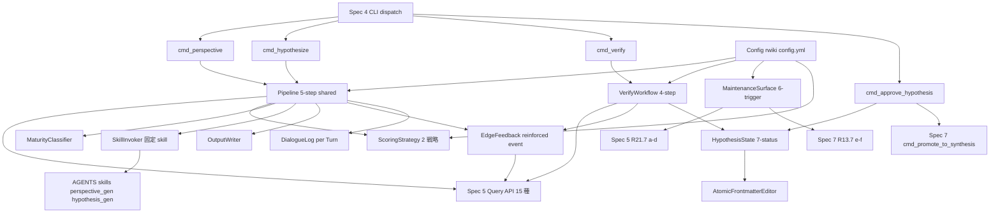
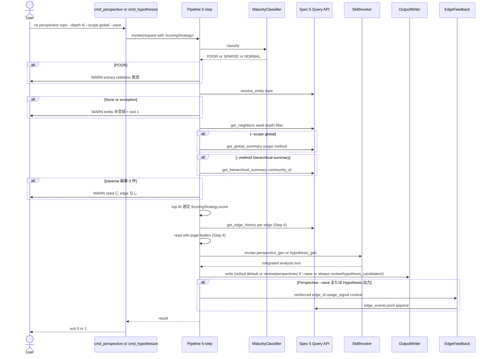
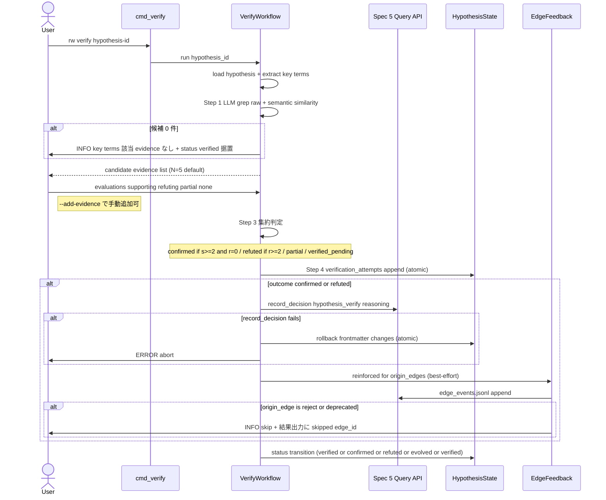
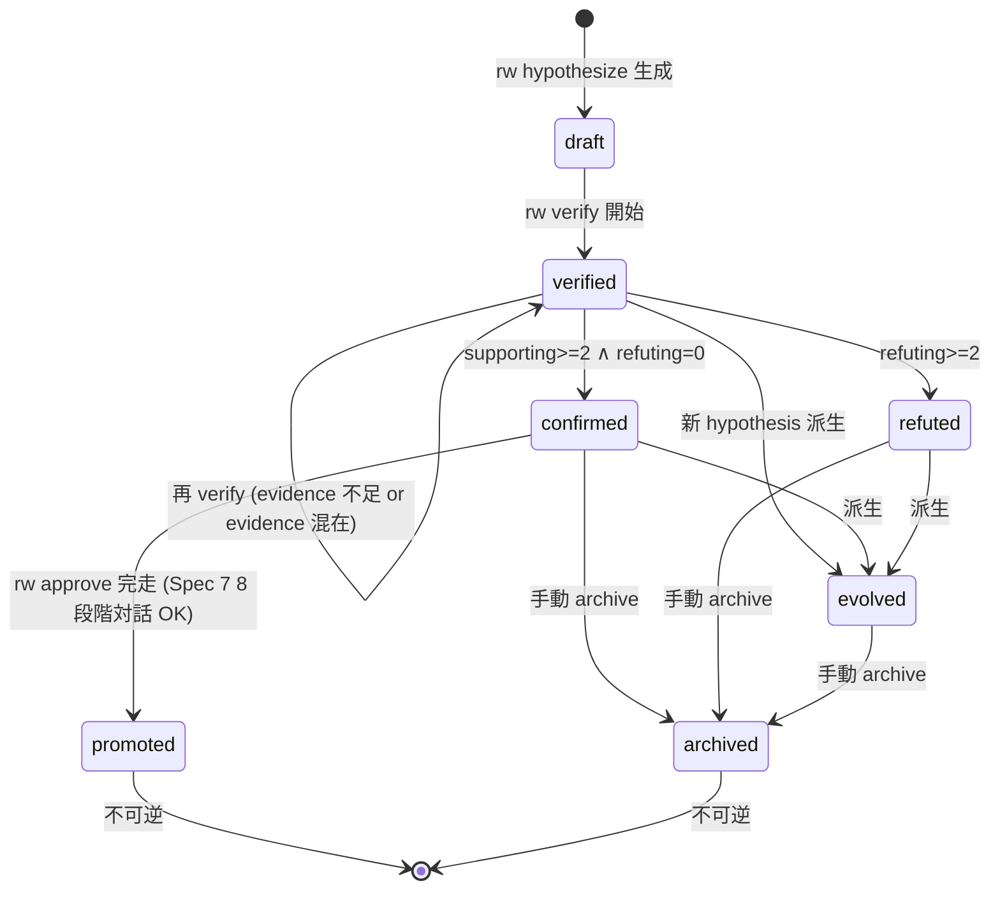

# Technical Design Document

## Overview

**Purpose**: 本 spec (Spec 6、Phase 5、Rwiki v2 MVP の最後の spec) は、Curated Knowledge Graph 上で Perspective (既存知識の再解釈) と Hypothesis (未検証の新命題) を生成し、半自動 Verify workflow と Confirmed の wiki 昇格 trigger を提供する。

**Users**: Rwiki v2 ユーザー (研究者・知識ワーカー・論文執筆者) が `rw perspective` / `rw hypothesize` / `rw verify` / `rw approve <hypothesis-id>` を通じて知識の深化と前進を行う。Spec 4 起票者は本 spec の 4 cmd handler を CLI dispatch から呼び出す。Spec 7 起票者は本 spec の `rw approve` から `cmd_promote_to_synthesis` 8 段階対話 handler を呼び出される。

**Impact**: rw CLI に 4 コマンド追加、`AGENTS/skills/` に 2 skill 追加 (Spec 2 配布、本 spec は invocation のみ)、`.rwiki/config.yml` に 4 セクション追加 (`graph.perspective.*` / `graph.hypothesis.*` / `graph.verify.*` / `chat.autonomous.maintenance_triggers.*`)、`raw/llm_logs/{chat-sessions,interactive}/` と `review/{perspectives,hypothesis_candidates}/` を出力先として確立。L2 Graph Ledger には Spec 5 経由で `reinforced` event を append (usage_signal フィードバック)、Hygiene Reinforcement に寄与。

### Goals

- Perspective 生成 (`rw perspective`) で stable + core edges を活用した既存知識の再解釈を user に surface
- Hypothesis 生成 (`rw hypothesize`) で missing bridges + candidate edges から evidence 検証可能な未検証命題を生成、必ずファイル化
- Verify workflow (`rw verify`) で human が evidence 個別評価、LLM が候補抽出 + 集約判定 (4 段階)
- Confirmed hypothesis を Spec 7 8 段階対話で `wiki/synthesis/` 昇格 (`rw approve <hypothesis-id>`)
- Maintenance autonomous trigger 6 種を session 内で能動的 surface (自動実行しない)
- L2 への usage_signal feedback (`reinforced` event + context attribute) で Spec 5 Hygiene Reinforcement に寄与

### Non-Goals

- L2 Graph Ledger 直接 read / write (Spec 5 Query API 15 種経由のみ、L2 物理 schema は Spec 5 所管)
- Skill 内容 (`perspective_gen.md` / `hypothesis_gen.md` の prompt 本文・Processing Rules・Failure Conditions は Spec 2 所管)
- Skill dispatch ロジック (本 spec は dispatch 対象外、固定 skill 名で直接呼出、Spec 3 Requirement 10 と整合)
- CLI dispatch frame (引数 parse / Hybrid 実行 / `--auto` ポリシー / 対話 confirm UI / exit code 制御 / Maintenance UX 表示は Spec 4 所管)
- Page lifecycle 状態遷移 / 8 段階対話 handler (`cmd_promote_to_synthesis` 等は Spec 7 所管)
- Maintenance trigger 計算実装 (a/b/c/d は Spec 5 R21.7、e/f は Spec 7 R13.7 所管)
- Frontmatter スキーマ宣言 (§5.9.1 Hypothesis / §5.9.2 Perspective は Foundation §5.9 / Spec 1 所管、本 spec は read/write 側)
- `rw discover` 独立 CLI (Phase 2 検討、MVP では R4 5 段階フロー + `--scope global` + `--method hierarchical-summary` + Community-aware traversal が代替)

## Boundary Commitments

### This Spec Owns

- 4 cmd_* handler ロジック (`cmd_perspective` / `cmd_hypothesize` / `cmd_verify` / `cmd_approve_hypothesis`、Requirements 1.1, 2.1, 8.1, 9.1)
- Spec 7 `cmd_promote_to_synthesis` 呼出時の `argparse.Namespace` construct + StageEvent / UserResponse event loop 駆動 (= 8 段階対話 generator 駆動責務、Spec 7 design L685 Adjacent Sync 経路履行、Round 8 P-1 + A-2 must_fix)
- 5 段階処理フロー (Step 1 seed → Step 2 traverse → Step 3 top-M → Step 4 read → Step 5 integrate+output+reinforcement) の orchestration (Requirement 4)
- 2 scoring strategy (Perspective `0.6c+0.3r+0.1n` / Hypothesis `0.5n+0.3c+0.2bp`) と config 注入 (Requirement 5)
- L2 Ledger 成熟度 fallback 判定 (極貧 / 疎 / 通常、Requirement 6)
- Hypothesis 7 状態管理と状態遷移ルール (Foundation R5 を本 spec が継承、Requirement 7)
- Verify workflow 半自動 4 段階 state machine (LLM 候補抽出 → user 評価 → LLM 集約判定 → 結果記録、Requirement 8)
- 固定 skill `perspective_gen` / `hypothesis_gen` の load 規約 (Spec 3 dispatch 対象外、Requirement 3)
- Maintenance autonomous trigger 6 種の surface logic (計算は Spec 5 / Spec 7 に委譲、本 spec は内容生成のみ、Requirement 10)
- Output 規律 (Perspective stdout default + `--save` で `review/perspectives/`、Hypothesis 必ず `review/hypothesis_candidates/`、Requirement 12.1-12.3)
- 対話ログ自動保存 (per Turn append、`raw/llm_logs/chat-sessions/` + `raw/llm_logs/interactive/<skill>/`、atomic 化、Requirement 12.4-12.5)
- L2 への `reinforced` event 送出 + context attribute 記録 (Spec 5 R10.1 11 種と整合、独自 event 名禁止、Requirement 12.6-12.7)
- Configuration スキーマ (`graph.perspective.*` / `graph.hypothesis.*` / `graph.verify.*` / `chat.autonomous.maintenance_triggers.*`、Requirement 13)
- Spec 5 Query API 15 種への依存契約 (Requirement 11)
- Coordination 責務分離の明文化 (Requirement 14)
- Foundation 規範への準拠 (13 中核原則のうち §2.1 / §2.8 / §2.9 / §2.10 / §2.11 / §2.12 / §2.13、Requirement 15)

### Out of Boundary

- L2 Graph Ledger 物理実装 (`edges.jsonl` / `evidence.jsonl` / `entities.yaml` / `edge_events.jsonl` / `decision_log.jsonl` / `rejected_edges.jsonl` / `reject_queue/` の data model、Query API 15 種実装、Hygiene 進化則、Confidence scoring、Edge lifecycle、Community detection、SQLite cache、Reject workflow、Decision log 物理) → **Spec 5**
- Skill prompt 本文・Processing Rules・Failure Conditions → **Spec 2**
- Skill dispatch ロジック (`--skill` → frontmatter `type:` → `categories.yml` → LLM 推論の 4 段階優先順位は distill 専用) → **Spec 3**
- CLI dispatch frame (引数 parse / Hybrid 実行 / 対話 confirm UI / `--auto` 制御 / exit code / Maintenance UX 表示 / `/dismiss` `/mute maintenance` 入力受付 / `--mode autonomous` toggle) → **Spec 4**
- Page lifecycle 操作・8 段階対話 handler (`cmd_promote_to_synthesis` / `cmd_deprecate` / `cmd_retract` / `cmd_archive`、警告 blockquote 自動挿入、Backlink 更新) → **Spec 7**
- Maintenance autonomous trigger 計算実装 (reject queue 件数 / decay edges / typed-edge 整備率 / dangling edge は Spec 5 R21.7、最終 audit 実行日時 / 未 approve synthesis 件数は Spec 7 R13.7) → **Spec 5 / Spec 7**
- Frontmatter スキーマ field 名・型・許可値の **宣言** → **Foundation §5.9 / Spec 1**
- L3 frontmatter `related:` cache の sync 実装 → **Spec 5** (`rw graph rebuild --sync-related` / Hygiene batch sync)
- `rw chat` autonomous mode の発火条件・閾値・頻度制限の表示 layer → **Spec 4** (信頼度 ≥ 7/10 / 3 発話に 1 回 / novelty 判定 / context sensing)
- Severity 4 水準 / exit code 0/1/2 分離 / LLM CLI subprocess timeout 必須 規約定義 → **Foundation R11 / roadmap.md「v1 から継承する技術決定」**
- `rw discover` 独立 CLI → **MVP 範囲外、Phase 2 検討事項** (drafts L1005 / L1094 と整合)

### Allowed Dependencies

- **Upstream consumed**:
  - Spec 5: Query API 15 種 (`get_neighbors` / `get_shortest_path` / `get_orphans` / `get_hubs` / `find_missing_bridges` / `get_communities` / `get_global_summary` / `get_hierarchical_summary` / `get_edge_history` / `normalize_frontmatter` / `resolve_entity` / `record_decision` / `get_decisions_for` / `search_decisions` / `find_contradictory_decisions`)、`edge_events.jsonl` への `reinforced` event append API、L2 診断 4 trigger
  - Spec 7: `cmd_promote_to_synthesis(args: argparse.Namespace) -> Generator[StageEvent, UserResponse, FinalResult]` 8 段階対話 handler (args fields = `candidate_path: Path` (必須) / `target_path: Optional[Path]` / `merge_strategy` / `target_field` / `replace`、Spec 7 design L667-675 整合、Round 8 P-1 + A-2 must_fix で signature 訂正)、L3 診断 5 項目のうち audit 未実行 (b) と未 approve synthesis (a)
  - Spec 4: CLI dispatch entry point から本 spec の cmd_* handler を呼出、subprocess timeout 受領、`--auto` ポリシー、対話 confirm UI、Maintenance UX 表示 layer、`/dismiss` `/mute maintenance` 入力受付
  - Spec 2: `AGENTS/skills/perspective_gen.md` / `AGENTS/skills/hypothesis_gen.md` 配布、skill lifecycle (install / deprecate / retract) 参加、interactive: true 規約、dialogue log frontmatter 5 必須 field schema
  - Spec 1: Hypothesis frontmatter §5.9.1 / Perspective frontmatter §5.9.2 の field 宣言、`type:` field vocabulary、`tags.yml`
  - Spec 0 (Foundation): 13 中核原則 / 3 層アーキテクチャ / Hypothesis status 7 種 / §5.9.1 / §5.9.2 / §2.13 Curation Provenance
- **共有 Infrastructure**:
  - `rw_utils` 系 (atomic_write / parse_frontmatter / 等の汎用 helper、v1 から継承)
  - `.rwiki/config.yml` (yaml config 読込)
  - LLM CLI subprocess (Spec 4 経由で起動、本 spec は callback 受領)
- **External**: なし (LLM 直接呼出は Spec 4 経由)

### Revalidation Triggers

- Spec 5 Query API 15 種の signature 変更 → 本 spec の利用箇所 (Pipeline / VerifyWorkflow / EdgeFeedback / MaintenanceSurface) を revalidate
- Spec 5 R10.1 event type 11 種の変更 (例: `reinforced` semantics 変更) → R8.6 / R12.6 / R12.7 revalidate
- Spec 7 `cmd_promote_to_synthesis` 8 段階対話 interface 変更 → R9 revalidate
- Foundation R5 Hypothesis status 7 種の変更 → R7 revalidate
- §5.9.1 Hypothesis frontmatter / §5.9.2 Perspective frontmatter スキーマ変更 → R12.2 / R12.3 / R2.8 revalidate
- v0.7.10 決定 6-1 (Spec 6 dispatch 対象外) 撤回 → R3 revalidate
- L2 Ledger 成熟度判定の閾値定義 (10 / 20% / 50%) 変更 → R6 revalidate
- record_decision API の reasoning 必須条件 (Spec 5 R11.6) 変更 → R8.7 / R9.5 revalidate

## Architecture

### Existing Architecture Analysis

本 spec は v2 新規追加 (v1 に Perspective / Hypothesis 概念なし)。v1 module DAG (`rw_config` / `rw_utils` / `rw_prompt_engine` / `rw_audit` / `rw_query` / `rw_cli` の 6 モジュール DAG 分割) を継承し、本 spec で 10 モジュールを追加。修飾参照規律 (`import rw_<module>; rw_<module>.symbol(...)`、`from rw_<module> import <symbol>` 禁止) を維持 (Spec 0 design.md / structure.md L189-190 整合)。

L2 access は Spec 5 Query API 経由のみ (R11.1)。本 spec は Spec 5 Client (Spec 5 が提供する client 層) を import して呼出すが、Spec 5 内部実装には依存しない (signature と返り値 schema 契約のみ依存、R11.4)。

### Architecture Pattern & Boundary Map



**Architecture Integration**:
- Selected pattern: Layered architecture (v1 module DAG 継承、依存方向 = Types → Config → Spec5Client → DomainComponents → Handlers → CLI)
- Domain/feature boundaries: 8 domain (A: CLI Handlers / B: Pipeline / C: State Management / D: Verify Workflow / E: Maintenance Surface / F: Skill Invocation / G: Output & Logging / H: Configuration)
- Existing patterns preserved: 修飾参照規律、Severity 4、exit code 0/1/2、subprocess timeout 必須 (Foundation R11)
- New components rationale: 4 cmd handler + 共通 5-step Pipeline + 2 ScoringStrategy + HypothesisState 7 status machine + VerifyWorkflow 4-step + MaintenanceSurface 6 trigger + SkillInvoker fixed-load + OutputWriter + DialogueLog + EdgeFeedback (`reinforced` event) + Config
- Steering compliance: Foundation 13 中核原則のうち §2.1 Paradigm C / §2.8 Skill library / §2.9 Graph as first-class / §2.10 Evidence chain / §2.11 Discovery primary / Maintenance LLM guide / §2.12 Evidence-backed Candidate Graph / §2.13 Curation Provenance を設計前提とし、tech.md「v1 から継承する技術決定」を継承 (Requirement 15.9)

### Dependency Direction

```
rw_perspective_types        (共通 dataclass)
   ↓
rw_perspective_config       (yaml loader)
   ↓
Spec 5 Client (external, import で参照)
   ↓
rw_skill_invoker / rw_dialogue_log / rw_perspective_pipeline (scoring / maturity 含む)
   ↓
rw_hypothesis_state / rw_verify_workflow / rw_maintenance_surface
   ↓
rw_perspective.py / rw_verify.py (cmd_* handler)
   ↓
Spec 4 CLI dispatch (external)
```

各層は左 (上流) のみ import、右 (下流) を import しない (層違反は実装段階で flake8 / 静的解析で検出)。

### Technology Stack

| Layer | Choice / Version | Role | Notes |
|-------|------------------|------|-------|
| CLI Handler | Python 3.10+ 型ヒント完全 | `cmd_perspective` / `cmd_hypothesize` / `cmd_verify` / `cmd_approve_hypothesis` | 修飾参照規約、subprocess timeout 必須 |
| Pipeline / State / Workflow | Python 3.10+ | 5-step pipeline + 4-step verify + 7-status state machine | 標準ライブラリのみ + `pyyaml` |
| Skill | Markdown 8 section + frontmatter 11 field | `AGENTS/skills/perspective_gen.md` / `AGENTS/skills/hypothesis_gen.md` | Spec 2 配布、本 spec は invoke のみ |
| Config | YAML (`pyyaml`) | `.rwiki/config.yml` | 起動毎に再読込 (cache せず、R13.7) |
| Data Output | Markdown + frontmatter | `review/perspectives/<slug>-<ts>.md` / `review/hypothesis_candidates/<slug>-<ts>.md` | atomic write-to-tmp → rename |
| Logging | Markdown per Turn append | `raw/llm_logs/chat-sessions/chat-<ts>.md` / `raw/llm_logs/interactive/interactive-<skill>-<ts>.md` | atomic per Turn append |
| Spec 5 client | Python module import (Spec 5 配布) | Query API 15 種 + record_decision + edge event append | signature 契約のみ依存 |
| LLM Subprocess | Spec 4 経由 | timeout 必須 (継承) | 直接 subprocess 起動しない |

## File Structure Plan

### Directory Structure

```
scripts/
├── rw_perspective_types.py       # 共通 dataclass: Hypothesis / Perspective / Evidence / MaturityLevel / HypothesisStatus / ScoringWeights / ScoringContext / MaintenanceTrigger / ReinforcedEventContext / ReinforcedEvent / VerificationAttempt / VerifyResult / PipelineInvokeRequest / PipelineInvokeResult
├── rw_perspective_config.py      # Config component + 4 dataclass (PerspectiveConfig / HypothesisConfig / VerifyConfig / MaintenanceConfig)
├── rw_perspective_pipeline.py    # Pipeline + ScoringStrategy (interface) + PerspectiveScoringStrategy + HypothesisScoringStrategy + MaturityClassifier + OutputWriter
├── rw_hypothesis_state.py        # HypothesisState (ALLOWED_TRANSITIONS + transition + verification_attempts append + successor_wiki record + rollback) + AtomicFrontmatterEditor
├── rw_verify_workflow.py         # VerifyWorkflow + EvidenceCollector
├── rw_skill_invoker.py           # SkillInvoker (固定 skill loader for perspective_gen / hypothesis_gen)
├── rw_maintenance_surface.py     # MaintenanceSurface (6 trigger surface, Spec 5 R21.7 a-d + Spec 7 R13.7 e-f 経由)
├── rw_dialogue_log.py            # DialogueLog (per Turn append, atomic, chat-sessions/ + interactive/<skill>/)
├── rw_edge_feedback.py           # EdgeFeedback (`reinforced` event + context attribute, Spec 5 R10.1 11 種整合)
├── rw_perspective.py             # CmdPerspectiveHandler (cmd_perspective) + CmdHypothesizeHandler (cmd_hypothesize)
└── rw_verify.py                  # CmdVerifyHandler (cmd_verify) + CmdApproveHypothesisHandler (cmd_approve_hypothesis)
```

各 module は **≤ 1500 行** target (v1 module-split 規律継承、roadmap.md L147)。本 spec の 11 module 全体で約 2800-3800 行を見込む。

### Component → File Mapping (no orphan components 保証)

| Component | File | Domain |
|-----------|------|--------|
| CmdPerspectiveHandler / CmdHypothesizeHandler | `rw_perspective.py` | A |
| CmdVerifyHandler / CmdApproveHypothesisHandler | `rw_verify.py` | A |
| Pipeline | `rw_perspective_pipeline.py` | B |
| ScoringStrategy / PerspectiveScoringStrategy / HypothesisScoringStrategy | `rw_perspective_pipeline.py` | B |
| MaturityClassifier | `rw_perspective_pipeline.py` | B |
| OutputWriter | `rw_perspective_pipeline.py` | G (Step 5 出力で Pipeline と凝集性高) |
| HypothesisState | `rw_hypothesis_state.py` | C |
| AtomicFrontmatterEditor | `rw_hypothesis_state.py` (主 user) | C |
| VerifyWorkflow | `rw_verify_workflow.py` | D |
| EvidenceCollector | `rw_verify_workflow.py` | D |
| MaintenanceSurface | `rw_maintenance_surface.py` | E |
| SkillInvoker | `rw_skill_invoker.py` | F |
| DialogueLog | `rw_dialogue_log.py` | G |
| EdgeFeedback | `rw_edge_feedback.py` | G (Pipeline + VerifyWorkflow 両方から呼出される共有 component のため独立 module) |
| Config | `rw_perspective_config.py` | H |

### Modified Files

- `scripts/rw_cli.py` — **Spec 4 所管**、本 spec の `cmd_*` handler を Spec 4 dispatch entry point から呼出 (本 spec は handler 関数を提供する側、CLI dispatch frame には介入しない)
- `scripts/rw_utils.py` — 共通 `atomic_write(path, content)` helper を追加 (4 対象 atomic 更新、R12.8)。既存 `parse_frontmatter` / `git_commit` 等は流用

### Skill Files (Spec 2 配布、本 spec は invocation のみ)

- `AGENTS/skills/perspective_gen.md` — Spec 2 が 8 section + frontmatter 11 field で配布、本 spec は固定 skill 名で load (R3.1)
- `AGENTS/skills/hypothesis_gen.md` — 同上、R3.2

### Output Directories (本 spec が write 先として使用、Foundation §5.9 / Spec 1 が directory 規約所管)

- `review/perspectives/<slug>-<ts>.md` — Perspective `--save` 時 (R12.2)
- `review/hypothesis_candidates/<slug>-<ts>.md` — Hypothesis 必ずファイル化 (R12.3)
- `raw/llm_logs/chat-sessions/chat-<ts>.md` — `rw chat` セッションログ (R12.4)
- `raw/llm_logs/interactive/interactive-<skill>-<ts>.md` — interactive_synthesis 等の対話 skill ログ (R12.5)

### Test Files

```
tests/
├── test_rw_perspective_types.py        # dataclass 検証
├── test_rw_perspective_config.py       # config loader + default 値 + scoring weights 合計検証 (R13.6, R13.8)
├── test_rw_perspective_pipeline.py     # Pipeline + 2 scoring strategy + MaturityClassifier + OutputWriter
├── test_rw_hypothesis_state.py         # HypothesisState ALLOWED_TRANSITIONS + AtomicFrontmatterEditor
├── test_rw_verify_workflow.py          # VerifyWorkflow + EvidenceCollector + record_decision 失敗 rollback (R8.7)
├── test_rw_skill_invoker.py            # SkillInvoker 固定 load + 不在時 ERROR (R3.5)
├── test_rw_maintenance_surface.py      # MaintenanceSurface 6 trigger (Spec 5 / Spec 7 mock)
├── test_rw_dialogue_log.py             # DialogueLog per Turn append + atomic
├── test_rw_edge_feedback.py            # EdgeFeedback `reinforced` event + context attribute + reject/deprecated skip (R12.7)
├── test_rw_perspective_cmds.py         # cmd_perspective + cmd_hypothesize integration
└── test_rw_verify_cmds.py              # cmd_verify + cmd_approve_hypothesis integration (Spec 7 mock)
```

## System Flows

### Flow 1: 5-step Pipeline (Perspective / Hypothesize 共通、Requirement 4)



**Key Decisions**:
- Step 1 `resolve_entity` 失敗時は **WARN + exit 1** で停止 (Step 2 以降に進まない、R4.1)
- Step 2 結果空集合は **WARN + halt signal** (R4.8) = Pipeline は `should_halt: true` を `PipelineInvokeResult` に set、継続/中止判断は呼出元 cmd handler (cmd_perspective / cmd_hypothesize) で exit 1。ledger 極貧時は R6.2 と併発 (R6.6)。Pipeline 自身は exit を返さず interface 経由で signal 伝達 (Round 2 案 2 統合修正、責務境界明文化)
- Step 5 reinforcement は Perspective `--save` 時のみ + Hypothesis 出力時 (R12.6)、Hypothesis verify confirmed/refuted 時は別 Flow (Flow 2 Step 4)
- usage_signal 種別は Direct / Support / Retrieval / Co-activation の 4 種から選択 (R4.6)、`reinforced` event の context attribute として記録 (R12.6 / R12.7)

### Flow 2: Verify Workflow 4-step (Requirement 8)



**Key Decisions**:
- Step 1 evidence 候補 0 件は **INFO + status verified 据置** (R8.11、user に手動追加または raw ingest を促す)
- Step 4 record_decision 失敗時は **ERROR abort + atomic rollback** (R8.7、verification_attempts append + status 遷移を取消)
- record_decision の `decision_type` payload は `hypothesis_verify` 単一型 (= Spec 5 R11.2 23 種列挙中 Hypothesis 起源 1 種、Spec 5 design L1097 整合、R8.7 文言確定済、Round 8 P-2 must_fix で defer 削除)。Spec 5 R11.6 の `hypothesis_verify_confirmed` / `hypothesis_verify_refuted` は **decision_type 値域ではなく `reasoning_input.require_for` の condition keys** (= outcome 値が confirmed / refuted のとき reasoning skip 不可、別軸 validation rule、Spec 5 design L1111 / L1864 整合)。本 spec impl では `decision_type='hypothesis_verify'` 固定で record_decision API 呼出、reasoning は outcome=confirmed | refuted 時に必須入力 (chat session auto-generate or `--reason` flag)、default skip は不可 (Spec 5 R11.6 整合)
- origin_edges の edge が reject / deprecated 状態は **INFO skip + skip 理由を verify 結果出力に記録** (R12.7)
- delta 値: confirmed 時 = `supporting_evidence_reinforcement_delta` (default +0.28、Spec 5 Hygiene)、refuted 時 = 別 delta (design phase で Spec 5 と coordination、暫定方針として Spec 5 config に `refuting_evidence_reinforcement_delta` 新設要請、本 spec は呼出のみ)

### Flow 3: Hypothesis 7-status State Machine (Requirement 7)



**Key Decisions**:
- 状態遷移は frontmatter 編集のみで表現 (R7.8)、ディレクトリ移動なし
- 物理削除しない (R7.7)、`promoted` / `refuted` / `archived` も履歴として保持 (Foundation §1.3.5「失敗からも学ぶ」)
- Page status 5 種 / Edge status 6 種と独立した第 3 軸 (R7.9)、混同しない
- 状態定義の意味は Foundation R5 / §5.9.1 SSoT を参照、本 spec は ALLOWED_TRANSITIONS のみ所管

## Requirements Traceability

| Requirement | Summary | Components | Interfaces / Methods | Flows |
|-------------|---------|-----------|----------------------|-------|
| 1 (1.1, 1.2, 1.3, 1.4, 1.5, 1.6, 1.7, 1.8, 1.9, 1.10) | `rw perspective <topic>` 生成ロジック | CmdPerspectiveHandler / Pipeline / PerspectiveScoringStrategy / OutputWriter / EdgeFeedback | `cmd_perspective(topic, depth, scope, method, save)` / `Pipeline.invoke(request)` | Flow 1 |
| 2 (2.1, 2.2, 2.3, 2.4, 2.5, 2.6, 2.7, 2.8, 2.9, 2.10) | `rw hypothesize <topic>` 生成ロジック | CmdHypothesizeHandler / Pipeline / HypothesisScoringStrategy / OutputWriter | `cmd_hypothesize(topic, depth, scope, method)` | Flow 1 |
| 3 (3.1, 3.2, 3.3, 3.4, 3.5, 3.6, 3.7) | 固定 skill load + Spec 3 dispatch 対象外 | SkillInvoker | `SkillInvoker.load_fixed(skill_name)` | (in Flow 1 Step 5) |
| 4 (4.1, 4.2, 4.3, 4.4, 4.5, 4.6, 4.7, 4.8) | 5 段階処理フロー | Pipeline | `Pipeline.invoke(request) -> PipelineInvokeResult` | Flow 1 |
| 5 (5.1, 5.2, 5.3, 5.4, 5.5, 5.6, 5.7) | 候補選定 scoring 2 系統 | PerspectiveScoringStrategy / HypothesisScoringStrategy | `ScoringStrategy.score(candidate, ctx) -> float` | (in Flow 1 Step 3) |
| 6 (6.1, 6.2, 6.3, 6.4, 6.5, 6.6, 6.7) | L2 Ledger 成熟度 fallback | MaturityClassifier | `MaturityClassifier.classify() -> MaturityLevel` | (in Flow 1 pre-Step 1) |
| 7 (7.1, 7.2, 7.3, 7.4, 7.5, 7.6, 7.7, 7.8, 7.9) | Hypothesis 7 状態管理 | HypothesisState / AtomicFrontmatterEditor | `HypothesisState.transition(hyp_id, from, to)` | Flow 3 |
| 8 (8.1, 8.2, 8.3, 8.4, 8.5, 8.6, 8.7, 8.8, 8.9, 8.10, 8.11) | Verify workflow 半自動 4 段階 | VerifyWorkflow / EvidenceCollector / EdgeFeedback / HypothesisState | `VerifyWorkflow.run(hypothesis_id) -> VerifyResult` | Flow 2 |
| 9 (9.1, 9.2, 9.3, 9.4, 9.5, 9.6, 9.7, 9.8, 9.9) | `rw approve` + wiki 昇格 trigger | CmdApproveHypothesisHandler / HypothesisState / Spec7HandlerCaller | `cmd_approve_hypothesis(hypothesis_id)` | (calls Spec 7) |
| 10 (10.1, 10.2, 10.3, 10.4, 10.5, 10.6, 10.7, 10.8, 10.9, 10.10) | Maintenance autonomous trigger 6 種 surface | MaintenanceSurface | `MaintenanceSurface.evaluate() -> list[Trigger]` | (autonomous mode) |
| 11 (11.1, 11.2, 11.3, 11.4, 11.5, 11.6, 11.7, 11.8) | Spec 5 Query API 15 種への依存契約 | (全 Spec 5 consumer component) | (各 component の Spec 5 API 呼出) | (各 Flow) |
| 12 (12.1, 12.2, 12.3, 12.4, 12.5, 12.6, 12.7, 12.8, 12.9) | 出力先 / 対話ログ / L2 feedback | OutputWriter / DialogueLog / EdgeFeedback / AtomicFrontmatterEditor | `OutputWriter.write_*()` / `DialogueLog.append_turn()` / `EdgeFeedback.reinforced(edge_id, signal, context)` | Flow 1 / Flow 2 |
| 13 (13.1, 13.2, 13.3, 13.4, 13.5, 13.6, 13.7, 13.8) | Configuration | Config | `Config.load()` / `Config.get_perspective() / get_hypothesis() / get_verify() / get_maintenance()` | (起動時) |
| 14 (14.1, 14.2, 14.3, 14.4, 14.5, 14.6, 14.7) | Coordination 責務分離 | (全 component、Boundary Commitments) | (本 design 全体) | — |
| 15 (15.1, 15.2, 15.3, 15.4, 15.5, 15.6, 15.7, 15.8, 15.9, 15.10, 15.11, 15.12) | Foundation 規範準拠 + 文書品質 | (全 component、design 全体規律) | (本 design 全体) | — |

## Components and Interfaces

### Domain A: CLI Handlers

#### CmdPerspectiveHandler

| Field | Detail |
|-------|--------|
| Intent | `rw perspective <topic>` 内部 handler (Spec 4 dispatch から呼出) |
| Requirements | 1.1, 1.2, 1.3, 1.4, 1.5, 1.6, 1.7, 1.8, 1.9, 1.10 |

**Responsibilities**:
- 引数受領 (`topic` / `--depth N` / `--scope local|global` / `--method standard|hierarchical-summary` / `--save`) を Pipeline 呼出 request に変換
- Pipeline.invoke() の戻り値を stdout (default) / `review/perspectives/<slug>-<ts>.md` (`--save` 時) に出力
- WARN / INFO / ERROR を Spec 4 経由で stderr に伝播
- subprocess timeout 必須 (R3.7、Foundation R11 継承)

**Dependencies**:
- Outbound: Pipeline (P0), OutputWriter (P0), Config (P0)
- External: Spec 4 dispatch 経由で起動 (Inbound)

**Contracts**: Service [✓]

```python
def cmd_perspective(
    topic: str,
    depth: int = 2,
    scope: str = 'local',          # 'local' | 'global'
    method: str = 'standard',      # 'standard' | 'hierarchical-summary'
    save: bool = False,
) -> int:
    """
    Returns:
        exit_code: 0 (success) | 1 (runtime error) | 2 (FAIL detection, 本 cmd では未使用)
    """
```

- Preconditions: `.rwiki/config.yml` が読める (Config.load() 成功)、`AGENTS/skills/perspective_gen.md` が存在
- Postconditions: stdout に Perspective 出力、`--save` 時は `review/perspectives/<slug>-<ts>.md` に atomic write、`reinforced` event を `traversed_edges` 各 edge_id に append (R1.8)
- Invariants: subprocess timeout 必須 (R3.7)、L2 ledger 直接 read/write しない (R11.1)

**Implementation Notes**:
- Integration: Spec 4 dispatch から呼出、Spec 4 が引数 parse 完了後に渡す
- Validation: topic は空文字禁止 (Spec 4 で validate、本 handler は信頼)
- Risks: Pipeline.invoke 内の Spec 5 API 性能依存、極貧 ledger では Pipeline.MaturityClassifier が WARN を発する (R6.2)

#### CmdHypothesizeHandler

| Field | Detail |
|-------|--------|
| Intent | `rw hypothesize <topic>` 内部 handler |
| Requirements | 2.1, 2.2, 2.3, 2.4, 2.5, 2.6, 2.7, 2.8, 2.9, 2.10 |

**Responsibilities**:
- 引数受領 (`topic` / `--depth N` 等) を Pipeline 呼出 request に変換
- Pipeline.invoke() の戻り値を **必ず** `review/hypothesis_candidates/<slug>-<ts>.md` にファイル化 (R2.5、R12.3、stdout のみ禁止)
- frontmatter §5.9.1 必須 field を埋める (R2.8)
- Hypothesis ID (slug) を `hyp-<short-hash-or-topic-slug>` 形式で生成 (R2.9)

**Contracts**: Service [✓]

```python
def cmd_hypothesize(
    topic: str,
    depth: int = 2,
    scope: str = 'local',
    method: str = 'standard',
) -> int:
    """
    Returns: exit_code 0 | 1
    Side effects:
        - review/hypothesis_candidates/<slug>-<ts>.md (atomic write)
        - traversed_edges に reinforced event append (R12.6)
    """
```

#### CmdVerifyHandler

| Field | Detail |
|-------|--------|
| Intent | `rw verify <hypothesis-id>` 内部 handler |
| Requirements | 8.1, 8.10 (handler レベル、本体は VerifyWorkflow) |

**Responsibilities**:
- hypothesis_id を VerifyWorkflow.run() に渡す
- VerifyResult を user に summary 出力 (Spec 4 経由)
- subprocess timeout 必須 (R8.10)

**Contracts**: Service [✓]

```python
def cmd_verify(hypothesis_id: str, add_evidence: list[str] = None, force_status: str = None, reason: str = None) -> int:
    """
    Returns: exit_code 0 | 1 | 2
    """
```

#### CmdApproveHypothesisHandler

| Field | Detail |
|-------|--------|
| Intent | `rw approve <hypothesis-id>` 内部 handler、Spec 7 8 段階対話 trigger |
| Requirements | 9.1, 9.2, 9.3, 9.4, 9.5, 9.6, 9.7, 9.8, 9.9 |

**Responsibilities**:
- hypothesis status の `confirmed` 事前 check (R9.1)、それ以外は ERROR + exit 2 (R9.2)
- Spec 7 `cmd_promote_to_synthesis(args)` 呼出 (= 本 handler で `argparse.Namespace` を construct し StageEvent / UserResponse event loop を駆動、R9.3 + Spec 7 design L685 Adjacent Sync 経路履行、Round 8 P-1 must_fix)
- 完走時 status `confirmed → promoted` 遷移 + `successor_wiki:` 記録 (R9.4)
- record_decision 失敗時の atomic rollback (R9.5)
- user 中断時 status 据置 (R9.7)
- `--auto` 不可 (R9.8、Spec 7 R6.4 整合)

**3 操作実行順序 + rollback boundary** (Round 4 A-2 訂正、VerifyWorkflow Step 4 と同 pattern で記述粒度統一):
- 操作順序: (1) Spec 7 `cmd_promote_to_synthesis(args)` 呼出 (= 本 handler で `args = argparse.Namespace(candidate_path=Path(f"review/hypothesis_candidates/{hypothesis_id}.md"), target_path=user_provided_target, merge_strategy=None, target_field=None, replace=False)` を construct し `gen = spec7.cmd_promote_to_synthesis(args)` で Generator 取得、StageEvent yield - UserResponse send loop を本 handler が駆動 = 8 段階対話 event loop 駆動責務、最終 `FinalResult.exit_code == 0` を完走判定 = synthesis page 物理 write 完了、Round 8 P-1 must_fix で adapter logic 明示) → (2) hypothesis frontmatter `status: confirmed → promoted` 遷移 + `successor_wiki:` 記録 (= 本 spec 内 frontmatter atomic update) → (3) `record_decision(decision_type=synthesis_approve, reasoning required)` (= Spec 5 Decision Log append) を sequential 実行
- Failure handling boundary:
  - 操作 (1) 失敗 → exit 2 (= Spec 7 失敗時、状態遷移なし、本 handler は何も rollback 不要)
  - 操作 (2) 失敗 → 操作 (1) で生成した synthesis page を削除し rollback、exit 1 (= Spec 7 cmd_promote 完了済の物理 file が orphan 化しないように atomic 巻戻し)
  - 操作 (3) 失敗 (R9.5 atomic rollback 規定) → 操作 (2) frontmatter status を `promoted → confirmed` に巻戻し + `successor_wiki:` field 削除 + 操作 (1) synthesis page 削除、exit 1 = double-rollback 必須 (= Decision Log なしの promoted 状態を回避、R9.5 整合)

**Contracts**: Service [✓]

```python
def cmd_approve_hypothesis(hypothesis_id: str, reason: str = None) -> int:
    """
    Returns: exit_code 0 | 1 | 2
    Preconditions: hypothesis_id の status == 'confirmed'
    Postconditions on success:
        - Spec 7 cmd_promote_to_synthesis 完走
        - hypothesis frontmatter status = 'promoted'
        - hypothesis frontmatter successor_wiki = 'wiki/synthesis/<slug>.md'
        - record_decision (decision_type=synthesis_approve, reasoning required)
    Note (Round 4 P-2 = cross-spec record_decision double-call 防止):
        本 handler は内部で record_decision (decision_type=synthesis_approve) を呼出 (R9.5)。
        Spec 4 `rw approve <hypothesis-id>` (id 形式) は Spec 4 design dispatch table で
        本 handler 呼出のみ規定 (= Spec 4 R15.10 auto-call 対象外)。
        path 形式 `rw approve <path>` は Spec 4 が auto-call、本 handler は経由しない。
        double-call 防止は Spec 4 dispatch table 設計 (id 形式 → 本 handler / path 形式 → auto-call) に依存。
    """
```

### Domain B: 5-step Pipeline

#### Pipeline (5-step shared pipeline)

| Field | Detail |
|-------|--------|
| Intent | Perspective / Hypothesize 共通の 5 段階処理 orchestration |
| Requirements | 4.1, 4.2, 4.3, 4.4, 4.5, 4.6, 4.7, 4.8 |

**Responsibilities & Constraints**:
- Step 1: `Spec5Client.resolve_entity(topic)` 呼出、None / 例外なら WARN + exit 1 (R4.1)
- Step 2: `Spec5Client.get_neighbors(seed, depth, filter)` 呼出 (depth default=2、R1.4 / R2.x、filter は R1.2 / R2.2 で渡す)
- Step 3: ScoringStrategy.score() で top-M 選定 (default M=20、R5.5)
- Step 4: 選択 page body Read + `Spec5Client.get_edge_history(edge_id)` で evidence 参照
- Step 5: SkillInvoker.invoke() + OutputWriter.write() + EdgeFeedback.reinforced() (= per-edge dispatch、Round 4 P-3 + A-1 訂正で usage_signal 種別判定 owner + edge_id 抽出 owner 明示):
  - (5a) Pipeline が SkillInvoker.invoke() の `str` 出力を parse して **引用 edge_id 集合** (= answer 本文中で edge_id を言及 / 出典として明示参照したもの) と **本文読込済 edge_id 集合** (= Step 4 で page body Read した top-M 内 edge) を抽出 = **抽出責務 owner = Pipeline** (R4.6 mapping 適用に必須の入力情報)
  - (5b) Pipeline が `traversed_edges` 全件に対し EdgeFeedback Responsibilities の per-edge mapping 規則 (Direct / Support / Retrieval / Co-activation 4 種、design L908-911) を適用して各 edge の `usage_signal` 種別を確定 = **mapping 規則の定義 owner = EdgeFeedback、適用 owner = Pipeline** (per-edge 1 件単位で `ReinforcedEventContext.usage_signal` を pre-populate)
  - (5c) Pipeline が edge ごとに `EdgeFeedback.reinforced(edge_id, ctx)` を呼出 (`ctx.usage_signal` 設定済)、EdgeFeedback は ctx を Spec 5 経由で edge_events.jsonl に append (= edge reject/deprecated は skip + warnings 記録、design L912-915 既定)
- Step 失敗時は ERROR + exit 1 (R4.7)
- Step 2 結果空集合は WARN + `should_halt: true` set (R4.8)、継続/中止判断は呼出元 cmd handler (Round 2 案 2 整合)

**Dependencies**:
- Outbound: Spec5Client (P0), ScoringStrategy (P0), SkillInvoker (P0), OutputWriter (P0), EdgeFeedback (P0), MaturityClassifier (P1), DialogueLog (P1), Config (P0)

**Contracts**: Service [✓]

```python
@dataclass
class PipelineInvokeRequest:
    topic: str
    depth: int = 2
    scope: str = 'local'           # 'local' | 'global'
    method: str = 'standard'       # 'standard' | 'hierarchical-summary'
    output_kind: str = 'perspective'   # 'perspective' | 'hypothesis'
    scoring: ScoringStrategy
    filter: CommonFilter           # Spec 5 dataclass
    save: bool = False             # Perspective only

@dataclass
class PipelineInvokeResult:
    output_text: str
    saved_path: Optional[Path]
    traversed_edges: list[str]                  # Step 2 で取得した全 edge_id (top-M 内外を含む traverse 集合全件)
    reinforced_events: list[ReinforcedEvent]    # Round 3 A-7 should_fix = append 成功 event のみ (Spec 5 への append が完了し event_id を取得した event のみ含む、logging / reporting 用)。caller (cmd handler) は再処理する責務なし。skipped event (= edge reject/deprecated 等で skip された event) は含まず、warnings list に「skipped: <edge_id> (<reason>)」として記録
    warnings: list[str]
    info: list[str]
    should_halt: bool  # Round 2 案 2 = R4.8 等で「継続不可」signal を呼出元 cmd handler に伝達、Pipeline 自身は exit を返さず caller が exit 1 判断

def invoke(request: PipelineInvokeRequest) -> PipelineInvokeResult: ...
```

**Implementation Notes**:
- Integration: Pipeline は cmd_perspective / cmd_hypothesize から呼出、scoring / output_kind 注入で両 cmd 共通化
- Validation: filter は Spec 5 CommonFilter を直接渡す (本 spec で別 schema 定義しない、R11.4)
- Risks: Step 5 SkillInvoker subprocess 失敗時 ERROR、record_decision は本 Pipeline では呼出しない (Verify / Approve のみ呼出、R8.7 / R9.5)

#### MaturityClassifier

| Field | Detail |
|-------|--------|
| Intent | L2 Ledger 成熟度判定 (R6) |
| Requirements | 6.1, 6.2, 6.3, 6.4, 6.5, 6.6, 6.7 |

**Responsibilities**:
- Spec5Client から件数取得 (stable / core / total edges)
- 極貧 (stable+core < 10) / 疎 (stable 比率 < 20%) / 通常 (stable+core > 50%) を判定 (R6.1、AC text「50% 超」整合 = 厳密 strict greater-than)
- 起動毎に再計算、cache せず (R6.7)
- 閾値 (10 / 0.20 / 0.50) は config 注入 (R6.5)

**Contracts**: Service [✓]

```python
class MaturityLevel(Enum):
    POOR = 'poor'
    SPARSE = 'sparse'
    NORMAL = 'normal'

def classify() -> MaturityLevel: ...
```

#### ScoringStrategy (interface) + 2 concrete

| Field | Detail |
|-------|--------|
| Intent | Perspective / Hypothesis 別系統 scoring |
| Requirements | 5.1, 5.2, 5.3, 5.4, 5.5, 5.6, 5.7 |

**Responsibilities**:
- PerspectiveScoringStrategy: `0.6 × confidence + 0.3 × recency + 0.1 × novelty` (R5.1)
- HypothesisScoringStrategy: `0.5 × novelty + 0.3 × confidence + 0.2 × bridge_potential` (R5.2)
- 各要素計算は ScoringContext (Spec5Client 経由で取得) を受領 (R5.3)
- **4 element 別の Spec 5 API mapping (Round 3 P-2 should_fix、R5.7 整合)**:
  - `confidence`: `Edge.confidence` 直接参照 (no API call)
  - `recency`: `Spec5Client.get_edge_history(edge_id)` の最新 event timestamp + `exp(-days_since_last_event / half_life_days)` decay
  - `novelty`: MVP では `Spec5Client.get_edge_history(edge_id)` event[].raw_source 集計で近似実装 (= `unique_raw_source_count / total_event_count` を novelty proxy、edge 履歴の raw 源泉多様性で novelty 表現、Round 8 P-4 should_fix で MVP-first 整合確定)。Phase 2 で運用顕在化時 (= novelty score 予測精度が運用上不足) に Spec 5 への新 API (`edges_derived_from_same_raw_count` 等) 追加要請を検討。novelty 重 0.1 (Perspective) / 0.5 (Hypothesis) で contribution 大幅劣化なし、近似でも MVP 機能成立
  - `bridge_potential` (Hypothesis のみ): `Spec5Client.find_missing_bridges(cluster_a, cluster_b, top_n)` (cluster 特定手順は HypothesisScoringStrategy Implementation Notes 参照)
- 係数値・top_m・depth は config 注入 (R5.4 / R13)
- config 欠落時は default + INFO 通知 (R5.6 / R13.6)
- 合計値 ≠ 1.0 は WARN + 継続 (R13.8)

**Contracts**: Service [✓]

```python
class ScoringStrategy(Protocol):
    def score(self, candidate: Edge, ctx: ScoringContext) -> float: ...

@dataclass
class ScoringContext:
    spec5_client: Spec5Client
    half_life_days: float = 30.0   # recency 計算用 (Spec5Client.get_edge_history 経由)
    # novelty: MVP は近似実装 = get_edge_history event[].raw_source 集計で unique_raw_source_count / total_event_count を proxy (Round 8 P-4)、Phase 2 で Spec 5 拡張検討
    # bridge_potential (Hypothesis のみ): Spec5Client.find_missing_bridges 経由 (cluster 特定手順は HypothesisScoringStrategy Implementation Notes)
    pre_fetched_communities: Optional[dict[str, str]] = None  # node_id → community_id, A-6 案 = batch fetch で get_communities call 削減 (option、None なら per-edge fetch)
```

**Implementation Notes (HypothesisScoringStrategy bridge_potential 計算手順、Round 3 A-6 must_fix、R2.4 / R5.2 / R5.3 / R14.1 整合、Round 8 P-5 must_fix で R11.2 → R14.1 anchor 訂正 = R11.2 は decision_type 23 種で community 無関係)**:
- Step 1: candidate edge の source / target node の community 帰属を `Spec5Client.get_communities(algorithm='leiden') -> List[Community]` で全体 community detection 結果を 1 回 batch 取得 (Spec 5 R14.1 / R15 community detection API、Spec 5 design L1259 整合) + caller side で `node_id → community_id` 逆引き dict 構築 (= 各 `Community.member_node_ids` から node 帰属 community を lookup、ScoringContext.pre_fetched_communities に保存して per-edge call 削減、Round 8 P-5 must_fix で signature mismatch 訂正 = 旧記述 `get_communities(node_id)` は Spec 5 signature `(algorithm)` と不一致)
- Step 2: source community ID = cluster_a / target community ID = cluster_b (異 community 間の edge のみが bridge 候補、同 community 内 edge は bridge_potential = 0)
- Step 3: `Spec5Client.find_missing_bridges(cluster_a, cluster_b, top_n)` 呼出 + 結果リスト中で当該 candidate edge の rank 位置を bridge_potential score に正規化 (例: `1 - rank/top_n`、rank 圏外なら 0)
- 性能注: `get_communities(algorithm)` は L2 全体 community detection 結果を返す batch API のため caller side 1 回 fetch で全 node 帰属取得可能 (= per-edge API call 不要、Round 8 P-5 訂正)、Pipeline Step 3 直前で 1 回 `get_communities(algorithm='leiden')` を fetch + post-process で `node_id → community_id` dict 構築 → ScoringContext.pre_fetched_communities に注入、HypothesisScoringStrategy.score() 内 lookup で API call 削減 (典型 latency = 1 batch call < 1 秒、L2 ledger 規模に応じて scaling)

### Domain C: State Management

#### HypothesisState

| Field | Detail |
|-------|--------|
| Intent | Hypothesis 7 状態 state machine + atomic frontmatter editor |
| Requirements | 7.1, 7.2, 7.3, 7.4, 7.5, 7.6, 7.7, 7.8, 7.9 |

**Responsibilities & Constraints**:
- ALLOWED_TRANSITIONS 定義 (R7.3、Flow 3 整合)
- frontmatter 編集 (status / verification_attempts append / successor_wiki) を AtomicFrontmatterEditor 経由で実施 (R7.8 / R12.8 (d))
- 物理削除しない (R7.7)、ディレクトリ移動を伴わない (R7.8)
- Page status 5 種 / Edge status 6 種と独立した第 3 軸として扱い、混同しない (R7.9)

**Contracts**: Service [✓] / State [✓]

```python
ALLOWED_TRANSITIONS: dict[HypothesisStatus, set[HypothesisStatus]] = {
    HypothesisStatus.DRAFT:     {HypothesisStatus.VERIFIED},
    HypothesisStatus.VERIFIED:  {HypothesisStatus.CONFIRMED, HypothesisStatus.REFUTED, HypothesisStatus.EVOLVED, HypothesisStatus.VERIFIED},
    HypothesisStatus.CONFIRMED: {HypothesisStatus.PROMOTED, HypothesisStatus.ARCHIVED, HypothesisStatus.EVOLVED},
    HypothesisStatus.REFUTED:   {HypothesisStatus.ARCHIVED, HypothesisStatus.EVOLVED},
    HypothesisStatus.EVOLVED:   {HypothesisStatus.ARCHIVED},
    HypothesisStatus.PROMOTED:  set(),
    HypothesisStatus.ARCHIVED:  set(),
}

def transition(hyp_id: str, from_: HypothesisStatus, to: HypothesisStatus) -> None: ...
def append_verification_attempt(hyp_id: str, attempt: VerificationAttempt) -> None: ...
def record_successor_wiki(hyp_id: str, wiki_path: Path) -> None: ...
def rollback_last_change(hyp_id: str) -> None: ...   # atomic rollback (R8.7 / R9.5)
```

**State Management**:
- State model: 7 status (`draft` / `verified` / `confirmed` / `refuted` / `promoted` / `evolved` / `archived`)
- Persistence: `review/hypothesis_candidates/<slug>-<ts>.md` の frontmatter (Foundation §2.3 / R7.8)
- Concurrency strategy: AtomicFrontmatterEditor 経由 (write-to-tmp → rename、R12.8 (d)、並行 verify / approve race condition 防止)

#### AtomicFrontmatterEditor (helper、`rw_hypothesis_state.py` に同居)

| Field | Detail |
|-------|--------|
| Intent | frontmatter atomic 編集 (write-to-tmp → rename) |
| Requirements | 12.8 (d) |

**Responsibilities**:
- read frontmatter + body
- modify frontmatter dict
- write to tmp file → rename (POSIX atomic)
- rollback support (前 state 保持で revert 可能)

### Domain D: Verify Workflow

#### VerifyWorkflow

| Field | Detail |
|-------|--------|
| Intent | Verify 半自動 4 段階 state machine |
| Requirements | 8.1, 8.2, 8.3, 8.4, 8.5, 8.6, 8.7, 8.8, 8.9, 8.10, 8.11 |

**Responsibilities & Constraints**:
- Step 1: EvidenceCollector で raw/**/*.md grep + semantic similarity → N=5 候補抽出 (R8.2)
- Step 2: user に 4 択 (`supporting / refuting / partial / none`) 評価収集 (R8.3)、`--add-evidence <path>:<span>` 受領
- Step 3: 集約判定 (`supporting≥2 ∧ refuting=0 → confirmed` / `refuting≥2 → refuted` / 混在 → `partial` / 不足 → `verified_pending`、R8.4)
- **Step 4 (3 操作実行順序、Round 3 P-3 must_fix、R8.5 / R8.6 / R8.7 / R12.7 / R12.8 整合)**:
  1. `verification_attempts` append (atomic、R8.5 / R12.8 (d))
  2. `record_decision` (R8.7、Spec 5 への atomic write)
  3. `reinforced` event append (confirmed/refuted のみ、R8.6、best-effort = append-only journal で物理 rollback 不可、Foundation §1.3.5 整合)
- **失敗時 rollback boundary**:
  - 操作 1 失敗 → ERROR abort (status 遷移未実施)
  - 操作 2 (record_decision) 失敗 → ERROR abort + atomic rollback (R8.7、操作 1 の verification_attempts append + status 遷移を取消、reinforced event は **未実行のため整合維持**)
  - 操作 3 (reinforced event) 失敗 → **WARN + 手動 reconciliation guide** (= Spec 5 audit log で重複 / 欠損 event を検出、必要なら manual edit で edge_events.jsonl 補修) + record_decision は記録済のため status は遷移済継続 (= confirmed/refuted で stable)、edge_events.jsonl 不整合は Hygiene Reinforcement signal 一時欠損のみで verify 結果自体は valid
- evidence 候補 0 件時は INFO + status 据置 (R8.11)

**Dependencies**:
- Outbound: EvidenceCollector (P0), Spec5Client (P0、record_decision + edge events), HypothesisState (P0), EdgeFeedback (P0)

**Contracts**: Service [✓] / State [✓]

```python
@dataclass
class VerifyResult:
    outcome: str  # 'confirmed' | 'refuted' | 'partial' | 'verified_pending' | 'evolved'
    new_status: HypothesisStatus
    supporting_evidence: list[Evidence]
    refuting_evidence: list[Evidence]
    reinforced_events: list[ReinforcedEvent]
    skipped_edges: list[tuple[str, str]]   # [(edge_id, reason), ...] (R12.7)

def run(hypothesis_id: str, add_evidence: list[str] = None, force_status: str = None, reason: str = None) -> VerifyResult: ...
```

#### EvidenceCollector

| Field | Detail |
|-------|--------|
| Intent | Step 1 LLM 候補 evidence 抽出 (raw grep + semantic similarity) |
| Requirements | 8.2 |

**Responsibilities**:
- hypothesis 本文 + origin から key terms 抽出
- raw/**/*.md を grep + semantic similarity (LLM 経由) で N 件 (default 5) 抽出
- 各候補に `file` / `quote` / `span` (行番号 range) 付与
- subprocess timeout 必須 (R8.10)

**Performance Strategy (R8.2、MVP 確定方針)**:
- 検索方式: ripgrep + semantic similarity (LLM 経由) の素朴実装、persistent incremental indexing は **不要**
- 応答時間目標: 中規模 (1K ファイル) **5 秒以下**、大規模 (10K+ ファイル) **30 秒以下**
- **LLM call 仮定 (Round 3 P-5 escalate→案 X1 採用、R8.10 整合)**:
  - 計算方式: ripgrep top-K 結果 (K = 50 程度上限、超過時は ripgrep score 上位で truncate) を **1 LLM call で batch 評価** (1 prompt で K 件まとめて semantic similarity 評価し N=5 抽出)、per-candidate K call は採用しない
  - 典型 latency: short prompt 1-3 秒 (K ≤ 20)、long prompt 5-15 秒 (K ≤ 50)
  - 目標達成可能性: K ≤ 50 なら 1 LLM call ≤ 5 秒で中規模目標達成可能、K > 50 では大規模 30 秒以下目標に格下、K > 200 では graceful degradation (= 結果 N 件未満で返却)
- 目標未達時: WARN + degraded mode 通知 (= user に「検索が遅延しています」表示) + 結果は返却継続
  - WARN trigger 条件: 1 LLM call が 5 秒超 (中規模目標違反) または 30 秒超 (大規模目標違反、subprocess timeout R8.10 = `LLM_DEFAULT_TIMEOUT_SEC` 60 秒 default 内で警告)
- 大規模化対応: MVP では未対応、運用で性能課題顕在化時に次 spec で incremental indexing (例: SQLite FTS5) 採用検討
- 設計理由: MVP 規律 (= over-engineering 回避)、index 実装 cost (DB schema / sync / migration) を回避し、実運用で困った段階で対応

**Open Questions / Risks**:
- 候補抽出順位の安定性 (semantic similarity の同一 input → 同一 output 保証) を実装段階で検証

### Domain E: Maintenance Surface

#### MaintenanceSurface

| Field | Detail |
|-------|--------|
| Intent | Maintenance autonomous 6 trigger surface (計算は Spec 5 / Spec 7 に委譲、本 spec は内容生成のみ) |
| Requirements | 10.1, 10.2, 10.3, 10.4, 10.5, 10.6, 10.7, 10.8, 10.9, 10.10 |

**Responsibilities & Constraints**:
- Trigger 計算所管 (R10.2):
  - (a) reject_queue ≥ 10: Spec 5 R21.7 (a)
  - (b) Decay edges ≥ 20 (未 usage > 7 日): Spec 5 R21.7 (b)
  - (c) Typed-edge 整備率 < 2.0: Spec 5 R21.7 (c)
  - (d) Dangling edge ≥ 5: Spec 5 R21.7 (d)
  - (e) Audit 未実行 ≥ 14 日: Spec 7 R13.7 (b)
  - (f) 未 approve synthesis ≥ 5: Spec 7 R13.7 (a)
- 各 trigger を `rw doctor` 経由 or 直接 API で取得 (R10.2)
- `💡` marker で表示文字列生成 + 推奨対応コマンド併記 (R10.3)
- surface のみ (自動実行しない、R10.4)
- session 内 1 回までの頻度制限 (R10.5)、`/dismiss` (R10.6) / `/mute maintenance` (R10.7) 受付 (表示 layer は Spec 4)
- 閾値 config 注入 (R10.8)
- 複数同時発火時の優先順位付け (R10.9、Scenario 33、下記 Priority Strategy)
- `rw chat --mode autonomous` toggle 対応 (R10.10、mode toggle 自体は Spec 4)
- Spec 5 / Spec 7 診断 API 失敗時の failure handling (R10.2 補完、Round 5 P-3 X1 partial degradation 採用): 個別 trigger API 呼出失敗 (= timeout / lock contention / network error / 内部 exception) は当該 trigger を skip + WARN severity で `<trigger_name, error_reason>` 記録 + 残 trigger 評価継続 (= 6 件全停止しない)。すべて API 失敗時のみ INFO severity で「Maintenance trigger 評価 unavailable」を Spec 4 経由 surface (= R10.4 自動実行しない原則整合、user に判断材料提示のみ、Pipeline / VerifyWorkflow / CmdApprove と構造的均一性確保)

**Priority Strategy (R10.9、MVP 確定方針)**:
- Trigger priority 順序 (固定): (1) `reject_queue` → (2) `decay_edges` → (3) `dangling_edge` → (4) `typed_edge_ratio` → (5) `audit_overdue` → (6) `unapproved_synthesis`
- 順序根拠: 蓄積影響度順 (= reject queue は LLM 提案滞留で user 流れ阻害大、decay は推論精度劣化、dangling edge は graph 整合性破綻、typed-edge / audit / synthesis は中長期的な品質指標)
- 同時発火時の選択: **priority 1 のみ surface**、残りは次 session 持ち越し (= R10.5 同 session 1 回まで surface 制限と整合)
- Spec 4 Maintenance UX coordination: 本 spec が `💡` marker 付き表示文字列を生成 (R10.3) し priority 1 trigger 1 件を返却 (= `MaintenanceTrigger.message` field に marker 埋込済)、Spec 4 はそれを **構造化 event として data-surface し** (Spec 4 G4 `get_autonomous_triggers()` 経由、Spec 4 design L46 / L337 / L430-432 / L444-446 決定 4-14 整合 = Maintenance UX engine 本体は LLM CLI 側 system prompt、Spec 4 = data surfacer のみ)、最終 render は LLM CLI 側 system prompt (`AGENTS/maintenance_ux.md`) が user 提示する。3 層 boundary = **文字列生成 owner = 本 spec / data surface owner = Spec 4 / 最終 render owner = LLM CLI system prompt** (Round 4 P-1 訂正の boundary を Spec 4 SSoT 整合に refine、Round 8 P-6 should_fix)
- 大規模 / 複雑 priority 対応: MVP では未対応、運用で「priority 1 が常に同じで他 trigger が見えない」等顕在化時に次 spec で user preference / scoring 等採用検討
- 設計理由: MVP 規律 (= simple first)、複雑 scoring / user preference UI 等の complexity 増、実運用で困った段階で対応

**Contracts**: Service [✓]

```python
@dataclass
class MaintenanceTrigger:
    name: str          # 'reject_queue' | 'decay_edges' | 'typed_edge_ratio' | 'dangling_edge' | 'audit_overdue' | 'unapproved_synthesis'
    severity: str      # 'INFO' | 'WARN'
    message: str       # 💡 marker 付き表示用
    suggested_cmd: str # 推奨対応コマンド (例: 'rw reject')
    priority: int      # 複数同時発火時の優先順位

def evaluate() -> list[MaintenanceTrigger]: ...
```

### Domain F: Skill Invocation

#### SkillInvoker

| Field | Detail |
|-------|--------|
| Intent | 固定 skill (`perspective_gen` / `hypothesis_gen`) を Spec 3 dispatch 経由せず直接 load |
| Requirements | 3.1, 3.2, 3.3, 3.4, 3.5, 3.6, 3.7 |

**Responsibilities**:
- `AGENTS/skills/<fixed_name>.md` を load (R3.1 / R3.2)
- 不在 / status != active なら ERROR severity + 操作拒否、`generic_summary` fallback 不可 (R3.5)
- subprocess timeout 必須 (R3.7)
- skill lifecycle (install / deprecate / retract) は Spec 2 所管、本 component は load 時の status check のみ (R3.4)
- skill 出力 schema 変更時は Spec 2 を先行改版 (R3.6、Adjacent Spec Synchronization)

**Contracts**: Service [✓]

```python
def load_fixed(skill_name: Literal['perspective_gen', 'hypothesis_gen']) -> SkillContent: ...
def invoke(skill: SkillContent, prompt_input: dict) -> str:
    """LLM CLI subprocess 経由で skill 実行、timeout 必須"""
    ...
```

### Domain G: Output / Logging / Edge Feedback

#### OutputWriter

| Field | Detail |
|-------|--------|
| Intent | Perspective / Hypothesis の atomic write |
| Requirements | 12.1, 12.2, 12.3, 12.9 |

**Responsibilities**:
- Perspective: stdout default (R12.1)、`--save` 時のみ `review/perspectives/<slug>-<ts>.md` (R12.2、§5.9.2)
- Hypothesis: 必ず `review/hypothesis_candidates/<slug>-<ts>.md` (R12.3、§5.9.1)
- atomic write (write-to-tmp → rename、R12.8 (b) / R12.8 (c))
- 出力本文の言語 = 対話文脈 (user 入力言語追従、R12.9)、frontmatter は ASCII / 英数記号
- slug sanitization (R2.9 義務履行 + Round 7 P-3 must_fix、path_traversal 防御): topic 由来 slug は path-unsafe 文字 (path separator `/` `\`、parent traversal `..`、NUL byte `\0`、ASCII 制御文字 `\x00-\x1f`、先頭 `.` = hidden file 防止) を `_` に置換、長さ上限 64 文字、空文字 fallback `unnamed`、最終的に `Path.resolve()` 後 Vault root 配下 startswith check で二重防御。具体的 regex / 長さ上限 / fallback 詳細 fine-tuning は impl 段階で確定 (cmd_hypothesize 実装時、Open Questions 参照)

**Contracts**: Service [✓]

```python
def write_perspective_stdout(text: str) -> None: ...
def write_perspective_save(text: str, frontmatter: PerspectiveFrontmatter, slug: str) -> Path: ...
def write_hypothesis(text: str, frontmatter: HypothesisFrontmatter, slug: str) -> Path: ...
```

#### DialogueLog

| Field | Detail |
|-------|--------|
| Intent | per Turn append for chat-sessions / interactive |
| Requirements | 12.4, 12.5, 12.8 (a) |

**Responsibilities**:
- `rw chat` セッションログを `raw/llm_logs/chat-sessions/chat-<ts>.md` に append (R12.4)
- interactive_synthesis 等の対話 skill ログを `raw/llm_logs/interactive/interactive-<skill>-<ts>.md` に append (R12.5)
- append 単位 = per Turn (1 turn = user 発話 + assistant 応答、R12.4)
- per Turn append (single-session 前提 = chat-<ts>.md / interactive-<skill>-<ts>.md は session 固有 file path、concurrent multi-session の同一 file write は発生しない、Round 6 P-4 must_fix = O_APPEND 一本化、turn 内容 < 4 KB の典型 LLM 応答 chunk 単位で POSIX PIPE_BUF atomic 保証、R12.8 (a) 整合、Open Questions / Risks「Concurrency 前提」参照)
- frontmatter は Spec 2 dialogue log schema (5 必須 field: `type: dialogue_log` / `session_id` / `started_at` / `ended_at` / `turns`) 整合

**Buffer Flush Strategy (R12.4 末尾、MVP 確定方針)**:
- buffer 化: **なし** (= per Turn 即時 append)。各 turn で `open(path, 'a') → write(turn 内容) → close()` を実施 (= O_APPEND single-syscall atomicity、turn 内容 < 4 KB の典型 LLM 応答 chunk 単位で POSIX 保証、L895 整合、Round 6 P-4 must_fix で rename atomic semantics と統一)
- flush 間隔: per Turn 毎 (= buffer なし即時書込で flush 概念不要)
- 異常終了時 partial flush 対応: **なし** (= per Turn 即時書込のため、SIGINT / kill / crash で消失するのは最大 1 turn 分のみ、許容範囲)
- 大規模 / 高頻度対応: MVP では未対応、運用で I/O 遅延顕在化時 (例: 1 turn 100 ms 超) に次 spec で buffer 化検討
- 設計理由: MVP 規律 (= simple first)、buffer 化は signal handler / partial flush logic / lock 等の complexity 増、実運用で困った段階で対応

**Contracts**: Service [✓]

```python
def append_turn(log_path: Path, turn_no: int, user_msg: str, assistant_msg: str, ts: datetime) -> None: ...
def init_session(kind: Literal['chat-sessions', 'interactive'], skill_name: Optional[str] = None) -> Path: ...
def finalize_session(log_path: Path) -> None: ...
```

#### EdgeFeedback

| Field | Detail |
|-------|--------|
| Intent | L2 ledger への `reinforced` event + context attribute 送出 (Spec 5 経由) |
| Requirements | 12.6, 12.7, 8.6, 1.8, 4.6 |

**Responsibilities**:
- Spec 5 R10.1 11 種列挙の基本セット 8 種のうち `reinforced` event のみを使用 (独自 event 名禁止)
- usage_signal 種別 = Direct / Support / Retrieval / Co-activation の 4 種から選択 (R4.6)
- **per-edge usage_signal mapping 規則** (Pipeline Step 5、Round 3 案 = 案 2 構造的解決): cmd_perspective / cmd_hypothesize 1 回あたり、`traversed_edges` 全件に対し以下 mapping で signal 種別を割当 (= R4.5 「使われた edge 全て」整合、event 発行件数上限 = traversed_edges 件数 ≤ top-M、L2 Ledger 入力規模を成熟度別に predictable 化):
  - **Direct**: LLM 引用 edge (skill が answer 本文で当該 edge_id を言及または出典として明示参照)
  - **Support**: top-M 内 LLM 未引用だが本文読込済 edge (Step 4 で page body Read 済、context として LLM に渡したが出力に反映せず)
  - **Retrieval**: top-M 外の traverse touch edge (Step 2 で取得したが Step 4 で本文読込せず ScoringStrategy で順位外)
  - **Co-activation**: 同 cmd 1 回内で同時 traverse された別 edge との関連 (= traversed_edges 集合内 pair-wise の co-occurrence、本 spec MVP では Direct/Support/Retrieval を優先し Co-activation は次 spec 候補)
- context attribute で独自意味記録:
  - Perspective `--save` 時: `usage_context: used_in_save_perspective` / `perspective_path: <path>` (R12.6)
  - Verify confirmed/refuted 時: `verification_type: human_verification_support` / `hypothesis_id: <id>` / `verify_outcome: confirmed|refuted` (R12.7)
- origin_edges の edge が reject / deprecated 状態は INFO skip + skipped edge_id 記録 (R12.7)
- delta 値 (confirmed = `supporting_evidence_reinforcement_delta` +0.28、refuted = 別 delta) は Spec 5 Hygiene 設定参照 (本 component は呼出のみ)

**Contracts**: Event [✓]

```python
@dataclass
class ReinforcedEventContext:
    usage_signal: Literal['Direct', 'Support', 'Retrieval', 'Co-activation']
    usage_context: Optional[str] = None  # 'used_in_save_perspective' | 'human_verification_support' | ...
    perspective_path: Optional[str] = None
    hypothesis_id: Optional[str] = None
    verify_outcome: Optional[str] = None  # 'confirmed' | 'refuted'

def reinforced(edge_id: str, ctx: ReinforcedEventContext) -> Optional[str]:
    """
    Returns: event_id if appended, None if skipped (edge reject/deprecated, R12.7)
    Side effect: Spec5Client 経由で edge_events.jsonl に append
    """
```

### Domain H: Configuration

#### Config

| Field | Detail |
|-------|--------|
| Intent | `.rwiki/config.yml` の本 spec 所管 4 セクション読込 |
| Requirements | 13.1, 13.2, 13.3, 13.4, 13.5, 13.6, 13.7, 13.8 |

**Responsibilities**:
- 4 セクション (`graph.perspective.*` / `graph.hypothesis.*` / `graph.verify.*` / `chat.autonomous.maintenance_triggers.*`) 読込 (R13.1-R13.4)
- ハードコード禁止、起動時注入 (R13.5)
- config 不在時 default 値で動作 + INFO 通知 (R13.6)
- cache せず起動毎に再読込 (R13.7)
- scoring weights 合計 ≠ 1.0 は WARN + 継続 (R13.8)
- `chat.autonomous.maintenance_triggers.*` の閾値 default 値は **本 spec が SSoT** として確定 (R13.4 冒頭)

**Contracts**: Service [✓]

```python
@dataclass
class PerspectiveConfig:
    scoring_weights: dict[str, float]   # confidence: 0.6, recency: 0.3, novelty: 0.1
    top_m: int = 20
    depth_default: int = 2
    recency_half_life_days: float = 30.0
    maturity_thresholds: dict[str, float]  # poor_stable_core_count: 10, sparse_stable_ratio: 0.20, normal_stable_core_ratio: 0.50

@dataclass
class HypothesisConfig:
    scoring_weights: dict[str, float]   # novelty: 0.5, confidence: 0.3, bridge_potential: 0.2
    top_m: int = 20
    depth_default: int = 2

@dataclass
class VerifyConfig:
    candidate_evidence_count: int = 5
    confirmed_threshold_supporting: int = 2
    refuted_threshold_refuting: int = 2

@dataclass
class MaintenanceConfig:
    reject_queue_threshold: int = 10
    decay_edges_threshold: int = 20
    decay_warn_days: int = 7
    typed_edge_ratio_threshold: float = 2.0
    dangling_edge_threshold: int = 5
    audit_overdue_days: int = 14
    unapproved_synthesis_threshold: int = 5

def load() -> tuple[PerspectiveConfig, HypothesisConfig, VerifyConfig, MaintenanceConfig]: ...
```

## Data Models

### Hypothesis Frontmatter (§5.9.1、本 spec は read/write 側、SSoT は Foundation §5.9 / Spec 1)

| Field | Type | 必須 | 値域 | 出典 |
|-------|------|:----:|------|------|
| `title` | str | ✓ | 自由 | R2.8 |
| `hypothesis` | str | ✓ | 1-2 文 | R2.8 |
| `origin` | list[str] | ✓ | wiki/path のリスト | R2.8 |
| `origin_edges` | list[str] | ✓ | edge_id (Spec 5) のリスト | R2.8 |
| `generated_by` | str | ✓ | `'hypothesis_generation'` | R2.8 |
| `generated_at` | str (YYYY-MM-DD) | ✓ | ISO 8601 date | R2.8 |
| `status` | str | ✓ | 7 値 (draft/verified/confirmed/refuted/promoted/evolved/archived) | R2.8 / R7.1 |
| `confidence` | str | ✓ | low/medium/high | R2.8 |
| `verification_attempts` | list[VerificationAttempt] | ✓ | 初期は空配列 | R2.8 / R8.5 |
| `successor_wiki` | str | (after promote) | wiki/synthesis/<slug>.md | R7.6 / R9.4 |
| `type` | str | ✓ | Spec 1 vocabulary 整合 | (Spec 1 所管) |

### VerificationAttempt (frontmatter entry、§5.9.1 整合)

| Field | Type | 値域 | 出典 |
|-------|------|------|------|
| `date` | str (YYYY-MM-DD) | ISO 8601 date | R8.5 |
| `evidence_searched` | list[str] | 検索した path のリスト | R8.5 |
| `supporting_evidence` | list[dict] | `[{evidence_id, quote, source}, ...]` | R8.5 |
| `refuting_evidence` | list[dict] | 同上 | R8.5 |
| `outcome` | str | confirmed / refuted / partial / evolved / verified_pending (5 値) | R8.5 |
| `edge_reinforcements` | list[dict] | `[{edge_id, delta: +0.NN}, ...]` (confirmed/refuted のみ) | R8.5 |

### Perspective Frontmatter (§5.9.2、本 spec は read/write 側、SSoT は Foundation §5.9 / Spec 1)

| Field | Type | 必須 | 値域 | 出典 |
|-------|------|:----:|------|------|
| `title` | str | ✓ | 自由 | R12.2 |
| `type` | str | ✓ | `'perspective'` | R12.2 |
| `generated_by` | str | ✓ | `'perspective_generation'` | R12.2 |
| `generated_at` | str (YYYY-MM-DD) | ✓ | ISO 8601 date | R12.2 |
| `trigger` | str | ✓ | user 発話・文脈 | R12.2 |
| `sources` | list[str] | ✓ | wiki/path のリスト | R12.2 |
| `traversed_edges` | list[str] | ✓ | edge_id のリスト (R1.8 / R12.6 で reinforced event 対象) | R12.2 |
| `traversed_depth` | int | ✓ | depth 値 | R12.2 |
| `confidence` | str | ✓ | low/medium/high | R12.2 |
| `tags` | list[str] | ✓ | tags.yml vocabulary 整合 | (Spec 1 所管) |

### Internal Data Models

```python
class HypothesisStatus(Enum):
    DRAFT = 'draft'
    VERIFIED = 'verified'
    CONFIRMED = 'confirmed'
    REFUTED = 'refuted'
    PROMOTED = 'promoted'
    EVOLVED = 'evolved'
    ARCHIVED = 'archived'

@dataclass
class Evidence:
    file: Path
    quote: str
    span: tuple[int, int]   # 行番号 range
    evidence_id: Optional[str] = None  # Spec 5 evidence.jsonl 連携時

@dataclass
class ReinforcedEvent:
    edge_id: str
    timestamp: datetime
    actor: str = 'spec6'
    context: ReinforcedEventContext
    skipped: bool = False
    skip_reason: Optional[str] = None  # 'edge_rejected' | 'edge_deprecated'
```

## Error Handling

### Error Strategy

Severity 4 水準 (`CRITICAL` / `ERROR` / `WARN` / `INFO`) + exit code 0/1/2 統一は Foundation R11 / roadmap.md「v1 から継承する技術決定」を継承 (R15.9)。本 spec は本規約に従い、独自に再定義しない。

### Error Categories and Responses

**User Errors** (典型例):
- topic 空文字 → Spec 4 引数 parse 段階で reject (本 spec は信頼)
- `rw approve <hypothesis-id>` で status != confirmed → ERROR + exit 2 (R9.2)
- `--add-evidence <path>:<span>` の path 不存在 → ERROR (Step 2 で validate)

**System Errors** (典型例):
- Spec 5 record_decision API 失敗 → ERROR abort + atomic rollback (R8.7 / R9.5)
- Spec 5 API timeout → ERROR + exit 1
- LLM CLI subprocess timeout → ERROR + exit 1 (Foundation R11 継承)

**Boundary Errors** (典型例):
- skill `perspective_gen` / `hypothesis_gen` 不在 → ERROR、`generic_summary` fallback 不可 (R3.5)
- L2 ledger 極貧 → WARN + 継続 (R6.2)
- L2 ledger 疎 → INFO + 継続 (R6.3)
- traverse 結果 0 件 → WARN + `should_halt: true` signal (R4.8)、cmd handler が exit 1 判断 (Round 2 案 2 整合)
- candidate evidence 0 件 → INFO + status verified 据置 (R8.11)
- origin_edges に reject/deprecated edge → INFO skip + 結果出力に記録 (R12.7)

### Failure Modes (B 観点、design phase 確定済 = Round 1-5 修正反映後 11 種)

| Failure | 動作 | 出典 AC |
|---------|------|---------|
| `resolve_entity` returns None / 例外 | WARN + exit 1 + entity 抽出推奨 message | R4.1 |
| Step 失敗 (Step 2-5) | ERROR + exit 1 | R4.7 |
| Verify Step 1 候補 0 件 | INFO + status verified 据置 | R8.11 |
| Verify record_decision 失敗 | ERROR abort + atomic rollback (verification_attempts append + status 遷移取消、reinforced event 未実行のため整合維持) | R8.7 |
| Verify reinforced event append 失敗 | WARN + 手動 reconciliation guide (record_decision 記録済 + status 遷移済 + edge_events.jsonl 不整合は Hygiene signal 一時欠損のみ、verify 結果 valid 継続) | R8.6 / R12.7 |
| Pipeline Step 5 reinforced event append 失敗 (system error、Round 5 P-2 should_fix) | WARN + 手動 reconciliation guide (Pipeline output 自体は valid 継続返却、warnings list に `<edge_id, error reason>` append、VerifyWorkflow Step 4 best-effort 方針整合) | R12.6 / R12.7 |
| Approve record_decision 失敗 | ERROR abort + atomic double-rollback (= 操作 (3) 失敗時 → 操作 (2) status `promoted→confirmed` 巻戻し + successor_wiki 削除 + 操作 (1) Spec 7 cmd_promote 生成済 synthesis page 削除、L518-523 詳細 SSoT 一致、Round 5 P-1 should_fix で表現を L518-523 と整合) | R9.5 |
| origin_edges に reject/deprecated edge | INFO skip + 結果出力に記録 | R12.7 |
| Spec 7 8 段階対話 user 中断 | status `confirmed` 据置、successor_wiki 不記録 | R9.7 |
| MaintenanceSurface 診断 API 失敗 (個別 trigger、Round 5 P-3 should_fix) | WARN + 当該 trigger skip + 残 trigger 評価継続 (= partial degradation、X1 採用)、全 API 失敗時のみ INFO で「Maintenance trigger 評価 unavailable」surface | R10.2 / R10.4 |
| Verify Step 1 raw 10K+ ファイル grep 性能 | **実装段階で incremental indexing 戦略確定** (design 持ち越し) | R8.2 |

### Monitoring

- Severity 4 で stderr 統一 (Spec 4 経由)
- record_decision (Spec 5) で全 promotion / verify を記録 (§2.13 Curation Provenance、R15.6)
- edge_events.jsonl `reinforced` event で usage 蓄積 (§2.12 / Spec 5 Hygiene Reinforcement、R15.4)
- 対話ログ `raw/llm_logs/{chat-sessions,interactive}/` で session 履歴保全 (R12.4 / R12.5、Foundation §1.3.5「失敗からも学ぶ」整合)

## Testing Strategy

**TDD 規律**: 本 spec の実装は TDD で進める = 各 module ごとに failing test 先 → 失敗確認 commit → 実装 → pass 反復、CLAUDE.md global 規律 + Spec 5 / Spec 7 design Round 9 整合。Unit / Integration / E2E 各層の test を実装に先立ち作成、test が正しいことを確認した段階で commit、その後 test を変更せず impl コードを修正してすべての test 通過まで繰り返す (Round 9 P-6 should_fix、cross-spec structural uniformity)。

### Unit Tests

1. **test_perspective_scoring_weights** — `0.6c + 0.3r + 0.1n` が config 値で計算される (R5.1, R13.1)
2. **test_hypothesis_scoring_weights** — `0.5n + 0.3c + 0.2bp` が config 値で計算される (R5.2, R13.2)
3. **test_maturity_classifier_thresholds** — 10 / 20% / 50% で 3 レベル (POOR / SPARSE / NORMAL) を判定 (R6.1, R6.5)
4. **test_hypothesis_state_transitions** — ALLOWED_TRANSITIONS の 7 状態 × 各遷移 valid/invalid 判定 (R7.3)
5. **test_verify_outcome_aggregation** — supporting/refuting 件数 + force_status で 5 outcome (`confirmed` / `refuted` / `partial` / `verified_pending` / `evolved`) を判定 (R8.4)
6. **test_config_load_defaults** — config 不在時 default 値 + INFO 通知 (R13.6)
7. **test_config_scoring_weights_warn** — 合計 ≠ 1.0 で WARN + 継続 (R13.8)
8. **test_skill_invoker_missing_error** — skill 不在 / status != active で ERROR + 拒否 (R3.5)
9. **test_output_writer_slug_sanitization** — topic 由来 slug の path-unsafe 文字 (path separator `/` `\` / `..` / NUL byte / ASCII 制御文字 `\x00-\x1f` / 先頭 `.`) → `_` 置換 / 長さ 64 文字超過 → truncation / 空文字 → `unnamed` fallback / `Path.resolve()` 後 Vault root 配下 startswith check で reject (R2.9、Round 7 P-3 must_fix 確定方針 = OutputWriter Responsibilities 整合、fatal_patterns.path_traversal 二層防御 layer (b) test、Round 9 P-2 must_fix で test 実体化)

### Integration Tests

1. **test_pipeline_perspective_full_flow** — Step 1-5 完走 + stdout 出力 + edge feedback 確認 (R1, R4)
2. **test_pipeline_hypothesis_full_flow** — Step 1-5 完走 + `review/hypothesis_candidates/` ファイル出力 + frontmatter §5.9.1 必須 field (R2, R4)
3. **test_verify_workflow_confirmed** — 4 段階完走 + record_decision + edge reinforcement + status `confirmed` 遷移 (R8)
4. **test_verify_workflow_record_decision_failure_rollback** — record_decision 失敗時の verification_attempts append + status 遷移 atomic rollback (R8.7) + 操作 (3) reinforced event 未呼出の積極確認 (= EdgeFeedback.reinforced を `mock.assert_not_called()` で検証、L733-740 rollback boundary「reinforced event は未実行のため整合維持」 active 試験、Round 9 A-9 should_fix)
5. **test_verify_workflow_origin_edge_skip** — origin_edges に reject/deprecated edge があった場合の INFO skip + skipped edge_id 記録 (R12.7)
6. **test_approve_hypothesis_with_spec7_handler_generator_loop** — `confirmed` → `cmd_promote_to_synthesis` Generator 駆動 (Round 8 P-1 + A-2 確定 adapter logic、Round 9 P-1 must_fix で test 実体化) の 4 sub-test = (a) 正常駆動 (8 段階対話 StageEvent yield × N + UserResponse send 完走 → FinalResult.exit_code=0 → status `promoted` 遷移 + `successor_wiki:` 記録、R9.3-R9.5) / (b) FinalResult.exit_code != 0 (Spec 7 中途失敗) → exit 2 + 状態遷移なし (R9.5 atomic rollback、操作 (1) 失敗) / (c) StageEvent yield → UserResponse send sequence の正しい順序 (Generator protocol contract test、Spec 7 提供 test interface fixture を mock 経由参照) / (d) GeneratorExit (user 中断、`KeyboardInterrupt` 等) → status `confirmed` 据置 + `successor_wiki:` 不記録 (R9.7 整合)
7. **test_approve_hypothesis_user_interrupt** — Spec 7 8 段階対話 user 中断時の status `confirmed` 据置 (R9.7)
8. **test_maintenance_surface_evaluate_multi_aspect** — Maintenance UX 7 観点 5 sub-test (Round 9 P-5 should_fix 展開) = (a) priority select (= 6 trigger 同時発火時 priority 1 のみ surface、R10.1 / R10.9) / (b) no auto execute (= surface 後 trigger 対応コマンドが自動起動されない invariant 確認、Spec 5 / Spec 7 API mock の auto-call 不在を `mock.assert_not_called()` で検証、R10.4) / (c) dismiss / mute 受付 (= Spec 4 経由 `/dismiss` / `/mute maintenance` signal を `MaintenanceSurface.evaluate()` が受信し evaluate 結果に反映 = 当該 trigger を skip、Spec 4 mock の dispatch 入力経由、R10.6 / R10.7) / (d) partial degradation (= 個別 trigger API 失敗 → skip + WARN + 残継続、全 API 失敗時 INFO「Maintenance trigger 評価 unavailable」surface、Round 5 P-3 X1 採用整合) / (e) autonomous mode toggle (= `--mode autonomous` 時の trigger 発火 vs interactive mode 抑制、R10.10)
9. **test_pipeline_resolve_entity_none** — Step 1 entity 未登録時の WARN + exit 1 (R4.1)
10. **test_pipeline_traverse_empty** — Step 2 traverse 結果 0 件 + 極貧 ledger 時の R4.8 + R6.2 同時 WARN (R6.6)
11. **test_verify_workflow_path_traversal_defense** — `--add-evidence <path>:<span>` の path 引数 traversal 防止 defense-in-depth 試験 (Round 9 P-3 must_fix、Round 7 P-2 二層防御 layer (b) test) = (a) Vault root 外 path (e.g. `../../etc/passwd:1:5`) → ERROR + reject (本 spec defensive layer のみで rejection、Spec 4 layer (a) mock を bypass しても reject されることを isolated 試験) / (b) symlink で Vault root 外を指す path → `Path.resolve()` で実 path 解決後 reject / (c) 正常 path (Vault 内) → success (R8.3 / R8.7、fatal_patterns.path_traversal 二層防御 layer (b) test)

### E2E / CLI Tests (Spec 4 dispatch 経由)

1. **test_rw_perspective_topic_save** — `rw perspective <topic> --save` で `review/perspectives/<slug>-<ts>.md` 出力 + `traversed_edges:` に edge_id (R1.7, R1.8)
2. **test_rw_hypothesize_topic_file** — `rw hypothesize <topic>` で `review/hypothesis_candidates/<slug>-<ts>.md` 必ず ファイル化 (R2.5)
3. **test_rw_verify_id_evaluation** — `rw verify <id>` で半自動評価 + status 遷移 (R8)
4. **test_rw_approve_id_8step_dialogue** — `rw approve <id>` で Spec 7 8 段階対話 + 完走時 status `promoted` (R9)
5. **test_maintenance_surface_autonomous** — autonomous mode で 6 trigger surface + `/dismiss` / `/mute maintenance` 受付 (R10)

### Performance / Concurrency

1. **test_atomic_frontmatter_update_under_concurrent_read** — 単一 process 内で AtomicFrontmatterEditor write 中に concurrent read (= 別 thread / coroutine) が中間 state を観測しないことを検証 (R12.8 (a)、Round 6 P-1 X1 採用 = single-process / single-session 前提下の atomic update isolation 試験、Open Questions / Risks「Concurrency 前提」参照)
2. **test_atomic_status_transition_under_concurrent_read** — status 遷移 (R12.8 (d)) atomic update 中の concurrent read isolation を検証 (= 単一 process 内 sequential atomic 保証範囲、cross-process concurrency は MVP scope 外で defer)
3. **test_pipeline_large_traverse_response** — 10K edges depth=2 で Spec 5 API 性能 SLA (300ms) を超過しない (R11.8)
4. **test_evidence_collector_performance_strategy** — EvidenceCollector Performance Strategy (Round 3 P-5 X1 確定方針) の 5 sub-test (Round 9 P-4 should_fix 展開) = (a) batch K=50 = ripgrep top-50 を 1 LLM call で batch 評価、中規模 (raw 1K ファイル fixture) latency 5 秒以下 / (b) K > 50 truncation = ripgrep score 上位 50 件 truncation 動作 + INFO 通知 / (c) WARN 5 秒 trigger = 1 LLM call が 5 秒超過 → WARN 出力 / (d) WARN 30 秒 trigger = 1 LLM call が 30 秒超過 → WARN + degraded mode 通知 / (e) graceful degradation = K > 200 (raw 10K+ ファイル fixture) で結果 N 件未満返却継続、subprocess timeout 60 秒以内 (R8.2 / R8.10、incremental indexing 戦略の細部値は impl 段階で fine-tuning)

### Test Environment / Fixture

(Round 9 P-7 should_fix 追加、cross-spec test boundary 明示)

- Spec 5 mock = `Spec5Client` ABC + `FakeSpec5Client` (in-memory dict) を test fixture で provide、Query API 15 種は mock object で interface 模擬 (real subordinate 不要、MVP 範囲)
- Spec 7 mock = `cmd_promote_to_synthesis` Generator mock (StageEvent yield 順 + UserResponse send 順 + FinalResult.exit_code を fixture 化、Generator protocol stub、Spec 7 提供 test interface fixture を import)
- Determinism = EvidenceCollector semantic similarity test は seed 固定 / fixed embedding fixture で reproducible 化 (Open Questions「候補抽出順位の安定性」整合)
- Temporary Vault root = pytest `tmp_path` fixture で per-test isolation (各 test で `.rwiki/` + `review/` を tmpdir に隔離、teardown 自動)
- Timestamp injection = `generated_at` / `verified_at` / `decision_ts` 等は freezegun 等で injection、test 間時刻依存性排除
- edge_events.jsonl = 各 test で tmpdir 内 jsonl を初期化 (teardown で削除)、append-only 試験は per-test fresh state

### Coverage Target

(Round 9 A-10 should_fix 追加、Spec 4 design L1565 整合)

unit test 80% 以上 / integration test 主要 flow 全件 (R1 / R2 / R8 / R9 / R10) を最低限 coverage。`pytest --cov=scripts/ --cov-fail-under=80` を CI 環境で設定、80% 未満は build fail。本 spec は 11 module / 約 2800-3800 行 (Component Overview 参照) の最大規模 spec のため coverage 計測は impl phase 開始時に CI workflow へ組込み必須。

## Security Considerations

本 spec の主な外部入力は user 提供 topic (string)、`--add-evidence <path>:<span>` の path、Verify Step 2 evaluation 入力 (R8.3、4 択 `supporting / refuting / partial / none` + 個別 evidence 入力)、`--reason` flag 文字列 (R8.7 / R9.5、record_decision reasoning として decision_log.jsonl に永続化 = content trust boundary)、`--force-status` 引数 (R9.5、Hypothesis status 強制遷移 = ALLOWED_TRANSITIONS 制約 bypass 経路) である (Round 7 P-1 should_fix で排他列挙緩和)。

Path traversal 攻撃の防御は二層: (a) `--add-evidence <path>:<span>` の path 引数 parse + traversal 防止は **Spec 4 (cli-mode-unification) の cross-cutting path traversal 防止規律 (軽-7-1 / 軽-8-2、Spec 4 design L1521 `validate_path_within_vault()` helper + L1599-1603 Threat model)** を全 cmd で適用する責務 (= `cmd_verify` もこの cross-cutting 規律下で path 引数 traversal 防止が適用される、cmd-by-cmd 個別 AC ではなく規律 cross-cutting 適用、Round 8 P-3 should_fix で `Spec 4 R7` anchor 誤記訂正 = R7 は Maintenance UX 関連で path traversal 無関係)、(b) 本 spec は EvidenceCollector / VerifyWorkflow Step 2 で defense-in-depth として Vault root 配下 check (= `Path.resolve().is_relative_to(vault_root)`) を defensive 実施 (cross-spec 信頼境界での二重防御、Round 7 P-2 must_fix で明示)。OutputWriter の slug 由来 path 構築 (= `<slug>-<ts>.md` 形式) も path-unsafe 文字 sanitization + Vault root check の二重防御で fatal_patterns.path_traversal 防御 (Round 7 P-3 must_fix、OutputWriter Responsibilities 参照)。

LLM CLI subprocess は roadmap.md「v1 から継承する技術決定」で timeout 必須化済 (本 spec は遵守側、R3.7 / R8.10)。本 spec は LLM 直接呼出を行わず、Spec 4 dispatch 経由のため subprocess 起動コードは持たない。

frontmatter は ASCII / 英数記号で記述 (R12.9、YAML parse 互換性のため)、本文は対話文脈言語に追従。

## Performance & Scalability

本 spec の性能は **Spec 5 Query API 性能 SLA** に依存:

- `get_neighbors(depth=2)`: 100-500 edges で 100ms 以下、10K edges で 300ms 以下 (Spec 5 R21.3 / R21.4)
- `get_global_summary` / `get_hierarchical_summary` / `find_missing_bridges`: Spec 5 が性能特性を所管

本 spec 自身の重い処理:
- (a) Step 3 top-M 選定計算 (M=20 default、線形時間で軽い)
- (b) Verify Step 1 raw grep + semantic similarity → **実装段階で確定** (R8.2、incremental indexing 戦略含む)
- (c) Step 4 page body Read (M ファイル分、I/O bound)

raw 10K+ ファイル規模での Verify Step 1 性能は **design phase 持ち越し** (R8.2)、実装段階で incremental indexing 戦略 (e.g., ripgrep + ANN index、または semantic embedding cache) を選定。

config / 成熟度 / API 結果 は cache せず、起動毎に re-resolve (R6.7 / R13.7、freshness 優先、Spec 5 内部 cache に依存)。

## Migration Strategy

本 spec は v2 新規追加 (v1 に Perspective / Hypothesis 概念なし)、migration 不要。

実装順序の前提:
- Spec 0-5 + Spec 7 が implementation 完了している必要 (Phase 5 = 本 spec 実装は他 spec すべての後)
- `.rwiki/graph/` (Spec 5 が bootstrap 担当) が存在する状態で本 spec が動作可能
- `AGENTS/skills/perspective_gen.md` / `hypothesis_gen.md` が Spec 2 配布済の状態で本 spec が動作可能

## Open Questions / Risks

実装段階で確定する design 持ち越し item:

| Item | 出典 AC | 確定 timing |
|------|--------|------------|
| `refuting_evidence_reinforcement_delta` の値 (Spec 5 config 新設要請) | R12.7 / R8.6 | Spec 5 と coordination (本 spec implementation 前に Spec 5 へ要請) |
| Hypothesis ID (slug) の具体的命名規則 (`hyp-<short-hash-or-topic-slug>`) と sanitization 詳細 (= path-unsafe 文字 regex / 長さ上限 / fallback name の fine-tuning、Round 7 P-3 must_fix で **方針確定済** = OutputWriter Responsibilities 参照、impl 段階で詳細値のみ確定) | R2.9 | 実装段階 (cmd_hypothesize 実装時) |
| `novelty` 計算用 Spec 5 API 不足 (= `edges_derived_from_same_raw_count` を返す API が Query API 15 種に未存在、Round 3 P-2 + Round 8 P-4 で **方針確定済** = MVP は近似実装 = `get_edge_history` event[].raw_source 集計で `unique_raw_source_count / total_event_count` proxy、Phase 2 で運用顕在化時に Spec 5 拡張検討) | R5.3 / R5.7 | impl 段階 (近似実装値の fine-tuning のみ) + Phase 2 (運用顕在化時の Spec 5 拡張要請判定) |
| Spec 4 design.md L605 cmd_* 一覧への `cmd_verify` 追記 + L1601 Threat model 対象 cmd 列挙への `rw verify <hypothesis-id> --add-evidence <path>:<span>` 追記 (Round 8 P-7 should_fix、X1' 採用 = memory `feedback_adjacent_sync_direction.md` 整合で本 session で Spec 4 直接改版せず TODO 記録のみ、後続 → 先行 修正回避、Spec 4 改版は Spec 4 owner 別 session で対応) | Spec 4 R2.1 (Foundation R9 cmd 一覧継承規約) / 本 spec L7 + L70 4 cmd handler boundary | Spec 4 design 次回 review or impl phase coordination で対応 (本 spec defensive layer 確定済 = Round 7 P-2 二層防御 + Round 8 P-3 anchor refine で fatal_patterns.path_traversal 二重防御吸収済) |

**Concurrency 前提 (MVP 範囲、Round 6 P-1 X1 採用)**:

本 spec は **single-process / single-session 前提** で設計 = Rwiki v2 は CLI tool で単一 user の一連の操作を想定 (steering: project_rwiki_v2_mvp_first 整合)。**multi-process / multi-session の concurrent 操作は MVP scope 外**:

- CmdApprove / VerifyWorkflow / Pipeline 各 sequential 多段操作 (例: CmdApprove 3 操作 + double-rollback、VerifyWorkflow Step 4 3 操作、Pipeline Step 5 per-edge dispatch、MaintenanceSurface 6 trigger evaluate) は単一 process 内 sequential atomic を保証するが、cross-file / cross-spec の concurrent isolation level は規定しない
- AtomicFrontmatterEditor (R12.8) の atomic 保証は単一 file scope (= write-to-tmp → rename)、3 操作にまたがる cross-file atomicity (例: CmdApprove の synthesis page + hypothesis frontmatter + decision_log) は保証なし
- 偶発的並行発火 (例: 2 terminal で誤って同 hypothesis_id に同時 `rw approve` 発行) 時の operational guideline = **manual reconciliation 必須** (= frontmatter status と decision_log entry を手動照合、不整合時は最後の操作を取り消し再実行、`rw doctor` で frontmatter 不整合検出可能)
- L2 (= `.rwiki/graph/` 配下の edge_events.jsonl 等) の write atomicity + ordering は Spec 5 R11.6 に委譲、本 spec は Spec 5 内部 lock 取得 timing / event ordering 規約を仮定しない (= reinforced event timestamp source / ordering = Spec 5 所管)
- DialogueLog は session 固有 file path (chat-<ts>.md / interactive-<skill>-<ts>.md) で concurrent multi-session write が発生しないため O_APPEND single-syscall atomicity で十分 (R12.8 (a)、Round 6 P-4 must_fix 整合)
- 将来的 multi-process / multi-server 化要件が運用顕在化した場合は次 spec で対応 (= advisory file lock、または Spec 5 transactional commit semantics 拡張、現時点では defer)

---

_change log_

- 2026-05-02: 初版生成 (v0.7.13 SSoT を基に 132 AC を 8 domain components に mapping、5 段階 pipeline + Verify workflow + Hypothesis state machine の 3 主要 flow を Mermaid 化、研究ログを research.md に分離)
- 2026-05-02 (20th セッション、A-2 phase Round 1 修正): R8.2 Performance Strategy + R12.4 Buffer Flush Strategy + R10.9 Priority Strategy 各 section 追加 + Open Questions/Risks 表 cleanup (must_fix 3 件 = primary subagent 0 件 + adversarial subagent 3 件 同型 pattern 独立検出 + judgment must_fix 確定、MVP first 設計判断で確定方針追加、commit `6e26aa8`)
- 2026-05-02 (21st セッション、A-2 phase Round 2 = 一貫性レビュー 修正): 4 修正 apply = (1) MaturityClassifier R6.1 境界値演算子 `≥ 50%` → `> 50%` (= AC「50% 超」整合、A-2 must_fix) / (2) R4.8 Step 2 空集合時 = 「WARN + 継続不可」 → 「WARN + halt signal」+ PipelineInvokeResult に `should_halt: bool` field 追加 = 責務境界明文化 (Pipeline は signal のみ、cmd handler が exit 1 判断、L310/L548/L1052 = 3 箇所統一、P-1 + A-FD-1 should_fix 統合修正、案 2 構造的解決) / (3) Hypothesis state machine self-loop 注記「再 verify (evidence 不足)」→「再 verify (evidence 不足 or evidence 混在)」(= req R8.5 partial outcome を表現、P-3 + A-1 should_fix) / (4) record_decision decision_type 命名 cross-spec note 追加 = 本 spec は単一型 `hypothesis_verify` 維持、Spec 5 R11.6 の 2 種型要求は cross-spec impl 段階確認、req R8.7 改版は別 phase work へ defer (A-3 should_fix design 内吸収方針)。do_not_fix 2 件 (P-2 Mermaid 用語重複 + A-4 evidence 0 件表現) は skip。primary subagent 3 件 + adversarial subagent 5 件 (1 confirmation + 3 independent + 1 forced_divergence supplementary) + judgment subagent must_fix 1 / should_fix 4 / do_not_fix 2 / escalate 0 / override 3 件 = primary + adversarial 独立検出 confluence evidence (Decision 6 primary subagent 化 default 適用後 初 Round)
- 2026-05-02 (22nd セッション、A-2 phase Round 3 = 実装可能性 + アルゴリズム + 性能 統合 修正): 6 修正 apply = (1) **P-1 must_fix** = EdgeFeedback Responsibilities に per-edge usage_signal mapping 規則追加 (= Direct = LLM 引用 / Support = top-M 内本文読込済 / Retrieval = top-M 外 traverse touch / Co-activation = MVP は次 spec 候補、event 発行件数上限 = traversed_edges 件数 ≤ top-M で predictable 化、R4.5 / R4.6 整合) / (2) **P-2 should_fix** = ScoringStrategy に 4 element 別 Spec 5 API mapping 追記 (confidence / recency / novelty / bridge_potential) + ScoringContext docstring 拡張 + Open Questions / Risks 表に novelty API gap 追加 (= `edges_derived_from_same_raw_count` を返す API が Query API 15 種に未存在、実装段階で Spec 5 拡張要請 or 近似決定) / (3) **P-3 must_fix** = VerifyWorkflow Step 4 3 操作実行順序明示 (= verification_attempts append → record_decision → reinforced event の sequential、各失敗時 rollback boundary 明示) + Failure Modes 表に reinforced event append 失敗 row 追加 (= WARN + 手動 reconciliation guide、record_decision 記録済で status valid 継続) / (4) **A-6 must_fix** = HypothesisScoringStrategy bridge_potential Implementation Notes 追加 (= cluster_a/cluster_b 特定手順 = source/target node の community 帰属を get_communities 取得 → cluster 特定 → find_missing_bridges 呼出、ScoringContext.pre_fetched_communities option で per-edge call 削減戦略明示) / (5) **P-5 escalate→案 X1** = EvidenceCollector Performance Strategy に LLM call 仮定追記 (= ripgrep top-K=50 を 1 LLM call で batch 評価、典型 latency 1-15 秒、目標達成可能 K 範囲 + WARN trigger 条件 + graceful degradation 明示、R8.10 整合) / (6) **A-7 should_fix** = PipelineInvokeResult.reinforced_events docstring 追記 (= append 成功 event のみ、skipped event は warnings list へ、caller 再処理責務なし)。do_not_fix 1 件 (P-4 = edge_events.jsonl atomic append contract = Spec 5 R11.6 委譲済で two-source-of-truth 回避) は skip。primary subagent 5 件 + adversarial subagent 7 件 (5 confirmation + 2 independent + 5 forced_divergence + 5 counter_evidence) + judgment subagent must_fix 3 / should_fix 2 / do_not_fix 1 / escalate 1 / override 4 件 = Round 観点難易度依存 detection (Round 1 = 0 / Round 2 = 3 / Round 3 = 5 件 primary detect)、初 escalate 1 件 = uncertainty=high の trade-off 判断を user に委譲 protocol が機能
- 2026-05-03 (24th セッション、A-2 phase Round 5 = 失敗モード + 観測 統合 修正): 4 修正 apply = (1) **P-1 should_fix** = Failure Modes 表 L1112 「Approve record_decision 失敗」row を Round 4 詳細化済 L518-523 (3 操作順序 + double-rollback) と整合する記述に拡張 (= 操作 (2) status 巻戻し + successor_wiki 削除 + 操作 (1) synthesis page 削除 = double-rollback、文書内不整合 = Phase 1 metapattern c hit、Round 4 修正派生反映漏れ pattern Round 5 で再現 = Round 3→4→5 累積 4 連続) / (2) **P-2 should_fix** = Failure Modes 表に新 row「Pipeline Step 5 reinforced event append 失敗 (system error)」追加 (= WARN + 手動 reconciliation guide + Pipeline output valid 継続返却 + warnings list に `<edge_id, reason>` append、VerifyWorkflow Step 4 best-effort 方針整合 = 構造的均一性 = Phase 1 metapattern b 解消、R12.6/R12.7 整合) / (3) **P-3 should_fix (primary escalate→adversarial 降格 + X1 採用)** = MaintenanceSurface Responsibilities に Spec 5/Spec 7 診断 API 失敗 handling 段落追加 (= partial degradation X1 採用 = 個別 trigger 失敗 → skip + WARN + 残継続、全失敗時 INFO で「Maintenance trigger 評価 unavailable」surface、R10.4 自動実行しない原則整合) + Failure Modes 表に対応 row 追加 = MaintenanceSurface のみ未規定だった failure handling を Pipeline / VerifyWorkflow / CmdApprove と構造的均一化 / (4) **P-4 should_fix** = Failure Modes 表 header 「B 観点 5 種、design phase 確定済」→「B 観点、design phase 確定済 = Round 1-5 修正反映後 11 種」に修正 (= Round 1-4 で行追加されたが header 件数旧版残存 = Phase 1 metapattern e 単純誤記、表本体 9 行 + Round 5 P-2/P-3 2 行追加 = 11 種、Round 観点進行による cumulative inconsistency 解消)。do_not_fix 2 件 (P-5 = Monitoring observability gap = EvidenceCollector Responsibilities L775-782 既述で AC coverage 十分、Monitoring section 重複追加は MVP-first 違反 / A-4 = Hypothesis status 遷移 monitoring gap = R7.3 frontmatter 遷移 AC + R8.5 verification_attempts entry 構造で実質カバー済、Monitoring section 追加は重複 + impl phase 委譲妥当) は skip。primary subagent 5 件 (= Round 1: 0 / Round 2: 3 / Round 3: 5 / Round 4: 5 / Round 5: 5 = 観点難易度依存継続) + adversarial subagent 5 件 (4 confirmation_or_supplementary + **A-4 independent** = Hypothesis status 遷移 monitoring gap = primary 0 件 + adversarial 独立検出 = v4-miss core evidence 累計 9 件 = Round 1: 3 / Round 2: 2 / Round 3: 2 / Round 4: 1 / Round 5: 1) + 5 forced_divergence (robust=false 1: P-1 / robust=true 4) + 5 counter_evidence (adversarial 独自分類 = must_fix 2 / should_fix 2 / do_not_fix 1) + judgment subagent **must_fix 0 / should_fix 4 / do_not_fix 2 / escalate 0** / override 1 (P-3 ignored_impact low → medium) / rule_4: 2 (P-5/A-4) / rule_none: 4 = **Round 3+4 連続 escalate streak 中断** (judgment が adversarial 根拠 = X1 dominant + MVP-first で primary P-3 escalate を should_fix 降格)、cumulative cross-Round propagation pattern 4 連続再現 (P-1 = Round 4 修正の Failure Modes 表 反映漏れ)
- 2026-05-03 (23rd セッション、A-2 phase Round 4 = 責務境界 修正): 4 修正 apply = (1) **P-1 must_fix** = MaintenanceSurface Priority Strategy 内 boundary 二重定義訂正 (= L790 「💡 marker 表示文字列生成は本 spec」と L801 「Spec 4 が 💡 marker 表示 layer 担当」併存 → L801 を「本 spec が 💡 marker 付き表示文字列を生成 (R10.3) し priority 1 trigger 1 件を返却、Spec 4 はそれを表示 layer で render (R14.4)」に訂正、文字列生成 owner = 本 spec / 表示 owner = Spec 4 を明示分離、Round 3 修正の派生不整合解消) / (2) **P-3 + A-1 must_fix 統合** = Pipeline Step 5 Responsibilities に per-edge dispatch + 抽出 owner 明示 (= (5a) Pipeline が SkillInvoker.invoke() str 出力を parse して引用 edge_id 集合 + 本文読込済 edge_id 集合を抽出 = 抽出 owner = Pipeline / (5b) Pipeline が traversed_edges 全件に EdgeFeedback Responsibilities mapping 規則を適用して usage_signal 種別を確定 = mapping 規則 owner = EdgeFeedback / 適用 owner = Pipeline / (5c) Pipeline が edge ごとに EdgeFeedback.reinforced(edge_id, ctx) 呼出、ctx.usage_signal pre-populated、R4.5/R4.6/R12.6 整合) / (3) **P-2 should_fix** = CmdApproveHypothesisHandler Postconditions に Spec 4 dispatch table 注記追加 (= 本 handler は内部で record_decision 呼出、Spec 4 R15.10 auto-call 対象外 = id 形式 dispatch、path 形式 → Spec 4 auto-call で本 handler 経由しない、double-call 防止は Spec 4 dispatch table 設計に依存、cross-spec coordination boundary 明示) / (4) **A-2 should_fix** = CmdApproveHypothesisHandler Responsibilities に 3 操作実行順序 + rollback boundary 明示 (= (1) Spec 7 cmd_promote_to_synthesis → (2) status `confirmed → promoted` 遷移 + successor_wiki 記録 → (3) record_decision sequential、各失敗時 rollback boundary = (1) 失敗 → 状態遷移なし / (2) 失敗 → synthesis page 削除 / (3) 失敗 → frontmatter 巻戻し + synthesis page 削除 = double-rollback、R9.5 atomic rollback 整合、VerifyWorkflow Step 4 と同 pattern で記述粒度統一)。do_not_fix 3 件 (P-4 = Spec 5 R8.1 semantic 重複 = 概念層差異 + Revalidation Triggers 機構で silent drift 防止可能 / P-5 = Open Questions 3 件 = defer timing 記述あり MVP first 整合 / **A-3 escalate → orchestrator 事実確認で do_not_fix 確定** = Spec 5 requirements R8 「Spec 4 の `rw doctor` および Maintenance UX autonomous surface から呼び出し可能」明示 = Spec 5 R8 が Spec 6 MaintenanceSurface を consumer として authorize 済 = A-3 premise 「Spec 5 想定 consumer は Spec 4 のみ」誤り、Spec 6 design L789 「rw doctor 経由 or 直接 API」は Spec 5 R8 と完全整合、not_a_bug) は skip。primary subagent 5 件 + adversarial subagent 8 件 (5 confirmation + 3 independent (A-1 supplementary to P-3 + A-2/A-3 independent) + 5 forced_divergence + 5 counter_evidence) + judgment subagent must_fix 3 / should_fix 2 / do_not_fix 2 / escalate 1 / override 4 件 = Round 観点進行による cumulative cross-Round propagation pattern 再現 (Round 3 修正の派生不整合 P-1 + P-3 = Round 4 で顕在化)、2 連続 escalate (Round 3 P-5 + Round 4 A-3) = uncertainty=high trade-off 判断 user 委譲 protocol 継続機能、Round 4 A-3 は orchestrator 事実確認で do_not_fix 確定 = escalate 解決手段の precedent 確立
- 2026-05-03 (26th セッション、A-2 phase Round 7 = security 修正): 3 修正 apply = (1) **P-2 must_fix** = Security Considerations L1170 path traversal 防御を二層化明示 = (a) Spec 4 cmd_verify dispatch 責務 (Spec 4 R7) 前提 + (b) 本 spec EvidenceCollector / VerifyWorkflow Step 2 で defense-in-depth Vault root check (`Path.resolve().is_relative_to(vault_root)`) を defensive 実施 = cross-spec 信頼境界での二重防御、fatal_patterns.path_traversal 防御 + Open Questions / Risks 表に Spec 4 AC 明示確認の Adjacent Sync TODO 追加 (= 次 Round 8 cross-spec 整合 で扱う) / (2) **P-3 must_fix** = OutputWriter Responsibilities に slug sanitization 方針追加 = topic 由来 slug の path-unsafe 文字 (path separator / `..` / NUL byte / ASCII 制御文字 / 先頭 `.`) を `_` 置換、長さ上限 64 文字、空文字 fallback `unnamed`、`Path.resolve()` 後 Vault root 配下 startswith check で二重防御 (R2.9 義務履行) + Open Questions L1208 を更新 (= 方針確定済 + 詳細値 fine-tuning のみ impl 段階) / (3) **P-1 should_fix** = Security Considerations L1170 を排他列挙 (`topic + --add-evidence path のみ`) から「主な外部入力は」緩和に書き換え + Verify Step 2 evaluation 入力 (R8.3) / `--reason` flag 文字列 (R8.7/R9.5、decision_log.jsonl 永続化 content trust boundary) / `--force-status` 引数 (R9.5、ALLOWED_TRANSITIONS bypass 経路) の 3 入力追記 = Phase 1 metapattern c 文書 vs 実装不整合 解消。do_not_fix 6 件 (P-4 raw 内 prompt injection = Step 2 human in the loop + single-user MVP / P-5 DialogueLog session_id format = Spec 2 SSoT 委譲 + UUID4 collision 防止 / P-6 subprocess timeout stderr secret leak = Spec 4 委譲 + raw secret = user operational responsibility / P-7 multi-user shared Vault threat = Round 6 X1 採用整合 redundant / A-5 DialogueLog skill_name Optional[str] sanitization = SkillInvoker Literal 2 種固定で実害なし / A-7 Spec 4 経由 subprocess enforcement 観測手段 = Invariants L445 + test cover で十分) は skip。primary subagent **7 件** (= Round 1: 0 / Round 2: 3 / Round 3: 5 / Round 4: 5 / Round 5: 5 / Round 6: 6 / Round 7: 7 = 観点難易度依存継続、**過去最多更新** = security が design 中心領域 + path_traversal fatal pattern dominant active 検出) + adversarial subagent 7 件 (4 confirmation = A-1=P-1 / A-2=P-3 / A-3=P-4 / A-4=P-2 + 1 supplementary = A-6=P-1 reason 永続化 delta + 2 independent = A-5/A-7 = primary 0 件 + adversarial 独立検出 = v4-miss core evidence 候補だが両件 INFO + do_not_fix で minor、累計 9 件維持) + 7 forced_divergence (robust=false 3: P-1/P-2/P-3 = path_traversal 系 alternative premise で崩壊 / robust=true 4: P-4/P-5/P-6/P-7 = primary do_not_fix 維持確認、Round 6 全件 false と相違 = path_traversal は前提崩壊由来 + do_not_fix 4 件は前提非依存) + 7 counter_evidence (adversarial 独自分類 = must_fix 0 / should_fix 3 P-1/P-2/P-3 / do_not_fix 4 = adversarial は P-2/P-3 escalate を should_fix 降格主張、judgment が rule_2 で must_fix 確定の disagreement) + judgment subagent **must_fix 2 (P-2/P-3) / should_fix 1 (P-1) / do_not_fix 6 (P-4/P-5/P-6/P-7/A-5/A-7) / escalate 0** / override 5 件 (= P-2 + P-3 が requirement_link indirect → yes + ignored_impact medium → high で path_traversal fatal pattern 該当認定 / P-5 + A-5 + A-7 が ignored_impact medium → low で MVP-first 整合) / rule_2: 2 (P-2/P-3) / rule_3: 0 / rule_4: 2 (P-4/A-7) / rule_5: 0 / rule_none: 5 (P-1/P-5/P-6/P-7/A-5) = **escalate 解決手段 4th path 再発動** (= Round 6 P-4 で確立した rule_2 must_fix 降格 path を Round 7 で 2 件 = P-2/P-3 連続適用 = path 再現性 evidence、primary escalate 2 件 (P-2 responsibility_boundary + P-3 implementation_impossibility) を fix_cost=low + adversarial 同方向で fix 主張で escalate 不要判定 + 累計 4 path 維持) + escalate streak 中断 (Round 5: 0 / Round 6: 1 / Round 7: 0 = 連続性低、security round は path_traversal must_fix dominant でその他は MVP-first + 責務委譲で吸収) + cumulative cross-Round propagation pattern 6 連続再現 (Round 1→2→3→4→5→6→7、Phase 1 metapattern c 文書 vs 実装不整合 + d 規範前提曖昧化 が混在、P-2 = Round 4 P-1 boundary 二重定義 と同型 委譲記述 counter-party AC 確認 pattern が Round 4→7 で 4 ラウンド span 再現)
- 2026-05-03 (27th セッション、A-2 phase Round 8 = cross-spec 整合 修正): 8 修正 apply = (1) **P-1 + A-2 must_fix 統合** = Spec 7 `cmd_promote_to_synthesis` adapter logic 明示 = L69 Allowed Dependencies の signature 訂正 (`(target_id, target_path, ...)` → `(args: argparse.Namespace) -> Generator[StageEvent, UserResponse, FinalResult]` + args fields candidate_path / target_path / merge_strategy / target_field / replace) + L512 + L519 操作 (1) で argparse.Namespace construct + StageEvent / UserResponse event loop 駆動明示 (= 8 段階対話 generator 駆動責務、`args = argparse.Namespace(candidate_path=..., target_path=..., ...)` construct + `gen = spec7.cmd_promote_to_synthesis(args)` Generator 取得 + StageEvent yield - UserResponse send loop 駆動 + `FinalResult.exit_code == 0` 完走判定) + Boundary Commitments / This Spec Owns に新 row 追加 (Spec 7 design L685 Adjacent Sync 経路履行) = 3-way inconsistency 解消 (L69 / L512 / L519 / Spec 7) / (2) **P-2 must_fix** (= primary should_fix → judgment Spec 5 R11.2 SSoT 精査で defer 前提崩壊 + rule_2 適用 = path 4 variant 観察 evidence) = L356 を Spec 5 SSoT 整合に書換 = `decision_type='hypothesis_verify'` 単一型固定 (Spec 5 R11.2 23 種列挙 Hypothesis 起源 1 種、Spec 5 design L1097 整合) + R11.6 の `hypothesis_verify_confirmed` / `hypothesis_verify_refuted` は **decision_type 値域ではなく `reasoning_input.require_for` の condition keys** (= outcome 値が confirmed / refuted のとき reasoning skip 不可、別軸 validation rule、Spec 5 design L1111 / L1864 整合) + 本 spec impl では reasoning は outcome=confirmed | refuted 時必須入力、default skip 不可 (Spec 5 R11.6 整合) / (3) **P-5 must_fix** = L662 `Spec5Client.get_communities(node_id)` signature mismatch 訂正 = `get_communities(algorithm='leiden') -> List[Community]` 呼出 (Spec 5 R14.1 / R15、Spec 5 design L1259 整合) + caller side で `node_id → community_id` 逆引き dict 構築 + ScoringContext.pre_fetched_communities に保存して per-edge call 削減 + L661 header 参照 anchor 訂正 (R11.2 → R14.1 = R11.2 は decision_type 23 種で community 無関係) + L665 性能注を batch fetch 戦略に refine (= `get_communities(algorithm)` は L2 全体 batch API、1 fetch で全 node 帰属取得、Pipeline Step 3 直前で 1 batch call < 1 秒) / (4) **P-3 should_fix** (X2 採用 = 本 spec 内 docs 補強) = L1173 path traversal 防御 anchor を `Spec 4 R7` (= Maintenance UX 関連で path traversal 無関係 = anchor 誤記) → `Spec 4 軽-7-1 / 軽-8-2 path traversal cross-cutting 規律 + Spec 4 design L1521 validate_path_within_vault() helper + L1599-1603 Threat model` に refine (= cmd_verify もこの cross-cutting 規律下で path 引数 traversal 防止が適用、cmd-by-cmd 個別 AC ではなく規律 cross-cutting 適用) + L1213 Open Questions row 削除 (X2 採用で解決済) / (5) **P-4 should_fix** (X2 採用 = 近似実装方針確定 + MVP-first 整合) = L640 + L656 を「MVP は `get_edge_history(edge_id)` event[].raw_source 集計で近似実装 = `unique_raw_source_count / total_event_count` を novelty proxy、Phase 2 で運用顕在化時に Spec 5 拡張検討」に書換 + L1212 Open Questions row を「方針確定済 = MVP 近似実装、Phase 2 で Spec 5 拡張検討」に更新 / (6) **P-6 should_fix** = L818 Maintenance UX coordination 文言を Spec 4 SSoT 整合に refine = 「Spec 4 が表示 layer で render」(= Spec 4 SSoT と矛盾) → 「Spec 4 = data surfacer (G4 `get_autonomous_triggers()` 構造化 event provider、Spec 4 design L46 / L337 / L430-432 / L444-446 決定 4-14 整合) + 最終 render = LLM CLI 側 system prompt (`AGENTS/maintenance_ux.md`)」に refine = **3 層 boundary 明示** (文字列生成 owner = 本 spec / data surface owner = Spec 4 / 最終 render owner = LLM CLI system prompt、Round 4 P-1 訂正の boundary を Spec 4 SSoT 整合に refine) / (7) **P-7 should_fix** (X1' 採用 = memory `feedback_adjacent_sync_direction.md` 整合 = 後続 → 先行 Adjacent Sync 規律違反回避) = X1 (本 session で Spec 4 design 直接改版) を X1' (Open Questions row として Spec 4 改版要請 TODO 記録のみ、Spec 4 改版は Spec 4 owner 別 session で対応) に切替 + L1213 Open Questions row 追加 = Spec 4 design L605 cmd_* 一覧への `cmd_verify` 追記 + L1601 Threat model 対象 cmd 列挙への `rw verify <hypothesis-id> --add-evidence <path>:<span>` 追記 TODO 記録 (Spec 4 design 次回 review or impl phase coordination で対応、本 spec defensive layer 確定済)。do_not_fix 1 件 (A-3 = Spec 7 design L492 R11.6 reasoning 必須リスト古い記述残存 = 本 spec review scope 外 + Spec 7 L947 が SSoT として正確 + 実装影響なし) は skip。primary subagent **7 件** (= Round 1: 0 / Round 2: 3 / Round 3: 5 / Round 4: 5 / Round 5: 5 / Round 6: 6 / Round 7: 7 / Round 8: 7 = 観点難易度依存継続、Round 7 と同 tie で**過去最多 tie 更新**、cross-spec 整合 = 隣接 spec 4 件 contract 全件読込 + signature 双方向逆算で active 検出) + adversarial subagent 4 件 (4 unique = A-1 P-1 confirmation/L519 specific + A-2 真の independent (L69 target_id 誤記) + A-3 真の independent (Spec 7 design L492 R11.6 古い記述、INFO minor) + A-4 P-1 supplementary (cmd_* argparse 非統一)) + 7 forced_divergence (robust=true 4: P-2/P-4/P-6/P-7 / robust=false 3: P-1/P-3/P-5) + 7 counter_evidence (adversarial 独自分類 = must_fix 0 / should_fix 5 / do_not_fix 2 P-3/P-6) + judgment subagent **must_fix 4 (P-1/P-2/P-5/A-2) / should_fix 4 (P-3/P-4/P-6/P-7) / do_not_fix 1 (A-3) / escalate 0** / override 2 (P-3 ignored_impact medium → low + P-6 adversarial misread 棄却) / rule_2: 4 (P-1/P-2/P-5/A-2) / rule_4: 1 (A-3) / rule_none: 4 (P-3/P-4/P-6/P-7) = **rule diversity 3 rule trigger** (Round 7 と同水準) + **escalate 解決手段 path 4 variant 観察 evidence** (P-2 = primary should_fix → judgment must_fix 昇格 = 従来 path 4 = primary escalate must_fix 降格と逆方向の rule_2 適用、累計 4 path + 1 variant = path 4 拡張 evidence) + **primary escalate 3 件全部 judgment 降格** (P-3/P-4/P-7 全部 should_fix、escalate 0 = 連続 3 ラウンド escalate 0 streak Round 5 → Round 7 → Round 8 で path 5 候補 = judgment 5 field 評価で escalate 解除 pattern observation evidence) + cumulative cross-Round propagation pattern 7 連続再現 (Round 1→2→3→4→5→6→7→8、Phase 1 metapattern c 文書 vs 実装不整合 が dominant = P-1/P-2/P-3/P-5/P-6/P-7 + d 規範前提曖昧化 P-2/P-4/P-6 が混在、P-1 = Round 4 P-1 boundary 二重定義 と同型 委譲記述 counter-party AC 確認 pattern が Round 4→8 で 5 ラウンド span 再現 + Round 7 P-2 派生 Adjacent Sync TODO を Round 8 P-3 で正式処理 = cross-Round 修正派生 chain 終端到達)
- 2026-05-03 (25th セッション、A-2 phase Round 6 = concurrency / timing 修正): 2 修正 apply = (1) **P-4 must_fix** = DialogueLog atomic semantics 矛盾解消 = L895 「atomic per Turn append (write-to-tmp → rename、R12.8 (a))」と L899 「`open(path, 'a') → write → close()` を atomic に実施」の文書 vs 実装不整合 (= rename atomic vs O_APPEND atomic semantics 混在 = Phase 1 metapattern c hit、implementation_impossible escalate を rule_2 (requirement_link=yes + ignored_impact=high + fix_cost=low) で must_fix 降格 = **escalate 解決手段 4th path 確立**) → O_APPEND 一本化 (= L895 + L899 両方を「single-session 前提 chat-<ts>.md / interactive-<skill>-<ts>.md は session 固有 file path で concurrent multi-session write 発生せず、turn 内容 < 4 KB の典型 LLM 応答 chunk 単位で POSIX PIPE_BUF atomic 保証」整合化、Open Questions / Risks「Concurrency 前提」section で session 固有 file path 前提明示) / (2) **P-1 escalate → X1 採用** = CmdApprove 3 操作 double-rollback の concurrency isolation level 未規定 + 3 option trade-off (X1 MVP 範囲外明示 defer / X2 advisory file lock / X3 Spec 5 transactional commit semantics 要請) を user 判断で X1 採用 = Open Questions / Risks に「Concurrency 前提 (MVP 範囲、Round 6 P-1 X1 採用)」段落追加 (= single-process / single-session 前提明示 + CmdApprove / VerifyWorkflow / Pipeline / MaintenanceSurface 各 sequential 多段操作の cross-file / cross-spec atomicity 非保証明示 + 偶発並行発火時 manual reconciliation guide + L2 write atomicity / event ordering Spec 5 R11.6 委譲明示 + DialogueLog session 固有 file path 前提 + 将来 multi-process 化 defer 明示) + Performance / Concurrency test name 2 件 reframing (= test_concurrent_verify_atomic_update → test_atomic_frontmatter_update_under_concurrent_read / test_concurrent_approve_atomic_update → test_atomic_status_transition_under_concurrent_read = single-process 内 concurrent read isolation 試験前提整合)。do_not_fix 4 件 (P-2 = VerifyWorkflow Step 4 reinforced event timestamp / ordering = Spec 5 所管 R11.6 委譲 = 責務越境 / P-3 = MaintenanceSurface 6 trigger snapshot consistency = Spec 5/Spec 7 snapshot API 新設要請 = scope expansion + MVP-first 整合 / P-5 = MaturityClassifier 1 invoke single classify 実装で R6.7 AC 満たせる + INFO severity speculative + override 1 = semi_mechanical default ignored_impact medium → low / P-6 = EdgeFeedback per-edge dispatch ordering / idempotency = Spec 5 contract 依存 + Round 5 partial degradation で解決済 + revalidation trigger R12.6/R12.7 機構あり) は skip。primary subagent **6 件** (= Round 1: 0 / Round 2: 3 / Round 3: 5 / Round 4: 5 / Round 5: 5 / Round 6: 6 = 観点難易度依存継続、Round 6 観点 = concurrency / timing が design 中心領域に該当 active 検出) + adversarial subagent 5 件 (= 全 primary overlap or delta 補足 = adversarial 独立検出 0 件 = primary detection 質高 evidence、A-1 = P-4 同型 / A-2 = P-1 補足 / A-3 = P-2 補足 / A-4 = P-5 同型 / A-5 = P-6 補足) + 6 forced_divergence (**robust=false 6 件全件** = 全 primary conclusions が alternative premise で崩壊 = upstream API design or single-user CLI 前提依存) + 6 counter_evidence (adversarial 独自分類 = must_fix 0 / should_fix 1 P-4 / do_not_fix 5) + judgment subagent **must_fix 1 (P-4) / should_fix 0 / do_not_fix 4 (P-2/P-3/P-5/P-6) / escalate 1 (P-1)** / override 1 (P-5 ignored_impact medium → low) / rule_2: 1 (P-4) / rule_3: 3 (P-2/P-3/P-6) / rule_4: 1 (P-5) / rule_5: 1 (P-1) / rule_none: 0 = **過去最高 rule diversity (5 rule 中 4 rule trigger)** = Round 6 観点 (concurrency / timing) が design 中心領域該当 evidence、cumulative cross-Round propagation pattern 5 連続再現 (Round 1→2→3→4→5→6、Phase 1 metapattern d 規範前提曖昧化が dominant)
- 2026-05-03 (28th セッション、A-2 phase Round 9 = test 戦略 修正): 10 修正 apply = (1) **A-8 must_fix (= primary 0 件 + adversarial 真の独立検出、v4-miss core evidence 累計 9 → 10 件候補、fatal_pattern data_loss hit)** = Flow 2 Mermaid (L339-351) alt ブロック内実行順序を Step 4 確定順序 (L733-740 = (1) verification_attempts → (2) record_decision → (3) reinforced (best-effort)) と整合化 = `Workflow->>Spec5: record_decision` を先に移動 + record_decision 失敗時 ERROR abort + atomic rollback + `Workflow->>EdgeFB: reinforced for origin_edges (best-effort)` を後ろへ = Mermaid 順序 (reinforced 先 / record_decision 後) で実装すると record_decision 失敗時 edge_events.jsonl orphan reinforced event 残存 = rollback boundary 崩壊リスク解消 / (2) **P-1 must_fix** = Integration Tests #6 を 4 sub-test 展開 = `test_approve_hypothesis_with_spec7_handler_generator_loop` (a) 正常駆動 = StageEvent yield × N + UserResponse send 完走 → exit_code=0 → status promoted + successor_wiki 記録 / (b) FinalResult.exit_code != 0 → exit 2 + 状態遷移なし / (c) StageEvent yield → UserResponse send sequence 順序 (Generator protocol contract test) / (d) GeneratorExit 中断 → status confirmed 据置 + successor_wiki 不記録 (R9.7) = Round 8 P-1 + A-2 確定 adapter logic の test 実体化 / (3) **P-2 must_fix** (fatal_pattern path_traversal hit) = Unit Tests に `test_output_writer_slug_sanitization` 追加 = 7 sub-case (path separator / `..` / NUL byte / 制御文字 / 先頭 `.` → `_` 置換 + 長さ 64 truncation + 空文字 fallback `unnamed` + Path.resolve() Vault root check) = Round 7 P-3 must_fix 確定方針の test 実体化 = fatal_patterns.path_traversal 二層防御 layer (b) test / (4) **P-3 must_fix** (fatal_pattern path_traversal hit) = Integration Tests に `test_verify_workflow_path_traversal_defense` 追加 = (a) Vault root 外 path → ERROR + reject (Spec 4 layer (a) bypass しても本 spec defensive layer のみで rejection、isolated test) / (b) symlink で外 path → Path.resolve() 後 reject / (c) 正常 path → success = Round 7 P-2 must_fix 確定 defense-in-depth の test 実体化 / (5) **P-4 should_fix** = Performance / Concurrency #4 を 5 sub-test 分解 = `test_evidence_collector_performance_strategy` (a) batch K=50 / (b) K > 50 truncation / (c) WARN 5 秒 trigger / (d) WARN 30 秒 trigger / (e) graceful degradation = Round 3 P-5 X1 確定方針 (ripgrep top-K=50 batch / 5 秒 / 30 秒 / WARN trigger / K > 200 graceful degradation) の境界条件 test 実体化 / (6) **P-5 should_fix** = Integration Tests #8 を 5 sub-test 展開 = `test_maintenance_surface_evaluate_multi_aspect` (a) priority select / (b) no auto execute (`mock.assert_not_called()`) / (c) dismiss/mute 受付 / (d) partial degradation (Round 5 P-3 X1 整合) / (e) autonomous mode toggle = Maintenance UX 7 観点 AC orphan 解消 / (7) **P-6 should_fix** = Testing Strategy section 冒頭に TDD 規律段落追加 = CLAUDE.md global + Spec 5 / Spec 7 design Round 9 整合 = failing test 先 → 失敗確認 commit → 実装 → pass 反復 = cross-spec structural uniformity / (8) **P-7 should_fix** = Testing Strategy 末尾に `### Test Environment / Fixture` sub-section 追加 = Spec 5 mock (Spec5Client ABC + FakeSpec5Client) / Spec 7 mock (Generator protocol stub) / Determinism (seed 固定 + fixed embedding fixture) / Temporary Vault root (pytest tmp_path) / Timestamp injection (freezegun) / edge_events.jsonl per-test fresh state / (9) **A-9 should_fix** (= A-8 派生 = 真の independent) = Integration Tests #4 (rollback) に sub-case 追加 = 操作 (3) reinforced event 未呼出の積極確認 = `EdgeFeedback.reinforced` を `mock.assert_not_called()` で検証 = L733-740 rollback boundary「reinforced event は未実行のため整合維持」 active 試験 / (10) **A-10 should_fix** (= 真の independent) = Testing Strategy 末尾に `### Coverage Target` sub-section 追加 = unit test 80% 以上 + integration test 主要 flow 全件 + `pytest --cov=scripts/ --cov-fail-under=80` を CI 設定 = Spec 4 design L1565 整合 = cross-spec structural uniformity。do_not_fix 0 件 = skip 候補なし。primary subagent **7 件** (= Round 1: 0 / Round 2: 3 / Round 3: 5 / Round 4: 5 / Round 5: 5 / Round 6: 6 / Round 7: 7 / Round 8: 7 / Round 9: 7 = 観点難易度依存継続、Round 7-9 で **3 連続 7 件 tie 過去最多更新**、test 戦略 = test section 既存だが Round 7-8 修正派生 + AC orphan で active 検出) + adversarial subagent 10 件 (7 confirmation = A-1 ~ A-7 = P-1 ~ P-7 + **3 件 真の independent** = A-8 (Flow 2 Mermaid 順序逆転 = fatal_pattern data_loss hit + Phase 1 metapattern c) + A-9 (rollback test half-coverage、A-8 派生) + A-10 (Coverage Target 不在、Spec 4 L1565 構造的不均一)) + 7 forced_divergence (**robust=true 7 件全件** = 全 primary conclusions が alternative premise で維持 = Round 7 全件 false / Round 8 robust=true 4 / robust=false 3 と異なる pattern = test 戦略観点 = primary 検出根拠が cross-Round 修正派生で premise 確固たる evidence) + 7 counter_evidence (adversarial 独自分類 = must_fix 3 / should_fix 4 / do_not_fix 0 = primary と完全一致 agree 7 件) + judgment subagent **must_fix 4 (P-1/P-2/P-3/A-8) / should_fix 6 (P-4/P-5/P-6/P-7/A-9/A-10) / do_not_fix 0 / escalate 0** / override 2 (P-6 + P-7 = adversarial counter_evidence 「do_not_fix 寄り」主張を rationale 明記後 should_fix 維持) / rule_2: 4 (P-1/P-2/P-3/A-8) / rule_none: 6 (P-4/P-5/P-6/P-7/A-9/A-10) = **rule diversity 2 rule trigger** (Round 6: 4 rule / Round 7-8: 3 rule から減少、test 戦略 = requirement_link=yes dominant + threshold 未達 default mapping 2 modes) + **A-8 = primary 0 件 + adversarial 真の independent + judgment must_fix upgrade = v4-miss core evidence 累計 9 → 10 件候補 (累計 evidence 蓄積継続)** + **3 連続 escalate=0 streak (Round 7→8→9)** = path 5 候補 (escalate 解除 pattern) 連続再現 evidence + **連続 9 連続 cross-Round propagation pattern 再現** (Round 1→2→3→4→5→6→7→8→9、Phase 1 metapattern c 文書 vs 実装不整合 が dominant = Round 7-8 修正派生反映漏れが Round 9 で test 戦略観点で active 検出 = P-1/P-2/P-3 全件 cross-Round 派生 + A-8 = Flow 2 Mermaid と Step 4 Round 3 確定順序の元来不整合が test 戦略観点で発見 = chain は終端到達ではなく test 戦略観点で再活性化、6 ラウンド span = Round 4 P-1 boundary 二重定義 同型 pattern が Round 4→9 = 6 ラウンド span に拡張)
