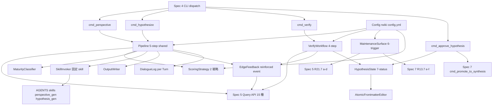
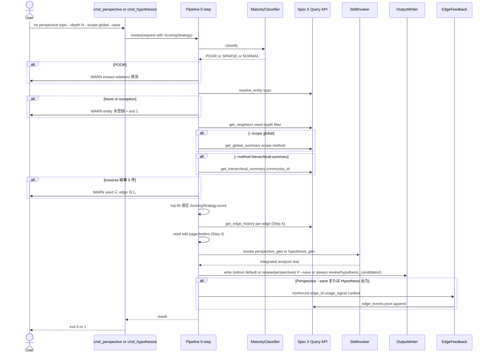
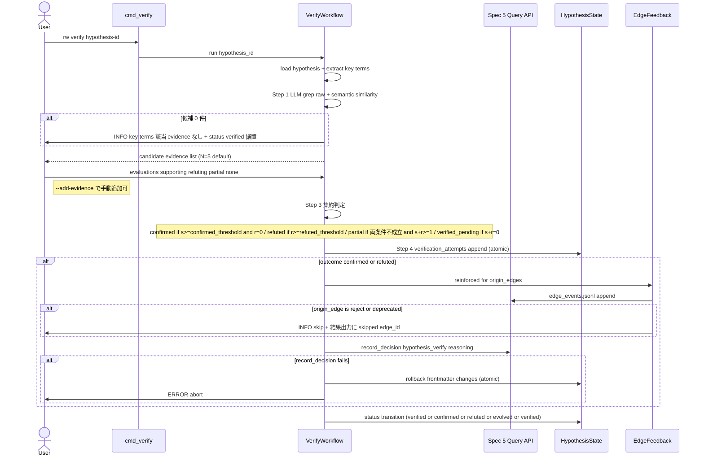
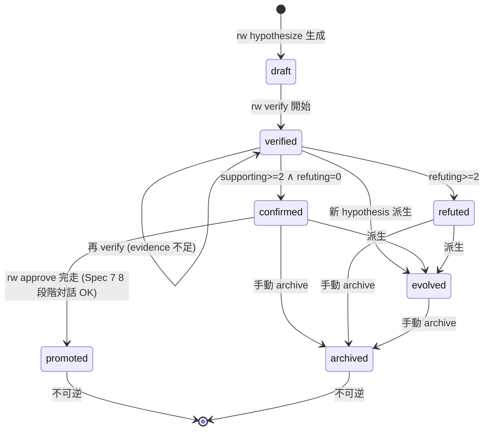

# Technical Design Document

## Overview

**Purpose**: 本 spec (Spec 6、Phase 5、Rwiki v2 MVP の最後の spec) は、Curated Knowledge Graph 上で Perspective (既存知識の再解釈) と Hypothesis (未検証の新命題) を生成し、半自動 Verify workflow と Confirmed の wiki 昇格 trigger を提供する。

**Users**: Rwiki v2 ユーザー (研究者・知識ワーカー・論文執筆者) が `rw perspective` / `rw hypothesize` / `rw verify` / `rw approve <hypothesis-id>` を通じて知識の深化と前進を行う。Spec 4 起票者は本 spec の 4 cmd handler を CLI dispatch から呼び出す。Spec 7 起票者は本 spec の `rw approve` から `cmd_promote_to_synthesis` 8 段階対話 handler を呼び出される。

**Impact**: rw CLI に 4 コマンド追加、`AGENTS/skills/` に 2 skill 追加 (Spec 2 配布、本 spec は invocation のみ)、`.rwiki/config.yml` に 4 セクション追加 (`graph.perspective.*` / `graph.hypothesis.*` / `graph.verify.*` / `chat.autonomous.maintenance_triggers.*`)、`raw/llm_logs/{chat-sessions,interactive}/` と `review/{perspectives,hypothesis_candidates}/` を出力先として確立。L2 Graph Ledger には Spec 5 経由で `reinforced` event を append (usage_signal フィードバック)、Hygiene Reinforcement に寄与。

### Goals

- Perspective 生成 (`rw perspective`) で stable + core edges を活用した既存知識の再解釈を user に surface
- Hypothesis 生成 (`rw hypothesize`) で missing bridges + candidate edges から evidence 検証可能な未検証命題を生成、必ずファイル化
- Verify workflow (`rw verify`) で human が evidence 個別評価、LLM が候補抽出 + 集約判定 (4 段階)
- Confirmed hypothesis を Spec 7 8 段階対話で `wiki/synthesis/` 昇格 (`rw approve <hypothesis-id>`)
- Maintenance autonomous trigger 6 種を session 内で能動的 surface (自動実行しない)
- L2 への usage_signal feedback (`reinforced` event + context attribute) で Spec 5 Hygiene Reinforcement に寄与

### Non-Goals

- L2 Graph Ledger 直接 read / write (Spec 5 Query API 15 種経由のみ、L2 物理 schema は Spec 5 所管)
- Skill 内容 (`perspective_gen.md` / `hypothesis_gen.md` の prompt 本文・Processing Rules・Failure Conditions は Spec 2 所管)
- Skill dispatch ロジック (本 spec は dispatch 対象外、固定 skill 名で直接呼出、Spec 3 Requirement 10 と整合)
- CLI dispatch frame (引数 parse / Hybrid 実行 / `--auto` ポリシー / 対話 confirm UI / exit code 制御 / Maintenance UX 表示は Spec 4 所管)
- Page lifecycle 状態遷移 / 8 段階対話 handler (`cmd_promote_to_synthesis` 等は Spec 7 所管)
- Maintenance trigger 計算実装 (a/b/c/d は Spec 5 R21.7、e/f は Spec 7 R13.7 所管)
- Frontmatter スキーマ宣言 (§5.9.1 Hypothesis / §5.9.2 Perspective は Foundation §5.9 / Spec 1 所管、本 spec は read/write 側)
- `rw discover` 独立 CLI (Phase 2 検討、MVP では R4 5 段階フロー + `--scope global` + `--method hierarchical-summary` + Community-aware traversal が代替)

## Boundary Commitments

### This Spec Owns

- 4 cmd_* handler ロジック (`cmd_perspective` / `cmd_hypothesize` / `cmd_verify` / `cmd_approve_hypothesis`、Requirements 1.1, 2.1, 8.1, 9.1)
- 5 段階処理フロー (Step 1 seed → Step 2 traverse → Step 3 top-M → Step 4 read → Step 5 integrate+output+reinforcement) の orchestration (Requirement 4)
- 2 scoring strategy (Perspective `0.6c+0.3r+0.1n` / Hypothesis `0.5n+0.3c+0.2bp`) と config 注入 (Requirement 5)
- L2 Ledger 成熟度 fallback 判定 (極貧 / 疎 / 通常、Requirement 6)
- Hypothesis 7 状態管理と状態遷移ルール (Foundation R5 を本 spec が継承、Requirement 7)
- Verify workflow 半自動 4 段階 state machine (LLM 候補抽出 → user 評価 → LLM 集約判定 → 結果記録、Requirement 8)
- 固定 skill `perspective_gen` / `hypothesis_gen` の load 規約 (Spec 3 dispatch 対象外、Requirement 3)
- Maintenance autonomous trigger 6 種の surface logic (計算は Spec 5 / Spec 7 に委譲、本 spec は内容生成のみ、Requirement 10)
- Output 規律 (Perspective stdout default + `--save` で `review/perspectives/`、Hypothesis 必ず `review/hypothesis_candidates/`、Requirement 12.1-12.3)
- 対話ログ自動保存 (per Turn append、`raw/llm_logs/chat-sessions/` + `raw/llm_logs/interactive/<skill>/`、atomic 化、Requirement 12.4-12.5)
- L2 への `reinforced` event 送出 + context attribute 記録 (Spec 5 R10.1 11 種と整合、独自 event 名禁止、Requirement 12.6-12.7)
- Configuration スキーマ (`graph.perspective.*` / `graph.hypothesis.*` / `graph.verify.*` / `chat.autonomous.maintenance_triggers.*`、Requirement 13)
- Spec 5 Query API 15 種への依存契約 (Requirement 11)
- Coordination 責務分離の明文化 (Requirement 14)
- Foundation 規範への準拠 (13 中核原則のうち §2.1 / §2.8 / §2.9 / §2.10 / §2.11 / §2.12 / §2.13、Requirement 15)

### Out of Boundary

- L2 Graph Ledger 物理実装 (`edges.jsonl` / `evidence.jsonl` / `entities.yaml` / `edge_events.jsonl` / `decision_log.jsonl` / `rejected_edges.jsonl` / `reject_queue/` の data model、Query API 15 種実装、Hygiene 進化則、Confidence scoring、Edge lifecycle、Community detection、SQLite cache、Reject workflow、Decision log 物理) → **Spec 5**
- Skill prompt 本文・Processing Rules・Failure Conditions → **Spec 2**
- Skill dispatch ロジック (`--skill` → frontmatter `type:` → `categories.yml` → LLM 推論の 4 段階優先順位は distill 専用) → **Spec 3**
- CLI dispatch frame (引数 parse / Hybrid 実行 / 対話 confirm UI / `--auto` 制御 / exit code / Maintenance UX 表示 / `/dismiss` `/mute maintenance` 入力受付 / `--mode autonomous` toggle) → **Spec 4**
- Page lifecycle 操作・8 段階対話 handler (`cmd_promote_to_synthesis` / `cmd_deprecate` / `cmd_retract` / `cmd_archive`、警告 blockquote 自動挿入、Backlink 更新) → **Spec 7**
- Maintenance autonomous trigger 計算実装 (reject queue 件数 / decay edges / typed-edge 整備率 / dangling edge は Spec 5 R21.7、最終 audit 実行日時 / 未 approve synthesis 件数は Spec 7 R13.7) → **Spec 5 / Spec 7**
- Frontmatter スキーマ field 名・型・許可値の **宣言** → **Foundation §5.9 / Spec 1**
- L3 frontmatter `related:` cache の sync 実装 → **Spec 5** (`rw graph rebuild --sync-related` / Hygiene batch sync)
- `rw chat` autonomous mode の発火条件・閾値・頻度制限の表示 layer → **Spec 4** (信頼度 ≥ 7/10 / 3 発話に 1 回 / novelty 判定 / context sensing)
- Severity 4 水準 / exit code 0/1/2 分離 / LLM CLI subprocess timeout 必須 規約定義 → **Foundation R11 / roadmap.md「v1 から継承する技術決定」**
- `rw discover` 独立 CLI → **MVP 範囲外、Phase 2 検討事項** (drafts L1005 / L1094 と整合)

### Allowed Dependencies

- **Upstream consumed**:
  - Spec 5: Query API 15 種 (`get_neighbors` / `get_shortest_path` / `get_orphans` / `get_hubs` / `find_missing_bridges` / `get_communities` / `get_global_summary` / `get_hierarchical_summary` / `get_edge_history` / `normalize_frontmatter` / `resolve_entity` / `record_decision` / `get_decisions_for` / `search_decisions` / `find_contradictory_decisions`)、`edge_events.jsonl` への `reinforced` event append API、L2 診断 4 trigger
  - Spec 7: `cmd_promote_to_synthesis(target_id, target_path, ...)` 8 段階対話 handler、L3 診断 5 項目のうち audit 未実行 (b) と未 approve synthesis (a)
  - Spec 4: CLI dispatch entry point から本 spec の cmd_* handler を呼出、subprocess timeout 受領、`--auto` ポリシー、対話 confirm UI、Maintenance UX 表示 layer、`/dismiss` `/mute maintenance` 入力受付
  - Spec 2: `AGENTS/skills/perspective_gen.md` / `AGENTS/skills/hypothesis_gen.md` 配布、skill lifecycle (install / deprecate / retract) 参加、interactive: true 規約、dialogue log frontmatter 5 必須 field schema
  - Spec 1: Hypothesis frontmatter §5.9.1 / Perspective frontmatter §5.9.2 の field 宣言、`type:` field vocabulary、`tags.yml`
  - Spec 0 (Foundation): 13 中核原則 / 3 層アーキテクチャ / Hypothesis status 7 種 / §5.9.1 / §5.9.2 / §2.13 Curation Provenance
- **共有 Infrastructure**:
  - `rw_utils` 系 (atomic_write / parse_frontmatter / 等の汎用 helper、v1 から継承)
  - `.rwiki/config.yml` (yaml config 読込)
  - LLM CLI subprocess (Spec 4 経由で起動、本 spec は callback 受領)
- **External**: なし (LLM 直接呼出は Spec 4 経由)

### Revalidation Triggers

- Spec 5 Query API 15 種の signature 変更 → 本 spec の利用箇所 (Pipeline / VerifyWorkflow / EdgeFeedback / MaintenanceSurface) を revalidate
- Spec 5 R10.1 event type 11 種の変更 (例: `reinforced` semantics 変更) → R8.6 / R12.6 / R12.7 revalidate
- Spec 7 `cmd_promote_to_synthesis` 8 段階対話 interface 変更 → R9 revalidate
- Foundation R5 Hypothesis status 7 種の変更 → R7 revalidate
- §5.9.1 Hypothesis frontmatter / §5.9.2 Perspective frontmatter スキーマ変更 → R12.2 / R12.3 / R2.8 revalidate
- v0.7.10 決定 6-1 (Spec 6 dispatch 対象外) 撤回 → R3 revalidate
- L2 Ledger 成熟度判定の閾値定義 (10 / 20% / 50%) 変更 → R6 revalidate
- record_decision API の reasoning 必須条件 (Spec 5 R11.6) 変更 → R8.7 / R9.5 revalidate

## Architecture

### Existing Architecture Analysis

本 spec は v2 新規追加 (v1 に Perspective / Hypothesis 概念なし)。v1 module DAG (`rw_config` / `rw_utils` / `rw_prompt_engine` / `rw_audit` / `rw_query` / `rw_cli` の 6 モジュール DAG 分割) を継承し、本 spec で 10 モジュールを追加。修飾参照規律 (`import rw_<module>; rw_<module>.symbol(...)`、`from rw_<module> import <symbol>` 禁止) を維持 (Spec 0 design.md / structure.md L189-190 整合)。

L2 access は Spec 5 Query API 経由のみ (R11.1)。本 spec は Spec 5 Client (Spec 5 が提供する client 層) を import して呼出すが、Spec 5 内部実装には依存しない (signature と返り値 schema 契約のみ依存、R11.4)。

### Architecture Pattern & Boundary Map



**Architecture Integration**:
- Selected pattern: Layered architecture (v1 module DAG 継承、依存方向 = Types → Config → Spec5Client → DomainComponents → Handlers → CLI)
- Domain/feature boundaries: 8 domain (A: CLI Handlers / B: Pipeline / C: State Management / D: Verify Workflow / E: Maintenance Surface / F: Skill Invocation / G: Output & Logging / H: Configuration)
- Existing patterns preserved: 修飾参照規律、Severity 4、exit code 0/1/2、subprocess timeout 必須 (Foundation R11)
- New components rationale: 4 cmd handler + 共通 5-step Pipeline + 2 ScoringStrategy + HypothesisState 7 status machine + VerifyWorkflow 4-step + MaintenanceSurface 6 trigger + SkillInvoker fixed-load + OutputWriter + DialogueLog + EdgeFeedback (`reinforced` event) + Config
- Steering compliance: Foundation 13 中核原則のうち §2.1 Paradigm C / §2.8 Skill library / §2.9 Graph as first-class / §2.10 Evidence chain / §2.11 Discovery primary / Maintenance LLM guide / §2.12 Evidence-backed Candidate Graph / §2.13 Curation Provenance を設計前提とし、tech.md「v1 から継承する技術決定」を継承 (Requirement 15.9)

### Dependency Direction

```
rw_perspective_types        (共通 dataclass)
   ↓
rw_perspective_config       (yaml loader)
   ↓
Spec 5 Client (external, import で参照)
   ↓
rw_edge_feedback            (Pipeline + VerifyWorkflow 両方から呼出される共有 component、Spec 5 Client のみ参照)
   ↓
rw_skill_invoker / rw_dialogue_log / rw_perspective_pipeline (scoring / maturity 含む)
   ↓
rw_hypothesis_state / rw_verify_workflow / rw_maintenance_surface
   ↓
rw_perspective.py / rw_verify.py (cmd_* handler)
   ↓
Spec 4 CLI dispatch (external)
```

各層は左 (上流) のみ import、右 (下流) を import しない (層違反は実装段階で flake8 / 静的解析で検出)。

### Technology Stack

| Layer | Choice / Version | Role | Notes |
|-------|------------------|------|-------|
| CLI Handler | Python 3.10+ 型ヒント完全 | `cmd_perspective` / `cmd_hypothesize` / `cmd_verify` / `cmd_approve_hypothesis` | 修飾参照規約、subprocess timeout 必須 |
| Pipeline / State / Workflow | Python 3.10+ | 5-step pipeline + 4-step verify + 7-status state machine | 標準ライブラリのみ + `pyyaml` |
| Skill | Markdown 8 section + frontmatter 11 field | `AGENTS/skills/perspective_gen.md` / `AGENTS/skills/hypothesis_gen.md` | Spec 2 配布、本 spec は invoke のみ |
| Config | YAML (`pyyaml`) | `.rwiki/config.yml` | 起動毎に再読込 (cache せず、R13.7) |
| Data Output | Markdown + frontmatter | `review/perspectives/<slug>-<ts>.md` / `review/hypothesis_candidates/<slug>-<ts>.md` | atomic write-to-tmp → rename |
| Logging | Markdown per Turn append | `raw/llm_logs/chat-sessions/chat-<ts>.md` / `raw/llm_logs/interactive/interactive-<skill>-<ts>.md` | atomic per Turn append |
| Spec 5 client | Python module import (Spec 5 配布) | Query API 15 種 + record_decision + edge event append | signature 契約のみ依存 |
| LLM Subprocess | Spec 4 経由 | timeout 必須 (継承) | 直接 subprocess 起動しない |

## File Structure Plan

### Directory Structure

```
scripts/
├── rw_perspective_types.py       # 共通 dataclass: Hypothesis / Perspective / Evidence / MaturityLevel / HypothesisStatus / ScoringWeights / ScoringContext / MaintenanceTrigger / ReinforcedEventContext / ReinforcedEvent / VerificationAttempt / VerifyResult / PipelineInvokeRequest / PipelineInvokeResult
├── rw_perspective_config.py      # Config component + 4 dataclass (PerspectiveConfig / HypothesisConfig / VerifyConfig / MaintenanceConfig)
├── rw_perspective_pipeline.py    # Pipeline + ScoringStrategy (interface) + PerspectiveScoringStrategy + HypothesisScoringStrategy + MaturityClassifier + OutputWriter
├── rw_hypothesis_state.py        # HypothesisState (ALLOWED_TRANSITIONS + transition + verification_attempts append + successor_wiki record + rollback) + AtomicFrontmatterEditor
├── rw_verify_workflow.py         # VerifyWorkflow + EvidenceCollector
├── rw_skill_invoker.py           # SkillInvoker (固定 skill loader for perspective_gen / hypothesis_gen)
├── rw_maintenance_surface.py     # MaintenanceSurface (6 trigger surface, Spec 5 R21.7 a-d + Spec 7 R13.7 e-f 経由)
├── rw_dialogue_log.py            # DialogueLog (per Turn append, atomic, chat-sessions/ + interactive/<skill>/)
├── rw_edge_feedback.py           # EdgeFeedback (`reinforced` event + context attribute, Spec 5 R10.1 11 種整合)
├── rw_perspective.py             # CmdPerspectiveHandler (cmd_perspective) + CmdHypothesizeHandler (cmd_hypothesize)
└── rw_verify.py                  # CmdVerifyHandler (cmd_verify) + CmdApproveHypothesisHandler (cmd_approve_hypothesis)
```

各 module は **≤ 1500 行** target (v1 module-split 規律継承、roadmap.md L147)。本 spec の 11 module 全体で約 2800-3800 行を見込む。

### Component → File Mapping (no orphan components 保証)

| Component | File | Domain |
|-----------|------|--------|
| CmdPerspectiveHandler / CmdHypothesizeHandler | `rw_perspective.py` | A |
| CmdVerifyHandler / CmdApproveHypothesisHandler | `rw_verify.py` | A |
| Pipeline | `rw_perspective_pipeline.py` | B |
| ScoringStrategy / PerspectiveScoringStrategy / HypothesisScoringStrategy | `rw_perspective_pipeline.py` | B |
| MaturityClassifier | `rw_perspective_pipeline.py` | B |
| OutputWriter | `rw_perspective_pipeline.py` | G (Step 5 出力で Pipeline と凝集性高) |
| HypothesisState | `rw_hypothesis_state.py` | C |
| AtomicFrontmatterEditor | `rw_hypothesis_state.py` (主 user) | C |
| VerifyWorkflow | `rw_verify_workflow.py` | D |
| EvidenceCollector | `rw_verify_workflow.py` | D |
| MaintenanceSurface | `rw_maintenance_surface.py` | E |
| SkillInvoker | `rw_skill_invoker.py` | F |
| DialogueLog | `rw_dialogue_log.py` | G |
| EdgeFeedback | `rw_edge_feedback.py` | G (Pipeline + VerifyWorkflow 両方から呼出される共有 component のため独立 module) |
| Config | `rw_perspective_config.py` | H |

### Modified Files

- `scripts/rw_cli.py` — **Spec 4 所管**、本 spec の `cmd_*` handler を Spec 4 dispatch entry point から呼出 (本 spec は handler 関数を提供する側、CLI dispatch frame には介入しない)
- `scripts/rw_utils.py` — 共通 `atomic_write(path, content)` helper を追加 (4 対象 atomic 更新、R12.8)。既存 `parse_frontmatter` / `git_commit` 等は流用

### Skill Files (Spec 2 配布、本 spec は invocation のみ)

- `AGENTS/skills/perspective_gen.md` — Spec 2 が 8 section + frontmatter 11 field で配布、本 spec は固定 skill 名で load (R3.1)
- `AGENTS/skills/hypothesis_gen.md` — 同上、R3.2

### Output Directories (本 spec が write 先として使用、Foundation §5.9 / Spec 1 が directory 規約所管)

- `review/perspectives/<slug>-<ts>.md` — Perspective `--save` 時 (R12.2)
- `review/hypothesis_candidates/<slug>-<ts>.md` — Hypothesis 必ずファイル化 (R12.3)
- `raw/llm_logs/chat-sessions/chat-<ts>.md` — `rw chat` セッションログ (R12.4)
- `raw/llm_logs/interactive/interactive-<skill>-<ts>.md` — interactive_synthesis 等の対話 skill ログ (R12.5)

### Test Files

```
tests/
├── test_rw_perspective_types.py        # dataclass 検証
├── test_rw_perspective_config.py       # config loader + default 値 + scoring weights 合計検証 (R13.6, R13.8)
├── test_rw_perspective_pipeline.py     # Pipeline + 2 scoring strategy + MaturityClassifier + OutputWriter
├── test_rw_hypothesis_state.py         # HypothesisState ALLOWED_TRANSITIONS + AtomicFrontmatterEditor
├── test_rw_verify_workflow.py          # VerifyWorkflow + EvidenceCollector + record_decision 失敗 rollback (R8.7)
├── test_rw_skill_invoker.py            # SkillInvoker 固定 load + 不在時 ERROR (R3.5)
├── test_rw_maintenance_surface.py      # MaintenanceSurface 6 trigger (Spec 5 / Spec 7 mock)
├── test_rw_dialogue_log.py             # DialogueLog per Turn append + atomic
├── test_rw_edge_feedback.py            # EdgeFeedback `reinforced` event + context attribute + reject/deprecated skip (R12.7)
├── test_rw_perspective_cmds.py         # cmd_perspective + cmd_hypothesize integration
└── test_rw_verify_cmds.py              # cmd_verify + cmd_approve_hypothesis integration (Spec 7 mock)
```

## System Flows

### Flow 1: 5-step Pipeline (Perspective / Hypothesize 共通、Requirement 4)



**Key Decisions**:
- Step 1 `resolve_entity` 失敗時は **WARN + exit 1** で停止 (Step 2 以降に進まない、R4.1)
- Step 2 結果空集合は **WARN + 継続不可** (R4.8)、ledger 極貧時は R6.2 と併発 (R6.6)
- Step 5 reinforcement は Perspective `--save` 時のみ + Hypothesis 出力時 (R12.6 = Direct/Support 種別 `reinforced` event 送出)、Hypothesis verify confirmed/refuted 時は別 Flow (Flow 2 Step 4)
- Perspective stdout (`--save` なし) 時も Retrieval 種別 usage_signal は送出 (R4.5(c) 「使われた edge 全て」条件と整合 = R12.6 reinforced event 送出条件 (Direct/Support) とは別軸の Retrieval 軸)
- usage_signal 種別は Direct / Support / Retrieval / Co-activation の 4 種から選択 (R4.6)、`reinforced` event の context attribute として記録 (R12.6 / R12.7)
- **recency 計算 + bridge_potential pre-fetch (Step 3 直前)**: ScoringContext.edge_history_cache に Step 2 traverse 結果 N 件分の最終 event 日時を pre-fetch (= Spec5Client.get_edge_history(edge_id) を Step 3 直前にバッチ呼出)、Step 3 ScoringStrategy.score() 内で recency 計算に使用。Step 4 の get_edge_history は evidence 参照目的で別途使用 (= cache 再利用可で重複呼出回避)。Hypothesis 系列のみ ScoringContext.bridge_potential_map に find_missing_bridges 結果を注入

### Flow 2: Verify Workflow 4-step (Requirement 8)



**Key Decisions**:
- Step 1 evidence 候補 0 件は **INFO + status verified 据置** (R8.11、user に手動追加または raw ingest を促す)
- Step 4 record_decision 失敗時は **ERROR abort + atomic rollback** (R8.7、verification_attempts append + status 遷移を取消)
- origin_edges の edge が reject / deprecated 状態は **INFO skip + skip 理由を verify 結果出力に記録** (R12.7)
- delta 値: confirmed 時 = `supporting_evidence_reinforcement_delta` (default +0.28、Spec 5 Hygiene)、refuted 時 = 別 delta (design phase で Spec 5 と coordination、暫定方針として Spec 5 config に `refuting_evidence_reinforcement_delta` 新設要請、本 spec は呼出のみ)

### Flow 3: Hypothesis 7-status State Machine (Requirement 7)



**Key Decisions**:
- 状態遷移は frontmatter 編集のみで表現 (R7.8)、ディレクトリ移動なし
- 物理削除しない (R7.7)、`promoted` / `refuted` / `archived` も履歴として保持 (Foundation §1.3.5「失敗からも学ぶ」)
- Page status 5 種 / Edge status 6 種と独立した第 3 軸 (R7.9)、混同しない
- 状態定義の意味は Foundation R5 / §5.9.1 SSoT を参照、本 spec は ALLOWED_TRANSITIONS のみ所管

## Requirements Traceability

| Requirement | Summary | Components | Interfaces / Methods | Flows |
|-------------|---------|-----------|----------------------|-------|
| 1 (1.1, 1.2, 1.3, 1.4, 1.5, 1.6, 1.7, 1.8, 1.9, 1.10) | `rw perspective <topic>` 生成ロジック | CmdPerspectiveHandler / Pipeline / PerspectiveScoringStrategy / OutputWriter / EdgeFeedback | `cmd_perspective(topic, depth, scope, method, save)` / `Pipeline.invoke(request)` | Flow 1 |
| 2 (2.1, 2.2, 2.3, 2.4, 2.5, 2.6, 2.7, 2.8, 2.9, 2.10) | `rw hypothesize <topic>` 生成ロジック | CmdHypothesizeHandler / Pipeline / HypothesisScoringStrategy / OutputWriter | `cmd_hypothesize(topic, depth, scope, method)` | Flow 1 |
| 3 (3.1, 3.2, 3.3, 3.4, 3.5, 3.6, 3.7) | 固定 skill load + Spec 3 dispatch 対象外 | SkillInvoker | `SkillInvoker.load_fixed(skill_name)` | (in Flow 1 Step 5) |
| 4 (4.1, 4.2, 4.3, 4.4, 4.5, 4.6, 4.7, 4.8) | 5 段階処理フロー | Pipeline | `Pipeline.invoke(request) -> PipelineInvokeResult` | Flow 1 |
| 5 (5.1, 5.2, 5.3, 5.4, 5.5, 5.6, 5.7) | 候補選定 scoring 2 系統 | PerspectiveScoringStrategy / HypothesisScoringStrategy | `ScoringStrategy.score(candidate, ctx) -> float` | (in Flow 1 Step 3) |
| 6 (6.1, 6.2, 6.3, 6.4, 6.5, 6.6, 6.7) | L2 Ledger 成熟度 fallback | MaturityClassifier | `MaturityClassifier.classify() -> MaturityLevel` | (in Flow 1 pre-Step 1) |
| 7 (7.1, 7.2, 7.3, 7.4, 7.5, 7.6, 7.7, 7.8, 7.9) | Hypothesis 7 状態管理 | HypothesisState / AtomicFrontmatterEditor | `HypothesisState.transition(hyp_id, from, to)` | Flow 3 |
| 8 (8.1, 8.2, 8.3, 8.4, 8.5, 8.6, 8.7, 8.8, 8.9, 8.10, 8.11) | Verify workflow 半自動 4 段階 | VerifyWorkflow / EvidenceCollector / EdgeFeedback / HypothesisState | `VerifyWorkflow.run(hypothesis_id) -> VerifyResult` | Flow 2 |
| 9 (9.1, 9.2, 9.3, 9.4, 9.5, 9.6, 9.7, 9.8, 9.9) | `rw approve` + wiki 昇格 trigger | CmdApproveHypothesisHandler / HypothesisState / Spec7HandlerCaller | `cmd_approve_hypothesis(hypothesis_id)` | (calls Spec 7) |
| 10 (10.1, 10.2, 10.3, 10.4, 10.5, 10.6, 10.7, 10.8, 10.9, 10.10) | Maintenance autonomous trigger 6 種 surface | MaintenanceSurface | `MaintenanceSurface.evaluate() -> list[Trigger]` | (autonomous mode) |
| 11 (11.1, 11.2, 11.3, 11.4, 11.5, 11.6, 11.7, 11.8) | Spec 5 Query API 15 種への依存契約 | (全 Spec 5 consumer component) | (各 component の Spec 5 API 呼出) | (各 Flow) |
| 12 (12.1, 12.2, 12.3, 12.4, 12.5, 12.6, 12.7, 12.8, 12.9) | 出力先 / 対話ログ / L2 feedback | OutputWriter / DialogueLog / EdgeFeedback / AtomicFrontmatterEditor | `OutputWriter.write_*()` / `DialogueLog.append_turn()` / `EdgeFeedback.reinforced(edge_id, signal, context)` | Flow 1 / Flow 2 |
| 13 (13.1, 13.2, 13.3, 13.4, 13.5, 13.6, 13.7, 13.8) | Configuration | Config | `Config.load()` / `Config.get_perspective() / get_hypothesis() / get_verify() / get_maintenance()` | (起動時) |
| 14 (14.1, 14.2, 14.3, 14.4, 14.5, 14.6, 14.7) | Coordination 責務分離 | (全 component、Boundary Commitments) | (本 design 全体) | — |
| 15 (15.1, 15.2, 15.3, 15.4, 15.5, 15.6, 15.7, 15.8, 15.9, 15.10, 15.11, 15.12) | Foundation 規範準拠 + 文書品質 | (全 component、design 全体規律) | (本 design 全体) | — |

## Components and Interfaces

### Domain A: CLI Handlers

#### CmdPerspectiveHandler

| Field | Detail |
|-------|--------|
| Intent | `rw perspective <topic>` 内部 handler (Spec 4 dispatch から呼出) |
| Requirements | 1.1, 1.2, 1.3, 1.4, 1.5, 1.6, 1.7, 1.8, 1.9, 1.10 |

**Responsibilities**:
- 引数受領 (`topic` / `--depth N` / `--scope local|global` / `--method standard|hierarchical-summary` / `--save`) を Pipeline 呼出 request に変換
- Pipeline.invoke() の戻り値を stdout (default) / `review/perspectives/<slug>-<ts>.md` (`--save` 時) に出力
- WARN / INFO / ERROR を Spec 4 経由で stderr に伝播
- subprocess timeout 必須 (R3.7、Foundation R11 継承)

**Dependencies**:
- Outbound: Pipeline (P0), OutputWriter (P0), Config (P0)
- External: Spec 4 dispatch 経由で起動 (Inbound)

**Contracts**: Service [✓]

```python
def cmd_perspective(
    topic: str,
    depth: int = 2,
    scope: str = 'local',          # 'local' | 'global'
    method: str = 'standard',      # 'standard' | 'hierarchical-summary'
    save: bool = False,
) -> int:
    """
    Returns:
        exit_code: 0 (success) | 1 (runtime error) | 2 (FAIL detection, 本 cmd では未使用)
    """
```

- Preconditions: `.rwiki/config.yml` が読める (Config.load() 成功)、`AGENTS/skills/perspective_gen.md` が存在
- Postconditions: stdout に Perspective 出力、`--save` 時は `review/perspectives/<slug>-<ts>.md` に atomic write、`reinforced` event を `traversed_edges` 各 edge_id に append (R1.8)
- Invariants: subprocess timeout 必須 (R3.7)、L2 ledger 直接 read/write しない (R11.1)

**Implementation Notes**:
- Integration: Spec 4 dispatch から呼出、Spec 4 が引数 parse 完了後に渡す
- Validation: topic は空文字禁止 (Spec 4 で validate、本 handler は信頼)
- Risks: Pipeline.invoke 内の Spec 5 API 性能依存、極貧 ledger では Pipeline.MaturityClassifier が WARN を発する (R6.2)

#### CmdHypothesizeHandler

| Field | Detail |
|-------|--------|
| Intent | `rw hypothesize <topic>` 内部 handler |
| Requirements | 2.1, 2.2, 2.3, 2.4, 2.5, 2.6, 2.7, 2.8, 2.9, 2.10 |

**Responsibilities**:
- 引数受領 (`topic` / `--depth N` 等) を Pipeline 呼出 request に変換
- Pipeline.invoke() の戻り値を **必ず** `review/hypothesis_candidates/<slug>-<ts>.md` にファイル化 (R2.5、R12.3、stdout のみ禁止)
- frontmatter §5.9.1 必須 field を埋める (R2.8)
- Hypothesis ID (slug) を `hyp-<short-hash-or-topic-slug>` 形式で生成 (R2.9)

**Contracts**: Service [✓]

```python
def cmd_hypothesize(
    topic: str,
    depth: int = 2,
    scope: str = 'local',
    method: str = 'standard',
) -> int:
    """
    Returns:
        exit_code: 0 (success) | 1 (runtime error) | 2 (FAIL detection, 本 cmd では未使用)
    Side effects:
        - review/hypothesis_candidates/<slug>-<ts>.md (atomic write)
        - traversed_edges に reinforced event append (R12.6)
    """
```

#### CmdVerifyHandler

| Field | Detail |
|-------|--------|
| Intent | `rw verify <hypothesis-id>` 内部 handler |
| Requirements | 8.1, 8.10 (handler レベル、本体は VerifyWorkflow) |

**Responsibilities**:
- hypothesis_id を VerifyWorkflow.run() に渡す
- VerifyResult を user に summary 出力 (Spec 4 経由)
- subprocess timeout 必須 (R8.10)

**Contracts**: Service [✓]

```python
def cmd_verify(hypothesis_id: str, add_evidence: list[str] = None, force_status: str = None, reason: str = None) -> int:
    """
    Returns:
        exit_code: 0 (success) | 1 (runtime error) | 2 (FAIL detection, R8.7 record_decision 失敗時)
    Note:
        reason=None の場合、handler 内で chat session から auto-generate fallback により reason を補完してから record_decision を呼出 (R8.7 + Spec 5 R11.6 reasoning 必須を満たす、default skip 不可)
    """
```

#### CmdApproveHypothesisHandler

| Field | Detail |
|-------|--------|
| Intent | `rw approve <hypothesis-id>` 内部 handler、Spec 7 8 段階対話 trigger |
| Requirements | 9.1, 9.2, 9.3, 9.4, 9.5, 9.6, 9.7, 9.8, 9.9 |

**Responsibilities**:
- hypothesis status の `confirmed` 事前 check (R9.1)、それ以外は ERROR + exit 2 (R9.2)
- Spec 7 `cmd_promote_to_synthesis(hypothesis_id, target_path)` 呼出 (R9.3、Spec 7 callee の signature は generic 名 `target_id` 表記 = R9.9 三者命名関係整合、本 spec caller 内部で `hypothesis_id` を Spec 7 の `target_id` 引数に渡す)
- 完走時 status `confirmed → promoted` 遷移 + `successor_wiki:` 記録 (R9.4)
- record_decision 失敗時の atomic rollback (R9.5)
- user 中断時 status 据置 (R9.7)
- `--auto` 不可 (R9.8、Spec 7 R6.4 整合)

**Contracts**: Service [✓]

```python
def cmd_approve_hypothesis(hypothesis_id: str, reason: str = None) -> int:
    """
    Returns:
        exit_code: 0 (success) | 1 (runtime error) | 2 (FAIL detection, R9.2 status != confirmed | R9.5 record_decision 失敗時)
    Preconditions: hypothesis_id の status == 'confirmed'
    Postconditions on success:
        - Spec 7 cmd_promote_to_synthesis 完走
        - hypothesis frontmatter status = 'promoted'
        - hypothesis frontmatter successor_wiki = 'wiki/synthesis/<slug>.md'
        - record_decision (decision_type=synthesis_approve, reasoning required)
    Note:
        reason=None の場合、handler 内で chat session から auto-generate fallback により reason を補完してから record_decision を呼出 (R9.5 + Spec 5 R11.6 reasoning 必須を満たす、default skip 不可)
    """
```

### Domain B: 5-step Pipeline

#### Pipeline (5-step shared pipeline)

| Field | Detail |
|-------|--------|
| Intent | Perspective / Hypothesize 共通の 5 段階処理 orchestration |
| Requirements | 4.1, 4.2, 4.3, 4.4, 4.5, 4.6, 4.7, 4.8 |

**Responsibilities & Constraints**:
- Step 1: `Spec5Client.resolve_entity(topic)` 呼出、None / 例外なら WARN + exit 1 (R4.1)
- Step 2: `Spec5Client.get_neighbors(seed, depth, filter)` 呼出 (depth default=2、R1.4 / R2.x、filter は R1.2 / R2.2 で渡す)
- Step 3: ScoringStrategy.score() で top-M 選定 (default M=20、R5.5)
- Step 4: 選択 page body Read + `Spec5Client.get_edge_history(edge_id)` で evidence 参照
- Step 5: SkillInvoker.invoke() + OutputWriter.write() + EdgeFeedback.reinforced()
- Step 失敗時は ERROR + exit 1 (R4.7)
- Step 2 結果空集合は WARN (R4.8)

**Dependencies**:
- Outbound: Spec5Client (P0), ScoringStrategy (P0), SkillInvoker (P0), OutputWriter (P0), EdgeFeedback (P0), MaturityClassifier (P1), DialogueLog (P1), Config (P0)

**Contracts**: Service [✓]

```python
@dataclass
class PipelineInvokeRequest:
    topic: str
    depth: int = 2
    scope: str = 'local'           # 'local' | 'global'
    method: str = 'standard'       # 'standard' | 'hierarchical-summary'
    output_kind: str = 'perspective'   # 'perspective' | 'hypothesis'
    scoring: ScoringStrategy
    filter: CommonFilter           # Spec 5 dataclass
    save: bool = False             # Perspective only

@dataclass
class PipelineInvokeResult:
    output_text: str
    saved_path: Optional[Path]
    traversed_edges: list[str]
    reinforced_events: list[ReinforcedEvent]
    warnings: list[str]
    info: list[str]

def invoke(request: PipelineInvokeRequest) -> PipelineInvokeResult: ...
```

**Implementation Notes**:
- Integration: Pipeline は cmd_perspective / cmd_hypothesize から呼出、scoring / output_kind 注入で両 cmd 共通化
- Validation: filter は Spec 5 CommonFilter を直接渡す (本 spec で別 schema 定義しない、R11.4)
- Risks: Step 5 SkillInvoker subprocess 失敗時 ERROR、record_decision は本 Pipeline では呼出しない (Verify / Approve のみ呼出、R8.7 / R9.5)

#### MaturityClassifier

| Field | Detail |
|-------|--------|
| Intent | L2 Ledger 成熟度判定 (R6) |
| Requirements | 6.1, 6.2, 6.3, 6.4, 6.5, 6.6, 6.7 |

**Responsibilities**:
- Spec5Client から件数取得 (stable / core / total edges)
- 極貧 (stable+core < 10) / 疎 (stable 比率 < 20%) / 通常 (stable+core ≥ 50%) を判定 (R6.1)
- 起動毎に再計算、cache せず (R6.7)
- 閾値 (10 / 0.20 / 0.50) は config 注入 (R6.5)

**Contracts**: Service [✓]

```python
class MaturityLevel(Enum):
    POOR = 'poor'
    SPARSE = 'sparse'
    NORMAL = 'normal'

def classify() -> MaturityLevel: ...
```

#### ScoringStrategy (interface) + 2 concrete

| Field | Detail |
|-------|--------|
| Intent | Perspective / Hypothesis 別系統 scoring |
| Requirements | 5.1, 5.2, 5.3, 5.4, 5.5, 5.6, 5.7 |

**Responsibilities**:
- PerspectiveScoringStrategy: `0.6 × confidence + 0.3 × recency + 0.1 × novelty` (R5.1)
- HypothesisScoringStrategy: `0.5 × novelty + 0.3 × confidence + 0.2 × bridge_potential` (R5.2)
- 各要素計算は ScoringContext (Spec5Client 経由で取得 + Step 3 直前 pre-fetch 結果) を受領 (R5.3)
- 係数値・top_m・depth は config 注入 (R5.4 / R13)
- config 欠落時は default + INFO 通知 (R5.6 / R13.6)
- 合計値 ≠ 1.0 は WARN + 継続 (R13.8)

**Edge Case 動作 (アルゴリズム数値安定性、Round 3 一貫性 review 反映)**:
- novelty 分母 0 (= total_related_edges = 0、個別 edge の denominator 0 case): novelty = **1.0 固定** (= 関連 edge 0 件は最大 novel として扱う、Step 2 traverse 結果 > 0 でも個別 edge denominator 0 case で適用、ゼロ除算 error 回避)
- recency event-less (= edge_history_cache 取得時 events 0 件、新規 edge で events 未記録 case): recency = **0.5 固定** + INFO 通知 (= neutral 値で扱う、completely event-less edge case の defensive default)

**Contracts**: Service [✓]

```python
class ScoringStrategy(Protocol):
    def score(self, candidate: Edge, ctx: ScoringContext) -> float: ...

@dataclass
class ScoringContext:
    spec5_client: Spec5Client
    half_life_days: float = 30.0   # recency 計算用
    edge_history_cache: dict[str, datetime] | None = None  # recency 計算: edge_id → 最終 event 日時 (Step 3 直前 pre-fetch、Round 3 A-2 整合)
    bridge_potential_map: dict[str, float] | None = None  # Hypothesis scoring 用 (Round 3 A-1 整合): edge_id → bridge_potential 値、Pipeline Step 2 後に find_missing_bridges 呼出で注入 (Hypothesis 系列のみ)
    # novelty 計算は Spec 5 API 経由 (= spec5_client で edge_events.jsonl 参照)
```

### Domain C: State Management

#### HypothesisState

| Field | Detail |
|-------|--------|
| Intent | Hypothesis 7 状態 state machine + atomic frontmatter editor |
| Requirements | 7.1, 7.2, 7.3, 7.4, 7.5, 7.6, 7.7, 7.8, 7.9 |

**Responsibilities & Constraints**:
- ALLOWED_TRANSITIONS 定義 (R7.3、Flow 3 整合)
- frontmatter 編集 (status / verification_attempts append / successor_wiki) を AtomicFrontmatterEditor 経由で実施 (R7.8 / R12.8 (d))
- 物理削除しない (R7.7)、ディレクトリ移動を伴わない (R7.8)
- Page status 5 種 / Edge status 6 種と独立した第 3 軸として扱い、混同しない (R7.9)

**Contracts**: Service [✓] / State [✓]

```python
ALLOWED_TRANSITIONS: dict[HypothesisStatus, set[HypothesisStatus]] = {
    HypothesisStatus.DRAFT:     {HypothesisStatus.VERIFIED},
    HypothesisStatus.VERIFIED:  {HypothesisStatus.CONFIRMED, HypothesisStatus.REFUTED, HypothesisStatus.EVOLVED, HypothesisStatus.VERIFIED},
    HypothesisStatus.CONFIRMED: {HypothesisStatus.PROMOTED, HypothesisStatus.ARCHIVED, HypothesisStatus.EVOLVED},
    HypothesisStatus.REFUTED:   {HypothesisStatus.ARCHIVED, HypothesisStatus.EVOLVED},
    HypothesisStatus.EVOLVED:   {HypothesisStatus.ARCHIVED},
    HypothesisStatus.PROMOTED:  set(),
    HypothesisStatus.ARCHIVED:  set(),
}

def transition(hyp_id: str, from_: HypothesisStatus, to: HypothesisStatus) -> None: ...
def append_verification_attempt(hyp_id: str, attempt: VerificationAttempt) -> None: ...
def record_successor_wiki(hyp_id: str, wiki_path: Path) -> None: ...
def rollback_last_change(hyp_id: str) -> None: ...   # atomic rollback (R8.7 / R9.5)
```

**State Management**:
- State model: 7 status (`draft` / `verified` / `confirmed` / `refuted` / `promoted` / `evolved` / `archived`)
- Persistence: `review/hypothesis_candidates/<slug>-<ts>.md` の frontmatter (Foundation §2.3 / R7.8)
- Concurrency strategy: AtomicFrontmatterEditor 経由 (write-to-tmp → rename、R12.8 (d)、並行 verify / approve race condition 防止)

#### AtomicFrontmatterEditor (helper、`rw_hypothesis_state.py` に同居)

| Field | Detail |
|-------|--------|
| Intent | frontmatter atomic 編集 (write-to-tmp → rename) |
| Requirements | 12.8 (d) |

**Responsibilities**:
- read frontmatter + body
- modify frontmatter dict
- write to tmp file → rename (POSIX atomic)
- rollback support (前 state 保持で revert 可能)

### Domain D: Verify Workflow

#### VerifyWorkflow

| Field | Detail |
|-------|--------|
| Intent | Verify 半自動 4 段階 state machine |
| Requirements | 8.1, 8.2, 8.3, 8.4, 8.5, 8.6, 8.7, 8.8, 8.9, 8.10, 8.11 |

**Responsibilities & Constraints**:
- Step 1: EvidenceCollector で raw/**/*.md grep + semantic similarity → N=5 候補抽出 (R8.2)
- Step 2: user に 4 択 (`supporting / refuting / partial / none`) 評価収集 (R8.3)、`--add-evidence <path>:<span>` 受領
- Step 3: 集約判定 (`supporting≥confirmed_threshold ∧ refuting=0 → confirmed` / `refuting≥refuted_threshold → refuted` / 両条件不成立 ∧ supporting+refuting≥1 → `partial` / 両条件不成立 ∧ supporting+refuting=0 → `verified_pending`、R8.4 + R13.3 config threshold 整合、threshold default = 2)
- Step 4: `verification_attempts` append (atomic、R8.5 / R12.8 (d)) + `reinforced` event (confirmed/refuted のみ、R8.6) + `record_decision` (R8.7)
- record_decision 失敗時の rollback (R8.7)、atomic で verification_attempts append + status 遷移を取消。**rollback 対象は本 spec 所管の frontmatter (verification_attempts + status) のみ**、Step 4 で先行送出済の `reinforced` event は Spec 5 R10.1 eventual consistency 整合の forward-only として L2 ledger 上に残置 (本 spec の rollback scope 越境禁止、edge_events.jsonl への取消 API 呼出はしない、Round 4 責務境界 review 反映)
- evidence 候補 0 件時は INFO + status 据置 (R8.11)

**Dependencies**:
- Outbound: EvidenceCollector (P0), Spec5Client (P0、record_decision + edge events), HypothesisState (P0), EdgeFeedback (P0)

**Contracts**: Service [✓] / State [✓]

```python
@dataclass
class VerifyResult:
    outcome: str  # 'confirmed' | 'refuted' | 'partial' | 'verified_pending' | 'evolved'
    new_status: HypothesisStatus
    supporting_evidence: list[Evidence]
    refuting_evidence: list[Evidence]
    reinforced_events: list[ReinforcedEvent]
    skipped_edges: list[tuple[str, str]]   # [(edge_id, reason), ...] (R12.7)

def run(hypothesis_id: str, add_evidence: list[str] = None, force_status: str = None, reason: str = None) -> VerifyResult: ...
```

#### EvidenceCollector

| Field | Detail |
|-------|--------|
| Intent | Step 1 LLM 候補 evidence 抽出 (raw grep + semantic similarity) |
| Requirements | 8.2 |

**Responsibilities**:
- hypothesis 本文 + origin から key terms 抽出
- raw/**/*.md を grep + semantic similarity (LLM 経由) で N 件 (default 5) 抽出
- 各候補に `file` / `quote` / `span` (行番号 range) 付与
- subprocess timeout 必須 (R8.10)

**Performance Strategy (R8.2、MVP 確定方針)**:
- 検索方式: ripgrep + semantic similarity (LLM 経由) の素朴実装、persistent incremental indexing は **不要**
- 応答時間目標: 中規模 (1K ファイル) **5 秒以下**、大規模 (10K+ ファイル) **30 秒以下**
- 目標未達時: WARN + degraded mode 通知 (= user に「検索が遅延しています」表示) + 結果は返却継続
- 大規模化対応: MVP では未対応、運用で性能課題顕在化時に次 spec で incremental indexing (例: SQLite FTS5) 採用検討
- 設計理由: MVP 規律 (= over-engineering 回避)、index 実装 cost (DB schema / sync / migration) を回避し、実運用で困った段階で対応

**Open Questions / Risks**:
- 候補抽出順位の安定性 (semantic similarity の同一 input → 同一 output 保証) を実装段階で検証

### Domain E: Maintenance Surface

#### MaintenanceSurface

| Field | Detail |
|-------|--------|
| Intent | Maintenance autonomous 6 trigger surface (計算は Spec 5 / Spec 7 に委譲、本 spec は内容生成のみ) |
| Requirements | 10.1, 10.2, 10.3, 10.4, 10.5, 10.6, 10.7, 10.8, 10.9, 10.10 |

**Responsibilities & Constraints**:
- Trigger 計算所管 (R10.2):
  - (a) reject_queue ≥ 10: Spec 5 R21.7 (a)
  - (b) Decay edges ≥ 20 (未 usage > 7 日): Spec 5 R21.7 (b)
  - (c) Typed-edge 整備率 < 2.0: Spec 5 R21.7 (c)
  - (d) Dangling edge ≥ 5: Spec 5 R21.7 (d)
  - (e) Audit 未実行 ≥ 14 日: Spec 7 R13.7 (b)
  - (f) 未 approve synthesis ≥ 5: Spec 7 R13.7 (a)
- 各 trigger を `rw doctor` 経由 or 直接 API で取得 (R10.2)
- `💡` marker で表示文字列生成 + 推奨対応コマンド併記 (R10.3)
- surface のみ (自動実行しない、R10.4)
- session 内 1 回までの頻度制限 (R10.5)、`/dismiss` (R10.6) / `/mute maintenance` (R10.7) 受付 (表示 layer は Spec 4)
- 閾値 config 注入 (R10.8)
- 複数同時発火時の優先順位付け (R10.9、Scenario 33)
- `rw chat --mode autonomous` toggle 対応 (R10.10、mode toggle 自体は Spec 4)

**Contracts**: Service [✓]

```python
@dataclass
class MaintenanceTrigger:
    name: str          # 'reject_queue' | 'decay_edges' | 'typed_edge_ratio' | 'dangling_edge' | 'audit_overdue' | 'unapproved_synthesis'
    severity: str      # 'INFO' | 'WARN'
    message: str       # 💡 marker 付き表示用
    suggested_cmd: str # 推奨対応コマンド (例: 'rw reject')
    priority: int      # 複数同時発火時の優先順位

def evaluate() -> list[MaintenanceTrigger]: ...
```

### Domain F: Skill Invocation

#### SkillInvoker

| Field | Detail |
|-------|--------|
| Intent | 固定 skill (`perspective_gen` / `hypothesis_gen`) を Spec 3 dispatch 経由せず直接 load |
| Requirements | 3.1, 3.2, 3.3, 3.4, 3.5, 3.6, 3.7 |

**Responsibilities**:
- `AGENTS/skills/<fixed_name>.md` を load (R3.1 / R3.2)
- 不在 / status != active なら ERROR severity + 操作拒否、`generic_summary` fallback 不可 (R3.5)
- subprocess timeout 必須 (R3.7)
- skill lifecycle (install / deprecate / retract) は Spec 2 所管、本 component は load 時の status check のみ (R3.4)
- skill 出力 schema 変更時は Spec 2 を先行改版 (R3.6、Adjacent Spec Synchronization)

**Contracts**: Service [✓]

```python
def load_fixed(skill_name: Literal['perspective_gen', 'hypothesis_gen']) -> SkillContent: ...
def invoke(skill: SkillContent, prompt_input: dict) -> str:
    """LLM CLI subprocess 経由で skill 実行、timeout 必須"""
    ...
```

### Domain G: Output / Logging / Edge Feedback

#### OutputWriter

| Field | Detail |
|-------|--------|
| Intent | Perspective / Hypothesis の atomic write |
| Requirements | 12.1, 12.2, 12.3, 12.9 |

**Responsibilities**:
- Perspective: stdout default (R12.1)、`--save` 時のみ `review/perspectives/<slug>-<ts>.md` (R12.2、§5.9.2)
- Hypothesis: 必ず `review/hypothesis_candidates/<slug>-<ts>.md` (R12.3、§5.9.1)
- atomic write (write-to-tmp → rename、R12.8 (b) / R12.8 (c))
- 出力本文の言語 = 対話文脈 (user 入力言語追従、R12.9)、frontmatter は ASCII / 英数記号

**Contracts**: Service [✓]

```python
def write_perspective_stdout(text: str) -> None: ...
def write_perspective_save(text: str, frontmatter: PerspectiveFrontmatter, slug: str) -> Path: ...
def write_hypothesis(text: str, frontmatter: HypothesisFrontmatter, slug: str) -> Path: ...
```

#### DialogueLog

| Field | Detail |
|-------|--------|
| Intent | per Turn append for chat-sessions / interactive |
| Requirements | 12.4, 12.5, 12.8 (a) |

**Responsibilities**:
- `rw chat` セッションログを `raw/llm_logs/chat-sessions/chat-<ts>.md` に append (R12.4)
- interactive_synthesis 等の対話 skill ログを `raw/llm_logs/interactive/interactive-<skill>-<ts>.md` に append (R12.5)
- append 単位 = per Turn (1 turn = user 発話 + assistant 応答、R12.4)
- atomic per Turn append (write-to-tmp → rename、R12.8 (a))
- frontmatter は Spec 2 dialogue log schema (5 必須 field: `type: dialogue_log` / `session_id` / `started_at` / `ended_at` / `turns`) 整合

**Atomic Append Strategy (R12.4 末尾 + R12.8 (a) 整合、MVP 確定方針、Round 2 一貫性 review 反映)**:
- 書込方式: **write-to-tmp → rename** (= R12.8 全 4 対象 (a) 対話ログ + (b) Perspective 保存 + (c) Hypothesis 候補 + (d) Hypothesis frontmatter 統一方式に整合)。各 turn で (1) 既存 log file 全内容 read → (2) 新 turn 内容を末尾に追加 → (3) tempfile に write + os.fsync → (4) os.rename で atomic 置換
- per-Turn cost: O(N) (N = 既存 turn 数) = 1 turn 1KB × 100 turn = 100KB read+write、SSD で 10ms order、長 session (1000 turn × 1KB = 1MB) でも 100ms order = MVP 想定許容範囲
- 異常終了時 partial write 防止: **完全保証** (= POSIX rename atomicity)、SIGINT / kill / crash で消失するのは進行中 turn 1 件のみ、許容範囲
- 大規模 / 高頻度対応: MVP では rename 統一方式、運用で I/O 遅延顕在化時 (= 1 turn 100 ms 超 or session log 10MB 超) に次 spec で append-only mode (POSIX O_APPEND ≤ PIPE_BUF) との分岐検討
- 設計理由: R12.8 全 file 書込統一規律 (= 4 対象全部 write-to-tmp → rename) と完全整合、partial write defense 完全。Round 1 で初期導入した POSIX O_APPEND 方式 (≤ PIPE_BUF 4KB 制約) を Round 2 一貫性 review で R12.8 違反として再評価し、統一方式に転換 = MVP 規律「simple first」は「全 file write 同一方式」が真の simple

**Contracts**: Service [✓]

```python
def append_turn(log_path: Path, turn_no: int, user_msg: str, assistant_msg: str, ts: datetime) -> None: ...
def init_session(kind: Literal['chat-sessions', 'interactive'], skill_name: Optional[str] = None) -> Path: ...
def finalize_session(log_path: Path) -> None: ...
```

#### EdgeFeedback

| Field | Detail |
|-------|--------|
| Intent | L2 ledger への `reinforced` event + context attribute 送出 (Spec 5 経由) |
| Requirements | 12.6, 12.7, 8.6, 1.8, 4.6 |

**Responsibilities**:
- Spec 5 R10.1 11 種のうち `reinforced` event のみを使用 (独自 event 名禁止、Spec 5 R10.1 拡張可規約整合)
- usage_signal 種別 = Direct / Support / Retrieval / Co-activation の 4 種から選択 (R4.6)
- context attribute で独自意味記録:
  - Perspective `--save` 時: `usage_context: used_in_save_perspective` / `perspective_path: <path>` (R12.6)
  - Verify confirmed/refuted 時: `verification_type: human_verification_support` / `hypothesis_id: <id>` / `verify_outcome: confirmed|refuted` (R12.7)
- origin_edges の edge が reject / deprecated 状態は INFO skip + skipped edge_id 記録 (R12.7)
- delta 値 (confirmed = `supporting_evidence_reinforcement_delta` +0.28、refuted = 別 delta) は Spec 5 Hygiene 設定参照 (本 component は呼出のみ)

**Contracts**: Event [✓]

```python
@dataclass
class ReinforcedEventContext:
    usage_signal: Literal['Direct', 'Support', 'Retrieval', 'Co-activation']
    usage_context: Optional[str] = None  # 'used_in_save_perspective' | 'human_verification_support' | ...
    perspective_path: Optional[str] = None
    hypothesis_id: Optional[str] = None
    verify_outcome: Optional[str] = None  # 'confirmed' | 'refuted'

def reinforced(edge_id: str, ctx: ReinforcedEventContext) -> Optional[str]:
    """
    Returns: event_id if appended, None if skipped (edge reject/deprecated, R12.7)
    Side effect: Spec5Client 経由で edge_events.jsonl に append
    """
```

### Domain H: Configuration

#### Config

| Field | Detail |
|-------|--------|
| Intent | `.rwiki/config.yml` の本 spec 所管 4 セクション読込 |
| Requirements | 13.1, 13.2, 13.3, 13.4, 13.5, 13.6, 13.7, 13.8 |

**Responsibilities**:
- 4 セクション (`graph.perspective.*` / `graph.hypothesis.*` / `graph.verify.*` / `chat.autonomous.maintenance_triggers.*`) 読込 (R13.1-R13.4)
- ハードコード禁止、起動時注入 (R13.5)
- config 不在時 default 値で動作 + INFO 通知 (R13.6)
- cache せず起動毎に再読込 (R13.7)
- scoring weights 合計 ≠ 1.0 は WARN + 継続 (R13.8)
- `chat.autonomous.maintenance_triggers.*` の閾値 default 値は **本 spec が SSoT** として確定 (R13.4 冒頭)

**Contracts**: Service [✓]

```python
@dataclass
class PerspectiveConfig:
    scoring_weights: dict[str, float]   # confidence: 0.6, recency: 0.3, novelty: 0.1
    top_m: int = 20
    depth_default: int = 2
    recency_half_life_days: float = 30.0
    maturity_thresholds: dict[str, float]  # poor_stable_core_count: 10, sparse_stable_ratio: 0.20, normal_stable_core_ratio: 0.50

@dataclass
class HypothesisConfig:
    scoring_weights: dict[str, float]   # novelty: 0.5, confidence: 0.3, bridge_potential: 0.2
    top_m: int = 20
    depth_default: int = 2

@dataclass
class VerifyConfig:
    candidate_evidence_count: int = 5
    confirmed_threshold_supporting: int = 2
    refuted_threshold_refuting: int = 2

@dataclass
class MaintenanceConfig:
    reject_queue_threshold: int = 10
    decay_edges_threshold: int = 20
    decay_warn_days: int = 7
    typed_edge_ratio_threshold: float = 2.0
    dangling_edge_threshold: int = 5
    audit_overdue_days: int = 14
    unapproved_synthesis_threshold: int = 5

def load() -> tuple[PerspectiveConfig, HypothesisConfig, VerifyConfig, MaintenanceConfig]: ...
```

## Data Models

### Hypothesis Frontmatter (§5.9.1、本 spec は read/write 側、SSoT は Foundation §5.9 / Spec 1)

| Field | Type | 必須 | 値域 | 出典 |
|-------|------|:----:|------|------|
| `title` | str | ✓ | 自由 | R2.8 |
| `hypothesis` | str | ✓ | 1-2 文 | R2.8 |
| `origin` | list[str] | ✓ | wiki/path のリスト | R2.8 |
| `origin_edges` | list[str] | ✓ | edge_id (Spec 5) のリスト | R2.8 |
| `generated_by` | str | ✓ | `'hypothesis_generation'` | R2.8 |
| `generated_at` | str (YYYY-MM-DD) | ✓ | ISO 8601 date | R2.8 |
| `status` | str | ✓ | 7 値 (draft/verified/confirmed/refuted/promoted/evolved/archived) | R2.8 / R7.1 |
| `confidence` | str | ✓ | low/medium/high | R2.8 |
| `verification_attempts` | list[VerificationAttempt] | ✓ | 初期は空配列 | R2.8 / R8.5 |
| `successor_wiki` | str | (after promote) | wiki/synthesis/<slug>.md | R7.6 / R9.4 |
| `type` | str | ✓ | Spec 1 vocabulary 整合 | (Spec 1 所管) |

### VerificationAttempt (frontmatter entry、§5.9.1 整合)

| Field | Type | 値域 | 出典 |
|-------|------|------|------|
| `date` | str (YYYY-MM-DD) | ISO 8601 date | R8.5 |
| `evidence_searched` | list[str] | 検索した path のリスト | R8.5 |
| `supporting_evidence` | list[dict] | `[{evidence_id, quote, source}, ...]` | R8.5 |
| `refuting_evidence` | list[dict] | 同上 | R8.5 |
| `outcome` | str | confirmed / refuted / partial / evolved / verified_pending (5 値) | R8.5 |
| `edge_reinforcements` | list[dict] | `[{edge_id, delta: +0.NN}, ...]` (confirmed/refuted のみ) | R8.5 |

### Perspective Frontmatter (§5.9.2、本 spec は read/write 側、SSoT は Foundation §5.9 / Spec 1)

| Field | Type | 必須 | 値域 | 出典 |
|-------|------|:----:|------|------|
| `title` | str | ✓ | 自由 | R12.2 |
| `type` | str | ✓ | `'perspective'` | R12.2 |
| `generated_by` | str | ✓ | `'perspective_generation'` | R12.2 |
| `generated_at` | str (YYYY-MM-DD) | ✓ | ISO 8601 date | R12.2 |
| `trigger` | str | ✓ | user 発話・文脈 | R12.2 |
| `sources` | list[str] | ✓ | wiki/path のリスト | R12.2 |
| `traversed_edges` | list[str] | ✓ | edge_id のリスト (R1.8 / R12.6 で reinforced event 対象) | R12.2 |
| `traversed_depth` | int | ✓ | depth 値 | R12.2 |
| `confidence` | str | ✓ | low/medium/high | R12.2 |
| `tags` | list[str] | ✓ | tags.yml vocabulary 整合 | (Spec 1 所管) |

### Internal Data Models

```python
class HypothesisStatus(Enum):
    DRAFT = 'draft'
    VERIFIED = 'verified'
    CONFIRMED = 'confirmed'
    REFUTED = 'refuted'
    PROMOTED = 'promoted'
    EVOLVED = 'evolved'
    ARCHIVED = 'archived'

@dataclass
class Evidence:
    file: Path
    quote: str
    span: tuple[int, int]   # 行番号 range
    evidence_id: Optional[str] = None  # Spec 5 evidence.jsonl 連携時

@dataclass
class ReinforcedEvent:
    edge_id: str
    timestamp: datetime
    actor: str = 'spec6'
    context: ReinforcedEventContext
    skipped: bool = False
    skip_reason: Optional[str] = None  # 'edge_rejected' | 'edge_deprecated'
```

## Error Handling

### Error Strategy

Severity 4 水準 (`CRITICAL` / `ERROR` / `WARN` / `INFO`) + exit code 0/1/2 統一は Foundation R11 / roadmap.md「v1 から継承する技術決定」を継承 (R15.9)。本 spec は本規約に従い、独自に再定義しない。

### Error Categories and Responses

**User Errors** (典型例):
- topic 空文字 → Spec 4 引数 parse 段階で reject (本 spec は信頼)
- `rw approve <hypothesis-id>` で status != confirmed → ERROR + exit 2 (R9.2)
- `--add-evidence <path>:<span>` の path 不存在 → ERROR (Step 2 で validate)

**System Errors** (典型例):
- Spec 5 record_decision API 失敗 → ERROR abort + atomic rollback (R8.7 / R9.5)
- Spec 5 API timeout → ERROR + exit 1
- LLM CLI subprocess timeout → ERROR + exit 1 (Foundation R11 継承)

**Boundary Errors** (典型例):
- skill `perspective_gen` / `hypothesis_gen` 不在 → ERROR、`generic_summary` fallback 不可 (R3.5)
- L2 ledger 極貧 → WARN + 継続 (R6.2)
- L2 ledger 疎 → INFO + 継続 (R6.3)
- traverse 結果 0 件 → WARN + 継続不可 (R4.8)
- candidate evidence 0 件 → INFO + status verified 据置 (R8.11)
- origin_edges に reject/deprecated edge → INFO skip + 結果出力に記録 (R12.7)

### Failure Modes (B 観点 5 種、design phase 確定済)

| Failure | 動作 | 出典 AC |
|---------|------|---------|
| `resolve_entity` returns None / 例外 | WARN + exit 1 + entity 抽出推奨 message | R4.1 |
| Step 失敗 (Step 2-5) | ERROR + exit 1 | R4.7 |
| Verify Step 1 候補 0 件 | INFO + status verified 据置 | R8.11 |
| Verify record_decision 失敗 | ERROR abort + atomic rollback (verification_attempts append + status 遷移取消、先行送出済 reinforced event は forward-only で L2 残置 = Spec 5 R10.1 eventual consistency 整合) | R8.7 |
| Approve record_decision 失敗 | ERROR abort + atomic rollback (status 遷移 + successor_wiki 取消、Approve は reinforced event 送出なしのため rollback scope は本 spec frontmatter のみ) | R9.5 |
| Perspective `--save` / Hypothesize 出力後 reinforced event append 失敗 | WARN + 出力ファイル保持 + 失敗 edge_id を traversed_edges に記録 (Spec 5 Hygiene eventual consistency 整合、abort + rollback しない) | R12.6 / R1.8 |
| origin_edges に reject/deprecated edge | INFO skip + 結果出力に記録 | R12.7 |
| Spec 7 8 段階対話 user 中断 | status `confirmed` 据置、successor_wiki 不記録 | R9.7 |
| Verify Step 1 raw 10K+ ファイル grep 性能 | **実装段階で incremental indexing 戦略確定** (design 持ち越し) | R8.2 |

### Monitoring

- Severity 4 で stderr 統一 (Spec 4 経由)
- record_decision (Spec 5) で全 promotion / verify を記録 (§2.13 Curation Provenance、R15.6)
- edge_events.jsonl `reinforced` event で usage 蓄積 (§2.12 / Spec 5 Hygiene Reinforcement、R15.4)
- 対話ログ `raw/llm_logs/{chat-sessions,interactive}/` で session 履歴保全 (R12.4 / R12.5、Foundation §1.3.5「失敗からも学ぶ」整合)

## Testing Strategy

### Unit Tests

1. **test_perspective_scoring_weights** — `0.6c + 0.3r + 0.1n` が config 値で計算される (R5.1, R13.1)
2. **test_hypothesis_scoring_weights** — `0.5n + 0.3c + 0.2bp` が config 値で計算される (R5.2, R13.2)
3. **test_maturity_classifier_thresholds** — 10 / 20% / 50% で 3 レベル (POOR / SPARSE / NORMAL) を判定 (R6.1, R6.5)
4. **test_hypothesis_state_transitions** — ALLOWED_TRANSITIONS の 7 状態 × 各遷移 valid/invalid 判定 (R7.3)
5. **test_verify_outcome_aggregation** — supporting/refuting 件数 + force_status で 5 outcome (`confirmed` / `refuted` / `partial` / `verified_pending` / `evolved`) を判定 (R8.4)
6. **test_config_load_defaults** — config 不在時 default 値 + INFO 通知 (R13.6)
7. **test_config_scoring_weights_warn** — 合計 ≠ 1.0 で WARN + 継続 (R13.8)
8. **test_skill_invoker_missing_error** — skill 不在 / status != active で ERROR + 拒否 (R3.5)

### Integration Tests

1. **test_pipeline_perspective_full_flow** — Step 1-5 完走 + stdout 出力 + edge feedback 確認 (R1, R4)
2. **test_pipeline_hypothesis_full_flow** — Step 1-5 完走 + `review/hypothesis_candidates/` ファイル出力 + frontmatter §5.9.1 必須 field (R2, R4)
3. **test_verify_workflow_confirmed** — 4 段階完走 + record_decision + edge reinforcement + status `confirmed` 遷移 (R8)
4. **test_verify_workflow_record_decision_failure_rollback** — record_decision 失敗時の verification_attempts append + status 遷移 atomic rollback (R8.7)
5. **test_verify_workflow_origin_edge_skip** — origin_edges に reject/deprecated edge があった場合の INFO skip + skipped edge_id 記録 (R12.7)
6. **test_approve_hypothesis_with_spec7_handler** — `confirmed` → `cmd_promote_to_synthesis` 呼出 + status `promoted` 遷移 + `successor_wiki:` 記録 (R9)
7. **test_approve_hypothesis_user_interrupt** — Spec 7 8 段階対話 user 中断時の status `confirmed` 据置 (R9.7)
8. **test_maintenance_surface_evaluate** — 6 trigger 全 surface (Spec 5 / Spec 7 mock) + 優先順位 (R10.1, R10.9)
9. **test_pipeline_resolve_entity_none** — Step 1 entity 未登録時の WARN + exit 1 (R4.1)
10. **test_pipeline_traverse_empty** — Step 2 traverse 結果 0 件 + 極貧 ledger 時の R4.8 + R6.2 同時 WARN (R6.6)

### E2E / CLI Tests (Spec 4 dispatch 経由)

1. **test_rw_perspective_topic_save** — `rw perspective <topic> --save` で `review/perspectives/<slug>-<ts>.md` 出力 + `traversed_edges:` に edge_id (R1.7, R1.8)
2. **test_rw_hypothesize_topic_file** — `rw hypothesize <topic>` で `review/hypothesis_candidates/<slug>-<ts>.md` 必ず ファイル化 (R2.5)
3. **test_rw_verify_id_evaluation** — `rw verify <id>` で半自動評価 + status 遷移 (R8)
4. **test_rw_approve_id_8step_dialogue** — `rw approve <id>` で Spec 7 8 段階対話 + 完走時 status `promoted` (R9)
5. **test_maintenance_surface_autonomous** — autonomous mode で 6 trigger surface + `/dismiss` / `/mute maintenance` 受付 (R10)

### Performance / Concurrency

1. **test_concurrent_verify_atomic_update** — 並行 verify で frontmatter race condition なし (R12.8)
2. **test_concurrent_approve_atomic_update** — 並行 approve で status 遷移 race condition なし (R12.8 (d))
3. **test_pipeline_large_traverse_response** — 10K edges depth=2 で Spec 5 API 性能 SLA (300ms) を超過しない (R11.8)
4. **test_evidence_collector_large_raw** — raw 10K+ ファイル規模での Step 1 性能 (実装段階で incremental indexing 戦略確定後の検証、R8.2)

## Security Considerations

本 spec は Vault 内 file の read/write のみで、外部入力は user 提供 topic (string) と `--add-evidence <path>:<span>` の path のみ。Path traversal 攻撃を防ぐため `--add-evidence` の path validation を Spec 4 経由で実施 (本 spec は handler 層で sanity check のみ、Vault root 配下に限定)。本 spec handler 層 sanity check の根拠 = R8.3 (path 受領) と R12.8 (Hypothesis frontmatter atomic write) を本 spec が直接担う = Spec 4 委譲後の defense in depth (= 二重防御) として Vault 外 path 漏れに対する最終防御層を構成 (= Foundation Security 規約は path traversal 個別対応 silent のため、本 spec で二重化採用)。

LLM CLI subprocess は roadmap.md「v1 から継承する技術決定」で timeout 必須化済 (本 spec は遵守側、R3.7 / R8.10)。本 spec は LLM 直接呼出を行わず、Spec 4 dispatch 経由のため subprocess 起動コードは持たない。

frontmatter は ASCII / 英数記号で記述 (R12.9、YAML parse 互換性のため)、本文は対話文脈言語に追従。

## Performance & Scalability

本 spec の性能は **Spec 5 Query API 性能 SLA** に依存:

- `get_neighbors(depth=2)`: 100-500 edges で 100ms 以下、10K edges で 300ms 以下 (Spec 5 R21.3 / R21.4)
- `get_global_summary` / `get_hierarchical_summary` / `find_missing_bridges`: Spec 5 が性能特性を所管

本 spec 自身の重い処理:
- (a) Step 3 top-M 選定計算 (M=20 default、線形時間で軽い)
- (b) Verify Step 1 raw grep + semantic similarity (= EvidenceCollector Performance Strategy 参照、5 秒/30 秒 SLA 規定済 R8.2)
- (c) Step 4 page body Read (M ファイル分、I/O bound)

**Pipeline 全体応答時間 SLA (R11.8 整合、MVP 確定方針)**: 本 spec として独立 SLA は規定しない (= over-engineering 回避)。Pipeline 全体応答時間は Spec 5 API SLA (R11.8 委任) + 本 spec 重い処理 (a)+(b)+(c) の積算 + LLM subprocess 応答時間 で導出される。実装段階で end-to-end 実測 + user 体感 SLA 必要時に次 spec で個別 SLA 規定検討 (= MVP first 規律、運用で問題顕在化したら対応)。

config / 成熟度 / API 結果 は cache せず、起動毎に re-resolve (R6.7 / R13.7、freshness 優先、Spec 5 内部 cache に依存)。

## Migration Strategy

本 spec は v2 新規追加 (v1 に Perspective / Hypothesis 概念なし)、migration 不要。

実装順序の前提:
- Spec 0-5 + Spec 7 が implementation 完了している必要 (Phase 5 = 本 spec 実装は他 spec すべての後)
- `.rwiki/graph/` (Spec 5 が bootstrap 担当) が存在する状態で本 spec が動作可能
- `AGENTS/skills/perspective_gen.md` / `hypothesis_gen.md` が Spec 2 配布済の状態で本 spec が動作可能

## Open Questions / Risks

実装段階で確定する design 持ち越し item:

| Item | 出典 AC | 確定 timing |
|------|--------|------------|
| `refuting_evidence_reinforcement_delta` の値 (Spec 5 config 新設要請) | R12.7 / R8.6 | Spec 5 と coordination (本 spec implementation 前に Spec 5 へ要請) |
| Pipeline end-to-end 応答時間の user 体感 SLA | R11.8 | 実装段階 (= end-to-end 実測 + 必要時に次 spec で個別 SLA 規定、Round 3 P-1 整合) |
| Maintenance autonomous trigger 複数同時発火時の優先順位ロジック | R10.9 | 実装段階 (MaintenanceSurface 実装時、Scenario 33 と coordination) |
| Hypothesis ID (slug) の具体的命名規則 (`hyp-<short-hash-or-topic-slug>`) | R2.9 | 実装段階 (cmd_hypothesize 実装時) |

---

_change log_

- 2026-05-02: 初版生成 (v0.7.13 SSoT を基に 132 AC を 8 domain components に mapping、5 段階 pipeline + Verify workflow + Hypothesis state machine の 3 主要 flow を Mermaid 化、研究ログを research.md に分離)
- 2026-05-04: A-2 phase Round 1 修正 (treatment=dual、規範範囲確認、primary 検出 1 件 + adversarial 独立検出 1 件 = 全 2 件採用) = P-1 (Path traversal sanity check 根拠注記 design 内自己完結化 = R8.3 + R12.8 から defense in depth 導出明示、req 改版回避で 3 系統対照実験 input 同一性確保) + A-1 (R8.2/R12.4 design 後退 = Performance Strategy + Buffer Flush Strategy 各 section 追加 + Open Questions 表から該当 2 entry 削除 = 第 1 系統 main Round 1 commit `6e26aa8` と同型再現 = adversarial 独立検出能力 treatment 横断再現性 evidence、MVP first 確定方針継続)。treatment-dual branch (= pristine `285e762` 起点)、3 系統対照実験第 3 系統。
- 2026-05-04: A-2 phase Round 2 修正 (treatment=dual、一貫性、primary 検出 3 件 + adversarial 独立検出 1 件 = 全 4 件採用) = P-1 (DialogueLog atomic 方式統一 = Round 1 で導入した Buffer Flush Strategy section の POSIX O_APPEND 方式を R12.8 違反として再評価、write-to-tmp → rename 方式に転換、section 名「Atomic Append Strategy」に改称、Round 1 修正の方針転換実例 = round 別観点独立性 evidence) + P-2 (Failure Modes 表に Perspective save / Hypothesize 出力後 reinforced event 失敗時 entry 追加 = WARN + 出力ファイル保持 + 失敗 edge_id 記録、Spec 5 Hygiene eventual consistency 整合) + P-3 (cmd_hypothesize / cmd_verify / cmd_approve docstring 統一 = exit code 0/1/2 各 case 発火条件明示、Foundation R11 規律内一貫性) + A-1 (Flow 1 Key Decisions L311 拡張 = Perspective stdout 時 Retrieval 種別 usage_signal 送出明記、R4.5(c) 「全て」条件と R12.6 Direct/Support 条件の軸分離明示)。
- 2026-05-04: A-2 phase Round 3 修正 (treatment=dual、実装可能性 + アルゴリズム + 性能 統合、primary 検出 3 件中 2 件採用 + 1 件 skip + adversarial 独立検出 2 件全件採用 = 全 4 件採用) = P-1 (Pipeline 全体応答時間 SLA 説明補強 = 「本 spec として独立 SLA は規定しない、Spec 5 SLA + 重い処理積算 + LLM subprocess で導出、MVP first」明記 + Open Questions 表に R11.8 持ち越し item 追加) + P-2 (ScoringStrategy + VerifyWorkflow Step 3 + Flow 2 Key Decisions に Edge Case 動作 sub-section 新設 = novelty 分母 0 → 1.0 固定 + recency event-less → 0.5 固定 + INFO 通知 + partial 範囲明示式 supporting + refuting condition) + A-1 (ScoringContext に bridge_potential_map field 追加 = Hypothesis scoring 用 edge_id → bridge_potential dict、Pipeline Step 2 後 find_missing_bridges 呼出で注入規定 + Flow 1 Key Decisions に pre-fetch 規定追加) + A-2 (Flow 1 Key Decisions に「recency 計算 + bridge_potential pre-fetch (Step 3 直前)」規定追加 = ScoringContext.edge_history_cache に Step 2 後バッチ pre-fetch + Step 4 cache 再利用、5 段階フロー順序矛盾解消)。P-3 (EdgeFeedback batch partial-success state) は skip = adversarial 両案 do_not_fix + severity INFO + 既存 Failure Modes 表で十分。
- 2026-05-04: A-2 phase Round 4 修正 (treatment=dual、責務境界、primary 検出 4 件 + adversarial 独立検出 2 件中 1 件採用 + 1 件 P-4 同型重複 + 1 件 do_not_fix = 全 5 件採用) = P-1 (CmdApproveHypothesisHandler L515 cmd_promote_to_synthesis 引数名 caller/callee 視点分離注記 = Spec 7 callee `target_id` vs 本 spec caller `hypothesis_id` の R9.9 三者命名関係整合明示) + P-2 (cmd_verify + cmd_approve_hypothesis docstring に reason=None 時 chat session auto-generate fallback 補完規律明記 = R8.7 + R9.5 + Spec 5 R11.6 reasoning 必須 default skip 不可整合) + P-3 (Dependency Direction DAG に rw_edge_feedback.py 配置層追記 = Pipeline + VerifyWorkflow 両方から呼出される共有 component を Spec 5 Client より下流かつ Pipeline より上流に新層配置、Mermaid + File Structure + Component Mapping 整合回復) + P-4 (VerifyWorkflow Step 4 rollback 範囲明文化 + Failure Modes 表 reinforced event policy 追記 = rollback scope は本 spec frontmatter のみ、先行送出済 reinforced event は forward-only L2 残置 = Spec 5 R10.1 eventual consistency 整合、責務境界明確化 = primary P-4 + adversarial 独立検出 A-1 同型再現で検出信頼性) + A-2 (EdgeFeedback Responsibilities L881 「11 種列挙の基本セット 8 種のうち」表記削除 = requirements 未記載の本設計書初出表記が SSoT 出典不明により規範範囲先取り risk、簡素化「11 種のうち `reinforced` event のみ使用 + 拡張可規約整合」に統一)。A-3 (ScoringContext.spec5_client field と Pipeline outbound dependency の 2 経路) は skip = adversarial 自身 do_not_fix 自評価 + speculative + requirement linkage 弱。
