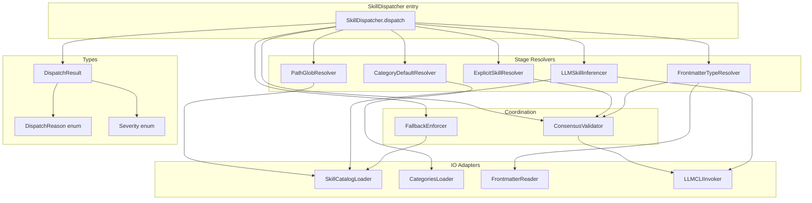
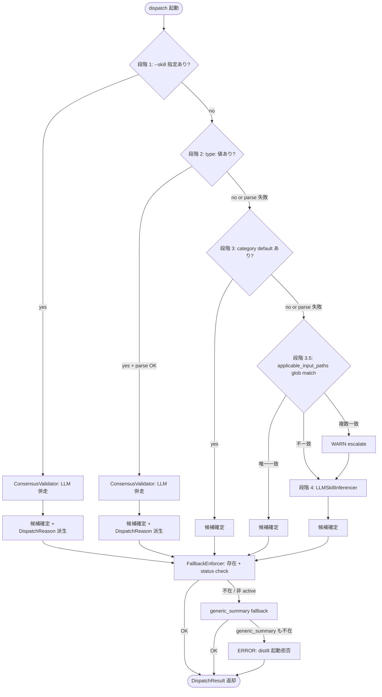
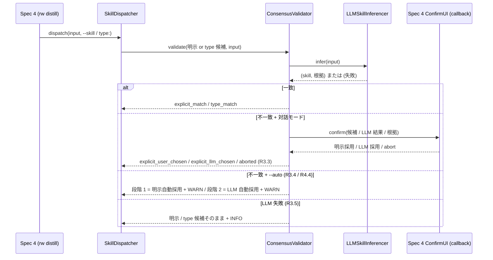
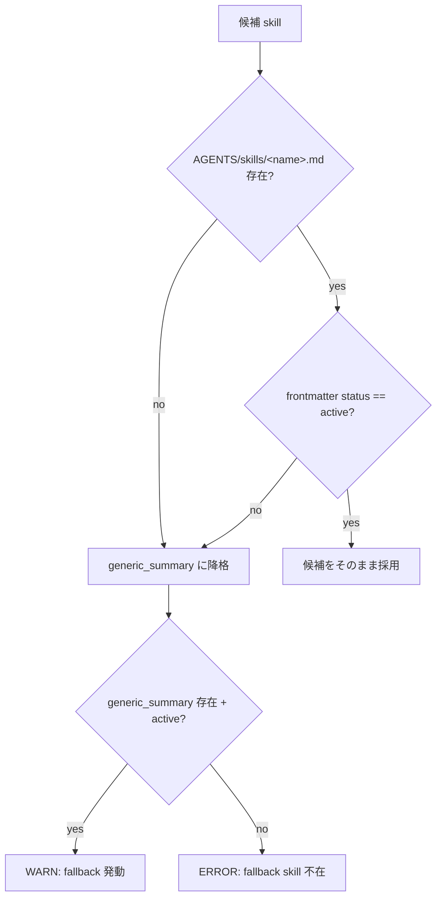

# Technical Design Document

## Overview

**Purpose**: 本 spec (Spec 3、Phase 4) は distill タスク起動時の **スキル選択 (dispatch) メカニズム** を実装する。複数候補 skill から 1 つを 5 段階固定優先順位 (明示 `--skill` → frontmatter `type:` → `categories.yml` の `default_skill` → `applicable_input_paths` glob match → LLM 毎回判定) で解決し、解決結果を `(skill_name, input_file, dispatch_reason, severity, notes)` の固定構造で `rw distill` (Spec 4) に返す。

**Users**: distill タスク利用者 (`rw distill <file>` 起動者) は明示指定なしでも妥当な skill が選ばれる。Spec 4 起票者は固定構造の dispatch 結果を受け取り、CLI 出力 / exit code 変換に専念できる。

**Impact**: distill 起動時の skill 選択が固定ヒューリスティック単独 (精度低下) と毎回明示指定 (ユーザー負担) の両極端から、**ヒューリスティック先行 + LLM フォールバック + コンセンサス確認** のハイブリッド構成に変わる。明示意図は最優先で尊重しつつ、コンテンツ依存の最適解を LLM が補完する。

### Goals

- 5 段階優先順位の判断ロジックを deterministic に固定し、明示意図の優先と LLM 推論の精度を両立する
- frontmatter `type:` / `categories.yml.default_skill` / `applicable_input_paths` glob match の各 stage を独立評価可能なコンポーネントに分離し、test 単位で完全 cover 可能にする
- LLM CLI 抽象層 (Foundation §1.2 / Spec 0 規範由来) を本 spec が提供し、subprocess timeout 必須化の規律を集中させる
- skill 不在 / 非 active / parse 失敗 / LLM 失敗の各失敗経路で `generic_summary` fallback または段階スキップによって dispatch を中断させない
- dispatch 結果オブジェクトの固定構造 (`DispatchResult`) を Spec 4 への入力 contract として確立する

### Non-Goals

- skill 内容そのもの (prompt / Processing Rules / Output schema) の定義 — Spec 2 が所管
- skill ファイル 8 section schema・frontmatter field 定義・install validation — Spec 2 が所管
- frontmatter `type:` field の宣言と vocabulary 整合 — Spec 1 が所管 (本 spec は読み取り側)
- `categories.yml` の schema 定義と編集 CLI — Spec 1 が所管
- `rw distill` CLI の引数 parse / `--skill` / `--auto` flag / 出力整形 / exit code 変換 — Spec 4 が所管
- Perspective / Hypothesis 生成での skill 呼び出し — Spec 6 が固定 skill `perspective_gen` / `hypothesis_gen` を直接呼ぶ (本 spec dispatch 対象外)
- Graph 抽出 skill (`entity_extraction` / `relation_extraction`) の起動 dispatch — Spec 4 の `rw extract-relations` が直接呼ぶ
- lint 支援 skill (`frontmatter_completion`) の起動 — Spec 4 の `rw lint --fix` が直接呼ぶ
- skill lifecycle (deprecate / retract / archive) — Spec 7 が所管 (本 spec は status 値を read-only で参照)
- コンセンサス確認の対話 UI (プロンプト文言・キー入力受付) — Spec 4 が所管 (本 spec は確認の必要性と 3 択を返す)

## Boundary Commitments

### This Spec Owns

- 5 段階優先順位の判断ロジック (短絡評価規律含む)
- 各 stage resolver の振る舞い契約 (ExplicitSkillResolver / FrontmatterTypeResolver / CategoryDefaultResolver / PathGlobResolver / LLMSkillInferencer)
- LLM 毎回判定方式の振る舞い契約 (cache せず毎回推論、subprocess timeout 必須化)
- `applicable_input_paths` glob と入力 path の **実 path match 計算** (Spec 2 R3.2 後段、Spec 2 Skill Validator が path 構文妥当性を検査するのに対し、本 spec は実 path 存在検証を所管)
- 明示 `--skill` / frontmatter `type:` と LLM 推論結果のコンセンサス確認ロジック (UI 詳細以外)
- `generic_summary` fallback 規約 (skill 不在 / 非 active / `--auto` 時の自動採用)
- dispatch 結果オブジェクト `DispatchResult` の構造 (skill_name / input_file / dispatch_reason / severity / notes)
- `dispatch_reason` enumeration 11 種 (`explicit_match` / `explicit_user_chosen` / `explicit_llm_chosen` / `type_match` / `type_user_chosen` / `type_llm_chosen` / `category_default` / `path_match` / `llm_inference` / `fallback_generic_summary` / `aborted`)
- LLM CLI 抽象層 (`LLMCLIInvoker`) の interface (subprocess timeout 必須、参照実装 = Claude Code)
- 通知 severity 4 水準 (CRITICAL / ERROR / WARN / INFO) のうち本 spec で発火する 3 水準 (ERROR / WARN / INFO) の付与規律
- 同一 dispatch ロジックを `rw distill` 以外の自然言語意図解釈 (`rw chat` 内「これを蒸留して」等) でも共有する規約

### Out of Boundary

- skill 内容 (prompt / Processing Rules / Output schema) — Spec 2
- skill ファイル 8 section schema・install validation・frontmatter field 定義 — Spec 2
- `frontmatter type:` field の宣言・許可値定義・vocabulary 整合 — Spec 1
- `categories.yml` schema 定義・編集 CLI・lint task — Spec 1
- `rw distill` CLI 引数 parse・出力整形・exit code 変換 — Spec 4
- 対話モード判定 (`--auto` flag や `rw chat` セッション判定) の所管 — Spec 4
- コンセンサス確認 UI (プロンプト文言・3 択キー入力受付) — Spec 4
- skill lifecycle 遷移 (deprecate / retract / archive 操作) — Spec 7
- Perspective / Hypothesis 生成 skill 呼び出し — Spec 6
- Graph 抽出 skill (`entity_extraction` / `relation_extraction`) 起動 — Spec 4 の `rw extract-relations`
- lint 支援 skill (`frontmatter_completion`) 起動 — Spec 4 の `rw lint --fix`
- LLM CLI の具体実装 (Claude Code / Codex 等の subprocess 呼び出し詳細) — 本 spec は抽象 interface のみ提供、各 LLM CLI への adapter は実装 task で具体化

### Allowed Dependencies

- **Spec 0 (Foundation)**: 用語集 / 13 中核原則 / Severity 4 水準 / exit code 0/1/2 規律。本 spec は SSoT として参照のみ
- **Spec 1 (classification)**:
  - `.rwiki/vocabulary/categories.yml` の inline `default_skill` / `recommended_type` field を **読み取り側** として参照
  - frontmatter `type:` field 値を **読み取り側** として参照 (許可値の vocabulary 整合は Spec 1 lint task が保証)
  - category 解決 (入力ファイル → category 名) はディレクトリベース、Spec 1 G1 `resolve_category` 準拠
  - **coordination SSoT 引用**: Spec 1 design G6 §「Coordination 1: Spec 1 ↔ Spec 3 (R11)」(line 731-737) で確定済の以下 5 件を本 spec が継承する。
    - R11.1 frontmatter `type:` を distill dispatch hint として利用 (推奨 field、Spec 3 が dispatch 時に inline で参照)
    - R11.2 `categories.yml.default_skill` inline field 方式採用 (別ファイル分離不採用、R7 と整合)
    - R11.3 `type:` 値の許可集合 = `categories.yml.recommended_type` + Spec 2 skill 群の `applicable_categories` の整合表、両 field の整合 check は独立に lint WARN として実装
    - R11.4 dispatch 5 段階優先順位 (明示 → `type:` → category default → `applicable_input_paths` glob match → LLM 判断)、**判断ロジック自体は本 spec 所管**
    - R11.5 将来の mapping 方式変更は roadmap.md「Adjacent Spec Synchronization」経路で Spec 1 を先に改版
  - 本 spec は Spec 1 R11 章を coordination 確定済の SSoT として認識し、本 spec 内で再交渉しない
- **Spec 2 (skill-library)**:
  - `AGENTS/skills/<name>.md` の frontmatter (name / origin / status / `applicable_categories` / `applicable_input_paths`) を **読み取り側** として参照
  - `generic_summary` skill が `origin: standard` で配布されることを前提
  - skill 8 section schema は本 spec の dispatch 範囲では参照しない (Spec 4 distill 実行時に消費)
  - **coordination SSoT 引用**: Spec 2 design §「Adjacent Sync 経路」(line 949) 内の `downstream Spec 3 (prompt-dispatch)` 項 (line 954) で「本 spec が `applicable_categories` / `applicable_input_paths` field を提供、Spec 3 が 5 段階優先順位 dispatch 構築」と確定済。本 spec は当該契約を継承し、provider 側 (Spec 2) と consumer 側 (本 spec) の責務分割を再交渉しない
- **Spec 4 (cli-mode-unification)**:
  - `rw distill` 起動時に本 spec dispatch を呼び出す (caller 関係)
  - コンセンサス確認 UI を Spec 4 が提供 (callback 関係、本 spec は確認要請のみ発行)
  - exit code 変換を Spec 4 が所管 (本 spec は severity を返却)
- **Python 標準ライブラリ**:
  - `subprocess` (LLM CLI 呼び出し、timeout 必須)
  - `pathlib` / `fnmatch` (glob match、`**` recursive は自前正規化)
  - 標準 YAML parser (PyYAML、Spec 1 / Spec 2 と整合)

依存方向: Types → IO Adapters → Stage Resolvers → Coordination Layer → SkillDispatcher (entry)。逆方向の import は禁止。

### dispatch 対象範囲の SSoT 整合 note

drafts SSoT (`rwiki-v2-consolidated-spec.md` v0.7.13 §7.2 Spec 3 line 1563) は本 spec Purpose を「distill タスクでのスキル選択メカニズムを定義」と記述、distill 専用と固定する。本 spec requirements (line 39) では「`rw distill` 以外の自然言語意図解釈 (`rw chat` 内『これを蒸留して』等) から呼び出される場合も、同一 dispatch ロジックを共有する規約」を追加しているが、これは distill 範囲の **自然言語 entry point 拡張** (dispatch 処理は同一) であり、SSoT の distill 専用 boundary を逸脱しない。本 spec design は両者整合の以下 2 経路のみを dispatch 対象とする:

- `rw distill <file>` の CLI 直接起動 (Spec 4 引数 parse 経由)
- `rw chat` 内の自然言語意図解釈 (LLM が「これを蒸留して」等を distill 起動と解釈し、本 spec dispatch を呼ぶ)

R10.1 / R10.2 / R10.5 / R9.8 で Perspective / Hypothesis 生成 / Graph 抽出 (`entity_extraction` / `relation_extraction`) / lint 支援 (`frontmatter_completion`) / その他 CLI コマンドは本 spec dispatch 対象外であることを再確認する。

### Revalidation Triggers

以下の変更が発生した場合、本 spec 設計と隣接 spec の整合再 check が必要となる。

- **Spec 1 ↔ Spec 3**: frontmatter `type:` 許可値定義 / `categories.yml` `default_skill` field 方式 / category 解決ロジック (ディレクトリベース → 別方式) の変更 → 本 spec の段階 2-3 / `FrontmatterTypeResolver` / `CategoryDefaultResolver` 影響
- **Spec 2 ↔ Spec 3**: skill カタログ追加 / 削除 / `applicable_categories` / `applicable_input_paths` field schema 変更 / `status` 値域変更 / `generic_summary` の `origin` 変更 → 本 spec の段階 3.5 / 段階 4 / Requirement 6 fallback 影響
- **Spec 4 ↔ Spec 3**: `DispatchResult` フィールド追加 / 削除、`dispatch_reason` enumeration 変更、コンセンサス UI 仕様変更 → 本 spec と Spec 4 design 双方の Adjacent Sync が必要
- **Spec 4 design line 172 dispatch 対象範囲不整合 (本 spec design phase で発見、Adjacent Sync 必要)**: Spec 4 design line 172 が `Spec3Dispatch` の呼出範囲を `rw distill` / `rw query *` / `rw audit semantic` / `rw audit strategic` / `rw retag` の 5 種に拡張記述しているが、drafts SSoT (§7.2 line 1563) / 本 spec requirements R9.8 / R10.1 / R10.5 では distill 専用 + Graph 抽出 / lint 支援 / その他 CLI コマンドは dispatch 対象外と明記。**Spec 4 design 側を本 spec 範囲 (distill + chat 自然言語意図解釈経由のみ) に訂正する Adjacent Sync が必要**。本 spec approve 後の Adjacent Sync 工程で Spec 4 design line 172 を訂正、本 spec design は SSoT 整合 (distill 専用) で固定
- **Foundation 規範**: Severity 4 水準・exit code 0/1/2 分離・LLM CLI 抽象層規定 (§1.2) の改版 → 本 spec の Severity 付与規律および `LLMCLIInvoker` interface 影響
- **Spec 7 ↔ Spec 3**: skill `status` 遷移経路の追加 (新規 status 値の導入) → 本 spec の Requirement 6 fallback 判定影響

## Architecture

### Existing Architecture Analysis

本 spec は新規 spec (extends 対象なし、`v1-archive/` の `agents-system` は参考のみ)。整合すべき既存パターンは以下:

- **モジュール DAG 分割** (steering tech.md / v1 module-split 継承): `rw_<module>.py` ≤ 1500 行 / モジュール修飾参照 (`rw_<module>.<symbol>`) / 後方互換 re-export 禁止
- **append-only JSONL** (Spec 5): 本 spec は graph ledger を直接書き込まないため適用外。dispatch 経路で発生する通知は呼び出し側 (Spec 4) が `logs/distill_latest.json` 等に整形 (本 spec は構造化 dict を返すのみ)
- **Severity 4 水準 + exit code 0/1/2 分離** (roadmap.md / steering tech.md): 本 spec は severity を返却、exit code 変換は Spec 4
- **subprocess timeout 必須** (roadmap.md / v1 cli-audit 継承): `LLMCLIInvoker` interface で必須化
- **対話 UI 詳細を CLI 層に集中** (Spec 4 design): 本 spec は確認要請とユーザー選択結果の受け取りのみ、UI 詳細は Spec 4 callback

### Architecture Pattern & Boundary Map

本 spec は **Pipeline + Strategy** の組合せパターンを採用する。

- **Pipeline**: 5 段階を逐次評価する短絡評価 (R1.2)
- **Strategy**: 各 stage を `StageResolver` interface で抽象化、stage 固有のロジックは個別 strategy に閉じ込める



**Architecture Integration**:

- **Selected pattern**: Pipeline + Strategy。Pipeline で短絡評価を表現し、Strategy で stage 固有ロジックを分離
- **Domain/feature boundaries**: 各 stage resolver / coordination / IO adapter / types の 4 層、層をまたぐ参照は厳格な単方向 (Types ← IO ← Resolvers ← Coordination ← Dispatcher)
- **Existing patterns preserved**: モジュール DAG 分割 / Severity 4 水準 / subprocess timeout 必須 / 対話 UI を CLI 層に集中
- **New components rationale**: `LLMCLIInvoker` は Foundation §1.2 規範 (LLM 非依存、抽象層は本 spec で定義) の具体化。stage resolver 5 種は requirements R1 の 5 段階を 1:1 で対応させた最小分離
- **Steering compliance**: ≤ 1500 行 / モジュール修飾参照 / `rw_<module>` 命名

### Technology Stack

| Layer | Choice / Version | Role in Feature | Notes |
|-------|------------------|-----------------|-------|
| ランタイム | Python 3.10+ | 全モジュール実装 | 型ヒント完全使用 (steering tech.md) |
| YAML parser | PyYAML (任意 6.x) | `categories.yml` / frontmatter / skill frontmatter parse | Spec 1 / Spec 2 と整合、新規依存なし |
| Glob match | Python 標準 `pathlib.PurePath.match` + `fnmatch` + 自前 `**` 正規化 | `applicable_input_paths` glob match (extended glob 互換) | Python 3.10 では `**` recursive を `fnmatch` で直接処理できないため自前正規化、Spec 2 と同方針 |
| LLM CLI 呼び出し | Python 標準 `subprocess.run(timeout=...)` | LLM CLI 抽象層 (`LLMCLIInvoker`) | timeout 必須化 (roadmap.md「v1 から継承」)、デフォルト値は本 spec で確定 |
| ログ出力 | Python 標準 `logging` | INFO/WARN/ERROR 通知 | severity prefix は Spec 4 が CLI 出力で付与 |

新規 dependency なし (PyYAML / Python 標準のみ)。

## File Structure Plan

### Directory Structure

```
scripts/
├── rw_dispatch.py                # SkillDispatcher entry point + 5 stage 統合 + 短絡評価
├── rw_dispatch_resolvers.py      # 段階 1/2/3/3.5 resolver (Explicit / FrontmatterType / CategoryDefault / PathGlob) + ConsensusValidator + FallbackEnforcer
├── rw_dispatch_io.py             # SkillCatalogLoader + CategoriesLoader + FrontmatterReader (純 IO Adapter)
├── rw_dispatch_llm.py            # 段階 4 LLMSkillInferencer + LLMCLIInvoker (LLM 抽象層 = Foundation §1.2 規範具体化、subprocess timeout)
└── rw_dispatch_types.py          # DispatchResult dataclass + DispatchReason / Severity enum + ResolvedCandidate / Notification

tests/
├── test_rw_dispatch_stages.py        # 5 stage resolver 単体 (各 stage 独立、短絡評価含む)
├── test_rw_dispatch_consensus.py     # 段階 1 / 2 の LLM 併走 + 一致 / 不一致 + abort 経路
├── test_rw_dispatch_fallback.py      # Requirement 6 dispatch 直前 check + generic_summary
├── test_rw_dispatch_path_match.py    # 段階 3.5 glob match (単一 / 複数 / null / 空配列 / extended glob `**`)
├── test_rw_dispatch_llm_inference.py # LLMSkillInferencer (cache せず / timeout / 異常終了)
├── test_rw_dispatch_io.py            # SkillCatalogLoader / CategoriesLoader / FrontmatterReader (parse 失敗含む)
└── test_rw_dispatch_integration.py   # entry to result の end-to-end (5 段階 + fallback + コンセンサス)
```

各ファイル ≤ 1500 行 (steering tech.md 規律)。File 配置の依存方向: `types` → `io` / `llm` → `resolvers` → `dispatch` (左の file は右の file を import しない)。

- 段階 1-3.5 resolver (LLM を使わない deterministic match) は `rw_dispatch_resolvers.py` に集約し、resolver 間の共通ロジック (例: skill 存在 + status check) を共有
- 段階 4 `LLMSkillInferencer` は LLM CLI 抽象層 (`LLMCLIInvoker`) と密結合のため `rw_dispatch_llm.py` にまとめ、Foundation §1.2 規範 (LLM 非依存抽象層) を 1 file に集中
- IO Adapters (`SkillCatalogLoader` / `CategoriesLoader` / `FrontmatterReader`) は純 disk read で LLM を含まないため `rw_dispatch_io.py` に分離

責務 Layer (Architecture 図) と File 配置の対応: Layer 2 の `LLMSkillInferencer` のみ Layer 4 IO (`LLMCLIInvoker`) と同 file (`rw_dispatch_llm.py`) に置く。これは Layer をまたぐ依存方向 (Layer 2 → Layer 4) を file 単位で局所化し、他 stage resolver (Layer 2) が LLM 関連 import を持たない構造を保つため。

### Modified Files

- なし。本 spec は新規 spec、既存ファイルへの修正は発生しない。Spec 4 の `rw distill` 実装で `import rw_dispatch` を追加するのは Spec 4 task の責任範囲。

## System Flows

### Flow 1: 5 段階 dispatch + 短絡評価 (R1)



短絡評価 (R1.2): 上位段階で候補が確定可能な場合、下位段階を評価しない。ただし段階 1 / 2 はコンセンサス確認のため LLM 推論を併走させる。段階 3 / 3.5 はコンセンサス確認対象外 (deterministic dispatch)。

### Flow 2: コンセンサス確認 (R3 / R4)



UI 詳細 (プロンプト文言・キー入力受付) は Spec 4 が所管 (R3.6)。本 spec は (a) 候補 / (b) LLM 結果 / (c) 根拠 を渡す callback interface のみ提供。

### Flow 3: Fallback Enforcer (R6 dispatch 直前 check)



fallback 採用は段階番号に依存しない (R6.7)。明示 `--skill` 指定の不存在も同じ fallback 経路を通る (R6.6)。

## Requirements Traceability

| Requirement | Summary | Components | Interfaces | Flows |
|-------------|---------|------------|------------|-------|
| 1.1 | 5 段階優先順位の評価 | SkillDispatcher | `dispatch()` | Flow 1 |
| 1.2 | 短絡評価 (上位確定で下位スキップ) | SkillDispatcher | `dispatch()` 内ループ制御 | Flow 1 |
| 1.3 | 段階 1: `--skill` 最優先 + コンセンサス確認 | ExplicitSkillResolver / ConsensusValidator | `resolve()` / `validate()` | Flow 2 |
| 1.4 | 段階 2: `type:` 派生候補 + コンセンサス確認 | FrontmatterTypeResolver / ConsensusValidator | `resolve()` / `validate()` | Flow 2 |
| 1.5 | 段階 3: `categories.yml.default_skill` 採用 | CategoryDefaultResolver / CategoriesLoader | `resolve()` / `load()` | Flow 1 |
| 1.6 | 段階 3.5: glob match で唯一確定 | PathGlobResolver / SkillCatalogLoader | `resolve()` / `load_active_skills()` | Flow 1 |
| 1.7 | 段階 3.5: 複数一致で WARN escalate → 段階 4 | PathGlobResolver / SkillDispatcher | `resolve()` 戻り値 + WARN 付与 | Flow 1 |
| 1.8 | 段階 1〜3.5 不確定で段階 4 進行 | SkillDispatcher | `dispatch()` 内 fallthrough | Flow 1 |
| 1.9 | 各段階確定後に R6 存在 + status check | FallbackEnforcer | `enforce()` | Flow 3 |
| 2.1 | 段階 4 LLM 推論 (毎回 content 読込) | LLMSkillInferencer / FrontmatterReader | `infer()` / `read()` | — |
| 2.2 | 推論結果 = (skill, 根拠, 信頼度任意) | LLMSkillInferencer | `infer() → InferredSkill` | — |
| 2.3 | LLM プロンプトに `applicable_categories` / `applicable_input_paths` 含める | LLMSkillInferencer | `build_prompt()` | — |
| 2.4 | LLM 推論を cache しない | LLMSkillInferencer | `infer()` 仕様 (毎回新規呼び出し) | — |
| 2.5 | LLM CLI subprocess timeout 必須 | LLMCLIInvoker | `invoke()` (timeout 引数必須) | — |
| 2.6 | LLM 失敗 → R6 fallback + WARN | LLMSkillInferencer / FallbackEnforcer | `infer()` 例外 → fallback 経路 | Flow 3 |
| 2.7 | 不存在 skill 名返却 → R6 fallback | FallbackEnforcer | `enforce()` | Flow 3 |
| 3.1 | 段階 1 で LLM 併走 | ConsensusValidator / LLMSkillInferencer | `validate()` 内 LLM 呼び出し | Flow 2 |
| 3.2 | 一致 → 確認なしに明示採用 (`explicit_match`) | ConsensusValidator | `validate()` 戻り値 | Flow 2 |
| 3.3 | 不一致 → 3 択 confirm | ConsensusValidator (UI callback) | `request_confirmation()` | Flow 2 |
| 3.4 | `--auto` 時 不一致で明示自動採用 + WARN | ConsensusValidator | `validate()` モード分岐 | Flow 2 |
| 3.5 | LLM 併走失敗 → 明示そのまま + INFO | ConsensusValidator | `validate()` 例外処理 | Flow 2 |
| 3.6 | UI 詳細を Spec 4 に委譲 | (Spec 4 callback boundary) | `ConfirmUICallback` interface | Flow 2 |
| 4.1 | 段階 2 で LLM 併走 | ConsensusValidator | `validate()` | Flow 2 |
| 4.2 | 一致 → 確認なしに `type:` 由来採用 (`type_match`) | ConsensusValidator | `validate()` 戻り値 | Flow 2 |
| 4.3 | 不一致 → 3 択 confirm | ConsensusValidator | `request_confirmation()` | Flow 2 |
| 4.4 | `--auto` 時 不一致で LLM 採用 + WARN (精度優先) | ConsensusValidator | `validate()` モード分岐 | Flow 2 |
| 4.5 | `type:` → skill マッピング表 (`recommended_type` × `applicable_categories` 整合表) | FrontmatterTypeResolver | `derive_skill_from_type()` | — |
| 4.6 | `type:` 値 unknown → 段階 3 降格 + INFO | FrontmatterTypeResolver | `resolve()` 戻り値 None | — |
| 4.7 | frontmatter parse 失敗 → 段階 2 スキップ + WARN | FrontmatterReader / FrontmatterTypeResolver | `read()` 例外 → `resolve()` 戻り値 None | — |
| 5.1 | 段階 3 で `categories.yml` 起動時読込 | CategoriesLoader | `load()` | — |
| 5.2 | inline `default_skill` 方式採用 (Spec 1 R7.2 / R11.2 整合) | CategoriesLoader | parse schema | — |
| 5.3 | category 不属 → 段階 3 スキップ → 段階 4 | CategoryDefaultResolver | `resolve()` 戻り値 None | — |
| 5.4 | `default_skill` 未設定 → 段階 3 スキップ + INFO | CategoryDefaultResolver | `resolve()` 戻り値 + INFO 付与 | — |
| 5.5 | `categories.yml` cache せず | CategoriesLoader | `load()` (毎回 disk 読込) | — |
| 5.6 | `categories.yml` 不在 → 段階 3 スキップ + INFO | CategoriesLoader / CategoryDefaultResolver | `load()` FileNotFound 処理 | — |
| 5.7 | `default_skill` 値の存在整合 check は Spec 1 lint 委譲、本 spec dispatch 時不在は R6 fallback | FallbackEnforcer | `enforce()` (skill 存在 check) | Flow 3 |
| 5.8 | `categories.yml` parse 失敗 → 段階 3 スキップ + WARN | CategoriesLoader | `load()` YAMLError 処理 | — |
| 6.1 | dispatch 直前 skill 存在 + `status: active` check | FallbackEnforcer | `enforce()` | Flow 3 |
| 6.2 | 不存在 → `generic_summary` fallback | FallbackEnforcer | `enforce()` | Flow 3 |
| 6.3 | 非 active (`deprecated`/`retracted`/`archived`) → `generic_summary` fallback | FallbackEnforcer | `enforce()` | Flow 3 |
| 6.4 | fallback 発動 → WARN | FallbackEnforcer | `enforce()` 戻り値 + WARN 付与 | Flow 3 |
| 6.5 | `generic_summary` も不在 → ERROR + 起動拒否 | FallbackEnforcer | `enforce()` 例外送出 | Flow 3 |
| 6.6 | 明示 `--skill` 不存在も同 fallback | ExplicitSkillResolver / FallbackEnforcer | `resolve()` → `enforce()` | Flow 3 |
| 6.7 | fallback は段階番号非依存 | FallbackEnforcer | `enforce()` 共通経路 | Flow 3 |
| 7.1 | DispatchResult 必須フィールド (skill_name / input_file / dispatch_reason / severity / notes) | DispatchResult dataclass | フィールド型 | — |
| 7.2 | `dispatch_reason` enumeration 11 種 | DispatchReason enum | enum 値域 | — |
| 7.3 | `aborted` 時 skill_name 空 / sentinel + severity = INFO + notes 集約 | DispatchResult / ConsensusValidator | aborted 経路 | Flow 2 |
| 7.4 | 構造を design phase で固定、Spec 4 が contract として消費 | DispatchResult | dataclass schema | — |
| 7.5 | 構造変更は Adjacent Sync 経路 | (governance) | 設計決定事項 §記載 | — |
| 8.1 | frontmatter `type:` を読み取り側として参照 | FrontmatterReader / FrontmatterTypeResolver | — | — |
| 8.2 | inline `default_skill` を読み取り側として参照 | CategoriesLoader / CategoryDefaultResolver | — | — |
| 8.3 | dispatch 優先順位の判断ロジックは本 spec 所管 (Spec 1 R11.4 への Adjacent Sync 別途) | SkillDispatcher | — | Flow 1 |
| 8.4 | Spec 1 値域変更時は Spec 1 先改版 | (governance) | 設計決定事項 §記載 | — |
| 8.5 | Spec 1 = field 宣言、Spec 3 = 値解釈 + 判断ロジックの境界明文化 | (boundary §) | — | — |
| 9.1 | Spec 2 distill 向け 12 種を candidate pool として参照 | SkillCatalogLoader / LLMSkillInferencer | `load_distill_skills()` | — |
| 9.2 | `generic_summary` を fallback の前提として認識 | FallbackEnforcer | `enforce()` | Flow 3 |
| 9.3 | `applicable_categories` を LLM ヒント + `type:` 整合 check に利用 | LLMSkillInferencer / FrontmatterTypeResolver | — | — |
| 9.4 | `applicable_input_paths` を段階 3.5 + LLM ヒントに利用、実 path 存在検証は本 spec 所管 | PathGlobResolver / LLMSkillInferencer | `match_paths()` | — |
| 9.5 | `applicable_categories` null/空 → 全カテゴリ可用 | SkillCatalogLoader / FrontmatterTypeResolver | parse 仕様 | — |
| 9.6 | `applicable_input_paths` null/空 → 段階 3.5 候補から除外 | PathGlobResolver | `match_paths()` 仕様 | — |
| 9.7 | 新規 standard skill 追加時の整合再 check は design phase で扱う | (governance) | 設計決定事項 §記載 | — |
| 9.8 | Graph 抽出 / lint 支援 skill は dispatch 対象外 | SkillCatalogLoader | `load_distill_skills()` フィルタ | — |
| 9.9 | `AGENTS/skills/*.md` cache せず毎回読込 | SkillCatalogLoader | `load()` 仕様 | — |
| 10.1 | dispatch は distill 専用 | SkillDispatcher | entry interface | — |
| 10.2 | `rw perspective` / `rw hypothesize` は本 spec dispatch 不経由 | (boundary §) | — | — |
| 10.3 | Spec 6 固定 skill 直接呼び出しを認知 | (boundary §) | — | — |
| 10.4 | 将来 Perspective dispatch 必要時は新規 spec で扱う | (governance) | 設計決定事項 §記載 | — |
| 10.5 | Graph / lint skill 非対象を再確認 | SkillCatalogLoader | フィルタ仕様 | — |
| 11.1 | severity 4 水準採用 | Severity enum | enum 値域 | — |
| 11.2 | severity 付与表 (ERROR / WARN / INFO) | DispatchResult / 全コンポーネント | severity 付与規律 | — |
| 11.3 | severity → exit code 変換は Spec 4 | (boundary §) | — | — |
| 11.4 | 複数通知時 notes 集約 + 最重 severity 採用 | DispatchResult / SkillDispatcher | `merge_notifications()` | — |
| 11.5 | timeout 未設定実装は ERROR で reject | LLMCLIInvoker | type-level 強制 (timeout: int 必須引数) | — |
| 12.1 | 用語集 Spec 0 整合 | (全セクション) | — | — |
| 12.2 | 日本語記述 + spec.json.language=ja | (全セクション) | — | — |
| 12.3 | 表は最小限、長文は箇条書き / 段落 | (全セクション) | — | — |
| 12.4 | SSoT 出典参照点保持 | (Supporting References §) | — | — |
| 12.5 | SSoT 改版時 Adjacent Sync ルール継承 | (governance) | 設計決定事項 §記載 | — |
| 12.6 | design phase で Boundary Commitments 再確認 | (Boundary Commitments §) | — | — |

## Components and Interfaces

### Layer 1: SkillDispatcher (Entry)

#### Component: SkillDispatcher

| Field | Detail |
|-------|--------|
| Intent | 5 段階を逐次評価し短絡評価で最初の確定候補を取得、FallbackEnforcer を経由して `DispatchResult` を返す entry point |
| Requirements | 1.1, 1.2, 1.8, 7.1, 7.4, 8.3, 10.1, 11.4 |

**Responsibilities & Constraints**

- 5 段階を固定順序で評価し、各 stage resolver から `Optional[ResolvedCandidate]` を受け取る
- 段階 1 / 2 で確定した候補は ConsensusValidator を経由 (LLM 併走)、段階 3 / 3.5 は併走なし、段階 4 は LLM 推論そのもの
- 全 stage で確定不可の場合は ERROR を発火しない (段階 4 LLM 推論まで進む保証)
- 確定候補に対して FallbackEnforcer を必ず経由
- 通知 severity の集約 (R11.4): 複数 stage / 段階で発生した notification を notes に集約し、最終 severity は最重度を採用

**Dependencies**

- Inbound: Spec 4 `rw distill` / `rw chat` 自然言語意図解釈経路 (P0)
- Outbound: ExplicitSkillResolver / FrontmatterTypeResolver / CategoryDefaultResolver / PathGlobResolver / LLMSkillInferencer / ConsensusValidator / FallbackEnforcer (P0)
- External: なし

**Contracts**: Service [x] / API [ ] / Event [ ] / Batch [ ] / State [ ]

##### Service Interface

```python
@dataclass(frozen=True)
class DispatchInput:
  input_file: Path                           # 絶対 path
  explicit_skill: Optional[str]              # --skill 指定値、None = 未指定
  interactive_mode: bool                     # True = 対話可、False = --auto 等
  confirm_ui: Optional[ConfirmUICallback]    # 対話モード時の callback (Spec 4 提供)

class SkillDispatcher:
  def __init__(
    self,
    skill_catalog: SkillCatalogLoader,
    categories: CategoriesLoader,
    frontmatter: FrontmatterReader,
    llm_invoker: LLMCLIInvoker,
  ) -> None: ...

  def dispatch(self, input_obj: DispatchInput) -> DispatchResult:
    """5 段階を逐次評価し DispatchResult を返す。

    Preconditions:
      - input_obj.input_file は読取り可能
      - skill_catalog / categories / frontmatter / llm_invoker は初期化済
    Postconditions:
      - 必ず DispatchResult を返す (例外送出は generic_summary も不在の R6.5 のみ)
      - dispatch_reason は DispatchReason enum 11 種のいずれか
      - severity は ERROR / WARN / INFO (CRITICAL は本 spec 範囲では発火しない)
    Invariants:
      - 短絡評価: 上位 stage で確定したら下位は評価しない (段階 1 / 2 のコンセンサス LLM 併走を除く)
    """
    ...
```

**Implementation Notes**

- Integration: Spec 4 が `rw distill` から `dispatch()` を呼ぶ。callback `ConfirmUICallback` を Spec 4 が提供
- Validation: input_obj.input_file の絶対 path 化は呼び出し側責務、本 spec は読み取り検証のみ
- Risks: stage resolver の単方向依存違反を防ぐため import 規律 (`rw_dispatch.py` のみが他 4 モジュールを import) を守る

### Layer 2: Stage Resolvers (5 種)

#### Component: ExplicitSkillResolver (段階 1)

| Field | Detail |
|-------|--------|
| Intent | `--skill <name>` 指定値を最優先候補として返す。コンセンサス確認は SkillDispatcher 側で発火 |
| Requirements | 1.3, 6.6 |

**Responsibilities & Constraints**

- `DispatchInput.explicit_skill` が None なら None を返す (段階スキップ)
- 値があれば snake_case 構文 check のみ実施 (skill 存在 check は FallbackEnforcer に委譲)

**Service Interface**

```python
class ExplicitSkillResolver:
  def resolve(self, input_obj: DispatchInput) -> Optional[ResolvedCandidate]:
    """--skill 指定値を candidate として返す。指定なしなら None"""
    ...
```

#### Component: FrontmatterTypeResolver (段階 2)

| Field | Detail |
|-------|--------|
| Intent | 入力ファイルの frontmatter `type:` 値から候補 skill を導出 (R4.5 マッピング表) |
| Requirements | 1.4, 4.1, 4.5, 4.6, 4.7, 8.1, 9.3 |

**Responsibilities & Constraints**

- `FrontmatterReader.read(input_file)` で YAML parse
- parse 失敗 → None + WARN (R4.7、Spec 1 lint task に委譲する二重防御)
- `type:` 値が unknown → None + INFO (R4.6)
- `type:` 値 → skill 名マッピング表は `categories.yml.recommended_type` × Spec 2 `applicable_categories` の整合表から導出 (R4.5)

**Implementation Notes**

- マッピング表の生成は dispatch 起動時に一度実行 (各 stage resolver は同じ table 参照、`SkillCatalogLoader` + `CategoriesLoader` の cross-product で導出)
- マッピング表自体はメモリ上のみ保持、disk persist しない (cache せず毎回再構築、R5.5 / R9.9 整合)

**Service Interface**

```python
class FrontmatterTypeResolver:
  def resolve(self, input_obj: DispatchInput) -> Optional[ResolvedCandidate]:
    """frontmatter type: 値から候補 skill を導出。
    parse 失敗 / unknown / 未指定 → None。
    """
    ...
```

#### Component: CategoryDefaultResolver (段階 3)

| Field | Detail |
|-------|--------|
| Intent | 入力ファイルが属する category の `default_skill` 値を返す |
| Requirements | 1.5, 5.1, 5.2, 5.3, 5.4, 5.5, 5.6, 5.8, 8.2 |

**Responsibilities & Constraints**

- 入力ファイル path から category を解決 (Spec 1 G1 `resolve_category` ロジック準拠、ディレクトリベース)
- `CategoriesLoader.load()` で起動時毎回読込 (cache せず、R5.5)
- category が `categories.yml` に未登録 → None (R5.3)
- `default_skill` field 未設定 → None + INFO (R5.4)
- `categories.yml` 不在 → None + INFO (R5.6)
- parse 失敗 → None + WARN (R5.8、Spec 1 lint task 委譲の二重防御)

**Service Interface**

```python
class CategoryDefaultResolver:
  def resolve(self, input_obj: DispatchInput) -> Optional[ResolvedCandidate]:
    """入力ファイルが属する category の default_skill 値を candidate として返す。
    category 不属 / default_skill 未設定 / 不在 / parse 失敗 → None"""
    ...
```

#### Component: PathGlobResolver (段階 3.5)

| Field | Detail |
|-------|--------|
| Intent | 入力 file path に対し `applicable_input_paths` glob match する skill を絞り込み、唯一なら候補確定、複数なら段階 4 にエスカレート |
| Requirements | 1.6, 1.7, 9.4, 9.6 |

**Responsibilities & Constraints**

- `SkillCatalogLoader.load_active_skills()` で `status: active` の skill のみを candidate pool として取得 (R1.6 frontmatter `status: active` 事前 filter、R6.1 dispatch 直前 check との整合)
- `applicable_input_paths` が null / 空配列の skill は match 候補から除外 (R9.6)
- extended glob 互換 (POSIX `*` / `?` / `[...]` + `**` recursive) で match 計算
- 唯一 match → ResolvedCandidate (R1.6)
- 複数 match → MultipleMatchEscalate (sentinel) を返し、SkillDispatcher が WARN + 段階 4 に escalate (R1.7)
- 0 match → None (段階 4 へ自然 fallthrough、R1.8)

**Service Interface**

```python
class PathGlobResolver:
  def resolve(self, input_obj: DispatchInput) -> ResolvedOrEscalate:
    """段階 3.5 の glob match 評価。
    Returns:
      ResolvedCandidate (唯一一致)
      | MultipleMatchEscalate (複数一致 → 段階 4 escalate + WARN)
      | None (不一致)
    """
    ...
```

**Implementation Notes**

- Integration: Python 3.10 標準 `pathlib.PurePath.match` は `**` recursive を 1 segment にしか展開しないため、`fnmatch.translate` で正規表現変換した上で `**` を `.*` に置換する自前正規化を行う (Spec 2 と同方針)
- Validation: `applicable_input_paths` 各値は Skill Validator (Spec 2) が構文妥当性 check 済 (R9.4 整合)、本 spec dispatch では存在前提で実 path match のみ評価

#### Component: LLMSkillInferencer (段階 4)

| Field | Detail |
|-------|--------|
| Intent | 入力 content + skill catalog + ヒント (`applicable_categories` / `applicable_input_paths`) を LLM に渡し、推奨 skill 名 + 根拠 + 信頼度 (任意) を返す |
| Requirements | 2.1, 2.2, 2.3, 2.4, 2.6, 2.7, 9.1, 9.3, 9.4 |

**Responsibilities & Constraints**

- `FrontmatterReader.read_content(input_file)` で content 全体を毎回読込 (R2.1 cache せず)
- `SkillCatalogLoader.load_distill_skills()` で 12 distill skill を毎回読込 (R9.1 / R9.9 cache せず)
- LLM プロンプトに各 skill の `applicable_categories` / `applicable_input_paths` を含める (R2.3)
- `LLMCLIInvoker.invoke(prompt, timeout=...)` で subprocess 呼び出し
- timeout / 異常終了 / 推論失敗 → 例外送出 (SkillDispatcher が R2.6 fallback + WARN に変換)
- 結果 skill 名が catalog に存在しない → SkillDispatcher が R2.7 fallback に変換 (FallbackEnforcer 経由)

**Service Interface**

```python
@dataclass(frozen=True)
class InferredSkill:
  skill_name: str
  rationale: str
  confidence: Optional[float] = None  # LLM が信頼度を出力しない場合 None

class LLMSkillInferencer:
  def infer(self, input_file: Path, candidate_pool: list[SkillMeta]) -> InferredSkill:
    """LLM 推論を 1 回実行。
    Raises:
      LLMTimeout: subprocess timeout 経過
      LLMInvocationError: 異常終了 / 推論失敗
    """
    ...
```

### Layer 3: Coordination

#### Component: ConsensusValidator (段階 1 / 2 共通)

| Field | Detail |
|-------|--------|
| Intent | 段階 1 / 2 で確定した候補に対して LLM 推論を併走させ、一致 / 不一致を判定。不一致時は対話モードに応じて confirm UI 起動 / 自動採用 |
| Requirements | 3.1, 3.2, 3.3, 3.4, 3.5, 3.6, 4.1, 4.2, 4.3, 4.4 |

**Responsibilities & Constraints**

- 候補 + DispatchInput を受け取り、`LLMSkillInferencer.infer()` で LLM 結果を取得
- 一致 → `ConsensusResult.Match` (`explicit_match` / `type_match` を SkillDispatcher が判定)
- 不一致 + 対話モード → `confirm_ui` callback で 3 択 (明示採用 / LLM 採用 / abort) を取得 (R3.3 / R4.3)
- 不一致 + `--auto` モード → 段階 1 = 明示自動採用 + WARN (R3.4) / 段階 2 = LLM 自動採用 + WARN (R4.4、精度優先方針)
- LLM 失敗 → `ConsensusResult.LLMFailed` (SkillDispatcher が明示そのまま採用 + INFO に変換、R3.5)
- abort → `ConsensusResult.Aborted` (SkillDispatcher が `aborted` reason + INFO + 経緯 notes 集約に変換、R7.3)

**Service Interface**

```python
ConsensusResult = Union[
  Match,                # 一致
  ExplicitChosen,       # 不一致 → 明示採用 (対話 / --auto 共通)
  LLMChosen,            # 不一致 → LLM 採用 (対話 / --auto 共通)
  Aborted,              # 対話で user が abort 選択
  LLMFailed,            # LLM 推論失敗
]

ConfirmUICallback = Callable[[ConfirmRequest], ConfirmResponse]

@dataclass(frozen=True)
class ConfirmRequest:
  candidate: str            # 明示 or type: 由来
  llm_inferred: str         # LLM 推論結果
  llm_rationale: str        # LLM 根拠

@dataclass(frozen=True)
class ConfirmResponse:
  choice: Literal["candidate", "llm", "abort"]

class ConsensusValidator:
  def validate(
    self,
    candidate: ResolvedCandidate,
    input_obj: DispatchInput,
    stage: Literal["explicit", "type"],
  ) -> ConsensusResult: ...
```

**Implementation Notes**

- UI 詳細 (プロンプト文言・キー入力受付方式) は Spec 4 が `ConfirmUICallback` 実装で提供 (R3.6)
- 本 spec test では mock callback で 3 択をシミュレート

#### Component: FallbackEnforcer (R6 dispatch 直前 check)

| Field | Detail |
|-------|--------|
| Intent | 確定候補に対して dispatch 実行直前に skill 存在 + `status: active` を check し、不可なら `generic_summary` に降格 |
| Requirements | 1.9, 6.1, 6.2, 6.3, 6.4, 6.5, 6.6, 6.7, 9.2 |

**Responsibilities & Constraints**

- `SkillCatalogLoader` で skill メタを取得し存在 + `status: active` を check (R6.1)
- 不存在 / 非 active → `generic_summary` に降格 + WARN (R6.2 / R6.3 / R6.4)
- `generic_summary` も不在 / 非 active → ERROR + 例外送出 (R6.5、SkillDispatcher が exit code 2 経路に渡す)
- 段階番号非依存 (R6.7、明示 / type / category default / path / LLM 推論のいずれの候補にも同一規律)

**Service Interface**

```python
class FallbackEnforcer:
  def enforce(
    self,
    candidate: ResolvedCandidate,
    accumulated_notifications: list[Notification],
  ) -> EnforceResult:
    """skill 存在 + status check + 必要なら generic_summary fallback 適用。
    Raises:
      FallbackUnavailableError: generic_summary も不在 / 非 active (R6.5)
    """
    ...
```

### Layer 4: IO Adapters

#### Component: SkillCatalogLoader

| Field | Detail |
|-------|--------|
| Intent | `AGENTS/skills/*.md` の frontmatter (name / origin / status / `applicable_categories` / `applicable_input_paths`) を毎回読込 |
| Requirements | 9.1, 9.2, 9.5, 9.6, 9.8, 9.9 |

**Responsibilities & Constraints**

- 毎回ディスク読込 (R9.9 cache せず) — skill install / deprecate / archive lifecycle 変更が即座に dispatch 反映されるため
- distill 向け 12 種 + `generic_summary` のみを candidate pool として返す `load_distill_skills()` を提供 (R9.1 + R9.8 = Graph 抽出 / lint 支援は除外)
- `applicable_categories` / `applicable_input_paths` の null / 空配列の意味付け (R9.5 / R9.6) を parse 時に正規化
- `load_active_skills()` (status: active のみ) は段階 3.5 / R6 fallback で利用

**Service Interface**

```python
@dataclass(frozen=True)
class SkillMeta:
  name: str
  origin: Literal["standard", "custom"]
  status: Literal["active", "deprecated", "retracted", "archived"]
  applicable_categories: list[str]      # null/空 → 全カテゴリ可用 (R9.5)
  applicable_input_paths: list[str]     # null/空 → 段階 3.5 候補から除外 (R9.6)

class SkillCatalogLoader:
  def load_distill_skills(self) -> list[SkillMeta]: ...
  def load_active_skills(self) -> list[SkillMeta]: ...
  def find(self, skill_name: str) -> Optional[SkillMeta]: ...
```

#### Component: CategoriesLoader

| Field | Detail |
|-------|--------|
| Intent | `.rwiki/vocabulary/categories.yml` の category エントリを毎回読込 |
| Requirements | 5.1, 5.2, 5.5, 5.6, 5.8 |

**Responsibilities & Constraints**

- 毎回ディスク読込 (R5.5 cache せず)
- 不在 → 空辞書を返す (R5.6 経路、CategoryDefaultResolver が None + INFO 付与)
- parse 失敗 → 例外送出 (CategoryDefaultResolver が R5.8 経路で None + WARN 付与)

**Service Interface**

```python
@dataclass(frozen=True)
class CategoryEntry:
  name: str
  default_skill: Optional[str]
  recommended_type: list[str]

class CategoriesLoader:
  def load(self) -> dict[str, CategoryEntry]:
    """空辞書 = 不在 (R5.6)。例外 = parse 失敗 (R5.8)"""
    ...
```

#### Component: FrontmatterReader

| Field | Detail |
|-------|--------|
| Intent | 入力ファイルの YAML frontmatter parse + content 本文取得 |
| Requirements | 2.1, 4.7, 8.1 |

**Service Interface**

```python
@dataclass(frozen=True)
class ParsedFrontmatter:
  data: Optional[dict[str, Any]]   # parse 失敗時 None (R4.7)
  type_value: Optional[str]
  parse_error: Optional[str]       # WARN 付与用

class FrontmatterReader:
  def read(self, input_file: Path) -> ParsedFrontmatter: ...
  def read_content(self, input_file: Path) -> str:
    """LLMSkillInferencer 用の content 全体取得 (R2.1)"""
    ...
```

#### Component: LLMCLIInvoker (LLM CLI 抽象層)

| Field | Detail |
|-------|--------|
| Intent | LLM CLI を subprocess 経由で呼び出す抽象 interface。Foundation §1.2 (LLM 非依存) 規範の具体化 |
| Requirements | 2.5, 11.5 |

**Responsibilities & Constraints**

- subprocess timeout 引数を **必須** とする (R2.5、R11.5: timeout 未設定実装は ERROR で reject = type 強制で実現)
- 参照実装 = Claude Code subprocess (`claude --print --dangerously-skip-permissions` 等)、他 LLM CLI (Codex / 他) への adapter は将来拡張
- timeout 経過 / 異常終了 / 推論失敗 → 例外送出 (LLMSkillInferencer が R2.6 経路に変換)
- timeout デフォルト値: 60 秒 (LLM 1 回推論の典型値、Spec 5 / Spec 4 の subprocess timeout と整合、本 spec design phase での確定値、`.rwiki/config.yml` で調整可能)

**Service Interface**

```python
class LLMCLIInvoker:
  def invoke(
    self,
    prompt: str,
    *,
    timeout: int,            # 秒、必須引数 (R11.5 の type-level 強制)
  ) -> str:
    """LLM CLI を subprocess で 1 回呼び出し、stdout を返す。
    Raises:
      LLMTimeout: timeout 経過
      LLMInvocationError: returncode != 0 / 出力 parse 失敗
    """
    ...
```

**Implementation Notes**

- Integration: Spec 4 の `rw distill` CLI level timeout (例: 600 秒) と本 spec dispatch 内 timeout (60 秒) は階層構造。dispatch 内 timeout を 60 秒に保つことで CLI level の余裕を残す
- Validation: type-level 強制 (`timeout: int` 必須引数) で R11.5 を静的に保証
- Risks: LLM CLI が standard でない出力形式を返した場合の parse 失敗。design 時点では JSON or 単純 skill 名のみ返却を要請する prompt 設計に固定

### Layer 5: Types

#### Component: DispatchResult

| Field | Detail |
|-------|--------|
| Intent | dispatch 完了時に Spec 4 へ返す結果オブジェクト (固定構造) |
| Requirements | 7.1, 7.2, 7.3, 7.4, 7.5, 11.1, 11.2, 11.4 |

```python
class DispatchReason(Enum):
  EXPLICIT_MATCH = "explicit_match"
  EXPLICIT_USER_CHOSEN = "explicit_user_chosen"
  EXPLICIT_LLM_CHOSEN = "explicit_llm_chosen"
  TYPE_MATCH = "type_match"
  TYPE_USER_CHOSEN = "type_user_chosen"
  TYPE_LLM_CHOSEN = "type_llm_chosen"
  CATEGORY_DEFAULT = "category_default"
  PATH_MATCH = "path_match"
  LLM_INFERENCE = "llm_inference"
  FALLBACK_GENERIC_SUMMARY = "fallback_generic_summary"
  ABORTED = "aborted"

class Severity(Enum):
  CRITICAL = "CRITICAL"   # 本 spec では発火しない (R11.2)
  ERROR = "ERROR"
  WARN = "WARN"
  INFO = "INFO"

@dataclass(frozen=True)
class DispatchResult:
  skill_name: str            # aborted 時は空文字列 (sentinel "" で R7.3)
  input_file: Path           # 絶対 path
  dispatch_reason: DispatchReason
  severity: Severity         # 複数通知時は最重 (R11.4)
  notes: list[str]           # 通知集約 (R11.4)
```

**Implementation Notes**

- `skill_name = ""` は `dispatch_reason = ABORTED` のみ。それ以外の reason では非空文字列を保証 (型レベルで union を分けず invariant をテストで保証)
- Spec 4 が `skill_name == ""` を見て distill 実行をスキップする契約 (R7.3)

### Component: Severity 付与表 (R11.2 規律)

各 stage / coordination で発生する notification と severity の固定マッピング:

- **ERROR**: R6.5 `generic_summary` 不在 → distill 起動拒否
- **WARN**: R1.7 (path match 複数 → escalate) / R2.6 (LLM CLI 失敗 → fallback) / R3.4 (`--auto` 不一致で明示自動採用) / R4.4 (`--auto` 不一致で LLM 自動採用) / R4.7 (frontmatter parse 失敗) / R5.8 (`categories.yml` parse 失敗) / R6.4 (`generic_summary` fallback 発動)
- **INFO**: R3.5 (LLM 併走失敗で明示そのまま採用) / R4.6 (`type:` 値 unknown) / R5.4 (`default_skill` 未設定) / R5.6 (`categories.yml` 不在) / R7.3 (aborted は user intent 表明、dispatch 失敗ではない)
- **CRITICAL**: 本 spec dispatch 範囲では発火しない (Foundation R11 整合、L2 ledger 破損等の不可逆事象に予約)

複数通知時 (R11.4): `notes` に全通知を順序保持で集約、`severity` は最重度 (ERROR > WARN > INFO) を採用。

## Data Models

### Domain Model

本 spec は新規 entity / aggregate を持たない。`DispatchResult` は値オブジェクト (immutable dataclass)。読み取り対象 (skill / category / frontmatter) は外部 spec の SSoT に従う。

### Logical Data Model

参照する外部 SSoT (本 spec が定義しない):

- **`AGENTS/skills/<name>.md` frontmatter** (Spec 2 SSoT、§5.6 consolidated-spec):
  - `name` (snake_case) / `origin` (standard/custom) / `status` (active/deprecated/retracted/archived) / `applicable_categories` (list[str], optional) / `applicable_input_paths` (list[str], optional)
- **`.rwiki/vocabulary/categories.yml`** (Spec 1 SSoT):
  - `name` / `description` / `enforcement` / `recommended_type` (list[str], optional) / `default_skill` (str, optional)
- **入力ファイル frontmatter** (Spec 1 推奨スキーマ):
  - `type` (str, optional) — 推奨 field、許可値は `categories.yml.recommended_type` ∪ Spec 2 `applicable_categories` 整合表

本 spec は SSoT を再定義しない (Boundary 規律)。

### Data Contracts & Integration

- **dispatch 結果 → Spec 4**: `DispatchResult` dataclass (frozen)。フィールド追加 / 削除 / `dispatch_reason` 変更時は Spec 4 と先行合意 (R7.5、roadmap.md「Adjacent Spec Synchronization」)
- **`ConfirmUICallback` → Spec 4**: 関数型 interface (`ConfirmRequest → ConfirmResponse`)、本 spec が type を定義 / Spec 4 が実装提供
- **`LLMCLIInvoker` adapter → 各 LLM CLI**: 参照実装 = Claude Code、他 LLM CLI への adapter は実装 task で具体化 (本 spec は abstract interface のみ)

## Error Handling

### Error Strategy

- **段階スキップ + INFO/WARN**: parse 失敗 / 値不在 / cache 不在等は段階を skip し下位段階で dispatch 継続 (二重防御、Spec 1 lint task や Spec 2 Skill Validator が根本検知を所管)
- **fallback 経路**: skill 不在 / 非 active / LLM 失敗は `generic_summary` に降格、distill が必ず実行可能 (R6 系)
- **dispatch 中断**: `generic_summary` 自体も不在 / 非 active のみ ERROR で例外送出 (R6.5、Spec 4 が exit code 2)
- **aborted は INFO**: user 意図による正常な abort、dispatch 失敗ではない (R7.3)

### Error Categories and Responses

- **parse 失敗** (R4.7 frontmatter / R5.8 categories.yml): WARN + 段階 skip
- **値不在 / 未設定** (R4.6 type unknown / R5.3 category 不属 / R5.4 default_skill 未設定 / R5.6 categories.yml 不在): INFO + 段階 skip
- **glob match 複数該当** (R1.7): WARN + 段階 4 escalate
- **LLM 失敗** (R2.6): WARN + R6 fallback
- **skill 不在 / 非 active** (R6.2 / R6.3): WARN + `generic_summary` fallback (R6.4)
- **`generic_summary` も不在** (R6.5): ERROR + 例外送出 (Spec 4 が exit code 2 / Spec 4 が CRITICAL を発火しないことを R11.2 で保証)
- **timeout 未設定実装** (R11.5): 静的に防止 (`timeout: int` 必須引数で type 強制)、実行時には reach しない invariant

### Monitoring

- 各 notification は `DispatchResult.notes` に集約、Spec 4 が `logs/distill_latest.json` に整形 (本 spec は構造化 list 返却のみ、ログファイル整形は Spec 4 所管)
- `dispatch_reason` enumeration 11 種で dispatch 経緯を機械可読に記録、CI / 自動化での集計が可能

## Testing Strategy

### Unit Tests

- **Stage Resolvers (各 5 種)**: 各 resolver の入力範囲 (None / 値あり / parse 失敗 / unknown) で `Optional[ResolvedCandidate]` 返り値を網羅 (R1.3 / R1.4 / R1.5 / R1.6 / R2.1)
- **PathGlobResolver の extended glob**: `*` / `?` / `[...]` / `**` recursive の単一一致 / 複数一致 / 0 一致 / null / 空配列 (R1.6 / R1.7 / R9.6)
- **CategoriesLoader**: 不在 (R5.6) / parse 失敗 (R5.8) / `default_skill` 未設定 (R5.4) / 正常 (R5.1 / R5.2)
- **FrontmatterReader**: parse 失敗 (R4.7) / `type:` 値あり (R8.1) / `type:` 未指定
- **FallbackEnforcer**: 存在 + active (R6.1 通過) / 不在 (R6.2) / 非 active (R6.3) / `generic_summary` 不在 (R6.5)
- **DispatchResult invariants**: aborted で `skill_name == ""` (R7.3) / その他の reason で非空 / severity 集約 (R11.4)

### Integration Tests

- **5 段階短絡評価**: 段階 1 / 2 / 3 / 3.5 / 4 で確定するシナリオ各 1 件、上位段階確定で下位 evaluate されないことを mock で検証 (R1.2 / R1.8)
- **コンセンサス確認 一致**: 段階 1 / 2 で `explicit_match` / `type_match` (R3.2 / R4.2)
- **コンセンサス確認 不一致 (対話モード)**: 3 択 (`*_user_chosen` / `*_llm_chosen` / `aborted`) (R3.3 / R4.3 / R7.3)
- **コンセンサス確認 不一致 (--auto モード)**: 段階 1 = 明示自動採用 + WARN / 段階 2 = LLM 自動採用 + WARN (R3.4 / R4.4)
- **LLM 併走失敗**: 段階 1 = 明示そのまま + INFO / 段階 4 LLM 推論失敗 → fallback (R3.5 / R2.6)
- **段階 3.5 複数該当 escalate**: WARN + 段階 4 fallthrough (R1.7)
- **fallback 段階非依存**: 各段階で確定後の skill 不在 → 全て `generic_summary` (R6.7)
- **`generic_summary` も不在 ERROR**: 例外送出 (R6.5)

### E2E Tests

- **Spec 4 callback 統合 (mock)**: `ConfirmUICallback` を mock して 3 択の各経路、`--auto` モードでの自動採用 (R3.6 整合)
- **Severity → exit code 変換**: 本 spec は severity 返却のみ、Spec 4 側 e2e で exit code 0/1/2 を検証 (R11.3 整合)

### Performance / Load

- **LLM CLI subprocess timeout**: 60 秒デフォルトで 99% パーセンタイル以内に収まること、超過時は WARN + fallback (R2.5 / R2.6)
- **cache せず毎回読込のオーバーヘッド**: `categories.yml` (≤ 数 KB) / skill catalog (15 種 × frontmatter ≤ 数 KB) は disk read 時間 < 50ms を target (R5.5 / R9.9 整合性優先方針)
- **段階 3.5 glob match**: 12 distill skill × 入力 path 1 件で < 10ms (`fnmatch` ベース、本数増加でも線形 scale)

## Performance & Scalability

- **Target Metrics**:
  - dispatch 全体 (LLM 呼び出し含まない場合): < 100ms
  - dispatch 全体 (段階 4 LLM 推論 1 回 + 60s timeout): < 60s + 100ms = 60.1s upper bound
  - cache せず毎回読込: 整合性優先方針 (R5.5 / R9.9)、性能 cache は本 spec 範囲外 (将来拡張で `.rwiki/cache/skill_catalog.pkl` 等を導入する場合は invalidation 規律を伴う別 spec で扱う)
- **Scaling**:
  - skill 数増加 (15 → 50): SkillCatalogLoader の disk read O(N)、PathGlobResolver の glob match O(N × M) (M = path 数、通常 M = 1)、いずれも線形
  - category 数増加: CategoriesLoader の disk read O(N)、CategoryDefaultResolver の lookup O(1)
- **Concurrency**:
  - 本 spec dispatch は read-only operation (skill catalog / categories.yml / 入力ファイル frontmatter / content)、concurrent dispatch は安全 (lock 不要)
  - LLM CLI subprocess は呼び出しごとに独立、共有状態なし
  - L2 ledger 操作は本 spec dispatch 範囲外 (Spec 5 / Spec 4 が `.rwiki/.hygiene.lock` で管理)

## Migration Strategy

本 spec は新規 spec、既存システムからの migration はない。Adjacent Sync 経路 (Spec 1 / Spec 2 / Spec 4 / Spec 7 への波及) は以下の通り:

- **upstream → 本 spec**: Spec 1 / Spec 2 改版 (frontmatter `type:` 値域 / `applicable_*` schema / `default_skill` 方式 / status 値域変更) は本 spec の Stage Resolvers に影響、Adjacent Sync で文言同期
- **本 spec → downstream**: Spec 4 への影響 (`DispatchResult` 構造変更 / `dispatch_reason` enumeration 変更 / コンセンサス UI callback 仕様) は roadmap.md「Adjacent Spec Synchronization」運用ルールに従い、Spec 4 と先行合意してから本 spec 改版

### 本 spec design phase で発見した Adjacent Sync 必要事項 (approve 後実施)

本 spec design phase の Discovery 段階で、隣接 spec の design / requirements / drafts SSoT を統合 audit した結果、以下 1 件の不整合を発見した。本 spec approve 後の Adjacent Sync 工程で訂正を実施する。

- **Spec 4 design line 172 dispatch 対象範囲訂正** (Decision D-11): Spec 4 design line 172 が `Spec3Dispatch` の呼出範囲を 5 種コマンドに拡張記述しているが、drafts SSoT (§7.2 line 1563) / 本 spec requirements R9.8 / R10.1 / R10.5 と不整合。Adjacent Sync で「`rw distill` (CLI 直接 + chat 自然言語意図解釈経由) のみが Spec 3 dispatch を呼び出す」に訂正。Spec 4 spec.json `updated_at` 更新 + Spec 4 design change log 1 行追記 + Mermaid `Spec3Dispatch` 矢印元コマンドを `rw distill` 単独に絞る。本 spec approve は別工程として独立、Spec 4 approve は再要求しない (Adjacent Spec Synchronization 運用ルール準拠)

## 設計決定事項 (ADR 代替、design.md 本文集約方式)

設計の主要決定を以下に集約。研究文書 (`research.md`) には trade-off 詳細と alternatives の評価ログを記録。

### Decision D-1: 5 段階を Pipeline + Strategy で構築

- **Context**: 5 段階の判断を 1 つの巨大関数に書くと test 単位が肥大化、stage 追加時の影響範囲が不明確
- **Selected**: 各 stage を `StageResolver` interface (`resolve() -> Optional[ResolvedCandidate]`) で抽象化、SkillDispatcher が pipeline で逐次呼び出し
- **Rationale**: stage 単位のユニットテスト + 短絡評価の可視性 + 将来 stage 追加 (Phase 2 で context-based matching 等) の影響局所化
- **Trade-off**: 5 つのモジュール分割で初期実装行数増加、ただし test 容易性とメンテナンス性が優位

### Decision D-2: LLM CLI 抽象層を本 spec で定義 (Foundation §1.2 規範具体化)

- **Context**: Foundation §1.2 / consolidated-spec L171 で「LLM 切替のための抽象層は Spec 3 で定義」と明記。subprocess timeout 必須化規律を集中させる必要
- **Selected**: `LLMCLIInvoker` interface (`invoke(prompt, *, timeout: int) -> str`)、参照実装 = Claude Code subprocess、他 CLI 対応は adapter pattern で拡張
- **Rationale**: timeout を type-level 必須引数化することで R11.5 (timeout 未設定実装は ERROR) を静的に保証、Foundation 規範を最小 boilerplate で実現
- **Trade-off**: LLM CLI ごとに adapter 実装が必要 (将来コスト)、ただし Spec 5 / Spec 4 の subprocess 呼び出しと共通化の余地

### Decision D-3: cache せず毎回読込 (整合性優先)

- **Context**: skill install / deprecate / archive の lifecycle 変更や `categories.yml` 編集が即座に dispatch に反映されることを R5.5 / R9.9 で要請
- **Selected**: `SkillCatalogLoader` / `CategoriesLoader` / `FrontmatterReader` ともディスク読込を毎回実行、メモリ cache を持たない
- **Rationale**: skill 15 種 / category ≤ 10 種程度の小規模 SSoT で disk read オーバーヘッドは無視可能 (target < 50ms)、cache invalidation 不整合リスクを回避
- **Trade-off**: 大規模 skill 数 (>100) や高頻度 dispatch (>10 dispatch/s) では再評価が必要、ただし v2 MVP 範囲では non-issue。将来性能 cache 導入は別 spec で扱う

### Decision D-4: コンセンサス確認 UI を Spec 4 callback に委譲

- **Context**: R3.6 で UI 詳細 (プロンプト文言・キー入力受付) を Spec 4 所管と明記
- **Selected**: `ConfirmUICallback` 関数型 interface を本 spec が type 定義、Spec 4 が `rw distill` / `rw chat` の対話レイヤーで実装提供
- **Rationale**: `rw chat` の自然言語対話と `rw distill --skill ... --auto false` の TUI で UI 形式が異なる、本 spec が UI を抱え込むと Spec 4 との二重実装になる
- **Trade-off**: 本 spec test では mock callback を使う (実 UI のテストは Spec 4 e2e で実施)

### Decision D-5: glob match を `fnmatch` + 自前 `**` 正規化で実装

- **Context**: R1.6 で extended glob 互換 (POSIX `*` / `?` / `[...]` + `**` recursive) が要請、Python 3.10 標準 `pathlib.PurePath.match` は `**` を 1 segment にしか展開しない
- **Selected**: `fnmatch.translate` で正規表現変換し `**` を `.*` に置換する自前正規化を採用
- **Rationale**: 新規 dependency (`wcmatch` 等) 導入を回避、Spec 2 と同方針、Python 3.13+ の `pathlib.PurePath.full_match` への将来移行も容易
- **Trade-off**: 自前正規化の edge case (`a/**/b` の中間 segment マッチ等) を test で完全網羅する必要、test cost 増加

### Decision D-6: timeout デフォルト値 = 60 秒

- **Context**: R2.5 で subprocess timeout 必須、デフォルト値は本 spec design phase で確定と要請
- **Selected**: 60 秒。`.rwiki/config.yml` の `dispatch.llm_timeout_seconds` で上書き可能
- **Rationale**: LLM 1 回推論 (短い prompt + 短い response) の典型は 5-30 秒、長尺コンテンツでも 60 秒で 95% カバー想定。Spec 4 CLI level timeout (例: 600 秒) との階層構造を維持
- **Trade-off**: 大規模コンテンツ (>50KB) で timeout 発生時は WARN + fallback、ユーザーが config 上書きで対応可能

### Decision D-7: 段階 3.5 を candidate 絞り込みで `status: active` 事前フィルタ

- **Context**: R1.6 で「path match の評価対象は frontmatter `status: active` の skill のみ」と明記、R6.1 の dispatch 直前 check と整合させる
- **Selected**: PathGlobResolver が `SkillCatalogLoader.load_active_skills()` を使い、candidate pool 段階で非 active skill を除外
- **Rationale**: 非 active skill が複数 match 候補に含まれると R1.7 escalate 条件が誤発火、無駄な path match 計算を回避
- **Trade-off**: status 取得の disk read は増えるが SkillCatalogLoader の毎回読込前提なのでオーバーヘッド差分は無視可能

### Decision D-8: dispatch 結果を 5 フィールド固定 (Severity / notes 含む)

- **Context**: R7.1 で必須フィールド規定、R11.4 で複数通知集約規定
- **Selected**: `DispatchResult` dataclass (frozen) = `(skill_name, input_file, dispatch_reason, severity, notes)` の 5 フィールド
- **Rationale**: severity / notes をフィールド化することで Spec 4 が exit code 変換 + CLI 出力整形を一括処理できる、`dispatch_reason` enumeration で機械可読性確保
- **Trade-off**: 構造変更時は Adjacent Sync が必須 (R7.5)、本 spec と Spec 4 双方の change log 更新が必要

### Decision D-9: timeout 未設定を type 強制で静的防止 (R11.5)

- **Context**: R11.5 で「timeout 未設定実装は ERROR で reject」と要請、実装 review で見落とすリスクが高い
- **Selected**: `LLMCLIInvoker.invoke(prompt, *, timeout: int)` の `timeout` を keyword-only + 必須引数化
- **Rationale**: type level で R11.5 を保証、CI / 静的解析を待たず実装時点で気付ける
- **Trade-off**: Python の type hint だけでは runtime 強制ではないが、`mypy --strict` / IDE で容易に検出可能

### Decision D-10: Severity 4 水準のうち CRITICAL は本 spec で発火しない

- **Context**: R11.2 で本 spec 範囲では CRITICAL 発火なしと明記、Foundation Requirement 11 と整合
- **Selected**: enum に CRITICAL 値は持つが、本 spec で発火する箇所はない (test で invariant を保証)
- **Rationale**: CRITICAL は L2 ledger 破損等の不可逆事象に予約、本 spec の dispatch 失敗は ERROR (skill 不在) / WARN (fallback) で十分
- **Trade-off**: 将来 dispatch 範囲が拡大した場合 (例: dispatch 中の vault 破損検知等) は CRITICAL 発火を再検討、別 spec で扱う

### Decision D-11: dispatch 対象範囲は distill 専用 + chat 自然言語経由のみ (Spec 4 design line 172 訂正必要)

- **Context**: drafts SSoT (`rwiki-v2-consolidated-spec.md` v0.7.13 §7.2 line 1563) は本 spec Purpose を「distill タスクでのスキル選択メカニズムを定義」と固定。本 spec requirements R9.8 / R10.1 / R10.5 で Graph 抽出 / lint 支援 / Perspective / Hypothesis 生成は dispatch 対象外と明記。一方 Spec 4 design line 172 は `Spec3Dispatch` の呼出範囲を `rw distill` / `rw query *` / `rw audit semantic` / `rw audit strategic` / `rw retag` の 5 種に拡張記述しており、SSoT および本 spec 境界と不整合
- **Alternatives**:
  1. 本 spec が Spec 4 design line 172 の 5 種拡張に追従し、dispatch 範囲を 5 種に拡大 (drafts SSoT / 本 spec requirements を改版する必要)
  2. 本 spec が drafts SSoT / 本 spec requirements に追従し distill 専用 + chat 自然言語経由のみに固定、Spec 4 design line 172 を Adjacent Sync で訂正させる (採用)
- **Selected**: 選択肢 2 を採用。本 spec design の dispatch 対象範囲は **distill 専用 + chat 自然言語意図解釈経由のみ** に固定
- **Rationale**:
  - drafts SSoT (§7.2 line 1563) と本 spec requirements R9.8 / R10.1 / R10.5 / R10 全体が distill 専用 + Graph / lint / Perspective / Hypothesis 対象外を明文化済、approve 確定済
  - `rw query *` / `rw audit semantic` / `rw audit strategic` / `rw retag` は skill 選択メカニズムを必要としない (query は graph traverse、audit は固定 skill 直接呼び出し、retag は vocabulary 操作)、dispatch を経由する技術的必然性がない
  - Spec 4 design line 172 は Spec 4 単独で記述された dispatch 対象範囲拡張であり、Spec 3 design phase で boundary を確定させる本 spec design が SSoT 整合性の責任を負う
- **Trade-off**:
  - Spec 4 design line 172 の Adjacent Sync 訂正が必要 (本 spec approve 後、approve 工程内 or Adjacent Sync 別 commit で実施)
  - Spec 4 design 側の Mermaid 図 + 本文記述の同時訂正、整合 check 工数発生
- **Follow-up**:
  - 本 spec approve 後の Adjacent Sync 工程で Spec 4 design line 172 を「`rw distill` (CLI 直接 + chat 自然言語意図解釈経由) のみが Spec 3 dispatch を呼び出す」に訂正
  - Spec 4 design Mermaid `Spec3Dispatch` 矢印の元コマンドを `rw distill` 単独に絞る
  - Spec 4 design change log に「Spec 3 design phase で発見した dispatch 対象範囲不整合の Adjacent Sync」を 1 行追記
  - Spec 4 spec.json `updated_at` 更新、approve は再要求しない (Adjacent Spec Synchronization 運用ルール)

## Supporting References

- **SSoT 出典**: `.kiro/drafts/rwiki-v2-consolidated-spec.md` v0.7.13
  - §7.2 Spec 3 (line 1561-1578): Boundary / Key Requirements
  - §6.1 distill: タスク定義
  - §1.2 LLM 非依存 / line 171: 抽象層は Spec 3 が定義
  - §11.2 v0.7.10 決定 6-1: Perspective / Hypothesis dispatch 対象外
  - §5.6 Skill ファイル frontmatter (line 1138-1156): `applicable_categories` / `applicable_input_paths` 定義
- **隣接 spec design**:
  - `.kiro/specs/rwiki-v2-classification/design.md` G1 (resolve_category) / G2 (`type:` field) / G3 (`categories.yml`)
  - `.kiro/specs/rwiki-v2-skill-library/design.md` Layer 1 (SkillLibrary) / Layer 2 (SkillValidator) / §5.6 frontmatter 11 field
  - `.kiro/specs/rwiki-v2-cli-mode-unification/design.md` R13.4 (Spec 3 dispatch を所管として明示) / R2.5 (exit code) / R2.7 (Severity 統一)
  - `.kiro/specs/rwiki-v2-foundation/design.md` §1.2 (LLM 非依存) / §6 Severity / Requirement 11
- **roadmap.md**: 「v1 から継承する技術決定」(Severity / exit code / subprocess timeout 必須) / 「Adjacent Spec Synchronization」運用ルール
- **steering**: `tech.md` (subprocess timeout / モジュール DAG 分割 / Severity 4 水準) / `structure.md` (Vault 構造 + AGENTS/skills/ 配置)

---

_change log_

- 2026-04-29: 初版生成 (Spec 3 design 着手、5 段階 dispatch + コンセンサス確認 + fallback の Pipeline + Strategy 構成、Components / File Structure / Traceability / 設計決定 10 件を完備)
- 2026-04-29: 4 点 SSoT 整合 audit 反映 = (a) drafts §7.2 vs requirements line 39 の SSoT 整合 note 追加 (Allowed Dependencies 末尾「dispatch 対象範囲の SSoT 整合 note」)、(b) Spec 4 design line 172 dispatch 対象範囲不整合発見 → Revalidation Triggers 4 番目に明示 + Decision D-11 追加 + Migration Strategy 新節「本 spec design phase で発見した Adjacent Sync 必要事項」追加、(c) Spec 1 design G6 §「Coordination 1: Spec 1 ↔ Spec 3 (R11)」line 731-737 の R11.1-R11.5 を Allowed Dependencies で明示引用、(d) Spec 2 design Adjacent Sync 経路 line 949-954 を Allowed Dependencies で明示引用
