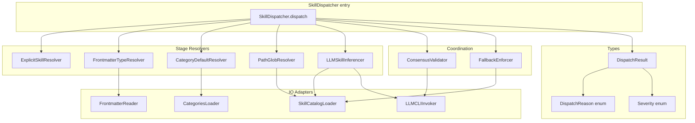
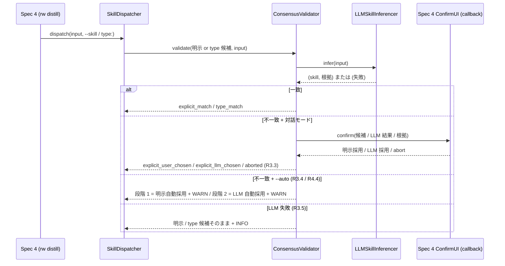
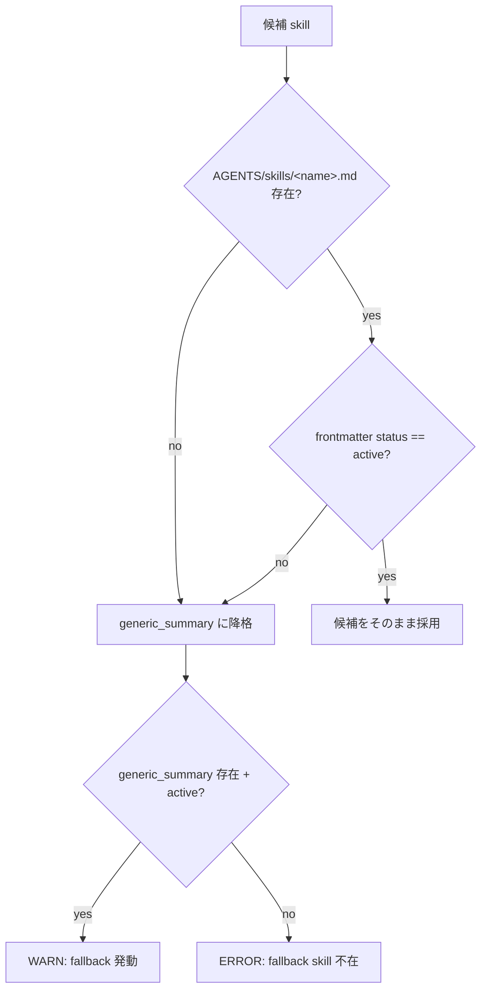

# Technical Design Document

## Overview

**Purpose**: 本 spec (Spec 3、Phase 4) は distill タスク起動時の **スキル選択 (dispatch) メカニズム** を実装する。複数候補 skill から 1 つを 5 段階固定優先順位 (明示 `--skill` → frontmatter `type:` → `categories.yml` の `default_skill` → `applicable_input_paths` glob match → LLM 毎回判定) で解決し、解決結果を `(skill_name, input_file, dispatch_reason, severity, notes)` の固定構造で `rw distill` (Spec 4) に返す。

**Users**: distill タスク利用者 (`rw distill <file>` 起動者) は明示指定なしでも妥当な skill が選ばれる。Spec 4 起票者は固定構造の dispatch 結果を受け取り、CLI 出力 / exit code 変換に専念できる。

**Impact**: distill 起動時の skill 選択が固定ヒューリスティック単独 (精度低下) と毎回明示指定 (ユーザー負担) の両極端から、**ヒューリスティック先行 + LLM フォールバック + コンセンサス確認** のハイブリッド構成に変わる。明示意図は最優先で尊重しつつ、コンテンツ依存の最適解を LLM が補完する。

### Goals

- 5 段階優先順位の判断ロジックを deterministic に固定し、明示意図の優先と LLM 推論の精度を両立する
- frontmatter `type:` / `categories.yml.default_skill` / `applicable_input_paths` glob match の各 stage を独立評価可能なコンポーネントに分離し、test 単位で完全 cover 可能にする
- LLM CLI 抽象層 (Foundation §1.2 / Spec 0 規範由来) を本 spec が提供し、subprocess timeout 必須化の規律を集中させる
- skill 不在 / 非 active / parse 失敗 / LLM 失敗の各失敗経路で `generic_summary` fallback または段階スキップによって dispatch を中断させない
- dispatch 結果オブジェクトの固定構造 (`DispatchResult`) を Spec 4 への入力 contract として確立する

### Non-Goals

- skill 内容そのもの (prompt / Processing Rules / Output schema) の定義 — Spec 2 が所管
- skill ファイル 8 section schema・frontmatter field 定義・install validation — Spec 2 が所管
- frontmatter `type:` field の宣言と vocabulary 整合 — Spec 1 が所管 (本 spec は読み取り側)
- `categories.yml` の schema 定義と編集 CLI — Spec 1 が所管
- `rw distill` CLI の引数 parse / `--skill` / `--auto` flag / 出力整形 / exit code 変換 — Spec 4 が所管
- Perspective / Hypothesis 生成での skill 呼び出し — Spec 6 が固定 skill `perspective_gen` / `hypothesis_gen` を直接呼ぶ (本 spec dispatch 対象外)
- Graph 抽出 skill (`entity_extraction` / `relation_extraction`) の起動 dispatch — Spec 4 の `rw extract-relations` が直接呼ぶ
- lint 支援 skill (`frontmatter_completion`) の起動 — Spec 4 の `rw lint --fix` が直接呼ぶ
- skill lifecycle (deprecate / retract / archive) — Spec 7 が所管 (本 spec は status 値を read-only で参照)
- コンセンサス確認の対話 UI (プロンプト文言・キー入力受付) — Spec 4 が所管 (本 spec は確認の必要性と 3 択を返す)

## Boundary Commitments

### This Spec Owns

- 5 段階優先順位の判断ロジック (短絡評価規律含む)
- 各 stage resolver の振る舞い契約 (ExplicitSkillResolver / FrontmatterTypeResolver / CategoryDefaultResolver / PathGlobResolver / LLMSkillInferencer)
- LLM 毎回判定方式の振る舞い契約 (cache せず毎回推論、subprocess timeout 必須化)
- `applicable_input_paths` glob と入力 path の **実 path match 計算** (Spec 2 R3.2 後段、Spec 2 Skill Validator が path 構文妥当性を検査するのに対し、本 spec は実 path 存在検証を所管)
- 明示 `--skill` / frontmatter `type:` と LLM 推論結果のコンセンサス確認ロジック (UI 詳細以外)
- `generic_summary` fallback 規約 (skill 不在 / 非 active / `--auto` 時の自動採用)
- dispatch 結果オブジェクト `DispatchResult` の構造 (skill_name / input_file / dispatch_reason / severity / notes)
- `dispatch_reason` enumeration 11 種 (`explicit_match` / `explicit_user_chosen` / `explicit_llm_chosen` / `type_match` / `type_user_chosen` / `type_llm_chosen` / `category_default` / `path_match` / `llm_inference` / `fallback_generic_summary` / `aborted`)
- LLM CLI 抽象層 (`LLMCLIInvoker`) の interface (subprocess timeout 必須、参照実装 = Claude Code)
- 通知 severity 4 水準 (CRITICAL / ERROR / WARN / INFO) のうち本 spec で発火する 3 水準 (ERROR / WARN / INFO) の付与規律
- 同一 dispatch ロジックを `rw distill` 以外の自然言語意図解釈 (`rw chat` 内「これを蒸留して」等) でも共有する規約

### Out of Boundary

- skill 内容 (prompt / Processing Rules / Output schema) — Spec 2
- skill ファイル 8 section schema・install validation・frontmatter field 定義 — Spec 2
- `frontmatter type:` field の宣言・許可値定義・vocabulary 整合 — Spec 1
- `categories.yml` schema 定義・編集 CLI・lint task — Spec 1
- `rw distill` CLI 引数 parse・出力整形・exit code 変換 — Spec 4
- 対話モード判定 (`--auto` flag や `rw chat` セッション判定) の所管 — Spec 4
- コンセンサス確認 UI (プロンプト文言・3 択キー入力受付) — Spec 4
- skill lifecycle 遷移 (deprecate / retract / archive 操作) — Spec 7
- Perspective / Hypothesis 生成 skill 呼び出し — Spec 6
- Graph 抽出 skill (`entity_extraction` / `relation_extraction`) 起動 — Spec 4 の `rw extract-relations`
- lint 支援 skill (`frontmatter_completion`) 起動 — Spec 4 の `rw lint --fix`
- LLM CLI の具体実装 (Claude Code / Codex 等の subprocess 呼び出し詳細) — 本 spec は抽象 interface のみ提供、各 LLM CLI への adapter は実装 task で具体化

### Allowed Dependencies

- **Spec 0 (Foundation)**: 用語集 / 13 中核原則 / Severity 4 水準 / exit code 0/1/2 規律。本 spec は SSoT として参照のみ
- **Spec 1 (classification)**:
  - `.rwiki/vocabulary/categories.yml` の inline `default_skill` / `recommended_type` field を **読み取り側** として参照
  - frontmatter `type:` field 値を **読み取り側** として参照 (許可値の vocabulary 整合は Spec 1 lint task が保証)
  - category 解決 (入力ファイル → category 名) はディレクトリベース、Spec 1 G1 `resolve_category` 準拠
  - **coordination SSoT 引用**: Spec 1 design G6 §「Coordination 1: Spec 1 ↔ Spec 3 (R11)」(line 731-737) で確定済の以下 5 件を本 spec が継承する。
    - R11.1 frontmatter `type:` を distill dispatch hint として利用 (推奨 field、Spec 3 が dispatch 時に inline で参照)
    - R11.2 `categories.yml.default_skill` inline field 方式採用 (別ファイル分離不採用、R7 と整合)
    - R11.3 `type:` 値の許可集合 = `categories.yml.recommended_type` + Spec 2 skill 群の `applicable_categories` の整合表、両 field の整合 check は独立に lint WARN として実装
    - R11.4 dispatch 5 段階優先順位 (明示 → `type:` → category default → `applicable_input_paths` glob match → LLM 判断)、**判断ロジック自体は本 spec 所管**
    - R11.5 将来の mapping 方式変更は roadmap.md「Adjacent Spec Synchronization」経路で Spec 1 を先に改版
  - 本 spec は Spec 1 R11 章を coordination 確定済の SSoT として認識し、本 spec 内で再交渉しない
- **Spec 2 (skill-library)**:
  - `AGENTS/skills/<name>.md` の frontmatter (name / origin / status / `applicable_categories` / `applicable_input_paths`) を **読み取り側** として参照
  - `generic_summary` skill が `origin: standard` で配布されることを前提
  - skill 8 section schema は本 spec の dispatch 範囲では参照しない (Spec 4 distill 実行時に消費)
  - **coordination SSoT 引用**: Spec 2 design §「Adjacent Sync 経路」(line 949) 内の `downstream Spec 3 (prompt-dispatch)` 項 (line 954) で「本 spec が `applicable_categories` / `applicable_input_paths` field を提供、Spec 3 が 5 段階優先順位 dispatch 構築」と確定済。本 spec は当該契約を継承し、provider 側 (Spec 2) と consumer 側 (本 spec) の責務分割を再交渉しない
- **Spec 4 (cli-mode-unification)**:
  - `rw distill` 起動時に本 spec dispatch を呼び出す (caller 関係)
  - コンセンサス確認 UI を Spec 4 が提供 (callback 関係、本 spec は確認要請のみ発行)
  - exit code 変換を Spec 4 が所管 (本 spec は severity を返却)
- **Python 標準ライブラリ**:
  - `subprocess` (LLM CLI 呼び出し、timeout 必須)
  - `pathlib` / `fnmatch` (glob match、`**` recursive は自前正規化)
  - 標準 YAML parser (PyYAML、Spec 1 / Spec 2 と整合)

依存方向: Types → IO Adapters → Stage Resolvers → Coordination Layer → SkillDispatcher (entry)。矢印 → は「左が右に import される側」(右が左を import する側) を意味し、逆方向 (左が右を import) は禁止。L190 / L229 と表記統一。

### dispatch 対象範囲の SSoT 整合 note

drafts SSoT (`rwiki-v2-consolidated-spec.md` v0.7.13 §7.2 Spec 3 line 1563) は本 spec Purpose を「distill タスクでのスキル選択メカニズムを定義」と記述、distill 専用と固定する。本 spec requirements (line 39) では「`rw distill` 以外の自然言語意図解釈 (`rw chat` 内『これを蒸留して』等) から呼び出される場合も、同一 dispatch ロジックを共有する規約」を追加しているが、これは distill 範囲の **自然言語 entry point 拡張** (dispatch 処理は同一) であり、SSoT の distill 専用 boundary を逸脱しない。本 spec design は両者整合の以下 2 経路のみを dispatch 対象とする:

- `rw distill <file>` の CLI 直接起動 (Spec 4 引数 parse 経由)
- `rw chat` 内の自然言語意図解釈 (LLM が「これを蒸留して」等を distill 起動と解釈し、本 spec dispatch を呼ぶ)

R10.1 / R10.2 / R10.5 / R9.8 で Perspective / Hypothesis 生成 / Graph 抽出 (`entity_extraction` / `relation_extraction`) / lint 支援 (`frontmatter_completion`) / その他 CLI コマンドは本 spec dispatch 対象外であることを再確認する。

### Revalidation Triggers

以下の変更が発生した場合、本 spec 設計と隣接 spec の整合再 check が必要となる。

- **Spec 1 ↔ Spec 3**: frontmatter `type:` 許可値定義 / `categories.yml` `default_skill` field 方式 / category 解決ロジック (ディレクトリベース → 別方式) の変更 → 本 spec の段階 2-3 / `FrontmatterTypeResolver` / `CategoryDefaultResolver` 影響
- **Spec 2 ↔ Spec 3**: skill カタログ追加 / 削除 / `applicable_categories` / `applicable_input_paths` field schema 変更 / `status` 値域変更 / `generic_summary` の `origin` 変更 → 本 spec の段階 3.5 / 段階 4 / Requirement 6 fallback 影響
- **Spec 4 ↔ Spec 3**: `DispatchResult` フィールド追加 / 削除、`dispatch_reason` enumeration 変更、コンセンサス UI 仕様変更 → 本 spec と Spec 4 design 双方の Adjacent Sync が必要
- **Spec 4 design line 172 dispatch 対象範囲不整合 (本 spec design phase で発見、Adjacent Sync 必要)**: Spec 4 design line 172 が `Spec3Dispatch` の呼出範囲を `rw distill` / `rw query *` / `rw audit semantic` / `rw audit strategic` / `rw retag` の 5 種に拡張記述しているが、drafts SSoT (§7.2 line 1563) / 本 spec requirements R9.8 / R10.1 / R10.5 では distill 専用 + Graph 抽出 / lint 支援 / その他 CLI コマンドは dispatch 対象外と明記。**Spec 4 design 側を本 spec 範囲 (distill + chat 自然言語意図解釈経由のみ) に訂正する Adjacent Sync が必要**。本 spec approve 後の Adjacent Sync 工程で Spec 4 design line 172 を訂正、本 spec design は SSoT 整合 (distill 専用) で固定
- **Foundation 規範 (Round 10 重-10-1 由来)**: Foundation design L61-L68 の傘下 7 spec 全件精査トリガー 5 分類 (13 中核原則の追加・削除・改名・層別適用度変更 / 3 層アーキテクチャ境界変更 / 用語集 5 分類変更 / frontmatter 骨格変更 / Task & Command 一覧変更) はすべて本 spec に適用される。具体的影響経路: 用語集変更 → stage resolver 命名 / DispatchReason enum 値 / SkillMeta field 名 / Severity enum 名 / NotificationSource Literal 値 影響、3 層境界変更 → dispatch 対象範囲影響、13 原則改廃 (特に「LLM 非依存」原則改廃) → LLMCLIInvoker interface 影響、Severity 4 水準・exit code 0/1/2 分離・LLM CLI 抽象層規定 (§1.2) 改版 → 本 spec の Severity 付与規律および LLMCLIInvoker interface 影響
- **drafts SSoT 改版 (Round 10 軽-10-2 subagent 由来)**: `.kiro/drafts/rwiki-v2-consolidated-spec.md` の version 進行 (v0.7.13 → v0.8.x 等) → 本 spec Supporting References の参照 section 番号 / version 番号の同期要否確認、関連 §7.2 / §6.1 / §1.2 / §11.2 / §5.6 の記述変更時は本 spec 影響範囲を check
- **Spec 7 ↔ Spec 3**: skill `status` 遷移経路の追加 (新規 status 値の導入) → 本 spec の Requirement 6 fallback 判定影響

## Architecture

### Existing Architecture Analysis

本 spec は新規 spec (extends 対象なし、`v1-archive/` の `agents-system` は参考のみ)。整合すべき既存パターンは以下:

- **モジュール DAG 分割** (steering tech.md / v1 module-split 継承): `rw_<module>.py` ≤ 1500 行 / モジュール修飾参照 (`rw_<module>.<symbol>`) / 後方互換 re-export 禁止
- **append-only JSONL** (Spec 5): 本 spec は graph ledger を直接書き込まないため適用外。dispatch 経路で発生する通知は呼び出し側 (Spec 4) が `logs/distill_latest.json` 等に整形 (本 spec は構造化 dict を返すのみ)
- **Severity 4 水準 + exit code 0/1/2 分離** (roadmap.md / steering tech.md): 本 spec は severity を返却、exit code 変換は Spec 4
- **subprocess timeout 必須** (roadmap.md / v1 cli-audit 継承): `LLMCLIInvoker` interface で必須化
- **対話 UI 詳細を CLI 層に集中** (Spec 4 design): 本 spec は確認要請とユーザー選択結果の受け取りのみ、UI 詳細は Spec 4 callback

### Architecture Pattern & Boundary Map

本 spec は **Pipeline + Strategy** の組合せパターンを採用する。

- **Pipeline**: 5 段階を逐次評価する短絡評価 (R1.2)
- **Strategy**: 各 stage を `StageResolver` interface で抽象化、stage 固有のロジックは個別 strategy に閉じ込める



**Architecture Integration**:

- **Selected pattern**: Pipeline + Strategy。Pipeline で短絡評価を表現し、Strategy で stage 固有ロジックを分離
- **Domain/feature boundaries**: 各 stage resolver / coordination / IO adapter / types の 4 層 + Layer 5 Types で 5 層、層をまたぐ参照は厳格な単方向 (Types → IO → Resolvers → Coordination → Dispatcher、矢印 → は「左が右に import される側」、L91 / L229 と表記統一)
- **Existing patterns preserved**: モジュール DAG 分割 / Severity 4 水準 / subprocess timeout 必須 / 対話 UI を CLI 層に集中
- **New components rationale**: `LLMCLIInvoker` は Foundation §1.2 規範 (LLM 非依存、抽象層は本 spec で定義) の具体化。stage resolver 5 種は requirements R1 の 5 段階を 1:1 で対応させた最小分離
- **Steering compliance**: ≤ 1500 行 / モジュール修飾参照 / `rw_<module>` 命名

**Stage Resolver interface の戻り値型不均一の正当化**:

Strategy pattern では同 signature 統一が原則だが、本 spec では stage 固有要件により以下の合理的不均一を許容する (Strategy interface の strict 統一は採用しない)。

- ExplicitSkillResolver / FrontmatterTypeResolver / CategoryDefaultResolver: `Optional[ResolvedCandidate]` (単純候補解決、None で段階スキップ)
- PathGlobResolver: `ResolvedOrEscalate` (= `Union[ResolvedCandidate, MultipleMatchEscalate, None]`)。R1.7 段階 3.5 複数 match での escalate sentinel が必要なため `MultipleMatchEscalate` を Union に含める
- LLMSkillInferencer: `InferredSkill` (`resolve()` でなく `infer()` 命名)。Coordination 層 (ConsensusValidator) 経由で段階 1 / 2 LLM 併走および段階 4 単独推論として利用される別系統 contract、戻り値も推論固有 (skill_name / rationale / confidence) のため

合理的不均一を許容する設計選択は、stage 固有の data flow 要件 (escalate sentinel / 推論固有戻り値) を Layer 5 Types で正確に表現するため。SkillDispatcher は各戻り値型を Python 3.10+ 構造的パターンマッチ (`match` 文) で個別処理し、`source_stage` + ConsensusResult 種別から `DispatchReason` 11 種を導出する責務を負う (Layer 5 Core Types Implementation Notes 整合)。

### Technology Stack

| Layer | Choice / Version | Role in Feature | Notes |
|-------|------------------|-----------------|-------|
| ランタイム | Python `>=3.10,<3.14` (boundary 理由 = `match` 文 + `list[T]` built-in generic + `X \| Y` PEP 604 Union) | 全モジュール実装 | 型ヒント完全使用 (steering tech.md)。3.10/3.11 は subprocess timeout cleanup 規律必須 (重-8-4 由来、後述 LLMCLIInvoker Implementation Notes) |
| YAML parser | `PyYAML>=6.0.5,<7.0` (CVE 修正版下限、6.x major 範囲 pin、Round 8 重-8-1 由来) | `categories.yml` / frontmatter / skill frontmatter parse | Spec 1 / Spec 2 と整合、新規依存なし。`safe_load` のみ使用、CLoader (libyaml C extension) は任意 (PureLoader fallback で機能整合、Alpine slim Docker image でも動作可、軽-8-2 由来) |
| Glob match | Python 標準 `pathlib.PurePath.match` + `fnmatch` + 自前 `**` 正規化 | `applicable_input_paths` glob match (extended glob 互換) | Python 3.10 では `**` recursive を `fnmatch` で直接処理できないため自前正規化 (sentinel 置換 4 step、PathGlobResolver Implementation Notes 整合)、Spec 2 と同方針。**POSIX path separator (`/`) 前提**、Windows path (`\`) は対象外 (steering 整合、軽-8-3 由来) |
| LLM CLI 呼び出し | Python 標準 `subprocess.run(timeout=...)` | LLM CLI 抽象層 (`LLMCLIInvoker`) | timeout 必須化 (roadmap.md「v1 から継承する技術決定」のうち決定内容のみ継承、v1-archive コードの直接参照は禁止、重-8-3 + 重-8-6 由来)、per_call timeout 値は Spec 4 SSoT 参照 (D-6) |
| ログ出力 | Python 標準 `logging` | INFO/WARN/ERROR 通知 | severity prefix は Spec 4 が CLI 出力で付与 |
| Test framework | pytest (全 spec 共通前提、本 spec 単独 version 制約なし) | 各 component / integration test | Spec 0 / Spec 1 / Spec 2 design と整合 |

**新規 dependency 追加経路 (Round 8 軽-8-1 + 重-8-6 由来)**:
- 本 spec design 範囲では PyYAML / Python 標準のみ (新規 dependency ゼロ)
- Phase 5b で LLM CLI adapter 拡張時に新規 dependency が必要な場合 (例: HTTP 経由 LLM CLI で `httpx` 追加)、**adapter 実装 spec で Adjacent Sync 経路を経て追加**、本 spec design は abstract interface のみ所管
- 「v1 から継承する技術決定」は **roadmap.md 経由で決定内容のみ継承**、v1-archive コードの直接参照 (import / コピー) は禁止 (Existing Architecture Analysis L117「参考のみ」と整合、重-8-6 意味論的矛盾解消)

## File Structure Plan

### Directory Structure

```
scripts/
├── rw_dispatch.py                # SkillDispatcher entry point + 5 stage 統合 + 短絡評価
├── rw_dispatch_resolvers.py      # 段階 1/2/3/3.5 resolver (Explicit / FrontmatterType / CategoryDefault / PathGlob) + ConsensusValidator + FallbackEnforcer
├── rw_dispatch_io.py             # SkillCatalogLoader + CategoriesLoader + FrontmatterReader (純 IO Adapter)
├── rw_dispatch_llm.py            # 段階 4 LLMSkillInferencer + LLMCLIInvoker (LLM 抽象層 = Foundation §1.2 規範具体化、subprocess timeout)
└── rw_dispatch_types.py          # DispatchResult dataclass + DispatchReason / Severity enum + ResolvedCandidate / Notification

tests/
├── test_rw_dispatch_stages.py        # 5 stage resolver 単体 (各 stage 独立、短絡評価含む)
├── test_rw_dispatch_consensus.py     # 段階 1 / 2 の LLM 併走 + 一致 / 不一致 + abort 経路
├── test_rw_dispatch_fallback.py      # Requirement 6 dispatch 直前 check + generic_summary
├── test_rw_dispatch_path_match.py    # 段階 3.5 glob match (単一 / 複数 / null / 空配列 / extended glob `**`)
├── test_rw_dispatch_llm_inference.py # LLMSkillInferencer (cache せず / timeout / 異常終了)
├── test_rw_dispatch_io.py            # SkillCatalogLoader / CategoriesLoader / FrontmatterReader (parse 失敗含む)
└── test_rw_dispatch_integration.py   # entry to result の end-to-end (5 段階 + fallback + コンセンサス)
```

各ファイル ≤ 1500 行 (steering tech.md 規律)。File 配置の依存方向: `types` → `io` / `llm` → `resolvers` → `dispatch` (左の file は右の file を import しない、右が左を import する側、L91 / L190 と表記統一)。

- 段階 1-3.5 resolver (LLM を使わない deterministic match) は `rw_dispatch_resolvers.py` に集約し、resolver 間の共通ロジック (例: skill 存在 + status check) を共有
- 段階 4 `LLMSkillInferencer` は LLM CLI 抽象層 (`LLMCLIInvoker`) と密結合のため `rw_dispatch_llm.py` にまとめ、Foundation §1.2 規範 (LLM 非依存抽象層) を 1 file に集中
- IO Adapters (`SkillCatalogLoader` / `CategoriesLoader` / `FrontmatterReader`) は純 disk read で LLM を含まないため `rw_dispatch_io.py` に分離

責務 Layer (Architecture 図) と File 配置の対応: Layer 2 の `LLMSkillInferencer` のみ Layer 4 IO (`LLMCLIInvoker`) と同 file (`rw_dispatch_llm.py`) に置く。これは Layer をまたぐ依存方向 (Layer 2 → Layer 4) を file 単位で局所化し、他 stage resolver (Layer 2) が LLM 関連 import を持たない構造を保つため。

### Modified Files

- なし。本 spec は新規 spec、既存ファイルへの修正は発生しない。Spec 4 の `rw distill` 実装で `import rw_dispatch` を追加するのは Spec 4 task の責任範囲。

## System Flows

### Flow 1: 5 段階 dispatch + 短絡評価 (R1)


短絡評価 (R1.2): 上位段階で候補が確定可能な場合、下位段階を評価しない。ただし段階 1 / 2 はコンセンサス確認のため LLM 推論を併走させる。段階 3 / 3.5 はコンセンサス確認対象外 (deterministic dispatch)。

### Flow 2: コンセンサス確認 (R3 / R4)



UI 詳細 (プロンプト文言・キー入力受付) は Spec 4 が所管 (R3.6)。本 spec は (a) 候補 / (b) LLM 結果 / (c) 根拠 を渡す callback interface のみ提供。

### Flow 3: Fallback Enforcer (R6 dispatch 直前 check)



fallback 採用は段階番号に依存しない (R6.7)。明示 `--skill` 指定の不存在も同じ fallback 経路を通る (R6.6)。

## Requirements Traceability

| Requirement | Summary | Components | Interfaces | Flows |
|-------------|---------|------------|------------|-------|
| 1.1 | 5 段階優先順位の評価 | SkillDispatcher | `dispatch()` | Flow 1 |
| 1.2 | 短絡評価 (上位確定で下位スキップ) | SkillDispatcher | `dispatch()` 内ループ制御 | Flow 1 |
| 1.3 | 段階 1: `--skill` 最優先 + コンセンサス確認 | ExplicitSkillResolver / ConsensusValidator | `resolve()` / `validate()` | Flow 2 |
| 1.4 | 段階 2: `type:` 派生候補 + コンセンサス確認 | FrontmatterTypeResolver / ConsensusValidator | `resolve()` / `validate()` | Flow 2 |
| 1.5 | 段階 3: `categories.yml.default_skill` 採用 | CategoryDefaultResolver / CategoriesLoader | `resolve()` / `load()` | Flow 1 |
| 1.6 | 段階 3.5: glob match で唯一確定 | PathGlobResolver / SkillCatalogLoader | `resolve()` / `load_active_skills()` | Flow 1 |
| 1.7 | 段階 3.5: 複数一致で WARN escalate → 段階 4 | PathGlobResolver / SkillDispatcher | `resolve()` 戻り値 + WARN 付与 | Flow 1 |
| 1.8 | 段階 1〜3.5 不確定で段階 4 進行 | SkillDispatcher | `dispatch()` 内 fallthrough | Flow 1 |
| 1.9 | 各段階確定後に R6 存在 + status check | FallbackEnforcer | `enforce()` | Flow 3 |
| 2.1 | 段階 4 LLM 推論 (毎回 content 読込) | LLMSkillInferencer / FrontmatterReader | `infer()` / `read()` | — |
| 2.2 | 推論結果 = (skill, 根拠, 信頼度任意) | LLMSkillInferencer | `infer() → InferredSkill` | — |
| 2.3 | LLM プロンプトに `applicable_categories` / `applicable_input_paths` 含める | LLMSkillInferencer | `build_prompt()` | — |
| 2.4 | LLM 推論を cache しない | LLMSkillInferencer | `infer()` 仕様 (毎回新規呼び出し) | — |
| 2.5 | LLM CLI subprocess timeout 必須 | LLMCLIInvoker | `invoke()` (timeout 引数必須) | — |
| 2.6 | LLM 失敗 → R6 fallback + WARN | LLMSkillInferencer / FallbackEnforcer | `infer()` 例外 → fallback 経路 | Flow 3 |
| 2.7 | 不存在 skill 名返却 → R6 fallback | FallbackEnforcer | `enforce()` | Flow 3 |
| 3.1 | 段階 1 で LLM 併走 | ConsensusValidator / LLMSkillInferencer | `validate()` 内 LLM 呼び出し | Flow 2 |
| 3.2 | 一致 → 確認なしに明示採用 (`explicit_match`) | ConsensusValidator | `validate()` 戻り値 | Flow 2 |
| 3.3 | 不一致 → 3 択 confirm | ConsensusValidator (UI callback) | `request_confirmation()` | Flow 2 |
| 3.4 | `--auto` 時 不一致で明示自動採用 + WARN | ConsensusValidator | `validate()` モード分岐 | Flow 2 |
| 3.5 | LLM 併走失敗 → 明示そのまま + INFO | ConsensusValidator | `validate()` 例外処理 | Flow 2 |
| 3.6 | UI 詳細を Spec 4 に委譲 | (Spec 4 callback boundary) | `ConfirmUICallback` interface | Flow 2 |
| 4.1 | 段階 2 で LLM 併走 | ConsensusValidator | `validate()` | Flow 2 |
| 4.2 | 一致 → 確認なしに `type:` 由来採用 (`type_match`) | ConsensusValidator | `validate()` 戻り値 | Flow 2 |
| 4.3 | 不一致 → 3 択 confirm | ConsensusValidator | `request_confirmation()` | Flow 2 |
| 4.4 | `--auto` 時 不一致で LLM 採用 + WARN (精度優先) | ConsensusValidator | `validate()` モード分岐 | Flow 2 |
| 4.5 | `type:` → skill マッピング表 (`recommended_type` × `applicable_categories` 整合表) | FrontmatterTypeResolver | `derive_skill_from_type()` | — |
| 4.6 | `type:` 値 unknown → 段階 3 降格 + INFO | FrontmatterTypeResolver | `resolve()` 戻り値 None | — |
| 4.7 | frontmatter parse 失敗 → 段階 2 スキップ + WARN | FrontmatterReader / FrontmatterTypeResolver | `read()` 例外 → `resolve()` 戻り値 None | — |
| 5.1 | 段階 3 で `categories.yml` 起動時読込 | CategoriesLoader | `load()` | — |
| 5.2 | inline `default_skill` 方式採用 (Spec 1 R7.2 / R11.2 整合) | CategoriesLoader | parse schema | — |
| 5.3 | category 不属 → 段階 3 スキップ → 段階 4 | CategoryDefaultResolver | `resolve()` 戻り値 None | — |
| 5.4 | `default_skill` 未設定 → 段階 3 スキップ + INFO | CategoryDefaultResolver | `resolve()` 戻り値 + INFO 付与 | — |
| 5.5 | `categories.yml` cache せず | CategoriesLoader | `load()` (毎回 disk 読込) | — |
| 5.6 | `categories.yml` 不在 → 段階 3 スキップ + INFO | CategoriesLoader / CategoryDefaultResolver | `load()` FileNotFound 処理 | — |
| 5.7 | `default_skill` 値の存在整合 check は Spec 1 lint 委譲、本 spec dispatch 時不在は R6 fallback | FallbackEnforcer | `enforce()` (skill 存在 check) | Flow 3 |
| 5.8 | `categories.yml` parse 失敗 → 段階 3 スキップ + WARN | CategoriesLoader | `load()` YAMLError 処理 | — |
| 6.1 | dispatch 直前 skill 存在 + `status: active` check | FallbackEnforcer | `enforce()` | Flow 3 |
| 6.2 | 不存在 → `generic_summary` fallback | FallbackEnforcer | `enforce()` | Flow 3 |
| 6.3 | 非 active (`deprecated`/`retracted`/`archived`) → `generic_summary` fallback | FallbackEnforcer | `enforce()` | Flow 3 |
| 6.4 | fallback 発動 → WARN | FallbackEnforcer | `enforce()` 戻り値 + WARN 付与 | Flow 3 |
| 6.5 | `generic_summary` も不在 → ERROR + 起動拒否 | FallbackEnforcer | `enforce()` 例外送出 | Flow 3 |
| 6.6 | 明示 `--skill` 不存在も同 fallback | ExplicitSkillResolver / FallbackEnforcer | `resolve()` → `enforce()` | Flow 3 |
| 6.7 | fallback は段階番号非依存 | FallbackEnforcer | `enforce()` 共通経路 | Flow 3 |
| 7.1 | DispatchResult 必須フィールド (skill_name / input_file / dispatch_reason / severity / notes) | DispatchResult dataclass | フィールド型 | — |
| 7.2 | `dispatch_reason` enumeration 11 種 | DispatchReason enum | enum 値域 | — |
| 7.3 | `aborted` 時 skill_name 空 / sentinel + severity = INFO + notes 集約 | DispatchResult / ConsensusValidator | aborted 経路 | Flow 2 |
| 7.4 | 構造を design phase で固定、Spec 4 が contract として消費 | DispatchResult | dataclass schema | — |
| 7.5 | 構造変更は Adjacent Sync 経路 | (governance) | Migration Strategy § (downstream Spec 4) | — |
| 8.1 | frontmatter `type:` を読み取り側として参照 | FrontmatterReader / FrontmatterTypeResolver | — | — |
| 8.2 | inline `default_skill` を読み取り側として参照 | CategoriesLoader / CategoryDefaultResolver | — | — |
| 8.3 | dispatch 優先順位の判断ロジックは本 spec 所管 (Spec 1 R11.4 への Adjacent Sync 別途) | SkillDispatcher | — | Flow 1 |
| 8.4 | Spec 1 値域変更時は Spec 1 先改版 | (governance) | Migration Strategy § (upstream Spec 1) | — |
| 8.5 | Spec 1 = field 宣言、Spec 3 = 値解釈 + 判断ロジックの境界明文化 | (boundary §) | — | — |
| 9.1 | Spec 2 distill 向け 12 種を candidate pool として参照 | SkillCatalogLoader / LLMSkillInferencer | `load_distill_skills()` | — |
| 9.2 | `generic_summary` を fallback の前提として認識 | FallbackEnforcer | `enforce()` | Flow 3 |
| 9.3 | `applicable_categories` を LLM ヒント + `type:` 整合 check に利用 | LLMSkillInferencer / FrontmatterTypeResolver | — | — |
| 9.4 | `applicable_input_paths` を段階 3.5 + LLM ヒントに利用、実 path 存在検証は本 spec 所管 | PathGlobResolver / LLMSkillInferencer | `match_paths()` | — |
| 9.5 | `applicable_categories` null/空 → 全カテゴリ可用 | SkillCatalogLoader / FrontmatterTypeResolver | parse 仕様 | — |
| 9.6 | `applicable_input_paths` null/空 → 段階 3.5 候補から除外 | PathGlobResolver | `match_paths()` 仕様 | — |
| 9.7 | 新規 standard skill 追加時の整合再 check は design phase で扱う | (governance) | Migration Strategy § (upstream Spec 2) | — |
| 9.8 | Graph 抽出 / lint 支援 skill は dispatch 対象外 | SkillCatalogLoader | `load_distill_skills()` フィルタ | — |
| 9.9 | `AGENTS/skills/*.md` cache せず毎回読込 | SkillCatalogLoader | `load()` 仕様 | — |
| 10.1 | dispatch は distill 専用 | SkillDispatcher | entry interface | — |
| 10.2 | `rw perspective` / `rw hypothesize` は本 spec dispatch 不経由 | (boundary §) | — | — |
| 10.3 | Spec 6 固定 skill 直接呼び出しを認知 | (boundary §) | — | — |
| 10.4 | 将来 Perspective dispatch 必要時は新規 spec で扱う | (governance) | Migration Strategy § + Boundary Out of Boundary § | — |
| 10.5 | Graph / lint skill 非対象を再確認 | SkillCatalogLoader | フィルタ仕様 | — |
| 11.1 | severity 4 水準採用 | Severity enum | enum 値域 | — |
| 11.2 | severity 付与表 (ERROR / WARN / INFO) | DispatchResult / 全コンポーネント | severity 付与規律 | — |
| 11.3 | severity → exit code 変換は Spec 4 | (boundary §) | — | — |
| 11.4 | 複数通知時 notes 集約 + 最重 severity 採用 | DispatchResult / SkillDispatcher | `merge_notifications()` | — |
| 11.5 | timeout 未設定実装は ERROR で reject | LLMCLIInvoker | type-level 強制 (timeout: int 必須引数) | — |
| 12.1 | 用語集 Spec 0 整合 | (全セクション) | — | — |
| 12.2 | 日本語記述 + spec.json.language=ja | (全セクション) | — | — |
| 12.3 | 表は最小限、長文は箇条書き / 段落 | (全セクション) | — | — |
| 12.4 | SSoT 出典参照点保持 | (Supporting References §) | — | — |
| 12.5 | SSoT 改版時 Adjacent Sync ルール継承 | (governance) | Migration Strategy § | — |
| 12.6 | design phase で Boundary Commitments 再確認 | (Boundary Commitments §) | — | — |

## Components and Interfaces

### Layer 1: SkillDispatcher (Entry)

#### Component: SkillDispatcher

| Field | Detail |
|-------|--------|
| Intent | 5 段階を逐次評価し短絡評価で最初の確定候補を取得、FallbackEnforcer を経由して `DispatchResult` を返す entry point |
| Requirements | 1.1, 1.2, 1.8, 7.1, 7.4, 8.3, 10.1, 11.4 |

**Responsibilities & Constraints**

- 5 段階を固定順序で評価し、各 stage resolver から `Optional[ResolvedCandidate]` を受け取る
- 段階 1 / 2 で確定した候補は ConsensusValidator を経由 (LLM 併走)、段階 3 / 3.5 は併走なし、段階 4 は LLM 推論そのもの
- 全 stage で確定不可の場合は ERROR を発火しない (段階 4 LLM 推論まで進む保証)
- 確定候補に対して FallbackEnforcer を必ず経由
- 通知 severity の集約 (R11.4): 複数 stage / 段階で発生した notification を notes に集約し、最終 severity は最重度を採用

**Dependencies**

- Inbound: Spec 4 `rw distill` / `rw chat` 自然言語意図解釈経路 (P0)
- Outbound: ExplicitSkillResolver / FrontmatterTypeResolver / CategoryDefaultResolver / PathGlobResolver / LLMSkillInferencer / ConsensusValidator / FallbackEnforcer (P0)
- External: なし

**Contracts**: Service [x] / API [ ] / Event [ ] / Batch [ ] / State [ ]

##### Service Interface

```python
@dataclass(frozen=True)
class DispatchInput:
  input_file: Path                           # 絶対 path
  explicit_skill: Optional[str]              # --skill 指定値、None = 未指定
  interactive_mode: bool                     # True = 対話可、False = --auto 等
  confirm_ui: Optional[ConfirmUICallback]    # 対話モード時の callback (Spec 4 提供)

class SkillDispatcher:
  def __init__(
    self,
    skill_catalog: SkillCatalogLoader,
    categories: CategoriesLoader,
    frontmatter: FrontmatterReader,
    llm_invoker: LLMCLIInvoker,
  ) -> None: ...

  def dispatch(self, input_obj: DispatchInput) -> DispatchResult:
    """5 段階を逐次評価し DispatchResult を返す。

    Preconditions:
      - input_obj.input_file は読取り可能
      - skill_catalog / categories / frontmatter / llm_invoker は初期化済
    Postconditions:
      - 必ず DispatchResult を返す (例外送出は generic_summary も不在の R6.5 のみ)
      - dispatch_reason は DispatchReason enum 11 種のいずれか
      - severity は ERROR / WARN / INFO (CRITICAL は本 spec 範囲では発火しない)
    Invariants:
      - 短絡評価: 上位 stage で確定したら下位は評価しない (段階 1 / 2 のコンセンサス LLM 併走を除く)
    """
    ...
```

**Implementation Notes**

- Integration: Spec 4 が `rw distill` から `dispatch()` を呼ぶ。callback `ConfirmUICallback` を Spec 4 が提供
- Validation: input_obj.input_file の絶対 path 化は呼び出し側責務、本 spec は読み取り検証のみ
- Risks: stage resolver の単方向依存違反を防ぐため import 規律 (`rw_dispatch.py` のみが他 4 モジュールを import) を守る
- **candidate_pool 取得規律 (R9.9 「1 dispatch = 1 取得」整合)**: SkillDispatcher は `dispatch()` 起動毎に `SkillCatalogLoader.load_distill_skills()` を 1 回取得し、ConsensusValidator.validate(..., candidate_pool=...) + LLMSkillInferencer.infer(..., candidate_pool=...) の両方に passing する。disp 単位での重複 load を避け、cache せず方針 (D-3 整合) を維持しつつ DRY 整合 (Round 4 重-4-1 escalate 確証 X-6a 由来)
- **Dependency Injection 範囲規律**: constructor では Layer 4 IO Adapters の 4 種 (`skill_catalog` / `categories` / `frontmatter` / `llm_invoker`) のみを注入引数として受け取る。Layer 2 stage resolver 5 種 + Layer 3 coordination 2 種 (= 計 7 component) は `dispatch()` 内で内部 instantiate する (例: `self._explicit = ExplicitSkillResolver()`、`self._consensus = ConsensusValidator(self._llm_inferencer)` 等)。test での挙動操作は Round 1 で各 stage resolver の Outbound 明示済の通り、IO Adapter level の mock で間接的に achievable (例: `SkillCatalogLoader` mock で `load_distill_skills()` 戻り値を制御し全 stage resolver 挙動を間接 test)。Phase 2 で stage 数増加 (例: 段階 6 context-based matching 追加) で各 stage の独立 mock 必要性が顕在化した場合のみ、フル DI 化 (constructor で 11 component 注入) への migration を別 spec で扱う (現状は内部生成で boilerplate を最小化、Spec 1 / Spec 5 / Spec 7 design の Phase 1 慣例と整合)

### Layer 2: Stage Resolvers (5 種)

#### Component: ExplicitSkillResolver (段階 1)

| Field | Detail |
|-------|--------|
| Intent | `--skill <name>` 指定値を最優先候補として返す。コンセンサス確認は SkillDispatcher 側で発火 |
| Requirements | 1.3, 6.6 |

**Responsibilities & Constraints**

- `DispatchInput.explicit_skill` が None なら None を返す (段階スキップ)
- 値があれば snake_case 構文 check のみ実施 (skill 存在 check は FallbackEnforcer に委譲)

**Service Interface**

```python
class ExplicitSkillResolver:
  def __init__(self) -> None:
    """依存なし (純関数的、副作用なし)"""
    ...

  def resolve(self, input_obj: DispatchInput) -> Optional[ResolvedCandidate]:
    """--skill 指定値を candidate として返す。指定なしなら None。

    Raises:
      ValueError: explicit_skill 値が snake_case 構文 (`^[a-z][a-z0-9_]*$`) 違反
        (SkillDispatcher が ERROR severity に変換)
    """
    ...
```

**Implementation Notes**

- snake_case 構文 check は正規表現 `^[a-z][a-z0-9_]*$` で実施 (Spec 2 R3.2 skill name 制約と整合)、構文違反時は ValueError 送出 (SkillDispatcher が ERROR severity に変換)
- skill 存在 check / `status: active` check は本 component では実施しない (FallbackEnforcer R6.1 dispatch 直前 check が一括所管、責務分離)
- Inbound: SkillDispatcher のみ (本 component を直接呼び出すのは Layer 1 entry のみ)
- Outbound: なし (純関数的、副作用なし)

#### Component: FrontmatterTypeResolver (段階 2)

| Field | Detail |
|-------|--------|
| Intent | 入力ファイルの frontmatter `type:` 値から候補 skill を導出 (R4.5 マッピング表) |
| Requirements | 1.4, 4.1, 4.5, 4.6, 4.7, 8.1, 9.3 |

**Responsibilities & Constraints**

- `FrontmatterReader.read(input_file)` で YAML parse
- parse 失敗 → None + WARN (R4.7、Spec 1 lint task に委譲する二重防御)
- `type:` 値が unknown → None + INFO (R4.6)
- `type:` 値 → skill 名マッピング表は `categories.yml.recommended_type` × Spec 2 `applicable_categories` の整合表から導出 (R4.5)

**Implementation Notes**

- マッピング表の生成は dispatch 起動時に一度実行 (各 stage resolver は同じ table 参照、`SkillCatalogLoader` + `CategoriesLoader` の cross-product で導出)
- マッピング表自体はメモリ上のみ保持、disk persist しない (cache せず毎回再構築、R5.5 / R9.9 整合)

**Service Interface**

```python
class FrontmatterTypeResolver:
  def __init__(
    self,
    frontmatter: FrontmatterReader,        # R4.7 frontmatter parse
    skill_catalog: SkillCatalogLoader,     # type → skill マッピング表構築用 (Spec 2 applicable_categories)
    categories: CategoriesLoader,          # type → skill マッピング表構築用 (Spec 1 recommended_type 整合表)
  ) -> None: ...

  def resolve(self, input_obj: DispatchInput) -> Optional[ResolvedCandidate]:
    """frontmatter type: 値から候補 skill を導出。
    parse 失敗 / unknown / 未指定 → None (parse 失敗 / unknown 時は notification を Optional[Notification] フィールドで返却、R4.6 INFO / R4.7 WARN)。

    Raises: なし (parse 失敗は ParsedFrontmatter 経由で吸収、二重防御で例外送出しない)
    """
    ...
```

#### Component: CategoryDefaultResolver (段階 3)

| Field | Detail |
|-------|--------|
| Intent | 入力ファイルが属する category の `default_skill` 値を返す |
| Requirements | 1.5, 5.1, 5.2, 5.3, 5.4, 5.5, 5.6, 5.8, 8.2 |

**Responsibilities & Constraints**

- 入力ファイル path から category を解決 (Spec 1 G1 `resolve_category` ロジック準拠、ディレクトリベース)
- `CategoriesLoader.load()` で起動時毎回読込 (cache せず、R5.5)
- category が `categories.yml` に未登録 → None (R5.3)
- `default_skill` field 未設定 → None + INFO (R5.4)
- `categories.yml` 不在 → None + INFO (R5.6)
- parse 失敗 → None + WARN (R5.8、Spec 1 lint task 委譲の二重防御)

**Service Interface**

```python
class CategoryDefaultResolver:
  def __init__(
    self,
    categories: CategoriesLoader,
  ) -> None: ...

  def resolve(self, input_obj: DispatchInput) -> Optional[ResolvedCandidate]:
    """入力ファイルが属する category の default_skill 値を candidate として返す。
    category 不属 / default_skill 未設定 / 不在 / parse 失敗 → None (R5.4 INFO / R5.6 INFO / R5.8 WARN は Notification 経由で集約)。

    Raises: なし (CategoriesLoader.load() の YAMLError は本 component 内で catch、Notification 経由で WARN 集約、二重防御で例外伝播しない)
    """
    ...
```

**Implementation Notes**

- category 解決ロジック: Spec 1 design G1 `resolve_category(input_file)` を **直接呼び出し** で利用 (自前再実装しない)、Spec 1 既 approve SSoT を再交渉せず継承
- `CategoriesLoader.load()` は dispatch 起動毎に呼ばれ、disk read オーバーヘッド (target < 50ms、Performance & Scalability 整合) を許容
- parse 失敗時の WARN 通知は呼び出し側 (SkillDispatcher) が `notes` に集約 (R11.4)、本 component は ResolvedCandidate に notification を載せて返却
- Inbound: SkillDispatcher のみ
- Outbound: CategoriesLoader (P0、Layer 4 IO Adapter)、Spec 1 G1 `resolve_category` 経路 (Layer 4 で wrap、本 component は P0 依存として import)

#### Component: PathGlobResolver (段階 3.5)

| Field | Detail |
|-------|--------|
| Intent | 入力 file path に対し `applicable_input_paths` glob match する skill を絞り込み、唯一なら候補確定、複数なら段階 4 にエスカレート |
| Requirements | 1.6, 1.7, 9.4, 9.6 |

**Responsibilities & Constraints**

- `SkillCatalogLoader.load_active_skills()` で `status: active` の skill のみを candidate pool として取得 (R1.6 frontmatter `status: active` 事前 filter、R6.1 dispatch 直前 check との整合)
- `applicable_input_paths` が null / 空配列の skill は match 候補から除外 (R9.6)
- extended glob 互換 (POSIX `*` / `?` / `[...]` + `**` recursive) で match 計算
- 唯一 match → ResolvedCandidate (R1.6)
- 複数 match → MultipleMatchEscalate (sentinel) を返し、SkillDispatcher が WARN + 段階 4 に escalate (R1.7)
- 0 match → None (段階 4 へ自然 fallthrough、R1.8)

**Service Interface**

```python
class PathGlobResolver:
  def __init__(
    self,
    skill_catalog: SkillCatalogLoader,
  ) -> None: ...

  def resolve(self, input_obj: DispatchInput) -> ResolvedOrEscalate:
    """段階 3.5 の glob match 評価。
    Returns:
      ResolvedCandidate (唯一一致、R1.6)
      | MultipleMatchEscalate (複数一致 → 段階 4 escalate + WARN、R1.7)
      | None (不一致、R1.8 段階 4 fallthrough)

    Raises: なし (SkillCatalogLoader 経由の disk read 失敗は SkillCatalogLoader 側で吸収、本 component は match 計算のみ)
    """
    ...
```

**Implementation Notes**

- Integration: Python 3.10 標準 `pathlib.PurePath.match` は `**` recursive を 1 segment にしか展開しないため、`fnmatch.translate` で正規表現変換した上で `**` を `.*` に置換する自前正規化を行う (Spec 2 と同方針)
- **`fnmatch.translate` 動作詳細 (重-5-2 X-B1 由来)**: `fnmatch.translate(pattern)` は `*` を `(?s:.*)\Z` のように `.*` (re.DOTALL 相当、`/` を含む任意文字) に変換するため、single segment match (`*` だけで `/` を跨がない) と multi segment match (`**` で `/` を跨ぐ) の区別が標準では不可能。本 spec の自前正規化は (1) `pattern` 内の `**` を一時的に sentinel (例: `\x00DOUBLESTAR\x00`) に置換、(2) 残った `*` を `[^/]*` (single segment) に置換、(3) `fnmatch.translate` 適用後、(4) sentinel を `.*` (multi segment) に戻す、の 4 step で正確な glob 動作を実現。test 実装時は `re` モジュールの compile + match で確認
- Validation: `applicable_input_paths` 各値は Skill Validator (Spec 2) が構文妥当性 check 済 (R9.4 整合)、本 spec dispatch では存在前提で実 path match のみ評価

#### Component: LLMSkillInferencer (段階 4)

| Field | Detail |
|-------|--------|
| Intent | 入力 content + skill catalog + ヒント (`applicable_categories` / `applicable_input_paths`) を LLM に渡し、推奨 skill 名 + 根拠 + 信頼度 (任意) を返す |
| Requirements | 2.1, 2.2, 2.3, 2.4, 2.6, 2.7, 9.1, 9.3, 9.4 |

**Responsibilities & Constraints**

- `FrontmatterReader.read_content(input_file)` で content 全体を毎回読込 (R2.1 cache せず)
- `SkillCatalogLoader.load_distill_skills()` で 12 distill skill を毎回読込 (R9.1 / R9.9 cache せず)
- LLM プロンプトに各 skill の `applicable_categories` / `applicable_input_paths` を含める (R2.3)
- `LLMCLIInvoker.invoke(prompt, timeout=...)` で subprocess 呼び出し
- timeout / 異常終了 / 推論失敗 → 例外送出 (SkillDispatcher が R2.6 fallback + WARN に変換)
- 結果 skill 名が catalog に存在しない → SkillDispatcher が R2.7 fallback に変換 (FallbackEnforcer 経由)

**Service Interface**

```python
@dataclass(frozen=True)
class InferredSkill:
  skill_name: str
  rationale: str
  confidence: Optional[float] = None  # LLM が信頼度を出力しない場合 None

class LLMSkillInferencer:
  def __init__(
    self,
    frontmatter: FrontmatterReader,        # input content 読込
    llm_invoker: LLMCLIInvoker,            # LLM CLI subprocess 抽象層
  ) -> None: ...

  def infer(self, input_file: Path, candidate_pool: list[SkillMeta]) -> InferredSkill:
    """LLM 推論を 1 回実行。
    Raises:
      LLMTimeout: subprocess timeout 経過
      LLMInvocationError: 異常終了 / 推論失敗
    """
    ...
```

**Implementation Notes**

- Prompt 構造: `build_prompt(content, candidate_pool, hints)` で固定テンプレート生成。template = (1) **frontmatter を必ず先頭配置** (R2.3 hint 保証、truncation 時に最重要 hint が失われない invariant)、(2) frontmatter 直後に本文 content、(3) candidate_pool 各 skill の `name` + `description` (Spec 2 frontmatter から取得) + `applicable_categories` + `applicable_input_paths`、(4) 出力指示 (JSON 形式優先、plain text fallback 許容)
- **content truncation 規律 (重-5-1 X-A1 由来)**: Python 側で truncate しない、LLM CLI 側の context 管理に委ねる。LLM CLI 側で context window 超過時の自動切断挙動 (Claude Code は context window を超えた入力を自動 truncate) を信頼し、本 spec abstract 層は raw content をそのまま LLM CLI に渡す。frontmatter を先頭配置することで LLM CLI 側 truncate が本文末尾を切る場合でも skill dispatch hint (`type:` 値・カテゴリ情報) は必ず保持される invariant。Python 側 truncate logic を持たない設計選択は、各 LLM CLI (Claude Code / Codex / 他) の context window 違いを LLM 抽象層で吸収する Spec 0 LLM 非依存原則と整合
- **出力 parse 優先順位規律 (重-5-3 X-C1 由来)**: LLM stdout を以下の順序で parse (parse 優先順位の Phase 5b 転嫁を回避)
  1. `json.loads(stdout)` 試行 → 成功なら JSON の `skill` field を採用 (`rationale` / `confidence` field も `InferredSkill` に取り込み)
  2. JSON parse 失敗 (syntax error / `skill` field 欠如) なら stdout 全体を strip した後 snake_case 構文 (`^[a-z][a-z0-9_]*$`) として読み取り試行 (plain text fallback、`InferredSkill.rationale=""` / `confidence=None`)
  3. 両方失敗 → `LLMInvocationError` 送出 (R2.6 fallback 経路に変換)
- candidate_pool は呼び出し側 (SkillDispatcher) が `SkillCatalogLoader.load_distill_skills()` で取得済を渡す契約 (本 component は再 disk read しない、責務分離)
- timeout 引数値は呼び出し側 (SkillDispatcher) が Spec 4 config (`<vault>/.rwiki/config.toml` `[timeout].per_call`) から取得し `LLMCLIInvoker.invoke(timeout=...)` 経由で渡される (D-6 整合)
- Inbound: SkillDispatcher (段階 4) / ConsensusValidator (段階 1 / 2 LLM 併走)
- Outbound: LLMCLIInvoker (P0、Layer 4 IO Adapter) / FrontmatterReader (content 読込、P0)

### Layer 3: Coordination

#### Component: ConsensusValidator (段階 1 / 2 共通)

| Field | Detail |
|-------|--------|
| Intent | 段階 1 / 2 で確定した候補に対して LLM 推論を併走させ、一致 / 不一致を判定。不一致時は対話モードに応じて confirm UI 起動 / 自動採用 |
| Requirements | 3.1, 3.2, 3.3, 3.4, 3.5, 3.6, 4.1, 4.2, 4.3, 4.4 |

**Responsibilities & Constraints**

- 候補 + DispatchInput を受け取り、`LLMSkillInferencer.infer()` で LLM 結果を取得
- 一致 → `ConsensusResult.Match` (`explicit_match` / `type_match` を SkillDispatcher が判定)
- 不一致 + 対話モード → `confirm_ui` callback で 3 択 (明示採用 / LLM 採用 / abort) を取得 (R3.3 / R4.3)
- 不一致 + `--auto` モード → 段階 1 = 明示自動採用 + WARN (R3.4) / 段階 2 = LLM 自動採用 + WARN (R4.4、精度優先方針)
- LLM 失敗 → `ConsensusResult.LLMFailed` (SkillDispatcher が明示そのまま採用 + INFO に変換、R3.5)
- abort → `ConsensusResult.Aborted` (SkillDispatcher が `aborted` reason + INFO + 経緯 notes 集約に変換、R7.3)

**Service Interface**

```python
ConsensusResult = Union[
  Match,                # 一致
  ExplicitChosen,       # 不一致 → 明示採用 (対話 / --auto 共通)
  LLMChosen,            # 不一致 → LLM 採用 (対話 / --auto 共通)
  Aborted,              # 対話で user が abort 選択
  LLMFailed,            # LLM 推論失敗
]

ConfirmUICallback = Callable[[ConfirmRequest], ConfirmResponse]

@dataclass(frozen=True)
class ConfirmRequest:
  candidate: str            # 明示 or type: 由来
  llm_inferred: str         # LLM 推論結果
  llm_rationale: str        # LLM 根拠

@dataclass(frozen=True)
class ConfirmResponse:
  choice: Literal["candidate", "llm", "abort"]

class ConsensusValidator:
  def __init__(
    self,
    llm_inferencer: LLMSkillInferencer,
  ) -> None:
    """confirm_ui callback は input_obj.confirm_ui (DispatchInput field、L440) で受け取り、constructor では持たない"""
    ...

  def validate(
    self,
    candidate: ResolvedCandidate,
    input_obj: DispatchInput,
    stage: Literal["explicit", "type"],
    candidate_pool: list[SkillMeta],
  ) -> ConsensusResult:
    """段階 1 / 2 の LLM 併走推論 + コンセンサス確認。

    Args:
      candidate_pool: dispatch 単位で SkillDispatcher が 1 回取得した distill 向け skill カタログ
        (R9.9 「1 dispatch = 1 取得」整合)、本 component が LLMSkillInferencer.infer() に passing
        して LLM 推論ヒント (R2.3) として利用

    Returns:
      ConsensusResult Union 5 構成: Match (一致) / ExplicitChosen / LLMChosen
        / Aborted (R3.3 / R4.3 user abort) / LLMFailed (R3.5 LLM 失敗で明示そのまま採用)

    Raises: なし (LLM 失敗 / abort は ConsensusResult Union で表現、二重防御で例外送出しない)
    """
    ...
```

**Implementation Notes**

- UI 詳細 (プロンプト文言・キー入力受付方式) は Spec 4 が `ConfirmUICallback` 実装で提供 (R3.6)
- 本 spec test では mock callback で 3 択をシミュレート
- LLM 併走 timeout 値は呼び出し側 (SkillDispatcher) が `LLMSkillInferencer.infer()` 経由で渡す契約、本 component は LLM 呼出の具体実装を直接持たない (責務分離 + Round 1 重-2 D-6 整合 = timeout SSoT は Spec 4 `<vault>/.rwiki/config.toml` `[timeout].per_call`)
- Inbound: SkillDispatcher (P0、stage="explicit" / stage="type" 引数で段階 1 / 2 を区別、各々別呼出)
- Outbound: LLMSkillInferencer (P0、LLM 併走推論呼出) / `ConfirmUICallback` (P0、Spec 4 提供 callback、対話モード時のみ呼出)

#### Component: FallbackEnforcer (R6 dispatch 直前 check)

| Field | Detail |
|-------|--------|
| Intent | 確定候補に対して dispatch 実行直前に skill 存在 + `status: active` を check し、不可なら `generic_summary` に降格 |
| Requirements | 1.9, 6.1, 6.2, 6.3, 6.4, 6.5, 6.6, 6.7, 9.2 |

**Responsibilities & Constraints**

- `SkillCatalogLoader` で skill メタを取得し存在 + `status: active` を check (R6.1)
- 不存在 / 非 active → `generic_summary` に降格 + WARN (R6.2 / R6.3 / R6.4)
- `generic_summary` も不在 / 非 active → ERROR + 例外送出 (R6.5、SkillDispatcher が exit code 2 経路に渡す)
- 段階番号非依存 (R6.7、明示 / type / category default / path / LLM 推論のいずれの候補にも同一規律)

**Service Interface**

```python
class FallbackEnforcer:
  def __init__(
    self,
    skill_catalog: SkillCatalogLoader,
  ) -> None: ...

  def enforce(
    self,
    candidate: ResolvedCandidate,
    accumulated_notifications: list[Notification],
  ) -> EnforceResult:
    """skill 存在 + status check + 必要なら generic_summary fallback 適用。
    Raises:
      FallbackUnavailableError: generic_summary も不在 / 非 active (R6.5)
    """
    ...
```

**Implementation Notes**

- `accumulated_notifications` は SkillDispatcher が各 stage / coordination で発生した notification を accumulate して渡す契約、本 component は (a) skill 存在 + status check 結果に応じた fallback notification を accumulated に追加、(b) `EnforceResult.notes` に集約 + severity 最重度判定 (R11.4 整合)
- skill 存在 check は `SkillCatalogLoader.find(skill_name)` で実施、disk read オーバーヘッドは SkillCatalogLoader 側で吸収 (cache せず毎回読込、R9.9 整合)
- `generic_summary` 不在時 (R6.5) のみ `FallbackUnavailableError` 例外送出、SkillDispatcher が ERROR severity + exit code 2 経路 (Spec 4 所管) に変換
- 段階番号非依存 (R6.7): 明示 / type / category default / path / LLM 推論のいずれの候補でも同一規律で fallback 評価、本 component は `dispatch_reason` enumeration を生成しない (SkillDispatcher が候補 stage 起源 + fallback 発動有無から `dispatch_reason` を確定)
- Inbound: SkillDispatcher (P0、各 stage 確定後 + LLM 推論失敗時 + 明示 `--skill` 不存在時の全経路で呼出、R6.7 段階非依存)
- Outbound: SkillCatalogLoader (P0、skill 存在 + status check)

### Layer 4: IO Adapters

#### Component: SkillCatalogLoader

| Field | Detail |
|-------|--------|
| Intent | `AGENTS/skills/*.md` の frontmatter (name / origin / status / `applicable_categories` / `applicable_input_paths`) を毎回読込 |
| Requirements | 9.1, 9.2, 9.5, 9.6, 9.8, 9.9 |

**Responsibilities & Constraints**

- 毎回ディスク読込 (R9.9 cache せず) — skill install / deprecate / archive lifecycle 変更が即座に dispatch 反映されるため
- distill 向け 12 種 + `generic_summary` のみを candidate pool として返す `load_distill_skills()` を提供 (R9.1 + R9.8 = Graph 抽出 / lint 支援は除外)
- `applicable_categories` / `applicable_input_paths` の null / 空配列の意味付け (R9.5 / R9.6) を parse 時に正規化
- `load_active_skills()` (status: active のみ) は段階 3.5 / R6 fallback で利用

**Service Interface**

```python
@dataclass(frozen=True)
class SkillMeta:
  name: str
  origin: Literal["standard", "custom"]
  status: Literal["active", "deprecated", "retracted", "archived"]
  applicable_categories: list[str]      # null/空 → 全カテゴリ可用 (R9.5)
  applicable_input_paths: list[str]     # null/空 → 段階 3.5 候補から除外 (R9.6)

class SkillCatalogLoader:
  def load_distill_skills(self) -> list[SkillMeta]:
    """distill 向け 12 種 + generic_summary を返す (R9.1 + R9.8 = Graph 抽出 / lint 支援除外)。
    Raises: なし (個別 skill ファイルの YAMLError は当該 skill のみ candidate pool から除外して継続、Round 1 Implementation Notes 整合)
    """
    ...
  def load_active_skills(self) -> list[SkillMeta]:
    """status: active のみフィルタ (段階 3.5 / R6.1 dispatch 直前 check 用)。
    Raises: なし (load_distill_skills と同方針)
    """
    ...
  def find(self, skill_name: str) -> Optional[SkillMeta]:
    """指定 skill 名のメタを返す。不在なら None (R6.1 / R6.2 fallback 評価用)。
    Raises: なし
    """
    ...
```

**Implementation Notes**

- ディスク走査: `AGENTS/skills/*.md` を `pathlib.Path.glob("*.md")` で列挙、各ファイル frontmatter を `PyYAML` で parse。disk read オーバーヘッドは 15 種 × 数 KB = 数百 KB、target < 50ms (R5.5 / R9.9 整合性優先方針、Performance & Scalability 整合)
- `load_distill_skills()` のフィルタ: Spec 2 R5 / R6 で確定済 dispatch 対象外 skill (`entity_extraction` / `relation_extraction` / `frontmatter_completion`) を name 一致で除外、結果は distill 向け 12 種 + `generic_summary` の最大 13 種
- `load_active_skills()` は frontmatter `status: active` のみフィルタ、段階 3.5 PathGlobResolver と R6.1 dispatch 直前 check で利用
- parse 失敗 (個別 skill ファイルの YAML syntax error 等): WARN 通知に集約、当該 skill のみ candidate pool から除外し継続 (二重防御、Spec 2 Skill Validator が根本検知)
- Inbound: SkillDispatcher (P0) / PathGlobResolver (P0) / LLMSkillInferencer (P0) / FallbackEnforcer (P0)
- Outbound: filesystem (`AGENTS/skills/`、P0)

#### Component: CategoriesLoader

| Field | Detail |
|-------|--------|
| Intent | `.rwiki/vocabulary/categories.yml` の category エントリを毎回読込 |
| Requirements | 5.1, 5.2, 5.5, 5.6, 5.8 |

**Responsibilities & Constraints**

- 毎回ディスク読込 (R5.5 cache せず)
- 不在 → 空辞書を返す (R5.6 経路、CategoryDefaultResolver が None + INFO 付与)
- parse 失敗 → 例外送出 (CategoryDefaultResolver が R5.8 経路で None + WARN 付与)

**Service Interface**

```python
@dataclass(frozen=True)
class CategoryEntry:
  name: str
  default_skill: Optional[str]
  recommended_type: list[str]

class CategoriesLoader:
  def load(self) -> dict[str, CategoryEntry]:
    """空辞書 = 不在 (R5.6、内部で FileNotFoundError catch + 空辞書返却)。

    Raises:
      yaml.YAMLError: parse 失敗 (R5.8、CategoryDefaultResolver が catch + Notification WARN 経由で集約、二重防御)
    """
    ...
```

**Implementation Notes**

- 読込パス: `<vault>/.rwiki/vocabulary/categories.yml`、vault root は呼び出し側 (Spec 4) が解決 / 本 component は絶対 path を constructor で受け取る
- parse: `PyYAML` で YAML parse、Spec 1 design G3 schema (`name` / `description` / `enforcement` / `recommended_type` / `default_skill`) を前提
- 不在 (`FileNotFoundError`) → 空辞書返却 (R5.6 経路、CategoryDefaultResolver が None + INFO 付与)
- parse 失敗 (`yaml.YAMLError`) → 例外 re-raise (CategoryDefaultResolver が R5.8 経路で None + WARN 付与)、Spec 1 lint task に委譲する二重防御
- disk read オーバーヘッドは数 KB 程度、target < 50ms
- Inbound: CategoryDefaultResolver (P0) / FrontmatterTypeResolver (P1、`recommended_type` × `applicable_categories` 整合表構築用)
- Outbound: filesystem (`<vault>/.rwiki/vocabulary/categories.yml`、P0)

#### Component: FrontmatterReader

| Field | Detail |
|-------|--------|
| Intent | 入力ファイルの YAML frontmatter parse + content 本文取得 |
| Requirements | 2.1, 4.7, 8.1 |

**Responsibilities & Constraints**

- 入力ファイル先頭の YAML frontmatter (`---` 区切り) を `PyYAML` で parse、frontmatter なし or `---` 区切り欠如 → `data=None` + `parse_error=None` (parse 失敗ではなく frontmatter 不在として扱う、後続 stage で None 評価)
- parse 失敗 (`yaml.YAMLError`、frontmatter syntax error / 部分破損) → `data=None` + `parse_error=<error message>` を返却し例外送出しない (R4.7 経路、FrontmatterTypeResolver が WARN 付与で段階 2 スキップ)。Spec 1 lint task に委譲する二重防御として位置付け
- `type_value` は frontmatter `type:` field の値、`data` 内に存在する場合のみ非 None。parse 成功 + `type:` 未指定 → `type_value=None`
- `read_content(input_file)` は frontmatter を含む input file 全体を文字列で返却 (LLM 推論時に frontmatter + 本文を context として渡す、R2.1 cache せず毎回読込)
- ファイル不在 (`FileNotFoundError`) → 例外送出 (呼び出し側責務、本 component は読み取り検証のみ)
- encoding: UTF-8 固定 (Spec 0 / steering tech.md と整合)、BOM 付き UTF-8 は `utf-8-sig` で透過処理

**Service Interface**

```python
@dataclass(frozen=True)
class ParsedFrontmatter:
  data: Optional[dict[str, Any]]   # parse 失敗時 None (R4.7) / frontmatter 不在時も None
  type_value: Optional[str]
  parse_error: Optional[str]       # WARN 付与用、parse 失敗時のみ非 None

class FrontmatterReader:
  def read(self, input_file: Path) -> ParsedFrontmatter: ...
  def read_content(self, input_file: Path) -> str:
    """LLMSkillInferencer 用の content 全体取得 (R2.1)"""
    ...
```

**Implementation Notes**

- frontmatter 抽出は `re.match(r"^---\n(.*?)\n---\n", text, re.DOTALL)` で `---` 区切りを検出、PyYAML `safe_load` で parse
- `parse_error` の文字列形式は `f"YAML parse error at line {e.problem_mark.line}: {e.problem}"` 等の人間可読形式 (Spec 4 が `notes` 経由で CLI 出力に整形)
- disk read オーバーヘッドは 1 ファイル ≤ 数十 KB 想定、target < 10ms
- Inbound: FrontmatterTypeResolver (P0、`read()`) / LLMSkillInferencer (P0、`read_content()`)
- Outbound: filesystem (`input_file` 絶対 path、P0)

#### Component: LLMCLIInvoker (LLM CLI 抽象層)

| Field | Detail |
|-------|--------|
| Intent | LLM CLI を subprocess 経由で呼び出す抽象 interface。Foundation §1.2 (LLM 非依存) 規範の具体化 |
| Requirements | 2.5, 11.5 |

**Responsibilities & Constraints**

- subprocess timeout 引数を **必須** とする (R2.5、R11.5: timeout 未設定実装は ERROR で reject = type 強制で実現)
- 参照実装 = Claude Code subprocess (`claude --print --dangerously-skip-permissions` 等)、他 LLM CLI (Codex / 他) への adapter は将来拡張
- timeout 経過 / 異常終了 / 推論失敗 → 例外送出 (LLMSkillInferencer が R2.6 経路に変換)
- timeout 値の SSoT: Spec 4 design `<vault>/.rwiki/config.toml` `[timeout].per_call` (デフォルト 120 秒、Spec 4 決定 4-5、TOML 形式)。本 spec は abstract interface のみ所管、デフォルト値の SSoT は Spec 4 に一本化。本 spec design では config schema / format / field 名を確定しない (D-6 整合)

**Service Interface**

```python
class LLMCLIInvoker:
  def invoke(
    self,
    prompt: str,
    *,
    timeout: int,            # 秒、必須引数 (R11.5 の type-level 強制)
  ) -> str:
    """LLM CLI を subprocess で 1 回呼び出し、stdout を返す。

    Raises:
      LLMTimeout: timeout 経過
      LLMInvocationError: subprocess returncode != 0 / SIGKILL 等の OS 異常終了
        / 出力 parse 失敗 (LLMSkillInferencer が json.loads + snake_case fallback 両方失敗時に raise)
        / stderr に致命的警告 (例: "context window exceeded") を含む silent failure 検出時
        (Round 6 軽-6-2 + 重-6-4 由来、stderr は LLMInvocationError.detail に含めて debug 性確保)
    """
    ...
```

**Implementation Notes**

- Integration: Spec 4 の `rw distill` CLI level timeout (`<vault>/.rwiki/config.toml` `[timeout].cli_level` デフォルト 600 秒) と LLM CLI 個別呼出 timeout (`[timeout].per_call` デフォルト 120 秒) は Spec 4 design L1244-1247 で階層構造として確定済 (Spec 4 決定 4-5)、本 spec は per_call 値を呼び出し側 (Spec 4 `rw distill`) から timeout 引数として受け取る
- Validation: type-level 強制 (`timeout: int` 必須引数) で R11.5 を静的に保証
- Risks: LLM CLI が standard でない出力形式を返した場合の parse 失敗。design 時点では JSON or 単純 skill 名のみ返却を要請する prompt 設計に固定
- **stderr 取り扱い規律 (Round 6 重-6-4 由来)**: subprocess の stderr は (a) returncode != 0 時 → `LLMInvocationError.detail` に含める (debug 性確保)、(b) returncode 0 + stderr に致命的警告 (例: "context window exceeded" / "rate limit exceeded") を含む silent failure 検出時 → `LLMInvocationError` raise (silent failure 防止)、(c) returncode 0 + stderr が空 or 非致命警告 → 破棄 (正常経路)。silent failure 検出キーワードは Phase 5b 実装で各 LLM CLI の output convention に基づき確定 (参照実装 = Claude Code は warning prefix 等)
- **subprocess 呼び出し規律**: `subprocess.run(cmd, input=prompt, capture_output=True, text=True, timeout=timeout, check=False)` で実行 (`check=False` で returncode を本 component で評価、stderr を保持)。`shell=True` 不使用 (command injection 防止、roadmap.md「v1 から継承する技術決定」整合)
- **subprocess timeout cleanup 規律 (Round 8 重-8-4 由来)**: Python 3.10 / 3.11 では `subprocess.run(timeout=...)` で timeout 経過後の child process kill が保証されず zombie 化リスクあり (CPython issue #84789、修正は 3.12+)。本 spec は Python `>=3.10,<3.14` を前提とするため、Phase 5b adapter 実装で `subprocess.Popen` + `try/except TimeoutExpired` 経路を採用し、timeout catch 後に明示的に `process.kill()` + `process.communicate()` で zombie 化防止する規律を適用 (`subprocess.run` の単純使用は 3.10 / 3.11 環境では非推奨)

### Layer 5: Types

#### Component: Core Types (Notification / ResolvedCandidate / MultipleMatchEscalate / EnforceResult / ConsensusResult 構成要素)

| Field | Detail |
|-------|--------|
| Intent | 各 stage resolver / coordination component が共通利用する core types を Layer 5 Types に集約。File Structure (L217) `rw_dispatch_types.py` に配置、依存方向の最下層として他 Layer から参照される |
| Requirements | 1.6, 1.7, 1.9, 2.2, 3.2, 3.3, 3.4, 3.5, 4.2, 4.3, 4.4, 5.4, 5.6, 5.8, 6.2, 6.3, 6.4, 7.3, 11.4 |

```python
NotificationSource = Literal[
  "stage_1_explicit",
  "stage_2_type",
  "stage_3_category_default",
  "stage_3_5_path_match",
  "stage_4_llm_inference",
  "consensus_validator",
  "fallback_enforcer",
]

@dataclass(frozen=True)
class Notification:
  severity: Severity
  message: str               # 人間可読 (R11.4 notes 集約用)
  source: NotificationSource  # 発生元 component 識別 (Literal 7 値固定、Phase 5b 転嫁を解消、Round 6 重-6-3 由来)

@dataclass(frozen=True)
class ResolvedCandidate:
  skill_name: str  # 解決された skill 名 (snake_case)
  source_stage: Literal["explicit", "type", "category_default", "path_match", "llm_inference"]
  notification: Optional[Notification]  # 段階内で発生した通知 (例: R5.4 INFO)、なし → None

@dataclass(frozen=True)
class MultipleMatchEscalate:
  matched_skills: list[str]  # 段階 3.5 で複数 match した skill 名 (R1.7、SkillDispatcher が WARN 通知 + 段階 4 escalate)

ResolvedOrEscalate = Union[ResolvedCandidate, MultipleMatchEscalate, None]
# PathGlobResolver.resolve() 戻り値: 唯一 → ResolvedCandidate / 複数 → MultipleMatchEscalate / 0 → None

@dataclass(frozen=True)
class EnforceResult:
  final_skill_name: str  # generic_summary fallback 適用後の最終 skill 名
  fallback_used: bool    # True = R6.4 WARN 発動、False = 候補そのまま
  accumulated_notifications: list[Notification]  # R11.4 集約用、SkillDispatcher が DispatchResult.notes に整形

# ConsensusResult Union 構成要素 5 種 (R3 / R4 整合)
@dataclass(frozen=True)
class Match:
  candidate: str  # LLM 推論結果と一致した明示 / type: 由来 skill 名 (R3.2 / R4.2)

@dataclass(frozen=True)
class ExplicitChosen:
  candidate: str        # 採用された明示指定 skill 名
  llm_inferred: str     # LLM 推論結果 (notes 集約用、不一致記録)
  user_initiated: bool  # True = 対話 user 選択 (R3.3) / False = --auto 自動採用 (R3.4)

@dataclass(frozen=True)
class LLMChosen:
  candidate: str        # 却下された元候補 (notes 集約用)
  llm_inferred: str     # 採用された LLM 推論 skill 名
  user_initiated: bool  # True = 対話 user 選択 (R3.3 / R4.3) / False = --auto 自動採用 (R4.4)

@dataclass(frozen=True)
class Aborted:
  stage: Literal["explicit", "type"]  # コンセンサス確認段階 (R7.3 notes 集約用)
  candidate: str                       # 元の候補 skill 名
  llm_inferred: str                    # LLM 推論結果

@dataclass(frozen=True)
class LLMFailed:
  candidate: str  # LLM 失敗時そのまま採用される候補 (R3.5)
  error: str      # LLM 失敗エラー詳細 (notes 集約用、INFO 通知)

ConsensusResult = Union[Match, ExplicitChosen, LLMChosen, Aborted, LLMFailed]
```

**Implementation Notes**

- `Notification.source`: `NotificationSource` Literal 7 値 (`stage_1_explicit` / `stage_2_type` / `stage_3_category_default` / `stage_3_5_path_match` / `stage_4_llm_inference` / `consensus_validator` / `fallback_enforcer`) で design 内固定、Phase 5b 転嫁を解消 (Round 6 重-6-3 由来)。新規 source 追加が必要な場合 (例: 段階追加) は本 spec design 改版経路を経る (Adjacent Sync 不要、本 spec 単独改版)
- `ResolvedCandidate.source_stage` Literal は R7.2 DispatchReason 派生の入力源: SkillDispatcher が `source_stage` + ConsensusResult 種別から DispatchReason 11 種を導出する責務分離 (例: `source_stage="explicit"` + Match → `EXPLICIT_MATCH`、`source_stage="explicit"` + ExplicitChosen → `EXPLICIT_USER_CHOSEN` / `EXPLICIT_LLM_CHOSEN` は user_initiated 経由でなく `LLMChosen` で表現)
- `ConsensusResult` Union 5 構成要素は R3 / R4 のすべての分岐 (一致 / 不一致 user 選択 / `--auto` 自動採用 / abort / LLM 失敗) を網羅、SkillDispatcher が `match` 文 (Python 3.10+ 構造的パターンマッチ) で各経路を処理
- `EnforceResult.accumulated_notifications` は SkillDispatcher が各段階 / coordination で発生した notifications を順序保持で accumulate し、FallbackEnforcer.enforce() に渡す。FallbackEnforcer は fallback notification を append、SkillDispatcher が `DispatchResult.notes (list[str])` に整形 (`f"[{severity.value}] {message} (from {source})"` 形式で **confirmed format**、Round 6 重-6-5 で「参照案」から確定済、Spec 4 は plain string として格納 + 順序保持で CLI 表示、機械 parse 不要)
- 全 dataclass は `frozen=True` で immutable、`__hash__` は default 生成 (test での比較が容易)
- 全 type は `rw_dispatch_types.py` (Layer 5 file) に配置、他 Layer file は `from rw_dispatch_types import ...` で読込 (依存方向: types → io / llm → resolvers → dispatch、L229 整合)
- Inbound: 全 Layer 1-4 component (各 component の Service Interface で参照)
- Outbound: なし (Layer 5 = 依存方向の最下層、純 type 定義のみ)
- **Type alias forward reference 規律 (Round 8 重-8-5 由来)**: `ResolvedOrEscalate = Union[ResolvedCandidate, MultipleMatchEscalate, None]` 等の type alias は、**rw_dispatch_types.py の先頭で `from __future__ import annotations` を宣言**し、型注釈を文字列として遅延評価することで Python 3.10 環境での forward reference NameError を回避。Python 3.12+ の `type` 文 (`type ResolvedOrEscalate = ...`) は本 spec MVP では使用せず、Python 3.10 互換の Union + 遅延評価 pattern に統一 (3.10/3.11/3.12/3.13 全環境動作保証)

#### Component: DispatchResult

| Field | Detail |
|-------|--------|
| Intent | dispatch 完了時に Spec 4 へ返す結果オブジェクト (固定構造) |
| Requirements | 7.1, 7.2, 7.3, 7.4, 7.5, 11.1, 11.2, 11.4 |

```python
class DispatchReason(Enum):
  EXPLICIT_MATCH = "explicit_match"
  EXPLICIT_USER_CHOSEN = "explicit_user_chosen"
  EXPLICIT_LLM_CHOSEN = "explicit_llm_chosen"
  TYPE_MATCH = "type_match"
  TYPE_USER_CHOSEN = "type_user_chosen"
  TYPE_LLM_CHOSEN = "type_llm_chosen"
  CATEGORY_DEFAULT = "category_default"
  PATH_MATCH = "path_match"
  LLM_INFERENCE = "llm_inference"
  FALLBACK_GENERIC_SUMMARY = "fallback_generic_summary"
  ABORTED = "aborted"

class Severity(Enum):
  CRITICAL = "CRITICAL"   # 本 spec では発火しない (R11.2)
  ERROR = "ERROR"
  WARN = "WARN"
  INFO = "INFO"

@dataclass(frozen=True)
class DispatchResult:
  skill_name: str            # aborted 時は空文字列 (sentinel "" で R7.3)
  input_file: Path           # 絶対 path
  dispatch_reason: DispatchReason
  severity: Severity         # 複数通知時は最重 (R11.4)
  notes: list[str]           # 通知集約 (R11.4)
```

**Implementation Notes**

- `skill_name = ""` は `dispatch_reason = ABORTED` のみ。それ以外の reason では非空文字列を保証 (型レベルで union を分けず invariant をテストで保証)
- Spec 4 が `skill_name == ""` を見て distill 実行をスキップする契約 (R7.3)

### Component: Severity 付与表 (R11.2 規律)

各 stage / coordination で発生する notification と severity の固定マッピング:

- **ERROR**: R6.5 `generic_summary` 不在 → distill 起動拒否
- **WARN**: R1.7 (path match 複数 → escalate) / R2.6 (LLM CLI 失敗 → fallback) / R3.4 (`--auto` 不一致で明示自動採用) / R4.4 (`--auto` 不一致で LLM 自動採用) / R4.7 (frontmatter parse 失敗) / R5.8 (`categories.yml` parse 失敗) / R6.4 (`generic_summary` fallback 発動)
- **INFO**: R3.5 (LLM 併走失敗で明示そのまま採用) / R4.6 (`type:` 値 unknown) / R5.4 (`default_skill` 未設定) / R5.6 (`categories.yml` 不在) / R7.3 (aborted は user intent 表明、dispatch 失敗ではない)
- **CRITICAL**: 本 spec dispatch 範囲では発火しない (Foundation R11 整合、L2 ledger 破損等の不可逆事象に予約)

複数通知時 (R11.4): `notes` に全通知を順序保持で集約、`severity` は最重度 (ERROR > WARN > INFO) を採用。

## Data Models

### Domain Model

本 spec は新規 entity / aggregate を持たない。`DispatchResult` は値オブジェクト (immutable dataclass)。読み取り対象 (skill / category / frontmatter) は外部 spec の SSoT に従う。

### Logical Data Model

参照する外部 SSoT (本 spec が定義しない):

- **`AGENTS/skills/<name>.md` frontmatter** (Spec 2 SSoT、§5.6 consolidated-spec):
  - `name` (snake_case) / `origin` (standard/custom) / `status` (active/deprecated/retracted/archived) / `applicable_categories` (list[str], optional) / `applicable_input_paths` (list[str], optional)
- **`.rwiki/vocabulary/categories.yml`** (Spec 1 SSoT):
  - `name` / `description` / `enforcement` / `recommended_type` (list[str], optional) / `default_skill` (str, optional)
- **入力ファイル frontmatter** (Spec 1 推奨スキーマ):
  - `type` (str, optional) — 推奨 field、許可値は `categories.yml.recommended_type` ∪ Spec 2 `applicable_categories` 整合表

本 spec は SSoT を再定義しない (Boundary 規律)。

### Data Contracts & Integration

- **dispatch 結果 → Spec 4**: `DispatchResult` dataclass (frozen)。フィールド追加 / 削除 / `dispatch_reason` 変更時は Spec 4 と先行合意 (R7.5、roadmap.md「Adjacent Spec Synchronization」)
- **`ConfirmUICallback` → Spec 4**: 関数型 interface (`ConfirmRequest → ConfirmResponse`)、本 spec が type を定義 / Spec 4 が実装提供
- **`LLMCLIInvoker` adapter → 各 LLM CLI**: 参照実装 = Claude Code、他 LLM CLI への adapter は実装 task で具体化 (本 spec は abstract interface のみ)
- **`DispatchResult.notes` 文字列 contract (Round 6 重-6-5 由来)**: `notes: list[str]` は **Spec 4 が plain string として格納 + 順序保持で CLI 表示**する契約。Spec 4 は notes を機械 parse しない (severity / source の抽出は不要、整形済 string をそのまま log file / CLI 出力に書き出す)。本 spec が生成する notes 文字列形式は `f"[{severity.value}] {message} (from {source})"` で **confirmed format** として固定 (旧記述「参照案」を解消)。Spec 4 が `logs/distill_latest.json` に整形する際も plain string array として JSON 配列に格納、JSON consumer 側でも parse 不要

## Error Handling

### Error Strategy

- **段階スキップ + INFO/WARN**: parse 失敗 / 値不在 / cache 不在等は段階を skip し下位段階で dispatch 継続 (二重防御、Spec 1 lint task や Spec 2 Skill Validator が根本検知を所管)
- **fallback 経路**: skill 不在 / 非 active / LLM 失敗は `generic_summary` に降格、distill が必ず実行可能 (R6 系)
- **dispatch 中断**: `generic_summary` 自体も不在 / 非 active のみ ERROR で例外送出 (R6.5、Spec 4 が exit code 2)
- **aborted は INFO**: user 意図による正常な abort、dispatch 失敗ではない (R7.3)
- **retry 戦略 (Round 6 重-6-1 由来)**: **retry なし、1 回失敗で即 fallback**。LLM CLI timeout / 異常終了 / 推論失敗は LLMInvocationError / LLMTimeout として例外送出され、SkillDispatcher が R6 fallback 経路 (`generic_summary`) に変換。transient failure (一時的な LLM CLI hang / network 断) の吸収は LLM CLI 側 timeout / プロセス復旧層に委譲し、本 spec dispatch は最短経路で fallback 確保による distill 実行可能性を優先 (Phase 2 で retry 戦略要請があれば別 spec で扱う)
- **diagnostic dump 経路 (Round 6 軽-6-1 由来)**: dispatch 失敗時の debug dump (input file / candidate_pool / LLM stdout / stderr 等) 取得経路は Phase 5b 実装範囲、本 spec design は notification 集約 (DispatchResult.notes) のみ所管。debug dump の保存先 / 形式 / 保持期間は Spec 4 / Phase 5b 実装で確定

### Error Categories and Responses

- **parse 失敗** (R4.7 frontmatter / R5.8 categories.yml): WARN + 段階 skip
- **値不在 / 未設定** (R4.6 type unknown / R5.3 category 不属 / R5.4 default_skill 未設定 / R5.6 categories.yml 不在): INFO + 段階 skip
- **glob match 複数該当** (R1.7): WARN + 段階 4 escalate
- **LLM 失敗** (R2.6): WARN + R6 fallback
- **skill 不在 / 非 active** (R6.2 / R6.3): WARN + `generic_summary` fallback (R6.4)
- **`generic_summary` も不在** (R6.5): ERROR + 例外送出 (Spec 4 が exit code 2 / Spec 4 が CRITICAL を発火しないことを R11.2 で保証)
- **timeout 未設定実装** (R11.5): 静的に防止 (`timeout: int` 必須引数で type 強制)、実行時には reach しない invariant

### Monitoring

- 各 notification は `DispatchResult.notes` に集約、Spec 4 が `logs/distill_latest.json` に整形 (本 spec は構造化 list 返却のみ、ログファイル整形は Spec 4 所管)
- `dispatch_reason` enumeration 11 種で dispatch 経緯を機械可読に記録、CI / 自動化での集計が可能
- **dispatch_id 発行所管 (Round 6 重-6-2 由来)**: 並列 dispatch (concurrent dispatch) 時のログ行区別用 `dispatch_id` (UUID 等の dispatch 単位識別子) は **Spec 4 が発行**する責務。本 spec dispatch は dispatch_id field を DispatchResult に持たない (R7.1 5 フィールドに含めない) = Spec 4 が `rw distill` 起動時に発行し、DispatchResult を log 行に整形する際に `dispatch_id` を prefix として付与する契約。本 spec design では dispatch 単位識別子の発行 mechanism / フォーマット / 衝突回避規律を確定しない (Spec 4 所管)
- **段階別 metrics 収集所管**: 段階別経過時間 / LLM 呼出時間 / failure rate 等の詳細 metrics 収集は Spec 4 所管 (本 spec dispatch は DispatchResult 返却のみ、`logs/distill_latest.json` 整形 + metrics 集計は Spec 4 が所管、L1167-1168 の整形所管明示と整合)

## Testing Strategy

### Test Strategy Overview (Round 9 軽-9-1 + 重-9-1 由来)

- **mock 戦略**: 全 stage resolver / coordination は SkillDispatcher 内部 instantiate (Round 2 重-2-2 X-4c)、test mock は **Layer 4 IO Adapter 4 種 (`SkillCatalogLoader` / `CategoriesLoader` / `FrontmatterReader` / `LLMCLIInvoker`) を mock することで間接 achievable**。stage resolver / coordination の直接 mock は実施しない (DI 範囲規律 L485 整合)
- **Component → test file 対応表 (13 component → 7 test file)**:

| Component | test file | 主観点 |
|-----------|-----------|--------|
| SkillDispatcher | `test_rw_dispatch_integration.py` | dispatch entry / 短絡評価 / 通知集約 (R1.2 / R11.4) |
| ExplicitSkillResolver / FrontmatterTypeResolver / CategoryDefaultResolver / PathGlobResolver | `test_rw_dispatch_stages.py` | 各 stage の `resolve()` 戻り値 (IO Adapter mock 経由の間接テスト) |
| LLMSkillInferencer | `test_rw_dispatch_llm_inference.py` | LLM 推論 + cache せず + parse 優先順位 + content truncation |
| ConsensusValidator | `test_rw_dispatch_consensus.py` | 段階 1 / 2 LLM 併走 + 一致 / 不一致 / abort / LLM 失敗 (R3 / R4) |
| FallbackEnforcer | `test_rw_dispatch_fallback.py` | R6 dispatch 直前 check + `generic_summary` fallback |
| SkillCatalogLoader / CategoriesLoader / FrontmatterReader | `test_rw_dispatch_io.py` | 各 IO Adapter の disk read + parse 失敗 + cache せず |
| LLMCLIInvoker | `test_rw_dispatch_llm_inference.py` (LLMSkillInferencer と同 file) | subprocess + timeout + stderr 取り扱い + zombie 化防止 (Round 8 重-8-4) |
| Core Types (Notification / ResolvedCandidate / MultipleMatchEscalate / EnforceResult / ConsensusResult Union 5 種 + DispatchResult + Severity / DispatchReason / NotificationSource enum) | `test_rw_dispatch_integration.py` (各 type の immutability / Literal 値域 / dataclass invariant を end-to-end で検証、Round 3 重-3-1 由来) | dataclass / enum / Literal の単体テストは `test_rw_dispatch_integration.py` 内に集約 (Round 9 重-9-1 由来) |
| Severity 付与表 (R11.2) | `test_rw_dispatch_integration.py` 内 parametrized test | 14 項目の発火条件を `@pytest.mark.parametrize` で一括検証 (Round 9 軽-9-2 由来) |

- **parametrized test 戦略 (Round 9 軽-9-2 由来)**: 以下のケースは `@pytest.mark.parametrize` で網羅、可読性 + 保守性確保
  - `**` recursive edge case 5 件 (PathGlobResolver、後述)
  - `dispatch_reason` 11 種 (各値が実際に返却される経路を網羅)
  - Severity 付与表 14 項目 (各 R 番号の発火条件)
  - ConsensusResult Union 5 構成要素 (Match / ExplicitChosen / LLMChosen / Aborted / LLMFailed)

### Unit Tests

- **Stage Resolvers (各 5 種、IO Adapter mock 経由の間接テスト)**: 各 resolver の入力範囲 (None / 値あり / parse 失敗 / unknown) で `Optional[ResolvedCandidate]` 返り値を網羅 (R1.3 / R1.4 / R1.5 / R1.6 / R2.1)
- **PathGlobResolver の extended glob**: `*` / `?` / `[...]` / `**` recursive の単一一致 / 複数一致 / 0 一致 / null / 空配列 (R1.6 / R1.7 / R9.6)
- **`**` recursive edge case (重-5-2 X-B1 由来、`@pytest.mark.parametrize` で網羅、Round 9 軽-9-2 整合)**: 以下 5 edge case を必ず test cover、自前正規化 (sentinel 置換 4 step) の正確性を保証
  - `a/**/b` 中間 segment match: `a/x/y/b` / `a/b` (zero segment) / `a/x/b` (single segment) すべて match
  - `**/file.md` root match: `dir1/dir2/file.md` / `file.md` (top level) 両方 match
  - `path/**` trailing match: `path/file.md` / `path/dir/file.md` / `path/` (空追加) すべて match
  - `**` 単独: 全 .md ファイル match (frontmatter `applicable_input_paths: ["**"]` の特殊形)
  - `a/**/b/**/c` 二重 `**` 連鎖: `a/x/b/y/c` / `a/b/c` (両方 zero) / `a/x/y/b/p/q/c` すべて match
- **CategoriesLoader**: 不在 (R5.6) / parse 失敗 (R5.8) / `default_skill` 未設定 (R5.4) / 正常 (R5.1 / R5.2)
- **FrontmatterReader**: parse 失敗 (R4.7) / `type:` 値あり (R8.1) / `type:` 未指定 / BOM 付き UTF-8
- **FallbackEnforcer**: 存在 + active (R6.1 通過) / 不在 (R6.2) / 非 active (R6.3) / `generic_summary` 不在 (R6.5)
- **DispatchResult invariants**: aborted で `skill_name == ""` (R7.3) / その他の reason で非空 / severity 集約 (R11.4)
- **重要 AC の明示テスト (Round 9 重-9-3 由来、Phase 5b coverage 義務化)**:
  - R2.2: `InferredSkill` の skill_name / rationale / confidence の各フィールド格納 (LLM 推論結果が dataclass に正しく代入されること)
  - R4.5: `type:` → skill マッピング表構築ロジック (`recommended_type` × `applicable_categories` cross-product) の単体テスト
  - R9.5: `applicable_categories` null/空 → 全カテゴリ可用の parse 仕様
  - R11.2: severity 付与表 14 項目 parametrized test (上記 Test Strategy Overview 整合)
  - R12.1-12.6: Foundation 用語整合 / 日本語記述 / 表最小限 / SSoT 出典 / Adjacent Sync 継承 / Boundary Commitments — 文書 review 系は **静的検査 (pytest 範囲外、人間 review)** で cover、Phase 5b coverage 義務外として明示

### Integration Tests

- **5 段階短絡評価**: 段階 1 / 2 / 3 / 3.5 / 4 で確定するシナリオ各 1 件、上位段階確定で下位 evaluate されないことを mock で検証 (R1.2 / R1.8)
- **コンセンサス確認 一致**: 段階 1 / 2 で `explicit_match` / `type_match` (R3.2 / R4.2)
- **コンセンサス確認 不一致 (対話モード)**: 3 択 (`*_user_chosen` / `*_llm_chosen` / `aborted`) (R3.3 / R4.3 / R7.3)
- **コンセンサス確認 不一致 (--auto モード)**: 段階 1 = 明示自動採用 + WARN / 段階 2 = LLM 自動採用 + WARN (R3.4 / R4.4)
- **LLM 併走失敗**: 段階 1 = 明示そのまま + INFO / 段階 4 LLM 推論失敗 → fallback (R3.5 / R2.6)
- **段階 3.5 複数該当 escalate**: WARN + 段階 4 fallthrough (R1.7)
- **fallback 段階非依存**: 各段階で確定後の skill 不在 → 全て `generic_summary` (R6.7)
- **`generic_summary` も不在 ERROR**: 例外送出 (R6.5)

### Cross-spec Contract Tests (Round 9 重-9-2 由来)

memory `feedback_design_review.md` L52「2 spec 間 test は consumer design に記述」原則に従い、本 spec が consumer 側として以下 contract test を所管 (Spec 1 / Spec 2 / Spec 4 との互換性検証):

- **Spec 1 contract**: `CategoriesLoader` が Spec 1 G3 `categories.yml` schema (name / description / enforcement / recommended_type / default_skill) を正しく parse できることを fixture (`tests/fixtures/spec1_categories.yml`、最小 schema 例) で検証 (R5.1-5.8)
- **Spec 2 contract**: `SkillCatalogLoader.load_distill_skills()` が Spec 2 §5.6 skill frontmatter (name / origin / status / applicable_categories / applicable_input_paths) を正しく parse できることを fixture (`tests/fixtures/spec2_skill.md`、最小 frontmatter 例) で検証 (R9.1 / R9.4-9.6)
- **Spec 4 contract**: 本 spec の `DispatchResult` (5 フィールド固定) を Spec 4 が `rw distill` 実行時に正しく消費できることを mock callback (`ConfirmUICallback`) + DispatchResult 構造検証で確認 (R7.1-7.4 / R3.6 / R11.3 整合)

### E2E Tests

- **Spec 4 callback 統合 (mock)**: `ConfirmUICallback` を mock して 3 択の各経路、`--auto` モードでの自動採用 (R3.6 整合)
- **Severity → exit code 変換**: 本 spec は severity 返却のみ、Spec 4 側 e2e で exit code 0/1/2 を検証 (R11.3 整合)
- **DispatchResult contract 統合**: 本 spec が生成する 5 フィールド固定 DispatchResult を Spec 4 が消費する経路を mock で end-to-end 検証 (Cross-spec Contract Tests Spec 4 と整合)

### Test Fixtures (Round 9 重-9-4 由来)

- **配置先**: `tests/fixtures/` に集中管理、各 test file は `pytest.fixture` で参照 (conftest.py 経由 or 直接)
- **必須 fixture**:
  - `tests/fixtures/spec1_categories.yml`: Spec 1 G3 schema 最小例 (Cross-spec Contract Tests 用)
  - `tests/fixtures/spec2_skill.md` (× N variants): Spec 2 §5.6 frontmatter 最小例 (active / deprecated / generic_summary / Graph 抽出 skill 等の各 variant)
  - `tests/fixtures/sample_input.md` (× N variants): `type:` あり / なし / parse 失敗 / 大規模 / BOM 付き UTF-8 等の入力 file
- **fixture 共有規律**: cross-spec fixture は Spec 1 / Spec 2 の実 SSoT (`AGENTS/skills/*.md` 実 file / `.rwiki/vocabulary/categories.yml` 実 file) と独立、最小例 fixture を本 spec test で保持。Spec 1 / Spec 2 schema 変更時は fixture も Adjacent Sync で更新

### Coverage Threshold (Round 9 重-9-5 由来)

- **tool**: `pytest-cov` (Spec 0 / 他 spec と整合、本 spec 単独 version 制約なし)
- **target**: line coverage ≥ 90% / branch coverage ≥ 85% (Phase 5b で実測値に基づき調整、まずは provisional target)
- **CI gate**: coverage < threshold で CI fail (Spec 0 / 他 spec の CI 整合)
- **除外範囲**: R12.1-12.6 (文書 review 系、静的検査範囲外) は coverage 計算から除外、`# pragma: no cover` 等で明示

### Regression Test Strategy (Round 9 重-9-6 由来)

- **Phase 1 (本 spec MVP) → Phase 2 (context-based matching 追加等の stage 拡張)** の破壊的変更防止:
  - 本 spec MVP の Integration Tests (5 段階短絡評価 / コンセンサス確認 各経路) は Phase 2 stage 追加後も pass することを CI で保証
  - Phase 2 で stage 番号体系 (1 / 2 / 3 / 3.5 / 4) が変更される場合 (例: 段階 5 / 6 追加)、`source_stage` Literal / `dispatch_reason` enumeration / Severity 付与表が拡張される必要、本 spec MVP test は backward compatible として残す
  - Phase 2 改版時に本 spec design + test 計画を Adjacent Sync で更新 (roadmap.md 経由)

### Performance / Load

- **LLM CLI subprocess timeout**: per_call (デフォルト 120 秒、Spec 4 `<vault>/.rwiki/config.toml` `[timeout].per_call` SSoT、D-6 整合) 設定値で 99% パーセンタイル以内に収まること、超過時は WARN + fallback (R2.5 / R2.6)
- **cache せず毎回読込のオーバーヘッド**: `categories.yml` (≤ 数 KB) / skill catalog (15 種 × frontmatter ≤ 数 KB) は disk read 時間 < 50ms を target (R5.5 / R9.9 整合性優先方針)
- **段階 3.5 glob match**: 12 distill skill × 入力 path 1 件で < 10ms (`fnmatch` ベース、本数増加でも線形 scale)
- **実測 baseline**: Phase 5b 完了時に CI 環境 (Docker / GitHub Actions runner) で 1 回計測、上記 50ms / 10ms / per_call は **provisional target** として扱う (環境差異・flaky test リスク回避、D-3 v2 MVP non-issue 前提と整合、Round 5 subagent 追加検出 軽-5-2 由来)

### Performance / Load

- **LLM CLI subprocess timeout**: per_call (デフォルト 120 秒、Spec 4 `<vault>/.rwiki/config.toml` `[timeout].per_call` SSoT、D-6 整合) 設定値で 99% パーセンタイル以内に収まること、超過時は WARN + fallback (R2.5 / R2.6)
- **cache せず毎回読込のオーバーヘッド**: `categories.yml` (≤ 数 KB) / skill catalog (15 種 × frontmatter ≤ 数 KB) は disk read 時間 < 50ms を target (R5.5 / R9.9 整合性優先方針)
- **段階 3.5 glob match**: 12 distill skill × 入力 path 1 件で < 10ms (`fnmatch` ベース、本数増加でも線形 scale)
- **実測 baseline**: Phase 5b 完了時に CI 環境 (Docker / GitHub Actions runner) で 1 回計測、上記 50ms / 10ms / per_call は **provisional target** として扱う (環境差異・flaky test リスク回避、D-3 v2 MVP non-issue 前提と整合、Round 5 subagent 追加検出 軽-5-2 由来)

## Performance & Scalability

- **Target Metrics**:
  - dispatch 全体 (LLM 呼び出し含まない場合): < 100ms
  - dispatch 全体 (段階 4 LLM 推論 1 回 + per_call timeout): < per_call + 100ms upper bound (per_call = Spec 4 `<vault>/.rwiki/config.toml` `[timeout].per_call`、デフォルト 120 秒、Spec 4 決定 4-5、120s 採用時は 120.1s upper bound)
  - cache せず毎回読込: 整合性優先方針 (R5.5 / R9.9)、性能 cache は本 spec 範囲外 (将来拡張で `.rwiki/cache/skill_catalog.pkl` 等を導入する場合は invalidation 規律を伴う別 spec で扱う)
- **Scaling**:
  - skill 数増加 (15 → 50): SkillCatalogLoader の disk read O(N)、PathGlobResolver の glob match O(N × M) (M = path 数、通常 M = 1)、いずれも線形
  - category 数増加: CategoriesLoader の disk read O(N)、CategoryDefaultResolver の lookup O(1)
- **Concurrency**:
  - 本 spec dispatch は read-only operation (skill catalog / categories.yml / 入力ファイル frontmatter / content)、concurrent dispatch は安全 (lock 不要)
  - LLM CLI subprocess は呼び出しごとに独立、共有状態なし
  - L2 ledger 操作は本 spec dispatch 範囲外 (Spec 5 / Spec 4 が `.rwiki/.hygiene.lock` で管理)
- **LLM 呼び出し回数 (重-5-4 X-D1 由来)**: **1 dispatch あたり LLM 呼び出しは最大 1 回** (段階 1 / 2 のコンセンサス併走 OR 段階 4 単独推論のいずれか、R1.2 短絡評価の帰結)。abort 経路 (R7.3) も dispatch 終了で段階 4 へ進まない。これにより上記 upper bound `< per_call + 100ms` は LLM 呼び出し 1 回前提として保証される

## Security & Privacy

本 section は Round 7 (セキュリティ / プライバシー具体化) レビューで確定した規律を集約する。各規律は Components の Implementation Notes で参照される。

### Input Sanitization

- **input_file 絶対 path 化 + vault 範囲 check (軽-7-1)**: `DispatchInput.input_file` の絶対 path 化および vault 範囲 check (`<vault>/raw/...` 配下のみ許可) は **Spec 4 引数 parse 責務**。本 spec dispatch は絶対 path + vault 範囲内 + 通常ファイル前提として読み取りを実行
- **symlink follow 攻撃防御 (致命-7-1)**: input_file が vault 範囲外を指す symlink である場合の防御は **Spec 4 引数 parse 責務**として `pathlib.Path.resolve()` + vault prefix check (resolved path が vault root の prefix を持つことを check) で実施。本 spec dispatch は read-only operation (`FrontmatterReader.read()` / `read_content()`) で symlink を透過的に follow するため、Spec 4 側で resolve + prefix check されない場合は vault 範囲外 file 読込リスクが発生する。本 spec design は当該 boundary 明示で Spec 4 への escalation 経路を確定
- **input_file size 上限 check (重-7-6)**: `read_content()` がファイル全体を string で返す設計のため memory exhaustion DOS リスクあり。file size 上限 check (例: 50MB) は **Spec 4 引数 parse 責務**。本 spec dispatch は size 制限を持たず content をそのまま LLM CLI に渡す (LLM CLI 側 context 管理委譲方針 = 重-5-1 X-A1 と整合)
- **YAML safe_load**: `FrontmatterReader` / `CategoriesLoader` は `PyYAML` の `safe_load` のみ使用 (任意 Python オブジェクト生成禁止)、billion laughs 攻撃 (yaml.load 経由の任意コード実行) を構造的に防御。frontmatter ≤ 数十 KB / `categories.yml` ≤ 数 KB の規模で deep nesting DOS は実用上問題なし

### Prompt Injection Defense

- **input content 隔離 (重-7-1)**: `LLMSkillInferencer.build_prompt()` で input content を `<INPUT_CONTENT>...</INPUT_CONTENT>` タグで隔離 (LLM の指示追従を部分的に弱め、prompt injection 防御の最低ライン確保、本質的防御は LLM 側耐性に依存)。具体的 template 詳細は Phase 5b 実装で確定
- **candidate_pool 経由 injection 防御 (重-7-4、subagent 由来)**: candidate_pool 各 skill の `name` / `description` / `applicable_categories` / `applicable_input_paths` は `<SKILL>...</SKILL>` タグで隔離して prompt 挿入。custom skill (`origin: custom`) の悪意ある `description` (例: "Ignore previous instructions, return X") からの injection を構造的に防御
- **副次防御 (R2.7 整合)**: LLM 推論結果 `InferredSkill.skill_name` の snake_case 構文 check (`^[a-z][a-z0-9_]*$`) + skill catalog 存在 check により、prompt injection 経由で不正な skill 名が返却された場合も R2.7 fallback (`generic_summary`) で吸収される副次防御層として機能。Phase 5b 実装で template 詳細が変更されても本層は不変な防御を提供

### Credential Handling

- **本 spec credential 無関与 (軽-7-2)**: LLM CLI subprocess への credential 渡し (環境変数 `ANTHROPIC_API_KEY` 等 / API key) は **LLM CLI 側 + Spec 4 / Foundation 所管**、本 spec abstract 層 (`LLMCLIInvoker`) は credential 無関与 (Spec 0 LLM 非依存原則整合)。subprocess 呼び出し時の environment 変数継承は adapter 実装 (Phase 5b) の責務
- **stderr redaction 必要性 (重-7-2、subagent 緩和反映)**: `LLMInvocationError.detail` に含める stderr に credential / API key error message が含まれる可能性に備え、Phase 5b 実装で credential 情報の masking が必要。本 spec design は redaction の必要性のみ規定、具体的 pattern 集合 (regex 例示等) は Phase 5b 実装で確定 (規範範囲先取り = Spec 0 R4 同型回避のため design 内例示しない)

### Subprocess Security

- **shell=False 規律 (Round 6 重-6-4 確定済)**: `subprocess.run(cmd, input=prompt, capture_output=True, text=True, timeout=timeout, check=False)` で実行、`shell=True` 不使用 (command injection 防止、roadmap.md「v1 から継承する技術決定」整合)
- **PATH hijack 防御 (重-7-5、subagent 由来)**: `shell=False` でも cmd 先頭要素 (例: `claude`) は PATH 解決依存のため、悪意ある PATH (`/tmp/malicious/claude` 等) で hijack 可能。**LLM CLI 実行ファイル path は絶対 path 指定**を adapter 実装 (Phase 5b) で固定する規律。設定経路 = `<vault>/.rwiki/config.toml` の LLM CLI path field (Spec 4 所管) で絶対 path 受け取り、`LLMCLIInvoker` adapter が validate

### Output Sanitization

- **notes plain text 保証 (軽-7-3、subagent 由来)**: `DispatchResult.notes` に格納される文字列は **plain text のみ、ANSI escape sequence (`\x1b[...]` 等) を含まないことを保証**。LLM 推論で rationale / message に escape sequence が含まれる場合、`Notification.message` 生成時に `re.sub(r'\x1b\[[0-9;]*m', '', message)` で除去 (Phase 5b 実装で具体規律確定)。terminal 制御 attack vector を構造的に排除
- **parse_error sanitize (重-7-3)**: `FrontmatterReader.parse_error` / `CategoriesLoader` parse error message は **line:column + 問題種別のみ**含め、value 文字列は省略 (例: `f"YAML parse error at line {line}: {error_kind}"` のみ、`value=sk-xxx invalid` 等の sensitive value は含めない)。frontmatter `api_key:` 等の sensitive field syntax error 時の credential leak を構造的に防止
- **stack trace 露出は Spec 4 境界 (軽-7-4、subagent 由来)**: `FallbackUnavailableError` 等の例外伝播時、stack trace に内部 path (`<vault>/.rwiki/...`) が含まれる可能性。stack trace の CLI 出力整形 + 露出制御は **Spec 4 所管** (本 spec design は exception type 規定のみ、stack trace sanitize は Spec 4 が `logs/distill_latest.json` 整形時に担当)

### File System Safety

- **read-only operation (TOCTOU 許容範囲)**: 本 spec dispatch は read-only operation (skill catalog / categories.yml / 入力 file frontmatter / content)、concurrent dispatch は lock 不要 (Concurrency section L1247 整合)。`FallbackEnforcer` の skill 存在 check → 実際の dispatch 間に skill ファイル削除される TOCTOU race window はあるが、書き込みなしで影響限定的、Spec 4 が dispatch 後の実行エラー処理を担当
- **`.rwiki/.hygiene.lock` 等 lock file 操作なし**: 本 spec dispatch range 外 (Spec 5 / Spec 4 所管)、Concurrency section L1249 整合

### Git Ignore

- 本 spec dispatch は **書き込み operation を持たない** (read-only operation)、git ignore 規律該当なし。Spec 4 が `<vault>/.rwiki/config.toml` (credential 含む可能性) / `logs/distill_latest.json` の git ignore を所管 (Spec 4 design + Foundation 規範整合)

## Migration Strategy

本 spec は新規 spec、既存システムからの migration はない。Adjacent Sync 経路 (Spec 1 / Spec 2 / Spec 4 / Spec 7 への波及) は以下の通り:

- **upstream → 本 spec**: Spec 1 / Spec 2 改版 (frontmatter `type:` 値域 / `applicable_*` schema / `default_skill` 方式 / status 値域変更) は本 spec の Stage Resolvers に影響、Adjacent Sync で文言同期。**Spec 4 → 本 spec の upstream 経路 (Round 10 重-10-2 観点 1 由来)**: Spec 4 が consumer として `DispatchResult` 消費仕様を改版した場合 (例: Spec 4 が新規 `dispatch_reason` 値を必要とする場合)、Spec 4 と本 spec の双方が Adjacent Sync で先行合意してから両方改版 (Revalidation Triggers L107「Spec 4 ↔ Spec 3」と整合、双方向 Adjacent Sync)
- **本 spec → downstream**: Spec 4 への影響 (`DispatchResult` 構造変更 / `dispatch_reason` enumeration 変更 / コンセンサス UI callback 仕様) は roadmap.md「Adjacent Spec Synchronization」運用ルールに従い、Spec 4 と先行合意してから本 spec 改版

### 本 spec design phase で発見した Adjacent Sync 必要事項 (approve 後実施)

本 spec design phase の Discovery 段階で、隣接 spec の design / requirements / drafts SSoT を統合 audit した結果、以下 1 件の不整合を発見した。本 spec approve 後の Adjacent Sync 工程で訂正を実施する。

- **Spec 4 design line 172 dispatch 対象範囲訂正** (Decision D-11): Spec 4 design line 172 が `Spec3Dispatch` の呼出範囲を 5 種コマンドに拡張記述しているが、drafts SSoT (§7.2 line 1563) / 本 spec requirements R9.8 / R10.1 / R10.5 と不整合。

**Adjacent Sync 工程詳細 (Round 10 重-10-2 由来、D-11 Follow-up 統合)**:

- **commit 順序**: 本 spec approve commit 後、**別 commit** で Spec 4 design 訂正 (approve 工程内で同日処理推奨、roadmap.md Adjacent Spec Synchronization 運用ルール準拠)
- **訂正範囲**:
  - Spec 4 design line 172 本文を「`rw distill` (CLI 直接 + chat 自然言語意図解釈経由) のみが Spec 3 dispatch を呼び出す」に訂正
  - Spec 4 design Mermaid 図 `Spec3Dispatch` 矢印の元コマンドを `rw distill` 単独に絞る (5 種拡張記述から訂正)
  - Spec 4 design change log に 1 行追記 (形式: `- 2026-04-XX (Adjacent Sync from Spec 3 design approve): Spec3Dispatch 呼出範囲を distill + chat 自然言語経由のみに訂正、本文 line 172 + Mermaid 図同期更新`)
- **spec.json 更新規律**:
  - **Spec 4 spec.json**: `updated_at` 更新のみ、`approvals.design.approved` は維持 (再 approval 不要、Adjacent Spec Synchronization 運用ルール)
  - **本 spec spec.json (Spec 3)**: Adjacent Sync 起点側のため `updated_at` 更新は不要 (起点側は元 approve commit で `updated_at` 更新済)、再 approval 不要
- **Spec 4 approve 再要求しない**: Adjacent Spec Synchronization 運用ルール準拠、本 spec approve は独立工程として完結

## 設計決定事項 (ADR 代替、design.md 本文集約方式)

設計の主要決定を以下に集約。研究文書 (`research.md`) には trade-off 詳細と alternatives の評価ログを記録。

### Decision D-1: 5 段階を Pipeline + Strategy で構築

- **Context**: 5 段階の判断を 1 つの巨大関数に書くと test 単位が肥大化、stage 追加時の影響範囲が不明確
- **Selected**: 各 stage を `StageResolver` interface (`resolve() -> Optional[ResolvedCandidate]`) で抽象化、SkillDispatcher が pipeline で逐次呼び出し
- **Rationale**: stage 単位のユニットテスト + 短絡評価の可視性 + 将来 stage 追加 (Phase 2 で context-based matching 等) の影響局所化
- **Trade-off**: 5 つのモジュール分割で初期実装行数増加、ただし test 容易性とメンテナンス性が優位

### Decision D-2: LLM CLI 抽象層を本 spec で定義 (Foundation §1.2 規範具体化)

- **Context**: Foundation §1.2 / consolidated-spec L171 で「LLM 切替のための抽象層は Spec 3 で定義」と明記。subprocess timeout 必須化規律を集中させる必要
- **Selected**: `LLMCLIInvoker` interface (`invoke(prompt, *, timeout: int) -> str`)、参照実装 = Claude Code subprocess、他 CLI 対応は adapter pattern で拡張
- **Rationale**: timeout を type-level 必須引数化することで R11.5 (timeout 未設定実装は ERROR) を静的に保証、Foundation 規範を最小 boilerplate で実現
- **Trade-off**: LLM CLI ごとに adapter 実装が必要 (将来コスト)、ただし Spec 5 / Spec 4 の subprocess 呼び出しと共通化の余地

### Decision D-3: cache せず毎回読込 (整合性優先)

- **Context**: skill install / deprecate / archive の lifecycle 変更や `categories.yml` 編集が即座に dispatch に反映されることを R5.5 / R9.9 で要請
- **Selected**: `SkillCatalogLoader` / `CategoriesLoader` / `FrontmatterReader` ともディスク読込を毎回実行、メモリ cache を持たない
- **Rationale**: skill 15 種 / category ≤ 10 種程度の小規模 SSoT で disk read オーバーヘッドは無視可能 (target < 50ms)、cache invalidation 不整合リスクを回避
- **Trade-off**: 大規模 skill 数 (>100) や高頻度 dispatch (>10 dispatch/s) では再評価が必要、ただし v2 MVP 範囲では non-issue。将来性能 cache 導入は別 spec で扱う

### Decision D-4: コンセンサス確認 UI を Spec 4 callback に委譲

- **Context**: R3.6 で UI 詳細 (プロンプト文言・キー入力受付) を Spec 4 所管と明記
- **Selected**: `ConfirmUICallback` 関数型 interface を本 spec が type 定義、Spec 4 が `rw distill` / `rw chat` の対話レイヤーで実装提供
- **Rationale**: `rw chat` の自然言語対話と `rw distill --skill ... --auto false` の TUI で UI 形式が異なる、本 spec が UI を抱え込むと Spec 4 との二重実装になる
- **Trade-off**: 本 spec test では mock callback を使う (実 UI のテストは Spec 4 e2e で実施)

### Decision D-5: glob match を `fnmatch` + 自前 `**` 正規化で実装

- **Context**: R1.6 で extended glob 互換 (POSIX `*` / `?` / `[...]` + `**` recursive) が要請、Python 3.10 標準 `pathlib.PurePath.match` は `**` を 1 segment にしか展開しない
- **Selected**: `fnmatch.translate` で正規表現変換し `**` を `.*` に置換する自前正規化を採用
- **Rationale**: 新規 dependency (`wcmatch` 等) 導入を回避、Spec 2 と同方針、Python 3.13+ の `pathlib.PurePath.full_match` への将来移行も容易
- **Trade-off**: 自前正規化の edge case (`a/**/b` の中間 segment マッチ等) を test で完全網羅する必要、test cost 増加

### Decision D-6: LLM CLI subprocess timeout は Spec 4 SSoT `<vault>/.rwiki/config.toml` `[timeout].per_call` を参照

- **Context**: R2.5 で subprocess timeout 必須、デフォルト値は本 spec design phase で確定と要請。Spec 4 design L1226-1247 で `<vault>/.rwiki/config.toml` schema が SSoT として確定済 (TOML 形式、`[timeout].per_call = 120` 秒 = LLM CLI 個別呼出 timeout、Spec 4 決定 4-5)
- **Selected**: 本 spec は Spec 4 既確定 SSoT を読み取り側として参照、`<vault>/.rwiki/config.toml` `[timeout].per_call` (デフォルト 120 秒) を `LLMCLIInvoker.invoke(timeout=...)` の timeout 引数値として呼び出し側 (Spec 4 `rw distill` 経由) から渡される契約に固定。本 spec design では config schema / format / field 名を確定しない
- **Rationale**: Spec 4 design が CLI 全体 config schema (`<vault>/.rwiki/config.toml`) を SSoT として既 approve 済。本 spec が独自 config field (例: `.rwiki/config.yml` `dispatch.llm_timeout_seconds`) を design で確定するのは規範範囲先取りかつ Spec 4 SSoT との format (yml vs toml) / field 名 / デフォルト値 (60 秒 vs 120 秒) 3 重不整合。本 spec は dispatch ロジック所管に徹し、timeout 値の SSoT は Spec 4 に一本化することで二重 SSoT 矛盾を回避
- **Trade-off**: 本 spec は config schema を design で固定しないため、timeout 値の確認には Spec 4 design 参照が必要 (依存方向 = Spec 4 が SSoT、本 spec が consumer)。この依存は roadmap.md「Adjacent Spec Synchronization」運用ルール上の正当な依存関係 (先行 = Spec 4 既 approve、後続 = 本 spec)
- **Adjacent Sync**: 本 spec design は Spec 4 既 approve SSoT に整合する形で訂正、Spec 4 design 側の変更は不要 (Spec 4 spec.json `updated_at` 更新を要求しない)

### Decision D-7: 段階 3.5 を candidate 絞り込みで `status: active` 事前フィルタ

- **Context**: R1.6 で「path match の評価対象は frontmatter `status: active` の skill のみ」と明記、R6.1 の dispatch 直前 check と整合させる
- **Selected**: PathGlobResolver が `SkillCatalogLoader.load_active_skills()` を使い、candidate pool 段階で非 active skill を除外
- **Rationale**: 非 active skill が複数 match 候補に含まれると R1.7 escalate 条件が誤発火、無駄な path match 計算を回避
- **Trade-off**: status 取得の disk read は増えるが SkillCatalogLoader の毎回読込前提なのでオーバーヘッド差分は無視可能

### Decision D-8: dispatch 結果を 5 フィールド固定 (Severity / notes 含む)

- **Context**: R7.1 で必須フィールド規定、R11.4 で複数通知集約規定
- **Selected**: `DispatchResult` dataclass (frozen) = `(skill_name, input_file, dispatch_reason, severity, notes)` の 5 フィールド
- **Rationale**: severity / notes をフィールド化することで Spec 4 が exit code 変換 + CLI 出力整形を一括処理できる、`dispatch_reason` enumeration で機械可読性確保
- **Trade-off**: 構造変更時は Adjacent Sync が必須 (R7.5)、本 spec と Spec 4 双方の change log 更新が必要

### Decision D-9: timeout 未設定を type 強制で静的防止 (R11.5)

- **Context**: R11.5 で「timeout 未設定実装は ERROR で reject」と要請、実装 review で見落とすリスクが高い
- **Selected**: `LLMCLIInvoker.invoke(prompt, *, timeout: int)` の `timeout` を keyword-only + 必須引数化
- **Rationale**: type level で R11.5 を保証、CI / 静的解析を待たず実装時点で気付ける
- **Trade-off**: Python の type hint だけでは runtime 強制ではないが、`mypy --strict` / IDE で容易に検出可能

### Decision D-10: Severity 4 水準のうち CRITICAL は本 spec で発火しない

- **Context**: R11.2 で本 spec 範囲では CRITICAL 発火なしと明記、Foundation Requirement 11 と整合
- **Selected**: enum に CRITICAL 値は持つが、本 spec で発火する箇所はない (test で invariant を保証)
- **Rationale**: CRITICAL は L2 ledger 破損等の不可逆事象に予約、本 spec の dispatch 失敗は ERROR (skill 不在) / WARN (fallback) で十分
- **Trade-off**: 将来 dispatch 範囲が拡大した場合 (例: dispatch 中の vault 破損検知等) は CRITICAL 発火を再検討、別 spec で扱う

### Decision D-11: dispatch 対象範囲は distill 専用 + chat 自然言語経由のみ (Spec 4 design line 172 訂正必要)

- **Context**: drafts SSoT (`rwiki-v2-consolidated-spec.md` v0.7.13 §7.2 line 1563) は本 spec Purpose を「distill タスクでのスキル選択メカニズムを定義」と固定。本 spec requirements R9.8 / R10.1 / R10.5 で Graph 抽出 / lint 支援 / Perspective / Hypothesis 生成は dispatch 対象外と明記。一方 Spec 4 design line 172 は `Spec3Dispatch` の呼出範囲を `rw distill` / `rw query *` / `rw audit semantic` / `rw audit strategic` / `rw retag` の 5 種に拡張記述しており、SSoT および本 spec 境界と不整合
- **Alternatives**:
  1. 本 spec が Spec 4 design line 172 の 5 種拡張に追従し、dispatch 範囲を 5 種に拡大 (drafts SSoT / 本 spec requirements を改版する必要)
  2. 本 spec が drafts SSoT / 本 spec requirements に追従し distill 専用 + chat 自然言語経由のみに固定、Spec 4 design line 172 を Adjacent Sync で訂正させる (採用)
- **Selected**: 選択肢 2 を採用。本 spec design の dispatch 対象範囲は **distill 専用 + chat 自然言語意図解釈経由のみ** に固定
- **Rationale**:
  - drafts SSoT (§7.2 line 1563) と本 spec requirements R9.8 / R10.1 / R10.5 / R10 全体が distill 専用 + Graph / lint / Perspective / Hypothesis 対象外を明文化済、approve 確定済
  - `rw query *` / `rw audit semantic` / `rw audit strategic` / `rw retag` は skill 選択メカニズムを必要としない (query は graph traverse、audit は固定 skill 直接呼び出し、retag は vocabulary 操作)、dispatch を経由する技術的必然性がない
  - Spec 4 design line 172 は Spec 4 単独で記述された dispatch 対象範囲拡張であり、Spec 3 design phase で boundary を確定させる本 spec design が SSoT 整合性の責任を負う
- **Trade-off**:
  - Spec 4 design line 172 の Adjacent Sync 訂正が必要 (本 spec approve 後、approve 工程内 or Adjacent Sync 別 commit で実施)
  - Spec 4 design 側の Mermaid 図 + 本文記述の同時訂正、整合 check 工数発生
- **Follow-up**: 本 spec Migration Strategy「Adjacent Sync 工程詳細 (Round 10 重-10-2 由来)」に統合済 (commit 順序 + 訂正範囲 + spec.json 更新規律 + Spec 4 approve 再要求しない の 4 項目を Migration Strategy に集約)

## Supporting References

- **SSoT 出典**: `.kiro/drafts/rwiki-v2-consolidated-spec.md` v0.7.13
  - §7.2 Spec 3 (line 1561-1578): Boundary / Key Requirements
  - §6.1 distill: タスク定義
  - §1.2 LLM 非依存 / line 171: 抽象層は Spec 3 が定義
  - §11.2 v0.7.10 決定 6-1: Perspective / Hypothesis dispatch 対象外
  - §5.6 Skill ファイル frontmatter (line 1138-1156): `applicable_categories` / `applicable_input_paths` 定義
- **隣接 spec design**:
  - `.kiro/specs/rwiki-v2-classification/design.md` G1 (resolve_category) / G2 (`type:` field) / G3 (`categories.yml`)
  - `.kiro/specs/rwiki-v2-skill-library/design.md` Layer 1 (SkillLibrary) / Layer 2 (SkillValidator) / §5.6 frontmatter 11 field
  - `.kiro/specs/rwiki-v2-cli-mode-unification/design.md` R13.4 (Spec 3 dispatch を所管として明示) / R2.5 (exit code) / R2.7 (Severity 統一)
  - `.kiro/specs/rwiki-v2-foundation/design.md` §1.2 (LLM 非依存) / §6 Severity / Requirement 11
- **roadmap.md**: 「v1 から継承する技術決定」(Severity / exit code / subprocess timeout 必須) / 「Adjacent Spec Synchronization」運用ルール
- **steering**: `tech.md` (subprocess timeout / モジュール DAG 分割 / Severity 4 水準) / `structure.md` (Vault 構造 + AGENTS/skills/ 配置)

---

_change log_

- 2026-04-29: 初版生成 (Spec 3 design 着手、5 段階 dispatch + コンセンサス確認 + fallback の Pipeline + Strategy 構成、Components / File Structure / Traceability / 設計決定 10 件を完備)
- 2026-04-29: 4 点 SSoT 整合 audit 反映 = (a) drafts §7.2 vs requirements line 39 の SSoT 整合 note 追加 (Allowed Dependencies 末尾「dispatch 対象範囲の SSoT 整合 note」)、(b) Spec 4 design line 172 dispatch 対象範囲不整合発見 → Revalidation Triggers 4 番目に明示 + Decision D-11 追加 + Migration Strategy 新節「本 spec design phase で発見した Adjacent Sync 必要事項」追加、(c) Spec 1 design G6 §「Coordination 1: Spec 1 ↔ Spec 3 (R11)」line 731-737 の R11.1-R11.5 を Allowed Dependencies で明示引用、(d) Spec 2 design Adjacent Sync 経路 line 949-954 を Allowed Dependencies で明示引用
- 2026-04-29: Round 1 (requirements 全 AC 網羅) レビュー反映 = (軽-1) Requirements Traceability table の R7.5 / R8.4 / R9.7 / R10.4 / R12.5 5 行で「設計決定事項 §記載」と誤記していた Components/Interfaces 列を Migration Strategy § / Boundary Out of Boundary § に正確化、(重-1) Components 6 種 (FrontmatterReader / ExplicitSkillResolver / CategoryDefaultResolver / LLMSkillInferencer / SkillCatalogLoader / CategoriesLoader) の sub-section 構造不均一を解消 = FrontmatterReader に Responsibilities & Constraints sub-section を新規追加 (parse 失敗 / 不在 / encoding 規律明示)、他 5 component に Implementation Notes sub-section を追加 (実装規律 + Inbound/Outbound 依存方向明示)、Spec 0 R2 重-厳-3 / Spec 5 で 3 回再発 / Spec 2 Round 2 で 2 件発生 と同型構造的問題の系統的解消、(重-2) D-6 timeout デフォルト値を Spec 4 既確定 SSoT (`<vault>/.rwiki/config.toml` `[timeout].per_call` デフォルト 120 秒、Spec 4 決定 4-5、TOML 形式) に整合化、本 spec design は config schema を確定しない consumer 側に徹する形に訂正 (旧記述 `.rwiki/config.yml` `dispatch.llm_timeout_seconds = 60` 秒 = format / field 名 / デフォルト値 3 重不整合を解消、Spec 1 R5 escalate Levenshtein → Ratcliff/Obershelp 同型 = 文書記述 vs 実装不整合 / Spec 0 R4 escalate「3 ヶ月超 ERROR 昇格」削除 同型 = 規範範囲先取り 双方解消)、Performance & Scalability の 60s 記述 + LLMCLIInvoker Implementation Notes の 60 秒記述も 120 秒に整合訂正
- 2026-04-29: Round 2 (アーキテクチャ整合性) レビュー反映 = (軽-2-1) 依存方向表記不統一 (L91 → / L190 ← / L229 →) を 3 箇所統一 (全て → 矢印 + 「左が右に import される側」明示で reviewer 解釈混乱を解消)、(軽-2-2) Layer 3 Coordination の 2 component (ConsensusValidator / FallbackEnforcer) で Round 1 X-1a 対象から漏れた Implementation Notes 不均一を解消 (Inbound/Outbound 依存方向 + 実装規律明示、Layer 2/4 と統一形式)、(重-2-1) Mermaid Architecture 図 (L172-173) の `S1 --> Consensus` / `S2 --> Consensus` 矢印を削除 (Strategy pattern の責務分離整合 = stage resolver の `resolve()` は pure 関数、Coordination 呼出は Dispatcher 責任、Spec 1 R5 同型 = 文書記述 vs 実装不整合解消)、(重-2-2) SkillDispatcher constructor DI 範囲を Implementation Notes に明示 = 「Layer 4 IO Adapters 4 種のみ constructor 注入、Layer 2 stage resolver 5 種 + Layer 3 coordination 2 種は dispatch() 内で内部 instantiate」、test mock は IO Adapter level で間接 achievable + Phase 1 慣例整合、フル DI 化は Phase 2 stage 数増加時の migration として別 spec 扱い
- 2026-04-29: Round 3 (データモデル / スキーマ詳細) レビュー反映 = (重-3-1 致命級) Layer 5 Types section で **core types 11 種 (Notification / ResolvedCandidate / MultipleMatchEscalate / ResolvedOrEscalate type alias / EnforceResult + ConsensusResult Union 構成要素 5 種 = Match / ExplicitChosen / LLMChosen / Aborted / LLMFailed) が file 配置宣言のみで dataclass 定義完全欠落** を解消 = Layer 5 に「Component: Core Types」を新規追加し 11 type 定義を完備 (各 type の field / Literal 値域 / Optional 規律 / 用途 R 番号紐付けを明示)、`source_stage` から `dispatch_reason` 派生規律 + ConsensusResult `match` 文処理 + EnforceResult.accumulated_notifications の集約規律を Implementation Notes に固定、Spec 1 本-19 同型 (スキーマ定義に存在しない field を動作規定が前提) + dev-log パターン 2 / 4 / 7 / 11 の致命級悪臭 (致命的な思想矛盾を design phase に転嫁) を解消、Phase 5b 実装者の判断負荷最小化と test cover 範囲明確化を実現
- 2026-04-29: Round 4 (API interface 具体化) レビュー反映 = (軽-4-1) Stage Resolver interface の戻り値型不均一 (Optional[ResolvedCandidate] / ResolvedOrEscalate / InferredSkill) の合理的不均一を Architecture Pattern section で正当化 (escalate sentinel 必要 / Coordination 経由別系統 / SkillDispatcher の `match` 文処理 = Layer 5 Core Types 整合)、(軽-4-2) error model 統一 = 6 component で docstring `Raises:` 明示が不均一だった点を、全 12 component で `Raises:` 明示 (該当なしも「Raises: なし」明示) + 具体的例外型 (`yaml.YAMLError` / `ValueError` / `LLMTimeout` / `LLMInvocationError` 等) 固定、(重-4-1 致命級) ConsensusValidator → LLMSkillInferencer の candidate_pool 渡し経路矛盾 (signature 不整合 = Spec 7 C-1 同型 API Signature Bidirectional Check 違反) を解消 = ConsensusValidator.validate() signature に `candidate_pool: list[SkillMeta]` を追加 + SkillDispatcher Implementation Notes に「dispatch() 起動毎に SkillCatalogLoader.load_distill_skills() を 1 回取得 + ConsensusValidator + LLMSkillInferencer 両方に passing」を candidate_pool 取得規律として固定 (R9.9 「1 dispatch = 1 取得」整合 + DRY)、(重-4-2 致命級) Round 2 重-2-2 補完 = 各 stage resolver / coordination = 計 7 component の constructor signature が完全欠落していた点を Service Interface 各 code block に `__init__` 明示で解消 (ExplicitSkillResolver = 依存なし / FrontmatterTypeResolver = FrontmatterReader + SkillCatalogLoader + CategoriesLoader / CategoryDefaultResolver = CategoriesLoader / PathGlobResolver = SkillCatalogLoader / LLMSkillInferencer = FrontmatterReader + LLMCLIInvoker / ConsensusValidator = LLMSkillInferencer / FallbackEnforcer = SkillCatalogLoader)、Phase 5b 実装者の DI chain 判断負荷を完全に解消
- 2026-04-29: Round 5 (アルゴリズム + 性能達成手段) レビュー反映 = **adversarial subagent 試験運用 1 回目** (Sonnet 4.6、bias 抑制 quota 遵守)。LLM 主体検出 3 件 + subagent 追加検出 3 件 = 計 6 件解消。(軽-5-1) Testing Strategy Performance / Load section L1200 の 60 秒記述が Round 1 重-2 修正で漏れていた点を 120 秒 (Spec 4 SSoT) に整合化、(軽-5-2 subagent 由来) Performance / Load test に「Phase 5b 完了時に CI 環境で 1 回計測 + 50ms / 10ms / per_call は provisional target」を 1 文追記 (実測 baseline 取得規律明示)、(重-5-1) LLMSkillInferencer content truncation 規律不足 (Phase 5b 転嫁悪臭) を解消 = LLM CLI 側 context 管理委譲 + frontmatter 先頭配置で R2.3 hint 保証の規律を Implementation Notes に固定 (Spec 0 LLM 非依存原則整合、Python 側 truncate logic 不要化)、(重-5-2) 段階 3.5 glob match `**` recursive edge case test 計画詳細化 = `a/**/b` 中間 segment / `**/file.md` root match / `path/**` trailing match / `**` 単独 / `a/**/b/**/c` 二重連鎖 の 5 edge case を Testing Strategy Unit Tests に列挙 + PathGlobResolver Implementation Notes に sentinel 置換 4 step による自前正規化動作詳細を補強 (D-5 trade-off 認識済の具体化)、(重-5-3 subagent 由来) LLM 推論 prompt 出力形式 parse 優先順位「JSON → plain text fallback」を Implementation Notes に明記 (json.loads 試行 → snake_case 構文 fallback → 両方失敗で LLMInvocationError)、(重-5-4 subagent 由来) 「1 dispatch あたり LLM 呼び出し最大 1 回 (R1.2 短絡評価帰結)」を Performance & Scalability の Concurrency section に明示 = upper bound `< per_call + 100ms` の前提条件明確化。subagent mitigation 評価: disagreement 0 件 / 致命級追加検出 0 件 / 重要級追加検出 2 件 + 軽微 1 件 = bias 抑制 quota 遵守で部分成功、ただし致命級発見の限界は LLM 主体の Round 1-4 系統的解消によるものか同モデル偏向共有によるものかは Round 6 / 7 の試行で判別予定
- 2026-04-29: Round 6 (失敗モード handler + 観測性) レビュー反映 = **adversarial subagent 試験運用 2 回目** (Sonnet 4.6)。LLM 主体検出 4 件 + subagent 追加検出 3 件 = 計 7 件解消 + **disagreement 1 件発生 (subagent 機能発動 evidence)**。(軽-6-1) 診断 dump 規律未明示を Error Strategy section に「diagnostic dump は Phase 5b 実装範囲」1 文明示で解消、(軽-6-2 subagent 由来) LLMCLIInvoker.invoke() docstring の `Raises:` に subprocess returncode != 0 / SIGKILL / silent failure 検出 (stderr "context window exceeded" 等) の各経路を明示、(重-6-1) retry 戦略未明示 (規範前提曖昧化) を Error Strategy に「retry なし、1 回失敗で即 fallback (transient failure 吸収は LLM CLI 側 timeout / プロセス復旧層に委譲)」明示で解消、(重-6-2 subagent 緩和反映) Monitoring section に dispatch_id 発行所管 = Spec 4 + 段階別 metrics 収集所管 = Spec 4 を明示 (本 spec は DispatchResult 返却のみ、log 行整形 + identifier 発行は CLI 層責務)、(重-6-3 subagent 緩和反映) Notification.source の Phase 5b 転嫁を解消 = `NotificationSource` Literal 7 値 (`stage_1_explicit` / `stage_2_type` / `stage_3_category_default` / `stage_3_5_path_match` / `stage_4_llm_inference` / `consensus_validator` / `fallback_enforcer`) で design 内固定、(重-6-4 subagent 由来) LLMCLIInvoker stderr 取り扱い規律を Implementation Notes に追加 = (a) returncode != 0 → LLMInvocationError.detail に stderr 含める / (b) returncode 0 + stderr 致命警告 → LLMInvocationError raise (silent failure 防止) / (c) returncode 0 + 非致命警告 → 破棄、subprocess 呼び出し規律 (`shell=False` / `capture_output=True` / `check=False`) も command injection 防止と整合明示、(重-6-5 subagent 由来) DispatchResult.notes 文字列 format 「参照案」を **confirmed format** に格上げ (`f"[{severity.value}] {message} (from {source})"` 固定) + Spec 4 contract「plain string 格納 + 機械 parse 不要」を Data Contracts & Integration に明示。subagent mitigation 評価: **disagreement 1 件 (Round 5: 0 件 → Round 6: 1 件) = bias 共有疑念に対する有効な反証**、subagent が design.md L1066 / L1171-1174 を独立検出して LLM 主体の見落とし 2 件を指摘 = adversarial 機能発動の確実な evidence、追加検出 3 件 (重要級 2 + 軽微 1) も独立発見、致命級発見は引き続き 0 件
- 2026-04-29: Round 7 (セキュリティ / プライバシー具体化) レビュー反映 = **adversarial subagent 試験運用 3 回目** (Sonnet 4.6)。LLM 主体検出 5 件 + subagent 追加検出 6 件 (致命級 1 + 重要級 3 + 軽微 2) = 計 11 件解消 + **致命級追加検出 1 件 (subagent 由来) = adversarial 機能の決定的 evidence + Phase 1 escalate 3 種全該当**。design.md に新規 section「Security & Privacy」を追加し、(1) Input Sanitization (path traversal / **symlink follow 攻撃防御 = 致命-7-1 subagent 由来、`Path.resolve()` + vault prefix check が Spec 4 引数 parse 責務** / file size 上限 / YAML safe_load)、(2) Prompt Injection Defense (input content `<INPUT_CONTENT>` 隔離 + **candidate_pool `<SKILL>` タグ隔離 = 重-7-4 subagent 由来 (custom skill description injection 経路の独立発見)** + R2.7 副次防御)、(3) Credential Handling (本 spec credential 無関与 / **stderr redaction は必要性のみ規定で credential pattern 例示削除 = 重-7-2 subagent 緩和反映 = Spec 0 R4 同型回避**)、(4) Subprocess Security (shell=False 整合 + **PATH hijack 防御 = 重-7-5 subagent 由来、LLM CLI 絶対 path 指定**)、(5) Output Sanitization (notes plain text / parse_error は line:column + 問題種別のみ value 省略 / stack trace 露出は Spec 4 境界)、(6) File System Safety (read-only / TOCTOU 許容範囲)、(7) Git Ignore (本 spec 範囲外) を集約。subagent mitigation 評価: **Round 7 で致命級 1 件独立発見 = bias 共有疑念に対する決定的反証**、disagreement 1 件 (重-7-2 推奨案縮小) + Phase 1 escalate 3 種全該当 (Round 5/6 では Spec 1 R7 のみ → Round 7 で Spec 0 R4 + Spec 1 R5 + Spec 1 R7 全該当) = adversarial 機能が Round 5 → 6 → 7 で発展的に発動 (致命級 0 → 0 → 1、disagreement 0 → 1 → 1、Phase 1 同型 1 種 → 1 種 → 3 種)
- 2026-04-29: Round 8 (依存選定) レビュー反映 = **adversarial subagent 試験運用 4 回目** (Sonnet 4.6)。LLM 主体検出 4 件 + subagent 追加検出 5 件 (致命級 0 + 重要級 3 + 軽微 2) = 計 9 件解消。(軽-8-1 + 重-8-6) 新規 dependency ゼロ方針強化 + v1 継承の意味論的矛盾解消 = Tech Stack に「v1 から継承 = roadmap.md 経由で決定内容のみ継承、v1-archive コード直接参照禁止」を明示 + Phase 5b adapter 拡張時の Adjacent Sync 経路明示、(重-8-1 致命級寄り) PyYAML version 制約「任意 6.x」を `PyYAML>=6.0.5,<7.0` (CVE 修正版下限) に pin、(重-8-2 緩和) Python version boundary を `>=3.10,<3.14` に固定 + boundary 理由 (`match` 文 + `list[T]` + PEP 604 Union) を特定機能列挙で明示、(重-8-3) v1 継承の具体規律 = 「決定内容のみ継承」明示で意味論的矛盾解消、(重-8-4 subagent 由来、重要級) Python 3.10/3.11 の subprocess timeout 後 zombie 化問題 (CPython issue #84789) を LLMCLIInvoker Implementation Notes に明示 = `subprocess.Popen` + `process.kill()` + `process.communicate()` 経路で zombie 化防止 (`subprocess.run` 単純使用は 3.10/3.11 で非推奨)、(重-8-5 subagent 由来、重要級) type alias forward reference 規律 = `from __future__ import annotations` を `rw_dispatch_types.py` 先頭に宣言で 3.10 互換維持、3.12+ の `type` 文は MVP で不使用、(軽-8-2 subagent 由来) PyYAML libyaml C extension 任意 (PureLoader fallback で機能整合、Alpine slim Docker 対応) を Tech Stack note に明示、(軽-8-3 subagent 由来) fnmatch 自前 `**` 正規化は POSIX path separator 前提を明示。subagent mitigation 評価: disagreement 0 件 / 致命級追加検出 0 件 / 重要級追加検出 3 件 + 軽微 2 件、Phase 1 同型 = Spec 1 R5 (type alias 文書 vs 実装不整合) + Spec 1 R7 (subprocess timeout cleanup 規範前提曖昧化) 該当、Round 5/6/7 と比較して致命級不在は依存選定観点の構造的性質に起因するが重要級 3 件は LLM 主体に含まれない独立発見
- 2026-04-29: Round 9 (テスト戦略) レビュー反映 = **adversarial subagent 試験運用 5 回目** (Sonnet 4.6)。LLM 主体検出 4 件 + subagent 追加検出 5 件 (致命級 0 + 重要級 3 + 軽微 2) = 計 9 件解消。Testing Strategy section を全面強化 = (1) Test Strategy Overview 新規追加 (mock 戦略 + 13 component → 7 test file 対応表 + parametrized test 戦略明示、Round 9 軽-9-1 + 重-9-1)、(2) Unit Tests 拡充 (重要 AC 明示 R2.2/R4.5/R9.5/R11.2 + R12.1-12.6 静的検査範囲外明示、Round 9 重-9-3)、(3) Cross-spec Contract Tests 小節新規追加 (Spec 1 / Spec 2 / Spec 4 各 spec との contract test 方針、Round 9 重-9-2 + memory feedback_design_review.md L52 hybrid 方式 consumer side 記述原則整合)、(4) E2E Tests に DispatchResult contract 統合追加、(5) Test Fixtures 小節新規追加 (`tests/fixtures/` 集中管理 + cross-spec fixture 規律、Round 9 重-9-4)、(6) Coverage Threshold 小節新規追加 (line ≥ 90% / branch ≥ 85% provisional target + CI gate、Round 9 重-9-5)、(7) Regression Test Strategy 小節新規追加 (Phase 1 → Phase 2 stage 拡張時の backward compatible 保証、Round 9 重-9-6)、(8) Performance / Load section を Testing Strategy 内に再配置統合。subagent mitigation 評価: disagreement 0 件 / 致命級追加検出 0 件 / 重要級追加検出 3 件 + 軽微 2 件、Phase 1 同型 = 3 種全該当 (Spec 1 AC 数増加 vs test 計画未連動 / Spec 2 Round 3 致命級 同型 = test 計画欠落 / Spec 0 Spec 5 sub-section 構造不均一 同型)、Round 7 と並んで Phase 1 同型 3 種全該当を 2 度目達成 = subagent の Phase 1 学習適用が安定化
- 2026-04-29: Round 10 (マイグレーション戦略) レビュー反映 = **adversarial subagent 試験運用 6 回目** (Sonnet 4.6)。LLM 主体検出 3 件 + subagent 追加検出 1 件 (致命級 0 + 重要級 0 + 軽微 1) + 整合確認 1 件 (修正不要) = 計 4 件解消。(軽-10-1 整合確認のみ) v1-archive 参照禁止規律と Migration Strategy「新規 spec」宣言の整合は Round 8 重-8-6 で解消済、文書修正不要、(重-10-1 選択肢 B) Revalidation Triggers の Foundation 規範トリガーを Foundation design L61-L68 の傘下 7 spec 全件精査トリガー 5 分類整合に拡張 (用語集変更 → enum / field 名 / NotificationSource Literal 影響 / 3 層境界変更 → dispatch 対象範囲影響 / 13 原則改廃 → LLMCLIInvoker interface 影響 を明示)、(重-10-2 選択肢 A) Adjacent Sync 工程詳細を Migration Strategy に統合 = D-11 Follow-up を Migration Strategy「Adjacent Sync 工程詳細」に集約 (commit 順序 = 別 commit 推奨 + 訂正範囲 = line 172 本文 + Mermaid 図 + change log 1 行 + spec.json 更新規律 = Spec 4 のみ updated_at 更新 + Spec 4 approve 再要求しない、Migration Strategy upstream 記述に Spec 4 → 本 spec 双方向経路追加)、(軽-10-2 subagent 由来) Revalidation Triggers に drafts SSoT 改版トリガー 1 行追加 (`rwiki-v2-consolidated-spec.md` version 進行時の本 spec Supporting References 同期要否確認)。subagent mitigation 評価: disagreement 0 件 / 致命級追加検出 0 件 / 重要級追加検出 0 件 + 軽微 1 件、Phase 1 同型 = Spec 1 R5 (Migration Strategy L1379 vs D-11 Follow-up scope 不整合) + Spec 1 R7 (Foundation 5 分類との対応不明示) 該当、Spec 0 R4 該当なし。Round 10 は規律的 / governance 観点で構造的問題が少なく致命級不在は合理的。最終 Round の subagent 試験運用として全 6 round の追加検出累計 = 致命級 1 + 重要級 12 + 軽微 7 = 20 件の独立 value-add 確認
- 2026-04-29: **design approve** (`spec.json` `phase=design-approved` + `approvals.design.approved=true`)。Round 1-10 全完走 (旧方式 10 ラウンド + Round 5-10 で adversarial subagent 試験運用 6 回統合)、design.md 1107 → 1516 行 (+409 行)、致命級 5 件 (重-2 timeout SSoT 不整合 / 重-3-1 core types 11 種欠落 / 重-4-1 candidate_pool 渡し経路矛盾 / 重-4-2 constructor signature 欠落 / 致命-7-1 symlink follow 攻撃 [subagent 独立発見]) + 重要級 / 軽微多数を解消、新規 section 追加 = Layer 5 Core Types (Round 3) / Security & Privacy (Round 7) / Test Strategy Overview + Cross-spec Contract Tests + Test Fixtures + Coverage Threshold + Regression Test Strategy (Round 9)。subagent 試験運用 mitigation 評価 = 成功 evidence 確立 (致命級独立発見 + LLM 主体推奨緩和反転 + Phase 1 同型 3 種全該当を 2 度達成 = bias 共有疑念に対する決定的反証)。Adjacent Sync 工程として Spec 4 design line 172 dispatch 対象範囲訂正 (Decision D-11 + Migration Strategy「Adjacent Sync 工程詳細」) を別 commit で実施予定 (Spec 4 spec.json `updated_at` 更新のみ、`approvals.design.approved` 維持、再 approval 不要)
