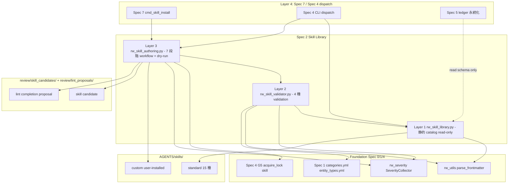
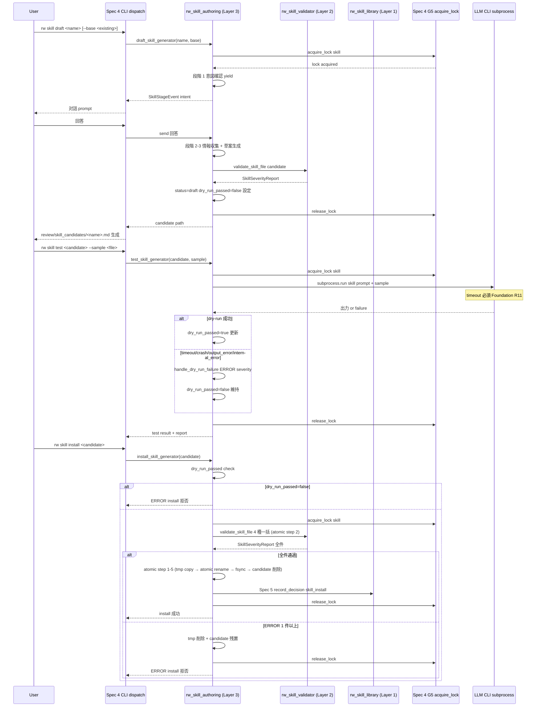
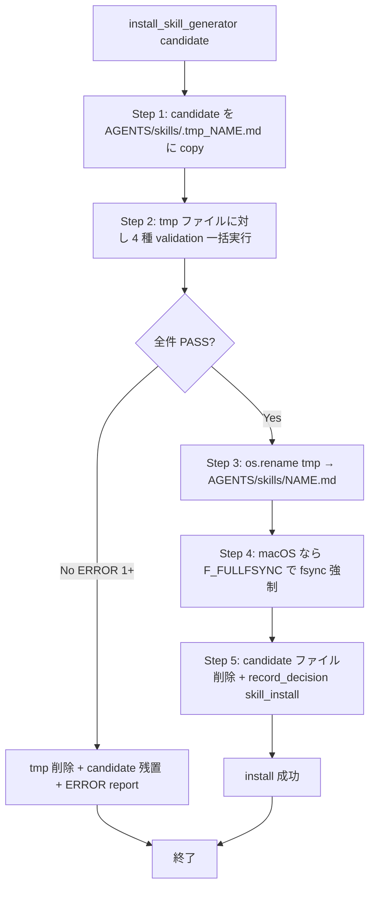
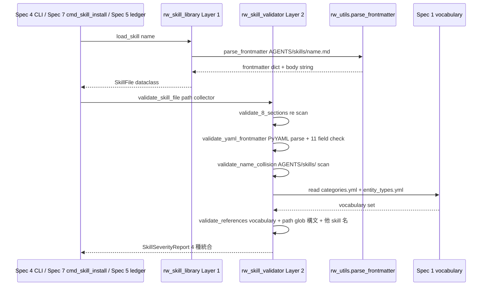
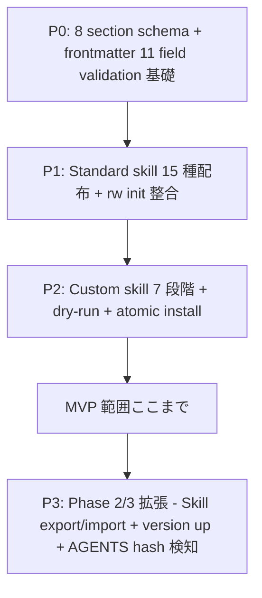

# Technical Design Document: rwiki-v2-skill-library

## Overview

**Purpose**: 本 spec (Spec 2) は Rwiki v2 の **Skill Library** を実体化する。`AGENTS/skills/` 配下の skill ファイル群 (15 種 standard + custom) を管理し、Skill ファイルの 8 section スキーマ・frontmatter 11 field・初期 skill 群 (知識生成 12 種 + Graph 抽出 2 種 + lint 支援 1 種)・Custom skill 7 段階対話作成フロー (`rw skill draft / test / install`)・Install validation (8 section / YAML / 衝突 / 参照整合性)・Atomic install operation・Graph 抽出 skill 出力 schema (Spec 5 への interface 固定)・対話ログ markdown フォーマット (Spec 4 への SSoT) を所管する。

**Users**: 本 spec の API consumer は (a) Spec 4 CLI dispatch (`rw skill list / show / draft / test / install` の 5 系統 handler、`rw lint --fix` の補完提案 trigger)、(b) Spec 5 extraction skill 出力 validation (本 spec が schema を固定、Spec 5 が validation 実装と ledger 永続化)、(c) Spec 7 Skill lifecycle (`cmd_skill_install` のみ本 spec の install validation を呼出、`cmd_skill_deprecate` / `cmd_skill_retract` / `cmd_skill_archive` は Spec 7 単独所管)、(d) Spec 3 dispatch logic (本 spec が `applicable_categories` / `applicable_input_paths` field を提供、Spec 3 が 5 段階優先順位 dispatch 構築)、(e) Spec 6 perspective / hypothesis 生成 skill (本 spec の 8 section + frontmatter 規約に従う、prompt 内容は Spec 6 所管)。

**Impact**: 既存 v1 の task-based AGENTS (9 種 = `ingest` / `lint` / `synthesize` / `synthesize_logs` / `approve` / `query_answer` / `query_extract` / `query_fix` / `audit`) を v2 では output skill-based (15 種) に概念進化させる。v1 の 8 section スキーマは正本承継し、frontmatter は v1 の Mapping 表 (CLAUDE.md) を frontmatter 11 field に内化、task と output 形式の分離 (drafts §2.8) を実現する。MVP 実装は 3 sub-module (rw_skill_library.py ≤ 300 行 / rw_skill_validator.py ≤ 500 行 / rw_skill_authoring.py ≤ 700 行) で完結し、Spec 5 Decision 5-17 / Spec 7 Decision 7-21 と同パターンで 1500 行制約遵守。

### Goals

- 8 section スキーマ + frontmatter 11 field (必須 7 + 任意 4) を確定し、全 skill ファイルが同一形式で読解 / dry-run / lifecycle 管理できる構造を提供する
- Custom skill 作成フロー (`rw skill draft / test / install`) を 7 段階対話で実装し、ユーザー固有 content type の skill 化を可能にする (Scenario 20)
- Install 前 dry-run 必須化 + 4 種 validation (8 section / YAML / 衝突 / 参照整合性) で AGENTS/skills/ への不整合 skill 混入を防止する
- Graph 抽出 skill 2 種 (`entity_extraction` / `relation_extraction`) の出力 schema を本 spec が SSoT として固定し、Spec 5 への validation interface を提供する
- 対話ログ markdown フォーマットを本 spec が SSoT として確定し、Spec 4 (rw chat 保存実装) と Spec 6 (perspective / hypothesis 対話 trigger) が独立に実装できる responsibility 分離を実現する

### Non-Goals

- Skill 選択 dispatch ロジック (5 段階優先順位 + content type マッチ + path glob match) — Spec 3 所管、本 spec は `applicable_categories` / `applicable_input_paths` field を提供するのみ
- Skill lifecycle 状態遷移 (deprecate / retract / archive) のうち install 以外 — Spec 7 所管、本 spec は status 値域定義 (`active` / `deprecated` / `retracted` / `archived`) と initial install 時の `status: active` 設定のみ
- CLI dispatch の引数 parse / 出力整形 / exit code 制御 — Spec 4 所管、本 spec は subcommand 入出力契約のみ
- Skill 起動 CLI Hybrid 実行 (`rw distill --skill <name>` 等) の wrapper 実装 — Spec 4 所管
- L2 Graph Ledger への抽出結果永続化 / edge confidence 計算 / reject queue 管理 — Spec 5 所管
- `categories.yml` / `entity_types.yml` / `tags.yml` の vocabulary 管理 — Spec 1 所管
- Skill export / import 機能 — v2 MVP 外、Phase 2 以降 (R11.5)
- Skill version up 操作 — v2 MVP 外、改版時は新規 skill 名で install (R1.5 / R3.1)
- Skill ファイルへの `update_history` field 適用 — v2 MVP 外、lifecycle 履歴は decision_log の Skill 起源 4 種で網羅 (R3.6)
- AGENTS 自動ロード時の改ざん検知 (hash / signing / verification) — v2 MVP 外、Phase 2 以降 Spec 2 design で再検討 (Spec 4 決定 4-10)

## Boundary Commitments

### This Spec Owns

- **Skill ファイル構造規約**: 8 section スキーマ + frontmatter 11 field + 命名規約 (`AGENTS/skills/<snake_case>.md`、サブディレクトリなし)
- **初期 skill 群 15 種の存在・用途・出力種別**: 知識生成 12 種 (`paper_summary` / `multi_source_integration` / `cross_page_synthesis` / `personal_reflection` / `llm_log_extract` / `narrative_extract` / `concept_map` / `historical_analysis` / `code_explanation` / `entity_profile` / `interactive_synthesis` / `generic_summary`) + Graph 抽出 2 種 (`entity_extraction` / `relation_extraction`) + lint 支援 1 種 (`frontmatter_completion`) の SSoT
- **Graph 抽出 skill 出力 schema**: `entity_extraction` 出力 schema (`name` / `canonical_path` / `entity_type` / `aliases` / `evidence_ids`) + `relation_extraction` 出力 schema (`source` / `type` / `target` / `extraction_mode` / `evidence`) を本 spec が固定、Spec 5 への validation interface
- **Custom skill 7 段階対話作成フロー**: `rw skill draft <name> [--base <existing>] / rw skill test <candidate> [--sample <file>] / rw skill install <candidate>` の入出力契約 + 状態遷移 (draft → validated → install)
- **Skill candidate frontmatter 4 field**: `name` / `base` / `status` (`draft` / `validated`) / `dry_run_passed` (bool)、`review/skill_candidates/<name>.md` 配置
- **Install validation 4 種**: (a) 8 section 完備 / (b) YAML 妥当 + 必須 7 field / (c) 名前衝突なし / (d) 参照整合性 (vocabulary / 出力先 / 他 skill 名)
- **Atomic install operation**: tmp ディレクトリ + 4 validation → atomic rename + macOS F_FULLFSYNC + candidate 削除の 5 step (Spec 5 Decision 5-4 同パターン)
- **対話ログ markdown フォーマット**: frontmatter 5 必須 field (`type: dialogue_log` / `session_id` / `started_at` / `ended_at` / `turns`) + Turn 内部 schema (`## Turn N - ISO 8601` 見出し + `**User:** / **Assistant:**`) + ディレクトリ命名規則 (`raw/llm_logs/{chat-sessions, interactive/<skill>, manual}/`)、Spec 4 (R1.8) / Spec 6 への SSoT
- **HTML 差分マーカー attribute**: `<!-- rw:extend:start target="<path>" reason="<text>" -->` / `<!-- rw:extend:end -->` の MVP 必須 attribute 2 種 (`target` / `reason`) 定義
- **`origin: standard | custom` 区別 + `rw init` 配布対象**: standard 15 種を Rwiki 配布パッケージに同梱、custom はユーザー作成 install のみ
- **`update_mode: create | extend | both` 区別**: 新規生成 / 既存拡張 / 両対応の振る舞い契約
- **frontmatter_completion 出力先 `review/lint_proposals/`**: 新設 (synthesis_candidates と意味分離、Decision 2-9)
- **`rw skill` subcommand 振る舞い契約**: list / show / draft / test / install の 5 種、deprecate / retract / archive の 3 種は Spec 7 へ委譲
- **書込系 lock 取得契約**: write 系 3 操作 (`draft` / `test` / `install`) で `acquire_lock('skill')` 呼出 (Spec 4 G5 LockHelper 経由、`.rwiki/.hygiene.lock` 取得)

### Out of Boundary

- Skill 選択 dispatch ロジック (5 段階優先順位、`applicable_input_paths` glob match、`categories.yml.default_skill` 参照) — **Spec 3 所管**
- Skill 起動 CLI dispatch (`rw distill <file> --skill <name>` / `rw skill ...` の引数 parse / 出力整形 / exit code) — **Spec 4 所管** (本 spec は subcommand 振る舞い契約のみ)
- Skill lifecycle 状態遷移 (`cmd_skill_deprecate` / `cmd_skill_retract` / `cmd_skill_archive` handler、8 段階対話、Backlink 走査) — **Spec 7 所管**
- L2 Graph Ledger への抽出結果永続化 / edge confidence 計算 / reject queue 管理 / `edges.jsonl` schema — **Spec 5 所管**
- Vocabulary YAML 3 種 (`tags.yml` / `categories.yml` / `entity_types.yml`) の管理 / lint 検査 — **Spec 1 所管**
- 共通 frontmatter フィールドの汎用 vocabulary 定義 (`type:` / `tags:` 等) — **Spec 1 所管**、本 spec は skill 固有 frontmatter のみ
- Skill 内容 (perspective / hypothesis 生成 skill の prompt 内容) — **Spec 6 所管**、本 spec は skill ファイル構造規約のみ
- Skill export / import — **v2 MVP 外**、Phase 2 以降
- Skill version up 操作 — **v2 MVP 外**、改版時は新規 skill 名で install
- Skill ファイル `update_history` field — **v2 MVP 外**、decision_log の Skill 起源 4 種で網羅
- AGENTS 自動ロード時の改ざん検知 (hash / signing) — **v2 MVP 外**、Phase 2 以降 (Spec 4 決定 4-10)
- Spec 7 lifecycle merge 仕様 (`merge_strategy` field、Spec 6 cmd_promote_to_synthesis 経由) — **Spec 7 所管**、本 spec の HTML 差分マーカー attribute は MVP `target` + `reason` のみ
- `rw init --reinstall` 等の standard skill 編集後の再配布挙動仕様 — **Spec 4 所管** (R11.4、本 spec は `origin` 値域定義 + initial install 時の `standard` 設定 + 配布完整性 check (R11.6) のみ所管、編集検知や origin 自動切替は実装しない)

### Allowed Dependencies

- **Foundation (Spec 0)**: `rw_severity` (CRITICAL/ERROR/WARN/INFO 4 水準) / `rw_utils.parse_frontmatter` (PyYAML wrapper) / R11 LLM CLI subprocess timeout 必須 / R11.5 `.rwiki/.hygiene.lock` 規約 / Severity 体系
- **Spec 1**: `categories.yml` 読込 (`applicable_categories` 値域 read-only check) / `entity_types.yml` 読込 (entity_extraction 出力 schema 整合)
- **Spec 4 G5 LockHelper**: `acquire_lock('skill')` で `.rwiki/.hygiene.lock` 取得 (write 系 3 操作)
- **Spec 5**: `decision_log.jsonl` への記録 (Skill 起源 4 種 = `skill_install` / `skill_deprecate` / `skill_retract` / `skill_archive` のうち `skill_install` のみ本 spec の install operation で trigger、record_decision API は Spec 5 所管)
- **Python 標準**: `re` / `pathlib` / `glob` / `fnmatch` / `os.rename` / `fcntl` / `subprocess` / `dataclasses`
- **PyYAML**: frontmatter parse (Spec 1 で既に採用、本 spec も流用)
- **依存制約**: 本 spec は Spec 6 / Spec 7 / Spec 3 を直接 import しない (依存方向逆転禁止)。Spec 7 cmd_skill_install / Spec 4 CLI / Spec 6 skill 利用は本 spec の API を consumer 側として呼出

### Revalidation Triggers

- **Skill 8 section スキーマ改版**: 8 section の追加 / 削除 / 順序変更 → 全 standard skill 15 種の改版 + Spec 7 cmd_skill_install validation 整合 + drafts §5.6 改版
- **Skill frontmatter 必須 field 改版**: 必須 7 field の追加 / 削除 / 値域変更 → Spec 1 vocabulary 整合 (`applicable_categories` 値域参照) + Spec 7 status 編集権整合 (R3.5) + drafts §5.6 改版
- **Graph 抽出 skill 出力 schema 改版**: `entity_extraction` / `relation_extraction` の field 追加 / 削除 / 値域変更 → **Spec 5 先行合意必須** (R5.6 Adjacent Spec Synchronization 運用ルール) + Spec 5 R3.5 / R4.5 / R19.2 改版
- **対話ログ markdown フォーマット改版**: frontmatter 5 必須 field / Turn 内部 schema / ディレクトリ命名規則 → Spec 4 R1.8 改版 (保存実装) + Spec 6 改版 (対話 trigger) + drafts §2.11 改版
- **Custom skill 7 段階対話 flow 改版**: 7 段階の追加 / 削除 / 順序変更 → Spec 4 G3 caller 改版 (event 受領形式変更)
- **Standard skill 15 種の追加 / 削除**: 配布 manifest 改版 → Spec 4 `rw init` 動作整合 + Spec 7 cmd_skill_install validation 整合 + drafts §11.2 改版
- **HTML 差分マーカー attribute 拡張** (Phase 2 以降): `merge_strategy` / `confidence` / `evidence_id` 等の追加 → Spec 7 lifecycle merge 仕様整合 + 既存 standard skill `update_mode: extend` の出力改版

## Architecture

### Existing Architecture Analysis

v1 の `templates/AGENTS/` は task type ベース 9 種 (ingest / lint / synthesize / synthesize_logs / approve / query_answer / query_extract / query_fix / audit) に 8 section スキーマを適用していた。v1 CLAUDE.md (templates/CLAUDE.md) が「Failure Conditions Judgment Criteria」で 8 section 不備時 stop を明文化、本 spec はこの規約を v2 で正式化する。

v1 → v2 で task と output 形式が分離 (drafts §2.8): v1 `synthesize` task は出力形式が固定 (Summary / Decision / Reason 等)、v2 では `rw distill <file> --skill <skill_name>` で task と skill を分離、12 種の知識生成 skill から content type に応じて選択する。

v1 の `page_policy.md` / `naming.md` / `git_ops.md` の 3 ポリシーファイルは v2 では steering / Foundation に集約される構造に変化。本 spec の skill ファイルは独立性を維持 (ポリシー依存なし)。

### Architecture Pattern & Boundary Map



**Architecture Integration**:

- **Selected pattern**: 3 Layer DAG (静的 catalog / 純粋 validation / 動的 lifecycle)、Spec 5 Decision 5-17 / Spec 7 Decision 7-21 同パターン
- **Domain/feature boundaries**: catalog (Layer 1, read-only) ↔ validation (Layer 2, stateless) ↔ lifecycle (Layer 3, state machine) の 3 ドメイン分離。cyclic dependency 禁止、Layer 3 → Layer 2 → Layer 1 の 1 方向 import
- **Existing patterns preserved**: Spec 5 / Spec 7 と同様の機能別 sub-module 分割、Foundation R11.5 hygiene.lock 規約、Spec 4 G5 LockHelper 共通利用
- **New components rationale**: Layer 2 (validator) は 4 種 validation を独立関数化 (Decision 2-13)、Layer 3 (authoring) は 7 段階対話 generator を独自実装 (Decision 2-3)
- **Steering compliance**: §3 module DAG 依存方向 / §2.8 Skill library 原則 / §2.7 エディタ責務分離 (markdown 人間可読 + frontmatter 機械可読) を維持

### Technology Stack

| Layer | Choice / Version | Role in Feature | Notes |
|-------|------------------|-----------------|-------|
| Backend / Services | Python 3.10+ | 3 sub-module 実装 | Foundation 標準 |
| YAML Parsing | PyYAML (Spec 1 既存採用) | frontmatter parse | 標準 dependency、本 spec で新規追加なし |
| Markdown Parsing | Python `re` (Decision 2-2) | 8 section 検出 + 差分マーカー parse | Python 標準、新規 dependency なし |
| Path Glob | Python `fnmatch` + `glob` | `applicable_input_paths` 構文妥当性 check | Python 標準 (extended glob `**` 対応) |
| Atomic File Op | `os.rename` + macOS `F_FULLFSYNC` (Decision 2-4) | install operation 5 step | Spec 5 Decision 5-4 同パターン、POSIX 限定 |
| Lock | `fcntl.flock` (Spec 4 G5 LockHelper 経由) | `.rwiki/.hygiene.lock` 取得 | Foundation R11.5、POSIX 限定 |
| LLM CLI | subprocess (Foundation R11 timeout 必須) | dry-run 実行 | timeout / crash / output_error 4 種 failure handling (Decision 2-12) |

> 詳細 trade-off は research.md Architecture Pattern Evaluation section 参照。本 design では決定済の選択を反映。

## File Structure Plan

### Directory Structure

```
scripts/
├── rw_skill_library.py      # Layer 1: 静的 catalog (≤ 300 行)
│                             #   STANDARD_SKILLS tuple 定数 (15 種固定、Decision 2-14)
│                             #   load_skill / list_skills / show_skill API
│                             #   AGENTS/skills/<name>.md path 解決
├── rw_skill_validator.py    # Layer 2: 4 種 validation (≤ 500 行)
│                             #   validate_8_sections / validate_yaml_frontmatter
│                             #   validate_name_collision / validate_references
│                             #   validate_skill_file (4 種一括実行 + 全件 report)
│                             #   SkillSeverityReport dataclass
├── rw_skill_authoring.py    # Layer 3: 7 段階 workflow + dry-run (≤ 700 行)
│                             #   draft_skill_generator (7 段階対話 yield)
│                             #   test_skill_generator (dry-run 実行 + dry_run_passed 更新)
│                             #   install_skill_generator (atomic install 5 step)
│                             #   SkillStageEvent dataclass
│                             #   handle_dry_run_failure (4 種 failure 分類)

AGENTS/skills/                # Skill ファイル本体 (15 種 standard + custom)
├── paper_summary.md          # 知識生成 12 種
├── multi_source_integration.md
├── cross_page_synthesis.md
├── personal_reflection.md
├── llm_log_extract.md
├── narrative_extract.md
├── concept_map.md
├── historical_analysis.md
├── code_explanation.md
├── entity_profile.md
├── interactive_synthesis.md
├── generic_summary.md
├── entity_extraction.md      # Graph 抽出 2 種
├── relation_extraction.md
└── frontmatter_completion.md # lint 支援 1 種

review/skill_candidates/      # Custom skill candidate (Spec 4 G3 caller 経由で配置)
└── <name>.md

review/lint_proposals/        # frontmatter_completion 出力先 (新設、Decision 2-9)
└── <original_filename>-completion.md

raw/llm_logs/                 # 対話ログ保存先 (Decision 2-7、ディレクトリ命名規則)
├── chat-sessions/            # rw chat 起源
│   └── <timestamp>-<session_id>.md
├── interactive/              # interactive skill 起源 (skill 別 sub-subdirectory)
│   └── <skill_name>/
│       └── <timestamp>-<session_id>.md
└── manual/                   # 手動 import 起源
    └── <timestamp>-<session_id>.md

tests/
├── test_skill_library.py     # Layer 1 unit
├── test_skill_validator.py   # Layer 2 unit
├── test_skill_authoring.py   # Layer 3 unit + 7 段階対話 generator
├── test_skill_install_atomic.py    # atomic install 5 step integration
└── test_skill_lock.py        # write 系 3 操作 lock 取得 integration
```

### Modified Files

- `.kiro/drafts/rwiki-v2-consolidated-spec.md` (Adjacent Sync 経由): §5.6 Skill ファイル frontmatter に任意 3 field (`applicable_input_paths` / `dialogue_guide` / `auto_save_dialogue`) 追加 (R3.2 / R15.3、design 11 field 化と整合、Round 4 検出) / §5.7 candidate status 値域を 3 → 2 値 (`draft` / `validated`) に変更 (R12.1) / §11.0 + Scenario 25 (line 2598 / 2606) のファイル名 prefix 表記 `interactive-<skill>-<ts>.md` を subdirectory 表記 `interactive/<skill_name>/<ts>-<session-id>.md` に統一 (Decision 2-7、§3.2 line 783-786 は既に subdirectory 区別記載済) / §11.2 `frontmatter_completion` 出力欄を `review/lint_proposals/` 明示に更新 (Decision 2-9)
- `.kiro/specs/rwiki-v2-cli-mode-unification/design.md` (Adjacent Sync): line 65 「HTML 差分マーカー attribute 詳細 (I-3) = Phase 2/3 Spec 2 / Spec 7 design 委譲 (決定 4-8)」を「Spec 2 Decision 2-8 で MVP attribute (`target` + `reason`) 確定済 (Phase 2 拡張余地 = `merge_strategy` / `confidence` / `evidence_id` は据え置き)」に参照点更新 (Decision 2-8)。frontmatter schema delegation (line 1284 既存 boundary 区別記述) は本 spec を SSoT として既に参照済のため改版不要 (Decision 2-6 / 2-7 の delegation 自体は line 1284 で成立、本 spec design Decision 2-6 / 2-7 確定により Spec 4 側追加改版なし)
- `.kiro/steering/structure.md` (Adjacent Sync): review/ 層構造表に `lint_proposals/` 追加 (Decision 2-9)、raw/llm_logs/ 構造に 3 区別明示 (Decision 2-7、drafts §3.2 と整合させる)

> 各 file は単一責務を保持。Layer 3 が atomic install operation の 5 step を所管、validation 4 種は Layer 2 で独立関数化、catalog read-only は Layer 1 に集約。

## System Flows

### Flow 1: Custom skill draft → test → install (7 段階対話)



### Flow 2: Atomic install 5 step (Decision 2-4 / Spec 5 R7.11 同パターン)



### Flow 3: Skill Library load + Skill Validator dispatch (Layer 関係)



## Requirements Traceability

| Requirement | Summary | Components | Interfaces | Flows |
|-------------|---------|------------|------------|-------|
| 1.1-1.5 | AGENTS/skills/ ディレクトリ構造と命名規約 | Layer 1 SkillLibrary | path 解決 + skill_name validation | — |
| 2.1-2.5 | Skill 8 section スキーマ | Layer 2 SkillValidator (validate_8_sections) | 8 section regex check + Failure Conditions「次のアクション」必須 | Flow 3 |
| 3.1-3.6 | Skill frontmatter 11 field スキーマ | Layer 2 SkillValidator (validate_yaml_frontmatter) + Data Models SkillFrontmatter | 必須 7 field + 任意 4 field check + 値域違反 ERROR + update_history MVP 外 | Flow 3 |
| 4.1-4.4 | 知識生成 skill 12 種 | Layer 1 STANDARD_SKILLS + AGENTS/skills/*.md (12 ファイル) | path table + frontmatter `origin: standard` | — |
| 5.1-5.7 | Graph 抽出 skill 2 種 + Spec 5 連携 | Layer 1 STANDARD_SKILLS + Data Models ExtractionOutputSchema | entity_extraction / relation_extraction 出力 schema (Spec 5 R3.5 / R4.5 整合) | — |
| 6.1-6.4 | lint 支援 skill 1 種 | Layer 1 STANDARD_SKILLS + Data Models LintProposalFrontmatter | review/lint_proposals/ 出力 (Decision 2-9) | — |
| 7.1-7.7 | Custom skill 7 段階対話 | Layer 3 SkillAuthoringWorkflow (draft / test / install generator) | SkillStageEvent yield + dry-run failure 4 種 | Flow 1 |
| 8.1-8.4 | Install 前 dry-run 必須化 | Layer 3 install_skill_generator (dry_run_passed check) | dry_run_passed=false → install 拒否 ERROR | Flow 1 |
| 9.1-9.6 | Install validation 4 種 + atomic operation | Layer 2 validate_skill_file + Layer 3 atomic install 5 step | 4 validation 独立関数 + 全件 report (Decision 2-13) + atomic 5 step (Decision 2-4) | Flow 2, 3 |
| 10.1-10.5 | update_mode 区別 + 差分マーカー | Layer 2 SkillValidator (差分マーカー対 check) + Data Models DiffMarkerAttribute | `<!-- rw:extend:start target reason -->` / `<!-- rw:extend:end -->` (Decision 2-8) | — |
| 11.1-11.6 | origin: standard / custom + rw init 配布 | Layer 1 STANDARD_SKILLS tuple + Spec 4 cmd_init coordination | 配布完整性 check (15 種揃っているか) + standard 編集後も origin 維持 | — |
| 12.1-12.5 | review/skill_candidates/ frontmatter 4 field | Data Models SkillCandidateFrontmatter + Layer 3 status 遷移 | draft → validated → install (Decision 2-1 連携) | Flow 1 |
| 13.1-13.8 | rw skill subcommand 振る舞い契約 + lock | Layer 1 list/show + Layer 3 draft/test/install + Spec 4 G5 acquire_lock | 5 種 subcommand + write 系 3 操作 lock (Decision 2-5) | Flow 1 |
| 14.1-14.6 | Foundation 規範準拠 + SSoT 整合 | (cross-cutting、design 全体で適用) | 用語集整合 + 日本語記述 + 表最小限 + SSoT 出典明示 | — |
| 15.1-15.5 | 対話ログ frontmatter スキーマ + Interactive skill 連携 | Data Models DialogueLogFrontmatter + Layer 2 validate_references (R15.4 判定) | 5 必須 field + Turn 内部 schema (Decision 2-6) + ディレクトリ命名 (Decision 2-7) + R15.4 判定基準 (Decision 2-10) | — |

## Components and Interfaces

| Component | Domain/Layer | Intent | Req Coverage | Key Dependencies (P0/P1) | Contracts |
|-----------|--------------|--------|--------------|--------------------------|-----------|
| SkillLibrary | Layer 1 静的 catalog | Skill ファイル read-only access、STANDARD_SKILLS 定数固定 | 1, 4, 5, 6, 11, 13.1-2 | rw_utils.parse_frontmatter (P0) | Service / State |
| SkillValidator | Layer 2 純粋 validation | 4 種 validation 独立関数 + 全件 report | 1.3, 1.5, 2.3-4, 3.3-4, 9, 10.5, 12.5, 15.4 | Spec 1 vocabulary (P0) / Foundation severity (P0) | Service |
| SkillAuthoringWorkflow | Layer 3 動的 lifecycle | 7 段階対話 generator + dry-run + atomic install | 7, 8, 9.6, 12, 13.3-5 | Layer 2 (P0) / Spec 4 G5 LockHelper (P0) / LLM CLI subprocess (P0) | Service / State |
| ExtractionOutputSchema | Data Models | Graph 抽出 skill 出力 schema 固定 | 5.2-3 | Spec 5 R3.5 / R4.5 (P0 inbound) | API |
| DialogueLogFrontmatter | Data Models | 対話ログ frontmatter 5 必須 field SSoT | 15.1, 15.3, 15.5 | Spec 4 R1.8 (P0 inbound) / Spec 6 (P0 inbound) | API |
| DiffMarkerAttribute | Data Models | HTML 差分マーカー attribute MVP | 10.4 | Spec 7 lifecycle merge (P1 future) | State |
| SkillCandidateFrontmatter | Data Models | review/skill_candidates/ frontmatter 4 field | 12 | Layer 3 status 遷移 (P0) | State |

> **Data Models の表現規約**: Data Models 4 件のうち、外部 spec への API contract (本 spec が SSoT、Spec 5 / Spec 4 / Spec 6 が consumer として interface 利用) として独立した責務を持つ ExtractionOutputSchema は本 section 内に独立 Component sub-section (Responsibilities & Constraints / Dependencies / Contracts / API Contract / Implementation Notes) を持つ。一方、value object / entity の schema (DialogueLogFrontmatter / DiffMarkerAttribute / SkillCandidateFrontmatter) は静的 schema 定義のみで動的責務を持たないため、Logical Data Model section の表 (line 661-) で field / 値域 / 用途を表現する。Component 表中で「Data Models」と一律列挙されるが、表現粒度は責務性質に応じて差別化する。

### Layer 1: SkillLibrary (catalog)

#### Component: SkillLibrary

| Field | Detail |
|-------|--------|
| Intent | Skill ファイル read-only access + STANDARD_SKILLS 定数固定 + path 解決 |
| Requirements | 1.1-1.4, 4.1-4.4, 5.1, 6.1, 11.1-11.6, 13.1-13.2 |

**Responsibilities & Constraints**
- AGENTS/skills/<snake_case>.md の path 解決と read-only load
- STANDARD_SKILLS tuple 定数固定 (15 種、Decision 2-14)
- list_skills / show_skill API 提供 (read-only、lock 不要)
- skill_name = frontmatter `name` = ファイル名拡張子除く の不変条件 (R1.2 / R1.3)
- サブディレクトリ配置不可 (R1.1)、`AGENTS/skills/<name>.md` 単一階層

**Dependencies**
- Inbound: Layer 2 SkillValidator (P0、catalog 読込) / Layer 3 SkillAuthoringWorkflow (P0、path 解決) / Spec 4 CLI dispatch (P0、`rw skill list / show` 直接呼出) / Spec 5 ExtractionOutputSchema reader (P0、抽出 skill output schema 参照) / Spec 7 cmd_skill_install (P0、validation 前段 path 解決)
- Outbound: rw_utils.parse_frontmatter (P0)
- External: PyYAML (P0)

**Contracts**: Service [x] / API [ ] / Event [ ] / Batch [ ] / State [x]

##### Service Interface
```python
from typing import Optional
from pathlib import Path
from dataclasses import dataclass

@dataclass(frozen=True)
class SkillFile:
  name: str                       # snake_case
  origin: str                     # 'standard' | 'custom'
  version: int                    # default 1
  status: str                     # 'active' | 'deprecated' | 'retracted' | 'archived'
  interactive: bool
  update_mode: str                # 'create' | 'extend' | 'both'
  handles_deprecated: bool
  applicable_categories: Optional[list[str]]
  applicable_input_paths: Optional[list[str]]
  dialogue_guide: Optional[str]
  auto_save_dialogue: Optional[bool]
  body_8_sections: dict[str, str]  # section name → content
  raw_body: str

STANDARD_SKILLS: tuple[str, ...] = (
  'paper_summary', 'multi_source_integration', 'cross_page_synthesis',
  'personal_reflection', 'llm_log_extract', 'narrative_extract',
  'concept_map', 'historical_analysis', 'code_explanation',
  'entity_profile', 'interactive_synthesis', 'generic_summary',
  'entity_extraction', 'relation_extraction', 'frontmatter_completion',
)

def load_skill(skill_name: str, vault_path: Path) -> SkillFile: ...
def list_skills(vault_path: Path, status_filter: Optional[set[str]] = None) -> list[SkillFile]: ...
def show_skill(skill_name: str, vault_path: Path) -> SkillFile: ...
```

- Preconditions: `<vault>/AGENTS/skills/` ディレクトリ存在、PyYAML 利用可能
- Postconditions: `load_skill` は frontmatter 11 field と 8 section body を返す、欠落 / 値域違反は SkillValidator が別途 ERROR 報告 (load 自体は best effort)
- Invariants: `skill_name` ↔ `frontmatter.name` ↔ ファイル名 は完全一致 (R1.2)

**Implementation Notes**
- Integration: Spec 4 `rw skill list / show` の薄い wrapper として呼出。Spec 5 が抽出 skill output schema を read-only 参照する際の interface。Spec 7 cmd_skill_install validation 前段の path 解決
- Validation: STANDARD_SKILLS tuple は frozen tuple (改ざん防止)、`rw init` 実行時に 15 件全件存在 check (R11.6 配布完整性)
- **Standard skill 編集後の origin 維持 (R11.4)**: `load_skill` は `origin: standard` の skill ファイルがユーザー編集されても `frontmatter.origin` を `standard` のまま維持して読込、本 spec は編集検知や `origin` 自動切替 (`standard` → `custom`) を実装しない。再配布挙動 (`rw init --reinstall` 等) は Spec 4 所管 (Out of Boundary 末項参照)
- **list_skills / show_skill TOCTOU 規約**: read-only かつ lock 不要のため、並行する write 操作 (`install` / `rw init`) との TOCTOU (Time Of Check Time Of Use) 問題は理論的に発生 (実行時刻によって結果に新 skill 含むか不確定)、MVP single-thread 前提で実害なし。Phase 2 multi-thread 化時に再評価 (Spec 5 Decision 5-20 同パターン)
- Risks: `AGENTS/skills/` 不在 vault での `list_skills` 呼出 → 空 list 返却 + WARN severity (Spec 4 で UX wrapping)

### Layer 2: SkillValidator (4 種 validation)

#### Component: SkillValidator

| Field | Detail |
|-------|--------|
| Intent | Install 時 4 種 validation 独立関数化 + 一括実行 + 全件 report (Decision 2-13) |
| Requirements | 1.3, 1.5, 2.3, 2.4, 3.3, 3.4, 9.1-9.6, 10.5, 12.5, 15.4 |

**Responsibilities & Constraints**
- 4 種 validation を独立関数として実装 ((a) 8 section / (b) YAML / (c) 衝突 / (d) 参照整合性)
- 各 validation は signature 統一: (a)(b) は `(skill_path: Path, report: SkillSeverityReport) -> None` (2 引数)、(c)(d) は `(skill_path: Path, vault_path: Path, report: SkillSeverityReport) -> None` (3 引数、vault_path は AGENTS/skills/ scan + .rwiki/vocabulary/ 参照に必要)。SeverityCollector 役割を `SkillSeverityReport` dataclass で一元化 (本 spec では SeverityCollector 抽象は導入せず、SkillSeverityReport が collector + 結果コンテナを兼ねる)
- 一括実行関数 `validate_skill_file` が 4 種を順次呼出、`SkillSeverityReport` が全件報告を集約
- ERROR 1 件以上で install 拒否 (R9.2)
- 差分マーカー対 check (R10.5)、`update_mode: extend` skill のみ対象
- R15.4 判定 = `interactive: true` または `auto_save_dialogue: true` の skill が対話ログ frontmatter スキーマ参照点 (Output / Input section) を必須記載 (Decision 2-10)

**Dependencies**
- Inbound: Layer 3 SkillAuthoringWorkflow (P0、test / install で呼出)
- Outbound: Layer 1 SkillLibrary (P0、catalog 読込) / Spec 1 vocabulary categories.yml + entity_types.yml (P0)
- External: PyYAML (P0)

**Contracts**: Service [x] / API [ ] / Event [ ] / Batch [ ] / State [ ]

##### Service Interface
```python
from dataclasses import dataclass, field
from typing import Literal

@dataclass
class SkillSeverityIssue:
  validation_kind: Literal['8_sections', 'yaml_frontmatter', 'name_collision', 'references']
  severity: Literal['ERROR', 'WARN', 'INFO']
  detail: str
  location: Optional[str]  # 例: "section 'Failure Conditions' missing"

@dataclass
class SkillSeverityReport:
  skill_path: Path
  issues: list[SkillSeverityIssue] = field(default_factory=list)

  def has_error(self) -> bool: return any(i.severity == 'ERROR' for i in self.issues)
  def filter_by(self, kind: str) -> list[SkillSeverityIssue]: ...

def validate_8_sections(skill_path: Path, report: SkillSeverityReport) -> None: ...
def validate_yaml_frontmatter(skill_path: Path, report: SkillSeverityReport) -> None: ...
def validate_name_collision(skill_path: Path, vault_path: Path, report: SkillSeverityReport) -> None: ...
def validate_references(skill_path: Path, vault_path: Path, report: SkillSeverityReport) -> None: ...

def validate_skill_file(skill_path: Path, vault_path: Path) -> SkillSeverityReport: ...
```

- Preconditions: skill_path 存在、vault_path 配下に AGENTS/skills/ + .rwiki/vocabulary/ 存在
- Postconditions: SkillSeverityReport は 4 種 validation 全件結果を含む (1 件目で short-circuit せず)
- Invariants: 各 validation 関数は SeverityCollector 副作用のみ (return 値なし)、独立性維持

**Validation 4 種詳細**:

- **(a) validate_8_sections**: `re.findall(r'^## (Purpose|Execution Mode|Prerequisites|Input|Output|Processing Rules|Prohibited Actions|Failure Conditions)\s*$', body, re.MULTILINE)` で 8 件検出。1 件でも欠落で ERROR (R2.3)。Failure Conditions section 内に「次のアクション」欄存在 check (R2.4)、欠落で ERROR
- **(b) validate_yaml_frontmatter**: PyYAML parse 成功 + 必須 7 field 揃い (R3.1) + 値域 check (`origin` ∈ {standard, custom}, `update_mode` ∈ {create, extend, both}, `status` ∈ {active, deprecated, retracted, archived}, `version` integer ≥ 1)。任意 4 field 値域 check (`applicable_categories` list[str] / `applicable_input_paths` list[str] + extended glob 構文妥当性 / `dialogue_guide` str / `auto_save_dialogue` bool、Decision 2-15)。違反で ERROR (R3.3 / R3.4)。`applicable_categories` 値が categories.yml 未登録なら WARN (R3.2)
- **(c) validate_name_collision**: `AGENTS/skills/<name>.md` が既存しないこと + custom と standard の同名衝突なし。衝突時 ERROR + 改名 / 改版時の対処を推奨 (R1.5)
- **(d) validate_references**: skill 内で参照される vocabulary (`entity_types.yml` 値) / 出力先 path (`review/<dir>/`) / 他 skill 名 が実在 or 将来配置先として明記された path であること。`update_mode: extend` または `update_mode: both` skill が差分マーカー出力する場合に対 check (`<!-- rw:extend:start ... -->` / `<!-- rw:extend:end -->` 開始/終了対、`target` + `reason` attribute 存在)、欠落で ERROR (R10.3 / R10.5)。R15.4 対象 skill (interactive=true or auto_save_dialogue=true、Decision 2-10) は対話ログ frontmatter スキーマ参照点を Output / Input section に必須記載

**Implementation Notes**
- Integration: Layer 3 SkillAuthoringWorkflow から `test` / `install` の段階で呼出。Spec 7 cmd_skill_install から間接的に呼出 (Layer 3 経由)
- Validation: 4 種すべて独立に test 可能 (test_skill_validator.py で 4 種別 unit test)
- **R15.4 必須記載欠落 ERROR の発火タイミング**: install 時の `validate_references` 内で check (skill load 時 `load_skill` / dispatch 時 Spec 3 では check しない)、責務集約で重複 check 回避 (Decision 2-10 の機械的判定基準 = `interactive: true` または `auto_save_dialogue: true`)
- **Layer 2 単独呼出時の lock 規約**: Layer 2 SkillValidator は通常 Layer 3 SkillAuthoringWorkflow 経由で呼ばれ、Layer 3 が `acquire_lock('skill')` 取得済の状態で実行される。Layer 2 単独呼出 (test 用途) は read-only のため lock 取得不要 (skill ファイル read + AGENTS/skills/ scan + vocabulary read のみ、AGENTS/skills/ への write 操作なし)
- Risks: PyYAML parse エラー時に詳細位置情報が取れない場合 ERROR detail に「YAML 全体 parse 失敗、frontmatter 末尾 `---` 検査推奨」と提示。`applicable_input_paths` の extended glob 構文妥当性 check は `glob.glob` の例外捕捉で代替 (実 path 存在確認は dispatch 時 Spec 3 所管、本 spec は構文妥当性のみ R3.2)

### Layer 3: SkillAuthoringWorkflow (7 段階対話 + dry-run + atomic install)

#### Component: SkillAuthoringWorkflow

| Field | Detail |
|-------|--------|
| Intent | Custom skill 作成 7 段階対話 generator + dry-run 実行 + atomic install 5 step (Decision 2-3 / 2-4) |
| Requirements | 7.1-7.7, 8.1-8.4, 9.6, 12.1-12.4, 13.3-13.5, 13.8 |

**Responsibilities & Constraints**
- 3 つの generator function を提供: `draft_skill_generator` / `test_skill_generator` / `install_skill_generator`
- 各 generator は `SkillStageEvent` を yield、Spec 4 G3 が caller として受領 + 対話 prompt 生成 + ユーザー入力 send
- write 系 3 操作で `acquire_lock('skill')` 取得 (Spec 4 G5 LockHelper 経由、Decision 2-5)
- dry-run failure 4 種 (`timeout` / `crash` / `output_error` / `dry_run_internal_error`) を `handle_dry_run_failure` で分類、全 ERROR severity 統一 (Decision 2-12)
- Install operation atomic 5 step (Decision 2-4): tmp copy → 4 validation → atomic rename → fsync (macOS F_FULLFSYNC) → candidate 削除
- `dry_run_passed: false` 時 install 拒否 (R8.1)、修正後 dry-run 再実行で `dry_run_passed: false` リセット (R8.3)
- skill_install 完了時 Spec 5 `record_decision(decision_type='skill_install')` 呼出 (R12.4)

**Dependencies**
- Inbound: Spec 4 G3 CLI dispatch (P0、5 種 subcommand から呼出) / Spec 7 cmd_skill_install (P0、唯一の install handler)
- Outbound: Layer 2 SkillValidator (P0、validation) / Layer 1 SkillLibrary (P0、path 解決) / Spec 4 G5 acquire_lock (P0、write 系 3 操作) / Spec 5 record_decision (P0、skill_install) / LLM CLI subprocess (P0、dry-run、Foundation R11 timeout 必須)
- External: `os.rename` / `fcntl` / `subprocess` (Python 標準)

**Contracts**: Service [x] / API [ ] / Event [ ] / Batch [ ] / State [x]

##### Service Interface
```python
from typing import Generator
from dataclasses import dataclass

@dataclass
class SkillStageEvent:
  stage: int                       # 1-7 (draft / test / install で異なる段階数を保持)
  flow_kind: Literal['draft', 'test', 'install']
  event_type: Literal['prompt', 'progress', 'result', 'error']
  detail: str
  payload: Optional[dict]          # 段階固有データ (例: candidate_path / sample_path / dry_run_report)

def draft_skill_generator(
  name: str,
  base: Optional[str],
  vault_path: Path,
) -> Generator[SkillStageEvent, str, Path]:
  """7 段階のうち 1-3 (意図確認 / 情報収集 / 草案生成) を実施、candidate path を return"""

def test_skill_generator(
  candidate_path: Path,
  sample_path: Optional[Path],
  vault_path: Path,
) -> Generator[SkillStageEvent, None, SkillSeverityReport]:
  """7 段階のうち 4-5 (Validation + Dry-run) を実施、SkillSeverityReport を return"""

def install_skill_generator(
  candidate_path: Path,
  vault_path: Path,
) -> Generator[SkillStageEvent, str, Path]:
  """7 段階のうち 4-5-7 (Validation + Dry-run check + 1-stage confirm + Atomic Install) を実施、AGENTS/skills/<name>.md path を return。caller の send() 入力で confirm 段階 ('yes' / 'no') を分岐 (R9.4、Round 1 反映)"""

@dataclass
class DryRunFailure:
  failure_kind: Literal['timeout', 'crash', 'output_error', 'dry_run_internal_error']
  failure_detail: str
  retry_recommended: bool
  # retry_recommended 値域 (failure_kind 別):
  #   timeout = True (LLM CLI 一時的問題、再試行で解消可能性高)
  #   crash = False (LLM CLI 自体の問題、再試行で解消困難、ユーザー調査推奨)
  #   output_error = False (skill prompt の構造的問題、skill 修正必要)
  #   dry_run_internal_error = False (本 spec 内部例外、bug report 対象)

def handle_dry_run_failure(
  exception: Exception,
  llm_output: Optional[str],
) -> DryRunFailure: ...
```

- Preconditions: vault_path 配下に `AGENTS/skills/` + `review/skill_candidates/` 存在、Spec 4 G5 LockHelper 利用可能、LLM CLI 利用可能
- Postconditions: `install_skill_generator` 成功時、AGENTS/skills/<name>.md 配置 + candidate 削除 + decision_log 記録の 3 連動が完了 (atomicity 保証)
- Invariants: write 系 3 操作 (`draft` / `test` / `install`) は必ず `acquire_lock('skill')` で `.rwiki/.hygiene.lock` 取得、release は generator 終了時 + 例外 finally

**Implementation Notes**
- Integration: Spec 4 G3 caller が generator を `next()` で進行、`send()` で対話入力供給。Spec 7 cmd_skill_install から install_skill_generator を呼出 (Spec 7 R3.5 / R13.6 と整合)
- Validation: 7 段階対話の各段階で SkillStageEvent yield、Spec 4 G3 が UI 描画責務、本 spec は段階遷移 logic のみ
- **サブカテゴリ skill の汎用性 (R7.7)**: `draft_skill_generator` は Scenario 35 由来の reject 学習 skill 等のサブカテゴリ skill も同 7 段階フローで生成可能、generator 実装は skill 種別を識別せず汎用 (frontmatter `applicable_categories` / `applicable_input_paths` の設定でサブカテゴリ差異を表現)
- **rw init standard skill 配布の dry-run skip (R8.4)**: `rw init` 経由の standard skill 配布は本 spec の `test_skill_generator` を経由せず、Spec 4 cmd_init が `STANDARD_SKILLS` tuple を参照して直接 `AGENTS/skills/` に配置する。dry-run 必須化 (R8.1) は `origin: custom` skill の install のみに適用、standard 配布は適用外 (Rwiki 配布側で品質保証済前提)
- **install dangerous_op 中位置付け + 1-stage confirm (R9.4)**: `install_skill_generator` は validation 通過後も install step に進む前に confirm event を 1 件 yield する (`SkillStageEvent.event_type='prompt'`)、Spec 4 G3 caller の `send()` 入力 (`'yes'` / `'no'`) で install 進行を分岐する内部 logic を持つ。1-stage confirm の UX (prompt 文言 / accept-yes-no) 実装は Spec 4 G3 caller の責務 (`dangerous_op category: 中`、§8.4 / §2.5 Simple dangerous op 整合)、対話深度の正確な仕様は Spec 4 design 所管
- **`rw skill test <candidate-or-name>` の 2 系統対応 (R7.4)**: `test_skill_generator` の `candidate_path: Path` 引数は **caller (Spec 4) 側で path 解決済前提**。caller は `rw skill test <arg>` の `<arg>` が candidate path (`review/skill_candidates/<name>.md`) か既 install 済 skill 名 (`AGENTS/skills/<name>.md` 経由解決) かを引数 parse 段階で判定し、Path 型に統一して本 generator に渡す coordination 規約を採る (本 spec は Path 受領のみ、name 経由解決は Spec 4 の責務)
- **`rw init` 経由 standard skill 配布の lock 取得 (R8.4 + Decision 2-5 関連)**: cmd_init が `STANDARD_SKILLS` tuple を参照して AGENTS/skills/ に直接配置する際、Spec 4 cmd_init は `acquire_lock('skill')` を取得する coordination を要求する (本 spec の install_skill_generator を経由しないが、AGENTS/skills/ への write 操作のため、custom skill install / Hygiene batch との並行衝突を排他制御する必要)。1 度の `rw init` 実行は 15 種一括配置を 1 lock 取得単位として扱う (各 skill 別 lock 取得は不要、`rw init` 全体で 1 lock)
- **R13.8 lock 取得 coordination 要求**: write 系 3 操作 (`draft` / `test` / `install`) + `rw init` 配布 (R8.4) で `.rwiki/.hygiene.lock` 取得を Spec 4 への coordination 要求として明示 (R13.8、Spec 1 R8.14 / Spec 5 R17 と同パターン、本 spec は規範範囲を明示し実装は Spec 4 G5 LockHelper に委譲)
- Risks: lock acquire 失敗 (Hygiene batch 同時実行) → fail-fast WARN + 再試行推奨 (Spec 5 Decision 5-3 同パターン)。dry-run timeout は LLM CLI 一時的問題で再試行可能 (DryRunFailure.retry_recommended=true)、ユーザー判断で再 `rw skill test` 実行

### Component: ExtractionOutputSchema (Spec 5 への validation interface)

| Field | Detail |
|-------|--------|
| Intent | Graph 抽出 skill 2 種 (`entity_extraction` / `relation_extraction`) の出力 schema を本 spec が SSoT として固定、Spec 5 が validation 実装 |
| Requirements | 5.1-5.7 |

**Responsibilities & Constraints**
- `entity_extraction` 出力 schema = JSON 配列、各要素 = `{name: str, canonical_path: str, entity_type: str, aliases: list[str], evidence_ids: list[str]}` (R5.2)
- `relation_extraction` 出力 schema = JSON 配列、各要素 = `{source: str, type: str, target: str, extraction_mode: Literal['explicit', 'paraphrase', 'inferred', 'co_occurrence'], evidence: {quote: str, span: str, source_file: str}}` (R5.3)
- 出力先 = `review/relation_candidates/` (R5.4、Spec 5 が永続化前段の human reject filter として使用)
- schema 自体は本 spec が SSoT、Spec 5 が validation 実装 + ledger 永続化 (R5.5、責務分離)
- schema 変更時は Spec 5 先行合意必須 (R5.6、Adjacent Spec Synchronization 運用ルール)
- Failure Conditions section に「schema validation 不通過時は当該 entity / edge を candidate に採用せず ERROR で報告」必須記載 (R5.7)

**Dependencies**
- Inbound: Spec 5 R3.5 entity validation (P0) / Spec 5 R4.5 relation validation (P0) / Spec 5 R19.2 ledger 永続化 (P0)
- Outbound: なし (Data Models = 静的 schema、外部依存なし)
- External: なし

**Contracts**: API [x] / State [ ]

##### API Contract (出力 schema、informational)
```yaml
# entity_extraction 出力 (review/relation_candidates/<source>-entities.json):
# [
#   {
#     "name": "Brunton",
#     "canonical_path": "wiki/entities/people/brunton.md",
#     "entity_type": "person",   # entity_types.yml 値 (Spec 1)
#     "aliases": ["Steven L. Brunton"],
#     "evidence_ids": ["ev_017"]
#   }
# ]

# relation_extraction 出力 (review/relation_candidates/<source>-relations.json):
# [
#   {
#     "source": "wiki/methods/sindy.md",
#     "type": "extends",
#     "target": "wiki/methods/dmd.md",
#     "extraction_mode": "explicit",
#     "evidence": {
#       "quote": "SINDy extends DMD by ...",
#       "span": "L42-L48",
#       "source_file": "raw/papers/local/brunton-2016.md"
#     }
#   }
# ]
```

**Implementation Notes**
- Integration: Spec 5 R3.5 (entity validation) / R4.5 (relation validation) / R19.2 (本 spec 由来 schema が validation contract) が本 schema を入力 contract として利用
- Validation: schema 違反時の severity = 出力 skill の Failure Conditions section に明記 (ERROR、当該要素を candidate に採用せず)
- Risks: schema 変更時の Spec 5 / drafts §11.2 / Spec 1 との連鎖更新 — Adjacent Sync 経路を本 spec design に記録 (Migration Strategy section)

## Data Models

### Domain Model

- **Skill** (aggregate root): `AGENTS/skills/<name>.md` 単一 markdown ファイル、frontmatter 11 field + 8 section + 任意拡張 section (Examples / Notes / Changelog)
  - **`update_mode: both` skill の振る舞い (R10.3)**: 新規生成 (`review/synthesis_candidates/`) と既存拡張 (差分マーカー出力) の両方を出力可能、各候補ファイルの frontmatter `update_type` (Spec 1 所管、値域: `create` / `extension` / `refactor` / `deprecation-reference`) で識別する。本 spec は `update_mode` 値域 (`create` / `extend` / `both`) のみ所管、`update_type` 値域は Spec 1 frontmatter スキーマ所管
- **Skill Candidate** (entity): `review/skill_candidates/<name>.md`、frontmatter 4 field + 8 section ドラフト
- **Standard Skill Manifest** (value object): STANDARD_SKILLS tuple 15 件 (frozen)
- **Dialogue Log** (entity、本 spec が schema を所管、保存実装は Spec 4): `raw/llm_logs/{chat-sessions, interactive/<skill>, manual}/<timestamp>-<session_id>.md`
- **Lint Proposal** (entity): `review/lint_proposals/<original_filename>-completion.md`、frontmatter `proposal_for` + 補完 frontmatter 本文
- **Diff Marker** (value object): `<!-- rw:extend:start target="..." reason="..." -->` / `<!-- rw:extend:end -->` の対 (`update_mode: extend` または `update_mode: both` skill 出力内、R10.3)
- **Extraction Output** (value object): `review/relation_candidates/<source>-{entities,relations}.json` JSON 配列

### Logical Data Model

#### Skill frontmatter (11 field 統合表示、Decision 2-11、軽-A 解消)

| Field | 種別 | 必須/任意 | 値域 | 用途 | Requirement |
|-------|------|-----------|------|------|-------------|
| `name` | string | 必須 | snake_case ASCII、ファイル名と完全一致 | skill 一意識別 | 1.2, 3.1 |
| `origin` | string | 必須 | `standard` \| `custom` | 配布対象区別、`rw init` で standard のみ | 3.1, 11 |
| `version` | integer | 必須 | ≥ 1、default 1 | install 時 1 固定 (version up MVP 外) | 3.1, 1.5 |
| `status` | string | 必須 | `active` \| `deprecated` \| `retracted` \| `archived` | install 直後 `active`、遷移は Spec 7 所管 | 3.1, 3.5 |
| `interactive` | bool | 必須 | true \| false | 対話型 skill 判定 | 3.1, 15.4 |
| `update_mode` | string | 必須 | `create` \| `extend` \| `both` | 新規生成 / 既存拡張 / 両対応 | 3.1, 10 |
| `handles_deprecated` | bool | 必須 | true \| false | deprecated ページを evidence に使うか | 3.1 |
| `applicable_categories` | list[string] | 任意 | `categories.yml` `name` field 一致 (Spec 1) | L3 wiki content category dispatch hint (Spec 3) | 3.2 |
| `applicable_input_paths` | list[string] | 任意 | extended glob 互換 (`*` / `?` / `[...]` / `**`) | L1 raw 入力 path glob dispatch hint (Spec 3) | 3.2 |
| `dialogue_guide` | string | 任意 | free text (Decision 2-15) | 動的質問生成 prompt | 15.3 |
| `auto_save_dialogue` | bool | 任意 | true \| false (Decision 2-15) | 対話ログ自動保存制御 | 15.3 |

> `update_history` field は v2 MVP 外 (R3.6)、Skill lifecycle 履歴は decision_log の Skill 起源 4 種で網羅。

#### Skill Candidate frontmatter (4 field、R12.1)

| Field | 種別 | 必須 | 値域 | 用途 |
|-------|------|------|------|------|
| `name` | string | 必須 | snake_case (install 後 `<name>.md` と一致) | candidate 識別 |
| `base` | string \| null | 必須 | 既存 skill 名 or null | `--base` 指定時 既存 skill を template として複製 |
| `status` | string | 必須 | `draft` \| `validated` (R12.1、drafts §5.7 の `approved` 値は不採用) | 進行段階 |
| `dry_run_passed` | bool | 必須 | true \| false | 最終修正以降の dry-run 成功記録 |

> `status` 値域は drafts §5.7 の 3 値 (`draft / approved / validated`) を 2 値に絞る Adjacent Sync を要請 (R12.1、theory: dry-run 通過は `dry_run_passed` flag が独立軸で担うため `approved` 値は重複)。

#### Lint Proposal frontmatter (`frontmatter_completion` 出力、Decision 2-9、R6.1-6.4)

| Field | 種別 | 必須 | 値域 | 用途 |
|-------|------|------|------|------|
| `proposal_for` | string | 必須 | lint FAIL となった original markdown ファイル path | 補完提案対象の識別 |
| `confidence` | string | 必須 | `low` \| `medium` \| `high` | LLM 確信度、人間レビュー判断補助 |
| `failed_lint_rules` | list[string] | 必須 | lint check 名 配列 (例: `['frontmatter:type-missing']`) | 補完対象となった lint FAIL 理由 |

**body**: 補完提案の frontmatter (YAML 文字列) 本文記述。採用判断 (採用 / 棄却 / 部分採用) は `decision_log.jsonl` に記録 (R6.3、Spec 5 所管)。

> 出力先 = `review/lint_proposals/<original_filename>-completion.md` (Decision 2-9、新設、synthesis_candidates と意味分離)。`<original_filename>` は path separator を `__` に置換 (例: `raw/incoming/note.md` → `raw__incoming__note-completion.md`) して flat 配置。

#### Dialogue Log frontmatter (5 必須 field、Decision 2-6 / 2-7、R15.1-15.5)

| Field | 種別 | 必須 | 値域 | 用途 |
|-------|------|------|------|------|
| `type` | string | 必須 | 固定値 `dialogue_log` | 対話ログ識別 |
| `session_id` | string | 必須 | `<YYYYMMDD-HHMMSS>-<uuid4-4hex>` (Spec 4 決定 4-13、`uuid.uuid4().hex[:4]` で生成、4 hex 短縮 uuid) | session 一意識別 |
| `started_at` | string | 必須 | ISO 8601 | 開始時刻 |
| `ended_at` | string | 任意 | ISO 8601 (進行中は省略可) | 終了時刻 |
| `turns` | integer | 必須 | ≥ 0 | 対話ターン数 |

#### Dialogue Log Turn 内部 schema (Decision 2-6)

```markdown
---
type: dialogue_log
session_id: 20260428-153000-a3f9
started_at: 2026-04-28T15:30:00+09:00
ended_at: 2026-04-28T16:15:00+09:00
turns: 3
---

## Turn 1 - 2026-04-28T15:30:00+09:00

**User:**
論文 brunton-2016.md を distill したい。

**Assistant:**
paper_summary skill を使うのが適切です。実行しますか？

## Turn 2 - 2026-04-28T15:32:00+09:00

**User:**
はい、お願いします。

**Assistant:**
[出力候補を review/synthesis_candidates/sindy-candidate.md に生成しました]
```

> Append-save 単位 = Turn 1 件 = 1 見出しブロック追記。`turns:` 件数は Turn 増加時に Spec 4 G1 ChatEntry が更新 (本 spec はスキーマ規約のみ、保存実装は Spec 4 R1.8)。

> **session_id 形式の SSoT 委譲**: `session_id` 形式 (timestamp `YYYYMMDD-HHMMSS` + uuid hex 桁数 4) は **Spec 4 design 決定 4-13 が SSoT** (本 spec は dialogue log frontmatter スキーマ規約 SSoT、session_id 形式は Spec 4 write-side invariants として委譲)。本 spec design 内の例 (上記 `session_id: 20260428-153000-a3f9`) は Spec 4 example と統一。

#### Dialogue Log ディレクトリ命名規則 (Decision 2-7)

| Subdirectory | 起源 | 命名形式 | 用途 |
|--------------|------|---------|------|
| `raw/llm_logs/chat-sessions/` | `rw chat` | `<timestamp>-<session_id>.md` | 対話モード起源 |
| `raw/llm_logs/interactive/<skill_name>/` | interactive: true skill | `<timestamp>-<session_id>.md` | skill 別 sub-subdirectory に分類 |
| `raw/llm_logs/manual/` | 手動 import | `<timestamp>-<session_id>.md` | 手動配置 (外部 LLM ログを取り込み等) |

#### HTML Diff Marker attribute (Decision 2-8、R10.4)

```markdown
<!-- rw:extend:start target="wiki/methods/sindy.md" reason="新しい論文 brunton-2024 で SINDy 拡張パターン追加" -->
## 拡張: 高次非線形系への適用

(skill 出力本文)

<!-- rw:extend:end -->
```

| Attribute | 必須 | 値域 | 用途 |
|-----------|------|------|------|
| `target` | 必須 | wiki ページ path (例: `wiki/methods/sindy.md`) | 拡張対象 wiki page、機械処理用 |
| `reason` | 必須 | string (1 行) | 拡張理由、人間レビュー支援 |

> Phase 2 拡張余地: `merge_strategy` (Spec 7 lifecycle merge 仕様連携) / `confidence` (LLM 確信度) / `evidence_id` (L2 evidence.jsonl 参照) — MVP では除外 (Decision 2-8)。

### Data Contracts & Integration

- **Skill ファイル read schema**: PyYAML parse + body string (8 section detection)、SkillFile dataclass で表現
- **Extraction output schema**: JSON 配列、Spec 5 が input contract として validation (R5.5 責務分離)
- **Dialogue Log frontmatter schema**: 5 必須 field + Turn 内部 schema (Decision 2-6 / 2-7)、Spec 4 R1.8 が input contract として保存実装
- **Cross-Service Data Management**: 本 spec は data 永続化を Spec 5 (decision_log) と Spec 4 (対話ログ) に委譲、本 spec の write 操作は AGENTS/skills/ (本体 `<name>.md` + atomic install 一時ファイル `.tmp_<name>.md`、Decision 2-4) + review/skill_candidates/ + review/lint_proposals/ のみ (3 ディレクトリ)

## Error Handling

### Error Strategy

本 spec は Foundation R11 Severity 体系 (CRITICAL / ERROR / WARN / INFO 4 水準) に準拠。各 validation / lifecycle 操作は SeverityCollector で全件 report、ERROR 1 件以上で操作拒否 (R9.2 / R8.1)。

### Error Categories and Responses

- **Validation 4 種 ERROR** (User Errors 相当): 8 section 欠落 / YAML parse 失敗 / 値域違反 / 名前衝突 / 参照不整合 → install 拒否 + 失敗種別と該当箇所 report (R9.2)
- **dry-run failure 4 種 ERROR** (Decision 2-12): timeout / crash / output_error / dry_run_internal_error → `dry_run_passed: false` 維持 + DryRunFailure dataclass で `failure_kind` + `failure_detail` + `retry_recommended` 提示
- **Atomic install 失敗** (System Errors 相当、Decision 2-4 5 step 別 rollback、R9.6):
  - **Step 1 (tmp copy) 失敗**: tmp 生成失敗 + candidate 残置 + ERROR
  - **Step 2 (4 validation) ERROR 1 件以上**: tmp 削除 + candidate 残置 + ERROR (R9.2)
  - **Step 3 (os.rename) 失敗**: tmp 削除 + candidate 残置 + ERROR (rename 不成立、AGENTS/skills/ 未配置)
  - **Step 4 (fsync) 失敗** (atomic rename 成功後): AGENTS/skills/<name>.md 配置済 = install 完了扱い、fsync 失敗は WARN (OS crash 時のファイル消失リスクあり、Spec 5 Decision 5-4 同パターン)
  - **Step 5a (candidate 削除) 失敗**: AGENTS/skills/<name>.md 配置済 = install 成功、candidate 残存は WARN (再 install 時の名前衝突 ERROR、ユーザー手動削除推奨)
  - **Step 5b (record_decision skill_install) 失敗**: AGENTS/skills/<name>.md 配置済 = install 成功、Spec 5 decision_log 記録なしは WARN (Spec 5 が独立、本 spec install 成功は変わらず)
- **Lock acquire 失敗** (Concurrency Errors): Hygiene batch 同時実行 → fail-fast WARN + 再試行推奨 (Spec 5 Decision 5-3 同パターン)
- **`applicable_categories` WARN** (categories.yml 未登録値): 許可値外で WARN severity 報告、Spec 1 categories.yml 拡張に追従可能 (R3.2)
- **R15.4 必須記載欠落** (Logic Errors): interactive=true or auto_save_dialogue=true skill が Output / Input section に対話ログ frontmatter スキーマ参照点を欠落 → ERROR severity (Decision 2-10)
- **Global failure (process kill / disk full / OOM)**: 本 spec の write 操作は atomic install (Decision 2-4) + lock 取得 (Decision 2-5) で保護、partial state は上記 Step 別 rollback で明示処理。Spec 5 Decision 5-4 + Foundation Eventual Consistency 規範 (Spec 4 重-厳-4 turn atomic write / 重-厳-6 session 中断時の broken state 不発生 同パターン) に従い、process kill / OOM 発生時も AGENTS/skills/ 配下に partial / corrupted ファイルが残らないことを保証

### Monitoring

- 各 validation / lifecycle 操作の severity 集計を Foundation severity infra に共通記録、`logs/skill_<operation>_latest.json` 構造化ログ (Foundation R11 + steering structure.md)
- 全 module で Severity 4 水準 (CRITICAL / ERROR / WARN / INFO) を継承 (Foundation R11)
- exit code 0/1/2 分離 (PASS / runtime error / FAIL 検出) を継承 (Spec 5 / Spec 4 / Foundation 同パターン)
- skill_install 操作の trace ID = `decision_id` 兼用 (decision_log.jsonl で追跡、Spec 5 record_decision API 経由、R12.4)、事後 trace 可能性を保証
- dry-run failure 統計 (timeout / crash / output_error の件数推移) は Phase 2 で対話ログ frontmatter 拡張連携 (Spec 4 design 申し送り、本 spec は schema のみ)

## Testing Strategy

### Unit Tests

- **Layer 1 SkillLibrary**: `load_skill` で 11 field + 8 section 取得、`list_skills` で status_filter 適用、`STANDARD_SKILLS` tuple immutability 確認、`AGENTS/skills/` 不在時 graceful degradation
- **Layer 2 SkillValidator** (4 種別 unit test): `validate_8_sections` で 8 section 揃い / 1 件欠落 / Failure Conditions 「次のアクション」欠落のテスト、`validate_yaml_frontmatter` で必須 7 field / 値域違反 / 任意 4 field / extended glob 構文妥当性のテスト、`validate_name_collision` で AGENTS/skills/ 衝突検出、`validate_references` で vocabulary 参照 + 出力先 path + 他 skill 名 + 差分マーカー対 + R15.4 判定のテスト
- **Layer 2 SkillValidator (差分マーカー対 check 拡張、R10.3)**: `update_mode: extend` に加えて `update_mode: both` skill 出力でも差分マーカー対 check を実行 (両 mode のテストケースで対 check 動作確認)
- **Layer 3 SkillAuthoringWorkflow**: `draft_skill_generator` の 7 段階 yield、`test_skill_generator` の dry-run failure 4 種 (timeout / crash / output_error / dry_run_internal_error) 分類、`install_skill_generator` の atomic 5 step、`handle_dry_run_failure` の retry_recommended 判定
- **Layer 3 SkillAuthoringWorkflow (dry-run failure retry_recommended 値域、R5-2)**: timeout=True / crash=False / output_error=False / dry_run_internal_error=False の値域を 4 種別 test ケースで確認

### Integration Tests

- **Atomic install 5 step**: tmp copy → 4 validation → atomic rename → fsync → candidate 削除 の連動、ERROR 1 件発生時の rollback (tmp 削除 + candidate 残置)
- **Atomic install Step 別 rollback (R5-1)**: Step 4 fsync 失敗 (atomic rename 成功後の WARN 扱い、AGENTS/skills/<name>.md 配置済) / Step 5a candidate 削除失敗 (WARN 扱い、install 成功) / Step 5b record_decision 失敗 (WARN 扱い、install 成功 + decision_log 記録なし) を mock で injection
- **Lock 取得**: write 系 3 操作 (`draft` / `test` / `install`) で `acquire_lock('skill')` 必ず取得 + release、Hygiene batch 同時実行で fail-fast
- **rw init 配布の lock 取得 (R7-2)**: cmd_init mock が `acquire_lock('skill')` を取得することを確認、Hygiene batch mock との並行実行で fail-fast 動作確認、15 種一括配置を 1 lock 単位として扱うことを assertion
- **dry-run failure**: LLM CLI subprocess の timeout / crash / output_error を mock、`dry_run_passed: false` 維持確認
- **Standard skill 15 種配布**: `rw init` 配布完整性 check (R11.6)、15 件全件存在 + 各 frontmatter `origin: standard`
- **rw init standard skill 配布の dry-run skip (R8.4)**: cmd_init mock が STANDARD_SKILLS tuple 経由で直接 AGENTS/skills/ に配置、test_skill_generator を経由しないことを assertion で確認、`origin: custom` skill のみ dry-run 必須化される動作確認
- **Spec 5 連携**: `entity_extraction` / `relation_extraction` 出力 JSON が Spec 5 R3.5 / R4.5 schema validation に通過

### E2E Tests

- **Custom skill 作成 → dry-run → install 全 flow**: 7 段階対話完走、AGENTS/skills/ 配置、decision_log skill_install 記録 (Spec 5 record_decision 連携)
- **install 直前 1-stage confirm (R9.4)**: install_skill_generator が confirm event を 1 件 yield、caller mock の send() 'yes' で install 進行 / 'no' で install 中止の分岐動作を E2E 確認
- **update_mode: both skill の出力 (R10.3)**: 新規生成 (review/synthesis_candidates/ に candidate 出力) + 既存拡張 (差分マーカー出力) 両方を出力する skill の E2E test、各候補ファイル frontmatter `update_type` に正しい値が設定されることを確認
- **dry-run 修正サイクル**: dry-run 失敗 → 修正 → 再 dry-run 成功 → install 成功
- **Spec 7 cmd_skill_install 経由 install**: Spec 7 cmd_skill_install handler から本 spec install_skill_generator 呼出、atomic operation 完走
- **frontmatter_completion → review/lint_proposals/**: lint FAIL trigger → frontmatter_completion 実行 → review/lint_proposals/<filename>-completion.md 生成

### Performance / Load

- **Skill 15 種 load 時間**: `list_skills` で 15 種全件 load < 100ms (frontmatter parse + 8 section detection、PyYAML overhead)
- **Validation 4 種 一括実行時間**: 単一 skill ファイル < 50ms (4 種独立、1 度の skill ファイル read で複数 validation)
- **Atomic install operation**: < 200ms (4 validation + os.rename + fsync)
- **Concurrent skill operation**: MVP single-thread 前提、Spec 4 G5 LockHelper でシリアル化

## Security Considerations

### Skill ファイル parse の path traversal

- **Threat**: skill ファイル名 (例: `../etc/passwd.md`) で path traversal、AGENTS/skills/ 外への file system access
- **Mitigation**: `validate_name_collision` で `^[a-z][a-z0-9_]*$` regex check、ASCII snake_case 限定 (R1.2)、path 解決時 `Path.relative_to(vault_path / 'AGENTS' / 'skills')` で外部 path 拒否

### Custom skill 内の prompt injection

- **Threat**: Custom skill の Processing Rules section に意図的な prompt injection 指示 (例: 「他 skill の内容を上書き」)、LLM CLI 経由で意図しない動作
- **Mitigation**: skill ファイルは LLM が prompt として読込前に Skill Validator が Prohibited Actions section の存在を check (R2.1 で必須化)、Failure Conditions section に「skill 領分介入は禁止」条項を必須記載 (R2.2)。dry-run 時に LLM 出力が Prohibited Actions に違反した場合 dry_run_passed: false 維持

### Atomic install の race condition

- **Threat**: 複数 process が同時 install で AGENTS/skills/<name>.md 重複書込
- **Mitigation**: `acquire_lock('skill')` で `.rwiki/.hygiene.lock` 取得 (Decision 2-5)、fail-fast (LOCK_NB) で 2 回目以降の process 拒否 (Spec 5 Decision 5-3 同パターン)

### `applicable_input_paths` glob 経由の SSRF / Local file disclosure

- **Threat**: `applicable_input_paths: ['/etc/**']` で system path 露出
- **Mitigation**: 本 spec は構文妥当性 check のみ (R3.2)、実際の path 解決は Spec 3 dispatch logic 所管、Spec 3 で vault_path 配下限定 enforce

## Performance & Scalability

### Target Metrics (推測値、MVP 規模で実装時に実測検証予定)

| 操作 | 規模 | 目標時間 | 根拠 |
|------|------|----------|------|
| `list_skills` | 15 種 (standard) | < 100ms | frontmatter parse 15 回 + 8 section detection 15 回、PyYAML overhead 2-5ms/件 |
| `list_skills` | 100 種 (Phase 2 想定) | < 700ms | 線形スケール、現状 single-thread で問題なし |
| `validate_skill_file` (4 種一括) | 単一 skill | < 50ms | re scan + PyYAML parse + path scan 4 種、各 < 15ms |
| `install_skill_generator` (atomic 5 step) | 単一 skill | < 200ms | validation 50ms + os.rename + macOS F_FULLFSYNC +30-50ms |
| concurrent skill operation | MVP single-thread | シリアル化 | Spec 4 G5 LockHelper、Phase 2 で threading.Lock 二重 lock (Spec 5 Decision 5-20 同パターン) |

### Notes

- **Skill catalog load**: 15 種全件 load 想定で < 100ms 以内 (frontmatter parse 15 回 + 8 section detection 15 回)、PyYAML / re 標準 module 利用で overhead 極小
- **Validation 4 種**: 単一 skill ファイル < 50ms、4 validation の独立性により並列化可能 (Phase 2 拡張余地、現状 single-thread)
- **Atomic install**: < 200ms 想定 (validation + os.rename + fsync)、macOS F_FULLFSYNC で +30-50ms
- **Concurrent skill operation**: MVP は single-thread 前提、Spec 4 G5 LockHelper でシリアル化。Phase 2 で `threading.Lock` 二重 lock 検討 (Spec 5 Decision 5-20 同パターン)
- **Standard skill 15 種固定**: skill 数増加時の `list_skills` overhead は線形、100 件規模まで問題なし。Phase 2 で skill 100+ 規模時の cache 検討 (Spec 5 R14.7 SQLite cache ベース高速 traverse 同パターン適用余地、本 spec では derived cache `.rwiki/cache/skill_index.sqlite` 等の Phase 2 拡張余地)

## Migration Strategy

### Phase 順序 (Internal P0-P3)



- **P0**: 8 section schema + frontmatter 11 field 確定 + Skill Validator 4 種実装 (要件: R1, R2, R3, R9, R10, R12, R14)
- **P1**: Standard skill 15 種ファイル整備 + `rw init` 配布 (要件: R4, R5, R6, R11)。`rw init` 配布時の standard skill (`origin: standard`) は dry-run 必須化 (R8.1) を適用しない (R8.4、Rwiki 配布側で品質保証済前提)、Spec 4 cmd_init implementer は `STANDARD_SKILLS` tuple を参照して `test_skill_generator` を経由せず `AGENTS/skills/` に直接配置する coordination
- **P2**: Custom skill 7 段階対話 + dry-run + atomic install + lock 取得 (要件: R7, R8, R9.6, R13)
- **P2 + Spec 4 / Spec 5 / Spec 7 coordination**: 対話ログ frontmatter SSoT + extraction skill output validation interface + skill_install decision_log 連携 (要件: R15, R5.5, R12.4)
- **P3 (v0.8 候補)**: AGENTS hash 検知 (`rw skill verify`) / Skill export/import (drafts §11.5) — MVP 範囲外、Adjacent Sync で本 spec 改版

### v1 → v2 移行

| 項目 | v1 | v2 (本 spec) | 移行手順 |
|------|----|----|---------|
| Task-based AGENTS | 9 種 (`ingest` / `synthesize` 等) | Output skill-based 15 種 | v1 知識を新 skill ファイルとして書き換え (互換 alias なし) |
| 8 section スキーマ | v1 で確立 | v1 から正本承継 | 既存スキーマを skill ファイルに直接適用 |
| frontmatter | v1 簡易 metadata | v2 frontmatter 11 field (必須 7 + 任意 4) | v2 で完全新規定義 |
| Custom skill 作成 | (v1 不在) | `rw skill draft / test / install` 7 段階 | v2 新規機能 |
| Skill validation | (v1 不在) | 4 種 validation + atomic install | v2 新規機能 |

### 持ち越し Adjacent Sync

- **Adjacent Sync 必須 4 件** (本 spec design approve 時または implementation 着手前、2026-04-28 Round 4 で §5.6 追加):
  - `.kiro/drafts/rwiki-v2-consolidated-spec.md` §5.6 Skill ファイル frontmatter に任意 3 field (`applicable_input_paths` / `dialogue_guide` / `auto_save_dialogue`) 追加 (R3.2 / R15.3、design 11 field 化と整合、Round 4 で検出された Adjacent Sync 漏れ解消)
  - `.kiro/drafts/rwiki-v2-consolidated-spec.md` §5.7 candidate status 値域 3 → 2 値 (R12.1、本 design Decision 2-1 / R12.1 連携)
  - `.kiro/drafts/rwiki-v2-consolidated-spec.md` §11.0 + Scenario 25 (line 2598 / 2606) のファイル名 prefix 表記 `interactive-<skill>-<ts>.md` を subdirectory 表記に統一 (Decision 2-7)。§3.2 line 783-786 は既に 3 subdirectory 記載済のため改版不要、§2.11 (「ユーザー primary interface は発見」原則) は対象外 (誤記訂正)
  - `.kiro/drafts/rwiki-v2-consolidated-spec.md` §11.2 `frontmatter_completion` 出力欄を `review/lint_proposals/` 明示に更新 (Decision 2-9)
- **Adjacent Sync 部分必要 1 件**: `.kiro/specs/rwiki-v2-cli-mode-unification/design.md` line 65 「Phase 2/3 Spec 2 / Spec 7 design 委譲」記述を「Spec 2 Decision 2-8 で MVP attribute (`target` + `reason`) 確定済」に参照点更新 (Decision 2-8)。frontmatter schema delegation (line 1284 既存 boundary 区別記述) は本 spec SSoT 参照が既に成立しているため改版不要
- **Adjacent Sync 推奨 1 件**: `.kiro/steering/structure.md` review/ 層構造表に `lint_proposals/` 追加 (Decision 2-9)、raw/llm_logs/ 構造に 3 区別明示 (Decision 2-7、drafts §3.2 と整合)

### Adjacent Sync 経路 (upstream / downstream Spec coordination)

- **upstream Foundation (Spec 0)**: Severity 体系 (R11) + LLM CLI subprocess timeout 必須 (R11) + `.rwiki/.hygiene.lock` 規約 (R11.5) を本 spec が継承、Foundation 規範を逸脱しない
- **upstream Spec 1 (classification)**: `categories.yml` (`applicable_categories` 値域参照) + `entity_types.yml` (entity_extraction 出力 schema 整合) を本 spec が読む。Spec 1 改版時は本 spec の `validate_yaml_frontmatter` (categories.yml 未登録値 WARN) と extraction skill 出力 schema が連動更新
- **upstream Spec 4 (cli-mode-unification)**: G5 LockHelper (`acquire_lock('skill')` API) + 決定 4-13 (session_id 形式) を本 spec が利用。Spec 4 design 改版時は本 spec の lock 取得経路 (Decision 2-5) と dialogue log frontmatter 例 (Decision 2-6 / 2-7) が連動更新
- **downstream Spec 3 (prompt-dispatch)**: 本 spec が `applicable_categories` / `applicable_input_paths` field を提供、Spec 3 が 5 段階優先順位 dispatch 構築
- **downstream Spec 5 (knowledge-graph)**: 本 spec が ExtractionOutputSchema (entity_extraction / relation_extraction 出力 schema、R5.2 / R5.3) を SSoT として固定、Spec 5 が validation 実装 + ledger 永続化 (R5.5 / R5.6 責務分離)
- **downstream Spec 6 (perspective-generation)**: 本 spec の 8 section + frontmatter 11 field 規約に従う perspective / hypothesis 生成 skill を Spec 6 が定義、prompt 内容は Spec 6 所管
- **downstream Spec 7 (lifecycle-management)**: cmd_skill_install のみ本 spec の install_skill_generator を呼出 (R12.4 連携)、cmd_skill_deprecate / cmd_skill_retract / cmd_skill_archive は Spec 7 単独所管

### 依存順 / Implementation 着手前提

- **本 spec implementation 着手前提**: Spec 0 (Foundation R11 / R11.5 / Severity infra) + Spec 1 (categories.yml + entity_types.yml) + Spec 4 (G5 LockHelper) implementation 完了
- **本 spec implementation 完了 → 後続着手可能**: Spec 7 implementation (cmd_skill_install が本 spec の install_skill_generator 呼出) + Spec 5 implementation (extraction skill output validation interface 利用) + Spec 6 implementation (perspective / hypothesis 生成 skill が本 spec の 8 section + frontmatter 規約に従う) + Spec 3 implementation (`applicable_categories` / `applicable_input_paths` 利用)
- 依存順整合: roadmap.md L43-72 の Phase 3 後半位置 (Phase 3 前半 = Spec 5、Phase 3 後半 = Spec 2) と整合

### Phase 2/3 拡張余地

- **Skill export / import** (drafts §11.5、R11.5): import 時の `origin: standard` 衝突解決 + skill diff merge 仕様確定が必要、Phase 2 以降
- **Skill version up** (R1.5 / R3.1): 同名 skill の v1 → v2 改版手順、Phase 2 以降 (現状は新規 skill 名で install を基本方針)
- **AGENTS hash 検知** (Spec 4 決定 4-10): `rw skill verify` で skill ファイルの hash / signing / verification、Phase 2 以降 Spec 2 design で再検討
- **Windows サポート** (Decision 2-4 / 2-5、Spec 5 Decision 5-3 同パターン): atomic operation + lock の POSIX 限定解除、Foundation / roadmap.md 改版必要、Phase 4 持ち越し候補
- **Skill 100+ 規模時の cache** (現状 single-thread + 15 種で問題なし): Spec 5 R14.7 SQLite cache ベース高速 traverse 同パターン適用余地、Phase 3 以降

## Supporting References

詳細 trade-off / 設計判断記録 / Architecture Pattern Evaluation は `.kiro/specs/rwiki-v2-skill-library/research.md` 参照 (Decision 2-1 〜 2-15 の 15 件)。

- 出典 SSoT: `.kiro/drafts/rwiki-v2-consolidated-spec.md` v0.7.12 §2.8 / §5.6 / §5.7 / §7.2 Spec 2 / §11.2
- 同パターン採用先: Spec 5 design Decision 5-3 / 5-4 / 5-17 / 5-20 + Spec 7 design Decision 7-15 / 7-16 / 7-21 + Spec 4 design 決定 4-3 / 4-8 / 4-10 / 4-13
- v1 起源: `v1-archive/templates/AGENTS/README.md` + `synthesize.md` + `CLAUDE.md` (8 section スキーマ + Failure Conditions Judgment Criteria 起源)

---

_change log_

- 2026-04-28: 初版生成 (Discovery + Synthesis 完了 + Decision 2-1 〜 2-15 + 14 セクション標準準拠 + 3 sub-module DAG + Boundary 4 サブセクション populate + 全 15 Requirement traceability)
- 2026-04-28: Round 0 訂正 (Adjacent Sync 必須 4 件 → 必須 3 件 + 部分必要 1 件 + 推奨 1 件、§2.11 → §11.0 / Scenario 25 訂正 + Spec 4 sync を line 65 のみに絞り込み)
- 2026-04-28: Round 1 review 反映 (本質的観点 b 構造的不均一 + c 文書 vs 実装不整合 + d 規範前提曖昧化 強制発動による重要級 5 件解消):
  - **R7.7 サブカテゴリ skill 汎用性**: Layer 3 Implementation Notes に「`draft_skill_generator` は Scenario 35 由来 reject 学習 skill 等のサブカテゴリも同 7 段階フローで生成可能」追記
  - **R8.4 rw init standard skill dry-run skip**: Layer 3 Implementation Notes + Migration Strategy P1 に「`rw init` 経由 standard 配布は test_skill_generator 経由せず STANDARD_SKILLS tuple 参照で直接配置、dry-run 必須化は custom skill のみ適用」追記
  - **R9.4 install dangerous_op 中 + 1-stage confirm**: Layer 3 Implementation Notes に「`install_skill_generator` は validation 通過後 install 直前に confirm event 1 件 yield、Spec 4 G3 caller の send() 入力で進行分岐、UX 実装は Spec 4 所管」追記
  - **R10.3 update_mode: both + update_type**: Data Models Domain Model に「`both` skill 振る舞い + `update_type` 値域 (`create` / `extension` / `refactor` / `deprecation-reference`) は Spec 1 所管」追記、Diff Marker value object と Layer 2 validate_references の対 check 対象を `extend` または `both` に拡張
  - **R11.4 standard skill 編集後 origin 維持 + reinstall coordination**: Layer 1 Implementation Notes に「`load_skill` は編集後も `frontmatter.origin` を `standard` 維持、自動切替なし」追記、Out of Boundary に「`rw init --reinstall` 等再配布挙動は Spec 4 所管」追記
- 2026-04-28: Round 2 review 反映 (Spec 0 R2 重-厳-3 同型 = Components/sub-section 欠落 2 件再発 + 表現不均一 1 件解消):
  - **R2-1 Layer 1 SkillLibrary Inbound Dependencies 欠落**: Layer 1 Dependencies sub-section に Inbound (Layer 2 / Layer 3 / Spec 4 CLI / Spec 5 ExtractionOutputSchema reader / Spec 7 cmd_skill_install の 5 系統) 追記、Layer 2/3 と構造均一化
  - **R2-2 ExtractionOutputSchema Dependencies sub-section 全体欠落**: ExtractionOutputSchema Component sub-section に Dependencies 追加 (Inbound = Spec 5 R3.5 / R4.5 / R19.2、Outbound = なし、External = なし)、Layer 1/2/3 と構造均一化
  - **R2-3 Data Models 表現規約明示**: Components 表直後に注記追加 (API contract = ExtractionOutputSchema は独立 Component sub-section、value object / entity schema = 残 3 件は Logical Data Model 表で表現、表現粒度差別化を明示)
- 2026-04-28: Round 3 review 反映 (Spec 1 R5 同型 = API signature の文書 vs 実装乖離、Spec 5 で 5 回再発の典型再発 4 件解消):
  - **R3-1 validation 関数 signature 統一の文書 vs 実装乖離**: Layer 2 Responsibilities & Constraints の文言を実装と整合 ((a)(b) は 2 引数 / (c)(d) は 3 引数 + vault_path、SeverityCollector 抽象は導入せず `SkillSeverityReport` で一元化)
  - **R3-2 test_skill_generator name 経由対応 (R7.4)**: Layer 3 Implementation Notes に「caller (Spec 4) 側で candidate path / skill 名を Path 型に解決してから本 generator に渡す」coordination 規約明示
  - **R3-3 install_skill_generator Generator type と R9.4 confirm 整合性破綻**: Generator type を `Generator[SkillStageEvent, None, Path]` → `Generator[SkillStageEvent, str, Path]` に修正、send 型 None → str で 'yes' / 'no' 文字列受領可能化 (Round 1 反映と整合)
  - **R3-4 session_id 形式の Spec 2 内部矛盾 + Spec 4 design 文書乖離**: Spec 2 design 内例を Spec 4 決定 4-13 と統一 (`<timestamp>-<8 hex>` → `<YYYYMMDD-HHMMSS>-<uuid4-4hex>`、4 hex)、注記追加で「session_id 形式 SSoT は Spec 4 design 決定 4-13、本 spec は dialogue log frontmatter スキーマ規約 SSoT」明示
- 2026-04-28: Round 4 review 反映 (Domain Model placement 1 件 + Adjacent Sync 漏れ 1 件 + cosmetic 1 件解消):
  - **R4-1 Domain Model R10.3 説明文 placement 不整合 (Round 1 反映で発生)**: Skill aggregate root の sub-bullet として位置付け (indentation +2)、Domain Model リスト「概念分類」「説明文」「概念分類」混在を解消 (Spec 0 R2 重-厳-3 同型 variant)
  - **R4-2 drafts §5.6 Skill frontmatter Adjacent Sync 漏れ**: Modified Files / 持ち越し Adjacent Sync を「必須 3 件」→「必須 4 件」に拡張、§5.6 に任意 3 field (`applicable_input_paths` / `dialogue_guide` / `auto_save_dialogue`) 追加 (R3.2 / R15.3、design 11 field 化と整合)。research.md Risk 3 + TODO_NEXT_SESSION.md も同期更新
  - **R4-3 Cross-Service Data Management atomic tmp 言及**: write 操作の AGENTS/skills/ 表記に「本体 `<name>.md` + atomic install 一時ファイル `.tmp_<name>.md` (Decision 2-4)」追記、cosmetic 完全化
- 2026-04-28: Round 5 review 反映 (Failure walkthrough、Spec 5 Decision 5-4 同パターン + Spec 4 Eventual Consistency 規範拡張で 4 件解消):
  - **R5-1 atomic install Step 別 rollback 明示不完全**: Error Handling の「Atomic install 失敗」項を 5 step 別細分化 (Step 1 tmp copy / Step 2 4 validation / Step 3 os.rename / Step 4 fsync / Step 5a candidate 削除 / Step 5b record_decision)、Step 4 fsync 成功後の partial state (atomic rename 既成立) を WARN 扱い、Step 5a/5b 失敗時の install 完了扱いを明示
  - **R5-2 dry-run failure 4 種 retry_recommended 値域明示**: Layer 3 Service Interface DryRunFailure dataclass に値域コメント追加 (timeout=True / crash=False / output_error=False / dry_run_internal_error=False)、Spec 4 G3 caller / ユーザーへの retry recommendation 一貫化
  - **R5-3 global failure (process kill / disk full / OOM) walkthrough 言及**: Error Handling section に追記、本 spec の write 操作は atomic install + lock で保護、Spec 5 Decision 5-4 + Foundation Eventual Consistency 規範 (Spec 4 重-厳-4 / 重-厳-6 同パターン) に従う旨明示
  - **R5-4 R15.4 ERROR 発火タイミング責務集約**: Layer 2 validate_references Implementation Notes に「install 時のみ check、skill load / dispatch 時は check しない」明示、責務分散解消
- 2026-04-28: Round 6 review 反映 (性能 trade-off、重要 2 件解消):
  - **R6-1 性能数値の根拠 / 規模変動表 不在**: Performance & Scalability section に Spec 5 design 同パターンの Target Metrics 表追加 (5 操作 × 規模 × 目標時間 × 根拠)、推測値 / MVP 規模で実装時実測検証予定の旨明示、規模変動 (15 種 standard / 100 種 Phase 2 想定) を明示
  - **R6-2 Spec 5 R8 sqlite cache の R 番号誤引用**: Spec 5 R8 = Usage signal 4 種別 (sqlite cache とは無関係)、sqlite cache の規定箇所は Spec 5 R14.7 (SQLite cache ベース高速 traverse) のため引用 R 番号を訂正、本 spec の Phase 2 拡張余地として `.rwiki/cache/skill_index.sqlite` 等を例示。本質的観点 (e) 単純誤記 grep 強制発動による発見
- 2026-04-28: Round 7 review 反映 (Concurrency、重要 1 件 + 軽微 3 件解消):
  - **R7-2 `rw init` 配布と custom install の concurrent 競合 言及不在**: Layer 3 Implementation Notes に「`rw init` 経由 standard 配布も `acquire_lock('skill')` 取得を Spec 4 cmd_init に coordination 要求、15 種一括配置を 1 lock 単位として扱う」追記、R8.4 / Decision 2-5 の隣接で参照点設置
  - **R7-1 R13.8 → Spec 4 coordination 要求引用不足**: Layer 3 Implementation Notes に R13.8 引用追加 (Spec 1 R8.14 / Spec 5 R17 と同パターン明示)
  - **R7-3 Layer 2 単独呼出時の lock 規約曖昧**: Layer 2 Implementation Notes に「Layer 2 は通常 Layer 3 経由 lock 取得済、単独呼出 (test 用途) は read-only のため lock 不要」明示
  - **R7-4 list_skills TOCTOU 規約明示**: Layer 1 Implementation Notes に「read-only かつ lock 不要のため、write 操作 (install / rw init) との TOCTOU 問題は理論的に発生、MVP single-thread で実害なし、Phase 2 multi-thread 化時再評価 (Spec 5 Decision 5-20 同パターン)」追記
- 2026-04-28: Round 8 review 反映 (観測性、重要 2 件解消、Spec 5 design 同パターン整合):
  - **R8-1 Severity 4 水準 + exit code 0/1/2 分離継承 Monitoring 明示なし**: Monitoring section に「全 module で Severity 4 水準継承 (Foundation R11) + exit code 0/1/2 分離継承 (Spec 5 / Spec 4 / Foundation 同パターン)」追記
  - **R8-2 decision_id を trace ID 兼用 Monitoring 明示なし**: Monitoring section に「skill_install 操作の trace ID = `decision_id` 兼用 (decision_log.jsonl で追跡、Spec 5 record_decision API 経由、R12.4)、事後 trace 可能性を保証」追記、Spec 5 design Monitoring 同パターンに整合化
- 2026-04-28: Round 9 review 反映 (テスト戦略、Round 1-8 追加内容の test cover 同期化 1 件解消):
  - **R9-1 Round 1-8 追加内容の test cover 未反映**: Testing Strategy section の Unit / Integration / E2E に Round 改訂で追加した規範 / 動作の test injection を追記:
    - Unit (R10.3 update_mode: both 差分マーカー対 check / R5-2 retry_recommended 値域 4 種別)
    - Integration (R5-1 atomic install Step 4/5a/5b 失敗 mock / R7-2 rw init lock / R8.4 rw init dry-run skip)
    - E2E (R9.4 install 直前 1-stage confirm caller send() 分岐 / R10.3 update_mode: both 両出力 update_type 値域)
- 2026-04-28: Round 10 review 反映 (マイグレーション戦略、最終ラウンド、Spec 5 design 同パターン整合 1 件解消):
  - **R10-1 Adjacent Sync 経路 sub-section の upstream / downstream 区別不在**: Migration Strategy section に Adjacent Sync 経路 sub-section を新設、upstream 3 種 (Foundation / Spec 1 / Spec 4) + downstream 4 種 (Spec 3 / Spec 5 / Spec 6 / Spec 7) の coordination 関係を明示。隣接 7 spec との関係を一覧化、Spec 5 design Migration Strategy 同パターンに整合化
