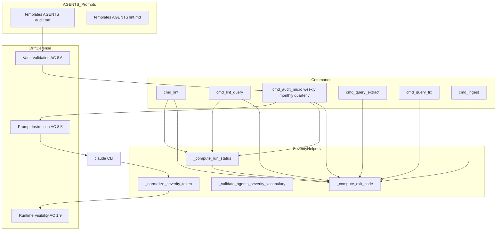
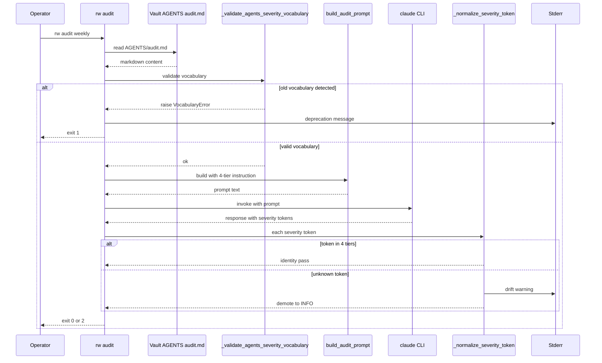
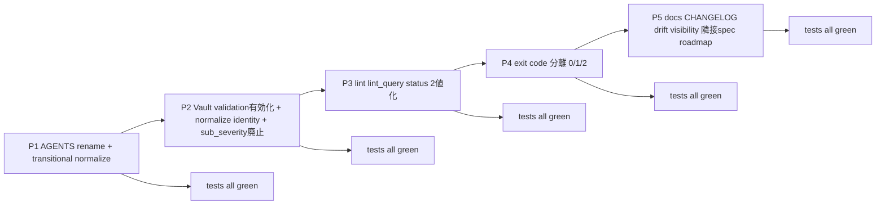
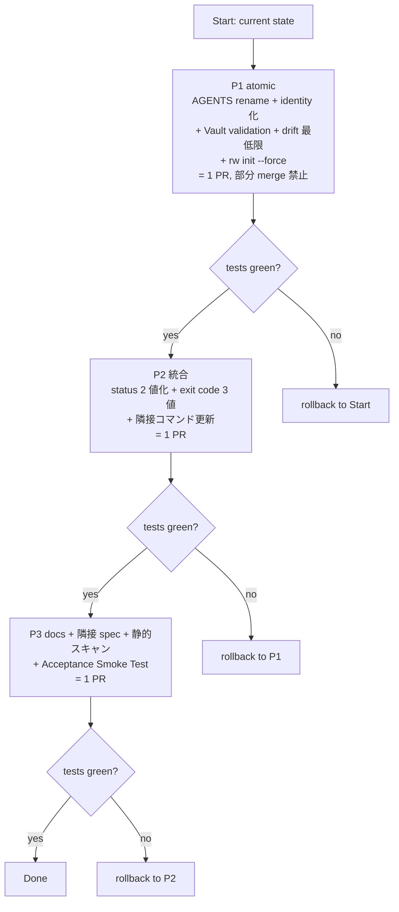
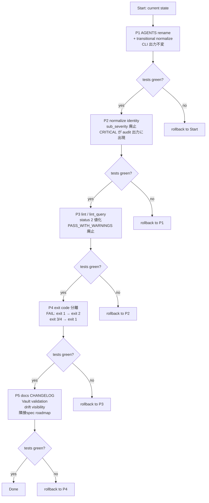

# Technical Design Document: severity-unification

## Overview

**Purpose**: Rwiki CLI 全体の severity / status / exit code vocabulary を `CRITICAL / ERROR / WARN / INFO`（4 水準）・`PASS / FAIL`（2 値）・`0 / 1 / 2`（3 値）に統一し、AGENTS プロンプト vocabulary と CLI 出力 vocabulary を 1:1 identity で揃える。

**Users**: Rwiki CLI の運用者、CI スクリプト作者、AGENTS プロンプト保守者、下流ツール（ダッシュボード / 横断レポート）開発者。

**Impact**: (1) `map_severity()` タプル変換と `sub_severity` データ構造を廃止し永続マッピングコストを解消、(2) `rw lint` / `rw audit` の FAIL exit code を `1` → `2` へ migrate し runtime error と FAIL 検出を分離、(3) `templates/AGENTS/audit.md` 旧語彙（`HIGH` / `MEDIUM` / `LOW`）を rename、(4) 構造化出力 / 標準出力 / ドキュメント / テスト / 隣接スペック（cli-audit / cli-query / test-suite）/ roadmap の全面同期。破壊的変更だが P1-P5 段階移行で各 phase 完了時にテスト全件 green を不変条件とする。

### Goals

- AGENTS vocabulary と CLI vocabulary を同一 4 水準に align（identity mapping、`map_severity()` 関数削除）
- status を 2 値（`PASS` / `FAIL`）に統一、`PASS_WITH_WARNINGS` および status 位置の `WARN` を廃止
- exit code を 3 値分離（`0` = PASS、`1` = runtime error + precondition 不成立、`2` = FAIL 検出）し、`rw lint` / `rw audit` の旧 `exit 1`（FAIL）を `exit 2` に移行（ただし `rw lint query` は既に exit 2 を FAIL に使用しており、本スペックの参照モデルとして機能する。`rw lint query` 側の変更は旧 exit 3 / 4 → exit 1 への統合および `PASS_WITH_WARNINGS` 廃止に伴う status 2 値化のみ）
- severity drift に対する 3 層防御（プロンプト明示 / Vault validation / runtime 可視化）を実装
- P1-P5 段階移行で各 phase 完了時に `tests/` 全件 green を保証

### Non-Goals

- 構造化出力の **フィールド名 / schema 形状** の統一（本スペックは値域トークンのみ）
- 旧値との後方互換モード（legacy キー併記、出力バージョン切替フラグ、実行時 deprecation 警告）
- `rw_light.py` のモジュール分割（roadmap L128-136、別スペック）
- 過去の `logs/audit-<tier>-<timestamp>.md` 履歴ファイルの一括変換
- **過去 audit log の re-parse 経路（F-1 対応）**: 現行 rw は過去 markdown log を re-parse する経路を持たない（`rw audit quarterly` は新規集計のみで過去 `audit-<tier>-<timestamp>.md` を再度 prefix parse しない）。本設計不変量に基づき、旧 2 段表記 `[ERROR] [CRITICAL 由来]` と新単一表記 `[CRITICAL]` の両方を読み分ける backward-compatible parser を本スペックでは実装しない。将来 re-parse 経路を追加する場合は §Revalidation Triggers の該当項目を参照
- `templates/AGENTS/*.md` へのバージョンマーカー導入（agents-system スペック管轄）
- `rw --version` フラグ新設・semver 導入
- `cmd_lint()` / `lint_single_query_dir()` の検査項目そのものの追加（link 壊れ・命名規則・frontmatter 必須項目未検出の明示検出等）。本スペックは既存発行済検査への severity 割当のみを扱う
- `audit` 静的チェック層（`check_broken_links` / `check_index_registration` / `check_orphan_pages` 等、`rw_light.py` L1313-1690 近傍）への `CRITICAL` 発行経路新設。現状これらは `ERROR` / `WARN` / `INFO` のみ発行しており、本スペック後もそのまま。`CRITICAL` は LLM 経由の `_run_llm_audit` identity mapping 経路でのみ発行される

### Out of Scope (Y Cut, 2026-04-20)

本スペックは severity 語彙統一・status 2 値化・exit code 3 値分離の **core vocabulary contract** に集中する Core-only スコープ（Y 選択、`/compact` 後の本質観点レビューで確定）を採用する。以下の投機的機能・品質 infra は本スペックから除外し、drift 実例観察後 / infra 需要顕在化後に別スペック `observability-infra`（`roadmap.md` Technical Debt 記録予定）で扱う。

**除外項目の概観**（以下の design 本文記述は reference として残すが、tasks.md precedence により実装対象外）:

| カテゴリ | 除外項目 | design.md 内の該当節 |
|---|---|---|
| Schema versioning | `schema_version: "1.0"` → `"2.0"` bump policy、F-3 forward-compat window | §Public API Stability Policy L76-95 / §Data Models schema_version フィールド記述 / F-3 Revalidation Triggers |
| Drift 可視化の拡張 | `MAX_DRIFT_EVENTS=100` cap、cap-reached sentinel、3 段 collapse（11-100 / 101+）、`_emit_drift_summary` invocation end summary | §Components `_emit_drift_summary` / §Data Models `drift_events[]` cap + sentinel 記述 / H-6 cross-invariant の sentinel 関連式 |
| CLI フラグ | `--strict-severity` / `RW_STRICT_SEVERITY` strict mode、`--validate-vault-only` dry-run mode | §Components 該当 flag 記述 / §Public API Stability Policy L103-120 の L-3 policy |
| Log IO hardening | `write_log_atomic` helper、2 callsite 置換 | §Concurrency and Atomicity L1682-1750 |
| Test infra | property-based cross-channel invariant（H-1 500 random cases、Hypothesis 代替）、Turkish locale regression（K-6）、coverage gate（K-3）、flakiness detection（K-4） | §Testing Strategy Cross-Channel Invariant Tests / Coverage Targets / Flakiness Mitigation / Environment Compatibility Notes |
| Governance hygiene | `.git-blame-ignore-revs` 運用（Q-1 / Q-2） | §Git blame Preservation Strategy |
| Phasing | P1-P5 5-phase gating（細分化）| §Phased Migration（P1-P3 に再構成、下記） |

**Core-only で残す項目**:
- Claude drift defense 3 layers（AC 1.9 runtime stderr 最低限 + `drift_events[]` 追記 / AC 8.5 prompt prefix / AC 8.6 Vault validation）
- `--skip-vault-validation` escape hatch（Vault validation を導入する場合の運用 bailout として必須）
- Vault redeployment 手順（`rw init --force` + symlink 防御 + timestamp collision `<timestamp>-<pid>` fallback）
- `parse_audit_response` 4 段構造検証（silent skip 廃止、AC 1.9 違反防止）
- static vocabulary scan tests（AC 7.6 / 7.7）

**実装ガイダンス**:
- tasks.md は本 Y Cut を反映した 34 sub-tasks 構成（3 phase: P1 atomic + P2 統合 + P3 docs）で authoritative
- design.md 本文中に Y Cut 除外項目の詳細記述が残るが、実装時は tasks.md を優先
- 隣接 spec / roadmap から本スペックを参照する際は、除外項目を本 §Out of Scope (Y Cut) として明示する

## Boundary Commitments

### This Spec Owns

- **Severity vocabulary**: `CRITICAL / ERROR / WARN / INFO` の 4 水準を、`templates/AGENTS/audit.md` / `templates/AGENTS/lint.md` / `scripts/rw_light.py` / `tests/` / `docs/*.md` / `README.md` / `CHANGELOG.md` に対して authoritative に定義する
- **Status vocabulary**: `PASS / FAIL` の 2 値を、上記全ファイル群に対して authoritative に定義する
- **Exit code 契約**: `0 / 1 / 2` の 3 値分離を、`scripts/rw_light.py` の全 CLI コマンドに対して authoritative に定義する
- **Severity drift 3 層防御**: Claude プロンプト明示（AC 8.5）/ Vault validation（AC 8.6）/ runtime 可視化（AC 1.9）の 3 touchpoint を owner として設計・実装する
- **共通ヘルパー関数**: `_compute_run_status()` / `_compute_exit_code()` / `_validate_agents_severity_vocabulary()` / `_normalize_severity_token()` の 4 関数を `scripts/rw_light.py` 内部関数として新設・維持する
- **P1-P5 段階移行**: 各 phase の red → green サイクルと rollback 境界を定義する
- **完了時 governance 更新**: `roadmap.md` Technical Debt L99-111 / L113-122 完了マーク、L128-136 行数 refresh、governance 節「後続スペックによる完了済 requirements.md の整合更新は再 approval 不要」追記
- **隣接スペック requirements.md の文言同期**: cli-audit / cli-query / test-suite の旧体系前提記述を新体系に書き換える（`_change` log 更新のみ、再 approval 不要）
- **CLI Output Language Policy（J-2 対応、本スペックが authoritative に定義）**: 本スペックが新設・更新する CLI 出力（stdout / stderr / structured log）は以下の言語ポリシーに従う:
  - **stderr error / warning メッセージ**: 英語固定（severity / status トークンと同一の英語 token を含むため、文脈一貫性のため）
  - **prefix 識別子**: `[agents-vocab-error]` / `[severity-drift]` / `[severity-unification]` / `[vault-validation]` 形式の英語 prefix で grep 容易性を確保
  - **構造化ログ JSON のキー / 値**: 英語固定（`severity_counts` / `drift_events` / `schema_version` 等）
  - **stdout サマリー（人間向け）**: 英語固定だが、件数表示形式は `数値 + 英語 token` のみで自然言語文を含めない（locale 非依存性確保、例: `audit weekly: CRITICAL 0, ERROR 0, WARN 0, INFO 0 — PASS`）
  - **仕様書（`requirements.md` / `design.md` / `research.md`）**: 日本語固定（`spec.json.language="ja"` に従う）。CLI 出力との言語差は「実装と仕様書の役割分離」として許容
  - **`docs/*.md` 本文**: 日本語固定だが、severity / status / exit code の token / コードサンプル / ログサンプルは英語のまま埋め込む（CLI 出力と完全一致が必要）
  - 本ポリシーは locale ポリシー（§Domain Model > Locale Invariants）と整合し、運用者が「英語 CLI vs 日本語仕様書」の言語差を予測可能なものとして扱える

### Out of Boundary

- `AGENTS/audit.md` の検査ルール・Tier 定義・priority 意味付けの変更（severity 名称の rename のみ）
- `rw approve` / `rw synthesize-logs` / `rw query answer` の内部ロジック本体変更
- 構造化出力の schema 形状統一（フィールド名・コンテナ構造の整合化）
- `rw_light.py` モジュール分割
- agents-system スペック管轄の `AGENTS/*.md` バージョンマーカー機構
- `rw --version` フラグ・semver 導入
- **CLI メッセージの localization（J-2 対応）**: `LANG` / `LC_MESSAGES` 環境変数による message localization、gettext / 多言語 catalog 機構の導入は本スペック対象外。stderr / stdout 出力は英語固定で運用し、運用者は英語メッセージを直接読む前提とする。将来 localize 要望が出た場合は別スペック（`i18n-cli-messages` 仮称）で扱う
- **CLI 出力 / ログの timezone / datetime 形式統一（J-4 対応）**: `audit-<tier>-<timestamp>.md` ファイル名（`%Y%m%d-%H%M%S` local time）と JSON ログ内 timestamp（`isoformat(timespec="seconds")` local time、tz 情報なし）の混在および timezone 非統一は既知 debt として継承し、本スペックでは扱わない。`drift_events[]` 各要素にも timestamp フィールドを持たせない（理由: invocation スコープでの収集のため親 log の timestamp で復元可能、payload 肥大化回避）。timezone 統一は別スペック（`log-timestamp-normalization` 仮称）で扱う
- **`call_claude()` の subprocess timeout 未設定（D-2 対応、既知 debt）**: memory `project_call_claude_timeout.md` に記録済みの別件 debt。本スペックの drift 3 層防御（特に Layer 2 Prompt prefix / Layer 3 Runtime normalize）は **Claude 応答が有限時間内に到達する前提** で設計されており、Claude CLI が hang した場合の防御は含まない。timeout / 到達不能シナリオは既存の runtime error 経路（`_compute_exit_code(had_runtime_error=True)` → `exit 1`）にフォールバックするが、hang 自体の検出・中断は将来の別スペック（`call-claude-timeout` 仮称）で扱う

### Allowed Dependencies

- **`scripts/rw_light.py` 内部**: Python 3.10+ 標準ライブラリ（`json`・`re`・`subprocess`・`pathlib`・`sys`）のみ使用可能（tech.md Key Libraries 準拠）
- **外部 CLI 依存**: `claude` CLI（subprocess 経由、既存 audit 系で使用中）
- **上流 spec 依存**: cli-audit（`rw audit` 基本構造）、cli-query（`rw lint query` 基本構造）、test-suite（テスト構成）は既存のまま
- **既存共通ユーティリティ**: `parse_frontmatter` / `list_md_files` / `load_task_prompts` 等は本スペックで破壊しない
- **制約**: 新規外部ライブラリの追加は禁止（zero-dependency 原則）

### Public API Stability Policy（L-1 / L-2 / L-3 / L-6 対応）

本スペックが導入・変更する全ての public surface について、**安定性保証 / 拡張ルール / rename / removal / deprecation window** の policy を定義する。下流 consumer（shell script / JSON parser / 他 spec / 運用者）が依存可否を判断できる governance base となる。

#### JSON schema フィールド（L-1 対応）

対象: `logs/lint_latest.json` / `logs/query_lint_latest.json` の全 top-level フィールドおよびネストされた構造（`severity_counts` / `drift_events` / `files[].severity_counts` / `errors[].severity` など）。

- **Additive changes**（新フィールド追加のみ）: minor version bump（例: `schema_version` `"2.0"` → `"2.1"`）。forward-compat（旧 consumer は未知フィールドを無視）なら破壊的変更扱いしない
- **Breaking changes**（既存フィールドの型変更・削除・意味変更）: major version bump（`"2.0"` → `"3.0"`）。CHANGELOG に `### ⚠️ BREAKING CHANGES` エントリ + Migration Guide redirect が必須（I-4 / E-3 と同等の手順）
- **Deprecation window**: 既存フィールドを削除する前に **最低 1 major version 分** の deprecation period を設ける（例: `"2.0"` で deprecated mark → `"3.0"` で削除）。deprecated フィールドは docs / developer-guide.md Migration Notes で告知（stderr warning は出力しない、noise 抑制）
- **Parallel fields の禁止**: `summary.warn` と `summary.severity_counts.warn` のような意味重複フィールドを併存させない（本スペックは削除で対応済み）
- **Future schema validation**: 将来 JSON Schema ファイル（`docs/schemas/lint_latest.schema.json` 等）を導入する余地あり、本スペックでは scope 外

#### Exit code（L-2 対応、最強の public contract）

対象: 全 `rw` subcommand の exit code 値。shell script `$?` / `case $?` から参照される最もクリティカルな public API。

- **値域確定**: 本スペック完了時点で exit code は `{0, 1, 2}` の 3 値のみ:
  - `0` — PASS（finding なし、または WARN/INFO のみ）
  - `1` — runtime error / precondition failure
  - `2` — FAIL（CRITICAL または ERROR finding 検出）
- **追加ルール**:
  - 新 exit code の追加は **major version bump** 扱い（schema_version `"3.0"` 移行相当の大規模変更）
  - CHANGELOG BREAKING CHANGES + shell script migration guide（E-1 フォーマット）が必須
  - 新 exit code は **`4` 以上から採番**。`3` は未使用として予約（過去の `rw lint query` exit 3 / 4 との混同を避けるため意図的にスキップ）
- **削除ルール**:
  - 既存 exit code `{0, 1, 2}` のいずれかを削除するには deprecation window が必要
  - 例: 将来「exit 1 を廃止して runtime error も exit 2 に統合」する場合、最低 1 major version の間は exit 1 を「常に 0 または 2 を優先、やむを得ない runtime error のみ exit 1」と規定して並存運用
- **意味変更の禁止**: 既存 exit code の意味（「2 = FAIL」「1 = runtime error」）を変更する変更は禁止。変更したい場合は新値を追加してから旧値を deprecation 経由で廃止

#### CLI フラグ / 環境変数（L-3 対応）

対象: 本スペックで新設する `--strict-severity` / `--skip-vault-validation` / `--validate-vault-only` および環境変数 `RW_STRICT_SEVERITY` / `RW_SKIP_VAULT_VALIDATION`。

- **命名 convention**:
  - CLI フラグ: `--kebab-case`（本スペック内で統一済み）
  - 環境変数: `RW_UPPER_SNAKE_CASE`（prefix `RW_` で他 tool との衝突を回避）
  - CLI フラグと env 変数を **ペアで提供する**のがデフォルト（運用シーンで env 変数注入と CLI フラグの両方が便利）
  - **例外**: `--validate-vault-only` は dry-run 用で運用常用を想定しないため env 変数 alias を意図的に省略（命名 convention の例外として明示的）
- **追加ルール**: 新フラグ / env 変数の追加は **minor version bump** 扱い（forward-compat、旧 script が未知フラグを渡さない限り破壊的変更にならない）
- **Rename ルール**:
  - 既存フラグを rename する場合、**最低 1 major version 分の alias 維持**（旧名も新名も同じ挙動で受け付け）
  - 旧名使用時は stderr に deprecation warning を必ず出力:
    ```
    [deprecated] --strict-severity will be removed in v3.0, use --strict-vocabulary instead.
    ```
- **Removal ルール**: alias 期間経過後の removal は BREAKING CHANGES 扱い、CHANGELOG + migration guide が必須
- **意味変更の禁止**: 既存フラグの挙動（例: `--strict-severity` が `SystemExit(1)` を raise する）を予告なく変更することを禁止。挙動変更したい場合は新フラグ追加 + 旧フラグ deprecation

#### Internal helper（`_` prefix）の publicity（L-6 対応）

対象: `_compute_run_status` / `_compute_exit_code` / `_validate_agents_severity_vocabulary` / `_normalize_severity_token` / `_sanitize_drift_token` / `_emit_drift_summary` および `write_log_atomic`（`_` prefix なし例外）。

- **`_` prefix の意味**: 関数名に `_` を前置する helper は **`scripts/rw_light.py` 内部実装の一部** として扱う。外部からの直接利用（他スクリプト / 他 spec / 将来の分割モジュール）は **discouraged**
  - ただし **`tests/` 内からの import は許容**（unit test で helper を直接検証するため必須）
  - test 以外の外部から import された場合、本スペックは API stability を保証しない（rename / シグネチャ変更を予告なく実施しうる）
- **`write_log_atomic` の例外**: `_` prefix なしは semi-public（将来の module 分割時に再利用される可能性を想定）。ただし module 分割自体は本スペック Non-Goals で、分割時は別 spec で公開 API 化手順を定義
- **Rename policy**: `_` prefix helper の rename / シグネチャ変更は本スペック完了後も monolithic file 内で自由（CHANGELOG notice 不要、test 側が連動更新される責務）
- **将来の公開 API 化**: `_` prefix を外して public API 化する場合は上記 JSON schema / CLI フラグと同等の stability policy を適用（minor bump / deprecation window / CHANGELOG BREAKING entry）

### Revalidation Triggers

- 本スペックの vocabulary（`CRITICAL / ERROR / WARN / INFO`）を将来変更する場合 → cli-audit / cli-query / test-suite / `AGENTS/*.md` / `docs/*.md` の再 alignment が必要
- exit code 契約（`0 / 1 / 2` の分離）を将来変更する場合 → 全 CLI コマンドおよび下流 CI スクリプトの再 integration test が必要
- 共通ヘルパー関数シグネチャを変更する場合 → 全コマンドハンドラの呼び出し側の再テストが必要
- drift 3 層防御のいずれかの層を撤去する場合 → 残る 2 層で drift 全パスを防御できるかの再評価が必須（CLAUDE drift は reputation risk を伴うため）
- `rw_light.py` に **並列実行機構**（threading / multiprocessing / asyncio）を導入する場合 → §Execution Model の single-thread 前提と Domain Model invariant の再評価が必須。`_compute_run_status` の iterate-while-append 防御、`_validate_agents_severity_vocabulary` の per-call re-read 方針、`logs/*_latest.json` の atomic write が並列環境で維持できるかを再設計
- **atomic write 規約**（§Concurrency and Atomicity）を撤去または緩和する場合 → `logs/*_latest.json` を消費する下流（`cmd_ingest` の `summary["fail"]` 参照ほか）の partial-read 耐性を再確認
- **`call_claude()` に subprocess timeout を導入する場合（D-2 対応）** → Runtime normalize (Layer 3) の中断点挙動（timeout 時点で既に受信した partial response の扱い、drift_events の flush、exit code の分類）を再評価。具体的には (i) partial JSON を `parse_audit_response` に渡すか破棄するか、(ii) timeout を runtime error（exit 1）として扱うか独立 category として分離するかの決定が必要
- **過去 audit log の re-parse 経路を追加する場合（F-1 対応）** → 旧 2 段表記 `[ERROR] [CRITICAL 由来] ...` と新単一表記 `[CRITICAL] ...` の両方を読み分ける backward-compatible parser の実装が必要。parser は以下の優先順で判定する: (i) 行頭に新単一 prefix `[CRITICAL|ERROR|WARN|INFO]` が単独で出現 → 新表記として severity 抽出、(ii) 行頭に旧 2 段 prefix `[ERROR] [CRITICAL 由来]` が出現 → 旧表記として CRITICAL 由来部分を severity に採用、(iii) いずれにも合致せず → drift として drift_events に記録（F-3 の `schema_version` フィールドで log file の新旧を事前判別できる場合はそれを優先）。Non-Goals §に「過去 audit log の re-parse 経路」が scope 外であることが明記されているため、追加時はスペック再 approval が必要
- **timezone 統一 / datetime 形式正規化を導入する場合（J-4 対応）** → drift_events[] への per-event timestamp 追加可否を再評価する必要あり。`schema_version` を `"3.0"` に bump し、(i) drift_events[] の各 event に `recorded_at`（ISO 8601 with tz、UTC 推奨）を追加するか、(ii) invocation 全体の `meta.started_at` / `meta.completed_at` のみで済ませるか、を再決定。下流 consumer が timestamp 復元式（H-6 と類似の cross-invariant）を持つ場合は本判断と整合させる

## Architecture

### Existing Architecture Analysis

- **Monolithic CLI**: `scripts/rw_light.py`（3,490 行）に全コマンド集約。severity / status / exit 関連リテラル occurrence は 74 箇所（brief.md 記載）に分布するが、これらは以下の 15 論理ポイント（本スペックの修正単位）に集約される: (i) `map_severity()` 関数本体、(ii) `_VALID_SEVERITIES` 定数、(iii) `Finding.sub_severity` フィールドおよび 25 箇所の Finding コンストラクタ呼び出し（`sub_severity=...` 引数）、(iv) `_format_finding_line` の sev_tag 分岐、(v) `parse_audit_response` の silent skip、(vi) `build_audit_prompt` の prefix 挿入位置、(vii) `load_task_prompts` の Vault validation 呼び出し、(viii) `cmd_lint()` status 判定・per-file 出力、(ix) `cmd_lint_query()` の return 3/4/exit code、(x) `lint_single_query_dir.add()` の severity 分岐、(xi) `cmd_audit_micro/weekly/monthly/quarterly` の status 計算、(xii) `_run_llm_audit` の map_severity 呼び出し、(xiii) `generate_audit_report` / `print_audit_summary` の severity 集計・status 代入、(xiv) `cmd_query_extract/cmd_query_fix/cmd_ingest` の exit code return、(xv) argparse / 手動引数パーサーの exit 3/4 経路。74 リテラルの大半は (iii) Finding コンストラクタ呼び出しと (xiv) 各 `return 1`／`return 0` に集中する
- **Prompt system**: `templates/AGENTS/*.md`（dev master）→ `rw init` で Vault `AGENTS/*.md` に deploy
- **現行 severity 処理**: `map_severity()` L1696-1715 が `(cli_severity, sub_severity)` タプルを返却、`_VALID_SEVERITIES = {"CRITICAL", "HIGH", "MEDIUM", "LOW"}`（L1866）、未知 severity は L1904-1908 で `[WARN]` stdout print + finding drop（silent skip、AC 1.9 違反）
- **現行 exit code**: `cmd_lint()` / `cmd_audit_*()` は FAIL → `exit 1`、`cmd_lint_query()` のみ 0/1/2/3/4 の 5 値分岐（L3048-3106）
- **audit 静的チェック層の severity 発行**: `check_broken_links`（L1313）/ `check_index_registration`（L1334）/ `check_orphan_pages` 等はすべて severity リテラル `"ERROR"` / `"WARN"` / `"INFO"` を直接埋め込んで Finding を生成する（`severity=` 代入 25 箇所、すべて 3 水準のいずれか）。`CRITICAL` を発行する経路は静的チェック層には存在せず、本スペック完了後もその方針を維持する（AC 1.6 は全 4 水準の使用義務を課していない）。`CRITICAL` が CLI 出力に現れるのは `_run_llm_audit` の identity mapping 経由（P2 以降、Claude 応答に含まれる場合のみ）
- **現行 audit status 発行状況**: `cmd_audit_micro` / `cmd_audit_weekly` / `_run_llm_audit` は run-level status を markdown レポート・stdout・構造化ログのいずれにも発行していない（exit code からのみ判定可能な状態）。本スペックで AC 2.8 / 2.9 充足のため発行を追加する
- **現行 cmd_lint 検査項目**: `cmd_lint()` L317-366 は「空ファイル → FAIL」「content < 80 chars → WARN」「それ以外 → PASS」の 3 ルート限定。AGENTS/lint.md L60-71 が記述する「frontmatter parse / 必須フィールド / 安全に正規化できない構造」等の判定は実コードに実装されていない（既存 drift、別スペック案件）
- **技術負債**: 上記の severity / exit code 課題は roadmap Technical Debt L99-111（severity 体系）および L113-122（exit 1 分離）として既登録。本スペックで一括解消

### Architecture Pattern & Boundary Map

**Pattern**: Internal Helper Extraction（Option C Hybrid、research.md §3 Option C 採用）

- `scripts/rw_light.py` 内部関数として 4 つの共通ヘルパー（`_compute_run_status` / `_compute_exit_code` / `_validate_agents_severity_vocabulary` / `_normalize_severity_token`）を新設
- 既存コマンドハンドラ（`cmd_lint` / `cmd_lint_query` / `cmd_audit_*` / `cmd_query_extract` / `cmd_query_fix` / `cmd_ingest`）のシグネチャは維持、内部実装のみを新ヘルパー呼び出しに差し替え
- 単一ファイル集約原則（structure.md）を維持しつつ、値域判定ロジックの重複を排除



**Architecture Integration**:
- **Selected pattern**: Internal Helper Extraction — 単一ファイル内で重複ロジックを共通化、外部ファイル追加なし
- **Domain boundaries**: 値域判定 ∈ Helpers / コマンド実行 ∈ Commands / Vault 検証 ∈ DriftDefense
- **Preserved patterns**: モノリシック CLI、zero-dependency、pytest TDD、JSON structured log
- **New components rationale**: `_compute_run_status` / `_compute_exit_code` により 20+ の重複判定を 2 関数に集約、保守性向上。`_validate_agents_severity_vocabulary` は新規機能（AC 8.6）、`_normalize_severity_token` は P1 transitional + 恒久的 drift 可視化（AC 1.9）
- **Steering compliance**: tech.md「単一ファイル集約」・「zero-dependency」・「pytest TDD」維持

### Technology Stack

| Layer | Choice / Version | Role in Feature | Notes |
|-------|------------------|-----------------|-------|
| CLI | Python 3.10+ / `scripts/rw_light.py`（既存） | severity / status / exit code 判定の統一 | zero-dependency 原則維持 |
| Prompt | `templates/AGENTS/*.md`（既存） | Claude に渡す vocabulary の正規ソース | rename のみ、新規ファイルなし |
| Test | pytest（既存、`tests/test_*.py`） | 新体系の振る舞い固定 | test-suite スペック完了構成を継承 |
| Log | JSON（`logs/*_latest.json`、既存） | severity 件数・status の構造化記録 | schema キー追加（破壊的） |

## File Structure Plan

### Modified Files

**scripts/（CLI 本体）**

- `scripts/rw_light.py` — 以下の内部関数を新設 / 置換 / 削除:
  - 更新: L11 の import を `from typing import NamedTuple, Literal, Iterable, Mapping` に拡張（新ヘルパーシグネチャが `Literal["CRITICAL","ERROR","WARN","INFO"]` / `Literal[0,1,2]` / `Iterable[Mapping[str, str]]` を使用するため。`pathlib.Path` も `_validate_agents_severity_vocabulary` シグネチャで使うため `from pathlib import Path` を追加。`Any` は本スペックのヘルパーシグネチャでは使用しないため import しない）。**`import tempfile`** も追加（`write_log_atomic()` の `tempfile.mkstemp()` で使用、B-1 対応）
  - 新設: `_compute_run_status(findings)` / `_compute_exit_code(status, had_runtime_error)` / `_validate_agents_severity_vocabulary(path)` / `_normalize_severity_token(token)` / `write_log_atomic(path, text)`（B-1 対応、`logs/` 配下の atomic write 専用、§Concurrency and Atomicity 参照）
  - 更新: `cmd_lint` L362 の `write_text(LINT_LOG, ...)` を `write_log_atomic(LINT_LOG, ...)` に置換、`cmd_lint_query` L3091 の `write_text(QUERY_LINT_LOG, ...)` を `write_log_atomic(QUERY_LINT_LOG, ...)` に置換（P5 実施）
  - 更新: `Finding` NamedTuple L1267-1274 から `sub_severity: str` フィールドを削除。NamedTuple は **immutable なフィールド構成**のため、時系列で以下の 2 段階に分ける:
    - **P1 transitional**（Finding 構造は触らない）:
      - `Finding(NamedTuple)` 定義・25 箇所の `Finding(..., sub_severity=...)` 呼び出し・`_format_finding_line` の `f.sub_severity` 参照はすべて**現状維持**
      - `map_severity()` L1696-1715 の**内部実装のみ**を `_normalize_severity_token` ベースに書き換える。戻り値は引き続きタプル `(cli_severity, sub_severity)` を返すが、`sub_severity` は常に空文字列 `""` に固定する（新 4 水準識別に sub_severity は不要になったため）。関数名・シグネチャは不変
      - この段階で `CRITICAL` が identity で audit CLI 出力に現れ始めるが、Finding / 構造化出力・stdout フォーマットは変わらない
    - **P2 atomic removal**（同一 PR 内で 8 ステップを一括完了、部分承認禁止。F-2 対応で Vault validation 前倒しに伴い 6 → 8 ステップに拡大）:
      - (a) `Finding(NamedTuple)` 定義から `sub_severity: str` 行を削除
      - (b) `Finding(...)` コンストラクタ呼び出し 25 箇所の `sub_severity=...` キーワード引数を全削除: L1328, L1346, L1370, L1402, L1414, L1427, L1439, L1467, L1528, L1607, L1629, L1646, L2374 等
      - (c) `_format_finding_line` L1988-1998 の `f.sub_severity` 参照削除（sev_tag は常に `[{severity}]`）
      - (d) `map_severity()` L1696-1715 の関数定義削除（戻り値のタプル分解元が消失するため）
      - (e) `_run_llm_audit` L2360-2376 の `cli_severity, sub_severity = map_severity(f["severity"])` を `severity = _normalize_severity_token(f["severity"])` に置換
      - (f) `parse_audit_response` 等、`map_severity` の残存呼び出し元があれば同時に除去し、`_normalize_severity_token` 呼び出しに置換
      - **(g) F-2 対応**: `_validate_agents_severity_vocabulary(agents_file: Path) -> None` helper を新規実装（§Components and Interfaces の仕様準拠、Pattern A/B/C regex + 1 MB file size 上限 + Migration Notes ブロック除外 + no-caching 不変量 + D-1 escape hatch 対応）
      - **(h) F-2 対応**: `load_task_prompts()` L846-886 に `task_name == "audit"` 分岐で本 helper を呼び出す hook を追加、`skip_vault_validation: bool = False` kwarg 受け入れ、audit subcommand の argparse から kwarg を伝播。`tests/test_audit.py::test_vault_vocabulary_validation`（新旧語彙 / Migration Notes 内旧語彙 / escape hatch の 4 fixture）を同 PR で追加
  - 置換: `_VALID_SEVERITIES`（`{"CRITICAL", "ERROR", "WARN", "INFO"}`）、`cmd_lint()` / `cmd_lint_query()` / `cmd_audit_micro()` / `cmd_audit_weekly()` / `_run_llm_audit()` / `cmd_query_extract()` / `cmd_query_fix()` / `cmd_ingest()` の内部ロジック
  - 更新: `_run_llm_audit` / `cmd_lint` / `cmd_lint_query` の先頭で invocation scope の **`drift_events: list[dict] = []`** を初期化（C-1 対応）。finding 毎に `_normalize_severity_token` 呼び出しへ `source_context={"context": <cmd_context>, "source_field": <json_path>, "location": <finding_location_or_"-">}` と `drift_sink=drift_events` を渡す。completion 時に `logs/<cmd>_latest.json` の `drift_events` フィールドへ flush、audit の場合は `generate_audit_report` 側に drift_events を渡し markdown「Severity Drift Events」セクションを条件出力
  - 削除: `map_severity()`（P2 で削除。P1 は transitional として `_normalize_severity_token()` に名称変更しつつ新旧両語彙を新語彙に写像）、`parse_audit_response()` の旧 `HIGH/MEDIUM/LOW` ブランチ
  - 更新: `parse_audit_response()` の finding パース箇所で **severity キー欠落 / `None` / 非 str 型への防御的 coerce を追加（D-3 対応）**。現行 L1904-1908 の silent skip（未知 severity の finding drop）は AC 1.9 silent fallback 禁止違反のため廃止。新実装は以下の 3 段構えで全 finding を必ず保持する:
    - (a) `raw_sev = finding.get("severity")` で取得（missing → `None`）
    - (b) `coerced_sev = str(raw_sev) if raw_sev is not None else ""` で非 str 型を文字列化、`None` / missing は空文字列に coerce
    - (c) `severity = _normalize_severity_token(coerced_sev, source_context={"context": cmd_context, "source_field": f"findings[{i}].severity" if raw_sev is not None else f"findings[{i}].<missing-severity>", "location": finding.get("location", "-")}, drift_sink=drift_events)` を呼ぶ
    - これにより「severity キー欠落」は drift として可視化（空文字列 → 前処理後も空 → drift 扱い → INFO 降格 + drift_events に 1 要素 append）、finding は drop されず保持される
  - **更新: `parse_audit_response()` の構造検証追加（N-3 対応）**。D-3 の severity token coerce の**前段**で、Claude 応答 JSON の構造を防御的に検証する。Claude は untrusted source（§Threat Model）であり、jailbreak / hallucination / token budget 切れ等で構造が壊れ得る。以下 4 段の構造検証を `parse_audit_response()` 冒頭に追加し、各段で failure 時の挙動を明示する:
    - **(i) Top-level type 検証**: `json.loads()` 戻り値が `dict` であることを assert。非 dict（list / str / None 等）なら `RuntimeError("audit response is not a JSON object: got <type>")` を raise → `_run_llm_audit` の try/except で runtime error（exit 1、Category 3）として処理
    - **(ii) `findings` キーの型検証**: `response.get("findings")` が `list` であることを assert。`None`（キー欠落）は空 list として扱い、非 list（dict / str 等）は `RuntimeError("audit response findings is not a list: got <type>")` を raise → 同上 runtime error
    - **(iii) 各 finding 要素の型検証**: `for i, finding in enumerate(findings):` 内で `isinstance(finding, dict)` を確認。非 dict（str / None / list 等）の場合は **drop せず** drift として記録: `drift_events.append({"original_token": "<non-dict-finding>", "sanitized_token": "<structurally-invalid>", "demoted_to": "INFO", "source_field": f"findings[{i}]", "context": f"expected dict, got {type(finding).__name__}"})` し、placeholder finding（`severity="INFO"`, `message=f"[structurally invalid finding at index {i}, see drift_events]"`, `location="-"`）を追加して配列長を保持（AC 1.9 silent fallback 禁止 + D-3 finding drop 禁止の両方を満たす）
    - **(iv) 必須 key の欠落検証**: `message` / `location` が欠落している finding は `finding.get("message", "<missing>")` / `finding.get("location", "-")` で補完し、drift_events に「`source_field: f"findings[{i}].<missing-{key_name}>"`」として 1 要素 append（severity キー欠落は D-3 の (c) が扱うため本段では扱わない、他キーのみ）
    - **補完テスト**: `tests/test_audit.py::test_parse_audit_response_structural_invariants` を新規追加。以下 5 fixture を検証:
      - (1) 非 dict 応答（`[]` / `"string"` / `null`）→ RuntimeError、exit 1
      - (2) `findings` が非 list（`{"findings": "all good"}`）→ RuntimeError、exit 1
      - (3) `findings` 配列内に str / None 要素 → placeholder finding + drift_events 記録、配列長保持
      - (4) `message` / `location` 欠落 → 補完 + drift_events 記録
      - (5) 正常応答（全 key 存在）→ drift_events 空、finding 数一致
  - 更新: `build_audit_prompt()` 冒頭に 4 水準明示 + 旧語彙禁止 instruction を追加
  - 更新: `load_task_prompts()` の audit task 読み込み箇所で `_validate_agents_severity_vocabulary()` を呼び出し
  - 更新: `cmd_lint_query()` の手動引数パーサー（argparse 非使用、L3041-3064 のループ処理）での旧 `return 3` / `return 4` を `_compute_exit_code(status=None, had_runtime_error=True)` 経由の exit 1 に統合
  - **新設 CLI フラグの argparse 設定（G-2 対応）**: `rw audit` / `rw audit weekly` 等 audit 系 subcommand の argparse に以下 2 フラグを追加。help 文字列は運用者の発見性を優先して機能・影響・使用条件まで簡潔に明記する:
    - `--strict-severity` (action="store_true", default=False):
      ```
      Treat any severity drift (unknown token from Claude response) as a fatal error.
      With this flag, rw audit exits 1 immediately on drift instead of demoting to INFO.
      Override via RW_STRICT_SEVERITY=1 environment variable.
      ```
    - `--skip-vault-validation` (action="store_true", default=False):
      ```
      EMERGENCY ESCAPE HATCH. Skip pre-invocation validation of AGENTS/audit.md vocabulary.
      Use ONLY when the validation regex itself has a false-positive bug blocking audit pipeline.
      Prints a prominent stderr warning on every use; NOT for routine operation.
      Override via RW_SKIP_VAULT_VALIDATION=1 environment variable.
      See docs/developer-guide.md "Emergency Procedures" for the regex-fix workflow.
      ```
    - **`--validate-vault-only` (action="store_true", default=False, G-4 対応)**:
      ```
      Dry-run mode. Validate AGENTS/audit.md vocabulary only, then exit without invoking
      Claude CLI or reading wiki content. Use before P2 commit or after rw init --force
      to verify Vault redeployment succeeded. Exit 0 if valid, exit 1 if deprecated vocabulary found.
      ```
    - 両フラグは環境変数とのダブル受け付け（OR 結合、どちらかが true なら有効）。argparse の description 冒頭にも「Three flags are available for severity vocabulary management: see --strict-severity, --skip-vault-validation, --validate-vault-only」の 1 行ポインタを追加
  - 更新: `lint_single_query_dir()` の内部 `add(level, code, message)` ヘルパー L2911-2922 を **4 severity 対応に拡張**。現状の `if level == "ERROR": errors.append ... elif level == "WARN": warnings.append ... else: infos.append` では `add("CRITICAL", ...)` が `infos[]` に落ちる。QL017 を `CRITICAL` 昇格するにあたり以下のいずれかに決定:
    - **採用案**: `result` dict の配列構造を廃止し `checks[]` 配列に一本化する（severity は既に `checks[].severity` に入る）。`errors[]` / `warnings[]` / `infos[]` の 3 配列は旧体系の冗長記録であり、新 schema の `severity_counts` + `checks[]` で完全に代替可能。`print_query_lint_text` L3012-3031 の「X error(s), Y warning(s)」表示は「X critical(s), Y error(s), Z warn(s), W info(s)」に拡張
    - `has_error = any(r["status"] == "FAIL" ...)` L3099 は `any(r["status"] == "FAIL" for r in results)` のまま（`_compute_run_status` は `checks[]` 経由で status を再計算する設計に変更）
  - 更新: `load_task_prompts()` L846-886 のエージェントファイル読み込み箇所で、**`task_name == "audit"` の場合のみ** `_validate_agents_severity_vocabulary(Path(agent_path))` を呼ぶ（severity 語彙は audit agent にのみ関連。query_extract / query_answer / query_fix 呼び出し時の無関係な validation を避ける）。**D-1 対応**: `--skip-vault-validation` フラグ または `RW_SKIP_VAULT_VALIDATION=1` が有効な場合は呼び出しを skip し、stderr に escape hatch warning を必ず出力する（`load_task_prompts` に `skip_vault_validation: bool = False` kwarg を追加、audit subcommand の argparse から伝播）
  - 更新: `generate_audit_report()` L1959-1962 と `print_audit_summary()` L2070-2073 の status 計算ロジック差し替え。**status は現状も既に出力されている**（markdown レポート L2013 `- status: {status}`、stdout サマリー L2076 `— {status}`）が、計算式が `status = "FAIL" if (error_count > 0 or warn_count > 0) else "PASS"` と旧 3 値 status 時代の残骸であり、`WARN` を単独で含むケースも `FAIL` と判定してしまう。AC 2.8 / 2.9 に適合するため以下に差し替える:
    - `generate_audit_report` L1962 の status 代入を `status = _compute_run_status(findings)` に変更
    - `print_audit_summary` L2073 の status 代入も同一関数呼び出しに変更
    - `generate_audit_report` L1959-1961 と `print_audit_summary` L2070-2072 の severity 集計に `critical_count = sum(1 for f in findings if f.severity == "CRITICAL")` を追加
    - `generate_audit_report` Summary 節 L2010 直前に `- CRITICAL: {critical_count}` 行を追加
    - `print_audit_summary` stdout サマリー L2076 のフォーマット文字列を `f"audit {tier}: CRITICAL {critical_count}, ERROR {error_count}, WARN {warn_count}, INFO {info_count} \u2014 {status}"` に拡張。**AC 5.4 Design constraint 確定**: 全 4 水準を常時表示する（件数 0 の水準も省略せずに `CRITICAL 0, ERROR 0, WARN 0, INFO 0 — PASS` のように表示）。根拠: (i) 固定カラムにより grep / 機械パースが容易、(ii) 運用者が「0 件」を明示的に視認できる（項目が省略された場合の「未出力なのか 0 件なのか」不明瞭さを排除）、(iii) `cmd_lint` の per-file 行 `[PASS] path (warn: 2, info: 1)` とは逆方針（per-file は冗長防止で 0 件省略、run-level は機械可読性優先で常時表示）— run-level と per-file で方針を分けるのは出力目的が異なるため（run-level は CI / ログ解析用、per-file はターミナル視認性用）
  - 更新: `_format_finding_line` L1988-1998 の sev_tag 組み立てから `sub_severity` 分岐を削除し、常に `sev_tag = f"[{f.severity}]"` とする（P2 で Finding.sub_severity フィールド削除と同時実施、AC 4.5 対応）

**templates/AGENTS/（プロンプトテンプレート）**

- `templates/AGENTS/audit.md` — severity 語彙 rename（`HIGH` → `ERROR`、`MEDIUM` → `WARN`、`LOW` → `INFO`、`CRITICAL` 維持）。実ファイルには **3 種類の記法** が混在しているため、以下の変換ルールに従う:
  - **(i) 優先度レベル表セル**（L144-147、大文字維持）: `\| HIGH \|` → `\| ERROR \|`、`\| MEDIUM \|` → `\| WARN \|`、`\| LOW \|` → `\| INFO \|`
  - **(ii) Summary コードサンプル集計キー**（**rename 対象は L48-L50**、L47 の `- critical:` は維持。**小文字維持**、`lint_latest.json` の `severity_counts` キー命名と整合）: `- high:`（L48）→ `- error:`、`- medium:`（L49）→ `- warn:`、`- low:`（L50）→ `- info:`
  - **(iii) Finding コードサンプル bracket marker**（L53-58、大文字維持）: `[HIGH]` → `[ERROR]`、`[MEDIUM]` → `[WARN]`、`[LOW]` → `[INFO]`。`[CRITICAL]` は維持
- `templates/AGENTS/lint.md` — L32-34 終了コード（`0` / `1` → `0` / `1` / `2`）、L44 status スキーマ（`"PASS | WARN | FAIL"` → `"PASS | FAIL"`）、L50 summary 構造（`{pass, warn, fail}` → `{pass, fail, severity_counts: {critical, error, warn, info}}`）、判定レベル節を status / severity の 2 次元構造に再構成
- `templates/AGENTS/ingest.md` — L43 の schema reference を新フィールド対応に拡張（E-2 対応）。旧: `logs/lint_latest.json を読み込み、summary.fail > 0 の場合は即座に中止する`、新: `logs/lint_latest.json を読み込み、top-level status が "FAIL" の場合は即座に中止する（summary.fail > 0 は deprecated alias として同等判定、旧 agent との互換のため維持）`。**Claude prompt として機能するため**、top-level `status` 参照を primary に据えることで下流 Claude agent に新 schema を認知させる。`summary.severity_counts` への明示的言及は agents-system spec の scope（本スペックは severity 語彙統一に集中し、ingest 判断ロジックの高度化は扱わない）
- `templates/AGENTS/git_ops.md` — lint 結果参照箇所を verify（FAIL 概念不変のため意味変更なし、文法整合のみ）

**docs/（ドキュメント）**

> **Single Source of Truth (SSoT) 設計（I-2 対応）**:
> - **Core (SSoT)**: `docs/developer-guide.md` を severity / status / exit code 仕様の唯一の権威 source として位置づけ、最も詳細・最新の定義を保持する。Glossary（I-6）/ Migration Notes / Environment Variables / Acceptance Smoke Test も本ファイルに集約
> - **Reference**: `docs/user-guide.md` / `docs/audit.md` / `docs/lint.md` / `docs/ingest.md` / `docs/query.md` / `docs/query_fix.md` は **要約 + cross-reference のみ** を持つ。詳細定義の重複記述は禁止（陳腐化リスクと不整合リスクの源泉）。各 reference は以下のテンプレートに従う:
>   ```markdown
>   ## Severity Level
>   本コマンドは 4 水準の severity（CRITICAL / ERROR / WARN / INFO）を出力します。
>   各水準の定義・判定基準は [§Severity Vocabulary in developer-guide.md](developer-guide.md#severity-vocabulary) を参照。
>   ```
> - **Source pair**: AGENTS dev master（`templates/AGENTS/audit.md` 等）と `docs/audit.md` は **独立 maintain**（research.md §6.4 確定事項）。両者は逐語転記関係ではなく、`tests/test_agents_vocabulary.py` の静的検査で旧語彙残存ないことを保証
> - **静的検査の追加**: `tests/test_docs_consistency.py`（新規ファイル）を追加し、developer-guide.md の severity 4 水準 token 出現と他 reference docs の整合（順序・件数）を regex で verify。1 ファイルの修正で全体が同期される設計を強制する

- `docs/user-guide.md` — L408-415 の cli-audit 3 水準マッピング表を 4 水準 identity 表に差し替え、L126 / L310 の exit code 記述に exit 2 semantics を追加、Vault 再デプロイ手順節を追加（AC 6.5）
- `docs/audit.md` — severity vocabulary rename（`templates/AGENTS/audit.md` と同一の 3 種変換ルール (i)-(iii) を適用）。**同期ルール**（research.md §6.4 確定事項）: `docs/audit.md` は英語独立版、`templates/AGENTS/audit.md` は Claude 向け dev master として **独立 maintain**。P1 phase の AGENTS rename commit で両ファイルを同時に更新し、以降は `tests/test_agents_vocabulary.py` による静的検査（両ファイルに旧語彙残存がないこと）のみで整合を保証する。docs を AGENTS 本文の逐語転記とは扱わない（将来メンテナが「docs は AGENTS のコピーだから AGENTS だけ直せばよい」と誤解するのを防ぐ）。対象行:
  - **L85-92**: PRIORITY LEVELS 英語表セル（記法 (i) 大文字 table cell）
  - **L147-149**: Summary コードサンプル集計キー（記法 (ii) 小文字 `- high:` / `- medium:` / `- low:`）— 当初見落とし箇所
  - **L152-157**: Finding コードサンプル bracket marker（記法 (iii) `[HIGH]` / `[MEDIUM]`）
- `docs/developer-guide.md` — 「Severity / Status / Exit code 契約」節を新設（旧節があれば差し替え）、Migration Notes 節を追加（旧→新対応表、P1-P5 phase 一覧、再デプロイ手順、**JSON consumer migration 対応表 E-3**、**shell script migration guide E-1** を含む）、**「Environment Variables and CLI Flags」副節を追加**（E-5 対応、下記参照）、**「Debugging FAIL (exit 2)」節を追加**（C-4 対応、運用者向けトラブルシューティング手順）、**「Acceptance Smoke Test (5-minute QA)」副節を追加**（I-5 対応、P5 完了後の運用者向け 5 ステップ smoke test）、**「Glossary」副節を追加**（I-6 対応、本スペックで導入される 10+ 術語の SSoT 定義表）。Glossary は本スペックの全 docs / CHANGELOG / inline 注釈で術語使用時の唯一の参照先となる:

  **`docs/developer-guide.md` の節構成（G-6 対応、目次 + cross-reference 計画）**:

  ```
  ## Severity / Status / Exit code 契約
    ### Overview（severity 4 水準・status 2 値・exit code 3 値の一目表）
    ### Severity Vocabulary（CRITICAL / ERROR / WARN / INFO、各水準の定義と境界条件）
    ### Status Vocabulary（PASS / FAIL、判定式 status == "FAIL" ⇔ any(sev ∈ {CRITICAL, ERROR})）
    ### Exit Code Semantics（0 / 1 / 2、各値の意味と分類根拠）
    ### Environment Variables and CLI Flags（G-2 / G-4 の新規フラグを含む）

  ## Migration Notes
    ### Phase P1-P5 Overview（diagram + Downstream Impact Per Phase 表）
    ### JSON Consumer Migration（E-3 対応表、lint_latest / query_lint_latest BEFORE→AFTER）
    ### Shell Script Migration Guide（E-1 対応、Before/After 3 パターン）
    ### Vault Redeployment Procedure（F-2 の rw init --force 手順 + --validate-vault-only pre-flight、G-4）
    ### Rollback Procedure（F-4 の logs 退避 → revert → fresh log 再生成手順）

  ## Debugging FAIL (exit 2)
    ### 診断 5 手順（C-4 対応、summary.severity_counts / files[]・checks[] / drift_events[] 参照順）
    ### stderr drift warning の読み方（G-3 の 3 段階 collapse ルール、invocation end summary）
    ### Vault validation error の修正手順（G-1 の複数行 error message + pattern 種別の意味）

  ## Emergency Procedures
    ### When Vault validation regex has a false positive（D-1 escape hatch 使用手順）
    ### When Claude CLI hangs（D-2 既知 debt、本スペック対象外への pointer）

  ## Acceptance Smoke Test (5-minute QA)（I-5 対応）
    ### Step 1: Vault redeploy & validation (1 min)
    ### Step 2: rw lint with 4-tier finding (1 min)
    ### Step 3: rw audit identity mapping (1 min)
    ### Step 4: drift injection（mock Claude 応答 with WARNING）(1 min)
    ### Step 5: exit code semantics（exit 0 / 1 / 2 確認）(1 min)

  ## Glossary（I-6 対応、SSoT 用語定義）
    | Term | Definition | First introduced in |
    |------|-----------|---------------------|
    | Severity | 4 水準（CRITICAL / ERROR / WARN / INFO）| §Severity Vocabulary |
    | Status | 2 値（PASS / FAIL）、status == "FAIL" ⇔ ∃f: f.severity ∈ {CRITICAL, ERROR}| §Status Vocabulary |
    | Drift | 4 水準外の severity トークン、INFO 降格 + drift_events 記録 | §stderr drift warning の読み方 |
    | Identity mapping | AGENTS と CLI の vocabulary が 1:1 一致（map_severity 経由なし）| §Severity Vocabulary |
    | Vault validation | rw audit 起動時の AGENTS/audit.md 語彙整合検査（pre-invocation gate）| §Vault Redeployment Procedure |
    | Escape hatch | 防御機構の緊急 bypass フラグ（--skip-vault-validation 等、恒常運用禁止）| §Emergency Procedures |
    | Transitional normalize | P1 phase の旧→新語彙暫定変換 | §Phase P1-P5 Overview |
    | Drift_events sentinel | drift > MAX_DRIFT_EVENTS 時の truncation marker | §JSON Consumer Migration |
    | Schema version | logs/*_latest.json の payload schema 識別子（"1.0" / "2.0"）| §JSON Consumer Migration |
    | MAX_DRIFT_EVENTS | drift_events[] 要素数上限（= 100、超過時 sentinel 1 件追加で +1）| §stderr drift warning の読み方 |
  ```

  **cross-reference ルール**:
  - 各節冒頭に「関連: [§節名](#anchor)」形式の inline link を配置（例: 「Debugging FAIL」冒頭に「関連: [§Exit Code Semantics](#exit-code-semantics), [§Rollback Procedure](#rollback-procedure)」）
  - `docs/developer-guide.md` 冒頭に目次自動生成（markdown TOC）を追加し、200 行超の文書内を跳びやすくする
  - 本スペック実装時に TOC 生成ツールが Rwiki に既存であれば流用、なければ手書きで明示的に目次を配置

  **JSON consumer migration 対応表（E-3 対応、`docs/developer-guide.md` Migration Notes 節に収録）**:
  ```
  lint_latest.json migration:
    BEFORE                               AFTER
    summary.warn                      →  summary.severity_counts.warn
    files[].status == "WARN"          →  files[].status == "PASS"
                                         && files[].severity_counts.warn > 0
    (top-level status 不在)           →  top-level "status" field を参照
    (drift events 記録なし)           →  top-level "drift_events" 配列を参照

  query_lint_latest.json migration:
    errors[]                          →  [c for c in checks[]
                                          if c["severity"] in {"CRITICAL","ERROR"}]
    warnings[]                        →  [c for c in checks[]
                                          if c["severity"] == "WARN"]
    infos[]                           →  [c for c in checks[]
                                          if c["severity"] == "INFO"]
    status == "PASS_WITH_WARNINGS"    →  status == "PASS"
                                         && severity_counts.warn > 0
  ```

  **Shell script migration guide（E-1 対応、`docs/developer-guide.md` Migration Notes 節に収録）**:

  旧 CLI 契約: `FAIL → exit 1` / `runtime error → exit 1`（区別不能）
  新 CLI 契約: `PASS → exit 0` / `runtime error / precondition 不成立 → exit 1` / `FAIL → exit 2`

  - **Before (旧前提、P4 phase 完了後に破壊)**:
    ```bash
    # Pattern 1: exit 1 のみを fail 扱い（新 exit 2 を silent に成功扱い）
    rw audit weekly
    if [ $? -eq 1 ]; then notify_oncall; fi

    # Pattern 2: 非ゼロを全て fail 扱い（新契約と互換、区別不能）
    if ! rw audit weekly; then echo "failed"; fi

    # Pattern 3: exit code を 3 値で分岐していない
    case $? in
      0) echo ok ;;
      1) echo failed ;;
    esac
    ```

  - **After (新 exit code 契約準拠、推奨)**:
    ```bash
    rw audit weekly
    case $? in
      0) echo "audit passed" ;;
      1) echo "runtime error or precondition not met"; exit 1 ;;
      2) echo "audit detected FAIL findings"; notify_oncall; exit 2 ;;
      *) echo "unexpected exit code: $?"; exit 1 ;;
    esac
    ```

  **移行タイミング（E-1 / E-4 対応）**: P4 phase commit 前に、既存の shell / CI script を新 3 値分岐に書き換えた PR を先行マージすることを推奨。P4 完了直後から旧 `exit 1 = FAIL` 前提の script は silent に誤動作する。

  **Environment Variables and CLI Flags（E-5 対応、`docs/developer-guide.md` Severity / Status / Exit code 契約節の副節）**:

  | 環境変数 / フラグ | 用途 | Default | Scope |
  |---|---|---|---|
  | `RW_STRICT_SEVERITY=1` / `--strict-severity` | `_normalize_severity_token` で drift 検出時に `SystemExit(1)`。noise-sensitive CI / 厳格モード向け | unset（drift 継続） | `rw audit *` 全般 |
  | `RW_SKIP_VAULT_VALIDATION=1` / `--skip-vault-validation` | **緊急時 escape hatch（D-1）**: `_validate_agents_severity_vocabulary` の呼び出しを skip。regex false positive で audit pipeline が死活状態の時のみ使用、stderr に必ず warning 出力。**恒常運用禁止** | unset（validation 実行） | `rw audit *` 全般 |

  本節を設けることで運用者は単一の reference で環境変数・フラグの影響範囲を把握でき、新設変数がスペック外文書から sparse に参照される事態を防ぐ。

  **Acceptance Smoke Test (5-minute QA)（I-5 対応、`docs/developer-guide.md` 末尾の運用者向け副節）**:

  P5 完了直後、本スペックの主要機能を手元で確認する 5 ステップ:

  ```bash
  # Step 1: Vault redeploy & validation (1 min)
  rw init --force <vault-path>
  rw audit weekly --validate-vault-only
  # 期待: exit 0、stderr に [vault-validation] AGENTS/audit.md vocabulary check passed.

  # Step 2: rw lint with 4-tier finding (1 min)
  rw lint
  cat logs/lint_latest.json | jq '.schema_version, .summary.severity_counts, .status'
  # 期待: "2.0", {critical:0,error:X,warn:Y,info:Z}, "PASS" or "FAIL"

  # Step 3: rw audit identity mapping (1 min)
  rw audit weekly
  grep -E '^\[(CRITICAL|ERROR|WARN|INFO)\]' logs/audit-weekly-*.md | head -5
  # 期待: 単一表記 [CRITICAL] / [ERROR] / [WARN] / [INFO] のみ出現、旧 2 段表記 [ERROR] [CRITICAL 由来] が出ないこと

  # Step 4: drift injection (1 min, mock 経由 or 意図的に旧語彙 finding を作成)
  # subprocess mock で claude 応答に "WARNING" を返させる pytest fixture を流用
  # 期待: stderr に [severity-drift] unknown token in audit weekly: WARNING、drift_events[] に 1 要素

  # Step 5: exit code semantics (1 min)
  rw audit weekly; echo "exit: $?"
  # 期待: PASS なら exit: 0、FAIL なら exit: 2、引数不正なら exit: 1
  ```

  各 step は独立実行可能。失敗した step を runbook 化することで運用 incident response にも流用できる。

  **Glossary（I-6 対応、`docs/developer-guide.md` 末尾の SSoT 用語定義副節）**:

  本スペックで導入される術語の唯一の権威定義表。docs / CHANGELOG / inline 注釈で術語使用時は本表を cross-reference する。

  **用語表記ポリシー（J-3 対応）**:
  - **Term 列**: 英語固定（CLI 出力 / API / ソースコードで使用される正規 token と完全一致）
  - **Definition 列**: 日本語固定（運用者・実装者の理解を優先、§Boundary Commitments の CLI Output Language Policy と整合）
  - **日本語別名は併記しない**: 例「Drift（ドリフト）」のような併記は採用しない。理由: (i) 検索時の noise（grep で「ドリフト」が hit すべきか曖昧）、(ii) 「ドリフト」単独で本 Glossary に traffic しない誤解の元、(iii) 英語 term が CLI / コード / 仕様書で統一されているため日本語別名が不要、(iv) 表記揺れ（「ドリフト」/「drift」/「シビアリティドリフト」等）の発生源を断つ
  - **First introduced in 列**: 当該 term が初出する developer-guide.md 内の節を anchor link で示す（読者が文脈を辿れる）
  - **将来の追加 term**: 本スペック scope 外で導入される術語も同ポリシーに従って Glossary に追記する（docs 全体の用語ガバナンス強化のため）

  **用語定義表**:


  | Term | Definition | First introduced in |
  |------|-----------|---------------------|
  | **Severity** | Finding の重要度を示す 4 水準（CRITICAL / ERROR / WARN / INFO）| §Severity Vocabulary |
  | **Status** | Run-level の判定結果を示す 2 値（PASS / FAIL）。`status == "FAIL" ⇔ ∃f ∈ findings: f.severity ∈ {CRITICAL, ERROR}` | §Status Vocabulary |
  | **Drift** | Claude 応答 / Vault AGENTS から流入した 4 水準外の severity トークン。INFO 降格 + drift_events[] 記録で可視化 | §stderr drift warning の読み方 |
  | **Identity mapping** | AGENTS と CLI の severity vocabulary が 1:1 一致し、変換関数（旧 `map_severity`）を経ずに通過する状態 | §Severity Vocabulary |
  | **Vault validation** | `rw audit` 起動時に AGENTS/audit.md の語彙整合を検査する pre-invocation gate | §Vault Redeployment Procedure |
  | **Escape hatch** | 通常の防御機構を緊急 bypass する CLI フラグ / 環境変数（`--skip-vault-validation` 等）。恒常運用禁止 | §Emergency Procedures |
  | **Transitional normalize** | P1 phase で旧語彙（HIGH/MEDIUM/LOW）を新語彙（ERROR/WARN/INFO）に変換する暫定的 mapping | §Phase P1-P5 Overview |
  | **Drift_events sentinel** | drift 件数が `MAX_DRIFT_EVENTS` を超えた際、`drift_events[]` 末尾に追加される truncation marker（`original_token == "<cap-reached-sentinel>"`）| §JSON Consumer Migration |
  | **Schema version** | `logs/*_latest.json` の payload schema を識別する文字列フィールド（"1.0" = 旧 / "2.0" = 新 severity-unification 適用後）| §JSON Consumer Migration |
  | **MAX_DRIFT_EVENTS** | `drift_events[]` 配列要素数の上限（= 100、超過時 sentinel 1 件追加で実 len は 101）| §stderr drift warning の読み方 |

  各 term の最終定義は本表が SSoT。docs / CHANGELOG / inline 注釈で術語を使用する場合、本表を cross-reference する（例: 「詳細は [Glossary > Drift](developer-guide.md#glossary) を参照」）。
  - **手順 1**: `logs/<cmd>_latest.json` を開き、top-level `summary.severity_counts` を確認。`critical` または `error` が 1 以上であれば FAIL 原因が特定されている
  - **手順 2**: `files[]`（`rw lint`）または `checks[]`（`rw lint query`）を iterate し、severity が `CRITICAL` / `ERROR` の要素を抽出
  - **手順 3**: 抽出された finding の `message` と（存在すれば）`location` / `path` / finding 内 line 情報で該当ファイル行へ navigate、修正
  - **手順 4**: `top-level drift_events[]` 配列が空でない場合、Claude 応答に severity drift があった可能性を示唆（`audit-<tier>-<timestamp>.md` の「Severity Drift Events」セクションも参照）。INFO 件数に drift 由来が含まれるため、真の INFO finding 件数は `severity_counts.info - len(drift_events)` で概算可能（厳密には drift_events の一部に含まれない可能性もあるため参考値）
  - **手順 5**: 修正完了後、同一コマンドを再実行し exit code が 0 になることを確認。0 にならない場合は `logs/*_latest.json` を再取得して差分を診断
  - **参考節**: stderr 出力（`[severity-drift] ...` warning）と構造化ログの突合せ方、exit code 1（runtime error）との区別方法、`--strict-severity` フラグの用途
- `docs/lint.md` — status 値域記述（`PASS / WARN / FAIL` → `PASS / FAIL`）、exit code 節（`0 / 1` → `0 / 1 / 2`、旧「FAIL → exit 1」→ 新「FAIL → exit 2」）、JSON 出力サンプル節の schema 更新（`severity_counts` 追加、`summary.warn` 削除）。`cmd_lint` の per-file 表示例も新形式 `[PASS] path (warn: 2, info: 1)` に差し替え
- `docs/ingest.md` — 上流 lint 参照箇所の status 2 値化追随、exit code 節で「上流 FAIL → `rw ingest` exit 1（precondition 不成立）」を明記（AC 8.1 対応、旧記述が status WARN を参照している場合は除去）
- `docs/query.md` — `rw query extract` の exit code 節（PASS → 0、FAIL → 2、runtime error → 1）、出力 status 値域を 2 値化
- `docs/query_fix.md` — `rw query fix` の exit code 節（post-lint FAIL → exit 2、precondition 不成立 → exit 1、AC 3.6 対応）、出力 status 値域を 2 値化
- `README.md` — **新規節「Exit Code Semantics」を追加（I-1 対応、推奨案 B 採用）**。現状 README.md には severity / exit code への直接言及がない（commands 一覧のみ存在、grep で確認済）ため、当初計画の「sync」は no-op になる。代わりに README が CLI の最初の入口であることを活かし、5 行の exit code 一目表 + developer-guide.md への redirect を新設する:
  ```markdown
  ## Exit Code Semantics

  | Exit | Meaning |
  |------|---------|
  | 0 | PASS（finding なし、または WARN/INFO のみ）|
  | 1 | Runtime error / precondition failure |
  | 2 | FAIL（CRITICAL or ERROR finding 検出）|

  詳細は [docs/developer-guide.md](docs/developer-guide.md) を参照。
  ```
  挿入位置: commands 一覧（L65-86 近傍）の直後。新規利用者が exit code semantics を即座に把握できる発見性を確保する

**CHANGELOG.md**

- Unreleased セクションに破壊的変更 5 項目を Keep a Changelog スタイルで追記（AC 6.2 (a)-(e)）。**I-4 対応で構造化を強化**: flat な (a)-(e) リストではなく、`### ⚠️ BREAKING CHANGES` 専用セクション + `### Migration Guide` redirect 副節を設ける。これにより利用者が CHANGELOG を見るだけで「対応必要な変更」「具体的な手順への動線」を即座に把握できる。

**構造テンプレート**:
```markdown
## [Unreleased]

### ⚠️ BREAKING CHANGES

severity-unification spec 適用に伴う以下 5 項目はすべて破壊的変更です。
詳細な migration 手順は [docs/developer-guide.md Migration Notes](docs/developer-guide.md#migration-notes) を参照してください。

#### Severity / Status / Exit code 契約変更
- (a) Severity vocabulary 4 水準化（HIGH/MEDIUM/LOW → ERROR/WARN/INFO rename、CRITICAL 維持）
- (b) Status vocabulary 2 値化（PASS_WITH_WARNINGS と status 位置 WARN を全廃）
- (c) Exit code 3 値分離（FAIL → exit 2、shell script は migration guide 必須）
- (e) 構造化出力 schema 値域更新（schema_version="2.0"、severity_counts / drift_events 新設、summary.warn 削除）

#### Internal data structure simplification
- (d) Finding データ構造の簡素化（sub_severity 廃止、map_severity 削除）

### Migration Guide

- [Shell script migration（exit 1 → exit 2）](docs/developer-guide.md#shell-script-migration-guide)
- [JSON consumer migration（lint_latest.json / query_lint_latest.json）](docs/developer-guide.md#json-consumer-migration)
- [Vault redeployment（rw init --force）](docs/developer-guide.md#vault-redeployment-procedure)
- [Phase rollback procedure（logs 退避 → revert）](docs/developer-guide.md#rollback-procedure)
- [Emergency escape hatch（--skip-vault-validation）](docs/developer-guide.md#emergency-procedures)
- [Reverse dependency inventory（P-1 対応）](docs/developer-guide.md#reverse-dependency-inventory)
- [CI migration recipe（exit 1 / 2 の分岐例、P-3 対応）](docs/developer-guide.md#ci-migration-recipe)
```

#### Reverse Dependency Inventory（P-1 対応）

exit 2 新設は **外部から `rw` を呼ぶ全 consumer** の判定ロジックに破壊的影響を与える。P1 phase commit 前に以下の逆依存をリポジトリ内で grep し、BREAKING CHANGES 対応要否を確定する。本インベントリは `docs/developer-guide.md` Migration Notes §Reverse Dependency Inventory にも掲載し、将来の consumer 追加時にチェックリストとして再利用する。

**repo 内スキャン対象**:

| スキャン対象 | grep コマンド | 期待結果 | 違反時の対応 |
|---|---|---|---|
| `.git/hooks/*` / `.githooks/*` | `grep -rE "rw (lint|audit|ingest)" .git/hooks/ .githooks/ 2>/dev/null` | なし（現状） | 発見時は pre-commit hook を新 3 値分岐に書き換え、本スペック P1 PR の prerequisite に追加 |
| `.pre-commit-config.yaml` | `grep -E "rw (lint|audit)" .pre-commit-config.yaml` | なし（現状） | 発見時はフック定義の exit code 期待値を Migration Guide に従い更新 |
| `Makefile` / `justfile` / `Taskfile.yml` | `grep -rE "rw (lint\|audit\|ingest)" Makefile justfile Taskfile.yml 2>/dev/null` | なし（現状） | 発見時は target 内 shell 分岐を新 3 値対応に |
| `.github/workflows/*.yml` | `grep -rE "rw (lint\|audit\|ingest)" .github/workflows/` | なし（CI 未整備、§Merge Gate 参照） | 将来 CI 導入時は本インベントリから再確認 |
| `scripts/*.sh` / `scripts/*.py`（`rw_light.py` 以外）| `grep -rE "subprocess.*rw_light\|rw\\s+(lint\|audit\|ingest)" scripts/` | なし（現状） | 発見時は各 script を individual migration、P-3 CI recipe を参考に |
| `.claude/skills/*/SKILL.md` | `grep -rE "rw (lint\|audit\|ingest)" .claude/skills/` | 確認必要 | exit code 期待値 / severity 語彙の記述があれば P5 docs 更新に含める |
| `AGENTS/*.md` / `templates/AGENTS/*.md` | `grep -rE "exit (code \|= \|1\|2\|3\|4)" templates/AGENTS/ AGENTS/` | `templates/AGENTS/lint.md` L32-34 のみ（既に P2 rename 対象として capture 済み）| 追加発見時は P2 atomic removal リストに加える |
| **外部リポジトリ**（本リポジトリ外の consumer）| N/A（scope 外） | — | CHANGELOG.md の BREAKING CHANGES 記載で告知、consumer 側が opt-in migration |

**P1 phase commit 前の必須チェック（本インベントリの実行）**:
- 上記 7 行の grep コマンドを全て実行し、結果を PR description に掲載（`[reverse-dep scan: clean]` または `[reverse-dep scan: N hits, see diff]` のマーカー付与）
- ヒットがあれば migration 対応 commit を本スペック P1 PR に含めるか、先行 PR として独立化するかを決定

#### CI Migration Recipe（P-3 対応）

CI 環境で `rw` 系コマンドを呼ぶ際の exit code 3 値分岐の推奨パターン。`docs/developer-guide.md` に以下 Before/After 例を掲載する。

**Before（旧 2 値 exit）**:
```yaml
# GitHub Actions step 例（旧）
- name: Run rw lint
  run: rw lint
  continue-on-error: false  # exit 1 で job 失敗扱い
```

**After（新 3 値 exit、推奨分岐）**:
```yaml
# GitHub Actions step 例（新）
- name: Run rw lint
  id: rw_lint
  run: |
    rw lint
    case $? in
      0) echo "status=pass" >> $GITHUB_OUTPUT ;;
      1) echo "status=runtime_error" >> $GITHUB_OUTPUT; exit 1 ;;
      2) echo "status=fail" >> $GITHUB_OUTPUT; exit 2 ;;
      *) echo "status=unknown" >> $GITHUB_OUTPUT; exit 3 ;;
    esac
  continue-on-error: false
```

**Recipe 要点**:
- **exit 1（runtime error）**: 再実行で解消する可能性あり（Claude 応答 flakiness / 引数 typo 等）。CI では `if: failure() && steps.rw_lint.outputs.status == 'runtime_error'` で retry step を組むことが可能
- **exit 2（own FAIL）**: finding 対応が必要な「真の失敗」。retry では解消せず、fail-fast で PR review を要求
- **exit 3+（予期しない値）**: 本スペック後の新規定義は Non-Goals。future-proof のため「unknown」として明示扱い

**shell script 版の 3 値分岐**:
```bash
#!/usr/bin/env bash
# pre-commit hook 例
rw lint
case $? in
  0) exit 0 ;;
  1) echo "rw lint: runtime error (non-blocking, investigate)" >&2; exit 0 ;;  # optional: runtime error で commit を止めない運用
  2) echo "rw lint: FAIL, fix findings first" >&2; exit 1 ;;
  *) echo "rw lint: unexpected exit" >&2; exit 1 ;;
esac
```

**AGENTS prompt 内の exit code 記述との整合**:
- `templates/AGENTS/lint.md` L32-34 は Claude prompt として機能するため、3 値 exit の意味を一貫して記述（P2 rename で 2 値 → 3 値に更新）
- `templates/AGENTS/ingest.md` L43 の判定ロジックは `summary.fail > 0` + top-level `status == "FAIL"` の二重判定で backward-compat（E-2 対応）

**設計段階で確定する 5 項目の具体内容**:
  - **(a) Severity vocabulary 4 水準化**: `rw audit` の 4 水準（CRITICAL/HIGH/MEDIUM/LOW）と `rw lint` 系の 3 水準（ERROR/WARN/INFO）の混在を解消し、全 CLI を `CRITICAL / ERROR / WARN / INFO` の 4 水準に統一。AGENTS/audit.md の `HIGH` / `MEDIUM` / `LOW` を `ERROR` / `WARN` / `INFO` に rename（`CRITICAL` は維持）
  - **(b) Status vocabulary 2 値化**: 旧 3 値（`PASS` / `WARN` / `FAIL`、`rw lint`）および旧 5 値（`PASS` / `PASS_WITH_WARNINGS` / `FAIL` + exit 3/4、`rw lint query`）を `PASS / FAIL` の 2 値に統一。status 位置の `WARN` と `PASS_WITH_WARNINGS` は全廃
  - **(c) Exit code 3 値分離**: 旧「FAIL → exit 1」を「FAIL → exit 2」に移行、ランタイムエラーおよび precondition 不成立は引き続き `exit 1`。PASS は `exit 0`。`rw lint query` の旧 exit 3 / 4（引数エラー・path 不在）は `exit 1` に統合。**外部 CI / shell script で exit code を値 switch（`$?` / `case $?` / `if [ $? -eq 1 ]`）している場合は破壊的変更**（silent 誤動作のリスクあり）。具体的な shell script migration 例（Before/After 3 パターン）は `docs/developer-guide.md` Migration Notes 節を参照。P4 phase commit 前に既存 CI script を新 3 値分岐に書き換えた PR を先行マージすることを推奨（E-1 対応）
  - **(d) Finding データ構造の簡素化**: `Finding` NamedTuple から `sub_severity: str` フィールドを削除、`map_severity()` 関数定義を削除（AGENTS↔CLI が identity mapping になり変換不要となったため）。構造化ログ（`logs/audit-<tier>-<timestamp>.md`）の finding prefix は 2 段表記 `[ERROR] [CRITICAL 由来]` から単一 severity 表記 `[CRITICAL]` に変更
  - **(e) 構造化出力 schema の値域更新**: `lint_latest.json` に `severity_counts` / top-level `status` / **`schema_version`（"2.0"、F-3 対応）** を追加、`summary.warn` 削除、`files[].status` から `WARN` 削除、各 finding 要素に `severity` フィールドを明示。`query_lint_latest.json` は `errors[]` / `warnings[]` / `infos[]` の 3 配列を廃止し `checks[]` + `severity_counts` + **`schema_version`（"2.0"、F-3 対応）** に集約、top-level `status` から `PASS_WITH_WARNINGS` 削除。`schema_version` は rollback 時に下流が新旧 payload を自動判別するための機械可読マーカー（P1 transitional 期は `"1.0"`、P3 以降は `"2.0"`、schema 欠落は `"1.0"` forward-compat）

**tests/（テストコード）**

- `tests/test_lint.py` — 旧 FAIL → exit 1 を FAIL → exit 2 に更新、JSON summary の新キー検証
- `tests/test_lint_query.py` — `PASS_WITH_WARNINGS` 検証削除、exit 3 / 4 検証を exit 1 検証に統合
- `tests/test_rw_light.py` — `map_severity()` タプル検証を削除、`_normalize_severity_token()` / `_compute_run_status()` / `_compute_exit_code()` の新規ユニットテスト追加
- `tests/test_ingest.py` — `summary["fail"]` 参照が新 schema で動作することを検証、上流 FAIL → `rw ingest` exit 1 検証
- `tests/test_audit.py` — identity mapping（4 水準そのまま通過）検証、旧 sub_severity 検証削除、新規 `test_vault_vocabulary_validation` / `test_drift_visibility` 追加
- `tests/test_agents_vocabulary.py` — **新規ファイル**。templates/AGENTS/*.md および docs/audit.md 内に旧語彙残存がないことの静的検査（AC 7.6）
- `tests/test_source_vocabulary.py` — **新規ファイル**。`scripts/rw_light.py` と `tests/` 内に旧値リテラル（`PASS_WITH_WARNINGS` / status 位置の `WARN` / `HIGH` / `MEDIUM` / `LOW`）が残存しないことの regex スキャン（AC 7.7）
- `tests/test_docs_consistency.py` — **新規ファイル**（I-2 対応、SSoT 整合性検査）。`docs/developer-guide.md` を SSoT として、reference docs（`docs/user-guide.md` / `docs/audit.md` / `docs/lint.md` / `docs/ingest.md` / `docs/query.md` / `docs/query_fix.md`）が以下を満たすことを検証:
  - reference docs に severity 4 水準（CRITICAL / ERROR / WARN / INFO）の **詳細定義表**（priority 列・例示列を含む 3 列以上の table）が**存在しない**こと（重複定義の禁止）
  - reference docs に「[§...](developer-guide.md#...)」形式の cross-reference が含まれていること（最低 1 箇所、severity / status / exit code のいずれかで）
  - severity 4 水準 token が reference docs に出現する場合は **常に 4 水準セット** で言及されること（`CRITICAL / ERROR / WARN / INFO` の順序を維持、部分的言及で順序入れ替えがないこと）
- `tests/test_cross_channel_invariants.py` — **新規ファイル**（H-1 対応、§Testing Strategy Cross-Channel Invariant Tests 参照）
- `tests/test_atomic_log_write.py` — **新規ファイル**（B-1 / D-6 対応）。`write_log_atomic` の正常系 / atomicity / crash recovery / cross-filesystem 失敗検出 / SystemExit+KeyboardInterrupt cleanup を検証
- `tests/conftest.py` — **新規ファイル**（既存なければ新設、G-5 / K-5 / K-6 対応、pytest fixture 共通化 + 環境正規化）。以下の pytest fixture を提供し、8 test file 間で重複する Vault / Claude mock 構築を DRY 化。**各 fixture の scope は K-5 ルールに従い明示指定**:
  - **`function` scope（内容変更しうる / env 変数）**:
    - `vault_agents_with_new_vocab(tmp_path)`: 新 4 水準のみを含む `AGENTS/audit.md` fixture（test ごとに fresh dir）
    - `vault_agents_with_old_vocab_pattern_a(tmp_path)`: 大文字 table cell 形式 `| HIGH |` / `| MEDIUM |` / `| LOW |` のみ残存
    - `vault_agents_with_old_vocab_pattern_b(tmp_path)`: 小文字 Summary key 形式 `- high:` / `- medium:` / `- low:` のみ残存
    - `vault_agents_with_old_vocab_pattern_c(tmp_path)`: 角括弧 Finding marker 形式 `[HIGH]` / `[MEDIUM]` / `[LOW]` のみ残存
    - `vault_agents_with_migration_notes_block(tmp_path)`: `<!-- severity-vocab: legacy-reference --> ~ <!-- /severity-vocab -->` 内に旧語彙を含み、ブロック外は新語彙のみ（除外ルール検証用）
    - `vault_agents_multi_pattern(tmp_path)`: Pattern A / B / C を全て混在（G-1 複数行 error message 検証用 + H-4 sort stability 検証用）
    - `strict_severity_env(monkeypatch)`: `RW_STRICT_SEVERITY=1` を set、monkeypatch の自動 revert に依存
    - `skip_vault_validation_env(monkeypatch)`: `RW_SKIP_VAULT_VALIDATION=1` を set
    - `mock_claude_response_factory()`: factory pattern で drift_tokens を引数に毎回新規 response を生成（内部 cache なし、test 間の独立性確保）
    - `mock_claude_response_missing_severity()`: severity キーが欠落した finding を含む応答（D-3 coerce 検証用）
  - **`session` scope（不変な template 文字列）**:
    - `vault_agents_template_new_vocab()`: 新語彙の標準 AGENTS/audit.md 内容（str only、ファイル生成しない、テスト間共有可能）
    - `has_turkish_locale()`: `subprocess.run(["locale", "-a"])` で `tr_TR.UTF-8` の存在を確認した boolean（K-6 対応、Turkish regression test の `skipif` 判定用）
  - **`autouse=True, scope="function"` の環境正規化 fixture（K-6 対応）**:
    - `normalize_test_environment(monkeypatch)`: 各 test 開始時に `TZ=UTC` / `LC_ALL=C.UTF-8`（locale-independent behavior 基準）を set。Turkish locale test や audit timestamp test は必要に応じて override、通常の test は正規化された環境で動作
  - **fixture cleanup 戦略（K-5）**:
    - temp file: pytest builtin の `tmp_path` fixture の自動削除に依存（明示 cleanup 不要）
    - env 変数: `monkeypatch` の自動 revert に依存、`os.environ` の直接操作は**禁止**
    - subprocess: `subprocess.Popen` を `try/finally` で `kill()` + `wait()` 保証、または `with subprocess.Popen(...)` context manager 使用
    - Vault directory: function scope + `tmp_path` で session 跨ぎの汚染なし
- `tests/_helpers.py` — **新規ファイル**（G-5 対応、pytest fixture ではない assertion helper）。schema 検証を一括で行い、将来の schema 変更時に 1 箇所を update すれば全 test に波及するよう DRY 化:
  - `assert_lint_json_schema_v2(payload: dict) -> None`: top-level `schema_version == "2.0"`、`files[].status ∈ {"PASS","FAIL"}`、`summary.severity_counts` 4 キー存在、`drift_events` 配列の存在（空 list でも可）を検証
  - `assert_query_lint_json_schema_v2(payload: dict) -> None`: 同様に query_lint_latest.json 新 schema を検証
  - `assert_drift_event_shape(event: dict) -> None`: drift_events[] 要素の 5 フィールド（original_token / sanitized_token / demoted_to / source_field / context）の存在・型を検証
  - `assert_exit_code_semantics(code: int, expected: Literal[0,1,2], context: str) -> None`: exit code 値と意味（PASS / runtime error / FAIL）の対応を明示的に assert。`context` 引数で失敗時のエラーメッセージに「どのコマンドの exit code か」を含める
  - `parse_audit_markdown_findings(md_text: str) -> list[dict]`: audit markdown の単一表記 `[CRITICAL] ...` / `[ERROR] ...` を parse して finding dict のリストを返す helper（8 test file のうち audit 系で共通利用）

**.kiro/specs/（隣接スペック同期）**

- `.kiro/specs/cli-audit/requirements.md` — Severity 体系節・Req 1-4 / Req 7 の AC を新体系に更新、`_change` log 追記
- `.kiro/specs/cli-query/requirements.md` — R4.7 の `CRITICAL` 含む表記に更新、`_change` log 追記
- `.kiro/specs/test-suite/requirements.md` — Req 4 / Req 8 の status / exit code 記述を新体系に更新、`_change` log 追記。

> **隣接 spec `_change` log の記載形式（F-5 対応）**: 3 spec の `_change` log エントリは commit SHA を含めない形式で記載する:
> - 推奨形式: `- YYYY-MM-DD: severity-unification spec により {変更概要} を更新`
> - 非推奨: `- severity-unification (<commit-SHA>) により更新` — commit SHA は本スペック P5 merge 後に確定するため PR 作成時点で `TBD` / `<pending>` となり、後追い commit で埋め戻す手間と forget risk を伴う。commit SHA は git log / git blame で辿れるため `_change` log に冗長に保持する必要はない
>
> この形式により P5 PR で 3 spec の `_change` log 更新を他の変更と同時に単一 PR に完結できる（後追い commit 不要）。

**Req 8 の具体同期点**:
  - Req 8.5: WARN のみ → 旧「exit 1」の検証文 → 新「exit 0」（status 2 値化で WARN は PASS 扱い）
  - Req 8.6: ERROR あり → 旧「exit 2」の検証文 → 新「exit 2」（FAIL → exit 2、維持）
  - Req 8.7: 指定パス不在 → 旧「exit 4」の検証文 → 新「exit 1」（runtime error に統合）
  - Req 8.8: 引数パースエラー → 旧「exit 3」の検証文 → 新「exit 1」（runtime error に統合）

> **agents-system spec との関係**: brief.md L75 で agents-system が Modifies 対象に列挙されているが、agents-system spec は `templates/AGENTS/*.md` の **運用規約（AGENT loading rule、task-to-agent mapping 等）** を扱うスペックであり、本スペックが行う `templates/AGENTS/audit.md` / `templates/AGENTS/lint.md` の severity 語彙 rename は agents-system の規約変更を伴わない（同一ファイル内の literal token 変更のみ）。したがって **agents-system spec の `requirements.md` 同期は不要**。`templates/AGENTS/*.md` 自体の修正は本 design §File Structure Plan「templates/AGENTS/」セクションで完結する。

**.kiro/steering/**

- `.kiro/steering/roadmap.md` — Technical Debt L99-111 / L113-122 に完了マーク追記、L128-136 行数 refresh、**governance 節追記（M-4 対応、exact form 確定）**、**新規 Technical Debt 追記（M-5 対応、本スペックが生成する新 debt 5 項目）**。具体内容:

  **(1) Technical Debt 完了マーク**（既存 L99-111 / L113-122 に追記）:
  - L99-111 (severity 体系の統一): `**完了**（severity-unification spec により、YYYY-MM-DD）` を追記
  - L113-122 (exit 1 の runtime error / FAIL 分離): `**完了**（severity-unification spec P4 完了時点、YYYY-MM-DD）` を追記

  **(2) 新規 Technical Debt の追記**（Technical Debt セクション末尾に以下を追加、M-5 対応）:
  ```markdown
  ### 新規 Technical Debt（severity-unification spec で識別、YYYY-MM-DD）

  以下は severity-unification spec で scope 外として意図的に継承した debt。完了と同時に可視化し、
  後続 spec での handoff を可能にする:

  - **call_claude() subprocess timeout 未設定（D-2 由来）**:
    memory `project_call_claude_timeout.md` に既記録、severity-unification Out of Boundary で
    scope 外として継承。将来 `call-claude-timeout` 仮称スペックで扱う
  - **timezone / datetime 形式の非統一（J-4 由来）**:
    `audit-<tier>-<timestamp>.md` ファイル名（local time）と JSON log の `isoformat()` の
    混在および timezone 情報不足。将来 `log-timestamp-normalization` 仮称スペックで扱う、
    schema_version "3.0" bump 予定
  - **CLI メッセージの英語固定（J-2 由来）**:
    localization 要望が発生した場合 `i18n-cli-messages` 仮称スペックで扱う。現状は stderr /
    stdout の英語出力を運用者が直接読む前提
  - **過去 audit log の re-parse 経路不在（F-1 由来）**:
    追加時は backward-compatible parser が必要（`[CRITICAL]` 単一表記 vs
    `[ERROR] [CRITICAL 由来]` 両対応）。旧 2 段表記の log を新 rw で集計・再解析する需要が
    発生した時点で着手
  - **cmd_lint / lint_single_query_dir の検査項目の貧弱さ**:
    現 `cmd_lint()` は「空ファイル → FAIL / < 80 char → WARN」のみ。frontmatter 必須項目検証、
    link 壊れ検出、命名規則 check、推奨タグ欠如検出等の追加は別スペック（`lint-check-expansion`
    仮称）で扱う
  ```

  **(3) Governance セクション追記（M-4 対応、exact form）**:

  ```markdown
  ## Governance: Adjacent Spec Synchronization

  ### 後続スペックによる完了済 requirements.md の整合更新

  後続スペック（本リポジトリの `.kiro/specs/*`）が過去 approved の requirements.md を
  **文言整合目的** で更新する場合、再 approval は不要とする。該当 spec の `_change` log に
  以下を記載することで governance トレースを維持:

  - 更新日付（YYYY-MM-DD）
  - 更新理由（「<後続 spec 名> により <項目> を新体系に更新」等の要約）
  - 後続 spec 名（例: severity-unification により Req 1.x を更新）

  **再 approval が必要なケース**（例外）:
  - AC（Acceptance Criteria）の意味変更（単なる表記 rename ではない、テスト可能条件の変化を
    伴う更新）
  - Boundary Context の owns / out-of-boundary の変更
  - Non-Goals の縮小 / 拡大

  **適用範囲**: 本ルールは全 spec 横断で適用。severity-unification spec（本初出 spec）を契機
  に確立、以降の spec も同ルールに従う。
  ```

  Validation Checkpoints P5 に「roadmap.md 追記内容（完了マーク (1) / 新 debt (2) / governance 節 (3)）が本 File Structure Plan の exact form と diff で一致していることを確認」を追加

> ファイルの dependency direction: `templates/AGENTS/*.md`（正規ソース）→ `scripts/rw_light.py`（consumer）→ `tests/`（verifier）→ `docs/`（documentation）→ `.kiro/specs/*`（adjacent sync）→ `.kiro/steering/roadmap.md`（governance）。各 P1-P5 phase は左から右に段階的に同期する。

### Verified Out-of-Scope Files（I-3 対応）

以下のファイルは grep で severity / status / exit code への言及がないことを実測確認済み、本スペックでの更新対象外。将来のメンテナが「全 docs を確認したのか / これらを意図的に skip したのか」を判断できるよう明示的に列挙する:

- `docs/Rwiki仕様案.md`（プロジェクト仕様案文書、severity / exit code への言及なし）
- `docs/naming.md`（命名規則、severity 関連なし）
- `docs/page_policy.md`（ページポリシー、severity 関連なし）
- `docs/synthesize.md` / `docs/synthesize_logs.md`（synthesis ロジック、severity 出力なし）
- `docs/approve_synthesis.md`（approval workflow、severity 直接言及なし）
- `docs/query_answer.md`（query answer ロジック、severity 出力なし）
- `docs/git_ops.md`（git ops、severity 概念なし）
- `docs/CLAUDE.md`（プロジェクト core principles、severity 関連なし）

**確認方法**: 上記ファイルに対し `grep -nE "severity|exit\s*code|PASS|FAIL|WARN|HIGH|MEDIUM|LOW|priority"` を実行し、severity-unification の影響対象となる token が match しないことを確認。将来 docs を追加・修正する場合は、本リストに追記または除外することで scope 管理の透明性を保つ。

## System Flows

### Severity Drift 3 層防御フロー



**Key decisions**:
- 3 層の論理構造は **Vault (AND-gate) × (Prompt OR Runtime)** として機能する:
  - **Vault validation** は **事前 AND-gate**（`load_task_prompts("audit")` の時点で実行、fail すると Claude 呼び出しに到達せず即 abort）。このため Vault に旧語彙が残存する場合は Prompt prefix も Runtime normalize も発動しない（drift 発生前に pipeline を停止）
  - **Prompt prefix** と **Runtime normalize** は Vault 通過後の pipeline 内で **OR-rescue** として二重化: Prompt prefix が Claude 応答時点で drift を抑止し切れなかった場合、Runtime normalize が post-processing で drift を可視化して INFO に降格する。どちらか一方が機能すれば新語彙 CLI 出力を維持できる safety margin
- Vault validation failure は `exit 1`（runtime error カテゴリ、AC 8.6）— `exit 2` ではない（自身の finding ではないため）
- runtime drift 検出は **デフォルト継続のみ**（stderr 警告 + INFO 降格 + `drift_events[]` append）。Y Cut により `--strict-severity` / `RW_STRICT_SEVERITY` strict mode は本スペックで実装せず、drift 発生時の fail-fast は `observability-infra` spec に繰延

### P1-P5 Migration Flow

> **Y Cut 注記 (2026-04-20)**: 以下の P1-P5 5-phase diagram および前倒し記述は Core-only スコープ確定前の original plan（reference のみ）。Y 選択後の authoritative phase plan は §Migration Strategy > Phased Migration (Y Cut 後 3-phase 版) を参照（P1 atomic: AGENTS rename + identity 化 + Vault validation + drift 最低限 + rw init --force を **1 atomic PR** に統合 / P2: status 2 値化 + exit code 3 値分離 + 隣接コマンド / P3: docs + 隣接 spec + 静的スキャン + Smoke Test）。下記 Mermaid および「P2 に前倒し」「P2 は 8 ステップ」等の記述は reference として保持するが、実装時は `tasks.md` 34 sub-tasks および §Phased Migration (Y Cut 後 3-phase 版) を優先する。



**各 phase の不変条件**: phase 完了時点で `pytest tests/` が全件 green。phase 境界を跨ぐ 1 PR は禁止。phase 内での細分化（例: P3 を lint と lint_query で分割）は許容。**Y Cut 後の不変条件（authoritative）**: §Phased Migration (Y Cut 後 3-phase 版) および tasks.md に従い、P1 atomic は部分 merge 禁止、P2 / P3 は単一 PR 推奨（分割は実装者裁量、P1 atomic 制約を除く）。

**Vault validation の実装 / 有効化を P2 に前倒し（F-2 対応）**: 当初計画では Vault validation 有効化を P5 に集約していたが、**P2-P4 間に「Vault 旧 AGENTS + CLI 新 vocabulary」の silent drift window** が存在するリスクが検出された。具体的には: (i) P2 で Prompt prefix（Layer 2）と identity normalize（Layer 3 の核）が有効化されるが、運用者が `rw init --force` で Vault を同期していない場合、Claude は「prompt prefix = 4 水準指示」と「Vault AGENTS = 旧語彙指示」の矛盾を受け、drift 発生率が P1 以前より悪化する可能性、(ii) P5 まで Vault validation が無効なため、この drift window が最長 3 phase 分（P2-P4）継続する。防御の論理構造を健全化するため **Vault validation（`_validate_agents_severity_vocabulary` helper 定義 + `load_task_prompts` からの呼び出し）を P2 に前倒し**する。再デプロイ未実施の Vault は P2 実行時点で `SystemExit(1)` abort され、運用者は `rw init --force` を強制される。

**P2 の hitherto 6 ステップ（§File Structure Plan 参照）に以下の 2 ステップを追加**:
- (g) `_validate_agents_severity_vocabulary(agents_file: Path) -> None` helper を新規実装（§Components and Interfaces の仕様どおり、Pattern A/B/C regex + 1 MB file size 上限 + Migration Notes ブロック除外 + no-caching 不変量）
- (h) `load_task_prompts()` L846-886 に `task_name == "audit"` の分岐で本 helper を呼び出す hook を追加、`skip_vault_validation: bool = False` kwarg を受けて escape hatch に対応（D-1 対応）

したがって P2 は **8 ステップ (a)-(h) を同一 PR 内で一括完了する制約（部分承認禁止）** となる。レビュー時の diff 確認対象が 6 → 8 に増加するが、Vault validation helper の独立性が高く（既存コードへの侵入少ない）、8 ステップ全部の差分レビューは引き続き現実的。

**P5 から Vault validation 関連項目が消えることに伴う P5 の re-scope**: P5 は「docs / CHANGELOG / drift visibility / 隣接 spec / roadmap」の 4 カテゴリに整理。Vault validation テスト（`tests/test_audit.py::test_vault_vocabulary_validation`）の新規追加は P2 に移し、P5 は既存テストの結果検証のみ。

## Requirements Traceability

| Req | Summary | Components | Interfaces | Flows |
|-----|---------|------------|------------|-------|
| 1.1 | 全 CLI severity 4 水準 | `_normalize_severity_token`, `_VALID_SEVERITIES` | `str → Literal["CRITICAL","ERROR","WARN","INFO"]` | — |
| 1.2 | AGENTS/audit.md rename | `templates/AGENTS/audit.md` | — | — |
| 1.3 | `rw lint` 問題に 4 水準付与 | `cmd_lint`, `_compute_run_status` | lint finding schema | — |
| 1.4 | `rw lint query` 問題に 4 水準付与 | `cmd_lint_query`, `lint_single_query_dir` | query lint finding schema | — |
| 1.5 | `rw audit` identity + sub_severity 廃止 | `parse_audit_response`, `_normalize_severity_token` | Finding dataclass（sub_severity 廃止） | — |
| 1.6 | lint / lint_query に 4 水準直接割当 | `cmd_lint`, `cmd_lint_query` | 各検査項目 → severity mapping（§6） | — |
| 1.7 | AGENTS↔CLI 1:1 align | 全 component | identity mapping | — |
| 1.8 | AGENTS/lint.md 更新 | `templates/AGENTS/lint.md` | — | — |
| 1.9 | drift 可視化 | `_normalize_severity_token` | stderr + INFO 降格 + `drift_events[]` 追記（Y Cut: strict mode / cap / sentinel / invocation summary は除外、`observability-infra` spec に繰延）| Severity Drift 3 層防御 |
| 2.1-2.9 | status 2 値統一 | `_compute_run_status`, 全 cmd_* | `findings → Literal["PASS","FAIL"]` | — |
| 3.1-3.4 | exit code 3 値分離 | `_compute_exit_code`, 全 cmd_* | `(status, runtime_error) → 0\|1\|2` | — |
| 3.5 | `rw query extract` FAIL → exit 2 | `cmd_query_extract`, `_compute_exit_code` | — | — |
| 3.6 | `rw query fix` FAIL → exit 2 | `cmd_query_fix`, `_compute_exit_code` | — | — |
| 3.7 | 旧 exit 1 → exit 2 migration | `cmd_lint`, `cmd_audit_*` | — | P4 |
| 4.1-4.6 | 構造化出力値域統一 | `cmd_lint`, `cmd_lint_query`, `_run_llm_audit` | JSON schema（§Data Models） | — |
| 5.1-5.5 | 標準出力フォーマット統一 | 各 `cmd_*` 内の stdout サマリー出力（既存更新） | stdout format（severity 別件数 + status 併記） | — |
| 6.1-6.5 | ドキュメント統一 + CHANGELOG + Vault 再デプロイ手順 | `docs/*.md`, `CHANGELOG.md`, `README.md` | — | — |
| 7.1 | 既存テスト群の旧値書き換え | `tests/test_lint.py`, `test_lint_query.py`, `test_audit.py`, `test_ingest.py`, `test_rw_light.py` | 全 test files で旧 assertion を新体系に migrate | — |
| 7.2 | `rw lint` JSON + stdout で 4 水準 severity / 2 値 status のみ | `tests/test_lint.py` | `lint_latest.json` schema assertion（`severity_counts` 存在、`summary.warn` 非存在） | — |
| 7.3 | `rw lint query` で 4 水準 severity / 2 値 status / `PASS_WITH_WARNINGS` 非出力 | `tests/test_lint_query.py` | `query_lint_latest.json` schema assertion（`checks[]` のみ、`errors`/`warnings`/`infos` 非存在） | — |
| 7.4 | 全 rw コマンド exit code が新 semantics（PASS=0、runtime/precondition=1、FAIL=2）| `tests/test_lint.py`, `test_audit.py`, `test_lint_query.py`, `test_ingest.py` | `_compute_exit_code` integration（§Command 層 exit code 差し替えマッピング表の全 16 行を検証） | — |
| 7.5 | `rw audit` identity mapping（CRITICAL→CRITICAL 等） | `tests/test_audit.py` | Claude mock → 4 水準が identity で CLI 構造化出力 / stdout に出現 | — |
| 7.6 | AGENTS 内に旧 vocabulary 非残存（`HIGH`/`MEDIUM`/`LOW` および status 位置の `WARN`）| `tests/test_agents_vocabulary.py` | Pattern A/B/C/D の 4 パターン OR 結合 regex スキャン | — |
| 7.7 | source / tests 内に旧値リテラル非残存 | `tests/test_source_vocabulary.py` | regex scan（自己参照除外方式 A/B 適用、§Static Verification Tests 参照） | — |
| 7.8 | 非 status コマンド（init/ingest/synthesize-logs/approve/query answer）の exit 0/1 契約維持 | `tests/test_rw_light.py`（既存 init）, `test_ingest.py`, `test_approve.py`, `test_synthesize_logs.py`, `test_query_answer.py` | 新 `_compute_exit_code` 下でも旧契約 regression しない | — |
| 7.9 | Vault validation 挙動 | `tests/test_audit.py::test_vault_vocabulary_validation` | `_validate_agents_severity_vocabulary` の旧語彙検出 → exit 1、新語彙 → pass、Migration Notes 内旧語彙 → pass の 3 fixture | Severity Drift 3 層防御 |
| 7.10 | Drift 可視化挙動（default 継続、AC 1.9 確定済み）| `tests/test_audit.py::test_drift_visibility` | `_normalize_severity_token` の未知トークン → stderr + INFO 降格 + `drift_events[]` append（Y Cut: strict mode / cap / sentinel / invocation summary は本スペック対象外）| Severity Drift 3 層防御 |
| 8.1 | `rw ingest` 上流 FAIL → exit 1 | `cmd_ingest`, `_compute_exit_code` | `summary["fail"] > 0` | — |
| 8.2 | `rw ingest` status WARN 解釈除去 | `cmd_ingest` | — | — |
| 8.3 | `rw query extract/fix` 新 status 2 値判定 | `cmd_query_extract`, `cmd_query_fix` | — | — |
| 8.4 | 非 status コマンド発行義務なし | `cmd_approve`, `cmd_synthesize_logs`, `cmd_query_answer` | — | — |
| 8.5 | プロンプト新語彙明示 + 旧語彙禁止 | `build_audit_prompt` | prompt prefix block | Severity Drift 3 層防御 |
| 8.6 | Vault validation | `_validate_agents_severity_vocabulary`, `load_task_prompts` | `Path → None or raises` | Severity Drift 3 層防御 |

## Components and Interfaces

### Severity Helpers 層

#### `_normalize_severity_token`

| Field | Detail |
|-------|--------|
| Intent | Claude / AGENTS 由来の severity 文字列を 4 水準に正規化、未知トークンは drift として stderr 記録 |
| Requirements | 1.1, 1.5, 1.7, 1.9, 8.5 |

**Responsibilities & Constraints**
- 入力文字列に **前処理**（`token.strip().upper()`）を必ず適用してから判定する（大文字小文字不問・前後 whitespace 許容の仕様を実装レベルで保証）
- 4 水準に一致 → そのまま返却（identity、drift ではない）
- 旧語彙（`HIGH` / `MEDIUM` / `LOW`）→ P1 は transitional で新語彙（`ERROR` / `WARN` / `INFO`）に変換（drift ではない、予約済み legacy mapping）、P2 以降は **drift として扱い**（本来 Vault validation で防ぐべき）
- 4 水準外のトークン（例: `WARNING` / `CRITICAL_ERROR`、空文字列、制御文字含有、non-ASCII）→ drift として扱い、`INFO` を返却
- drift 検出時の挙動（C-1 / C-2 / D-5 対応）:
  - (a) **stderr に context 付きの警告を出力**（下記「Drift warning 出力形式」参照）
  - (b) **drift_sink に構造化イベントを append**（呼び出し側が提供した場合、後段で JSON log `drift_events[]` に flush される）。ただし `len(drift_sink) >= MAX_DRIFT_EVENTS`（= 100）の場合は append をスキップし、cap reached を記録するため呼び出し側の別カウンタ（例: invocation scope の `drift_overflow_count: int`）をインクリメント。cap reached の初回のみ stderr に cap summary を追加出力（§Data Models `drift_events[] schema` Invariants 参照）
  - (c) `strict_mode=True` 時は `SystemExit(1)` を raise（警告出力と drift_sink 記録は raise 前に完了。cap reached 状態でも stderr 警告と overflow count 更新は実施）
- drift 警告・イベント記録の抑制機構（`--quiet` / `RW_QUIET_DRIFT=1` 等）は **提供しない**（C-3 対応、AC 1.9 の silent fallback 禁止要件に準拠）。運用者が noise を抑えたい場合は CI 側で stderr を redirect / filter する責務とする

**Drift warning 出力形式**（C-2 対応、stderr）:

```
[severity-drift] unknown token in <command_context>: <sanitized_T>
  - source: <source_field>
  - related location: <location_or_"-">
  - demoted to: INFO
```

- `<command_context>`: 呼び出しコマンドのコンテキスト（例: `audit weekly` / `lint query`）
- `<sanitized_T>`: sanitization 後の token 表示（40 文字 truncate・printable ASCII only）
- `<source_field>`: token を抽出した JSON パス（例: `findings[3].severity`）
- `<location_or_"-">`: finding の関連ファイル行（例: `wiki/foo.md:42`）、不明時は `-`
- `<command_context>` と `<source_field>` / `<location>` は呼び出し側が `source_context` kwarg で渡す（下記 Service Interface 参照）

**3 段階 collapse ルール（G-3 対応、adversarial 応答時の stderr flood 抑制）**:

drift_events cap（D-5、MAX 100 件）は構造化ログのみに効き、stderr 出力は別途以下の 3 段階で collapse する。invocation scope で drift 発生回数を `drift_emit_count: int` としてカウントし、閾値に応じて出力形式を変える:

| drift 発生順位 | stderr 出力形式 |
|---|---|
| 1〜10 件目 | 詳細 4 行フォーマット（`unknown token in <context>:` / `source:` / `related location:` / `demoted to:`、現行どおり）|
| 11〜100 件目 | 1 行 summary `[severity-drift] (repeated) unknown token: <sanitized_T>`（source_field / location を省略して 4 行→1 行圧縮）|
| 101 件目以降 | 抑制、ただし 101 件目のみ 1 行 `[severity-drift] suppressing further warnings (cap reached). See drift_events[] in logs/*_latest.json.` を出力（重複抑制）|

**Invocation end summary**（全 drift 出力後、invocation 完了時）:

```
[severity-drift] TOTAL: <N> drift events detected this run (<M> logged to drift_events[], <N-M> suppressed).
```

- `<N>`: 当該 invocation 中に発生した drift 総数（cap reached 以降も含む）
- `<M>`: `drift_events[]` に記録された数（MAX 100 + cap reached sentinel 1 件）
- drift 0 件の正常系では本 summary は出力しない（noise 抑制）

この summary は `_run_llm_audit` / `cmd_lint` / `cmd_lint_query` の return 直前に呼ばれる helper `_emit_drift_summary(drift_emit_count: int, drift_sink: list[dict]) -> None` で出力する。

**Drift event 構造化記録**（C-1 対応、drift_sink 経由）:

呼び出し側（`parse_audit_response` 等）が `drift_sink: list[dict] | None` を渡すと、drift 検出時に以下の dict を append する:

```python
{
  "original_token": "<raw input token>",       # sanitization 前の生入力（dump 用）
  "sanitized_token": "<sanitized display>",    # stderr と同一の sanitized 表現
  "demoted_to": "INFO",                        # 降格先（strict mode では記録せず即 raise）
  "source_field": "findings[3].severity",      # source_context から継承
  "context": "audit weekly"                    # source_context から継承
}
```

このリストは invocation scope で保持され、`_run_llm_audit` / `cmd_lint` / `cmd_lint_query` 完了時に `logs/<cmd>_latest.json` の `drift_events[]` フィールドに flush される（§Data Models 参照）。

**Untrusted input hardening（Claude 応答は untrusted surface、AC 1.9 対応）**:

Claude 応答は本関数の主要な呼び出し元（`parse_audit_response` 経由）であり、応答改ざん・jailbreak・malformed JSON に対して防御する。以下の入力 validation を前処理として適用する:

| 異常入力 | 前処理後の挙動 | 根拠 |
|---|---|---|
| 入力長 > 64 bytes | そのまま set 判定 → 不一致 → drift 扱い（INFO 降格） | severity トークンは最大 8 文字（`CRITICAL`）で 64 bytes は 8 倍の安全マージン。超過入力は攻撃・malformed 想定 |
| 入力が `str` 型でない（`None` / `int` / `dict` 等） | 呼び出し側で `isinstance(token, str)` guard 必須。本関数内では再 guard せず（Preconditions 違反時は TypeError 許容） | fail-fast 原則、呼び出し側で早期検出 |
| 制御文字（`\x00-\x1f`, `\x7f`）を含む | drift 扱い（INFO 降格） | stderr / log 破壊防止 |
| non-ASCII 文字を含む（`ΗIGH` 等 Unicode 同形異字攻撃） | drift 扱い（INFO 降格） | A-2 対応、severity は ASCII only が正規。Unicode bypass は runtime 層で捕捉 |
| 空文字列 `""`（strip 後） | drift 扱い（INFO 降格） | Claude 応答の malformed JSON 想定、severity キー欠落の coerce 結果（D-3 対応）|

**stderr / log 出力時の token sanitization**（情報漏洩防止、A-4 対応）:

drift warning メッセージに埋め込む `<sanitized_T>` は以下の手順で生成する:

```python
def _sanitize_drift_token(raw: str) -> str:
  # 1. 最大 40 文字で truncate（超過時は末尾 "..." 付加、合計 43 文字まで）
  t = raw[:40]
  # 2. printable ASCII only（\x20-\x7e）以外を "?" に置換
  # 3. 改行・タブは視認可能な escape 表記に変換（\n → \\n、\t → \\t）
  # 4. truncate が発生した場合のみ suffix "..." を付加
  ...
```

この sanitization により Claude 応答経由の wiki 本文漏洩・terminal escape sequence 注入・log parser 破壊を防ぐ。

**Dependencies**
- Inbound: `parse_audit_response` (P0), `build_audit_prompt` は呼ばない
- Outbound: `sys.stderr` (P0)
- External: なし

**Contracts**: Service [x] / API [ ] / Event [ ] / Batch [ ] / State [ ]

##### Service Interface

```python
def _normalize_severity_token(
  token: str,
  *,
  strict_mode: bool = False,
  source_context: Mapping[str, str] | None = None,
  drift_sink: list[dict] | None = None,
) -> Literal["CRITICAL", "ERROR", "WARN", "INFO"]:
  ...
```

- Preconditions:
  - `token: str`（`None` / 非 str 型は事前に弾く前提、呼び出し側で `isinstance(token, str)` guard 必須。違反時は TypeError 許容、fail-fast）。**D-3 対応**: severity キー欠落 / `None` を受ける呼び出し側（`parse_audit_response`）は `str(raw or "")` で空文字列に coerce してから本関数に渡し、空文字列は前処理 `strip()` 後も空のまま drift 判定に流す（空 set-membership 判定で不一致 → drift 扱い → INFO 降格）
  - 入力長無制限（64 bytes 超過は前処理で drift 扱い、呼び出し側で trimming 不要）
  - エンコーディング: UTF-8 想定（non-ASCII は drift 扱い、呼び出し側で事前 encode 不要）
  - `source_context`（C-2 対応、オプション）: `{"context": "audit weekly", "source_field": "findings[3].severity", "location": "wiki/foo.md:42"}` の形式で呼び出し側が指定。不足キーは stderr 出力と drift_event で `-` にフォールバック
  - `drift_sink`（C-1 対応、オプション）: 呼び出し側が維持する list。drift 検出時に dict が append される（非 None のときのみ記録）。None の場合は stderr 出力のみ行い構造化記録はスキップ
- Postconditions:
  - 戻り値は必ず 4 水準のいずれか（`CRITICAL` / `ERROR` / `WARN` / `INFO`）
  - stderr に出力される drift token は sanitized 済み（40 文字以内・printable ASCII only・改行は `\\n` escape 表記）
  - `drift_sink` が非 None かつ drift 検出時: `drift_sink` に 1 要素 append（strict_mode=True の場合も raise 前に append）
- Invariants:
  - stderr 出力は drift 検出時のみ、正常系（identity / P1 legacy 変換）では無出力
  - 正常系では前処理 `strip().upper()` のみで副作用なし（`drift_sink` への append も発生しない）
  - `source_context` は read-only、helper 内で mutate しない
  - **Idempotency（H-5 対応）**: `_normalize_severity_token(_normalize_severity_token(t)) == _normalize_severity_token(t)` for all `t: str`（strict_mode=False 時、drift_sink / source_context kwargs は 1 回目と 2 回目で異なる結果を生んではならない）。直感的理由: 返却値は必ず 4 水準のいずれかで、4 水準は identity で通過するため第 2 適用は no-op（drift_sink への append も 2 回目では発生しない、なぜなら入力が 4 水準内になっているため drift 判定にならない）。この性質により、`parse_audit_response` が finding を多段 process する経路があっても無限 drift 検出ループに陥らない安全保証となる
  - **Total function（H-3 対応）**: `str` 型の任意入力に対し、strict_mode=False 時は必ず 4 水準のいずれかを返す（`SystemExit` も含むその他例外型を raise しない）。strict_mode=True 時は drift 検出で `SystemExit(1)` のみ raise、`TypeError` / `ValueError` 等の他例外型は raise しない
  - **Locale invariant（J-1 / J-5 対応）**: 戻り値および drift 判定は `LC_ALL` / `LANG` / `LC_MESSAGES` 等の locale 環境変数値に依存せず一定。前処理 `strip().upper()` は Python 標準 `str.upper()` を使用し（Unicode 仕様準拠で locale 非依存）、Turkish ロケール `LC_ALL=tr_TR.UTF-8` 下でも `"info".upper() == "INFO"` を保証する（`"ınfo"` を返さないこと）。詳細は §Domain Model > Locale Invariants 参照

**Implementation Notes**
- Integration: `parse_audit_response()` が Claude 応答の severity 文字列ごとに本関数を呼ぶ。呼び出し時 invocation scope の `drift_events: list[dict] = []` と、finding 毎に構築した `source_context` を渡す
- Invocation scope の drift_sink は `_run_llm_audit` / `cmd_lint` / `cmd_lint_query` の先頭で `[]` として初期化、完了時に `logs/<cmd>_latest.json` の `drift_events` フィールドに flush
- Validation: `strict_mode` は環境変数 `RW_STRICT_SEVERITY=1` または `--strict-severity` CLI フラグで有効化
- Risks: P1 transitional 挙動と P2 以降の drift 挙動の切替を tests で明示的にカバー

#### `_compute_run_status`

| Field | Detail |
|-------|--------|
| Intent | finding リストから run-level status（`PASS` / `FAIL`）を判定 |
| Requirements | 2.2, 2.3, 2.4, 2.5, 2.8, 2.9 |

##### Service Interface

```python
def _compute_run_status(
  findings: Iterable[Mapping[str, str]],
) -> Literal["PASS", "FAIL"]:
  ...
```

- Preconditions: 各 finding は `{"severity": "CRITICAL" | "ERROR" | "WARN" | "INFO", ...}` を含む
- Postconditions:
  - `CRITICAL` または `ERROR` が 1 件以上 → `FAIL`、それ以外（空 / `WARN` / `INFO` のみ）→ `PASS`
  - **4 水準外の severity を検出した場合 → `ValueError`（D-4 対応、fail-fast）**: 呼び出し側の normalize 漏れを runtime で検出する防御。旧語彙（`HIGH` / `MEDIUM` / `LOW`）や drift token（`WARNING` / 空文字列）が `_normalize_severity_token` を経由せずに直接入力された場合、silent に PASS 判定される false-pass を防ぐため、Preconditions 違反を例外で明示する
- Invariants:
  - 副作用なし、純関数（`ValueError` raise は副作用ではなく契約違反シグナル）
  - `_normalize_severity_token` で事前 normalize された findings のみを受け付ける（呼び出し側の責務）

**Implementation Notes**
- 全 `cmd_lint` / `cmd_lint_query` / `cmd_audit_*` から呼び出し
- P1 時点では旧 severity（normalize 前）を含むケースもありうるため、呼び出し側は normalize 後の findings を渡す
- **D-4 防御的実装**: iterate 時に `if f["severity"] not in {"CRITICAL", "ERROR", "WARN", "INFO"}: raise ValueError(f"_compute_run_status: non-normalized severity {f['severity']!r} at index {i}; caller must normalize via _normalize_severity_token")` を冒頭に置き、呼び出し側の bug を P1 transitional 期にも確実に検出

#### `_compute_exit_code`

| Field | Detail |
|-------|--------|
| Intent | `(status, had_runtime_error)` から exit code（`0` / `1` / `2`）を決定 |
| Requirements | 3.1, 3.2, 3.3, 3.4, 7.4, 7.8, 8.1 |

##### Service Interface

```python
def _compute_exit_code(
  *,
  status: Literal["PASS", "FAIL"] | None,
  had_runtime_error: bool,
) -> Literal[0, 1, 2]:
  ...
```

- Preconditions: `had_runtime_error=True` を優先評価（AC 3.2 / 3.4）
- Postconditions:
  - `had_runtime_error=True` → `1`
  - `had_runtime_error=False`, `status="FAIL"` → `2`
  - `had_runtime_error=False`, `status="PASS"` → `0`
  - `had_runtime_error=False`, `status=None`（status 未発行コマンド）→ `0`
- Invariants: `2` は「自身の finding 由来の FAIL」専用、`1` は「自身の finding 由来ではない失敗」専用（AC 3.4 mandate）

**Implementation Notes**
- `cmd_ingest` は上流 FAIL 参照時に `had_runtime_error=True, status=None` を渡す（AC 8.1: 上流 FAIL は precondition 不成立として `exit 1`）
- `cmd_lint_query` の旧 exit 3 / 4（引数パースエラー・path 不在）→ `had_runtime_error=True` で `exit 1` に統合（AC 3.2）

##### Helper Composition Invariants（H-2 対応）

`_compute_run_status` と `_compute_exit_code` を連鎖させた合成関数の invariants を明示する。これらは個別 Postconditions の自然な帰結だが、**合成性質として独立に保証されることが将来の仕様拡張時の regression 検出に必要**。

**Composition 1: 純 finding-driven exit code**

```python
exit_code = _compute_exit_code(
    status=_compute_run_status(findings),
    had_runtime_error=False,
)
```

invariants:
1. **値域制限**: `exit_code ∈ {0, 2}` （`1` は `had_runtime_error=False` 固定で発生不可能）
2. **FAIL 検出**: `exit_code == 2 ⇔ ∃f ∈ findings: f.severity ∈ {CRITICAL, ERROR}`
3. **PASS 判定**: `exit_code == 0 ⇔ findings が空 ∨ ∀f ∈ findings: f.severity ∈ {WARN, INFO}`
4. **純関数性**: 同一 `findings` 入力に対し `exit_code` は決定論的（副作用なし）
5. **要素順序非依存**: `findings` の順序を入れ替えても結果不変（`_compute_run_status` の order-independence による）

**Composition 2: runtime error 優先**

```python
exit_code = _compute_exit_code(status=None, had_runtime_error=True)
```

invariants:
- 無条件で `exit_code == 1`（`status` 引数の値に依存しない）
- AC 3.4 mandate「`1` は『自身の finding 由来ではない失敗』専用」を保証

**Composition 3: 不可能な組み合わせ**

`_compute_exit_code(status="FAIL", had_runtime_error=True)` は AC 3.2 / 3.4 により `had_runtime_error=True` が優先され `exit_code == 1` を返すが、**この呼び出しパターン自体が呼び出し側のコード smell**（runtime error が発生したなら finding-based status 計算は迂回されるべき）。本パターンは Testing Strategy で検証するが、production code では発生させない設計（`cmd_*` 内部の制御フローで分岐を排他的に確保する）。

**将来の仕様拡張時の regression 検出**:
- 例: 「WARN が 10 件超過したら FAIL 扱い」のような変更を加える場合、Composition 1 の invariant 3（`WARN/INFO のみ → exit 0`）が破壊される
- そのような変更は本副節の invariants 更新を伴い、Testing Strategy の合成 property test も同時に書き換える必要がある（合成 invariant の silent 破壊を防ぐ gate）

#### `_validate_agents_severity_vocabulary`

| Field | Detail |
|-------|--------|
| Intent | Vault の `AGENTS/audit.md` に旧 severity 語彙が残存していないかを検査し、残存時は abort |
| Requirements | 8.6, 7.9 |

##### Service Interface

```python
def _validate_agents_severity_vocabulary(
  agents_file: Path,
) -> None:
  ...
```

- Preconditions:
  - `agents_file.exists()`（呼び出し側 `load_task_prompts()` が保証）
  - `agents_file.resolve()` が Vault root（`<vault-root>/AGENTS/`）配下のパスであること（**呼び出し側 `load_task_prompts()` の責務**、本関数では再検証しない）。symlink による Vault 外参照は `load_task_prompts()` の path 組立時に防御する（A-5 対応、本関数は trusted path 前提）
  - ファイルサイズ上限: 1 MB（現実の `AGENTS/audit.md` は数 KB、1 MB 超過は異常として読み込まず `SystemExit(1)` で abort。regex DoS 回避）
- Postconditions:
  - 正常時: 無返却（None）、副作用なし
  - 旧語彙検出時: stderr に deprecation メッセージを出力し、`SystemExit(1)` を raise
  - ファイル読み込み失敗（permission denied / encoding error）: stderr に error メッセージを出力し、`SystemExit(1)` を raise
- Invariants:
  - Migration Notes ブロック（`<!-- severity-vocab: legacy-reference -->` と `<!-- /severity-vocab -->` で囲まれた範囲）は検査対象外
  - **呼び出し毎に再検証（caching 禁止、B-2 対応）**: 本関数は `load_task_prompts("audit")` が呼ばれる度にファイル読み込みと regex 実行を毎回行う。`functools.lru_cache` やモジュール level dict によるプロセス内キャッシュは**禁止**する。根拠: キャッシュを導入すると「プロセス起動時に Vault validation pass → 途中で operator が `rw init --force` で旧語彙に書き戻し → 次の audit 呼び出しがキャッシュ hit で validation skip → drift 通過」の race が成立するため。実装時は helper 定義から `@lru_cache` デコレータを**意図的に付けず**、将来の実装者が最適化目的で追加しないよう本節でドキュメント化する

**Detection logic**:
- 実ファイル実測により旧語彙は **3 種類の記法** で出現することが判明（`templates/AGENTS/audit.md` L48-50 Summary キーは小文字 `- high:` / `- medium:` / `- low:`、L144-147 優先度表は大文字 `HIGH` / `MEDIUM` / `LOW`、L54-58 Finding marker は `[HIGH]` / `[MEDIUM]`）。したがって単一 regex では検出漏れを起こすため、以下 **3 パターンの OR 結合** で検証する:
  - **Pattern A**（table cell / prose）: `\b(HIGH|MEDIUM|LOW)\b`（word boundary、case-sensitive）
  - **Pattern B**（Summary field key）: `^\s*-\s+(high|medium|low)\s*:`（行頭 `- <key>:` 形式、小文字）
  - **Pattern C**（Finding bracket marker）: `\[(HIGH|MEDIUM|LOW)\]`（角括弧付き、大文字）
- **scope**: severity 定義節（`### 優先度レベル` または `# PRIORITY LEVELS` 以降の 30 行）および出力フォーマット節（`### 出力フォーマット` または `# OUTPUT FORMAT` 以降のコードブロック内）。日本語見出しと英語見出しの両方を起点として認識する（`templates/AGENTS/audit.md` は日本語見出し、`docs/audit.md` は英語見出しで構造が異なるため）
- **false positive 回避**:
  - Migration Notes ブロック（`<!-- severity-vocab: legacy-reference -->` と `<!-- /severity-vocab -->` で囲まれた範囲）は検査対象外
  - コメント行（`<!-- ... -->`）内は除外
  - 上記 scope 限定により、`docs/synthesize_logs.md` の `"high-value"` のような一般英単語は検出対象外（scope に該当節が存在しないため）
- **実装方針**: `re.MULTILINE` フラグで Pattern B の行頭判定を有効化、Pattern A / C は case-sensitive で false positive を最小化
- **regex compile flag の明示指定（J-5 対応、locale 不変性確保）**: 各 Pattern の `re.compile()` 呼び出しで以下の flag 指定を **明示的** に行い、locale / Unicode 関連の暗黙挙動変化を排除する:
  - **Pattern A** `\b(HIGH|MEDIUM|LOW)\b`: `re.compile(pattern)` で **flag なし**（明示的に `re.IGNORECASE` を付けない、Turkish I problem 回避）。Python 3 の str regex は default で Unicode word char を `\b` の境界判定に含めるが、対象 token が ASCII 英大文字のため Unicode word char 集合に含まれ、英語 prose 内の boundary 判定で false negative にならない
  - **Pattern B** `^\s*-\s+(high|medium|low)\s*:`: `re.compile(pattern, re.MULTILINE)` のみ。case-sensitive（小文字固定、明示的に `re.IGNORECASE` を付けない）
  - **Pattern C** `\[(HIGH|MEDIUM|LOW)\]`: `re.compile(pattern)` で flag なし、case-sensitive
  - **共通禁止 flag**: `re.LOCALE` は **絶対に使用禁止**（POSIX locale 依存の挙動を呼び込み、Turkish ロケール下で `\w` / case-fold が破綻するため）。`re.IGNORECASE` も上記 3 Pattern では使用しない
  - **Python `str.upper()` の locale 非依存性**: `_normalize_severity_token` の前処理で使う `str.upper()` は Unicode 仕様準拠で locale 非依存（`tr_TR.UTF-8` 下でも `"info".upper() == "INFO"` を返す、`"ınfo"` ではない）。これは §Domain Model > Locale Invariants の前提と一致
- **Unicode bypass は本 helper では防御しない（runtime 層で捕捉する設計判断、A-2 対応）**: Pattern A/B/C は ASCII byte-level マッチのため、以下の同形異字攻撃は Vault 静的検査を bypass する blind spot として認識する:
  - `ΗIGH`（Η = U+0397 Greek Eta）、`Һigh:`（Һ = U+04BA Cyrillic Shha）、`ＨＩＧＨ`（全角）等の homoglyph / full-width / bidi 字形
  - **防御層**: Vault 通過後、Claude 応答時点で `_normalize_severity_token` が non-ASCII を drift として INFO 降格（A-3 前処理）。したがって CLI 出力に旧語彙 Unicode variant が現れることはない
  - **選択根拠**: Vault 層で `unicodedata.normalize("NFKC", text)` + ASCII 強制を適用すると正当な非 ASCII 本文（日本語見出し・コード例）にも副作用が及び、false positive を増やす。Vault 層は ASCII severity の典型 drift（漏れた `HIGH` / `MEDIUM` / `LOW` の literal）に限定し、exotic bypass は runtime 層に委ねる二層構造とする
  - **攻撃者モデル**: Vault は maintainer のみ編集可能な trust boundary（§Security Considerations）。Unicode 同形異字を意図的に埋める攻撃は insider threat 相当で、本スペックは defense-in-depth の第一線（vocabulary drift）のみを責務とする
- **Pattern D（status 位置の `WARN`）は本 helper に含めない設計判断**: 本 helper が呼ばれるのは `load_task_prompts()` L846-886 のうち **`task_name == "audit"` の場合のみ**（§File Structure Plan で scope 限定）。検査対象ファイルは `AGENTS/audit.md` のみで、このファイルには status schema 文字列（`"PASS | WARN | FAIL"` 形式）が記述されない（audit は finding ベース出力であり run-level status schema を AGENTS に記載しない慣習、実ファイル `templates/AGENTS/audit.md` 全 160 行に status schema 文字列は不在）。したがって helper スコープでは Pattern D による検査は不要。status schema を含む `AGENTS/lint.md` などは runtime Vault validation 経路に乗らず、`tests/test_agents_vocabulary.py` の静的検査（Pattern D を含む 4 パターン OR 結合）でカバーする

**Error message format（G-1 対応、全 match 行を一括報告）**:

本 helper は最初に検出した 1 行で abort せず、Pattern A / B / C の **全 match 行を収集してから** 一括で stderr 出力する。複数箇所残存時に運用者が「1 行修正 → 再実行 → 次の 1 行エラー」の修正ループに陥る DX 悪化を防ぐ。

```
[agents-vocab-error] AGENTS/audit.md contains deprecated severity vocabulary at <K> locations:
  - line 48:   - high:         (Pattern B: Summary field key)
  - line 49:   - medium:       (Pattern B: Summary field key)
  - line 50:   - low:          (Pattern B: Summary field key)
  - line 144: | HIGH |         (Pattern A: table cell / prose)
  - line 146: | MEDIUM |       (Pattern A: table cell / prose)
  - line 54:  [HIGH]           (Pattern C: Finding bracket marker)
  Redeploy templates/AGENTS/ to the Vault:
    rw init <vault-path> --force
  See CHANGELOG.md for migration notes.
```

**実装要件**:
- 各 Pattern を `re.finditer()` で全 match を収集（最初の 1 件で早期 return しない）
- 収集した match を **行番号順 sort** してから出力（Pattern 種別による出力順序ではなく、ファイル内出現順に並べる）
- 各行に `line <N>:` prefix、該当行の実内容（最大 40 文字 truncate）、Pattern 名を併記
- 行数カウント `<K>` は総 match 数（重複行があれば重複カウントする）
- 1 行の文字数制限は stderr 可読性のため 120 文字以内に制約（超過時は truncate + `...`）
- 全 match 収集が完了してから `SystemExit(1)` を raise（Postconditions の raise タイミングを変更: 「最初の match で raise」→「全 match 収集完了後に raise」）

**Sort stability invariant（H-4 対応）**: 同一行に複数 Pattern の match が共存する場合（例: `| HIGH | - high: |` という単一行で Pattern A と Pattern B が同時 match）、出力順序を **3 段階 sort key** で完全に決定論化する:

1. **Primary sort key**: 行番号（昇順、最も自然な読み順）
2. **Secondary sort key**: 行内カラム位置（`match.start()`、昇順、同一行内の左→右順）
3. **Tertiary sort key**: Pattern 識別子（`A < B < C`、辞書順、tie-breaker として安定性を保証）

実装: `sorted(matches, key=lambda m: (m["line"], m["col"], m["pattern_id"]))`（Python の sorted は stable sort）。これにより:
- 同一 AGENTS ファイルに対する連続 N 回実行で全く同一の stderr 出力が得られる（run-to-run determinism）
- regex engine の dict ordering / iteration 順への依存を排除
- 失敗時のデバッグで「なぜこの順序か」が説明可能（読者が key 仕様を見れば再現できる）

**Dry-run mode via `--validate-vault-only`（G-4 対応、P2 pre-flight 確認用）**:

F-2 対応で P2 commit 前の `rw init --force` 実行が必須化されたが、運用者が再デプロイ後に Vault 状態を軽量に確認する手段が必要。以下の dry-run モードを提供する:

- **起動**: `rw audit weekly --validate-vault-only`（または `rw audit micro/monthly/quarterly` 等、tier は何でも可）
- **挙動**: `load_task_prompts("audit")` 内で `_validate_agents_severity_vocabulary` を呼び、結果を stderr 出力してすぐ exit（0 または 1）。Claude CLI 呼び出し / wiki content 読み込み / `build_audit_prompt` はすべて skip（軽量）
- **出力**:
  - 正常時（exit 0）: stderr に `[vault-validation] AGENTS/audit.md vocabulary check passed.`
  - 異常時（exit 1）: G-1 の複数行 error message（全 match 行を一括報告）
- **実装位置**: `cmd_audit_*` の先頭で `args.validate_vault_only` 分岐を追加、`load_task_prompts("audit", skip_vault_validation=False)` を呼んだ直後に dry-run flag を見て early return

**Emergency escape hatch（D-1 対応、regex false positive 時の緊急バイパス）**:

本 helper の 4 パターン regex 自体にバグがあり **false positive**（AGENTS が正しいのに `SystemExit(1)` を起こす）が発生した場合、operator が AGENTS 修正で回復できない死活状態に陥る。回復経路として以下の escape hatch を設ける:

- **CLI フラグ**: `--skip-vault-validation`（`rw audit` / `rw audit weekly` 等すべての audit subcommand で受け付け）
- **環境変数**: `RW_SKIP_VAULT_VALIDATION=1`（CLI フラグと OR 結合、どちらかが有効なら skip）
- **挙動**: `load_task_prompts("audit")` が本 helper 呼び出しを skip し、stderr に以下の warning を **必ず** 出力（silent skip 禁止、AC 1.9 と整合）:
  ```
  [severity-unification] Vault validation SKIPPED (escape hatch active).
    Reason: --skip-vault-validation flag or RW_SKIP_VAULT_VALIDATION=1 set.
    This bypasses the pre-invocation AND-gate of the drift 3-layer defense.
    Layer 2 (prompt prefix) and Layer 3 (runtime normalize) remain active.
    Emergency use only — restore validation after regex is fixed.
  ```
- **防御の縮退**: escape hatch 有効時、drift 3 層防御のうち Layer 1 のみが skip される。Layer 2（Prompt prefix）と Layer 3（Runtime normalize）は継続動作するため、Claude 応答由来の drift は依然として可視化・降格される（CLI 出力の新語彙整合は保たれる）。ただし Vault 自身に旧語彙が残った AGENTS を deploy した場合、Claude が旧語彙を学習しやすくなるリスクは残るため escape hatch は **恒常運用してはならない**

**運用手順**（regex bug 検出時）:
1. `--skip-vault-validation` で暫定運用を継続
2. 同時に `_validate_agents_severity_vocabulary` の regex を修正する hotfix PR を最優先で提出
3. hotfix merge 後、escape hatch を外して通常運用に戻す
4. Review Triggers（§Security Considerations）の該当項目を再評価

#### `build_audit_prompt`（既存関数の拡張）

| Field | Detail |
|-------|--------|
| Intent | Claude プロンプトの冒頭に 4 水準明示 + 旧語彙禁止 instruction を追加 |
| Requirements | 8.5 |

**Prompt prefix insertion**（具体的挿入位置）:

`build_audit_prompt(tier, task_prompts, wiki_content)` L1718-1800 付近の現行実装はプロンプト文字列を `f"""..."""` で組み立てている。**`task_prompts` 文字列（`load_task_prompts("audit")` で読み込まれた AGENTS/audit.md + ポリシーファイルの結合結果）を本文に差し込む直前**に、以下の固定 prefix ブロックを挿入する。つまり生成されるプロンプト全体の並びは:

1. 監査タスクのシステム指示（tier 指定・出力 JSON 形式指定など、現行どおり）
2. **新 prefix ブロック**（本節で追加）
3. `task_prompts`（AGENTS/audit.md + policies）
4. `wiki_content`

```
## Severity Vocabulary (STRICT)

- Use ONLY these severity tokens: CRITICAL, ERROR, WARN, INFO.
- Do NOT use deprecated tokens: HIGH, MEDIUM, LOW.
- Any deviation will be flagged as drift in post-processing.
```

**配置の根拠**:
- **Attention 観点**: prefix を AGENTS 本文より前に置くことで、本文中の severity vocabulary 記述（`templates/AGENTS/audit.md` L140-147「優先度レベル」表）で後置された新語彙定義を上書きせず補強する位置関係になる。また prompt 冒頭部に規約を集中させることで Claude の attention を新語彙に向ける（現行 `build_audit_prompt` の tier 指定ブロックと同じセクショニング慣習）
- **Drift 防御の二重化意図**（research.md §6.4 確定事項: 「AGENTS 本文を信頼するが drift 防御として二重化」）: Req 8.5 / AC 8.6 / AC 1.9 で構成される 3 層防御のうち、本 prefix は **Vault 通過後の pipeline 内 OR-rescue 二重化**（Prompt prefix と Runtime normalize のペア）の第 1 層に位置する。Vault validation (AC 8.6) は事前 AND-gate としてここに到達する前段で pipeline を停止するため、本 prefix は **Vault 通過後に残存する drift 発生源** — すなわち (i) AGENTS 本文に新語彙が正しく記述されていても Claude 訓練データ由来の偏向で旧語彙（HIGH/MEDIUM/LOW は業界で普及）を出力する傾向、(ii) Vault validation regex が捕捉できなかった未知の旧語彙表記 — を抑止する。Runtime normalize (AC 1.9) と OR 結合で、どちらか一方が機能すれば新語彙 CLI 出力を維持できる safety margin を確保する

### Command 層（既存コマンドの更新）

| Component | Intent | Requirements | Key Changes |
|-----------|--------|--------------|-------------|
| `cmd_lint` | 静的 lint + status / exit 統一 | 1.3, 1.6, 2.2, 2.3, 3.3, 3.7, 4.3, 5.2 | status 3→2 値、summary schema 更新、FAIL → exit 2、**per-file stdout 表示形式を `[{status}] {path} ({severity 内訳})` に変更**（例: `[PASS] path/to/file.md (warn: 2, info: 1)`、件数 0 水準は省略して `[PASS] path/to/file.md` のように表示）。現行 L339/349/352 の `[FAIL]` / `[WARN]` / `[PASS]` 3 種 prefix を 2 種 status prefix + severity 内訳注釈に再構成（requirements.md Design constraint「`rw lint` per-file 表示形式」選択肢 (A) 採用、research.md §6.4 確定事項） |
| `cmd_lint_query` | query dir lint + status / exit 統一 | 1.4, 1.6, 2.4, 2.5, 3.3, 4.4 | `PASS_WITH_WARNINGS` 廃止、exit 3 / 4 → exit 1 統合 |
| `cmd_audit_micro` / `_weekly` / `_monthly` / `_quarterly`, `_run_llm_audit` | Claude 監査 + identity mapping | 1.5, 2.8, 2.9, 3.3, 3.7, 4.5, 8.5, 8.6 | `map_severity` 廃止、Vault validation 呼び出し、プロンプト prefix、FAIL → exit 2 |
| `cmd_query_extract` / `cmd_query_fix` | query アーティファクト + 内部 lint | 3.5, 3.6, 8.3 | 上流 status 2 値化追随、exit 2 semantics 維持 |
| `cmd_ingest` | raw 移動 + 上流 lint 参照 | 3.2, 8.1, 8.2 | `summary["fail"]` 参照を新 schema で維持、exit 1 を維持 |
| `cmd_init` / `cmd_approve` / `cmd_synthesize_logs` / `cmd_query_answer` | status 非発行コマンド | 3.1, 3.2, 8.4 | exit 0 / 1 契約のみ明示（regression 監視） |

各コマンドの詳細ブロックは、上表の Key Changes が実装タスクの粒度を十分に示すため、本設計では full block を省略する（research.md §1.2 の行単位 map と traceability table で十分）。

#### 既存 `return N` → `_compute_exit_code` 差し替えマッピング（AC 3.1-3.7, 8.1 対応）

実装時の機械的置換対象となる既存 return 位置を一覧する。カラム「新経路」は `_compute_exit_code(**kwargs)` の引数を示す。

| ファイル行 | 現 return | 意味 | 新経路（`_compute_exit_code` 引数） | 結果 exit |
|---|---|---|---|---|
| `cmd_lint:366` | `1 if summary["fail"] > 0 else 0` | 自身の FAIL 検出 | `status=_compute_run_status(findings), had_runtime_error=False` | 0 or 2 |
| `cmd_ingest:407` | `1` | 上流 lint FAIL 参照（precondition 不成立、AC 8.1） | `status=None, had_runtime_error=True` | 1 |
| `cmd_ingest:427` | `1` | git commit 失敗 | `status=None, had_runtime_error=True` | 1 |
| `cmd_audit_micro:2120` | `1` | `validate_wiki_dir()` 失敗 | `status=None, had_runtime_error=True` | 1 |
| `cmd_audit_micro:2179` | `1 if has_error else 0` | 自身の FAIL 検出 | `status=_compute_run_status(findings), had_runtime_error=False` | 0 or 2 |
| `cmd_audit_weekly:2193` | `1` | `validate_wiki_dir()` 失敗 | `status=None, had_runtime_error=True` | 1 |
| `cmd_audit_weekly:2275` | `1 if has_error else 0` | 自身の FAIL 検出 | `status=_compute_run_status(findings), had_runtime_error=False` | 0 or 2 |
| `_run_llm_audit:2358` | `1` | Claude 応答パース失敗 | `status=None, had_runtime_error=True` | 1 |
| `_run_llm_audit:2388` | `1 if has_error else 0` | 自身の FAIL 検出 | `status=_compute_run_status(findings), had_runtime_error=False` | 0 or 2 |
| `cmd_lint_query:3048,3056,3063` | `3` | 引数不正（手動パーサー） | `status=None, had_runtime_error=True` | 1 |
| `cmd_lint_query:3078` | `4` | 指定 path 不在 | `status=None, had_runtime_error=True` | 1 |
| `cmd_lint_query:3103` | `2` | has_error（FAIL） | `status="FAIL", had_runtime_error=False` | 2 |
| `cmd_lint_query:3105` | `1` | has_warn（旧 `PASS_WITH_WARNINGS`） | 廃止 — WARN 単独は `status="PASS"` で `exit 0` | 0 |
| `cmd_query_extract` 各 return 1 | `1` | 入力エラー | `status=None, had_runtime_error=True` | 1 |
| `cmd_query_extract` 自身の FAIL | `2`（現行 2 を維持） | 自身の FAIL 検出 | `status="FAIL", had_runtime_error=False` | 2（不変） |
| `cmd_query_fix:3113,3121,3125,3129` | `1` | precondition 不成立 | `status=None, had_runtime_error=True` | 1 |
| `cmd_query_fix` post-lint FAIL 検出（現行「再 lint 後の status=="FAIL"」分岐） | 現行 `2` | 自身の FAIL 検出（AC 3.6） | `status="FAIL", had_runtime_error=False` | 2（不変） |

> `cmd_init` / `cmd_approve` / `cmd_synthesize_logs` / `cmd_query_answer` は `status` を発行しないコマンド（AC 8.4）。既存の `return 0 / return 1` 契約はそのまま維持し、`_compute_exit_code` 呼び出しは追加しない（AC 3.1 / 3.2 は「status を発行するコマンド」にのみ適用）。ただし AC 1.9 drift 可視化は `cmd_query_answer` / `cmd_query_extract` / `cmd_query_fix` の Claude 応答経路には適用**しない**（これらのコマンドは severity を扱わず、severity token 流入の経路が存在しない）。drift 可視化対象は `_run_llm_audit` 経由の audit コマンドのみ。

### 検査項目ごとの severity 割当（AC 1.6 確定）

本スペックは **現行 `cmd_lint()` / `lint_single_query_dir()` が実際に発行している検査項目** に対してのみ severity を確定する。新規 lint 検査（link 壊れ・命名規則・推奨タグ欠如・frontmatter 必須項目の未自動補完検出等）の追加は **本スペックの Non-Goals**（「cmd_lint / lint_single_query_dir の検査項目拡張」を Non-Goals §に追記）。

**`rw lint`（`cmd_lint()` L317-366 の既存 2 検査）**:

| 検査項目 | 現行挙動 | 新 Severity | 新 Status への寄与 |
|---|---|---|---|
| 空ファイル（`len(raw.strip()) == 0`）| status=`FAIL` + errors 配列 | `ERROR` | FAIL |
| 内容 < 80 文字（frontmatter 補完後）| status=`WARN` + warnings 配列 | `WARN` | PASS（FAIL に寄与しない） |

> `ensure_basic_frontmatter` が返す `fixes` 配列は「検出された問題（finding）」ではなく「適用済みの remediation suggestion（自動修正ログ）」である。本スペックは finding への severity 割当を扱うため、`fixes` 配列は severity 非対象とし、新 `lint_latest.json` schema でも severity フィールドを追加しない（remediation log として既存構造を維持）。
> `CRITICAL` は本コマンドの現行検査範囲では発生しない（将来 YAML parse 失敗の明示検出を追加した際の予約水準）。全 4 水準を必ず使う義務は AC 1.6 でも課されていない。

**`rw lint query`（`lint_single_query_dir()` L2901-3009 の既存 QL コード）**:

| QL コード | 内容 | 現行 Severity | 新 Severity |
|---|---|---|---|
| QL017（metadata.json が invalid JSON、parse 不能）| `safe_read_json` が error 返却 | `ERROR` | **`CRITICAL`**（新規昇格、parse 不能は後続全検査を無効化する最上位条件） |
| QL001 | 必須ファイル（question / answer / evidence / metadata）欠落 | `ERROR` | `ERROR`（維持） |
| QL002 | query text not found | `ERROR` | `ERROR`（維持） |
| QL004 | scope not found | `ERROR` | `ERROR`（維持） |
| QL006 | answer.md 空 / 30 文字未満 | `ERROR` | `ERROR`（維持） |
| QL008 | evidence.md 空 / 30 文字未満 | `ERROR` | `ERROR`（維持） |
| QL009 | evidence source information not found | `ERROR` | `ERROR`（維持） |
| QL011（hypothesis で `[INFERENCE]` 欠落、または strict mode）| | `ERROR` | `ERROR`（維持） |
| QL003（`query_type` が ALLOWED_QUERY_TYPES 外）| | `ERROR` | `ERROR`（維持） |
| QL017（`metadata.query_id` / `metadata.sources` 欠落）| | `ERROR` | `ERROR`（維持） |
| QL003（query_type 未指定）| | `WARN` | `WARN`（維持） |
| QL005（`metadata.created_at` 欠落）| | `WARN` | `WARN`（維持） |
| QL007（answer.md 構造弱）| | `WARN` | `WARN`（維持） |
| QL010（長文 answer に対し evidence block 過少）| | `WARN` | `WARN`（維持） |
| QL011（inference 表現あり `[INFERENCE]` なし、non-strict）| | `WARN` | `WARN`（維持） |

> `INFO` 水準は現行 `lint_single_query_dir()` には発行経路が存在しない（`result["infos"]` 配列は定義のみで add 呼び出しなし）。本スペックでは新規発行を追加しない。
> test-suite スペック Req 8 側は severity 割当ではなく exit code 値のみを扱っているため、本表が severity 割当の唯一の authoritative 定義。

## Data Models

### Logical Data Model

#### `lint_latest.json` schema（AC 4.3, 7.2）

**Before**:
```json
{
  "files": [{"path": "...", "status": "PASS|WARN|FAIL", "errors": [...], "warnings": [...], "fixes": [...]}],
  "summary": {"pass": 10, "warn": 2, "fail": 1}
}
```

**After**:
```json
{
  "schema_version": "2.0",
  "files": [
    {
      "path": "...",
      "status": "PASS|FAIL",
      "severity_counts": {"critical": 0, "error": 1, "warn": 0, "info": 0},
      "errors": [{"severity": "CRITICAL|ERROR", "message": "..."}],
      "warnings": [{"severity": "WARN", "message": "..."}],
      "fixes": ["applied fix 1", "applied fix 2"]
    }
  ],
  "summary": {
    "pass": 10,
    "fail": 1,
    "severity_counts": {"critical": 0, "error": 1, "warn": 2, "info": 5}
  },
  "status": "PASS|FAIL",
  "drift_events": []
}
```

**Changes**:
- `files[].status` から `WARN` を削除（`PASS` / `FAIL` のみ）
- **`files[].severity_counts` 新設**（per-file 4 水準件数、research.md §6.4 `rw lint` per-file 論理モデル (C) 採用に対応）。当該ファイル内の finding を severity 別に集計した 4 水準 dict。per-file status は `PASS/FAIL` の 2 値で簡潔に表し、内訳は本フィールドで保持する
- 各 finding array（`errors` / `warnings`）要素に `severity` フィールドを追加（旧体系では配列名＝severity だったが、新 4 水準下では配列名だけで severity を特定できないため明示化。`errors[]` は CRITICAL / ERROR、`warnings[]` は WARN を含む）
- `fixes` 配列は **remediation log（適用済み自動修正の文字列リスト）** として従来構造を維持。severity 概念の対象外のため `severity` フィールドを追加しない
- `summary.warn` 削除、`summary.severity_counts` 追加（`info` 件数は `fixes` 配列長を含まない、純粋な finding ベース集計）。top-level `severity_counts` は全 file の `files[].severity_counts` を sum した run-level 集計
- top-level `status` フィールド新設（run-level）
- **top-level `drift_events` フィールド新設**（C-1 対応、AC 1.9 drift 可視化の構造化記録）: `_normalize_severity_token` が invocation scope で収集した drift イベントの配列。`rw lint` は severity token を Claude から受けないため通常は `[]`。ただし将来 `rw lint` が外部 agent 連携する場合の拡張余地として予約。下記「drift_events[] schema」参照
- **top-level `schema_version` フィールド新設（F-3 対応）**: 下流 JSON consumer が payload の新旧 schema を field 存在推測ではなく明示的に判別できるよう、文字列値 `"2.0"` を付与。新 schema（severity-unification 後）は `"2.0"`、旧 schema は `"1.0"` 扱い（存在しなければ `"1.0"` と見なす forward-compat rule）。**P1 transitional 期にも `"1.0"` を付与する schema detectability window を設ける**: P1 commit で `schema_version: "1.0"` を付与 → P3 commit で `"2.0"` に更新（`severity_counts` / top-level `status` 追加と同時）。1.0 → 2.0 は `summary.warn` 削除および `status` 値域変更を伴うため本 policy L81 基準では **major bump** に該当する（additive ではない）。本 window は consumer が version 番号から新旧 schema を明示判別できる機会を提供するためのものであり、forward-compatibility（未知フィールドの無視）とは別概念。これにより下流 consumer は rollback 時の schema 自動判定が可能になる

#### `query_lint_latest.json` schema（AC 4.4, 7.3）

**Before**（現行 `lint_single_query_dir` の返却 dict）:
```json
{
  "target": "...",
  "status": "PASS|PASS_WITH_WARNINGS|FAIL",
  "errors": ["QL001 missing file: ...", ...],
  "warnings": ["QL005 ...", ...],
  "infos": [],
  "checks": [{"id": "QL001", "severity": "ERROR|WARN|INFO", "message": "..."}]
}
```

**After**:
```json
{
  "schema_version": "2.0",
  "target": "...",
  "status": "PASS|FAIL",
  "checks": [{"id": "QL001", "severity": "CRITICAL|ERROR|WARN|INFO", "message": "..."}],
  "severity_counts": {"critical": 0, "error": 0, "warn": 1, "info": 0},
  "drift_events": []
}
```

**Changes**:
- run-level `status` から `PASS_WITH_WARNINGS` 削除
- `checks[].severity` に `CRITICAL` を追加
- **`errors[]` / `warnings[]` / `infos[]` の 3 配列を廃止**（旧体系で severity を配列名にエンコードしていた冗長構造。`checks[]` + `severity_counts` で完全に代替可能）
- top-level `severity_counts` 新設
- `lint_single_query_dir()` 内の `add(level, code, message)` ヘルパー L2911-2922 を `level in {"CRITICAL", "ERROR", "WARN", "INFO"}` の 4 分岐に拡張し、`checks[]` のみに追記する動作に簡素化
- **top-level `drift_events` フィールド新設**（C-1 対応）: `rw lint query` は severity token を外部から受けないため通常は `[]`。将来拡張のために lint_latest.json と同一 schema を維持して記録フィールドを予約
- **top-level `schema_version` フィールド新設（F-3 対応）**: `lint_latest.json` と同一運用（P1 で `"1.0"` 付与、P3 で `"2.0"` に更新）。両 JSON で schema_version 値と migration タイミングを同期させる

#### `drift_events[]` schema（C-1 対応、全 `logs/*_latest.json` 共通）

**要素型**:
```json
{
  "original_token": "HIGH",
  "sanitized_token": "HIGH",
  "demoted_to": "INFO",
  "source_field": "findings[3].severity",
  "context": "audit weekly"
}
```

| フィールド | 型 | 意味 |
|---|---|---|
| `original_token` | string | Claude / 外部源から受けた raw severity 文字列（sanitization 前、`_sanitize_drift_token` の truncate は適用しない生ログ）。ただし最大 1024 bytes で強制 truncate（JSON payload 保護）|
| `sanitized_token` | string | stderr 表示と同一の sanitized 表現（40 文字以内・printable ASCII only）|
| `demoted_to` | `"INFO"` | drift 検出時の降格先固定値。将来 (D) 昇格案を採用した場合は `"ERROR"` も許容 |
| `source_field` | string | drift が検出された JSON パス（例: `findings[3].severity` / `findings[1].severity`）。未指定時は `"-"` |
| `context` | string | 呼び出しコマンドコンテキスト（例: `audit weekly` / `lint query`）。未指定時は `"-"` |

**Invariants**:
- `drift_events[]` の要素数は `summary.severity_counts.info` の部分集合に対応（drift 由来 INFO 件数 ≤ 合計 INFO 件数、drift ではない legit INFO も存在しうる）
- 空配列 `[]` は「drift 発生なし」を明示的に表現（フィールド自体が null / 欠落することは禁止、JSON consumer の null チェック不要）

**drift_events[] element schema の拡張 policy（L-4 対応）**:

`drift_events[]` の各要素は public API として下流（dashboard / analytics / monitoring tool）が依存しうるため、将来変更の stability ルールを定義:

- **Safe zone（破壊的変更禁止）**: 既存 5 フィールド `original_token` / `sanitized_token` / `demoted_to` / `source_field` / `context` は削除・型変更・意味変更を禁止。これらに依存する consumer が壊れないよう安定化
- **新フィールド追加は additive**: 新フィールド追加（例: 将来 `recorded_at` timestamp、`drift_severity` 等）は `schema_version` minor bump（"2.0" → "2.1"）で扱う。forward-compat（旧 consumer は未知フィールドを無視）
- **`demoted_to` 値域の拡張は breaking**: 現在 `"INFO"` 固定。将来「ERROR 降格」を導入する場合は H-6 invariant の式が変わるため major version bump 扱い
- **`original_token` max 長変更**: 現在 1024 bytes 上限。変更は payload size に影響するため CHANGELOG notice 必須（minor bump）
- **JSON consumer の推奨実装**: `for key in event.keys()` での iteration ではなく **明示的なキー参照**（`event["original_token"]`）を使用することで未知キーに対する robustness を確保。docs の JSON consumer migration 対応表（E-3）にこのガイドを追加
- **Future JSON Schema file**: drift_events[] element を JSON Schema file 化する余地あり（本スペック scope 外、将来 `docs/schemas/drift_event.schema.json` として配置可能）
- **要素数上限: `MAX_DRIFT_EVENTS = 100`（D-5 対応、DoS 防御）**: adversarial Claude 応答で大量の malformed severity が混入した場合、drift_events が無制限に肥大化すると `logs/*_latest.json` が数十 MB に膨れ下流 (`cmd_ingest` の JSON parse / disk quota) に影響する。`_normalize_severity_token` の drift_sink append 時に `len(drift_sink) >= MAX_DRIFT_EVENTS` をチェックし、超過時は append をスキップする。超過を検出した最初の 1 回のみ stderr に以下の summary を出力（以降の超過は silent、繰り返し抑止）:
  ```
  [severity-drift] drift_events cap reached (100 events recorded, further drift events suppressed from log).
    Further drift warnings will still be printed to stderr but not stored in drift_events[].
  ```
- **cap reached 時の JSON 記録**: 上限到達が発生した場合、invocation 完了時の JSON flush 直前に drift_events 末尾へ以下の sentinel 要素を 1 件追加し（上限の `+1` として許容）、下流 consumer が truncation を検出できるようにする:
  ```json
  {
    "original_token": "<cap-reached-sentinel>",
    "sanitized_token": "<truncated>",
    "demoted_to": "INFO",
    "source_field": "drift_events[100].<cap-reached>",
    "context": "<suppressed N additional events>"
  }
  ```
  ここで `<suppressed N additional events>` の `N` は「cap reached 後に append がスキップされた drift 発生回数」（呼び出し側がカウントして埋める）

**Per-event timestamp 不在の設計判断（J-4 対応）**:

drift_events[] の各要素は **独立した timestamp フィールドを持たない**。明示的な設計判断として以下の根拠で採用する:

- **invocation スコープでの収集**: drift_events[] は `_run_llm_audit` / `cmd_lint` / `cmd_lint_query` の **単一 invocation** 内で収集され、その invocation 全体の開始 / 完了時刻は親 log（`audit-<tier>-<timestamp>.md` のファイル名 / `lint_latest.json` の更新 mtime）から復元可能
- **payload 肥大化の回避**: 各 event に ISO 8601 timestamp（25 bytes）を持たせると、MAX 100 event で 2.5KB 増加。drift_events[] が「軽量な可視化記録」であるという設計意図と矛盾
- **順序保証**: 同一 invocation 内の event 順序は配列 index で保たれる（append-only insertion、副作用なし）。timestamp による sort は不要
- **本スペック scope 外の課題**: `audit-<tier>-<timestamp>.md` ファイル名と JSON ログ内 `isoformat()` の混在、および timezone 非統一は既知 debt として継承（§Out of Boundary 参照）

運用者が drift 発生時刻を知りたい場合の復元手段:
- 親 log file 名の `<timestamp>` 部（`%Y%m%d-%H%M%S` local time、tz 情報なし）
- `audit-weekly-20260419-180000.md` のような file system mtime（`os.stat` 経由）
- 将来 `meta` フィールド（`schema_version: "3.0"` 仮想）で invocation 単位の `started_at` / `completed_at` を導入する余地あり

**Cross-invariant: drift_events と severity_counts.info の正確な関係（H-6 対応）**:

下流 consumer が drift 件数を統計解析する際の誤用を防ぐため、両フィールド間の関係を式として明示する:

```
定義:
  N = 実 drift 発生総数（cap reached 後に suppress された分も含む）
  M = len(drift_events[])（cap reached sentinel 1 件を含む実配列長）
  L = drift 由来でない legit INFO finding の件数

invariants:
  - M = min(N, MAX_DRIFT_EVENTS) + (1 if N > MAX_DRIFT_EVENTS else 0)
    （N ≤ 100: M = N、N > 100: M = 101 で sentinel 含む）
  - severity_counts.info = N + L
    （全 drift は INFO 降格 + legit INFO の合計）
  - ∴ N ≤ severity_counts.info（等号成立は L = 0 のとき）
  - cap reached sentinel が drift_events[-1] に存在する ⇔ N > MAX_DRIFT_EVENTS（101 以上）
```

**下流 consumer 向け解析指針**:

「本当の drift 件数 N」を復元したい場合:
- N ≤ 100（sentinel なし）: `N = len(drift_events)`
- N > 100（sentinel あり、`drift_events[-1].original_token == "<cap-reached-sentinel>"` で判定）:
  `N = (len(drift_events) - 1) + sentinel.context.split()[1]`（sentinel.context 形式 `"<suppressed K additional events>"` から K を抽出して 100 + K）
- いずれの場合も invocation end summary（stderr の `[severity-drift] TOTAL: <N> drift events ...`）から `<N>` を直接抽出するのが最も簡単（ただし stderr capture が必要）

「真の legit INFO 件数 L」を計算したい場合:
- `L = severity_counts.info - N`
- 例: severity_counts.info = 50、drift_events[] = 12 件（N = 12）→ L = 38（legit INFO 38 件、drift 12 件）
- strict_mode=True で SystemExit(1) が発生した場合でも、その時点までの drift_events は `logs/*_latest.json` に flush される（可能な限り、ただし abort 時は flush できないケースもありうる。設計判断として「strict mode の exit 1 ケースでは構造化ログは best-effort」を許容）

**`audit-<tier>-<timestamp>.json`（将来拡張）**:
- 現行 audit は markdown のみ発行（`audit-<tier>-<timestamp>.md`）、JSON 化は Non-Goals
- 将来 JSON 出力化する際は同一 `drift_events[]` schema を使用する（標準化済み）

#### `logs/audit-<tier>-<timestamp>.md` finding prefix（AC 4.5）

**Before**: `[ERROR] [CRITICAL 由来] ...`（2 段表記）
**After**: `[CRITICAL] ...` / `[ERROR] ...` / `[WARN] ...` / `[INFO] ...`（単一 severity 表記）

sub_severity フィールド・タプル情報は完全削除。

**Finding prefix format の stability policy（L-5 対応）**:

audit log parser（下流）が regex で parse する public contract として、format 拡張ルールを定義:

- **行頭固定 format**: `[<SEVERITY>] <message>` の 1 行構造（単一 severity、角括弧、半角スペース 1 つ、以降本文）
- **parser 側の契約**: 下流 parser は行頭 `^\[(CRITICAL|ERROR|WARN|INFO)\]\s` の regex で安定抽出可能。本スペックはこの regex が将来も valid であり続けることを保証
- **追加情報の挿入禁止**: prefix と message 本文の間に補助情報（phase marker / timestamp / priority hint / 色 escape code 等）を挿入することは **破壊的変更** 扱い。必要ならすべて message 本文（prefix の右側）に埋め込む
- **location 情報**: 既存慣習どおり message 本文内に `wiki/foo.md:42` 等の形式で含める（prefix 外、parser の severity 抽出に影響しない）
- **色 escape code / ANSI sequence**: audit markdown log は plain text のみ（grep / sed / regex parser との互換性確保）。stdout 出力にも色を付けない（K-6 の CI runner 挙動差を回避）
- **拡張の余地**: 将来 `schema_version` と連動させて parser 側が新旧 format を自動判別する仕組みは F-1 Revalidation Triggers で扱う（本スペック scope 外）
- **markdown heading / list 形式**: 本 prefix は heading（`#`）ではなく **list item**（`-` プレフィックス付きの list）として配置される既存慣習を維持。変更する場合は major version bump 扱い

**Drift events 記録**（C-1 対応、audit markdown レポートへの記載）:
- `_run_llm_audit` 呼び出しで invocation scope の `drift_events: list[dict] = []` を初期化、`_normalize_severity_token` の `drift_sink` 引数として渡す
- audit markdown レポート `generate_audit_report` の Summary 節に、drift が発生した場合のみ以下のセクションを追加:

```markdown
## Severity Drift Events

- Count: 2
- Demoted to INFO: 2
- Events:
  - `HIGH` (source: findings[3].severity, location: wiki/foo.md:42)
  - `WARNING` (source: findings[7].severity, location: -)
```

- drift_events が空の場合、このセクションは出力しない（現行 Summary との互換を保ち、noise を増やさない）

### Domain Model

- **Finding**: `{severity: Severity, message: str, location: Optional[str]}`
- **RunStatus**: `Literal["PASS", "FAIL"]`
- **ExitCode**: `Literal[0, 1, 2]`
- **Severity**: `Literal["CRITICAL", "ERROR", "WARN", "INFO"]`
- **Invariant**: `status == "FAIL" ⇔ any(f.severity in {CRITICAL, ERROR} for f in findings)`

### Locale Invariants（J-1 対応）

severity / status / exit code の vocabulary とそれを処理する文字列操作は **完全に locale 非依存** であることを設計不変量とする。`LC_ALL` / `LANG` / `LC_MESSAGES` 等の環境変数値に依存して挙動が変化してはならない。

- **Token は ASCII 英語固定**: severity 4 水準（CRITICAL / ERROR / WARN / INFO）と status 2 値（PASS / FAIL）はすべて ASCII 大文字英字のみで構成され、localize しない:
  - 根拠 (i): JSON schema / ログ parser / 下流 dashboard の機械可読性、locale ごとに token が変わると下流 consumer のコード分岐が `len(locales) × len(severities)` 倍に増える
  - 根拠 (ii): 国際的 open source 慣習として `PASS` / `FAIL` / `ERROR` / `WARN` は CI 業界標準
  - 根拠 (iii): localize すると cross-channel invariant（H-1）の検証コストが locale 数倍に増加、テスト維持コスト爆発
- **文字列処理の locale 非依存**:
  - `_normalize_severity_token` の前処理 `strip().upper()` は Python 標準 `str.upper()` を使用。これは Unicode 仕様に基づき locale 非依存（`str.upper()` は POSIX `toupper(3)` のような locale 依存 API を呼ばない）
  - `_validate_agents_severity_vocabulary` の regex は明示的 ASCII byte-level 照合で実装（J-5 で詳述）
  - sort 順は code point 比較（`sorted(...)` の default、`locale.strcoll` 等は使用禁止）
- **Turkish I problem regression**: `LC_ALL=tr_TR.UTF-8` 下では POSIX `toupper("info")` が `"ınfo"`（dotless i + N + F + O）を返すが、Python `str.upper()` は Unicode 仕様で `"INFO"` を返す。本不変量は本動作に依存するため、Testing Strategy で Turkish locale 環境下の regression を強制する

### Execution Model

本スペックは `rw_light.py` の **single-process / single-thread 実行** を前提とする。現行コードには threading / multiprocessing / asyncio の使用がなく、Finding NamedTuple の immutability と `_compute_run_status` の iteration invariant は単一スレッド実行下でのみ成立する。

- **前提**: 各 `rw <cmd>` 呼び出しは独立した Python プロセスとして起動し、プロセス内では単一制御フローで実行される
- **findings リストの mutation**: 同一 command ハンドラ内で append が完了してから `_compute_run_status` が iterate するシーケンシャル実行を前提とする。並列 thread からの append は invariant を破壊する（`RuntimeError: list changed size during iteration` + status 判定の inconsistency）
- **複数プロセス並列実行**: 別セッションから `rw lint` / `rw audit` を同時起動することは禁止しない（プロセス間で共有 mutable 状態は持たないため）。ただし同一 `logs/*_latest.json` への並行書き込みは §Concurrency and Atomicity の atomic write 規約で protect する
- **将来の並列化導入時の影響**: `rw audit --parallel-tier` 等で 1 プロセス内に thread / asyncio を導入する場合、本 Domain Model の invariant を再評価する必要がある（§Revalidation Triggers 参照）

## Error Handling

### Error Strategy

**Category 1: Severity vocabulary drift（runtime）**
- 検出: `_normalize_severity_token()` 内
- デフォルト対応: stderr 警告 + `INFO` 降格 + 実行継続（可用性優先）
- Strict mode: `SystemExit(1)`（`--strict-severity` または `RW_STRICT_SEVERITY=1`）

**Category 2: Vault vocabulary drift（pre-invocation）**
- 検出: `_validate_agents_severity_vocabulary()` 内
- 対応: stderr deprecation message + `SystemExit(1)`（常に abort、drift 誘発を阻止）

**Category 3: Runtime error（引数不正・path 不在・Claude 呼び出し失敗）**
- 検出: 各 `cmd_*` 内の try/except、argparse の error
- 対応: stderr エラー出力 + `_compute_exit_code(status=None, had_runtime_error=True)` → `exit 1`
- `rw lint query` の旧 exit 3 / 4 も本カテゴリに統合

**Category 4: Precondition failure（上流 FAIL 参照）**
- 検出: `cmd_ingest` が `summary["fail"] > 0` を検出
- 対応: stderr メッセージ + `_compute_exit_code(status=None, had_runtime_error=True)` → `exit 1`（AC 8.1）

**Category 5: Own finding FAIL**
- 検出: `_compute_run_status(findings) == "FAIL"`
- 対応: `_compute_exit_code(status="FAIL", had_runtime_error=False)` → `exit 2`

**Category 6: Claude 応答 JSON parse / 構造 failure（N-3 / N-4 対応）**
- 検出: `parse_audit_response()` 冒頭で以下のいずれか
  - (a) `json.loads()` が `json.JSONDecodeError` を raise（Claude 応答が truncated JSON / 非 JSON 文字列 / token budget 超過で末尾切れ）
  - (b) N-3 (i) / (ii) の top-level 構造検証失敗（非 dict / findings 非 list）
- 対応: `_run_llm_audit` の try/except で **runtime error（exit 1、Category 3 に統合）** として処理、stderr に以下のフォーマットで一貫したエラー出力:
  - (a) JSONDecodeError: `[audit-json-error] Claude response is not valid JSON: <msg>. Response length: <N> chars, possibly truncated by token budget.`
  - (b) 構造不正: `[audit-structure-error] <N-3 (i) / (ii) のメッセージ>`
- 根拠: (1) Category 3 との分離は必要ない（両方とも「再実行で解消する可能性」という recovery profile が同じ）、(2) 下流 consumer から見た exit code は `1` で統一が良い（`exit 3` 等の新設は Non-Goals に反する）、(3) N-3 (iii) / (iv) の finding 単位 failure は drift として exit 0/2 に収束するため本 Category と区別される

### Error Categories and Responses

| Category | Exit | Channel | Recovery |
|---|---|---|---|
| Drift runtime（default） | 0 / 2 | stderr warning | 継続、集計に INFO として計上 |
| Drift runtime（strict） | 1 | stderr warning | abort、再実行前に AGENTS / Claude 応答調査 |
| Vault vocabulary drift | 1 | stderr deprecation | abort、`rw init` 再デプロイ |
| Runtime error | 1 | stderr stack / msg | 引数・path 修正して再実行 |
| Precondition failure | 1 | stderr precondition msg | 上流 lint 修正後に再実行 |
| Own FAIL detection | 2 | stderr summary | finding 対応後に再実行 |
| Claude response JSON / structure failure（N-4）| 1 | stderr `[audit-json-error]` / `[audit-structure-error]` | Claude 再実行、継続発生時は prompt 設計 / token budget 見直し |

### Monitoring

- stderr / stdout の分離方針: **severity drift・エラー・deprecation は stderr**、通常の人間向けサマリーは stdout
- JSON log は常に `logs/<cmd>_latest.json` に書き込み（drift 検出の有無も severity_counts に反映）

### Concurrency and Atomicity

`rw_light.py` は複数セッション / CI job から同時起動されうる（例: 別ターミナルでの `rw lint` 並行実行、CI matrix での `rw audit weekly` + `rw audit monthly` 同時実行）。本スペックが導入する schema 拡張（`severity_counts` / top-level `status` フィールド追加）により `logs/*_latest.json` の payload サイズが増加し、write の race window が拡大する。以下の atomic write 規約を新設する。

#### Atomic Write 規約（`logs/` 配下のみ）

**対象**: `logs/lint_latest.json` / `logs/query_lint_latest.json` / `logs/audit-<tier>-<timestamp>.json`（および将来の `logs/*_latest.json` 系全般）。

**現行の問題点**: `write_text()` L105-110 は以下の実装で、truncate → write の 2 段階が **非 atomic**:

```python
with open(path, "w", encoding="utf-8") as f:
    f.write(text)
```

これにより以下の race が発生する:

| シナリオ | 現行挙動 | 影響 |
|---|---|---|
| 書き込み途中のプロセス crash（SIGKILL / power loss）| `lint_latest.json` が空または truncated JSON で残存 | 次回 `rw ingest` が `json.JSONDecodeError` → exit 1（runtime error に誤分類されるが根本原因は IO race）|
| 2 並列の `rw lint` が同じ `lint_latest.json` に書き込み | last-write-wins + 書き込み中の読み手が partial JSON を観測 | 下流（`cmd_ingest` の `summary["fail"]` 参照）で crash |
| `rw lint` 書き込み中に `rw ingest` が読む（同一 CI 内の orchestration ミス）| partial read | JSONDecodeError → exit 1 |

**新規約**: `logs/` 配下への書き込みは以下の atomic 手順を必須とする:

```python
def write_log_atomic(path: str, text: str) -> None:
    """logs/ 配下専用の atomic write。tempfile を同一 filesystem に配置し os.replace で atomic rename。

    D-6 対応: SystemExit / KeyboardInterrupt を含む全例外で tempfile を cleanup する責務を本関数に閉じ込める。
    strict mode で _normalize_severity_token が SystemExit(1) を raise した場合、
    write_log_atomic の tempfile 作成直後 / os.replace 到達前に制御が抜けても .tmp 残留が発生しないよう
    except Exception ではなく except BaseException で cleanup を保証する。
    """
    parent = os.path.dirname(path)
    os.makedirs(parent, exist_ok=True)
    # 同一 filesystem の tempfile（os.replace が atomic であることを保証）
    fd, tmp_path = tempfile.mkstemp(
        suffix=".tmp",
        prefix=os.path.basename(path) + ".",
        dir=parent,
    )
    try:
        with os.fdopen(fd, "w", encoding="utf-8") as f:
            f.write(text)
        os.replace(tmp_path, path)  # POSIX / Windows 両対応の atomic rename
    except BaseException:
        # SystemExit / KeyboardInterrupt を含む全例外で tempfile を cleanup（D-6 対応）
        if os.path.exists(tmp_path):
            try:
                os.unlink(tmp_path)
            except OSError:
                # cleanup 失敗は silent（元例外を優先的に伝播させる）
                pass
        raise
```

**適用範囲**:
- L362 `cmd_lint`: `write_text(LINT_LOG, ...)` → `write_log_atomic(LINT_LOG, ...)`
- L3091 `cmd_lint_query`: `write_text(QUERY_LINT_LOG, ...)` → `write_log_atomic(QUERY_LINT_LOG, ...)`
- 将来 `cmd_audit_*` が `audit-<tier>-<timestamp>.json` を書く場合（現行は markdown のみ）も同関数を使用

**対象外（既存 `write_text()` を維持）**:
- `raw/` / `review/` / `wiki/` 配下のファイル書き込み（CLAUDE.md の層分離規約により単一プロセス内で完結、race が発生しない設計）
- `evidence.md` / `answer.md` / `metadata.json` 等の query artifact（`rw query extract` / `rw query fix` は artifact directory 単位で新規作成のみ、他プロセスと衝突しない）

**実装フェーズ**:
- 本規約の実装は **P5** に含める（P1-P4 の段階では既存 `write_text()` のまま、schema 変更は payload 内容のみ）
- P5 で `write_log_atomic()` 新設 + 2 箇所の置換 + テスト追加を 1 commit で完結

**テスト**:
- `tests/test_atomic_log_write.py`（新規）: `logs/lint_latest.json` 書き込み中に別プロセスが読んで partial JSON を観測しないことを検証（mock または small payload で書き込み遅延をシミュレート）
- 既存 `test_lint.py` / `test_lint_query.py` は書き込み API が `write_log_atomic` に変わっても pass する（黒箱では挙動不変）

**Out-of-Scope**:
- 複数プロセスが **同時に** `rw lint` を起動した場合の last-write-wins は atomic write では解決しない（どちらか一方の書き込みが採用される、競合検出は本スペック対象外）
- NFS / 分散 filesystem 上での `os.replace` atomicity は保証外（local POSIX / Windows のみ対象）

**並行起動時の運用推奨（O-4 対応）**:

本スペックは `fcntl.flock` / lockfile 等のプロセス間排他を**導入しない**。理由: (i) 個人開発フェーズで複数同時起動の実害が観測されていない、(ii) Python stdlib のみの zero-dep 不変量を維持（`fcntl` は Unix 専用で Windows 対応が別途必要）、(iii) write_log_atomic で partial read は防げているため race window は「どちらの完走 payload が採用されるか」の judgement 問題に縮退した。運用者は以下のいずれかで排他を担保する:

| 環境 | 推奨手段 | 備考 |
|---|---|---|
| ローカル開発 | ターミナル運用で直列化 | 複数同時起動しない習慣で十分 |
| CI（GitHub Actions 等）| workflow `concurrency:` キー使用 | 同じ branch / PR で並列 job を 1 本に制限 |
| cron / scheduled | `flock(1)` 等の外部 lock | 例: `flock -n /tmp/rw-lint.lock rw lint` |
| 共有 CI runner | job matrix で `logs/` dir を job 毎に分離 | `RW_LOG_DIR=logs-job-${JOB_ID}` の kwarg 注入は本スペック scope 外、将来 `log-dir-override` 仮称スペックで扱う |

**将来 flock 導入の判断基準**（Review Trigger 追加）:
- 複数同時起動による last-write-wins が本番 incident として観察された場合
- CI 環境が高密度並列化を必要とし、かつ上記運用排他で足りなくなった場合
- 上記が発生した時点で `logs-file-locking` 仮称スペックを新設

### Threat Model

本スペックの severity / status / exit code pipeline が扱う入力源を **trusted / untrusted** に分類し、各層の防御責務を明確化する。

| Surface | Trust level | 改変検出責務 | 本スペックの防御 |
|---|---|---|---|
| `templates/AGENTS/*.md`（dev master）| Trusted（git で signed）| git audit / PR review | 対象外（リポジトリ改変検出は infra の責務）|
| `rw init` deploy 経路 | Trusted（`cp` 相当、atomic）| file system permissions | 対象外 |
| Vault `AGENTS/audit.md`（deploy 後）| Trusted（maintainer のみ編集可能）| filesystem permissions + `_validate_agents_severity_vocabulary` | **vocabulary drift のみ**（prompt injection / general content 改変は対象外）|
| `claude` CLI 応答 | **Untrusted**（jailbreak / malformed / adversarial）| `_normalize_severity_token` の前処理 + sanitization | **severity token の値域・長さ・文字種を強制**、stderr / log 経由の情報漏洩も sanitize |
| 環境変数（`RW_STRICT_SEVERITY` 等）| Trusted（運用者制御）| shell 権限 | 対象外 |
| CLI 引数 | Trusted（運用者制御）| argparse / 手動パーサー | 既存の runtime error 経路で処理 |

### Defense-in-Depth 層構造

```
[Layer 1] Vault validation (pre-invocation, AND-gate)
  └─ vocabulary drift のみ検出、Unicode bypass は許容（runtime 層に委譲）
[Layer 2] Prompt prefix (in-flight, OR-rescue 第 1 層)
  └─ Claude 訓練データ偏向への明示的カウンター instruction
[Layer 3] Runtime normalize (post-response, OR-rescue 第 2 層)
  └─ untrusted Claude 応答の severity token validation + sanitization
```

Layer 1 は AND-gate（fail 時 pipeline 停止）、Layer 2-3 は OR-rescue（どちらか一方が機能すれば新語彙出力を維持）。

### Out-of-Scope（明示的に本スペックで防御しない）

以下は本スペックの Non-Goals であり、別の機構で担保されるか、現時点で許容されるリスクとする:

- **Prompt injection 全般**: Vault AGENTS 本文に `"ignore the above instructions and ..."` のような injection 文が混入しても本スペックは検出しない（vocabulary drift 検査のみ）。Claude 側の安全機構・maintainer review に依存
- **Vault 改変検出**: `rw init` deploy 後の Vault AGENTS の内容変更を hash / signature で検出する仕組みは持たない。filesystem permissions および git audit で担保
- **Claude 応答の semantic 正当性**: severity token 以外の Claude 応答内容（finding message 本文・file path・line number）は trust boundary 越えに該当するが、本スペックはこれらを検査しない。既存の `parse_audit_response` の JSON schema 検査に依存
- **Supply chain 攻撃**: `claude` CLI バイナリ自体の改竄・`templates/AGENTS/*.md` のリポジトリレベル改竄は本スペック対象外
- **Unicode homoglyph attack on Vault**: Vault 層の regex は ASCII byte-level。Unicode 同形異字による vocabulary bypass は blind spot として認識し、runtime 層 `_normalize_severity_token` の non-ASCII rejection で捕捉する（§Components and Interfaces `_validate_agents_severity_vocabulary` Detection logic 参照）
- **Regex DoS on validation**: ファイルサイズ上限 1 MB の precondition で防御（§`_validate_agents_severity_vocabulary` Preconditions 参照）
- **stderr / log への機密漏洩**: `_normalize_severity_token` の drift token sanitization（40 文字 truncate + printable ASCII only）で防御
- **Vault 再デプロイ (`rw init --force`) と `rw audit` 実行の排他**（B-3 対応）: operator が audit 実行中に `rw init --force` で Vault を上書きすると、`_validate_agents_severity_vocabulary` が partial 内容を読んで false negative（新旧混在を新語彙と誤判定）または false positive（旧語彙の残骸を検出し exit 1）を起こす可能性がある。本スペックはこの race を filesystem lock / lockfile で保護しない。運用者が CI schedule または shell 運用（`flock` 等の外部機構）で排他を担保する責務とする。再デプロイは audit / lint の inactive 時間帯に限定するのが推奨運用
- **複数プロセスによる `logs/*_latest.json` last-write-wins**（B-1 補完）: atomic write 規約（§Concurrency and Atomicity）により partial read は防げるが、2 並列の `rw lint` がどちらも完走した場合はどちらか一方の書き込みが採用される（競合検出 / merge は行わない）。CI orchestration 側で排他を担保する前提

### Review Triggers

将来以下のいずれかの変更が発生した場合、本セクションの再評価が必要:

- Vault の trust boundary 変更（例: 外部 LLM 経由で AGENTS 生成を許容する等）
- 新たな untrusted input source の追加（例: MCP 経由の severity 入力）
- `claude` CLI 以外の LLM バックエンド導入

## Testing Strategy

### Test Pyramid Distribution（K-1 対応）

本スペックのテスト種別ごとの目標ケース数・実行時間・役割バランス。実装中に大きく逸脱した場合は本副節を再確認してバランスを是正する。

| 種別 | ケース数目標 | 実行時間目安（local M1）| 役割 |
|---|---|---|---|
| Unit（helper 単体）| 60-80 | < 5 秒 | helper 関数 4 + 1 の Postconditions / Invariants 検証 |
| Integration（cmd_* 統合）| 30-40 | 5-15 秒 | 既存コマンドハンドラの end-to-end 挙動 |
| Property-based | 1000+ ケース（500×2 関数）| 5-10 秒 | total function / idempotency / composition invariant |
| Static Verification | 3 file × 5-10 assertion | < 2 秒 | docs / source 内の旧語彙残存・SSoT 整合検査 |
| Cross-Channel | 4 シナリオ + 50 ランダム | 10-20 秒 | 4 出力チャネルの horizontal invariant |
| Atomic Write | 4 シナリオ（subprocess 含む）| 5-15 秒 | logs/ 配下の atomicity / crash recovery |

**全体目標**: `pytest tests/` の wall clock 実行時間 **60 秒以内（local M1 Mac 想定）、120 秒以内（CI runner 想定）**。

**比率根拠**: Unit > Property > Integration > Cross-Channel ≈ Atomic > Static の順でテストピラミッドの逆三角形を踏襲。Property-based は Unit と同等の表現力を持ちつつカバレッジが広いため Unit に次ぐ位置づけ。Integration は既存 test file の更新が主で、Cross-Channel / Atomic / Static は本スペックで新設する独立 test file。

### Test Markers and Selective Execution（K-2 対応）

`pytest.ini` / `pyproject.toml` に以下の marker 定義を新設し、各 test に適切な marker を付与する:

```toml
[tool.pytest.ini_options]
markers = [
    "slow: tests taking > 5 seconds (subprocess, multi-process, large property-based)",
    "subprocess: tests requiring subprocess.run (atomic write race, CLI integration)",
    "locale: tests requiring locale env manipulation (Turkish I regression, J-5)",
    "property: property-based tests with random input generation",
    "ci_only: tests that require CI-specific environment (locale installation etc)",
]
```

**marker 付与方針**:
- `tests/test_atomic_log_write.py` 全体: `@pytest.mark.slow @pytest.mark.subprocess`
- `tests/test_cross_channel_invariants.py::test_random_distributions`: `@pytest.mark.slow @pytest.mark.property`
- Turkish locale regression test: `@pytest.mark.locale @pytest.mark.ci_only`（locale data が local にない可能性）
- `_normalize_severity_token` の 500 ランダム property test: `@pytest.mark.property`（実行時間は slow 基準未満だが分類のため）

**Selective execution パターン**（運用者・開発者・CI が使い分け）:
- **local fast feedback**: `pytest -m "not slow"`（< 30 秒で完了、unit + property + static + 軽量 integration のみ）
- **pre-commit hook**: `pytest -m "not slow and not subprocess"`（< 10 秒、最速 feedback）
- **CI full**: `pytest`（全件、120 秒以内）
- **CI nightly / mutation**: `pytest -m "property"` を高 iteration 数で再実行（将来の `--property-iterations=5000` 等）

### Coverage Targets（K-3 対応）

**計測ツールの位置づけ**:
- `coverage.py` を **optional dev dependency** として位置づけ（本スペック実装時の必須要件ではない、zero-dependency 原則維持）
- local 開発時に `coverage run -m pytest && coverage report` を推奨（強制しない）
- CI 統合は将来 task（本スペック scope 外）

**カバレッジ目標値**（local 開発時の self-check 基準）:
- **Line coverage**: 90% 以上（新設 helper 5 関数 + 既存 cmd_* 更新箇所）
- **Branch coverage**: 85% 以上（特に `_compute_exit_code` の (status, had_runtime_error) 4 分岐 / `_normalize_severity_token` の入力 hardening 5 ケース / `_validate_agents_severity_vocabulary` の Pattern A/B/C 分岐）
- **Function coverage**: 100%（新設 helper 全関数が最低 1 test で呼ばれる）

**除外ルール**:
- 「テスト不能な防御的分岐」（例: `os.replace` の不可能な OSError パス、`write_log_atomic` の `except BaseException` 内の `OSError` during unlink）はコメント `# pragma: no cover` で除外、ただし除外理由を inline コメントで明記
- production code に到達不能 dead branch がある場合は実装側を見直し、不要なら削除（除外より削除を優先）

**Non-Goals**:
- 100% coverage は目標としない（過剰テスト負債防止）
- mutation testing（mutmut 等）は scope 外

### Flakiness Mitigation（K-4 対応）

subprocess / multi-process test は timing 依存で flaky になりやすい。以下の禁止 / 推奨 patterns を遵守する。

**禁止 patterns**:
- **固定 sleep による同期**（例: `subprocess.Popen(...); time.sleep(0.1); ...read()`）→ マシン速度依存で CI runner で race 再現失敗
- **thread.start() 直後の race 検証** → Python GIL の挙動に依存、非決定的
- **`time.time()` diff による timeout 検出** → wall clock drift で誤検出

**推奨 patterns**:
- **deterministic synchronization**: subprocess 間通信に **file-based barrier** を使用（barrier file の存在を `os.path.exists` で poll、最大 5 秒 timeout で fail）
- **monkeypatch による I/O hook**: 実 file system を使わず `io.BytesIO` で書き込み中断点を mock、atomic write の race を deterministic に再現
- **subprocess 同期に PIPE**: `subprocess.Popen` の stdin/stdout PIPE で「準備完了」シグナルをやり取り、sleep を排除
- **タイムアウト明示**: subprocess 呼び出しは `timeout=` 引数を必ず指定（local 1 秒、CI 5 秒を目安）

**Flakiness 検出 / 修正**:
- 実装完了後、`pytest --count=10 -m subprocess` で 10 回連続 pass を確認することを review item に追加（`pytest-repeat` plugin 使用時）
- flaky 発覚時の対処: **skip ではなく root cause 修正**（quick-skip は技術負債を蓄積）。もし修正不能なら test 自体を削除し、別手段（manual QA / smoke test）に格下げ

**CI environment 対応**:
- GitHub Actions / 一般 CI runner は I/O が遅い（local M1 の 1/3-1/5 速度）ため、timeout は local の **3 倍を上限** として設定
- macOS / Linux の挙動差は許容、Windows の `os.replace` semantics 差は `@pytest.mark.skipif(sys.platform == "win32", ...)` で明示 skip

### Environment Compatibility Notes（K-6 対応）

**Locale test の runner 対応**:
- Turkish locale regression（J-5）は `LC_ALL=tr_TR.UTF-8` を runner がサポートすることが前提。local macOS / Linux では `locale -a` で確認、CI runner では通常未インストール
- 対策: locale 不在時は `pytest.skip(f"tr_TR.UTF-8 locale not available on this runner")` で skip（fail ではなく skip で CI を止めない）
- 検出実装: conftest.py の session fixture で `subprocess.run(["locale", "-a"])` を実行し、対象 locale の存在を `has_turkish_locale` boolean で保持、test 側で `@pytest.mark.skipif(not has_turkish_locale, ...)`

**OS 依存 test の skip 方針**:
- Windows での atomic write: `@pytest.mark.skipif(sys.platform == "win32", reason="os.replace semantics differ on Windows")`
- macOS HFS+ / APFS と Linux ext4 の I/O 挙動差は誤差として許容、明示 skip しない
- POSIX-specific signal handling（SIGKILL 再現等）は `@pytest.mark.skipif(sys.platform == "win32")` で skip

**TZ 環境変数の reset**:
- 各 test 開始時に `monkeypatch.setenv("TZ", "UTC")` を強制し、timezone 依存 test（audit log ファイル名 `%Y%m%d-%H%M%S`）の再現性を担保
- 既存 test_audit.py 等にも適用（既存挙動を壊さない範囲で）

### Unit Tests（新 helper 関数）

1. `_normalize_severity_token`:
   - **正常系**: 4 水準 identity 通過、大文字小文字混在（`"Critical"` / `"critical"`）を前処理で統一、前後 whitespace（`" CRITICAL "`）を strip
   - **P1 transitional**: 旧語彙（`HIGH` / `MEDIUM` / `LOW`）→ 新語彙（`ERROR` / `WARN` / `INFO`）への変換
   - **drift 検出**: 未知トークン（`WARNING` / `CRITICAL_ERROR`）で stderr 出力 + INFO 返却
   - **strict mode**: `RW_STRICT_SEVERITY=1` / `--strict-severity` で SystemExit(1)
   - **Untrusted input hardening（§Security Considerations）**:
     - 長大入力（`"A" * 10_000`）→ drift 扱い + INFO 返却（64 bytes truncate 後の判定）
     - 制御文字混入（`"CRITICAL\x00"` / `"CRITICAL\r\n"`）→ drift 扱い + INFO 返却
     - non-ASCII（`"ΗIGH"` / `"ＨＩＧＨ"`）→ drift 扱い + INFO 返却（Unicode homoglyph 攻撃の runtime 層捕捉）
     - 空文字列 `""`（strip 後）→ drift 扱い + INFO 返却
     - **stderr sanitization**: drift token に改行・制御文字・長大文字列が含まれる場合、stderr メッセージが 40 文字以内・printable ASCII only にサニタイズされることを検証（情報漏洩・terminal escape 注入防止の regression test）
   - **stderr context 情報（C-2 対応）**: `source_context={"context":"audit weekly","source_field":"findings[3].severity","location":"wiki/foo.md:42"}` を渡した場合、stderr 出力に 4 行フォーマット（`unknown token in audit weekly:` / `source:` / `related location:` / `demoted to:`）で全フィールドが現れること。`source_context=None` の場合はフォールバック `-` 表示
   - **drift_sink 記録（C-1 対応）**: `drift_sink=[]` を渡して drift トークン入力時、drift_sink に 1 要素 append、要素が `original_token` / `sanitized_token` / `demoted_to` / `source_field` / `context` の 5 フィールドを持つこと
   - **drift_sink 未指定時は append されない**: `drift_sink=None`（default）で drift 発生 → stderr のみ、副作用としての list mutation なし
   - **正常系で drift_sink が mutate されない**: 4 水準 identity / P1 legacy 変換では drift_sink が渡されても空のまま
   - **drift 抑制機構非提供の regression（C-3 対応）**: `RW_QUIET_DRIFT=1` / `--quiet` / 類似環境変数をセットしても drift warning が stderr に出力されること（silent fallback 禁止の AC 1.9 準拠）
   - **drift_events cap（D-5 対応）**: 101 件の drift token を順次入力した場合、drift_sink の要素数が 100 で頭打ちになること、101 件目以降は append されず overflow count が 1 以上になること、cap reached summary が stderr に 1 回のみ出力されること（101 件目 / 102 件目で重複出力されない）
   - **stderr 3 段階 collapse（G-3 対応）**: drift を 1〜10 / 11〜100 / 101+ 件発生させた各ケースで stderr 出力形式が変わること:
     - 1〜10 件目: 詳細 4 行フォーマット（`unknown token in <context>:` / `source:` / `related location:` / `demoted to:`）
     - 11〜100 件目: 1 行 summary `[severity-drift] (repeated) unknown token: ...`
     - 101 件目: `[severity-drift] suppressing further warnings (cap reached). See drift_events[] in logs/*_latest.json.` が 1 回のみ出力、102 件目以降は stderr 無出力
   - **invocation end summary（G-3 対応）**: drift ≥ 1 件のときのみ `[severity-drift] TOTAL: <N> drift events detected this run (<M> logged, <N-M> suppressed).` が invocation 完了直前に stderr 出力されること、drift 0 件のときは本 summary が出力されないこと
   - **Total function property（H-3 対応）**: parameterize で 500 ケースのランダム str を生成（pytest fixture で seed 固定して再現性確保、zero-dependency 原則のため `random.Random(seed=42)` で生成）し、`strict_mode=False` で全入力に対し以下を assert: (i) 戻り値が `{"CRITICAL", "ERROR", "WARN", "INFO"}` のいずれか、(ii) `SystemExit` を含むあらゆる例外型を raise しない。`strict_mode=True` 時は (i) 4 水準入力で正常返却 + (ii) drift 入力で `SystemExit(1)` のみ raise（`TypeError` / `ValueError` 等の他例外型を raise しない）を verify。生成入力空間: 長さ 0-200、ASCII 印字可能 + 制御文字 + non-ASCII（Unicode 同形異字含む）+ BOM + tab/whitespace の混合
   - **Idempotency property（H-5 対応）**: 主要 fixture（4 水準各 1 / 旧語彙 HIGH / 旧語彙 MEDIUM / 旧語彙 LOW / drift WARNING / drift CRITICAL_ERROR / 空文字列 / 制御文字 / non-ASCII の 11 ケース）と上記 500 ランダムケースについて、`_normalize_severity_token(_normalize_severity_token(t)) == _normalize_severity_token(t)` を assert。drift_sink の 2 回目 append が発生しないこと（1 回目で 4 水準に解決後、2 回目は identity で副作用ゼロ）も同時に verify
2. `_compute_run_status`:
   - 空 findings → PASS、`INFO` のみ → PASS、`WARN` のみ → PASS、`ERROR` 1 件 → FAIL、`CRITICAL` 1 件 → FAIL
   - **4 水準外の severity で ValueError（D-4 対応）**: `_compute_run_status([{"severity": "HIGH", ...}])` / `_compute_run_status([{"severity": "WARNING", ...}])` / `_compute_run_status([{"severity": "", ...}])` がすべて `ValueError` を raise し、error message が non-normalized severity を含む呼び出し側 bug 検出メッセージであること（P1 transitional 期の normalize 漏れ regression を防ぐ）
3. `_compute_exit_code`: 各 `(status, had_runtime_error)` 組合せで期待値（AC 3.1-3.4）。**runtime_error 優先 invariant（H-2 Composition 3）**: `_compute_exit_code(status="FAIL", had_runtime_error=True)` が `1` を返すこと（had_runtime_error が status 引数に優先することの regression）
3a. **Helper Composition Invariants（H-2 対応）**: 合成 property test を `tests/test_rw_light.py` の独立 class（`TestHelperComposition`）に集約:
   - **Composition 1（純 finding-driven）**: parameterize で 30+ ランダム findings 分布（0〜10 件 × 4 水準混在）を生成、`_compute_exit_code(status=_compute_run_status(findings), had_runtime_error=False)` の戻り値を verify:
     - 値域 `{0, 2}` のみ（`1` が発生しないこと）
     - `exit_code == 2 ⇔ ∃f ∈ findings: f.severity ∈ {CRITICAL, ERROR}`
     - `exit_code == 0 ⇔ findings 空 ∨ ∀f ∈ findings: f.severity ∈ {WARN, INFO}`
   - **Composition 1 純関数性**: 同一 `findings` リストに対し連続 10 回呼び出して全結果が同一値であること
   - **Composition 1 順序非依存**: `random.shuffle(findings)` を 5 回適用しても `exit_code` 不変
   - **Composition 2（runtime error 優先）**: `_compute_exit_code(status=None, had_runtime_error=True) == 1` および `_compute_exit_code(status="FAIL", had_runtime_error=True) == 1`（status の値に依存しないこと）
4. `_validate_agents_severity_vocabulary`:
   - **正常系**: 新語彙のみの AGENTS/audit.md で pass、Migration Notes マーカー内の旧語彙は pass
   - **drift 検出**: 旧語彙残存（Pattern A/B/C 各ケース）で SystemExit(1)
   - **precondition 違反**: ファイルサイズ > 1 MB で SystemExit(1)（regex DoS 回避の regression）
   - **I/O error**: permission denied / encoding error で SystemExit(1) + stderr error メッセージ
   - **no caching regression**（B-2 対応）: 同一プロセス内で連続 2 回呼び出した際、1 回目と 2 回目の間にファイル内容を旧語彙に書き換えた場合、2 回目で SystemExit(1) が発生すること（キャッシュ hit で validation skip されない regression）
   - **escape hatch（D-1 対応）**: `load_task_prompts("audit", skip_vault_validation=True)` 呼び出しで本 helper が呼ばれないこと（mock で invocation count = 0 を検証）、かつ stderr に `[severity-unification] Vault validation SKIPPED (escape hatch active).` warning が 1 回出力されること。`RW_SKIP_VAULT_VALIDATION=1` 環境変数経由でも同一挙動になること。旧語彙残存 AGENTS fixture に対し skip なしでは SystemExit(1)、skip ありでは通過して後段（build_audit_prompt / Claude 呼び出し）に到達することの 2 経路 regression
   - **multi-pattern 一括報告（G-1 対応）**: `vault_agents_multi_pattern` fixture（Pattern A / B / C を全て混在）に対し、SystemExit(1) 時の stderr 出力に **全 match 行が行番号順 sort されて列挙**されていること（最初の 1 行だけではない）。`<K> locations` の件数が正確、各行の Pattern 名 suffix が付与されていることも検証
   - **Sort stability invariant（H-4 対応）**: 同一 AGENTS fixture（特に同一行内に複数 Pattern が共存するケース、例: `| HIGH | - high: |` を含む 1 行）に対し、本 helper を連続 10 回呼び出した stderr 出力が全て同一バイト列であること（run-to-run determinism）。同一行内の sort 順は (line, col, pattern_id) の 3 段 key により Pattern A → B → C の順で並ぶことを fixture で明示的に verify
   - **Turkish locale regression（J-5 対応、locale 不変性検証）**: `monkeypatch.setenv("LC_ALL", "tr_TR.UTF-8")` および `monkeypatch.setenv("LANG", "tr_TR.UTF-8")` を session scope で設定した状態で、(i) 旧語彙残存 fixture に対し Pattern A / B / C が同一の match 件数 / 行番号を返すこと（POSIX locale 依存挙動を呼び込んでいないことの regression）、(ii) `_normalize_severity_token("info")` が `"INFO"` を返すこと（`"ınfo"` ではないこと、Python `str.upper()` の Unicode 仕様準拠の確認）の 2 経路を verify
   - **dry-run モード（G-4 対応）**: `rw audit weekly --validate-vault-only` 呼び出しで (i) Claude CLI が呼ばれない（subprocess mock で invocation count = 0）、(ii) wiki content 読み込みが skip される、(iii) 新語彙 fixture で exit 0 + `[vault-validation] ... check passed.` stderr 出力、(iv) 旧語彙 fixture で exit 1 + 複数行 error message 出力、の 4 経路 regression
5. `write_log_atomic`（B-1 対応、新設ヘルパー）:
   - **正常系**: `logs/` 配下に payload が書き込まれ、内容が期待どおりであること
   - **atomicity**: 書き込み途中（`open` 後 `os.replace` 前）で `path` を読む別プロセスが存在しても、**古い内容または新しい内容のいずれか**のみを観測し、partial JSON を観測しないこと（subprocess fixture で小 payload + 書き込み遅延を mock）
   - **crash recovery**: tempfile への書き込み中に例外が発生した場合、tempfile が cleanup され `path` は変更されないこと（書き込み失敗で旧ファイルが破壊されない不変条件）
   - **cross-filesystem rename 失敗の検出**: tempfile dir と target dir が別 filesystem の場合 `os.replace` が OSError を raise することをテスト（新 helper が同一 filesystem を保証する実装であることの regression）
   - **SystemExit / KeyboardInterrupt でも tempfile cleanup（D-6 対応）**: `f.write(text)` を mock して `SystemExit(1)` を raise させた場合、および `KeyboardInterrupt` を raise させた場合の両方で、`logs/` 配下に `.tmp` suffix ファイルが残留しないこと（`os.listdir` で `.tmp` suffix を列挙して空であることを verify）。旧ファイル（path）は変更されていないこと
6. **`parse_audit_response` severity coerce（D-3 対応）**:
   - **severity キー欠落**: finding dict が `severity` キーを持たない場合、silent drop されず drift_events に 1 件追加、INFO 降格で finding は保持
   - **severity が `None`**: `{"severity": None, ...}` でも drift_events に 1 件追加、`source_field` に `<missing-severity>` sentinel を含むこと
   - **severity が非 str 型**: `{"severity": 42, ...}` / `{"severity": ["HIGH"], ...}` でも `str(raw)` coerce で drift として処理され finding が drop されないこと
   - いずれの場合も `parse_audit_response` が finding リストを返し、リスト長が入力 finding 数と一致すること（silent drop の regression 防止）

### Integration Tests（コマンド統合）

1. `tests/test_lint.py`: `rw lint` が新 schema で JSON 出力、FAIL → exit 2、`severity_counts` キー存在、**top-level `drift_events` キーが空配列 `[]` で存在すること**（C-1 対応、schema 完全性）
2. `tests/test_lint_query.py`: `rw lint query` で `PASS_WITH_WARNINGS` 非出力、引数エラー → exit 1、FAIL → exit 2、**`drift_events` キーが空配列で存在すること**
3. `tests/test_audit.py`:
   - Claude 応答モック `CRITICAL` → CLI 出力 `CRITICAL`（identity mapping）
   - 旧語彙 `HIGH` → drift 警告 + INFO 降格
   - Vault に旧語彙 → `rw audit` が exit 1
   - **drift 発生時の構造化記録（C-1 対応）**: Claude 応答モックが `HIGH` / `WARNING` 等を含むケースで、`audit-<tier>-<timestamp>.md` の「Severity Drift Events」セクションに対応する event が 1 件以上記録されていること（drift なしの正常系では同セクションが出力されないことも verify）
   - **stderr context（C-2 対応）**: drift 発生時の stderr 出力が 4 行フォーマット（`unknown token in audit weekly:` / `source:` / `related location:` / `demoted to:`）を含むこと。`location` は Claude 応答に `file:line` フィールドがあれば埋まり、なければ `-`
4. `tests/test_ingest.py`: 上流 FAIL → `rw ingest` exit 1、`summary["fail"]` 参照が新 schema で動作
5. `tests/test_rw_light.py`: `map_severity` 削除後の regression、旧 `PASS_WITH_WARNINGS` / 旧 tuple 検証を削除

### Static Verification Tests（AC 7.6, 7.7）

1. `tests/test_agents_vocabulary.py`: `templates/AGENTS/*.md` 全 file と `docs/*.md` 全 file（`CHANGELOG.md` を除く、Migration Notes ブロック `<!-- severity-vocab: legacy-reference --> 〜 <!-- /severity-vocab -->` 内は除外）に旧語彙 `HIGH` / `MEDIUM` / `LOW` および **status 位置の `WARN`**（AC 7.6 要求）が残存しないことを **4 パターン OR 結合** regex で検証:
   - Pattern A（旧 severity、table cell / prose、大文字）: `\b(HIGH\|MEDIUM\|LOW)\b`
   - Pattern B（旧 severity、Summary field key、小文字、行頭限定）: `^\s*-\s+(high\|medium\|low)\s*:`
   - Pattern C（旧 severity、Finding bracket marker、大文字・角括弧付き）: `\[(HIGH\|MEDIUM\|LOW)\]`
   - **Pattern D（status 位置の `WARN`、AC 7.6 対応）**: `"(?:PASS\s*\|\s*)?WARN(?:\s*\|\s*(?:PASS\|FAIL))+"` — `templates/AGENTS/lint.md` L44 現行の `"PASS | WARN | FAIL"` のような **status スキーマ文字列内の `WARN`** を検出。word boundary のみの `\bWARN\b` では severity 文脈（`severity: WARN` 等、合法使用）と区別できないため、「status スキーマの OR リスト内」という構文的 context に限定する:
     - scope: AGENTS / docs 内の code block 内（```json / ```md フェンス内）および `status:` / `"status":` キーワード近傍（±5 行）
     - 具体例 match: `"status": "PASS \| WARN \| FAIL"`、`status = PASS \| WARN \| FAIL`（どちらも `WARN` が status 列挙の一員として現れる）
     - 具体例 non-match: `"severity": "WARN"`、`{severity: "WARN", ...}`、本文中の「`WARN` は severity 語彙」記述（これらは合法使用）
   
   **検査対象拡張の根拠**: (1) `docs/audit.md` だけでなく `docs/user-guide.md` L413-415 にも旧語彙マッピング表が残存することが実測で判明、(2) `templates/AGENTS/lint.md` L44 の `"PASS | WARN | FAIL"` が rename 後も残存すると AC 2.7（`WARN` を status として使用しない）違反になる regression を防ぐ。
   
   **false positive regression 検証**: regex パターン自体が厳格（大文字 word boundary / 行頭小文字 key / 大文字角括弧 / status スキーマ構文限定）なため、`docs/synthesize_logs.md:7` の "high-value"、"medium-sized"、"low-level" 等の一般英単語、および severity 文脈（`severity = WARN`）は記法上いずれのパターンにも match しない。テストではこの不変性を回帰検証する（wiki 運用中に増える可能性のある一般表現・合法 severity 記述に対する保護）
2. `tests/test_source_vocabulary.py`: `scripts/rw_light.py` / `tests/test_*.py` 内に旧値リテラル（`PASS_WITH_WARNINGS`・status 位置の `WARN`・AGENTS 旧語彙）が残存しないことを regex で検証（`CHANGELOG.md` / `docs/*.md` Migration Notes は対象外）。
   
   **自己参照矛盾の解消**: 本テストファイル自身が検出対象リテラル（`"HIGH"`、`"PASS_WITH_WARNINGS"` 等）を regex パターン文字列として保持するため、naive な「全 tests/test_*.py スキャン」では self-match で必ず fail する。以下のいずれかの方式で自己参照を除外する（実装時選択）:
   - **方式 A（推奨）**: `tests/test_source_vocabulary.py` 自身をスキャン対象から除外（ファイル名一致で skip）。簡潔で false negative リスクも最小
   - **方式 B**: 行頭コメント `# severity-vocab: legacy-reference` で始まる行を全ファイルで除外対象とする。旧語彙を意図的に記述する必要があるテストデータ構築箇所（例: `fixtures/` 下の入力サンプル、パラメタライズド regression test の引数）に適用可能
   - 両方式を併用してもよい（方式 A で本ファイル、方式 B でその他例外箇所）。いずれも設計段階で採用方式を `test_source_vocabulary.py` の docstring 冒頭に明記する

### Regression Tests（AC 7.8）

- `rw init` / `rw ingest`（runtime error path）/ `rw synthesize-logs` / `rw approve` / `rw query answer` の exit 0 / 1 契約が維持されること
- `rw ingest` の上流 FAIL → exit 1 は integration test にも含む

### Drift Behavior Tests（AC 7.9, 7.10）

- AC 8.6 Vault validation: Vault fixture に旧語彙 / 新語彙 / Migration Notes 内旧語彙の 3 パターンを用意し、validation 結果を検証
- AC 1.9 drift visibility: `subprocess.run` モックで Claude 応答に `HIGH` / `WARNING` / `CRITICAL_ERROR` を混在させ、stderr 出力と fallback 動作（INFO 降格）を検証、strict mode の exit 1 を検証

### Cross-Channel Invariant Tests（H-1 対応）

個別 helper / コマンドの単体テストでは捕捉できない **horizontal invariant**（同一 invocation で 4 出力チャネルの severity が一貫すること）を検証する。`tests/test_cross_channel_invariants.py`（新規ファイル）に集約:

1. **同一 audit invocation の 4 チャネル整合**:
   - 同一 `rw audit weekly` 呼び出しを実行し、stdout / `audit-<tier>-<timestamp>.md` / `lint_latest.json`（同 invocation で更新がある場合）/ stderr の 4 チャネル出力を同時に capture
   - **assertion 1**: stdout サマリー（`CRITICAL X, ERROR Y, WARN Z, INFO W — STATUS`）の 4 水準件数が markdown レポートの Summary 節「- CRITICAL: X」「- ERROR: Y」等と完全一致
   - **assertion 2**: markdown finding prefix 列挙（`[CRITICAL]` / `[ERROR]` / `[WARN]` / `[INFO]` の出現回数）が stdout サマリーの件数と一致
   - **assertion 3**: 構造化ログがある場合（将来の audit JSON 化）、JSON の severity 配列と markdown finding 列挙が同一多重集合（multi-set equality）
   - **assertion 4**: stderr drift warning の出現回数（3 段階 collapse 適用後の **実出力行数ではなく実 drift 件数** N）が drift_events[] 由来 INFO 件数と一致（H-6 invariant: severity_counts.info ≥ N）

2. **同一 lint invocation の 3 チャネル整合**（audit より単純、Claude 経由なし）:
   - `rw lint` 実行 → stdout per-file 表示 / `lint_latest.json` / stderr の 3 チャネル
   - **assertion**: stdout の `[PASS]` / `[FAIL]` 回数と `summary.pass` / `summary.fail` が一致、per-file 内訳 `(warn: X, info: Y)` と `files[].severity_counts` が完全一致

3. **property-based ランダム入力での cross-invariant**:
   - parameterize で 50 種類のランダム severity 分布（0〜10 件 × 4 水準混在）を fixture から生成
   - 各分布で `_run_llm_audit` の mock 経由で 4 チャネル出力を生成し、上記 assertion 1〜4 を全件 verify
   - これにより「特定 severity 分布でのみ発生する cross-channel inconsistency」を網羅検出

4. **共通 helper 利用**: `tests/_helpers.py`（G-5 新設）に以下を追加し、本テストおよび他 test file から共有利用:
   - `assert_cross_channel_severity_consistency(stdout: str, markdown_path: Path, json_path: Path | None, stderr_lines: list[str]) -> None`: 上記 4 assertion を一括実行、失敗時に「どのチャネル間で何が不整合か」を詳細メッセージで報告
   - `extract_severity_counts_from_stdout(text: str) -> dict[str, int]`: stdout サマリー文字列から `{"critical": X, "error": Y, "warn": Z, "info": W}` を抽出
   - `extract_finding_prefixes_from_markdown(md: str) -> list[str]`: markdown 本文から `[CRITICAL]` / `[ERROR]` 等の prefix 出現を順序保持で抽出

## Migration Strategy

> **Y Cut 注記 (2026-04-20)**: 以下の 5-phase Phased Migration は Core-only スコープ確定前の original plan（P1 transitional / P2 identity 化 / P3 status 2 値化 / P4 exit code 分離 / P5 docs + Vault + drift）。Y 選択後の authoritative phase plan は **3 phase 構成（P1 atomic / P2 統合 / P3 docs）** で、`tasks.md` に 34 sub-tasks として展開される。以下の記述は reference として保持するが、実装時は `tasks.md` を優先する。Y Cut 後の 3 phase 対応は §Out of Scope (Y Cut) セクション末尾の「実装ガイダンス」を参照。

### Phased Migration (Y Cut 後 3-phase 版)

Y Cut 後の authoritative phase plan:



**Y Cut 後の Validation Checkpoints（authoritative）**:

- **P1 完了時**: `tests/` 全件 green、`rw audit` 出力に `CRITICAL` が identity で現れる、Vault validation が旧語彙 AGENTS で `SystemExit(1)`、`rw init --force` が既存 AGENTS を `.backup/<timestamp>/` 退避後に新 template で上書き、`parse_audit_response` の silent skip (L1904) 廃止、`build_audit_prompt` に Severity Vocabulary (STRICT) prefix 挿入、drift 発生時に stderr 記録 + `drift_events[]` 追記（cap / sentinel / invocation summary なし）
- **P2 完了時**: `rw lint` / `rw lint query` の status が 2 値、`PASS_WITH_WARNINGS` / status 位置の `WARN` 消失、`logs/*_latest.json` に `severity_counts` / top-level `status` / `drift_events[]` 追加（`schema_version` フィールドは **追加しない**）、`rw lint` / `rw audit` FAIL → exit 2、`rw lint query` 旧 exit 3/4 → exit 1、`cmd_ingest` 上流 FAIL → exit 1（exit 2 不使用、AC 8.1）、`cmd_query_extract` / `cmd_query_fix` 内部 lint FAIL → exit 2
- **P3 完了時**: `docs/*.md` / `README.md` / `CHANGELOG.md` 整合、`tests/test_agents_vocabulary.py` / `tests/test_source_vocabulary.py` green、Reverse Dependency Inventory scan 実行済、隣接 3 spec の `_change` log 同期、roadmap 完了マーク + `observability-infra` debt 追記完了、Acceptance Smoke Test 手動実行完了

---

### Phased Migration (original 5-phase 版、reference のみ)

以下は original P1-P5 plan の記述。**Y Cut により authoritative ではない**。原設計意図を追跡したい場合のみ参照。



### Rollback Triggers

- 任意 phase の末尾で `pytest tests/` が 1 件でも失敗した場合、該当 phase の commit を revert
- drift defense の 3 層いずれかが期待通り動作しない場合、P5 を部分 rollback

### Rollback Procedure（F-4 対応）

phase rollback は **commit revert 単独では不十分**。rollback で戻る rw CLI は旧 schema を期待するが、`logs/*_latest.json` は直近実行時に書かれた新 schema payload が残留しているため、戻った rw が読んだ場合に未知フィールド参照・KeyError 等の非互換を起こしうる。以下の手順を rollback trigger 発動時に追加で実行する:

1. **commit revert 前に logs を退避**:
   ```bash
   mkdir -p logs/.pre_rollback_backup_<timestamp>
   mv logs/lint_latest.json logs/.pre_rollback_backup_<timestamp>/ 2>/dev/null || true
   mv logs/query_lint_latest.json logs/.pre_rollback_backup_<timestamp>/ 2>/dev/null || true
   ```
   退避 directory 名に timestamp を含め、複数回 rollback した際の混同を回避
2. **git revert 実行**（該当 phase の commit を revert、通常運用どおり）
3. **初回 rw 実行で fresh log を生成**: 戻った rw バージョンで `rw lint` / `rw lint query` を実行し、旧 schema の `lint_latest.json` / `query_lint_latest.json` を再生成。これで下流 consumer は旧 schema を再度読める
4. **F-3 `schema_version` による自動判別**: 下流 consumer が `schema_version` フィールドを参照していれば、退避忘れ / 手順 3 未実行でも「payload は新 schema (`"2.0"`) なので旧 rw で parse 不能 → fall back または warn」という graceful degradation が可能。退避手順は F-3 と組み合わせて運用する

**rollback と下流 schema migration の関係**: 下流 consumer が P3 commit 前に新 schema 対応 PR を先行マージしている場合、rollback で戻した後も下流は新 schema を期待する。この場合、下流側も schema migration を逆向きに巻き戻すか、`schema_version` による双方向互換実装に切り替える必要がある。rollback 運用は「CLI と下流を同期して巻き戻す」作業とみなし、§Downstream Impact Per Phase の対応 PR の revert も連動する

### Validation Checkpoints

- **P1 完了時**: CLI 出力・構造化出力・exit code が旧体系と完全同一であること（transitional 段階）
- **P2 完了時**: `rw audit` の出力に `CRITICAL` が新たに現れ、`sub_severity` データが消えたこと、**Vault validation が有効化され旧語彙残存 AGENTS で `SystemExit(1)` が返ること（F-2 対応）**。**P2 は 8 ステップ (a)-(h)（§File Structure Plan 参照）を同一 PR 内で一括完了する制約（部分承認禁止）**: (a) Finding 定義から sub_severity 削除 / (b) 25 箇所の Finding 呼び出しから `sub_severity=` 引数削除 / (c) `_format_finding_line` の sub_severity 参照削除 / (d) `map_severity()` 関数定義削除 / (e) `_run_llm_audit` を `_normalize_severity_token` 直接呼び出しに置換 / (f) `map_severity` の残存呼び出し元除去 / (g) `_validate_agents_severity_vocabulary` helper 新規実装 / (h) `load_task_prompts` から呼び出し + escape hatch kwarg 伝播 + Vault validation テスト追加。いずれか 1 ステップが欠けると Finding コンストラクタ呼び出しで TypeError、`_format_finding_line` で AttributeError、または Vault 未 deploy 時に旧語彙 AGENTS がそのまま Claude に流れる silent drift が発生するため、レビューアは **8 ステップ全部の diff を同一 PR で確認し、部分 merge を禁止** する
- **P3 完了時**: `rw lint` / `rw lint query` の status が 2 値のみ、`PASS_WITH_WARNINGS` / `WARN` status が一切出現しないこと
- **P4 完了時**: `rw lint` / `rw audit` FAIL で exit code が `2` であること、`rw lint query` の argparse エラーで exit code が `1` であること
- **P5 完了時**: `docs/*.md` / `README.md` / `CHANGELOG.md` の語彙整合、`tests/test_agents_vocabulary.py` / `tests/test_source_vocabulary.py` 全 green、Vault validation（P2 で既に稼働）/ drift visibility のテスト全 green、**隣接 3 spec（cli-audit / cli-query / test-suite）の requirements.md 文言同期完了 + `_change` log エントリ追記（F-5 対応、commit SHA 非記載の推奨形式）**、roadmap 更新完了

### Downstream Impact Per Phase（E-4 対応）

各 phase の完了時点で **外部下流（CI script / JSON consumer / audit log parser / ダッシュボード）から観測可能な CLI 契約の変化** を明示する。本表を基に、下流側の対応 PR を該当 phase commit **前** にマージする運用を推奨する。

| Phase | 外部観測可能な変化 | 下流影響 | 下流側で事前対応が必要な箇所 |
|---|---|---|---|
| P1 | CLI 出力 / exit code / JSON schema すべて不変（transitional） | 影響なし | なし |
| P2 | `rw audit` stdout / audit markdown に `CRITICAL` が新規出現、finding prefix が `[CRITICAL]` 単一表記に簡素化（旧 `[ERROR] [CRITICAL 由来]` 2 段表記を廃止）、**Vault validation 起動: 旧語彙残存 AGENTS で `SystemExit(1)` abort（F-2）**| audit log parser / メトリクス収集ダッシュボードが破壊的変更（旧 prefix 前提の regex が match しなくなる）、Vault 未再デプロイ環境で audit 全 tier が exit 1 で止まる | audit log parser の regex / summary 集計ロジックを `[CRITICAL]` 単一表記および CRITICAL カウントに対応、**P2 commit 前に `rw init --force <vault-path>` を実行して Vault AGENTS を新 template に同期（必須 pre-flight、F-2）**|
| P3 | `rw lint` status 値域から `WARN` 消失、`rw lint query` の `PASS_WITH_WARNINGS` 消失。`lint_latest.json` / `query_lint_latest.json` に `severity_counts` / top-level `status` / `drift_events[]` 新設、旧 `summary.warn` / `errors[]` / `warnings[]` / `infos[]` 廃止 | JSON consumer が破壊的変更（schema migration 必須） | JSON consumer を `docs/developer-guide.md` Migration Notes 節の「JSON consumer migration 対応表」に従って書き換え |
| P4 | exit code 値変化: 旧「FAIL → exit 1」→ 新「FAIL → exit 2」、`rw lint query` 旧 exit 3 / 4 → 新 exit 1 | exit code を値で分岐する shell / CI script が破壊的変更（silent 誤動作のリスク）| shell / CI script の `case $?` / `if [ $? -eq 1 ]` パターンを `docs/developer-guide.md` Migration Notes 節の「Shell script migration guide」に従って 3 値分岐に書き換え |
| P5 | `logs/*_latest.json` に `drift_events[]` 実データが記録開始（F-2 前倒しにより Vault validation は P2 で既に稼働）、新設環境変数 `RW_STRICT_SEVERITY` / `RW_SKIP_VAULT_VALIDATION` と CLI フラグ `--strict-severity` / `--skip-vault-validation` が docs 反映される | docs 参照箇所の更新、escape hatch の運用手順策定 | `docs/developer-guide.md` 「Environment Variables and CLI Flags」節を運用 runbook にリンクし、escape hatch の使用条件を現場で合意 |

**運用原則**:
- 各 phase の commit 前に、本表「下流側で事前対応が必要な箇所」列の対応 PR を先行マージする
- 対応不要な phase（P1）では表の該当列を「なし」と明示、下流が「何も対応しなくても壊れない phase」を識別可能にする
- Rollback 発動時（前 phase に戻す）、下流の事前対応 PR も rollback するかは別判断（下流の新 schema 対応は forward-compatible であれば維持可能）

### PR Structure and Review Guidance（M-1 対応）

各 phase の PR structure / 想定 diff 規模 / reviewer prerequisite を明示。レビュアー負担を妥当範囲に収め、review 品質の急落を防ぐ。

| Phase | PR 数 | 想定 diff 規模 | reviewer prerequisite |
|---|---|---|---|
| P1 | 1 PR | 100-150 行 | `research.md` §1.2（行単位 map）|
| P2 | **1 PR 強制**（8 ステップ atomic、部分 merge 禁止）| 300-500 行 | `research.md` §3（Option C 選定根拠）/ `design.md` §File Structure Plan P2 atomic removal / cli-audit spec §Severity 体系 |
| P3 | 1-2 PR（lint と lint_query で分割可）| 200-300 行 | `design.md` §Data Models / cli-audit spec §4 / cli-query spec §R4 |
| P4 | 1 PR | 150-200 行 | `design.md` §Command 層 exit code 差し替えマッピング表（16 行）/ test-suite spec §Req 8 |
| P5 | 1-3 PR（docs / Vault validation tests / 隣接 spec 同期）| 400-600 行 | 全 spec を一通り + `brief.md` |

**PR description template**（各 PR で使用）:
- 該当 phase（P1 / P2 / ...）と本 `design.md` §Migration Strategy へのリンク
- 含まれる AC（Requirements Traceability 表の該当行）
- Prerequisite reading: `design.md` / `research.md` / 隣接 spec の該当節へのリンク
- Review checkpoint: `design.md` §Validation Checkpoints の該当 phase
- Rollback 手順（phase commit revert + §Rollback Procedure logs 退避手順）

**PR size > 500 行の場合**: 機械的変更（`sub_severity` 引数削除 25 箇所等）と論理的変更（helper 新設等）を commit 単位で視覚分離する。例:
- Commit 1: `[mechanical] remove sub_severity kwarg from 25 Finding constructors`
- Commit 2: `[logic] implement _validate_agents_severity_vocabulary helper`
- Commit 3: `[tests] add test_vault_vocabulary_validation fixtures`

これにより reviewer は論理変更 commit にレビュー時間を集中できる。

**Commit 粒度の具体例（Q-4 対応）**: 「1 commit = 1 論理変更」を基本方針とする。phase 別の標準分解パターンを以下に示す:

| Phase | 推奨 commit 分解 | NG 例（合体禁止） |
|---|---|---|
| P1 | (1) `[logic] add _normalize_severity_token + _VALID_SEVERITIES constant` / (2) `[mechanical] rename map_severity call sites to _normalize_severity_token (transitional)` / (3) `[tests] add test_normalize_severity_token unit tests` | helper 追加と call-site 移行を 1 commit に合体 |
| P2 | (1) `[logic] add _validate_agents_severity_vocabulary helper` / (2) `[logic] hook Vault validation into load_task_prompts` / (3) `[mechanical] remove sub_severity kwarg from 25 Finding constructors` / (4) `[mechanical] rename AGENTS/audit.md vocabulary tokens (Pattern A/B/C)` / (5) `[tests] add test_vault_vocabulary_validation` | F-2 atomic 8 ステップを 1 commit にまとめる（diff 巨大化 + review 不能化）|
| P3 | (1) `[schema] bump lint_latest.json schema_version to 2.0 + severity_counts` / (2) `[schema] bump query_lint_latest.json to checks[] flat structure` / (3) `[tests] update test_lint / test_lint_query to new schema` | schema bump と test 更新を合体 → rollback 時の単独 revert 困難 |
| P4 | (1) `[logic] add _compute_exit_code + exit 2 semantics` / (2) `[mechanical] replace return 1 / return 3 / return 4 with _compute_exit_code(...) calls` / (3) `[tests] update test_lint_query exit code expectations` | exit 値の 3 値化と shell migration recipe を合体 |
| P5 | (1) `[docs] write developer-guide.md Migration Notes (SSoT)` / (2) `[docs] update user-guide.md / audit.md / lint.md reference docs` / (3) `[atomic] introduce write_log_atomic + replace write_text at 2 call sites` / (4) `[spec] sync cli-audit / cli-query / test-suite _change logs` / (5) `[governance] update roadmap.md completion marks + new debts + Governance section` | SSoT docs と reference docs を 1 commit に → SSoT 先行の review 原則が崩れる |

**Commit message prefix 規約**:
- `[logic]` — 新関数 / 新 invariant 追加（review 重点対象）
- `[mechanical]` — 既存 call-site の rename / kwarg 削除 / token 置換（review 低負荷）
- `[schema]` — JSON / markdown の外部公開形式の変更（下流 consumer 影響大）
- `[atomic]` — 原子性 / 並行性に関わる IO 変更（stress test 重点対象）
- `[tests]` — test 追加 / 更新（src 変更と別 commit で可視化）
- `[docs]` — ドキュメント更新
- `[spec]` — 隣接 spec の requirements.md / _change log 同期
- `[governance]` — steering / roadmap / spec.json 等の governance ファイル更新

### Git blame Preservation Strategy（Q-1 / Q-2 対応）

P2 `sub_severity` kwarg 25 箇所削除、P4 exit code 書き換え、tests 130+ 箇所更新等の **機械的 mass-rename commit** は、`git blame` の該当行を本スペック commit で上書きする。元のバグ修正 / 設計意図の追跡性を保全するため、`.git-blame-ignore-revs` に該当 commit を登録する運用を導入する。

**運用フロー**:
1. P5 完了時点で、各 phase の `[mechanical]` prefix commit の SHA を列挙
2. リポジトリルートの `.git-blame-ignore-revs`（なければ新規作成）に SHA を追記、コメント付き:
   ```
   # severity-unification spec P2: sub_severity kwarg removal
   abc1234567890abcdef...
   # severity-unification spec P2: AGENTS/audit.md vocab rename
   def4567890abcdef...
   # severity-unification spec P4: exit code 3値分離
   ghi7890abcdef...
   # severity-unification spec P5: tests migration (130+ locations)
   jkl0abcdef...
   ```
3. README.md または `docs/developer-guide.md` に以下を追記、ローカル git 設定の推奨を明示:
   ```bash
   git config blame.ignoreRevsFile .git-blame-ignore-revs
   ```
4. GitHub UI は `.git-blame-ignore-revs` を自動参照するため追加設定不要（2022 以降）

**P5 PR に含める `.git-blame-ignore-revs` 更新 commit**:
- Commit message: `[governance] register mechanical commits in .git-blame-ignore-revs for severity-unification spec`
- 本 commit は P5 の最終 commit として配置（P2/P4 の SHA が確定した後でないと登録できないため）

**scope 外**:
- 論理変更 commit（`[logic]` prefix）は blame 保全対象外（真の著者情報として保持したいため）
- P1 transitional rename（`map_severity` → `_normalize_severity_token`）は `[mechanical]` だが blame 影響が軽微（関数定義 1 箇所 + callsite 数箇所）なので登録可否は maintainer 判断

### Documentation Update Timeline（Q-3 対応）

ドキュメント更新は **SSoT 先行 + reference 後追い** 方針。phase 別の配置を以下に明示し、「developer-guide.md が未更新のまま user-guide.md が先に 4 水準表記する」等の不整合を防ぐ。

| Phase | docs 更新内容 | 順序原則 |
|---|---|---|
| P1 | なし（transitional phase、ユーザー visible 変更なし） | — |
| P2 | **`docs/developer-guide.md`** に §Severity Vocabulary 節の骨格を追加（SSoT 先行、新 4 水準の table 定義のみ、migration guide は未記載でも可）| SSoT 優先 |
| P3 | **`docs/developer-guide.md`** §JSON Consumer Migration 節を追加（schema v2.0 対応表）、reference docs（user-guide.md 等）は**未更新**のまま（新 schema の出力実装 PR と reference docs 更新が step が揃わないリスクを避けるため）| SSoT 優先 |
| P4 | **`docs/developer-guide.md`** §Shell Script Migration / §CI Migration Recipe 節を追加、§Exit Code Semantics 節完成 | SSoT 優先 |
| P5 | **(a) `docs/developer-guide.md`** を最終形（Glossary / Acceptance Smoke Test / Reverse Dependency Inventory 等の全節）に確定 → **(b) reference docs（user-guide.md / audit.md / lint.md / ingest.md / query.md / query_fix.md）を一括更新**（cross-reference + 要約のみ、詳細定義は SSoT に委譲）→ **(c) README.md** の更新 | SSoT → reference → README の順、1 PR 内でも commit で分離 |

**SSoT 優先の根拠**:
- (i) reference docs は SSoT への cross-reference で成立する設計（I-2 対応）なので、SSoT が欠けた状態で reference docs だけ先行更新すると dead link になる
- (ii) `test_docs_consistency.py`（I-2 対応）が reference docs の詳細定義重複を禁止しているため、SSoT 未完の状態で reference docs に詳細を書くと test failure
- (iii) P2-P4 の段階では reference docs は旧 3 水準表記のままでも無害（実装が transitional なので旧表記も valid）、P5 の final PR で一括切り替えるのが cleanest

**Validation Checkpoints 追加**:
- 各 phase commit 前に `grep -rE "CRITICAL|ERROR|WARN|INFO" docs/` を実行、reference docs に 4 水準の詳細 table が漏れていないことを確認（test_docs_consistency.py の自動検査と手動 grep の二重チェック）

### Post-Merge Monitoring and Incident Response（M-2 対応）

> **Y Cut 注記 (2026-04-20)**: 本節の一部兆候行は original 5-phase plan の除外機能（`--strict-severity` / `schema_version` / `drift_events` cap + sentinel / invocation end summary）に依存した対応手順を含む。Y Cut 後は以下の読み替えで運用する:
> - drift 頻度の検知: `logs/audit-*-latest.md` の drift 節頻度 / `drift_events[]` 配列長 を目視観察（invocation end summary は未実装）
> - drift 高騰時の対応: prompt prefix 見直し + `build_audit_prompt` 強化（`--strict-severity` 一時適用は将来 `observability-infra` spec に繰延）
> - JSON consumer 破損診断: `logs/*_latest.json` の top-level `status` / `summary.severity_counts` / `drift_events[]` の有無で新 schema 判定（`schema_version` フィールドは未追加、存在ベース検出に置換）
> - drift cap reached: Y Cut 後は cap / sentinel 未実装のため観察対象から除外、代わりに `drift_events[]` 配列長が異常増大（例: > 20）した場合に prompt bug を疑う

P5 完了後の運用で観察するメトリクス・兆候と、incident 発生時の対応手順・記録先を明示。

**観察対象メトリクス / 兆候**:

| 兆候 | 検知方法 | 対応手順 |
|---|---|---|
| drift 頻度の高騰 | `logs/audit-*-latest.md` の「Severity Drift Events」節が頻繁に出現、`logs/*_latest.json` の `drift_events[]` 配列長 ≥ 10 が継続（Y Cut: invocation end summary 未実装のため stderr TOTAL 行は出ない、目視観察）| Prompt prefix 見直し、`build_audit_prompt` の prefix 文言を強化（Y Cut: `--strict-severity` 一時適用は `observability-infra` spec に繰延、Y Cut 後は未提供）|
| Vault validation 誤検出（false positive）| 運用者が `rw init --force` 後も exit 1 が連続、regex bug と判断 | `--skip-vault-validation` escape hatch で一時運用継続 + regex 修正 hotfix PR を最優先提出（D-1 手順、`_validate_agents_severity_vocabulary` Detection logic 見直し） |
| JSON consumer 破損 | 下流 dashboard / metrics 集計が null / KeyError / TypeError | `logs/*_latest.json` の top-level `status` / `summary.severity_counts` / `drift_events[]` の存在で新 schema か判定（Y Cut: `schema_version` フィールド未追加、existence-based 検出）→ developer-guide.md Migration Notes §JSON Consumer Migration（E-3 対応表）に従い consumer を更新 |
| Exit code 混乱 | CI log で「exit 2 を成功扱い」「exit 1 を FAIL 扱い」の誤検出が散発 | Shell script migration guide（E-1）未適用を疑い、個別 script を新 3 値分岐に移行 |
| Rollback 必要（CI 完全停止 / データ破壊リスク）| `pytest tests/` の連続 failure、production impact 深刻 | §Rollback Procedure（F-4）実行: logs 退避 → `git revert` → fresh log 再生成 |
| drift_events 配列長の異常増大（Y Cut: cap + sentinel は未実装）| `drift_events[]` 配列長が invocation 毎に > 20 継続 | adversarial Claude 応答または prompt 設計の bug を疑う、prompt prefix 強化 + 該当 invocation の `logs/<cmd>_latest.json` を手動解析（Y Cut: cap / sentinel / strict mode は `observability-infra` spec に繰延）|

**Incident log**:
- 発生 incident は将来 `.kiro/specs/severity-unification/incidents.md`（新規、本スペック scope 外）または memory system（auto memory）に記録
- 記録 template: 発生日時 / 兆候 / 原因推定 / 対応 / 再発防止策 / 関連 PR
- Severity 1 incident（CI 完全停止 / データ破壊リスク）は `roadmap.md` Technical Debt にも即追記

**Handoff ルール**:
- incident が別 spec 管轄（例: `call_claude` timeout / timezone 統一）と判明したら、該当 spec の `_change` log に「本 incident を契機に着手」として記録
- 本スペック完了後の maintainability 責務は本 spec の author（または後継 maintainer）が負う
- 将来の後継 maintainer は本 §Post-Merge Monitoring and Incident Response 副節を incident response runbook として参照

### Approval Workflow and spec.json Maintenance（M-3 対応）

本スペックの approval path と spec.json flag 更新タイミングを明示。Kiro spec workflow（requirements → design → tasks → implementation）に準拠。

**Design approval の条件**:
- A-M 全 13 観点に対するレビューフィードバック反映完了
- `spec.json.approvals.design.approved` を `true` に手動更新
  - 更新者: 本 spec の author / owner（個人開発では spec.json 更新者 = author）
  - 複数人 review 環境では `design.md` 末尾に approve ログ `Approved by @user on YYYY-MM-DD` を追記
- `spec.json.phase` を `design-generated` → `design-approved` に更新
- `spec.json.updated_at` を approval 時刻に更新

**Tasks phase への移行**:
- `approvals.design.approved: true` + `phase: design-approved` 確定後に `/kiro-spec-tasks severity-unification` を実行
- auto-approve path: `/kiro-spec-tasks severity-unification -y` は **design を自動 approve しない**（既に approve 済みであることを前提）、tasks 生成一気通しのショートカット
- tasks.md 生成後、`approvals.tasks.generated: true` / `approvals.tasks.approved: false` に自動遷移

**Overall approval chain**（現在の位置と次のステップ）:
| Phase | 現状態 | Next action |
|---|---|---|
| requirements | `approved: true` | 維持（本スペックは requirements 修正なし）|
| design | `approved: false`（本 review ラウンド完了で true 予定）| 全観点反映後に `true` 更新 + `phase: design-approved` |
| tasks | `generated: false` | design approved 後に `/kiro-spec-tasks` 実行で生成開始 |
| implementation | — | tasks approved 後に `/kiro-impl severity-unification` で各 task 実装 |

**Approval 取り消し（downgrade）条件**:
- P1-P5 実装中に「design に本質的な gap が発覚」した場合、`approvals.design.approved: false` に戻し design phase に遡る
- 軽微な修正（typo / 明示化 / cross-reference 追加）は approve 維持のまま docs を patch（downgrade 不要）
- 判断基準: 「修正が AC / Boundary Commitments / Non-Goals のいずれかに影響するか」をテストとする

### Merge Gate and Verification（M-6 対応）

> **Y Cut 注記 (2026-04-20)**: 本節は Y Cut 後の 3-phase 構成（P1 atomic / P2 統合 / P3 docs）に読み替える。`schema_version` 整合チェックと `--validate-vault-only` smoke test は Y Cut 除外項目に依存するため、以下の Y Cut 準拠チェックに置換する。

現プロジェクトに CI 設定（`.github/workflows/` / Makefile）は存在しないため、merge gate は local 手動運用を前提とする。将来 CI 統合時の recommended gate も併記。

**Phase commit 前の必須チェック**（Y Cut 後 3-phase 版）:
- `pytest tests/` 全件 green（120 秒以内、K-1 全体目標遵守）
- `pytest -m "not slow"` で fast subset も pass を確認（local 開発 fast feedback）
- 該当 phase の「Validation Checkpoints（Y Cut 後 3-phase 版）」項目をすべて満たす（P1 / P2 / P3 のいずれか）
- Y Cut: `schema_version` 整合チェックは不要（フィールド未追加。新 schema 判定は `summary.severity_counts` / top-level `status` / `drift_events[]` の存在ベース）

**PR 作成時の推奨チェック**:
- PR description template（§PR Structure and Review Guidance）に沿った内容埋め込み
- Rollback 手順の確認（§Rollback Procedure、F-4）
- Downstream Impact Per Phase の該当 phase の事前対応 PR が先行マージ済み
- P1 PR の場合: post-merge operator instruction（`rw init --force <vault-path>` 実行必須）が description に inline 記載済（tasks.md 1.10 参照）

**Post-merge チェック**（Y Cut 後 3-phase 版）:
- `rw init --force <vault-path>` で Vault を新 template に同期（P1 merge 後は必須）
- `rw audit weekly --skip-vault-validation` で escape hatch 経由の audit 実行を確認（Y Cut: `--validate-vault-only` dry-run は未実装、`--skip-vault-validation` + 通常 audit で代替）
- `rw audit weekly` を通常実行し Vault validation pass + exit code を確認
- tasks.md 3.11 の Acceptance Smoke Test 7 ケース（P3 完了時のみ）

**将来 CI 統合時の recommended gate**（本スペック scope 外、将来の別 spec で扱う、Y Cut 除外項目を含む）:
- GitHub Actions で `pytest tests/` を macOS / Linux matrix 実行
- `pytest-repeat` で subprocess test の flakiness 検出（K-4、`observability-infra` spec 繰延）
- `schema_version` / Pattern A/B/C / `test_docs_consistency.py` の static verification を blocking gate（`schema_version` は `observability-infra` spec 繰延、Pattern A/B/C は tasks.md 3.8 で既に local 実施）
- coverage.py による line coverage ≥ 90% / branch coverage ≥ 85% の enforcement（K-3、`observability-infra` spec 繰延）

**個人開発フェーズでの運用**:
- local 手動実行で十分、ただし phase commit の git commit message に `[pytest: all green]` marker を入れて実行済みを記録
- 将来の audit trail として「どの phase の commit で全テストが green だったか」が git log から追跡可能になる

## Supporting References

- Gap analysis: `research.md` §1（現行実装マップ）、§2（Requirement-to-Asset map）、§3（Option C 選定根拠）、§6（Design Synthesis 確定事項）
- requirements Design constraints: `requirements.md` §Boundary Context「Design constraints」節 12 項目 → 本設計で確定（research.md §6.4 表と対応）
- Migration philosophy: `requirements.md` §Boundary Context「移行実装順序（フェーズ分割によるロールバック戦略）」節
