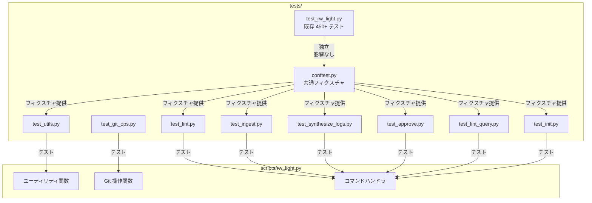
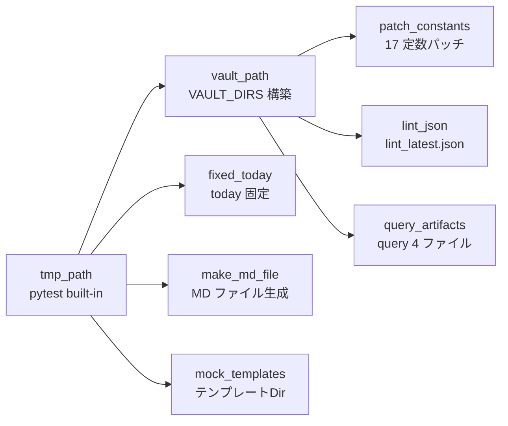

# Design Document: test-suite

## Overview

**Purpose**: rw_light.py の未テスト領域（ユーティリティ関数 11 種、CLI コマンド 6 種）に対するテストを追加し、テストインフラ（conftest.py）と開発者ドキュメント（docs/developer-guide.md）を整備する。

**Users**: Rwiki の開発者・コントリビューターが、リグレッション検出とコード理解のために利用する。

**Impact**: tests/ ディレクトリに 8 つの新規テストファイルと conftest.py を追加。既存テスト（test_rw_light.py）は一切変更しない。

### Goals
- 未テスト領域の全関数・コマンドをテストでカバーする
- conftest.py で共通フィクスチャを集約し、テスト追加コストを下げる
- `pytest` 一発で既存・新規テスト両方を実行可能にする
- 開発者ガイドでプロジェクト参加障壁を下げる

### Non-Goals
- 既存テスト（test_rw_light.py）のリファクタリング・移動
- CI/CD パイプライン設定
- カバレッジ閾値の強制
- Claude CLI の実呼び出しを伴う E2E テスト
- パフォーマンステスト

## Boundary Commitments

### This Spec Owns
- tests/conftest.py の作成と全フィクスチャ定義
- tests/test_utils.py, test_git_ops.py, test_lint.py, test_ingest.py, test_synthesize_logs.py, test_approve.py, test_lint_query.py, test_init.py の作成
- docs/developer-guide.md の作成
- CHANGELOG.md へのエントリ追記

### Out of Boundary
- tests/test_rw_light.py の変更（インラインフィクスチャ含む）
- scripts/rw_light.py のコード変更（テスト対象のバグ修正を除く）
- query 系コマンド（extract/answer/fix）のテスト（既存カバー済み）
- audit 系コマンド・関数のテスト（既存カバー済み）
- Prompt Engine のテスト（既存カバー済み）

### Allowed Dependencies
- **pytest**: テストフレームワーク（既存使用中）
- **rw_light モジュール**: テスト対象（import のみ、変更なし）
- **Python 標準ライブラリ**: json, os, subprocess, pathlib（テストコード内）
- **既存テンプレート**: templates/CLAUDE.md, templates/AGENTS/, templates/.gitignore（cmd_init テストで参照可能性あり — モックテンプレートで代替）

### Revalidation Triggers
- rw_light.py のモジュール定数（ROOT, RAW 等）の追加・変更 → conftest.py のパッチ対象更新
- VAULT_DIRS 定数の変更 → vault_path フィクスチャの動作に影響
- コマンドの入出力契約変更 → 該当テストファイルの AC 更新
- 新規コマンド追加 → 新テストファイル追加が必要

## Architecture

### Existing Architecture Analysis

現在のテスト基盤:
- **test_rw_light.py**: 6,326 行、49 クラス、450+ テスト。クラスベースのグルーピング、`_setup_*` ヘルパー関数によるインラインフィクスチャ
- **conftest.py**: 未作成
- **sys.path 操作**: test_rw_light.py の L10 で `sys.path.insert(0, ...)` を実行
- **モック戦略**: `monkeypatch.setattr` のみ（unittest.mock 不使用）
- **モジュール定数パッチ**: `monkeypatch.setattr(rw_light, "ROOT", str(tmp_path))` パターン

新規テストは既存パターンを踏襲しつつ、conftest.py でフィクスチャを共有する。

### Architecture Pattern & Boundary Map



**Architecture Integration**:
- **選択パターン**: ハイブリッド — 新規テストは conftest.py フィクスチャを使用、既存テストはそのまま維持
- **既存パターン維持**: クラスベースグルーピング、monkeypatch.setattr、bare assert、capsys
- **新規コンポーネントの理由**: conftest.py は pytest 標準の共有フィクスチャ機構で、テスト間の重複を排除する
- **既存テストとの分離**: conftest.py の全フィクスチャは `autouse=False` で、既存テストに副作用を与えない

### Technology Stack

| Layer | Choice / Version | Role | Notes |
|-------|-----------------|------|-------|
| テストフレームワーク | pytest (既存) | テスト実行・フィクスチャ管理 | 新規依存なし |
| モック | monkeypatch (pytest 組込) | モジュール定数・外部呼び出しの差替 | unittest.mock 不使用 |
| ファイルシステム隔離 | tmp_path (pytest 組込) | テストごとの独立ディレクトリ | 既存パターン踏襲 |

## File Structure Plan

### Directory Structure
```
tests/
├── conftest.py              # 共通フィクスチャ定義 (Req 1)
├── test_rw_light.py         # 既存テスト (変更なし)
├── test_utils.py            # ユーティリティ関数テスト (Req 2)
├── test_git_ops.py          # Git 操作関数テスト (Req 3)
├── test_lint.py             # cmd_lint テスト (Req 4)
├── test_ingest.py           # cmd_ingest テスト (Req 5)
├── test_synthesize_logs.py  # cmd_synthesize_logs テスト (Req 6)
├── test_approve.py          # cmd_approve テスト (Req 7)
├── test_lint_query.py       # cmd_lint_query テスト (Req 8)
└── test_init.py             # cmd_init テスト (Req 9)
docs/
└── developer-guide.md       # 開発者ドキュメント (Req 10)
```

### New Files
| File | Responsibility | Requirements |
|------|---------------|-------------|
| tests/conftest.py | sys.path 設定、共通フィクスチャ（vault_path, patch_constants, fixed_today, make_md_file, lint_json, query_artifacts, mock_templates） | 1.1-1.11 |
| tests/test_utils.py | parse_frontmatter, build_frontmatter, slugify, list_md_files, first_h1, ensure_basic_frontmatter, read_text/write_text/append_text, read_json のテスト | 2.1-2.14 |
| tests/test_git_ops.py | git_commit, git_status_porcelain, git_path_is_dirty のテスト | 3.1-3.5 |
| tests/test_lint.py | cmd_lint のテスト（PASS/WARN/FAIL 判定、lint_latest.json 出力、フロントマター書き戻し） | 4.1-4.8 |
| tests/test_ingest.py | cmd_ingest のテスト（ファイル移動、Git 連携、ロールバック） | 5.1-5.8 |
| tests/test_synthesize_logs.py | cmd_synthesize_logs のテスト（LLM モック、候補生成、エラーハンドリング） | 6.1-6.8 |
| tests/test_approve.py | cmd_approve のテスト（4 条件フィルタ、昇格、merge_synthesis） | 7.1-7.8 |
| tests/test_lint_query.py | cmd_lint_query のテスト（QL コード、終了コード） | 8.1-8.8 |
| tests/test_init.py | cmd_init のテスト（ディレクトリ作成、テンプレートコピー、再初期化バックアップ） | 9.1-9.17 |
| docs/developer-guide.md | テスト実行方法、モック戦略、アーキテクチャ概要 | 10.1-10.4 |

### Modified Files
- `CHANGELOG.md` — テスト体系追加エントリを追記（10.4）

## System Flows

### フィクスチャ依存フロー



**Key Decisions**:
- `patch_constants` は `vault_path` に依存し、ディレクトリ作成後に定数をパッチする
- `fixed_today` と `make_md_file` は `vault_path` に依存しない（任意のパスで使用可能）
- `mock_templates` は `vault_path` と独立（cmd_init は独自のパスを使うため）
- **排他制約**: `patch_constants` と `mock_templates` は同一テストで併用しない。両方が `DEV_ROOT` をパッチするため後勝ちになり挙動が不定になる。test_init.py は `mock_templates` のみ使用し、他のテストファイルは `patch_constants` のみ使用する

## Requirements Traceability

| Requirement | Summary | Components | Test File |
|-------------|---------|------------|-----------|
| 1.1 | pytest 既存・新規共存 | conftest.py (sys.path) | — |
| 1.2 | conftest.py autouse=False | conftest.py | — |
| 1.3 | vault_path フィクスチャ | conftest.py: vault_path | — |
| 1.4 | frontmatter MD 生成 | conftest.py: make_md_file | — |
| 1.5 | tmp_path 隔離 | conftest.py: vault_path | — |
| 1.6 | 17 定数パッチ | conftest.py: patch_constants | — |
| 1.7 | today 固定 | conftest.py: fixed_today | — |
| 1.8 | sys.path 集約 | conftest.py (top-level) | — |
| 1.9 | lint_json フィクスチャ | conftest.py: lint_json | — |
| 1.10 | query_artifacts フィクスチャ | conftest.py: query_artifacts | — |
| 1.11 | mock_templates フィクスチャ | conftest.py: mock_templates | — |
| 2.1-2.14 | ユーティリティ関数テスト | — | test_utils.py |
| 3.1-3.5 | Git 操作テスト | — | test_git_ops.py |
| 4.1-4.8 | cmd_lint テスト | — | test_lint.py |
| 5.1-5.8 | cmd_ingest テスト | — | test_ingest.py |
| 6.1-6.8 | cmd_synthesize_logs テスト | — | test_synthesize_logs.py |
| 7.1-7.8 | cmd_approve テスト | — | test_approve.py |
| 8.1-8.8 | cmd_lint_query テスト | — | test_lint_query.py |
| 9.1-9.17 | cmd_init テスト | — | test_init.py |
| 10.1-10.3 | developer-guide.md | — | docs/developer-guide.md |
| 10.4 | CHANGELOG 追記 | — | CHANGELOG.md |

**隣接スペック参照**: テスト期待値の根拠となる隣接スペック定義:
- **Req 6（synthesize_logs）**: AGENTS/synthesize_logs.md の JSON 出力スキーマ（topics 配列のフィールド定義）
- **Req 7（approve）**: AGENTS/approve.md の承認メタデータ 4 フィールド契約
- **Req 9（init）**: project-foundation Req 1.1 のディレクトリ構造定義（VAULT_DIRS 経由で検証）

## Components and Interfaces

### Summary

| Component | Layer | Intent | Req Coverage | Key Dependencies |
|-----------|-------|--------|-------------|-----------------|
| conftest.py | インフラ | 共通フィクスチャ提供 | 1.1-1.11 | pytest, rw_light |
| test_utils.py | ユニットテスト | ユーティリティ関数検証 | 2.1-2.14 | conftest: make_md_file, fixed_today |
| test_git_ops.py | ユニットテスト | Git 操作関数検証 | 3.1-3.5 | なし（subprocess.run モック） |
| test_lint.py | 統合テスト | cmd_lint 検証 | 4.1-4.8 | conftest: vault_path, patch_constants, make_md_file, fixed_today |
| test_ingest.py | 統合テスト | cmd_ingest 検証 | 5.1-5.8 | conftest: vault_path, patch_constants, make_md_file, lint_json |
| test_synthesize_logs.py | 統合テスト | cmd_synthesize_logs 検証 | 6.1-6.8 | conftest: vault_path, patch_constants, make_md_file, fixed_today |
| test_approve.py | 統合テスト | cmd_approve 検証 | 7.1-7.8 | conftest: vault_path, patch_constants, make_md_file, fixed_today |
| test_lint_query.py | 統合テスト | cmd_lint_query 検証 | 8.1-8.8 | conftest: vault_path, patch_constants, query_artifacts |
| test_init.py | 統合テスト | cmd_init 検証 | 9.1-9.17 | conftest: mock_templates |
| developer-guide.md | ドキュメント | 開発者参加障壁低減 | 10.1-10.3 | 全テストファイル完了後（内容がテスト構成に依存） |

### Infrastructure Layer

#### conftest.py

| Field | Detail |
|-------|--------|
| Intent | 新規テストファイル向け共通フィクスチャとインポート設定を提供 |
| Requirements | 1.1-1.11 |

**Responsibilities & Constraints**
- sys.path 操作を一元化し、新規テストファイルでの個別 `sys.path.insert` を不要にする。conftest.py と test_rw_light.py の両方で sys.path に同じパスが追加されるが、Python は重複パスを許容し import に影響しないため無害
- 全フィクスチャは `autouse=False`（既存テストへの副作用防止）
- 全フィクスチャは `scope="function"`（pytest デフォルト）を使用する。session/module スコープへの変更は禁止 — tmp_path が function スコープのため上位スコープでは使用不可、またテスト間の状態リークを防止する
- 既存テスト（test_rw_light.py）のインラインフィクスチャ・sys.path 操作は変更しない

**Contracts**: Service [x]

##### Fixture Interface

```python
# --- sys.path 設定（モジュールレベル） ---
# conftest.py ロード時に scripts/ を sys.path に追加
# test_rw_light.py の既存 sys.path.insert と共存

# --- Vault 構築 ---
@pytest.fixture
def vault_path(tmp_path: Path) -> Path:
  """rw_light.VAULT_DIRS に定義された全ディレクトリを tmp_path 上に作成。
  tmp_path を返す。各テストで独立したディレクトリが提供される。"""
  ...

# --- モジュール定数パッチ ---
@pytest.fixture
def patch_constants(vault_path: Path, monkeypatch: pytest.MonkeyPatch) -> Path:
  """rw_light の 17 グローバル定数を vault_path ベースに差し替える。
  対象: ROOT, RAW, INCOMING, LLM_LOGS, REVIEW, SYNTH_CANDIDATES,
        QUERY_REVIEW, WIKI, WIKI_SYNTH, LOGDIR, LINT_LOG,
        QUERY_LINT_LOG, INDEX_MD, CHANGE_LOG_MD, CLAUDE_MD,
        AGENTS_DIR, DEV_ROOT
  vault_path を返す。"""
  ...

# --- 日付固定 ---
@pytest.fixture
def fixed_today(monkeypatch: pytest.MonkeyPatch) -> str:
  """rw_light.today を固定日付 '2025-01-15' に差し替える。
  固定日付文字列を返す。"""
  ...

# --- MD ファイル生成 ---
@pytest.fixture
def make_md_file() -> Callable[[Path, dict, str], Path]:
  """指定パスにフロントマター付き MD ファイルを生成するファクトリ。
  引数: (path: Path, meta: dict, body: str)
  path にファイルを書き込み、path を返す。"""
  ...

# --- lint_latest.json 生成 ---
@pytest.fixture
def lint_json(vault_path: Path) -> Callable[[dict], Path]:
  """lint_latest.json を vault_path 内の logs/ に生成するファクトリ。
  書き込み先は vault_path / "logs" / "lint_latest.json" を直接使用
  （rw_light.LINT_LOG は参照しない — patch_constants 非依存にするため）。
  引数: (data: dict) — timestamp, files, summary の 3 キー構造。
  デフォルトで PASS のみの正常データを提供。"""
  ...

# --- query アーティファクト生成 ---
@pytest.fixture
def query_artifacts(vault_path: Path) -> Callable[[str], Path]:
  """指定 query_id で vault_path 内の review/query/<query_id>/ に
  question.md, answer.md, evidence.md, metadata.json を生成。
  書き込み先は vault_path / "review/query" を直接使用
  （rw_light.QUERY_REVIEW は参照しない — patch_constants 非依存にするため）。
  query ディレクトリの Path を返す。"""
  ...

# --- テンプレートディレクトリ ---
@pytest.fixture
def mock_templates(tmp_path: Path, monkeypatch: pytest.MonkeyPatch) -> Path:
  """tmp_path/templates/ にモックテンプレートを作成:
  - CLAUDE.md（最小限のテキスト内容）
  - .gitignore（最小限のテキスト内容）
  - AGENTS/ ディレクトリ（2-3 個のダミー .md ファイル。
    Req 9.4 で「コンテンツごとコピー」を検証するため、
    ファイル数とファイル名の保持を assert 可能にする）
  - scripts/rw_light.py（ダミーファイル。cmd_init が
    DEV_ROOT/scripts/rw_light.py に os.stat で実行権限チェックを
    行うため、不在だと全テストの capsys に [WARN] が混入する）
  DEV_ROOT を tmp_path にパッチ。
  テンプレートルートの Path を返す。"""
  ...
```

**Implementation Notes**
- `patch_constants` は `vault_path` に依存し、17 定数すべてを個別に `monkeypatch.setattr` する。モジュールロード時に評価済みのため `os.path.join(ROOT, ...)` の派生定数も再計算ではなく個別パッチが必要
- `make_md_file` はファクトリパターン（フィクスチャが callable を返す）を採用し、1 テスト内で複数ファイルを生成可能にする。内部で `os.makedirs(parent, exist_ok=True)` を実行し、親ディレクトリが未作成でも安全に書き込める
- `lint_json` と `query_artifacts` も同様のファクトリパターン
- `mock_templates` は `DEV_ROOT` をパッチし、cmd_init 内の `os.path.join(DEV_ROOT, "templates", ...)` が tmp_path を参照するようにする
- **ensure_dirs との関係**: 各コマンドは先頭で `ensure_dirs()` を呼び LOGDIR / SYNTH_CANDIDATES / WIKI_SYNTH / QUERY_REVIEW を作成する。`vault_path` フィクスチャが VAULT_DIRS 全体を事前作成するため、テスト時の ensure_dirs は実質 no-op。`patch_constants` なしで `vault_path` のみを使った場合、ensure_dirs は元のパス（実ディレクトリ）に作成を試みるため、必ず `patch_constants` と組み合わせて使用する
- **datetime.now() の非決定性方針**: `rw_light.today()` は `fixed_today` フィクスチャでパッチするが、`datetime.now()` は別経路で使用される（cmd_lint の lint_latest.json timestamp、append_approval_log の log.md タイムスタンプ）。これらの timestamp は**正確な値ではなく存在・型のみを検証**する（例: `assert "timestamp" in payload`、`assert "202" in log_text`）。datetime モックは行わない

### Unit Test Layer

#### test_utils.py

| Field | Detail |
|-------|--------|
| Intent | parse_frontmatter, build_frontmatter, slugify, list_md_files, first_h1, ensure_basic_frontmatter, read_text/write_text/append_text, read_json の正常系・異常系を検証 |
| Requirements | 2.1-2.14 |

**Test Classes & Patterns**

| Class | Target Function | Test Count | Key Mock |
|-------|---------------|-----------|---------|
| TestParseFrontmatter | parse_frontmatter | 3 | なし |
| TestBuildFrontmatter | build_frontmatter | 2 | なし |
| TestSlugify | slugify | 3 | なし |
| TestListMdFiles | list_md_files | 2 | なし |
| TestFirstH1 | first_h1 | 2 | なし |
| TestEnsureBasicFrontmatter | ensure_basic_frontmatter | 2 | fixed_today |
| TestFileIO | read_text, write_text, append_text | 3 | なし |
| TestReadJson | read_json | 2 | なし |

**Dependencies**: conftest: make_md_file, fixed_today（ensure_basic_frontmatter 用）

**Implementation Notes**
- ユーティリティ関数は純関数が多く、ファイルシステム依存は list_md_files, ensure_basic_frontmatter, read_text/write_text/append_text, read_json のみ
- parse_frontmatter, build_frontmatter, slugify, first_h1 は文字列入出力のみでフィクスチャ不要
- **build → parse 往復テスト（false confidence 防止）**: TestBuildFrontmatter に、build_frontmatter で生成した YAML を parse_frontmatter に渡して元のメタデータが復元されることを検証するテストを含める。特に YAML 特殊文字を含む値（コロン入り title `"Python: A Guide"` 等）を入力し、往復で壊れないことを確認する
- slugify のテストケース（3 件）: (1) 日本語文字列 → ASCII スラッグ化, (2) 記号・スペース混在 → ハイフン区切り・80 文字上限, (3) 空文字列 → `"untitled"` 返却
- read_text / write_text / append_text のテストケース（3 件）: 各関数に対して日本語文字列を含む UTF-8 データの read/write/append を検証。テスト対象は UTF-8 エンコーディングの正確性
- ensure_basic_frontmatter は `today()` を内部で呼ぶため `fixed_today` フィクスチャが必要
- **ensure_basic_frontmatter の title 推定優先順位**: title 欠落時は `first_h1(body)` を優先し、H1 がなければ `os.path.basename(path)` をフォールバック。AC 2.10 のテストでは両パターン（H1 あり / H1 なし）を検証し、優先順位の正確性を確認する

#### test_git_ops.py

| Field | Detail |
|-------|--------|
| Intent | git_commit, git_status_porcelain, git_path_is_dirty の subprocess.run モックベース検証 |
| Requirements | 3.1-3.5 |

**Test Classes & Patterns**

| Class | Target Function | Test Count | Key Mock |
|-------|---------------|-----------|---------|
| TestGitCommit | git_commit | 4 | subprocess.run |
| TestGitStatusPorcelain | git_status_porcelain | 1 | subprocess.run |
| TestGitPathIsDirty | git_path_is_dirty | 2 | subprocess.run (via git_status_porcelain) |

**Dependencies**: なし（subprocess.run モックのみで完結。git_commit / git_status_porcelain / git_path_is_dirty はモジュール定数を参照しない）

**Implementation Notes**
- git_commit は subprocess.run を **3 回**呼ぶ（2 回ではない）:
  1. `subprocess.run(["git", "add", *paths], check=True)` — ステージング
  2. `subprocess.run(["git", "diff", "--cached", "--quiet"], check=False)` — ステージ済み変更の有無チェック
  3. `subprocess.run(["git", "commit", "-m", message], check=True)` — コミット（returncode!=0 の場合のみ）
- **モック設計方針（脆弱性回避）**: subprocess.run モックは呼び出しを記録するリスト（`calls = []`）に `(args, kwargs)` を append するパターンを使用する。テスト後に `calls` の内容を検証する。呼び出し回数や引数の厳密一致ではなく、「何が呼ばれたか / 呼ばれなかったか」を部分一致で検証し、実装のリファクタリング耐性を確保する
- Req 3.1（正常系）: モック内で `git diff` の returncode=1（変更あり）を返す。テストでは `calls` に `"commit"` を含む呼び出しが存在することを検証（`any("commit" in str(c) for c in calls)`）
- Req 3.2（スキップ）: モック内で `git diff` の returncode=0（変更なし）を返す。テストでは `calls` に `"commit"` を含む呼び出しが**存在しない**ことを検証
- Req 3.3（CalledProcessError）: `git add` 失敗と `git commit` 失敗を個別にテスト。モック内で `args` の内容に応じて CalledProcessError を送出（例: `if "add" in args[0]: raise ...`）
- git_path_is_dirty は内部で git_status_porcelain を呼ぶ。git_status_porcelain 自体をモックするか、subprocess.run をモックして間接的に検証する。既存パターンに合わせ subprocess.run をモック

### Integration Test Layer

#### test_lint.py

| Field | Detail |
|-------|--------|
| Intent | cmd_lint の PASS/WARN/FAIL 判定、lint_latest.json 出力、フロントマター書き戻し、終了コードを検証 |
| Requirements | 4.1-4.8 |

**Test Classes & Patterns**

| Class | Test Count | Key Fixtures |
|-------|-----------|-------------|
| TestCmdLint | 8 | patch_constants, make_md_file, fixed_today |

**Dependencies**: conftest: vault_path, patch_constants, make_md_file, fixed_today

**Mock Strategy**:
- subprocess.run のモックは不要（cmd_lint は Git/Claude を呼ばない）
- `fixed_today` が必要（ensure_basic_frontmatter が内部で `today()` を呼び、`added` フィールドに日付を設定するため。テストの決定性保証用）
- ファイルシステム操作のみ（incoming/ へのファイル配置 → lint 実行 → 結果確認）

**Implementation Notes**
- cmd_lint の判定順序（順序がテスト設計に影響）:
  1. 生テキスト `raw = read_text(path)` を読み込み
  2. **FAIL 判定**: `len(raw.strip()) == 0` → 空ファイルは即 FAIL、`continue` で ensure_basic_frontmatter を**スキップ**（フロントマター補完されない）
  3. **ensure_basic_frontmatter** 実行（FAIL 以外のファイルのみ）→ 不足フィールド補完・ファイル書き戻し
  4. **WARN 判定**: `len(new_text.strip()) < 80` → 補完**後**のテキストで判定
  5. **PASS**: 上記以外
- lint_latest.json のエントリ構造: `{"path": str, "status": str, "warnings": list, "errors": list, "fixes": list}`。トップレベルは `{"timestamp": str, "files": list, "summary": {"pass": int, "warn": int, "fail": int}}`
- フロントマター書き戻し（4.8）: FAIL でないファイルに対して `ensure_basic_frontmatter(path, infer_source_from_path(path))` が incoming/ のファイルに不足フィールドを書き戻す。`infer_source_from_path` はパス文字列から source タイプ（"web", "zotero", "local", "meeting", "code", "unknown"）を推論する関数。テスト 4.8 では incoming/ のサブディレクトリ名によって `source` フィールドの期待値が変わることに注意

#### test_ingest.py

| Field | Detail |
|-------|--------|
| Intent | cmd_ingest のファイル移動、lint_latest.json 依存、Git 連携、ロールバックを検証 |
| Requirements | 5.1-5.8 |

**Test Classes & Patterns**

| Class | Test Count | Key Fixtures |
|-------|-----------|-------------|
| TestCmdIngest | 8 | patch_constants, make_md_file, lint_json |

**Dependencies**: conftest: vault_path, patch_constants, make_md_file, lint_json

**Mock Strategy**:
- `rw_light.git_commit` を monkeypatch（5.3: 呼び出し検証、5.5: CalledProcessError 送出）
- lint_json フィクスチャで lint_latest.json を事前作成

**Implementation Notes**
- cmd_ingest の内部フロー（6 段階）:
  1. `load_lint_summary()` で lint_latest.json を読み込み（ファイル不在時は FileNotFoundError を送出 — Req 5.6。なお load_lint_summary は `read_json` を使わず `read_text` + `json.loads` を直接使用する）
  2. `lint_result["summary"]["fail"] > 0` なら即 abort、return 1（Req 5.4）— lint_latest.json は abort 判定のみに使用
  3. `list_md_files(INCOMING)` で incoming/ を直接スキャンしてファイルリストを取得（lint_latest.json のファイルリストは使用しない）
  4. **`plan_ingest_moves(files)`** で移動計画を作成 — 各ファイルの `os.path.relpath(path, INCOMING)` を計算し `(src, dst)` タプルのリストを返す。**ここで移動先の重複チェックを行い、重複があれば RuntimeError を送出する**（Req 5.7）
  5. `execute_ingest_moves(moves)` でファイル移動 — shutil.move で実行。移動中のエラー時はロールバック（Req 5.8）
  6. `try: git_commit(...) except CalledProcessError: return 1` — cmd_ingest は git_commit の CalledProcessError を**自前で catch**して終了コード 1 を返す（Req 5.5）
- **Req 5.7（移動先重複）と Req 5.8（ロールバック）はエラー源が異なる関数**:
  - 5.7: `plan_ingest_moves` が移動**計画時**に `os.path.exists(target)` で検出 → RuntimeError。ファイル移動前なのでロールバック不要
  - 5.8: `execute_ingest_moves` が移動**実行中**に shutil.move 等が失敗 → completed リストを逆順で復元。テストでは 2 ファイル用意し、2 番目の移動でエラーを発生させ、1 番目が元の位置に戻っていることを検証

#### test_synthesize_logs.py

| Field | Detail |
|-------|--------|
| Intent | cmd_synthesize_logs の LLM 呼び出しモック、候補ファイル生成、エラーハンドリングを検証 |
| Requirements | 6.1-6.8 |

**Test Classes & Patterns**

| Class | Test Count | Key Fixtures |
|-------|-----------|-------------|
| TestCmdSynthesizeLogs | 9 | patch_constants, make_md_file, fixed_today |

**Dependencies**: conftest: vault_path, patch_constants, make_md_file, fixed_today

**Mock Strategy**:
- `rw_light.call_claude_for_log_synthesis` を monkeypatch（`subprocess.run` ではなく関数レベル）
- モック戻り値は AGENTS/synthesize_logs.md の出力スキーマに準拠: `'{"topics": [{"title": "Test Topic", "summary": "要約テキスト", "decision": "判断内容", "reason": "理由", "alternatives": "代替案", "reusable_pattern": "再利用パターン", "tags": ["test"]}]}'`。render_candidate_note が `summary`, `decision`, `reason`, `alternatives`, `reusable_pattern` キーを参照して候補ファイル本文を構築する
- `rw_light.git_path_is_dirty` を monkeypatch — **全テストで適用**。cmd_synthesize_logs は先頭で `warn_if_dirty_paths` → `git_path_is_dirty` → `git_status_porcelain` → `subprocess.run(["git", "status", ...])` を呼ぶため、モックしなければ実 git コマンドが実行され非決定的な `[WARN]` が capsys に混入する。AC 6.8 では `True` を返して警告出力を検証、他の AC では `False` を返す no-op モック

**Implementation Notes**
- synthesize-logs は query/audit 系と異なり Prompt Engine を使用しない。独自の `call_claude_for_log_synthesis()` が Claude CLI を subprocess で呼ぶ
- cmd_synthesize_logs の内部フロー（4 段階）:
  1. `call_claude_for_log_synthesis(log_path)` → LLM 生テキスト
  2. `parse_topics(output)` → topic 辞書のリスト（JSON パースのみ）
  3. `render_candidate_note(topic, source)` → 候補ファイルテキスト生成（フロントマター構築）
  4. `write_text(path, note)` → ファイル書き出し
- `render_candidate_note`（L494-514）が生成する候補ファイルのフロントマターフィールド: `title, source, type="synthesis_candidate", status="pending", reviewed_by="", created={today()}, updated={today()}, tags`。`created` と `updated` に `today()` を使用するため `fixed_today` フィクスチャが必要（フロントマター値の決定性保証）
- 6.3 の log.md 追記: cmd_synthesize_logs は CHANGE_LOG_MD（log.md）にインラインで書き込む（append_approval_log 等の専用関数は使わない）。`datetime.now().strftime("%Y-%m-%d %H:%M")` でタイムスタンプを生成し、各候補の相対パスをリスト形式で追記（L567-572）。テストではタイムスタンプの正確な値ではなくエントリの存在を検証
- 6.5 のエラー継続: try ブロックが `call_claude_for_log_synthesis` と `parse_topics` の両方をカバーするため、2 パターンのエラー注入が必要:
  - (a) `call_claude_for_log_synthesis` 自体が Exception を送出 → FAIL 報告 → 次のファイルへ
  - (b) `call_claude_for_log_synthesis` が不正な文字列を返し、`parse_topics` 内の `json.loads()` が `JSONDecodeError` を送出 → 同様に FAIL 報告 → 次のファイルへ
- 6.7 の重複スキップ: `os.path.exists(path)` で slug 化されたタイトルベースのパスを確認し、既存なら skip
- **単一レスポンス内 slug 衝突（false confidence 防止）**: モック戻り値の topics 配列に、slugify 結果が同一になる 2 つの topic（例: `"Python Guide"` と `"Python: Guide!"`→ 両方 `"python-guide"`）を含め、1 つ目が作成され 2 つ目がスキップされることを検証する。事前存在ファイルとの重複（6.7）とは別のテストケースとして追加

#### test_approve.py

| Field | Detail |
|-------|--------|
| Intent | cmd_approve の 4 条件フィルタリング、昇格ロジック（promote_candidate + mark_candidate_promoted）、merge_synthesis、index.md 更新、log.md 追記を検証 |
| Requirements | 7.1-7.8 |

**Test Classes & Patterns**

| Class | Test Count | Key Fixtures |
|-------|-----------|-------------|
| TestCmdApprove | 11 | patch_constants, make_md_file, fixed_today |

**Dependencies**: conftest: vault_path, patch_constants, make_md_file, fixed_today

**Mock Strategy**:
- cmd_approve は Git 操作を一切呼び出さない（git_commit 不使用）
- `rw_light.git_path_is_dirty` を monkeypatch — **全テストで適用**。cmd_approve は先頭で `warn_if_dirty_paths` → `git_path_is_dirty` → `git_status_porcelain` → `subprocess.run(["git", "status", ...])` を呼ぶため、モックしなければ実 git コマンドが実行され非決定的な `[WARN]` が capsys に混入する。AC 7.8 では `True` を返して警告出力を検証、他の AC では `False` を返す no-op モック
- ファイルシステム操作のみ（候補ファイル配置 → approve 実行 → wiki/synthesis/ 確認）

**Implementation Notes**
- cmd_approve の呼び出しチェーン: `approved_candidate_files` → `promote_candidate` → `mark_candidate_promoted` → `update_index_synthesis` → `append_approval_log`
- approved_candidate_files の 4 条件（7.2 で個別拒否テスト）:
  1. `meta.get("status") == "approved"`
  2. `meta.get("reviewed_by", "")` が非空
  3. `meta.get("approved")` が有効な ISO 日付
  4. `str(meta.get("promoted", "")).lower() != "true"`（文字列変換 + 小文字化の上で比較。YAML パースで boolean `false` になるケースも `str()` で "False" → `.lower()` で "false" → `!= "true"` で通過する）
- **テストフィクスチャでの候補ファイル作成時**: Req 7.1 に合わせ `promoted: false` を**明示的に設定**する（`promoted` フィールド欠落でも条件 4 は通過するが、要件が `promoted: false` を前提としているため一致させる）
- promote_candidate（7.1）: type を `"synthesis"` に変更して wiki/synthesis/ に書き込み。戻り値は `(action, target_rel)` タプル
- mark_candidate_promoted（7.3）: **promote_candidate とは別関数**。元候補ファイルのフロントマターに promoted: "true", promoted_at, promoted_to, updated を設定して書き戻す
- merge_synthesis（7.4）: 既存ファイルにセパレータ（`---` + `## Update {today()}`）付き本文追記、フロントマターの updated・candidate_source に加え reviewed_by・approved も条件付き更新。**既存フィールド保持の検証**: テストフィクスチャで既存ファイルに tags 等の追加フィールドを含め、merge 後も保持されていることを assert する（false confidence 防止 — 更新対象以外のフィールドが消失するリグレッションを検出）
- update_index_synthesis（7.5）: wiki/synthesis/ の全ファイルを走査し index.md の `## synthesis` セクションを再生成
- append_approval_log（7.6）: CHANGE_LOG_MD（log.md）に昇格エントリをタイムスタンプ付きで追記

#### test_lint_query.py

| Field | Detail |
|-------|--------|
| Intent | cmd_lint_query の構造検証、QL コード判定、終了コードを検証 |
| Requirements | 8.1-8.8 |

**Test Classes & Patterns**

| Class | Test Count | Key Fixtures |
|-------|-----------|-------------|
| TestCmdLintQuery | 8 | patch_constants, query_artifacts |

**Dependencies**: conftest: vault_path, patch_constants, query_artifacts

**Mock Strategy**:
- 外部呼び出しモック不要（cmd_lint_query は Git/Claude を呼ばない）
- ファイルシステム操作のみ

**Implementation Notes**
- 終了コード体系: 0（正常）、1（WARN）、2（ERROR）、3（引数エラー）、4（パス不存在）
- **引数渡し**: `cmd_lint_query(args: list[str])` — テストでは `cmd_lint_query(["--path", str(query_dir)])` のように引数リストを直接渡す
- cmd_lint_query は argparse を使用せず手動引数パース。受け付けるオプション: `--path <value>`, `--strict`, `--format <value>`, 位置引数（第 1 引数を target_path として解釈）。Req 8.8 のエラーケース: `cmd_lint_query(["--path"])` （値なし）、`cmd_lint_query(["--unknown"])` （不明オプション）→ 終了コード 3
- QL コード検証: QL001（必須ファイル欠落 = ERROR）、QL003（query_type 未指定 = WARN）、QL005（created_at なし = WARN）

#### test_init.py

| Field | Detail |
|-------|--------|
| Intent | cmd_init の Vault セットアップ、テンプレートコピー、Git 初期化、再初期化バックアップを検証 |
| Requirements | 9.1-9.17 |

**Test Classes & Patterns**

| Class | Test Count | Key Fixtures |
|-------|-----------|-------------|
| TestCmdInit | 17 | mock_templates |

**Dependencies**: conftest: mock_templates

**Mock Strategy**:
- `subprocess.run` を monkeypatch — **全テストで適用**。cmd_init は `.git/` 不在時に常に `subprocess.run(["git", "init"], ...)` を呼ぶため、モックしなければ実サブプロセスが起動する（テスト速度低下、git 未インストール環境での失敗リスク）。AC 9.7/9.8 では戻り値・呼び出し有無を検証、他の AC では no-op モック（CompletedProcess(returncode=0) を返す）として git init の実行を抑止する
- `builtins.input` を monkeypatch（9.13-9.15: 再初期化の確認プロンプト）。`input()` のプロンプト引数はモック関数内でキャプチャし、capsys ではなくキャプチャリストで検証する（`input()` をモック化するとプロンプトが stdout に書かれないため）

**Implementation Notes**
- **引数渡し**: `cmd_init(args: list[str])` — テストでは**必ず** `cmd_init([str(tmp_path / "vault")])` のように明示的なパスを渡す。**`cmd_init([])` は禁止** — 引数なしの場合 `os.getcwd()` が使われ、テスト実行ディレクトリ（プロジェクトルート）に Vault 構造を作成する事故が発生する
- **Req 9.1 のディレクトリ検証**: cmd_init は `VAULT_DIRS`（22 エントリ）を使用して全ディレクトリを作成する。テストでは `rw_light.VAULT_DIRS` をイテレートし、各エントリが `os.path.join(target_path, d)` として存在することを assert する（ハードコードリスト不要）
- cmd_init は `DEV_ROOT` 経由でテンプレートを参照する。mock_templates フィクスチャが DEV_ROOT をパッチしてモックテンプレートを使用
- cmd_init は patch_constants を使用しない（init 自体が Vault ディレクトリを作成するため）
- 再初期化バックアップ（9.14）: 既存 CLAUDE.md → CLAUDE.md.bak、既存 AGENTS/ → AGENTS.bak/ にリネーム後に新テンプレートをコピー
- symlink 作成（9.11）: scripts/rw → scripts/rw_light.py のシンボリックリンクを検証

### Documentation Layer

#### developer-guide.md

| Field | Detail |
|-------|--------|
| Intent | テスト実行方法、テストファイル構成、モック戦略、アーキテクチャ概要を文書化 |
| Requirements | 10.1-10.3 |

**Content Structure**

**セクション 1: テスト実行方法**（AC 10.1）
- `pytest tests/` で全テスト実行（既存 + 新規）
- `pytest tests/ --ignore=tests/test_rw_light.py` で新規テストのみ実行
- `pytest tests/test_utils.py -v` で個別ファイル実行
- `-x` フラグ（最初の失敗で停止）、`-k` フラグ（テスト名フィルタ）の使用例

**セクション 2: テストファイル構成**（AC 10.1）
- 既存 test_rw_light.py（query/audit/Prompt Engine テスト）と新規 8 ファイルの責務分担
- conftest.py の位置づけ: 新規テスト専用の共通フィクスチャ（autouse=False）
- 既存テストとの分離方針: conftest.py は既存テストに影響しない

**セクション 3: テスト追加手順**（AC 10.1）
- 新規テストファイルは `tests/test_<対象>.py` に配置
- クラス命名規約: `Test<関数名>` または `TestCmd<コマンド名>`
- フィクスチャの使用: テストメソッドの引数に `patch_constants`, `make_md_file` 等を指定
- 2 スペースインデント必須
- `import rw_light` のみで利用可能（sys.path は conftest.py が設定済み）

**セクション 4: モック戦略**（AC 10.2）
- `monkeypatch.setattr` のみ使用、`unittest.mock` 不使用の理由（既存テストとの一貫性）
- モジュール定数パッチ: `patch_constants` フィクスチャで 17 定数を一括差し替え
- subprocess.run モック: 呼び出し記録リストパターンの使用例
- LLM 呼び出しモック: query/audit は `call_claude`、synthesize-logs は `call_claude_for_log_synthesis` をモック

**セクション 5: アーキテクチャ概要**（AC 10.3）
- 3 層パイプライン（raw → review → wiki）の概要とデータフロー
- コマンドハンドラ構造: ユーティリティ関数 → コマンドハンドラ → argparse エントリポイント
- Prompt Engine の概要: parse_agent_mapping → load_task_prompts → call_claude の呼び出しチェーン
- テスト観点からの注意: モジュール定数がインポート時に評価される点、ensure_dirs の動作

**CHANGELOG エントリ**（AC 10.4）
- `## [Unreleased]` セクションの `### Added — test-suite スペック` に追記
- Keep a Changelog フォーマット準拠（既存エントリと同一スタイル）
- `### Changed` カテゴリは不要（本スペックは新規ファイル追加のみ、既存コードの変更なし）
- 記載例（カテゴリ単位、既存エントリの粒度に合わせる）:
  ```
  ### Added — test-suite スペック

  - `tests/conftest.py` — 共通フィクスチャ（vault_path, patch_constants, fixed_today, make_md_file 等）
  - ユーティリティ関数テスト（`test_utils.py`）— parse_frontmatter, slugify, ensure_basic_frontmatter 等 11 関数
  - Git 操作テスト（`test_git_ops.py`）— git_commit, git_status_porcelain, git_path_is_dirty
  - CLI コマンドテスト（`test_lint.py`, `test_ingest.py`, `test_synthesize_logs.py`, `test_approve.py`, `test_lint_query.py`, `test_init.py`）— 未テスト 6 コマンドのカバレッジ追加
  - `docs/developer-guide.md` — テスト実行方法、モック戦略、アーキテクチャ概要
  ```

## Error Handling

### テストコード内のエラー検証パターン

| パターン | 使用場面 | 実装 |
|---------|---------|------|
| `pytest.raises(Exception)` | 例外送出の検証 | 2.14, 3.3, 5.6-5.8 |
| `capsys.readouterr()` | stdout/stderr 出力の**部分一致**検証（`assert "[PASS]" in captured.out`）。完全一致は使用しない — メッセージ文言やパス表示形式の変更に対するリファクタリング耐性を確保 | 4.1-4.3, 4.4, 6.5, 6.8, 7.8, 8.1, 8.8, 9.12, 9.16-9.17 |
| 終了コード検証 | コマンドの戻り値確認 | `assert cmd_xxx(...) == N` |
| ファイル存在・内容確認 | ファイルシステム副作用の検証 | `assert path.exists()`, `assert "key" in text` |

### モックエラー注入パターン

| 対象 | エラー注入方法 | 使用箇所 |
|------|-------------|---------|
| subprocess.run | 呼び出し記録リスト + args 内容に応じた CalledProcessError 送出（例: `if "add" in args[0]: raise ...`） | 3.3 |
| rw_light.git_commit | monkeypatch で CalledProcessError を送出する関数に差し替え | 5.5 |
| call_claude_for_log_synthesis | (a) `side_effect=Exception("LLM error")` を monkeypatch、(b) 不正 JSON を返し parse_topics で JSONDecodeError | 6.5 |
| builtins.input | 固定値 "n" を返す lambda を monkeypatch | 9.15 |
| ファイルシステム | 同名ファイルの事前配置で衝突を発生 | 5.7, 6.7, 7.4 |

### 既知の技術負債: exit 1 のセマンティクス

roadmap.md に記載の通り、全 `rw` コマンドで exit 1 が「ランタイムエラー」と「FAIL 検出」の両方を意味する。テストではこの曖昧性をそのまま受け入れ、各 AC で「exit 1 を返す条件」を個別に検証する（exit 1 の意味の分離は本スペックのスコープ外）。

| コマンド | exit 1 の意味 | AC |
|---------|-------------|-----|
| cmd_lint | FAIL 検出 | 4.6 |
| cmd_ingest | FAIL 検出（lint 結果）/ ランタイムエラー（git 失敗） | 5.4 / 5.5 |
| cmd_init | テンプレート不在エラー | 9.16, 9.17 |

## Testing Strategy

本スペック自体がテストを作成するものであるため、テスト戦略は要件の AC に直接対応する。

### Implementation Order（TDD 整合）

TDD 原則に従い、conftest.py のフィクスチャは一括ではなく**使用するテストとペアで段階的に追加**する。タスク生成時の分割指針:

| Wave | タスク | 追加するフィクスチャ | 並行可否 |
|------|--------|-------------------|---------|
| 1 | conftest.py 基盤 + test_utils.py | sys.path, make_md_file, fixed_today | — |
| 1 | conftest.py 基盤 + test_git_ops.py | vault_path, patch_constants（他テスト用。test_git_ops 自体は不使用） | 上と並行可 |
| 1 | test_init.py | mock_templates | 上と並行可 |
| 2 | test_lint.py | （Wave 1 で追加済みのフィクスチャを使用） | — |
| 2 | test_ingest.py | lint_json | 上と並行可 |
| 2 | test_synthesize_logs.py | （追加フィクスチャなし） | 上と並行可 |
| 2 | test_approve.py | （追加フィクスチャなし） | 上と並行可 |
| 2 | test_lint_query.py | query_artifacts | 上と並行可 |
| 3 | developer-guide.md + CHANGELOG.md | — | 全テスト完了後 |

- **Wave 1**: conftest.py の基盤フィクスチャを、対応するテストファイルとペアで作成。各ペアは互いに独立しているため並行実装可能
- **Wave 2**: Wave 1 で作成済みのフィクスチャを前提に、残りのテストファイルを実装。追加フィクスチャが必要な場合は conftest.py に追記
- **Wave 3**: developer-guide.md はテストファイル構成・フィクスチャ利用方法を記載するため、**全テスト完了後**に作成する（暗黙の順序制約）
- **conftest.py の merge 注意**: 並行タスクが conftest.py に同時追記するため、merge conflict の可能性あり。各タスクが追加するフィクスチャを明確に分離し、ファイル末尾への追記で衝突を最小化する

### Coding Conventions
- テストコードは **2 スペースインデント**（brief.md / requirements.md Constraints 準拠）
- 既存テスト（test_rw_light.py）と同一のスタイル

### Verification Criteria
- **正常系**: 各コマンド/関数の主要パスが期待通りに動作する
- **異常系**: エラー条件での適切な例外送出・終了コード・エラーメッセージ
- **境界条件**: 空入力、ファイル不存在、重複ファイル、不完全フロントマター
- **副作用検証**: ファイル生成・移動・削除、フロントマター更新、ログ出力
- **独立性**: 各テストが他のテストの状態に依存しない（tmp_path による隔離）

### AC 別検証方法ガイド

各 AC で使用する主要な assert 手法。複数の手法を組み合わせて検証する。

| AC | 戻り値 | capsys | ファイル内容 | 例外 | 備考 |
|----|--------|--------|------------|------|------|
| 4.1 | `== 0` | `"[PASS]" in out` | — | — | |
| 4.2 | `== 1` | `"[FAIL]" in out` | files[N]["status"] == "FAIL" | — | |
| 4.3 | `== 0` | `"[WARN]" in out` | files[N]["status"] == "WARN" | — | |
| 4.4 | `== 0` | — | summary 全て 0 | — | |
| 4.5 | — | — | lint_latest.json の 3 キー存在 | — | timestamp は存在のみ検証 |
| 4.6 | `== 1` | — | — | — | |
| 4.7 | `== 0` | — | — | — | |
| 4.8 | — | — | incoming/ ファイルの補完後内容 | — | source は infer_source_from_path 依存 |
| 5.1 | — | — | raw/ にファイル存在、incoming/ から消失 | — | |
| 5.2 | `== 0` | — | — | — | |
| 5.3 | — | — | — | — | git_commit 呼び出し記録を検証 |
| 5.4 | `== 1` | — | — | — | |
| 5.5 | `== 1` | — | — | — | git_commit モックが CalledProcessError |
| 5.6 | — | — | — | `FileNotFoundError` | |
| 5.7 | — | — | — | `RuntimeError` | plan_ingest_moves が送出 |
| 5.8 | — | — | 元の位置にファイル復元 | 例外送出 | |
| 6.1 | — | — | synthesis_candidates/ にファイル存在 | — | |
| 6.2 | `== 0` | — | synthesis_candidates/ にファイルなし | — | |
| 6.3 | — | — | CHANGE_LOG_MD にエントリ存在 | — | |
| 6.4 | — | — | 候補ファイルのフロントマターフィールド | — | |
| 6.5 | — | `"[FAIL]" in out` | — | — | 次ファイルの `[READ]` で継続確認 |
| 6.6 | `== 0` | — | — | — | 全 FAIL 時も 0 |
| 6.7 | — | `"[SKIP]" in out` | 既存ファイル内容が不変 | — | |
| 6.8 | — | `"[WARN]" in out` | — | — | git_path_is_dirty モック |
| 7.1 | — | — | wiki/synthesis/ にファイル、type=="synthesis" | — | |
| 7.2 | — | — | wiki/synthesis/ にファイルなし | — | 4 条件それぞれに独立したテストメソッド（status 不一致 / reviewed_by 空 / approved 無効日付 / promoted true） |
| 7.3 | — | — | 元候補の promoted/promoted_at/promoted_to | — | |
| 7.4 | — | — | 既存ファイルにセパレータ付き追記 | — | |
| 7.5 | — | — | index.md の `## synthesis` セクション | — | |
| 7.6 | — | — | CHANGE_LOG_MD にエントリ存在 | — | |
| 7.7 | `== 0` | — | — | — | |
| 7.8 | — | `"[WARN]" in out` | — | — | git_path_is_dirty モック |
| 8.1 | — | `"Lint Result" in out` | — | — | |
| 8.2 | — | `"QL001" in out` | — | — | |
| 8.3 | — | — | ログ JSON の 3 キー存在 | — | timestamp は存在のみ検証 |
| 8.4 | `== 0` | — | — | — | |
| 8.5 | `== 1` | — | — | — | |
| 8.6 | `== 2` | — | — | — | |
| 8.7 | `== 4` | — | — | — | |
| 8.8 | `== 3` | `"missing value" in out` 等 | — | — | |
| 9.1 | — | — | VAULT_DIRS 全エントリが存在 | — | |
| 9.2 | `== 0` | — | ターゲットディレクトリが存在 | — | |
| 9.3 | — | — | CLAUDE.md の内容一致 | — | |
| 9.4 | — | — | AGENTS/ ファイル数・名前一致 | — | |
| 9.5 | — | — | index.md, log.md の見出し | — | |
| 9.6 | — | — | 既存ファイルの内容が不変 | — | |
| 9.7 | — | — | — | — | subprocess.run 呼び出し記録に "git init" |
| 9.8 | — | — | — | — | subprocess.run に "git init" なし |
| 9.9 | — | — | .gitignore の内容一致 | — | |
| 9.10 | — | — | 既存 .gitignore の内容が不変 | — | |
| 9.11 | — | — | symlink 存在・リンク先確認 | — | |
| 9.12 | — | `"rw init 完了レポート" in out` | — | — | レポートの主要項目（ディレクトリ数、テンプレート名）を部分一致検証 |
| 9.13 | — | — | — | — | input() モック（プロンプト引数キャプチャで `"既存のVault" in prompts[0]`） |
| 9.14 | — | — | .bak ファイル存在 + 新テンプレート | — | |
| 9.15 | `== 0` | — | 既存ファイルが不変 | — | input() が "n" 返却 |
| 9.16 | `== 1` | `"[ERROR]" in out` | — | — | CLAUDE.md テンプレート不在 |
| 9.17 | `== 1` | `"[ERROR]" in out` | — | — | .gitignore テンプレート不在 |

### Test Execution
```bash
# 全テスト実行（既存 + 新規）
pytest tests/

# 新規テストのみ実行
pytest tests/ --ignore=tests/test_rw_light.py

# 個別ファイル実行
pytest tests/test_utils.py -v
```
