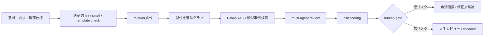

# 仕様・設計書レビュー自動化研究の横断分析

## Executive Summary

本調査の結論を先に述べると、**2010年代の仕様・設計書レビュー自動化は、主として「ルール」「テンプレート」「smell 検出」による局所的・決定的な検査に集中しており、2024年以降に LLM が加わって初めて「複数文書整合性」「意味的トレース」「知識グラフ」「役割分担エージェント」へ広がり始めた**、というのが全体像です。ただし、ソフトウェアの上流成果物に対する完全自動レビューは依然として未成熟であり、最新の systematic review でも LLM4RE は 74件と急増している一方、RAG は 6%、interactive prompting は 5% にとどまり、実験の 75% はラボ条件でした。ソフトウェアアーキテクチャ領域でも、LLM 関連の主要研究はまだ 18件規模で、conformance checking のような難所はなお手薄です。citeturn33view0turn33view1turn11search2

**本プロジェクト案に最も近い先行研究は、単一の“一本の論文”ではなく、複数系列の組み合わせです。** 「意図→仕様変換」は Req2Spec や nl2spec に近く、「GraphRAG / 構造化検索」は requirements-to-code traceability の RAG+graph index 研究に近く、「relation 抽出 / 型付き意味グラフ」は requirement knowledge graph 構築研究に近く、「multi-agent / role 分担」は MAAD に近く、「human gate」は architecture document evaluation や公式エージェント運用文書に強く整合します。反対に、**「RAG による過去 escalate 照合」「risk scoring による段階的エスカレーション」は、近縁例はあるものの、仕様・設計レビュー研究としてはまだ薄い**のが重要な発見です。citeturn24view0turn25view0turn23view0turn28view0turn12view0turn9search6turn9search12turn9search19

したがって、本案の新規性は**各要素の単体発明**よりも、**上流レビューのために「決定的 lint 層 → 意味グラフ層 → RAG/GraphRAG 層 → 役割分担 LLM 層 → risk scoring → human gate」を一体運用する設計**にあります。既存研究はこのうち一部を示していますが、**全部を通したレビュー・トリアージ系パイプライン**は見当たりませんでした。これは学術的にも実装上も十分に新規ですが、同時に評価設計が難しい領域です。citeturn35view0turn19view0turn15view0turn37view0turn24view0turn23view0turn26view0turn28view0turn12view0

実装方針としては、**いきなり end-to-end 自動承認を狙うべきではありません。** 先行研究が安定しているのは、曖昧語・未定義語・テンプレート逸脱・表形式整形・トレース候補の絞り込み・関係抽出・観点分割までであり、最終判断は人手ゲートを残す設計が最も妥当です。これは研究論文だけでなく、entity["company","GitHub","developer platform"] の code review の責任ある利用文書、entity["company","Snyk","developer security company"] の AI-based SAST、entity["company","Anthropic","ai company"] の Constitutional AI、entity["company","OpenAI","ai research company"] の agent ガイドラインでも、**人間の確認・承認・監視 AI** を残す方向で一致しています。citeturn9search7turn9search17turn8search2turn9search1turn9search6turn9search12turn9search19

## 調査範囲と方法

対象期間は **2010年から2026年4月まで**、対象領域はソフトウェア工学全般のうち、要件仕様・設計書・アーキテクチャ文書・形式仕様化・トレーサビリティ・知識グラフ・LLM/agent を用いたレビュー支援です。主要ソースは entity["organization","ACM","computing society"] と entity["organization","IEEE","engineering society"] の出版物、arXiv のプレプリント、REFSQ・Springer 系の査読論文、ならびに公式技術文書です。日本語資料として、entity["company","Fujitsu","japanese it company"] の設計書自動レビュー研究、および entity["company","Mitsubishi Electric","japanese electronics company"] の仕様書用語チェック研究も参照しました。citeturn33view0turn33view1turn26view0turn7search0

選定基準は、第一に**仕様・設計レビュー自動化への直接性**、第二に**本案との比較可能性**、第三に**一次ソースの取得性と評価結果の明瞭さ**です。そのため、コードレビューや一般的な QA 自動化は背景比較にとどめ、主要表は上流成果物に近いものを優先しました。なお、LLM を扱う recent literature では、要求工学分野でもまだラボ実験が多く、実運用評価や長期運用結果は少ないため、この点は結論全体の重要な制約です。citeturn33view0turn33view1

## 研究潮流の整理

2010年代前半の研究は、**自然言語文書の品質を「測れるもの」に変換する**ことが主眼でした。代表的には、文書命名規約、著者記載、図表参照、重複段落などの「文書 best practice」を 60超のルールとして検査する研究や、要件文テンプレートへの構文的準拠を NLP chunking で自動判定する研究が現れました。この時代の強みは決定性と再現性であり、弱みは**意味論的妥当性やトレードオフ判断に踏み込めないこと**でした。citeturn35view0turn19view0turn21view0

2010年代後半になると、要件レビューは **Requirements Smell** という考え方で整理されるようになります。smell 検出は、曖昧副詞、主観語、抜け穴表現、曖昧照応などを軽量に検出し、レビュー前の pre-lint として有効でした。ただし、Femmer らの結果が平均 precision 59%、recall 82% であることが示すように、**「役に立つ補助」ではあっても「自動裁定」ではない**という位置づけがこの時点で明確になっています。citeturn15view0

2020年代初頭には、仕様レビュー自動化は二つに分岐します。ひとつは **formalization** で、自然言語要求を formal spec に変換して以降の検査を決定的にする流れです。Kolahdouz-Rahimi らの systematic review では、2012-2022 の formalisation 研究は heuristic NLP が中心で、標準ベンチマーク不足が比較を難しくしていると整理されました。もうひとつは **モデル/グラフ統合** で、要求モデルや UML/テキストをグラフとして表し、整合性・相互参照・欠落を検査する流れです。後者は本案の「型付き意味グラフ」に最も近い古典系の系譜です。citeturn11search2turn34view0

LLM 以後の変化は、「自由回答で全部判断する」ことではなく、むしろ**文脈取り込みと役割分割**にあります。要件工学の LLM systematic review では、LLM 活用は requirements elicitation / validation に広がったものの、RAG はまだ少数派で、traceability や validation のような複雑タスクでこそ retrieval と interaction の余地が大きいと指摘されています。ソフトウェアアーキテクチャの LLM systematic review でも、architecture design generation、design decision classification、pattern detection には進展がある一方、**checking conformance と実務レベルの doc review は未開拓**と評されています。citeturn33view0turn33view1

産業実務との対比も重要です。コード側では、entity["company","GitHub","developer platform"] の Copilot code review が「複数の角度から」コードを見て指摘を返し、entity["company","Snyk","developer security company"] は AI-based engine を組み込んだ SAST を提供していますが、両者とも対象は **コードおよびセキュリティ文脈**であり、責任ある利用文書でも最終的な人間レビューを前提にしています。つまり、**自動化の成熟はコードが先行し、仕様・設計はまだ“補助”段階**です。citeturn9search7turn9search17turn8search2turn8search9

日本語資料でも同傾向が見えます。entity["company","Fujitsu","japanese it company"] の 2025 年研究は、設計書レビューを 11 観点に分解し、表形式ドキュメントを Markdown/JSON に正規化して GPT に与える方法を示しました。entity["company","Mitsubishi Electric","japanese electronics company"] の 2025 年資料も、RAG を使った仕様書の用語チェックという**限定観点・限定語彙**の形で自動レビューを試しています。これは、国内実務がすでに「自由な総合判断」ではなく、**観点分解・構造化入力・RAG 補強**へ進んでいることを示します。citeturn26view0turn7search0

## 重要研究十件の表形式要約

| 年 | 著者/団体 | タイトル | 要旨(3行) | 方法論 | 主要成果 | 新規性 | 限界/課題 | LLM関連か | 本案との類似点/差分 |
|---|---|---|---|---|---|---|---|---|---|
| 2011 | Dautovic / Plösch / Saft | Automated Quality Defect Detection in Software Development Documents [A] | 要求・設計・テスト計画などの文書品質を、best practice 違反として検出。 60超の定量ルールを定義。 レビュー加速を狙う初期の包括的文書 lint。 | ルールベース検査、文書メタデータ・構造・参照関係のチェック | 文書 inspection を加速し、品質情報を収集しやすくした | 「コード静的解析」に相当する文書版発想を提示 | 意味理解・設計妥当性・トレードオフ判断は不可 | いいえ | **類似**: lint 層、risk scoring の素点候補。 **差分**: 意味グラフ・RAG・LLM なし。 |
| 2015 | Arora / Sabetzadeh / Briand / Zimmer | Automated Checking of Conformance to Requirements Templates using NLP [B] | 要件文テンプレートへの準拠を自動判定。 Rupp/EARS を対象に 4 case studies。 glossary 不完全でも高精度を狙う。 | text chunking、NP/VP parsing、template matcher、RETA ツール | ケースによって precision 0.85–0.94、recall 0.91–1.00、線形スケール | テンプレート準拠を一般化可能な NLP checker にした | テンプレート外の意味的妥当性は扱えない | いいえ | **類似**: 仕様化規律、形式寄り前処理。 **差分**: 意図→仕様変換や多文書レビューではない。 |
| 2017 | Femmer ほか | Rapid quality assurance with Requirements Smells [C] | code smell を要件文へ移植。 Smella で smell を軽量検出。 レビュー前の品質警告として有効性を検討。 | smell catalog、軽量 NLP、産業・大学ケースでの実験 | 平均 precision 59%、recall 82% | 要件レビューを「smell 検出」で運用可能にした | 精度ばらつきが大きく、補助用途が中心 | いいえ | **類似**: pre-review filter、negative 観点の自動抽出。 **差分**: 多文書整合性や human gate 設計がない。 |
| 2022 | Nayak ほか / Bosch | Req2Spec [D] | 自然言語要求を formal spec に変換し、HANFOR で利用可能にする。 automotive 要件で評価。 「要求→形式仕様」系列の代表。 | syntactic/semantic NLP pipeline、formal spec 生成、HANFOR 連携 | 222 件の自動車要求の 71% を正しく formalize | 実務要件を formalization へ橋渡し | 対象ドメイン・形式仕様言語への依存が大きい | いいえ | **類似**: 意図/要求→仕様変換。 **差分**: 実務仕様レビューより formalization 寄り。 |
| 2024 | Veizaga / Shin / Briand / University of Luxembourg | Automated Smell Detection and Recommendation in Natural Language Requirements [E] | Paska が smell 検出だけでなく修正 guidance を返す。 Rimay CNL へ寄せる推薦を行う。 大規模 industrial dataset で評価。 | NLP、Tregex、glossary、controlled natural language (Rimay) | 13 systems・2725要求で smell 検出 89/89、推薦 96/94 | “検出＋書き換え誘導” を一体化 | LLM 前提ではなく、多文書・設計判断は弱い | いいえ | **類似**: 自動指摘と改善提案、仕様規律化。 **差分**: GraphRAG、agent、過去事例照合なし。 |
| 2024 | Ali ほか | RAG and LLM-based Requirements-to-Code Traceability [F] | 要求とコードクラス図のトレースを LLM+RAG で改善。 keyword/vector/graph index を組み合わせる。 構造情報が retrieval に効くことを示す。 | LLM 要約、keyword/vector/KG index、Neo4j、RAG、query expansion | 既存手法より高性能。KG/combined index は多くのケースで有効、query expansion はノイズ化する場合あり | software RE における graph-aware RAG の代表例 | 対象は review ではなく traceability。履歴記憶や escalation 学習は扱わない | はい | **類似**: GraphRAG、relation-aware retrieval、RAG による補強。 **差分**: 過去 escalate 記憶や risk scoring がない。 |
| 2025 | Liu ほか / China Aerospace Academy | LLM-ACNC [G] | requirement text から knowledge graph を構築。 entity/relation 抽出を LLM で強化。 typed semantic graph 系列の中核。 | GPT-4 data augmentation、BERTScore filtering、Qwen2.5 LoRA、CoT、dynamic few-shot、NER/RE | NER F1 88.75、relation extraction F1 89.48 | 要件文から KG を実用精度で抽出する流れを明示 | 航空宇宙ドメイン依存、レビュー裁定や triage までは未対応 | はい | **類似**: relation 抽出、型付き意味グラフ。 **差分**: GraphRAG や human gate は別途必要。 |
| 2025 | Fukuda ほか / Fujitsu | Development of Automated Software Design Document Review Methods Using LLMs [H] | LLM による設計書レビューを 11 観点に分解。 複雑表を Markdown/JSON に変換して理解性を向上。 整合性レビューで有効性を確認。 | review perspective decomposition、prompt 分割、Excel/表構造正規化、GPT 評価 | recall が 0.43–0.63 向上。gpt-4 / gpt-4o で precision・recall とも高水準 | 設計書レビューを“観点分解＋入力正規化”で現実化 | 高位の専門知識を要する観点は未解決。履歴活用もない | はい | **類似**: 設計レビュー自動化、role/観点分担、入力構造化。 **差分**: GraphRAG・事例記憶・risk scoring が未統合。 |
| 2025 | Li ほか | MAAD [I] | Analyst / Modeler / Designer / Evaluator の 4 agent で architecture 設計を協調生成。 外部知識ベースも利用。 MetaGPT と比較。 | knowledge-driven multi-agent collaboration、external knowledge、role-specific prompts、human evaluation | MetaGPT より包括的な architecture artifacts と評価レポート。GPT-4o が最良 | multi-agent を architecture task に本格適用 | trustworthiness と粒度不足。memory/reuse も今後課題 | はい | **類似**: multi-agent / role 分担、外部知識、evaluator。 **差分**: 主眼は設計生成であり、レビュー triage ではない。 |
| 2026 | Elberzhager ほか / Fraunhofer IESE | Using LLMs to Evaluate Architecture Documents [J] | architecture document の品質評価を LLM と人間で比較。 doc 品質が高いほど一致度が上がる。 完全自動化ではなく支援的利用を示唆。 | checklist-based prompting、human-vs-LLM comparison、実プロジェクト文書評価 | LLM 支援は有望だが不整合が残る。良い文書ほど LLM 判定も安定 | “文書品質が LLM 評価品質を左右する”ことを実証 | 一般化には追加検証が必要。human oversight が前提 | はい | **類似**: human gate、risk-based 運用の必要性。 **差分**: 履歴照合や自動エスカレーション制御は未提示。 |

表中の [A]–[J] は以下の一次ソースに対応します。  
[A] Dautovic ら 2011. citeturn35view0turn14view0  
[B] Arora ら 2015. citeturn19view0turn21view0  
[C] Femmer ら 2017. citeturn15view0  
[D] Nayak ら 2022. citeturn37view0  
[E] Veizaga ら 2024. citeturn36view0  
[F] Ali ら 2024. citeturn24view0turn25view0turn25view2  
[G] Liu ら 2025. citeturn23view0  
[H] Fukuda ら 2025. citeturn26view0turn27view1turn27view3  
[I] Li ら 2025. citeturn28view0  
[J] Elberzhager ら 2026. citeturn12view0  

## 本プロジェクト案との比較分析

本案の構成要素を、先行研究との「最も近い隣接技術」で並べると、次のようになります。**意図→仕様変換**は Req2Spec や nl2spec の系列、**GraphRAG** は Ali らの graph-indexed RAG、**relation 抽出 / 型付き意味グラフ**は LLM-ACNC と graph-based requirements validation、**multi-agent / role 分担**は MAAD、**human gate** は Elberzhager らと公式 agent governance 資料、というのが最も自然な対応づけです。citeturn37view0turn32search2turn24view0turn23view0turn34view0turn28view0turn12view0turn9search6turn9search12turn9search19

| 本案要素 | 最も近い先行 | 類似点 | 主要な差分 | 評価 |
|---|---|---|---|---|
| 意図→仕様変換 | Req2Spec / nl2spec / VERIFAI | 非形式・曖昧な自然言語を、検査しやすい仕様へ落とす発想 | 既存研究は formal spec 寄り。本案は日常的な仕様書レビューまで含む | **高い類似**。本案は「formalization を practical review に戻す」点が差分 |
| GraphRAG | Ali らの RAG+graph index | 構造情報入り retrieval が意味的検索を安定化 | 既存研究は requirement-to-code traceability が主。過去 escalate 記憶なし | **高い類似**。review 文脈へ転用価値が大きい |
| relation 抽出 | LLM-ACNC | entity / relation 抽出で KG を構築 | 既存研究は domain-specific KG 構築で、レビュー判定器ではない | **高い類似**。本案は KG を retrieval と risk に繋ぐ必要がある |
| 型付き意味グラフ | graph-based requirements validation | 型付きノード/関係で consistency rule をかける | 非LLM系は入力作成コストが高く、自然言語の吸収が弱い | **補完関係**。型付きグラフは rule engine と相性がよい |
| 過去 escalate 照合 RAG | artifact reuse / self-evolving agents に近縁 | 類似事例再利用という発想はある | 「review escalation の履歴」を retrieval corpus にする直接研究は希薄 | **本案の相対的新規性が高い** |
| multi-agent / role 分担 | MAAD | Analyst / Evaluator など役割分割で偏りを下げる | 既存研究は設計生成中心。本案はレビュー判定と triage 中心 | **高い類似**。ただし goal が違う |
| risk scoring | 文書品質指標研究・責任ある利用文書 | スコアに基づく優先順位づけの方向性 | 仕様レビュー研究での厳密な risk model は乏しい | **本案の未充足領域** |
| human gate | Elberzhager ら、OpenAI/Anthropic/GitHub の公式運用指針 | 人が最終承認する、または監視 AI を置く | 学術論文では gate policy が曖昧なことが多い | **強く妥当**。現状の best practice に最も整合 |

この対応関係を一枚にまとめると、文献上もっとも妥当なシステム像は次のようになります。これは単一論文の再現ではなく、本調査で得られた**最も成功確率の高い合成アーキテクチャ**です。citeturn35view0turn15view0turn37view0turn24view0turn23view0turn26view0turn28view0turn12view0turn9search6turn9search12

特に重要なのは、**query expansion を無条件で入れない**ことです。Ali らの研究では、requirement query を LLM で拡張すると、意味的にはよさそうでも retrieval ノイズが増え、性能を下げるケースがありました。したがって本案でも、「意図を膨らませる」より先に、**型付き relation 制約・グラフ近傍・過去事例類似度**で検索空間を絞るほうが安全です。citeturn25view0turn25view2

また、Fukuda らと Elberzhager らが示す通り、**文書の入力品質そのものが自動レビュー品質を強く左右**します。Excel/表形式設計書をそのまま CSV で食わせるのではなく、header-value 対応が保持される Markdown/JSON などに変換すること、さらに「良い文書ほど LLM と人の評価が一致しやすい」ことを前提に、**artifact quality を risk scoring の主要入力変数にする**のが合理的です。citeturn26view0turn27view3turn12view0

最後に、human gate については、これは単なる保守的態度ではなく、**現在の研究と公式運用の交点**です。entity["company","Anthropic","ai company"] の Constitutional AI は規範に基づく自己制御を、entity["company","OpenAI","ai research company"] の agent 文書は guardrails・required approvals・monitoring AI を、entity["company","GitHub","developer platform"] の Copilot 文書は責任ある人間レビューを、それぞれ明示しています。設計・仕様レビューで human gate を残す方針は、研究的にも実務的にも最も妥当です。citeturn9search1turn9search6turn9search12turn9search17

## 総括と実装推奨

本調査から見た本案の**本質的な新規性**は、次の三点に集約できます。第一に、**意図→仕様変換をレビュー運用の前段に位置づける**ことです。多くの先行研究は formalization を目的化していますが、本案はそれを reviewability 向上のための中間表現に使おうとしている点が新しいです。第二に、**typed semantic graph を retrieval、consistency check、risk scoring の共通基盤にする**ことです。relation 抽出研究と graph-based validation 研究は存在しますが、両者を過去 escalate 照合まで含めて統合した先行例は薄いです。第三に、**role 分担した LLM と human gate を risk-based triage で結ぶ**ことです。これは MAAD と agent governance の延長上にありつつ、レビュー運用へ特化しています。citeturn37view0turn23view0turn34view0turn28view0turn9search12turn9search19

一方で、**主な課題**もはっきりしています。最大の課題は評価設計です。LLM4RE の systematic review が示す通り、現状の多くの研究はラボ評価に依存しており、実運用 corpus と人間判定の長期比較が不足しています。次に、typed graph の品質は schema 設計と relation 抽出に強く依存し、ここが弱いと GraphRAG 全体が不安定になります。さらに、architecture/design 文書のレビューは主観性と trade-off 判断を避けにくく、MAAD や Elberzhager らも、trustworthiness と explainability の不足を明示しています。citeturn33view0turn23view0turn28view0turn12view0

### 優先度Aの推奨アクション

**最初に実装すべきは、決定的・局所的・説明可能な前処理層です。** 具体的には、requirements smell / template conformance / terminology / cross-reference / 表形式正規化を先に実装し、それを LLM に渡す前の先行フィルタにします。これにより、LLM は「何でも読む審査員」ではなく、**高価値な残差問題だけを見る reviewer** になります。Fukuda らの設計書変換、Femmer らの smell、Arora らの template 準拠、Paska の recommendation は、この順序づけを強く支持します。citeturn26view0turn27view3turn15view0turn21view0turn36view0

### 優先度Bの推奨アクション

**次に実装すべきは、relation 抽出と typed semantic graph を中心にした retrieval 層です。** ここでは vector search 単独ではなく、entity/relation 型、upstream-downstream 文書関係、要求-設計-テストの trace edge、過去 escalate edge を持つグラフを作り、RAG の前に候補集合を絞ります。Ali らの graph index、Liu らの relation extraction、graph-based requirements validation は、この方針が理論的にも実務的にも筋がよいことを示します。なお、query expansion はオプション扱いにし、**graph constraint による絞り込みを先**に置くべきです。citeturn24view0turn25view0turn23view0turn34view0

### 優先度Cの推奨アクション

**最後に追加すべきは、risk scoring と disagreement-driven human gate です。** agent は Architect / Security / Performance / Migration / Documentation など観点別に分けてもよいですが、全件並列実行を初手でやるより、**低リスク文書は単一 reviewer、高リスクまたは不一致例のみ multi-agent 化**するほうが費用対効果が高いはずです。risk score には、artifact quality、graph rule violation 数、retrieval confidence、過去 escalate 類似度、agent disagreement、要求の新規性を入れるのが妥当です。これは論文にそのまま載っている処方箋ではありませんが、MAAD、Elberzhager ら、そして OpenAI/Anthropic の official guidance を組み合わせると最も自然な実装になります。citeturn28view0turn12view0turn9search6turn9search12turn9search19

### Open questions / limitations

未解決点として、第一に**「過去 escalate 照合」の直接研究がまだ少ない**ため、ここは本案の研究貢献にもなりうる一方、評価ベンチマークを自前で設計する必要があります。第二に、**設計レビューの ground truth 自体が主観的**で、単純な正解率に落としにくいことがあります。第三に、**日本語の業務設計書・Excel/図表混在・略語文化**は英語論文で十分にカバーされておらず、国内データでの検証が不可欠です。したがって、本案は「全自動合否判定器」ではなく、**構造化・検索・説明・エスカレーションを最適化する review copilot** として設計するのが、現時点で最も成功確率が高いと判断します。citeturn33view0turn33view1turn26view0turn7search0