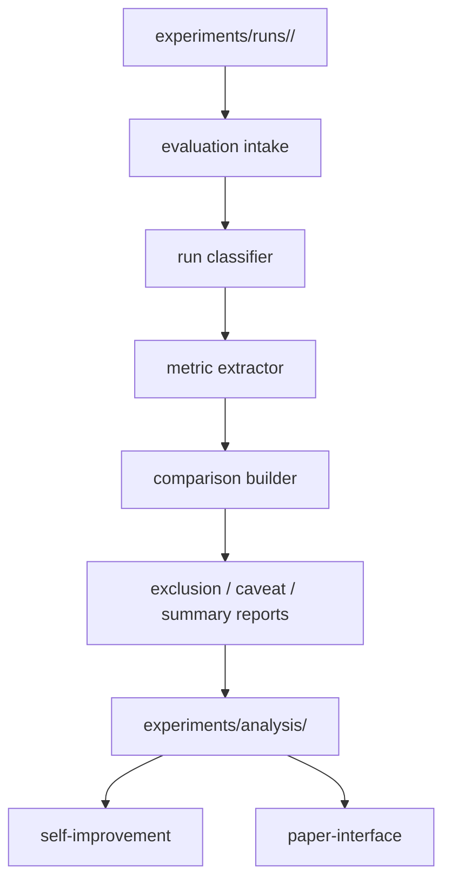

# Design Document

## Overview

`dual-reviewer-evaluation` は、runtime が生成した run artifact を読み取り、valid / invalid / exploratory の区分、比較可能な metrics、caveat 付き分析 artifact に変換する analysis layer である。

この design では、evaluation が raw run evidence を編集せず、`experiments/analysis/` 以下に derived artifact を生成する構造を定義する。

## Goals

- valid / invalid / exploratory を mechanical に切り分ける
- treatment と phase/profile を保ったまま比較可能な metrics を作る
- exclusion と caveat を first-class artifact として残す
- self-improvement と paper-interface が再解析なしで再利用できる analysis output を作る

## Non-Goals

- runtime artifact の修正
- prompt や orchestration の改善判断
- manuscript 本文の生成

## Design Drivers

- raw evidence は immutable
- invalid run は削除せず、標準 aggregate から除外する
- exploratory evidence は lifecycle ではなく evidence class として扱う
- `design` / `tasks` を主価値 phase とする仮説を検証可能にする

## Architecture

evaluation は `intake -> classification -> metric extraction -> comparison -> reporting` の 5 段に分ける。



### Components

- `evaluation intake`
  - runtime artifact の読込
- `run classifier`
  - valid / invalid / exploratory / blocked analysis の判定
- `metric extractor`
  - run-level / finding-level / treatment-level metric 生成
- `comparison builder`
  - treatment / phase-aware aggregate 構築
- `reports`
  - exclusion と caveat の明示 artifact 生成

## Analysis Artifact Layout

evaluation の正本出力先は次を採る。

```text
experiments/analysis/
├── imports/
│   ├── ingestion_register.json
│   └── admission_register.json
├── manifests/
│   └── analysis_run_manifest.yaml
├── classifications/
│   ├── run_classification_index.json
│   └── exclusion_report.json
├── metrics/
│   ├── run_metrics.json
│   ├── finding_metrics.json
│   └── treatment_metrics.json
├── comparisons/
│   ├── treatment_comparisons.json
│   └── phase_comparisons.json
└── caveats/
    └── caveat_register.json
```

### Placement Rationale

- `manifests/`
  - どの evaluation logic version で analysis を作ったかを記録
  - `input_run_set` に対する protocol-facing runtime validation summary coverage を記録
- `imports/`
  - imported bundle の intake / admission 履歴を保存
- `classifications/`
  - valid / invalid / exploratory の判定結果を保存
- `metrics/`
  - metric の単位ごとの出力を分離
- `comparisons/`
  - treatment / phase ごとの aggregate を分離
- `caveats/`
  - paper-interface や self-improvement が使う caveat registry を保持

### Analysis Population Selection

evaluation の default analysis population は、任意の run 寄せ集めではなく、再現可能な selection policy に基づいて選ぶ。

優先条件:

- `run_status=closed`
- standard intake complete
- protocol-facing validation summary available
- 同一 `case_id` / `phase_profile` 内で比較対象 treatment が揃う

これにより、paper-interface や self-improvement が protocol-backed analysis population を共有できるようにする。

## Intake Model

evaluation が 1 run から読む最小 artifact は次とする。

- `run_manifest.yaml`
- `review_case.json`
- `decisions/decision_units.json`
- `validation/validator_result.json`
- `validation/invalidation_markers.json`
- `derived/comparison_eligibility_note.json`

必要に応じて `steps/*.json` を読むが、標準的な aggregate は step raw body ではなく `review_case.json` と validation artifact を一次入力にする。

v2-compatible optional intake:

- `v2/review_artifact.json`
- `v2/metric_snapshot.json`
- `v2/trace_note.json`

ここでのルール:

- standard intake の正本は引き続き `review_case.json` と `decision_units.json` に置く
- `v2/review_artifact.json` は taxonomy-first 比較や移行期の補助入力として使ってよい
- optional intake を読めなくても standard analysis は成立する

### Portable Bundle Intake

central-side evaluation は in-repo local run directory だけでなく、portable evidence bundle も intake 対象に含める。

portable bundle intake の最小入力:

- `bundle_manifest.yaml`
- exported `run_manifest.yaml`
- exported `review_case.json`
- exported `decisions/decision_units.json`
- exported `validation/validator_result.json`
- exported `validation/invalidation_markers.json`
- exported `derived/comparison_eligibility_note.json`

optional imported bundle input:

- exported `v2/review_artifact.json`
- exported `v2/metric_snapshot.json`
- exported `v2/trace_note.json`

bundle に required provenance が欠ける場合、evaluation は intake を継続しても standard admission を与えない。

## Classification Model

### 1. Classification States

evaluation は run を次の 4 状態で扱う。

- `valid`
- `invalid`
- `exploratory`
- `analysis_blocked`

ここで `analysis_blocked` は foundation の `evidence_class` ではなく、evaluation 実行時に「分析に必要な入力が欠けていて標準処理不能」であることを示す local state である。

### 2. Classification Rules

- `valid`
  - `validator_status=passed`
  - `human_signoff_status` が終端状態
  - `evidence_class=valid`
- `invalid`
  - invalidation marker あり、または `validator_status=failed`
- `exploratory`
  - `evidence_class=exploratory`
- `analysis_blocked`
  - required evaluation input の不足
  - または `run_status != closed`

`analysis_blocked` は exclusion report には出すが、比較対象集団には入れない。

運用上の補足:

- `run_status != closed` の run は raw evidence が存在していても standard analysis population に入れない
- `created` や途中中断 run は `invalid` ではなく `analysis_blocked` として扱う
- `analysis_blocked` の主目的は「評価不能 run を valid/invalid 判定と混同しない」ことにある

`derived/comparison_eligibility_note.json` が存在する場合、evaluation はこれを classification 前の補助判断材料として読んでよい。ただし final の valid / invalid / exploratory 判定は、依然として metadata、validator 結果、invalidation artifact を基礎にする。

### Admission States for Imported Bundles

imported bundle は classification の前段で次の admission state を持つ。

- `admitted_standard`
- `admitted_exploratory`
- `rejected`

この admission state は run validity とは別に保持する。たとえば imported bundle が schema 的には読めても、provenance 不足で `admitted_exploratory` になることがある。

### 3. Missing vs Invalid

evaluation は次を区別する。

- missing
  - 必要入力がない
- invalid
  - 入力はあるが contract に違反している

これにより、「run が invalid なのか」「analysis 側の入力準備不足なのか」を分離する。

## Metric Model

### 1. Metric Tiers

metric は 3 tier に分ける。

- run-level
- finding-level
- treatment-level

### 2. Minimum Metric Set

初版 minimum metric set は次を想定する。

ただしこれは、現時点で主に `design` を中心に考えた baseline である。`requirements`、`tasks`、将来の `implementation-oriented review`、さらには `intent` まで含めると、同じ指標セットをそのまま主指標として使うのは不自然な場合がある。そのため evaluation は、

- phase 共通の core metric layer
- phase ごとの overlay metric layer

の 2 層で考える。

この 2 層構造の必要性は [INTENT.md](/Users/Daily/Development/Rwiki-dev/dual-reviewer-rebuild/intent/INTENT.md) にある価値命題を受けるものであり、overlay metric の具体定義と derived artifact への落とし込みは本 spec を正本とする。

- run-level
  - total findings
  - accepted findings
  - rejected findings
  - deferred findings
  - validation outcome
- finding-level
  - severity distribution
  - source-role distribution
  - judgment label distribution
- treatment-level
  - findings per run
  - acceptance ratio
  - judgment invocation coverage

この minimum set は後続 design alignment で refinement されうるが、foundation / runtime に追加 field を要求しない範囲で始める。

### 2.5 Phase-Specific Metric Overlays

phase ごとの主評価観点は次のように異なりうる。

- `intent`
  - goal ambiguity reduction
  - non-goal leakage detection
  - intent-to-requirement traceability support
- `requirements`
  - requirement inconsistency detection
  - scope drift detection
  - missing acceptance condition detection
- `design`
  - cross-section consistency
  - responsibility boundary defects
  - failure mode omission detection
- `tasks`
  - task coverage gap detection
  - ordering risk detection
  - unverifiable task decomposition detection
- `implementation-oriented review` (future)
  - change impact mismatch
  - test gap indication
  - unsafe patch recommendation detection

したがって、`design` 中心の baseline metric を全 phase の主指標と見なさない。共通比較のための core metrics は残すが、phase ごとに「何をもって有効とみなすか」は overlay として別に持つ。

### 3. Derivation Rule

metric は free-form summary からではなく、次の順で計算する。

1. metadata
2. structured findings
3. decision units
4. validation / invalidation artifacts

`derived/runtime_summary.json` は convenience artifact なので metric の正本入力にしない。

## Comparison Model

### 1. Treatment Comparison

standard comparison 軸:

- `single`
- `dual`
- `dual+judgment`

比較前に次を満たすことを確認する。

- target condition が一致
- phase/profile が比較可能
- protocol/runtime/prompt/schema version が比較可能
- `comparison_eligibility_note` に standard comparison 不可の理由があれば、それを先に尊重する

不一致なら `comparison_invalid_reason` を出し、aggregate しない。

### 2. Phase-Aware Comparison

phase-aware comparison は次を標準 slice とする。

- `intent`
- `requirements`
- `design`
- `tasks`

ただし初期検証の主関心は `design` と `tasks` に置く。これは system の価値証明の優先順位であって、全 phase が同一指標で測れることを意味しない。comparison artifact は phase identity を消さずに保持し、phase-specific overlay metric の選択も明示する。

### 3. Valid Population Rule

標準 comparative metrics は `valid` population のみで計算する。

`exploratory` は separate appendix-style aggregate として保持できるが、主比較に混ぜない。

## Exclusion and Caveat Model

### 1. Exclusion Report

`classifications/exclusion_report.json` は少なくとも次を持つ。

- `run_id`
- `classification`
- `reason_codes`
- `reason_details`
- `phase_profile`
- `treatment`

### 2. Caveat Register

`caveat_register.json` は exclusion とは別に、報告上残すべき caveat を持つ。

例:

- mixed maturity evidence
- exploratory only slice
- low sample size
- protocol drift across comparison set

これにより paper-interface は raw archive を再読せず caveat を継承できる。

## Imported Evidence Intake Artifacts

### 1. Ingestion Register

`imports/ingestion_register.json` は少なくとも次を持つ。

- `bundle_id`
- `run_id`
- `source_repository_id`
- `source_revision`
- `review_mode`
- `ingested_at`
- `ingestion_status`
- `missing_fields`

### 2. Admission Register

`imports/admission_register.json` は少なくとも次を持つ。

- `bundle_id`
- `run_id`
- `admission_status`
- `admission_reason_codes`
- `eligible_for_standard_comparison`
- `eligible_for_exploratory_analysis`

これにより central-side evaluation は imported evidence を raw local run と区別したまま扱える。

## Versioning Model

analysis artifact も versioned output とする。

`analysis_run_manifest.yaml` に最低限記録するもの:

- `analysis_logic_version`
- `input_run_set`
- `generated_at`
- `metric_set_version`
- `phase_metric_profile_version`
- `comparison_contract_version`

同じ raw run set でも analysis logic が変われば別 output として扱う。

## Interfaces to Downstream Features

### Self-Improvement

self-improvement は次を読む。

- `run_classification_index.json`
- `exclusion_report.json`
- `run_metrics.json`
- `finding_metrics.json`
- `caveat_register.json`

特に invalid / exploratory の分布は workflow defect 改善の入力になる。

### Paper-Interface

paper-interface は次を読む。

- `treatment_comparisons.json`
- `phase_comparisons.json`
- `exclusion_report.json`
- `caveat_register.json`

paper-interface は raw run directory を一次入力にしない。

## Key Decisions

### Decision 1: Evaluation never mutates run artifacts

分析は `experiments/analysis/` に分離する。

### Decision 2: Classification includes local blocked state

`analysis_blocked` を設けることで、runtime invalidity と evaluation insufficiency を区別する。

### Decision 3: Comparative metrics use valid population only

exploratory と invalid を黙って混ぜない。

### Decision 4: Caveats are first-class artifacts

後続 reporting のために limitation 情報も machine-readable に残す。

## Requirements Traceability

| Requirement | Design Response |
|------------|-----------------|
| Valid / invalid separation | classification model を定義 |
| Treatment comparison contract | treatment comparison preconditions を定義 |
| Metric extraction | 3 tier metric model を定義 |
| Exclusion and caveat reporting | exclusion report と caveat register を定義 |
| Derived artifact production | `experiments/analysis/` 配下の layout を定義 |
| Evaluation-ready metadata completeness | intake 必須 artifact と `analysis_blocked` を定義 |
| Phase-aware evaluation | phase comparison slice を定義 |
| Phase-specific effectiveness metrics | core metric layer と phase-specific overlay を定義 |

## Open Issues for Design Alignment Gate

- treatment-level minimum metric set の最終確定
- phase-specific overlay metric set の初版確定
- exploratory aggregate をどこまで標準化するか
- self-improvement 向けに必要な finding-level detail の追加有無
- paper-interface 向け comparison artifact の field naming

## Completion Criteria

- raw run と analysis artifact の境界を説明できる
- valid / invalid / exploratory / analysis_blocked の違いを説明できる
- metrics と caveat がどこに出るか説明できる
- self-improvement と paper-interface がどの analysis artifact を読むか追跡できる
