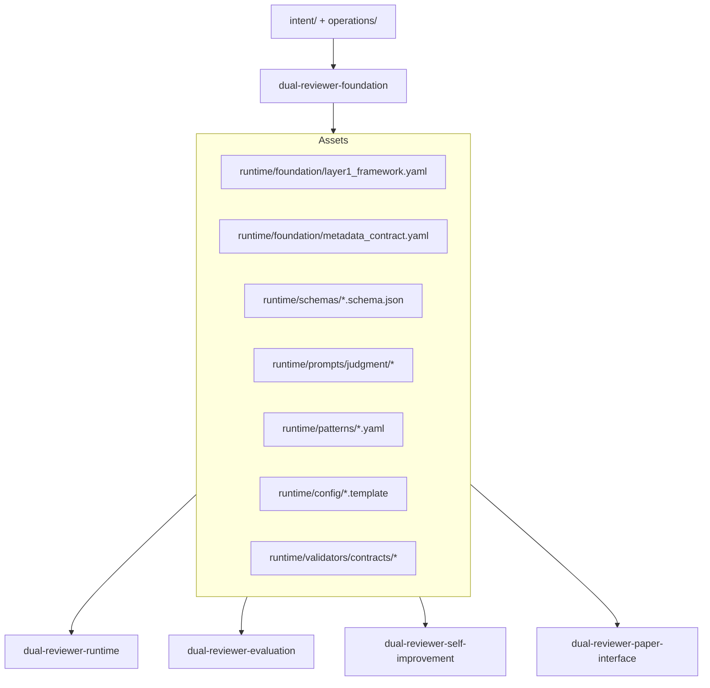
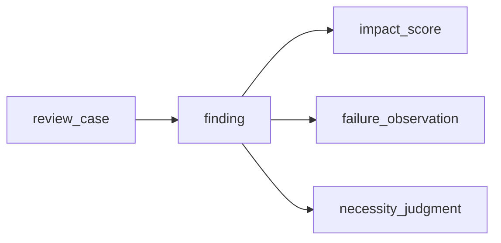

# Design Document

## Overview

`dual-reviewer-foundation` は、`dual-reviewer-rebuild` 全体で共有される最下層 contract を artifact と配置規約の形で固定する spec である。

この spec の役割は runtime を動かすことではない。runtime、evaluation、self-improvement、paper-interface が同じ前提に立てるように、以下を repo 内 artifact として定義する。

- Layer 1 review contract
- shared schema set
- prompt artifact placement and identity rule
- pattern and terminology assets
- validator-readable metadata contract

再構築の主眼は、旧 prototype の有用な資産を引き継ぎつつも、`repo-contained runtime`、`protocol first`、`trust boundary separation` を満たす foundation に引き直すことにある。

## Goals

- 共通 artifact の正本を `dual-reviewer-rebuild` repo 内に集約する
- runtime / evaluation / self-improvement が同じ schema と metadata を参照できるようにする
- prompt、pattern、template を hidden operator knowledge ではなく versioned artifact にする
- validator が valid / invalid / exploratory 判定に必要な情報を metadata だけで読み取れるようにする
- replay と backtest に必要な最低限の step-level identity を foundation で確保する

## Non-Goals

- review session orchestration の設計
- phase ごとの review emphasis の具体化
- metrics 抽出や比較分析 logic の設計
- paper-facing report の設計
- self-improvement proposal の採否 workflow の設計

これらはそれぞれ `runtime`、`evaluation`、`paper-interface`、`self-improvement` の責務である。

## Design Drivers

この design は、上位文書と requirements wave から次の制約を受ける。

- LLM の自然言語出力は正本ではなく、schema と metadata を満たした evidence だけを system contract として扱う
- raw evidence は immutable とし、validator 結果や invalidation は別 artifact として重ねる
- prompt は skill に埋め込まず、repo 内 artifact として version 管理する
- `design` / `tasks` が高価値 phase であるため、foundation でも phase/profile identity を run metadata に保持する
- multi-feature alignment の観点から、`run_status` と `evidence_class` の責務を分離する

## Architecture

foundation は `runtime/` 配下の shared asset layer を所有し、後続 feature はそこを import する。

また foundation は、review system 全体の知識層のうち `general layer` を担う。つまり、

- general layer
  - foundation が所有する review contract と shared schemas
- meta layer
  - cross-project 再利用可能な pattern assets
- project-specific layer
  - 後続 feature が evidence から抽出して蓄積する concrete patterns

の 3 層のうち、foundation は主に最初の 2 層の土台を作る。

### Boundary Clarification

foundation が所有するのは `shared contract` であり、`shared execution` ではない。

foundation に置くもの:

- canonical step names
- role abstraction
- metadata field definitions
- schema shapes
- prompt placement and identity rules
- pattern / template placement rules

runtime に委ねるもの:

- step の実行順序制御
- treatment ごとの step 実行有無
- phase/profile ごとの review emphasis の具体挙動
- run directory layout と step file naming
- prompt override の選択順序
- evidence write timing と validation invocation timing

この線引きを越えて foundation に runtime-specific convenience を入れない。



設計上の中心は、artifact の責務を以下のように分離することにある。

- `framework`
  - review pipeline と role abstraction の論理 contract
- `metadata_contract`
  - validator と evaluation が読む run-level field 定義
- `schemas`
  - raw evidence の構造定義
- `prompts`
  - role / step に紐づく prompt artifact
- `patterns`
  - reusable knowledge assets
- `config`
  - operator-visible template
- `validators/contracts`
  - validator 実装が従う validation / invalidation artifact の shape

## Shared Artifact Layout

foundation が所有する concrete artifact 配置は次を正本とする。

```text
runtime/
├── foundation/
│   ├── layer1_framework.yaml
│   └── metadata_contract.yaml
├── schemas/
│   ├── review_case.schema.json
│   ├── finding.schema.json
│   ├── impact_score.schema.json
│   ├── failure_observation.schema.json
│   └── necessity_judgment.schema.json
├── prompts/
│   └── judgment/
│       └── judgment_reviewer.prompt.md
├── patterns/
│   ├── seed_patterns.yaml
│   └── fatal_patterns.yaml
├── config/
│   ├── config.yaml.template
│   └── terminology.yaml.template
└── validators/
    └── contracts/
        ├── validator_result.schema.json
        └── invalidation_marker.schema.json
```

### Placement Decisions

1. `runtime/foundation/`
   - foundation 固有の論理 contract を置く
   - code ではなく data-first artifact として扱う

2. `runtime/schemas/`
   - raw evidence schema の単一配置とする
   - runtime と evaluation が path 解決で迷わないようにする

3. `runtime/prompts/judgment/`
   - prompt を role / purpose 単位で配置する
   - skill や runtime module はここから読むだけにする

4. `runtime/patterns/`
   - pattern を code から切り離した data source とする

5. `runtime/validators/contracts/`
   - validator 実装の code とは分けて、validation artifact の shape だけを foundation が固定する

## Domain Model

### 1. Layer 1 Review Contract

`layer1_framework.yaml` は runtime 実装の詳細ではなく、全 treatment / 全 phase で共有される review state machine を定義する。

含める top-level section は次の通りとする。

- `version`
- `roles`
- `step_pipeline`
- `step_intents`
- `required_metadata_refs`
- `asset_locations`
- `override_policy`

`step_pipeline` は Step A/B/C/D の canonical 名称だけを固定する。

- Step A: `primary_detection`
- Step B: `adversarial_review`
- Step C: `judgment`
- Step D: `integration`

ここでは retry、subagent dispatch、human interaction timing は定義しない。これらは runtime design の責務とする。

### 2. Role Abstraction

role は abstract name のみを foundation で固定する。

- `primary_reviewer`
- `adversarial_reviewer`
- `judgment_reviewer`

model vendor や concrete model 名は config に退避し、framework definition と schema field には出さない。

### 3. Run Metadata Contract

`metadata_contract.yaml` は run-level metadata の field list、enum、責務分離を定義する。

設計上もっとも重要なのは、`run_status` と `evidence_class` を分離する点である。

- `run_status`
  - runtime lifecycle を表す
- `validator_status`
  - mechanical validation の結果を表す
- `human_signoff_status`
  - operator decision の状態を表す
- `evidence_class`
  - downstream consumption 上の区分を表す

これにより、「実行は閉じたが invalid」「実行は閉じたが exploratory」「human sign-off は未完了」といった状態を混同しない。

必須 field は次を初版とする。

| Field | Purpose |
|------|---------|
| `run_id` | run の安定識別子 |
| `target_id` | review 対象識別子 |
| `target_artifact_hash` | 対象固定のための hash |
| `source_repository_id` | evidence が採取された repository の識別子 |
| `source_revision` | evidence 採取時の source revision |
| `phase_profile` | `intent` / `requirements` / `design` / `tasks` |
| `treatment` | `single` / `dual` / `dual+judgment` |
| `review_mode` | `manual_dogfooding` / `runtime_mediated` などの mode |
| `protocol_version` | protocol drift 防止 |
| `runtime_version` | runtime 挙動追跡 |
| `schema_set_version` | schema 群の整合追跡 |
| `prompt_set_version` | prompt 群の整合追跡 |
| `run_status` | lifecycle 状態 |
| `validator_status` | validation pass/fail |
| `human_signoff_status` | sign-off 状態 |
| `evidence_class` | `candidate` / `valid` / `invalid` / `exploratory` |
| `started_at` | run 開始時刻 |
| `closed_at` | run 終了時刻 |

初版 enum は次を採る。

- `run_status`
  - `created`
  - `in_progress`
  - `closed`
  - `orchestration_failed`
- `validator_status`
  - `not_run`
  - `passed`
  - `failed`
- `human_signoff_status`
  - `pending`
  - `approved`
  - `rejected`
  - `deferred`
- `evidence_class`
  - `candidate`
  - `valid`
  - `invalid`
  - `exploratory`

`candidate` は runtime close 直後の未確定状態を表し、`validator_status` と `human_signoff_status` が揃った後に `valid` / `invalid` / `exploratory` へ遷移する。

cross-project intake を見据えた provenance field の役割分担:

- `source_repository_id`
  - どの local repository で evidence が採取されたか
- `source_revision`
  - どの source revision で evidence が採取されたか
- `target_id`
  - review 対象 artifact の識別子
- `target_artifact_hash`
  - review 対象 artifact 自体の固定子

これにより、「どの repo のどの revision で、どの target を review した evidence か」を foundation metadata だけで最低限追跡できる。

### 4. Shared Schema Relationships

foundation が所有する 5 schema の関係は以下の通りとする。



#### `review_case`

run-level envelope。

責務:

- run metadata を持つ
- step record 境界を持つ
- finding 群を束ねる
- validation / invalidation artifact への参照を持つ

`review_case` は raw evidence を破壊せずに再利用できるよう、derived metrics を持たない。

#### `finding`

最小 review evidence unit。

必須に近い field は次を想定する。

- `finding_id`
- `step_id`
- `source_role`
- `severity`
- `summary`
- `source_refs`
- `counter_evidence_refs`
- `judgment_ref`
- `decision_unit_id`
- `human_decision_ref`

ここで `decision_unit_id` と `human_decision_ref` を持たせることで、runtime の human decision integration と foundation schema を接続する。

#### `impact_score`

finding の影響度を構造化する補助 schema。意味論の最適化は evaluation に渡し、foundation では field 形状のみを固定する。

#### `failure_observation`

review miss や disagreement の構造を表す schema。self-improvement の replay / backtest で重要になるため、finding と分離した独立 schema とする。

#### `necessity_judgment`

Step C の出力単位。必要性 5-field と final label を表す。

foundation は以下を固定する。

- 5-field structure
- final label
- recommended action
- optional override reason

judgment の質の評価や policy は runtime / evaluation に委ねる。

### 5. Step-Level Replay Model

replay granularity は `run 全体` ではなく `step-level within run` を最小単位とする。

理由:

- self-improvement では Step B や Step C のみを再検討したい場合がある
- treatment 差分を run 丸ごとではなく step 単位で比較したい
- `design` / `tasks` review では特定 step の failure mode を分離したい

そのため foundation は、`review_case` 内で少なくとも次を参照可能にする。

- `step_id`
- `step_name`
- `step_status`
- `step_prompt_artifact_id`
- `step_started_at`
- `step_closed_at`

runtime は後続 design で concrete storage を決めるが、foundation では「step 単位で再演可能な identity を残す」ことだけを contract として固定する。

### 6. Prompt Artifact Model

prompt は plain text ではなく frontmatter 付き Markdown artifact とする。

理由:

- version identity を prompt 自身に持たせられる
- diff が読みやすい
- `source`, `role`, `step`, `language` を明示できる

`judgment_reviewer.prompt.md` の frontmatter は少なくとも次を持つ。

- `prompt_id`
- `version`
- `role`
- `step`
- `language`
- `source_ref`

本文は prompt body とし、runtime は frontmatter を parse した上で本文を LLM に渡す。

foundation は prompt の canonical placement と identity rule を定義するが、実際の prompt selection policy は runtime が持つ。

### 7. Pattern and Terminology Assets

`seed_patterns.yaml` と `fatal_patterns.yaml` は runtime logic ではなく data source として扱う。

両者に共通するルール:

- top-level `version` を持つ
- artifact 自体が正本であり、code に同内容を埋め込まない
- matching logic は持たない

差分は次の通り。

- `seed_patterns.yaml`
  - 初期は reusable seed knowledge
  - 中長期的には meta layer pattern asset の置き場
  - mutable だが version 増分必須
  - reusable fragment cue は section heading、section class、review focus、bullet ordinal のような structural cue に anchored し、pilot-case basename に依存しない
- `fatal_patterns.yaml`
  - policy-sensitive baseline
  - 初期再構築では stable baseline として扱う

`terminology.yaml.template` は empty initial state を持つ template とし、operator memory の代替ではなく repo-contained accumulation point とする。

ここで重要なのは、pattern を 1 枚岩として扱わないことだ。foundation design 上の原則は次である。

- general layer
  - pattern を読む仕組みと placement rule
- meta layer
  - project 横断で再利用可能な抽象 pattern
- project-specific layer
  - review log から抽出された concrete pattern

初期段階では `seed_patterns.yaml` を meta layer 寄りの asset として扱い、project-specific concrete は後続の self-improvement / learning artifact で蓄積する。
つまり foundation-owned pattern asset には generic seed だけを置き、pilot-case で得た concrete cue や learned pattern を generic runtime の hidden default にしない。

### 8. Validation and Invalidation Model

raw evidence は immutable とし、validation 結果と invalidation は別 artifact に保存する。

foundation では次の 2 artifact shape を固定する。

- `validator_result.schema.json`
  - validation 実行結果
- `invalidation_marker.schema.json`
  - invalidation reason と scope

責務分離は次の通り。

- raw evidence
  - runtime が生成
- validator result
  - validator が生成
- invalidation marker
  - validator または明示的 human process が生成

`invalidation_marker` は少なくとも次の field を持つ。

- `run_id`
- `reason_code`
- `reason_detail`
- `scope`
- `issued_by`
- `issued_at`

`scope` は初版で以下を想定する。

- `run`
- `step`
- `finding`

これにより、全部無効化と部分無効化を同じ artifact 形式で扱える。

### 9. Exploratory Handling

cross-spec alignment で残っていた `exploratory` の formal placement は、foundation では `evidence_class` に置く。

理由:

- exploratory は runtime lifecycle ではない
- validator pass/fail とも別概念である
- evaluation が default aggregate から外す対象として機械的に扱いやすい

したがって、`run_status=closed` かつ `validator_status=passed` であっても、`evidence_class=exploratory` は成立しうる。

### 10. Config and Template Model

`config.yaml.template` は runtime input contract の最小雛形であり、operator-visible であることを前提にする。

初版 template が少なくとも表現すべき項目は次の通り。

- role ごとの model identifier
- project language
- protocol version
- evidence output location
- default phase/profile

`terminology.yaml.template` は空でも成立するが、`version` と `entries` を持つ。entries の具体的運用は runtime / self-improvement 側で積み上げる。

## Interface Decisions

### Decision 1: Prompt is artifact, not skill body

skill は orchestration entrypoint に留め、prompt 正本は repo 内 artifact にする。

### Decision 2: Lifecycle and quality classification are separate

`run_status` と `evidence_class` を分けることで、runtime failure、validation failure、exploratory run を別扱いにする。

### Decision 3: Human linkage lives at finding level

approval unit の追跡を可能にするため、`finding` は `decision_unit_id` と `human_decision_ref` を持つ。

### Decision 4: Invalidation annotates, never rewrites

無効化は raw evidence の修正ではなく、別 artifact の付与として表現する。

### Decision 5: Replay starts at step identity

再生の最小単位は step とし、run 全体 replay はその集合として扱う。

## Requirements Traceability

| Requirement | Design Response |
|------------|-----------------|
| State machine contract | `runtime/foundation/layer1_framework.yaml` で Step A/B/C/D と role intent を固定 |
| Role/config abstraction | abstract role 名と config template を分離 |
| Shared schema set | `runtime/schemas/` に 5 schema を集約 |
| Canonical prompt placement | `runtime/prompts/judgment/judgment_reviewer.prompt.md` を正本化 |
| Pattern and terminology assets | `runtime/patterns/` と `runtime/config/terminology.yaml.template` を定義 |
| Validator-oriented metadata | `metadata_contract.yaml` と validator contracts を定義 |
| Repo-contained asset rule | 全 artifact を repo 配下に固定し external memory を排除 |

## Impact on Downstream Specs

- `runtime`
  - prompt resolution、step record、run close validation をこの design に従って実装する
- `evaluation`
  - `evidence_class`、`phase_profile`、validator artifact を入力に使う
- `self-improvement`
  - step-level replay と `failure_observation` を入力に使う
- `paper-interface`
  - raw evidence ではなく evaluation 由来 artifact を利用する

## Open Issues Deferred to Later Specs

- phase/profile ごとの review emphasis matrix
- concrete run directory layout
- validator implementation language と execution entrypoint
- evaluation minimum metric set の確定

これらは foundation の contract を前提に、後続 spec の design alignment gate で決める。

## Completion Criteria

この design は、少なくとも以下を満たすときに有効とみなす。

- foundation asset の配置先が一意に説明できる
- metadata field の責務分離が説明できる
- invalidation と validation が raw evidence を汚さないと説明できる
- downstream 4 spec がどの artifact を import するか追跡できる
