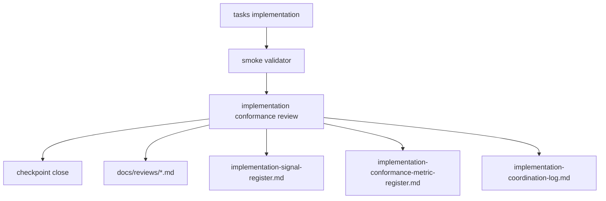

# Design Document

## Overview

`dual-reviewer-implementation-governance` は、implementation completion を
`task 完了 + smoke pass` だけで閉じないための governance layer である。

この spec が所有するのは review logic ではなく、review procedure と evidence contract である。

具体的には次を repo-contained artifact として固定する。

- intent review procedure linkage
- reference-free case bootstrap linkage
- conformance review procedure
- conformance metric register
- phase-review metric register
- intent review template
- conformance review template
- reference-free bootstrap guide
- implementation protocol/snapshot templates
- concrete intent review artifacts
- concrete review artifacts
- governance artifact validator
- workflow gate status artifact
- governance cross-spec alignment memo

## Goals

- implementation 後の横断 review を workflow contract として formalize する
- finding を会話ではなく repo 内 artifact として残す
- signal / coordination / review artifact を接続する
- conformance review 自体を測る metric を持つ
- review governance を repo-contained validation で再確認できるようにする

## Non-Goals

- runtime や evaluation の nonconformance 自体を自動修正すること
- human reviewer の組織運用
- external CI や GitHub workflow の設計
- feature spec の artifact ownership を変更すること

## Design Drivers

- prototype 実装後に smoke pass でも nonconformance が残りうる
- approval/adoption、provenance、caveat linkage は silent weakening を許容しない
- docs を増やすだけでなく、最低限の mechanical validation が必要
- 既存の `implementation-coordination-log` と `implementation-signal-register` を再利用し、review silo を作らない

## Architecture

governance feature は feature logic graph に新しい data producer を追加しない。
代わりに implementation checkpoint に対して post-stage gate を追加する。

### Owned Artifacts

- `docs/coordination/implementation-conformance-review.md`
  - procedure definition
- `docs/coordination/implementation-conformance-metric-register.md`
  - metric definitions
- `docs/coordination/phase-review-metric-register.md`
  - phase-level metric definitions
- `docs/reviews/templates/intent-review-template.md`
  - reusable intent review template
- `docs/reviews/templates/implementation-conformance-review-template.md`
  - reusable artifact template
- `docs/reviews/*.md`
  - concrete intent / conformance review evidence
- `scripts/validate_implementation_governance_artifacts.rb`
  - governance artifact validator
- `docs/coordination/workflow-gate-status.md`
  - current workflow gate status
- `docs/alignment/cross-spec-implementation-governance-alignment.md`
  - governance-specific alignment memo
- `scripts/bootstrap_reference_free_case.rb`
  - reference-free bootstrap entrypoint
- `.kiro/methodology/dual-reviewer-spec-driven-paper/reference-free-case-bootstrap-guide.md`
  - new case bootstrap procedure
- `.kiro/methodology/dual-reviewer-spec-driven-paper/implementation-phase-protocol-template.md`
  - reference-free implementation protocol template
- `.kiro/methodology/dual-reviewer-spec-driven-paper/implementation-phase-snapshot-template.md`
  - reference-free implementation snapshot template
- `experiments/protocols/heuristic_profiles/README.md`
  - minimal heuristic policy note
- `experiments/protocols/heuristic_profiles/*/_minimal_template.yaml`
  - track-default heuristic templates

### Review Template Required Sections

validator（要件 5 受入 3）が存在確認する必須セクション名を確定する。

`docs/reviews/templates/intent-review-template.md` の必須セクション（Stage 0 の reviewer 作業に対応）：

- Reviewed Intent Documents
- Traceability Check
- Handback Decision（`D` handback 要否）
- Intent Metric Snapshot（`intent_revision_count` / `intent_handback_count`）

`docs/reviews/templates/implementation-conformance-review-template.md` の必須セクション（要件 2 受入 2 の最小内容集合に対応）：

- Reviewed Scope
- Reviewed Commit or Branch
- Validation Rerun Summary
- Findings
- Severity
- Recommended Action
- Disposition Summary

concrete review artifact（`docs/reviews/*.md`）は対応するテンプレートの上記必須セクションをすべて備える。

artifact 種別判別機構：各 `docs/reviews/*.md` は front-matter に `type` フィールドを持ち、値は `intent_review` または `conformance_review` のいずれかとする。validator はこの `type` で適用する必須セクション集合（上記 2 種）を選択する。`type` が無い、または未知値の artifact は validator が不適合として扱う。

### Boundary Clarification

この spec が所有するのは completion gate であり、feature artifact の ownership ではない。

- foundation/runtime/evaluation/self-improvement/paper-interface
  - review 対象
- implementation-governance
  - review procedure と evidence contract の owner

## Workflow Model

### Stage -1: Reference-Free Case Bootstrap

新しい case は、既存 pilot case のコピーから始めない。

bootstrap stage では次を固定する。

- upstream intent source
- canonical source
- umbrella `intent.md`
- umbrella `spec.json`
- case workflow overlay
- active worklist
- workflow path

この stage の役割は case content を完成させることではなく、
`intent gate` に入るための最小 control artifact を repo 内に作ることにある。

bootstrap で再利用してよいのは template と gate structure だけであり、
case 固有の stress、scope、risk は supplied source document から書き起こす。

### Stage 0: Intent Review

workflow の最上流には `intent review` を置く。

reviewer は次を行う。

- reviewed intent documents の固定
- traceability document の確認
- `D` handback 要否の判定
- `intent_revision_count` と `intent_handback_count` の snapshot 記録

`intent review` は下流 phase issue の総件数を吸い上げない。
下流 phase で見つかった issue のうち、原因が intent の再解釈や不整合にあるものだけを
`intent-attributed issue` として downstream artifact 側に残す。

### Minimal Heuristic Default Rule

workflow owner としての governance は、heuristic profile の増殖を抑える。

- case manifest に `heuristic_profile_ref` が無い場合
  - runtime は track-specific minimal template を使ってよい
- case 固有 heuristic は
  - approved source に anchored した review-critical contract が明確なときだけ追加する
- heuristic default 挙動と minimal template 語彙の canonical owner は v2-acquisition spec とする（要件 8 受入 6）。governance はこれを参照するが所有せず、v2-acquisition spec が語彙を確定するまで governance validator はこれら heuristic template 実体を必須検査しない

これにより、新規 case の最初の run は pilot-case copied heuristic ではなく、
repo-contained minimal default から始まる。

### Stage 1: Implementation

task plan に従って artifact を実装する。

### Stage 2: Relevant Smoke Validation

feature ごとの validator や smoke script を再実行し、
current branch 上での mechanical pass を確認する。

### Stage 3: Implementation Conformance Review

reviewer は次を行う。

- review scope の固定
- rerun summary の記録
- spec / design / dependency map との照合
- finding 起票
- severity / disposition の付与
- signal / coordination への接続
- metric snapshot の記録

`implementation conformance review` を実行すべきタイミングは次を最低限とする（要件 1 受入 3）。

- プロトタイプ完了時（線形フロー上の既定の実行点）
- pre-push または pre-PR チェックポイント時
- trust boundary / invalidation / provenance / 承認・採用ロジック のいずれかを変更した後

これらは「変更起因トリガー（変更後の再実行）」と「事前チェックポイント（push/PR 前）」を含み、線形フロー 1 回限りに閉じない。

### Stage 4: Checkpoint Close

checkpoint close の条件は次のいずれかである。

- finding 0 件
- finding は存在するが review artifact と disposition を伴って明示されている

ただし `P1` が open の場合は、次 feature 開始前修正の対象として扱う。

## Workflow Status Model

governance 追加後は、checkpoint status を単なる `completed` ではなく、
少なくとも次で区別する。

- `pending`
- `in_progress`
- `completed`
- `completed_with_open_findings`
- `reopen_required`

`implementation conformance review` まで進んだが open finding が残る場合は
`completed_with_open_findings` とする。

## Cross-Spec Alignment Model

governance spec のように completion rule を横断的に変える変更は、
単体 spec 実装だけでは閉じない。

最低限次を要求する。

- governance-specific cross-spec alignment memo
- workflow gate status artifact の更新
- `spec.json` 上の alignment status 更新

## Reopen Propagation Model

上流 phase の変更は、下流 phase の completed 状態を保持したままにしない。

- `design` 修正
  - `tasks` を reopen 対象にする
- `requirements` 修正
  - `design` と `tasks` を reopen 対象にする
- `intent` 修正
  - 影響 feature の `requirements`、`design`、`tasks`、必要なら `implementation` を reopen 対象にする

特に intent 変更は、local patch ではなく workflow 再進入の起点として扱う。

## Finding Model

severity は `P1 / P2 / P3` を使う。

- `P1`
  - approval/adoption
  - trust boundary
  - invalidation
  - provenance
  の破綻
- `P2`
  - fixture-bound、hard-coded、heuristic linkage などの brittle point
- `P3`
  - traceability や maintainability を弱めるが即時破綻ではないもの

各 finding は少なくとも次を持つ。

- scope
- file reference
- description
- impact
- recommended action
- handback assessment
- status

### Finding → Signal Register Mapping

各 finding は `implementation-signal-register` へ次の規則で写像する（要件 4 受入 1）。

- `source_finding_ref` ← finding の識別子
- signal の対象領域 ← finding の `scope` と `file reference`
- signal の要約 ← finding の `description` と `impact`
- signal の優先度 ← finding の severity（`P1` / `P2` / `P3`）
- signal の `status` ← finding の `status`

severity 別の接続先：

- `P1`：signal register へ記録し、加えて Stage 4 の P1 ブロック経路（次 feature 開始前修正）に接続
- `P2` / `P3`：軽微 signal として signal register に記録する

handback assessment を持つ finding は本写像に加え handback クラス（A/B/C・intent）にも接続する（要件 4 受入 2 との整合）。

## Handback Model

governance は implementation finding を少なくとも 4 段で扱う。

- `A`
  - task-local adjustment
- `B`
  - design handback
- `C`
  - requirements handback
- `D`
  - intent handback

`D` は requirements より上位の意図不整合を表し、
少なくとも `intent -> requirements -> design -> tasks` の連鎖 reopen を引き起こす。

## Metric Model

metric register は review 自体を測る。

最低限の baseline metric:

- `conformance_findings_count`
- `severity_weighted_finding_score`
- `post_smoke_nonconformance_count`
- `fixture_bound_resolution_count`
- `heuristic_linkage_count`
- `placeholder_or_deferred_count`
- `review_artifact_presence_rate`
- `finding_to_signal_link_rate`

prototype 段階では manual snapshot を許容する。

phase-review metric register は phase progression 全体を測る。

- `intent`
  - `intent_revision_count`
  - `intent_handback_count`
- `requirements / design / tasks / implementation`
  - phase-local issue count
  - recheck count
  - handback count
  - `intent-attributed issue` count

これにより、`intent` phase 自体の変更回数と、
下流 phase で観測された intent 起因問題を分離して扱う。

phase-review metric register の段階語彙（`implementation` を含む）は governance 所有であり、runtime 所有の phase/profile 審査語彙とは別物である。下流の evaluation / paper-interface は runtime の phase/profile slice に `implementation` を期待しない（要件 7 受入 7）。

## Validation Model

governance artifact validator は次を確認する。

- procedure doc の存在
- metric register の存在
- phase-review metric register の存在
- intent review template の存在
- review template の存在
- concrete intent review artifact の required section
- review artifact の required section
- metric snapshot の required keys

validator は finding の妥当性そのものは判定しない。
artifact completeness と structure のみを担う。

Requirement 9 による検査拡張（authority-map からの段集合の独立再導出・台帳突合・fail-closed・通過マーカー確認等）は、本節の上位集合として「Workflow Execution Ledger and Enforcement Model」小節 7 に定義する。本節単独では Requirement 1〜8 の governance artifact 検査範囲を、小節 7 が Requirement 9 ぶんを担う。

## Workflow Execution Ledger and Enforcement Model

本節は Requirement 9（受入 1〜11）の設計である。既存 Requirement 1〜8 の設計は不変。

### Owned Artifacts（Requirement 9 追加分）

- `docs/coordination/workflow-execution-ledger-template.md` — 実行台帳テンプレート。必須欄＝stage name / SoT citation（文書+節）/ completion predicate / independence requirement。
- `docs/coordination/ledgers/<process_id>-<date>.md` — prescribed workflow process ごとの台帳インスタンス（着手前に正本から新規生成）。
- `docs/coordination/workflow-process-authority-map.md` — prescribed workflow process → 段集合の単一権威ソース文書の対応表（AC10）。
- `scripts/validate_implementation_governance_artifacts.rb` の拡張モード（Requirement 5 entrypoint の上位集合。AC5）。

### 1. Prescribed Workflow Process と台帳生成

`prescribed workflow process` の定義は requirements Requirement 9 を正本参照する（`operations/WORKFLOW_OVERVIEW.md` が規定する phase execution / review wave / alignment gate / reopen procedure / cross-spec alignment。`CONVENTIONS.md` 節 3 の `phase` 語とは別概念）。各 process は、起草または実質作業の前に、`workflow-process-authority-map.md` が一意指定する権威ソース文書から段集合を導出し、台帳インスタンスを新規生成する（AC1・AC10）。台帳各行は stage / SoT citation / completion predicate / independence requirement を持つ（AC2）。台帳には導出元 provenance（権威ソースの識別子・版・ハッシュ）を記録する。

### 1.1 既存台帳の扱い（冪等性・陳腐化・改竄）

既存台帳を黙って再利用も黙って上書きもしない。着手時、生成器はまず権威ソースから段集合を新規導出する。既存台帳がある場合、(a) 台帳記録の導出元 provenance が現在の権威ソースと一致、(b) 構造検査に合格、(c) AC5 の独立再導出の段集合と一致、の **すべてを満たすときのみ** 正当な再開として継続記録に用い（作り直さず冪等に追記）、いずれか満たさない場合は陳腐化／改竄とみなし fail-closed で遮断する（AC11 の帰結）。遮断時、旧台帳は削除せず証跡として保全し、人手の理由記録付きで新台帳を生成して旧台帳を `supersedes`（置換元参照）でリンクする（破壊的上書き禁止、監査の足跡を残す）。これは要件文面の変更を要さず設計で挙動を確定するもの。

### 1.2 authority-map の構造と process 階層

prescribed workflow process は 2 階層で識別する。

- **workflow-level process**（ワークフロー全体に及ぶ。phase 非分割）：`reopen-procedure`、`cross-spec-alignment`。
- **phase-level process**（workflow-level の下層。spec phase に紐づき phase 別に分割）：spec phase ∈ {`intent` / `requirements` / `design` / `tasks` / `implementation`} の各々について `<phase>-phase-execution`、`<phase>-review-wave`、`<phase>-alignment-gate`。

`workflow-process-authority-map.md` の各行スキーマは次とする。

- `process_id` — 上記値域（workflow-level は単一名、phase-level は `<phase>-<process-type>`）
- `authority_document_path` — 段集合の権威ソース文書の repo 相対パス（単一。AC10）
- `authoritative_section` — 当該 process の段集合が記された節（見出しまたは節番号で一意特定）
- `stage_extraction_rule` — `authoritative_section` 内の段集合は番号付き stage 見出しの単一リストとして機械抽出する（D5-1 の確定書式と一体。曖昧時 fail-closed）

独立再導出器は authority-map の行から `authority_document_path` の `authoritative_section` を一意特定し、`stage_extraction_rule` で段集合を抽出して台帳と突合する。provenance の照合対象は `authoritative_section`（全文ではない。後述 1.3）。

### 1.3 provenance の値域

台帳の導出元 provenance は次の確定値域を持つ。

- `authority_path` — 権威ソース文書の repo 相対パス（authority-map の `authority_document_path` と一致）
- `authoritative_section_id` — authority-map の `authoritative_section`（節見出しまたは節番号）
- `section_content_hash` — `authoritative_section` の本文を正規化（行末・連続空白・前後空白を正規化）したうえでの content hash。**文書全文ではなく当該節のみ**を対象とする（無関係節の編集で全 process 台帳が陳腐化扱いになる形骸化を回避）。ハッシュアルゴリズムの具体は実装段で確定。
- 補助として権威文書の git commit を併記してよいが、一致判定の正本は `section_content_hash` とする。

小節 1.1 の再開条件 (a)「provenance 一致」は、台帳記録の `section_content_hash` と、現在の `authoritative_section` から同一正規化規則で再計算した hash の一致で機械判定する。不一致は陳腐化／改竄として fail-closed（小節 1.1）。

### 2. Completion Predicate

各段の完了判定は repo 内証跡 artifact の存在＋構造適合で定義し、主張や体裁では満たせない（AC3）。構造適合検査は Requirement 5 の必須セクション／metric キー検査と同型で、AC5 の entrypoint はその上位集合（別建てにしない）。

### 3. Independence Model

横断・横段の alignment 段の証跡は起草者と独立したプロセスで生成し、台帳に independent-production marker を残す（AC4。`CONVENTIONS.md` 節 8.4 の 3 役独立性と整合）。AC5 の独立再導出は、台帳生成ロジック・解析結果を共有せず、権威ソースを一次資料として独立に再パースして段集合を再導出し台帳と突合、欠落段を validation failure とする。

independent-production marker は台帳内の自己申告文字列ではなく、独立プロセスが生成した証跡 artifact（横断・横段整合段の独立レビュー成果物等、`docs/reviews/` または `docs/coordination/` 配下の実体）への必須リンク欄として定義する。independence requirement の completion predicate は「リンク先の独立証跡 artifact が存在し、小節 2 と同型の構造適合を満たすこと」とする。リンク欠落・リンク先不在・構造不適合は独立性未充足＝fail-closed。これにより marker の自己申告偽装を排除し、独立性を証拠 artifact で裏付ける（AC3 と同型）。

### 4. Enforcement Point

不可逆ワークフロー操作の最小集合を次と定める：spec.json の `approvals`／`phase` 書き込み、`workflow-gate-status.md` の status 遷移書き込みおよび reopen イベント追記、cross-spec alignment memo の確定、phase evidence summary／gate package の生成・提示。これらの直前で判定する（AC6。具体フック配線は tasks／implementation だが捕捉対象集合は本設計で閉じる）。判定 pass ⇔ 台帳存在 ∧ 全段 completion predicate 充足 ∧ 独立再導出の突合一致。いずれか不成立、または entrypoint／独立再導出／台帳が確定的 pass を出せない場合（不在・実行失敗・権威ソース曖昧で段集合を一意導出不能）は pass とみなさず遮断する（fail-closed。AC11）。「権威ソース曖昧で段集合を一意導出不能」は次で機械判定する：独立再導出器が authority-map の `authoritative_section` を一意特定できない（見出し／節番号で複数該当または不在）、`stage_extraction_rule` による抽出が空または stage 識別子重複、もしくは当該節が確定書式（番号付き stage 見出しの単一リスト）でない、のいずれかに該当する場合を「曖昧」とし fail-closed とする。何らかの段集合を黙って返して pass する実装を禁ずる。確定書式を権威ソース文書へ課す追記は小節 6（C-2／C-3 上位文書同期）で一体確定する。人間承認依頼には各段→証跡パスの台帳突合表を埋め込み、その生成自体を本 enforcement の対象とする（AC8）。

enforcement point が pass した事実は、台帳に通過マーカーとして記録する。通過マーカーは最低限 `process_id`／対象の不可逆操作／タイムスタンプ／突合結果ハッシュ（台帳存在・全段 completion predicate・独立再導出突合の結果要約）を持つ。後続の人間承認依頼の生成、および次 prescribed workflow process の着手時には、対応する通過マーカーの存在と整合を必須確認する。通過マーカーを欠く状態遷移・承認依頼生成はバイパスとみなし fail-closed で遮断する。これにより「検査が呼ばれない／配線されない」攻撃面（要件 9 の発生原因そのもの）を事後検知可能にする。通過マーカーの記録先は台帳内とし、別証跡に分散させない。

pass だけでなく、blocked（遮断）・fail-closed・小節 1.1 の陳腐化／改竄検知の各イベントも台帳に記録する。最低限の記録項目は `process_id`／対象の不可逆操作／判定（`pass`／`blocked`）／欠落した段または不一致理由（provenance 不一致・段集合不一致・曖昧・enforcement バイパス等の区別）／タイムスタンプ。記録先は通過マーカーと同一の台帳内とし、別証跡に分散させない。これにより遮断・検知の事実が事後監査可能となり、通過マーカー不在検知と対をなす。

### 5. Uniform Application と Reopen 経路

本契約はワークフロー全体と全 prescribed workflow process に例外なく適用し、特定 process／spec phase に特化しない（AC7）。既存の reopen-propagation／cross-spec-alignment 義務を保存しつつ、手続き正本（特に `workflow-repair-procedure.md` の reopen 10 ステップ・状態遷移表）を本契約（台帳・独立再導出・enforcement）内包へ同期し、reopen 経路も enforcement 対象とする（AC9）。

### 6. 上位文書同期（要件横断整合ゲート C 群の取り込み先）

要件横断整合ゲート（2026-05-18）で設計段送りとなった C 群 3 件を本設計で取り込む。C-1＝`phase-and-feature-dependency-map.md` に台帳前提を追記。C-2＝`CONVENTIONS.md`（新概念定義・節 6）／`WORKFLOW_OVERVIEW.md` 節 7（権威ソース・正本一覧）／`HUMAN_WORKFLOW.md` 節 5.2.7（承認依頼への台帳突合埋め込み前提）へ同期。C-3＝`workflow-repair-procedure.md` 節 2／節 3 に台帳・enforcement を内包同期（AC9 と一体）。具体追記は設計横断整合ゲートで一括し、設計確定後の文書同期作業で実施する。

### 7. Validation Model 拡張

既存 Validation Model の確認項目に加え、validator は (a) 当該 process の台帳存在、(b) 台帳必須欄充足、(c) authority-map からの独立再導出と台帳段集合の一致、(d) 独立 alignment 段の independent-production marker、(e) fail-closed 既定、(f) 既存台帳の provenance 一致／supersession リンク、を確認する。validator が finding 妥当性を判定しない方針は不変。

validator 拡張モードの最小入出力契約を次と定める。起動＝既存 `scripts/validate_implementation_governance_artifacts.rb` のサブモードとし `process_id` を引数で受ける。終了コード規約＝0 を pass、非 0 を不適合とし、検査不能（entrypoint 不在・実行失敗・権威ソース曖昧・台帳不在）も非 0（pass にしない＝fail-closed と一致）。出力は各段→証跡パスの突合結果と、blocked／不一致理由（小節 4／小節 6 の記録項目と同一区分）を構造化して返す。enforcement point（小節 4）はこの終了コードと出力を入力に判定し、非 0 または検査不能を pass と解さない。検査結果の状態語彙は foundation 所有の正準 validator 状態語彙（`not_run` / `passed` / `failed` / `blocked`）を参照元とし、統治では再定義・別トークン化しない（他フィーチャーが foundation 正準語彙を参照する既存規律と一貫、並行語彙の二重化を避ける）。

### 8. Boundary

本モデルは completion gate と evidence contract の owner であり、feature artifact ownership を変えない（既存 Boundary Clarification 不変）。検査スクリプトの具体配線・フック実装は tasks／implementation の責務。

台帳・authority-map・通過マーカーは feature logic graph 上の business data（schema／evidence）producer ではなく、workflow control／gate artifact である。既存 Architecture 節の「feature logic graph に新しい data producer を追加しない」宣言は feature business data を対象とするものであり、本節の workflow control artifact はその対象外（限定の明示）。これにより Requirement 9 の台帳生成器導入と既存 Architecture 宣言は矛盾しない。

### 9. テスト戦略

本機序の検証境界を設計段で次のとおり明示する（詳細ケース分解は tasks 段）。

- 単体：段集合の独立再導出関数、台帳突合判定関数（pass ⇔ 台帳存在 ∧ 全段 predicate ∧ 突合一致）、provenance の `section_content_hash` 一致判定、小節 1.1 の 3 条件 AND と不一致時挙動、authority-map 行解釈。
- 統合：enforcement point が不可逆操作（spec.json approval／承認依頼生成等、小節 4 の最小集合）を実際に遮断すること、通過マーカーの記録と後続確認、独立再導出器が台帳生成と非共有で動くこと。
- 異常系 fixture：曖昧な権威ソース（該当節不特定・空・重複・非確定書式）、改竄／陳腐化台帳（provenance 不一致）、検査スクリプト不在・実行失敗、enforcement 未配線（通過マーカー欠落）—いずれも fail-closed となることを検証。
- 単体／統合の境界は上記で確定。independent-production marker の真正性（小節 3）はリンク先証跡 artifact の存在・構造適合で検証する。

### 10. 移行戦略

- 適用開始点：本契約は design 承認以降に新規着手する prescribed workflow process から適用する（grandfathering）。導入前に既に completed の process は遡及して台帳欠落 fail-closed にしない。
- 自己ブートストラップ：本契約を導入する当の設計・タスクフェーズ（および本要件再開サイクル）は移行期として台帳を手作業で用意・記録してよい。免除は `workflow-gate-status.md` に証跡記録し、導入完了後の新規 process から機械強制へ移行する。
- 台帳形式 versioning：台帳必須欄に `ledger_format_version` を追加する。形式変更は小節 1.1 の supersedes（陳腐化／改竄置換）とは別経路の format-migration とし、旧 version 台帳は読める形を保つ（破壊的一括書換なし）。
- 既存運用からの移行：既存 `workflow-gate-status.md`／`workflow-repair-procedure.md` の status 語彙・手続きは小節 6（C-1〜C-3 上位文書同期）で本契約と整合させ、移行先を一意化する。
