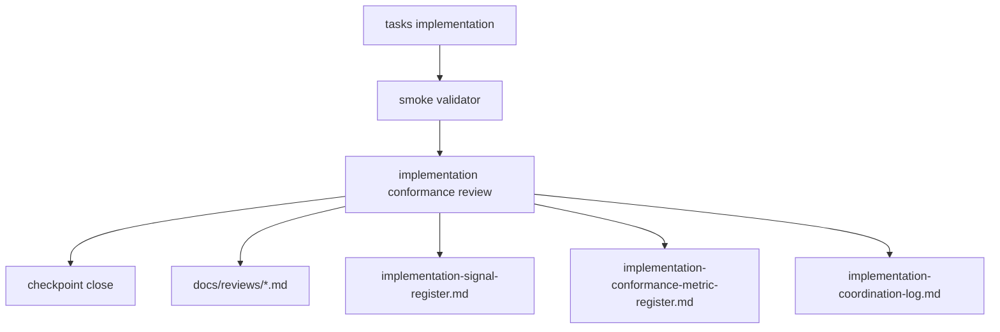

# Design Document

## Overview

`dual-reviewer-implementation-governance` は、implementation completion を
`task 完了 + smoke pass` だけで閉じないための governance layer である。

この spec が所有するのは review logic ではなく、review procedure と evidence contract である。

具体的には次を repo-contained artifact として固定する。

- conformance review procedure
- conformance metric register
- conformance review template
- concrete review artifacts
- governance artifact validator
- workflow gate status artifact
- governance cross-spec alignment memo

## Goals

- implementation 後の横断 review を workflow contract として formalize する
- finding を会話ではなく repo 内 artifact として残す
- signal / coordination / review artifact を接続する
- conformance review 自体を測る metric を持つ
- review governance を repo-contained validation で再確認できるようにする

## Non-Goals

- runtime や evaluation の nonconformance 自体を自動修正すること
- human reviewer の組織運用
- external CI や GitHub workflow の設計
- feature spec の artifact ownership を変更すること

## Design Drivers

- prototype 実装後に smoke pass でも nonconformance が残りうる
- approval/adoption、provenance、caveat linkage は silent weakening を許容しない
- docs を増やすだけでなく、最低限の mechanical validation が必要
- 既存の `implementation-coordination-log` と `implementation-signal-register` を再利用し、review silo を作らない

## Architecture

governance feature は feature logic graph に新しい data producer を追加しない。
代わりに implementation checkpoint に対して post-stage gate を追加する。

### Owned Artifacts

- `docs/coordination/implementation-conformance-review.md`
  - procedure definition
- `docs/coordination/implementation-conformance-metric-register.md`
  - metric definitions
- `docs/reviews/templates/implementation-conformance-review-template.md`
  - reusable artifact template
- `docs/reviews/*.md`
  - concrete review evidence
- `scripts/validate_implementation_governance_artifacts.rb`
  - governance artifact validator
- `docs/coordination/workflow-gate-status.md`
  - current workflow gate status
- `docs/alignment/cross-spec-implementation-governance-alignment.md`
  - governance-specific alignment memo

### Boundary Clarification

この spec が所有するのは completion gate であり、feature artifact の ownership ではない。

- foundation/runtime/evaluation/self-improvement/paper-interface
  - review 対象
- implementation-governance
  - review procedure と evidence contract の owner

## Workflow Model

### Stage 1: Implementation

task plan に従って artifact を実装する。

### Stage 2: Relevant Smoke Validation

feature ごとの validator や smoke script を再実行し、
current branch 上での mechanical pass を確認する。

### Stage 3: Implementation Conformance Review

reviewer は次を行う。

- review scope の固定
- rerun summary の記録
- spec / design / dependency map との照合
- finding 起票
- severity / disposition の付与
- signal / coordination への接続
- metric snapshot の記録

### Stage 4: Checkpoint Close

checkpoint close の条件は次のいずれかである。

- finding 0 件
- finding は存在するが review artifact と disposition を伴って明示されている

ただし `P1` が open の場合は、次 feature 開始前修正の対象として扱う。

## Workflow Status Model

governance 追加後は、checkpoint status を単なる `completed` ではなく、
少なくとも次で区別する。

- `pending`
- `in_progress`
- `completed`
- `completed_with_open_findings`
- `reopen_required`

`implementation conformance review` まで進んだが open finding が残る場合は
`completed_with_open_findings` とする。

## Cross-Spec Alignment Model

governance spec のように completion rule を横断的に変える変更は、
単体 spec 実装だけでは閉じない。

最低限次を要求する。

- governance-specific cross-spec alignment memo
- workflow gate status artifact の更新
- `spec.json` 上の alignment status 更新

## Reopen Propagation Model

上流 phase の変更は、下流 phase の completed 状態を保持したままにしない。

- `design` 修正
  - `tasks` を reopen 対象にする
- `requirements` 修正
  - `design` と `tasks` を reopen 対象にする
- `intent` 修正
  - 影響 feature の `requirements`、`design`、`tasks`、必要なら `implementation` を reopen 対象にする

特に intent 変更は、local patch ではなく workflow 再進入の起点として扱う。

## Finding Model

severity は `P1 / P2 / P3` を使う。

- `P1`
  - approval/adoption
  - trust boundary
  - invalidation
  - provenance
  の破綻
- `P2`
  - fixture-bound、hard-coded、heuristic linkage などの brittle point
- `P3`
  - traceability や maintainability を弱めるが即時破綻ではないもの

各 finding は少なくとも次を持つ。

- scope
- file reference
- description
- impact
- recommended action
- handback assessment
- status

## Handback Model

governance は implementation finding を少なくとも 4 段で扱う。

- `A`
  - task-local adjustment
- `B`
  - design handback
- `C`
  - requirements handback
- `D`
  - intent handback

`D` は requirements より上位の意図不整合を表し、
少なくとも `intent -> requirements -> design -> tasks` の連鎖 reopen を引き起こす。

## Metric Model

metric register は review 自体を測る。

最低限の baseline metric:

- `conformance_findings_count`
- `severity_weighted_finding_score`
- `post_smoke_nonconformance_count`
- `fixture_bound_resolution_count`
- `heuristic_linkage_count`
- `placeholder_or_deferred_count`
- `review_artifact_presence_rate`
- `finding_to_signal_link_rate`

prototype 段階では manual snapshot を許容する。

## Validation Model

governance artifact validator は次を確認する。

- procedure doc の存在
- metric register の存在
- review template の存在
- review artifact の required section
- metric snapshot の required keys

validator は finding の妥当性そのものは判定しない。
artifact completeness と structure のみを担う。
