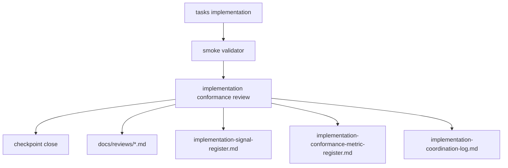

# Design Document

## Overview

`dual-reviewer-implementation-governance` は、implementation completion を
`task 完了 + smoke pass` だけで閉じないための governance layer である。

この spec が所有するのは review logic ではなく、review procedure と evidence contract である。

具体的には次を repo-contained artifact として固定する。

- intent review procedure linkage
- reference-free case bootstrap linkage
- conformance review procedure
- conformance metric register
- phase-review metric register
- intent review template
- conformance review template
- reference-free bootstrap guide
- implementation protocol/snapshot templates
- concrete intent review artifacts
- concrete review artifacts
- governance artifact validator
- workflow gate status artifact
- governance cross-spec alignment memo

## Goals

- implementation 後の横断 review を workflow contract として formalize する
- finding を会話ではなく repo 内 artifact として残す
- signal / coordination / review artifact を接続する
- conformance review 自体を測る metric を持つ
- review governance を repo-contained validation で再確認できるようにする

## Non-Goals

- runtime や evaluation の nonconformance 自体を自動修正すること
- human reviewer の組織運用
- external CI や GitHub workflow の設計
- feature spec の artifact ownership を変更すること

## Design Drivers

- prototype 実装後に smoke pass でも nonconformance が残りうる
- approval/adoption、provenance、caveat linkage は silent weakening を許容しない
- docs を増やすだけでなく、最低限の mechanical validation が必要
- 既存の `implementation-coordination-log` と `implementation-signal-register` を再利用し、review silo を作らない

## Architecture

governance feature は feature logic graph に新しい data producer を追加しない。
代わりに implementation checkpoint に対して post-stage gate を追加する。

### Owned Artifacts

- `docs/coordination/implementation-conformance-review.md`
  - procedure definition
- `docs/coordination/implementation-conformance-metric-register.md`
  - metric definitions
- `docs/coordination/phase-review-metric-register.md`
  - phase-level metric definitions
- `docs/reviews/templates/intent-review-template.md`
  - reusable intent review template
- `docs/reviews/templates/implementation-conformance-review-template.md`
  - reusable artifact template
- `docs/reviews/*.md`
  - concrete intent / conformance review evidence
- `scripts/validate_implementation_governance_artifacts.rb`
  - governance artifact validator
- `docs/coordination/workflow-gate-status.md`
  - current workflow gate status
- `docs/alignment/cross-spec-implementation-governance-alignment.md`
  - governance-specific alignment memo
- `scripts/bootstrap_reference_free_case.rb`
  - reference-free bootstrap entrypoint
- `.kiro/methodology/dual-reviewer-spec-driven-paper/reference-free-case-bootstrap-guide.md`
  - new case bootstrap procedure
- `.kiro/methodology/dual-reviewer-spec-driven-paper/implementation-phase-protocol-template.md`
  - reference-free implementation protocol template
- `.kiro/methodology/dual-reviewer-spec-driven-paper/implementation-phase-snapshot-template.md`
  - reference-free implementation snapshot template
- `experiments/protocols/heuristic_profiles/README.md`
  - minimal heuristic policy note
- `experiments/protocols/heuristic_profiles/*/_minimal_template.yaml`
  - track-default heuristic templates

### Review Template Required Sections

validator（要件 5 受入 3）が存在確認する必須セクション名を確定する。

`docs/reviews/templates/intent-review-template.md` の必須セクション（Stage 0 の reviewer 作業に対応）：

- Reviewed Intent Documents
- Traceability Check
- Handback Decision（`D` handback 要否）
- Intent Metric Snapshot（`intent_revision_count` / `intent_handback_count`）

`docs/reviews/templates/implementation-conformance-review-template.md` の必須セクション（要件 2 受入 2 の最小内容集合に対応）：

- Reviewed Scope
- Reviewed Commit or Branch
- Validation Rerun Summary
- Findings
- Severity
- Recommended Action
- Disposition Summary

concrete review artifact（`docs/reviews/*.md`）は対応するテンプレートの上記必須セクションをすべて備える。

artifact 種別判別機構：各 `docs/reviews/*.md` は front-matter に `type` フィールドを持ち、値は `intent_review` または `conformance_review` のいずれかとする。validator はこの `type` で適用する必須セクション集合（上記 2 種）を選択する。`type` が無い、または未知値の artifact は validator が不適合として扱う。

### Boundary Clarification

この spec が所有するのは completion gate であり、feature artifact の ownership ではない。

- foundation/runtime/evaluation/self-improvement/paper-interface
  - review 対象
- implementation-governance
  - review procedure と evidence contract の owner

## Workflow Model

### Stage -1: Reference-Free Case Bootstrap

新しい case は、既存 pilot case のコピーから始めない。

bootstrap stage では次を固定する。

- upstream intent source
- canonical source
- umbrella `intent.md`
- umbrella `spec.json`
- case workflow overlay
- active worklist
- workflow path

この stage の役割は case content を完成させることではなく、
`intent gate` に入るための最小 control artifact を repo 内に作ることにある。

bootstrap で再利用してよいのは template と gate structure だけであり、
case 固有の stress、scope、risk は supplied source document から書き起こす。

### Stage 0: Intent Review

workflow の最上流には `intent review` を置く。

reviewer は次を行う。

- reviewed intent documents の固定
- traceability document の確認
- `D` handback 要否の判定
- `intent_revision_count` と `intent_handback_count` の snapshot 記録

`intent review` は下流 phase issue の総件数を吸い上げない。
下流 phase で見つかった issue のうち、原因が intent の再解釈や不整合にあるものだけを
`intent-attributed issue` として downstream artifact 側に残す。

### Minimal Heuristic Default Rule

workflow owner としての governance は、heuristic profile の増殖を抑える。

- case manifest に `heuristic_profile_ref` が無い場合
  - runtime は track-specific minimal template を使ってよい
- case 固有 heuristic は
  - approved source に anchored した review-critical contract が明確なときだけ追加する
- heuristic default 挙動と minimal template 語彙の canonical owner は v2-acquisition spec とする（要件 8 受入 6）。governance はこれを参照するが所有せず、v2-acquisition spec が語彙を確定するまで governance validator はこれら heuristic template 実体を必須検査しない

これにより、新規 case の最初の run は pilot-case copied heuristic ではなく、
repo-contained minimal default から始まる。

### Stage 1: Implementation

task plan に従って artifact を実装する。

### Stage 2: Relevant Smoke Validation

feature ごとの validator や smoke script を再実行し、
current branch 上での mechanical pass を確認する。

### Stage 3: Implementation Conformance Review

reviewer は次を行う。

- review scope の固定
- rerun summary の記録
- spec / design / dependency map との照合
- finding 起票
- severity / disposition の付与
- signal / coordination への接続
- metric snapshot の記録

`implementation conformance review` を実行すべきタイミングは次を最低限とする（要件 1 受入 3）。

- プロトタイプ完了時（線形フロー上の既定の実行点）
- pre-push または pre-PR チェックポイント時
- trust boundary / invalidation / provenance / 承認・採用ロジック のいずれかを変更した後

これらは「変更起因トリガー（変更後の再実行）」と「事前チェックポイント（push/PR 前）」を含み、線形フロー 1 回限りに閉じない。

### Stage 4: Checkpoint Close

checkpoint close の条件は次のいずれかである。

- finding 0 件
- finding は存在するが review artifact と disposition を伴って明示されている

ただし `P1` が open の場合は、次 feature 開始前修正の対象として扱う。

## Workflow Status Model

governance 追加後は、checkpoint status を単なる `completed` ではなく、
少なくとも次で区別する。

- `pending`
- `in_progress`
- `completed`
- `completed_with_open_findings`
- `reopen_required`

`implementation conformance review` まで進んだが open finding が残る場合は
`completed_with_open_findings` とする。

## Cross-Spec Alignment Model

governance spec のように completion rule を横断的に変える変更は、
単体 spec 実装だけでは閉じない。

最低限次を要求する。

- governance-specific cross-spec alignment memo
- workflow gate status artifact の更新
- `spec.json` 上の alignment status 更新

## Reopen Propagation Model

上流 phase の変更は、下流 phase の completed 状態を保持したままにしない。

- `design` 修正
  - `tasks` を reopen 対象にする
- `requirements` 修正
  - `design` と `tasks` を reopen 対象にする
- `intent` 修正
  - 影響 feature の `requirements`、`design`、`tasks`、必要なら `implementation` を reopen 対象にする

特に intent 変更は、local patch ではなく workflow 再進入の起点として扱う。

## Finding Model

severity は `P1 / P2 / P3` を使う。

- `P1`
  - approval/adoption
  - trust boundary
  - invalidation
  - provenance
  の破綻
- `P2`
  - fixture-bound、hard-coded、heuristic linkage などの brittle point
- `P3`
  - traceability や maintainability を弱めるが即時破綻ではないもの

各 finding は少なくとも次を持つ。

- scope
- file reference
- description
- impact
- recommended action
- handback assessment
- status

### Finding → Signal Register Mapping

各 finding は `implementation-signal-register` へ次の規則で写像する（要件 4 受入 1）。

- `source_finding_ref` ← finding の識別子
- signal の対象領域 ← finding の `scope` と `file reference`
- signal の要約 ← finding の `description` と `impact`
- signal の優先度 ← finding の severity（`P1` / `P2` / `P3`）
- signal の `status` ← finding の `status`

severity 別の接続先：

- `P1`：signal register へ記録し、加えて Stage 4 の P1 ブロック経路（次 feature 開始前修正）に接続
- `P2` / `P3`：軽微 signal として signal register に記録する

handback assessment を持つ finding は本写像に加え handback クラス（A/B/C・intent）にも接続する（要件 4 受入 2 との整合）。

## Handback Model

governance は implementation finding を少なくとも 4 段で扱う。

- `A`
  - task-local adjustment
- `B`
  - design handback
- `C`
  - requirements handback
- `D`
  - intent handback

`D` は requirements より上位の意図不整合を表し、
少なくとも `intent -> requirements -> design -> tasks` の連鎖 reopen を引き起こす。

## Metric Model

metric register は review 自体を測る。

最低限の baseline metric:

- `conformance_findings_count`
- `severity_weighted_finding_score`
- `post_smoke_nonconformance_count`
- `fixture_bound_resolution_count`
- `heuristic_linkage_count`
- `placeholder_or_deferred_count`
- `review_artifact_presence_rate`
- `finding_to_signal_link_rate`

prototype 段階では manual snapshot を許容する。

phase-review metric register は phase progression 全体を測る。

- `intent`
  - `intent_revision_count`
  - `intent_handback_count`
- `requirements / design / tasks / implementation`
  - phase-local issue count
  - recheck count
  - handback count
  - `intent-attributed issue` count

これにより、`intent` phase 自体の変更回数と、
下流 phase で観測された intent 起因問題を分離して扱う。

phase-review metric register の段階語彙（`implementation` を含む）は governance 所有であり、runtime 所有の phase/profile 審査語彙とは別物である。下流の evaluation / paper-interface は runtime の phase/profile slice に `implementation` を期待しない（要件 7 受入 7）。

## Validation Model

governance artifact validator は次を確認する。

- procedure doc の存在
- metric register の存在
- phase-review metric register の存在
- intent review template の存在
- review template の存在
- concrete intent review artifact の required section
- review artifact の required section
- metric snapshot の required keys

validator は finding の妥当性そのものは判定しない。
artifact completeness と structure のみを担う。
