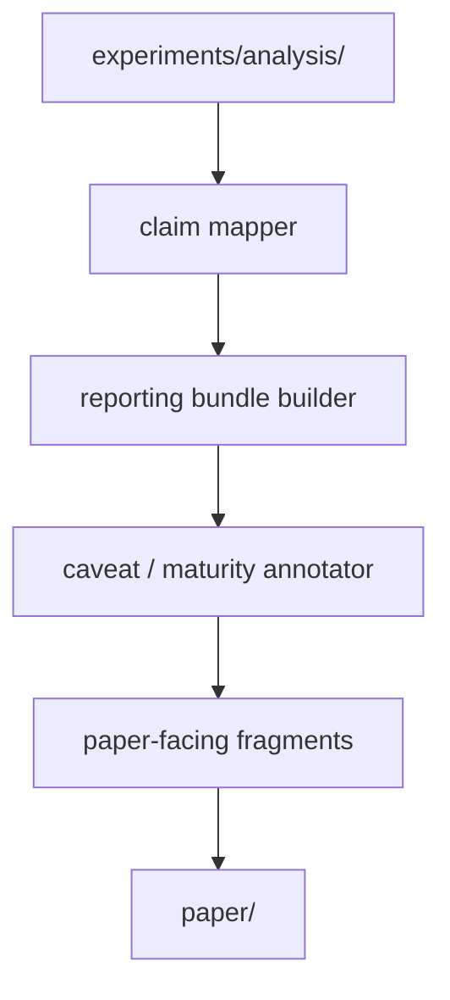

# Design Document

## Overview

`dual-reviewer-paper-interface` は、evaluation が生成した analysis artifact を paper-facing artifact に変換する reporting interface layer である。

本 design の役割は、次を concrete に定義することにある。

- claim と evidence source の対応付け
- figure / table / report fragment の入力 contract
- caveat と maturity label の継承方法
- paper convenience が lower layer に逆流しない境界

この feature は manuscript authoring そのものではなく、論文化や研究報告に必要な structured reporting input を整えるための層である。

## Goals

- claim-supporting artifact を traceable にする
- mature / preliminary / exploratory を見分けられる reporting input を作る
- exclusion と caveat を narrative から脱落させない
- evaluation output から再生成可能な paper-facing artifact を作る

## Non-Goals

- runtime field の再定義
- evaluation metric rule の変更
- full manuscript drafting pipeline の実装
- submission packaging

## Design Drivers

- paper convenience は reproducibility と validity に従属する
- raw run artifact を直接読まない。evaluation output を読む。evaluation output が存在しない場合は生ログにフォールバックせず、評価プロセスの実行を要求する（要件 1 受入 4）
- claim は evidence source と provenance を失わない
- preliminary evidence は明示的に label する

## Architecture

paper-interface は `claim mapping -> reporting bundle generation -> caveat attachment -> export fragments` の 4 段に分ける。



### Components

- `claim mapper`
  - claim ごとに supporting artifact を結びつける
- `reporting bundle builder`
  - figure / table / summary 用の bundle を作る
- `caveat / maturity annotator`
  - preliminary / mature / caveated を明示する
- `export fragments`
  - reporting に使う JSON / Markdown / table input を出す

## Paper Artifact Layout

paper-interface の正本出力先は `paper/` 配下とする。

```text
paper/
├── reports/
│   ├── claim_map.json
│   ├── evidence_register.json
│   └── reporting_fragments.json
├── tables/
│   └── table_source_bundle.json
├── figures/
│   └── figure_source_bundle.json
└── caveats/
    └── paper_caveat_register.json
```

### Placement Rationale

- `reports/claim_map.json`
  - claim と evidence の対応正本
- `reports/evidence_register.json`
  - evidence maturity と provenance の registry
- `reports/reporting_fragments.json`
  - text-ready だが manuscript 非依存の summary fragment
- `tables/` と `figures/`
  - table / figure の source bundle を分ける
- `caveats/`
  - paper-facing caveat の集約場所

## Claim Mapping Model

### 1. Claim Unit

paper-interface は claim を 1 artifact 単位で扱う。

claim とは、claim-to-evidence 対応付けの単位となる paper-facing な言明であり、最低限 identifier と明示的な evidence source への結合を持つ（要件 1 受入 6）。

`claim_map.json` の各 entry は少なくとも次を持つ。

- `claim_id`
- `claim_text`
- `supporting_artifact_refs`
- `maturity_label`
- `caveat_refs`
- `provenance_refs`

claim-to-evidence と caveat linkage は文字列 heuristic ではなく構造化参照で扱う。
artifact-specific caveat の canonical source は claim entry が持つ `supporting_artifact_refs` と `caveat_refs` とし、
basename や filename の部分一致を正本判定に使ってはならない。

### 2. Supporting Artifact Sources

標準的な source は次に限定する。入力はすべて評価の分析出力基準 `experiments/analysis/` 相対で解決する（foundation 要件 4 受入 4：相対パスのみで所在特定可能）。

- `experiments/analysis/comparisons/treatment_comparisons.json`
- `experiments/analysis/comparisons/phase_comparisons.json`
- `experiments/analysis/classifications/exclusion_report.json`
- `experiments/analysis/caveats/caveat_register.json`（上流 evaluation 由来。paper 自身の `paper/caveats/paper_caveat_register.json` とは基準ディレクトリが異なり衝突しない）
- 必要に応じて `experiments/analysis/metrics/*.json`

runtime raw artifact は claim-supporting source の一次入力にしない。

### 3. Reference Format（全モデル共通）

`*_ref` / `*_refs` 系フィールド（`supporting_artifact_refs`・`caveat_refs`・`provenance_refs`・`source_analysis_manifest_ref`・`input_run_set_ref` 等）は、裸のパス文字列でも裸の識別子でもなく、次の構造化参照とする。

- `ref_type`：参照先 artifact の種別
- `target_path`：repo 相対パス（基準ディレクトリ起点。基準は A-4 で定義）
- `target_id`：artifact 内の安定識別子（任意。entry 単位で指す場合に用いる）

`*_ref`（単数）は上記オブジェクト 1 個、`*_refs`（複数）はその配列とする。これにより、basename や filename の部分一致に依存せず、クロスドキュメント追跡を機械的に検証できる（要件 1 受入 5）。

## Evidence Register Model

### 1. Evidence Maturity

evidence maturity の初版 label は次とする。

- `mature`
- `preliminary`
- `exploratory`

`caveated` は maturity label ではなく、`caveat_refs` によって表現する。これにより、1 artifact が `mature` でありつつ caveat を持つ状態を表現できる。

maturity と foundation の evidence-class は別軸だが独立ではない。foundation の `evidence_class`（valid / invalid / exploratory＝run の妥当性。foundation 要件 6 受入 8 が所有）を論文側は再定義せず正準フィールドとして保持する。`maturity_label`（mature / preliminary / exploratory＝報告用の証拠成熟度）は独立語彙ではなく、`evidence_class` に束縛された派生分類とし、要件 1・3・5 で同一の `maturity_label` 語彙を用いる（要件 5 受入 6）。束縛規則：`evidence_class=invalid` は paper-facing 対象外、`evidence_class=exploratory` は `maturity_label=exploratory`、`evidence_class=valid` は安定比較集合なら `mature`、そうでなければ `preliminary`。

### 2. Provenance Fields

`evidence_register.json` の各 entry は少なくとも次を持つ。

- `artifact_ref`
- `source_analysis_manifest_ref`
- `input_run_set_ref`
- `evidence_class`（foundation 由来。再定義しない束縛フィールド）
- `review_mode`（foundation 由来。manual_dogfooding / runtime_mediated。再定義しない）
- `maturity_label`（evidence_class に束縛された派生分類）
- `caveat_refs`
- `supersedes`（この entry が置換した先行 evidence への参照。Reference Format に従う。無ければ空）
- `superseded_by`（この entry を置換した後続 evidence への参照。Reference Format に従う。無ければ空）
- `generated_at`

これにより、どの analysis logic version と run set から報告断片ができたか追跡でき、preliminary→mature・手動→runtime の置換系譜も辿れる（要件 5 受入 5・要件 6 受入 5）。

### 3. Review-Mode in Reporting

paper-facing artifact はレビュー実施モードの出所を保存する（要件 6）。

- `review_mode` を evidence_register に保持し、論文断片が手動 dogfooding 由来か runtime 由来かを失わない（受入 1）
- 手動由来証拠と runtime 由来証拠は分離して報告でき、混在を強制しない（受入 2）
- 手動レビュー記録を明示ラベルなしに runtime 産出証拠として提示しない（受入 3）
- 同一 report set に複数のレビュー実施モードが混在する場合、混在を機械検知し caveat を自動付与する（受入 4）。検知条件＝当該 report set が参照する evidence_register entry の `review_mode` が 2 値以上
- 早期の手動証拠を後の runtime 由来証拠で置換した系譜は保存する（受入 5）。置換リンクの保持先は A-2 で定義する `supersedes` / `superseded_by` とする

## Figure and Table Bundle Model

### 1. Table Source Bundle

`tables/table_source_bundle.json` は少なくとも次を持つ。

- `table_id`
- `source_artifact_refs`
- `field_projection`
- `maturity_label`
- `caveat_refs`

### 2. Figure Source Bundle

`figures/figure_source_bundle.json` は少なくとも次を持つ。

- `figure_id`
- `source_artifact_refs`
- `plot_contract`
- `maturity_label`
- `caveat_refs`

ここで `plot_contract` は描画そのものではなく、どの slice / metric / grouping を使うかの reporting-side definition とする。

## Caveat and Limitation Model

paper-interface は evaluation の `caveat_register.json` を継承しつつ、paper-facing な説明単位へ再配置する。

`paper/caveats/paper_caveat_register.json` は少なくとも次を持つ。

- `caveat_id`
- `source_caveat_ref`
- `applies_to_claim_refs`
- `applies_to_artifact_refs`
- `limitation_type`
- `narrative_note`

`narrative_note` は manuscript 本文ではなく、author が limitations を落とさないための structured note とする。

`limitation_type` の初版 enum は要件 3 受入 2 の 3 分類を正準値とする。

- `invalid_data_exclusion`：無効データ除外に起因する限界
- `partial_evidence`：部分的証拠に起因する限界
- `methodological_limitation`：方法論的限界

## Reporting Fragment Model

`reporting_fragments.json` は論文本文そのものではないが、再利用しやすい報告断片を保持する。

各 fragment は少なくとも次を持つ。

- `fragment_id`
- `fragment_type`
- `source_artifact_refs`
- `maturity_label`
- `caveat_refs`
- `text_stub`

`fragment_type` の例:

- `claim_summary`
- `method_note`
- `limitation_note`
- `comparison_summary`

複数出典を束ねる fragment（`comparison_summary` 等）の成熟度集約規則：

- fragment の `maturity_label` は出典の最も保守的な値とする。順序は `exploratory` < `preliminary` < `mature` とし、出典に 1 つでも低い値があれば fragment 全体をその低い値にする
- 出典ごとの成熟度区分は fragment 内に保持し、束ねても見えなくしない（要件 5 受入 3：区別が見える場合のみ混在許可）
- 成熟度の異なる出典を単一の未分化値へ圧縮しない（要件 5 受入 4）。集約値はあくまで保守表示であり、出典別 maturity の保持を代替しない

## Separation Rules

### 1. No Reverse Control

paper-interface は次をしてはいけない。

- runtime field の追加要求を独自に出す
- invalid run を valid evidence に格上げする
- evaluation comparison rule を独自に上書きする

### 2. No Silent Strengthening

preliminary または exploratory な evidence を、paper artifact 生成時に mature evidence と同列に扱ってはいけない。

### 3. Self-Improvement Independence

self-improvement proposal は paper claim の support artifact ではない。採用済み改善履歴を methodology note として参照することはできるが、performance claim の一次根拠にはしない。

### 4. Stale Upstream Regeneration

上流 evaluation output が run 無効化により stale 扱いされた場合、paper-facing artifact は再生成の対象とする。出力が変化したときだけでなく、上流の陳腐化時にも再生成する（要件 2 受入 6）。

陳腐化信号の表現契約：

- paper-facing artifact（evidence_register entry・reporting fragment・bundle manifest）は陳腐化標識を持つ。最低限 `stale`（真偽）/ `stale_reason` / `stale_source_ref`（陳腐化の起点となった上流 invalidation または staleness 伝播の参照。foundation 要件 6 受入 9 の伝播を受ける）
- `stale=true` の artifact は paper-facing 用途に供する前に再生成対象とする
- 標識の付与は上流 evaluation 由来の陳腐化伝播を受けて行う。再生成の自動起動主体・タイミングは実装に委譲する（本設計は信号の表現契約のみを固定する）

## Interfaces to Other Features

### Evaluation

paper-interface は evaluation の主要 consumer である。少なくとも次を読む。

- `analysis_run_manifest.yaml`
- `treatment_comparisons.json`
- `phase_comparisons.json`
- `exclusion_report.json`
- `caveat_register.json`

必要なら、`analysis_run_manifest.yaml` の `input_run_set` に対応する protocol-facing validation summary を provenance convenience として追加 intake してよい。対象は `runtime_validation_summary.yaml` または `conformance_review_result.yaml` のような upstream が既に生成した summary artifact に限る。

### Self-Improvement

paper-interface は self-improvement の adopted history を、必要なら「system revision history」として参照できる。ただし runtime quality claim の一次根拠にしない。

### Runtime

runtime とは直接結合しない。runtime は paper-interface の field convenience のために artifact shape を変えない。

paper-interface が参照できる runtime 由来情報は、evaluation や protocol layer が既に versioned artifact として固定した summary に限る。これらは methodology/provenance context であり、claim-supporting primary evidence にはしない。

## Key Decisions

### Decision 1: Claim map is the paper-facing center

どの claim がどの evidence で支えられるかを central artifact にする。

### Decision 2: Maturity is explicit

preliminary / exploratory / caveated を artifact に埋め込む。

### Decision 3: Reporting fragments are not manuscripts

再利用可能な断片までに留め、執筆工程そのものは別にする。

### Decision 4: Evaluation remains the upstream authority

paper-interface は consumer であり、comparison rule の owner ではない。

## Requirements Traceability

| Requirement | Design Response |
|------------|-----------------|
| Claim-to-evidence mapping | `claim_map.json` と evidence register を定義 |
| Paper-facing data contract | figure/table/report bundle を定義 |
| Caveat and limitation tracking | paper-facing caveat register を定義 |
| Separation from runtime and evaluation logic | no reverse control rules を定義 |
| Preliminary vs mature evidence distinction | maturity labels と no silent strengthening rule を定義 |
| Review-mode provenance in reporting | `review_mode` 保持と Review-Mode in Reporting 節（混在検知 caveat・置換系譜）を定義 |

## Test Strategy

完全なテスト計画はタスク工程で策定するが、設計段階で次のテスト可能性の縫い目を固定する。

- 証拠追跡性の機械検証：claim_map の `supporting_artifact_refs` / `provenance_refs` が Reference Format（構造化参照）に従い、参照先 artifact まで machine 解決できることを検証できる（要件 1 受入 5）
- 無声昇格の検出：preliminary / exploratory な evidence が mature と同列に paper artifact へ入っていないことを、evidence_register の `maturity_label` と束縛規則（evidence_class）に基づき検証できる（Separation Rules 2）
- 混在レビュー実施モードの caveat 検証：report set が参照する evidence_register の `review_mode` が 2 値以上のとき caveat が付与されることを検証できる（要件 6 受入 4）
- 陳腐化再生成の確認：`stale=true` の paper-facing artifact が再生成対象として検出されることを検証できる（§Stale Upstream Regeneration、要件 2 受入 6）

## Open Issues for Design Alignment Gate

- claim ID taxonomy をどこまで formalize するか
- figure/table bundle の field naming を evaluation とどこまで揃えるか
- adopted change history を methodology note に含める範囲

## Completion Criteria

- claim と evidence source の対応を説明できる
- mature / preliminary / exploratory の扱いを説明できる
- caveat がどこに残るか説明できる
- paper-interface が runtime/evaluation を支配しないことを説明できる
