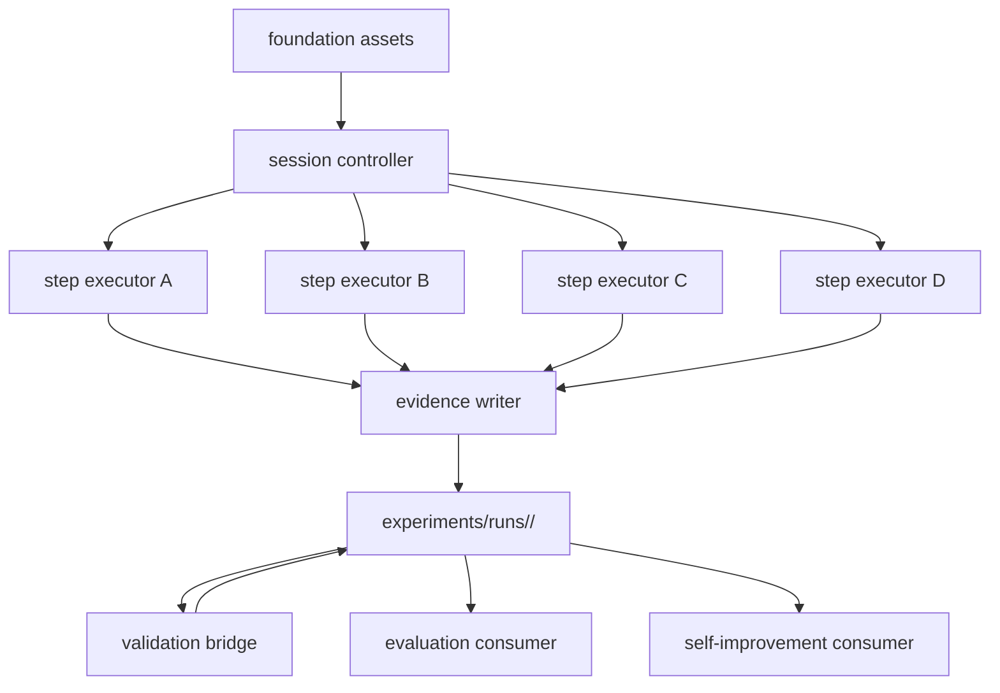

# Design Document

## Overview

`dual-reviewer-runtime` は、`dual-reviewer-foundation` が定義する shared asset layer の上で review session を実行する orchestration layer である。

本 design の役割は、次を concrete に定義することにある。

- Step A/B/C/D の実行境界
- treatment と phase/profile の切り分け
- prompt resolution の方法
- raw evidence と decision artifact の保存形
- validator invocation と run close boundary

runtime は system の中心にあるが、正本の schema や prompt を所有しない。foundation を読む側であり、evaluation、self-improvement、paper-interface に対して evidence producer として振る舞う。

### Boundary Clarification

runtime は foundation contract の consumer であり、shared contract 自体の定義者ではない。

foundation から受け取るもの:

- canonical step names
- schema shapes
- metadata field definitions
- prompt placement and identity rules
- validation artifact shapes

runtime が所有するもの:

- run directory layout
- concrete step file naming
- treatment execution shape
- phase/profile-specific review behavior
- prompt override resolution order
- evidence write order
- run close and validator invocation timing

runtime は foundation contract を上書きせず、その内側で concrete execution を定義する。

### Reference-Free Runtime Entry Principle

runtime は pilot case を前提にしない。

- 新しい case は workflow/bootstrap 側で初期化してよい
- runtime entrypoint は、その bootstrap で作られた case manifest か、同等に明示された入力群だけを受ける
- generic runtime code は特定 case の basename や case id を hidden default にしない

つまり、`reference-free bootstrap` は workflow owner の責務だが、runtime 側もそれを受けられる explicit input model を持たなければならない。

## Goals

- foundation contract に従う review orchestration を提供する
- human decision unit と raw evidence unit を接続する
- run close 後に evidence が凍結される構造を作る
- valid / invalid / exploratory の downstream 分岐に必要な artifact を揃える
- `design` / `tasks` を中心に phase-aware review profile を切り替えられるようにする

## Non-Goals

- metrics 集計
- improvement proposal 生成
- paper-facing table / figure 整形
- model vendor abstraction の再定義

## Design Drivers

- prompt は skill body ではなく repo 内 artifact として resolve する
- raw evidence は immutable とし、validator 結果や human judgment は別 artifact として重ねる
- human sign-off を通っていない finding は accepted output にならない
- treatment と phase/profile は独立した軸として扱う
- replay 最小単位は foundation design に従い step-level within run とする

## Architecture

runtime は `session controller + step executors + evidence writer + validation bridge` の 4 役に分ける。



### v2 Internal Structure

generic execution layer v2 を取り込んだ後の runtime 内部構造は、
Step A/B/C/D の実行順そのものとは別に、次の 4 層で責務分離する。

- `Case Manifest`
  - case binding、source refs、track specialization を解決する
- `Analysis`
  - input artifact を読み、evidence と candidate を作る
- `Decision`
  - severity、necessity、reopen、handback、signal linkage を判定する
- `Writer`
  - `review_case.json`、`decision_units.json`、validation artifact、v2 internal artifact を書き出す

runtime design における関係は次の通りとする。

- `session controller`
  - run 開始、treatment、phase/profile、step 順序を制御する
- `Case Manifest / Analysis / Decision / Writer`
  - controller の内側で動く execution core とする
- `validation bridge`
  - writer 後に validator を呼び、run close 時の artifact を補完する

平たく言うと、

- 既存 runtime design は「どう順に動くか」を持つ
- v2 design は「各 step の中で誰が何をするか」を持つ

ので、両者は競合ではなく、runtime 内で上下に重なる設計として扱う。

### Components

- `session controller`
  - run 開始、profile/treatment 選択、step 遷移管理
- `step executors`
  - Step A/B/C/D ごとの入出力を処理
- `evidence writer`
  - raw evidence と decision artifact を保存
- `validation bridge`
  - run close 時に validator を呼び、結果を artifact と metadata に反映

## Runtime Artifact Layout

runtime が 1 run ごとに生成する directory は次を正本とする。

```text
experiments/runs/<run_id>/
├── run_manifest.yaml
├── review_case.json
├── steps/
│   ├── step_a_primary_detection.json
│   ├── step_b_adversarial_review.json
│   ├── step_c_judgment.json
│   └── step_d_integration.json
├── decisions/
│   ├── decision_units.json
│   └── human_signoff.json
├── v2/
│   ├── review_artifact.json
│   ├── metric_snapshot.json
│   ├── trace_note.json
│   └── signal_linkage_note.json
├── validation/
│   ├── validator_result.json
│   └── invalidation_markers.json
└── derived/
    ├── runtime_summary.json
    ├── comparison_eligibility_note.json
    └── invalid_run_triage_note.json
```

### Placement Rationale

- `run_manifest.yaml`
  - run metadata の operator-readable 正本
- `review_case.json`
  - foundation schema に従う machine-readable 正本
- `steps/`
  - step-level replay の最小単位
- `decisions/`
  - human decision integration を raw evidence から切り離して保存
- `v2/`
  - generic execution layer v2 の internal canonical artifact を保存
- `validation/`
  - validator 結果と invalidation を別配置
- `derived/`
  - runtime convenience artifact
  - evaluation の正本ではない
  - invalid-run triage のような workflow support artifact を含んでよい

### v2 Compatibility Rule

v2 導入後も、downstream compatibility のため次を維持する。

- `review_case.json`
  - evaluation が読む machine-readable review record
- `decisions/decision_units.json`
  - human decision 単位の正本
- `validation/validator_result.json`
  - mechanical validation の正本
- `validation/invalidation_markers.json`
  - invalidation 事実の正本

そのうえで、新たに次を追加する。

- `v2/review_artifact.json`
  - taxonomy-first internal canonical object
- `derived/comparison_eligibility_note.json`
  - standard comparison に直接入れるかどうかを downstream が判断する補助 note
- `derived/invalid_run_triage_note.json`
  - invalid run の primary failure、linked checks、operator action hint を downstream が再利用する補助 note

つまり、v2 は既存 artifact を置き換えるのではなく、
互換入口を残したまま internal canonical artifact を追加する。

portable export はこの raw run directory を置き換えず、別 artifact として扱う。runtime の正本は依然として `experiments/runs/<run_id>/` である。

## Session Model

### 1. Run Lifecycle

runtime の lifecycle は次を採る。

1. `created`
2. `in_progress`
3. `closed`
4. `orchestration_failed`

重要なのは、`closed` が `valid` を意味しない点である。`closed` は runtime が step 実行を完了し、raw evidence を凍結したことだけを表す。validity は validator と human sign-off の結果で別に決まる。

### 2. Session Inputs

run 開始時に controller が固定する入力は次とする。

- `target_id`
- `target_artifact_hash`
- `source_repository_id`
- `source_revision`
- `phase_profile`
- `treatment`
- `review_mode`
- `protocol_version`
- `runtime_version`
- `prompt_set_version`
- `schema_set_version`
- `operator_id` または operator identity label

これらは `run_manifest.yaml` に最初に記録し、run 中に上書きしない。

run-level の `human_signoff_status` は、finding ごとの採否ではなく「この run が人間の明示的 close judgment を通過したか」を表す。個別 finding や decision unit の accept / reject / defer は `decisions/decision_units.json` 側で保持する。

local runtime の初版では、`source_repository_id` と `source_revision` は実行元 repository と revision を指す。将来 central 側へ bundle export するときも、この provenance は local source として保持される。

### 3. Phase/Profile and Treatment Axes

runtime では次の 2 軸を分離する。

- `phase_profile`
  - `intent`
  - `requirements`
  - `design`
  - `tasks`
- `treatment`
  - `single`
  - `dual`
  - `dual+judgment`

`phase_profile` は「何を見るか」の emphasis を変え、`treatment` は「どの step を使うか」の execution shape を変える。

## Step Execution Model

### Step A: Primary Detection

入力:

- target artifact
- phase/profile
- primary prompt set
- config

出力:

- primary findings
- step-level metadata
- prompt artifact identity

保存先:

- `steps/step_a_primary_detection.json`

### Step B: Adversarial Review

入力:

- target artifact
- Step A findings
- phase/profile
- adversarial prompt set

出力:

- adversarial findings
- counter-evidence
- divergence trace

保存先:

- `steps/step_b_adversarial_review.json`

`single` treatment では実行せず、skip marker を記録する。

### Step C: Judgment

入力:

- Step A/B findings
- counter-evidence
- judgment prompt artifact
- phase/profile

出力:

- necessity judgments
- final labels
- recommended actions

保存先:

- `steps/step_c_judgment.json`

`dual` treatment では実行せず、skip marker を記録する。

### Step D: Integration

入力:

- prior step outputs
- human decision actions

出力:

- decision units
- accepted / rejected / deferred mapping
- run close readiness

保存先:

- `steps/step_d_integration.json`
- `decisions/decision_units.json`

## Prompt Resolution Model

runtime は prompt body を code 内に持たない。各 step は foundation と runtime 配下の prompt asset を path resolution で読む。

resolution order は次とする。

1. foundation canonical prompt path
2. runtime-owned role/phase override path
3. explicit failure if ambiguous

steady-state behavior では repo 外 prompt source を禁止する。

### Prompt Identity Recording

各 step record は最低限次を持つ。

- `prompt_artifact_path`
- `prompt_id`
- `prompt_version`

これにより replay 時に「同じ step だが prompt が違う」ケースを判別できる。

## Decision Unit Model

runtime は raw finding をそのまま human に渡さず、decision unit に束ねて提示する。

decision unit の責務:

- human approve / reject / defer の単位になる
- one or more findings と judgment を束ねる
- sign-off 履歴を持つ

`decisions/decision_units.json` の各 unit は次を持つ。

- `decision_unit_id`
- `finding_refs`
- `judgment_refs`
- `proposed_action`
- `human_decision`
- `human_decision_timestamp`
- `human_decision_note`

foundation の `finding` schema にある `decision_unit_id` と `human_decision_ref` はこの artifact を参照する。

## Evidence Writing Model

### Raw vs Derived Separation

runtime は evidence を次の 3 層で書き分ける。

- raw step evidence
  - `steps/*.json`
- human / decision integration evidence
  - `decisions/decision_units.json`
- v2 internal canonical evidence
  - `v2/review_artifact.json`
  - `v2/trace_note.json`
  - `v2/signal_linkage_note.json`

`review_case.json` は downstream compatibility のための machine-readable envelope とし、
v2 内部では `review_artifact.json` を canonical object として保持する。

レビュー実行が失敗の状態（review miss / disagreement など）に陥った場合、runtime は foundation の `failure_observation` schema に準拠した記録を `failures/failure_observation.json` に書き出す（要件 4 受入 7）。これにより failure 分類データが未使用 schema のまま放置されない。

### File Placement for v2 Runtime Core

runtime 実装の code placement は次を正本とする。

```text
runtime/
└── execution_v2/
    ├── manifests/
    ├── analyzers/
    ├── decisions/
    ├── writers/
    └── contracts/

scripts/
├── protocol_runners/
└── track_runs/
```

役割分担:

- `runtime/execution_v2/manifests/`
  - case manifest 読込
  - track specialization 解決
- `runtime/execution_v2/analyzers/`
  - track-aware analyzer
  - evidence extraction
- `runtime/execution_v2/decisions/`
  - necessity / reopen / handback / signal linkage 判定
- `runtime/execution_v2/writers/`
  - compatibility artifact と v2 internal artifact の write
- `runtime/execution_v2/contracts/`
  - layer 間 object shape
- `scripts/protocol_runners/`
  - run entrypoint
- `scripts/track_runs/`
  - comparison input や protocol artifact への adapter

runtime design におけるルール:

- analyzer logic を batch script に入れない
- downstream 変換 logic を execution core に混ぜない
- manifest logic を writer に混ぜない

### Case Manifest and Heuristic Resolution Model

v2 runtime は case manifest を track-aware object として扱う。

- base required fields
  - `case_id`
  - `track`
  - `source_refs`
  - `case_manifest_ref`
- track-required fields
  - `implementation`
  - `spec`
  - `intent`
  それぞれは track 固有の required field set を持つ
備考：旧 v1 では `heuristic_profile_ref`（規則ファイル参照）を case manifest の任意項目として持ち、heuristic resolution rule で resolution の優先順位を定義していたが、v2 では規則ファイル参照を撤廃する方針のため、本項は削除した。詳細は v2 取得 spec（`dual-reviewer-rebuild/.kiro/specs/dual-reviewer-v2-acquisition/`）を参照。

### Generic Protocol Entrypoint Rule

`scripts/run_*_track_protocol.rb` の generic wrapper は、pilot case を既定値に持たない。

- `case_manifest_ref` がある場合
  - wrapper は manifest を読む
- `case_manifest_ref` がない場合
  - track ごとの required input を明示させる
- どちらも満たさない場合
  - fail fast する

これにより、reference-free case でも runtime entry が `heat3d` や `phase-field` の既存 run label に暗黙依存しない。

### Generic Fragment Cue Rule（削除済み）

旧 v1 では runtime の汎用解析器とパターン cue を structural cue ベースに寄せる規約を持っていたが、v2 では実 LLM 呼び出しに置き換えてパターン照合自体を撤廃する方針のため、本節は削除した。詳細は v2 取得 spec（`dual-reviewer-rebuild/.kiro/specs/dual-reviewer-v2-acquisition/`）を参照。

runtime は evidence を 3 層に分けて保存する。

1. raw step outputs
2. decision artifacts
3. convenience summaries

raw step outputs は immutable とする。summary を後から更新しても raw step outputs は変更しない。

### `review_case.json`

`review_case.json` は run 全体の canonical machine-readable envelope とする。

責務:

- run metadata の集約
- step ref の集約
- finding ref の集約
- validation / invalidation artifact ref の集約

step file の詳細すべてを重複して持たず、参照を中心に構成する。

## Validator Integration

### Run Close Boundary

run close は、Step D 完了 → human sign-off artifact 書き込み → raw evidence freeze → validator invocation → `validator_result.json` 保存 がすべて完了した時点で成立する（要件 6 受入 9：human sign-off → validator → run close の順序を厳守し、validator 結果が human decision に先行しない）。

run close 成立後に行うこと:

1. invalidation marker 付与
2. `invalid_run_triage_note.json` 生成
3. `run_manifest.yaml` と `review_case.json` の metadata 更新

この順序を崩さない。

### Validation Outcomes

validator 結果は次の 3 種に整理する。

- pass
- fail
- blocked

`blocked` は required artifact 不足などで validation 自体を完了できない場合に使う。foundation の `validator_status` enum にはまだないので、runtime では `blocked` を internal event として保持し、final metadata には `failed` と insufficiency detail を落とす。

## Invalidation Handling

invalidation は raw evidence の編集ではなく `validation/invalidation_markers.json` への追加で表現する。

runtime が自動で出せる典型は次の通り。

- missing required artifact
- unresolved prompt identity
- run close without sign-off
- treatment/step mismatch

contamination や hidden intervention のような人間判断が必要なものは、human-issued marker として同じ artifact 形式に追加する。

invalid run が発生した場合、runtime は `derived/invalid_run_triage_note.json` を生成してよい。ここには少なくとも次を含める。

- primary failure code
- failed validator check ids
- invalidation marker linkage
- operator action hint

この triage note は runtime convenience artifact だが、self-improvement や protocol review が workflow failure の再発パターンを扱うための正規補助入力として使ってよい。

## Portable Evidence Bundle Export

runtime は local run の正本を `experiments/runs/<run_id>/` に保持したまま、cross-project analysis 用に portable bundle を生成できる形を採る。

### Export Boundary

export は runtime の close / validation 後に行う別工程であり、run 実行そのものには含めない。

export がしてよいこと:

- raw run directory から bundle 用 copy を作る
- export manifest を付与する
- provenance を再確認する

export がしてはいけないこと:

- raw run artifact の意味を書き換える
- missing provenance を暗黙補完する
- central-side admission を済ませたことにする

### Bundle Shape

初版では bundle を次のような portable directory として扱う。

```text
exports/<bundle_id>/
├── bundle_manifest.yaml
├── run/
│   └── <run_id>/...
└── checksums/
    └── bundle_checksums.json
```

`bundle_manifest.yaml` は少なくとも次を持つ。

- `bundle_id`
- `run_id`
- `source_repository_id`
- `source_revision`
- `review_mode`
- `exported_at`
- `export_runtime_version`
- `included_artifact_refs`

`run/` 配下には central-side ingestion に必要な runtime artifact の portable copy を含める。bundle manifest は provenance envelope であり、evaluation の admission 判定そのものではない。

## Phase-Aware Review Profiles

phase/profile ごとの差は prompt と emphasis configuration で吸収し、state machine は変えない。

初版では profile ごとに次の emphasis を持たせる。

- `intent`
  - goal ambiguity
  - non-goal leakage
- `requirements`
  - scope drift
  - requirement inconsistency
- `design`
  - responsibility boundary
  - dependency mismatch
  - failure mode omission
- `tasks`
  - coverage gap
  - ordering risk
  - unverifiable task decomposition

この emphasis 自体は runtime-owned profile configuration に置き、foundation には戻さない。

## Interfaces to Downstream Features

### Evaluation

evaluation は少なくとも次を読む。

- `run_manifest.yaml`
- `review_case.json`
- `validation/validator_result.json`
- `validation/invalidation_markers.json`
- `derived/comparison_eligibility_note.json`

evaluation は `derived/runtime_summary.json` に依存しない。

### Self-Improvement

self-improvement は少なくとも次を読む。

- step files
- decision units
- validator/invalidation artifacts
- `derived/invalid_run_triage_note.json`
- `failures/failure_observation.json`

特に Step B と Step C の artifact を replay 入力として扱えるようにする。

### Paper-Interface

paper-interface は runtime から直接 raw step file を読むのではなく、原則 evaluation 出力を経由する。runtime は paper convenience のために artifact shape を変えない。

## Key Decisions

### Decision 1: Run directory is the runtime boundary

1 run = 1 directory とし、再現性と移送性を確保する。

### Decision 2: Decision units are first-class

finding と human action を安定的に結ぶため、decision unit を独立 artifact にする。

### Decision 3: Validation happens after evidence freeze

validation は raw evidence を変更しない。

### Decision 4: Treatment and phase/profile are separate knobs

比較実験と認知負荷対応を混同しないため、両者を分離する。

## Requirements Traceability

| Requirement | Design Response |
|------------|-----------------|
| Review session orchestration | controller と step executors を定義 |
| Treatment-aware execution | treatment 別 skip marker と execution shape を定義 |
| Prompt resolution | prompt path resolution と identity recording を定義 |
| Structured evidence emission | run directory と canonical artifacts を定義 |
| Human decision integration | decision unit model を定義 |
| Validator integration and run close | freeze -> validate -> annotate の順序を定義 |
| Replay-friendly runtime records | step-level files と prompt identity を保存 |
| Phase-aware review profiles | profile axis と emphasis model を定義 |

## Open Issues for Design Alignment Gate

- `runtime-owned profile configuration` の具体配置
- `review_case.json` 内での step ref 粒度
- validator bridge の実行 entrypoint
- accepted review output の最終 export 形

これらは evaluation / self-improvement / paper-interface design が揃った後の `design alignment gate` で詰める。

## Completion Criteria

- 1 run の artifact layout を説明できる
- run close と validation の順序を説明できる
- decision unit が finding と human judgment をどう接続するか説明できる
- downstream 3 feature が runtime のどの artifact を読むか追跡できる
