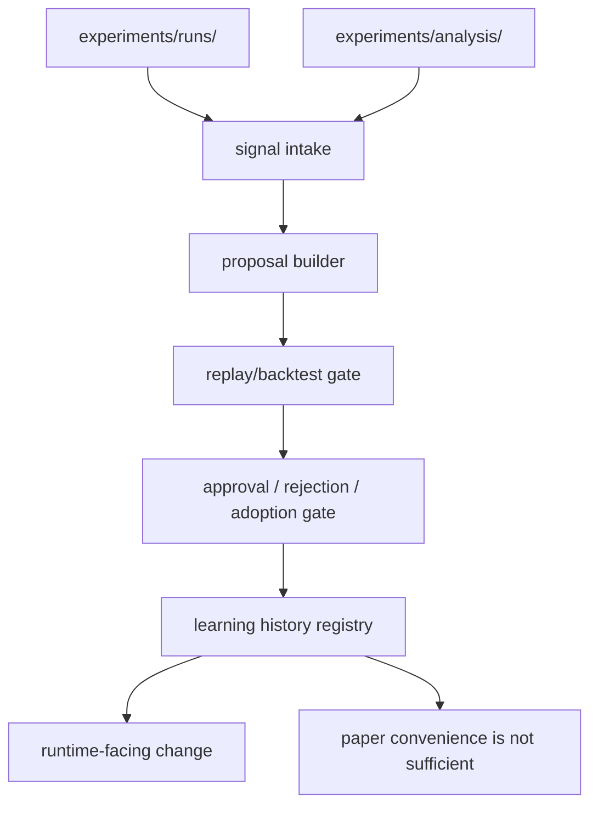

# Design Document

## Overview

`dual-reviewer-self-improvement` は、runtime evidence と evaluation analysis を入力にして、runtime / prompt / policy / schema / workflow を evidence-driven に改善する learning layer である。

本 design の役割は、次を concrete に定義することにある。

- improvement input の分類
- proposal artifact の構造
- replay / backtest artifact の構造
- approval / adoption / rollback の state flow

この feature は runtime の一部ではない。runtime から出た evidence と evaluation から出た analysis を読んで、改善候補を formal artifact に変換する。

## Goals

- improvement を intuition ではなく artifact-driven にする
- valid run と invalid run の学習価値を分離して扱う
- proposal ごとの採否理由を保存する
- replay / backtest を proposal ごとの検証工程として残す
- rollback も学習履歴として保持する
- project-specific signal を meta-pattern 候補へ抽象化できるようにする

## Non-Goals

- runtime 変更の自動適用
- prompt の自動膨張
- paper convenience のための change justification
- external contributor network の intake

## Design Drivers

- raw run evidence と analysis artifact は immutable
- invalid run は比較評価には使わないが、workflow defect 学習には使える
- adopted change は proposal artifact と version update に紐づいていなければならない
- proposal は `runtime quality`、`workflow quality`、`evidence quality` のどれを改善するのかを明示する

## Architecture

self-improvement は `signal intake -> proposal generation -> test gate -> decision gate -> history registry` の 5 段に分ける。



### Components

- `signal intake`
  - runtime / evaluation artifact から改善信号を抽出
- `proposal builder`
  - structured proposal を作る
- `test gate`
  - replay または lighter backtest を実行
- `decision gate`
  - human approval を通す
- `history registry`
  - accepted / rejected / rolled back を保存

## Learning Artifact Layout

self-improvement の正本出力先は `learning/` 配下とする。

```text
learning/
├── findings/
│   ├── recurring_failure_signals.json
│   ├── workflow_failure_signals.json
│   └── pattern_candidates.json
├── proposals/
│   ├── proposal_index.json
│   └── <proposal_id>.yaml
├── backtests/
│   ├── backtest_index.json
│   └── <proposal_id>.json
├── templates/
│   └── workflow_remediation_templates.json
├── approved-updates/
│   └── adoption_register.json
├── rejected-updates/
│   └── rejection_register.json
└── rollback/
    └── rollback_register.json
```

### Placement Rationale

- `findings/`
  - 改善前の signal inventory
- `proposals/`
  - proposal 正本
- `backtests/`
  - 検証 artifact
- `templates/`
  - recurring workflow failure mode に対する remediation template
- `approved-updates/`
  - 採用履歴
- `rejected-updates/`
  - 却下履歴
- `rollback/`
  - rollback 履歴

## Input Model

### 1. Input Classes

self-improvement は入力を 3 class に分ける。

- `review_quality_signal`
  - false negative / false positive / unstable judgment など
- `workflow_failure_signal`
  - invalidation、sign-off violation、artifact missing など
- `evidence_quality_signal`
  - analysis_blocked、missing metadata、caveat concentration など

### 1.5 v2 Supporting Inputs

generic execution layer v2 が存在する場合、self-improvement は次を supporting input として読んでよい。

- `run_manifest.yaml`
  - provenance、treatment、phase/profile の確認用
- `v2/signal_linkage_note.json`
  - runtime 側が見つけた signal linkage の補助情報
- `v2/trace_note.json`
  - motivating evidence へ遡るための trace 情報
- `derived/comparison_eligibility_note.json`
  - standard comparison へ入れなかった理由の補助情報

ここでのルール:

- primary signal owner は引き続き self-improvement / evaluation 側に置く
- 上記 artifact は proposal-ready signal inventory の代わりではなく、signal extraction を助ける supporting input として使う
- supporting input を読めなくても self-improvement の基本 flow は維持される

### 2. Valid vs Invalid Inputs

input の価値は run validity と独立ではない。次のように扱う。

- valid runs
  - review quality 改善の一次入力
- invalid runs
  - workflow / validation / contamination 防止の一次入力
- exploratory runs
  - hypothesis seed には使えるが、adoption 根拠としては弱い

proposal artifact は、どの input class とどの evidence maturity に依拠するかを必ず記録する。

## Signal Extraction Model

### 1. Runtime-Derived Signals

runtime 由来の signal 例:

- repeated defer clusters
- high reject concentration
- frequent skip-marker misuse
- repeated invalidation categories
- repeated signal linkage to the same unresolved gap

### 2. Evaluation-Derived Signals

evaluation 由来の signal 例:

- treatment-specific quality drop
- phase-specific caveat concentration
- low acceptance ratio in `design` or `tasks`
- repeated `analysis_blocked`
- repeated comparison-ineligible reasons

`findings/recurring_failure_signals.json` は、こうした signal を proposal 前に整理した inventory とする。

### 2.5 Proposal Normalization Rules

self-improvement は signal 1 件ごとに必ず proposal 1 件を作る必要はない。proposal builder は review ergonomics を保つため、次の正規化を行ってよい。

- 同一 run に由来する closely-coupled workflow failure signal は 1 proposal に統合してよい
- 典型例として `validator_failed` と `invalidation_marker_issued` は、同一 invalid run で同時に出た場合 `invalid-run prevention / invalidation handling` の 1 workflow proposal にまとめてよい
- 逆に aggregate caveat signal は caveat code ごとに proposal identity を分ける

この正規化の目的は、同じ remediation surface を複数 proposal に分断しないことと、独立に判断すべき aggregate caveat を過度に併合しないことにある

### 3. Project-Specific Pattern Extraction

self-improvement は、project 固有知識を repo 外 memory に蓄積するのではなく、runtime / evaluation artifact から抽出して repo 内 artifact に固定する役割も持つ。

初版の抽出 flow:

1. runtime / evaluation から recurring signal を抽出
   - 必要に応じて `v2/signal_linkage_note.json`、`v2/trace_note.json`、`derived/comparison_eligibility_note.json` を補助入力として使う
2. signal を project-specific pattern candidate として整理
3. 必要に応じて meta-pattern 候補へ抽象化
4. proposal や将来の pattern asset 改訂へ接続

project-specific / meta-pattern candidate が十分に安定した場合、self-improvement はそこから operator-facing remediation template を派生させてよい。初版では、invalid-run triage の recurring failure mode を `learning/templates/workflow_remediation_templates.json` に落とし、次回 triage の再利用可能な checklist と recommended action を保存する。

downstream protocol artifact が runtime validation summary を持つ場合、その summary payload は共通 contract に従うべきである。初版では `scripts/track_runs/contracts/runtime_validation_summary.schema.json` を canonical contract とし、track ごとの artifact 名が異なっても payload shape は揃える。

このとき区別するもの:

- project-specific concrete
  - 特定 project の事例、文脈、用語に依存するもの
- meta-pattern candidate
  - 他 project でも再利用可能そうな抽象化

これにより、learning loop が「個別失敗の記録」で終わらず、pattern layer の成長へつながる。

## Proposal Model

### 1. Proposal Unit

proposal は 1 改善仮説 = 1 artifact とする。

`learning/proposals/<proposal_id>.yaml` は少なくとも次を持つ。

- `proposal_id`
- `status`
- `target_layer`
- `motivation_class`
- `source_evidence_refs`
- `source_origin`
- `source_repository_refs`
- `source_admission_refs`
- `problem_statement`
- `proposed_change_summary`
- `expected_benefit`
- `possible_risks`
- `required_test_mode`
- `created_at`

### 2. Target Layers

`target_layer` の初版 enum:

- `prompt`
- `policy`
- `schema`
- `runtime`
- `workflow`

これにより「品質改善なのか、workflow 改善なのか」を曖昧にしない。

`source_origin` の初版 enum:

- `central_local_run`
- `imported_external_bundle`
- `manual_review_record`

### 3. Proposal States

proposal state は次を採る。

- `draft`
- `awaiting_test`
- `tested`
- `approved`
- `rejected`
- `adopted`
- `rolled_back`

### 4. Review Prioritization Notes

proposal review の初期優先順は次を推奨する。

- workflow proposal
  - invalid run 防止、analysis intake 完全性、close 条件の明確化を優先
- schema / evidence proposal
  - downstream analysis の解像度に直接効くものを次点とする
- prompt / policy proposal
  - exploratory-only evidence 由来のものは hold 候補として扱う

aggregate caveat proposal では、`single_treatment_only` のような comparison impossibility 系 caveat を、`low_sample_size` のような cautionary caveat より先に review してよい

## Replay and Backtest Model

### 1. Test Mode Selection

proposal ごとに `required_test_mode` を持たせる。

- `replay`
  - step-level evidence を再評価する必要がある場合
- `backtest`
  - existing analysis artifact に対する軽量検証で足りる場合
- `manual_review`
  - artifact comparison と人間判断が主になる場合

### 2. Replay Inputs

replay は runtime の step-level artifact を読む。

最低入力:

- `review_case.json`
- relevant `steps/*.json`
- decision units
- validator / invalidation artifacts
- `run_manifest.yaml`
- optional: `v2/trace_note.json`
- optional: `v2/signal_linkage_note.json`

imported external bundle を replay 入力に使う場合でも、proposal と backtest artifact には元の `source_repository_id`、`source_revision`、`admission_status` を残す。

local run を replay 入力に使う場合、run root 解決は fixture 名や固定 path の列挙に依存してはならない。
canonical な解決 anchor は `run_manifest.yaml` と `run_id` とし、replay input preparation は manifest-based discovery で run root を解決する。
これにより、新しい local fixture や generated local run を追加しても replay readiness が false negative にならないようにする。

特に Step B と Step C の挙動に関わる proposal では、step-level replay を必須にする。

### 3. Backtest Inputs

backtest は evaluation output を読む。

最低入力:

- `run_classification_index.json`
- `run_metrics.json`
- `finding_metrics.json`
- `caveat_register.json`
- optional: `derived/comparison_eligibility_note.json`

### 4. Test Result Artifact

`learning/backtests/<proposal_id>.json` は少なくとも次を持つ。

- `proposal_id`
- `test_mode`
- `input_refs`
- `input_origin_refs`
- `result_label`
- `observed_effect`
- `risk_observations`
- `tested_at`

`result_label` の初版 enum:

- `supported`
- `unsupported`
- `inconclusive`
- `untested`

`untested` は proposal state と矛盾しないように、`awaiting_test` から `tested` への遷移条件を制御する。

## Decision and Adoption Model

### 1. Approval Gate

human approval が必要な対象:

- prompt change
- policy change
- schema change
- runtime-affecting workflow change

`approved` は proposal の採否判断であり、実際に repo change が入ったことをまだ意味しない。

### 2. Adoption Gate

`adopted` になる条件:

1. proposal が `approved`
2. required test artifact が存在
3. repo change が version update と結びつく

`approved-updates/adoption_register.json` は proposal と実際の repo change を結ぶ registry とする。

### 3. Rejection Model

rejection は失敗ではなく履歴である。`rejected-updates/rejection_register.json` には少なくとも次を残す。

- `proposal_id`
- `rejection_reason`
- `rejected_at`
- `reviewer_note`

## Rollback Model

rollback は supersession と分けて扱う。

- supersession
  - より新しい改善に置き換わる
- rollback
  - 採用した change が有害だったため戻す

`rollback/rollback_register.json` は少なくとも次を持つ。

- `proposal_id`
- `adopted_change_ref`
- `rollback_reason`
- `rollback_trigger_signal_refs`
- `rolled_back_at`

rollback も次の proposal の input になりうる。

## Separation from Paper Narrative

self-improvement は paper-facing motivation を proposal reason として単独採用しない。

許容されない例:

- 表を綺麗にしたいので runtime field を変える
- 論文の主張に都合がよいので exploratory evidence を valid 扱いにする

paper convenience は caveat 整理や export 層で扱い、runtime-affecting proposal の主理由にはしない。

## Interfaces to Other Features

### Runtime

self-improvement は runtime に直接書き戻さない。採用済み proposal を通じて次の feature change に変換される。

### Evaluation

evaluation は self-improvement の主要 signal source である。特に invalid / exploratory 分布、phase-aware metrics、caveat register が入力になる。

### Paper-Interface

paper-interface は self-improvement proposal を narrative source として扱わない。必要なら adopted changes の履歴を methodology note として参照するだけに留める。

## Key Decisions

### Decision 1: Proposal is the unit of change intent

「なんとなく改善した」は許さず、proposal artifact を必須にする。

### Decision 2: Invalid runs are learning signals, not quality evidence

invalid run は workflow defect 改善には使えるが、quality gain claim には使わない。

### Decision 3: Approval and adoption are separate states

承認済みでも、repo 反映と version update がなければ adopted ではない。

### Decision 4: Rollback remains part of learning history

失敗改善も消さずに次の改善入力へつなげる。

## Requirements Traceability

| Requirement | Design Response |
|------------|-----------------|
| Improvement input definition | 3 input class と validity-aware input policy を定義 |
| Proposal artifact contract | proposal unit と state model を定義 |
| Replay and backtest requirements | test mode selection と result artifact を定義 |
| Approval and adoption flow | approval gate と adoption register を定義 |
| Rollback and failure handling | rollback registry と supersession 区別を定義 |
| Separation from paper narrative | paper convenience 禁止ルールを定義 |

## Open Issues for Design Alignment Gate

- proposal から repo version update をどう参照するか
- schema change proposal の最小 replay 要件
- workflow-only proposal に replay を要求する境界
- paper-interface に見せる adopted change 履歴の粒度

## Completion Criteria

- valid / invalid / exploratory の signal をどう使い分けるか説明できる
- proposal、backtest、adoption、rollback artifact の所在を説明できる
- approval と adoption の違いを説明できる
- runtime / evaluation / paper-interface との境界を説明できる
