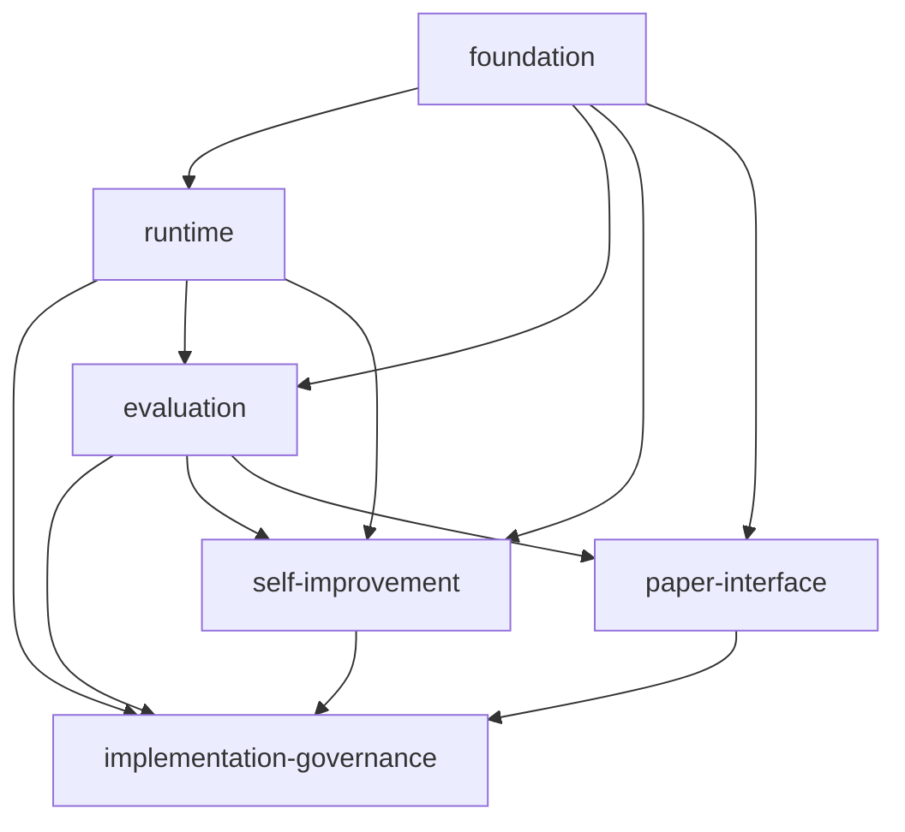

# Phase and Feature Dependency Map

_作成日: 2026-05-09_  
_対象: `dual-reviewer-rebuild` 全体_

## 1. 目的

この文書は、`dual-reviewer-rebuild` の spec progression における

- phase 間依存
- feature 間依存
- review wave / alignment gate の進行順

を明示するための dependency map である。

目的:

- `tasks wave` を feature ごとに無秩序に起こさない
- `requirements` / `design` / `tasks` の各段で何が先行条件かを明確にする
- `cc-sdd` の multi-feature 開発で、どの gate をどの順で通すべきかを迷わないようにする

本書は `/kiro-discovery` 相当の役割を、この repo の current process に合わせて明文化した補助正本である。

## 2. 依存の見方

本書では依存を 3 種に分ける。

- `hard dependency`
  - 先行 feature / phase が固まらないと後続を書き切れない
- `interface dependency`
  - 後続は書けるが、shared field や artifact shape の整合確認が必要
- `review dependency`
  - 上流 review と alignment gate を通過してから次段へ進む必要がある

## 3. Phase Dependency

## 3.1 Spec Progression

`cc-sdd` の正方向依存は次の通り。

1. `intent`
2. `requirements`
3. `design`
4. `tasks`
5. `implementation`
6. `implementation conformance review`

ルール:

- 下流 phase は上流 phase の approved 状態に依存する
- 同 phase に修正が入ったら、その phase の alignment gate を再実施する
- 上流 phase に修正が入ったら、完了済みの下流 phase も reopen 対象になる
- `intent` に修正が入った場合は、影響を受ける `requirements`、`design`、`tasks`、必要なら `implementation` を連鎖的に reopen 対象とする

## 3.2 Review Progression

manual review も同じ順で流れる。

1. `intent review`
2. `requirements review wave`
3. `design review wave`
4. `tasks review wave`
5. `implementation conformance review`

review dependency:

- review wave の finding を反映して同じ phase が変わったら、次の review wave に進む前に同 phase の alignment recheck が必要
- `intent review` の変更は、少なくとも `requirements review wave` から下流をやり直す起点になる

## 4. Feature Dependency

## 4.1 Topology

## 4.2 Foundation

役割:

- shared contract
- metadata naming
- schema relationships
- prompt / pattern placement

依存の種類:

- runtime に対して `hard dependency`
- evaluation / self-improvement / paper-interface に対して `hard dependency`

理由:

- metadata field
- schema shape
- review-mode vocabulary
- provenance field naming

が foundation owner だからである。

## 4.3 Runtime

役割:

- review orchestration
- raw evidence production
- portable evidence bundle export

依存の種類:

- foundation に対して `hard dependency`
- evaluation に対して `interface dependency`
- self-improvement に対して `interface dependency`

理由:

- runtime は foundation schema に従って raw evidence を出す
- evaluation はその artifact shape と provenance field を読む
- self-improvement は step-level replay と decision artifact に依存する

## 4.4 Evaluation

役割:

- raw / imported evidence intake
- validity / admission classification
- metrics / comparisons / caveats

依存の種類:

- foundation に対して `hard dependency`
- runtime に対して `hard dependency`
- self-improvement に対して `hard dependency`
- paper-interface に対して `hard dependency`

理由:

- runtime-produced evidence がないと standard evaluation は成立しない
- self-improvement と paper-interface は evaluation output を一次入力とする

## 4.5 Self-Improvement

役割:

- signal intake
- proposal generation
- replay / backtest
- adoption / rollback history

依存の種類:

- foundation に対して `hard dependency`
- runtime に対して `interface dependency`
- evaluation に対して `hard dependency`

理由:

- replay は runtime artifact に依存する
- proposal quality, exclusion, imported evidence admission は evaluation output に依存する

## 4.6 Paper-Interface

役割:

- claim mapping
- paper-facing bundles
- caveat-preserving reporting fragments

依存の種類:

- foundation に対して `hard dependency`
- evaluation に対して `hard dependency`
- runtime に対して `no primary dependency`

理由:

- paper-interface は runtime raw artifact を standard source にしない
- paper-facing provenance は evaluation output 経由で継承する

## 4.7 Implementation-Governance

役割:

- implementation completion rule
- post-implementation conformance review
- review artifact / metric governance

依存の種類:

- runtime に対して `review dependency`
- evaluation に対して `review dependency`
- self-improvement に対して `review dependency`
- paper-interface に対して `review dependency`

理由:

- governance は feature implementation 後の artifact と smoke pass を前提にする
- feature data contract を生成するのではなく、completion gate を追加する

## 5. Phase-by-Phase Generation Order

## 5.1 Requirements Wave

順序:

1. `foundation`
2. `runtime`
3. `evaluation`
4. `self-improvement`
5. `paper-interface`
6. `requirements alignment gate`
7. `implementation-governance`

注意:

- 実際には 1 つ書き切って終わりではなく、wave として横に広げてから alignment する
- `paper-interface` は consumer なので最後でよい
- implementation-governance は feature requirements を横断して completion rule を定義するため最後に置く

## 5.2 Design Wave

順序:

1. `foundation`
2. `runtime`
3. `evaluation`
4. `self-improvement`
5. `paper-interface`
6. `design alignment gate`
7. `implementation-governance`

理由:

- foundation が metadata / schema / provenance の concrete placement を持つ
- runtime が raw evidence と export を concrete 化する
- evaluation が intake / admission / metrics を concrete 化する
- self-improvement が proposal provenance を concrete 化する
- paper-interface は最後に evaluation output consumer として整える
- implementation-governance は feature design 完了後に post-implementation gate を定義する

## 5.3 Tasks Wave

推奨順序:

1. `foundation tasks`
2. `runtime tasks`
3. `evaluation tasks`
4. `self-improvement tasks`
5. `paper-interface tasks`
6. `tasks alignment gate`
7. `implementation-governance tasks`

理由:

- foundation tasks が shared schema / metadata / prompt assets を作る
- runtime tasks が raw evidence と export path を作る
- evaluation tasks が intake / admission / analysis path を作る
- self-improvement tasks が proposal / backtest / provenance linkage を作る
- paper-interface tasks は evaluation output contract が定まった後に作る
- implementation-governance tasks は prototype 実装後の review gate と validator を定義する

## 6. Current Blocking Points Before Tasks

現時点では `requirements` と `design` は approved だが、tasks wave 前に次を前提としておく。

- foundation metadata contract が shared owner
- runtime export は raw run directory の正本性を壊さない
- evaluation admission は runtime export と別責務
- self-improvement proposal provenance は imported evidence を追跡する
- paper-interface は evaluation consumer のまま据え置く

## 7. Tasks Alignment Checklist

`tasks alignment gate` で最低限見るべき依存は次だ。

- foundation artifacts を runtime/evaluation が参照可能になる順序
- runtime export 実装より前に foundation provenance field が固まっているか
- evaluation intake 実装より前に runtime export manifest shape が固まっているか
- self-improvement proposal template 実装より前に evaluation admission artifact が固まっているか
- paper-interface bundle 実装より前に evaluation comparison artifact field naming が固まっているか

## 8. Process Rule

この dependency map は planning memo ではなく、phase progression の補助正本として扱う。

次の場合は更新対象とする。

- feature の新設、統合、廃止
- shared owner の変更
- `requirements` または `design` で依存方向が変わる修正
- `tasks wave` の実際の blocking dependency が本書と一致しないと分かった場合
- implementation completion rule が変更された場合

## 9. Current Conclusion

現時点の正しい進め方は、

- `requirements`: 完了
- `design`: 完了
- 次は `foundation -> runtime -> evaluation -> self-improvement -> paper-interface` の順で `tasks wave`
- `tasks alignment gate`
- implementation 後は `implementation conformance review`

である。
