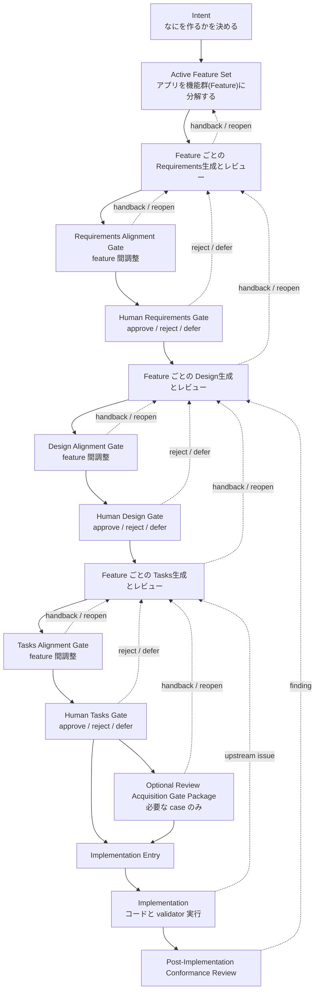

# dual-reviewer v2 user guide

## 0. ひとことで言うと

`dual-reviewer` v2 は、意図駆動開発における設計・タスク生成レビューの認知負荷を下げ、対話を通じて修正と品質判断を支援し、その結果を後から追える evidence として残すための review system である。

## 1. このガイドの役割

この文書は、`dual-reviewer` v2 を初めて使う人のための利用ガイドである。

特に、一般利用者が最初に知りたい次の 3 点を中心に説明する。

- この system のコンセプト
- 何ができるのか
- 実際にどう使うのか

そのうえで後半に、

- system 自体をどう改善するか
- 記録や報告をどう作るか

も補足する。

## 2. コンセプト

`dual-reviewer` v2 の本来の目的は、LLM とのソフトウェア協調設計において、意図駆動開発を支援することである。

一言で言うと、これは

- `LLM をフロントエンドにした対話型 review system`

である。

ここでの主対象は、単なるコード生成ではない。
意図駆動開発の中でも特に人の認知負荷が高くなりやすい

- `design`
- `tasks`
- 一部の `requirements`

の review と修正である。

この system は、人の代わりに最終判断をするものではない。
むしろ、

- 複雑な仕様や設計を読み解く
- 依存関係やズレを見つける
- 修正の波及先を整理する
- review の結果を evidence として残す

ことで、人が判断しやすくなるよう支援する。

## 3. 何を解決するのか

意図駆動開発では、上流から下流へ進むにつれて次の問題が起きやすい。

- 設計が複雑になり、依存関係を追いきれない
- task 分解が大きくなり、抜け漏れや順序ミスが増える
- 修正がどこまで波及するか見えにくい
- review の記録が会話で流れ、後から追えなくなる

`dual-reviewer` v2 は、この問題に対して

- 対話で review を進められること
- finding を evidence として残せること
- 必要ならどの phase に戻るべきかを示せること

を提供する。

つまり、目的は「自動化そのもの」ではなく、
`人の認知負荷を下げつつ、開発プロダクトの品質をガイドすること`
にある。

## 4. 意図駆動開発の流れ

`dual-reviewer` v2 は、単発のレビュー道具ではなく、
`intent` から始まる意図駆動開発の流れの中で使う。

利用者が最初に押さえるべき全体像は次である。

### 4.1 全体図

### 4.2 intent から feature を立てる

最初に書くのは `intent` である。
ここでは

- 何を目的にするか
- 何を目的にしないか
- どんな失敗を防ぎたいか

を決める。

そのあとで、`intent` を実現するための複数 feature を立てる。
この分解作業の主担当は LLM であり、LLM が feature 案を起こし、人間が active feature set として採否を判断する。

つまり順序は、

1. `intent` を決める
2. LLM が feature 分解案を作る
3. 人間が active feature set を決める
4. 各 feature を `requirements -> design -> tasks -> implementation` へ流す

である。

この repo では、feature は並列に存在してよいが、上位拘束は常に `intent` が持つ。

### 4.2.1 開始指示の最小形

開始時点でも、user が長い運転指示を書く必要はない。

たとえば

- `<case-slug> を intent から進めてください`

だけで十分である。

このときの既定動作は、

1. intent と source docs を読む
2. active feature set 案を作る
3. feature dependency order と open question を整理する
4. 最初の human gate input として提示する

である。

つまり、

- requirements を勝手に最後まで進めない
- design / tasks に自動で入らない
- implementation にも進まない

という stop rule が最初から組み込まれている。

言い換えると、開始指示は
`次の human gate まで進める`
短い command として使えるのが基本である。

### 4.2.2 参照ケースなしで始める

一般利用者は、特定の先行 case を手本にしなくても始められるべきである。

v2 では、新しい case は次のひな形から始める。

- bootstrap guide:
  - [reference-free-case-bootstrap-guide.md](/Users/Daily/Development/Rwiki-dev/.kiro/methodology/dual-reviewer-spec-driven-paper/reference-free-case-bootstrap-guide.md:1)
- bootstrap script:
  - `ruby dual-reviewer-rebuild/scripts/bootstrap_reference_free_case.rb <case-slug> --intent-source <path> --canonical-source <path>`

この bootstrap で最初に作るのは次である。

- umbrella `intent.md`
- umbrella `spec.json`
- case workflow overlay
- active worklist
- workflow path

つまり、新しい case の開始点は
`既存 case を真似すること`
ではなく
`ひな形を埋めて source を固定すること`
である。

### 4.3 各 feature で進む順序

各 feature は、基本的に次の順で進む。

1. `requirements`
2. `design`
3. `tasks`
4. 必要なら `review acquisition gate package`
5. `implementation`
6. `post-implementation conformance review`

ここで `review acquisition` は常に必要なわけではない。
例えば次のような case で使う。

- `reverse-engineered case`
  - 既存のコードや成果物を後から読み解き、仕様を整理し直しながら進める case
- `clean-room case`
  - 既存実装を写さず、仕様だけを手掛かりに新しく実装する case

こうした case では、
実装前に

- review boundary
- implementation snapshot
- 実装順序
- shared artifact owner

を固定したい場合にだけ差し込む optional extension である。

この段で使う implementation protocol と snapshot note も、
原則としてひな形から起こす。

- [implementation-phase-protocol-template.md](/Users/Daily/Development/Rwiki-dev/.kiro/methodology/dual-reviewer-spec-driven-paper/implementation-phase-protocol-template.md:1)
- [implementation-phase-snapshot-template.md](/Users/Daily/Development/Rwiki-dev/.kiro/methodology/dual-reviewer-spec-driven-paper/implementation-phase-snapshot-template.md:1)

つまり、実装に入る直前の確認段は通常

- `tasks` 承認
- 必要に応じた `review acquisition gate package`
- implementation entry

である。

### 4.4 複数 feature があるとき

複数 feature がある場合、1 feature を最後まで終わらせてから次へ行くとは限らない。
むしろ v2 では、phase ごとに横断して整合を見る。

各 phase の終端には次の feature 間調整がある。

- `requirements alignment gate`
- `design alignment gate`
- `tasks alignment gate`

ここで確認するのは主に次である。

- shared contract がずれていないか
- 責務境界が衝突していないか
- artifact placement や validator 接続が矛盾していないか
- 実装順序や blocker が破綻していないか

この調整は optional ではなく、multi-feature 開発では標準手順である。

また、ここで問題が見つかった場合は、その phase だけで閉じずに遡上して修正が入る。

- `requirements` review や alignment で問題が出たら、`requirements` を直し、必要なら `intent` や feature 分解まで戻る
- `design` review や alignment で問題が出たら、`design` だけでなく `requirements` まで戻ることがある
- `tasks` review や alignment で問題が出たら、`tasks` だけでなく `design` や `requirements` まで戻ることがある
- 上流 phase を修正した場合、その下流 phase は確定扱いにせず、対応する alignment gate をやり直す

したがって、multi-feature 調整は単なる横並び確認ではなく、`どこまで戻るべきか` を判断する review point でもある。

### 4.5 人の承認ゲート

各 phase は、文書を書いたら即次へ進むわけではない。
人の承認 gate を通す。

少なくとも次がある。

- human requirements gate
- human design gate
- human tasks gate
- 必要なら human review acquisition gate

承認時には、単に本文だけではなく gate package を見る。
repo では phase ごとに `phase evidence summary` のような summary を作り、

- local review artifact
- review wave artifact
- alignment memo
- workflow gate status

をまとめて gate の入口にする。

この gate package には、
`今ここで何を判断すればよいか`
も書く。

たとえば `requirements gate` なら主に次を見る。

- feature 分解が妥当か
- 責務境界が自然か
- acceptance criteria が足りているか
- 重要な方針選択に違和感がないか

逆に、実装方法や class 分割のような下流 detail は、まだここで決めない。

承認結果は少なくとも次のいずれかになる。

- `approve`
- `reject`
- `defer`

### 4.5.1 user 指示の最小形

利用体験として重要なのは、user が毎回

- `gate package を作ったところで止めてください`
- `まだ design には進まないでください`

のような stop 条件を細かく書かなくても進められることである。

v2 では、たとえば

- `requirements wave を進めてください`

と言われたら、既定で次までを含むものとして扱う。

1. feature ごとの requirements 起草
2. feature-local review
3. requirements review wave
4. requirements alignment gate
5. human requirements gate package 作成

そして、`design` には勝手に進まない。

同様に、

- `design wave を進めてください`

なら human design gate package まで、

- `tasks wave を進めてください`

なら human tasks gate package まで進み、その次の phase には自動で入らない。

つまり user は、phase 単位の短い指示だけで workflow を進められるのが基本である。

### 4.5.2 heuristic profile の最小方針

`heuristic profile` は、review を賢く見せるための飾りではない。
case 固有に本当に見たい contract だけを追加するための最小 layer である。

そのため v2 の既定方針は次である。

- 最初は minimal template から始める
- `heuristic_profile_ref` を明示しない場合でも、track ごとの minimal template を既定にしてよい
- 追加 rule は必要最小限にする

最小 template:

- implementation:
  - [implementation/_minimal_template.yaml](/Users/Daily/Development/Rwiki-dev/dual-reviewer-rebuild/experiments/protocols/heuristic_profiles/implementation/_minimal_template.yaml:1)
- intent:
  - [intent/_minimal_template.yaml](/Users/Daily/Development/Rwiki-dev/dual-reviewer-rebuild/experiments/protocols/heuristic_profiles/intent/_minimal_template.yaml:1)
- spec:
  - [spec/_minimal_template.yaml](/Users/Daily/Development/Rwiki-dev/dual-reviewer-rebuild/experiments/protocols/heuristic_profiles/spec/_minimal_template.yaml:1)

詳しい作り方は [heuristic_profiles/README.md](/Users/Daily/Development/Rwiki-dev/dual-reviewer-rebuild/experiments/protocols/heuristic_profiles/README.md:1) を見る。

### 4.5.3 各 gate で何を判断するか

wave が終わったら、system 側は human に
`この gate での判断点`
を分かりやすく説明する。

- `requirements gate`
  - feature 分解
  - 責務境界
  - acceptance criteria
  - 重要な運用方針
- `design gate`
  - interface
  - data flow
  - module / file placement
  - validation hook
- `tasks gate`
  - implementation order
  - blocker dependency
  - test sequencing
  - implementation entry readiness

加えて、
`今はまだ判断しなくてよいこと`
も一緒に示す。

これにより user は、毎回 gate の意味を自分で再解釈しなくて済む。

### 4.6 ワークフローを制御する文書

v2 を実際に運用するときは、spec 本文だけでは進行制御が足りない。
そのため、役割の違う制御文書がある。

これらは主に maintainer / operator 向けの文書であり、一般利用者が毎回手で操作するものではない。
ただし、workflow がどう保たれているかを理解するには重要である。

#### `workflow-gate-status`

[workflow-gate-status.md](/Users/Daily/Development/Rwiki-dev/dual-reviewer-rebuild/docs/coordination/workflow-gate-status.md:1)
は、今どの gate まで通過したかを記録する台帳である。

これは

- 何が完了済みか
- どこが `reopen_required` か
- implementation conformance review まで進んだか

を確認するための current status board である。

通常は maintainer や operator が更新し、LLM は現在の artifact を読んで更新案を起草する。
ただし、どの gate を `completed` とみなすかの最終判断は人間が持つ。

#### `ACTIVE_WORKLIST`

[ACTIVE_WORKLIST.md](/Users/Daily/Development/Rwiki-dev/.kiro/methodology/dual-reviewer-spec-driven-paper/ACTIVE_WORKLIST.md:1)
は、現在地を固定する dynamic control board である。

役割は次に限る。

- current workflow step
- current blocker
- current action
- exit condition
- stop rule

重要なのは、`ACTIVE_WORKLIST` は workflow 手順そのものの正本ではない、という点である。
phase の順序や gate のルールは [HUMAN_WORKFLOW.md](/Users/Daily/Development/Rwiki-dev/dual-reviewer-rebuild/operations/HUMAN_WORKFLOW.md:1) が持つ。
`ACTIVE_WORKLIST` は「今この case で次に何をするか」を固定する。

通常は case owner や operator が current step を管理し、LLM は blocker 整理や next action の起草を補助する。
ただし、次の step を勝手に飛ばして決めることはしない。

#### `ECL`

[execution-control-ledger.md](/Users/Daily/Development/Rwiki-dev/.kiro/methodology/dual-reviewer-spec-driven-paper/execution-control-ledger.md:1)
は、Execution Control Ledger である。

これは current task board ではなく、

- case-specific hardcode の棚卸し
- remove すべき execution rule
- case manifest へ移すべき binding

を固定する redesign input ledger である。

つまり、

- workflow が順序と gate を決める
- `ACTIVE_WORKLIST` が current next step を指す
- `ECL` が再設計時に除去・移送すべき制約を指す

という分担で使う。

通常は maintainer や設計担当が `ECL` を管理し、LLM は hardcode の棚卸しや移送先整理を補助する。
ここでも、何を remove 対象とみなすかの最終判断は人間が持つ。

## 5. 何ができるか

一般利用者の視点では、v2 の主な機能は次の 5 つである。

### 5.1 review を依頼できる

仕様、設計、タスク、実装の棚卸しを会話で依頼できる。

例:

- `この design をレビューして`
- `tasks に抜け漏れがないか見て`
- `requirements と design の整合を見て`

### 5.2 finding と修正方針を受け取れる

review の結果として、

- 問題点
- 影響範囲
- 修正の優先度
- どの phase へ戻るべきか

を整理して受け取れる。

これは単なる要約ではなく、意図駆動開発の workflow に沿った guidance である。

### 5.3 修正後の再確認ができる

利用者は finding を受けて

- `この 3 点を直して`
- `design 側からやり直して`
- `修正後にもう一度確認して`

のように依頼できる。

system は修正後の状態も再度確認し、記録を残す。

### 5.4 run が使えるかどうかを分けて扱える

ここでいう `run` とは、1 回の review 実行単位であり、

- 何を対象にしたか
- どの protocol / prompt / runtime 条件で動いたか
- どんな結果になったか

をまとめて記録した単位を指す。

v2 では、実行結果を何でも同じように扱わない。

- 条件が揃った run は分析対象に入る
- 条件不足や validator failure がある run は invalid として分離される

invalid run には `invalid_run_triage_note` が付き、

- なぜ無効か
- どの check で止まったか
- 次にどこを見ればよいか

が分かる。

### 5.5 比較、改善、共有につなげられる

review は 1 回きりで終わらない。
有効な run が溜まると、

- 比較分析
- 改善提案
- 報告用整理

にもつなげられる。

ただし、これは一般利用の主目的というより、review を継続運用するための後段機能である。

## 6. 実際の使い方

通常の利用では、利用者は command より会話を中心に考えればよい。

### 6.1 まず何を伝えるか

最初に必要なのは、

- 何を review したいか
- 何を確認したいか
- 何を直したいか

の 3 つである。

例:

- `foundation の shared contract をレビューして`
- `この design は requirements とずれていないか`
- `open finding を修正して再確認して`
- `実装後の棚卸しをして`

### 6.2 返ってくるもの

典型的には次が返ってくる。

- finding の一覧
- 問題の重さ
- どこに影響するか
- 次に直すべき点
- 必要なら review artifact や run artifact

重要なのは、会話の回答だけでなく、後から追える artifact が残ることである。

### 6.3 典型的な利用シナリオ

#### シナリオ 1: 設計レビュー

1. 利用者が `この design をレビューして` と依頼する
2. system が関連する requirements / design / tasks を読む
3. finding と修正方針を返す
4. 必要なら review artifact を残す

#### シナリオ 2: タスク分解レビュー

1. 利用者が `tasks に抜け漏れがないか見て` と依頼する
2. system が task の順序、依存、検証観点を確認する
3. 抜け漏れや過不足を返す
4. 必要なら design への handback を示す

#### シナリオ 3: 修正して再確認

1. 利用者が `この finding を直して` と依頼する
2. system が必要な文書やコードを更新する
3. 再度 review か validator を行う
4. 修正後の状態を記録する

#### シナリオ 4: 実装後の棚卸し

1. 利用者が `実装後の棚卸しをして` と依頼する
2. system が run を整理し、必要なら validator を走らせる
3. valid / invalid を分ける
4. invalid なら triage note を返す

## 7. 利用者が知っておくとよい判断ポイント

この system は便利だが、最後の判断は人間が持つ。

利用者が主に判断するのは次である。

- 何を review 対象にするか
- finding を採用するか
- `approve` / `reject` / `defer` のどれにするか
- invalid run を意思決定に使わず止めるか
- runtime に影響する改善を採用するか

つまり、`LLM が提案する`、`validator が条件を確認する`、`人間が採否を決める` という分担で考えるとよい。

## 8. 利用者から見た v2 の構造

内部では v2 は 4 層に分かれている。
ただし、これは仕組みを理解するための補助知識であり、最初から全部を意識する必要はない。

| 層 | 利用者から見た意味 |
|------|------|
| runtime | 1 回の review や再確認を実行する層 |
| evaluation | どの run を比較や集計に使えるか判断する層 |
| self-improvement | 同じ問題の再発から改善提案を作る層 |
| paper-interface | 報告や共有に使う整理済み artifact を作る層 |

一般利用では、まず `runtime` を使う。
`evaluation`、`self-improvement`、`paper-interface` はその後に続く。

## 9. system 改善機能

ここからは一般利用の主目的ではなく、運用を続けるための補助機能である。

### 9.1 self-improvement とは何か

`self-improvement` は、複数 run から繰り返し起きる問題を見つけ、

- signal 抽出
- proposal 作成
- backtest / replay
- approve / reject

の形で改善提案にする機能である。

つまり、operator の勘で ad-hoc に直すのではなく、evidence に基づいて system を改善するための仕組みである。

### 9.2 一般利用者にとっての意味

一般利用者が直接 proposal を触らなくても、

- 同じ invalid run が繰り返される
- 同じ判断ミスが続く
- 同じ workflow gap が出る

といった現象が、後で改善対象として整理される。

## 10. 記録と報告の機能

review の価値は、その場の会話だけでは終わらない。
v2 では記録と報告のための機能も持つ。

### 10.1 何が残るか

主な出力先は次である。

| 場所 | 何が残るか |
|------|------|
| `experiments/.../runtime-runs/` | run ごとの実行記録 |
| `experiments/analysis/` | 比較、集計、coverage |
| `learning/` | 改善提案、backtest、template |
| `paper/reports/` | 共有向けの claim / evidence / reporting fragment |

### 10.2 何のために使うか

この記録により、

- 後から review の根拠を確認できる
- valid run だけで比較できる
- 改善の採否を追跡できる
- 報告や論文化の材料を作れる

ようになる。

ただし、報告都合で runtime の事実を書き換えない、という境界は維持される。

## 11. 初見の人への読み方

最初は次の順で読むと分かりやすい。

1. このガイドで全体像をつかむ
2. [README.md](/Users/Daily/Development/Rwiki-dev/dual-reviewer-rebuild/README.md:1) で repo の入口を見る
3. [INTENT.md](/Users/Daily/Development/Rwiki-dev/dual-reviewer-rebuild/intent/INTENT.md:1) で目的を確認する
4. [TRUST_BOUNDARY.md](/Users/Daily/Development/Rwiki-dev/dual-reviewer-rebuild/operations/TRUST_BOUNDARY.md:1) で責務分担を見る
5. 必要になったら [HUMAN_WORKFLOW.md](/Users/Daily/Development/Rwiki-dev/dual-reviewer-rebuild/operations/HUMAN_WORKFLOW.md:1) を読む
